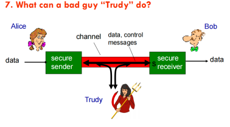

# 7.22 5310 exam copy

- Disagree. Even with an unchanged structure, threat landscapes, technologies, and compliance requirements evolve. Training content must be periodically updated to address new attack vectors, regulatory changes, and lessons learned.技术系统 (Technical Systems)，正式系统 (Formal Systems)，非正式系统 (Informal Systems)

w1 信息安全管理导论

- 4. 组织中的信息系统 / Information Systemsxs in Organizations

- 三层系统模型：

- Three-Level System Model:

- Technical Systems:

- Technology-enabled/automated parts of formal system

- Presupposes existence of formal system

- Plays supportive role to formal system

- Formal Systems:

- Defines all major 'official' information handling

- Rule-based and brings uniformity

- Following formal system is important

- Informal Systems:

- Represents organization's sub-culture

- Establishes meanings, understands intentions, forms beliefs

- Natural means to augment formal systems

- 技术系统：

- 正式系统中由技术驱动/自动化的部分

- 假设正式系统已存在

- 在正式系统中起支持作用

- 正式系统：

- 定义所有主要的“官方”信息处理流程

- 基于规则，带来一致性

- 遵循正式系统非常重要

- 非正式系统：

- 代表组织的次文化

- 建立意义、理解意图、形成信念

- 是对正式系统的自然补充方式

- 安全文化属于非正式系统，决定员工是否真正把培训内容转化为日常行为。

- Security culture—part of the informal system—drives whether employees internalise and act on training messages.

- 5. 信息安全控制类型 / Information Security Control Types

技术控制 (Technical Controls), 正式控制 (Formal Controls), 非正式控制 (Informal Controls):

Technical Controls:

- Authentication and access control

- Firewalls and DMZ

- Network segmentation

- End-point security

- Malicious content control

- Automation and AI detection

Formal Controls:

- Support technological controls

- Organizational level approach

- Implementing structured IS management

- Strategic direction

- Compliance with data protection legislation

Informal Controls:

- Security awareness training

- ]]]]Ongoing education and training programs

- Developing 'trusted' core members

- Establishing common belief system

- 技术控制：

- 身份验证与访问控制

- 防火墙与隔离区（DMZ）

- 网络分段

- 终端安全

- 恶意内容控制

- 自动化与人工智能检测

- 正式控制：

- 支持技术控制措施

- 组织层面的管理方法

- 实施结构化的信息安全管理

- 战略方向指导

- 遵守数据保护法律法规

- 非正式控制：

- 安全意识培训

- 持续的教育与培训项目

- 培养“可信”的核心成员

- 建立共同的信念体系

- 【例题】 ✅ Technical Control 技术控制：

- 控制措施 / Control：部署入侵检测和防御系统（IDS/IPS）

- 解释 / Explanation：通过实时监控网络流量与系统活动，快速识别并阻止未授权访问、恶意代码或漏洞利用行为。

- CIA 贡献 / CIA Contribution：

- Confidentiality（机密性）：阻止未授权访问敏感数据。

- Integrity（完整性）：检测并防止数据被篡改或注入恶意指令。

- Availability（可用性）：防止拒绝服务攻击，保障系统持续运行。

- ✅ Informal Control 非正式控制：

- 控制措施 / Control：开展定期的员工安全意识分享会（如“午餐与学习”Lunch & Learn）

- 解释 / Explanation：通过轻松非正式的形式，提升员工对常见安全风险（如钓鱼、弱密码、社工攻击）的认知与应对能力。

- CIA 贡献 / CIA Contribution：

- Confidentiality（机密性）：减少因员工疏忽泄露敏感信息的风险。

- Integrity（完整性）：让员工了解社交工程攻击对数据篡改的影响。

- Availability（可用性）：避免因人为错误导致系统中断或感染恶意软件。

- ✅ Technical Control:  
Control Measure: Deploy Intrusion Detection and Prevention Systems (IDS/IPS)  
Explanation:  
By monitoring network traffic and system activities in real time, IDS/IPS can quickly identify and block unauthorized access, malicious code, or exploitation of vulnerabilities.

- CIA Contribution:

- Confidentiality: Prevents unauthorized access to sensitive data.

- Integrity: Detects and prevents data tampering or injection of malicious commands.

- Availability: Prevents denial-of-service attacks, ensuring continuous system operation.

- ✅ Informal Control:  
Control Measure: Conduct regular employee security awareness sessions (e.g., “Lunch & Learn”)  
Explanation:  
Through relaxed and informal formats, these sessions enhance employee awareness of common security risks such as phishing, weak passwords, and social engineering, and teach them how to respond effectively.

- CIA Contribution:

- Confidentiality: Reduces the risk of sensitive information being leaked due to employee negligence.

- Integrity: Helps employees understand how social engineering attacks can impact data integrity.

- Availability: Prevents system disruptions or malware infections caused by human error.

- 6. 控制的有效性 / Control Effectiveness

关键洞察：

- 仅有技术控制往往不够

- 技术和正式控制的结合仍可能不足

- 人为错误是主要安全风险因素

- 需要技术、正式和非正式控制的综合方法

示例问题：

- 数据泄露常涉及人为错误

- 社会工程攻击利用人的弱点

- 内部威胁绕过技术控制

Key Insights:

- Technical controls alone are often not enough

- Combination of technical and formal controls may still be insufficient

- Human error is major security risk factor

- Need comprehensive approach with technical, formal, and informal controls

Example Issues:

- Data breaches often involve human error

- Social engineering attacks exploit human weaknesses

- Insider threats bypass technical controls

- 控制的有效性 / Control Effectiveness

- 上面的任何一层都不能缺失

- Technical + Formal + Informal = Effective Security

- Security requires all three control types working

- together - technical controls alone fail because

- humans are the weakest link.

- 安全需要三种控制类型的协同工作——单独的技术控制

- 会失败，因为人是最薄弱的环节

### 7. 制度化信息安全 / Institutionalizing Information Security

组织结构要素：

- 首席信息安全官 (CISO) 角色

- 政策和程序框架

- 访问权限与层级结构的关联

- 效率和有效性考虑

现实复杂性：

- 超越正式或技术系统方面

- 伦理和信任的重要性

- 保持沟通一致性

- 确保信息的正确解释

Organizational Structure Elements:

- Chief Information Security Officer (CISO) role

- Policy and procedural framework

- Linking access rights to hierarchical levels

- Efficiency and effectiveness considerations

Reality Complexity:

- Beyond formal or technical system aspects

- Importance of ethics and trust

- Maintaining communication consistency

- Ensuring proper information interpretation

w2 信息安全管理模型

### 1. 安全定义与目标 / Security Definition and Goals

Q1.6 什么是"安全"？

- 保护信息资产的价值

- 确保硬件、软件和数据的基本安全原则

五大安全原则：

- 机密性 (Confidentiality)

- 完整性 (Integrity)

- 可用性 (Availability)

- 身份验证 (Authentication)

- 不可否认性 (Non-repudiation)

What is "Secure"?

- Protecting valuable information assets

- Ensuring basic security principles for hardware, software, and data

Five Security Principles:

- Confidentiality

- Integrity

- Availability

- Authentication

- Non-repudiation

### 2. CIA三元组详解 / CIA Triad Detailed

机密性 (Confidentiality):

- 信息系统的属性，其信息仅向授权方披露

- 保护私有数据，无论其驻留位置或传输期间

- "需要知道"原则 vs "需要保留"原则

- 军事环境中"需要知道"有效，商业环境中"需要保留"更合适

完整性 (Integrity):

- 数据的无损状态，完整性和完全性状态

- 所有数据都被呈现和说明，无论是否准确或正确

- 简单定义：数据仅以指定和授权的方式更改时具有完整性

可用性 (Availability):

- 合法用户在需要时和需要的地方可以访问数据和服务

- 与可靠性方面相关

- 拒绝服务攻击是影响可用性的最著名例子

- 12.3三个基本原则是什么？

- Confidentiality:

- Property whereby information is disclosed only to authorized parties

- Protection of private data, during storage or transmission

- "Need-to-know" principle vs "need-to-withhold" principle

- Need-to-know works in military, need-to-withhold better for commercial

Integrity:

- Unimpaired condition of data, state of completeness and wholeness

- All data presented and accounted for, regardless of accuracy

- Simple definition: data has integrity when changed only in specified and authorized manner

Availability:

- Data and services accessible when and where needed by legitimate users

- Relates to reliability aspects

- Denial of service is best known example affecting availability

### 3. 身份验证与不可否认性 / Authentication and Non-repudiation

身份验证 (Authentication):

- 确保消息来自它声称的来源

- 第三方不应能够伪装成发送者或接收者

- 及时性是身份验证的重要属性

- 可审计性也是身份验证的重要方面

不可否认性 (Non-repudiation):

- 防止个人或实体否认执行了特定操作

- 随着电子通信依赖性增加和电子文档合法性维护，不可否认性变得至关重要

Authentication:

- Assures message is from source it claims to be from

- Third party should not masquerade as sender or recipient

- Timeliness is important attribute of authentication

- Auditability is also important aspect of authentication

Non-repudiation:

- Prevents individual or entity from denying having performed particular action

- Critical as business relies more on electronic communications and electronic document legality、

- 【例题】以下是针对 News Media Ltd 信息安全策略的三条建议性政策声明，中英文对照，旨在在无违规前提下进一步加强系统的安全性，提升 CIA 三要素（机密性、完整性、可用性）：

- 1. 强制启用多因素身份验证（MFA）政策

- Mandatory Multi-Factor Authentication (MFA) Policy

- 中：所有访问公司内部系统的用户（特别是处理敏感或机密数据的用户）必须启用多因素身份验证（MFA），可包括密码、生物识别、一次性验证码等组合方式。  
EN: All users accessing internal systems, especially those handling sensitive or confidential data, must authenticate using Multi-Factor Authentication (MFA), including but not limited to combinations of passwords, biometrics, or one-time passcodes.  
📌 有助于提升系统的机密性（Confidentiality），防止凭据被盗后直接登录系统。

- 2. 定期开展员工安全意识培训

- Regular Security Awareness Training Requirement

- 中：所有员工及外部承包商必须每年完成一次安全意识培训，内容涵盖钓鱼攻击、密码安全、数据分类、事件报告等。  
EN: All employees and contractors must complete annual security awareness training, covering topics such as phishing, password hygiene, data classification, and incident reporting.  
📌 有助于防范人为失误和社会工程攻击，提升系统完整性（Integrity）与可用性（Availability）。

- 3. 数据加密政策（静态与传输中）

- Data Encryption at Rest and in Transit Policy

- 中：所有敏感信息与个人数据在存储和传输过程中，必须采用行业标准加密协议（如 AES-256、TLS 1.3）进行加密。  
EN: All sensitive and personal information must be encrypted both at rest and during transmission using industry-standard encryption protocols (e.g., AES-256, TLS 1.3).  
📌 通过防止数据泄露或被篡改，强化机密性（Confidentiality）与完整性（Integrity）。

### 4. 漏洞与威胁 / Vulnerabilities and Threats

漏洞定义：

- "可被一个或多个威胁利用的资产或资产组的弱点" [ISO/IEC 13335-1:2004]

- "产品中可能允许攻击者破坏该产品完整性、可用性或机密性的弱点" [Microsoft]

- 存在于硬件、软件和数据中

威胁定义：

- "有可能造成损失或伤害的一系列情况" [Charles & Shari Pfleegar]

- "可能导致系统或组织受到伤害的不良事件的潜在原因" [ISO/IEC 13335-1:2004]

- 【例题】数据被滥用、设备被控制、通信被拦截等威胁

- Threats such as data theft, device control, and communication interception

- ·  Unauthorized Access to Devices  
设备被未经授权地访问：  
If your IoT devices (e.g., smart plug or light) are not secured properly, attackers could gain control over them remotely.  
如果你的 IoT 设备（比如智能插座或灯）没有妥善设置安全措施，攻击者可能远程控制它们。

- ·  Data Collection and Profiling  
数据收集与行为画像：  
Your usage patterns (when you turn on/off devices) can be collected and used to infer your daily routine or presence at home.  
你的使用习惯（比如几点开关灯）可能被收集，用来推测你是否在家或你的生活规律。

- ·  Cloud Service Breaches  
云服务被泄露：  
If the cloud platforms (e.g., IFTTT, Google, TP-Link) that manage automation are breached, attackers could access your personal data or device control.  
如果管理自动化流程的云服务平台（如 IFTTT、Google、TP-Link）被入侵，你的个人数据或设备控制权限可能被泄露。

- ·  Man-in-the-Middle Attacks  
中间人攻击：  
Unencrypted communication between your smartphone, router, and the IoT devices could be intercepted.  
如果你的设备通信（手机与插座/灯）没有加密，攻击者可以截获并篡改通信内容。

- ·  ·  Lack of Firmware Updates  
固件不更新导致的漏洞：  
Outdated firmware in IoT devices may have known vulnerabilities that hackers can exploit.  
如果 IoT 设备的固件未及时更新，攻击者可能利用已知漏洞入侵设备。

- ·

Vulnerability Definition:

- "Weakness of asset or group of assets that can be exploited by threats" [ISO/IEC 13335-1:2004]

- "Weakness in product that could allow attacker to compromise integrity, availability, or confidentiality" [Microsoft]

- Exist in hardware, software, and data

Threat Definition:

- "Set of circumstances that has potential to cause loss or harm" [Charles & Shari Pfleegar]

- "Potential cause of unwanted incident, which may result in harm to system or organization" [ISO/IEC 13335-1:2004]

### 5. 漏洞评估系统 / Vulnerability Assessment Systems

CVSS (通用漏洞评分系统):

- 基础组：代表漏洞的内在品质

- 威胁组：反映随时间变化的漏洞特征

- 环境组：代表用户环境独有的漏洞特征

- 补充组：提供上下文和描述外在属性

CVSS (Common Vulnerability Scoring System):

- Base group: represents intrinsic qualities of vulnerability

- Threat group: reflects characteristics that change over time

- Environmental group: represents characteristics unique to user's environment

- Supplemental group: provides context and describes extrinsic attributes

### 6. 漏洞类型 / Types of Vulnerabilities

六种主要漏洞类型：

修改 (Modification):

- 硬件、软件或数据未经授权被更改

- 更改的软件可能执行额外计算

销毁 (Destruction):

- 硬件、软件或数据被销毁

- 可能由环境、恶意意图或故障造成

披露 (Disclosure):

- 主要涉及数据

- 在没有适当同意的情况下使数据可用

- 对安全和隐私产生影响

Six Major Vulnerability Types:

Modification:

- Hardware, software, or data altered without authorization

- Altered software may perform additional computations

Destruction:

- Hardware, software, or data is destroyed

- May be caused by environment, malicious intent, or failure

Disclosure:

- Mostly about data

- Making data available without due consent

- Impact on security and privacy

拦截 (Interception):

- 未经授权访问资源

- 复制程序、数据或其他机密信息

- 拦截者可能使用一个位置的计算资源访问其他地方的资产

中断 (Interruption):

- 系统资产变得不可用或无法使用

- 主要影响可用性

伪造 (Fabrication):

- 将虚假交易插入网络或向现有数据库添加记录

- 未经授权的方在数据库中放置伪造对象

- 可能难以区分真实和伪造的对象

Interception:

- Unauthorized access to resources

- Copying of programs, data, or other confidential information

- Interceptor may use computing resources at one location to access assets elsewhere

Interruption:

- System assets become unavailable or unusable

- Primarily affects availability

Fabrication:

- Spurious transactions inserted into network or records added to existing database

- Counterfeit objects placed in database by unauthorized parties

- May be difficult to distinguish between genuine and forged objects

### 8. 信息安全基本原则 / Basic Principles of Information Security

原则1：绝对安全不存在

- 只要有足够的时间、工具、技能和动机，黑客可以突破任何安全措施

原则2：三个安全目标是机密性、完整性和可用性

- CIA三元组是信息安全的基础

原则3：纵深防御作为策略

- 在重叠层中实施安全

- 提供保护资产所需的三个要素：预防、检测和响应

- 一个安全层的弱点被两个或更多层的优势所抵消

Principle 1: There is no such thing as absolute security

- Given enough time, tools, skills, and inclination, hackers can break through any security measure

Principle 2: Three security goals are confidentiality, integrity, and availability

- CIA triad is foundation of information security

Principle 3: Defense in depth as strategy

- Implementing security in overlapping layers

- Provides three elements needed to secure assets: prevention, detection, and response

- Weaknesses of one security layer offset by strengths of two or more layers

### 9. 人员与技术原则 / People and Technology Principles

原则4：Q12.4 人们独自行动时倾向于做出最糟糕的安全决策

- 很容易说服某人为了琐碎或无价值的物品而放弃他们的凭据

- 许多人很容易被说服双击电子邮件中的附件或链接

原则5：计算机安全依赖于两种类型的需求：功能性和保证性

- 功能需求：描述系统应该做什么

- 保证需求：描述如何实施和测试功能需求

- 验证：确认满足一个或多个预定需求或规范的过程

- 验证：确定满足需求所用机制的正确性或质量

Principle 4: When left on their own, people tend to make worst security decisions

- Takes little to convince someone to give up credentials for trivial or worthless goods

- Many people easily convinced to double-click attachments or links in emails

Principle 5: Computer security depends on two types of requirements: functional and assurance

- Functional requirements: describe what system should do

- Assurance requirements: describe how functional requirements should be implemented and tested

- Verification: process of confirming predetermined requirements or specifications are met

- Validation: determination of correctness or quality of mechanisms used in meeting needs

### 10. 安全策略原则 / Security Strategy Principles

原则6：通过隐藏实现安全不是答案

- 主要基于隐藏重要信息和强制保密作为主要安全技术

- 可能降低攻击风险，但导致虚假的安全感

- 往往比不解决安全问题更危险

- 单纯匿名化不足以保证人口普查数据隐私

- 因为匿名化后仍可能被重新识别——攻击者可通过将准标识符与外部公开数据集关联，轻易恢复个人身份；simple anonymization is insufficient to protect census data privacy because individuals can still be re-identified.

- anonymised census records can still be re-identified by linking their quasi-identifiers with external datasets.

原则7：安全 = 风险管理，安全不是消除系统内的所有威胁，而是解决已知威胁并最小化损失

- 风险分析和风险管理是保护信息系统的中心主题

- 风险评估关注为资产分配经济价值以确定适当对策

Principle 6: Security through obscurity is not an answer

- Based primarily on hiding important information and enforcing secrecy as main security technique

- May reduce attack risk but leads to false sense of security

- Often more dangerous than not addressing security at all

Principle 7: Security = Risk Management

- Security not concerned with eliminating all threats but addressing known threats and minimizing losses

- Risk analysis and risk management are central themes to securing information systems

- Risk assessment concerned with placing economic value on assets to determine appropriate countermeasures

### 11. 控制类型与复杂性原则 / Control Types and Complexity Principles

原则8：三种安全控制类型是预防性、检测性和响应性

- 预防：通过保护层防止入侵（如守卫、锁门、访问控制）

- 检测：快速检测异常活动（如闭路电视、运动传感器、警报系统）

- 响应：触发自动锁门、通知警察或释放催泪瓦斯

原则9：复杂性是安全的敌人

- 系统越复杂，越难以保护

- 简单性有助于安全性

Principle 8: Three types of security controls are preventative, detective, and responsive

- Prevention: prevent compromise through protection layers (guards, locked doors, access controls)

- Detection: quickly detect unusual activity (CCTV, motion sensors, alarm systems)

- Response: trigger automatic door locking, police notification, or tear gas release

Principle 9: Complexity is the enemy of security

- More complex systems are harder to secure

- Simplicity aids security

### 12. 商业与技术整合原则 / Business and Technology Integration Principles

原则10：恐惧、不确定性和怀疑 (FUD) 在销售安全方面不起作用

- 信息安全经理必须使用行业技术来证明所有安全投资的合理性

- 当资源支出可以用良好、可靠的商业理由证明时，安全请求很少被拒绝

原则11：人员、流程和技术都是充分保护系统或设施所必需的

- 需要人员、流程和技术的结合

- 正式、非正式和技术控制都是必需的

原则12：漏洞的开放披露有利于安全

- 透明度有助于整体安全改善

Principle 10: Fear, uncertainty, and doubt (FUD) do not work in selling security

- Information security managers must justify all security investments using trade techniques

- When resource spending can be justified with good, solid business rationale, security requests are rarely denied

Principle 11: People, process, and technology are all needed to adequately secure system or facility

- Combination of people, process, and technology needed

- Formal, informal, and technical controls all required

Principle 12: Open disclosure of vulnerabilities is good for security

- Transparency helps improve overall security

### 13. 最易渗透原则 / Principle of Easiest Penetration

核心概念：

- "作恶者没有技术专家假设的价值观。他们通常坚持使用最容易、最安全、最简单的手段来实现目标。" [Donn Parker]

- 链条的强度取决于最薄弱的环节

- 分析最薄弱的点

- 强化一个控制/方面可能使另一个对作恶者更有吸引力

实施策略：

- 识别并加强最薄弱的环节

- 均衡各层防护强度

- 避免单点故障

Core Concept:

- "Perpetrators don't have values assumed by technologists. They generally stick to easiest, safest, simplest means to accomplishing objectives." [Donn Parker]

- Chain is only as strong as its weakest link

- Analyze weakest points

- Strengthening one control/aspect might make another more attractive to perpetrator

Implementation Strategy:

- Identify and strengthen weakest links

- Balance protection strength across layers

- Avoid single points of failure

- q 12.5 Security Through Obscurity Is Not an Answer通过隐蔽性实现安全并非答案

- It is based primarily on hiding important information and enforcing secrecy.其主要目的是隐藏重要信息和加强保密。

- It may reduce the risk of attacks.这可能会降低遭受攻击的风险。

- Although this seems logical, it’s actually untrue.尽管这看起来合乎逻辑，但实际上并不正确。

- Obscuring security leads to a false sense of security, which is often more dangerous than not addressing security at all5301 L2_INFO5301_Lectur….掩盖安全性会导致虚假的安全感 ，这通常比根本不解决安全性问题更危险

3.信息安全和密码学总结NFO5301

## INFO5301 Week 03 - Introduction to Network Security and Cryptography Summary

- 1. 网络基础知识 / Network Fundamentals

- 互联网的"硬件"视角：

- 数十亿连接的计算设备：主机 = 终端系统

- 运行网络应用程序

- 通信链路：光纤、铜线、无线电、卫星

- 传输速率：带宽

- 数据包交换机：转发数据包（数据块）

- 路由器和交换机

- Internet "nuts and bolts" view:

- Billions of connected computing devices: hosts = end systems

- Running network applications

- Communication links: fiber, copper, radio, satellite

- Transmission rate: bandwidth

- Packet switches: forward packets (chunks of data)

- Routers and switches

- 互联网协议：

- 控制消息的发送和接收

- 例如：TCP、IP、HTTP、Skype、802.11

- 互联网标准：RFC（征求意见）、IETF（互联网工程任务组）

- Internet Protocols:

- Control sending, receiving of messages

- Examples: TCP, IP, HTTP, Skype, 802.11

- Internet standards: RFC (Request for Comments), IETF (Internet Engineering Task Force)

- 互联网的服务视角：

- 为应用程序提供服务的基础设施

- Web、VoIP、电子邮件、游戏、电子商务、社交网络

- 为应用程序提供编程接口

- 提供类似邮政服务的服务选项

- Internet service view:

- Infrastructure that provides services to applications

- Web, VoIP, email, games, e-commerce, social nets

- Provides programming interface to apps

- Provides service options analogous to postal service

- 2. 协议和协议分层 / Protocols and Protocol Layering

- 什么是协议：

- 定义网络实体之间发送和接收消息的格式、顺序

- 定义消息传输、接收时采取的行动

- 人类协议："现在几点？""我有个问题"

- 网络协议：机器而不是人类，控制所有互联网通信活动

- What's a protocol:

- Defines format, order of messages sent and received among network entities

- Defines actions taken on message transmission, receipt

- Human protocols: "what's the time?" "I have a question"

- Network protocols: machines rather than humans, govern all Internet communication

- 为什么要分层：

- 处理复杂系统

- 明确识别复杂系统各部分的关系

- 分层参考模型便于讨论

- 模块化便于系统维护、更新

- 层的服务实现更改对系统其余部分透明

- Why layering:

- Dealing with complex systems

- Explicit structure allows identification of complex system's pieces

- Layered reference model for discussion

- Modularization eases maintenance, updating of system

- Change of layer's service implementation transparent to rest of system

- 互联网协议栈：

- 应用层：支持网络应用（FTP、SMTP、HTTP）

- 传输层：进程间数据传输（TCP、UDP）

- 网络层：数据报路由（IP、路由协议）

- 链路层：相邻网络元素间数据传输（以太网、WiFi、PPP）

- 物理层：线路上的比特

- Internet protocol stack:

- Application: supporting network applications (FTP, SMTP, HTTP)

- Transport: process-process data transfer (TCP, UDP)

- Network: routing of datagrams (IP, routing protocols)

- Link: data transfer between neighboring elements (Ethernet, WiFi, PPP)

- Physical: bits "on the wire"

- 3. 网络安全定义 / Network Security Definition

- 网络安全四要素：

- 机密性：只有发送者和接收者理解消息内容

- 发送者加密消息

- 接收者解密消息

- 消息完整性：确保消息未被更改

- 传输中或之后的更改能被检测

- 访问和可用性：服务必须可访问和可用

- 身份验证：确认通信双方身份

- Four elements of network security:

- Confidentiality: only sender, receiver understand message contents

- Sender encrypts message

- Receiver decrypts message

- Message integrity: ensure message not altered

- Alteration during transit or afterwards detected

- Access and availability: services must be accessible and available

- Authentication: confirm identity of each other

- 4. 网络威胁 / Network Threats

- 攻击者能做什么：

- 窃听：拦截消息

- 主动插入消息到连接中

- 冒充：伪造数据包源地址

- 劫持：接管正在进行的连接

- 拒绝服务：阻止他人使用服务、

- 钓鱼：钓鱼攻击主要依赖“人”的漏洞，而非恶意代码

- 钓鱼攻击常通过伪造邮件、网站诱导用户输入敏感信息Phishing attacks primarily exploit human vulnerabilities rather than malicious code.

- Phishing attacks often involve spoofed emails or websites that trick users into revealing sensitive information.

- What attackers can do:

- Eavesdrop: intercept messages

- Actively insert messages into connection

- Impersonation: spoof source address in packet

- Hijacking: take over ongoing connection

- Denial of service: prevent service from being used

- 具体攻击类型：

- 拒绝服务攻击(DoS)：

- 使资源对合法流量不可用

- 选择目标→入侵主机形成僵尸网络→发送攻击数据包

- 数据包嗅探：

- 在广播媒体上读取所有数据包

- 包括密码等敏感信息

- IP欺骗：

- 发送虚假源地址的数据包

- 恶意软件：

- 病毒：通过执行对象自我复制

- 蠕虫：通过被动接收自动执行

- 间谍软件：记录击键、网站访问

- 僵尸网络：用于垃圾邮件和DDoS

- Specific attack types:

- Denial of Service (DoS):

- Make resources unavailable to legitimate traffic

- Select target → break into hosts (botnet) → send attack packets

- Packet sniffing:

- Read all packets on broadcast media

- Including sensitive info like passwords

- IP spoofing:

- Send packet with false source address

- Malware:

- Virus: self-replicating by executing objects

- Worm: self-replicating by passive reception

- Spyware: record keystrokes, sites visited

- Botnet: used for spam and DDoS

- 5. 网络安全控制 / Network Security Controls

- 安全政策类型：

- 企业信息安全政策

- 特定问题安全政策

- 系统特定政策

- 指导组织内特定行为的准则

- Security policy types:

- Enterprise information security policy

- Issue-specific security policies

- System-specific policies

- Guidelines dictating behavior within organization

- 物理和硬件控制：

- 锁和门、入口警卫

- 物理场地规划

- 防火墙、IDS/IPS等安全设备

- 认证硬件

- 智能卡和访问控制电路板

- Physical and hardware controls:

- Locks and doors, guards at entry

- Physical site planning

- Security devices: firewalls, IDS/IPS

- Authentication hardware

- Smart cards and access control circuit boards

- 软件控制：

- 软件开发控制： 符合标准和方法论 测试和维护

- 操作系统控制： 保护系统和用户数据

- 安全配置检查清单

- 程序内控制： 输入、处理、输出级别的控制

- Software controls:

- Software development controls:

- Conformance to standards and methodologies

- Testing and maintenance

- Operating system controls:

- Protecting system and user data

- Secure configuration checklists

- Controls within programs:

- Controls at input, processing, output levels

- 四个关键软件控制：

- 加密：将数据转换为不可理解的形式

- 认证：验证实体声明的身份

- 授权：验证执行操作的权限

- 审计：监控访问行为

- Four key software controls:

- Encryption: transform data into incomprehensible form

- Authentication: verify claimed identity of entity

- Authorization: verify rights to perform action

- Auditing: monitor who accesses what and how

- 6. 密码学 / Cryptography

- 密码学定义：将消息从可理解形式转换为不可理解形式

- 在另一端再转换回来

- 使窃听者无法读取

- 使用加密和解密过程

- 使用加密算法（加密解密规则集）

- Cryptography definition:

- Convert messages from comprehensible to incomprehensible form

- Convert back at other end

- Render unreadable by eavesdroppers

- Uses encryption and decryption processes

- Uses encryption algorithm (rules for encryption/decryption)

- 密码学术语：

- m：明文消息（可理解形式）

- KA：密钥（秘密知识）

- KA(m)：密文（不可理解形式）

- m = KB(KA(m))：解密过程

- Cryptography terminology:

- m: plaintext message (comprehensible form)

- KA: key (secret knowledge)

- KA(m): ciphertext (incomprehensible form)

- m = KB(KA(m)): decryption process

- 对称密钥密码学：

- Bob和Alice共享相同密钥Ks

- 加密：KS(m)

- 解密：m = KS(KS(m))

- 问题：如何安全共享密钥？

- Symmetric key cryptography:

- Bob and Alice share same key Ks

- Encryption: KS(m)

- Decryption: m = KS(KS(m))

- Problem: how to share key securely?

- Q12.8 公钥密码学：

- 发送者和接收者不共享秘密密钥

- 公开加密密钥：所有人都知道

- 私有解密密钥：只有接收者知道

- RSA要求：

- KB+(KB-(m)) = m

- 从公钥KB+无法计算私钥KB-

- Public key cryptography:

- Sender, receiver don't share secret key

- Public encryption key: known to all

- Private decryption key: known only to receiver

- RSA requirements:

- KB+(KB-(m)) = m

- Cannot compute private key KB- from public key KB+

- 7. 身份验证 / Authentication

- 身份验证定义：

- 通过获取确凿证据确保身份

- 确认第二方实际参与协议

- 需要：确凿证据、两方过程、第二方参与

- Authentication definition:

- Assured through corroborative evidence of identity

- Confirm second party actually participated

- Needs: corroborative evidence, two-party process, second party involvement

- 确凿证据三要素：

- 拥有：用户拥有的东西

- 物理密钥、手机（短信）

- 固有特征：用户的生物特征

- 指纹、虹膜、面部、语音

- 知识：用户知道的东西

- 密码、安全问题

- Three factors of corroborative evidence:

- Possession: something user has

- Physical key, phone (SMS)

- SMS 是 “Short Message Service” 的缩写，意为“短消息服务”。它是一种在移动蜂窝网络中传递简短文本信息（通常上限 160 个字符）的通信协议，常见于手机之间的短信收发。

- English

- SMS stands for Short Message Service. It is a communication protocol in cellular networks that allows mobile devices to send and receive short text messages, typically limited to 160 characters per message.

- Inherence: something user is

- Fingerprints, iris, face, voice

- Knowledge: something user knows

- Passwords, security questions

- 认证协议演进：

- ap1.0：简单声明"我是Alice"→易被冒充

- ap2.0：包含IP地址→易被IP欺骗

- ap3.0：发送密码→易受重放攻击

- ap3.1：发送加密密码→仍易受重放攻击

- ap4.0：使用一次性随机数(nonce)→避免重放

- ap5.0：使用公钥加密和nonce→更安全

- Authentication protocol evolution:

- ap1.0: Simple "I am Alice" → easily impersonated

- ap2.0: Include IP address → IP spoofing possible

- ap3.0: Send password → replay attack vulnerable

- ap3.1: Send encrypted password → still replay vulnerable

- ap4.0: Use nonce → avoid replay

- ap5.0: Use public key and nonce → more secure

- 8. 数字签名 / Digital Signatures

- 数字签名特性：类似手写签名的密码学技术

- 证明文档所有者/创建者

- 可验证、不可伪造

- 不可否认性：可作为法律证据

- Q12.9 Digital signatures preserve the following core security principles:

- Integrity – Ensures the message has not been altered in transit.

- Authentication – Verifies the message is from a legitimate sender.

- Non-repudiation – Prevents the sender from denying they sent the signed message.

- Digital signature properties:

- Cryptographic technique analogous to handwritten signatures

- Establishes document owner/creator

- Verifiable, non-forgeable

- Non-repudiation: can be used as legal evidence

- 消息摘要：

- 对长消息公钥加密计算开销大

- 固定长度的数字"指纹"

- 哈希函数属性：

- 多对一映射

- 产生固定大小输出

- 从摘要无法反推原文

- Message digests:

- Public-key encrypting long messages computationally expensive

- Fixed-length digital "fingerprint"

- Hash function properties:

- Many-to-1 mapping

- Produces fixed-size output

- Cannot find message from digest

- 数字签名过程：

- Bob用私钥签名：KB-(m)

- Alice用Bob的公钥验证：KB+(KB-(m)) = m

- 如果相等，证明Bob签名

- 结合消息摘要：签名H(m)而非m

- Digital signature process:

- Bob signs with private key: KB-(m)

- Alice verifies with Bob's public key: KB+(KB-(m)) = m

- If equal, proves Bob signed

- Combined with message digest: sign H(m) not m

- 9. 公钥认证 / Public Key Certification

- 证书颁发机构(CA)：

- 将公钥绑定到特定实体

- 实体向CA注册公钥

- 实体提供身份证明

- CA创建数字签名的证书

- 证书包含实体公钥和身份信息

- Certification Authorities (CA):

- Bind public key to specific entity

- Entity registers public key with CA

- Entity provides proof of identity

- CA creates digitally signed certificate

- Certificate contains entity's public key and identity

- 证书使用过程：

- Alice需要Bob的公钥

- 获取Bob的证书

- 用CA的公钥验证证书

- 提取Bob的公钥

- 信任链：追溯到共同信任的CA

- Certificate usage process:

- Alice needs Bob's public key

- Gets Bob's certificate

- Verifies certificate with CA's public key

- Extracts Bob's public key

- Trust chain: traces back to commonly trusted CA

1. 入侵检测系统 / Intrusion Detection System

- 没写   太细了

- 包过滤：

- 仅对TCP/IP头部操作

- 会话间无相关性检查

- 基本的访问控制

- Packet filtering:

- Operates on TCP/IP headers only

- No correlation check among sessions

- Basic access control

- IDS功能：

- 深度包检查：查看数据包内容

- 检查病毒、攻击字符串

- 多数据包相关性分析：

- 端口扫描检测

- 网络映射检测

- DoS攻击检测

- IDS functions:

- Deep packet inspection: look at packet contents

- Check for virus, attack strings

- Multiple packet correlation:

- Port scanning detection

- Network mapping detection

- DoS attack detection

- IDS部署：

- 多个IDS在不同位置

- 不同类型的检查

- 基于签名的系统

- 基于异常的系统

- DMZ（非军事区）部署

- IDS deployment:

- Multiple IDSs at different locations

- Different types of checking

- Signature-based systems

- Anomaly-based systems

- DMZ (Demilitarized Zone) deployment

- 11. 网络漏洞 / Network Vulnerabilities

- 使网络易受攻击的因素：

- 匿名性：难以追踪攻击者

- 多个攻击点：许多潜在入口

- 资源共享：共享增加风险

- 系统复杂性：难以完全保护

- 不确定的边界：网络边界模糊

- 未知路径：数据路由不可预测

- 协议缺陷：设计或实现问题

- What makes networks vulnerable:

- Anonymity: difficult to trace attackers

- Multiple attack points: many potential entries

- Resource sharing: sharing increases risk

- System complexity: hard to fully protect

- Uncertain perimeter: blurred network boundaries

- Unknown path: unpredictable data routing

- Protocol flaws: design or implementation issues

- 12. 网络安全架构 / Network Security Architecture

- 设计原则：

- 网络分段：隔离不同安全级别

- 可用性架构：确保持续服务

- 避免单点故障：冗余设计

- 加密实施：

- 链路加密

- 端到端加密

- VPN（虚拟专用网）

- PKI（公钥基础设施）

- SSL/SSH协议

- Design principles:

- Network segmentation: isolate different security levels

- Architect for availability: ensure continuous service

- Avoid SPOF: redundancy design

- Encryption implementation:

- Link encryption

- End-to-end encryption

- VPN (Virtual Private Networks)

- PKI (Public Key Infrastructure)

- SSL/SSH protocols

- 强认证方法：

- 一次性密码(OTP)

- 挑战-响应认证

- Kerberos协议

- 访问控制列表(ACL)

- Strong authentication methods:

- One Time Password (OTP)

- Challenge-Response authentication

- Kerberos protocol

- Access Control Lists (ACL)

- 13. 安全系统类型 / Security System Types

- 防火墙类型：

- 包过滤器：基本过滤

- 状态包过滤器：跟踪连接状态

- 应用代理：应用层检查

- 二极管：单向数据流

- 端点防火墙：主机级保护

- Firewall types:

- Packet filters: basic filtering

- Stateful packet filters: track connection state

- Application proxies: application layer inspection

- Diodes: one-way data flow

- Endpoint firewalls: host-level protection

- IDS/IPS类型：

- 基于网络/基于主机

- 基于签名：已知攻击模式

- 基于启发式：异常行为检测

- 隐身模式：不可见监控

- IDS/IPS types:

- Network-based / Host-based

- Signature-based: known attack patterns

- Heuristics-based: anomaly behavior detection

- Stealth mode: invisible monitoring

- 其他安全系统：

- 数据泄露防护(DLP)：防止敏感数据外泄

- 内容扫描系统：病毒/恶意软件检测

- 安全邮件系统：邮件过滤和加密

- Other security systems:

- Data Leakage Protection (DLP): prevent sensitive data exfiltration

- Content scanning systems: virus/malware detection

- Secure email systems: email filtering and encryption

- 14. 政策和程序 / Policies and Procedures

- 政策层次：

- 企业级政策：总体原则声明

- 详细程序：具体工作流程

- 实施要素： 高管支持 员工认同 定期审查

- 持续改进

- Policy hierarchy:

- Enterprise-level policy: motherhood statements

- Detailed procedures: specific workflows

- Implementation elements:

- Executive support

- Employee buy-in

- Regular review

- Continuous improvement

w4 信息系统安全规范模型 / Models for Specification of Information Systems Security

- 1. 安全模型概述 / Security Models Overview

- 计算机安全的两个基本事实：

- 所有复杂软件系统最终都会暴露需要修复的缺陷或漏洞

- 构建不易受安全攻击的计算机硬件/软件极其困难

- 安全策略目标：防止未经授权的信息泄露，处理信息流、完整性和可用性

- 安全模型是安全策略的正式描述

- Two fundamental computer security facts:

- All complex software systems have eventually revealed flaws or bugs that need to be fixed

- It is extraordinarily difficult to build computer hardware/software not vulnerable to security attacks

- Goal of security policy: prevent unauthorized disclosure of information, dealing with information flow, integrity, and availability

- Security model is a formal description of a Security Policy

- 安全模型的用途：

- 记录安全策略

- 概念化和设计实现

- 检查实现是否满足要求

- 测试安全策略的完整性和一致性

- 理解安全与信任之间的关系

- Uses of security models:

- Document security policy

- Conceptualise and design an implementation

- Check if implementation meets requirements

- Test security policy for completeness and consistency

- Understand relation between Security and Trust

- 2. 安全策略类型 / Types of Security Policies

- 军事安全策略：

- 主要为提供机密性而开发的安全策略

- 也称为政府安全策略

- 重点保护信息不被泄露

- Military security policy:

- Security policy developed primarily to provide confidentiality

- Also called governmental security policy

- Focus on protecting information from disclosure

- 商业安全策略：

- 主要为提供完整性而开发的安全策略

- 关注谁更改信息而不是谁读取信息

- 适用于商业组织需求

- Commercial security policy:

- Security policy developed primarily to provide integrity

- Concerned with who changes information rather than who reads it

- Suitable for business organization needs

- 3. 安全与信任的属性 / Attributes of Security and Trust

- 安全属性 / Security：

- 典型二进制（是或否）

- 信息呈现者的属性

- 由产品特征决定/断言

- 绝对的（无使用限定）

- 要实现的目标

- Security attributes:

- Typically binary (Yes or No)

- Property of Presenter of Information

- Determined/Asserted by product characteristics

- Absolute (No qualifications of usage)

- A goal to be achieved

- 信任属性 / Trust：

- 分级的（可有不同程度）

- 信息接收者的属性

- 基于证据和分析判断

- 相对的（在使用环境中查看）

- 结果的特征

- Trust attributes:

- Graded (degrees of trustworthiness)

- Property of Receiver of Information

- Judged based on evidence and analysis

- Relative (viewed in context of use)

- A characteristic of result

- 4. 零信任架构 / Zero Trust Architecture

- 核心理念：

- "永不信任，始终验证"

- 确保所有资源无论位置都被安全访问

- 采用最小权限策略并严格执行访问控制

- 检查并记录所有活动

- Core concepts:

- "Never Trust, Always Verify"

- Ensure all Resources Accessed Securely Regardless of Location

- Adopt Least Privilege Strategy and Strictly Enforce Access Control

- Inspect and Log All Activities

- 5. 构建模型的机制 / Mechanisms of Building a Model

- 基本元素 Q10（安全模型的三个组成部分）

- 对象：要保护什么？文档、文件、目录、数据库、事务等

- 主体：要控制谁？用户、实体、进程等与对象交互的实体

- 动作：要控制什么？可以对对象执行的操作和必须控制的动作

- Basic elements:

- Objects: What to protect? documents, files, directories, databases, transactions, etc.

- Subjects: Who to control? users, entities, processes that interact with objects

- Actions: What to control? operations that can operate on objects and must be controlled

- 安全模型定义：

- "哪些主体可以对哪些对象执行哪些动作"

- Security Model definition:

- "Which subjects can perform which actions on which objects"

- 6. 划分对象/信息 / Dividing Objects/Information

- 安全分类级别：

- 绝密（TS - Top Secret）

- 机密（S - Secret）

- 秘密（C - Confidential）

- 非密（UC - Unclassified）

- Security classification levels:

- Top Secret (TS)

- Secret (S)

- Confidential (C)

- Unclassified (UC)

- 需知原则细分：

- 研究和人力资源文件都是"秘密"，但HR不需要知道组织的研究成果

- 对象敏感度表示：（分类级别，["需知"类别]）

- 例如：(秘密，[研究]) 或 (秘密，[财务])

- Need-to-know principle refinement:

- Research and HR files are "Confidential", but HR doesn't need to know research outcomes

- Object sensitivity representation: (Classification level, ["need-to-know" category])

- Examples: (Confidential, [Research]) or (Confidential, [Financial])

- 7. 支配关系 / Dominance Relationship

- 定义：

- 给定安全标签集合(L, C)，其中L是安全分类级别集合，C是类别集合

- (L1, C1)支配(L2, C2)当且仅当：

- L1 ≥ L2

- C2 ⊆ C1

- Definition:

- Given security labels (L, C), where L is security classification levels and C is categories

- (L1, C1) dominates (L2, C2) if and only if:

- L1 greater than or equal to L2

- C2 is subset of C1

- 关系属性：

- 传递性：如果a≪b且b≪c，则a≪c

- 反对称性：如果a≪b且b≪a，则a=b

- Relationship properties:

- Transitive: If a≪b and b≪c, then a≪c

- Antisymmetric: If a≪b and b≪a, then a=b

- 8. Bell-La Padula模型 / Bell-La Padula Model

- 模型背景：

- 1973年由David Bell和Len LaPadula开发

- 也称为军事安全模型，因为它对军事文档的机密性问题建模

- 模型有两个基本公理

- Model background:

- Developed in 1973 by David Bell and Len LaPadula

- Called military security as it models confidentiality problem with military documents

- Model has two basic axioms

- 简单安全属性（SS-Property）：

- 特定分类级别的主体不能读取更高分类级别的数据

- 主体S具有许可(LS, CS)只有在(LS, CS)支配(LO, CO)时才能读取对象O

- 禁止向上读（No Read UP）

- Simple-Security Property:

- Subject at specific classification level cannot read data in higher classification level

- Subject S with clearance (LS, CS) can read object O only if (LS, CS) dominates (LO, CO)

- No Read UP

- *-属性（The *-Property）：

- 特定分类级别的主体不能向较低分类级别写入数据

- 主体S具有许可(LS, CS)只有在(LS, CS) ≤ (LO, CO)时才能写入对象O

- 禁止向下写（No Write Down）

- The *-Property:

- Subject at specific classification level cannot write data to lower classification level

- Subject S with clearance (LS, CS) can write to object O only if (LS, CS) ≤ (LO, CO)

- No Write Down

- 访问权限矩阵：

- 允许自主访问控制

- 将对象与主体放在矩阵中

- 定义主体对对象可执行的操作

- Access permission matrix:

- Allows for discretionary access control

- Places objects vs. subjects in matrix

- Defines operations subjects can perform on objects

- 9. Bell-La Padula模型的问题 / Issues with Bell-La Padula

- 主要问题：

- 仅关注机密性，不考虑完整性

- 下士可以覆盖绝密级别的战争计划（根据*-属性）

- 不保护隐蔽通道信息

- 不处理访问控制管理

- 更改安全级别不是有效操作

- 不处理现代系统中的文件共享

- Main issues:

- Focuses only on confidentiality, not integrity

- Corporal can overwrite top secret war plan (according to *-property)

- Covert channel information not protected

- Does not address access control management

- Changing security levels not valid operation

- Does not address file sharing in modern systems

- 隐蔽通道：

- 非通信目的但能未授权传输信息的机制

- 不受安全机制控制的信息流

- 可通过系统资源（文件属性、标志、时钟等）发生

- 隐蔽存储通道：通过读写存储位置传递信息

- 隐蔽时序通道：通过调节系统资源使用来传递信息

- Covert channels:

- Mechanism not intended for communication but capable of unauthorized transmission

- Information flow not controlled by security mechanism

- Can occur via system resources (file attributes, flags, clocks)

- Covert storage channel: signaling by reading/writing storage locations

- Covert timing channel: signaling by modulating system resource usage

- 10. Biba模型 / Biba Model

- 模型背景：

- 1975年由Ken Biba提出

- 相当于完整性的Bell-La Padula

- 对象和主体分配到完整性级别和完整性类别

- 功能类似于BLP模型中的许可级别/需知类别

- Model background:

- Proposed by Ken Biba in 1975

- Bell-La Padula equivalent for integrity

- Objects and subjects assigned to integrity levels and categories

- Functionality analogous to clearance levels/need-to-know in BLP

- 简单完整性属性：

- 特定完整性级别的主体不能读取较低完整性级别的数据

- 主体S只有在(LO, CO)支配(LS, CS)时才能读取对象O

- 禁止向下读（No Read Down）

- 保护高完整性级别的主体和数据不被低完整性数据污染

- Simple Integrity Property:

- Subject at specific integrity level cannot read data in lower integrity level

- Subject S can read object O only if (LO, CO) dominates (LS, CS)

- No Read Down

- Protects higher integrity subject and data from corruption by lower integrity data

- 完整性*-属性：

- 特定完整性级别的主体不能向更高完整性级别的对象写入

- 主体S只有在(LO, CO) ≤ (LS, CS)时才能写入对象O

- 禁止向上写（No Write Up）

- 保护更高级别信息的完整性

- Integrity *-Property:

- Subject at specific integrity level cannot write to higher integrity level object

- Subject S can write to object O only if (LO, CO) ≤ (LS, CS)

- No Write Up

- Preserves integrity of higher-level information

- 11. Clark-Wilson模型 / Clark-Wilson Model

- 模型背景：

- 1987年由David Clark和David Wilson提出

- 目标是商业组织

- 基于金融机构的记账（最重要的完整性检查之一）

- 主要目标是系统状态各组件之间的一致性

- Model background:

- Proposed by David Clark and David Wilson in 1987

- Target is commercial organizations

- Based on bookkeeping in financial institutions

- Main objective is consistency among system state components

- 四个基本要求：

- 认证：必须分别识别和认证每个用户

- 审计：任何修改都应安全记录每个执行的程序和执行者

- 良构事务：受保护数据项只能由满足良构事务要求的受限程序集操作

- 职责分离：系统必须为每个用户关联有效的程序集，确保满足职责分离规则

- Four fundamental requirements:

- Authentication: separately identify and authenticate each user

- Audit: securely log modifications recording every program and executor

- Well-formed transactions: protected data manipulated only by restricted programs

- Separation of duty: certifier and implementors must be different people

- 四个主要组件：

- 受限数据项(CDIs)：完整性受保护的对象

- 非受限数据项(UDIs)：不受完整性策略覆盖的对象

- 转换过程(TPs)：唯一允许修改CDIs的过程

- 完整性验证过程(IVPs)：验证CDIs完整性维护的过程

- Four main components:

- Constrained Data Items (CDIs): objects whose integrity is protected

- Unconstrained Data Items (UDIs): objects not covered by integrity policy

- Transformation Procedures (TPs): only procedures allowed to modify CDIs

- Integrity Verification Procedures (IVPs): verify maintenance of CDI integrity

- 策略规则类型：

- 认证规则(C1-C5)：定义系统必须满足的条件

- 执行规则(E1-E4)：系统必须执行的规则

- 权限编码为三元组：(用户, TP, {CDI集合})

- Policy rule types:

- Certification rules (C1-C5): define conditions system must satisfy

- Enforcement rules (E1-E4): rules system must enforce

- Permissions encoded as triples: (User, TP, {CDI set})

- 12. 三种模型比较 / Comparison of Three Models

- Bell-La Padula：

- 防止高机密信息泄露到低分类文件

- 禁止向上读和禁止向下写

- 重点：机密性

- 适用：军事环境

- Bell-La Padula:

- Prevent leaking of higher confidential information to lower classified file

- No read Up and No write Down

- Focus: Confidentiality

- Suitable: Military environment

- Biba：

- 防止不可信信息流入高完整性分类文件

- 禁止向下读和禁止向上写

- 重点：完整性

- 适用：需要数据完整性的系统

- Biba:

- Prevent flow of non-trusted information into higher integrity file

- No read Down and No write Up

- Focus: Integrity

- Suitable: Systems requiring data integrity

- Clark-Wilson：

- 保护数据完整性并确保正确格式化的事务

- 授权程序、职责分离和审计

- 重点：商业完整性

- 适用：商业组织

- Clark-Wilson:

- Protect data integrity and ensure properly formatted transactions

- Authorized programs, separation of duties and auditing

- Focus: Commercial integrity

- Suitable: Business organizations

- 13. 模型的局限性 / Limitations of Models

- 每个模型都有其优点：

- 现实的抽象终究只是抽象

- 抽象的上下文是环境

- 军事环境独特：信任文化、明确角色、完整性通常不是主要关注点

- 非军事组织不同：完整性是关键、不应假设信任、信息自由流动

- Each model has its merits:

- Abstraction of reality is only abstraction

- Context of abstraction is environment

- Military unique: culture of trust, clear roles, integrity not main concern

- Non-military different: integrity key, trust not assumed, information flows freely

- 实施建议：

- 组织应驱动模型而不是模型驱动组织

- 需要对环境进行彻底分析

- 制定策略前需要理解文化和操作

- Implementation recommendations:

- Organization should drive model rather than model driving organization

- Thorough analysis of environment necessary

- Culture and operations need understanding before policy making

5.网络安全

## INFO5301 Week 05 - Formal Methods for Information Systems Security Summary

### 1. 正式信息安全十个致命错误 / Ten Deadly Sins of IS Security Management

错误1：未意识到信息安全是企业治理责任

- 责任止于最高层

- 领导组织意味着接受组织内发生事情的责任

- "责任止于此处" - 杜鲁门总统名言

错误2：12.2（技术不重要） 未意识到信息安全是商业问题而非技术问题

- 信息安全需要从商业角度考虑

- 不仅仅是技术实施问题

错误3：未意识到信息安全治理是多维学科

- 信息安全治理是复杂问题

- 没有银弹或单一的"现成"解决方案

Sin 1: Not realizing that information security is a corporate governance responsibility

- The buck stops right at the top

- Leading organization means accepting responsibility for what happens within it

- "The buck stops here" - President Truman's motto

Sin 2: Not realizing that information security is a business issue and not a technical issue

- Information security needs business perspective

- Not just technical implementation matter

Sin 3: Not realizing that information security governance is a multi-dimensional discipline

- Information security governance is complex issue

- No silver bullet or single 'off the shelf' solution

### 2. 基于风险的安全计划 / Risk-Based Security Planning

错误4：未意识到信息安全计划必须基于已识别的风险

- 解决已知威胁并最小化损失

- 使用风险矩阵评估可能性和后果

风险矩阵：

- 可能性：几乎确定(A) → 罕见(E)

- 后果：灾难性(5) → 微不足道(1)

- 风险等级：极端 → 高 → 中 → 低

错误5：未意识到（和利用）国际最佳实践在信息安全管理中的重要作用

- 需要参考和采用国际标准

- 学习行业最佳实践

Sin 4: Not realizing that information security plan must be based on identified risks

- Addressing known threats and minimizing losses

- Using risk matrix to assess likelihood and consequences

Risk Matrix:

- Likelihood: Almost certain (A) → Rare (E)

- Consequences: Catastrophic (5) → Insignificant (1)

- Risk levels: Extreme → High → Moderate → Low

Sin 5: Not realizing the important role of international best practices for information security management

- Need to reference and adopt international standards

- Learn from industry best practices

### 3. 政策与合规重要性 / Policy and Compliance Importance

错误6：未意识到企业信息安全政策绝对必要

- 政策是信息安全的基础

- 新南威尔士州议会网络安全审查强调政策重要性

错误7：未意识到信息安全合规执行和监控绝对必要

- 仅有政策还不够，需要执行和监控

- 违规案例：荷兰DPA对Uber罚款2.9亿欧元

错误8：未意识到用户信息安全意识的核心重要性

- 用户是安全链中的关键环节

- 安全意识培训至关重要

Sin 6: Not realizing that corporate information security policy is absolutely essential

- Policy is foundation of information security

- NSW Parliamentary cyber security review emphasizes policy importance

Sin 7: Not realizing that information security compliance enforcement and monitoring is absolutely essential

- Having policy alone is not enough, need enforcement and monitoring

- Violation example: Dutch DPA fines Uber €290 million

Sin 8: Not realizing the core importance of information security awareness amongst users

- Users are critical link in security chain

- Security awareness training is crucial

### 4. 组织结构与资源支持 / Organizational Structure and Resource Support

错误9：未意识到适当的信息安全治理结构（组织）绝对必要

- 制度化信息安全管理

- 需要明确的CISO角色和组织结构

错误10：未给信息安全经理提供基础设施、工具和支持机制来适当履行职责

- 所有这些都需要时间、精力和金钱投入

- 需要充分的资源支持

Sin 9: Not realizing that proper information security governance structure is absolutely essential

- Institutionalizing information security management

- Need clear CISO role and organizational structure

Sin 10: Not empowering information security managers with infrastructure, tools and supporting mechanisms

- All these require time, effort and money investment

- Need adequate resource support

### 正式信息安全四个类别 / Four Classes of Formal IS Security

- q12.13

1. 责任和权限结构 (Responsibility and Authority Structures):

- 确定正式控制系统的性能

- 提供识别负责代理人的手段

- 理解组织成员行为的潜在模式

- 权限和责任分离（如Clark-Wilson模型）

- 培训内容与岗位职责相关，组织结构不变 → 风险模型不变，节省资源、避免重复建设Training content is related to job responsibilities

- If the organizational structure remains unchanged → the risk model remains unchanged

- Saves resources and avoids redundant developmen

2. 安全策略和政策 (Security Strategy and Policy):

- 确定如何管理IS安全的管理方面

- 建立安全计划

- 分配计划管理责任

- 设定组织范围的计算机安全目的和目标

1. Responsibility and Authority Structures:

- Determine performance of formal control systems

- Provide means to identify responsible agents

- Understand underlying patterns of organizational member behavior

- Separation of authority and responsibilities (e.g., Clark-Wilson Model)

2. Security Strategy and Policy:

- Determine how administrative aspects of IS security are managed

- Establish security program

- Assign program management responsibilities

- Set organization-wide computer security purpose and objectives

### 6. 业务流程与角色技能 / Business Processes and Roles & Skills

3. 业务流程 (Business Processes):

- 定义和识别信息流

- 建立运营完整性

- 与责任和权限结构保持一致

- 识别沟通差距领域

4. 角色和技能 (Roles and Skills):

- 识别匹配责任和权限结构所需的角色

- 识别匹配角色所需的技能水平

- 识别吸引、培训和留住所需技能的机制

3. Business Processes:

- Define and identify information flows

- Establish operational integrity

- Enable alignment with responsibility and authority structures

- Enable identification of communication gap areas

4. Roles and Skills:

- Identify roles required to match responsibility and authority structures

- Identify skill levels required to match roles

- Identify mechanisms to attract, train and retain required skills

### 7. 组织认同与支持 / Organizational Buy-in and Support

组织认同的重要性：

- 来自组织执行领导层的支持是最具挑战性的任务

- 执行领导层认同的双重需求：

- 确保员工认同

- 确保资金支持

- IT部门的支持也是必要的

- 每位员工的支持也是重要因素

弥合管理层和技术人员差距的十个重要方面：

- 获得高层管理支持（CEO首先认同）

- 获得技术管理支持

- 将ICT安全问题作为特殊项目处理

- 快速扫描ICT相关风险及其对组织的后果

- 获得管理层关注和支持

Importance of Organizational Buy-in:

- Support from executive leadership is most challenging task

- Two-fold need for executive leadership buy-in:

- Assures staff buy-in

- Ensures funding

- IT Department support also essential

- Every employee support is important ingredient

Ten Aspects for Bridging Management-Technician Gap:

- Getting top management's backing (CEO buying into idea first)

- Getting technical management backing

- Address ICT security problem as special project

- Quick scan of ICT-related risks and consequences

- Getting management's attention and backing

### 8. 弥合差距的方法 (续) / Bridging the Gap Methods (Continued)

6-10的重要方面：  
6. 记录ICT安全现状（评估现有情况）  
7. 在用户中进行意识提升会议  
8. 进行风险评估和分析  
9. 制定缓解计划（短期和长期计划）  
10. 制定对策

信息安全政策层次：

- 计划级政策： 制度化IS计划，建立目的和目标

- 计划框架政策： 支持计划实施，设定IT决策背景

- 问题特定和系统特定政策： 解决特定关注领域

Aspects 6-10:  
6. Getting current status of ICT security documented  
7. Conduct awareness-raising sessions among users  
8. Carry out risk assessment and analysis  
9. Work out mitigation plan (short-term and long-term)  
10. Develop countermeasures

Information Security Policy Levels:

- Program-level Policies: Institutionalize IS program, establish purpose and objectives

- Program-framework Policies: Support implementation, set context for IT decisions

- Issue-specific & System-specific Policies: Address specific areas of concern

### 9. 良好安全政策的制定 / Formulation of Good Security Policy

### 10. NIST网络安全框架 / NIST Cybersecurity Framework

三个主要组成部分：

核心 (Core):

- 所需的网络安全结果

- 按层次组织并与更详细的指导和控制保持一致

配置文件 (Profiles):

- 组织需求和目标、风险偏好和资源的一致性

- 使用框架核心的期望结果

实施层级 (Implementation Tiers):

- 组织网络安全风险治理和管理实践的定性衡量

Three Primary Components:

Core:

- Desired cybersecurity outcomes

- Organized in hierarchy and aligned to detailed guidance and controls

Profiles:

- Alignment of organization's requirements and objectives, risk appetite and resources

- Using desired outcomes of Framework Core

Implementation Tiers:

- Qualitative measure of organizational cybersecurity risk governance and management practices

### 11. NIST框架核心功能 / NIST Framework Core Functions

五个核心功能：

治理 (Govern):

- 制定风险管理策略、期望和政策

- 建立、沟通和监控

识别 (Identify):

- 发展组织理解以管理对系统、人员、资产、数据和能力的网络安全风险

保护 (Protect):

- 开发和实施适当的保障措施以确保关键服务的交付

检测 (Detect):

- 开发和实施适当的活动以识别网络安全事件的发生

响应 (Respond):

- 开发和实施适当的活动以对检测到的网络安全事件采取行动

恢复 (Recover):

- 开发和实施适当的活动以维护弹性计划并恢复因网络安全事件而受损的能力或服务

Five Core Functions:

Govern:

- Develop risk management strategy, expectations, and policies

- Established, communicated and monitored

Identify:

- Develop organizational understanding to manage cybersecurity risk to systems, people, assets, data, and capabilities

Protect:

- Develop and implement appropriate safeguards to ensure delivery of critical services

Detect:

- Develop and implement appropriate activities to identify occurrence of cybersecurity event

Respond:

- Develop and implement appropriate activities to take action regarding detected cybersecurity incident

Recover:

- Develop and implement appropriate activities to maintain plans for resilience and restore capabilities or services impaired due to cybersecurity incident

### 12. NIST框架配置文件和层级 / NIST Framework Profiles and Tiers

CSF配置文件：

- 当前配置文件： 组织当前实现的核心结果

- 目标配置文件： 考虑网络安全态势预期变化的期望结果

- 社区配置文件： 为特定部门开发的基线

CSF层级（1-4级）：

- 部分 (Partial)： 风险管理过程的功能性和可重复性较低

- 风险知情 (Risk Informed)： 风险管理实践已批准但可能未得到充分实施

- 可重复 (Repeatable)： 风险管理实践正式批准并定期更新

- 自适应 (Adaptive)： 组织从以前和当前的活动中适应并改进

CSF Profiles:

- Current Profile: Core outcomes organization is currently achieving

- Target Profile: Desired outcomes considering anticipated changes to cybersecurity posture

- Community Profile: Baseline developed for particular sector

CSF Tiers (1-4):

- Partial: Lower functionality and repeatability of risk management process

- Risk Informed: Risk management practices approved but may not be fully implemented

- Repeatable: Risk management practices formally approved and regularly updated

- Adaptive: Organization adapts and improves from previous and current activities

### 13. NIST五步有效安全计划 / NIST's Five Steps for Effective Security Program

步骤1：确定原始配置文件范围

- 识别计划范围、目标和目的

- 组织可以拥有任意数量的配置文件

步骤2：收集所需信息（定向）

- 识别相关系统和资产、监管要求和整体风险方法

- 咨询资源以识别适用于这些系统和资产的威胁和漏洞

步骤3：创建组织配置文件

- 通过指示框架核心中的类别和子类别结果来开发当前配置文件

- 对当前配置文件进行风险评估

- 创建目标配置文件

步骤4：确定、分析和优先考虑差距

- 比较当前配置文件和目标配置文件以确定差距

- 创建优先行动计划以解决差距

步骤5：实施行动计划

- 确定采取哪些行动来解决已识别的差距

- 调整当前网络安全实践以实现目标配置文件

Step 1: Scope the original profile

- Identify program scope, goals, and objectives

- Organization can have as many profiles as desired

Step 2: Gather needed information (Orient)

- Identifies related systems and assets, regulatory requirements, and overall risk approach

- Consults sources to identify threats and vulnerabilities applicable to systems and assets

Step 3: Create the organizational profile

- Develops current profile by indicating Category and Subcategory outcomes from Framework Core

- Conduct risk assessment of current profile

- Creates target profile

Step 4: Determine, analyze, and prioritize gaps

- Compares current profile and target profile to determine gaps

- Creates prioritized action plan to address gaps

Step 5: Implement the action plan

- Determines which actions to take to address identified gaps

- Adjusts current cybersecurity practices to achieve target profile

### 14. 关键要点 / Key Takeaways

正式信息安全的核心：

- 正式信息安全是以下功能：

- 与责任结构相关的组织考虑

- 确保组织认同

- 建立安全计划和政策并将其与组织愿景联系起来

成功因素：

- 高层管理支持至关重要

- 信息安全是商业问题，不仅仅是技术问题

- 需要基于风险的方法

- 政策、合规和意识培训都是必要的

- NIST框架提供了结构化的方法

实施建议：

- 使用NIST五步流程建立有效的安全计划

- 确保所有利益相关者的认同和支持

- 持续监控和改进安全实践

Core of Formal Information Security:

- Formal IS Security is function of:

- Organizational considerations related to structures of responsibility

- Ensuring organizational buy-in

- Establishing security plans and policies and relating them to organizational vision

Success Factors:

- Top management support is crucial

- Information security is business issue, not just technical issue

- Need risk-based approach

- Policy, compliance, and awareness training all necessary

- NIST framework provides structured approach

Implementation Recommendations:

- Use NIST's five-step process to establish effective security program

- Ensure buy-in and support from all stakeholders

- Continuously monitor and improve security practices

6.信息安全规划与设计

## NFO5301 Week 06 - Planning and Designing for Information Security Summary

### 1. 安全策略层次 / Security Strategy Levels

四个层次的安全策略：

策略 (Strategy):

- 指管理过程

- 不能被委派

- 高层决策层面

政策 (Policy):

- 指权变决策

- 通常是指导文件

- 可以被委派

程序 (Program):

- 关于时间分阶段的行动序列

- 项目是程序的组成部分

操作程序 (Operating Procedure):

- 用于具有预定结果的重复性行动

Four Levels of Security Strategy:

Strategy:

- Refers to managerial processes

- Cannot be delegated

- High-level decision making

Policy:

- Refers to contingent decisions

- Generally guideline document

- Can be delegated

Program:

- Time-phased action sequence

- Project is component of program

Operating Procedure:

- Used for repetitive actions with predetermined outcomes

### 安全策略类型 / Types of Security Strategies

战略性决策（Strategic Decisions）关注组织的总体安全目标设定、资源分配、基础设施扩展等。

管理性决策（Administrative Decisions）负责制定结构、责任体系和高完整性的业务流程。

操作性决策（Operational Decisions）日常操作层面，确保流程的完整性和效率。

1. Strategic Decisions

Set goals, allocate resources for long-term security objectives.

2. Administrative Decisions

Create structures and processes to enable security implementation.

3. Operational Decisions

Ensure integrity of processes and control daily security operations.

### 3. 文化与信息安全 / Culture and Information Security

文化定义：

- 文化是一个难以捉摸的概念

- 难以看见或触摸，只能感受和感知

- 文化是社会或组织成员用来应对世界和彼此的共同信念、价值观、习俗、行为的系统

安全文化的重要性：

- 文化与组织绩效之间存在强相关性

- 强文化增强协调和控制，改善目标一致性，增加员工努力

- 与文化规范一致的管理实践导致更强的信息安全

Culture Definition:

- Culture is an illusive concept

- Difficult to be seen or touched, can only be felt and sensed

- System of shared beliefs, values, customs, behaviors used by society or organization members to cope with their world and one another

Importance of Security Culture:

- Strong correlation between culture and organizational performance

- Strong culture enhances coordination and control, improves goal alignment, increases employee effort

- Management practices aligned with cultural norms lead to stronger IS security

### 4. 安全文化框架 / Security Culture Framework

安全文化定义：

- 安全文化是确保保护企业信息资源的行为模式的总和

- 只有当非语言、技术和语言方面被清楚理解时，安全文化才能持续

- 安全文化是当人们独自行动时安全方面发生的事情

弱安全文化的后果：

- 信息系统不能为其最初设想的目的服务

- 信息系统施加的规则与企业目标之间普遍不和谐

Security Culture Definition:

- Totality of patterns of behavior that come together to ensure protection of information resources

- Can only be sustained if non-verbal, technical, and verbal aspects are clearly understood

- What happens with security when people are left to their own devices

Consequences of Weak Security Culture:

- Information systems do not serve purpose they were originally conceived for

- General discordance between rules imposed by information systems and corporate objectives

### 5. 文化的三个层次 / Three Levels of Culture

文化存在于三个层次：

人工制品 (Artifacts):

- 可见的，例如：锁门、明显的防火墙、良好展示的政策

公开的价值观和规范 (Espoused Values and Norms):

- 部分可见和有意识的，例如：良好的沟通、政策知识、审计跟踪

潜在假设 (Tacit Assumptions):

- 隐藏的，主要是无意识的，例如：态度、信念

Culture Exists at Three Levels:

Artifacts:

- Visible, e.g.: locked doors, obvious firewalls, well displayed policies

Espoused Values and Norms:

- Partially visible and conscious, e.g.: good communication, knowledge of policies, audit trails

Tacit Assumptions:

- Hidden, mostly unconscious, e.g.: attitudes, beliefs

### 6. 文化网络 / Web of Culture

十个文化流形成文化网络：

互动 (Interaction):

- 位于"文化宇宙"的中心，一切都从中生长

- 信息管理者与用户的互动发生在正式和非正式层面

关联 (Association):

- 信息管理者获得提供相关信息和管理信息系统的重要角色

- 信息系统的引入改变了组织内个人和团体的关联

生存 (Subsistence):

- 涉及物质生计、饮食、为生计工作和收入

- 信息系统可能对利益相关者群体的生存问题产生不利影响

Ten Culture Streams Form Web of Culture:

Interaction:

- Lies at hub of 'universe of culture' and everything grows from it

- Interaction between information manager and users occurs at formal and informal levels

Association:

- Information manager acquires important role of supplying relevant information and managing information systems

- Introduction of IS changes associations of individuals and groups within organization

Subsistence:

- Relates to physical livelihood, eating, working for living and income

- Information systems may adversely affect subsistence issues of stakeholder groups

### 7. 文化网络 (续) / Web of Culture (Continued)

性别 (Gender):

- 指性别分化、婚姻和家庭

- 在组织中表现为主要是男性中层管理显示大男子主义

- 对男性和女性在行为、态度和感知方面的期望通常不同

地域性 (Territoriality):

- 指空间分割、事物的位置、做事的地方和所有权

- 信息系统/流程可能在组织内创造许多人为边界

时间性 (Temporality):

- 指时间分割、何时做事、序列、持续时间和空间

- 与生活以多种不同方式交织，例如弹性工作时间、"待命"等

Gender:

- Refers to differentiation of sexes, marriage and family

- Exemplified in organization by predominantly male middle management displaying machismo

- Expectations from males and females regarding behaviors, attitudes, and perceptions generally different

Territoriality:

- Refers to division of space, where things go, where to do things and ownership

- Information systems/processes can create many artificial boundaries within organization

Temporality:

- Refers to division of time, when to do things, sequence, duration and space

- Intertwined with life in many different ways, e.g. flexible working hours, being 'on call'

### 8. 文化网络的其他要素 / Other Elements of Web of Culture

学习 (Learning):

- 生活的基本活动之一

- 例如：管理发展项目、短期课程、技能提升等

- 信息系统可能为传统学习方法提供有效替代

游戏 (Play):

- 对企业安全有影响，除了确保安全和提高意识的手段

- 是为可能的灾难做准备的手段

- 广泛用于熟悉安全漏洞

防御 (Defense):

- 被认为是任何文化的极其重要的要素

- 良好的防御系统对运营可持续性至关重要

- 维护控制、组织结构、安全与可用性之间凝聚力和一致性的挑战

利用 (Exploitation):

- 组织需要适应其运营的更广泛环境，利用可用资源

- 信息系统越来越多地参与资源规划和管理活动

Learning:

- One of basic activities of life

- E.g.: management development programs, short courses, skills uplift

- Information systems may provide effective alternatives to traditional learning methods

Play:

- Has bearing on enterprise security, besides being means to ensure security and increase awareness

- Means to prepare for possible disasters

- Extensively used to become familiar with security breaches

Defense:

- Considered extremely important element of any culture

- Good defense system can be vital for operational sustainability

- Challenges of maintaining cohesiveness and alignment between controls, organizational structures, security vs usability

Exploitation:

- Organizations need to adapt to wider context in which they operate, using/exploiting available resources

- Information systems increasingly involved in resource planning and management activities

### 9. 文化类型 / Types of Culture

四种文化类型框架：

层级文化 (Hierarchy Culture):

- 通常呈现正式化和结构良好的组织

- 信息系统中设置权限的大多数访问控制技术具有层级导向

- 例如：州和联邦政府机构、军队

- “Hierarchy”意为等级制度或层级结构。该文化强调规章制度、明确的上下级关系和权威控制。

- “Hierarchy” refers to a ranked or layered system. This culture emphasizes formal rules, clear chains of command, and authoritative control.

专门文化 (Adhocracy Culture):

- 通常在从事社区工作或参与特殊项目的组织中发现

- 安全控制本质上是限制性的，可能构成挑战

- 例如：非营利公司和咨询公司

- “Adhocracy”是由 “ad hoc（临时）” 演变而来的词，表示一种灵活、临时、创新，非正式结构的组织形式。

- “Adhocracy” derives from “ad hoc,” meaning temporary or flexible. It reflects a fluid, informal, and project-oriented structure.

Four Types of Culture Framework:

Hierarchy Culture:

- Typically presents formalized and well-structured organization

- Most access control techniques used in setting up privileges in information systems have hierarchical orientation

- E.g.: state and federal government agencies, military

Adhocracy Culture:

- Typically found in organizations that undertake community-based work or involved in special projects

- Security controls being restrictive by nature may pose challenge

- E.g.: non-profit firms and consulting companies

### 10. 文化类型 (续) / Types of Culture (Continued)

宗族文化 (Clan Culture):

- 通常在以内部一致性、灵活性、敏感性和对人的关心为主要目标的小型组织中发现

- 倾向于更多地关注相互信任和义务感

- 例如：艺术学校、初创公司、体育

- “Clan”意为氏族、宗族或家族，强调亲密关系、集体归属感和长辈式领导

- “Clan” refers to a family-like group or tribe, highlighting close relationships, a sense of belonging, and paternal-style leadership.

市场文化 (Market Culture):

- 倾向于专注于实现长期可衡量的目标和指标

- 安全通常被视为日常运营的障碍

- 让更多市场导向的文化始终遵守法规、程序和控制通常是一个挑战

- 例如：银行、零售、保险

- “Market”意为市场导向，强调结果导向、竞争力和外部地位。

- “Market” emphasizes an outcome-oriented, competitive approach focused on external positioning.

雷达图应用：

- 可以为安全的每个维度创建一系列雷达图：机密性、完整性、可用性、责任、角色完整性、信任、道德性

- 典型的雷达图可以帮助管理者准确指出他们在每个维度方面的位置

Clan Culture:

- Generally found in smaller organizations that have internal consistency, flexibility, sensitivity, and concern for people as primary objectives

- Tends to place more orientation on mutual trust and sense of obligation

- E.g.: art school, start-up, sports

Market Culture:

- Tends to focus on achieving long-term measurable goals and targets

- Security generally treated as hindrance to day-to-day operations

- Usually challenge to get more market-oriented culture to consistently comply with regulations, procedures, and controls

- E.g.: banks, retail, insurance

Radar Map Application:

- Series of radar maps can be created for each dimension of security: confidentiality, integrity, availability, responsibility, integrity of roles, trust, ethicality

- Typical radar map can help manager pinpoint where they might be with respect to each dimension

### 11. 安全决策类别 / Classes of Security Decisions

三类安全决策：

战略决策 (Strategic Decisions):

- 问题：选择确保业务顺利运行的环境

- 性质：在竞争需求之间分配资源

- 关键决策：设定安全目标和目的、资源分配、基础设施扩展策略、研发

- 特征：决策通常集中化、对实际操作部分无知、非重复性决策

管理决策 (Administrative Decisions):

- 问题：创建适当的结构和流程以实现充分的信息处理

- 性质：组织、结构化和实现

- 关键决策：组织结构、权威和责任结构、建立高完整性业务流程、资源获取

- 特征：平衡战略和运营的冲突需求、个人和群体目标之间的冲突

Three Classes of Security Decisions:

Strategic Decisions:

- Problem: Select environment that ensures smooth running of business

- Nature: Allocation of resources among competing needs

- Key Decisions: Setting security objectives and goals, resource allocation, infrastructure expansion strategy, R&D

- Characteristics: Decisions generally centralized, partial ignorance of actual operations, non-repetitive decisions

Administrative Decisions:

- Problem: Create adequate structures and processes to realize adequate information handling

- Nature: Organization, structuring and realization

- Key Decisions: Organizational structure, authority and responsibility structures, establishing high integrity business processes, resource acquisition

- Characteristics: Balancing conflicting demands of strategy and operations, conflicts between individual and group objectives

### 12. 运营决策与双环学习 / Operational Decisions and Double Loop Learning

运营决策 (Operational Decisions):

- 问题：优化工作模式以获得效率收益

- 性质：确保业务流程完整性、调度资源应用、监督和控制

- 关键决策：识别运营目标、安全倡议成本核算、运营控制策略、各种功能的政策和操作程序

- 特征：分散决策、已知风险、重复性问题和决策、由于固有复杂性而次优化

- 这三类决策是层级递进而非互斥：战略决策确立总体方向，行政决策将战略转化为政策与流程，运营决策负责日常技术与程序执行。

- The three decision classes form a hierarchy, not mutually exclusive silos: strategic sets direction, administrative translates it into policies, and operational handles day-to-day technical execution.

- 三类决策相互补充，而不是互相排斥

- Hence strategic, administrative, and operational decisions overlap and complement one another rather than exclude each other.

- 【例题】为公司制定策略✅ Strategic Level（战略层）

- Decision 决策：制定并实施全面的信息安全战略框架（如采用 ISO/IEC 27001）来统一旧系统治理、补丁管理与账号策略。

- 目的：确保信息安全得到高层支持、资源分配，并贯穿整个组织的长期规划中。

- 英文：Adopt a comprehensive cybersecurity governance framework (e.g., ISO/IEC 27001) to standardize legacy system control, patching policies, and account lifecycle.

- ✅ Administrative Level（管理层/行政层）

- Decision 决策：实施账号管理流程（如加入定期审计与自动失效机制），杜绝账户冗余与权限滥用。

- 目的：优化身份和访问管理流程，防止僵尸账户或前员工账号被滥用。

- 英文：Introduce strong account lifecycle management with regular audits and auto-expiry policies to reduce account misuse or privilege creep.

- ✅ Operational Level（操作层）

- Decision 决策：立即更新所有操作系统与服务器安全补丁，并建立周期性补丁管理制度。

- 目的：修补系统漏洞，减少遭受入侵或勒索软件攻击的可能性。

- 英文：Deploy critical security patches to all servers immediately and enforce a regular patching schedule to address vulnerabilities.

双环学习模型：

- 单环学习：行动 → 后果 → 匹配/不匹配 → 调整行动

- 双环学习：质疑治理变量 → 发现公开理论和使用中理论 → 发明新的治理变量

Operational Decisions:

- Problem: Optimize work patterns for efficiency gains

- Nature: Ensuring business process integrity, scheduling resource application, supervision and control

- Key Decisions: Identifying operating objectives, costing security initiatives, operational control strategies, policies and operating procedures

- Characteristics: Decentralized decisions, known risks, repetitive problems and decisions, suboptimization due to inherent complexity

Double Loop Learning Model:

- Single Loop Learning: Action → Consequences → Match/Mismatch → Adjust Action

- Double Loop Learning: Question Governing Variables → Discover Espoused and Theory-in-Use → Invent New Governing Variables

### 13. 安全规划过程 / Security Planning Process

目标网络分析：

- 识别信息安全的广泛目标范围

- 目标可分为基本目标和手段目标

- 目标应具体化，以便适当排序

软系统方法论 (SSM):

- 理想情况（系统思维）

- 现实世界情况（现实世界思维）

- 比较概念模型与问题情况

- 应用是迭代的，不总是顺序的

安全规划过程要点：

- 系统识别和解决一系列绩效差距

- 在组织中建立适当的安全流程

- 涉及利益相关者，了解他们的需求/愿望

Objective Network Analysis:

- Identify broad range of objectives for IS security

- Objectives can be classified into fundamental and means

- Objectives should be context specific so they can be appropriately ranked

Soft System Methodology (SSM):

- Ideal situation (systems thinking)

- Real world situation (real world thinking)

- Compare conceptual models with problem situation

- Application is iterative, not always sequential

Security Planning Process Points:

- Systematically identify and address range of performance gaps

- Build proper security processes into organization

- Involve stakeholders, understand their needs/wants

### 14. 猎户座安全策略模型 / Orion Security Strategy Model

基于SSM开发：

- 由Helen Armstrong开发，基于软系统方法论

- 用户在其给定工作区域对信息安全感到负责

- 提供利用用户知识的机会

- 提高同事之间对安全问题范围的认识

- 将安全整合到组织心态中

七个活动阶段：

- 承认可能的安全漏洞

- 分析当前安全情况

- 分析信息和安全系统

- 模拟理想信息安全情况

- 比较理想安全与当前安全

- 识别和分析填补差距的措施

- 建立和实施安全计划

Based on SSM Development:

- Developed by Helen Armstrong based on Soft System Methodology

- Users feel responsible for IS security in their given work area

- Offers opportunity to tap into knowledge of users

- Increases awareness of range of security issues among co-workers

- Security integrated into organizational mindset

Seven Activity Stages:

- Acknowledgement of possible security vulnerability

- Analyze current security situation

- Analyze systems of Information and Security

- Model ideal IS Security situation

- Compare ideal security with current security

- Identify and analyze measures to fill gaps

- Establish and implement Security plan

7.信息安全标准

## INFO5301 Week 07 - Information Security Standards Summary

### 1. 标准的重要性 / Importance of Standards

为什么需要标准：

- 没有标准，我们将生活在混乱的世界中

- 改善风险管理

- 提高生产力

- 提供竞争优势

- 支持创新

- 符合法规要求

- 标准旨在回答一个基本问题："做这件事的最佳方式是什么？"

实际应用示例：

- 交通标准

- 建筑标准

- 食品标准

- 汽车安全标准

Why Standards Are Needed:

- We would live in chaotic world without standards

- Improved risk management

- Improves productivity

- Provides competitive advantage

- Supports innovation

- Compliance with regulations

- Standards aim to answer fundamental question: "what is the best way of doing this?"

Real-world Examples:

- Traffic standards

- Building standards

- Food standards

- In-car safety standards

### 2. SSE-CMM (系统安全工程能力成熟度模型) / SSE-CMM (System Security Engineering Capability Maturity Model)

基本概念：

- 由软件工程研究所 (SEI) 开发

- 定义在系统中实施安全的要求

- 实现IT安全所使用的过程

- 定义和评估过程的成熟度级别

历史发展：

- 1993年4月：作为国家安全局赞助的项目开始

- 1995年1月：首次公开安全工程CMM研讨会

- 1996年10月：发布第一版

- 2008年：纳入ISO/IEC 21827:2008

Basic Concepts:

- Developed by Software Engineering Institute (SEI)

- Defines requirements for implementing security in systems

- Processes used to achieve IT security

- Define and assess maturity levels of processes

Historical Development:

- April 1993: Began as National Security Agency sponsored effort

- January 1995: First Public Security Engineering CMM Workshop

- October 1996: First version published

- 2008: Incorporated in ISO/IEC 21827:2008

### 3. SSE-CMM架构 / SSE-CMM Architecture

两个维度：

领域 (Domain)：

- 所有实践的集合，共同定义组织中的安全工程

- 基础实践 (Base Practices)

能力 (Capability)：

- 指示过程管理和制度化能力的实践

- 通用实践 (Generic Practices)

架构组成：

- 129个基础实践，组织在22个过程区域中

- 61个基础实践涵盖安全工程的所有主要方面

- 其余68个涉及项目和组织域

Two Dimensions:

Domain:

- All practices that collectively define security engineering in organization

- Base Practices

Capability:

- Practices indicating process management and institutionalization capability

- Generic Practices

Architecture Components:

- 129 base practices organized into 22 process areas

- 61 base practices cover all major aspects of security engineering

- Remaining 68 address project and organizational domains

### 4. SSE-CMM安全工程过程区域 / SSE-CMM Security Engineering Process Areas

关键过程区域示例：

管理安全控制 (Administer Security Controls)：

- 安全控制得到正确配置和使用

评估运营安全风险 (Assess Operational Security Risk)：

- 理解在定义环境中运行系统相关的安全风险

攻击安全 (Attack Security)：

- 识别系统漏洞及其被利用的潜力

构建保证论证 (Build Assurance Argument)：

- 工作产品和过程清楚地提供满足客户安全需求的证据

协调安全 (Coordinate Security)：

- 所有项目团队成员了解并参与安全工程活动

Key Process Areas Examples:

Administer Security Controls:

- Security controls are properly configured and used

Assess Operational Security Risk:

- Understanding security risk associated with operating system in defined environment

Attack Security:

- System vulnerabilities identified and their exploitation potential determined

Build Assurance Argument:

- Work products and processes provide evidence that customer's security needs are met

Coordinate Security:

- All project team members aware of and involved with security engineering activities

### 5. SSE-CMM能力级别 / SSE-CMM Capability Levels

级别0：未执行 (Not Performed)

- 没有安全工程过程

级别1：非正式执行 (Performed Informally)

- 有临时性的安全管理过程

- 安全考虑未纳入系统设计和开发实践

- 缺乏应对危机的应急计划

级别2：计划和跟踪 (Planned & Tracked)

- 有定义的安全政策和程序

- 项目之间遵循相同的程序

- 覆盖安全规划、安全风险分析、保证识别

Level 0: Not Performed

- No security engineering processes

Level 1: Performed Informally

- Ad-hoc processes for managing security

- Security considerations not incorporated in system design and development

- Lack contingency plan to avert crisis

Level 2: Planned & Tracked

- Defined security policy and procedure

- Same procedure followed project after project

- Covers security planning, security risk analysis, assurance identification

### 6. SSE-CMM能力级别 (续) / SSE-CMM Capability Levels (Continued)

级别3：良好定义 (Well Defined)

- 有标准化的安全工程过程

- 确保整个公司的集成并消除冗余

- 过程区域包括集成安全工程、安全组织、安全协调

级别4：定量控制 (Quantitatively Controlled)

- 管理层对安全工程过程有洞察力

- 能够为安全质量建立可测量的目标

- 检查安全过程测量

级别5：持续改进 (Continuously Improving)

- 安全工程实践处于理想状态

- 持续参与持续改进

- 反馈有助于过程修改和进一步改进

Level 3: Well Defined

- Standardized security engineering processes

- Ensures integration across firm and eliminates redundancy

- Process areas include integrated security engineering, security organization, security coordination

Level 4: Quantitatively Controlled

- Management insight into security engineering process

- Able to establish measurable goals for security quality

- Examination of security process measures

Level 5: Continuously Improving

- Ideal state in security engineering practices

- Constantly engage in continuous improvement

- Feedback helps in process modification and further improvement

### 7. ISO/IEC 27000系列 / ISO/IEC 27000 Series

基本概念：

- 最受欢迎的ISO和国际电工委员会 (IEC) 信息安全管理标准

- 提供全面的控制和最佳实践集合

- 起源于英国标准协会、英国贸易和工业部、商业计算机安全中心

发展历史：

- BS 7799:1995 - 信息安全管理，信息安全管理系统实践规范

- BS 7799-2:1998 - 信息安全管理，信息安全管理系统规范

- 2000年12月：ISO/IEC 17799:2000

- 2006年：ISO/IEC创建新的27000系列

Basic Concepts:

- Most popular ISO and International Electrotechnical Commission (IEC) standard for information security management

- Presents comprehensive set of controls and best practices

- Originated by British Standards Institute, UK Department of Trade and Industries, Commercial Computer Security Centre

Development History:

- BS 7799:1995 - Information security management, code of practice for information security management systems

- BS 7799-2:1998 - Information security management, specification for information security management systems

- December 2000: ISO/IEC 17799:2000

- 2006: ISO/IEC created new 27000 series

### 8. ISO/IEC 27000系列主要标准 / ISO/IEC 27000 Series Key Standards

核心标准：

ISO/IEC 27001:2022：

- 信息安全、网络安全和隐私保护 - 信息安全管理系统 - 要求

ISO/IEC 27002:2022：

- 信息安全、网络安全和隐私保护 - 信息安全控制

ISO/IEC 27003:2017：

- 信息技术 - 安全技术 - 信息安全管理系统 - 指导

ISO/IEC 27005:2021：

- 信息安全、网络安全和隐私保护 - 管理信息安全风险指导

特点：

- 有意构建为灵活文档

- 技术不断变化，因此不针对特定技术

- 真正意图是识别一套最佳实践

Core Standards:

ISO/IEC 27001:2022:

- Information security, cybersecurity and privacy protection - Information security management systems - Requirements

ISO/IEC 27002:2022:

- Information security, cybersecurity and privacy protection - Information security controls

ISO/IEC 27003:2017:

- Information technology - Security techniques - Information security management systems - Guidance

ISO/IEC 27005:2021:

- Information security, cybersecurity and privacy protection - Guidance on managing information security risks

Characteristics:

- Intentionally structured as flexible document

- Technology constantly changes, so doesn't address specific technology

- Real intent is to identify set of best practices

### 9. PCI DSS (支付卡行业数据安全标准) / PCI DSS (Payment Card Industry Data Security Standard)

基本概念：

- 适用于所有存储、处理和/或传输持卡人数据的实体

- 包含安全管理、政策、程序要求的安全标准

- 主要处理账户数据保护

关键目标：

- 促进全球一致数据安全措施的广泛采用

- 定义PCI DSS基础

- 适用于所有系统组件（网络、服务器、应用程序）

- 覆盖服务外包

- 提供自我评估问卷

数据保护范围：

- 主账号 (PAN)

- 持卡人姓名

- 到期日期

- 服务代码

Basic Concepts:

- Applies to all entities that store, process and/or transmit cardholder data

- Security standard including requirements for security management, policies, procedures

- Primarily deals with account data protection

Key Objectives:

- Facilitate broad adoption of consistent data security measures globally

- Defines foundations of PCI DSS

- Applies to all system components (network, server, application)

- Covers services outsourcing

- Provides self-assessment questionnaire

Data Protection Scope:

- Primary Account Number (PAN)

- Cardholder name

- Expiration date

- Service code

- 【例题】选定标准：PCI DSS v4.0  
理由：所有受理银行卡的终端都强制要求符合该标准；PCI DSS 提供全面的技术控制。端到端的安全控制（加密、身份验证、渗透测试等）；法律合规互补。其加密与访问控制条款可映射到《澳大利亚隐私法》的安全要求。

- 需求与收益

- 需求：数字卡支付系统需在 开放网络 + 多品牌设备 + 高通勤量 条件下，确保交易 机密性、完整性、可审计性。

- 开放的 NFC 支付环境需要一个全面且可审计的安全基线；定制化控制容易出错。

- 收益 1 — 互操作性高、集成成本低  
PCI 兼容的令牌化与 TLS 加密，使闸机能够无缝接受任何银行的钱包，无需为每家银行编写专用接口。

- 收益 2 — 减少合规与事故成本  
获得 PCI 认证可证明已尽到行业最佳实践的义务，降低监管罚款；同时更容易购买网络安全保险，降低泄露事件后的赔付与诉讼费用。

- Justification:

- All card-accepting terminals are mandatorily required to comply with PCI DSS.

- The standard supplies comprehensive technical controls—end-to-end security covering encryption, authentication, penetration testing, etc.

- Legal alignment: PCI DSS encryption and access-control clauses map directly to the security requirements of the Australian Privacy Act, providing regulatory synergy.

- Needs & Benefits

- Need: In an open network, multi-brand, high-throughput environment, a digital card payment system must guarantee transaction confidentiality, integrity, and auditability. An NFC landscape demands a holistic, auditable security baseline; bespoke controls are error-prone.

- Benefit 1 – High interoperability & lower integration cost  
PCI-compliant tokenization and TLS encryption let gates seamlessly accept any bank wallet, eliminating the need to write custom interfaces for each issuer.

- Benefit 2 – Reduced compliance & incident costs  
PCI certification demonstrates adherence to industry best practice, mitigating regulatory penalties; it also facilitates purchasing cyber-insurance, lowering post-breach compensation and litigation expenses.

### 10. COBIT (信息和相关技术控制目标) / COBIT (Control Objectives for Information and related Technology)

基本概念：

- 信息和相关技术控制目标

- COBIT 2019 - 信息技术企业治理 (EGIT)

- 面向日益数字化组织的企业治理框架

- 旨在协调业务和IT

EGIT目标：

- 效益实现

- 风险优化

- 资源优化

治理与管理的区别：

治理确保：

- 评估利益相关者需求以确定企业目标

- 通过优先级和决策制定设定方向

- 监控绩效和合规性

管理确保：

- 计划、构建、运行和监控活动以实现目标

Basic Concepts:

- Control Objectives for Information and related Technology

- COBIT 2019 - Enterprise Governance of Information and Technology (EGIT)

- Framework for corporate governance for increasingly digitized organizations

- Aims to align Business and IT

EGIT Objectives:

- Benefit realization

- Risk optimization

- Resource optimization

Governance vs Management:

Governance ensures:

- Evaluation of stakeholder needs to determine enterprise objectives

- Setting direction through prioritization and decision making

- Monitoring performance & compliance

Management ensures:

- Plan, build, run & monitor activities to achieve objectives

### 11. COBIT域和目标 / COBIT Domains and Objectives

五个管理域：

评估、指导和监控 (Evaluate, Direct & Monitor)：

- 治理目标

协调、计划和组织 (Align, Plan & Organize)：

- 管理目标

构建、获取和实施 (Build, Acquire & Implement)：

- 管理目标

交付、服务和支持 (Deliver, Service & Support)：

- 管理目标

监控、评估和评估 (Monitor, Evaluate & Assess)：

- 管理目标

COBIT特点：

- 不是组织IT环境的完整描述

- 不是组织业务流程的框架

- 不是管理技术的技术框架

- 不规定IT架构或其成本效益矩阵

Five Management Domains:

Evaluate, Direct & Monitor:

- Governance objectives

Align, Plan & Organize:

- Management objectives

Build, Acquire & Implement:

- Management objectives

Deliver, Service & Support:

- Management objectives

Monitor, Evaluate & Assess:

- Management objectives

COBIT Characteristics:

- Not full description of organization's IT environment

- Not framework to organize business processes

- Not technical framework to manage technology

- Does not prescribe IT Architecture or cost-benefit matrix

### 12. SABSA框架 / SABSA Framework

基本概念：

- Sherwood应用商业安全架构

- 企业安全架构和服务管理的框架和方法论

- 满足各种企业需求，包括风险管理、信息保证、治理和连续性管理

SABSA特征：

- 开放使用方法论

- 开发风险驱动的企业信息安全架构的方法论

- 一切必须从业务安全需求分析中得出的模型

六层视图模型：

- 业务视图 (Business View)

- 架构师视图 (Architect's View)

- 设计师视图 (Designer's View)

- 构建者视图 (Builder's View)

- 技工视图 (Tradesman's View)

- 设施经理视图 (Facilities Manager's View)

Basic Concepts:

- Sherwood Applied Business Security Architecture

- Framework and methodology for Enterprise Security Architecture and Service Management

- Meets wide variety of enterprise needs including Risk Management, Information Assurance, Governance, Continuity Management

SABSA Characteristics:

- Open-use methodology

- Methodology for developing risk-driven enterprise information security architectures

- Model where everything must be derived from analysis of business requirements for security

Six-Layer View Model:

- Business View

- Architect's View

- Designer's View

- Builder's View

- Tradesman's View

- Facilities Manager's View

### 13. SABSA矩阵和过程 / SABSA Matrix and Process

SABSA矩阵六个问题：

- 你在这一层试图做什么？(What)

- 你为什么要这样做？(Why)

- 你如何试图做到这一点？(How)

- 谁参与其中？(Who)

- 你在哪里做这件事？(Where)

- 你什么时候做这件事？(When)

SABSA开发过程：

- SABSA生命周期

- 安全服务管理框架

- 策略与规划

- 设计与规范

- 实施与创建

- 测量与维护

关键特征和优势：

- 避免"重新发明轮子"

- 减少对技术专家的依赖

- 提高利用经验不足员工的潜力

- 更容易利用外部协助

SABSA Matrix Six Questions:

- What are you trying to do at this layer?

- Why are you doing it?

- How are you trying to do it?

- Who is involved?

- Where are you doing it?

- When are you doing it?

SABSA Development Process:

- SABSA Lifecycle

- Security Services Management Framework

- Strategy & Planning

- Design & Specification

- Implement & Create

- Measure & Maintain

Key Features and Benefits:

- Avoiding "re-inventing the wheel"

- Reducing dependency on technology experts

- Increasing potential to utilize less-experienced staff

- Making it easier to leverage external assistance

### 14. 标准采用的好处 / Benefits of Standards Adoption

有效采用标准和最佳实践的好处：

操作效益：

- 避免"重新发明轮子"

- 减少对技术专家的依赖

- 提高利用经验不足员工的潜力（如果经过适当培训）

- 更容易利用外部协助

质量和风险效益：

- 降低风险和错误

- 提高质量

- 提高管理和监控能力

- 增加标准化导致成本降低

业务效益：

- 提高管理层和合作伙伴的信任和信心

- 符合法规要求

- 支持外部审计审查

- 保护和证明价值

- 有效治理IT活动

Benefits of Effective Standards and Best Practices Adoption:

Operational Benefits:

- Avoiding "re-inventing the wheel"

- Reducing dependency on technology experts

- Increasing potential to utilize less-experienced staff if properly trained

- Making it easier to leverage external assistance

Quality and Risk Benefits:

- Reducing risks and errors

- Improving quality

- Improving ability to manage and monitor

- Increasing standardization leads to cost reduction

Business Benefits:

- Improving trust and confidence from management and partners

- Compliance with regulations

- Supporting external audit reviews

- Safeguarding and proving value

- Effective governance of IT activities

### 15. 其他重要标准 / Other Important Standards

NIST安全文档：

- SP 800-12：计算机安全手册

- SP 800-14：普遍接受的[安全]原则和实践

- SP 800-16：信息技术安全培训要求

- SP 800-18：制定安全计划指南

- SP 800-26：信息技术系统安全自我评估指南

- SP 800-30：信息技术系统风险管理指南

- SP 800-34：信息技术系统应急计划指南

- 6SP 800-41：防火墙和防火墙政策指南

NIST Security Documents:

- SP 800-12: Computer Security Handbook

- SP 800-14: Generally Accepted [Security] Principles & Practices

- SP 800-16: Information Technology Security Training Requirements

- SP 800-18: Guide for Developing Security Plans

- SP 800-26: Security Self-Assessment Guide for Information Technology Systems

- SP 800-30: Risk Management Guide for Information Technology Systems

- SP 800-34: Contingency Plan Guide for Information Technology Systems

- SP 800-41: Guidelines and Firewalls and Firewall Policy

### 16. 关键要点 / Key Takeaways

标准的价值：

- 标准提供了做事的最佳方式指导

- 不同标准适用于不同的组织需求和环境

- 标准的采用需要根据组织特定情况进行定制

主要标准比较：

- SSE-CMM：专注于安全工程过程成熟度

- ISO 27000系列：全面的信息安全管理最佳实践

- PCI DSS：特定于支付卡数据保护

- COBIT：IT治理和管理框架

- SABSA：企业安全架构方法论

| AS/NZS ISO 31000-2018 |
| --- |

| 该标准提供风险识别、评估与缓解框架，可在早期控制小风险，避免演变为信息泄露。 |
| --- |

| ISO 31000’s risk-management framework helps detect and treat small software risks before they escalate into data leaks. |
| --- |
|  |

| PCI DSS |
| --- |

| PCI DSS 要求配置并维护防火墙以保护持卡人数据，能防止因配置错误而被恶意程序入侵。 |
| --- |

| PCI DSS mandates properly configured firewalls to protect cardholder data, mitigating malware intrusion due to misconfigurations. |
| --- |
| COBIT |

| COBIT 强调 IT 治理与管理流程，可指导高层持续监督并成功实施安全改进。 |
| --- |

| COBIT focuses on IT governance and management processes, ensuring executives follow through on security-impro |
| --- |

实施考虑：

- 标准应该作为指导而非严格规则

- 需要考虑组织的特定环境和需求

- 持续改进是所有标准的共同主题

Value of Standards:

- Standards provide guidance on best ways of doing things

- Different standards apply to different organizational needs and environments

- Standards adoption needs to be tailored to specific organizational circumstances

Key Standards Comparison:

- SSE-CMM: Focus on security engineering process maturity

- ISO 27000 series: Comprehensive information security management best practices

- PCI DSS: Specific to payment card data protection

- COBIT: IT governance and management framework

- SABSA: Enterprise security architecture methodology

Implementation Considerations:

- Standards should serve as guidance rather than rigid rules

- Need to consider organization's specific environment and needs

- Continuous improvement is common theme across all standards

8.信息安全风险管理

## INFO5301 Week 08 - Risk Management for Information Security Summary

### 1. 风险管理基本定义 / Basic Risk Management Definitions

风险 (Risk) 的定义：

- "涉及危险暴露的情况" - 词典

- "可能发生并对目标产生影响的事件的机会" - AS/NZS 4360

- "不确定性对目标的影响" - AS/NZS ISO 31000

- 通常以事件或情况及其可能的后果来指定

- 风险以事件后果和其可能性的组合来衡量

- 风险可能有正面或负面影响

关键概念：

- 事件 (Event)：特定情况的发生或变化

- 后果 (Consequence)：影响目标的事件结果

- 可能性 (Likelihood)：某事发生的机会

Risk Definitions:

- "A situation involving exposure to danger" - Dictionary

- "The chance of something happening that will have an impact on objectives" - AS/NZS 4360

- "Effect of uncertainty on objectives" - AS/NZS ISO 31000

- Usually specified in terms of event or circumstance and consequences

- Risk measured in terms of combination of consequences and likelihood

- Risk may have positive or negative impact

Key Concepts:

- Event: Occurrence/change of particular set of circumstances

- Consequence: Outcome of event affecting objectives

- Likelihood: Chance of something happening

### 2. 风险相关术语 / Risk-Related Terminology

漏洞 (Vulnerability)：

- "可被一个或多个威胁利用的资产或资产组的弱点" [ISO/IEC 13335-1:2004]

- "产品中可能允许攻击者破坏产品完整性、可用性或机密性的弱点" [Microsoft]

- 存在于硬件、软件和数据中

威胁 (Threat)：

- "有可能造成损失或伤害的一系列情况" [Charles & Shari Pfleegar]

- "可能导致系统或组织受到伤害的不良事件的潜在原因" [ISO/IEC 13335-1:2004]

风险管理流程术语：

- 风险分析：理解风险性质并推断风险水平的系统过程

- 风险标准：评估风险重要性的参考条件

- 风险评估：整体的风险识别、分析和评价过程

- 风险管理：旨在实现潜在机会同时管理不利影响的文化、过程和结构

Vulnerability:

- "Weakness of asset or group of assets that can be exploited by threats" [ISO/IEC 13335-1:2004]

- "Weakness in product that could allow attacker to compromise integrity, availability, or confidentiality" [Microsoft]

- Exist in hardware, software, and data

Threat:

- "Set of circumstances that has potential to cause loss or harm" [Charles & Shari Pfleegar]

- "Potential cause of unwanted incident, which may result in harm to system or organization" [ISO/IEC 13335-1:2004]

Risk Management Process Terms:

- Risk analysis: Systematic process to understand nature of risk and deduce level of risk

- Risk criteria: Terms of reference by which significance of risk is assessed

- Risk assessment: Overall process of risk identification, analysis, and evaluation

- Risk management: Culture, processes, and structures directed towards realizing opportunities while managing adverse effects

### 3. 风险管理目标 / Risk Management Objectives

风险管理的主要目标：

- 为决策和规划提供更自信和严格的基础

- 更好地识别机会和威胁

- 从不确定性和变化中获得价值

- 主动而非被动的管理

- 更有效的资源分配和使用

- 改善事件管理和减少损失

- 降低风险成本，包括商业保险费

- 提高利益相关者的信心和信任

- 改善对相关法律的合规性

- 更好的企业治理

Key Risk Management Objectives:

- More confident and rigorous basis for decision-making and planning

- Better identification of opportunities and threats

- Gaining value from uncertainty and variability

- Pro-active rather than reactive management

- More effective allocation and use of resources

- Improved incident management and reduction in loss

- Reduced cost of risk, including commercial insurance premiums

- Improved stakeholder confidence and trust

- Improved compliance with relevant legislation

- Better corporate governance

### AS/NZS ISO 31000 风险管理标准 / AS/NZS ISO 31000 Risk Management Standard

首先识别事件、漏洞与威胁源，再评估后果与可能性，最后提出控制措施以降低残余风险。

First, identify incidents, vulnerabilities and threat sources, then assess the consequences and likelihood, and finally propose control measures to reduce the remaining risk.

标准概述：

- 管理风险的通用指南

- 适用于广泛的活动范围（公共、私人、政府、社区企业、团体、个人）

- 指定风险管理过程的要素

- 适用于活动、功能、项目、产品或资产

三个核心组成部分：

- 原则 (Principles)

- 框架 (Framework)

- 过程 (Process)

Standard Overview:

- Generic guide for managing risk

- Applicable to wide range of activities (Public, Private, Government, Community enterprise, Groups, individuals)

- Specifies elements of risk management process

- Applies to activity, function, project, product, or asset

Three Core Components:

- Principles

- Framework

- Process

### 5. 风险管理原则 / Risk Management Principles

ISO 31000 风险管理原则：  
风险管理：

- 创造和保护价值

- 是所有组织过程的组成部分

- 是决策的一部分

- 明确处理不确定性

- 是系统化、结构化和及时的

- 基于最佳可用信息

- 是量身定制的

- 考虑人为和文化因素

- 是透明和包容的

- 是动态的、迭代的并响应变化

- 促进组织的持续改进

ISO 31000 Risk Management Principles:  
Risk management:

- Creates and protects value

- Is integral part of all organizational processes

- Is part of decision making

- Explicitly addresses uncertainty

- Is systematic, structured, and timely

- Is based on best available information

- Is tailored

- Takes human and cultural factors into account

- Is transparent and inclusive

- Is dynamic, iterative, and responsive to change

- Facilitates continual improvement of organization

### 6. 风险管理框架 / Risk Management Framework

管理授权和承诺要素：

- 定义和认可风险管理政策

- 确保组织文化与风险管理政策的一致性

- 定义与组织绩效KPI一致的风险管理KPI

- 与组织战略保持一致

- 确保法律和监管合规性

- 分配责任和问责制

- 确保资源分配

- 向利益相关者传达利益

- 维护框架的适当性

Mandate and Commitment Elements:

- Define and endorse risk management policy

- Ensure alignment between organizational culture and risk management policy

- Define risk management KPIs in alignment with organizational performance KPIs

- Alignment with organization's strategies

- Ensure legal and regulatory compliance

- Assign responsibilities and accountabilities

- Ensure resource allocation

- Communicate benefits to stakeholders

- Maintain appropriateness of framework

### 7. 风险管理过程 / Risk Management Process

主要过程要素：

- 沟通和咨询 (Communicate and consult)

- 建立背景 (Establish the context)

- 识别风险 (Identify risks)

- 分析风险 (Analyse risks)

- 评估风险 (Evaluate risks)

- 处理风险 (Treat risks)

- 监控和审查 (Monitor and review)

Main Process Elements:

- Communicate and consult

- Establish the context

- Identify risks

- Analyse risks

- Evaluate risks

- Treat risks

- Monitor and review

### 8. 建立背景 / Establish Context

外部背景：

- 商业、社会、监管、文化、竞争、金融和政治环境

- 组织的优势、劣势、机会和威胁

- 外部利益相关者

- 关键业务驱动因素

- 确保考虑外部利益相关者的目标

- 确保考虑外部威胁和机会

内部背景：

- 文化、结构、能力、人员、系统和过程

- 目标和实现目标的策略

- 内部利益相关者

- 风险管理在组织目标背景下进行

External Context:

- Business, social, regulatory, cultural, competitive, financial, and political environment

- Organization's strengths, weaknesses, opportunities, and threats

- External stakeholders

- Key business drivers

- Ensures objectives of external stakeholders are considered

- Ensures external threats and opportunities are taken into account

Internal Context:

- Culture, structure, capabilities, people, systems, and processes

- Goals and objectives and strategies in place to achieve them

- Internal stakeholders

- Risk management takes place in context of organization's goals and objectives

### 9. 风险管理背景与标准 / Risk Management Context and Criteria

风险管理背景：

- 定义组织、过程、项目或活动并确立其目标

- 指定必须做出的决策性质

- 在时间和位置方面定义项目活动或功能的范围

- 定义风险管理活动的深度和广度

- 明确包含和排除的内容

- 各部门在风险管理过程中的角色和责任

- 项目或活动与其他项目或组织部分的关系

制定风险标准：

- 评估风险的标准（运营、技术、财务、法律、社会、环境、人道主义）

- 反映定义的背景

- 可能受利益相关者感知和法律或监管要求影响

- 应选择/调整以匹配所使用的风险和分析技术

Risk Management Context:

- Defining organization, process, project, or activity and establishing goals and objectives

- Specifying nature of decisions that have to be made

- Defining extent of project activity or function in terms of time and location

- Defining depth and breadth of risk management activities

- Including specific inclusions and exclusions

- Roles and responsibilities of various organizational parts in risk management process

- Relationships between project or activity and other projects or organizational parts

Develop Risk Criteria:

- Criteria against which risk is evaluated (operational, technical, financial, legal, social, environmental, humanitarian)

- Reflect defined context

- May be affected by stakeholder perceptions and legal or regulatory requirements

- Should be selected/adjusted to match risks and analysis techniques used

### 识别风险 / Identify Risks

风险识别的关键要素：

- 全面识别风险至关重要

- 识别风险 - 无论它们是否在组织控制之下

- 什么可能发生...何时何地可能发生

- 为什么以及如何发生...考虑可能的原因和情景

- 【例题】风险 1：设备失窃或恶意软件导致数字卡被盗用

- 主要弱点：钱包应用仅单因素认证。

- 后果：盗刷、隐私泄露。

- 关键控制：启用指纹/人脸 + PIN，多因素认证。

- Risk 1: Stolen device or malware lets attacker use digital card

- Weakness: single‑factor wallet login.

- Impact: fraud, data leak.

- Control: biometric + PIN MFA.

- 风险 2：NFC 交易过程被窃听

- 主要弱点：无线会话缺少强加密。

- 后果：克隆卡、未授权支付。

- 关键控制：动态密钥交换、端到端 TLS。

- Risk 2: Eavesdropping on NFC transaction

- Weakness: weak or missing encryption on wireless link.

- Impact: card cloning, unauthorized payments.

- Control: dynamic key exchange, end‑to‑end TLS.

- 【例题】硬件过时、补丁缺失、账户膨胀、备份未验证

- 风险 1 — 过期硬件与缺乏补丁

- 中文：大量老旧服务器未涵盖厂商支持，且除防病毒外几乎不打安全补丁 → 极易被利用造成系统入侵或数据泄露。

- English: A large fleet of legacy servers is out of vendor support and rarely patched (except AV); this exposes the network to exploits and potential data breaches.英语 ：大量遗留服务器不再得到供应商支持，并且很少进行修补（AV 除外）；这使网络面临漏洞和潜在的数据泄露风险。

- 风险 2 — 账户数量失控

- 中文：员工 324 人却存在 650 个活跃账号，表明存在僵尸账户或权限滥用风险 → 可能被内部或外部攻击者用来提升权限。

- English: With only 324 staff but 650 active user accounts, orphan or over-privileged accounts pose a misuse/escalation risk for insiders or attackers.Chinese : 虽然只有 324 名员工，但有 650 个活跃用户帐户，孤立帐户或权限过高的帐户对内部人员或攻击者构成滥用/升级风险。

风险识别工具和技术：

- 本地或海外经验

- 专家判断

- 结构化访谈

- 焦点小组讨论

- SWOT分析

- 保险理赔报告

- 事后报告

- 个人经验或过去的组织经验

- 审计、检查和现场访问的结果和报告

- 调查和问卷/检查清单

- 历史记录、事件数据库和故障分析

Key Elements of Risk Identification:

- Comprehensive identification of risks is critical

- Identify risks - whether or not under organization's control

- What can happen...when and where it can happen

- Why and how it can happen...consider possible causes and scenarios

Risk Identification Tools and Techniques:

- Local or overseas experience

- Expert judgment

- Structured interviews

- Focus group discussions

- SWOT analysis

- Insurance claims reports

- Post event reports

- Personal experience or past organizational experience

- Results and reports from audits, inspections, and site visits

- Surveys and questionnaires/Checklists

- Historical records, incident databases, and analysis of failures

### 11. 分析风险 / Analyse Risks

风险分析的目标：

- 获取有关后果和可能性的更多信息

- 更好地理解风险及其原因 - 制定处理计划

- 提供对剩余风险的理解

- 列举针对已识别风险的当前控制措施

风险公式：  
风险 = 后果和可能性的函数  
但是后果也有评级，因此：  
风险 = [(后果 × 权重), 可能性] 的函数

分析类型：

- 定性分析

- 定量分析

- 半定量分析

Goals of Risk Analysis:

- Obtain more information about consequences and likelihood

- Better understand risk and its causes - to evolve treatment plans

- Provide understanding of residual risk

- Enumerate current controls against identified risks

Risk Formula:  
Risk = Function of (Consequence and Likelihood)  
However consequences have ratings too, therefore:  
Risk = Function of [(consequence × weighting), likelihood]

Analysis Types:

- Qualitative analysis

- Quantitative analysis

- Semi-quantitative analysis

### 12. 后果和可能性评估 / Consequence and Likelihood Assessment

后果矩阵示例：

- 后果可以用货币、技术或人力影响标准表达

- 不同级别：无关紧要、轻微、中等、重大、灾难性

可能性评估：  
可能性取决于：

- 威胁来源、动机和能力

- 漏洞性质

- 当前控制措施的有效性

可能性表达尺度：

- 可能的、可能的、不可能的

- 几乎确定、可能、不太可能、罕见、非常罕见、几乎不可信

Consequence Matrix Example:

- Consequences may be expressed in terms of monetary, technical, or human impact criteria

- Different levels: Insignificant, Minor, Moderate, Major, Catastrophic

Likelihood Assessment:  
Likelihood depends on:

- Source of threat, motivation, and capability

- Nature of vulnerability

- Effectiveness of current controls

Likelihood Expression Scale:

- Probable, possible, improbable

- Almost certain, likely, unlikely, rare, very rare, almost incredible

### 13. 风险水平确定 / Risk Level Determination

定性分析风险矩阵：

| 可能性\后果 | 1.无关紧要 | 2.轻微 | 3.中等 | 4.重大 | 5.灾难性 |
| --- | --- | --- | --- | --- | --- |
| A(几乎确定) | 高 | 高 | 极端 | 极端 | 极端 |
| B(可能) | 中等 | 高 | 高 | 极端 | 极端 |
| C(中等) | 低 | 中等 | 高 | 极端 | 极端 |
| D(不太可能) | 低 | 低 | 中等 | 高 | 极端 |
| E(罕见) | 低 | 低 | 中等 | 高 | 高 |

机会分析：

- 风险管理方法也可用于机会分析

- 考虑正面后果的可能性

Qualitative Analysis Risk Matrix:

| Likelihood\Consequences | 1.Insignificant | 2.Minor | 3.Moderate | 4.Major | 5.Catastrophic |
| --- | --- | --- | --- | --- | --- |
| A(almost certain) | High | High | Extreme | Extreme | Extreme |
| B(likely) | Moderate | High | High | Extreme | Extreme |
| C(moderate) | Low | Moderate | High | Extreme | Extreme |
| D(unlikely) | Low | Low | Moderate | High | Extreme |
| E(rare) | Low | Low | Moderate | High | High |

Opportunity Analysis:

- Risk management approach can also be used for opportunity analysis

- Consider likelihood of positive consequences

### 14. 评估和处理风险 / Evaluate and Treat Risks

评估风险：

- 将风险水平与既定的风险标准进行比较

- 基于风险分析结果做出决策

- 确定风险是否需要处理

- 确定活动是否应该进行

- 处理的优先级

风险处理选项：

- 避免风险

- 改变风险的可能性

- 改变后果

- 分享风险/后果（分包、保险）

选项评估：

- 成本效益分析

- 风险融资（保险）

- 法律和社会责任

- 利益相关者的价值观和感知

- 风险处理本身可能引入新风险

Evaluate Risks:

- Compare level of risk with established risk criteria

- Make decisions based on outcome of risk analysis

- Whether risk needs treatment

- Whether activity should be undertaken

- Priorities for treatment

Risk Treatment Options:

- Avoiding the risk

- Changing likelihood of risk

- Changing consequences

- Sharing risk/consequences (sub-contracting, insurance)

Assessment of Options:

- Cost-benefit analysis

- Risk financing (Insurance)

- Legal and social responsibilities

- Values and perceptions of stakeholders

- Risk treatment may itself introduce new risks

- 补充：：：风险规避 (Risk Avoidance)

- 定义：通过取消或改变业务活动，彻底消除某特定风险。

- 在数字 Opal 卡场景中的示例

- 不推出自有数字 Opal 卡钱包，而只允许旅客使用银行信用卡 / Apple Pay「Tap to Pay」。这样运营方不保存任何持卡人数据，直接消除了因本地存储、应用漏洞等带来的卡数据泄露风险。

- 优缺点

- ✅ 风险几乎为零；

- ❌ 失去数字卡带来的品牌黏性与数据洞察，旅客体验与后续增值服务受限。

- Risk Avoidance

- Definition: Eliminating an activity altogether so the specific risk no longer exists.

- Example: Skip launching an in‑house digital Opal wallet and accept only existing bank cards/Apple Pay. No cardholder data is stored by the transport authority, removing storage‑related breach risks.

- Pros & Cons:

- ✅ Risk ~ 0;

- ❌ Lose brand stickiness, data analytics, and some user‑experience advantages.

- 降低风险发生概率 (Changing Likelihood of Risk)

- 定义

- 通过加强控制或改进流程，减少威胁成功利用漏洞的机会。

- 在数字 Opal 卡场景中的示例

- 部署设备指纹与行为分析：可实时发现异常设备或可疑刷卡行为，从而阻断伪卡交易。

- 定期对移动 APP 进行 渗透测试 + 安全补丁更新，减少被恶意代码利用的可能性。

- 优缺点

- ✅ 风险概率显著下降，且不必牺牲功能；

- ❌ 实施和维护成本高，需要持续监控与更新。

- Changing Likelihood of Risk

- Definition  
	Reduce the probability of a threat exploiting a 	vulnerability by strengthening controls or 	improving processes.

- Digital Opal Example

- Deploy device fingerprinting and behavioral analytics to detect anomalous tap-and-pay patterns and block fraudulent cards

- Conduct periodic penetration testing and timely patching of the mobile wallet app to limit malware exploits

- Pros & Cons

- ✅ Significantly lowers the chance of incidents without dropping features

- ❌ Requires continuous monitoring and higher operational cost.

- 降低后果严重度 (Changing Consequences)

- 定义

- 承认风险可能发生，但通过设计冗余或缓解措施，将其负面影响控制在可接受范围。

- 在数字 Opal 卡场景中的示例

- 限额策略：为单笔或日累计交易设置上限（如 AU$30），即使凭据被盗，财务损失有限。

- 分段存储：将敏感数据分散在独立系统中，若任一系统被攻破，攻击者无法获取完整信息。

- 优缺点

- ✅ 即便攻击成功，也只造成可控损害；

- ❌ 后果仍然存在，需要事后响应与补偿机制。

- Changing Consequences

- Definition  
Accept that the risk might occur but design mitigation so the impact remains within tolerable limits.

- Digital Opal Example

- Transaction caps: Limit single or daily spend (e.g., AU$30) so stolen credentials yield minimal loss.

- Data segregation: Split sensitive information across isolated systems; breaching one system doesn’t expose all data.

- Pros & Cons

- ✅ Even if an attack succeeds, damage is contained.

- ❌ Residual impact still exists; incident response and compensation plans remain necessary.

- 风险分担 (Risk Sharing / Transfer)

- 定义：将风险的部分或全部财务后果转移给第三方（合作伙伴、保险、外包）。

- 在数字 Opal 卡场景中的示例

- 与国际支付网关（如 Visa Token Service）合作，使用代币化平台处理加密、风控与欺诈赔付；

- 购买网络安全保险，若发生数据泄露，保险公司承担部分赔偿与事故响应费用。

- 优缺点

- ✅ 保留数字卡创新与用户体验，同时将高额损失转移；

- ❌ 仍需承担声誉受损、合规罚款，以及与第三方缔约成本。

- Risk Sharing (Transfer)

- Definition: Shifting part or all of the financial impact to a third party (partner, insurer, outsourcer).

- Example: Use Visa Token Service to handle tokenization and fraud liability; purchase cyber‑insurance to cover breach response and compensation.

- Pros & Cons:

- ✅ Keeps digital‑card benefits while capping large losses;

- ❌ Reputation damage and regulatory fines may still rest with the authority; extra premium/contract costs.

### 15. 沟通咨询与监控审查 / Communication Consultation and Monitor Review

沟通和咨询：

- 在风险管理过程的每一步进行

- 与内外部利益相关者对话

- 专注于咨询

- 帮助背景定义

- 确保考虑不同观点

- 确保对已识别风险的"所有权"

- 确保决策基础被理解和接受

- 建立信任

- 需要沟通计划

监控和审查：

- 在风险管理过程的每一步使用

- 变化的环境可能改变风险、背景、可能性和后果

- 促进经验教训的文档化

- 记录风险管理过程是良好的治理实践

Communicate and Consult:

- At every step of risk management process

- Dialogue with internal and external stakeholders

- Focused on consultation

- Helps context definition

- Ensures different viewpoints are considered

- Ensures "ownership" of identified risks

- Ensures basis of decisions are understood and accepted

- Develops trust

- Mandates communication plan

Monitor and Review:

- Used at every step of risk management process

- Changing environment can change risks, context, likelihood, and consequences

- Facilitates documentation of lessons learnt

- Recording risk management process is good governance practice

- 建立背景（环境）

- 明确业务目标、IT 资产现状（老旧硬件、650 活跃账户等）及法规要求。

- Establish the context: define business goals, current IT landscape (legacy hardware, 650 active accounts), and regulatory constraints.*

- 沟通与协商

- 与管理层、IT 运维和审计团队沟通期望与风险容忍度。

- Communicate and consult with executives, IT ops, and audit teams to capture expectations and risk tolerance.*

- 风险识别

- 列举硬件过时、补丁缺失、账户膨胀、备份未验证等威胁与漏洞。

- Identify risks: enumerate outdated hardware, missing patches, excess user accounts, untested backups, etc.*

- 风险分析

- 估算每项风险的发生概率与影响（数据泄漏、停机、合规罚款）。

- Analyse risks: assess likelihood and impact (data breach, downtime, compliance fines).*

- 风险评估（优先级排序）

- 将分析结果与组织的风险标准比对，确定需要处理的高、中、低优先级。

- Evaluate risks: compare against risk criteria to prioritise high, medium, low treatments.*

- 风险处理（制定控制措施）

- 选择避免、减轻、转移或接受：如更新补丁、缩减账户、购买支持合同。

- Treat risks: decide to avoid, mitigate, transfer, or accept—e.g., patch servers, reduce accounts, buy support contracts.*

- 实施与记录

- 撰写风险处置计划，指派责任人与期限，并保留文档供审计。

- Implement and record treatment plan, assign owners and deadlines, retain documentation for audit.*

- 监控与持续改进

- 定期审查补丁状态、备份恢复演练和帐户清理效果；根据新威胁循环更新框架。

- Monitor and review: periodically check patch levels, backup-restore tests, account hygiene; iterate framework as threats evolve.*

- To conduct risk management for digital card payments in Sydney public transport, I would follow the ISO 31000 risk management process which includes the following steps:为了对悉尼公共交通中的数字卡支付进行风险管理，我将遵循 ISO 31000 风险管理流程 ，其中包括以下步骤：

- Establish the context建立上下文  
Define internal and external factors: e.g., payment infrastructure, traveler behavior, legal obligations (e.g., GDPR, Australian Privacy Act)【9】.定义内部和外部因素：例如支付基础设施、旅行者行为、法律义务（例如 GDPR、澳大利亚隐私法）【9】。  
Reference: Risk Management Context – Slide 9参考：风险管理背景 – 幻灯片 9

- Identify risks识别风险  
Identify possible threats and vulnerabilities:识别可能的威胁和漏洞：

- Threats: data breaches, card cloning, MITM attacks威胁：数据泄露、卡克隆、MITM 攻击

- Vulnerabilities: weak encryption, poor authentication, mobile OS exploits漏洞：加密薄弱、身份验证不佳、移动操作系统漏洞  
Tools: use expert judgment, historical incidents, and system audits【10】工具：利用专家判断、历史事件和系统审计【10】  
Reference: Identify Risks – Slide 10参考：识别风险 – 幻灯片 10

- Analyze risks分析风险  
Use a qualitative risk matrix to determine the severity and likelihood.使用定性风险矩阵来确定严重性和可能性。  
E.g., cloning card via NFC – Consequence: Major | Likelihood: Likely → Risk: Extreme例如，通过 NFC 克隆卡 – 后果：重大 | 可能性：可能 → 风险：极高  
Reference: Analyse Risks and Consequence Matrix – Slide 11, 12参考：分析风险和后果矩阵 – 幻灯片 11、12

- Evaluate risks评估风险  
Compare risks to acceptance criteria. For “Extreme” risks, immediate treatment is required.将风险与可接受标准进行比较。对于“极端”风险，需要立即处理。  
Reference: Evaluate Risks – Slide 14参考：评估风险 – 幻灯片 14

- Treat risks处理风险  
Options include:选项包括：

- Use of tokenization to reduce card data exposure使用标记化来减少卡数据泄露

- Multi-factor authentication for mobile wallets移动钱包的多因素身份验证

- Encrypt all cardholder data (PCI-DSS compliance)加密所有持卡人数据（符合 PCI-DSS）  
Reference: Treat Risks – Slide 14参考：《应对风险》——幻灯片 14

- Monitor and review监控和审查  
Continuously monitor for new vulnerabilities and update threat models accordingly. Periodically review risk levels.持续监控新的漏洞并相应更新威胁模型。定期审查风险等级。  
Reference: Monitor and Review – Slide 15参考：监控和审查 – 幻灯片 15

- Communicate and consult沟通与咨询  
Engage with internal (IT, legal, ops) and external stakeholders (payment processors, privacy officers) at all stages to ensure shared understanding and risk ownership.在所有阶段与内部（IT、法律、运营）和外部利益相关者（支付处理者、隐私官）进行接触，以确保共同理解和风险承担。

### 16. 隐私基础概念 / Privacy Basic Concepts

什么是隐私？  
个人信息 - 识别您或可合理用于识别您的任何信息：

- 姓名、地址、财务详情、意见、会员资格、种族出身、健康信息、犯罪记录等

- 不仅仅是人口统计数据：照片、IP地址、设备ID、MAC地址、联系人列表、通话历史、位置、已安装应用等

从组织角度：

- 在组织中仔细处理和保护个人信息的收集、使用、存储和共享

澳大利亚人对隐私的态度：

- 2023年澳大利亚社区隐私态度调查显示人们确实关心隐私

- 对隐私权的了解水平各不相同

- 隐私确实是一个关切问题

What is Privacy?  
Personal Information - Any information that identifies you or could reasonably be used to identify you:

- Name, address, financial details, opinions, memberships, ethnic origin, health information, criminal record, etc.

- Not just demographics: photos, IP address, Device IDs, MAC address, Contact list, Call history, Location, Installed apps, etc.

From Organization's Point of View:

- Carefully treat and protect personal information collection, use, storage, and sharing in your organization

Australian Attitudes to Privacy:

- 2023 Australian Community Attitudes to Privacy Survey shows people do care about privacy

- Knowledge of privacy rights varies

- Privacy is indeed a concern

### 17. 隐私法律框架 / Privacy Legal Framework

法律的必要性：

- 法律（国际、国家、州、城市法律）可能影响信息隐私或保密

- 法律规范数据、程序、知识产权等的使用、开发和所有权

- 公司内部的控制可能不足以实现IS安全

- 需要法律来调查和起诉违法者

主要隐私法律：

- 澳大利亚隐私法

- 澳大利亚隐私原则指南

- 加州消费者隐私法 (CCPA)

- 公平信用报告法 (FCRA)

- 健康保险携带和责任法 (HIPAA)

- 欧盟通用数据保护条例 (GDPR)

Need for Law:

- Laws (international, national, state, city laws) can affect information privacy or secrecy

- Laws regulate use, development, and ownership of data, programs, intellectual capital, etc.

- Controls within firm may not be enough for IS security

- Laws required to investigate and prosecute violators

Key Privacy Laws:

- Australian Privacy Act

- Australian Privacy Principles Guidelines

- California Consumer Privacy Act (CCPA)

- Fair Credit Reporting Act (FCRA)

- Health Insurance Portability & Accountability Act (HIPAA)

- EU General Data Protection Regulation (GDPR)

### 18. 风险管理的益处与缺点 / Benefits and Drawbacks of Risk Management

风险管理的益处：

- 为明智决策提供系统化方法

- 通过识别和分析更广泛的问题改善结果

- 减少意外

- 增强寻求机会的行为

- 改善规划、绩效和有效性

- 经济性和效率

- 改善利益相关者关系

- 改善决策信息

- 增强声誉

- 董事保护

- 问责制、保证和治理

- 个人福祉

可能的缺点：

- 虚假的精确性和信心感

- 难以执行

- 缺乏准确性

- 可能被视为热情阻滞剂

Benefits of Risk Management:

- Provides systematic way to make informed decisions

- Improve outcomes by identifying and analyzing wider range of issues

- Fewer surprises

- Opportunity seeking behavior is enhanced

- Improved planning, performance, and effectiveness

- Economy and efficiency

- Improved stakeholder relationships

- Improved information for decision making

- Enhanced reputation

- Director protection

- Accountability, assurance, and governance

- Personal wellbeing

Possible Drawbacks:

- False sense of precision and confidence

- Hard to perform

- Lack of accuracy

- May be seen as enthusiasm blocker

### 19. 关键要点 / Key Takeaways

风险管理核心原则：

- 风险管理是一个系统化、结构化的过程

- ISO 31000提供了全面的风险管理框架

- 风险=后果×可能性的函数

- 需要考虑内外部环境和利益相关者

实施要点：

- 全面的风险识别至关重要

- 定性和定量分析方法都有价值

- 沟通和咨询贯穿整个过程

- 监控和审查确保持续改进

隐私管理重要性：

- 隐私保护已成为组织的法律和道德责任

- 多个法律框架规范个人信息的处理

- 组织需要建立全面的隐私保护措施

Core Risk Management Principles:

- Risk management is systematic, structured process

- ISO 31000 provides comprehensive risk management framework

- Risk = function of consequences × likelihood

- Need to consider internal and external context and stakeholders

Implementation Points:

- Comprehensive risk identification is critical

- Both qualitative and quantitative analysis methods have value

- Communication and consultation throughout process

- Monitor and review ensure continuous improvement

Privacy Management Importance:

- Privacy protection has become legal and ethical responsibility for organizations

- Multiple legal frameworks regulate personal information handling

- Organizations need to establish comprehensive privacy protection measures

9.信息安全的法律方面与企业治理

## INFO5301 Week 09 - Legal Aspects and Corporate Governance for IS Security Summary

### 1. 法律需求与挑战 / Legal Needs and Challenges

法律的必要性：

- 法律（国际、国家、州、市法律）可能影响信息隐私或保密

- 法律规范数据、程序、知识产权等的使用、开发和所有权

- 企业内部控制可能不足以保证信息安全

- 需要法律来调查和起诉违法者

法律挑战：

- 法律本质上是被动的

- 网络犯罪相关法律仍在发展和演变

- 缺乏统一的州、国家和国际法律

- 需要全球共识：网络犯罪行为描述、适当惩罚定义、解决间接问题的结构

Legal Necessity:

- Laws (international, national, state, city) can affect information privacy or secrecy

- Laws regulate use, development and ownership of data, programs, intellectual property

- Controls within firms may not be enough for IS security

- Laws required to investigate and prosecute violators

Legal Challenges:

- Nature of law is reactive

- Laws to restrain cyber-criminals still developing and evolving

- Lack of uniform state, national and international laws

- Need universal consensus: cyber-crime act descriptions, appropriate punishment definitions, structures for indirect problems

### 2. 犯罪类型与范围 / Crime Types and Scope

犯罪分类：

- 民事犯罪：针对私人个体或公司的犯罪

- 刑事犯罪：针对国家的犯罪行为

电子犯罪特点：

- 电子数据存储和传输不再要求用户物理在场

- 用户可能对数据守门人不可见

- 匿名性使识别罪犯变得困难

- 难以逮捕罪犯并将其送上法庭

- 大量信息以电子方式存储

Crime Classification:

- Civil crimes: committed against private individuals or corporations

- Criminal acts: committed against the state

Electronic Crime Characteristics:

- Electronic data storage and transmission no longer requires physical presence

- Users may not be observable to data gatekeepers

- Anonymity makes identifying criminals very difficult

- Difficult to apprehend and bring criminals to trial

- Large amount of information stored electronically

### 3. 信息安全法律挑战 / Information Security Legal Challenges

定义与起诉困难：

- IT犯罪难以定义

- IT快速发展但法律界适应缓慢

- 法律界对IT和技术理解不足

- 创建和修改法律是缓慢而复杂的过程

起诉障碍：

- 缺乏理解和IT素养低

- 证据性质可能是无形的

- 信息和IT资产价值的不确定性

- 缺乏对IT犯罪影响的共识/政治理解

- 犯罪复杂性、作恶者年龄、对负面宣传的恐惧

Definition and Prosecution Difficulties:

- IT crimes difficult to define

- IT rapidly evolving but legal community slow to adapt

- Poor understanding of IT and technology in legal community

- Creating and changing laws is slow & intricate process

Prosecution Barriers:

- Lack of understanding and low IT literacy

- Nature of evidence can be intangible

- Uncertainty of value of information and IT assets

- Lack of common/political understanding of IT crime impact

- Crime complexity, perpetrator age, fear of negative publicity

### 4. 美国重要法律 / Important US Laws

计算机欺诈和滥用法 (CFAA):

- 1984年引入保护政府或国防使用的计算机

- 1986年扩展保护"联邦利益计算机"

- 1996年修订保护所有涉及州际和国际商务的计算机

- 保护范围：未授权访问、传输损害代码、贩卖计算机密码、计算机欺诈

计算机安全法 (CSA) - 1987:

- 目的：标准化和加强政府及其承包商计算机的安全

- 培训工作人员维护适当的安全级别

Computer Fraud and Abuse Act (CFAA):

- Introduced 1984 to protect government or defense computers

- Extended 1986 to protect 'federal interest computers'

- Amended 1996 to protect all computers in interstate and international commerce

- Protects against: unauthorized access, transmitting damaging code, trafficking passwords, computer fraud

Computer Security Act (CSA) - 1987:

- Purpose: standardize and tighten security on government and contractor computers

- Train workforce in maintaining appropriate security levels

### 5. 健康与安全法律 / Health and Security Laws

HIPAA (健康保险可携带性和责任法):

- 通过广泛的立法措施促进更好的医疗保健交付系统

- 信息安全对医疗保健计划的未来至关重要

- 所有处理个人健康信息(PHI)的公司必须符合HIPAA

积极方面：

- 标识符标准化，实现有效沟通

- 提高医疗保健提供者对PHI相关风险的认知

- 通过监控和更新确保问责制

- 灾难规划有助于医疗保健的连续性和质量

消极方面：

- 成本：医疗保健组织花费数年时间和超过170亿美元努力符合HIPAA

- 解释和合规的复杂性、罚款和处罚、生产力损失

HIPAA (Health Insurance Portability and Accountability Act):

- Promotes better healthcare delivery system through broad legislative measures

- IS security paramount to future of healthcare programs

- All firms dealing with Personal Health Information (PHI) must comply with HIPAA

Positive Aspects:

- Standardization of identifiers enables effective communication

- Increases healthcare provider awareness of PHI-related risks

- Accountability through monitoring and updating security aspects

- Disaster planning helps healthcare continuity and quality

Negative Aspects:

- Cost: healthcare organizations spent years and over $17 billion to comply with HIPAA

- Interpretation and compliance complications, fines and penalties, productivity loss

### 6. 反恐与安全法律 / Anti-terrorism and Security Laws

美国爱国者法 (2001):

- 全称：通过提供拦截和阻止恐怖主义所需的适当工具来团结和加强美国法

- 目标：为执法机构提供调查和逮捕涉嫌策划或实施恐怖主义行为人员的必要工具

- 扩展相关法案：ECPA、FISA、CFAA

联邦信息安全管理法 (FISMA) - 2002:

- 要求安全程序：事件检测和报告结构、业务连续性计划、已定义和发布的安全政策和程序、风险评估计划

- IT主管对安全政策管理负责

- NIST提供支持

USA Patriot Act (2001):

- Full name: Uniting and Strengthening America by Providing Appropriate Tools Required to Intercept and Obstruct Terrorism Act

- Goal: enable law enforcement agencies with tools to investigate and apprehend suspected terrorists

- Extends related acts: ECPA, FISA, CFAA

Federal Information Security Management Act (FISMA) - 2002:

- Requires security programs: incident detection and reporting structure, business continuity plan, defined security policies and procedures, risk assessment plan

- IT executives accountable for security policy management

- NIST support provided

### 7. 澳大利亚法律框架 / Australian Legal Framework

主要法律：

- 网络犯罪法 2001 (Cybercrime Act 2001)

- 电子交易法 1999 (Electronic Transactions Act 1999)

- 澳大利亚模式刑法典 (Australian Model Criminal Code)

- 联邦隐私法 1988 (Commonwealth Privacy Act 1988)

- 垃圾邮件法 2003 (SPAM Act 2003)

- 监控设备法 2004 (Surveillance Devices Act 2004)

网络犯罪法保护范围：

- 未授权访问、修改或损害以犯严重罪行

- 未授权修改数据造成损害

- 未授权损害电子通信

- 持有数据意图犯计算机罪行

Major Laws:

- Cybercrime Act 2001

- Electronic Transactions Act 1999

- Australian Model Criminal Code

- Commonwealth Privacy Act 1988

- SPAM Act 2003

- Surveillance Devices Act 2004

Cybercrime Act Coverage:

- Unauthorized access, modification or impairment to commit serious offence

- Unauthorized modification of data to cause impairment

- Unauthorized impairment of electronic communications

- Possession of data with intent to commit computer offence

### 8. 数字取证 / Digital Forensics

定义：  
应用科学知识收集、分析、记录和呈现与计算机犯罪相关的数字证据到法律问题，即在法庭上使用

取证类型：

- 实时计算机取证：使用工具（如Wireshark）观察"实时"数据的实际传输

- 重构或事后计算机取证：通过追踪或提取数据重建或揭示数据或过程

取证检查流程：  
扣押 → 获取 → 分析 → 报告

Definition:  
Application of scientific knowledge for collecting, analyzing, documenting, and presenting digital evidence related to computer crime to legal problems, i.e., to use it in court of law

Forensics Types:

- Real-time computer forensics: using tools (like Wireshark) to watch actual transmission of "live" data

- Reconstructive or post-facto computer forensics: when data or processes are recreated or revealed via tracing or extraction

Forensics Examination Process:  
Seizure → Acquisition → Analysis → Reporting

### 9. 证据保管链 / Chain of Custody

关键要素：

- 指案件调查期间证据项目的处理顺序

- 适当的保管链必须清楚声明数字证据如何被发现、获取、运输、调查、保存和在不同当事方之间处理

必须记录：

- 数字证据是什么？

- 数字证据在哪里找到？

- 数字证据如何获取？

- 数字证据如何运输、保存和处理？

- 数字证据如何检查？

- 数字证据何时被谁为什么目的访问？

- 数字证据在调查中如何使用？

Key Elements:

- Refers to order in which evidence items have been handled during case investigation

- Proper chain of custody must declare clearly how digital evidence was discovered, acquired, transported, investigated, preserved, and handled between different parties

Must Document:

- What is the digital evidence?

- Where was the digital evidence found?

- How was the digital evidence acquired?

- How was the digital evidence transported, preserved, and handled?

- How was the digital evidence examined?

- When was the digital evidence accessed, by whom and for what reason?

- How was the digital evidence used during investigation?

### 10. 数字取证工具 / Digital Forensics Tools

基本工具：

- Wireshark：网络协议分析器

- CAINE (Computer Aided Investigative Environment)：Linux取证发行版

- Kali Linux：渗透测试和取证工具集

- Autopsy：端到端工具包括案件管理

- Guymager：磁盘镜像工具

商业工具：

- F-Response：远程取证工具

- EnCase：综合取证平台

Basic Tools:

- Wireshark: network protocol analyzer

- CAINE (Computer Aided Investigative Environment): Linux forensics distribution

- Kali Linux: penetration testing and forensics toolkit

- Autopsy: end-to-end tools including case management

- Guymager: disk imaging tool

Commercial Tools:

- F-Response: remote forensics tool

- EnCase: comprehensive forensics platform

### 11. 企业治理定义 / Corporate Governance Definition

治理定义：

- "治理、行使控制或权威的行为或方式；监管系统" [牛津英语词典]

- "董事会和执行管理层行使的一套责任和实践，目标是提供战略方向，确保目标实现，确定风险得到适当管理，验证企业资源被负责任地使用" [ISACA]

信息重要性：

- "一个人的判断不能比作为其基础的信息更好" [Arthur Hays Sulzberger]

- 信息可定义为"赋予相关性和目的的数据"

- 知识从信息中创造，知识被捕获、传输和存储为有组织的信息

Governance Definition:

- "The act or manner of governing, exercising control or authority over subjects; a system of regulations" [Oxford English Dictionary]

- "Set of responsibilities and practices exercised by board and executive management with goal of providing strategic direction, ensuring objectives are achieved, ascertaining risks are managed appropriately and verifying enterprise's resources are used responsibly" [ISACA]

Information Importance:

- "A man's judgment cannot be better than the information on which he has based it" [Arthur Hays Sulzberger]

- Information may be defined as "data endowed with relevance and purpose"

- Knowledge is created from information, captured, transported and stored as organized information

### 12. 治理必要性 / Why Governance is Necessary

关键驱动因素：

- 信息和IT系统对几乎所有组织的运营都至关重要

- 对信息的依赖已成为业务不可或缺的组成部分

- 在许多组织中，信息就是业务

- 信息技术的无情进步带来巨大好处和新风险

- 管理层面临保持竞争力、从信息技术获得更大收益并提供更大绩效保证的挑战

Peter Drucker观点：  
"技术的扩散和信息的商品化将信息的作用转变为与传统重要资源（土地、劳动力和资本）同等重要的资源"

Key Drivers:

- Information and IT systems critical to operation of virtually all organizations

- Reliance on information has become indispensable component of business

- In many organizations, information is the business

- Relentless advances of info tech brought tremendous benefits along with new risks

- Management challenged to stay competitive, seek greater gains from info tech and provide greater performance assurance

Peter Drucker's View:  
"The diffusion of technology and commodification of information transforms the role of information into a resource equal in importance to traditionally important resources of land, labor and capital"

### 13. 治理挑战 / Governance Challenges

管理挑战：

- 安全主要是管理问题，不仅仅是技术问题

- 治理不能降级给中层管理

- 领导总是来自"顶层"

- 组织文化必须有利于安全、可靠的运营

- 购买技术比改变文化更容易

- 所有安全失败都是流程失败，所有流程失败都是管理失败

文化重要性：  
组织必须建立有利于安全运营的文化，这比实施技术解决方案更具挑战性

Management Challenges:

- Security primarily management problem, not just technical problem

- Governance cannot be relegated to middle management

- Leadership is always from the "top"

- Organizational culture must be conducive to secure, reliable operations

- Easier to buy technology than change culture

- All security failure is process failure, all process failure is management failure

Cultural Importance:  
Organizations must establish culture conducive to secure operations, which is more challenging than implementing technical solutions

### 14. 问责与责任结构 / Accountability and Responsibility Structures

关键利益相关者角色：

所有者 (Owners):

- 负责：提供风险股权、确保监督和行使投票权

- 问责对象：自己

董事会 (Board of Directors):

- 负责：聘用管理层

- 问责对象：所有者

CEO:

- 负责：运营稳定性和盈利能力

- 问责对象：所有者、董事会

管理层 (Management):

- 负责：运营稳定性和盈利能力

- 问责对象：CEO、董事会

Key Stakeholder Roles:

Owners:

- Responsible for: providing risk equity, ensuring oversight and exercising voting rights

- Accountable to: themselves

Board of Directors:

- Responsible for: hiring management

- Accountable to: owners

CEO:

- Responsible for: operational stability and profitability

- Accountable to: owners, BOD

Management:

- Responsible for: operational stability and profitability

- Accountable to: CEO, BOD

### 15. 治理角色与责任 / Governance Roles and Responsibilities

董事会：

- 治理需要战略方向和推动力

- 需要承诺和资源

- 安全策略必须与业务策略协调制定

- 必须有明确的期望和目标

- 需要监督和指标确保董事会意图得到满足

执行管理层：

- 实施有效的安全治理和定义组织战略目标是复杂、艰巨的任务

- 成功取决于执行管理层的领导和持续支持

- 有效策略需要与业务流程所有者整合和合作

指导委员会：

- 安全影响组织的所有方面

- 确保所有受安全考虑影响的利益相关者参与

- 提供有效的沟通渠道

- 帮助修改行为以建立更有利于良好安全的文化

Board of Directors:

- Governance requires strategic direction and impetus

- Requires commitment and resources

- Security strategies must be devised in concert with business strategy

- Must have defined expectations and objectives

- Oversight and metrics required to ensure Board intent is met

Executive Management:

- Implementing effective security governance and defining strategic objectives is complex, arduous task

- Success depends on leadership and ongoing support from executive management

- Effective strategy requires integration with and cooperation of business process owners

Steering Committee:

- Security affects all aspects of organization

- Ensure all stakeholders impacted by security considerations are involved

- Provides effective communications channel

- Help modify behavior toward culture more conducive to good security

- 【例题】❓4.1. List the various methods that will allow you to create the desired routine. Which parties could be involved in running the desired routine?

- 列出可用于创建所需自动化流程的各种方法。哪些相关方可能会参与执行该流程？

- ✅ 答案 / Answer：

- 你可以使用以下几种方法来创建咖啡自动启动的 IoT 自动化流程：

- ✅ 方法 / Methods：

- 官方应用程序（Native Apps）：使用 LIFX 和 TP-Link 的官方 App 进行设备联动。

- 智能家居平台（Smart Home Platforms）：如 Google Home、Amazon Alexa 或 Apple HomeKit 设置触发器（Trigger）。这些平台连接您在 LIFX 和 TP-Link 的云账户，当一个设备触发时，通过互联网向另一个设备发送指令。They link your LIFX and TP-Link cloud accounts to send commands over the internet.

- 自动化服务（Automation Services）：如 IFTTT（If This Then That）或 SmartThings，实现“如果灯关闭，则开启插座”的自动规则。

- ✅ 涉及方 / Involved Parties：

- 设备制造商（Device Manufacturers）：如 LIFX 和 TP-Link，负责硬件控制与设备通信协议。

- 平台提供商（Platform Providers）：如 Amazon Alexa 或 Google，处理用户命令与设备自动化逻辑。

- 网络服务商（ISP）：传输 IoT 命令至云服务器。

- 云服务商（Cloud Providers）：许多 IoT 平台将用户数据与自动化脚本托管在云上（如 AWS、Azure）。

- 第三方自动化服务商（如 IFTTT）：作为桥接不同设备与服务的数据中介。

- ✅ Answer:

- You can use the following methods to create an IoT automation routine that starts your coffee machine:

- ✅ Methods:

- Native Apps: Use the official apps provided by LIFX and TP-Link to link and control the devices.

- Smart Home Platforms: Platforms like Google Home, Amazon Alexa, or Apple HomeKit allow you to set up triggers. These platforms connect your LIFX and TP-Link cloud accounts and send commands over the internet when one device is triggered.

- Automation Services: Services like IFTTT (If This Then That) or SmartThings can be used to create automation rules like “If the light is turned off, then turn on the plug.”

- ✅ Involved Parties:

- Device Manufacturers: Companies like LIFX and TP-Link that provide the hardware and manage the device communication protocols.

- Platform Providers: Services like Amazon Alexa or Google that process user commands and execute automation logic.

- Internet Service Providers (ISP): They transmit IoT commands to the cloud servers.

- Cloud Providers: Many IoT platforms host user data and automation routines on cloud services such as AWS or Azure.

- Third-party Automation Services (e.g., IFTTT): Act as data bridges between different devices and services.

### 16. 治理指标 / Governance Metrics

测量原则：  
"无法测量的就无法管理"

指标类型：

- 关键目标指标 (KGIs)

- 关键绩效指标 (KPIs)

- 关键成功因素 (CSFs)

测量挑战：

- 定量上，安全治理的有效性可能难以测量

- 良好的安全治理必须通过安全机制执行的有效性和效率以及趋势指示来衡量

Measurement Principle:  
"What cannot be measured cannot be managed"

Metric Types:

- Key Goal Indicators (KGIs)

- Key Performance Indicators (KPIs)

- Critical Success Factors (CSFs)

Measurement Challenges:

- Quantitatively, effectiveness of security governance can be difficult to measure

- Good security governance must be gauged by how effectively and efficiently security machinery performs and what trends indicate

### 17. 有效安全治理的成果 / Outcomes of Effective Security Governance

六大成果领域：

战略一致性：  
使安全活动与业务战略保持一致以支持组织目标

风险管理：  
执行适当措施将风险和潜在影响管理到可接受水平

业务流程保证/融合：  
整合所有相关保证流程以高效地端到端运行

投资优化：  
优化投资以支持业务目标

资源管理：  
高效有效地利用组织资源

绩效测量：  
监控和报告安全流程以确保实现业务目标

Six Outcome Areas:

Strategic Alignment:  
Aligning security activities with business strategy to support organizational objectives

Risk Management:  
Executing appropriate measures to manage risks and potential impacts to acceptable level

Business Process Assurance/Convergence:  
Integrating all relevant assurance processes to operate efficiently as intended from end to end

Investment Optimization:  
Optimizing investments in support of business objectives

Resource Management:  
Utilizing organizational resources efficiently and effectively

Performance Measurement:  
Monitoring and reporting on security processes to ensure business objectives are achieved

### 18. KGIs, KPIs, CSFs 实例 / KGIs, KPIs, CSFs Examples

战略一致性指标：

- 安全活动不会实质性阻碍业务：客户满意度调查、投诉、控制分析

- 安全程序启用某些业务活动：在线交易、电子业务活动

- 安全活动提供可预测、稳健的运营：可接受的中断和损失

风险管理指标：

- 成本效益：努力成本与风险评估结果

- 不利影响趋势持续改善：开放漏洞减少趋势、改进检测和对新风险的响应

业务流程保证指标：

- 信息资产保护无缺口：识别保证流程、风险评估包括完整业务流程

- 明确定义角色和责任与简洁接口

Strategic Alignment Metrics:

- Security activities do not materially hinder business: customer satisfaction surveys, complaints, control analysis

- Security program enables certain business activities: online trading, electronic business activities

- Security activities provide predictable, robust operations: acceptable outages and losses

Risk Management Metrics:

- Cost effectiveness: costs of efforts vs outcomes of risk assessment

- Trends for adverse impacts continuously improving: trend of reduction in open vulnerabilities, improved detection and response to new risk

Business Process Assurance Metrics:

- No gaps exist in information asset protection: assurance processes identified, risk assessments include complete business processes

- Roles and responsibilities defined with concise interfaces

### 19. 良好治理的好处 / Benefits of Good Governance

合规与风险管理：

- 法律和监管合规

- 减少民事或刑事责任的可能性

- 提供政策合规保证

- 增加业务运营的可预测性

运营效率：

- 优化有限资源分配的结构和框架

- 确保关键决策不基于错误信息

- 为综合、有效的安全程序奠定基础

利益相关者信任：

- 确保保护关键资产的问责制

- 增加客户和利益相关者的信任

Compliance and Risk Management:

- Legal and regulatory compliance

- Reduced potential for civil or criminal liability

- Providing assurance of policy compliance

- Increased predictability of business operations

Operational Efficiency:

- Structure and framework to optimize allocations of limited resources

- Assurance that critical decisions are not based on faulty information

- Creates foundation for comprehensive, effective security program

Stakeholder Trust:

- Ensuring accountability for safeguarding critical assets

- Increasing trust of customers and stakeholders

### 20. 关键要点 / Key Takeaways

法律方面：

- 网络犯罪法律仍在发展，面临定义、起诉和国际协调挑战

- 数字取证是法律程序的关键组成部分，需要严格的证据保管链

- 不同司法管辖区有不同的法律框架和要求

治理方面：

- 有效的信息安全治理需要董事会、执行管理层和指导委员会的参与

- 治理主要是管理问题，不仅仅是技术问题

- 需要明确的角色、责任和问责结构

- 成功的治理需要适当的指标和持续监控

Legal Aspects:

- Cyber-crime laws still developing, facing challenges in definition, prosecution, and international coordination

- Digital forensics is crucial component of legal process, requiring strict chain of custody

- Different jurisdictions have different legal frameworks and requirements

Governance Aspects:

- Effective information security governance requires involvement of board, executive management, and steering committee

- Governance is primarily management problem, not just technical problem

- Need clear roles, responsibilities, and accountability structures

- Successful governance requires appropriate metrics and continuous monitoring

10.隐私演进格局：误区、风险与监管

## The Evolving Landscape of Privacy: Myths, Risks, and Regulation Summary

### 1. 数据分析中的隐私 / Privacy in Data Analytics

#### 隐私定义与误区 / Privacy Definition and Myths

数据隐私本质：

- 从数据生命周期角度：不可追溯性

- 核心目标：无法追溯到任何个人

四大常见误区：

误区1：数据隐私不重要

- 滴滴出行案例：两个数据集链接导致2018年5月/8月两起谋杀案

- 行程需求数据集 + 乘客评价数据集

- 不负责任的数据披露可能导致生命威胁

误区2：隐私和安全是一回事

- 安全问题：未经授权的访问

- 隐私问题：无意的信息泄露

- 两者目标和解决方案不同

Data Privacy Essence:

- From data lifecycle perspective: Untraceability

- Core goal: No tracing back to any individual(s)

Four Common Myths:

Myth 1: Data privacy is no big deal

- Didi Ridesharing case: Two datasets linked causing murders in May/August 2018

- Travel demand dataset + passenger review dataset

- Irresponsible disclosure can lead to life threats

Myth 2: Privacy and security are the same

- Security issue: Unauthorized access

- Privacy issue: Unintentional information leakage

- Different goals and solutions

#### 隐私误区续 / Privacy Myths Continued

误区3：隐私就是移除个人ID

- 仅移除直接标识符是不够的

- "野马"示例：即使移除姓名，独特的属性组合仍可识别个人

- 准标识符的威力被低估

误区4：大公司肯定保护我们的隐私

- Facebook-Cambridge Analytica丑闻

- 2010年：FB提供第三方应用访问用户及朋友数据的平台

- 8700万FB用户数据在未经同意情况下被收集用于政治广告

Myth 3: Privacy is all about removing individuals' IDs

- Removing direct identifiers is insufficient

- "Mustang" example: Even without names, unique attribute combinations can identify individuals

- Power of quasi-identifiers underestimated

Myth 4: Big companies surely protect our privacy

- Facebook-Cambridge Analytica scandal

- 2010: FB provided platform for third-party apps to access users' and friends' data

- 87 million FB users' data collected without consent for political advertising

- 【例题】你只是想开关灯和插座，但你的信息却被多个不同的实体所掌握。这为什么重要？

- Answer / 答案：

- Because even simple IoT interactions generate personal data (e.g., wake-up time, location, habits), which—if shared without strong privacy controls—can be used for profiling, tracking, or even sold to third parties.  
This violates data minimization and increases privacy risks, especially if:

- Devices or platforms lack transparency,

- Data is stored without user consent,

- Or third parties engage in secondary use.

- This reflects Myth 4 (“Big companies surely protect our privacy”) and the risks of re-identification attacks as outlined in the privacy lecture.

- 即使只是开关灯和插座，也会生成与用户有关的敏感信息（如起床时间、位置、使用习惯）。如果没有良好的隐私控制，这些信息可能被用于画像、跟踪，甚至出售。

- 这违反了数据最小化原则，也会带来更大的隐私风险，特别是在以下情况：

- 平台不够透明，

- 数据在未授权的情况下被保存，

- 或被第三方进行二次使用。

- 这体现了讲义中的隐私误区4（“大公司一定会保护我们的隐私”）以及重识别攻击的现实风险。

### 2. 真实案例分析 / Real-life Case Analysis

#### 能源消费数据案例 / Energy Consumption Data Case

Ausgrid开放数据集分析：

- 数据源：https://www.ausgrid.com.au 家庭太阳能电力数据

- 158个工作日的家庭日用电模式

- 标准化交叉相关分析揭示用电模式独特性

隐私泄露机制：

- 2012年12月22日至2013年1月9日数据 + 邮政编码信息

- 独特性导致私人信息泄露

- 即使是看似匿名的用电数据也可能暴露个人生活习惯

Ausgrid Open Dataset Analysis:

- Data source: https://www.ausgrid.com.au solar home electricity data

- Daily electricity usage patterns from 158 weekdays

- Normalized cross-correlation analysis reveals unique usage patterns

Privacy Leakage Mechanism:

- Dec 22, 2012 ~ Jan 9, 2013 data + postcode information

- Uniqueness leads to private information leakage

- Even seemingly anonymous electricity data can expose personal lifestyle habits

### 3. 隐私风险评估 / Privacy Risk Assessment

#### 重识别攻击 / Re-identification Attacks

重识别概念：

- 确定数据集中某些数据属于特定个人的过程

- 仅移除个人身份信息(PII)是不够的

- 87%的美国人口可通过性别、邮政编码前5位和出生日期唯一识别

信息位理论：

- 典型澳大利亚人受25位信息保护

- 2²⁵ > 2780万澳大利亚人口

- 一旦对手了解超过25位个人信息，就可以重识别该个人

Re-identification Concept:

- Process of determining certain data belongs to particular individual

- Removing PII is insufficient

- 87% of US population uniquely identifiable using gender, 5-digit zip code, and date of birth

Information Bits Theory:

- Typical Australian protected by 25 bits against re-identification

- 2²⁵ > 27.8 million Australian population

- Once adversary knows >25 bits about individual, re-identification possible

#### 通用隐私标准 / Generic Privacy Criteria

三大隐私标准：

k-匿名标准：

- 后验概率：Pr[x|y, B] ≤ 1/k

- 保证每个个人至少与k-1个其他人无法区分

信息泄露标准：

- 互信息：I(x; y) ≤ w 或 H(x|y) ≥ v

- 量化信息泄露的程度

差分隐私标准：

- 似然概率：Pr[y|x] ≤ Pr[y|x'] × e^ε

- 概率性N-匿名，最强的隐私保护标准

Three Privacy Criteria:

k-anonymity criterion:

- Posterior probability: Pr[x|y, B] ≤ 1/k

- Guarantees each individual indistinguishable from at least k-1 others

Information leakage criterion:

- Mutual information: I(x; y) ≤ w or H(x|y) ≥ v

- Quantifies degree of information leakage

Differential privacy criterion:

- Likelihood probability: Pr[y|x] ≤ Pr[y|x'] × e^ε

- Probabilistic N-anonymity, strongest privacy protection standard

### 4. 数据保护法规 / Data Protection Regulations

#### 欧盟GDPR / EU GDPR

2016年通用数据保护条例：

- 世界上最严格的数据隐私和安全法律

- 适用于任何针对或收集EU相关人员数据的组织

八项数据权利：

- 知情权

- 访问权

- 更正权

- 删除权

- 限制处理权

- 数据可携带权

- 反对权

- 自动化决策和分析相关权利

2016 General Data Protection Regulation:

- Toughest data privacy and security law in the world

- Applies to organizations anywhere targeting or collecting EU-related data

Eight Data Rights:

- Right to be informed

- Right of access

- Right to rectification

- Right to erasure

- Right to restrict processing

- Right to data portability

- Right to object

- Rights regarding automated decision making and profiling

#### 美国法规 / US Regulations

2018年CCPA (加州消费者隐私法)：

- 给予消费者对企业收集个人信息的更多控制权

- GDPR的较弱版本

2020年CPRA (加州隐私权法)：

- 显著修订和扩展CCPA，被称为"CCPA 2.0"

- 与GDPR等效，2023年7月开始执行

2018 CCPA (California Consumer Privacy Act):

- Gives consumers more control over personal information businesses collect

- Weaker version of GDPR

2020 CPRA (California Privacy Rights Act):

- Significantly amends and expands CCPA, called "CCPA 2.0"

- GDPR equivalent, enforcement began July 2023

#### 澳大利亚法规 / Australian Regulations

1988年隐私法：

- 促进和保护个人隐私

- 规范澳大利亚政府机构和年营业额超过300万澳元的组织

2012年隐私修正法：

- 引入澳大利亚隐私原则(APP)

- 规范澳大利亚政府机构和部分私营部门组织的个人信息处理

1988 Privacy Act:

- Promote and protect individual privacy

- Regulate Australian government agencies and organizations with >$3M annual turnover

2012 Privacy Amendment Act:

- Introduced Australian Privacy Principles (APP)

- Regulate personal information handling by government agencies and some private organizations

### 5. AI中的隐私 / Privacy in AI

#### AI隐私误区 / AI Privacy Myths

误区1：AI太复杂，隐私无法管理

- AI主方程：x_{t+1} = f(x_1, ..., x_i, ..., x_t)

- 自回归过程生成输出

- 函数f的参数和输入x_i包含私人信息

- 复杂性不应成为忽视隐私的借口

误区2：保护AI隐私很简单，只需让它忘记数据

- "忘记"并非简单删除

- 需要复杂的技术和方法

- 模型参数中仍可能保留信息

误区3：AI隐私只关于保护训练数据隐私

- 推理阶段也存在隐私风险

- 输出可能泄露训练数据信息

- 需要全生命周期隐私保护

Myth 1: AI is too complex... makes privacy unmanageable

- AI master equation: x_{t+1} = f(x_1, ..., x_i, ..., x_t)

- Autoregressive process generates output

- Function f parameters and inputs x_i contain private information

- Complexity shouldn't excuse ignoring privacy

Myth 2: Preserving privacy in AI is easy... just ask it to forget data

- "Forgetting" isn't simple deletion

- Requires complex techniques and methods

- Information may still persist in model parameters

Myth 3: Privacy in AI is all about protecting training data privacy

- Privacy risks exist during inference phase

- Outputs may leak training data information

- Need full lifecycle privacy protection

### 6. AI隐私攻击 / AI Privacy Attacks

#### 三种主要攻击类型 / Three Main Attack Types

成员推理攻击 (MIA)：

- 目标：Pr[h ∈ x_train|y]

- 判断特定数据是否在训练集中

- 方法：基于神经网络或似然的攻击

属性推理攻击 (AIA)：

- 目标：I(s; y)

- 推断敏感属性信息

- 基于模型特征训练攻击模型

梯度反演攻击 (GIA)：

- 目标：Pr[x|y]

- 从梯度重构原始数据

- 通过优化梯度和重构样本之间的差异

Membership Inference Attack (MIA):

- Goal: Pr[h ∈ x_train|y]

- Determine if specific data was in training set

- Methods: Neural network-based or likelihood-based attacks

Attribute Inference Attack (AIA):

- Goal: I(s; y)

- Infer sensitive attribute information

- Train attack model based on model features

Gradient Inversion Attack (GIA):

- Goal: Pr[x|y]

- Reconstruct original data from gradients

- Optimize difference between gradients and reconstructed samples

- ·  成员推理攻击 (MIA)：通过观察模型输出推断某条记录是否出现在训练集中。  
Membership Inference Attack (MIA): Infers whether a particular record was part of the model’s training set by analyzing its outputs.

- ·  ·  属性推理攻击 (AIA)：利用模型泄露的信息猜测目标个体的敏感属性值。  
Attribute Inference Attack (AIA): Uses information exposed by the model to guess sensitive attributes of a target individual.

- ·  ·  梯度反演攻击 (GIA)：利用共享的梯度更新反向重构模型训练时的原始输入数据。  
Gradient Inversion Attack (GIA): Reconstructs the original training inputs by reversing from shared gradient updates.

- ·

#### 真实攻击案例 / Real Attack Examples

GPT训练数据提取：

- 类似催眠疗法，GPT开始泄露真实个人地址、电话号码、邮箱等

- 2024年11月OpenAI发布补丁

- 2025年3月OpenAI发布最终解决方案

GPT Training Data Extraction:

- Similar to hypnotherapy, GPT begins revealing real person's address, phone, email, etc.

- OpenAI released patch in November 2024

- OpenAI released final solution in March 2025

### 7. AI监管框架 / AI Regulatory Framework

#### 全球AI法规 / Global AI Regulations

美国：AI执行令

- 建立AI安全和安全标准

- 保护美国人隐私

- 推进公平和民权

欧盟：AI法案

- 基于风险的方法

- 安全、透明、可追溯、非歧视、环保

- 预计2026年实施

澳大利亚：自愿AI安全标准

- DISR发布安全负责任AI咨询中期回应

- 采用基于风险的框架

- 包含10个防护栏

US: AI Executive Order

- Establish standards for AI safety and security

- Protect Americans' privacy

- Advance equity and civil rights

EU: AI Act

- Risk-based approach

- Safe, transparent, traceable, non-discriminatory, environmentally friendly

- Expected implementation 2026

Australia: Voluntary AI Safety Standard

- DISR released interim response to safe AI consultation

- Adopt risk-based framework

- Contains 10 guardrails

#### 澳大利亚AI安全标准 / Australian AI Safety Standard

开发过程：

- DISR国家AI中心与CSIRO Data61、HTI、Gradient Institute等合作

- 产生最佳实践和最新的自愿AI基于风险的安全框架

隐私相关防护栏：

- 数据治理和质量保证

- 隐私保护和安全

- 透明度和可解释性

- 人类监督和控制

Development Process:

- DISR National AI Centre worked with CSIRO Data61, HTI, Gradient Institute, etc.

- Produce best-practice and up-to-date voluntary AI risk-based safety framework

Privacy-Related Guardrails:

- Data governance and quality assurance

- Privacy protection and security

- Transparency and explainability

- Human oversight and control

### 8. 隐私保护技术 / Privacy Preservation Techniques

#### 九种主要方法 / Nine Main Methods

1. 数据访问控制

- 限制数据访问权限

- 基于角色的访问控制

2. 数据匿名化/掩码/抑制

- 移除或替换敏感信息

- k-匿名、l-多样性等

3. 数据扰动

- 添加噪声保护隐私

- 差分隐私机制

4. 数据合成

- 生成合成数据替代真实数据

- 保持统计特性

5. 隐私感知AI训练

- 在训练过程中集成隐私保护

- 差分隐私SGD等

1. Data access control

- Restrict data access permissions

- Role-based access control

2. Data anonymization/masking/suppression

- Remove or replace sensitive information

- k-anonymity, l-diversity, etc.

3. Data perturbation

- Add noise for privacy protection

- Differential privacy mechanisms

4. Data synthesis

- Generate synthetic data to replace real data

- Preserve statistical properties

5. Privacy-aware AI training

- Integrate privacy protection in training process

- Differential privacy SGD, etc.

#### 高级隐私技术 / Advanced Privacy Techniques

6. AI输出扰动

- 在输出阶段添加噪声

- 平衡隐私和效用

7. 同态加密

- 在加密数据上直接计算

- 无需解密即可处理

8. 安全多方计算

- 多方协作计算而不泄露各自数据

- 保护计算过程中的隐私

9. 联邦/分布式学习

- 在不共享原始数据情况下训练模型

- 本地训练，全局聚合

6. AI output perturbation

- Add noise at output stage

- Balance privacy and utility

7. Homomorphic encryption

- Compute directly on encrypted data

- Process without decryption

8. Secure multi-party computation

- Multi-party collaborative computation without revealing individual data

- Protect privacy during computation

9. Federated/distributed learning

- Train models without sharing raw data

- Local training, global aggregation

- 【例题】🔐 How can the identified security and privacy threats be mitigated?

- 🔐 如何缓解已识别的安全和隐私威胁？

- Use Strong Authentication and Access Controls  
Enable multi-factor authentication (MFA) and strong passwords to prevent unauthorized access to IoT devices.  
启用强身份验证和访问控制：启用多因素认证（MFA）和强密码，以防止他人未经授权访问 IoT 设备。

- Regular Software and Firmware Updates  
Always keep the smart devices' firmware and associated apps up to date to patch known vulnerabilities.  
定期更新软件与固件：确保智能设备和其配套应用保持最新状态，以修补已知漏洞。

- Secure Communication Channels  
Use encrypted protocols like TLS/SSL for communication between devices and the cloud to prevent eavesdropping.  
加密通信通道：在设备和云端之间使用加密协议（如 TLS/SSL）以防止窃听。

- Data Minimization and Local Processing  
Limit the amount of personal data shared with cloud providers; where possible, process data locally on the device.  
数据最小化与本地处理：尽量减少与云端共享的个人数据，能本地处理的尽量不上传。

- Vendor Reputation and Privacy Policies  
Choose IoT vendors with strong reputations and transparent, privacy-conscious data handling practices.  
选择可信厂商：选择具备良好声誉、隐私政策清晰透明的设备制造商。

- Network Segmentation  
Isolate IoT devices from main networks using separate subnets or VLANs to limit potential lateral attacks.  
网络分段：通过子网或 VLAN 将 IoT 设备与主网络隔离，防止攻击蔓延。

- Monitor Device Activity and Logs  
Regularly monitor device behavior for unusual activity and review access logs for anomalies.  
监控设备活动和日志：定期查看设备行为和访问日志，及时发现异常。

### 9. OpenAI隐私实践 / OpenAI Privacy Practices

#### 隐私改进措施 / Privacy Improvement Measures

技术措施：

- 微调模型以拒绝泄露个人信息的请求

- 在可行的情况下从训练数据集中移除个人信息

- 在ChatGPT条款和政策中限制隐私暴露用途

- 监控和响应用户请求敏感信息的尝试

- 创建自动化模型评估

数据管理：

- 隐私保护数据混淆 → 隐私↑，AI效用↓

- 允许内容用于训练模型，但采取保护隐私的步骤

Technical Measures:

- Fine-tune models to reject requests revealing personal information

- Remove personal information from training dataset where feasible

- Restrict privacy-exposing use in ChatGPT terms and policies

- Monitor and respond to user attempts to request sensitive information

- Create automated model evaluations

Data Management:

- Privacy-preserving data obfuscation → Privacy↑, AI utility↓

- Allow content for model training but take privacy protection steps

#### 透明度政策挑战 / Transparency Policy Challenges

透明度悖论：

- 披露训练数据和AI模型信息可显著改善AI透明度

- 但这对隐私来说是噩梦

- 仅披露AI模型结构类型就可能引发针对性隐私攻击

研究发现：

- 最近研究表明，深度学习模型架构如何影响其隐私

- CNN和Transformer的隐私攻击综合研究

Transparency Paradox:

- Disclosing training data and AI model info significantly improves AI transparency

- But would be nightmare for privacy

- Merely disclosing AI model structure type could invite targeted privacy attacks

Research Findings:

- Recent studies show how deep learning model architecture impacts privacy

- Comprehensive study of privacy attacks on CNNs and Transformers

### 10. 隐私与效用权衡 / Privacy-Utility Trade-off

#### 基本权衡关系 / Fundamental Trade-off

差分隐私参数：

- 噪声↑ → ε↓ → 隐私↑

- 噪声↑ → 数据效用↓

- 隐私和效用之间存在根本权衡

优化目标：

- 找到权衡点，在充分小的ε下实现合理的效用性能

- 平衡隐私保护需求和数据分析需求

Differential Privacy Parameters:

- Noise↑ → ε↓ → Privacy↑

- Noise↑ → Data utility↓

- Fundamental trade-off between privacy and utility

Optimization Goal:

- Find trade-off point achieving reasonably good utility with sufficiently small ε

- Balance privacy protection needs with data analysis requirements

#### 实际应用考虑 / Practical Application Considerations

Optus数据泄露案例教训：

- 数据最小化原则：仅收集直接相关和必要的个人信息

- 不要将所有信息保存在单一数据库中

- 不要以明文形式保存信用卡信息

- 采取合理步骤保护信息免受误用、干扰、丢失和未授权访问

Optus Data Breach Case Lessons:

- Data minimization principle: Only collect information directly relevant and necessary

- Don't save everything in single database

- Don't save credit card information in plain text

- Take reasonable steps to protect information from misuse, interference, loss, and unauthorized access

### 11. 关键要点 / Key Takeaways

核心概念：

- 隐私保护个人身份和敏感信息

- 隐私违规在最坏情况下可能导致死亡

- 需要平衡隐私与AI等其他目标

法规框架：

- GDPR、CCPA、CPRA、隐私法等

- AI法案、自愿AI安全标准等新兴监管

技术解决方案：

- 访问控制、匿名化、抑制、噪声扰动

- 数据合成、隐私感知AI训练等

未来挑战：

- AI带来新的隐私风险（MIA、AIA、GIA）

- 需要持续发展隐私保护技术

- 在创新和隐私保护之间找到平衡

Core Concepts:

- Privacy protects individuals' identity and sensitive information

- Privacy violations can lead to death in worst cases

- Need to balance privacy with other goals like AI

Regulatory Framework:

- GDPR, CCPA, CPRA, Privacy Act, etc.

- Emerging regulations like AI Act, Voluntary AI Safety Standard

Technical Solutions:

- Access control, anonymization, suppression, noise perturbation

- Data synthesis, privacy-aware AI training, etc.

Future Challenges:

- AI brings new privacy risks (MIA, AIA, GIA)

- Need continuous development of privacy protection techniques

- Find balance between innovation and privacy protection

11.近期趋势的影响：人工智能

INFO5301 Week 11 - Impact of Recent Trends: AI Summary

### 1. AI基础概念 / AI Fundamentals

人工智能定义：

- 计算机系统执行通常需要人类智能的任务的能力

- 包括推理、学习、问题解决、理解自然语言

AI层次结构：

- 机器学习 (Machine Learning)：使计算机从数据中学习并做出决策，无需显式编程

- 深度学习 (Deep Learning)：使用人工神经网络处理和分析信息的机器学习子集

- 生成式AI (Generative AI)：生成类似于训练数据的新数据

- 大语言模型 (LLMs)：生成文本数据的生成式AI子集

Artificial Intelligence Definition:

- Ability of computer systems to perform tasks normally requiring human intelligence

- Includes reasoning, learning, problem-solving, understanding natural language

AI Hierarchy:

- Machine Learning: Enables computers to learn from data and make decisions without explicit programming

- Deep Learning: Subset using artificial neural networks to process and analyze information

- Generative AI: Generating new data designed to resemble training data

- Large Language Models: Subset of generative AI that generates textual data

### 2. AI发展背景 / AI Development Context

AI并非新概念：

- 自1950年代就已存在

- 当前变化因素：

- 大量数据可用

- 处理能力显著提升

- 强大的处理器和更快的内存

- 云计算技术

学习类型：

- 监督学习：使用标记数据集训练算法预测结果和识别模式

- 无监督学习：使用未标记数据发现模式/分组

- 生成式AI：识别现有数据中的模式和结构以生成新内容

AI is Not New:

- Has been around since 1950s

- Current changes:

- Large amounts of data available

- Processing power significantly improved

- Powerful processors and faster memory

- Cloud computing

Learning Types:

- Supervised Learning: Uses labeled datasets to train algorithms to predict outcomes and recognize patterns

- Unsupervised Learning: Uses unlabeled data to discover patterns/groupings

- Generative AI: Identifies patterns and structures within existing data to generate new content

### 3. AI驱动的攻击 / AI-Powered Attacks

攻击自动化 (Attack Automation):

- 传统攻击需要大量人工参与

- AI和生成式AI工具可以自动化攻击过程的各个阶段

- 减少直接人工干预，提高攻击效率

高效数据收集 (Efficient Data Gathering):

- 侦察阶段是每次网络攻击的第一阶段

- AI工具可以显著缩短研究阶段

- 提高准确性和完整性

Attack Automation:

- Traditional attacks required extensive manual involvement

- AI and generative AI tools can automate various stages of attack process

- Reduce direct human intervention and increase attack efficiency

Efficient Data Gathering:

- Reconnaissance phase is first phase of every cyber attack

- AI tools can significantly shorten research phase

- Improve accuracy and completeness

### 4. AI攻击特征 / AI Attack Characteristics

定制化 (Customization):

- 数据抓取：从公共来源收集和分析信息

- 创建超个性化、相关且及时的内容

- 用于社会工程攻击

适应性 (Adapt to Evolving Conditions):

- 攻击需要适应快速变化的环境

- AI系统可以持续学习和实时适应

- 连续学习：使用新数据增量更新知识

- 强化学习：通过探索不同行动并基于环境反馈完善策略来学习

Customization:

- Data scraping: gathering and analyzing information from public sources

- Create hyper-personalized, relevant, and timely content

- Used for social engineering attacks

Adaptability:

- Attacks need to adapt to rapidly changing environments

- AI systems can continuously learn and adapt in real time

- Continuous learning: incrementally update knowledge using new data

- Reinforcement learning: learns by exploring different actions and refining strategies based on feedback

### 5. 具体攻击类型 / Specific Attack Types

勒索软件 (Ransomware):

- 通过锁定或加密文件限制访问

- 要求赎金以恢复访问或防止敏感数据暴露

- AI技术集成改进攻击：

- 侦察和漏洞评估

- 实时适应和修改恶意软件代码以逃避检测

社会工程 (Social Engineering):

- 操纵人类行为以实现目的的网络攻击

- AI驱动的社会工程攻击可以：

- 识别理想目标（组织和个人）

- 创建超个性化内容

- 使用LLMs生成钓鱼邮件

- 使用深度伪造技术欺骗人们

Ransomware:

- Restricts access to files by locking or encrypting them

- Demands ransom to restore access or prevent sensitive data exposure

- AI techniques improve attacks:

- Reconnaissance and vulnerability assessment

- Real-time adaptation and malware code modification to evade detection

Social Engineering:

- Cyberattacks that manipulate human behavior to fulfill purposes

- AI-driven social engineering attacks can:

- Identify ideal targets (organizations and individuals)

- Create hyper-personalized content

- Generate phishing emails with LLMs

- Use deepfakes to deceive people

### 6. 对抗性AI/ML / Adversarial AI/ML

目标：

- 通过操纵输入来破坏AI/ML系统的行为

攻击方法：

- 投毒攻击：向训练数据集注入虚假/更改的样本以损害模型准确性

- 逃避攻击：在推理时对输入应用微妙变化导致误分类

- 模型篡改：对模型本身进行未经授权的更改

Objective:

- Disrupt behavior of AI/ML systems through manipulating inputs

Attack Methods:

- Poisoning attacks: Inject fake/altered samples into training dataset to compromise model accuracy

- Evasion attacks: Apply subtle changes to inputs at inference causing misclassification

- Model tampering: Make unauthorized alterations to model itself

### 7. AI改善网络安全 / AI for Improved Cybersecurity

威胁检测 (Threat Detection):

- 识别已知安全威胁的过程

- 传统方法：基于规则或签名的方法

- AI方法：在大型标记数据集上训练ML模型以识别数据中的复杂模式

威胁猎取 (Threat Hunting):

- 超越检测，寻找以前未知的威胁

- 需要深入了解系统、网络和用户在正常条件下的行为

- AI可以高效分析大量数据，将已知正常行为与异常/意外行为分离

Threat Detection:

- Process of identifying known security threats

- Traditional approach: Rule-based or signature-based methods

- AI approach: Train ML models on large labeled datasets to identify complex patterns in data

Threat Hunting:

- Goes beyond detection to look for previously unknown threats

- Requires in-depth understanding of how systems, networks, and users behave under normal conditions

- AI can efficiently analyze large amounts of data, separating known normal from anomalous/unexpected behaviors

### 8. AI在安全中的应用 / AI Applications in Security

威胁情报 (Threat Intelligence):

- 专注于收集和分析信息以了解威胁环境

- 传统方法需要人工分析大量数据，耗时且容易出错

- LLMs的进步可以改进此过程

- 例如：Google威胁情报利用Gemini分析文件并生成自定义摘要

合规监控 (Compliance Monitoring):

- 网络安全法规合规需要大量文档、持续监控和频繁审计

- 自然语言处理算法可以帮助组织解释法规文本

- AI驱动的工具可以将法规要求映射到特定组织控制和政策

Threat Intelligence:

- Focuses on gathering and analyzing information to understand threat landscape

- Traditional approach requires humans to analyze large amounts of data, time-consuming and error-prone

- Advances in LLMs can improve this process

- Example: Google Threat Intelligence leverages Gemini to analyze files and produce custom summaries

Compliance Monitoring:

- Cybersecurity regulation compliance requires extensive documentation, continuous monitoring, and frequent audits

- Natural Language Processing algorithms can assist organizations by interpreting regulatory texts

- AI-powered tools can map regulatory requirements to specific organizational controls and policies

### 9. 风险管理与通用LLMs / Risk Management and General Purpose LLMs

AI风险管理：

- 传统风险管理复杂且资源密集

- AI增强效率，快速分析大量非结构化数据

- 应用于模型风险管理，包括回测、模型验证和压力测试

重用现有模型的原因：

- 通用LLMs在大型数据集上训练

- 已理解人类语言、逻辑/推理、事实和一般知识

- 微调这些模型可提高准确性、相关性和任务对齐

AI Risk Management:

- Traditional risk management is complex and resource-intensive

- AI enhances efficiency by analyzing large volumes of unstructured data quickly

- Applied to model risk management including back-testing, model validation, and stress testing

Why Repurpose Existing Models:

- General purpose LLMs are trained on large datasets

- Already understand human language, logic/reasoning, facts, and general knowledge

- Fine-tuning these models improves accuracy, relevance, and task alignment

### 10. AI安全挑战与风险 / AI Security Challenges and Risks

训练数据质量问题：

- AI训练严重依赖大型训练数据的可用性

- 不正确、不完整或有偏见的训练数据可能导致：

- AI幻觉：AI模型生成的不正确或误导性结果

- 模型输出中的偏见影响下游决策

对抗性攻击脆弱性：

- 数据投毒：向训练数据集注入虚假/更改样本

- 逃避攻击：在推理时对输入应用微妙变化导致误分类

Training Data Quality Issues:

- AI training heavily relies on availability of large training data

- Incorrect, incomplete, or biased training data can result in:

- AI hallucinations: Incorrect or misleading results that AI models generate

- Bias in model outputs adversely affecting downstream decision making

Adversarial Attack Vulnerability:

- Data poisoning: Inject fake/altered samples into training dataset

- Evasion attacks: Apply subtle changes to inputs at inference causing misclassification

### 11. AI透明度与隐私问题 / AI Transparency and Privacy Issues

不可解释的AI (Inscrutable AI):

- 深度学习模型的决策过程（"黑盒模型"）不易被人类解释

- 可能导致：

- 偏见和公平性问题

- 风险分析困难

- 由于缺乏透明度导致的监管挑战

- 缺乏用户信任

数据隐私问题：

- 训练AI模型需要访问大量训练数据

- 可能违反GDPR和CCPA等法规

- 隐私保护与其他目标之间的权衡

- AI模型面临的隐私攻击：成员推理攻击、属性推理攻击、梯度推理攻击

Inscrutable AI:

- Decision-making process of deep learning models ("black box models") not easily interpretable by humans

- May cause:

- Bias and fairness concerns

- Difficult risk analysis

- Regulatory challenges due to lack of transparency

- Lack of user trust

Data Privacy Concerns:

- Training AI models requires access to vast amounts of training data

- May violate regulations such as GDPR and CCPA

- Trade-offs between preserving privacy and other goals

- Privacy attacks on AI models: membership inference attacks, attribute inference attacks, gradient inference attacks

### 12. AI访问控制挑战 / AI Access Control Challenges

传统系统：

- 控制对静态数据对象的访问（文件、API、数据库）

- 基于角色、权限（MAC、DAC、RBAC）

- 操作系统级别、应用程序级别访问控制

AI/LLM系统：

- 需要控制对推断知识或生成响应的访问

- 不直接：

- 需要提示过滤、输出编辑、微调边界

- 模型将知识存储在权重、嵌入中，要求忘记目前不起作用

- 巧妙的提示可以提取数据，破坏基本过滤

Traditional Systems:

- Control access to static data objects (files, APIs, databases)

- Based on roles, permissions (MAC, DAC, RBAC)

- OS-level, app-level access controls

AI/LLM Systems:

- Need to control access to inferred knowledge or generated responses

- Not straightforward:

- Requires prompt filtering, output redaction, fine-tuning boundaries

- Models have knowledge stored in weights, embeddings - asking to forget doesn't work

- Clever prompts can extract data undermining basic filtering

### 13. AI标准与框架 / AI Standards and Frameworks

NIST AI风险管理框架：

- 目标：帮助组织管理AI风险，促进AI系统的可信和负责任开发

- AI RMF核心：

- 治理 (Govern)：确保开发必要的系统、流程和工具

- 映射 (Map)：识别AI系统的风险配置文件并将其与用例相关联

- 测量 (Measure)：有效评估、测量和跟踪已识别的风险

- 管理 (Manage)：基于预测影响优先处理和解决风险

广岛AI流程框架：

- 第一个包括指导原则和行为准则的国际框架

- 旨在促进安全、可靠和值得信赖的先进AI系统

- 11个指导原则

NIST AI Risk Management Framework:

- Goal: Help organizations manage AI risks, promote trustworthy and responsible AI system development

- AI RMF Core:

- Govern: Ensure requisite systems, processes, and tools are developed

- Map: Risk profiles of AI systems are identified and contextualized to use-cases

- Measure: Identified risks are effectively assessed, measured, and tracked

- Manage: Risks are prioritized and addressed based on projected impact

Hiroshima AI Process Framework:

- First international framework including guiding principles and code of conduct

- Aimed at promoting safe, secure, and trustworthy advanced AI systems

- 11 guiding principles

### 14. AI信息安全管理整合 / AI Information Security Management Integration

正式ISM与AI：

- 治理和政策制定：将AI相关政策纳入企业级安全战略

- 风险管理：将AI风险管理纳入更广泛的企业风险管理策略

- 合规和法规：定期更新合规程序以反映AI标准和法规的演变

非正式ISM与AI：

- 培养AI意识的安全文化

- 将AI驱动攻击的风险纳入培训计划

- 教育员工在业务流程中利用AI工具的最佳实践

Formal ISM with AI:

- Governance and Policy Development: Incorporate AI-related policies into enterprise-level security strategy

- Risk Management: Incorporate AI risk management into broader enterprise risk management strategies

- Compliance and Regulation: Regularly update compliance programs to reflect evolving AI standards and regulations

Informal ISM with AI:

- Cultivate security culture conscious of AI

- Incorporate risks from AI-powered attacks into training programs

- Educate employees on best practices in leveraging AI-based tools in business processes

### 15. 技术ISM与AI / Technical ISM with AI

AI驱动的威胁检测和响应：

- 实施AI驱动的入侵检测系统(IDS)

- 安全信息和事件管理(SIEM)

- 恶意软件检测工具

保护AI系统：

- 实施措施保护ML模型免受对抗性攻击

- 实施措施保护输入AI模型的管道

身份和访问管理中的AI：

- 基于AI的行为分析检测异常用户行为

- 使用AI的自适应身份验证动态调整访问控制机制

AI-Powered Threat Detection and Response:

- Implement AI-driven Intrusion Detection Systems (IDS)

- Security Information and Event Management (SIEM)

- Malware detection tools

Securing AI Systems:

- Implement measures to secure ML models from adversarial attacks

- Implement measures to secure pipelines that feed into AI models

AI in Identity and Access Management:

- AI-based behavioral analysis to detect abnormal user behavior

- Adaptive authentication with AI to dynamically adjust access control mechanisms

### 16. AI网络安全的未来 / Future of AI for Cybersecurity

积极趋势：

- AI在安全中的作用将继续增长

- 检测/预测威胁的性能改进

- 安全运营团队将自动化更多繁琐工作

- 安全专业人员仍将有高需求，处理最复杂的安全事件

挑战：

- 网络攻击者也将利用AI

- 更复杂的社会工程攻击

- 开发显著难以检测的恶意软件

双刃剑效应：

- AI能够推进网络攻击和防御

- 在恶意利用AI的对手和利用AI增强威胁检测的安全专业人员之间创造持续军备竞赛

Positive Trends:

- Role of AI for security will continue to grow

- Improved performance for detecting/predicting threats

- Security operations teams will automate more tedious work

- Security professionals will still be in high demand for most complex security incidents

Challenges:

- Cyberattackers will also leverage AI

- More sophisticated social engineering attacks

- Develop malware significantly hard to detect

Double-Edged Sword Effect:

- AI capable of advancing both cyberattacks and defenses

- Creates ongoing arms race between adversaries exploiting AI maliciously and security professionals leveraging AI to enhance threat detection

### 17. 关键要点 / Key Takeaways

AI的双重性质：

- AI既是网络安全的强大工具，也是潜在威胁

- 攻击者和防御者都在利用AI技术

- 需要平衡AI的益处和风险

管理挑战：

- AI系统的复杂性使传统安全控制变得困难

- 需要新的标准、框架和最佳实践

- 数据隐私和模型透明度是关键关注点

未来准备：

- 组织需要在正式、非正式和技术层面整合AI考虑

- 持续监控AI威胁环境的演变

- 投资AI安全能力和人才发展

Dual Nature of AI:

- AI is both powerful tool and potential threat for cybersecurity

- Both attackers and defenders are leveraging AI technologies

- Need to balance AI benefits and risks

Management Challenges:

- Complexity of AI systems makes traditional security controls difficult

- Need for new standards, frameworks, and best practices

- Data privacy and model transparency are key concerns

Future Readiness:

- Organizations need to integrate AI considerations at formal, informal, and technical levels

- Continuously monitor evolution of AI threat landscape

- Invest in AI security capabilities and talent development

12.新兴信息系统应用：区块链

## INFO5301 Week 12 - Emerging IS Applications: Blockchains Summary

### 1. 区块链在信息安全管理中的重要性 / Importance of Blockchain in Information Security Management

为什么区块链重要？

- 信息控制现代物理世界（如美国殖民地天然气管道黑客事件）

- 区块链交易量持续增长，显示其重要性和接受度

- 澳大利亚ACS区块链2030报告强调其战略重要性

现实世界影响：

- 关键基础设施攻击的影响范围巨大

- 分布式系统可以减少单点故障风险

- 需要新的安全范式来保护数字资产

Why Blockchain Matters?

- Information controls modern physical world (e.g., US Colonial Gas pipeline hack)

- Blockchain transaction volume continues growing, showing importance and acceptance

- Australian ACS Blockchain 2030 Report emphasizes strategic importance

Real-world Impact:

- Critical infrastructure attacks have massive impact scope

- Distributed systems can reduce single point of failure risks

- Need new security paradigms to protect digital assets

### 2. 区块链抽象概念 / Blockchain Abstraction

技术定义：

- G = ⟨B, P⟩ 有向无环图(DAG)，其中块B通过指针相互指向

- ⟨b0, b1⟩ ∈ P 是从当前块b1到前一块b0的指针

- 指针是源块包含的目标块哈希的表示

- 创世块是所有参与者最初已知的特殊块

结构特点：

- 每个块包含数据、数据指针和数据哈希

- 链式结构确保时间顺序和完整性

- 不可变性通过密码学哈希实现

Technical Definition:

- G = ⟨B, P⟩ directed acyclic graph (DAG) where blocks B point to each other with pointers

- ⟨b0, b1⟩ ∈ P is pointer from current block b1 to previous block b0

- Pointer is representation of hash of destination block that source block contains

- Genesis block is special block known initially by all participants

Structural Features:

- Each block contains data, data pointer, and data hash

- Chain structure ensures temporal ordering and integrity

- Immutability achieved through cryptographic hashing

### 3. 分布式区块链实现 / Distributed Blockchain Implementation

分布式账本特性：

- 不可变性：交易只能附加到账本

- 假名性：参与者通过地址（假名）识别

技术组件：

- 基于八卦协议的覆盖网络维护

- 对等网络，节点既是客户端又是服务器（矿工）

- 公钥密码系统，参与者签署交易

- 分布式系统共识决定索引I处的块

Distributed Ledger Properties:

- Immutable: transactions can only be appended to ledger

- Pseudonymous: participants identified by their address (pseudonym)

Technical Components:

- Gossip-based protocol for maintaining overlay

- Peer-to-peer network where peers are both clients and servers (miners)

- Public key cryptosystem, participants sign their transactions

- Consensus for distributed system to decide block at index I

### 4. 比特币交易流程 / Bitcoin Transaction Process

交易广播流程：

- 发起交易（如：从我的账户向Alice转账10BTC）

- 通过八卦协议广播到网络

- 节点验证交易并转发给邻居

- 交易进入内存池等待打包

验证过程：

- 每个比特币节点在转发前验证交易

- 使用长清单进行验证

- 验证后交易添加到内存池

Transaction Broadcast Process:

- Initiate transaction (e.g., transfer 10BTC from my account to Alice's)

- Broadcast through gossip protocol to network

- Nodes verify transaction and forward to neighbors

- Transaction enters memory pool waiting for inclusion

Verification Process:

- Every bitcoin node verifies transaction before forwarding

- Uses long checklist for verification

- After validation, transactions added to memory pool

### 5. 挖矿过程 / Mining Process

挖矿定义：

- 向货币供应中添加新比特币的过程

- 保护比特币系统免受欺诈交易攻击

挖矿奖励：

- 每个新块创建的新币

- 块中包含的所有交易的交易费用

- 当前挖矿奖励：3.125比特币/块（每四年减半）

工作量证明：

- 矿工竞争解决加密谜题

- 解决方案称为"工作量证明"

- 证明矿工付出了大量计算努力

Mining Definition:

- Process by which new bitcoin is added to money supply

- Secures bitcoin system against fraudulent transactions

Mining Rewards:

- New coins created with each new block

- Transaction fees from all transactions included in block

- Current mining reward: 3.125 bitcoins/block (halved every 4 years)

Proof-of-Work:

- Miners compete to solve cryptographic puzzle

- Solution called "Proof-of-Work"

- Proves miner expended significant computing effort

### 6. 区块构建过程 / Block Construction Process

交易选择：

- 从内存池选择交易

- 优先包含旧的和高价值交易

- 优先级 = 输入值总和 × 输入年龄 / 交易大小

- 前50KB为高优先级交易预留

币基交易：

- 块中第一笔特殊交易

- 包含挖矿奖励

- 总奖励 = 挖矿奖励(3.125) + 总交易费用

Transaction Selection:

- Select transactions from memory pool

- Prioritize old and high-value transactions

- Priority = sum(value of inputs × input age) / transaction size

- First 50KB reserved for high-priority transactions

Coinbase Transaction:

- First special transaction in block

- Contains mining reward

- Total reward = mining reward (3.125) + total transaction fees

### 7. 区块头构建 / Block Header Construction

区块头组件：

前一块哈希：

- 网络已知前一块头的哈希

默克尔根：

- 所选交易的摘要，使用默克尔树

- 二进制哈希树，用于有效总结和验证大型数据集完整性

- 可以用最多2log₂(N)次哈希计算检查任何交易是否包含在树中

难度目标和随机数：

- 重复哈希区块头，改变一个参数（随机数）

- 直到结果哈希小于阈值（难度目标）

Block Header Components:

Previous Block Hash:

- Hash of previous block header known from network

Merkle Root:

- Summary of selected transactions using Merkle tree

- Binary hash tree for efficiently summarizing and verifying large data set integrity

- Can check if any transaction included in tree with at most 2log₂(N) hash calculations

Difficulty Target & Nonce:

- Repeatedly hash block header, changing one parameter (nonce)

- Until resulting hash is less than threshold (difficulty target)

### 8. 工作量证明机制 / Proof-of-Work Mechanism

PoW过程：

- F(block,nonce) → SHA256(SHA256(nonce, block)) < 难度目标

- 哈希结果无法预先确定，也无法找到模式

- 唯一方法是反复尝试，随机修改输入

PoW特性：

- 找到随机数需要时间

- 验证随机数正确性很容易

- 阈值越小，找到随机数越困难

难度调整：

- 每2016块（2周）调整一次，保持10分钟块间隔

- 新难度 = 旧难度 × (最后2016块实际时间/20160分钟)

PoW Process:

- F(block,nonce) → SHA256(SHA256(nonce, block)) < difficulty target

- Hash result cannot be determined in advance, nor can find pattern

- Only way is to try repeatedly, randomly modifying input

PoW Properties:

- Finding nonce takes time

- Validating nonce correctness is easy

- Smaller threshold makes finding nonce more difficult

Difficulty Adjustment:

- Adjusted every 2016 blocks (2 weeks) to maintain 10-minute block interval

- New difficulty = old difficulty × (actual time of last 2016 blocks/20160 minutes)

### 9. 共识机制 / Consensus Mechanism

比特币共识：

- 在任何给定时间具有最多累积难度的块链

- 通常是具有最多块的链，除非有两个等长链且其中一个有更多工作量证明

分叉处理：

- 节点维护三组块：主区块链、次级链、孤块

- 当新块到达时，基于"前一块哈希"字段将其插入现有链

确认机制：

- 给定参数k的区块链，当链深度达到i+k时，索引i处的块被决定

- 比特币k=7，以太坊k=12

Bitcoin Consensus:

- Chain of blocks with most cumulative difficulty at any given time

- Often chain with most blocks, unless two equal length chains and one has more proof-of-work

Fork Handling:

- Nodes maintain three sets: main blockchain, secondary chains, orphans

- When new block arrives, slot it into existing chain based on "previous block hash" field

Confirmation Mechanism:

- Given blockchain with parameter k, block at index i decided when chain depth reaches i+k

- Bitcoin k=7, Ethereum k=12

### 10. 攻击与安全挑战 / Attacks and Security Challenges

女巫攻击：

- 恶意用户伪造身份的攻击

- 对手生成虚假故障节点使f ≥ n/3，导致共识不可能

51%攻击：

- 当单一实体控制超过50%的网络算力时

- 可以进行双花攻击和重写交易历史

算力军备竞赛：

- 从CPU到GPU到FPGA到ASIC的发展

- ASIC挖矿导致算力巨大跃升

- 能耗问题：比特币碳足迹相当于新西兰

Sybil Attack:

- Attack where malicious user forges identities

- Adversary generates fake faulty nodes to make f ≥ n/3, making consensus impossible

51% Attack:

- When single entity controls over 50% of network hash power

- Can perform double-spending attacks and rewrite transaction history

Hash Power Arms Race:

- Evolution from CPU to GPU to FPGA to ASIC

- ASIC mining led to giant leap in mining power

- Energy concerns: Bitcoin carbon footprint equivalent to New Zealand

### 11. 区块链在信息安全管理中的价值 / Blockchain Value in Information Security Management

核心优势：

- 在不信任方之间建立信任的手段

- 消除"可信第三方"的需要

- 根据成员设定的规则运行

- 提供防篡改记录/审计跟踪

- 由于块的堆叠而实现安全分布式账本

- 根据设定规则自动化结算，无需人工干预

- 平等的权利和义务

- 区块链在信息安全管理中的价值

- 去中心化信任：不再依赖单一“可信第三方”，各方也能验证彼此。

- 防篡改审计：区块链天生提供不可逆的时间戳与完整日志，可溯源可核查。

- 规则自动执行：智能合约按事先约定自动清算，降低人工干预与纠纷。

- 权责对等：所有节点遵同一协议，享有平等的读写与验证权。

- Value in Security Management (English)

- Decentralized trust – parties can cooperate without a single trusted intermediary.

- Tamper-evident auditing – every block is time-stamped and immutable, enabling traceable logs.

- Rule automation – smart contracts settle actions automatically under pre-defined conditions.

- Equal rights and obligations – all nodes follow the same protocol, sharing validation authority.

| 区块链的核心优势在于去中心化共识与不可篡改日志，尤其适合需要跨组织验证交易真伪的场景。 |
| --- |

| Blockchain excels at decentralized consensus and tamper-evident ledgers, ideal when strong, cross-party verification is required. |
| --- |

应用评估标准（PWC）：

- 多方共享数据？

- 多方更新数据？

- 需要验证？

- 验证增加成本和复杂性？

- 交互时间敏感？

- 不同用户的交易相互依赖？

Core Advantages:

- Provides means to establish trust among untrusted parties

- Eliminates need for "trusted third party"

- Works according to rules set by members

- Provides tamper-proof record/audit trail

- Secure distributed ledger owing to stacking of blocks

- Automates settlements without human intervention according to set rules

- Equal rights and obligations

Application Assessment Criteria (PWC):

- Multiple parties sharing data?

- Multiple parties updating data?

- Requirement for verification?

- Verification adding cost and complexity?

- Interactions time sensitive?

- Transactions by different users depend on each other?

### 12. 区块链类型 / Types of Blockchains

公有链 (Public):

- 任何人都可以加入，所有人都可以验证块，所有人都可以读取块中的数据，无许可 (Permissionless)

联盟链 (Consortium):

- 基于共识接受新节点

- 根据预定义规则验证块

- 读取权限可以受限

- 有许可 (Permissioned)

私有链 (Private):

- 节点由权威机构选择

- 块由中央权威验证

- 读取权限可以受限

- 有许可 (Permissioned)

Public Blockchain:

- Open to anyone to join

- All can validate blocks

- All can read data in blocks

- Permissionless

Consortium Blockchain:

- New nodes accepted based on consensus

- Blocks validated according to predefined rules

- Read rights can be limited

- Permissioned

Private Blockchain:

- Nodes chosen by authority

- Blocks validated by central authority

- Read rights can be limited

- Permissioned

### 13. 区块链技术挑战 / Blockchain Technology Challenges

可扩展性：比特币每秒只能处理7笔交易块大小限制（1MB）

隐私：

- 参与者可以读取交易信息

互操作性：

- 目前市场上有数千个链（甚至在加密货币中）

治理：

- 新的决策制定形式

- 如果不理解，就会reluctant接受

其他挑战：

- 公有区块链的操作风险

- 公共政策和法律框架

- 防范恶意攻击

- 金融稳定性

Scalability:

- Bitcoin can only carry up to 7 transactions per second

- Block size limited (1MB)

Privacy:

- Information on transactions can be read by participants

Interoperability:

- Thousands of chains in market today (even in cryptocurrencies)

Governance:

- New form of making decisions

- If you don't understand it, you're reluctant to accept it

Other Challenges:

- Operational risks with public blockchains

- Public policy and legal frameworks

- Guarding against malicious attacks

- Financial stability

### 14. 挖矿奖励机制 / Mining Reward Mechanism

奖励减半机制：

- 每4年（准确地说是每210,000块）挖矿奖励减半

- 2009年1月开始每块50比特币，目前每块3.125比特币

- 2140年后，当所有比特币20.99999998百万发行完毕时，不再发行新比特币

经济原理：

- 有限和递减的发行创造固定货币供应，抵抗通胀

- 比特币不能像法定货币那样通过印刷来通胀

- 比特币往往具有内在通缩性，与通胀相反

Halving Mechanism:

- Mining reward cut in half every 4 years, precisely every 210,000 blocks

- Started as 50 bitcoins per block in January 2009, currently 3.125 bitcoins per block

- After 2140, when all 20.99999998 million bitcoins issued, no new bitcoins will be issued

Economic Rationale:

- Finite and diminishing issuance creates fixed monetary supply that resists inflation

- Bitcoins can never be inflated by printing unlike fiat currency

- Bitcoin tends to be inherently deflationary, opposite of inflation

### 15. 关键要点 / Key Takeaways

技术创新：

- 区块链提供了分布式信任机制

- 工作量证明确保网络安全但消耗大量能源

- 共识机制解决了分布式系统中的拜占庭将军问题

信息安全价值：

- 消除单点故障

- 提供不可篡改的审计跟踪

- 在无信任环境中建立信任

- 自动化和透明的执行

实际应用考虑：

- 需要评估是否真正需要区块链

- 考虑性能、隐私和治理挑战

- 选择合适的区块链类型（公有/联盟/私有）

Technical Innovation:

- Blockchain provides distributed trust mechanism

- Proof-of-work ensures network security but consumes significant energy

- Consensus mechanism solves Byzantine Generals Problem in distributed systems

Information Security Value:

- Eliminates single points of failure

- Provides immutable audit trails

- Establishes trust in trustless environments

- Automated and transparent execution

Practical Application Considerations:

- Need to assess whether blockchain is truly needed

- Consider performance, privacy, and governance challenges

- Choose appropriate blockchain type (public/consortium/private)
