# COMP5318 — Machine Learning and Data Mining

## w1

### **1. 核心关系 Core Relationship**

① **关系**：ML ⊂ AI ⊂ Data Science
 **Relationship**: ML ⊂ AI ⊂ Data Science

② **核心**：ML = 从数据学规律
 **Core**: ML = learn patterns from data

③ **区别**：监督看标签，无监督找结构
 **Difference**: supervised uses labels; unsupervised finds structure.

### **2. 数据基本概念 Data Basics**

① **数据 Data**：很多样本的集合。
 Data = a collection of examples.

② **特征 Feature**：描述样本的属性。
 Feature = an attribute describing an example.

③ **属性类型 Attribute Types**：
 名义型 Nominal：类别值，如 sunny/rainy。
 数值型 Numeric：数字值，如 5.1/3.5。

### **3. 数据挖掘流程 CRISP-DM Process**

① **CRISP-DM**：数据挖掘的标准流程，需要反复迭代。
 CRISP-DM = a standard, iterative data mining process.

② **六个阶段 Six Phases**：业务理解、数据理解、数据准备、建模、评估、部署。
 Six phases = business understanding, data understanding, data preparation, modeling, evaluation, deployment.

③ **数据准备 Data Preparation**：清洗和转换数据。
 Data preparation = cleaning and transforming data.

### **4. 机器学习三大类型 Three Types of Machine Learning**

① **监督学习 Supervised Learning**：有标签，学 x → y，用来预测。
 Supervised learning = labeled data, learn x → y for prediction.

分类 Classification：预测类别。
 Classification = predicts categories.

回归 Regression：预测数值。
 Regression = predicts numbers.

② **无监督学习 Unsupervised Learning**：无标签，按相似性找结构。
 Unsupervised learning = no labels, finds structure by similarity.

聚类 Clustering：按相似性分组。
 Clustering = groups similar examples.

③ **强化学习 Reinforcement Learning**：通过奖励学习行为。
 Reinforcement learning = learns actions through rewards.

## 🌸**Week 2 — k近邻 / 1R算法 / 距离度量**

- → 试卷二 Q1

- 、

- 试卷一 Q5（1R算法预测风险）

- 试卷二 Q4（kNN训练/验证误差图）、Q11（实时分类算法选择）

  19:01

### 1. 分类任务基础 / Classification Task Basics

#### 1.1 分类任务 / Classification Task

① **分类 Classification**：用带标签数据训练，预测新样本类别。
 Classification = train with labelled data, predict new classes.

② **训练集 Training set**：用于训练模型。
 Training set = used to build the model.

③ **测试集 Test set**：用于评估模型，不能参与训练。
 Test set = used to evaluate, not train.

④ **准确率 Accuracy**：预测正确的比例。
 Accuracy = proportion of correct predictions.
$$
Accuracy=\frac{Correct}{Total}
$$

#### 1.2 属性类型 / Attribute Types

① **类别属性 Categorical**：有限类别值，如 sunny/rainy。
 Categorical = fixed categories.

② **数值属性 Numeric**：数字值，如 age/income。
 Numeric = numerical values.

### 2. 最近邻算法 / Nearest Neighbor Algorithm

#### 2.1 核心思想 / Core Idea

##### 

① 最近邻：找距离最小的样本，$x^*=\arg\min_{x_i}D(x,x_i)$。Find the example with minimum distance.

② 预测类别：用最近邻的类别，$\hat{y}=y(x^*)$。Use the nearest neighbor’s class.

#### 2.2 1-Nearest Neighbor / 1NN

① 1NN：只看最近的一个样本。Uses only the closest example.

② 预测：最近样本是 yes，就预测 yes。If closest is yes, predict yes.

③ 缺点：容易受噪声影响。Sensitive to noise.

#### 2.3 k-Nearest Neighbor / kNN

##### 分类规则 / Classification Rule

① kNN：看最近的 $k$ 个邻居。Use the $k$ closest neighbors.

② 分类：用多数投票。Use majority voting.

③ 例子：yes、yes、no → 预测 yes。yes, yes, no → predict yes.

##### 关键公式 / Key Formula

① kNN 分类：选最近 $k$ 个邻居里最多的类别，$\hat{y}=\arg\max_c \sum_{x_i\in N_k(x)} I(y_i=c)$。Choose the most frequent class.

② $N_k(x)$：离 $x$ 最近的 $k$ 个邻居。The $k$ nearest neighbors of $x$.

③ $I(y_i=c)$ 是指示函数：**n**邻居类别是 $c$，记为 1；否则记为 0。$I(y_i=c)$ is an indicator function: it equals 1 if the neighbor’s class is $c$, and 0 otherwise.

#### 2.4 k 的选择 / Choosing k

##### 基本原则 / Basic Principle

① kNN 对 $k$ 的取值很敏感。kNN is sensitive to the value of $k$.

② PPT 给出的经验规则是 $k$ 不超过训练样本数量的平方根。The rule of thumb in the PPT is that $k$ should not be larger than the square root of the number of training examples.
$$
k \leq \sqrt{m}
$$
③ $m$ 表示训练样本数量。$m$ is the number of training examples.

### Q4 k-NN 选 k

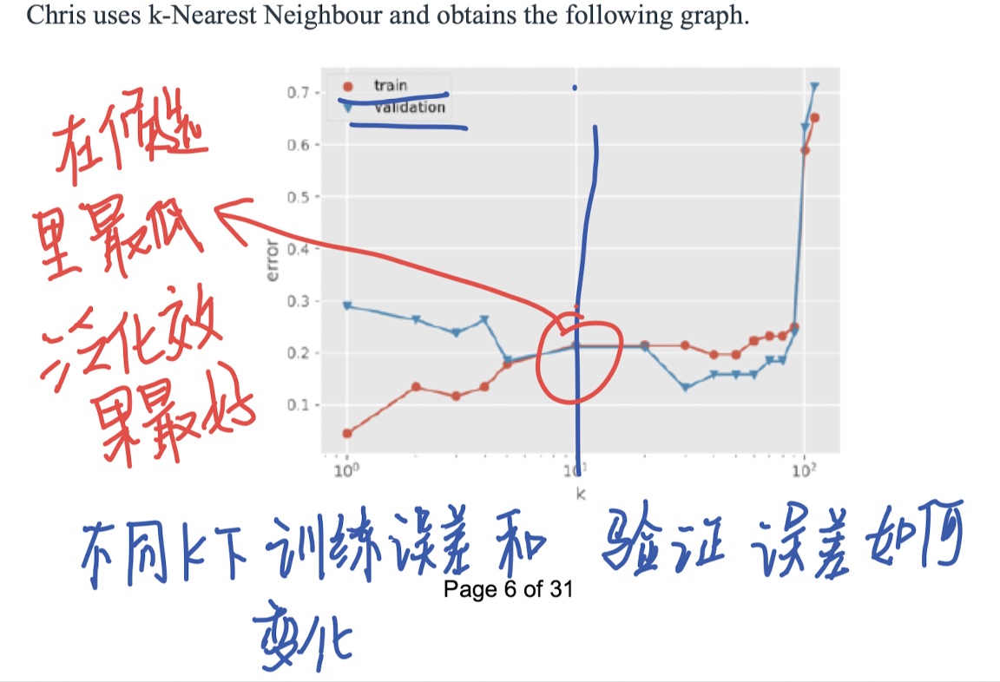

① 红线：训练误差，看模型在训练数据上错多少。Red line = train error, mistakes on training data. ② 蓝线：验证误差，看模型在新数据上错多少。Blue line = validation error, mistakes on unseen data. ③ 选 k 主要看蓝线，因为它更能代表泛化能力。Choose k by blue line because it shows generalisation. ④ 在 $10^0,10^1,10^2$ 里，选 $10^1=10$。Among them, choose $10^1=10$. ⑤ 因为 k=10 时验证误差最低，新数据表现最好。Because k=10 has the lowest validation error, so it performs best on new data.。

##### k 太小和太大 / Small k and Large k

① $k$ 太小时，模型容易被单个噪声样本影响。If $k$ is too small, the model can be affected by individual noisy examples.

② $k$ 较大时，模型对噪声更稳健。A larger $k$ makes the model more robust to noise.

③ $k$ 过大时，模型可能过度平滑，忽略局部模式。If $k$ is too large, the model may become too smooth and ignore local patterns.

### 3. 距离度量与归一化 / Distance Measures and Normalization

#### 3.1 数值属性的距离 / Distance for Numeric Attributes

##### 欧氏距离 / Euclidean Distance 

① 欧氏距离：常用距离度量。Common distance measure.

② 含义：两个点之间的直线距离。Straight-line distance between two points.

③ 样本：$A=(a_1,\ldots,a_n)$，$B=(b_1,\ldots,b_n)$。Two examples.

④ 公式：$D(A,B)=\sqrt{\sum_{i=1}^{n}(a_i-b_i)^2}$。Sum differences squared, then square root.

##### 曼哈顿距离 / Manhattan Distance

① 曼哈顿距离：各属性差值绝对值相加。Sum absolute differences.

② 含义：像方格城市沿街走。Like walking on grid streets.

③ 公式：$D(A,B)=\sum_{i=1}^{n}|a_i-b_i|$。Sum absolute differences across all attributes.

==2 Question 1试卷一 Q1（欧氏/曼哈顿距离）==给定两个向量 $x=[1,-2,-3]$ 和 $y=[2,1,4]$，计算这两个向量之间的欧氏距离和曼哈顿距离。Given two vectors $x=[1,-2,-3]$ and $y=[2,1,4]$, calculate the Euclidean distance and Manhattan distance between these two vectors.

① 差值 Difference：$x-y=[1-2,\ -2-1,\ -3-4]=[-1,-3,-7]$。

② 欧氏距离 Euclidean distance：$D=\sqrt{(-1)^2+(-3)^2+(-7)^2}=\sqrt{59}\approx 7.68$。

③ 曼哈顿距离 Manhattan distance：$D=|-1|+|-3|+|-7|=11$

最终答案 Final answer：欧氏距离 $=\sqrt{59}\approx 7.68$；曼哈顿距离 $=11$。

#### 3.2 归一化 / Normalization

##### 为什么需要归一化 / Why Normalization Is Needed

① 距离算法：对数值尺度敏感。Sensitive to scales.

② 大范围属性：会主导距离。Large-scale attributes dominate distance.

③ 例子：income 可能压过 age。Income may dominate age.

##### Min-max Scaling

① 作用：把数值缩放到 $[0,1]$，$x'=\frac{x-\min(x)}{\max(x)-\min(x)}$。Scale values to $[0,1]$.

② $x$：原始值。Original value.

③ $x'$：归一化后的值。Normalized value.

④ $\min(x),\max(x)$：该属性的最小值和最大值。Minimum and maximum of the attribute.

==1 Question 2.1 试卷一 Q2.1（kNN为何归一化）==为什么在使用基于距离的算法时，例如 k-Nearest Neighbor，需要进行归一化？Why do we need to apply normalization when using distance-based algorithms such as k-Nearest Neighbor?

**答案 Answer：**
 因为距离计算对属性尺度很敏感，数值范围大的属性会主导距离。Normalization is needed because distance calculations are sensitive to feature scales, and large-scale features can dominate the distance.

例子 Example：income 的差值可能是 10000，而 age 的差值可能只有 10，所以 income 会压过 age。Income may dominate age because its numeric differences are much larger.

#### 3.3 分类属性的距离 / Distance for Nominal Attributes

##### 基本规则 / Basic Rule

① 分类属性：只看是否相同。Only check same or different.

② 相同：差异记 0。Same → 0.

③ 不同：差异记 1。Different → 1.$d(a,b)=
\begin{cases}
0, & a=b\\
1, & a\neq b
\end{cases}$

### 4. kNN 的特点 / Discussion of kNN

#### 4.1 优点 / Advantages

##### 为什么有用 / Why It Is Useful

① 简单：容易理解。Easy to understand.

② 准确率：通常不错。Often good accuracy.

③ 训练：不用建复杂模型，只存样本。Store examples, no complex training.

④ 用途：可分类，也可回归。Works for classification and regression.

##### kNN 回归 / kNN for Regression

① 回归预测：取最近 $k$ 个邻居的平均值，$\hat{y}=\frac{1}{k}\sum_{x_i\in N_k(x)}y_i$。Average the values of the $k$ nearest neighbors.

==1 Question2.4Q2.4（kNN回归预测）==当 k-Nearest Neighbor 用于回归任务时，新样本的预测值如何计算？ When we use k-Nearest Neighbor for regression tasks, how is the prediction for new examples calculated?

**答案 Answer：**
 找出最近的 $k$ 个邻居，然后取它们数值标签的平均值。
 Find the $k$ nearest neighbors and take the average of their numeric target values.

公式 Formula：$\hat{y}=\frac{1}{k}\sum_{i\in N_k(x)}y_i$。
 Prediction = average of the neighbors’ values.

#### 4.2 缺点 / Disadvantages

① 速度慢：预测时要比较很多训练样本。Slow prediction because it compares many examples.

② 内存大：必须保存所有训练样本。High memory cost because it stores all examples.

③ 要归一化：距离受尺度影响。Needs normalization because distance depends on scale.

④ 高维差：维度太多时“近”不明显。Weak in high dimensions because “near” becomes less meaningful.

⑤ 依赖 $k$：$k$ 选不好会影响结果。Sensitive to the choice of $k$.

#### 4.3 复杂度 / Complexity

① 时间复杂度：$T=O(mn)$，$m$ 个样本、$n$ 个属性。Prediction takes $O(mn)$.

② 空间复杂度：$S=O(mn)$，因为要存所有样本。Memory takes $O(mn)$.

③ 加速方法：KD-tree / ball tree 更快找邻居。KD-tree / ball tree speed up neighbor search.

④ 本质不变：只是加速，不改变 kNN 思想。Only faster search, same kNN idea.

#### 4.4 加权最近邻 / Weighted Nearest Neighbor

① 加权最近邻认为更近的邻居应该有更大影响。Weighted nearest neighbor assumes that closer neighbors should have greater influence.

② 距离越小，权重越大；距离越大，权重越小。The smaller the distance, the larger the weight; the larger the distance, the smaller the weight.$w_i=\frac{1}{d_i^2}$

③ $d_i$ 表示第 $i$ 个邻居到新样本的距离。$d_i$ is the distance between the $i$-th neighbor and the new example.

#### 4.5 决策边界 / Decision Boundary

① 决策边界：分类区域之间的分界线。Boundary between class regions.

② 1NN 边界：可以很不规则，不一定是直线。1NN boundary can be irregular.

③ Voronoi 图：把空间分成多个区域，每个样本管离自己最近的区域。Divides space into regions, and each example owns its nearest region.

④ 1NN 分类：新样本落到哪个区域，就用对应样本的类别。Use the class of that region’s example.

#### 4.6为什么高维困难 / Why High Dimensions Are Difficult 

① 高维问题：维度太多时，kNN 效果会变差。kNN performs worse in high dimensions.

② 距离不可靠：近和远会变得难区分。Near and far become hard to distinguish.

③ 后果：最近邻不一定真的相似。Nearest neighbor may not be truly similar.

④ 解决方法：用降维或特征选择。Use dimensionality reduction or feature selection.

### 5. 1R 规则算法 / 1R Rule-Based Algorithm

#### 5.1 核心思想 / Core Idea

① 1R：意思是 one rule，一条规则。Means one rule.

② 属性：只选一个属性做分类。Uses only one attribute.

③ 形式：像一层决策树。Like a one-level decision tree.

④ 别名：decision stump。Also called decision stump.

① 对每个属性分别试一次。
 ② 对这个属性的每个取值，看它对应的样本里哪个 class 最多。
 ③ 这个取值就预测多数类。
 ④ 计算这个属性的总错误数。
 ⑤ 选择总错误数最小的属性作为最终规则。

**例子**

假设 income = low 的样本里：

high 有 5 个
 moderate 有 0 个
 low 有 0 个

那规则就是：

income = low → high

不是猜，是因为训练数据里 low income 对应的 class 全是 high，所以错 0。

**如果并列怎么办？**

比如 income = average：

high 有 2 个
 moderate 有 2 个
 low 有 0 个

那 high 和 moderate 并列。

这时候确实可以任选一个，因为选 high 错 2，选 moderate 也错 2。

所以并列时有一点“随便选”，但错误数不是猜的，是算出来的。

**1R 的本质**

1R 就是：

① 不看属性之间的组合。
 ② 只看单个属性。
 ③ 每个属性值预测多数类。
 ④ 总错误数最小的属性胜出。

所以它不是“凭感觉猜”，而是：

用训练数据的频率做最简单的规则。

**最短理解**

1R = 每个属性值都选多数类。

如果有并列，才任选一个。

#### 5.2 规则形式 / Rule Format

① 规则：根据一个属性的取值预测类别。Predicts class from one attribute value.**outlook 天气**，类别是 **play 是否打球**。

② 例子：outlook = sunny → play = no。

③ 例子：outlook = overcast → play = yes。

④ 例子：outlook = rainy → play = yes。

#### 5.3 怎么决定类别 / How to Assign Class Labels

##### 多数类原则 / Majority Class Principle

① 多数类：每个属性值选出现最多的类别。Choose the most frequent class for each value.

② 目的：让训练错误尽量少。Minimize training errors.

③ 例子：sunny 里 no 最多，就预测 no。If sunny has more no, predict no.

##### 关键公式 / Key Formula

① 规则：$A=v$ 时，预测最多的类别，$\hat{y}(A=v)=\arg\max_c Count(A=v,y=c)$。Predict the most frequent class.

② $A=v$：属性 $A$ 的值是 $v$。Attribute $A$ has value $v$.

#### 5.4 怎么选择最佳属性 / How to Choose the Best Attribute

##### 选择过程 / Selection Process

① 生成规则：每个属性都试一次。Try each attribute.

② 计算错误：看每个规则错多少。Count errors for each rule.

③ 选择规则：选错误最少的属性。Choose the attribute with fewest errors.

##### 关键公式 / Key Formula

① 最佳属性：选错误最少的属性，$A^*=\arg\min_A Error(A)$。Choose the attribute with minimum error.

② 错误数：每个属性值下，非多数类的数量总和，$Error(A)=\sum_v [Count(A=v)-\max_c Count(A=v,y=c)]$。Sum of non-majority examples.

#### 5.5 1R 的特点 / Discussion of 1R

##### 优点 / Advantages

① 1R 很简单，计算效率高。1R is simple and computationally efficient.

② 1R 生成的规则容易理解。1R produces rules that are easy to understand.

③ 1R 可以作为 baseline，用来和复杂模型比较。1R can be used as a baseline for comparison with more complex models.

1R 的核心不是推理复杂关系，而是：

对每个属性值，直接看训练数据里哪个 class 出现最多，就预测哪个 class。

也就是“多数投票”。

##### 缺点 / Disadvantages

① 1R 只使用一个属性，所以表达能力有限。1R uses only one attribute, so its expressive power is limited.

② 1R 难以捕捉多个属性之间的复杂关系。1R cannot easily capture complex relationships between multiple attributes.

③ 数值属性在使用 1R 前通常需要离散化。Numeric attributes usually need discretization before using 1R.

### 6. PRISM 规则算法 / PRISM Rule-Based Algorithm

#### 6.1 核心思想 / Core Idea

① PRISM：一种覆盖式规则算法。A covering rule-based algorithm.

② 目标：为每个类别分别生成规则。Generates rules for each class separately.

③ 规则：尽量覆盖目标类，排除其他类。Covers target class and excludes other classes.

#### 6.2 规则生成过程 / Rule Generation Process

① 开始：从空规则开始。Start with an empty rule.

② 加条件：逐步加入条件。Add conditions step by step.

③ 覆盖范围：条件越多，覆盖样本越少。More conditions cover fewer examples.

④ 准确率：规则越具体，通常越准确。More specific rules are usually more accurate.

#### 6.3 p/t 的含义 / Meaning of p/t

① $t$：当前规则覆盖的总样本数。Total covered examples.

② $p$：当前规则覆盖的目标类样本数。Covered target-class examples.

③ $p/t$：规则准确率，$Accuracy(R)=\frac{p}{t}$。Rule accuracy.

④ $t-p$：规则错误数，$Errors(R)=t-p$。Number of errors.

⑤ 选条件：每一步选 $p/t$ 最大的条件，$(A^*,v^*)=\arg\max_{A,v}\frac{p}{t}$。Choose the condition with maximum $p/t$.

#### 6.4 Perfect Rule / 完美规则

① 完美规则：当 $p/t=1$。Perfect rule when $p/t=1$.

② 含义：只覆盖目标类，不覆盖其他类。Covers only the target class.

③ 停止：达到 perfect rule 后停止加条件。Stop adding conditions.

#### 6.5 覆盖过程 / Covering Process

① 新规则：如果还有目标类没覆盖，就继续生成规则。Generate another rule if some target examples remain.

② 删除：已覆盖的目标类样本会被删除。Remove covered positive examples.

③ 重复：直到该类别样本都被覆盖。Repeat until the class is covered.

④ 换类：再为其他类别生成规则。Then move to other classes.

#### 6.6 平局处理 / Tie-Breaking

① 平局：如果多个条件 $p/t$ 一样，选覆盖目标类更多的。If $p/t$ ties, choose the one covering more positives.

② 规则：选 $p$ 更大的条件。Choose the condition with larger $p$.

#### 6.7 规则顺序和默认规则 / Rule Order and Default Rule

① 规则顺序：同一类别的 PRISM 规则顺序不重要。Order of rules for the same class does not matter.

② 原因：PRISM 是独立覆盖规则，不是顺序决策列表。Independent covering rules, not an ordered decision list.

③ 未覆盖样本：有些测试样本可能匹配不到任何规则。Some test examples may not match any rule.

④ 默认规则：未覆盖样本通常分到多数类，$\hat{y}_{default}=\arg\max_c Count(y=c)$。Assign uncovered examples to the majority class.

#### 6.8 PRISM 的特点 / Discussion of PRISM

① 优点：比 1R 更强，可以用多个条件。More expressive than 1R because it uses multiple conditions.

② 可解释性：规则是 if-then 形式，容易理解。Interpretable because rules are if-then rules.

③ 按类生成：适合解释某一类为什么被覆盖。Useful for explaining one target class.

④ 缺点：可能无法覆盖所有测试样本。May not cover all test examples.

⑤ 数值属性：通常需要离散化。Numeric attributes usually need discretization.

⑥ 过拟合：规则太具体会影响泛化。Too-specific rules may reduce generalization.

#### 6.9 PRISM 和决策树区别 / PRISM vs Decision Tree

① PRISM：覆盖式方法。Covering approach.

② PRISM：每次为一个类别生成规则。Generates rules for one class at a time.

③ 决策树：分而治之方法。Divide-and-conquer approach.

④ 决策树：从全部样本开始，不断分裂数据。Starts with all examples and splits data repeatedly.

⑤ 选择标准：PRISM 选最大 $p/t$ 的条件。PRISM chooses the condition maximizing $p/t$.

## 🌸Week 3 — 决策树

- 试卷一 Q3（熵 + 信息增益，选根节点）
- 试卷二 Q7（判断分裂后子集熵的性质）

### ✅1. 回归与分类基础 / Regression and Classification Basics

#### 1.1 本周主题 / Week 3 Topics

##### 核心内容 / Core Content

① 这一周主要讲四个内容：线性回归、逻辑回归、过拟合与正则化、Ridge 和 Lasso 回归。This week mainly covers four topics: linear regression, logistic regression, overfitting and regularization, and Ridge and Lasso regression. 

② 线性回归用于 regression task，也就是预测数值型变量。Linear regression is used for regression tasks, where the predicted variable is numeric.

③ 逻辑回归用于 classification task，也就是预测类别型变量。Logistic regression is used for classification tasks, where the predicted variable is nominal or categorical.

##### 例子 / Examples

① 回归例子：根据经济指标预测澳元汇率，或者根据广告花费预测公司销售额。Regression examples include predicting the AU dollar exchange rate from economic indicators or predicting company sales from advertising spending.

② 分类例子：根据病人的年龄预测是否有某种疾病。A classification example is predicting whether a patient has a disease based on age.

### 2. 线性回归 / Linear Regression

#### 2.1 简单线性回归 / Simple Linear Regression

##### 核心意思 / Core Meaning

① 简单线性回归处理两个连续变量：一个输入特征 $x$，一个预测目标 $y$。Simple linear regression uses two continuous variables: one input feature $x$ and one target variable $y$.

② $x$ 也叫 independent variable，表示用来预测的变量。$x$ is also called the independent variable, which is used to make predictions.

③ $y$ 也叫 dependent variable、target variable 或 predicted variable，表示要预测的结果。$y$ is also called the dependent variable, target variable, or predicted variable.

④ 线性回归的目标是用一条直线近似描述 $x$ 和 $y$ 之间的关系。The goal of linear regression is to approximate the relationship between $x$ and $y$ using a straight line. 

#### 2.2 回归线公式 / Regression Line Formula

##### 关键公式 / Key Formula

① 普通直线公式是：The equation of a line is:
$$
y=b_0+b_1x
$$
② 回归预测公式是：The regression prediction formula is:
$$
\hat{y}=b_0+b_1x
$$
③ $b_0$ 是 intercept 截距，表示 $x=0$ 时的基础值。$b_0$ is the intercept, which represents the base value when $x=0$.

④ $b_1$ 是 slope 斜率，表示 $x$ 每增加 1，预测值 $y$ 改变多少。$b_1$ is the slope, which shows how much the predicted $y$ changes when $x$ increases by 1.

⑤ $\hat{y}$ 是 predicted value 预测值，不一定等于真实值 $y$。$\hat{y}$ is the predicted value, which may not equal the actual value $y$.

#### 2.3 Cereal 例子 / Cereal Example

##### 任务 / Task

① PPT 的例子是用 cereal 的 sugar content 预测 nutritional rating。The PPT example uses cereal sugar content to predict nutritional rating.

② 这里 sugar 是 independent variable，rating 是 dependent variable。Here, sugar is the independent variable, and rating is the dependent variable.

③ 模型根据已有 cereal 数据学习一条回归线，然后用这条线预测新 cereal 的 rating。The model learns a regression line from existing cereal data and uses it to predict the rating of a new cereal.

##### 计算例子 / Calculation Example

① PPT 给出的回归线是：The regression line given in the PPT is:
$$
\hat{y}=59.4-2.42x
$$
② 如果新 cereal 的 sugar 是 $x=1$，那么预测 rating 是 56.98。If a new cereal has sugar $x=1$, the predicted rating is 56.98.
$$
\hat{y}=59.4-2.42\times1=56.98
$$
③ 但是真实值可能不是 56.98，比如 Cheerios 的真实 rating 是 50.765。However, the actual value may not be 56.98; for example, Cheerios has an actual rating of 50.765.

④ 预测值和真实值之间的差叫 prediction error 或 residual。The difference between the predicted value and actual value is called prediction error or residual. 

### 3. 回归误差与模型评估 / Regression Error and Model Evaluation

#### 3.1 Residual / Prediction Error

##### 核心意思 / Core Meaning

① residual 是真实值减去预测值。A residual is the actual value minus the predicted value.
$$
\epsilon_i=y_i-\hat{y}_i
$$
② residual 越小，说明预测越接近真实值。A smaller residual means the prediction is closer to the actual value.

③ residual 可以是正数，也可以是负数。A residual can be positive or negative.

#### 3.2 SSE / Sum of Squared Errors

##### 关键公式 / Key Formula

① SSE 是所有 residual 平方之后加起来。SSE is the sum of squared residuals.
$$
SSE=\sum_i(y_i-\hat{y}_i)^2
$$
② 线性回归要找的不是随便一条线，而是让 SSE 最小的线。Linear regression does not choose any random line; it chooses the line that minimizes SSE.

③ 这个方法叫 least squares method 最小二乘法。This method is called the least squares method.

④ 易错点是：回归线最小化的是 squared residuals 的总和，不是 residuals 的普通总和。A common mistake is that the regression line minimizes the sum of squared residuals, not the simple sum of residuals. 

#### 3.3 SST、SSR、SSE / Three Types of Errors

##### 三个误差 / Three Errors

① SSE 表示 actual value 和 predicted value 之间的误差。SSE measures the error between the actual value and the predicted value.
$$
SSE=\sum_i(y_i-\hat{y}_i)^2
$$
② SST 表示 actual value 和 mean value 之间的总误差。SST measures the total error between the actual value and the mean value.
$$
SST=\sum_i(y_i-\bar{y})^2
$$
③ SSR 表示 predicted value 和 mean value 之间的回归解释部分。SSR measures the regression-explained part between the predicted value and the mean value.
$$
SSR=\sum_i(\hat{y}_i-\bar{y})^2
$$
④ 三者关系是：SST 等于 SSR 加 SSE。The relationship is: SST equals SSR plus SSE.
$$
SST=SSR+SSE
$$

#### 3.4 R² / Coefficient of Determination

##### 核心意思 / Core Meaning

① $R^2$ 叫 coefficient of determination，用来衡量回归线拟合数据的程度。$R^2$ is called the coefficient of determination, and it measures how well the regression line fits the data.

② $R^2$ 越接近 1，说明拟合越好；越接近 0，说明拟合越差。The closer $R^2$ is to 1, the better the fit; the closer it is to 0, the worse the fit.

##### 关键公式 / Key Formula

$$
R^2=\frac{SSR}{SST}
$$

① 如果 $SSE=0$，说明所有预测都完全正确，这时 $R^2=1$。If $SSE=0$, all predictions are perfect, so $R^2=1$.

② 如果 $SSR=0$，说明 $x$ 对预测 $y$ 没有帮助，这时 $R^2=0$。If $SSR=0$, $x$ is not helpful for predicting $y$, so $R^2=0$.

③ 如果模型在 training set 上训练、在 test set 上测试，$R^2$ 有可能是负数。If the model is trained on the training set and tested on the test set, $R^2$ can be negative.

④ 负的 $R^2$ 表示模型在测试集上表现很差，可能是 overfitting。A negative $R^2$ means poor performance on the test set and may indicate overfitting. 

#### 3.5 MAE、MSE、RMSE / Error Metrics

##### 关键公式 / Key Formula

① MAE 是平均绝对误差，直接看平均预测偏差有多大。MAE is Mean Absolute Error, which measures the average absolute prediction error.
$$
MAE=\frac{1}{n}\sum_{i=1}^{n}|\hat{y}_i-y_i|
$$
② MSE 是平均平方误差，会更重视大的错误。MSE is Mean Squared Error, which penalizes large errors more strongly.
$$
MSE=\frac{1}{n}\sum_{i=1}^{n}(\hat{y}_i-y_i)^2
$$
③ RMSE 是 MSE 开根号，单位和原来的 $y$ 一样。RMSE is the square root of MSE, and its unit is the same as the original $y$.
$$
RMSE=\sqrt{\frac{1}{n}\sum_{i=1}^{n}(\hat{y}_i-y_i)^2}
$$
④ MAE、MSE、RMSE 都可以用来评估 training performance 和 test performance。MAE, MSE, and RMSE can be used to evaluate both training performance and test performance. 

#### 3.6 多元回归 / Multiple Regression

##### 核心意思 / Core Meaning

① simple regression 只有一个 feature。Simple regression has one feature.

② multiple regression 有多个 features。Multiple regression has more than one feature.

③ 在二维空间里，线变成 plane；在更高维空间里，变成 hyperplane。In two-dimensional feature space, the line becomes a plane; in higher-dimensional space, it becomes a hyperplane.

④ 多元回归也可以使用 $R^2$，叫 multiple coefficient of determination。Multiple regression can also use $R^2$, called the multiple coefficient of determination. 

### 4. 逻辑回归 / Logistic Regression

#### 4.1 核心思想 / Core Idea

##### 核心意思 / Core Meaning

① 逻辑回归用于 classification task，尤其是二分类。Logistic regression is used for classification tasks, especially binary classification.

② 它的 class 通常是 0 和 1，比如 no disease 和 disease。Its classes are usually 0 and 1, such as no disease and disease.

③ 虽然名字里有 regression，但它不是用来预测连续数值，而是用来预测类别概率。Although it has “regression” in its name, it predicts class probabilities rather than continuous numeric values.

④ 逻辑回归拟合的是 logistic curve，也叫 sigmoid curve，而不是普通直线。Logistic regression fits a logistic curve, also called a sigmoid curve, rather than a straight line. 

#### 4.2 Logistic Curve / Sigmoid Curve

##### 关键公式 / Key Formula

① 逻辑回归的概率公式是：The probability formula for logistic regression is:
$$
p=\frac{e^{b_0+b_1x}}{1+e^{b_0+b_1x}}
$$
② $p$ 表示属于 class 1 的概率。$p$ represents the probability of belonging to class 1.

③ $1-p$ 表示属于 class 0 的概率。$1-p$ represents the probability of belonging to class 0.

④ 这个公式的输出永远在 0 到 1 之间，所以可以解释成概率。The output of this formula is always between 0 and 1, so it can be interpreted as a probability.

#### 4.3 如何分类 / How Classification Works

##### 分类规则 / Classification Rule

① 逻辑回归先输出概率 $p$，然后用 threshold 把概率变成类别。Logistic regression first outputs probability $p$, then uses a threshold to convert the probability into a class.

② 常见 threshold 是 0.5。A common threshold is 0.5.

③ 如果 $p \geq 0.5$，预测 class 1。If $p \geq 0.5$, predict class 1.

④ 如果 $p < 0.5$，预测 class 0。If $p < 0.5$, predict class 0.

⑤ threshold 不一定必须是 0.5，可以根据实际领域调整。The threshold does not have to be 0.5; it can be adjusted based on domain knowledge.

#### 4.4 Disease 例子 / Disease Example

##### 例子 / Example

① PPT 的例子是根据 patient age 预测 disease 是否存在。The PPT example predicts whether a disease is present based on patient age.

② class 1 表示有 disease，class 0 表示没有 disease。Class 1 means disease is present, and class 0 means disease is absent.

③ 对一个 50 岁病人，模型得到 $p=0.26$。For a 50-year-old patient, the model gives $p=0.26$.

④ 这表示有病概率是 26%，没有病概率是 74%。This means the probability of disease is 26%, and the probability of no disease is 74%.

⑤ 因为 $0.26<0.5$，所以预测 class 0，也就是没有 disease。Because $0.26<0.5$, the predicted class is 0, meaning no disease.

#### 4.5 Log Odds / 对数几率

##### 核心意思 / Core Meaning

① 逻辑回归虽然输出概率，但内部仍然是线性组合。Although logistic regression outputs a probability, internally it still uses a linear combination.

② 不同点是：线性回归直接预测 $\hat{y}$，逻辑回归预测的是 log odds。The difference is that linear regression directly predicts $\hat{y}$, while logistic regression predicts log odds.

##### 关键公式 / Key Formula

$$
\ln\left(\frac{p}{1-p}\right)=b_0+b_1x
$$

① $\frac{p}{1-p}$ 叫 odds，表示 class 1 相对于 class 0 的可能性比例。$\frac{p}{1-p}$ is called odds, which represents the likelihood ratio of class 1 relative to class 0.

② $\ln(\frac{p}{1-p})$ 叫 log odds。$\ln(\frac{p}{1-p})$ is called log odds.

③ 逻辑回归是用 linear calculation 去决定 log odds，而不是直接决定 $y$。Logistic regression uses a linear calculation to determine log odds, not the predicted value $y$ directly.

### 5. 过拟合、欠拟合与泛化 / Overfitting, Underfitting and Generalization

#### 5.1 Overfitting / 过拟合

##### 核心意思 / Core Meaning

① overfitting 指模型在 training set 上错误很小，但在 test set 上错误很大。Overfitting means the model has small error on the training set but large error on the test set.

② 本质是模型记住了训练样本的细节，但没有学会 generalize 到新数据。The core issue is that the model memorizes training details but does not learn to generalize to new data.

③ 训练集表现好不一定代表模型好，关键要看 test set 表现。Good training performance does not necessarily mean the model is good; test performance is the key.

##### 常见原因 / Common Causes

① training data 有 noise，模型可能把噪声也学进去。If the training data contains noise, the model may learn the noise as well.

② training data 太小，不足以代表真实情况。If the training data is too small, it may not represent the real situation.

③ training data 和 test data 差异太大，模型就难以泛化。If the training data and test data are very different, the model may not generalize well.

④ 模型太复杂，也容易 overfit。An overly complex model is also more likely to overfit. 

#### 5.2 Underfitting / 欠拟合

##### 核心意思 / Core Meaning

① underfitting 指模型太简单，无法捕捉数据中的重要规律。Underfitting means the model is too simple to capture important patterns in the data.

② underfitting 的模型在 training set 和 test set 上通常都表现差。An underfitting model usually performs poorly on both the training set and the test set.

③ 简单说，overfitting 是“学太细”，underfitting 是“学太少”。Simply put, overfitting means learning too much detail, while underfitting means learning too little.

#### 5.3 模型复杂度与泛化 / Model Complexity and Generalization

##### 核心关系 / Core Relationship

① generalization performance 指模型在 test set 上的表现。Generalization performance means model performance on the test set.

② 模型越复杂，training performance 通常越好。The more complex the model is, the better its training performance usually becomes.

③ 但模型太复杂时，会过度关注每一个训练样本，导致 test performance 下降。However, when the model is too complex, it focuses too much on individual training examples, causing test performance to decrease.

④ 最好的模型通常在 underfitting 和 overfitting 中间。The best model is usually between underfitting and overfitting.

### 6. 正则化 / Regularization

#### 6.1 核心思想 / Core Idea

##### 核心意思 / Core Meaning

① regularization 是通过限制模型来避免 overfitting。Regularization avoids overfitting by explicitly restricting the model.

② 它让模型更简单、更保守，不要过度贴合 training data。It makes the model simpler and more conservative, so it does not fit the training data too closely.

③ Ridge regression 和 Lasso regression 都是 regularized linear regression models。Ridge regression and Lasso regression are both regularized linear regression models. 

### 7. Ridge Regression / Ridge 回归

#### 7.1 核心思想 / Core Idea

##### 核心意思 / Core Meaning

① Ridge 是标准线性回归的正则化版本。Ridge regression is a regularized version of standard linear regression.

② Ridge 也叫 Tikhonov regularization。Ridge is also called Tikhonov regularization.

③ Ridge 预测时仍然使用线性回归公式。Ridge still uses the same prediction equation as linear regression.

④ 但训练时，Ridge 会要求 regression coefficients 尽量小。However, during training, Ridge requires regression coefficients to be as small as possible.

⑤ 权重越小，每个 feature 对结果的影响越小，模型也越不容易过拟合。Smaller weights mean each feature has less effect on the outcome, making the model less likely to overfit.

#### 7.2 Ridge 公式 / Ridge Formula

##### 关键公式 / Key Formula

$$
\frac{1}{n}\sum_{i=1}^{n}(\hat{y}_i-y_i)^2+\alpha\sum_{i=1}^{m}w_i^2
$$

① 前半部分是 MSE，用来保证训练误差不要太大。The first part is MSE, which keeps the training error low.

② 后半部分是 regularization term，用来惩罚过大的权重。The second part is the regularization term, which penalizes large weights.

③ Ridge 使用 L2 regularization，也就是惩罚 $w_i^2$。Ridge uses L2 regularization, which penalizes $w_i^2$. 

#### 7.3 Alpha 的作用 / Role of Alpha

##### 参数解释 / Parameter Meaning

① $\alpha$ 控制 training performance 和 model complexity 之间的权衡。$\alpha$ controls the trade-off between training performance and model complexity.

② $\alpha$ 越大，权重越接近 0，模型越简单。A larger $\alpha$ pushes weights closer to 0 and makes the model simpler.

③ $\alpha$ 太大可能让 training performance 下降。If $\alpha$ is too large, training performance may decrease.

④ $\alpha$ 很小时，Ridge 会变得接近普通 Linear Regression。When $\alpha$ is very small, Ridge behaves similarly to standard linear regression.

### 8. Lasso Regression / Lasso 回归

#### 8.1 核心思想 / Core Idea

##### 核心意思 / Core Meaning

① Lasso 也是标准线性回归的正则化版本。Lasso is also a regularized version of standard linear regression.

② LASSO 全称是 Least Absolute Shrinkage and Selection Operator。LASSO stands for Least Absolute Shrinkage and Selection Operator.

③ Lasso 和 Ridge 都会加入 regularization term，但 Lasso 使用 L1 norm。Both Lasso and Ridge add a regularization term, but Lasso uses the L1 norm.

#### 8.2 Lasso 公式 / Lasso Formula

##### 关键公式 / Key Formula

$$
\frac{1}{n}\sum_{i=1}^{n}(\hat{y}_i-y_i)^2+\alpha\sum_{i=1}^{m}|w_i|
$$

① 前半部分还是 MSE，用来保持训练集误差较低。The first part is still MSE, which keeps training error low.

② 后半部分是 L1 regularization term，惩罚权重绝对值之和。The second part is the L1 regularization term, which penalizes the sum of absolute weights.

③ Lasso 的重要结果是：有些权重会变成 exactly 0。The important consequence of Lasso is that some weights can become exactly 0. 

#### 8.3 Lasso 的特点 / Feature Selection

##### 核心作用 / Core Function

① 如果某个 feature 的权重变成 0，模型就等于完全忽略这个 feature。If a feature’s weight becomes 0, the model completely ignores that feature.

② 所以 Lasso 可以自动做 feature selection。Therefore, Lasso can perform automatic feature selection.

③ feature 更少时，模型更简单，也更容易解释。With fewer features, the model becomes simpler and easier to interpret.

### 9. Ridge 和 Lasso 对比 / Ridge vs Lasso

#### 9.1 关键区别 / Key Differences

##### 正则化类型 / Regularization Type

① Ridge 使用 L2 regularization，惩罚平方权重。Ridge uses L2 regularization, which penalizes squared weights.
$$
\alpha\sum_{i=1}^{m}w_i^2
$$
② Lasso 使用 L1 regularization，惩罚权重绝对值。Lasso uses L1 regularization, which penalizes absolute weights.
$$
\alpha\sum_{i=1}^{m}|w_i|
$$

##### 模型效果 / Model Effect

① Ridge 会让权重变小，但通常不会直接变成 0。Ridge shrinks weights, but usually does not make them exactly 0.

② Lasso 可以让部分权重变成 0，所以能自动选择特征。Lasso can make some weights exactly 0, so it can automatically select features.

③ 如果想保留所有 feature 但降低复杂度，Ridge 更常见。If we want to keep all features while reducing complexity, Ridge is commonly used.

④ 如果想让模型自动筛掉一些 feature，Lasso 更有用。If we want the model to automatically remove some features, Lasso is more useful.

### 10. 易错点 / Common Mistakes

#### 10.1 回归线最小化什么 / What Does the Regression Line Minimize?

##### 正确理解 / Correct Understanding

① 错误说法：回归线最小化 residuals 的总和。Wrong statement: the regression line minimizes the sum of residuals.

② 正确说法：回归线最小化 squared residuals 的总和，也就是 SSE。Correct statement: the regression line minimizes the sum of squared residuals, which is SSE.

#### 10.2 R² 和相关系数 r / R² and Correlation Coefficient r

##### 正确理解 / Correct Understanding

① $R^2$ 可以告诉你拟合程度，但不能直接告诉你相关方向。$R^2$ tells you goodness of fit, but it does not directly tell you the direction of correlation.

② $r$ 可以是正的，也可以是负的。$r$ can be positive or negative.

③ 只知道 $R^2$，只能知道 $r$ 的大小，不能知道 $r$ 的正负号。Knowing only $R^2$ tells you the magnitude of $r$, but not its sign.
$$
r=\pm\sqrt{R^2}
$$

#### 10.3 SSR 和 SSE / SSR vs SSE

##### 正确理解 / Correct Understanding

① SSE 才是 prediction error 的整体度量。SSE is the overall measure of prediction error.

② SSR 不是 prediction error，而是模型解释出来的变异部分。SSR is not prediction error; it is the part of variation explained by the model.

③ 如果题目问“training set 上用 regression line 的预测误差”，应该想到 SSE、MAE、MSE 或 RMSE。If the question asks about prediction error on the training set using the regression line, think of SSE, MAE, MSE, or RMSE.

#### 10.4 Overfitting 和 Underfitting / Overfitting vs Underfitting

##### 判断方法 / How to Identify

① training 好、test 差，是 overfitting。Good training performance but poor test performance means overfitting.

② training 差、test 也差，是 underfitting。Poor training performance and poor test performance mean underfitting.

③ regularization 是用来减少 overfitting，不是用来让 training accuracy 最高。Regularization is used to reduce overfitting, not to maximize training accuracy.

## 🌸**Week 4 — 朴素贝叶斯 / 模型评估**

- 试卷一 Q1.1（留一交叉验证是否适合大数据集）、Q1.2（回归直线最小化残差）
- 试卷一 Q4（朴素贝叶斯预测新样本）

### ✅1. 概率分类与贝叶斯定理 / Probabilistic Classification and Bayes Theorem

#### 1.1 概率分类器 / Probabilistic Classifiers

① 概率分类器不是直接给出类别，而是计算一个样本属于每个类别的概率。Probabilistic classifiers compute the probability that an example belongs to each class. 

② 朴素贝叶斯是概率分类器的典型代表，它基于贝叶斯定理进行分类。Naïve Bayes is a typical probabilistic classifier based on Bayes’ theorem. 

#### 1.2 贝叶斯定理 / Bayes Theorem

$$
C^*=\arg\max_C P(C)\prod_i P(x_i|C)
$$

$$
P(H|E)=\frac{P(E|H)P(H)}{P(E)}
$$

##### 2. 朴素贝叶斯算法 / Naïve Bayes Algorithm

 朴素贝叶斯假设：给定类别后，各属性相互独立且同等重要；虽然现实中不完全成立，但计算快、效果常常不错。Naïve Bayes assumes conditional independence and equal attribute importance; unrealistic but fast and often effective.

基本流程 / Basic Process 看新样本 → 算 yes 分数 → 算 no 分数 → 谁大选谁。我帮你稍微整理成最终版，不改结构：

朴素贝叶斯题目通用模板

① Step 1：看新样本 $E=(E_1,E_2,E_3,E_4)$，比如 $E=(sunny,cool,high,true)$，比较 $P(yes|E)$ 和 $P(no|E)$ 谁大。

② Step 2：写 yes 分数：$Score(yes)=P(yes)\times P(E_1|yes)\times P(E_2|yes)\times P(E_3|yes)\times P(E_4|yes)$

③ Step 2：写 no 分数：$Score(no)=P(no)\times P(E_1|no)\times P(E_2|no)\times P(E_3|no)\times P(E_4|no)$。

④ Step 3：数类别比例：$P(yes)=\frac{yes的数量}{总数量}=\frac{9}{14}$，$P(no)=\frac{no的数量}{总数量}=\frac{5}{14}$。

⑤ Step 3：数 yes 条件概率：$P(sunny|yes)=\frac{yes里面sunny的数量}{yes总数量}$，$P(cool|yes)=\frac{yes里面cool的数量}{yes总数量}$，$P(high|yes)=\frac{yes里面high的数量}{yes总数量}$，$P(true|yes)=\frac{yes里面windy=true的数量}{yes总数量}$。

⑥ Step 3：数 no 条件概率：$P(sunny|no)=\frac{no里面sunny的数量}{no总数量}$，$P(cool|no)=\frac{no里面cool的数量}{no总数量}$，$P(high|no)=\frac{no里面high的数量}{no总数量}$，$P(true|no)=\frac{no里面windy=true的数量}{no总数量}$。

⑦ Step 4：代入 yes：$Score(yes)=P(yes)\times P(sunny|yes)\times P(cool|yes)\times P(high|yes)\times P(true|yes)$。

⑧ Step 4：代入 no：$Score(no)=P(no)\times P(sunny|no)\times P(cool|no)\times P(high|no)\times P(true|no)$。

⑨ Step 5：比较结果：如果 $Score(yes)>Score(no)$，预测 yes；如果 $Score(no)>Score(yes)$，预测 no。

Weather 例子

① 新样本：$E=(sunny,cool,high,true)$。

② yes 分数：$Score(yes)=P(yes)\times P(sunny|yes)\times P(cool|yes)\times P(high|yes)\times P(true|yes)$。

③ 从表格数出：$P(yes)=\frac{9}{14}$，$P(sunny|yes)=\frac{2}{9}$，$P(cool|yes)=\frac{3}{9}$，$P(high|yes)=\frac{3}{9}$，$P(true|yes)=\frac{3}{9}$。

④ 代入：$Score(yes)=\frac{9}{14}\times\frac{2}{9}\times\frac{3}{9}\times\frac{3}{9}\times\frac{3}{9}$。

⑤ no 分数：$Score(no)=P(no)\times P(sunny|no)\times P(cool|no)\times P(high|no)\times P(true|no)$，其中 $P(no)=\frac{5}{14}$，其他概率从 no 的 5 行里面数。

⑥ 结论：比较 $Score(yes)$ 和 $Score(no)$，谁大就预测谁。

### ✅3. 特殊情况与数值属性 / Special Cases and Numeric Attributes

#### 3.1 零频率问题 / Zero-Frequency Problem

① 零频率：某属性值在某类别中没出现过，条件概率会变成 0，导致整个类别得分为 0。Unseen value makes probability zero.

② 解决方法：Laplace smoothing，给每个计数加 1，避免概率为 0，公式：$P=\frac{count+1}{class\ count+m}$。Add-one smoothing avoids zero probability.

③ 平滑作用：避免概率为 0，让模型不会因为一个没见过的组合直接排除某个类别。Smoothing prevents zero probabilities, so the model does not eliminate a class because of an unseen combination.

#### 3.2 缺失值处理 / Missing Values

① 新样本缺失：分类时直接跳过这个属性，只乘已有属性的概率。Ignore missing attribute in prediction.

② 训练数据缺失：计算某属性概率时，只用该属性不缺失的样本。Use only available values for counting.

③ 缺失值：如果某个属性缺失，分类时直接跳过它，只用已有属性相乘。If an attribute is missing, skip it and multiply only the available conditional probabilities.

#### 3.3 数值属性 / Numeric Attributes

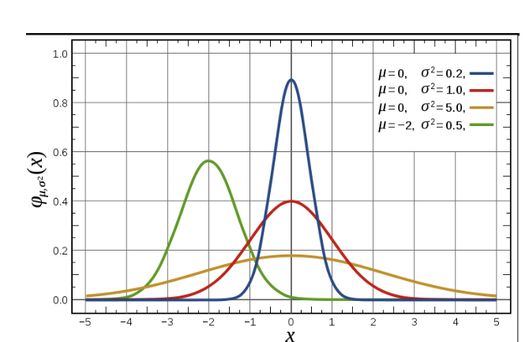

① 数值属性：连续数字型属性，如 temperature、age、income。Numeric attributes are continuous values.

② 高斯分布假设  Gaussian distribution/ normal distribution：假设每个类别下的数值大多集中在均值 μ 附近，离均值越远可能性越小。Values cluster around mean μ.

③ 做法：对每个类别分别计算均值 μ 和标准差 σ，再估计 P(x|class)。Compute μ and σ per class to estimate P(x|class).

④ 如果不适合高斯分布，可以离散化，或换其他分布。Use discretization or another distribution if needed.

#### 3.4 朴素贝叶斯优缺点 / Strengths and Weaknesses of Naïve Bayes

① 优点：简单、快、对少量噪声比较稳。Simple, fast, robust to some noise.

② 缺点：属性强相关时会违反独立性假设；数值属性也不一定真的服从正态分布。Correlated attributes and wrong distribution assumptions hurt performance.

### ✅4. 机器学习模型评估 / Evaluating Machine Learning Models

#### 4.1 泛化性能 / Generalization Performance

① 模型评估看的是新数据表现，而不是训练集表现。Evaluation focuses on unseen data, not training data.

② 训练集准确率通常偏高，可能有 overfitting。Training accuracy can be overly optimistic.

③ 测试集只用于最终评估，不能用于调参。Test set is for final evaluation, not tuning.

#### 4.2 Holdout 方法 / Holdout Method

① Holdout：随机分训练集和测试集，常见比例是 2/3 训练、1/3 测试。Holdout splits data into train/test, often 2/3 and 1/3.

② 训练集建模型，测试集算准确率等指标。Train builds the model; test measures performance.

③ 缺点：只分一次，结果可能不稳定。One split can be unstable.

#### 4.3 验证集与超参数 / Validation Set and Hyperparameters

① 验证集用于调超参数。Validation set is used for tuning hyperparameters.

② 训练集建模，验证集调参，测试集最终评估。Train builds, validation tunes, test evaluates.

③ 超参数：训练前要选的设置，如 kNN 的 k、神经网络层数和 epochs。Hyperparameters are pre-chosen settings.

④ 测试集不能调参，否则评估会被污染。Using test set for tuning biases evaluation.

#### 4.4 分层抽样 / Stratification

① 分层抽样：划分训练集和测试集时，尽量保持类别比例一致。Stratification keeps class proportions similar in train/test sets.

② 作用：避免某些类别在训练集或测试集中太少，甚至缺失。Avoid missing or under-represented classes.

③ 例子：原数据是 60% 类别 1、40% 类别 2，划分后训练集和测试集也尽量保持 60/40。Preserve the original class ratio.

#### 4.5 重复 Holdout 与交叉验证 / Repeated Holdout and Cross-Validation

##### 重复 Holdout / Repeated Holdout

① 重复 Holdout：多次随机划分训练集和测试集，再取平均准确率。Repeat random train/test splits and average the results.

② 优点：比单次 Holdout 稳定。More stable than one split.

③ 缺点：不同测试集可能重叠。Test sets may overlap.

##### 10 折交叉验证 / 10-Fold Cross-Validation

① 10 折交叉验证：把数据分成 10 份，每次 9 份训练、1 份测试。10-fold CV uses 9 parts for training and 1 part for testing.

② 重复 10 次，每一份都做一次测试集。Each part is used once as the test set.

③ 最终结果：10 次准确率取平均。Final accuracy is the average of 10 runs.

④ 优点：每个样本都被测试一次，避免测试集重叠问题。Each sample is tested once; avoids overlapping test sets.

#### 4.6 参数调优中的交叉验证 / Cross-Validation for Parameter Tuning

① 交叉验证可以用来选择最好的超参数。CV can select the best hyperparameters.

② 例子：kNN 可以尝试不同的 k 和不同距离度量。Try different k values and distance metrics.

③ 网格搜索：把所有参数组合都试一遍，并对每组做交叉验证。Grid search tests all parameter combinations with CV.

④ 选出 CV 准确率最高的参数后，用整个训练集重新训练模型。Retrain on the full training set using the best parameters.

⑤ 最后只用测试集评估一次，得到最终结果。Evaluate once on the test set for the final result.

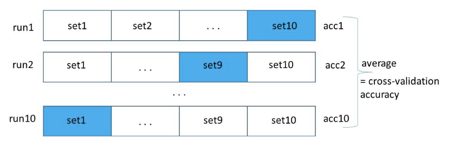

### ✅5. 性能指标 / Performance Measures

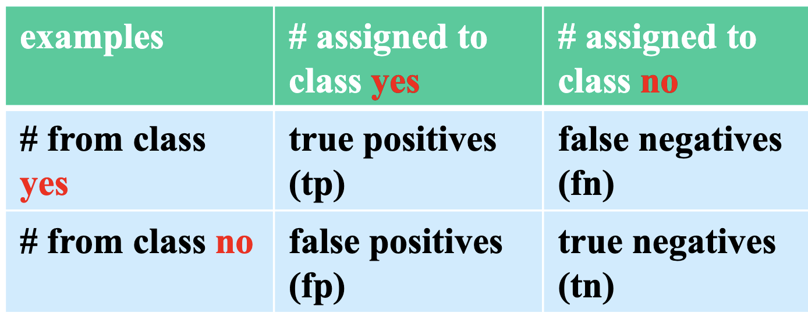

#### 5.1 Accuracy 准确率 / Accuracy

① Accuracy：所有样本中，预测正确的比例，公式是 $Accuracy=\frac{TP+TN}{TP+TN+FP+FN}$。Proportion of all correct predictions.

② 在混淆矩阵里，预测正确的是对角线：TP 和 TN。Correct predictions are on the diagonal.

③ 训练准确率通常偏高，测试准确率更能反映泛化性能。Test accuracy better reflects generalization.

#### 5.2 混淆矩阵 / Confusion Matrix

① 混淆矩阵：行表示真实类别 actual class，列表示预测类别 predicted class。Rows are actual classes; columns are predicted classes.

② yes 是正类 positive class，no 是负类 negative class。Yes is positive; no is negative.

③ TP：真实 yes，预测 yes，说明正类被正确找出。Actual yes and predicted yes.

④ FN：真实 yes，预测 no，说明正类被漏掉。Actual yes but predicted no.

⑤ FP：真实 no，预测 yes，说明负类被误报成正类。Actual no but predicted yes.

⑥ TN：真实 no，预测 no，说明负类被正确排除。Actual no and predicted no.

#### 5.3 Precision、Recall 和 F1 / Precision, Recall and F1

① Precision：看预测为 yes 的这一列，里面有多少是真的 yes，公式是 $Precision=\frac{TP}{TP+FP}$。Column view: predicted positives that are correct.    有多少误报。 模型说是垃圾的，有多少的概率是正确的

② Recall：看真实为 yes 的这一行，里面有多少被预测成 yes，公式是 $Recall=\frac{TP}{TP+FN}$。Row view: actual positives that are found.     有多少漏掉。真正yes的里面，模型找出来了多少

③ F1：综合 Precision 和 Recall，用来平衡二者，公式是 $F1=\frac{2PR}{P+R}$。Balances precision and recall.

## Week 5a — 决策树进阶 / 集成学习 / 优化**

- 试卷二 Q2（识别集成方法 + Boosting vs Bagging区别）
- 试卷二 Q3（Batch GD / Mini-batch GD / SGD轨迹匹配）

### 1. 决策树基础与构建 / Decision Tree Basics and Construction

#### 1.1 决策树是什么 / What Is a Decision Tree

##### 核心意思 / Core Meaning

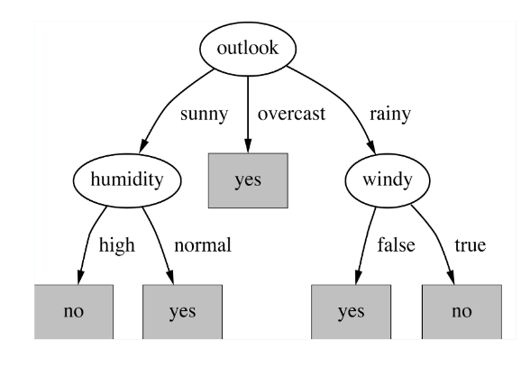

① 决策树是一种常见的机器学习和数据挖掘方法。A decision tree is a common machine learning and data mining method.

② 它用树形结构进行分类，每次根据某个属性做判断。It uses a tree structure for classification, making decisions based on attribute tests.

③ 决策树由 nodes 和 branches 组成。A decision tree consists of nodes and branches.

④ non-leaf node 表示一个属性测试。A non-leaf node represents a test on an attribute.

⑤ branch 表示属性的某个取值。A branch represents a possible value of that attribute.

⑥ leaf node 表示最终预测的类别。A leaf node represents the final predicted class.

#### 1.2 决策树如何预测 / How Prediction Works

##### 预测过程 / Prediction Process

① 对一个新样本，从 root node 开始。For a new example, start from the root node.

② 根据样本的属性值选择对应 branch。Choose the corresponding branch according to the example’s attribute value.

③ 一直往下走，直到到达 leaf node。Continue until reaching a leaf node.

④ leaf node 上的 class 就是模型的预测结果。The class at the leaf node is the model’s prediction.

#### 1.3 构建决策树 / Constructing Decision Trees

##### 构建策略 / Construction Strategy

① 决策树使用 top-down learning，从根节点开始往下建树。Decision trees use top-down learning, starting from the root and growing downward.

② 它使用 recursive divide-and-conquer，也就是递归地把数据分成更小的子集。It uses recursive divide-and-conquer, meaning the data is recursively split into smaller subsets.

③ 每一步都选择一个最好的属性来分裂数据。At each step, the algorithm selects the best attribute to split the data.

④ 分裂之后，每个 branch 对应一个子数据集。After splitting, each branch corresponds to one subset of examples.

⑤ 然后对每个子集重复同样的过程。Then the same process is repeated for each subset.

##### 停止条件 / Stopping Condition

① 如果一个节点里的所有 examples 都属于同一个 class，就停止继续分裂。If all examples in a node belong to the same class, stop splitting.

② 这个节点会变成 leaf node。This node becomes a leaf node.

③ leaf node 的 class 就是该节点中 examples 的类别。The class of the leaf node is the class of the examples in that node.

#### 1.4 构建例子 / Construction Example

##### 例子解释 / Example Explanation

① PPT 中的小例子是根据 Uni degree、work experience 和 sex 来预测 accept 或 reject。The PPT example predicts accept or reject using Uni degree, work experience, and sex.

② 第一层先选择 Uni degree 作为 root。The first level selects Uni degree as the root.

③ 如果 Uni degree = no，直接预测 reject。If Uni degree = no, directly predict reject.

④ 如果 Uni degree = yes，再继续看 work exp. > 3y。If Uni degree = yes, then test work exp. > 3y.

⑤ 如果 work exp. > 3y = yes，预测 accept；否则预测 reject。If work exp. > 3y = yes, predict accept; otherwise, predict reject.

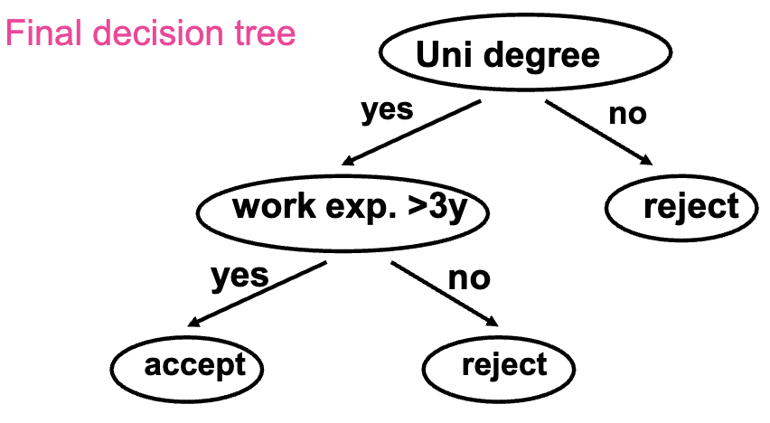

#### 1.5 属性选择 / Attribute Selection

##### 为什么要选择最好的属性 / Why Select the Best Attribute

① 构建决策树时，关键问题是每一步应该选哪个 attribute 来分裂。When constructing a decision tree, the key question is which attribute should be selected for splitting.

② 一个好的属性应该让分裂后的子节点尽量 pure。A good attribute should make the child nodes as pure as possible.

③ pure 的意思是一个节点里尽量只包含同一类 examples。Pure means that a node contains examples from mostly one class.

④ 越 pure 的节点，越不需要继续分裂，树也会更小。The purer the node, the less further splitting is needed, and the smaller the tree becomes.

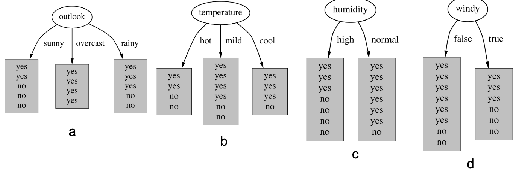

##### Purity / 纯度

① purity 衡量一个节点里的类别是否单一。Purity measures whether the classes inside a node are homogeneous.

② 如果一个节点里全是 yes 或全是 no，它就是 pure node。If a node contains only yes or only no, it is a pure node.

③ pure node 不需要继续分裂，可以直接变成 leaf node。A pure node does not need further splitting and can become a leaf node.

④使用 熵和信息增益 来衡量属性选择好不好。This PPT uses entropy and information gain to evaluate attribute selection.

### 2. Entropy 与 Information Gain / Entropy and Information Gain

#### 2.1 Entropy / 熵

##### 核心意思 / Core Meaning

① entropy 用来衡量一个数据集的混乱程度或不纯程度。Entropy measures the impurity or uncertainty of a dataset.

② entropy 越小，数据集越 pure。The smaller the entropy, the purer the dataset.

③ entropy 越大，类别越混杂。The larger the entropy, the more mixed the classes are.

④ 在二分类任务中，entropy 的范围通常是 0 到 1。In binary classification, entropy usually ranges from 0 to 1.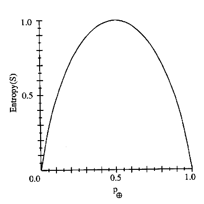

##### 关键公式 / Key Formula

$$
H(S)=-\sum_i P_i\log_2P_i
$$

① $S$ 表示当前数据集。$S$ represents the current dataset.

② $P_i$ 表示属于 class $i$ 的 examples 的比例。$P_i$ is the proportion of examples belonging to class $i$.

③ entropy 的单位是 bits。Entropy is measured in bits.

④ 计算时默认 $0\log_2 0=0$。When calculating entropy, we assume $0\log_2 0=0$.

#### 2.2 Binary Entropy / 二分类熵

##### 二分类公式 / Binary Formula

$$
H(S)=-p\log_2p-(1-p)\log_2(1-p)
$$

① $p$ 是 positive examples 的比例。$p$ is the proportion of positive examples.

② $1-p$ 是 negative examples 的比例。$1-p$ is the proportion of negative examples.

③ 如果所有 examples 都属于同一个 class，entropy = 0。If all examples belong to the same class, entropy = 0.

④ 如果 yes 和 no 数量相等，entropy = 1。If yes and no are equally distributed, entropy = 1.

#### 2.3 Weather Data 例子 / Weather Data Example

##### 计算例子 / Calculation Example

① PPT 中 weather data 一共有 14 个 examples，其中 9 个 yes，5 个 no。In the PPT weather data, there are 14 examples: 9 yes and 5 no.

② 所以 entropy 是：So the entropy is:
$$
H(S)=I\left(\frac{9}{14},\frac{5}{14}\right)
$$
③ 计算结果是 0.940 bits。The result is 0.940 bits.

④ 这说明原始数据不是完全 pure，因为 yes 和 no 都存在。This means the original dataset is not completely pure because both yes and no exist.

#### 2.4 Information Gain / 信息增益

##### 核心意思 / Core Meaning

① information gain 衡量某个 attribute 分裂数据后，entropy 减少了多少。Information gain measures how much entropy is reduced after splitting the data using an attribute.

② entropy 减少越多，说明这个 attribute 越有用。The more entropy is reduced, the more useful the attribute is.

③ information gain 越高，越应该选择这个 attribute。The higher the information gain, the more likely we should select that attribute.

④ 最好的 attribute 是 information gain 最高的 attribute。The best attribute is the attribute with the highest information gain.

##### 关键公式 / Key Formula

$$
IG(S,A)=H(S)-H(S|A)
$$

① $H(S)$ 是 split 之前 parent node 的 entropy。$H(S)$ is the entropy of the parent node before splitting.

② $H(S|A)$ 是用 attribute $A$ 分裂之后剩下的 weighted entropy。$H(S|A)$ is the remaining weighted entropy after splitting by attribute $A$.

③ information gain 本质上就是 split 前后的 entropy 差值。Information gain is essentially the difference between entropy before and after the split.

#### 2.5 Weighted Entropy / 加权熵

##### 关键公式 / Key Formula

$$
H(S|A)=\sum_v \frac{|S_v|}{|S|}H(S_v)
$$

① $S_v$ 表示 attribute $A$ 的某个 value 对应的子集。$S_v$ is the subset corresponding to one value of attribute $A$.

② $\frac{|S_v|}{|S|}$ 表示这个子集占原始数据的比例。$\frac{|S_v|}{|S|}$ is the proportion of the subset in the original dataset.

③ 每个子节点的 entropy 要按样本数量加权。The entropy of each child node must be weighted by the number of examples in that child node.

#### 2.6 Information Gain 计算例子 / Information Gain Calculation Example

##### Outlook Attribute / Outlook 属性

① 原始 weather data 中有 9 个 yes 和 5 个 no。The original weather dataset has 9 yes and 5 no examples.

② 原始 entropy 是 0.940 bits。The original entropy is 0.940 bits.
$$
H(S)=0.940
$$

##### Split by Outlook / 按 Outlook 分裂

① outlook = sunny 的子集 entropy 是 0.971 bits。The subset where outlook = sunny has entropy 0.971 bits.

② outlook = overcast 的子集 entropy 是 0 bits。The subset where outlook = overcast has entropy 0 bits.

③ outlook = rainy 的子集 entropy 是 0.971 bits。The subset where outlook = rainy has entropy 0.971 bits.

##### 加权熵 / Weighted Entropy

$$
H(S|outlook)=\frac{5}{14}\times0.971+\frac{4}{14}\times0+\frac{5}{14}\times0.971
$$

① 分裂后的 remaining entropy 是 0.693 bits。The remaining entropy after splitting is 0.693 bits.

##### Gain of Outlook / Outlook 的信息增益

$$
Gain(S,outlook)=0.940-0.693=0.247
$$

① outlook 的 information gain 是 0.247 bits。The information gain of outlook is 0.247 bits.

② PPT 中其他属性的信息增益分别是：temperature = 0.029，humidity = 0.152，windy = 0.048。In the PPT, the information gains of the other attributes are: temperature = 0.029, humidity = 0.152, and windy = 0.048.

③ 因为 outlook 的 information gain 最大，所以选择 outlook 作为 root node。Because outlook has the highest information gain, it is selected as the root node.

信息增益 = 分裂前的熵 − 分裂后的加权熵

公式：

$Information\ Gain = Entropy(parent) - Weighted\ Entropy(children)$

信息增益就是在问：

==先用哪个属性分裂，能让 good 和 bad 分得最清楚？==

### 1 Question 3. Decision tree

给定如下训练数据，其中 **location、weather、expensive** 是特征，**holiday** 是类别。

a) 关于类别 holiday，这组训练样本的 entropy（熵）是多少？
 b) 我们希望使用 information gain（信息增益）构建决策树。哪个属性会被选为树的 root（根节点）？请展示你的计算过程。

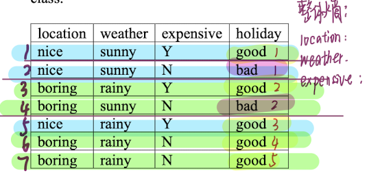

(1) 整体 entropy：
 训练集共 $7$ 个样本，其中 $good=5,\ bad=2$。

$H(S)=-\frac{5}{7}\log_2\frac{5}{7}-\frac{2}{7}\log_2\frac{2}{7}=0.35+0.52=0.87$

所以整体熵为：

$\boxed{H(S)=0.87}$

(2) 计算 information gain，选择 root attribute：

location：
 nice 有 $3$ 个样本，$good=2,\ bad=1$：

$H(nice)=-\frac{2}{3}\log_2\frac{2}{3}-\frac{1}{3}\log_2\frac{1}{3}=0.92$

boring 有 $4$ 个样本，$good=3,\ bad=1$：

$H(boring)=-\frac{3}{4}\log_2\frac{3}{4}-\frac{1}{4}\log_2\frac{1}{4}=0.81$

加权熵：

$\frac{3}{7}\times0.92+\frac{4}{7}\times0.81\approx0.86$

信息增益：

$IG(location)=0.87-0.86=0.01$

weather：
 sunny 有 $3$ 个样本，$good=1,\ bad=2$：

$H(sunny)=0.92$

rainy 有 $4$ 个样本，$good=4,\ bad=0$：

$H(rainy)=0$

加权熵：

$\frac{3}{7}\times0.92+\frac{4}{7}\times0=0.39$

信息增益：

$IG(weather)=0.87-0.39=0.48$

expensive：
 Y 有 $3$ 个样本，$good=3,\ bad=0$：

$H(Y)=0$

N 有 $4$ 个样本，$good=2,\ bad=2$：

$H(N)=1$

加权熵：

$\frac{3}{7}\times0+\frac{4}{7}\times1=0.57$

信息增益：

$IG(expensive)=0.87-0.57=0.30$

结论：

$IG(weather)=0.48$ 最大，所以 root attribute 选择：

$\boxed{weather}$

### Question 7

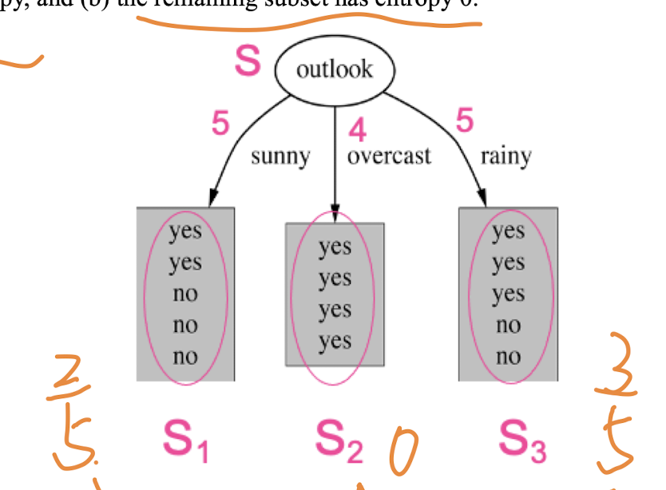

(1) a 和 b 怎么判断？How to judge a and b? (a) True，(b) True。Both statements are true.
 (2) 为什么？Why? 因为 S1 和 S3 都是 2 个 yes、3 个 no，类别比例一样，所以熵相同；S2 全是 yes，最纯，所以熵是 0。S1 and S3 have the same class distribution, so they have the same entropy; S2 contains only one class, so its entropy is 0.

### 1 Question 3. Decision tree

给定如下训练数据，其中 **location、weather、expensive** 是特征，**holiday** 是类别。

a) 关于类别 holiday，这组训练样本的 entropy（熵）是多少？
 b) 我们希望使用 information gain（信息增益）构建决策树。哪个属性会被选为树的 root（根节点）？请展示你的计算过程。

(1) 整体 entropy：
 训练集共 $7$ 个样本，其中 $good=5,\ bad=2$。

$H(S)=-\frac{5}{7}\log_2\frac{5}{7}-\frac{2}{7}\log_2\frac{2}{7}=0.35+0.52=0.87$

所以整体熵为：

$\boxed{H(S)=0.87}$

(2) 计算 information gain，选择 root attribute：

location：
 nice 有 $3$ 个样本，$good=2,\ bad=1$：

$H(nice)=-\frac{2}{3}\log_2\frac{2}{3}-\frac{1}{3}\log_2\frac{1}{3}=0.92$

boring 有 $4$ 个样本，$good=3,\ bad=1$：

$H(boring)=-\frac{3}{4}\log_2\frac{3}{4}-\frac{1}{4}\log_2\frac{1}{4}=0.81$

加权熵：

$\frac{3}{7}\times0.92+\frac{4}{7}\times0.81\approx0.86$

信息增益：

$IG(location)=0.87-0.86=0.01$

weather：
 sunny 有 $3$ 个样本，$good=1,\ bad=2$：

$H(sunny)=0.92$

rainy 有 $4$ 个样本，$good=4,\ bad=0$：

$H(rainy)=0$

加权熵：

$\frac{3}{7}\times0.92+\frac{4}{7}\times0=0.39$

信息增益：

$IG(weather)=0.87-0.39=0.48$

expensive：
 Y 有 $3$ 个样本，$good=3,\ bad=0$：

$H(Y)=0$

N 有 $4$ 个样本，$good=2,\ bad=2$：

$H(N)=1$

加权熵：

$\frac{3}{7}\times0+\frac{4}{7}\times1=0.57$

信息增益：

$IG(expensive)=0.87-0.57=0.30$

结论：

$IG(weather)=0.48$ 最大，所以 root attribute 选择：

$\boxed{weather}$

### Question 7

(1) a 和 b 怎么判断？How to judge a and b? (a) True，(b) True。Both statements are true.
 (2) 为什么？Why? 因为 S1 和 S3 都是 2 个 yes、3 个 no，类别比例一样，所以熵相同；S2 全是 yes，最纯，所以熵是 0。S1 and S3 have the same class distribution, so they have the same entropy; S2 contains only one class, so its entropy is 0.

### 3. 剪枝与过拟合 / Pruning and Overfitting

#### 3.1 为什么需要剪枝 / Why Pruning Is Needed

##### 核心意思 / Core Meaning

① 如果决策树一直生长到完美分类 training set，它可能会变得太具体。If a decision tree grows until it perfectly classifies the training set, it may become too specific.

② 太具体的树容易 overfit。An overly specific tree is likely to overfit.

③ overfitting 指 training data 上 accuracy 很高，但 new data 上 accuracy 很低。Overfitting means high accuracy on training data but low accuracy on new data.

④ 本质是树记住了训练数据，而不是学习一般规律。The tree memorizes the training data instead of learning general patterns.

#### 3.2 决策树过拟合原因 / Causes of Overfitting in Decision Trees

##### 常见原因 / Common Causes

① training data 太小，不能代表真实数据分布。The training data is too small and cannot represent the real data distribution.

② training data 有 noise，比如 label 标错。The training data contains noise, such as incorrectly labelled examples.

③ 决策树为了拟合这些噪声，会增加额外 branches。The decision tree adds extra branches to fit these noisy examples.

④ 结果是树变得 overly specific，测试集表现下降。As a result, the tree becomes overly specific and performs worse on the test set.

#### 3.3 剪枝策略 / Pruning Strategies

##### 两种主要策略 / Two Main Strategies

① pre-pruning 是提前停止生长，不让树完全拟合 training set。Pre-pruning stops tree growth early before it perfectly fits the training set.

② post-pruning 是先让树完整生长，再把不必要的部分剪掉。Post-pruning first grows the full tree and then removes unnecessary parts.

③ 实践中更常用 post-pruning。Post-pruning is preferred in practice.

④ 剪枝程度通常用 validation set 来决定。The amount of pruning is usually decided using a validation set.

##### 数据集划分 / Dataset Split

① training set 用来构建决策树。The training set is used to build the decision tree.

② validation set 用来判断剪枝是否有帮助，以及什么时候停止剪枝。The validation set is used to evaluate pruning and decide when to stop.

③ test set 用来最终评估模型好不好。The test set is used to evaluate the final model.

#### 3.4 Sub-tree Replacement / 子树替换剪枝

##### 核心思想 / Core Idea

① sub-tree replacement 是一种 post-pruning 方法。Sub-tree replacement is a post-pruning method.

② 它从 bottom-up，也就是从树的底部往 root 方向检查。It works bottom-up, from the bottom of the tree toward the root.

③ 每个 non-leaf node 都可以作为剪枝候选。Each non-leaf node can be a pruning candidate.

④ 对一个候选节点，先移除它下面的整个 sub-tree。For a candidate node, remove the entire subtree rooted at that node.

⑤ 然后用一个 leaf node 替代这个 subtree。Then replace the subtree with a leaf node.

⑥ 这个 leaf node 的 class 是经过该节点的 examples 的 majority class。The class of this leaf node is the majority class of examples reaching that node.

##### 判断规则 / Decision Rule

① 剪枝后，用 validation set 计算新树的 accuracy。After pruning, calculate the accuracy of the new tree on the validation set.

② 同时计算原来旧树的 validation accuracy。Also calculate the validation accuracy of the original tree.

③ 如果新树 accuracy 更高或一样，就保留剪枝。If the new tree has better or equal accuracy, keep the pruning.

④ 如果新树 accuracy 变差，就不剪这个节点。If the new tree has worse accuracy, do not prune this node.

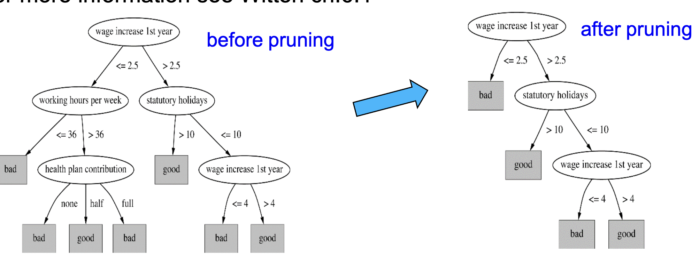

### 4. 特殊属性处理 / Handling Special Attributes

#### 4.1 数值属性处理 / Numerical Attributes

##### 为什么要处理数值属性 / Why Numerical Attributes Need Processing

① 决策树通常需要把 numerical attributes 转成 nominal form。Decision trees usually need to convert numerical attributes into nominal form.

② 这个过程叫 discretization 离散化。This process is called discretization.

③ 标准方法是 binary split，比如 temperature < 45。The standard method is binary splitting, such as temperature < 45.

④ 数值属性和类别属性不同，因为数值属性可能有很多 possible split points。Numerical attributes differ from categorical attributes because they can have many possible split points.

##### 离散化步骤 / Discretization Procedure

① 先按照 numerical attribute 的值从小到大排序。First, sort the examples by the values of the numerical attribute.

② 每当相邻样本的 class 发生变化，就把中间点作为 possible split point。Whenever the class changes between adjacent examples, use the midpoint as a possible split point.

③ 对每个 possible split point 计算 information gain。Calculate information gain for every possible split point.

④ 选择 information gain 最大的 split point。Choose the split point with the highest information gain.

⑤ 这个 best split point 的 information gain 就是这个 numerical attribute 的 information gain。The information gain of the best split point is used as the information gain of the numerical attribute.

#### 4.2 Temperature 例子 / Temperature Example

##### 计算例子 / Calculation Example

① PPT 中 temperature 的值从小到大排序。In the PPT, temperature values are sorted from low to high.

② 其中一个 split point 是 70 和 71 之间，也就是 70.5。One split point is between 70 and 71, which is 70.5.

③ 分裂规则可以写成 temperature < 70.5。The split rule can be written as temperature < 70.5.

④ temperature < 70.5 的子集有 4 yes 和 1 no。The subset temperature < 70.5 has 4 yes and 1 no.

⑤ temperature ≥ 70.5 的子集有 4 yes 和 5 no。The subset temperature ≥ 70.5 has 4 yes and 5 no.

⑥ PPT 中这个 split 的 information gain 是 0.09 bits。In the PPT, the information gain for this split is 0.09 bits.

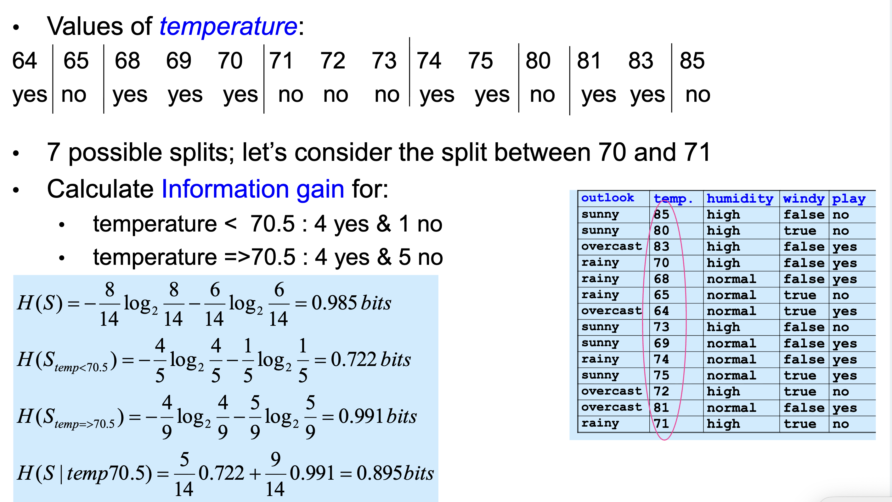

#### 4.3 高分支属性问题 / Highly Branching Attributes Problem

##### 问题是什么 / What Is the Problem

① highly branching attribute 指取值很多的属性。A highly branching attribute is an attribute with many possible values.

② information gain 会偏向选择 highly branching attributes。Information gain is biased toward selecting highly branching attributes.

③ 原因是这种属性更容易把数据分成很小、很 pure 的子集。The reason is that such attributes are more likely to split data into very small and pure subsets.

④ pure subset entropy 低，所以 information gain 会很高。Pure subsets have low entropy, so the information gain becomes high.

##### ID Code 例子 / ID Code Example

① 如果使用 ID code 作为属性，每个样本可能都有唯一 ID。If ID code is used as an attribute, each example may have a unique ID.

② 这样每个 branch 只包含一个 example。Then each branch contains only one example.

③ 单个 example 的 entropy 是 0。A single-example subset has entropy 0.

④ 因此 ID code 的 information gain 可能非常高。Therefore, ID code may have very high information gain.

⑤ 但这只是记住了训练数据，不能帮助模型泛化。However, this only memorizes the training data and does not help generalization.

⑥ 所以这种情况很容易导致 overfitting。Therefore, this situation is likely to cause overfitting.

#### 4.4 Gain Ratio / 增益率

##### 核心意思 / Core Meaning

① gain ratio 是 information gain 的改进版本。Gain ratio is a modified version of information gain.

② 它用来减少 information gain 对 highly branching attributes 的偏向。It reduces the bias of information gain toward highly branching attributes.

③ 它在选择属性时会考虑 branches 的数量。It takes the number of branches into account when selecting an attribute.

④ 如果某个 attribute 分支太多，gain ratio 会对它进行惩罚。If an attribute has too many branches, gain ratio penalizes it.

##### 为什么需要 Gain Ratio / Why Gain Ratio Is Needed

① information gain 只看 entropy reduction，容易被 ID code 这种属性骗到。Information gain only looks at entropy reduction, so it can be misled by attributes like ID code.

② gain ratio 会考虑属性是否产生太多 branches。Gain ratio considers whether an attribute creates too many branches.

③ 因此 gain ratio 更适合处理 highly branching attributes。Therefore, gain ratio is more suitable for handling highly branching attributes.

### 5. 决策树特点与注意点 / Characteristics and Important Notes

#### 5.1 决策树特点 / Characteristics of Decision Trees

##### 优点 / Advantages

① 决策树很流行，是经典的 ML 和 DM 方法。Decision trees are popular and classic methods in machine learning and data mining.

② 决策树容易实现。Decision trees are easy to implement.

③ 决策树容易解释。Decision trees are interpretable.

④ 生成的树可以可视化，非专家和客户也比较容易理解。The produced tree can be visualized and is easier for non-experts and clients to understand.

⑤ 可解释性可以增加人们对模型的信任。Interpretability can increase trust in using the model in practice.

#### 5.2 需要注意的点 / Important Notes

##### 局限与处理方法 / Limitations and Handling Methods

① 决策树容易 overfit，所以需要 pruning。Decision trees can overfit, so pruning is needed.

② numeric attributes 通常要通过 binary split 转成 nominal form。Numeric attributes are usually converted into nominal form using binary splits.

③ 选择最佳属性时可以使用 information gain、gain ratio 或其他指标。The best attribute can be selected using information gain, gain ratio, or other measures.

④ 不同版本的决策树可能使用不同 purity measure。Different versions of decision trees may use different purity measures.

⑤ 例如 CART 使用 Gini Index，而不是 entropy。For example, CART uses Gini Index instead of entropy.

##  **Week 5b：Ensemble Methods 集成方法**。这份 PPT 主要讲：ensemble 的动机、Bagging、Boosting、AdaBoost、Gradient Boosting 和 Random Forest。

### 1. Ensemble 基础与动机 / Ensemble Basics and Motivation

#### 1.1 Ensemble Method 是什么 / What Is an Ensemble Method

##### 核心意思 / Core Meaning

① ensemble method 是把多个 classifiers 的预测结果组合起来。An ensemble method combines the predictions of multiple classifiers.

② 被组合的分类器叫 base classifiers。The classifiers being combined are called base classifiers.

③ base classifiers 都是用 training data 训练出来的。Base classifiers are created using the training data.

④ 对新样本进行预测时，可以使用 majority vote 或 weighted vote。For a new example, predictions can be combined using majority vote or weighted vote.

⑤ ensemble 通常比单个 base classifier 表现更好。An ensemble often performs better than the individual base classifiers it combines.

##### 例子 / Example

① 可以训练 3 个 base classifiers，比如 kNN、logistic regression 和 decision tree。We can train 3 base classifiers, such as kNN, logistic regression, and decision tree.

② 对新样本预测时，三个模型分别给出结果。For a new example, the three models each produce a prediction.

③ 最后用 majority vote 决定最终类别。Finally, majority vote is used to decide the final class.

#### 1.2 为什么 Ensemble 有用 / Why Ensembles Are Useful

##### 核心思想 / Core Idea

① 单个 classifier 可能会犯错，但多个 classifier 组合后可以互相弥补。A single classifier may make mistakes, but multiple classifiers can compensate for each other.

② 如果 base classifiers 都犯一样的错误，ensemble 不会变好。If base classifiers make the same mistakes, the ensemble will not improve.

③ 如果 base classifiers 的错误相对 independent，ensemble 的错误率可能大幅下降。If the errors of base classifiers are relatively independent, the ensemble error rate can drop significantly.

#### 1.3 25 个分类器例子 / Example with 25 Classifiers

##### Case 1：Base Classifiers 完全相同 / Identical Base Classifiers

① 假设有 25 个 binary classifiers，每个 classifier 的 error rate 是 $\epsilon=0.35$。Assume there are 25 binary classifiers, and each classifier has error rate $\epsilon=0.35$.

② 如果这些 classifiers 完全相同，也就是犯同样的错误，那么 ensemble error 还是 0.35。If these classifiers are identical and make the same mistakes, the ensemble error remains 0.35.

③ 这种情况下，ensemble 没有带来提升。In this case, the ensemble brings no improvement.

##### Case 2：Base Classifiers 相互独立 / Independent Base Classifiers

① 如果 base classifiers 的错误互不相关，那么 ensemble 会更强。If base classifiers make uncorrelated errors, the ensemble becomes stronger.

② 对一个新样本，只有超过一半的 classifiers 都预测错时，ensemble 才会预测错。For a new example, the ensemble is wrong only if more than half of the classifiers are wrong.

③ 25 个 classifiers 中，至少 13 个预测错，majority vote 才会错。Among 25 classifiers, at least 13 must be wrong for the majority vote to be wrong.

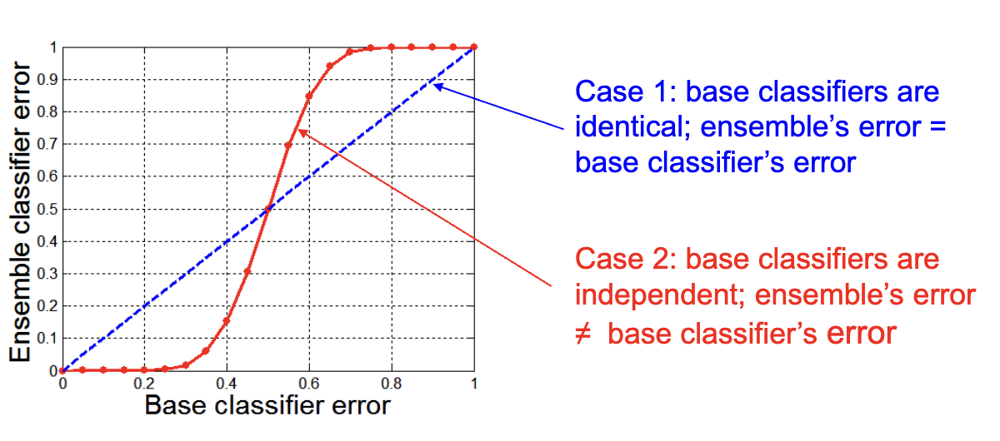

##### 关键公式 / Key Formula

$$
e_{ensemble}=\sum_{i=13}^{25}\binom{25}{i}\epsilon^i(1-\epsilon)^{25-i}
$$

① 当 $\epsilon=0.35$ 时，ensemble error rate 约为 0.06。When $\epsilon=0.35$, the ensemble error rate is about 0.06.

② 0.06 小于 0.35，所以 ensemble 明显优于单个 base classifier。0.06 is smaller than 0.35, so the ensemble is much better than a single base classifier.

#### 1.4 Ensemble 什么时候有效 / When Ensembles Work Well

##### 有效条件 / Conditions

① base classifiers 要足够好，也就是比 random guessing 好。Base classifiers must be good enough, meaning better than random guessing.

② 对 binary classifier 来说，要求 error rate $\epsilon < 0.5$。For binary classifiers, the error rate should satisfy $\epsilon < 0.5$.

③ base classifiers 之间最好有差异，也就是 errors 不要完全相关。Base classifiers should be diverse, meaning their errors should not be fully correlated.

④ 实际中很难保证完全 independent，但 slightly correlated 也可以有好效果。In practice, full independence is hard to guarantee, but slightly correlated classifiers can still work well.

#### 1.5 如何制造 Diversity / How to Create Diversity

##### 常见方法 / Common Methods

① manipulating training data：通过重新采样 training data 生成多个训练集。Manipulating training data means creating multiple training sets by resampling the original data.

② Bagging 和 Boosting 都属于 manipulating training data。Bagging and Boosting both manipulate training data.

③ manipulating attributes：每个 classifier 只使用部分 features。Manipulating attributes means each classifier uses only a subset of features.

④ Random Forest 属于 manipulating attributes，也结合了 Bagging。Random Forest manipulates attributes and also uses Bagging.

⑤ manipulating learning algorithm：用不同参数构建多个 classifiers。Manipulating the learning algorithm means building classifiers with different parameters.

### 2. Bagging / Bootstrap Aggregation

### Question 2

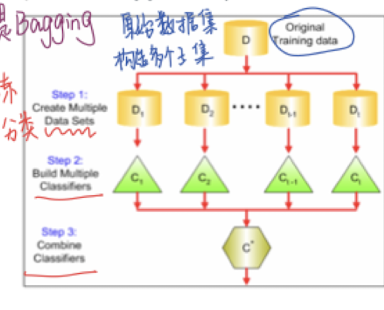

(1) 这种集成方法是什么？What ensemble method is this? 这是装袋法。因为它从原始训练集抽出多个数据子集，分别训练多个分类器，最后再合并预测。This is Bagging, because it creates multiple sampled datasets, trains separate classifiers, and combines their outputs.
 (2) 装袋法和提升方法有什么区别？What is the difference between Bagging and Boosting? 装袋法是并行训练，通常用有放回抽样，主要降低方差。Bagging trains models in parallel, usually with bootstrap sampling, and mainly reduces variance. 提升方法是顺序训练，后一个模型重点修正前一个模型的错误，主要降低偏差。Boosting trains models sequentially, focuses on previous mistakes, and mainly reduces bias

#### 2.1 Bagging 是什么 / What Is Bagging

##### 核心意思 / Core Meaning

① Bagging 全称是 bootstrap aggregation。Bagging stands for bootstrap aggregation.

② 它通过 bootstrap sampling 生成多个不同的 training sets。It creates multiple different training sets using bootstrap sampling.

③ 然后每个 training set 训练一个 classifier。Then each training set is used to train one classifier.

④ 最后把多个 classifiers 的结果组合起来。Finally, the predictions of multiple classifiers are combined.

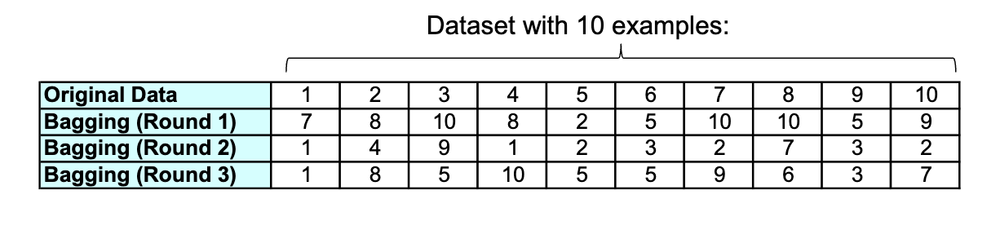

#### 2.2 Bootstrap Sample / 自助采样

##### 核心意思 / Core Meaning

① 给定原始数据集 $D$，里面有 $n$ 个 examples。Given an original dataset $D$ with $n$ examples.

② 一个 bootstrap sample $D'$ 也包含 $n$ 个 examples。A bootstrap sample $D'$ also contains $n$ examples.

③ 这些 examples 是从 $D$ 中 with replacement 随机抽取的。These examples are randomly sampled from $D$ with replacement.

④ with replacement 的意思是同一个 example 可以被抽中多次。With replacement means the same example can be selected multiple times.

⑤ 因此，有些 examples 会重复出现，有些 examples 可能一次都不出现。Therefore, some examples may appear multiple times, while others may not appear at all.

##### 重要比例 / Important Ratio

① 平均来说，原始数据中约 63% 的 examples 会出现在一个 bootstrap sample 里。On average, about 63% of the original examples appear in one bootstrap sample.

② 剩下约 37% 的 examples 不会出现在该 bootstrap sample 里。The remaining about 37% do not appear in that bootstrap sample.

#### 2.3 Bagging 如何预测 / How Bagging Predicts

##### 分类任务 / Classification Task

① 创建 $M$ 个 bootstrap samples。Create $M$ bootstrap samples.

② 每个 sample 训练一个 classifier。Train one classifier on each sample.

③ 对新样本，每个 classifier 都给出预测。For a new example, each classifier makes a prediction.

④ 最后用 majority vote 得到最终 class。Finally, use majority vote to obtain the final class.

⑤ Bagging 中每个 classifier 的投票权重相同。In Bagging, each classifier receives equal voting weight.

##### 回归任务 / Regression Task

① 如果是 regression task，就不能用 majority vote。For regression tasks, majority vote is not used.

② 回归任务中，把各个模型的预测值取平均。For regression tasks, the individual predictions are averaged.

#### 2.4 Bagging Pseudocode / Bagging 伪代码

##### Model Generation / 模型生成

① 设 training data 有 $n$ 个 examples。Let the training data contain $n$ examples.

② 对每一次 iteration，从 training data 中 with replacement 抽取 $n$ 个 examples。For each iteration, sample $n$ examples with replacement from the training data.

③ 用这个 sample 训练一个 model。Apply the learning algorithm to this sample.

④ 保存训练得到的 model。Store the resulting model.

##### Classification / 分类

① 对每个 model，让它预测 testing example 的 class。For each model, predict the class of the testing example.

② 返回出现次数最多的 class，也就是 majority vote。Return the class predicted most often, which is majority vote.

#### 2.5 Bagging 适合什么模型 / When Bagging Is Effective

##### 核心特点 / Core Features

① Bagging 通常比单个 classifier 表现明显更好。Bagging usually performs significantly better than a single classifier.

② Bagging 通常不会比单个 classifier 差很多。Bagging is usually not substantially worse than a single classifier.

③ Bagging 特别适合 unstable classifiers。Bagging is especially effective for unstable classifiers.

④ unstable classifier 指 training set 发生小变化，预测结果就会大变化的模型。An unstable classifier is a model where small changes in the training set cause large changes in predictions.

⑤ decision trees 和 neural networks 都可以看作 unstable classifiers。Decision trees and neural networks are considered unstable classifiers.

### 3. Boosting：AdaBoost 与 Gradient Boosting / Boosting: AdaBoost and Gradient Boosting

#### 3.1 Boosting 核心思想 / Main Idea of Boosting

##### 核心意思 / Core Meaning

① Boosting 是最常用的 ensemble method 之一。Boosting is one of the most widely used ensemble methods.

② 它的核心是让 classifiers 互相补充。Its core idea is to make classifiers complement each other.

③ 后一个 classifier 会重点学习前面 classifiers 分错的 examples。The next classifier focuses on examples that previous classifiers found difficult.

④ 常见 Boosting 方法包括 AdaBoost 和 Gradient Boosting。Common Boosting methods include AdaBoost and Gradient Boosting.

#### 3.2 AdaBoost 是什么 / What Is AdaBoost

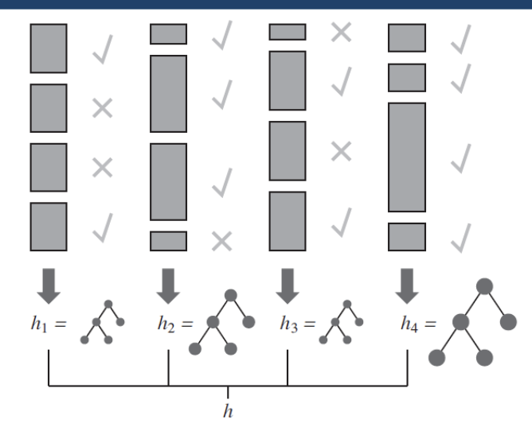

① 矩形 = 样本。 Rectangle = example.② 高度 = 样本权重。 Height = example weight.③ √ / × = 当前分类器对错。 √ / × = correct or incorrect classification.④ 树大小 = 分类器投票权重。Tree size = classifier voting weight.

##### 核心意思 / Core Meaning

① AdaBoost 使用 weighted training set。AdaBoost uses a weighted training set.

② 每个 training example 都有一个 weight。Each training example has an associated weight.

③ weight 越高，说明这个 example 越难被之前的 classifiers 正确分类。A higher weight means the example was harder for previous classifiers to classify correctly.

④ weight 高的 examples 更容易被选进下一个 classifier 的 training set。Examples with higher weights are more likely to be selected for the next classifier’s training set.

#### 3.3 AdaBoost 训练过程 / AdaBoost Training Process

##### 训练步骤 / Training Steps

① 一开始，所有 training examples 的 weight 相同，比如 $1/m$。Initially, all training examples have equal weights, such as $1/m$.

② 用这个 weighted set 训练第一个 classifier $h_1$。Use this weighted set to train the first classifier $h_1$.

③ $h_1$ 会把一些 examples 分类正确，也会把一些 examples 分类错误。$h_1$ classifies some examples correctly and some incorrectly.

④ 对分类错误的 examples，提高它们的 weights。Increase the weights of misclassified examples.

⑤ 对分类正确的 examples，降低它们的 weights。Decrease the weights of correctly classified examples.

⑥ 用新的 weighted set 训练第二个 classifier $h_2$。Use the new weighted set to train the second classifier $h_2$.

⑦ 重复这个过程，直到生成 $M$ 个 classifiers。Repeat this process until $M$ classifiers are generated.

#### 3.4 AdaBoost 如何组合模型 / How AdaBoost Combines Models

##### Weighted Vote / 加权投票

① AdaBoost 最后不是简单 majority vote。AdaBoost does not use simple majority vote at the end.

② 它使用 weighted vote。It uses weighted vote.

③ 表现更好的 classifier 会有更大的投票权重。A classifier with better performance receives a larger voting weight.

④ 表现较差的 classifier 投票权重较小。A weaker classifier receives a smaller voting weight.

#### 3.5 AdaBoost Algorithm / AdaBoost 算法

##### Model Generation / 模型生成

① 给定 training set $D$，其中有 $m$ 个 training examples。Given training set $D$, with $m$ training examples.

② 给每个 example 分配相同的初始权重 $p_i$，比如 $1/m$。Assign equal initial weight $p_i$ to each example, such as $1/m$.

③ $p_i$ 决定 example $i$ 被选入下一个 training set 的概率。$p_i$ determines the probability that example $i$ is selected into the next training set.

④ 每一轮生成一个 data subset $D_k$。In each iteration, generate a data subset $D_k$.

⑤ 用 $D_k$ 训练一个 model。Train a model using $D_k$.

⑥ 计算每个 example 是否被当前 model 分类错误。Compute whether each example is misclassified by the current model.

⑦ 对分类正确的 examples，降低它们的 weights。For correctly classified examples, decrease their weights.

⑧ 对分类错误的 examples，相对提高它们的 weights。For misclassified examples, relatively increase their weights.

⑨ 最后 normalize 所有 weights，使它们加起来等于 1。Finally, normalize all weights so that they sum to 1.

##### Classification / 分类

① 对新样本，每个 model 都给出预测。For a new example, each model gives a prediction.

② 最后根据每个 model 的准确性进行 weighted vote。Finally, combine predictions using weighted vote based on each model’s accuracy.

#### 3.6 Weak Learner / 弱学习器

##### 核心意思 / Core Meaning

① weak learner 是比 random guessing 稍微好一点的 classifier。A weak learner is a classifier that performs slightly better than random guessing.

② 对 binary classification 来说，weak learner 的准确率略高于 50%。For binary classification, a weak learner has accuracy slightly higher than 50%.

③ AdaBoost 可以把一组 weak learners 提升成 strong learner。AdaBoost can boost a set of weak learners into a strong learner.

④ 因此，Boosting 可以用很简单的模型构建强分类器，比如 1-level decision trees。Therefore, Boosting can build a powerful classifier from very simple models, such as 1-level decision trees.

#### 3.7 Gradient Boosting / 梯度提升

##### 核心意思 / Core Meaning

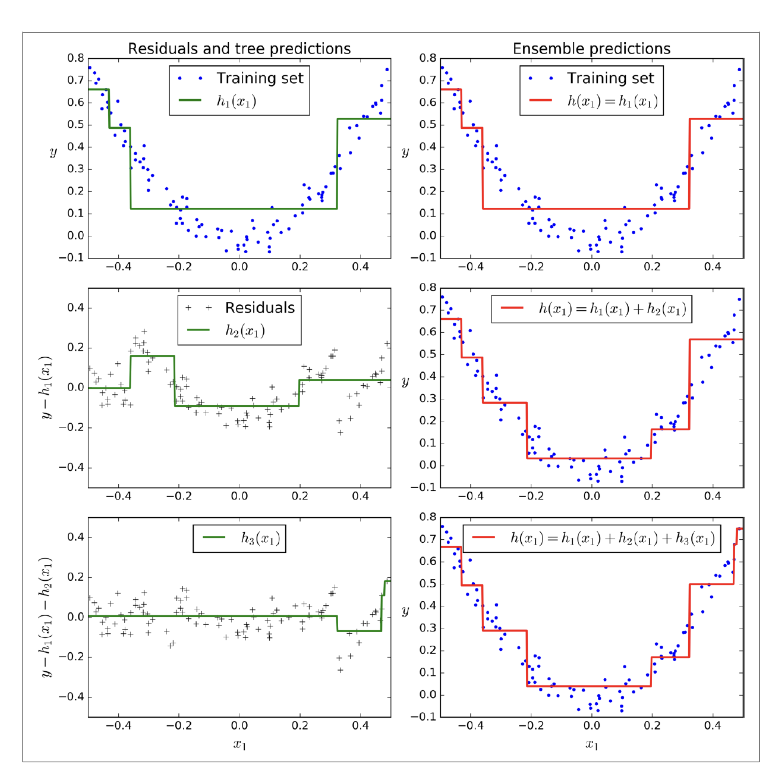

① Gradient Boosting 通常使用 decision trees 作为 base learners。Gradient Boosting usually uses decision trees as base learners.

② 这些 trees 通常是 shallow weak trees。These trees are usually shallow weak trees.

③ 它也按顺序不断加入新的 base learners。It also sequentially adds new base learners.

④ 每个新模型都重点修正前一个模型的错误。Each new model focuses on correcting the errors of the previous model.

⑤ AdaBoost 是更新 examples 的 weights。AdaBoost updates the weights of training examples.

⑥ Gradient Boosting 是增加一个新模型来 minimize previous model’s error。Gradient Boosting adds a new model to minimize the previous model’s error.

#### 3.8 Gradient Boosting 回归例子 / Gradient Boosting Regression Example

##### 训练过程 / Training Process

① 先训练第一个 decision tree：DT1 拟合 $(X,y)$。First train decision tree DT1 to fit $(X,y)$.

② 计算 DT1 在 training data 上的 residual，也就是真实值减去预测值。Calculate DT1’s residuals on the training data, which are actual values minus predicted values.
$$
y_2 = y - \hat{y}_{DT1}
$$
③ 再训练第二个 decision tree：DT2 拟合 $(X,y_2)$。Then train DT2 to fit $(X,y_2)$.

④ 计算新的 residual。Calculate the new residual.
$$
y_3 = y_2 - \hat{y}_{DT2}
$$
⑤ 再训练第三个 decision tree：DT3 拟合 $(X,y_3)$。Then train DT3 to fit $(X,y_3)$.

⑥ 预测新样本时，把 DT1、DT2、DT3 的预测结果加起来。When predicting a new example, sum the predictions of DT1, DT2, and DT3.

#### 3.9 Bagging 和 Boosting 对比 / Bagging vs Boosting

##### 相同点 / Similarities

① 两者都组合多个 learners 的输出。Both combine the outputs of multiple learners.

② 分类任务中通常用 voting。For classification tasks, they usually use voting.

③ 回归任务中通常用 averaging 或 sum。For regression tasks, they usually use averaging or summation.

④ 两者通常组合相同类型的 classifiers，比如 decision trees。Both often combine classifiers of the same type, such as decision trees.

##### 不同点 / Differences

① Bagging 中 base classifiers 是 separately created。In Bagging, base classifiers are created separately.

② Boosting 中 base classifiers 是 iteratively created。In Boosting, base classifiers are created iteratively.

③ Bagging 中每个 base learner 权重相同。In Bagging, all base learners have equal weight.

④ AdaBoost 中不同 base learners 根据 training performance 获得不同权重。In AdaBoost, different base learners receive different weights based on training performance.

⑤ Boosting 的新模型会重点学习之前模型分错的 examples。In Boosting, new models focus on examples misclassified by previous models.

### 4. Random Forest 与整体对比 / Random Forest and Overall Comparison

#### 4.1 Random Forest 核心思想 / Main Idea of Random Forest

##### 核心意思 / Core Meaning

① Random Forest 是一种 ensemble method。Random Forest is an ensemble method.

② 它组合多个 decision trees。It combines multiple decision trees.

③ 它使用 Bagging 生成多个 bootstrap samples。It uses Bagging to generate multiple bootstrap samples.

④ 它还会在构建每棵树时随机选择 features。It also randomly selects features when building each tree.

⑤ 因此 Random Forest = Bagging + random feature selection。Therefore, Random Forest = Bagging + random feature selection.

#### 4.2 Manipulating Attributes / 操作属性

##### 核心意思 / Core Meaning

① 每个 base classifier 只使用一部分 features。Each base classifier uses only a subset of features.

② 假设 training data 有 $K$ 个 features。Assume the training data has $K$ features.

③ 可以创建 $M$ 个 classifiers，每个 classifier 只使用较少的 $L$ 个 features。We can create $M$ classifiers, each using a smaller number $L$ of features.

④ 其中 $L。Here, $L.

⑤ 这样可以制造 classifiers 之间的 diversity。This creates diversity among classifiers.

#### 4.3 Random Forest Algorithm / 随机森林算法

##### 参数含义 / Parameter Meaning

① $n$ 表示 training examples 的数量。$n$ is the number of training examples.

② $m$ 表示所有 features 的数量。$m$ is the number of all features.

③ $k$ 表示每棵树在选择 split attribute 时考虑的 features 数量。$k$ is the number of features considered when selecting the split attribute for each tree.

④ $M$ 表示 ensemble members 的数量，也就是 trees 的数量。$M$ is the number of ensemble members, meaning the number of trees.

##### Model Generation / 模型生成

① 每一轮先像 Bagging 一样生成 bootstrap sample。In each iteration, first generate a bootstrap sample as in Bagging.

② 也就是从 training data 中 with replacement 抽取 $n$ 个 instances。That means sampling $n$ instances with replacement from the training data.

③ 然后构建一棵 decision tree。Then build a decision tree.

④ 在每个 split step，不是考虑全部 $m$ 个 features。At each split step, do not consider all $m$ features.

⑤ 而是随机选择 $k$ 个 features，只在这 $k$ 个 features 里选最佳 split。Instead, randomly select $k$ features and choose the best split only among these $k$ features.

⑥ Random Forest 通常 grow decision tree without pruning。Random Forest usually grows decision trees without pruning.

##### Classification / 分类

① 对一个新样本，把它放进每一棵 decision tree。For a new example, apply it to each decision tree.

② 每棵树从 root node 开始走到 leaf node。Each tree starts from the root and reaches a leaf node.

③ 每棵树给出一个 class prediction。Each tree gives a class prediction.

④ 最后用 majority voting 得到最终结果。Finally, use majority voting to obtain the final result.

#### 4.4 Random Forest 的表现 / Performance of Random Forest

##### 影响因素 / Factors

① Random Forest 的表现取决于 individual trees 的 accuracy。Random Forest performance depends on the accuracy of individual trees.

② 它也取决于 trees 之间的 correlation。It also depends on the correlation between trees.

③ 理想情况是每棵树都比较准确，但树与树之间相关性低。Ideally, individual trees should be accurate, but less correlated with each other.

④ Bagging 和 random feature selection 都是为了制造 diversity，降低 tree correlation。Bagging and random feature selection both create diversity and reduce correlation between trees.

#### 4.5 k 的影响 / Effect of k

##### 核心意思 / Core Meaning

① $k$ 越大，每棵树可以选择的 features 越多。The larger $k$ is, the more features each tree can choose from.

② $k$ 增大时，individual tree 的 strength 通常会增强。When $k$ increases, the strength of individual trees usually increases.

③ 但同时 trees 之间的 correlation 也会增加。But at the same time, correlation between trees also increases.

④ 所以 $k$ 需要在 tree strength 和 diversity 之间做平衡。So $k$ needs to balance tree strength and diversity.

#### 4.6 Random Forest 的特点 / Characteristics of Random Forest

##### 优点 / Advantages

① Random Forest 通常比单棵 decision tree 表现更好。Random Forest typically outperforms a single decision tree.

② 它对 overfitting 更 robust。It is more robust to overfitting.

③ 因为每次只考虑部分 features，所以训练速度较快。It can be fast because only a subset of features is considered each time.

④ 它适合处理高维特征数据。It is suitable for data with many features.

#### 4.7 Ensemble 方法整体对比 / Overall Comparison of Ensemble Methods

##### 关键区别 / Key Differences

① Bagging 主要通过 bootstrap sampling 制造不同 training sets。Bagging mainly creates different training sets through bootstrap sampling.

② Boosting 主要让后一个 learner 重点学习前面 learner 分错的 examples。Boosting makes later learners focus on examples misclassified by earlier learners.

③ AdaBoost 通过更新 example weights 实现这个过程。AdaBoost does this by updating example weights.

④ Gradient Boosting 通过拟合 previous model 的 error 或 residual 实现这个过程。Gradient Boosting does this by fitting the previous model’s error or residual.

⑤ Random Forest 结合 Bagging 和 random feature selection。Random Forest combines Bagging and random feature selection.

##### 投票方式 / Voting Methods

① Bagging 通常使用 majority vote，每个 classifier 权重相同。Bagging usually uses majority vote, where all classifiers have equal weight.

② AdaBoost 使用 weighted vote，表现好的 classifier 权重更高。AdaBoost uses weighted vote, where better classifiers receive higher weight.

③ Random Forest 通常使用 majority vote。Random Forest usually uses majority vote.

##### 容易考的点 / Common Exam Points

① ensemble 有效的前提是 base classifiers 要 accurate and diverse。An ensemble works well when base classifiers are accurate and diverse.

② 如果 base classifiers 完全一样，ensemble 不会明显提升。If base classifiers are identical, the ensemble will not significantly improve.

③ Bagging 适合 unstable classifiers，比如 decision trees。Bagging is suitable for unstable classifiers, such as decision trees.

④ Boosting 可以把 weak learners 组合成 strong learner。Boosting can combine weak learners into a strong learner.

⑤ Random Forest = Bagging + random feature selection。Random Forest equals Bagging plus random feature selection.

## **Week 6 — SVM**

- 试卷一 Q2.2（SVM中点积的向量）
- 试卷二 Q8（特征变换Φ: x→φ(x)的目的）
- 试卷二 Q9（核技巧优势 + 核函数有效性）
- 试卷二 Q10（超平面方程、边距大小、支持向量）

### **Week 6a：Support Vector Machines / 支持向量机**。这份 PPT 主要讲：maximum margin hyperplane、linear SVM、soft-margin SVM、non-linear SVM 和 kernel trick。

### 1. SVM 基础与最大间隔 / SVM Basics and Maximum Margin

#### 1.1 SVM 是什么 / What Is SVM

##### 核心意思 / Core Meaning

① SVM 全称是 Support Vector Machine，中文叫支持向量机。SVM stands for Support Vector Machine.

② SVM 是一种常见的 classification method，主要用于分类任务。SVM is a common classification method, mainly used for classification tasks.

③ SVM 的核心目标是找到一个 decision boundary，把不同类别的数据分开。The core goal of SVM is to find a decision boundary that separates different classes.

④ 在线性分类中，这个 decision boundary 是一条 line、plane 或 hyperplane。In linear classification, this decision boundary is a line, plane, or hyperplane.

⑤ SVM 不只是找一条能分开的线，而是找 margin 最大的那条线。SVM does not just find any separating line; it finds the one with the largest margin.

#### 1.2 Hyperplane / 超平面

##### 核心意思 / Core Meaning

① hyperplane 是用来分隔不同类别样本的边界。A hyperplane is a boundary used to separate examples from different classes.

② 在二维空间中，hyperplane 是一条 line。In two-dimensional space, a hyperplane is a line.

③ 在三维空间中，hyperplane 是一个 plane。In three-dimensional space, a hyperplane is a plane.

④ 在更高维空间中，它叫 hyperplane。In higher-dimensional space, it is called a hyperplane.

⑤ 如果一条直线或超平面可以把两类数据完全分开，这个数据就是 linearly separable。If a line or hyperplane can completely separate two classes, the data is linearly separable.

#### 1.3 为什么有很多 Decision Boundaries / Why There Are Many Decision Boundaries

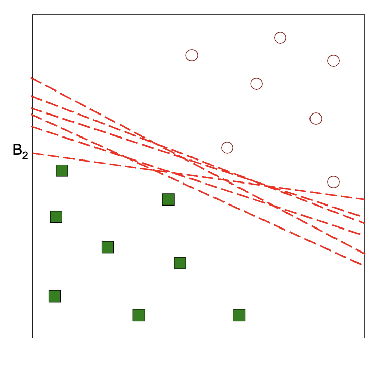

##### 核心问题 / Core Problem

① 对 linearly separable 的数据，可能有很多条线都能把两类数据分开。For linearly separable data, many lines may separate the two classes.

② 这些线都可以在 training data 上做到正确分类。All these lines can classify the training data correctly.

③ 但它们对 new data 的泛化能力不一定一样。However, their generalization performance on new data may differ.

④ 所以 SVM 要解决的问题是：应该选哪一条分界线。So the problem SVM solves is: which decision boundary should be selected.

#### 1.4 Margin / 间隔

##### 核心意思 / Core Meaning

① margin 是 decision boundary 到最近 training examples 之间的距离。Margin is the distance between the decision boundary and the closest training examples.

② margin 越大，decision boundary 离训练样本越远。The larger the margin, the farther the decision boundary is from the training examples.

③ 大 margin 通常意味着模型对 small changes 和 noise 更不敏感。A large margin usually means the model is less sensitive to small changes and noise.

④ 小 margin 更容易 overfit，因为边界附近一点点变化就可能改变分类结果。A small margin is more likely to overfit because small changes near the boundary may change classification results.

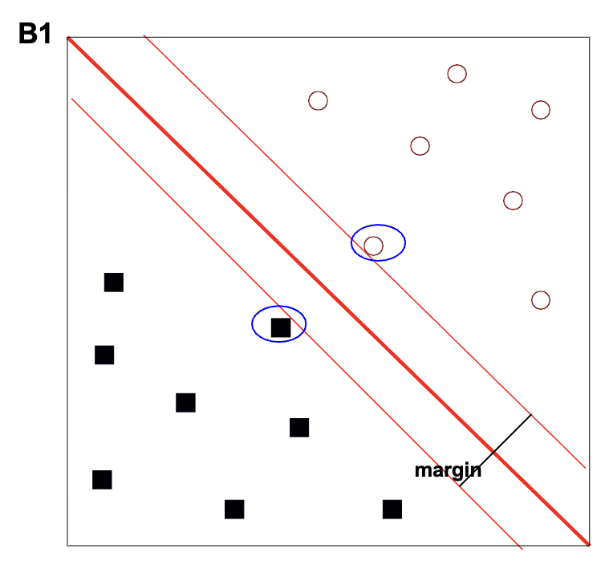

#### 1.5 Support Vectors / 支持向量

##### 核心意思 / Core Meaning

① support vectors 是离 decision boundary 最近的 training examples。Support vectors are the training examples closest to the decision boundary.

② 它们刚好接触 margin 的边界。They just touch the margin boundary.

③ support vectors 决定了 maximum margin hyperplane 的位置。Support vectors determine the position of the maximum margin hyperplane.

④ 不是所有 training examples 都决定边界，主要是 support vectors 起作用。Not all training examples determine the boundary; mainly the support vectors matter.

⑤ 可以每个 class 有多个 support vectors。There can be multiple support vectors for each class.

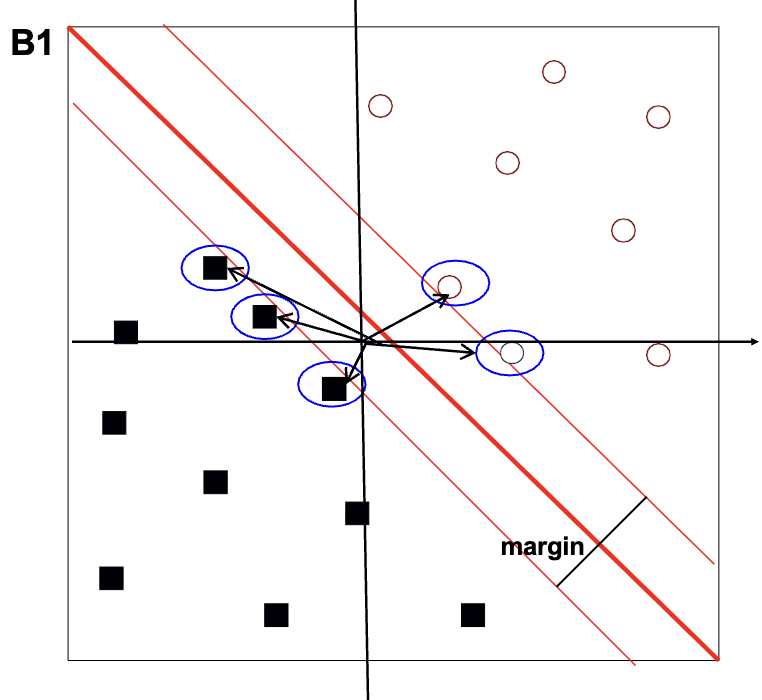

#### 1.6 Maximum Margin Hyperplane / 最大间隔超平面

##### 核心意思 / Core Meaning

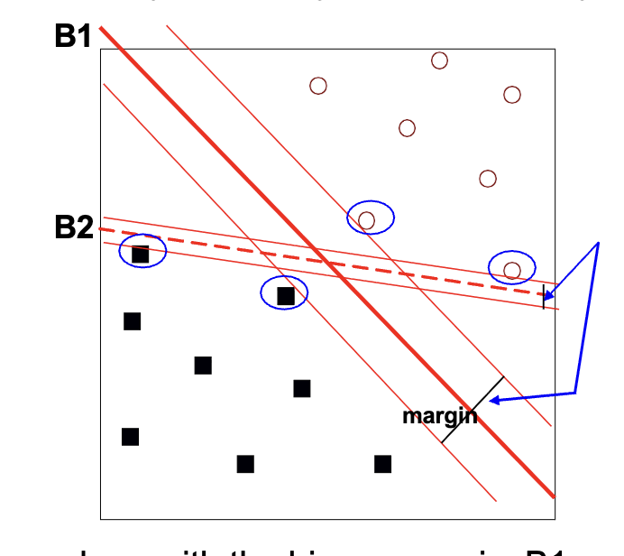

① maximum margin hyperplane 是 margin 最大的 hyperplane。The maximum margin hyperplane is the hyperplane with the largest margin.

② SVM 选择的就是 maximum margin hyperplane。SVM selects the maximum margin hyperplane.

③ 它和最近 training examples 的距离最大。It has the largest possible distance from the closest training examples.

④ 一般来说，大 margin 的 decision boundary 在 new examples 上表现更好。In general, a decision boundary with a large margin performs better on new examples.

⑤ 这个思想也和 structural risk minimization principle 有关。This idea is also related to the structural risk minimization principle.

### 2. Linear SVM / 线性支持向量机

#### 2.1 Linear Decision Boundary / 线性决策边界

##### 核心公式 / Key Formula

$$
\mathbf{w}\cdot \mathbf{x}+b=0
$$

① $\mathbf{x}$ 是 input vector，也就是一个样本的 feature vector。$\mathbf{x}$ is the input vector, meaning the feature vector of an example.

② $\mathbf{w}$ 是 weight vector，决定 decision boundary 的方向。$\mathbf{w}$ is the weight vector, which determines the direction of the decision boundary.

③ $b$ 是 bias/intercept，决定 decision boundary 的位置。$b$ is the bias or intercept, which determines the position of the decision boundary.

④ 学习一个 linear model，本质上就是找到合适的 $\mathbf{w}$ 和 $b$。Learning a linear model essentially means finding suitable $\mathbf{w}$ and $b$.

### Question 8

下图展示了 SVM 中一种特征变换的思想。请用1到2句话解释这种变换的目的。（2分）

The following figure illustrates a feature transformation idea in SVM. Explain the purposes of this transformation in one or two sentences. (2 points)

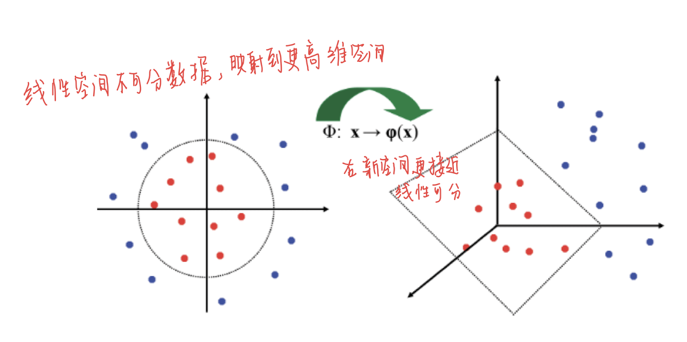

变换目的：把原来不能用直线分开的数据，映射到更高维空间，让它更容易被 linear SVM 分开。Map non-linearly separable data to higher dimension so linear SVM can separate it.

#### 2.2 如何分类新样本 / How to Classify New Examples

##### 分类规则 / Classification Rule

$$
f=\mathbf{w}\cdot \mathbf{x}+b
$$

① 如果 $f>0$，预测 class $1$。If $f>0$, predict class $1$.

② 如果 $f<0$，预测 class $-1$。If $f<0$, predict class $-1$.

③ 所以预测类别可以写成：So the predicted class can be written as:
$$
\hat{y}=\text{sign}(\mathbf{w}\cdot \mathbf{x}+b)
$$
④ 这里 sign 表示看结果是正数还是负数。Here, sign means checking whether the result is positive or negative.

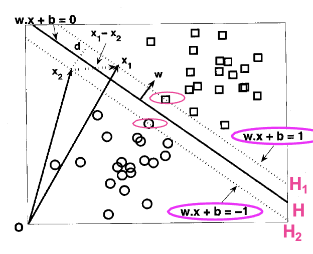

#### 2.3 SVM 的三条 Hyperplanes / Three Hyperplanes in SVM

##### 核心公式 / Key Formula

$$
H:\mathbf{w}\cdot \mathbf{x}+b=0
$$

① $H$ 是真正的 decision boundary。$H$ is the actual decision boundary.

② $H_1$ 和 $H_2$ 是 margin 的两条边界。$H_1$ and $H_2$ are the two boundaries of the margin.

③ support vectors 位于 $H_1$ 或 $H_2$ 上。Support vectors lie on $H_1$ or $H_2$.

④ decision boundary $H$ 在 $H_1$ 和 $H_2$ 的中间。The decision boundary $H$ lies in the middle of $H_1$ and $H_2$.

#### 2.4 Margin 公式 / Margin Formula

##### 关键公式 / Key Formula

$$
d=\frac{2}{\|\mathbf{w}\|}
$$

① $d$ 表示 margin 的宽度。$d$ represents the width of the margin.

② 要 maximize margin，就是要 maximize $\frac{2}{\|\mathbf{w}\|}$。To maximize the margin is to maximize $\frac{2}{\|\mathbf{w}\|}$.

③ 这等价于 minimize $\|\mathbf{w}\|$。This is equivalent to minimizing $\|\mathbf{w}\|$.

④ 实际优化时，通常 minimize 下面这个 quadratic function。In optimization, we usually minimize the following quadratic function.
$$
\frac{1}{2}\|\mathbf{w}\|^2
$$

#### 2.5 Linear SVM 的优化问题 / Optimization Problem of Linear SVM

##### Hard-margin SVM / 硬间隔 SVM

① hard-margin SVM 假设所有 training examples 都能被正确分类。Hard-margin SVM assumes all training examples can be correctly classified.

② 它的目标是找到最大 margin，同时不允许 training error。Its goal is to find the maximum margin while allowing no training error.

##### 优化目标 / Optimization Objective

$$
\min \frac{1}{2}\|\mathbf{w}\|^2
$$

##### 约束条件 / Constraint

$$
y_i(\mathbf{w}\cdot \mathbf{x}_i+b)\geq 1,\quad \forall i
$$

① $y_i$ 是第 $i$ 个样本的真实类别，取值为 $1$ 或 $-1$。$y_i$ is the true class of the $i$-th example, with value $1$ or $-1$.

② $\mathbf{x}_i$ 是第 $i$ 个 training vector。$\mathbf{x}_i$ is the $i$-th training vector.

③ 这个约束表示所有 training examples 都被正确分类，并且在 margin 外面或 margin 上。This constraint means all training examples are correctly classified and lie outside or on the margin.

#### 2.6 Lagrange Multipliers / 拉格朗日乘子

##### 核心意思 / Core Meaning

① SVM 的优化问题可以用 Quadratic Programming 和 Lagrange multiplier method 求解。The SVM optimization problem can be solved using Quadratic Programming and the Lagrange multiplier method.

② 通过 Lagrange multipliers $\lambda_i$，原问题可以转化成 dual form。Using Lagrange multipliers $\lambda_i$, the original problem can be transformed into a dual form.

③ 这个 dual form 中会出现 training vectors 之间的 dot product。The dual form contains dot products between training vectors.

##### 关键公式 / Key Formula

$$
\max W(\lambda)=\sum_{i=1}^{N}\lambda_i-\frac{1}{2}\sum_{i,j=1}^{N}\lambda_i\lambda_jy_iy_j(\mathbf{x}_i\cdot \mathbf{x}_j)
$$

##### 约束条件 / Constraints

$$
\lambda_i\geq 0
$$

① $\lambda_i$ 是每个 training example 对应的 Lagrange multiplier。$\lambda_i$ is the Lagrange multiplier corresponding to each training example.

② 不是所有 $\lambda_i$ 都非零。Not all $\lambda_i$ are non-zero.

③ $\lambda_i\neq0$ 的 examples 就是 support vectors。Examples with $\lambda_i\neq0$ are support vectors.

#### 2.7 Support Vectors 如何决定边界 / How Support Vectors Determine the Boundary

##### 关键公式 / Key Formula

$$
\mathbf{w}=\sum_{i=1}^{N}\lambda_i y_i \mathbf{x}_i
$$

① 最优 decision boundary 的 $\mathbf{w}$ 是 training examples 的线性组合。The optimal decision boundary $\mathbf{w}$ is a linear combination of training examples.

② 但很多 $\lambda_i=0$，所以真正起作用的只有少数样本。But many $\lambda_i=0$, so only a small number of examples actually matter.

③ 这些 $\lambda_i\neq0$ 的样本就是 support vectors。These examples with $\lambda_i\neq0$ are the support vectors.

④ 因此，SVM 的边界主要由 support vectors 决定。Therefore, the SVM boundary is mainly determined by support vectors.

#### 2.8 用 Support Vectors 分类新样本 / Classifying New Examples Using Support Vectors

##### 关键公式 / Key Formula

$$
f=\mathbf{w}\cdot \mathbf{z}+b
$$

① $\mathbf{z}$ 是新的 testing example。$\mathbf{z}$ is the new testing example.

② $\mathbf{x}_i\cdot \mathbf{z}$ 是新样本和 support vectors 的 dot product。$\mathbf{x}_i\cdot \mathbf{z}$ is the dot product between the new example and the support vectors.

③ 如果 $f>0$，预测 class $1$。If $f>0$, predict class $1$.

④ 如果 $f<0$，预测 class $-1$。If $f<0$, predict class $-1$.

### 3. Soft-margin SVM / 软间隔支持向量机

#### 3.1 为什么需要 Soft-margin / Why Soft-margin Is Needed

##### 核心意思 / Core Meaning

① hard-margin SVM 要求 training data 完全正确分类。Hard-margin SVM requires all training data to be classified correctly.

② 但实际数据经常有 noise 或 outliers。However, real data often contains noise or outliers.

③ 如果为了分类少数 noisy examples 而选择很小 margin 的边界，模型可能更容易 overfit。If we choose a small-margin boundary just to classify a few noisy examples correctly, the model may overfit.

④ 有时允许少量 misclassifications，反而能得到更好的 generalization。Sometimes allowing a few misclassifications can lead to better generalization.

#### 3.2 Soft-margin 的核心思想 / Core Idea of Soft-margin

##### 核心意思 / Core Meaning

① soft-margin SVM 允许一些 training examples 被错误分类。Soft-margin SVM allows some training examples to be misclassified.

② 它在 margin width 和 training error 之间做 trade-off。It makes a trade-off between margin width and training error.

③ 这样即使数据不是完全 linearly separable，也可以构建 linear boundary。In this way, a linear boundary can still be built even if the data is not perfectly linearly separable.

#### 3.3 参数 C / Parameter C

##### 核心意思 / Core Meaning

① soft-margin SVM 引入一个 hyper-parameter $C$。Soft-margin SVM introduces a hyper-parameter $C$.

② $C$ 控制 maximizing margin 和 minimizing training error 之间的权衡。$C$ controls the trade-off between maximizing the margin and minimizing training error.

③ $C$ 越大，模型越重视减少 training error。A larger $C$ means the model emphasizes reducing training error more.

④ $C$ 越大，模型越不愿意允许 misclassification。A larger $C$ means the model is less willing to allow misclassification.

⑤ $C$ 太大可能更容易 overfit。If $C$ is too large, the model may be more likely to overfit.

### 4. Non-linear SVM 与 Kernel Trick / Non-linear SVM and Kernel Trick

#### 4.1 为什么需要 Non-linear SVM / Why Non-linear SVM Is Needed

##### 核心意思 / Core Meaning

① 实际中很多问题不是 linearly separable。In practice, many problems are not linearly separable.

② 也就是说，在原始 feature space 中，无法用一条直线或一个 hyperplane 分开类别。That means in the original feature space, classes cannot be separated by a line or hyperplane.

③ non-linear SVM 可以找到非线性的 decision boundary。Non-linear SVM can find a non-linear decision boundary.

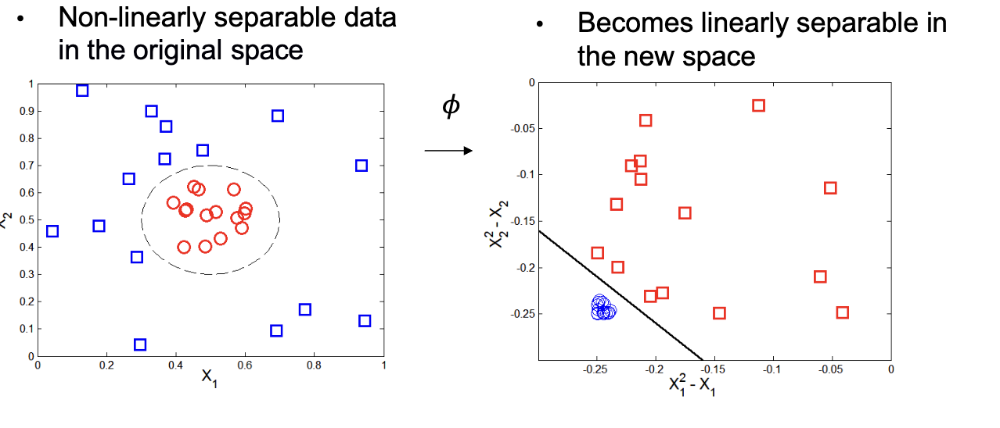

#### 4.2 Non-linear SVM 的核心思想 / Core Idea of Non-linear SVM

##### 核心步骤 / Core Steps

① 先把数据从 original feature space 转换到 new feature space。First transform the data from the original feature space to a new feature space.

② 这个 new feature space 通常维度更高。This new feature space usually has higher dimensionality.

③ 在高维空间中，原本不能线性分开的数据可能变得 linearly separable。In the higher-dimensional space, data that was not linearly separable may become linearly separable.

④ 在 new space 中学习一个 linear decision boundary。Learn a linear decision boundary in the new space.

⑤ 再映射回 original space，就变成 non-linear decision boundary。When mapped back to the original space, it becomes a non-linear decision boundary.

#### 4.3 Transformation Function / 转换函数

##### 核心意思 / Core Meaning

① transformation function 通常写作 $\Phi$。The transformation function is usually written as $\Phi$.

② 它把原始向量 $\mathbf{x}$ 映射到新的 feature space。It maps the original vector $\mathbf{x}$ to a new feature space.

③ 例如：For example:
$$
\Phi:(x_1,x_2)\rightarrow(x_1^2-x_1,\ x_2^2-x_2)
$$
④ 经过这种 transformation 后，原本 non-linearly separable 的数据可能变成 linearly separable。After this transformation, data that was non-linearly separable may become linearly separable.

#### 4.4 为什么直接高维计算很贵 / Why Direct High-dimensional Computation Is Expensive

##### 核心问题 / Core Problem

① 新空间通常是 high-dimensional。The new space is usually high-dimensional.

② 如果先显式计算 $\Phi(\mathbf{x})$，再计算 dot product，会很慢。If we explicitly compute $\Phi(\mathbf{x})$ and then compute dot products, it can be slow.

③ 但 SVM 的 dual form 主要需要的是 dot product。However, the SVM dual form mainly needs dot products.

④ 所以问题变成：如何高效计算新空间里的 dot product。So the question becomes: how can we efficiently compute dot products in the new space.

#### 4.5 Kernel Trick / 核技巧

##### 核心意思 / Core Meaning

① kernel trick 可以在不显式计算 $\Phi(\mathbf{x})$ 的情况下，得到新空间中的 dot product。The kernel trick computes dot products in the new space without explicitly computing $\Phi(\mathbf{x})$.

② 我们不先把向量转换到高维空间。We do not first transform vectors into the high-dimensional space.

③ 而是直接在原始空间计算一个 kernel function。Instead, we compute a kernel function directly in the original space.

④ kernel function 表示 original space dot product 和 transformed space dot product 之间的关系。A kernel function specifies the relationship between dot products in the original space and in the transformed space.

##### 关键公式 / Key Formula

$$
K(\mathbf{u},\mathbf{v})=\Phi(\mathbf{u})\cdot\Phi(\mathbf{v})
$$

① $K(\mathbf{u},\mathbf{v})$ 是 kernel function。$K(\mathbf{u},\mathbf{v})$ is the kernel function.

② $\Phi(\mathbf{u})\cdot\Phi(\mathbf{v})$ 是新空间中的 dot product。$\Phi(\mathbf{u})\cdot\Phi(\mathbf{v})$ is the dot product in the new space.

③ kernel trick 的价值是：我们用低维空间中的计算，间接完成高维空间中的学习。The value of the kernel trick is that we use computations in the lower-dimensional space to learn indirectly in the higher-dimensional space.

#### 4.6 Kernel Trick 例子 / Kernel Trick Example

##### Transformation / 转换

$$
\Phi(x_1,x_2)=(x_1^2,\sqrt{2}x_1x_2,x_2^2)
$$

① 原始空间是 2-dimensional。The original space is 2-dimensional.

② 新空间是 3-dimensional。The new space is 3-dimensional.

③ 对两个原始向量 $\mathbf{u}$ 和 $\mathbf{v}$，可以证明：For two original vectors $\mathbf{u}$ and $\mathbf{v}$, it can be shown that:
$$
\Phi(\mathbf{u})\cdot\Phi(\mathbf{v})=(\mathbf{u}\cdot\mathbf{v})^2
$$
④ 所以对应的 kernel function 是：So the corresponding kernel function is:
$$
K(\mathbf{u},\mathbf{v})=(\mathbf{u}\cdot\mathbf{v})^2
$$
⑤ 这说明新空间中的 dot product 可以通过原始空间的 dot product 直接得到。This shows that the dot product in the new space can be obtained directly from the dot product in the original space.

#### 4.7 Mercer’s Theorem / Mercer 定理

##### 核心意思 / Core Meaning

① 核心：不是所有 similarity function 都能当 kernel。Not every similarity is a valid kernel.

② 合法 kernel：必须对应某个特征映射 $\phi(x)$，满足 $K(x,z)=\phi(x)\cdot\phi(z)$。Must equal an inner product in some feature space.

③ Mercer 条件：kernel matrix 必须对称且半正定。Kernel matrix must be symmetric and positive semi-definite.

④ 对称：$K(x,z)=K(z,x)$。Similarity is the same both ways.

⑤ 半正定：对任意向量 $c$，都有 $c^T K c \ge 0$。No invalid negative squared length.

⑥ 作用：判断一个函数能不能作为合法 kernel。Checks whether a function is a valid kernel.

⑦ 常见合法核：linear kernel，polynomial kernel，RBF/Gaussian kernel。Common valid kernels.

### 5. 常用 Kernel 与 SVM 注意点 / Common Kernels and SVM Notes

#### 5.1 常用 Kernel Functions / Frequently Used Kernel Functions

##### Polynomial Kernel / 多项式核

$$
K(\mathbf{x},\mathbf{y})=(\mathbf{x}\cdot\mathbf{y}+1)^p
$$

① polynomial kernel 可以表示多项式形式的非线性边界。The polynomial kernel can represent polynomial-style nonlinear boundaries.

② $p$ 控制多项式的 degree。$p$ controls the degree of the polynomial.

##### RBF Kernel / 径向基函数核

$$
K(\mathbf{x},\mathbf{y})=e^{-\frac{\|\mathbf{x}-\mathbf{y}\|^2}{2\sigma^2}}
$$

① RBF kernel 是非常常用的 kernel。The RBF kernel is a very commonly used kernel.

② 它根据两个样本之间的距离来计算相似度。It calculates similarity based on the distance between two examples.

③ 距离越近，kernel value 越大。The closer the examples are, the larger the kernel value.

##### Tangent Hyperbolic Kernel / 双曲正切核

$$
K(\mathbf{x},\mathbf{y})=\tanh(k\mathbf{x}\cdot\mathbf{y}-\theta)
$$

① tangent hyperbolic kernel 也叫 sigmoid-like kernel。The tangent hyperbolic kernel is also a sigmoid-like kernel.

② 它只在某些 $k$ 和 $\theta$ 条件下满足 Mercer’s Theorem。It satisfies Mercer’s Theorem only for some values of $k$ and $\theta$.

#### 5.2 Kernel SVM 的训练 / Training SVM with Kernels

##### 关键公式 / Key Formula

$$
\max W(\lambda)=\sum_{i=1}^{N}\lambda_i-\frac{1}{2}\sum_{i,j=1}^{N}\lambda_i\lambda_jy_iy_jK(\mathbf{x}_i,\mathbf{x}_j)
$$

① kernel SVM 把原来 dual form 里的 dot product 换成 kernel function。Kernel SVM replaces the dot product in the dual form with a kernel function.

② 原来的 $\mathbf{x}_i\cdot\mathbf{x}_j$ 变成 $K(\mathbf{x}_i,\mathbf{x}_j)$。The original $\mathbf{x}_i\cdot\mathbf{x}_j$ becomes $K(\mathbf{x}_i,\mathbf{x}_j)$.

③ 这样就能在不显式进入高维空间的情况下学习 non-linear boundary。This allows learning a non-linear boundary without explicitly entering the high-dimensional space.

#### 5.3 Kernel SVM 如何分类新样本 / Classifying New Examples with Kernel SVM

##### 关键公式 / Key Formula

$$
f=\sum_{i=1}^{N}\lambda_i y_iK(\mathbf{x}_i,\mathbf{z})+b
$$

① $\mathbf{z}$ 是新的 testing example。$\mathbf{z}$ is the new testing example.

② $K(\mathbf{x}_i,\mathbf{z})$ 表示 support vector 和新样本之间的 kernel similarity。$K(\mathbf{x}_i,\mathbf{z})$ represents the kernel similarity between a support vector and the new example.

③ 如果 $f>0$，预测 class $1$。If $f>0$, predict class $1$.

④ 如果 $f<0$，预测 class $-1$。If $f<0$, predict class $-1$.

#### 5.4 SVM 的扩展 / Extensions of SVM

##### Multi-class Classification / 多分类

① SVM 原本主要是 binary classification 方法。SVM is originally mainly a binary classification method.

② 但它也可以用于 multi-class classification。However, it can also be used for multi-class classification.

③ 常见做法是把 multi-class problem 转换成多个 2-class problems。A common approach is to transform a multi-class problem into multiple two-class problems.

##### Support Vector Regression / 支持向量回归

① SVM 也有 regression 版本，叫 Support Vector Regression。SVM also has a regression version called Support Vector Regression.

② 它把 SVM 的思想扩展到预测连续数值的问题。It extends the idea of SVM to predicting continuous numeric values.

#### 5.5 容易考的点 / Common Exam Points

##### 判断类问题 / Conceptual Questions

① SVM 选择 maximum margin hyperplane，而不是随便一条能分类的线。SVM selects the maximum margin hyperplane, not just any separating line.

② support vectors 是离 decision boundary 最近的 points。Support vectors are the points closest to the decision boundary.

③ margin 越大，一般 generalization performance 越好。A larger margin generally means better generalization performance.

④ soft-margin SVM 允许少量 misclassifications，用来处理 noise 和 non-separable data。Soft-margin SVM allows some misclassifications to handle noise and non-separable data.

⑤ 参数 $C$ 越大，模型越重视减少 training error。A larger $C$ means the model emphasizes reducing training error more.

⑥ non-linear SVM 通过 feature transformation 和 kernel trick 得到非线性边界。Non-linear SVM obtains non-linear boundaries through feature transformation and the kernel trick.

⑦ kernel trick 的核心是避免显式计算高维映射。The core of the kernel trick is avoiding explicit computation of the high-dimensional mapping.

⑧ kernel function 本质上是在原始空间中计算新空间的 dot product。A kernel function essentially computes the dot product in the new space from the original space.

## **Week 6b — PCA / 降维**

- 试卷二 Q5（第一主成分角度 + 能否用PC分类）
- 试卷二 Q6（PCA性质判断题×4）

### 1. 降维的动机 / Motivation of Dimensionality Reduction

① 很多机器学习问题有成千上万个特征，维度太高会让训练变慢。
 Many machine learning problems have thousands of features, and high dimensionality makes training slower.

② 高维数据很稀疏，样本之间距离会变远，分类可能变得不可靠。
 High-dimensional data is sparse, so examples become far away from each other, making classification less reliable.

③ 高维数据更容易过拟合，因为模型可能记住噪声，而不是学习真正规律。
 High-dimensional data increases overfitting because the model may learn noise instead of real patterns.

④ 降维的目标是保留重要信息，同时删除冗余特征、高相关特征和噪声。
 The goal of dimensionality reduction is to keep important information while removing redundant, highly correlated features and noise. 

------

### 2. PCA 主成分分析 / Principal Component Analysis

#### 2.1 PCA 的核心思想 / Main Idea

① PCA 是最常用的降维方法，也叫 feature projection method。
 PCA is the most popular dimensionality reduction method and is also called a feature projection method.

② 它不是直接选择原来的某几个特征，而是构造一组新的坐标轴。
 It does not simply select some original features; instead, it constructs a new set of axes.

③ 新坐标轴叫 principal components，也就是主成分。
 The new axes are called principal components.

④ 主成分按照能解释的数据方差大小排序：
 Principal components are ordered by how much variance they capture:
$$
Var(Z_1) > Var(Z_2) > \cdots > Var(Z_m)
$$
⑤ 第一个主成分 $Z_1$ 指向数据变化最大的方向。
 The first principal component $Z_1$ points in the direction of maximum variance.

⑥ 第二个主成分 $Z_2$ 必须和 $Z_1$ 正交，并指向第二大方差方向。
 The second principal component $Z_2$ must be orthogonal to $Z_1$ and points in the second-largest variance direction.

#### 2.2 PCA 怎么降维 / How PCA Reduces Dimensionality

① 原来有 $m$ 个特征，PCA 会找到 $m$ 个主成分。
 If the original data has $m$ features, PCA finds $m$ principal components.

② 降维时，只保留前 $k$ 个主成分，其中 $k < m$。
 For dimensionality reduction, we keep only the first $k$ principal components, where $k < m$.

③ 数据点被投影到这些主成分上，所以原来需要 $m$ 个坐标表示，现在只需要 $k$ 个坐标。
 Data points are projected onto these components, so instead of using $m$ coordinates, we only need $k$ coordinates.

④ 例如二维数据中，如果数据主要沿着斜线方向分布，那么 PCA 会把这个斜线方向作为 $Z_1$，然后把二维数据压缩成一维。
 For example, in 2D data, if most variation lies along a diagonal direction, PCA treats that direction as $Z_1$ and compresses the data into 1D.

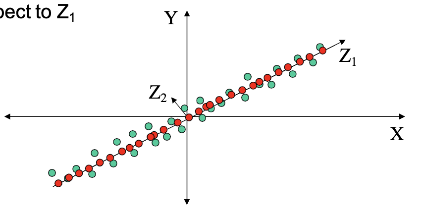

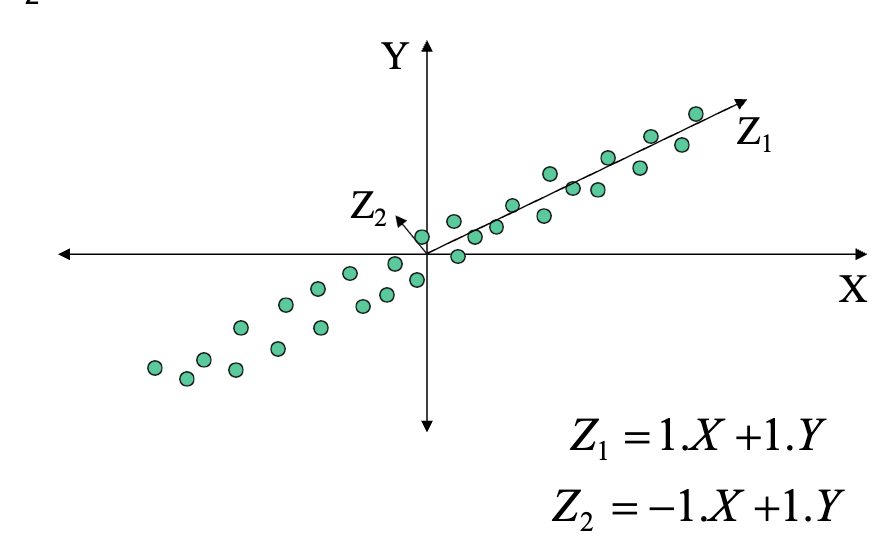

### 3. 如何选择保留多少主成分 / How to Choose the Number of Principal Components

#### 3.1 方法一：保留固定比例的方差 / Preserved Variance Method

① 可以设定一个最低保留方差比例，比如 95%。
 We can set a minimum percentage of variance to preserve, such as 95%.

② 然后选择最小的 $k$，让前 $k$ 个主成分累计解释 95% 的方差。
 Then choose the smallest $k$ such that the first $k$ components capture 95% of the variance.

#### 3.2 方法二：肘部法 / Elbow Method

① 画出维度数量和累计方差之间的关系图。
 Plot the number of dimensions against the cumulative explained variance.

② 如果曲线一开始增长很快，后来变平，那么拐点就是 elbow。
 If the curve grows quickly at first and then becomes flat, the turning point is the elbow.

③ elbow 后继续增加维度，收益变小，所以可以在 elbow 附近选择 $k$。
 After the elbow, adding more dimensions gives smaller benefits, so $k$ can be chosen near the elbow.

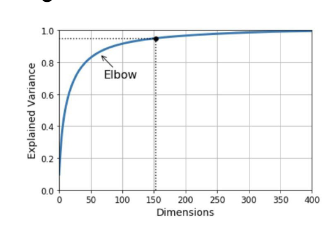

------

### 4. SVD 奇异值分解 / Singular Value Decomposition

#### 4.1 SVD 和 PCA 的关系 / Relationship Between SVD and PCA

① PCA 可以通过 SVD 来计算主成分。
 PCA can be computed using Singular Value Decomposition.

② 对一个原始数据矩阵 $X$，SVD 可以写成：
 For an original data matrix $X$, SVD writes it as:
$$
X = U \Lambda V^T
$$
③ $X$：原始数据矩阵。
 $X$: original data matrix.

④ $U$：变换后的数据，也就是数据在新坐标系中的表示。
 $U$: transformed data, meaning the coordinates of data in the new coordinate system.

⑤ $\Lambda$：对角矩阵，里面是 singular values，表示每个方向的重要程度。
 $\Lambda$: diagonal matrix containing singular values, representing the importance of each direction.

⑥ $V$：新的坐标轴，也就是 principal components。
 $V$: new axes, namely the principal components.

#### 4.2 SVD 怎么实现降维 / How SVD Reduces Data

① SVD 可以把 $X$ 拆成多个 rank-one components：
 SVD decomposes $X$ into several rank-one components:
$$
X = \lambda_1 u_1 v_1^T + \lambda_2 u_2 v_2^T + \cdots + \lambda_m u_m v_m^T
$$
② 奇异值 $\lambda$ 按从大到小排列。
 The singular values $\lambda$ are sorted in decreasing order.

③ 大的奇异值代表重要方向，小的奇异值代表弱方向。
 Large singular values represent important directions; small singular values represent weak directions.

④ 降维时只保留前 $k$ 个最强成分：
 For reduction, we keep only the first $k$ strongest components:
$$
X_{reduced} = \lambda_1 u_1 v_1^T + \lambda_2 u_2 v_2^T + \cdots + \lambda_k u_k v_k^T
$$
⑤ 这样可以用更少的信息近似原始数据。
 This gives a good approximation of the original data using less information.

------

### 5. PCA 的应用一：特征提取 / PCA for Feature Extraction

#### 5.1 Iris 数据集例子 / Iris Dataset Example

① Iris 数据集有 150 朵花，3 个类别，原始有 4 个特征。
 The Iris dataset has 150 flowers, 3 classes, and 4 original features.

② 使用 PCA 后，可以把 4 个特征压缩成 2 个新特征。
 Using PCA, the 4 features can be reduced to 2 new features.

③ PC1 捕获 92.5% 的方差，PC2 捕获 5.3% 的方差。
 PC1 captures 92.5% of the variance, and PC2 captures 5.3%.

④ 这说明大部分信息可以被少数几个主成分保留下来。
 This shows that most information can be preserved by only a few principal components.

⑤ 新特征可以继续用于训练分类器，比如 kNN、Naive Bayes 等。
 The new features can be used to train classifiers such as kNN and Naive Bayes.

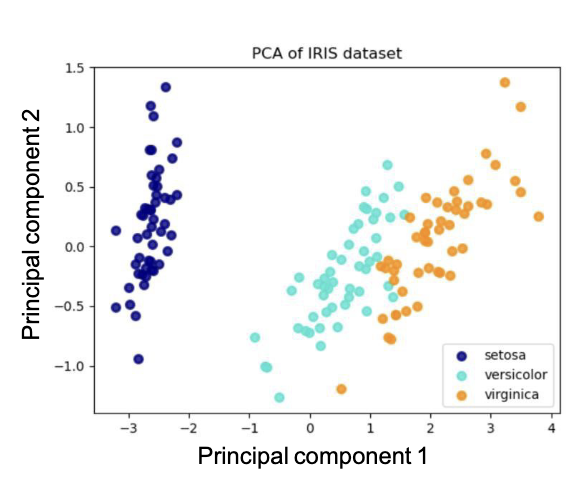

#### 5.2 人脸识别例子 / Face Recognition Example

① LFW 人脸数据集有 3023 张图片，62 个人，每张图片是 $87 \times 65$ 像素。
 The LFW face dataset has 3,023 images of 62 people, and each image is $87 \times 65$ pixels.

② 原始像素表示有 5655 个特征。
 The raw pixel representation has 5,655 features.

③ 直接用 1-nearest neighbor，测试准确率是 27%。
 Using 1-nearest neighbor directly gives 27% test accuracy.

④ 原因是像素距离不是很好的人脸相似度度量，图像轻微偏移都会造成很大差异。
 The reason is that pixel distance is not a good measure of face similarity; even a small shift can cause a large difference.

⑤ 使用 PCA 提取前 100 个主成分后，准确率提升到 36%。
 After using PCA with the first 100 principal components, accuracy improves to 36%.

⑥ 这说明 PCA 找到的新表示比原始像素更适合分类。
 This shows that PCA can provide a better representation than raw pixels.

------

### 6. PCA / SVD 的应用二：压缩 / PCA and SVD for Compression

#### 6.1 压缩的基本公式 / Compression Formula

① 对于一张灰度图像，原始大小是 $n \times m$，需要存储 $n \times m$ 个整数。
 For a grayscale image of size $n \times m$, the original storage requires $n \times m$ integer values.

② 用 SVD 压缩后，只保留前 $k$ 个成分，需要存储：
 After SVD compression with the first $k$ components, we need to store:
$$
k(1+n+m)
$$
③ 压缩率公式是：
 The compression ratio is:
$$
r = \frac{k(1+n+m)}{n \times m}
$$
④ 当 $n \gg m > k$ 时，压缩率近似为：
 When $n \gg m > k$, the ratio is approximately:
$$
r \approx \frac{k}{m}
$$

#### 6.2 图像压缩例子 / Image Compression Examples

① Mars rock image：原图是 $256 \times 264$ 灰度图，需要存储 67,584 个数字。
 Mars rock image: the original image is $256 \times 264$, requiring 67,584 numbers.

② 使用 SVD 后选择 $k=81$，需要存储：
 Using SVD with $k=81$, storage becomes:
$$
81(1+256+264)=42,201
$$
③ 压缩后是原来的 62%。
 After compression, the storage is 62% of the original.

④ MNIST 手写数字原始有 784 个特征，PCA 压缩后用 153 个特征可以保留 95% 方差。
 MNIST handwritten digits originally have 784 features; PCA compresses them to 153 features while preserving 95% variance.

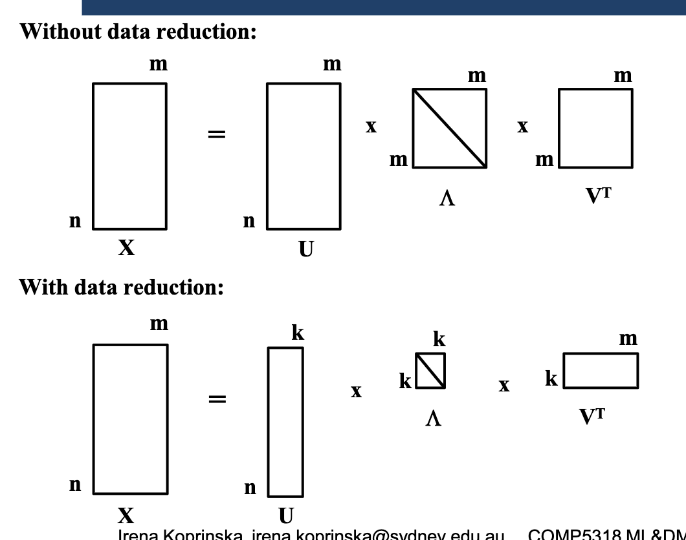

------

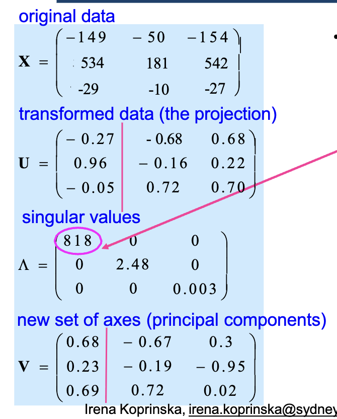

### 7. 这份 PPT 的核心逻辑 / Overall Logic

① 高维数据有问题：慢、稀疏、容易过拟合、难解释、难可视化。
 High-dimensional data causes problems: slow training, sparsity, overfitting, poor interpretability, and difficulty in visualization.

② PCA 的解决方式：找一组新的坐标轴，让前几个轴捕获最多方差。
 PCA solves this by finding new axes where the first few axes capture most of the variance.

③ 降维方法：只保留前 $k$ 个 principal components，把数据投影过去。
 Dimensionality reduction keeps only the first $k$ principal components and projects the data onto them.

④ SVD 是计算 PCA 的数学工具：
 SVD is the mathematical tool used to compute PCA:
$$
X = U \Lambda V^T
$$
⑤ PCA 可以用于两个主要任务：feature extraction 和 compression。
 PCA can be used for two main tasks: feature extraction and compression.

⑥ 在分类中，PCA 可能让表示更好，从而提高准确率。
 In classification, PCA may produce a better representation and improve accuracy.

⑦ 在压缩中，PCA/SVD 可以用少量主成分近似原始数据。
 In compression, PCA/SVD can approximate the original data using fewer components.

## **Week 7 — 神经网络基础（感知机 / MLP）**

- 试卷一 Q1.3（单感知机能否解决XOR）
- 试卷一 Q2.3（MLP用于图像分类的缺点）
- 试卷一 Q6（带偏置感知机训练一轮权重）
- 试卷二 Q13（MLP前向传播计算输出值）

### 1. Deep Learning / 深度学习

#### 1.1 概念和背景

#### 1.1 概念和背景 / Concept and Background

① **深度学习是机器学习的一种方法，它受到人脑工作方式的启发。**
 Deep learning is a machine learning approach inspired by how the human brain works.

② **在这门课里，deep learning 主要指更深的 artificial neural networks，也就是 hidden layers 更多的神经网络。**
 In this lecture, deep learning mainly refers to deeper artificial neural networks, meaning neural networks with more hidden layers.

③ **层数更多的意义是：数据会经过多次 transformation，因此模型可以学习更复杂的 input-output mappings。**
 The purpose of having more layers is that data goes through multiple transformations, allowing the model to learn more complex input-output mappings.

#### 1.2 为什么深度学习有用 / Why Deep Learning Is Useful

① **Deep neural networks 可以自动学习 hierarchical feature representations。**
 Deep neural networks can automatically learn hierarchical feature representations.

② **也就是说，前面的层可能学习简单特征，后面的层逐渐组合成更高级、更抽象的特征。**
 In other words, earlier layers may learn simple features, while later layers combine them into higher-level and more abstract features.

③ **所以深度学习特别适合 complex data 和 large datasets。**
 Therefore, deep learning is especially suitable for complex data and large datasets.

#### 1.3 应用场景 / Applications

① **深度学习在 image processing、computer vision、speech recognition 和 natural language processing 里非常成功。**
 Deep learning has been very successful in image processing, computer vision, speech recognition, and natural language processing.

② **常见例子包括 image search、machine translation、face detection、self-driving cars 和 medical image analysis。**
 Common examples include image search, machine translation, face detection, self-driving cars, and medical image analysis.

③ **这一部分的核心结论是：深度学习不是一个全新的机器学习方向，而是神经网络在层数、数据量和算力提升后的现代发展。**
 The key point is that deep learning is not a completely separate machine learning field, but a modern development of neural networks enabled by more layers, larger datasets, and stronger computing power. 

### 2. Introduction to Neural Networks / 神经网络基础

#### 2.1 Neural Network 的基本结构

① **神经网络由 neurons / units / nodes 组成，连接之间有 numerical weights。**
 A neural network consists of neurons, units, or nodes connected by links with numerical weights.

② **典型结构是 input layer、hidden layer、output layer。**
 A typical structure includes an input layer, one or more hidden layers, and an output layer.

③ **训练时，模型不断调整 weights，让输出更接近 target。**
 During training, the model adjusts weights so that the output becomes closer to the target.

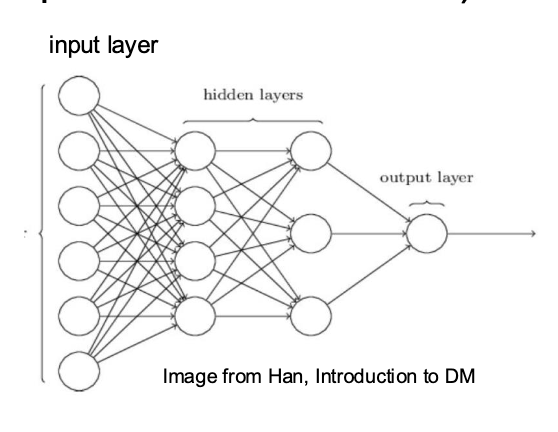

#### 2.2 Neuron 的计算逻辑

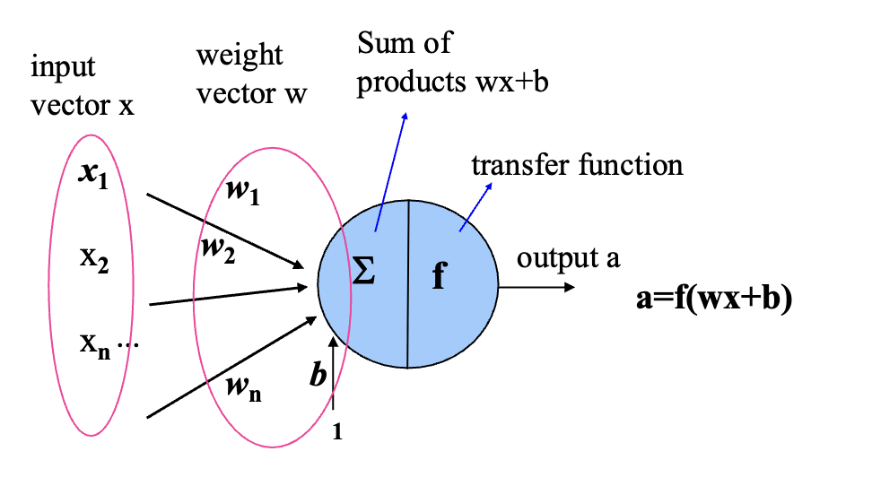

① **每个 neuron 做的是：输入 × 权重 + bias，然后通过 transfer function。**
 Each neuron computes input multiplied by weights plus a bias, then passes the result through a transfer function.
$$
a = f(wx + b)
$$
② **x 来自数据，w 和 b 是模型要学习的参数。**
 $x$ comes from the data, while $w$ and $b$ are parameters learned during training. 

### 3. Perceptrons / 感知机

#### 3.1 Perceptron 是什么

① **Perceptron 是最简单的 neural network。**
 A perceptron is the simplest neural network.

② **它使用 step transfer function，所以输出是 binary output：0/1 或 -1/1。**
 It uses a step transfer function, so its output is binary: 0/1 or -1/1.

③ **它的输出来自 weighted sum，再经过 step function。**
 Its output comes from a weighted sum followed by a step function.

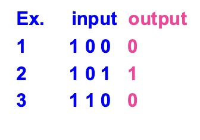

#### 3.2 Perceptron 怎么学习

① **先计算预测值 a，再和真实值 t 比较，得到 error。**
 First compute the prediction $a$, then compare it with the target $t$ to get the error.
$$
e = t - a
$$
② **如果预测错了，就更新 weight 和 bias。**
 If the prediction is wrong, update the weight and bias.
$$
w_{\text{new}} = w_{\text{old}} + ex^T
$$
③ **epoch 指完整看完一遍 training set。**
 An epoch means one full pass through the whole training set.

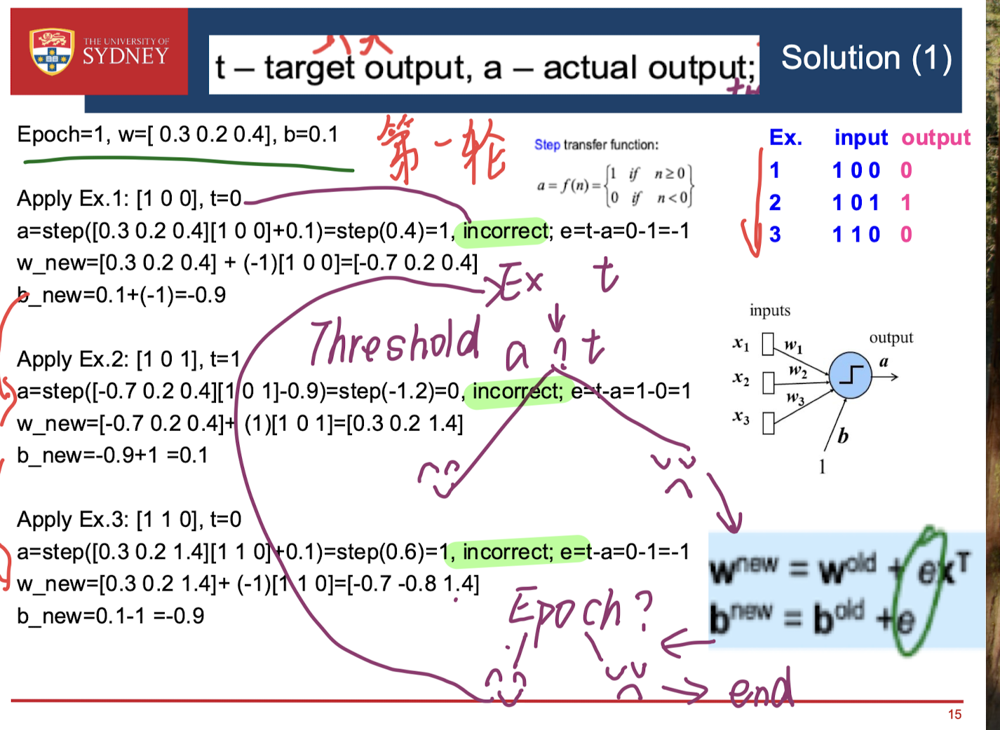

#### 3.3 Perceptron 的能力和限制

① **如果数据 linearly separable，perceptron 可以收敛。**
 If the data is linearly separable, the perceptron can converge.

② **Perceptron 会找到一条 linear decision boundary，但==不保证是最优边界==。**
 A perceptron finds a linear decision boundary, but not necessarily the optimal one.

③ **AND、OR、NAND 可以用 perceptron 表示，因为它们线性可分。**
 AND, OR, and NAND can be represented by a perceptron because they are linearly separable.

④ **XOR 不能用单层 perceptron 表示，因为它不是 linearly separable。**
 XOR cannot be represented by a single-layer perceptron because it is not linearly separable. 

​    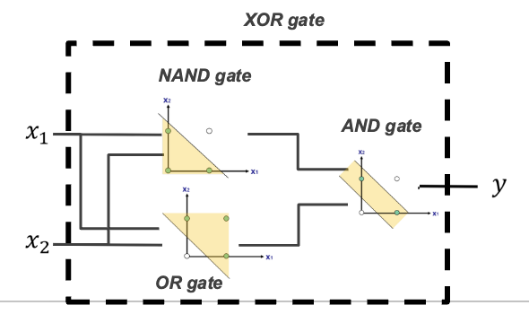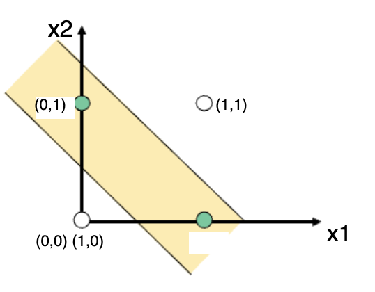

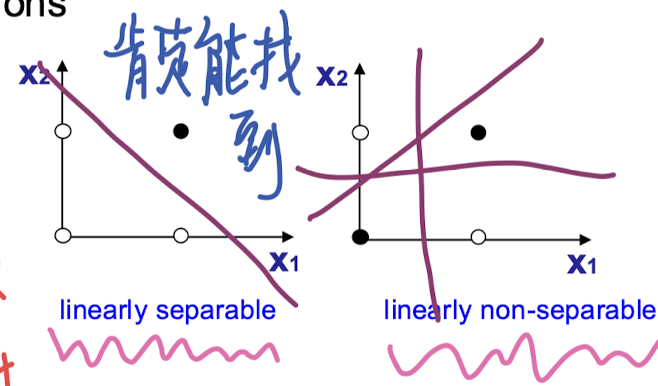

### 4. Multi-layer Perceptrons and Backpropagation / 多层感知机与反向传播

#### 4.1 为什么要加 hidden layers

① **单层 perceptron 只能形成简单线性边界。**
 A single-layer perceptron can only form simple linear boundaries.

② **加入 hidden layers 后，网络可以组合多个简单边界，形成复杂边界。**
 After adding hidden layers, the network can combine simple boundaries into complex boundaries.

③ **XOR 可以由 NAND、OR、AND 组合出来，所以多层结构可以解决 XOR。**
 XOR can be constructed from NAND, OR, and AND, so a multi-layer structure can solve XOR.

#### 4.2 Backpropagation 解决的问题

① **多层网络更强，但问题是：hidden layers 怎么训练？**
 Multi-layer networks are more powerful, but the problem is how to train hidden layers.

② **Backpropagation 的作用是把 output error 从后往前传。**
 Backpropagation sends the output error backward through the network.

③ **它让每一层都知道自己的 weights 应该怎么调整。**
 It allows each layer to know how its weights should be adjusted.

#### 4.3 Backpropagation 的训练流程

① **Forward pass：输入 x，从前往后算出 network output。**
 Forward pass: input $x$ is propagated forward to compute the network output.

② **Compute error：比较 output 和 target。**
 Compute error: compare the output with the target.

③ **Backward pass：从 output layer 往 hidden layers 反向传播 error。**
 Backward pass: propagate the error backward from the output layer to hidden layers.

④ **Update weights：用 gradient descent 更新 weights。**
 Update weights: use gradient descent to update the weights.

#### 4.4 Gradient Descent 的作用

① **Gradient descent 是为了最小化 error / loss / cost function。**
 Gradient descent is used to minimize the error, loss, or cost function.

② **learning rate 决定每次更新走多大一步。**
 The learning rate controls the size of each update step.

③ **太小会 slow convergence，太大会 oscillation 或不收敛。**
 If it is too small, convergence is slow; if too large, training may oscillate or fail to converge.

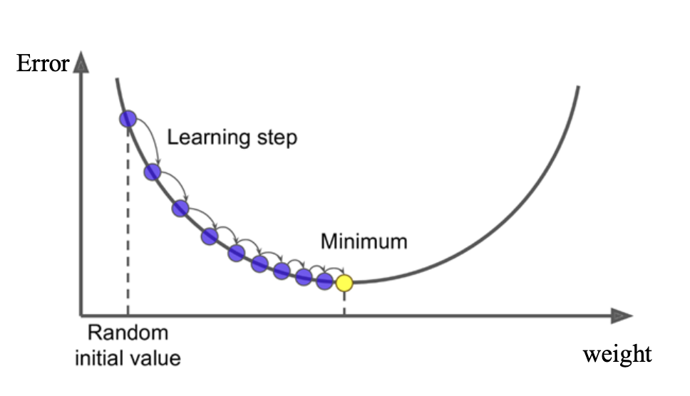

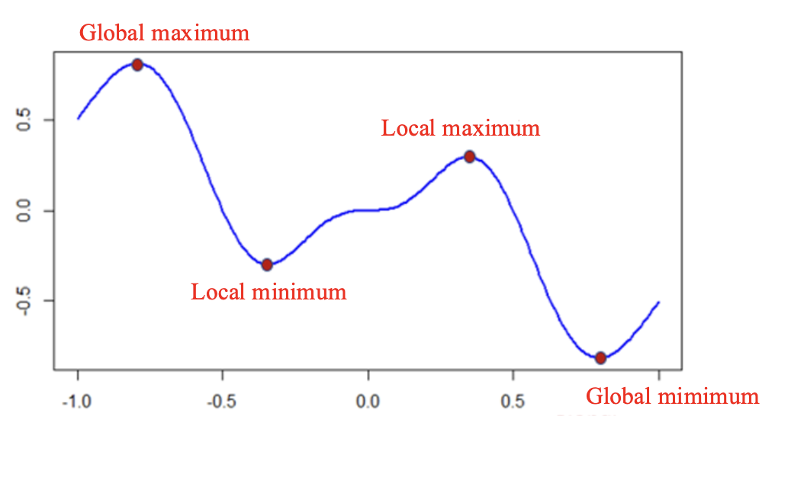

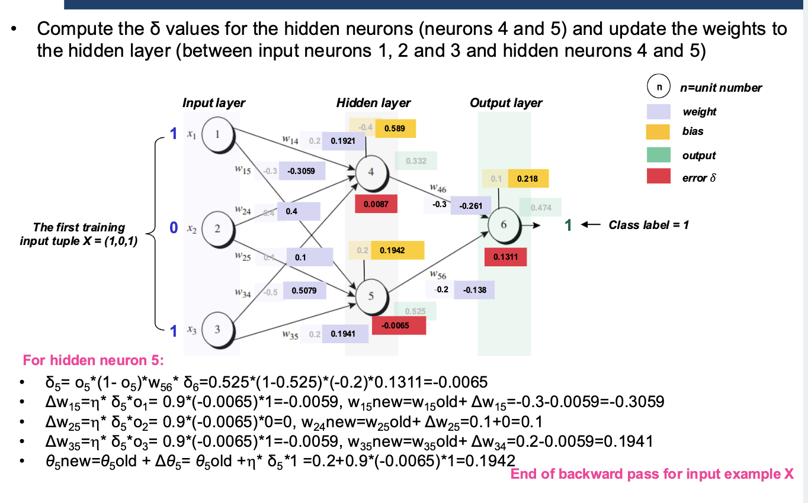

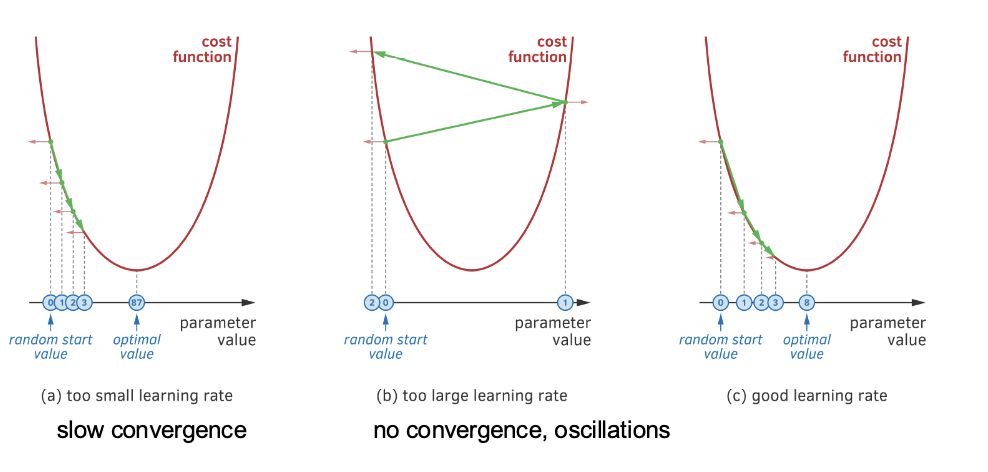

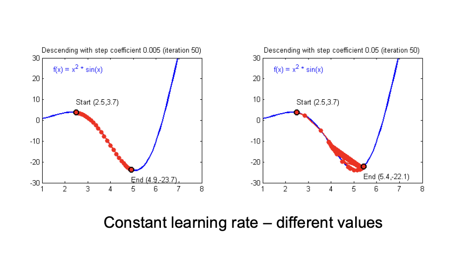

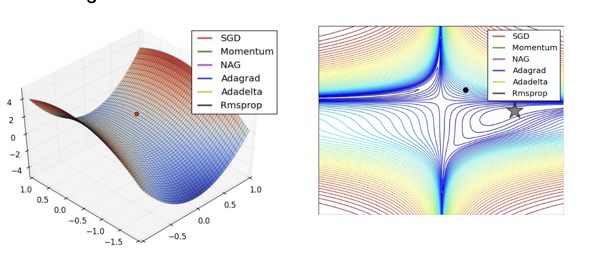

#### 4.5 SGD 和 Momentum

① **标准 gradient descent 会累积所有 training examples 的 error，再更新 weights。**
 Standard gradient descent sums the errors over all training examples before updating weights.

② **SGD 每看一个 example 就更新一次 weight，所以通常更快。**
 SGD updates weights after each example, so it is usually faster.

③ **Mini-batch SGD 是折中：每个小 batch 更新一次。**
 Mini-batch SGD is a compromise: update once per small batch.

④ **Momentum 会参考上一次 weight update，减少 oscillation。**
 Momentum uses the previous weight update to reduce oscillations. 

### 5. Creating Deep Feedforward Neural Networks / 现代深层前馈网络技巧

#### 5.1 为什么 Deep Learning 后来才成功

① **算力提升，尤其是 GPU。**
 Computing power improved, especially through GPUs.

② **大规模数据集出现，例如 ImageNet。**
 Large datasets became available, such as ImageNet.

③ **算法进步，包括 dropout、better initialization、解决 vanishing gradient。**
 Algorithmic advances include dropout, better initialization, and methods for reducing the vanishing gradient problem. 

#### 5.2 Vanishing Gradient Problem

① **深层网络中，gradient 从后往前传时可能越来越小。**
 In deep networks, gradients may become smaller as they are propagated backward.

② **lower hidden layers 收到的 weight changes 很小，所以学得很慢。**
 Lower hidden layers receive very small weight changes, so they learn slowly.

③ **这是训练 deep neural networks 的主要困难之一。**
 This has been a major problem in training deep neural networks. 

#### 5.3 现代解决方法

① **ReLU：减少 sigmoid saturation 带来的 vanishing gradient。**
 ReLU reduces the vanishing gradient problem caused by sigmoid saturation.

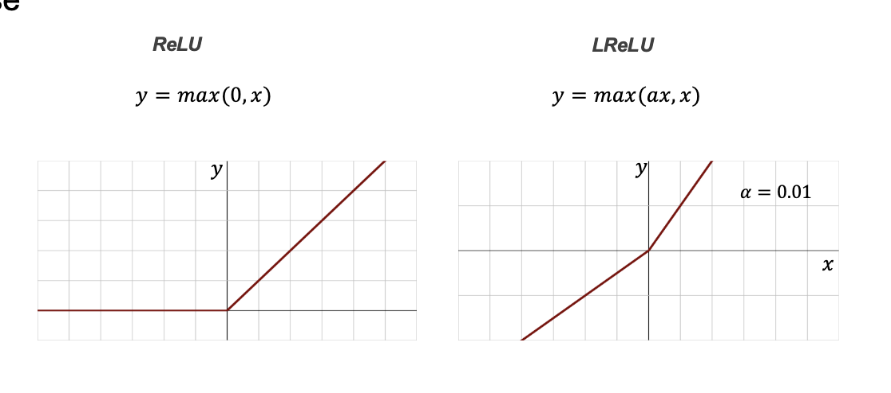

② **Dropout：随机关闭部分 neurons，减少 overfitting。**
 Dropout randomly disables some neurons during training to reduce overfitting.

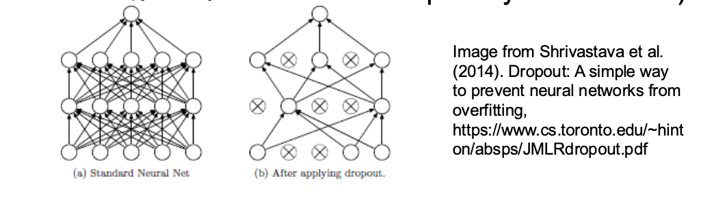

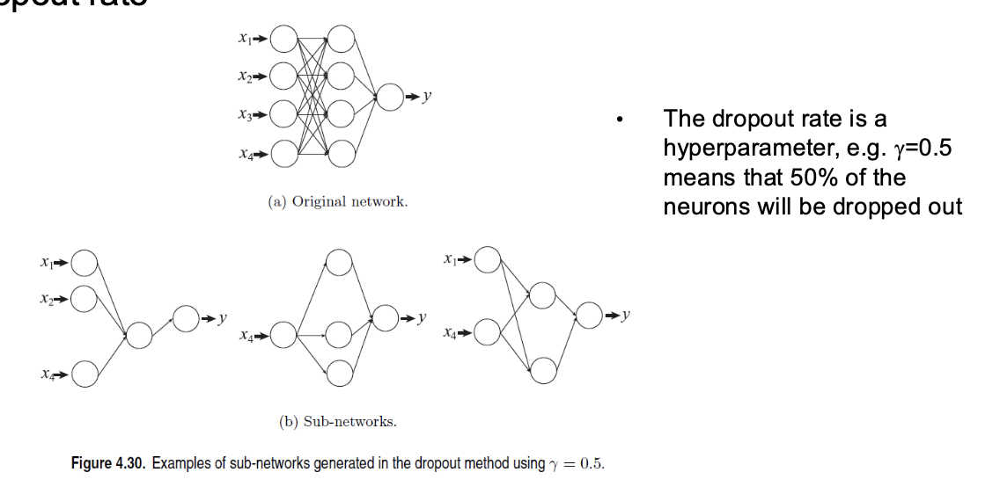

③ **Better initialization：让初始 weights 更合理，避免训练一开始就很差。**
 Better initialization makes initial weights more suitable and avoids poor starting conditions.

④ **Advanced optimisers：例如 Momentum、Adagrad、RMSProp、Adam，让训练更稳定。**
 Advanced optimisers such as Momentum, Adagrad, RMSProp, and Adam make training more stable.

#### 5.4 PPT 最后的 Summary 逻辑

① **Perceptrons form linear decision boundaries。**
 感知机形成线性决策边界。

② **MLP + backpropagation 可以形成 arbitrary decision boundaries，包括 linear 和 non-linear。**
 MLPs trained with backpropagation can form arbitrary decision boundaries, including both linear and non-linear ones.

③ **MLP 需要 careful tuning，因为它对 initialization、architecture、learning rate、momentum、epochs 很敏感。**
 MLPs require careful tuning because they are sensitive to initialization, architecture, learning rate, momentum, and number of epochs.

④ **现代 deep NNs 依赖 ReLU、dropout、better initialization 和 sophisticated optimisers。**
 Modern deep neural networks rely on ReLU, dropout, better initialization, and sophisticated optimisers.

## **Week 8 — 深度学习（CNN / 激活函数）**

- 试卷二 Q12（MNIST最佳模型选择）
- 试卷二 Q14（激活函数命名、CNN优选）
- 试卷二 Q15（CNN各层结构及功能）

#### 1.1 这周 PPT 讲什么 / What This Lecture Covers

① **第八周 PPT 主题是 Deep Learning I: Convolutional and Recurrent Networks，也就是卷积神经网络和循环神经网络。**
 Week 8 focuses on convolutional neural networks and recurrent neural networks.

② **PPT 的主线很清楚：先讲 CNN 怎么处理图像，再讲 RNN / LSTM 怎么处理序列数据。**
 The lecture first explains how CNNs process images, then explains how RNNs and LSTMs process sequential data.

③ **CNN 的关键词是 image、convolution、filter、feature map、pooling、fully connected layer。**
 The key words for CNNs are image, convolution, filter, feature map, pooling, and fully connected layer.

④ **RNN 的关键词是 sequence、time step、memory、hidden state、backpropagation through time、LSTM。**
 The key words for RNNs are sequence, time step, memory, hidden state, backpropagation through time, and LSTM. 

### 2. Convolutional Neural Networks / 卷积神经网络 CNN

#### 2.1 CNN 是什么 / What is a CNN

① **CNN 是一种特殊的 multilayer neural network，主要为图像数据设计。**
 A CNN is a special type of multilayer neural network, mainly designed for image data.

② **CNN 可以直接从 pixel images 里识别 visual patterns，而且需要较少的 pre-processing。**
 CNNs can recognize visual patterns directly from pixel images with minimal preprocessing.

③ **CNN 通过 convolutional layers 和 pooling layers 保留图像的 spatial structure。**
 CNNs preserve the spatial structure of images through convolutional layers and pooling layers.

④ **它对 shifting / translation 更 robust，也就是图像稍微移动一点，CNN 仍然比较容易识别。**
 CNNs are more robust to shifts or translations, meaning they can still recognize objects even if they move slightly in the image. 

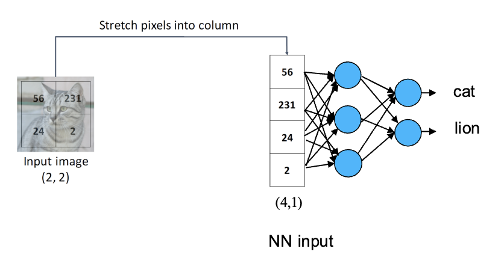

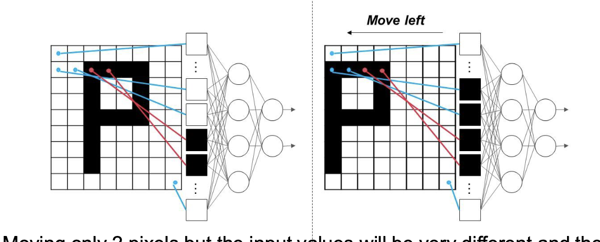

#### 2.2 图像在 CNN 里怎么表示 / Image Representation in CNN

① **黑白图像可以表示成一个 matrix，matrix 里的每个数是 pixel value。**
 A black-and-white image can be represented as one matrix, where each number is a pixel value.

② **Pixel value 通常从 0 到 255，0 表示黑色，255 表示白色。**
 Pixel values usually range from 0 to 255, where 0 means black and 255 means white.

③ **彩色图像有 3 个 channels：Red、Green、Blue，所以可以看成 3 个 matrices。**
 A color image has three channels: Red, Green, and Blue, so it can be represented as three matrices.

公式理解：
$$
\text{Grayscale image} \in \mathbb{R}^{H \times W}
$$
④ **例如一个 $32 \times 32$ 的 RGB 图像，输入维度就是 $32 \times 32 \times 3$。**
 For example, a $32 \times 32$ RGB image has input shape $32 \times 32 \times 3$.

#### 2.3 为什么普通 Feedforward NN 不适合图像 / Why Feedforward NNs Are Not Enough

① **普通 feedforward NN 会把图像拉平成一个 vector，这会破坏 spatial structure。**
 A traditional feedforward NN flattens the image into a vector, which destroys the spatial structure.

② **如果图像里的物体移动几个 pixels，flatten 后的输入值会变化很大。**
 If an object moves by only a few pixels, the flattened input vector can become very different.

③ **CNN 的优势是：它不只是看单个 pixel，而是看局部区域和局部特征。**
 The advantage of CNNs is that they look at local regions and local features, not just individual pixels.

### 3. CNN 的结构 / CNN Structure

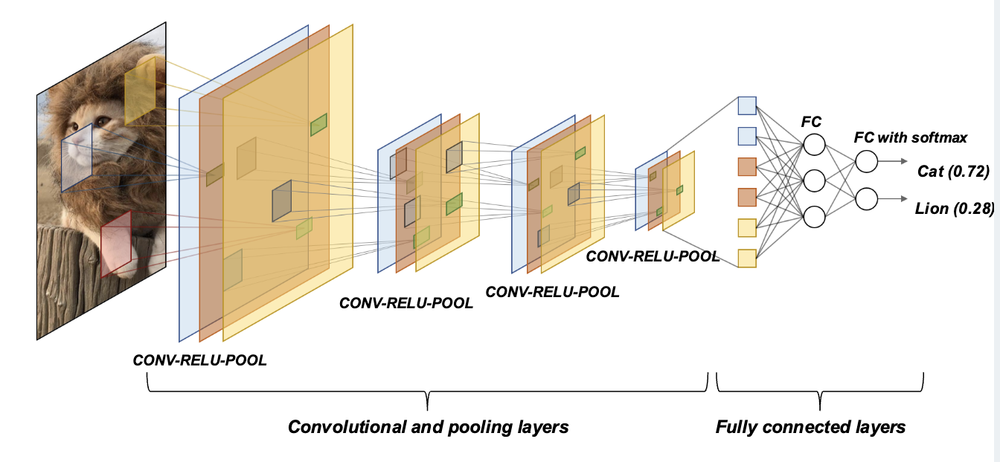

#### 3.1 CNN 的基本结构 / Basic CNN Architecture

① **CNN 的典型结构是：INPUT → CONV → RELU → POOL → FC。**
 A typical CNN structure is: INPUT → CONV → RELU → POOL → FC.
$$
\text{INPUT} \rightarrow \text{CONV} \rightarrow \text{RELU} \rightarrow \text{POOL} \rightarrow \text{FC}
$$
② **CONV-RELU-POOL 这个 block 可以重复很多次。**
 The CONV-RELU-POOL block can be repeated several times.

③ **最后接 fully connected layers，再用 softmax 输出每个 class 的 probability。**
 Finally, fully connected layers are added, and softmax outputs the probability of each class.

④ **CNN 和上周的 fully connected NN 一样，也是由 neurons、learnable weights 和 backpropagation 训练出来的。**
 Like the fully connected neural networks from last week, CNNs are also made of neurons with learnable weights and are trained using backpropagation. 

#### 3.2 Convolutional Layer / 卷积层

##### 卷积的核心计算 / Core Computation of Convolution

① **Convolution 就像用一个 sliding window 在 image matrix 上滑动。**
 Convolution is like applying a sliding window to an image matrix.

② **这个 sliding window 也叫 filter 或 kernel。**
 This sliding window is also called a filter or kernel.

③ **每次 filter 覆盖图像的一小块区域，把对应元素相乘再相加。**
 Each time the filter covers a small region of the image, corresponding elements are multiplied and summed.

核心公式：
$$
Y(i,j)=\sum_{u=0}^{k_h-1}\sum_{v=0}^{k_w-1}X(i+u,j+v)K(u,v)
$$
其中：
$$
X = \text{input image}
$$
④ **如果加入 bias 和 activation function，可以写成：**
 If bias and activation function are added, it can be written as:
$$
A(i,j)=f\left(\sum_{u=0}^{k_h-1}\sum_{v=0}^{k_w-1}X(i+u,j+v)K(u,v)+b\right)
$$
⑤ **PPT 里的例子是一个 $3 \times 3$ filter，第一格 feature map 的值算出来是 4。**
 In the PPT example, a $3 \times 3$ filter is applied, and the first feature map value is 4.
$$
4=1\cdot1+1\cdot0+1\cdot1+0\cdot0+1\cdot1+1\cdot0+0\cdot1+0\cdot0+1\cdot1
$$

#### 3.3 Feature Map 和 Receptive Field / 特征图与感受野

① **Feature map 是 filter 在整张图上滑动后得到的新 matrix。**
 A feature map is the new matrix produced after the filter slides over the whole image.

② **Feature map 的高值表示该区域激活了这个 filter，也就是检测到了某种 feature。**
 A high value in the feature map means that the region activated the filter, so a specific feature was detected.

③ **Receptive field 指的是当前 filter 正在看的那一小块 image region。**
 The receptive field is the image region currently being convolved with the filter.

④ **可以把 filter 理解成 feature detector，例如检测 curve、edge、line、corner。**
 A filter can be understood as a feature detector, such as a detector for curves, edges, lines, or corners.

⑤ **CNN 里的 filters 不是人工提前设计好的，而是在训练中通过 backpropagation 学出来的。**
 In CNNs, filters are not manually pre-designed; their values are learned during training with backpropagation. 

#### 3.4 Stride / 步长

① **Stride 指 filter 每次滑动多少个 pixels。**
 Stride means how many pixels the filter moves each time.

② **如果 stride = 1，filter 每次移动 1 个 pixel。**
 If stride = 1, the filter moves one pixel each time.

③ **如果 stride = 2，filter 每次移动 2 个 pixels，feature map 会变小。**
 If stride = 2, the filter moves two pixels each time, producing a smaller feature map.

常用输出大小公式：
$$
H_{out}=\left\lfloor\frac{H+2P-K_h}{S_h}\right\rfloor+1
$$
其中：
$$
H,W = \text{input height and width}
$$
④ **PPT 里的例子：$7 \times 7$ image，$3 \times 3$ filter，没有 padding。**
 In the PPT example: $7 \times 7$ image, $3 \times 3$ filter, no padding.

Stride = 1：
$$
H_{out}=W_{out}=\frac{7-3}{1}+1=5
$$
所以：
$$
7 \times 7 \rightarrow 5 \times 5
$$
Stride = 2：
$$
H_{out}=W_{out}=\left\lfloor\frac{7-3}{2}\right\rfloor+1=3
$$
所以：
$$
7 \times 7 \rightarrow 3 \times 3
$$

#### 3.5 Padding / 填充

① **Padding 是在 image 边缘补 0，让 filter 可以更好地覆盖边缘区域。**
 Padding means adding zeros around the image border so the filter can better cover edge regions.

② **如果没有 padding，边缘 pixels 被使用得更少，feature map 也会变小。**
 Without padding, edge pixels are used less often, and the feature map becomes smaller.

③ **Padding size 是一个 hyperparameter。**
 Padding size is a hyperparameter.

④ **如果想保持输入输出大小相同，常用设置是：$P=1$、$K=3$、$S=1$。**
 If we want to keep the input and output size the same, a common setting is $P=1$, $K=3$, and $S=1$.

代入公式：
$$
H_{out}=\frac{H+2(1)-3}{1}+1=H
$$
所以：
$$
H_{out}=H
$$

#### 3.6 ReLU Activation Function / ReLU 激活函数

① **CNN 通常会对 feature maps 使用 ReLU activation function。**
 CNNs usually apply a ReLU activation function to feature maps.

② **ReLU 比 sigmoid 和 tanh 更简单，计算更快。**
 ReLU is simpler than sigmoid and tanh, so it is faster to compute.

③ **ReLU 没有 upper bound，不容易 saturation，因此可以减少 vanishing gradient。**
 ReLU has no upper bound and less saturation, so it helps reduce the vanishing gradient problem.

公式：
$$
\text{ReLU}(x)=\max(0,x)
$$
也就是：
$$
\text{ReLU}(x)=
\begin{cases}
0, & x<0 \\
x, & x\geq 0
\end{cases}
$$

### 4. Pooling Layer / 池化层

#### 4.1 Pooling 是什么 / What is Pooling

① **Pooling layer 也叫 sub-sampling layer，作用是总结上一层的信息。**
 A pooling layer is also called a sub-sampling layer, and its role is to summarize information from the previous layer.

② **Pooling 不关心 feature 的精确位置，只关心它大概在哪里。**
 Pooling does not care about the exact location of a feature; it only cares approximately where it appears.

③ **Pooling 可以减少 parameters，防止 overfitting，并提高对 shifting 的 robustness。**
 Pooling reduces the number of parameters, helps prevent overfitting, and improves robustness to shifts.

#### 4.2 Max Pooling / 最大池化

① **Max pooling 是取一个 region 里面的最大值。**
 Max pooling takes the maximum value in a region.

公式：
$$
Y(i,j)=\max_{(u,v)\in R_{ij}}X(u,v)
$$
② **Max pooling 常适合深色背景、亮色目标的图像，例如 MNIST 白色数字。**
 Max pooling is often useful for images with dark backgrounds and bright objects, such as white digits in MNIST.

#### 4.3 Average Pooling / 平均池化

① **Average pooling 是取一个 region 里面的平均值。**
 Average pooling takes the average value in a region.

公式：
$$
Y(i,j)=\frac{1}{|R_{ij}|}\sum_{(u,v)\in R_{ij}}X(u,v)
$$
② **Average pooling 会让图像更 smooth。**
 Average pooling smooths the image.

③ **Max pooling 和 average pooling 哪个更好，取决于 task。**
 Whether max pooling or average pooling is better depends on the task. 

### 5. Fully Connected Layer 和 Softmax / 全连接层与 Softmax

#### 5.1 Flatten / 展平

① **CNN 后面通常接一个或多个 fully connected layers。**
 At the end of a CNN, one or more fully connected layers are usually attached.

② **在进入 FC layer 之前，需要把多维 feature maps flatten 成一个 vector。**
 Before entering the FC layer, multidimensional feature maps need to be flattened into a vector.

公式理解：
$$
\text{Feature maps} \in \mathbb{R}^{H \times W \times C}
$$
③ **FC layers 会把 convolutional layers 提取出来的 features 组合起来，最后输出每个 class 的概率。**
 FC layers combine the features extracted by convolutional layers and output the probability of each class.

#### 5.2 Softmax / Softmax 分类输出

① **最后一个 FC layer 通常输出一个 n-dimensional vector，其中 $n$ 是 class 数量。**
 The last FC layer usually outputs an n-dimensional vector, where $n$ is the number of classes.

② **Softmax 把这些 scores 转换成 probabilities，而且所有 probability 加起来等于 1。**
 Softmax converts these scores into probabilities, and all probabilities sum to 1.

公式：
$$
p_i=\frac{e^{z_i}}{\sum_{j=1}^{n}e^{z_j}}
$$
并且：
$$
\sum_{i=1}^{n}p_i=1
$$
③ **例如输出 $[0.1,0,0,0.1,0,0,0.6,0,0,0.2]$，表示模型最认为图片是数字 6。**
 For example, output $[0.1,0,0,0.1,0,0,0.6,0,0,0.2]$ means the model thinks the image is most likely digit 6.

### 6. Multi-channel CNN / 多通道 CNN

#### 6.1 RGB 图像和 3D Filter / RGB Images and 3D Filters

① **彩色图像有 3 个 channels：Red、Green、Blue。**
 Color images have three channels: Red, Green, and Blue.

② **如果 input 是 $32 \times 32 \times 3$，filter 也必须有相同的 channel depth。**
 If the input is $32 \times 32 \times 3$, the filter must have the same channel depth.

③ **例如 PPT 中：$32 \times 32 \times 3$ image 使用 $5 \times 5 \times 3$ filter。**
 For example, in the PPT, a $32 \times 32 \times 3$ image uses a $5 \times 5 \times 3$ filter.

多通道卷积公式：
$$
Y(i,j)=\sum_{c=1}^{C}\sum_{u=0}^{K_h-1}\sum_{v=0}^{K_w-1}X(i+u,j+v,c)K(u,v,c)+b
$$
其中：
$$
C = \text{number of channels}
$$
④ **一个 filter 会跨所有 channels 计算，然后生成一个 feature map。**
 One filter computes across all channels and produces one feature map.

### 7. CNN Architectures / CNN 架构

#### 7.1 CNN 架构设计问题 / CNN Architectural Issues

① **CNN 设计时要决定 convolution layers 有多少层。**
 When designing a CNN, we need to decide how many convolutional layers to use.

② **还要决定每层有多少 filters，以及 filter size 是 $3 \times 3$ 还是 $5 \times 5$。**
 We also need to decide how many filters each layer has, and whether the filter size is $3 \times 3$ or $5 \times 5$.

③ **还要决定 pooling layer 出现多频繁，pooling size 是 $2 \times 2$ 还是 $3 \times 3$，以及使用 max pooling 还是 average pooling。**
 We also need to decide how frequently to use pooling layers, whether the pooling size is $2 \times 2$ or $3 \times 3$, and whether to use max pooling or average pooling. 

#### 7.2 LeNet-5 / LeNet-5

① **LeNet-5 的任务是 handwritten digit recognition。**
 LeNet-5 is used for handwritten digit recognition.

② **它的结构包括 2 个 convolution layers、2 个 max-pooling layers 和 3 个 fully connected layers。**
 Its architecture includes 2 convolutional layers, 2 max-pooling layers, and 3 fully connected layers.

#### 7.3 AlexNet / AlexNet

① **AlexNet 在 2012 年 ImageNet competition 中获得突破性表现，使 CNN 变得非常流行。**
 AlexNet achieved a breakthrough in the 2012 ImageNet competition and made CNNs very popular.

② **它使用 227 × 227 images，结构包括 5 个 convolutional layers、3 个 max pooling layers 和 3 个 fully connected layers。**
 It uses $227 \times 227$ images and has 5 convolutional layers, 3 max-pooling layers, and 3 fully connected layers.

#### 7.4 VGG 和 GoogLeNet / VGG and GoogLeNet

① **VGG 是 AlexNet 的改进版本，特点是 deeper network 和 simpler design。**
 VGG is an improved version of AlexNet, characterized by a deeper network and simpler design.

② **VGG 常用 $3 \times 3$ filters，stride = 1，padding = 1。**
 VGG commonly uses $3 \times 3$ filters, stride = 1, and padding = 1.

③ **GoogLeNet 使用 Inception module，特点是更深但计算更高效。**
 GoogLeNet uses the Inception module and is deeper but computationally efficient.

### 8. Recurrent Neural Networks / 循环神经网络 RNN

#### 8.1 RNN 用来处理什么 / What RNNs Are Used For

① **RNN 用于 sequential data，也就是有顺序的数据。**
 RNNs are used for sequential data, meaning data with order.

② **Text 是典型 sequential data，因为 sentence 是 word by word 组成的。**
 Text is a typical example of sequential data because a sentence is composed word by word.

③ **处理 sequence 时，模型需要 memory，因为后面的词可能依赖前面的词。**
 When processing sequences, the model needs memory because later words may depend on earlier words.

④ **例如 “The dog … is aggressive” 和 “The dogs … are aggressive” 说明主语和动词之间存在 dependency。**
 For example, “The dog … is aggressive” and “The dogs … are aggressive” show dependency between the subject and the verb. 

#### 8.2 RNN 为什么叫 recurrent / Why RNN Is Called Recurrent

① **RNN 每个 time step 处理 sequence 里的一个 element。**
 An RNN processes one element of the sequence at each time step.

② **例如句子 “The dog in the house is aggressive”，可以按 time step 输入：the、dog、in、the、house、is、aggressive。**
 For example, the sentence “The dog in the house is aggressive” can be input by time steps: the, dog, in, the, house, is, aggressive.

③ **RNN 叫 recurrent，是因为它有 feedback connections，也就是前一个 hidden state 会影响下一个 hidden state。**
 It is called recurrent because it has feedback connections, meaning the previous hidden state affects the next hidden state.

④ **Feedforward NN 是 directed acyclic graph，而 RNN 是 directed cyclic graph。**
 A feedforward neural network is a directed acyclic graph, while an RNN is a directed cyclic graph. 

### 9. Simple RNN / 简单循环神经网络

#### 9.1 Simple RNN 的结构 / Structure of Simple RNN

① **Simple RNN 可以看成一个带 memory buffer 的 feedforward network。**
 A simple RNN can be seen as a feedforward network with a memory buffer.

② **Memory buffer 存储 previous hidden state，也就是上一时刻 hidden layer 的状态。**
 The memory buffer stores the previous hidden state, meaning the hidden layer state from the previous time step.

③ **每个 time step，RNN 同时接收 current input $x_t$ 和 previous hidden state $h_{t-1}$。**
 At each time step, the RNN receives both the current input $x_t$ and the previous hidden state $h_{t-1}$.

#### 9.2 RNN 的符号 / RNN Symbols

① **$x_t$ 表示 time $t$ 的 input vector。**
 $x_t$ means the input vector at time $t$.

② **$h_t$ 表示 time $t$ 的 hidden state / hidden activation。**
 $h_t$ means the hidden state or hidden activation at time $t$.

③ **$y_t$ 表示 time $t$ 的 output vector。**
 $y_t$ means the output vector at time $t$.

④ **RNN 有 3 个主要 weight matrices：$W_{xh}$、$W_{hh}$、$W_{hy}$。**
 An RNN has three main weight matrices: $W_{xh}$, $W_{hh}$, and $W_{hy}$.
$$
W_{xh}: \text{input} \rightarrow \text{hidden}
$$

#### 9.3 Simple RNN 的 forward pass 公式 / Forward Pass Formula

① **Hidden state 由当前输入和上一时刻 hidden state 共同决定。**
 The hidden state is determined by both the current input and the previous hidden state.
$$
h_t=\tanh(W_{xh}x_t+W_{hh}h_{t-1}+b_h)
$$
② **Output 通常由 hidden state 经过输出层得到。**
 The output is usually computed from the hidden state through the output layer.
$$
z_t=W_{hy}h_t+b_y
$$
③ **如果是分类任务，可以使用 softmax 得到每个 class 的概率。**
 If it is a classification task, softmax can be used to obtain class probabilities.
$$
\hat{y}_t=\text{softmax}(z_t)
$$
④ **tanh 常用于 hidden state，因为它的输出范围在 $-1$ 到 $1$。**
 The tanh function is often used for the hidden state because its output ranges from $-1$ to $1$. 

### 10. Unrolling RNN 和 BPTT / 展开 RNN 与时间反向传播

#### 10.1 Unrolling RNN / 展开 RNN

① **RNN 本来有 cyclic connections，所以直接看信息流会比较难。**
 RNNs have cyclic connections, so the information flow can be hard to understand directly.

② **Unrolling RNN 就是把同一个 RNN 沿着 time steps 展开。**
 Unrolling an RNN means unfolding the same RNN across time steps.

③ **展开后看起来像多个网络，但本质上是同一个 RNN，weights 不会因为 time step 不同而改变。**
 After unrolling, it looks like multiple networks, but it is still the same RNN; the weights do not change across time steps.

公式理解：
$$
h_1=f(W_{xh}x_1+W_{hh}h_0)
$$
④ **这里每一步都使用同一组 $W_{xh}$ 和 $W_{hh}$。**
 Each step uses the same $W_{xh}$ and $W_{hh}$.

#### 10.2 Backpropagation Through Time / 时间反向传播 BPTT

① **RNN 用 backpropagation through time 训练。**
 RNNs are trained using backpropagation through time.

② **BPTT 的意思是：time $t$ 的 error 会往前传播到所有影响它的 previous states。**
 BPTT means the error at time $t$ is propagated backward to all previous states that contributed to it.

③ **所以它叫 through time，因为 error 像是在时间上往回走。**
 It is called through time because the error goes backward through time.

④ **总 loss 可以看成每个 time step loss 的总和。**
 The total loss can be seen as the sum of losses at all time steps.
$$
L=\sum_{t=1}^{T}L_t
$$
如果是分类任务，常用 cross entropy：
$$
L_t=-\sum_{k}y_{t,k}\log(\hat{y}_{t,k})
$$

### 11. RNN 的例子和灵活结构 / RNN Example and Flexible Architectures

#### 11.1 Predicting the Next Character / 预测下一个字符

① **PPT 用 “hello” 举例：给定前面的 characters，预测下一个 character。**
 The PPT uses “hello” as an example: given previous characters, predict the next character.

② **Vocabulary 是 $\{h,e,l,o\}$，每个 character 用 one-hot encoding 表示。**
 The vocabulary is $\{h,e,l,o\}$, and each character is represented using one-hot encoding.

例如：
$$
h=[1,0,0,0]
$$
③ **输入 vector 是 4-dimensional，输出 vector 也是 4-dimensional。**
 The input vector is 4-dimensional, and the output vector is also 4-dimensional.

④ **输出 vector 里最大 activation 对应的字母，就是模型预测的下一个字母。**
 The letter with the highest activation in the output vector is the predicted next character.

#### 11.2 RNN 的任务形式 / Types of RNN Tasks

① **One-to-many：一个输入生成一个 sequence，例如 image captioning。**
 One-to-many means one input generates a sequence, such as image captioning.

② **Many-to-one：一个 sequence 输出一个 label，例如 sentiment analysis。**
 Many-to-one means one sequence outputs one label, such as sentiment analysis.

③ **Many-to-many：一个 sequence 输出另一个 sequence，例如 machine translation。**
 Many-to-many means one sequence outputs another sequence, such as machine translation.

④ **Synced many-to-many：每个 time step 都输出一个 label，例如 video frame classification。**
 Synced many-to-many means each time step outputs a label, such as video frame classification.

### 12. RNN 的问题 / Shortcomings of RNN

#### 12.1 Vanishing Gradient Problem / 梯度消失问题

① **Simple RNN 对 short-distance dependencies 比较有效，但对 long-distance dependencies 不好。**
 Simple RNNs work well for short-distance dependencies, but not for long-distance dependencies.

② **原因是 BPTT 时，error gradients 会被 $W_{hh}$ 反复相乘。**
 The reason is that during BPTT, error gradients are repeatedly multiplied by $W_{hh}$.

③ **如果这些乘积越来越小，gradient 就会 vanish，前面很早的信息很难被学到。**
 If these products become smaller and smaller, the gradient vanishes, making it hard to learn information from far earlier time steps.

简化理解公式：
$$
\frac{\partial h_t}{\partial h_{t-k}}
\approx
\prod_{i=t-k+1}^{t}
W_{hh}^{T}\operatorname{diag}(f'(a_i))
$$
④ **如果这个连乘项很小，gradient 会消失；如果很大，也可能出现 exploding gradient。**
 If this repeated product is very small, the gradient vanishes; if it is very large, exploding gradients may occur.

⑤ **所以 RNN 理论上有 memory，但实践中长期记忆能力有限。**
 Therefore, RNNs theoretically have memory, but in practice their ability to remember long-term dependencies is limited. 

### 13. Long Short-Term Memory / 长短期记忆网络 LSTM

#### 13.1 LSTM 是什么 / What is LSTM

① **LSTM 是一种特殊的 RNN，专门用于建模 long-distance dependencies。**
 LSTM is a special type of RNN designed to model long-distance dependencies.

② **LSTM 的关键思想是：网络可以学习 what to store、what to throw away、what to read。**
 The key idea of LSTM is that the network can learn what to store, what to throw away, and what to read.

③ **LSTM cell 有 3 个 gates：forget gate、input gate、output gate。**
 An LSTM cell has three gates: forget gate, input gate, and output gate.

④ **LSTM 比 simple RNN 复杂，但可以更好地处理长期依赖。**
 LSTM is more complex than a simple RNN, but it handles long-term dependencies better. 

#### 13.2 Forget Gate / 遗忘门

① **Forget gate 决定旧的 cell state 里面哪些信息要保留，哪些信息要忘掉。**
 The forget gate decides which information in the old cell state should be kept and which should be forgotten.

公式：
$$
f_t=\sigma(W_f[h_{t-1},x_t]+b_f)
$$
② **$\sigma$ 是 sigmoid function，输出范围是 0 到 1。**
 $\sigma$ is the sigmoid function, whose output ranges from 0 to 1.

③ **接近 0 表示 forget，接近 1 表示 keep。**
 A value close to 0 means forget, and a value close to 1 means keep.

#### 13.3 Input Gate / 输入门

① **Input gate 决定哪些新信息应该写入 cell state。**
 The input gate decides which new information should be written into the cell state.

公式一：决定更新哪些位置
$$
i_t=\sigma(W_i[h_{t-1},x_t]+b_i)
$$
公式二：生成 candidate cell state
$$
\tilde{C}_t=\tanh(W_C[h_{t-1},x_t]+b_C)
$$
② **$i_t$ 决定更新多少，$\tilde{C}_t$ 提供候选新内容。**
 $i_t$ decides how much to update, and $\tilde{C}_t$ provides candidate new content.

#### 13.4 Update Cell State / 更新细胞状态

① **LSTM 把旧状态 $C_{t-1}$ 和新候选状态 $\tilde{C}_t$ 结合起来，得到新的 cell state $C_t$。**
 LSTM combines the old state $C_{t-1}$ and the new candidate state $\tilde{C}_t$ to produce the new cell state $C_t$.

公式：
$$
C_t=f_t*C_{t-1}+i_t*\tilde{C}_t
$$
② **第一项 $f_t\*C_{t-1}$ 表示保留多少旧记忆。**
 The first term $f_t*C_{t-1}$ means how much old memory is kept.

③ **第二项 $i_t\*\tilde{C}_t$ 表示加入多少新信息。**
 The second term $i_t*\tilde{C}_t$ means how much new information is added. 

#### 13.5 Output Gate / 输出门

① **Output gate 决定当前 cell state 里哪些部分要输出成 hidden state。**
 The output gate decides which parts of the current cell state should be output as the hidden state.

公式一：计算输出门
$$
o_t=\sigma(W_o[h_{t-1},x_t]+b_o)
$$
公式二：生成 hidden state
$$
h_t=o_t*\tanh(C_t)
$$
② **$\tanh(C_t)$ 把 cell state 压到 $-1$ 到 $1$ 之间。**
 $\tanh(C_t)$ pushes the cell state values into the range $-1$ to $1$.

③ **$o_t$ 决定最终输出哪些部分。**
 $o_t$ decides which parts are finally output.

#### 13.6 LSTM 为什么缓解 vanishing gradient / Why LSTM Reduces Vanishing Gradient

① **Simple RNN 在反向传播时会反复乘 $W_{hh}$，所以容易 gradient vanish。**
 A simple RNN repeatedly multiplies by $W_{hh}$ during backpropagation, so gradients can vanish.

② **LSTM 通过 cell state 和 gates 控制信息流，不需要以同样方式反复乘 $W_{hh}$。**
 LSTM controls information flow through the cell state and gates, avoiding the same repeated multiplication by $W_{hh}$.

③ **所以 LSTM 更适合 long-distance dependencies，例如 machine translation、speech recognition、handwriting recognition。**
 Therefore, LSTM is better suited for long-distance dependencies, such as machine translation, speech recognition, and handwriting recognition. 

### 14. Other RNN Architectures / 其他 RNN 架构

#### 14.1 GRU 和 IRNN / GRU and IRNN

① **GRU 全称是 Gated Recurrent Unit，是另一种带门控机制的 RNN。**
 GRU stands for Gated Recurrent Unit, another type of RNN with gating mechanisms.

② **IRNN 是使用 ReLU 的 recurrent network 初始化方法。**
 IRNN is a recurrent network approach using ReLU-based initialization.

③ **PPT 这里只是简单提到它们，核心还是 Simple RNN 和 LSTM。**
 The PPT only briefly mentions them; the core focus remains Simple RNN and LSTM.

## **Week 9 — 循环神经网络（RNN / LSTM / GRU / Transformer）**

- 试卷二 Q16（LSTM vs GRU结构与功能对比）
- 试卷二 Q18（Transformer多头注意力机制 + 位置编码）

#### 1.1 这周真正讲的主线 / Main Learning Line

① 第九周不是单纯讲 CNN，而是从 **RNN 的应用场景** 引出 **Attention**，再进入 **Transformer**。
 Week 9 is not mainly about CNN alone. It uses RNN applications to introduce attention, then moves to Transformer.

② 逻辑顺序是：
 **VQA / 阅读理解 / 翻译 / 聊天机器人 → Seq2seq → Attention → Transformer → Self-Attention → Multi-Head Attention → Decoder → Loss Function**

③ 这周的核心问题是：模型如何处理 **sequence 序列**，以及如何在长句子里找到真正相关的信息。
 The central problem is how models process sequences and how they identify relevant information in long contexts.

④ RNN/LSTM 的问题是一步一步处理，长距离依赖困难，不能很好并行；Transformer 的优势是 attention 可以直接看全局，且更容易并行。
 RNN/LSTM processes tokens step by step, which makes long-range dependency and parallelization harder. Transformer uses attention to look across the whole sequence and is easier to parallelize.

### 2. RNN 的应用 / Applications of RNN

#### 2.1 Visual Question Answering, VQA / 视觉问答

① VQA 的任务是：给模型一张图片和一个问题，让模型输出答案。
 VQA asks a model to take an image and a question as input, then produce an answer.

例子：
 图片里有人拿香蕉当胡子，问题是：**What’s the mustache made of?**
 模型输出：**Banana**

② VQA 需要同时理解两种信息：
 中文：图片信息 + 文本问题。
 English: visual information + textual question.

③ 问题部分通常用 LSTM 处理，把每个词变成 embedding，再经过 LSTM 得到 question vector。
 The question is usually processed by LSTM: each word becomes an embedding, and the LSTM produces a question vector.

④ 图像部分通常用 object detection 或 CNN 提取 object vector / image attention vector。
 The image is processed by object detection or CNN to produce an object vector or image attention vector.

⑤ 最后把 question vector 和 image attention vector 融合，再经过 fully connected layer 和 softmax 输出答案。
 Finally, the question vector and image attention vector are fused, then passed through fully connected layers and softmax to output the answer.

##### VQA 流程 / VQA Pipeline

中文流程：
 **图片 → Object Detection / CNN → Image Vector**
 **问题 → Embedding → LSTM → Question Vector**
 **Image Vector + Question Vector → Fusion → Softmax → Answer**

English pipeline:
 **Image → Object Detection / CNN → Image Vector**
 **Question → Embedding → LSTM → Question Vector**
 **Image Vector + Question Vector → Fusion → Softmax → Answer**

#### 2.2 Reading Comprehension / 阅读理解

① 阅读理解任务是：给定一组 facts，再根据 query 找到答案。
 Reading comprehension answers a query based on given facts.

例子：
 A. Brian is a frog.
 B. Lily is gray.
 C. Brian is yellow.
 D. Julius is green.
 E. Greg is a frog.

问题：**What color is Greg?**

② 模型会把每个 fact 用 LSTM 编码成向量，然后放进 memory。
 Each fact is encoded into a vector by LSTM and stored in memory.

③ Query 会通过 attention 去 memory 里找相关 fact。
 The query uses attention to select relevant facts from memory.

④ 这个例子需要多步推理：
 Greg is a frog → Brian is a frog → Brian is yellow → Greg is yellow。
 This example requires multi-hop reasoning: Greg is a frog → Brian is a frog → Brian is yellow → Greg is yellow.

⑤ PPT 中提到的模型是 **End-To-End Memory Networks**。
 The model referenced in the slides is End-To-End Memory Networks.

### 3. Seq2seq 与 Attention / Seq2seq and Attention

#### 3.1 Seq2seq 是什么 / What Seq2seq Means

① Seq2seq 全称是 sequence-to-sequence，意思是把一个序列转换成另一个序列。
 Seq2seq means sequence-to-sequence: converting one sequence into another sequence.

② 典型应用是机器翻译。
 A typical application is machine translation.

例子：
 **我是一个学生 → I am a student**

③ Seq2seq 也可以用于聊天机器人。
 Seq2seq can also be used for chatbots.

例子：
 **Where do you come from? → I am from Sydney, and you?**

#### 3.2 Encoder 和 Decoder / Encoder and Decoder

① Encoder 负责读取输入句子，把输入序列压缩成 hidden state / context representation。
 The encoder reads the input sentence and compresses the input sequence into hidden states or a context representation.

② Decoder 负责一步一步生成输出句子。
 The decoder generates the output sentence step by step.

③ 在翻译任务中，encoder 读中文，decoder 生成英文。
 In translation, the encoder reads the Chinese sentence, and the decoder generates the English sentence.

④ `<S>` 表示 start token，告诉 decoder 开始生成。
 `<S>` is the start token, telling the decoder to begin generation.

⑤ `<E>` 表示 end token，告诉 decoder 句子生成结束。
 `<E>` is the end token, telling the decoder that generation is finished.

#### 3.3 Attention 在 Seq2seq 里的作用 / Role of Attention in Seq2seq

① 没有 attention 时，decoder 主要依赖 encoder 最后的状态，长句子信息容易丢失。
 Without attention, the decoder mainly relies on the final encoder state, so information in long sentences can be lost.

② 有 attention 后，decoder 每生成一个词，都可以回头看 encoder 的所有 hidden states。
 With attention, each decoding step can look back at all encoder hidden states.

③ Attention 的本质是：给输入句子的每个位置分配一个权重。
 The essence of attention is assigning a weight to each position in the input sentence.

④ 权重越高，说明当前输出词越依赖那个输入词。
 A higher weight means the current output word depends more on that input word.

⑤ PPT 里的 attention heatmap 展示了翻译时输入词和输出词之间的对齐关系。
 The attention heatmap in the slides shows alignment between input words and output words during translation.

#### 3.4 Seq2seq 里的 LSTM Attention 公式 / LSTM Attention Formulas in Seq2seq

① PPT 中把 attention vector 记作 $a_t$，它作为 LSTM 在当前时间步的额外输入。
 The slides denote the attention vector as $a_t$, which becomes an additional input to LSTM at the current time step.

② Forget gate 公式：
$$
f_t=\sigma(w_{fh}h_{t-1}+w_{fx}x_t+w_{fa}a_t+b_f)
$$
中文：forget gate 决定上一时刻 cell state 里哪些信息要保留或遗忘。
 English: the forget gate decides what information from the previous cell state should be kept or forgotten.

③ Input gate 公式：
$$
i_t=\sigma(w_{ih}h_{t-1}+w_{ix}x_t+w_{ia}a_t+b_i)
$$
中文：input gate 决定当前输入中哪些新信息要写入记忆。
 English: the input gate decides which new information from the current input should be written into memory.

④ Output gate 公式：
$$
o_t=\sigma(w_{oh}h_{t-1}+w_{ox}x_t+w_{oa}a_t+b_o)
$$
中文：output gate 决定当前 hidden state 输出哪些信息。
 English: the output gate decides what information should be exposed in the current hidden state.

⑤ Candidate cell state 公式：
$$
\tilde{c}_t=\tanh(w_{hh}h_{t-1}+w_{hx}x_t+w_{ha}a_t+b_h)
$$
中文：candidate cell state 是当前时刻可能被写入的新内容。
 English: the candidate cell state is the new candidate information that may be written into memory.

### 4. Transformer / Transformer 模型

#### 4.1 Transformer 为什么出现 / Why Transformer Was Introduced

① Transformer 来自论文 **Attention Is All You Need**，核心思想是用 attention 取代 RNN 的顺序处理。
 Transformer comes from the paper *Attention Is All You Need*. Its core idea is to replace recurrent sequential processing with attention.

② RNN 必须按时间顺序处理 token：第 1 个 → 第 2 个 → 第 3 个。
 RNN must process tokens sequentially: token 1 → token 2 → token 3.

③ Transformer 可以同时处理多个 token，因此更容易并行。
 Transformer can process multiple tokens at the same time, making it easier to parallelize.

④ Transformer 更适合建模长距离关系。
 Transformer is better at modeling long-range dependencies.

⑤ 代价是 attention 计算复杂度通常是 $O(n^2)$，因为每个 token 都要和其他 token 比较。
 The cost is that attention computation is usually $O(n^2)$, because each token is compared with other tokens.

#### 4.2 Transformer 的整体结构 / Overall Structure of Transformer

① Transformer 由 encoder stack 和 decoder stack 组成。
 Transformer consists of an encoder stack and a decoder stack.

② Encoder 负责理解输入句子。
 The encoder understands the input sentence.

③ Decoder 负责生成输出句子。
 The decoder generates the output sentence.

④ Encoder 里面主要有两层：self-attention layer 和 feed-forward layer。
 The encoder mainly contains two layers: a self-attention layer and a feed-forward layer.

⑤ Decoder 里面主要有三层：masked self-attention、encoder-decoder attention、feed-forward layer。
 The decoder mainly contains three layers: masked self-attention, encoder-decoder attention, and feed-forward layer.

### 5. Encoder Side / 编码器部分

#### 5.1 Embedding / 词向量表示

① 输入句子首先被 tokenize，每个词或 token 会变成一个向量。
 The input sentence is first tokenized, and each word or token is converted into a vector.

② 最简单的表示是 one-hot vector，但它维度很高，而且不能表达语义相似性。
 The simplest representation is a one-hot vector, but it is high-dimensional and cannot express semantic similarity.

③ 更常用的是 word embedding，它能把词表示成 dense vector。
 A more common representation is word embedding, which represents words as dense vectors.

④ 例子：
 “student”和“school”在 embedding 空间里可能更接近。
 For example, “student” and “school” may be closer in embedding space.

#### 5.2 Self-Attention 的直觉 / Intuition of Self-Attention

① Self-attention 的作用是：编码某个词时，可以参考同一句子里的其他词。
 Self-attention allows a word to look at other words in the same sentence during encoding.

② PPT 里的例子是：
 **The animal didn't cross the street because it was too tired.**

③ 问题是：**it 指谁？**
 The question is: what does “it” refer to?

④ Self-attention 可以让 “it” 和 “animal” 建立联系。
 Self-attention allows “it” to associate with “animal”.

⑤ 所以 self-attention 解决的是上下文依赖问题。
 Therefore, self-attention solves contextual dependency problems.

#### 5.3 Q, K, V / Query, Key, Value

① Transformer 会从每个 input embedding 生成三个向量：Query、Key、Value。
 Transformer creates three vectors from each input embedding: Query, Key, and Value.

② 这三个向量由训练出来的权重矩阵生成：
$$
Q=XW^Q
$$
③ Query 可以理解成：我现在要找什么信息？
 Query means: what information am I looking for?

④ Key 可以理解成：我这里有什么信息可以被匹配？
 Key means: what information do I contain that can be matched?

⑤ Value 可以理解成：如果被关注，真正传递出去的信息是什么？
 Value means: if this token is attended to, what information should be passed forward?

#### 5.4 Self-Attention 计算步骤 / Steps of Self-Attention

① 第一步：每个词生成 Q、K、V。
 Step 1: each word generates Q, K, and V.

② 第二步：用当前词的 Query 和其他词的 Key 做 dot product，得到 attention score。
 Step 2: take the dot product between the current word’s Query and other words’ Keys to get attention scores.

③ 第三步：除以 $\sqrt{d_k}$ 进行 scaling，让梯度更稳定。
 Step 3: divide by $\sqrt{d_k}$ for scaling, which makes gradients more stable.

④ 第四步：经过 softmax，把分数变成权重。
 Step 4: apply softmax to convert scores into weights.

⑤ 第五步：用权重乘以每个 Value。
 Step 5: multiply each Value by its attention weight.

⑥ 第六步：把加权后的 Value 加起来，得到当前位置的输出。
 Step 6: sum the weighted Values to get the output for the current position.

核心公式：
$$
Attention(Q,K,V)=softmax\left(\frac{QK^T}{\sqrt{d_k}}\right)V
$$
中文：这个公式表示先计算 Q 和 K 的相似度，再 softmax 成权重，最后对 V 做加权求和。
 English: this formula computes similarity between Q and K, converts it into weights using softmax, and then takes a weighted sum of V.

### 6. Multi-Head Attention / 多头注意力

#### 6.1 为什么需要多个 head / Why Multiple Heads Are Needed

① 一个 attention head 只能从一个角度看句子关系。
 One attention head can only look at sentence relationships from one perspective.

② Multi-head attention 让模型从多个 representation subspaces 同时看信息。
 Multi-head attention allows the model to look at information from multiple representation subspaces.

③ 一个 head 可能关注语法关系，另一个 head 可能关注指代关系，还有一个 head 可能关注位置关系。
 One head may focus on syntactic relations, another on reference relations, and another on positional relations.

④ 所以 multi-head attention 增强了模型表达能力。
 Therefore, multi-head attention increases the model’s representational power.

#### 6.2 Multi-Head Attention 的计算逻辑 / Computation Logic

① 输入矩阵 $X$ 会被分到多个 head。
 The input matrix $X$ is projected into multiple heads.

② 每个 head 都有自己的一套 $W^Q, W^K, W^V$。
 Each head has its own $W^Q, W^K, W^V$.

③ 每个 head 单独计算 attention。
 Each head computes attention separately.

④ 然后把所有 head 的输出 concatenate 拼接起来。
 Then all head outputs are concatenated.

⑤ 最后乘以 $W^O$，得到 multi-head attention 的最终输出。
 Finally, the concatenated result is multiplied by $W^O$ to produce the final multi-head attention output.

公式：
$$
head_i=Attention(QW_i^Q,KW_i^K,VW_i^V)
$$
中文：每个 head 都是一次独立的 attention，最后再合并。
 English: each head is an independent attention operation, and the results are merged afterward.

### 7. Positional Encoding / 位置编码

#### 7.1 为什么需要位置编码 / Why Positional Encoding Is Needed

① Transformer 没有 RNN 那种天然的顺序结构。
 Transformer does not have the natural sequential structure of RNN.

② RNN 是按顺序读词，所以天然知道前后位置。
 RNN reads words in order, so it naturally knows word positions.

③ Transformer 同时看所有词，所以必须额外告诉模型每个词的位置。
 Transformer looks at all words simultaneously, so it needs additional information about word positions.

④ Positional encoding 就是给 embedding 加入位置信息。
 Positional encoding adds positional information to embeddings.

⑤ 这样模型才能区分：
 “dog bites man”和“man bites dog”。
 This allows the model to distinguish “dog bites man” from “man bites dog”.

### 8. Residual Connection 和 Add & Norm / 残差连接与归一化

#### 8.1 Residuals 的作用 / Role of Residuals

① Transformer 每个子层外面都有 residual connection。
 Each Transformer sublayer has a residual connection around it.

② Residual connection 的形式可以理解为：
$$
Output = Layer(x)+x
$$
③ 这样可以让原始信息直接传到后面，减少深层网络训练困难。
 This allows original information to pass forward directly and reduces training difficulty in deep networks.

④ Add & Norm 表示先把 residual 加回来，再做 layer normalization。
 Add & Norm means adding the residual connection first, then applying layer normalization.

⑤ 它的作用是稳定训练。
 Its role is to stabilize training.

### 9. Decoder Side / 解码器部分

#### 9.1 Decoder 的输入 / Decoder Input

① Decoder 的输入不是一次性知道完整答案，而是一步一步生成。
 The decoder does not know the full answer at once; it generates output step by step.

② 当前时间步的输入来自之前已经生成的 token。
 The input at the current time step comes from previously generated tokens.

③ 训练时，decoder 会看到正确答案的前面部分；预测时，decoder 用自己之前生成的词继续生成。
 During training, the decoder sees the previous correct tokens; during inference, it uses its own previously generated tokens.

#### 9.2 Masked Self-Attention / 掩码自注意力

① Decoder 的 self-attention 不能看未来词。
 The decoder’s self-attention cannot look at future words.

② 例如生成 “I am” 的时候，模型不能提前看到后面的 “a student”。
 For example, when generating “I am”, the model cannot look ahead at “a student”.

③ 所以 decoder 使用 masked self-attention。
 Therefore, the decoder uses masked self-attention.

④ mask 的作用是遮住未来位置，避免答案泄露。
 The mask blocks future positions to prevent answer leakage.

#### 9.3 Encoder-Decoder Attention / 编码器-解码器注意力

① Encoder 输出会被转换成 K 和 V。
 The encoder output is transformed into K and V.

② Decoder 当前状态提供 Q。
 The decoder’s current state provides Q.

③ Decoder 用 Q 去查 encoder 的 K 和 V，从而关注输入句子中相关部分。
 The decoder uses Q to attend to the encoder’s K and V, focusing on relevant parts of the input sentence.

④ 这和翻译里的 alignment 很像。
 This is similar to alignment in translation.

### 10. Final Linear and Softmax Layer / 最后的线性层与 Softmax

#### 10.1 输出词如何产生 / How the Output Word Is Produced

① Decoder stack 的输出会进入 linear layer。
 The decoder stack output goes into a linear layer.

② Linear layer 把 hidden vector 映射到 vocabulary size 维度。
 The linear layer maps the hidden vector to the vocabulary-size dimension.

③ 每个位置对应词表里的一个词。
 Each position corresponds to one word in the vocabulary.

④ Softmax 把 logits 转换成概率分布。
 Softmax converts logits into a probability distribution.

⑤ 概率最高的词通常会被选为输出词。
 The word with the highest probability is usually selected as the output word.

公式：
$$
p(y_t|y_{<t},x)=softmax(Wz_t+b)
$$
中文：$z_t$ 是 decoder 当前时间步的输出，softmax 后得到每个词的概率。
 English: $z_t$ is the decoder output at the current time step, and softmax produces the probability of each word.

### 11. Loss Function / 损失函数

#### 11.1 Transformer 怎么训练 / How Transformer Is Trained

① 未训练模型会给每个词输出比较随机的概率分布。
 An untrained model produces arbitrary probability distributions over words.

② 训练目标是让模型输出越来越接近真实答案。
 The training goal is to make the model output closer to the correct answer.

③ 真实答案通常是 one-hot vector。
 The target output is usually a one-hot vector.

④ 模型输出是 probability distribution。
 The model output is a probability distribution.

⑤ Loss function 比较这两个分布之间的差距。
 The loss function compares the difference between these two distributions.

#### 11.2 Cross-Entropy / 交叉熵

公式：
$$
H(y,\hat{y})=-\sum_i y_i\log(\hat{y}_i)
$$
① 如果真实答案是 one-hot，那么 cross-entropy 实际上主要看正确类别的预测概率。
 If the true label is one-hot, cross-entropy mainly looks at the predicted probability of the correct class.

② 正确词概率越高，loss 越小。
 The higher the probability assigned to the correct word, the smaller the loss.

③ 正确词概率越低，loss 越大。
 The lower the probability assigned to the correct word, the larger the loss.

#### 11.3 KL Divergence / KL 散度

公式：
$$
D_{KL}(P||Q)=\sum_i P(i)\log\frac{P(i)}{Q(i)}
$$
① KL divergence 也可以用来比较两个概率分布。
 KL divergence can also compare two probability distributions.

② 在这里，$P$ 可以理解成真实分布，$Q$ 可以理解成模型预测分布。
 Here, $P$ can be understood as the true distribution, and $Q$ as the model prediction distribution.

③ 两个分布越接近，KL divergence 越小。
 The closer the two distributions are, the smaller the KL divergence.

### 12. 为什么 Transformer 比 RNN 更强 / Why Transformer Is Stronger Than RNN

#### 12.1 Transformer 的优势 / Benefits

① 长距离依赖更强。
 It handles long-range dependencies better.

② 更容易并行计算。
 It is easier to parallelize.

③ 可以堆叠更深的层。
 It can be stacked into deeper architectures.

④ 在很多序列建模任务中，Transformer 通常比 RNN 和 LSTM 表现更好。
 In many sequence modeling tasks, Transformer usually performs better than RNN and LSTM.

#### 12.2 Transformer 的缺点 / Downsides

① Attention 计算复杂度是 $O(n^2)$。
 Attention computation has complexity $O(n^2)$.

② 句子越长，attention matrix 越大。
 The longer the sentence, the larger the attention matrix.

③ 实现更复杂，比如需要 positional encoding、masking、multi-head attention。
 It is more complex to implement, requiring positional encoding, masking, and multi-head attention.

### 13. 第九周

第九周的核心是：**RNN/LSTM 能处理序列，但长距离依赖和并行能力有限；Attention 让模型在生成每个词时主动关注相关输入；Transformer 把 attention 作为核心结构，因此更适合现代 NLP 和序列建模。**
 The core of Week 9 is: **RNN/LSTM can process sequences, but they struggle with long-range dependency and parallelization; attention lets the model actively focus on relevant inputs; Transformer makes attention the central mechanism, making it better suited for modern NLP and sequence modeling.**

### 1. 第九周整体逻辑 / Overall Logic of Week 9

① 第九周从 **RNN 的应用场景** 开始，然后过渡到 **Seq2seq + Attention**，最后进入 **Transformer**。
 Week 9 starts from **RNN applications**, then moves to **Seq2seq with Attention**, and finally introduces the **Transformer**.

② 这一周的核心主线是：
 The main logic is:

**序列数据怎么被理解 → 怎么从一个序列生成另一个序列 → 为什么 Transformer 取代很多 RNN/LSTM 模型。**
 **How sequence data is understood → how one sequence is converted into another sequence → why Transformers often replace RNN/LSTM models.**

③ 关键词：RNN、LSTM、Attention、Seq2seq、Self-Attention、Multi-head Attention、Transformer。
 Keywords: RNN, LSTM, Attention, Seq2seq, Self-Attention, Multi-head Attention, Transformer. 

### 2. RNN 的应用 / Applications of RNN

#### 2.1 视觉问答 / Visual Question Answering, VQA

① VQA 的任务是：输入一张图片和一个问题，模型输出答案。
 The task of VQA is: input an image and a question, and the model outputs an answer.

例如 PPT 里的例子：
 For example, in the slides:

**Question:** What’s the mustache made of?
 **Answer:** Banana.

② 这个任务需要同时理解 **图像信息** 和 **语言信息**。
 This task requires understanding both **visual information** and **textual information**.

③ 所以 VQA 通常不是单独用 CNN 或单独用 RNN，而是把两类模型结合起来。
 Therefore, VQA usually does not use only CNN or only RNN. It combines both types of models.

**图像 → CNN / object detection**
 **问题 → Embedding + LSTM / attention**
 **融合 → FC layer + Softmax → answer**

#### 2.2 VQA 的问题处理 / Question Processing in VQA

① 问题中的每个词先变成 embedding。
 Each word in the question is first converted into an embedding.

② 然后通过 LSTM 处理词序列，得到每个词的 hidden representation。
 Then LSTM processes the word sequence and produces hidden representations for each word.

③ Attention 会给不同词不同权重，形成一个 **Question Vector**。
 Attention assigns different weights to different words and produces a **Question Vector**.

例如：
 For example:

**What’s the mustache made of**

模型可能会更关注：
 The model may focus more on:

**mustache / made of**

因为这些词直接决定答案类型。
 Because these words directly determine the answer type.

#### 2.3 VQA 的图像处理 / Image Processing in VQA

① 图像部分先做 object detection，找出图片里的对象。
 The image part first uses object detection to find objects in the image.

例如：
 For example:

**face, eye, hair, nose, banana, mouth**

② 这些对象会被编码成 **Object Vector**。
 These detected objects are encoded into an **Object Vector**.

③ 然后模型用 question vector 去指导图像注意力，让模型知道应该看图片的哪一部分。
 Then the model uses the question vector to guide image attention, so it knows which part of the image to focus on.

#### 2.4 VQA 的图像注意力 / Image Attention

① Image Attention 的作用是：根据问题，选择图片中最相关的区域。
 The role of Image Attention is to select the most relevant image region according to the question.

② 如果问题问的是 “mustache made of”，模型就应该关注嘴巴和香蕉附近，而不是背景。
 If the question asks “mustache made of”, the model should focus on the mouth and banana area, not the background.

③ 处理流程可以理解为：
 The process can be understood as:

**Object Vector + Question Vector → Elementwise Product → L2 Norm + Softmax → Image Attention Vector**

④ Softmax 的作用是把注意力分数变成概率分布。
 Softmax converts attention scores into a probability distribution.

也就是说，模型会决定：
 That means the model decides:

**图片中哪些区域更重要。**
 **Which regions in the image are more important.**

#### 2.5 VQA 的融合与输出 / Fusion and Output in VQA

① 最后模型会把 **Image Attention Vector** 和 **Question Vector** 融合。
 Finally, the model fuses the **Image Attention Vector** and the **Question Vector**.

② 融合后通过 fully connected layer 和 softmax 输出答案。
 After fusion, fully connected layers and softmax are used to output the answer.

③ 整体流程是：
 The overall process is:

**Question → LSTM + Attention → Question Vector**
 **Image → Object Detection + CNN → Image Attention Vector**
 **Question Vector + Image Attention Vector → Fusion → Softmax → Answer**

### 3. 阅读理解与 Seq2seq / Reading Comprehension and Seq2seq

#### 3.1 Reading Comprehension

① Reading Comprehension 的任务是：根据给定事实回答问题。
 The task of Reading Comprehension is to answer a question based on given facts.

PPT 例子：
 Example from the slides:

**Brian is a frog.**
 **Lily is gray.**
 **Brian is yellow.**
 **Julius is green.**
 **Greg is a frog.**
 **Question: What color is Greg?**
 **Answer: yellow.**

② 这个任务不是简单查关键词，而是要找到事实之间的关系。
 This task is not only keyword matching. It requires finding relationships between facts.

③ 这里的逻辑是：
 The logic is:

**Greg is a frog**
 **Brian is a frog**
 **Brian is yellow**
 所以模型推断：
 So the model infers:

**Greg is yellow.**

④ PPT 中的结构是：
 The structure in the slides is:

**Query → Memory → Attention → Select Fact → Answer**

⑤ 每个 fact 可以通过 LSTM 变成一个向量，存进 memory。
 Each fact can be converted into a vector by LSTM and stored in memory.

⑥ Attention 用来选择和问题最相关的 fact。
 Attention is used to select the facts most relevant to the question.

#### 3.2 Seq2seq 的基本思想 / Basic Idea of Seq2seq

① Seq2seq 的意思是 **sequence to sequence**，也就是从一个序列生成另一个序列。
 Seq2seq means **sequence to sequence**, generating one sequence from another sequence.

② 最典型的应用是机器翻译。
 The most typical application is machine translation.

例如：
 For example:

**我是一个学生 → I am a student**

③ 另一个应用是 chatbot。
 Another application is chatbot.

例如：
 For example:

**Where do you come from? → I am from Sydney, and you?**

#### 3.3 Encoder-Decoder 结构 / Encoder-Decoder Structure

① Seq2seq 通常有两个阶段：
 Seq2seq usually has two stages:

**Encode stage → Decode stage**

② Encoder 读取输入序列，把整个输入压缩成隐藏状态或上下文表示。
 The encoder reads the input sequence and compresses it into hidden states or context representations.

③ Decoder 根据 encoder 的表示，一步一步生成输出序列。
 The decoder generates the output sequence step by step based on the encoder representation.

④ 在翻译中可以理解为：
 In translation, it can be understood as:

**Encoder 读中文句子。**
 **The encoder reads the Chinese sentence.**

**Decoder 生成英文句子。**
 **The decoder generates the English sentence.**

⑤ Decoder 通常从 `<S>` 开始生成，直到生成 `<E>` 结束。
 The decoder usually starts from `<S>` and stops when it generates `<E>`.

### 4. Attention 的作用 / Role of Attention

#### 4.1 为什么 Seq2seq 需要 Attention / Why Seq2seq Needs Attention

① 早期 Seq2seq 把整个输入句子压缩成一个固定向量，这会造成信息瓶颈。
 Early Seq2seq compresses the whole input sentence into one fixed vector, which creates an information bottleneck.

② 如果句子很长，encoder 最后的 hidden state 很难保存全部信息。
 If the sentence is long, the final hidden state of the encoder cannot easily preserve all information.

③ Attention 的解决方式是：decoder 每生成一个词时，都可以重新查看 encoder 的所有输出。
 Attention solves this by allowing the decoder to look again at all encoder outputs when generating each word.

#### 4.2 Attention 在 Seq2seq 中的含义 / Meaning of Attention in Seq2seq

① Attention 会给每个 encoder symbol 一个权重。
 Attention assigns a weight to each encoder symbol.

② 每一步 decode 时，模型都会决定当前最应该关注输入句子的哪个部分。
 At each decoding step, the model decides which part of the input sentence should receive the most attention.

③ 例如生成 “I” 的时候，可能更关注 “我”。
 For example, when generating “I”, the model may focus more on “我”.

④ 生成 “student” 的时候，可能更关注 “学生”。
 When generating “student”, the model may focus more on “学生”.

#### 4.3 Attention 加入 LSTM 公式 / LSTM Formulas with Attention

① PPT 中把 attention context 作为另一个输入，记作 $a_t$。
 In the slides, the attention context is treated as another input, denoted as $a_t$.

② 原来的 LSTM 主要依赖当前输入 $x_t$ 和上一步 hidden state $h_{t-1}$。
 The original LSTM mainly depends on the current input $x_t$ and the previous hidden state $h_{t-1}$.

③ 加入 attention 后，还会额外依赖 $a_t$。
 After adding attention, it also depends on $a_t$.

公式是：
 The formulas are:
$$
f_t = \sigma(w_{fh}h_{t-1} + w_{fx}x_t + w_{fa}a_t + b_f)
$$
④ 这里的 $a_t$ 就是当前 decoder step 根据 attention 算出来的上下文信息。
 Here, $a_t$ is the context information calculated by attention at the current decoder step.

⑤ 简单说：
 Simply put:

**LSTM 不只是看当前词和过去状态，也看当前最相关的输入内容。**
 **The LSTM does not only look at the current word and previous state; it also looks at the most relevant input information at the current step.**

### 5. Transformer 的核心思想 / Core Idea of Transformer

#### 5.1 为什么引入 Transformer / Why Transformer Is Introduced

① Transformer 最初主要用于机器翻译。
 Transformer was initially mainly used for machine translation.

② 经典论文是 Vaswani et al. 2017 的 **Attention Is All You Need**。
 The classic paper is **Attention Is All You Need** by Vaswani et al. 2017.

③ Transformer 的关键思想是：不再主要依赖 RNN 的顺序递归，而是依赖 attention 直接建模词与词之间的关系。
 The key idea of Transformer is: instead of relying mainly on RNN-style sequential recurrence, it uses attention to directly model relationships between words.

④ 所以 Transformer 更容易并行化，也更容易建深。
 Therefore, Transformer is easier to parallelize and easier to make deep.

#### 5.2 Transformer 的输入表示 / Input Representation in Transformer

① 输入句子首先要 tokenize。
 The input sentence is first tokenized.

② 每个 token 可以用 one-hot vector 表示。
 Each token can be represented by a one-hot vector.

③ 但 one-hot 太稀疏，不能表达词义相似性。
 But one-hot vectors are too sparse and cannot represent semantic similarity.

④ 所以实际中通常使用 word embeddings。
 Therefore, word embeddings are usually used in practice.

⑤ Embedding 的作用是把词变成 dense vector。
 The role of embedding is to convert words into dense vectors.

#### 5.3 Transformer 的整体结构 / Overall Structure of Transformer

① Transformer 由 Encoder 和 Decoder 两部分组成。
 Transformer consists of an Encoder and a Decoder.

② Encoder 是多个结构相同的 encoder layer 堆叠起来。
 The Encoder is a stack of encoder layers with the same structure.

③ Decoder 是多个结构相同的 decoder layer 堆叠起来。
 The Decoder is a stack of decoder layers with the same structure.

④ Encoder 主要负责理解输入句子。
 The Encoder mainly understands the input sentence.

⑤ Decoder 主要负责逐步生成输出句子。
 The Decoder mainly generates the output sentence step by step.

#### 5.4 Encoder 的结构 / Encoder Structure

① 每个 encoder layer 主要包括两部分：
 Each encoder layer mainly contains two parts:

**Self-Attention layer**
 **Feed Forward Neural Network**

② Self-Attention 的作用是让每个词在编码时查看句子中的其他词。
 Self-Attention allows each word to look at other words in the sentence while being encoded.

③ Feed Forward layer 对每个位置的向量独立处理。
 The Feed Forward layer processes the vector at each position independently.

④ Self-Attention 层里不同词之间有依赖关系。
 There are dependencies between words in the Self-Attention layer.

⑤ Feed Forward 层可以更容易并行处理。
 The Feed Forward layer can be processed more easily in parallel.

### 6. Self-Attention / 自注意力

#### 6.1 Self-Attention 想解决什么 / What Self-Attention Solves

① Self-Attention 的作用是理解一个词和句子中其他词之间的关系。
 Self-Attention understands the relationship between one word and other words in the sentence.

② PPT 例子：
 Example from the slides:

**The animal didn't cross the street because it was too tired.**

③ 这里的 “it” 指的是 “animal”。
 Here, “it” refers to “animal”.

④ Self-Attention 可以让模型在编码 “it” 的时候关注 “animal”。
 Self-Attention allows the model to focus on “animal” when encoding “it”.

⑤ 这就是长距离依赖。
 This is a long-range dependency.

#### 6.2 Query, Key, Value / Q, K, V

① Self-Attention 的第一步是从每个输入向量生成三个向量：
 The first step of Self-Attention is to generate three vectors from each input vector:

**Query vector: Q**
 **Key vector: K**
 **Value vector: V**

② 它们是通过 embedding 乘以训练出来的权重矩阵得到的。
 They are obtained by multiplying the embedding with trained weight matrices.
$$
Q = XW^Q
$$
③ Query 可以理解成：我现在要找什么信息。
 Query can be understood as: what information I am looking for.

④ Key 可以理解成：我有什么信息可以被匹配。
 Key can be understood as: what information I have for matching.

⑤ Value 可以理解成：真正要被传递出去的内容。
 Value can be understood as: the actual content to be passed forward.

#### 6.3 Self-Attention 的计算步骤 / Steps of Self-Attention

① 第一步：计算 score。
 Step 1: calculate scores.

用当前词的 query 和其他词的 key 做 dot product。
 Use the current word’s query and other words’ keys to compute dot products.
$$
score = q \cdot k
$$
② 第二步：scale。
 Step 2: scale.

为了让梯度更稳定，通常除以 $\sqrt{d_k}$。
 To make gradients more stable, scores are divided by $\sqrt{d_k}$.
$$
\frac{QK^T}{\sqrt{d_k}}
$$
③ 第三步：softmax。
 Step 3: apply softmax.

Softmax 把分数变成权重，所有权重加起来等于 1。
 Softmax converts scores into weights, and all weights sum to 1.

④ 第四步：用权重乘以 value。
 Step 4: multiply the weights by values.

重要的词保留更多信息，不重要的词被弱化。
 Important words keep more information, while irrelevant words are weakened.

⑤ 第五步：加权求和。
 Step 5: compute the weighted sum.

得到当前位置 self-attention 的输出。
 This produces the self-attention output at the current position.

#### 6.4 Self-Attention 的总公式 / Main Formula of Self-Attention

$$
Attention(Q,K,V)=Softmax\left(\frac{QK^T}{\sqrt{d_k}}\right)V
$$

① $QK^T$ 用来计算 token 之间的相关性。
 $QK^T$ calculates the relevance between tokens.

② $\sqrt{d_k}$ 用来缩放，避免数值过大导致 softmax 梯度不稳定。
 $\sqrt{d_k}$ is used for scaling, preventing overly large values from making softmax gradients unstable.

③ Softmax 得到 attention weights。
 Softmax produces attention weights.

④ 最后乘以 $V$，得到加权后的信息表示。
 Finally, multiplying by $V$ gives the weighted information representation.

### 7. Multi-Head Attention / 多头注意力

#### 7.1 为什么需要 Multi-Head Attention / Why Multi-Head Attention Is Needed

① 单头 attention 只能在一个表示空间里学习关系。
 Single-head attention learns relationships in only one representation space.

② Multi-head attention 让模型可以同时从多个角度看句子。
 Multi-head attention allows the model to view the sentence from multiple perspectives.

③ 不同 head 可以关注不同关系。
 Different heads can focus on different relationships.

例如：
 For example:

**一个 head 关注主语和代词关系。**
 **One head may focus on subject-pronoun relationships.**

**另一个 head 关注动词和宾语关系。**
 **Another head may focus on verb-object relationships.**

**还有一个 head 关注位置或短语结构。**
 **Another head may focus on position or phrase structure.**

#### 7.2 Multi-Head Attention 的流程 / Process of Multi-Head Attention

① 把输入 $X$ 分别投影到多个 head。
 Project input $X$ into multiple heads.

② 每个 head 都有自己的 $W^Q, W^K, W^V$。
 Each head has its own $W^Q, W^K, W^V$.

③ 每个 head 独立计算 attention。
 Each head independently calculates attention.

④ 把所有 head 的输出 concatenate。
 Concatenate the outputs of all heads.

⑤ 再乘以一个输出矩阵 $W^O$。
 Then multiply by an output matrix $W^O$.

公式可以写成：
 The formula can be written as:
$$
head_i = Attention(QW_i^Q, KW_i^K, VW_i^V)
$$

#### 7.3 Multi-Head 的直观理解 / Intuitive Understanding of Multi-Head Attention

① One-head attention 像一个人只从一个角度看句子。
 One-head attention is like one person looking at the sentence from only one angle.

② Multi-head attention 像多个人从不同角度同时看句子。
 Multi-head attention is like multiple people looking at the sentence from different angles at the same time.

③ 所以 multi-head attention 的表达能力更强。
 Therefore, multi-head attention has stronger representational power.

### 8. Positional Encoding、Residual、Decoder / 位置编码、残差连接、解码器

#### 8.1 Positional Encoding / 位置编码

① Transformer 本身没有 RNN 的顺序结构。
 Transformer itself does not have the sequential structure of RNN.

② 所以它需要额外加入位置信息。
 Therefore, it needs to add positional information separately.

③ Positional Encoding 的作用是告诉模型每个词的位置。
 The role of Positional Encoding is to tell the model the position of each word.

④ 输入到 encoder 的不是单纯 embedding，而是：
 The input to the encoder is not just the embedding, but:
$$
Input = Embedding + PositionalEncoding
$$
⑤ 没有 positional encoding，模型只知道有哪些词，不知道词的顺序。
 Without positional encoding, the model knows which words exist, but not their order.

#### 8.2 Residual Connection and Layer Normalization / 残差连接与层归一化

① Transformer 中有 Add & Norm。
 Transformer contains Add & Norm.

② Add 指 residual connection，把输入和子层输出相加。
 Add means residual connection, adding the input to the sublayer output.

③ Norm 指 layer normalization，让训练更稳定。
 Norm means layer normalization, making training more stable.

④ 残差连接的作用是帮助深层网络传递梯度。
 Residual connections help deep networks pass gradients more effectively.

⑤ 所以 Transformer 可以堆很多层。
 Therefore, Transformer can stack many layers.

#### 8.3 Decoder Side / 解码器部分

① Decoder 生成输出时，是一步一步生成的。
 The decoder generates the output step by step.

② Decoder 的输入也需要 embedding 和 positional encoding。
 The decoder input also needs embedding and positional encoding.

③ Decoder 的 self-attention 只能看当前位置之前的输出。
 The decoder’s self-attention can only attend to previous positions in the output sequence.

④ 这是为了防止模型偷看未来答案。
 This prevents the model from looking at future answers.

⑤ Decoder 还有 encoder-decoder attention。
 The decoder also has encoder-decoder attention.

⑥ Encoder-decoder attention 的作用是让 decoder 在生成输出时关注输入句子的相关部分。
 Encoder-decoder attention allows the decoder to focus on relevant parts of the input sentence while generating output.

### 9. Linear、Softmax、Loss Function / 输出层与损失函数

#### 9.1 Final Linear and Softmax Layer

① Decoder stack 的输出会进入 Linear layer。
 The output of the decoder stack goes into a Linear layer.

② Linear layer 把 hidden vector 映射到 vocabulary size。
 The Linear layer maps the hidden vector to the vocabulary size.

③ Softmax 把 logits 变成每个词的概率。
 Softmax converts logits into probabilities for each word.

④ 概率最高的词通常被选为当前 step 的输出。
 The word with the highest probability is usually selected as the output for the current step.

例如：
 For example:

如果 “am” 的概率最高，模型就输出 “am”。
 If “am” has the highest probability, the model outputs “am”.

#### 9.2 Training Target / 训练目标

① 训练时，目标输出通常是 one-hot vector。
 During training, the target output is usually a one-hot vector.

② 比如目标词是 “student”，那么 “student” 对应位置是 1，其他词是 0。
 If the target word is “student”, the position corresponding to “student” is 1, and all others are 0.

③ 未训练模型输出的概率分布通常很乱。
 An untrained model usually outputs an arbitrary probability distribution.

④ 训练的目标是让模型输出越来越接近正确的 one-hot 分布。
 The training goal is to make the model output closer and closer to the correct one-hot distribution.

#### 9.3 Loss Function / 损失函数

① PPT 中提到两个用于比较概率分布的损失：
 The slides mention two losses for comparing probability distributions:

**Cross-Entropy**
 **Kullback-Leibler Divergence**

② 最常见的是 Cross-Entropy。
 The most common one is Cross-Entropy.
$$
CE = -\sum_i y_i \log(\hat{y}_i)
$$
③ 如果 $y_i$ 是真实分布，$\hat{y}_i$ 是模型预测分布，那么 cross-entropy 越小，说明预测越接近真实答案。
 If $y_i$ is the true distribution and $\hat{y}_i$ is the predicted distribution, lower cross-entropy means the prediction is closer to the correct answer.

④ 训练通过 backpropagation 调整参数，让 loss 下降。
 Training uses backpropagation to adjust parameters and reduce the loss.

### 10. 为什么 Transformer 重要 / Why Transformers Matter

#### 10.1 RNN/LSTM 的问题 / Problems of RNN/LSTM

① RNN 和 LSTM 按顺序处理 token。
 RNN and LSTM process tokens sequentially.

② 因为必须一步一步处理，所以并行化困难。
 Because they must process step by step, they are difficult to parallelize.

③ 长距离依赖虽然 LSTM 有缓解，但仍然不够理想。
 Although LSTM reduces the long-range dependency problem, it is still not ideal.

#### 10.2 Transformer 的优势 / Advantages of Transformer

① Transformer 更擅长建模长距离关系。
 Transformer is better at modeling long-range relationships.

② Transformer 更容易并行化。
 Transformer is easier to parallelize.

③ Transformer 可以堆得更深。
 Transformer can be made much deeper.

④ 所以在很多任务中，Transformer 的效果超过 RNN 和 LSTM。
 Therefore, in many tasks, Transformer outperforms RNN and LSTM.

#### 10.3 Transformer 的缺点 / Downsides of Transformer

① Attention 的计算复杂度是 $O(n^2)$。
 The computational complexity of attention is $O(n^2)$.

② 因为每个 token 都要和其他 token 计算关系。
 This is because each token needs to compute relationships with other tokens.

③ Transformer 实现上也比简单 RNN 更复杂。
 Transformer is also more complex to implement than a simple RNN.

④ 例如需要 positional encoding、multi-head attention、masking、residual connections 等结构。
 For example, it needs positional encoding, multi-head attention, masking, residual connections, and other components.

### 11. 第九周最核心的一句话 / One-Sentence Core of Week 9

**第九周的核心是：从 RNN/LSTM 的序列建模出发，理解 Attention 如何让模型关注关键信息，再进一步理解 Transformer 如何用 Self-Attention 和 Multi-Head Attention 更高效地处理序列任务。**
 **The core of Week 9 is: starting from RNN/LSTM sequence modeling, understanding how Attention helps the model focus on relevant information, and then understanding how Transformer uses Self-Attention and Multi-Head Attention to process sequence tasks more efficiently.**

## 🌸**Week 10 — 聚类**

- 试卷一 Q7（K均值聚类运行1轮）

- 试卷二 Q17（四种聚类类型匹配及算法举例）

  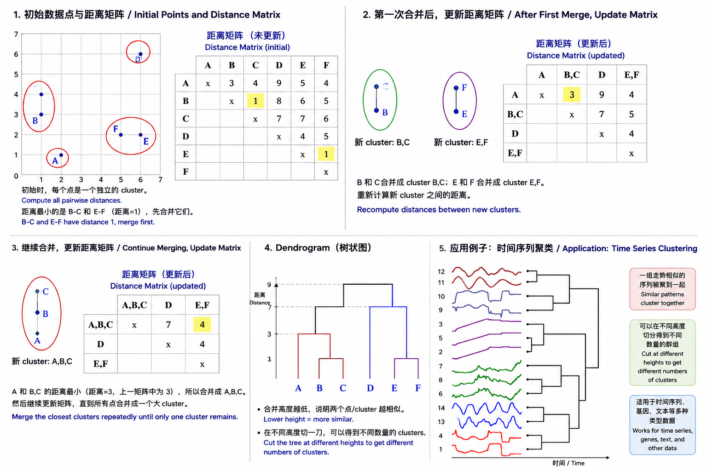

### 1.试卷上的题目 Question 7. K-means clustering

假设我们有 7 个需要聚类的样本：A、B、C、D、E、F 和 G。它们之间的距离由如下矩阵给出：

运行 k-means algorithm，将这些样本分成 2 个 cluster，运行 1 个 epoch。初始 centroids 是 A 和 B。展示得到的 clusters。

Suppose that we are given 7 examples to cluster: A, B, C, D, E, F and G. The distance between them is given by the following matrix:

Run the k-means algorithm to group these examples into 2 clusters for 1 epoch. The initial centroids are A and B. Show the resulting clusters.

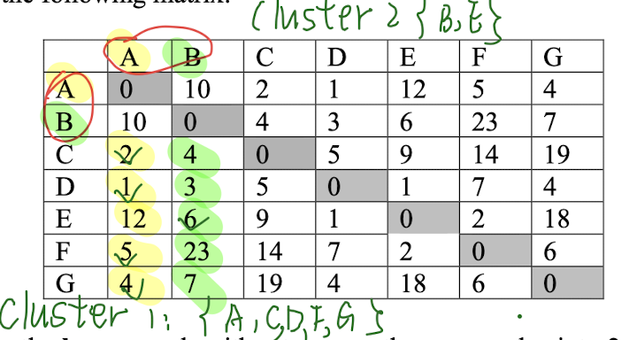

### 2. Clustering 基本概念 / Basic Concepts

#### 2.1 什么是聚类 / What is Clustering

① Clustering 聚类：把没有 label 的数据自动分组。Clustering = automatically group unlabeled data.② Cluster 簇：每一组叫一个 cluster。Cluster = one group of similar data points.③ 好聚类标准：组内相似，组间不同。Good clustering = similar inside, different between groups.④ High cohesion 🧲：同一组内部很像。High cohesion = points in the same cluster are similar.⑤ High separation ↔️：不同组之间差异大。High separation = different clusters are far apart.

#### 2.2 聚类是无监督学习 / Clustering is Unsupervised Learning

① 聚类没有 class label。Clustering has no class labels.② 输入是 unlabeled examples。Input = unlabeled examples.③ 任务是自动找隐藏结构。Task = automatically find hidden groups.④ K-means 需要先给 k。K-means needs predefined k.⑤ DBSCAN 不需要 k，但需要 Eps 和 MinPts。DBSCAN needs Eps and MinPts, not k.

#### 2.3 聚类应用 / Applications

① Marketing 🛒：把顾客分群。Customer segmentation.② Customer loyalty 👥：找可能流失的客户。Find customers likely to leave.③ Gene clustering 🧬：把相似基因分组。Group similar genes.④ Document clustering 📄：把相似文档分组。Group similar documents.⑤ Color compression 🎨：用中心颜色替代相似颜色。Replace similar colors with centroids.⑥ Image segmentation 🖼️：把图片分成不同区域。Divide image into regions.

### 3. 相似度与距离 / Similarity and Distance

#### 3.1 核心关系 / Core Idea

① 距离小 = 更相似。Small distance = more similar.② 距离大 = 更不相似。Large distance = less similar.③ 聚类通常靠 distance measure 判断相似度。Clustering uses distance measures to judge similarity.

#### 3.2 Euclidean Distance / 欧氏距离 📏

① 欧氏距离：直线距离。Euclidean distance = straight-line distance.② 公式：$D(A,B)=\sqrt{\sum_i(a_i-b_i)^2}$③ 适合数值数据，但容易受 scale 影响。Good for numerical data, but sensitive to scale.

#### 3.3 Manhattan Distance / 曼哈顿距离 🏙️

① 曼哈顿距离：每个维度差值的绝对值相加。Manhattan distance = sum of absolute differences.② 公式：$D(A,B)=\sum_i |a_i-b_i|$③ 像在城市街道走格子路。Like walking along city blocks.

#### 3.4 Cosine Similarity / 余弦相似度 🧭

① Cosine similarity：看两个向量方向像不像。Cosine similarity = compare vector directions.② 公式：$cos(A,B)=\frac{A\cdot B}{||A||||B||}$③ 值为 1：方向完全相同。1 = same direction.④ 值为 0：方向垂直。0 = orthogonal.⑤ 常用于文本、文档、词向量。Used for text, documents, word vectors.

### 4. Cluster 的中心与距离 / Cluster Centers and Cluster Distance

#### 4.1 Centroid / 质心

① Centroid 是 cluster 中所有点的平均位置。A centroid is the average position of all points in a cluster.
$$
C=\frac{\sum_{i=1}^{N}p_i}{N}
$$
② Centroid 通常不是原始数据中的某个真实点。A centroid is usually not an actual data point.

③ K-means 使用 centroid 表示 cluster 的中心。K-means uses centroids to represent cluster centers.

#### 4.2 Medoid / 中心点

① Medoid 是 cluster 中最中心的真实数据点。
 A medoid is the most centrally located actual data point in a cluster.

② Centroid 可以是虚拟点，medoid 必须是真实点。
 A centroid can be a virtual point, but a medoid must be a real point.

③ K-medoids 使用 medoid，因此比 K-means 更能抵抗 outliers。
 K-medoids uses medoids, so it is more robust to outliers than K-means.

#### 4.3 Cluster 之间的距离 / Distance Between Clusters

① Centroid distance：两个 cluster 的 centroid 之间的距离。
 Centroid distance: the distance between two cluster centroids.

② Medoid distance：两个 cluster 的 medoid 之间的距离。
 Medoid distance: the distance between two cluster medoids.

③ Single link：两个 cluster 中最近两个点之间的距离。
 Single link: the smallest pairwise distance between two clusters.

④ Complete link：两个 cluster 中最远两个点之间的距离。
 Complete link: the largest pairwise distance between two clusters.

⑤ Average link：两个 cluster 所有点对距离的平均值。
 Average link: the average pairwise distance between points in two clusters.

### 5. 聚类算法分类 / Taxonomy of Clustering Algorithms

① Partitional clustering：直接把数据分成一组 clusters。
 Partitional clustering directly partitions data into a set of clusters.

例子：
 Example:

**K-means, K-medoids**

② Model-based clustering：假设数据来自某种概率模型。
 Model-based clustering assumes that data is generated from a probabilistic model.

例子：
 Example:

**GMM: Gaussian Mixture Model**

③ Hierarchical clustering：产生层级嵌套的 clusters。
 Hierarchical clustering produces nested clusters.

例子：
 Example:

**Agglomerative clustering, Divisive clustering**

④ Density-based clustering：根据密度区域形成 clusters。
 Density-based clustering forms clusters based on dense regions.

例子：
 Example:

**DBSCAN**

### 6. K-means 聚类 / K-means Clustering

#### 6.1 K-means 的基本思想 / Basic Idea of K-means

① K-means 是 partitional clustering algorithm。
 K-means is a partitional clustering algorithm.

② 它要求提前指定 cluster 数量 $k$。
 It requires the number of clusters $k$ to be specified in advance.

③ 它的核心思想是：每个点属于离自己最近的 centroid。
 Its core idea is: each point belongs to the nearest centroid.

#### 6.2 K-means 的步骤 / Steps of K-means

① 第一步：选择 $k$ 个初始 centroid。
 Step 1: choose $k$ initial centroids.

② 第二步：把每个数据点分配给最近的 centroid。
 Step 2: assign each data point to the closest centroid.

③ 第三步：重新计算每个 cluster 的 centroid。
 Step 3: recompute the centroid of each cluster.

④ 第四步：检查是否停止。
 Step 4: check the stopping condition.

⑤ 如果 centroid 不再变化，或者只有很少点改变 cluster，就停止。
 If centroids no longer change, or only very few points change clusters, the algorithm stops.

⑥ 否则继续重复 assignment 和 recomputation。
 Otherwise, repeat assignment and recomputation.

#### 6.3 K-means 的复杂度 / Complexity of K-means

$$
O(nkid)
$$

① $n$：数据点数量。
 $n$: number of data points.

② $k$：cluster 数量。
 $k$: number of clusters.

③ $i$：iteration 数量。
 $i$: number of iterations.

④ $d$：attribute / feature 数量。
 $d$: number of attributes or features.

#### 6.4 K-means 例题逻辑 / K-means Example Logic

① PPT 例子中，初始 centroids 是 A 和 B。
 In the slide example, the initial centroids are A and B.

② 每个点比较到 A 和 B 的距离。
 Each point compares its distance to A and B.

③ C 到 B 更近，所以 C 分到 B 的 cluster。
 C is closer to B, so C is assigned to B’s cluster.

④ D 到 B 更近，所以 D 分到 B 的 cluster。
 D is closer to B, so D is assigned to B’s cluster.

⑤ E 到 A 更近，所以 E 分到 A 的 cluster。
 E is closer to A, so E is assigned to A’s cluster.

⑥ 第一轮结束后 clusters 是：
 After the first epoch, the clusters are:
$$
\{A,E\},\quad \{B,C,D\}
$$

#### 6.5 K-means 的问题：初始点敏感 / Problem: Sensitive to Initial Centroids

① K-means 的初始 centroids 通常随机选择。
 The initial centroids in K-means are usually selected randomly.

② 不同初始 centroids 可能得到完全不同的结果。
 Different initial centroids may produce very different clustering results.

③ 好的初始点可以快速得到自然 clusters。
 Good initial centroids can quickly produce natural clusters.

④ 差的初始点可能导致错误聚类。
 Poor initial centroids may lead to bad clustering.

#### 6.6 SSE / Sum of Squared Error

① SSE 用来衡量 cluster 内部误差。
 SSE measures the within-cluster error.
$$
SSE=\sum_{i=1}^{k}\sum_{x\in K_i}d(c_i,x)^2
$$
② 每个点的 error 是它到最近 centroid 的距离。
 The error of each point is its distance to the closest centroid.

③ 把这些距离平方后加起来，就是 SSE。
 Squaring and summing these distances gives SSE.

④ SSE 越小，说明点离自己的 centroid 越近。
 A smaller SSE means points are closer to their centroids.

#### 6.7 K-means++ / 改进初始点选择

① K-means++ 是 K-means 的变体。
 K-means++ is a variation of K-means.

② 它只改变 initial centroids 的选择方式，后续步骤和普通 K-means 一样。
 It only changes the way initial centroids are selected; the later steps are the same as standard K-means.

③ 它倾向于选择彼此距离较远的点作为初始 centroids。
 It tends to choose well-separated points as initial centroids.

④ 每个点被选为新 centroid 的概率，与它到最近已有 centroid 的距离平方成正比。
 The probability of choosing a point as a new centroid is proportional to the square of its distance to the closest existing centroid.

⑤ 这样可以减少坏初始化的风险。
 This reduces the risk of poor initialization.

#### 6.8 Empty Clusters / 空 cluster 问题

① K-means 可能产生 empty cluster。
 K-means can produce empty clusters.

② Empty cluster 指某个 cluster 没有任何点被分配进去。
 An empty cluster means no points are assigned to that cluster.

③ 解决方法可以是重新选择 centroid。
 A solution is to choose a different centroid.

④ 可以选择离当前所有 centroids 最远的点。
 One strategy is to choose the point farthest from any current centroid.

⑤ 也可以从 SSE 最大的 cluster 中选择一个点来分裂。
 Another strategy is to choose a point from the cluster with the largest SSE.

#### 6.9 Outliers / 离群点问题

① Outliers 会让 centroid 变得不具有代表性。
 Outliers can make centroids less representative.

② Outliers 会增加 SSE。
 Outliers increase SSE.

③ 一种方法是在 clustering 前移除 outliers。
 One method is to remove outliers before clustering.

④ 但有些场景中 outliers 很重要，不能随便删除。
 However, in some applications, outliers are important and should not be removed.

例如：
 For example:

**金融分析中，异常高价值客户可能很重要。**
 **In financial analysis, unusually profitable customers may be important.**

#### 6.10 Bisecting K-means / 二分 K-means

① Bisecting K-means 是 K-means 的扩展。
 Bisecting K-means is an extension of K-means.

② 它先把所有数据看成一个 cluster。
 It first treats all data as one cluster.

③ 然后每次选择一个 cluster，把它分裂成两个。
 Then it repeatedly selects one cluster and splits it into two.

④ 直到得到 $k$ 个 clusters。
 This continues until $k$ clusters are obtained.

⑤ 被分裂的 cluster 可以是最大的 cluster，也可以是 SSE 最大的 cluster。
 The cluster selected for splitting can be the largest cluster or the one with the largest SSE.

#### 6.11 K-means 适合什么数据 / When K-means Works Well

① K-means 适合 spherical clusters。
 K-means works well for spherical clusters.

② K-means 适合大小相近的 clusters。
 K-means works well for clusters of similar size.

③ K-means 适合密度相近的 clusters。
 K-means works well for clusters of similar density.

④ K-means 适合分离明显的 clusters。
 K-means works well for well-separated clusters.

#### 6.12 K-means 不适合什么数据 / When K-means Does Not Work Well

① 不适合 non-spherical shapes。
 It does not work well for non-spherical shapes.

② 不适合 cluster size 差异很大的数据。
 It does not work well when clusters have very different sizes.

③ 不适合 cluster density 差异很大的数据。
 It does not work well when clusters have very different densities.

④ 不适合有明显 outliers 的数据。
 It does not work well when data contains strong outliers.

### 7. GMM / Gaussian Mixture Model

#### 7.1 GMM 的基本思想 / Basic Idea of GMM

① GMM 是 model-based clustering。
 GMM is model-based clustering.

② 它假设数据来自多个 Gaussian distributions 的混合。
 It assumes that data is generated by a mixture of Gaussian distributions.

③ 每个 Gaussian distribution 对应一个 cluster。
 Each Gaussian distribution corresponds to one cluster.

④ 所以 GMM 是 probabilistic clustering。
 Therefore, GMM is probabilistic clustering.

#### 7.2 Normal Distribution / 正态分布

① 一维正态分布由两个参数控制：
 A one-dimensional normal distribution is controlled by two parameters:

**mean $\mu$**
 **standard deviation $\sigma$**

② 概率密度函数是：
 The probability density function is:
$$
f(x)=\frac{1}{\sigma\sqrt{2\pi}}e^{-\frac{(x-\mu)^2}{2\sigma^2}}
$$
③ $\mu$ 决定分布中心。
 $\mu$ determines the center of the distribution.

④ $\sigma$ 决定分布宽窄。
 $\sigma$ determines the spread of the distribution.

#### 7.3 GMM 的算法逻辑 / GMM Algorithm Logic

① 假设数据由 $k$ 个 Gaussian distributions 生成。
 Assume the data is generated by $k$ Gaussian distributions.

② 每个 distribution 都有自己的参数。
 Each distribution has its own parameters.

③ 一开始我们不知道这些参数，所以先随机初始化。
 At first, we do not know these parameters, so we initialize them randomly.

④ 然后反复做两个步骤：Expectation step 和 Maximization step。
 Then we repeatedly perform two steps: the Expectation step and the Maximization step.

#### 7.4 EM Algorithm / 期望最大化算法

##### Expectation Step / E-step

① E-step 计算每个点属于每个 cluster 的概率。
 The E-step computes the probability that each point belongs to each cluster.

② 这不是硬分配，而是 soft assignment。
 This is not hard assignment, but soft assignment.

例如：
 For example:

**一个点可能 70% 属于 cluster 1，30% 属于 cluster 2。**
 **A point may belong 70% to cluster 1 and 30% to cluster 2.**

##### Maximization Step / M-step

① M-step 根据这些概率重新估计 Gaussian 的参数。
 The M-step re-estimates Gaussian parameters based on these probabilities.

② 也就是重新计算 $\mu$、$\sigma$ 和 mixture weights。
 That means recomputing $\mu$, $\sigma$, and mixture weights.

③ 重复 E-step 和 M-step，直到参数几乎不再变化。
 Repeat the E-step and M-step until the parameters barely change.

#### 7.5 GMM 和 K-means 的对应关系 / Correspondence Between GMM and K-means

① GMM 的 E-step 类似 K-means 的 assignment step。
 The E-step in GMM is similar to the assignment step in K-means.

② 但 K-means 是 crisp assignment。
 But K-means uses crisp assignment.

③ GMM 是 probabilistic assignment。
 GMM uses probabilistic assignment.

④ GMM 的 M-step 类似 K-means 中重新计算 centroid。
 The M-step in GMM is similar to recomputing centroids in K-means.

⑤ 但 GMM 重新计算的是 distribution parameters。
 But GMM recomputes distribution parameters.

#### 7.6 GMM vs K-means

① GMM 可以看作 K-means 的 generalization。
 GMM can be seen as a generalization of K-means.

② K-means 更像是把 cluster 看成圆形区域。
 K-means tends to model clusters as circular regions.

③ GMM 可以处理 elliptical clusters。
 GMM can handle elliptical clusters.

④ K-means 给每个点一个确定的 cluster。
 K-means assigns each point to one definite cluster.

⑤ GMM 给每个点属于每个 cluster 的概率。
 GMM gives each point a probability of belonging to each cluster.

### 8. Hierarchical Clustering / 层次聚类

#### 8.1 基本思想 / Basic Idea

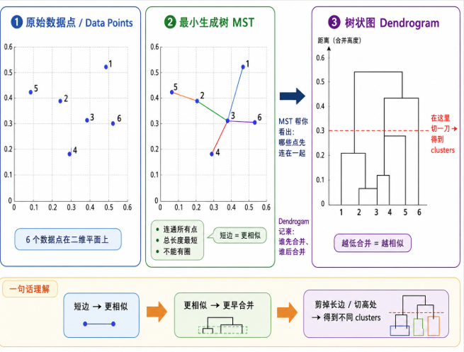

① Hierarchical clustering 会产生 nested clusters。

Hierarchical clustering produces nested clusters.

② 这些 clusters 可以组织成一个 hierarchical tree。
 These clusters can be organized as a hierarchical tree.

③ 结果通常用 dendrogram 表示。
 The result is usually visualized using a dendrogram.

④ Dendrogram 记录了 clusters 合并或分裂的顺序。
 A dendrogram records the sequence of cluster merges or splits.

#### 8.2 优点 / Strengths

① 不需要提前指定 cluster 数量。
 It does not require the number of clusters to be specified in advance.

② 想要几个 clusters，可以在 dendrogram 的不同高度 cut。
 The desired number of clusters can be obtained by cutting the dendrogram at different levels.

③ Dendrogram 可以提供可解释的聚类过程。
 The dendrogram provides an interpretable description of the clustering process.

④ 它适合有自然层级关系的数据。
 It is suitable for data with natural hierarchical relationships.

例如：
 For example:

**taxonomy, hierarchy, time series grouping**

#### 8.3 两种方向 / Two Approaches

##### Agglomerative / 自底向上

① Agglomerative 是 bottom-up。
 Agglomerative clustering is bottom-up.

② 一开始每个点都是自己的 cluster。
 At the beginning, each point is its own cluster.

③ 然后不断合并最近的 clusters。
 Then the closest clusters are repeatedly merged.

④ 直到所有点都属于一个 cluster。
 This continues until all points belong to one cluster.

##### Divisive / 自顶向下

① Divisive 是 top-down。
 Divisive clustering is top-down.

② 一开始所有点在同一个 cluster。
 At the beginning, all points are in one cluster.

③ 然后不断把 cluster 分裂成更小的 clusters。
 Then clusters are repeatedly split into smaller clusters.

④ 直到每个点都是自己的 cluster。
 This continues until each point becomes its own cluster.

⑤ PPT 里重点讲的是 agglomerative，因为它更常用。
 The slides focus on agglomerative clustering because it is more commonly used.

#### 8.4 Agglomerative Clustering 步骤 / Steps of Agglomerative Clustering

① 计算所有点之间的 distance matrix。
 Compute the distance matrix between all points.

② 让每个点先成为一个 cluster。
 Let each point initially be a cluster.

③ 找到距离最近的两个 clusters。
 Find the two closest clusters.

④ 合并这两个 clusters。
 Merge these two clusters.

⑤ 更新 distance matrix。
 Update the distance matrix.

⑥ 重复直到只剩一个 cluster。
 Repeat until only one cluster remains.

#### 8.5 Hierarchical Clustering 中的 cluster 距离 / Cluster Distance in Hierarchical Clustering

① Single link：两个 cluster 之间最近点对的距离。
 Single link: the distance between the closest pair of points from two clusters.

② Complete link：两个 cluster 之间最远点对的距离。
 Complete link: the distance between the farthest pair of points from two clusters.

③ Average link：两个 cluster 之间所有点对距离的平均值。
 Average link: the average pairwise distance between points from two clusters.

④ Ward’s method：合并两个 cluster 后 SSE 增加多少。
 Ward’s method: the increase in SSE caused by merging two clusters.

#### 8.6 Hierarchical Clustering 的限制 / Limitations

① 计算成本高。
 It is computationally expensive.

② Space complexity 是：
 The space complexity is:
$$
O(n^2)
$$
因为要存 distance matrix 和 dendrogram。
 because it stores the distance matrix and dendrogram.

③ Time complexity 是：
 The time complexity is:
$$
O(n^3)
$$
因为每一层都要搜索并更新 distance matrix。
 because each level requires searching and updating the distance matrix.

④ 不适合高维大数据。
 It is not suitable for high-dimensional large datasets.

⑤ 对 noise 和 outliers 敏感。
 It is sensitive to noise and outliers.

### 9. DBSCAN / Density-Based Clustering

*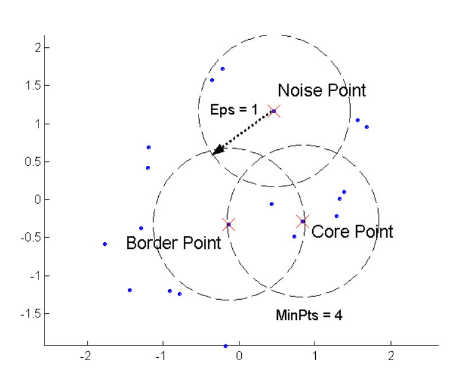

#### 9.1 DBSCAN 的基本思想 / Basic Idea of DBSCAN

① DBSCAN 全称是 **Density-Based Spatial Clustering of Applications with Noise**。
 DBSCAN stands for **Density-Based Spatial Clustering of Applications with Noise**.

② 它认为 cluster 是高密度区域。
 It treats clusters as high-density regions.

③ 不同 cluster 之间由低密度区域隔开。
 Different clusters are separated by low-density regions.

④ 和 K-means 不同，DBSCAN 可以发现复杂形状的 clusters。
 Unlike K-means, DBSCAN can find clusters with complex shapes.

例如：
 For example:

**S-shape, oval shape, half-circle shape, moon-shaped clusters**

#### 9.2 Eps 和 MinPts / Eps and MinPts

① DBSCAN 需要两个核心参数：
 DBSCAN requires two core parameters:

**Eps**
 **MinPts**

② Eps 是 neighborhood 半径。
 Eps is the radius of the neighborhood.

③ MinPts 是一个点成为 core point 所需要的最少邻居数量。
 MinPts is the minimum number of points required for a point to be a core point.

④ 如果 Eps 太大，很多点都会变成 core points。
 If Eps is too large, many points become core points.

⑤ 如果 Eps 太小，很多点都会变成 noise。
 If Eps is too small, many points become noise.

#### 9.3 三类点 / Three Types of Points

##### Core Point / 核心点

① 如果一个点的 Eps neighborhood 中至少有 MinPts 个点，它就是 core point。
 If a point has at least MinPts points in its Eps neighborhood, it is a core point.

② Core point 通常位于 cluster 内部。
 A core point is usually inside a cluster.

##### Border Point / 边界点

① Border point 不是 core point。
 A border point is not a core point.

② 但它落在某个 core point 的 Eps neighborhood 里。
 But it lies within the Eps neighborhood of a core point.

③ Border point 位于 cluster 边缘。
 A border point lies near the boundary of a cluster.

##### Noise Point / 噪声点

① Noise point 既不是 core point，也不属于任何 core point 的 neighborhood。
 A noise point is neither a core point nor within the neighborhood of any core point.

② 它会被 DBSCAN 当作 noise / outlier。
 It is treated as noise or an outlier by DBSCAN.

#### 9.4 DBSCAN 算法步骤 / Steps of DBSCAN

① 标记所有点为 core、border 或 noise。
 Label all points as core, border, or noise.

② 丢弃 noise points。
 Discard noise points.

③ 如果两个 core points 在彼此 Eps 范围内，就放进同一个 cluster。
 If two core points are within Eps of each other, put them into the same cluster.

④ 如果 border point 在某个 core point 的 neighborhood 里，就加入这个 core point 所属的 cluster。
 If a border point is in the neighborhood of a core point, assign it to that core point’s cluster.

⑤ 如果一个 border point 同时属于多个 core points 的 neighborhood，需要 tie-breaking rule。
 If a border point belongs to the neighborhoods of multiple core points, a tie-breaking rule is needed.

#### 9.5 DBSCAN 的参数选择 / Choosing Eps and MinPts

① 可以用 k-distance graph。
 We can use a k-distance graph.

② 对每个点计算到第 $k$ 个 nearest neighbor 的距离。
 For each point, compute the distance to its $k$-th nearest neighbor.

③ 把这些距离排序后画图。
 Sort these distances and plot them.

④ 图中明显上升的位置可以作为 Eps 的候选值。
 A sharp increase in the plot can be used as a candidate Eps value.

#### 9.6 DBSCAN 的复杂度 / Complexity of DBSCAN

① 普通情况下 time complexity 是：
 In the ordinary case, the time complexity is:
$$
O(n^2)
$$
② 低维空间中使用 kd-tree 可以降低到：
 In low-dimensional spaces, using kd-trees can reduce it to:
$$
O(n\log n)
$$
③ Space complexity 是：
 The space complexity is:
$$
O(n)
$$
因为只需要保存每个点的 cluster 和类型。
 because it only needs to store each point’s cluster and type.

#### 9.7 DBSCAN 的优点 / Strengths of DBSCAN

① 可以发现任意形状的 clusters。
 It can find clusters of arbitrary shapes.

② 可以发现大小不同的 clusters。
 It can find clusters of different sizes.

③ 不需要直接指定 cluster 数量。
 It does not require the number of clusters to be specified directly.

④ 对 noise 有抵抗力。
 It is resistant to noise.

⑤ 它能找到很多 K-means 找不到的 clusters。
 It can find many clusters that K-means cannot find.

#### 9.8 DBSCAN 的缺点 / Weaknesses of DBSCAN

① 不适合密度差异很大的 clusters。
 It does not work well for clusters with widely varying densities.

② 不适合高维数据。
 It does not work well for high-dimensional data.

③ 对 Eps 和 MinPts 很敏感。
 It is sensitive to Eps and MinPts.

④ Eps 和 MinPts 有时很难确定。
 Eps and MinPts may be difficult to determine.

### 10. 聚类结果评价 / Evaluating Clustering Results

#### 10.1 为什么要评价聚类 / Why Evaluate Clustering

① 聚类算法总能找出 clusters，即使数据本身是随机噪声。
 Clustering algorithms can always find clusters, even if the data is random noise.

② 所以我们需要判断找到的 clusters 是否真的有意义。
 Therefore, we need to judge whether the discovered clusters are meaningful.

③ 否则可能会在 noise 中寻找不存在的 pattern。
 Otherwise, we may find meaningless patterns in noise.

#### 10.2 Internal vs External Evaluation

##### Internal Evaluation / 内部评价

① Internal measures 不需要真实 labels。
 Internal measures do not require true labels.

② 它们只根据数据本身和聚类结果评价质量。
 They evaluate clustering quality only based on the data and clustering results.

③ 重点看 cohesion 和 separation。
 They focus on cohesion and separation.

##### External Evaluation / 外部评价

① External measures 需要 ground truth labels。
 External measures require ground truth labels.

② 它们把 clustering result 和专家给出的正确类别进行比较。
 They compare the clustering result with correct labels provided by experts.

#### 10.3 Cohesion / 聚合度

① Cohesion 衡量 cluster 内部有多紧密。
 Cohesion measures how compact a cluster is.

② 组内距离越小，cohesion 越好。
 The smaller the within-cluster distance, the better the cohesion.

③ 对 cluster $K_i$，cohesion 可以表示为：
 For cluster $K_i$, cohesion can be expressed as:
$$
cohesion(K_i)=\sum_{x\in K_i}dist(c_i,x)
$$
④ $c_i$ 是 cluster centroid。
 $c_i$ is the cluster centroid.

#### 10.4 Separation / 分离度

① Separation 衡量不同 clusters 之间分得有多开。
 Separation measures how far clusters are from each other.

② cluster 之间距离越大，separation 越好。
 The larger the distance between clusters, the better the separation.

③ 对 cluster $K_i$，可以看它的 centroid 到 overall centroid 的距离。
 For cluster $K_i$, we can look at the distance between its centroid and the overall centroid.

#### 10.5 SSE 和 BSE / Within-Cluster and Between-Cluster Distances

① SSE 表示 cluster 内部距离。
 SSE represents within-cluster distance.
$$
SSE=\sum_{i=1}^{k}\sum_{x\in K_i}d(c_i,x)^2
$$
② SSE 越小，说明 cluster 内部越紧密。
 A smaller SSE means clusters are more compact.

③ BSE 表示 cluster 之间距离。
 BSE represents between-cluster distance.
$$
BSE=\sum_{i=1}^{k}|K_i|d(c_i,c)^2
$$
④ BSE 越大，说明 clusters 分得越开。
 A larger BSE means clusters are more separated.

#### 10.6 Silhouette Coefficient / 轮廓系数

① Silhouette coefficient 结合了 cohesion 和 separation。
 The silhouette coefficient combines cohesion and separation.

② 对一个点 $i$：
 For a point $i$:
$$
a_i = \text{average distance from } i \text{ to points in its own cluster}
$$
③ Silhouette coefficient 是：
 The silhouette coefficient is:
$$
s_i=\frac{b_i-a_i}{max(a_i,b_i)}
$$
④ $a_i$ 越小越好，因为说明点离自己 cluster 近。
 A smaller $a_i$ is better because the point is close to its own cluster.

⑤ $b_i$ 越大越好，因为说明点离其他 clusters 远。
 A larger $b_i$ is better because the point is far from other clusters.

⑥ 所以 $s_i$ 越大，说明这个点分得越合理。
 Therefore, a larger $s_i$ means the point is better clustered.

#### 10.7 Correlation Between Similarity Matrices

① 这个方法比较两个 similarity matrices。
 This method compares two similarity matrices.

② 第一个 matrix 来自原始 distance matrix。
 The first matrix is derived from the original distance matrix.

③ 第二个 matrix 来自 clustering result。
 The second matrix is derived from the clustering result.

④ 它想回答的问题是：相似的点是否真的被分到了同一个 cluster？
 It asks: are similar points actually assigned to the same cluster?

⑤ Correlation 越高，clustering quality 越好。
 The higher the correlation, the better the clustering quality.

#### 10.8 Visual Inspection of Similarity Matrix

① 先按照 cluster 顺序排列 points。
 First, order points based on cluster membership.

② 然后把 similarity matrix 用颜色画出来。
 Then plot the similarity matrix using colors.

③ 如果主对角线附近出现明显 block pattern，说明聚类效果好。
 If clear block patterns appear along the main diagonal, the clustering is good.

④ 因为这说明同一 cluster 内部的点彼此相似。
 This means points within the same cluster are similar to each other.

#### 10.9 Elbow Method / 肘部法

① Elbow method 用来估计合适的 cluster 数量。
 The elbow method is used to estimate a good number of clusters.

② 对多个不同的 $k$ 运行 clustering algorithm。
 Run the clustering algorithm for several values of $k$.

③ 画出 $k$ 和 SSE 的关系图。
 Plot $k$ against SSE.

④ 找到下降趋势明显变缓的位置，也就是 elbow。
 Find the point where the decrease becomes much slower, called the elbow.

⑤ 这个位置通常可以作为较合适的 cluster 数量。
 This point is often used as a reasonable number of clusters.

### 11. 第十周最核心的一句话 / One-Sentence Core of Week 10

**第十周的核心是：聚类是在没有 label 的情况下，根据距离、密度或概率模型把相似数据自动分组；K-means 适合圆形且大小密度相近的 clusters，GMM 用概率分布做 soft clustering，Hierarchical clustering 产生 dendrogram，DBSCAN 用密度发现复杂形状 clusters，最后用 cohesion、separation、silhouette、correlation、visual inspection 和 elbow method 评价结果。**
 **The core of Week 10 is: clustering groups similar data without labels using distance, density, or probabilistic models; K-means works for spherical clusters with similar size and density, GMM performs soft clustering using probability distributions, hierarchical clustering produces a dendrogram, DBSCAN finds complex-shaped clusters using density, and clustering quality is evaluated using cohesion, separation, silhouette, correlation, visual inspection, and the elbow method.**

## **Week 11 — 概率模型（Markov / HMM）**

- 试卷一 Q8（马尔可夫条件概率计算）
- 试卷一 Q9（HMM观测序列概率 + Viterbi）
- 试卷二 Q19.3（马尔可夫路径概率）

### 1. 第十一周主题 / Week 11 Topic：Markov Models

① 这一周主要讲 **Markov Chain 马尔可夫链** 和 **Hidden Markov Model 隐马尔可夫模型 HMM**。
 This week focuses on **Markov Chains** and **Hidden Markov Models (HMMs)**. 

② 核心问题是：当一个系统会随时间变化时，我们如何根据当前状态或观察结果，预测未来状态或隐藏状态？
 The core question is: when a system changes over time, how can we use the current state or observations to predict future states or hidden states?

③ 这一周的主线是：
 Markov Chain → HMM → Evaluation → Decoding → Learning → Applications
 马尔可夫链 → 隐马尔可夫模型 → 评估问题 → 解码问题 → 学习问题 → 应用场景

### 2. Markov Chain / 马尔可夫链

#### 2.1 基本定义 / Basic Definition

① 马尔可夫链描述的是一个系统从一个状态转移到另一个状态的过程。
 A Markov Chain describes a sequence of transitions from one state to another.

② 它最重要的假设是：**下一个状态只依赖当前状态，不依赖更早的历史。**
 Its key assumption is: **the next state depends only on the current state, not on earlier history.**

公式是：
$$
P(\pi_i \mid \pi_1,\ldots,\pi_{i-1}) = P(\pi_i \mid \pi_{i-1})
$$
中文理解：
 已知前一天的天气之后，再往前几天的天气就不考虑了。
 Once we know yesterday’s weather, earlier days are ignored.

#### 2.2 状态和转移概率 / States and Transition Probabilities

① 状态 state 是系统可能处在的情况，比如天气可以是 Rainy、Cloudy、Sunny。
 A state is a possible condition of the system, such as Rainy, Cloudy, or Sunny.

② 转移概率 transition probability 是从一个状态变到另一个状态的概率。
 A transition probability is the probability of moving from one state to another.

公式是：
$$
a_{ij}=P(\pi_t=j \mid \pi_{t-1}=i)
$$
中文理解：
 如果今天是 Sunny，明天还是 Sunny 的概率可能是 0.8。
 If today is Sunny, the probability that tomorrow is also Sunny may be 0.8.

③ 所有转移概率放在一起，就形成 **transition matrix 转移矩阵**。
 All transition probabilities together form a **transition matrix**.

### 3. 用 Markov Chain 预测序列 / Predicting Sequences with Markov Chain

① 马尔可夫链不仅可以预测下一个状态，也可以计算一整段状态序列的概率。
 A Markov Chain can predict not only the next state, but also the probability of a whole state sequence.

公式是：
$$
P(\pi_1,\ldots,\pi_k)=P(\pi_1)\prod_{i=1}^{k-1}P(\pi_{i+1}\mid \pi_i)
$$
② 例子：计算 Sunny, Sunny, Cloudy, Rainy 的概率。
 Example: compute the probability of Sunny, Sunny, Cloudy, Rainy.
$$
P(Sunny,Sunny,Cloudy,Rainy)
$$
③ 中文理解：
 先看第一个状态出现的概率，再把每一步状态转移的概率连乘起来。
 First take the probability of the initial state, then multiply all transition probabilities along the path.

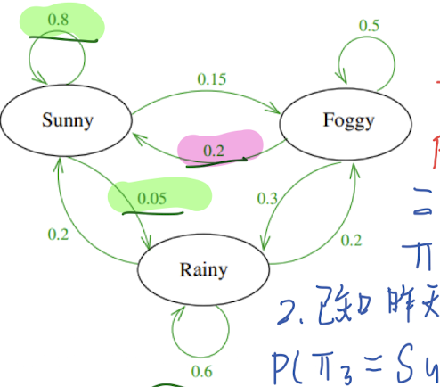

### 4. Hidden Markov Model / 隐马尔可夫模型 HMM

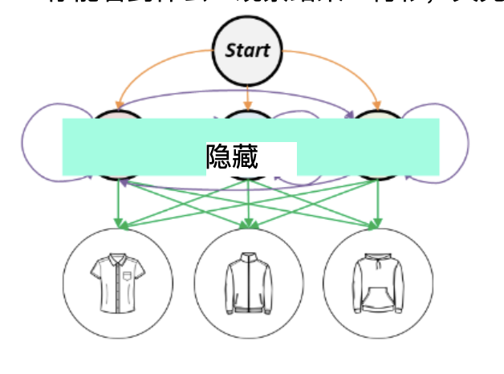

对于隐藏路径 $s_1 \to s_2$ 和观测 $o_1,o_2$：

$P(s_1,s_2,o_1,o_2)=P(s_1)\times P(o_1|s_1)\times P(s_2|s_1)\times P(o_2|s_2)$

###### **最短理解**

观测是 Dress, Blazer，但天气看不见。
 所以要枚举所有可能天气路径，再算每条路径产生 Dress, Blazer 的概率。

#### 4.1 为什么需要 HMM / Why HMM Is Needed

① Markov Chain 适合处理状态可以直接观察的情况。
 A Markov Chain is useful when the states are directly observable.

② HMM 用在状态不能直接观察的情况。我们只能看到一些间接证据。
 HMM is used when the states are hidden. We can only observe indirect evidence.

③ PPT 的天气例子是：你看不到外面的天气，只能看到送饭的人穿 Shirt、Jacket、Hoodie。
 In the weather example, you cannot see the weather directly; you only observe whether the caregiver wears a Shirt, Jacket, or Hoodie.

④ 隐藏状态 hidden states 是天气：Sunny、Cloudy、Rainy。
 The hidden states are the weather: Sunny, Cloudy, Rainy.

⑤ 观察值 observations 是衣服：Shirt、Jacket、Hoodie。
 The observations are the clothes: Shirt, Jacket, Hoodie.

#### 4.2 HMM 的组成 / Components of HMM

① 隐藏状态集合：
 Hidden state set:
$$
\pi = \{\pi_1,\pi_2,\ldots,\pi_N\}
$$
② 观察序列：
 Observation sequence:
$$
X=x_1,x_2,\ldots,x_M
$$
③ 转移矩阵 $A$：表示隐藏状态之间如何转移。
 Transition matrix $A$: describes how hidden states move from one to another.

④ 初始概率 $A_0$：表示一开始处于每个隐藏状态的概率。
 Initial probability $A_0$: gives the probability of starting in each hidden state.

⑤ 发射矩阵 $E$：表示某个隐藏状态产生某个观察值的概率。
 Emission matrix $E$: gives the probability of observing a value given a hidden state.

公式是：
$$
e_k(x_i)=P(x_i\mid \pi_i=k)
$$
 如果真实天气是 Rainy，那么看到 Shirt 的概率是多少。
 If the true weather is Rainy, what is the probability of observing Shirt?

### 5. HMM 的三个核心问题 / Three Main Problems of HMM

#### 5.1 Problem 1：Evaluation / 评估问题

① 问题是：给定 HMM 模型和观察序列，求这个观察序列出现的概率。
 The question is: given an HMM model and an observation sequence, what is the probability of this observation sequence?

形式是：
$$
P(X \mid \lambda)
$$
② 例子：已知模型，观察到 Shirt, Hoodie，这个观察序列有多可能？
 Example: given the model, how likely is the observation sequence Shirt, Hoodie?

③ 暴力枚举法会把所有可能隐藏状态序列都算一遍再相加。
 Enumeration computes the probability of every possible hidden state sequence and sums them.

④ 问题是：状态多、时间长时，枚举会非常慢。
 The problem is: enumeration becomes very slow when there are many states or long sequences.

⑤ 解决方法是 **Forward Algorithm 前向算法**。
 The solution is the **Forward Algorithm**. 

#### 5.2 Forward Algorithm / 前向算法

① Forward Algorithm 的核心思想是动态规划：保存中间概率，不重复计算。
 The Forward Algorithm uses dynamic programming: it stores intermediate probabilities to avoid repeated computation.

② 前向概率 $f_k(i)$ 表示：到第 $i$ 个时间点为止，并且当前隐藏状态是 $k$ 的概率。
 The forward probability $f_k(i)$ means: the probability of the partial observation sequence up to time $i$, ending in hidden state $k$.

初始化：
$$
f_k(1)=A_0(k)e_k(x_1)
$$
递推：
$$
f_k(i)=e_k(x_i)\sum_j f_j(i-1)a_{jk}
$$
终止：
$$
P(X)=\sum_k f_k(m)
$$
③ Forward 是“把所有路径都考虑进去”，但不是一条一条完整枚举，而是边走边汇总。
 Forward considers all possible paths, but it aggregates them step by step instead of fully enumerating every path.

④ PPT 例子中，观察序列 Shirt, Hoodie 的概率最后算出：
 In the PPT example, the probability of Shirt, Hoodie is:
$$
P(X)=0.0035+0.0189+0.0739=0.0963
$$

### 6. Problem 2：Decoding / 解码问题

① 问题是：给定 HMM 模型和观察序列，找出最可能的隐藏状态序列。
 The question is: given an HMM model and an observation sequence, find the most likely sequence of hidden states.

② 例子：观察到 Shirt, Hoodie，最可能的真实天气序列是什么？
 Example: if we observe Shirt, Hoodie, what is the most likely weather sequence?

③ 解决方法是 **Viterbi Algorithm 维特比算法**。
 The solution is the **Viterbi Algorithm**. 

#### 6.1 Viterbi Algorithm / 维特比算法

① Viterbi 和 Forward 很像，也用动态规划。
 Viterbi is similar to Forward because both use dynamic programming.

② 不同点是：Forward 用求和，Viterbi 用最大值。
 The difference is: Forward uses summation, while Viterbi uses maximum.

Forward：
$$
f_k(i)=e_k(x_i)\sum_j f_j(i-1)a_{jk}
$$
Viterbi：
$$
V_k(i)=e_k(x_i)\max_j V_j(i-1)a_{jk}
$$
③ 中文理解：
 Forward 问“这个观察序列总体有多可能”；Viterbi 问“哪一条隐藏路径最可能”。
 Forward asks “how likely is this observation sequence overall”; Viterbi asks “which hidden path is most likely.”

④ Viterbi 还需要记录 back-pointer，因为最后只知道终点不够，还要倒推出完整路径。
 Viterbi also stores back-pointers because knowing the final state is not enough; we need to trace back the whole path.

Back-pointer 公式：
$$
Ptr_k(i)=\arg\max_j V_j(i-1)a_{jk}
$$

#### 6.2 PPT 例子结果 / PPT Example Result

① 初始化时：
 At initialization:
$$
V_{Rainy}(1)=0.6\times0.8=0.48
$$
② 第二步观察 Hoodie 后：
 After observing Hoodie at time 2:
$$
V_{Rainy}(2)=0.0029
$$
③ 最大值是 Sunny，所以最终状态是 Sunny。
 The largest value is Sunny, so the final state is Sunny.

④ 通过 back-pointer 往回找，前一个状态是 Rainy。
 By tracing back through the pointer, the previous state is Rainy.

⑤ 所以最可能的隐藏状态序列是：
 So the most likely hidden state sequence is:
$$
Rainy \rightarrow Sunny
$$
PPT 中 Viterbi 的最终结果就是 **Rainy, Sunny**。
 The final Viterbi result in the slides is **Rainy, Sunny**. 

### 7. Problem 3：Learning / 学习问题

① 问题是：只给观察序列，反过来学习 HMM 模型。
 The question is: given only the observation sequence, learn the HMM model.

形式是：
$$
X=x_1,x_2,\ldots,x_M
$$
要求：
$$
\lambda=(\pi,A,A_0)
$$
② 中文理解：
 前两个问题是假设模型已经知道；Learning 是模型本身也不知道，要从数据里估出来。
 The first two problems assume the model is known; Learning means the model itself is unknown and must be estimated from data.

③ 解决方法是 **EM Algorithm 期望最大化算法**。
 The solution is the **EM Algorithm**, or Expectation Maximization. 

#### 7.1 EM Algorithm / 期望最大化算法

① 第一步：随机初始化模型参数。
 Step 1: initialize the model parameters randomly.
$$
\lambda=(\pi,A,A_0)
$$
② 第二步：Expectation step，估计不同隐藏状态和转移的概率。
 Step 2: Expectation step, estimate probabilities of hidden states and transitions.

③ 第三步：Maximization step，根据观察序列重新估计模型参数。
 Step 3: Maximization step, re-estimate model parameters based on the observation sequence.

④ 第四步：如果 $P(X\mid \lambda)$ 增加，就继续迭代；否则停止。
 Step 4: if $P(X\mid \lambda)$ increases, continue; otherwise stop.

⑤ 中文理解：
 EM 就是“先猜模型 → 用模型解释数据 → 根据解释修正模型 → 重复直到变好不了”。
 EM means “guess a model → use it to explain the data → update the model → repeat until it no longer improves.”

① Markov Chain 👀：状态看得见。State is visible.

② HMM 🫥：状态看不见，只能看观察值。State is hidden; only observations are visible.

③ Evaluation ❓：这个观察序列有多可能？Use Forward.

④ Decoding 🧩：最可能的隐藏状态是哪条？Use Viterbi.

⑤ Learning 🛠️：参数不知道，反过来学参数。Use EM.

⑥ HMM 总逻辑 ⏳🫥👀：真实状态看不见 + 只能看间接表现 + 随时间变化 → 用 HMM。Hidden state + observations + time sequence → use HMM.

## **Week 12 — 强化学习**

- 试卷二 Q19（最优策略、V*(s)、MDP）

① 强化学习：解决“一步接一步做选择”的问题。RL = make decisions step by step.② 监督学习：给正确答案 label；强化学习：给 reward，不给每一步答案。Supervised learning gives labels; RL gives rewards, not step-by-step answers.

### 2. Reinforcement Learning / 强化学习基本概念

#### 2.1 核心定义 / Core Definition

① 强化学习是从和环境的交互中学习。
 Reinforcement learning is learning from interaction with the environment. 

② Agent 会在某个 state 下选择 action，然后 environment 返回新的 state 和 reward。
 The agent chooses an action in a state, and the environment returns a new state and a reward.

基本流程是：
$$
s_t \rightarrow a_t \rightarrow r_{t+1}, s_{t+1}
$$
当前状态 $s_t$ 下，智能体做动作 $a_t$，环境给奖励 $r_{t+1}$，并进入下一个状态 $s_{t+1}$。
 In state $s_t$, the agent takes action $a_t$, receives reward $r_{t+1}$, and moves to next state $s_{t+1}$.

#### 2.2 Reward / 奖励

① Reward 是一个 scalar feedback signal，也就是一个数字形式的反馈。
 A reward is a scalar feedback signal.

② 它告诉 agent 当前行为是好还是不好。
 It tells the agent whether its action is good or bad.

③ 强化学习目标是最大化 cumulative reward 累积奖励。
 The goal of reinforcement learning is to maximize cumulative reward.

公式可以理解为：
$$
\sum_{t=0}^{\infty} \gamma^t r_t
$$
④ $\gamma$ 是 discount factor 折扣因子，用来控制未来奖励的重要性。
 $\gamma$ is the discount factor, controlling how much future rewards matter.

⑤ 例子：机器人往前走给正奖励，摔倒给负奖励；游戏分数增加给正奖励，分数下降给负奖励。
 Examples: a robot receives positive reward for moving forward and negative reward for falling; a game-playing agent receives positive reward for increasing score and negative reward for decreasing score.

### 3. MDP / Markov Decision Process 马尔可夫决策过程

#### 3.1 MDP 是什么 / What MDP Means

① MDP 是强化学习最重要的数学框架。
 MDP is the main mathematical framework for reinforcement learning.

② 它在 Markov Model 的基础上加入了 action 和 reward。
 It extends Markov models by adding actions and rewards.

③ 一个 MDP 通常写成：
$$
(S,A,R,P,\gamma)
$$
其中：
$$
S = \text{states}
$$
中文理解：
 MDP 就是：在某个状态下，agent 做一个动作，环境根据概率转移到下一个状态，并给一个奖励。
 An MDP means: in a state, the agent takes an action; the environment probabilistically moves to the next state and gives a reward.

#### 3.2 Policy / 策略

① Policy 是 agent 的行为函数。
 A policy is the agent’s behaviour function.

② 它告诉 agent 在每个 state 应该选什么 action。
 It tells the agent which action to choose in each state.

公式可以写成：
$$
\pi(a|s)
$$

 在状态 $s$ 下，选择动作 $a$ 的策略。The policy for choosing action $a$ in state $s$.

③ Optimal policy 最优策略 $\pi^*$ 是让期望累积奖励最大的策略。
 The optimal policy $\pi^*$ is the policy that maximizes expected cumulative reward.
$$
\pi^* = \arg\max_{\pi} E\left[\sum_{t\geq0}\gamma^t r_t \mid \pi\right]
$$

### 4. Value Function 和 Q-Value Function

#### 4.1 Value Function / 状态价值函数

① Value function 回答的问题是：**这个 state 有多好？**
 The value function answers: **how good is this state?**
$$
V^\pi(s)=E\left[\sum_{t\geq0}\gamma^t r_t \mid s_0=s,\pi\right]
$$

 从状态 $s$ 开始，按照策略 $\pi$ 行动，未来能拿到多少期望奖励。Starting from state $s$, following policy $\pi$, how much expected future reward can be obtained?

#### 4.2 Q-Value Function / 动作价值函数

① Q-value function 回答的问题是：**在这个 state 做这个 action 有多好？**
 The Q-value function answers: **how good is taking this action in this state?**
$$
Q^\pi(s,a)=E\left[\sum_{t\geq0}\gamma^t r_t \mid s_0=s,a_0=a,\pi\right]
$$
② 先在状态 $s$ 做动作 $a$，之后按照策略 $\pi$ 行动，未来能拿到多少奖励。
 First take action $a$ in state $s$, then follow policy $\pi$; the Q-value is the expected future reward.

### 5. Bellman Equation / 贝尔曼方程

① Bellman equation 是强化学习里的核心公式。
 The Bellman equation is the core formula in reinforcement learning.

② 它的思想是：
 当前动作的价值 = 立即奖励 + 未来最优价值。
 The value of a current action = immediate reward + discounted best future value.
$$
Q^*(s,a)=E_{s'}\left[r+\gamma\max_{a'}Q^*(s',a')\mid s,a\right]
$$
③ 中文理解：
 做完当前动作后，不只看现在拿多少 reward，还要看下一个状态未来最多能拿多少 reward。
 After taking the current action, we consider not only the immediate reward, but also the best possible future reward from the next state.

### 6. Q-Learning / Q 学习

#### 6.1 Q-Learning 的目标 / Goal of Q-Learning

① Q-Learning 的目标是学习一个 Q-table 或 Q-function。
 The goal of Q-Learning is to learn a Q-table or Q-function.

② 学完以后，agent 在每个 state 选择 Q 值最大的 action。
 After learning, the agent chooses the action with the highest Q-value in each state.
$$
a^*=\arg\max_a Q(s,a)
$$

#### 6.2 Q-Learning 更新公式 / Update Formula

① 当前估计值是：
$$
Q(s,a)
$$
② target 目标值是：
$$
R(s,a,s')+\gamma\max_{a'}Q(s',a')
$$
③ TD error / 更新差值是：
$$
\Delta Q(s,a)=R(s,a,s')+\gamma\max_{a'}Q(s',a')-Q(s,a)
$$
④ 最终更新公式是：
$$
Q(s,a)\leftarrow Q(s,a)+\alpha\Delta Q(s,a)
$$
也就是：
$$
Q(s,a)\leftarrow Q(s,a)+\alpha\left[R(s,a,s')+\gamma\max_{a'}Q(s',a')-Q(s,a)\right]
$$
⑤ $\alpha$ 是 learning rate 学习率，控制每次更新多少。
 $\alpha$ is the learning rate, controlling how much the Q-value changes each update.

⑥ 中文理解：
 Q-Learning 就是不断比较“我原来以为的价值”和“现在看到 reward 后重新估计的价值”，然后修正 Q 值。
 Q-Learning repeatedly compares the old estimated value with the new target value after observing reward, then updates the Q-value.

### 7. Deep Q-Learning / 深度 Q 学习

#### 7.1 为什么需要 Deep Q-Learning / Why Deep Q-Learning Is Needed

① 普通 Q-Learning 可以用表格存 $Q(s,a)$，但如果 state 太多，表格会爆炸。
 Standard Q-Learning can store $Q(s,a)$ in a table, but if there are too many states, the table becomes infeasible.

② PPT 里 Atari 游戏的状态来自像素，状态数量极大。
 In the Atari example, states come from raw pixels, so the number of possible states is extremely large.

③ 所以 Deep Q-Learning 用神经网络近似 Q 函数。
 Therefore, Deep Q-Learning uses a neural network to approximate the Q-function.
$$
Q(s,a)=f(s,a,w)
$$
或者：
$$
Q_w(s,a)\approx Q^*(s,a)
$$
④ 中文理解：
 不用表格记住每个状态，而是训练一个 neural network，让它输入 state，输出每个 action 的 Q 值。
 Instead of storing every state in a table, train a neural network that takes a state as input and outputs Q-values for all actions. 

#### 7.2 DQN 的输入和输出 / Input and Output of DQN

① 输入：最近 4 帧游戏画面的 raw pixels。
 Input: raw pixels from the last 4 game frames.

② 输出：每个 possible action 的 Q-value。
 Output: Q-values for all possible actions.

例如：
$$
Q(s,\text{NOOP}), Q(s,\text{FIRE}), Q(s,\text{RIGHT}), Q(s,\text{LEFT})
$$
③ 中文理解：
 神经网络看游戏画面，然后判断每个动作大概有多值得做。
 The neural network observes the game screen and estimates how valuable each action is.

#### 7.3 DQN Loss / DQN 损失函数

① DQN 把 Bellman equation 右边当作 target。
 DQN treats the right-hand side of the Bellman equation as the target.
$$
y = r+\gamma\max_{a'}Q_w(s',a')
$$
② 然后最小化预测值和 target 的 MSE loss。
 Then it minimizes the MSE loss between prediction and target.
$$
L=\left(r+\gamma\max_{a'}Q_w(s',a')-Q_w(s,a)\right)^2
$$
③ 中文理解：
 神经网络预测一个 Q 值，然后用 Bellman target 去纠正它。
 The neural network predicts a Q-value, and the Bellman target is used to correct it.

### 8. DQN 的主要问题和改进 / Problems and Improvements of DQN

#### 8.1 Experience Replay / 经验回放

① 问题：连续采样的数据相关性太强。
 Problem: consecutive samples are highly correlated.

② 解决：把 agent 的经历存入 replay memory，然后随机抽样训练。
 Solution: store the agent’s experiences in replay memory and randomly sample from it.
$$
(s_t,a_t,r_{t+1},s_{t+1})
$$
③ 中文理解：
 不要按顺序一条一条学，而是把过去经验打乱再学，减少相关性。
 Instead of learning sequentially from consecutive experience, shuffle past experiences and learn from random samples.

#### 8.2 Target Network / 目标网络

① 问题：target 一直变化，会导致训练不稳定。
 Problem: the target keeps changing, causing unstable training.

② 解决：使用 target network，把目标网络参数固定一段时间。
 Solution: use a target network whose parameters are held fixed for some time.

③ 中文理解：
 用一个“旧网络”来提供相对稳定的目标，当前网络负责学习。
 Use an “older network” to provide stable targets, while the current network learns.

#### 8.3 Double DQN

① 问题：Q-Learning 容易 overestimate 高估 Q-value。
 Problem: Q-Learning tends to overestimate Q-values.

② 原因是 max operator 同时负责选择 action 和评估 action。
 The reason is that the max operator uses the same values to select and evaluate the action.

③ Double DQN 的解决方法是：
 当前网络负责选择动作，旧网络负责评估动作。
 Double DQN solves this by using the current network to select actions and the older network to evaluate them.

#### 8.4 Prioritized Replay / 优先经验回放

① 普通 experience replay 是随机抽样，不区分经验重要性。 Standard experience replay samples uniformly and does not distinguish important experiences.

② Prioritized replay 会优先学习 TD error 更大的经验。Prioritized replay gives higher priority to experiences with larger TD error.

③  错得越厉害的经验，越值得优先复习。The larger the prediction error, the more worth reviewing that experience is.

### 9. Applications / 应用：AlphaGo 和 AlphaZero

① AlphaGo 和 AlphaZero 是强化学习的重要应用。
 AlphaGo and AlphaZero are major applications of reinforcement learning.

② AlphaZero 通过 self-play 自我对弈学习，可以掌握 chess、shogi 和 Go。
 AlphaZero learns through self-play and can master chess, shogi, and Go.

③ Policy network 用来减少搜索宽度，也就是帮系统判断哪些 move 更值得搜索。 The policy network reduces search breadth by suggesting which moves are more promising.

④ Value network 用来减少搜索深度，也就是直接评估当前局面好不好。The value network reduces search depth by evaluating how good a position is.

⑤ Self-play 的作用是自动产生大量训练数据，而且对手会越来越强。
 Self-play generates large amounts of training data and creates an automatic curriculum with increasingly stronger opponents.

⑥ ： RL 定义目标，DL 提供表示学习机制。RL defines the objective, while DL provides the mechanism for representation learning.
$$
AI = RL + DL
$$

MDP 定义规则；Policy 决定行动；Value 评估状态；Q-value 评估动作；Bellman equation 更新价值。MDP defines rules; Policy chooses actions; Value evaluates states; Q-value evaluates actions; Bellman equation updates values.
 Final core logic:
$$
\text{Agent} + \text{Environment} + \text{Reward} \Rightarrow \text{Learn optimal actions}
$$

 强化学习就是让 agent 在环境里反复试错，根据环境给的反馈 reward 调整行为，最后学会长期收益最大的策略。
 Reinforcement learning lets an agent repeatedly interact with an environment, adjust behaviour according to reward, and eventually learn a policy that maximizes long-term return.
