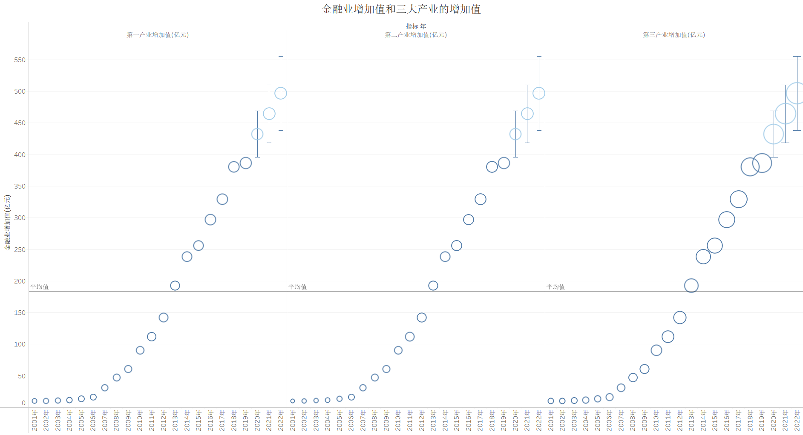
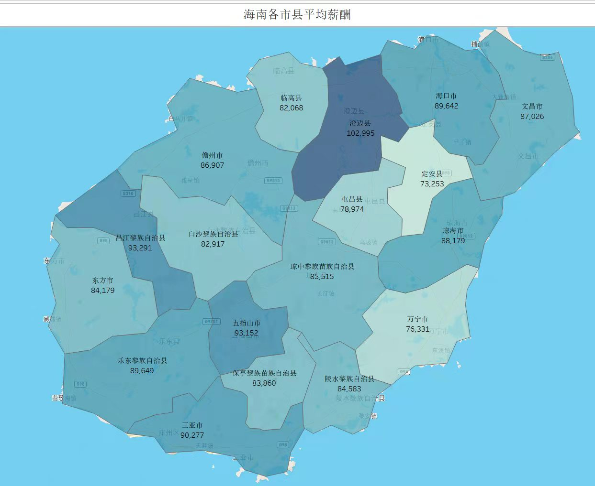

# 一稿-论文年会 2

**上海对外经贸大学**

**第二十一届经贸学术论文大赛**

**学术研究性论文**

| 论文名称： | 构建中国特色离岸金融市场的路径探析——以海南自由贸易港为例 |
| --- | --- |
| 学    校： | 上海对外经贸大学 |
| 专    业： | 信息管理与信息系统，日语（商务日语方向），经济学(国际投资方向)，英语（国际商务英语方向，中英合作） |
| 学生姓名： | 汤珺，魏芳，赵玘桐，钟小丽 |
| 指导教师： | 邱强 |

2022 年  2  月

## 摘  要

习近平总书记在2018年郑重宣布党中央决定开始支持海南全岛建设自由贸易港，至此，海南的离岸金融市场处于不断演进的状态。

本文在理清海南的离岸金融市场的发展现状的基础上，在符合海南实际，体现海南特色，明确海南定位，实现海南资金的自由流通的情况下对其发展提出一些建议。并且希望这些建议能够让海南向着更好的方向发展，让海南抓住新时代下的新机遇，从而成为参与世界经济构建的新桥梁。

本文主要通过三个方法对海南离岸金融市场进行研究，首先通过文献研究法对离岸金融市场的相关理论进行了分析，主要阐述了离岸金融市场，自由贸易港口这2方面理论，通过这种方式了解到了海南的离岸金融市场的相关业务；还通过对比研究法，将海南离岸金融市场与3个主要的离岸金融市场进行对比。参考香港，伦敦，新加坡的离岸金融市场的发展经验。从而深一步的解析海南的离岸金融市场的发展现状及其发展产生的效应。并且为最后一步的政策建议做出铺垫；最后通过建立SWOT分析模型的方法，对海南离岸金融市场的3个优势，5个劣势，2个机会，2个威胁进行了分析。全面而直观解析了海南离岸金融市场现阶段的发展形势。

本文结合上述三种方式的研究得出海南自由贸易区的现状，并且提出了构建内外分离型金融市场，优化离岸金融市场的营商环境，培养离岸金融市场的专业人才这3个方面政策建议。

**关键词：**海南，离岸金融市场，自由贸易港，SWOT分析模型

**ABSTRACT**

General Secretary Xi Jinping solemnly announced that the CPC Central Committee decided to support the construction of a free trade port within Hainan island in 2018. Since then, Hainan's offshore financial market has been in a state of continuous evolution.

On the basis of clarifying the current situation of Hainan's offshore financial market, this essay puts forward some suggestions on its development under the condition of conforming to Hainan's reality, reflecting Hainan's characteristics, clarifying Hainan's positioning and realizing the free circulation of funds in Hainan. Hopefully, these suggestions will help Hainan develop in a better direction and seize new opportunities in the new era, so as to become a new bridge to participate in the construction of the world economy.

Three methods are used to study Hainan’s offshore financial market. First of all, the literature research is used to analyze the related theories of offshore financial market, which mainly expound the offshore financial markets and free trade port. Through this way, the awareness of related businesses of Hainan offshore financial market is raised. The thesis also compares Hainan offshore financial market with three major offshore financial markets through comparative study. Referencing to the development experience of offshore financial markets in Hong Kong, London and Singapore, further analysis of Hainan's offshore financial market development status quo and its radiation effect is carried out, which paves the way for the final policy recommendations. In the end, this paper analyzes the three advantages, five disadvantages, two opportunities and two threats of Hainan offshore financial market by establishing SWOT analysis model. This paper comprehensively and intuitively analyzes the development situation of Hainan offshore financial market at present stage.

The status quo of Hainan Free Trade Zone is obtained based on the above three ways of research. Policy suggestions are put forward in three aspects: constructing internal and external separated financial market, optimizing the business environment of offshore financial market, and cultivating professionals in offshore financial market.

**Key words: **Hainan, offshore financial market, Free Trade Zone, SWOT analysis model

## 构建中国特色离岸金融市场的路径探析

## ——以海南自由贸易港为例

1. **引言**

1. **研究背景**

海南作为我国最大的经济特区，具有实施全面深化改革和试验最高水平开放政策的独特优势。离岸市场是国际金融竞争的新热点，是与全球经济一体化的快速发展随之而出现的一种创新型、开放式的复杂金融市场。构建海南离岸金融市场，是国家在更高层次更深范围内参与全球化及区域经济一体化的基本要求，国家对此高度重视。

1. **国家对海南的自由贸易港高度重视**

2018年4月，习主席在庆祝海南建省办经济特区30周年大会上，正式宣布，党中央决定支持海南全岛建设自由贸易区。2020年6月，全国人民代表大会常务委员会通过《海南自由贸易港建设总体方案》正式开始对海南的自由贸易港进行规划。2021年6月，《中华人民共和国海南自由贸易港法》中的57条法律条文，为海南自由贸易港的建设提供法律保障。

在这些政策颁布后，构建海南自由贸易港政策制度体系成为热门话题。而研究以海南自由贸易港为背景的离岸金融市场，对于探索符合中国国情的离岸贸易发展之路具有重大意义，同时也能促使离岸贸易与建设自由贸易港之间能形成良性互动态势。

1. **离岸金融市场是国际金融竞争的焦点**

离岸金融市场是现代金融业创新模式的典范，始于20世纪60年代。自其在西欧诞生以来，离岸金融业在资产规模和全球空间布局上得到了快速发展它，在国际金融市场上发挥着吸引国外资本，优化金融要素配置的功能，并逐渐成为国际金融中心的重要组成部分。总而言之，离岸金融市场具备灵活性和竞争力，能够促进全球范围内资金体系的高效运转。

目前，全球离岸金融中心已成为各国国际金融市场竞争的焦点，很多国家都将离岸金融中心作为的重大战略举措。同时各个国家发展的离岸金融市场也各有不同，这些离岸金融市场也各具特色，本文提到的伦敦、日本、新加坡离岸金融市场就分别是内外一体型，内外分离型，内外渗透型离岸金融市场。

从全球主要的离岸金融市场的发展背景来看，只有选择和本国发展模式吻合、制度设计合理、风险防控得当、监管措施到位的离岸金融发展模式才能有效地配置资源，促进本国经济地稳健发展。

1. **研究意义****	**

离岸市场是国际金融竞争的新热点，是与全球经济一体化的快速发展随之而出现的一种创新型、开放式的复杂金融市场。而海南作为自由贸易港，将成为引领我国新时代对外开放的鲜明旗帜和重要开放门户、我国深度融入全球经济体系的前沿地带、开放型经济新高地。

研究以海南自由贸易港为背景的离岸金融市场的不足，并且对标国际市场，为海南离岸金融市场的建设提供经验，结合海南特色，因地制宜探索建设海南离岸金融市场。通过建设海南离岸金融市场，一方面可以加快人民币国际化进程，辐射东南亚地区，服务于海上丝绸之路。另一方面，有望将海南建设成为有影响力的国际金融中心，吸引外资外企，推动国内金融、经济发展。

1. **研究内容和方法****	**

1. **研究内容**

第一部分为引言，介绍了海南离岸金融市场研究背景，提出了本文的研究内容和研究方法，指出了创新与不足；

第二部分为相关理论及文献综述，对离岸金融市场和自由贸易港做出简要介绍，通过对相关文献的研读，探讨出本文研究方向；

第三部分为离岸金融市场的现状分析，通过对海南和国际典型离岸金融市场的分析，对比总结出国际典型离岸金融市场对海南离岸金融市场的建设经验；

第四部分为海南离岸金融市场的SWOT分析,具体分析了海南离岸金融市场的优势、劣势、机会和威胁；

第五部分为结论部分，对前文的分析和论证进行简要总结；

第六部分为建议部分，结合上述的研究得出海南自由贸易区的现状，并且提出了构建内外分离型金融市场，优化离岸金融市场的营商环境，培养离岸金融市场的专业人才三方面政策建议。

图 1 研究框架参考图

1. **研****究方法**

1. 文献研究法

本文通过对相关文献的整理归纳，结合其中观点和权威部门发布的统计奶年鉴、公开数据等为本文提供理论和数据支持。

1. 对比研究法

选取国际典型离岸金融市场，将海南离岸金融市场与其对标，总结得出适于海南离岸金融市场建设的经验借鉴。

1. SWOT分析法

本文采用SWOT分析工具，分析了海南离岸金融市场的优势、劣势、机会和威胁。据此能够扬长避短，抓住机遇，规避风险，建设具有海南特色的离岸金融市场。

1. **创新与不足**

本文的创新之一在于着眼于离岸金融市场的整体性建设，以往研究多集中于离岸金融市场的税收制度、法律制度等单一方面纵向研究，缺乏综合横向研究，本文通过SWOT工具，对海南目前建设离岸金融市场的横向发展状况进行分析总结。创新之二在于分析阻碍海南离岸金融市场建设因素，目前国内关于海南离岸金融市场的文献主要集中于发展历程、现状和存在问题方面,缺乏建设设想提出但并未良好落地实施的原因，本文在综合分析海南综合情况时，对海南离岸金融市场建设遇到的阻碍进行了具体分析。

本文的研究分析仍有不足之处，部分政策建议仍需实践考量。虽然离岸金融市场相关议题屡见不鲜，但是离岸金融市场受到国际国内影响因素众多，国际国内环境在不断变化之中，且受研究水平所限，尚有考虑不充分之处。

## 理论基础及文献综述

1. **离岸金融市场相关理论****	**

1. **离岸金融市场**

离岸金融市场又称境外金融市场，它是指非居民之间以离岸货币进行各种金融交易的国际金融市场。主要包括境外货币借贷或投资、贸易结算、外汇黄金买卖、保险服务及证券交易等金融业务和服务。

离岸金融市场与在岸金融市场相比，主要特点有:

1. 在交易对象方面，主要是非居民与非居民之间。打破了传统上居民与非居民的交易模式，突破了地域和国界限制。

1. 在监管方面，离岸金融市场基本上不受所在国的法规、税制以及金融监管机构的管制，并且可享受税收方面的优惠待遇，资金出入境自由。

1. 在交易货币方面，在岸金融市场只经营所在国货币的信贷业务，本质上是一种资本输出的形式。而离岸金融市场的交易的货币是市场所在国之外的货币，包括世界主要可自由兑换货币，货币币种多元化且规模大。

离岸金融市场起源于欧洲美元交易，所以也有人将之称为欧洲货币市场。它兴起的主要原因是二战后国家干预主义盛行之下，金融机构面临沉重压力做出的金融创新。目前世界主要的离岸金融市场有英国伦敦、美国、日本东京、瑞士、中国香港、新加坡、卢森堡以及南美洲、欧洲、中东及亚太纽约、地区的岛屿国家或地区，如开曼群岛、维京、百幕大等。

离岸金融市场根据业务范围划分可以分为混合型、分离型、渗透型和避税港型四种类型。

表 1 离岸金融市场类型

| 类型 | 特点 | 条件 | 代表国家或地区 |
| --- | --- | --- | --- |
| 混合型 离岸金融市场 | 境内市场几乎完全开放，金融市场具有高度的经营自由，离岸账户和在岸账户可并行，资金出入境自由 | 对于所在地经济发展基础、金融发展基础及管理水平有极高要求 | 伦敦、香港 |
| 分离型 离岸金融市场 | 在岸账户与离岸账户不可并行，严格分离，目的在于严格区别便于监管和保护国内金融市场 | 在政府推行下专门为非居民交易创设，对金融发展及基础管理水平要求较低 | 纽约、东京 |
| 渗透型 离岸金融市场 | 以离岸业务和在岸业务分离为前提，允许离岸账户和在岸账户间一定程度的资金渗透 | 介于混合型和分离型之间，主要源于发展中国家 | 马来西亚纳闽岛、泰国曼谷 |
| 避税港型 离岸金融市场 | 该类型市场仅是为了处理账务，而非进行实际交易，只起到“记账中心”的作用 | 大多位于经济规模较小的小型国家或地区 | 加勒比海地区的巴哈马、开曼 |

1. **自由贸易港**

自由贸易港是设在一国 (地区) 境内关外、货物资金人员进出自由、绝大多数商品免征关税的特定区域, 是目前全球开放水平最高的特殊经济功能区。

自由贸易港的主要特征有：

1. 自由度高

自由贸易港的高自由度主要体现在人员、货物、数据和资金等要素的自由流动。在人员流动上，多数自由贸易港实施高度便利化的人员入境政策以及宽松的签证政策。在货物流通上，大部分货物被准许开展自由的业务活动。此外，很多国家进行负面清单的制定，负面清单外的产品可自由进出口。在数据流动上，在确保安全可控的前提下，实现数据的跨境自由流通。在资金流动上，放宽或取消对投资者的要求，使得境外资金流入更自由。

1. 交易成本低

一方面，自由贸易港在税收方面普遍实行“零关税、低税率、简税制”的政策。无论是企业方面还是个人方面，都实行优惠税率，承担税负较轻。此外，大部分货物享受免征关税的优惠待遇。另一方面，自由贸易港各要素的自由流动有效降低各环节产生的交易成本。由于各要素流动的高自由度，减少了贸易环节，增强了通关的便捷性，在实现成本降低的同时提高了效率。

1. **文献****综述****	**

1. **关于离岸金融市****场发展的研究 **

离岸公司和一般有限公司相比主要区别在税收上，发展起来较为便利。李平（2006）提到离岸公司可以在银行开立账号，在财务运作上极为方便。洪昊,葛声（2011）指出这导致离岸金融中心的税率低，资金出入很方便。

离岸金融市场的发展具有很多积极作用。鲁国强（2007）指出在国际上离岸金融市场的发展极大地促进了全球范围内低成本、高速度资金流动体系的形成,在我国对合理利用外资、推动人民币国际化以及有效利用外汇储备起到了极为重要的推动作用。更具体到国内情况，侯刚（2009）指出按金融市场有利于提高我国金融业的经营水平。主要表现在它能够带动我国的贸易生产和就业的增长并且促进我国金融体制的改革。

我国把离岸金融市场资源作为必争的国家战略资源，目前国内的离岸金融市场的发展也小有建树。沈光朗（2005）通过对数据的比较得出我国内地的离岸金融市场初具规模的结论。但是李方（2015）提到海南的金融业务量仍然十分小，未来可以在增加离岸金融业务量和开拓离岸金融创新产品上下功夫。毕宏伟,贾玮（2014）对我国离岸金融市场发展进行了概括，指出离岸业务单独设账、单独核算,实行分账管理税后并表的营运管理模式； 离岸银行业务范围主要为传统的外汇存贷款业务、同业外汇拆借、国际结算、外汇担保、咨询见证等常规业务。

我国离岸金融市场的发展仍然存在一些缺陷。毕宏伟，贾玮（2014）指出我国离岸金融市场存在金融体系有缺陷、市场优惠制度设置不完善以及风险因素较多等问题。茹存鹏（2008）还指出我国离岸金融市场发展的研究存在缺陷，它的研究范围很有限，研究深度不够还缺乏有说服力的指标体系.对此学者们提出了很多解决方式，现有文献主要是从法律途径上，监管手段上分析。

首先需要对离岸金融市场制定一定的监管模式对其进行监管。沈光朗（2005）认为银行监管部门应重点加强离岸银行的市场准入监管和离岸银行的风险监管；外汇监管重点应放在对居民外汇管制政策的有效执行方面；税收监管重点为居民对外交易的合法性和合理性。李方（2015）认为离岸业务的监管主要涉及对其经营风险的防范，因此可以设置一定的检查和考评的方式，来判断离岸银行资产质量情况，银行业务收益情况和内部管理规章以及风险控制的执行等。洪昊,葛声（2011）认为应该明确离岸金融业务的发展定位，监管离岸账户完善账户信息统计和信息共享，对现钞进行有效监管，最后还应该监管离岸账户向在岸帐户划分资金的方式。

同时，需要对离岸金融市场制定一定的法律条文进行监管。陈毕生（2011）指出可以把外资银行纳入我国的法律主体，完善对账户的保密法律，进一步规范金融机构运作的法律制定，进一步制定反洗钱法。

对国家整体利益来说，我国需要离岸金融市场。侯刚（2009）指出随着我国的经济与金融的国际化程度不断提高，选择地理位置比较优越的地区例如海南作为离岸金融市场，运用政策优势并且制定一定的监管措施，能在一定程度上缓解国内建设资金不足的困难，推动国内金融深化，增强我国的国际竞争力。

1. **关于海南离岸金融业务发展的研究**

货币是金融市场的衡量单位，它可以从一定角度反映金融市场的波动；货币是经济的工具，是政府统一的局部经济的工具，可以在政府的宏观调控下帮助经济回复秩序。中国要发展离岸金融市场与人民币市场有着脱不开的关系。

田璐（2021）将人民币离岸金融交易中心定义为专门处理外币存贷款业务的金融机构，在资本交易方面较为自由且不受管制。王守贞（2019）认为离岸人民币市场不仅是人民币国际化发展的重要成果，也是人民币进一步国际化的主要推动力之一。

目前对国内几个典型人民币离岸金融市场的研究聚焦在香港。应坚（2021）指出香港金融业主动承接新的历史使命，扮演了试验平台、资金通道及泵站的角色，将人民币不断引入境外，提升了人民币的国际货币功能。巴曙松（2012）对香港离岸人民币市场的现状以及挑战进行了深入的分析。祝佳等（2020）研究发现香港离岸人民币市场利率与汇率的联动效应呈现非线性特征；在低利差区制，香港离岸人民币市场可以实现有效的自我调节，而在高利差区制，市场无法进行有效的自我调节，且随着远期汇率期限的增加，市场自我调节能力进一步降低。丁孟（2021）提出依托粤港澳大湾区发展规划，巩固和扩大目前债券通和沪深港通的双向开放力度，积极开展理财通，发挥离岸市场金融基础设施完善等综合优势，进一步完善离岸市场流动性补充机制，强化香港离岸人民币定价中心地位，吸纳更多的国际资本，向国际投资者提供基金、保险等，丰富离岸人民币产品谱系，把离岸人民币市场做大做强的建议。

对于大陆地区的人民币离岸金融市场研究主要以上海、福建以及海南自贸区为主。田璐（2021）通过对上海建设人民币离岸金融市场的深入探究，得出了上海在引企模式、兑换模式、发展模式、监管模式以及配套服务模式的优势举措。黄洁（2017）则以福建自贸试验区为例，对开展离岸人民币业务进行了SWOT分析。王守贞（2019）认为在海南自贸区（港）建立离岸人民币市场，将为中国金融业改革开放提供一个重要的“突破口”，有利于提升人民币的国际化水平并增强对境外离岸人民币的影响力。

对于国际离岸人民币金融市场的研究较少。汤莉，翁东玲（2015）概述了全球人民币离岸市场发展的现状以及各地的比较，主要集中于非大陆的香港台湾以及国外的新家坡与伦敦人民币离岸市场。金中夏等（2013）则专注于伦敦人民币离岸市场的发展，他们认为要发展国际人民币离岸市场必须要依靠国内外双方监管的合力。此外还有孟刚（2018）以及咸适（2018）立足于“一带一路”背景探究人民币离岸金融中心的建设。蒋一乐等（2021）探究了金融开放下离岸人民币市场的利率以及汇率的联动效应。李思慧（2020）思考了疫情背景下整个人民币离岸市场的走势。

1. **关于人民币离岸金融市场的研究****	**

2010年1月4日，国务院颁布《关于推进海南国际旅游岛建设发展的若干意见》，提出探索开展离岸金融业务试点。郭海雄（2010）对构建海南国际离岸金融市场建设框架、制度安排及建设路径进行分析，指出海南已具备开办离岸国际金融业务条件即海南建立离岸国际金融市场时机已成熟；其次，海南已作为经济特区进行二十多年的建设，相关硬件配套设施已具备。

作为中央批准的第四个开展离岸金融业务的地区，海南具有旅游业发展较好的地理区位优势。胡莹等（2011）通过对国内已准许开展离岸金融业务的四个省市与地区进行比较研究，指出海南相对于其他发展离岸金融业务的地区，海南金融发展相对滞后，仍存在金融组织体系不完善、金融服务不充分、金融资源配置不合理等问题。颜蕾等（2011）通过对海南构建离岸金融市场的必要性及痛点进行分析，提出构建海南离岸金融市场应采取内外分离适度渗透型模式以防范离岸金融业务的高风险。王瑞（2012）对离岸金融市场的发展条件作出具体的量化指标，从而得出适合海南离岸金融业务发展的科学合理的税收法治体系，提出了实行较低税率等税收政策建议。丁鹏（2013）在对海南离岸金融业务发展的支撑面概况进行可行性分析的基础上，对海南离岸金融业务内容从关联主体、利息率设置、监管等方面进行了设计规划。

2018年4月，中央发布《指导意见》，支持海南进一步探索建设中国特色自由贸易港，发展离岸金融业务。蓝庆新等（2019）指出，海南非转口贸易为主的定位决定其应以发展离岸金融为主线，并且，结合海南作为自由贸易港的客观条件以及区块链等技术的进步，提出海南可在自由贸易港内鼓励金融机构运用多种金融创新工具，探索多方面金融配套服务，以金融科技促进金融监管，将区块链技术将区块链与互联网金融相结合。王方宏等（2019）对标国际自贸港发展水平指出海南离岸金融业务发展仍存在一定差距：第一，金融业于海南经济中所占比重仍较小；第二，海南金融业不具备区域辐射力；第三，海南金融业中银行所占比例较大，缺乏交易平台及金融业态的创新，且金融机构数量较少，外资银行市场影响力低；第四，虽然2009年《国务院关于推进海南国际旅游岛建设发展的若干意见》中指出以海南作为探索离岸金融业务试点，但海南目前仅有少量银行开展离岸金融业务，发展离岸金融业务的政策实际上并未落地实施，且人民币仍未实现自由兑换。黄革等（2020）基于国际离岸金融市场发展经验，提出海南自贸港应适度放松金融管制、维持有竞争力的税负水平并坚持严格的内外分离制度推进离岸金融市场建设。

综上所述，在对于海南离岸金融业务发展的研究方面，国内有关于海南离岸金融业务发展的文献主要集中于研究离岸金融市场发展的历程、现状及问题，且主要集中于以具体城市作为研究对象，分析该城市发展离岸金融业务的条件是否成熟，并提出将来如何改进等建议。对于海南发展离岸金融市场是否可行方面的问题，国内多数文献认为海南已具备发展离岸金融市场的条件，并且对海南应实施何种税收政策及制度作出了建议。然而，事实上海南离岸金融业务的发展自2009年的鼓励及各种历程阶段的设想后仍未良好落地实施，故而本文将聚焦于影响海南自贸港发展离岸金融业务过程中所存在的阻碍，对如何实际推动海南自贸港离岸金融业务发展进行分析及提出建议。

1. **文献评述**

对于离岸金融市场的相关研究，众多学者从多个角度进行了广泛的分析，最终的出的结论也各有不同。

从关于对离岸金融市场的发展的研究的文献中，我们不难发现对离岸金融市场的整体性的建设的研究并不多。离岸金融市场的相关文献主要集中在对税收优势的研究，对前景的概览，对重要性的强调，对缺陷以及对此的一些监管模式法律制度的罗列。众多学者的研究成果揭示了我国建设离岸金融市场的必要性,本文将结合于海南的具体情况通过对比的方法，建立SWOT模型的方法，对海南的海南离岸金融市场的建设情况进行分析。

具体到对海南离岸金融业务发展的研究，国内有关于海南离岸金融业务发展的文献主要集中于研究离岸金融市场发展的历程、现状及问题，且主要集中于以具体城市作为研究对象，分析该城市发展离岸金融业务的条件是否成熟，并提出将来如何改进等建议。对于海南发展离岸金融市场是否可行方面的问题，国内多数文献认为海南已具备发展离岸金融市场的条件，并且对海南应实施何种税收政策及制度作出了建议。然而，事实上海南离岸金融业务的发展自2009年的鼓励及各种历程阶段的设想后仍未良好落地实施，故而本文将聚焦于影响海南自贸港发展离岸金融业务过程中所存在的阻碍，对如何实际推动海南自贸港离岸金融业务发展进行分析及提出建议。

对于国内外人民币离岸金融市场的研究方面，国内的研究多以香港作为典型的人民币离岸金融市场进行研究，对于海南人民币离岸金融市场的研究较少。目前对于人民币离岸金融市场的研究趋向于现状的分析以及未来的发展方向展望，对于建设经验的总结研究则有所缺乏。因此本文将着重研究其他国际离岸金融市场的建设经验对海南的意义，探索出适合海南的建设道路。

总的来说，对离岸金融市场的理论研究、对海南的不同政策阶段下的离岸金融具体情况的研究、对于国际典型离岸金融市场的研究，都缺少对于其建设情况的总结，正因如此，本研究才具有一定的补充和现实意义。

## 离岸金融市场现状分析

1. **海南离岸金融市场发展****	**

#### 海南离岸金融市场发展模式

本节在对海南离岸金融市场发展现状等背景进行概述的基础上提出海南离岸金融市场所适用的发展模式。

1. 海南离岸金融市场发展现状

海南在发展离岸金融市场方面区别于其他省市的优势之处在于其地理区位，而由于离岸金融市场的发展与相应地区所受到的相关政策支持、经济发展现状以及金融行业发展情况息息相关，故而从以上角度对海南离岸金融市场发展现状进行分析。

首先，在地理区位方面，海南发展离岸金融市场具有以下两点优势：第一，海南作为我国最大的海洋省份，地处南海前沿，背靠大湾区，且拥有诸多优质港口及码头群，港口货物及游客周转量在近年来的快速增长使其逐渐演变为面向东盟的重要贸易枢纽，由此带来的经济繁荣使海南离岸金融市场发展前景向好；第二，海南在自然资源及旅游资源等方面具备天然优势，且海南发展定位明确以旅游业、金融服务业为主导，相对于其他离岸金融市场，海南在发展离岸金融市场方面具有独特的潜力。

其次，在相关政策支持情况方面，海南发展离岸金融市场具有以下两点优势：第一，海南是中央批准开展离岸金融业务的第四个地区，2009年的《关于推进海南国际旅游岛建设发展的若干意见》将海南定为离岸金融业务试点地区，2010 年《海南省支持金融业发展若干意见》为海南金融业建设提供了有力的政策支持，其在汇率、利率、税收上的优惠使得海南离岸金融业务快速增长。第二，海南是“一带一路”国际航线上的重要节点，在亚太经济圈、东盟经济发展、国际旅游岛及国际消费中心等发展大背景下，海南聚集了大量的境外资金，为发展离岸金融中心打下基础。

最后，在经济发展现状方面，海南省发展起步晚，基础较差，经济社会发展整体水平处于全国较低水平。在金融行业发展现状方面，海南省金融发展相对滞后，金融环境有待改善。当前海南省金融业发展程度仍然较低，还存在着金融组织体系不完善、金融服务不充分、金融资源配置不合理和县域金融供给不足等亟待解决的问题。

图 2 海南省三大产业近二十年增加值

1. 海南离岸金融市场适用模式

国际典型离岸金融市场可分为内外混合型离岸金融市场，内外分离型离岸金融市场，内外分离渗透型离岸金融市场和避税港型离岸金融市场四类。

海南离岸金融市场适用于内外分离渗透型模式，原因有以下两点：首先，海南经济相对落后，金融机制尚未健全，不具备建设内外混合型离岸市场的基本条件。其次，海南不宜发展避税型离岸金融市场。由于避税型离岸金融市场仅为国际商业银行处理境内境外业务登记地点，不发生实际业务，海南不可通过该种离岸金融市场提升金融实力及为海南建设提供金融支持，与海南建设离岸金融市场的目的相悖。

因此，基于以上关于海南经济的背景介绍以及分析，海南应当构建内外分离适度渗透型离岸金融市场，其现阶段适应性优势主要为以下两点：第一，从风险防范的角度来看海南市场化程度较低，市场干预能力有限，为应对离岸金融业务的高风险，海南应采用内外分离型离岸金融市场模式。第二，海南建设离岸金融市场的目的之一是为海南建设进行资金融通，因而严格内外分离型的离岸金融市场并不完全适用于海南。海南应允许离岸金融市场账户上部分资金渗透从而解决资金问题，因此，内外分离渗透型离岸金融市场为海南现阶段建设离岸金融市场的最优选。

#### 海南离岸金融市场风险分析

从国际及国内离岸金融业务发展建设的实践中可知，海南开展离岸金融业务的过程中或将存在以下四种潜在风险。

1. 信用风险

由于离岸金融业务主体多为注册地在国外、经营活动在中国境外的企业，相对于在岸金融市场，海南的银行在对于离岸金融业务主体的经济实力、道德品质及经营状况的了解上存在信息不对称的情况，对于交易主体的道德风险更难以防范。此时，银行面对离岸金融业务中交易主体违约给银行带来经济损失的信用风险增大。

1. 跨境资本流动风险

海南离岸金融业务发展为投机者所带来的套利空间将导致大量境外资金频繁进出海南离岸金融市场，由此产生的对中国经济影响的不确定性即跨境资本流动风险。跨境资本流动风险的危害如下：第一，大量跨境资本在海南离岸金融市场的自由流动将使得国内资本的剧烈波动，从而引起金融机制的动荡，例如，当资本由海南离岸金融市场进入国内时，国内货币供应量在短期内将增大，从而引发通货膨胀，导致国内经济运行下行。第二，境外资本的频繁进出将对证券市场的稳定产生不良影响，例如，境外资本流入使得商业银行误认为资金市场充裕，从而盲目扩张信贷规模，由此加剧银行信贷体系风险。

1. 利率及汇率市场化风险

对于利率而言，首先，随着海南离岸金融市场利率市场化制度的完善，海南自由贸易港内的利率水平将与境外同步，与国内利率产生利率差。若境外、海南自由贸易港以及国内三者在利率市场化的条件下存在利率差，则会发生境外资金通过海南离岸金融市场向国内大规模流入或流出，从而对国内金融市场及利率管理体制造成冲击。其次，利率市场化将导致国内政府以利率作为工具的宏观政策效果大大减弱，例如，当政府试图利用降低利率这一手段刺激国内经济增长时，资金将大量流入相对而言利率较高的海南离岸金融市场，从而使得政府货币政策失效。

对于汇率而言，海南离岸金融市场汇率市场化使得人民币将根据国际市场供求情况弹性调整，从而在海南自由贸易港与国内之间产生汇率差。类似于如上所述的利率差，汇率差的存在为投机者提供了套汇空间，从而产生与利率差相似的不良影响，人民币汇率制度将由此受到冲击。

1. 国际经济变化风险

海南离岸金融市场作为国内与国际市场的连接点，不可避免地会受到国际经济及金融形势变化风险的影响，故而世界经济金融形势的自身变化以及新冠肺炎疫情对世界经济的冲击都将对海南离岸金融市场造成打击，并且风险还将由海南离岸金融市场传导至国内，造成国内经济波动。

1. **主****要离岸金融市场发展现状**

#### 伦敦离岸金融市场

伦敦是典型的内外一体型离岸金融市场，即在岸金融市场与离岸金融市场在金融业务、机构等层面没有明确界限划分，在岸、离岸居民与非居民都可开展相关金融活动，金融机构内在岸金融业务与离岸金融业务没有具体的界限划分，账务处理亦不存在差别性。由于内外一体型的离岸金融市场的边界不明确，其在面临跨境资本流动风险、利率及汇率差风险和国际经济变化风险时更为敏感。因此，内外一体型离岸金融市场对市场所在国金融环境需求苟刻。一是所在区域金融市场流转性高，市场买卖机制健全且成熟；二是区域外汇管理部门机动性强，抗市场干扰能力强；三是区域外汇管制必须取消，内外一体型模式需要居民与非居民之间在任何市场内的无间隔交互，外汇无障碍流动是必然条件。

#### 日本离岸金融市场

日本是典型的内外分离型离岸金融市场，即在岸金融业务与离岸金融业务严格分账核算，相关金融业务之间不存在直接关联，金融机构内在岸与离岸业务部门需分别设置。内外分离型离岸金融市场理论上严格将跨境资本流动风险、利率及汇率差风险和国际经济变化风险隔绝于在岸市场之外，因此，内外分离型离岸金融市场对市场所在国金融环境刚性要求较低，一般状况下此类模式市场的设立多出于本国改善国际投资收支状况以及增强本国银行类机构国际竞争力的诉求。

#### 新加坡离岸金融市场

新加坡是典型的内外渗透型离岸金融市场，即允许离岸和在岸账户之间有条件渗透，也就是内外业务相互渗透的市场监管，一方面许可特定的金融机构开设单独的账户进行专业化管理，新元与外币账户分离，把离岸和在岸业务分割开来，有效防止国际上资本进出大幅波动，避免离岸金融业务冲击国内秩序和金融货币政策的实施效应；另一方面，为了吸引国际资本和维护安全的银行金融秩序，新加坡在税收、外汇管制、汇率管理方面推出一系列的优惠措施，使离岸市场得到了长足的发展，同时避免了全球金融风险无限地传导给国内市场。因此，其在面对跨境资本流动等风险因素时，具有分离型离岸金融市场的保护性优势，在面对资金大量融通的需求时，又具有一体型离岸金融市场资本自由的流动性优势，因此，可在金融机制逐步健全的过渡阶段使用。

1. **典型离岸金融市场经验借鉴**

目前，中国海南自由贸易港的离岸金融市场仍处于探索与建设的开端阶段，需要广泛吸取国际离岸金融市场的经验，博采各类国际离岸金融市场之长，在众多国际经验中摸索出适合中国国情的自由港建设道路。因此，明确国际主要离岸金融市场的特征与优势，总结出以上离岸金融市场建设的发展经验，对于海南自由贸易港建设离岸金融市场具有强烈的借鉴意义。本节结合以上三种离岸金融市场的发展模式、风险因素及适用环境对海南建设中国特色离岸金融市场归纳出以下经验以供借鉴。

新加坡于20世纪中为发展中国家，相对于伦敦所代表的传统金融中心，新加坡经济发展水平较低，金融服务行业尚不完善，相对于日本所代表的内外分离型离岸金融市场，又力求于由离岸金融市场建设国际金融中心，因此，新加坡的发展背景与目前海南所处于的情况最为相似，故而海南自由贸易港可高度借鉴新加坡在发展离岸金融业务方面的经验，采取内外分离渗透型的离岸金融市场模式，把离岸业务和在岸业务隔离开来，防止资本频繁出入国内金融市场。

1. 政府积极采取措施，推动离岸金融市场建设

目前，海南自由贸易港与新加坡、泰国发展离岸金融业务时的经济水平相近，现有的经济发展水平和金融环境还不具有吸引金融机构开展离岸金融业务的优势。因此，政府应积极采取措施推动离岸金融的发展。第一，政府采取措施积极推动离岸金融市场的建设。新加坡政府采取了一系列的财政奖励措施及取消了亚洲美元市场的外汇管制，在此基础下，新加坡亚洲美元市场得以茁壮成长。第二，加快金融改革步伐推动离岸金融市场的发展。新加坡政府逐步放宽外汇管制至取消外汇管制，以吸引外资银行从事离岸金融业务。

1. 严格构建内外分离渗透型离岸金融市场模式

1997 年亚洲金融危机爆发，相对于泰国离岸金融市场中离岸业务与在岸业务管理混同导致的在岸金融市场的完全放开，国内经济遭受巨大冲击，新加坡由于严格对离岸账户与在岸账户进行分割，国内经济在亚洲金融危机中未受致命打击。故而在目前海南自由贸易港资本项目尚没有完全可兑换的情况下，中国在允许海南自由贸易港发展离岸金融业务的同时必须将离岸发放的贷款和投资由离岸业务进行融资而严格禁止在岸的资金违规为离岸业务融资，在境外与国内金融业务间建起风险的防火墙。

具体而言，海南自由贸易港于初期应坚持严格的内外分离模式。目前，我国尚未完全实现利率市场化，汇率形成机制有待进一步完善，金融市场开放程度有限，监管制度尚未健全，而实行严格的内外分离制度能够有效隔离风险，为金融改革提供缓冲。在金融改革的逐步进行之下，海南离岸金融市场再逐步向分离渗透型过渡，在严格的条件监管之下允许部分资金流入境内。

1. 离岸金融市场需兼具开放与监管

由新加坡建设离岸金融市场的成功经验可知，对离岸金融市场严格监管与金融自由化并不相悖，对离岸金融市场的严格监管造就的整体金融市场的稳定与健康发展反而对资本的自由流动有利。在离岸金融市场的监管方面，海南自由贸易港应继续遵循所定高标准而严格治理。而在应对国际层面上，金融建设中所出现的对自身有一定适用性的先进的金融制度及模式，也要高度关注并积极引入、尝试。同时，海南离岸金融市场除严格监管外，亦要充分运用多种金融避险工具，实行收汇多元化，适当选择远期结售汇、掉期、择期交易等锁定风险交易，或者用押汇的形式提前结汇，以进一步规避汇率波动带来的风险。

## 海南离岸金融市场的SWOT分析

### 优势

通过上述的对比我们也可以发现世界上著名的离岸金融中心一般都是通信设施发达和交通方便的港口城市。除此之外也需要国家制定的一些政策上的保障。同时它本身还需要具备一些经济发展的基本要素。海南毫无疑问也具备着这些离岸金融中心所需要的条件。

#### 区位优势

海南的区位优势主要体现在5个方面，分别是拥有海岸线长、有地缘优势、水陆空交通网络发达、有比较发达的通讯设备、生态环境良好、有很多热带资源。

海岸线长。海南是我国是最大的海洋省市，有最长的海岸线，周边有很多优质的海港和诸多天然的避风港、深水港及诸多良港。海南货物周转量、游客周转量、港口货物吞吐量、游客吞吐量都很大。海南的前景也很光明，它能够进一步发展成为面向世界的出口加工基地，甚至是国际物流中心，这完全满足离岸金融中心形成所需要的地理条件。

1. 地缘优势

海南东濒南海与台湾省相望，背靠粤港澳大湾区，与越南、菲律宾、印尼、马来西亚、新加坡、泰国、巴布亚新几内亚、澳大利亚和文莱等国隔海相望，是中国联结东盟和大洋洲的战略枢纽，是海上丝绸之路上的最关键的节点。是连接我国与东盟国家的战略支点。未来可能成为中国与海上丝绸之路沿线国家的货物、资金和人才的集散地。

海南省管辖着200多万平方公里的海域面积，渔场面积30多万平方公里，海洋水产800种以上，可供养殖的浅海滩涂2．5万多公顷，理想的天然盐场5 000多公顷，可供开发的港湾5O多处，南海油气开发前景广阔，是我国发展海洋产业的最佳之地。

海南具有相对发达的海陆空立体化交通网络。海南有海口美兰国际机场、琼海博鳌机场、三亚凤凰机场三个民用机场，以及南航三亚珠海直升机起降场、东方直升机、儋州西庆通用航空机场三个通用航空机场。高速公路贯穿全岛沿线各城市，中间线路从海口-琼海-乐东-三亚，形成贯穿东西南北中的田字型高速公路交通。环岛高铁西线345公里，东线308公里，实现3小时全岛生活圈。海南还具有相对发达的通讯设备和设施，这有利于跨境投融资资金的交易平台的建设，同时有有利于全球金融市场的快速聚集，更有利于境内外的金融机构资金的汇集。

这些地缘上的优势，毫无疑问能够帮助海南的自由贸易港的建设，能够满足自由贸易港所需要的开放、互通、交通便利等优点。

1. 生态环境优良

海南的空气质量全年优良，森林覆盖率全国第一，并且近五年还有小幅上升，从2013年的61%上升到2017年的63%。优良的生态、资源环境，使海南能够提供良好的居住环境。海南岛的纬度与夏威夷、巴厘岛、普吉岛等世界著名旅游胜地相近。更为难得的是，海南岛旅游资源分布均匀，全岛可供开发利用的旅游点有200多处，海滩、温泉、热带雨林遍布全岛。

1. 热带资源丰富

海南自然资源丰富，具有良好生态环境，农产品贸易等有巨大发展空间。海南是我国热带种植业的重要基地；鱼、虾、贝、藻的近海养殖，特别是对虾的养殖，在我国已占有一定地位。海南这一祖国的最大“热带宝岛”，可热作土地面积约占全国可热作土地总面积的42．5％，是我国热带高效农业的主要生产基地，也是我国冬季发展反季节瓜菜的低 成本的“天然大棚”与热带水果产地。这些优势毫无疑问会对海南的离岸金融市场的建立提供一定程度的物质保障，为海南的建设锦上添花。

#### 政策优势

海南的政策优势主要表现在是唯一一个省级经济特区率先建立自由贸易市场经济框架、有博鳌亚洲论坛、是海上丝绸之路的重要节点、有很多人才方面的优惠政策。党和中央目前在海南建立离岸金融市场的大体方针是按照先行先试、风险可控、分步推进、突出特色的原则，分两步在海南推动形成全面开放新格局：第一步是在海南全境建设自由贸易试验区，赋予其现行自由贸易试验区试点政策；第二步是探索实行符合海南发展定位的自由贸易港政策。

国家对海南的离岸金融的发展极为重视。习近平在庆祝海南建省办经济特区30周年大会上郑重宣布，党中央决定支持海南全岛建设自由贸易试验区，支持海南逐步探索、稳步推进中国特色自由贸易港建设，分步骤、分阶段建立自由贸易港政策和制度体系。事实上，党中央想要着眼于国际国内的发展大局，彰显我国对外扩大，对外开放，积极推动经济全球化的决心，就必须重视海南。而在海南建立离岸金融中心是实现这一目标的关键步骤。

1. 率先建立自由贸易市场经济框架

海南作为省级经济特区，有先行先试政策优势而且有国家战略自由贸易港和国家旅游岛的顶层设计。

关于海南自由贸易港建设的制度设计的主要内容可以概括为“6+1+4”。“6”是贸易自由便利、投资自由便利、跨境资金流动自由便利、人员进出自由便利、运输来往自由便利、数据安全有序流动。“1”就是构建现代产业体系。“4”就是加强税收、社会治理、法治、风险防控等四个方面的制度建设。

1. 博鳌亚洲论坛

博鳌亚洲论坛的确立，带给海南的，不仅是会议经济的繁荣和发展，从另一个层面来说，博鳌亚洲论坛提高了海南的区域定位，历经20年成长，博鳌亚洲论坛已成为具有国际知名度的大型会议品牌，也是海南的一张名片。博鳌亚洲论坛作为一个思想碰撞、学术交流的场所,有助于亚洲各国、各地区、各企业在脑力激荡、思想火花中形成自己的发展思维由于亚洲论坛具有国际性和民间性的特点,如果外交上有需求的话,自然会在博鳌亚洲论坛形成一个亚洲的思想碰撞基地,而海南则有可能成为亚洲思想的发源地。

区域性合作是一个永久性的主题,也是一个时代潮流.博鳌亚洲论坛为亚洲各国提供了一个思想交流平台,各国利用这个平台,讨论亚洲国家共同关心的问题,适应了WTO的“透明度原则”。

离岸金融市场的建立需要借鉴外部经验，需要吸引更多元化的人才和环境这个政策。海南毫无疑问可以借助博鳌亚洲论坛,继续加快建立市场经济体制的步伐,不断宣传自己的向外开放的决心，同时继续发展完善自己的自由贸易港。

1. 人才方面的优惠政策

近年来，海南在引进各类人才方面出台多项优惠政策，2018年5月，提出到2020年吸引各类人才20万人，到2025年，实现“百万人才进海南”目标，吸引了大量的相关人才集聚海南。而海南的离岸金融政策还能很好的满足人才的创业和就业需要。

创业门槛低，优惠更多。自由贸易港既然是深化改革开放试验区，创业者便可以享受到办事流程简化、进出口税收政策优惠、多项金融政策的创新优势。这样，既降低了注册门槛，又有后续的优惠扶持政策，许多大学生、新兴的互联网企业将自贸港视为创业的热土。

自由贸易港的薪资高，与国际接轨，成为人才聚集地。由于自贸港致力于营造国际化、法治化、市场化的营商环境，必然会对高层次的人才产生不小的需求，特别是在金融、物流和IT等领域，许多大学毕业生以及专业人才将有机会不出国门，就拿到远超同行业水平的“国际工资”。海南目前只有900多万人，远低于台湾，只比香港稍多一点。但是陆地面积却是香港的35倍，未来可望形成2000万-3000万的人口规模，也只有这样的人口规模才能承担得起海南建设离岸金融市场战略使命。

图 3 海南省各县市平均薪资

#### 金融环境

海南的金融环境优势主要体现在离岸金融市场建立早以及建立过程中持续引进外资等两方面上。

1. 离岸金融市场的建立

早在十年前海南便开始探索开展离岸金融业务试点，并且不断地推进各项改革措施，形成了很多人民币国际化和资本项目可兑换的“试验田”。海南发展离岸金融中心，在减税、吸引外资、改善人民币自由兑换环境等方面已经取得了较大成就。就人民币方面，目前海南已上线运行自由贸易账户，企业可通过这个账户办理境外交易的本外币结算和境外融资业务。

另外有的区域已经开展了本外币合一的银行结算账户体系的试点，试点的准备工作也已基本就绪，准备在近期真正落地。有很多跨境人民币政策已经在海南开始实施或者已经准备就绪。海南具有良好的人民币金融环境，这会增强境外投资持有人对人民币资产的信心并且拓宽持有渠道，有利于离岸金融的发展，有利于最终实现汇兑和投资的自由化。

1. 持续引进外资

据2021海南省统计年鉴，2018-2020年，海南省实际使用外资分别为7.33亿美元、15.1亿美元、30.3亿美元，同比增长率分别为112.7%、106.1%、100%。全省累计实际利用外资52.7亿美元，占建省32年实际使用外资总额的37.3%。

2018-2020年，共有来自全球89个国家和地区的投资者在海南省投资，同时该省新设外商投资企业数量连续快速增长，累计达1510家，占近10年新设外商投资企业总数的74.9%。

这些数据表明，海南连续三年的外资增长一倍。这是海南的离岸金融市场提升人民币可兑换水平支持跨境贸易投资自由化便利化、扩大海南金融业对外开放后取得的正向反馈，同时这对海南日后的离岸金融市场的建设有着战略性的意义。

### 劣势

虽然海南的离岸金融市场试点在十多年前就已经存在了，但其是在2020年6月提出海南自由贸易港的建设蓝图之后，与之配套的海南离岸金融市场的建设才逐渐成型。海南的离岸金融市场建设经验不少，但是放在自由贸易港背景下，这些建设经验便显现出一些不足之处，从目前海南离岸金融市场建设的现状来看，仍然存在着政策效果不明显、法律监管不健全、服务体系不完善、配套措施不齐全以及专业人才短缺等劣势。

#### 自贸区政策效果不明显

海南是继深圳、上海、天津试点离岸金融业务后中央批准的第四个开展离岸金融业务地区。为了推进海南国际旅游岛建设， 2009 年 12 月 31 日，国务院颁布《关于推进海南国际旅游岛建设发展的若干意见》，提出加快发展金融保险业，探索开展离岸金融业务试点。2010 年初，海南省又出台了《海南省支持金融业发展若干意见》，为充分发挥金融业在海南国际旅游岛建设中的重要作用提供了政策支持和有力保障。2018年４月，党中央进一步推进我国自由贸易港建设进程，发布《指导意见》，支持海南探索建设中国特色自由贸易港，要求海南“以大开放促进大改革”，对标更高标准的国际规则，打造新时代全面深化改革的新标杆。同年10月，《中国（海南）自由贸易试验区总体方案》正式出台，方案在制度层面包括构建多功能自由贸易账户体系、分阶段放开资本项目、实施与跨境服务贸易相配套的资金支付与转移制度、进行外汇管理改革等。强调突出制度集成创新，重要性最高，着墨最多。这一系列的方针政策为海南自贸港建设提供了政策支持，在这样的政策优势之下，海南的表现却没有达到政策构想应有的高度与水准。

目前海南自由贸易港的政策框架已经基本完善，然而海南原有的基础较为薄弱，加上海南本身建设离岸金融市场的特殊性使得海南在承接政策时，无法完全发挥政策的优势。海南在建省之初便被确立为经济特区，然而海南的经济运作幅度改善较小。海南发展自由贸易港起跑线相对较低，无论从经济规模、基础设施、贸易基础等硬指标方面，还是在对外开放、制度环境等软指标方面，均处于相对低位水平，无法对周边区域形成相对优势。产业基础薄弱进而导致经济体量不大、流量不足是海南自由贸易港建设面临的突出矛盾。海南从整体社会生产发展水平来看还是一个欠发达地区，与沿海发达省份相比，海南省产业基础薄弱，收入水平低且差距还在扩大。海南全省作为自由贸易港的规划区域与世界上其他自由贸易港的建设差异较大，没有直接的经验可以借鉴，这无疑加大了海南建设自贸港以及发展离岸金融市场的难度。这些不利因素的存在使得海南虽然有着良好的政策优惠，政策效果却并不明显。

#### 法律监督体系尚未健全

离岸金融区别于传统国际金融的两个显著特点就是完全的国际化以及离岸金融业务的自由化程度高。离岸金融市场吸收的是全球剩余资本和资金，资金攻击范围广、币种多、规模大、资金实力雄厚且借贷便利，是任何国际金融市场无法比拟的。此外，离岸金融市场所在国不限制离岸市场资金的借贷和外汇的买卖，也不受交易货币发行过的管制，资金出入交易自由，实现了全球范围的信用借贷和信用交易，资金免交存款准备金、低税率及免税等优惠政策的支持。由此会带来市场风险大、难监管等问题。

目前，我国对离岸金融业务的监管存在着监管主体和职责不够明确、监管政策标准不够统一等问题；我国对中资银行经营离岸金融业务有严格的准入条件，但是却存在着外资银行可以不经批准就直接开办离岸银行业务的现象。另外，离岸金融业务涉及人民银行、银监会、外汇管理局等多个部门，但是仍未明确监管离岸金融业务的直接部门，造成监管缺位，影响了离岸金融业务的进一步发展。并且对于金融产品进入市场以及上市缺乏专业测试机制以及追踪机制，这不利于监管的开展。此外全球主要自由贸易港普遍实行以惯例法为基础的英美法系，而中国实行的是成文法体系，两种法律体系在司法实践上存在巨大差异，海南如何对接以惯例法为基础的国际市场主流规则是一项很大挑战。

对离岸金融业务的监管，首先要明确监管主体，尽快明确离岸金融业务的主管部门；其次设定准入和经营两方面的相关政策细则，既保护中资金融机构的利益，又能吸引外资金融机构参与；最后，尽快完善工商、海关、法规、中介机构等整体政策配套措施和服务。一是率先在离岸金融市场建立多元化商事纠纷解决机制。可以选择海南自贸港内法院和仲裁机构，也允许适用中国香港地区或其他地区的判决或仲裁决定。离岸金融业务纠纷可以直接适用中国香港地区等境外金融中心法院判决或仲裁决定，并减化转换程序。二是利用海南经济特区立法权，基于《海南自由贸易港法》立法框架，对标国际规则制定《海南自贸港离岸金融管理办法》，为海南自由贸易港离岸金融的发展提供制度支撑。三是适时制定《海南自由贸易港金融数据保护办法》，强化离岸金融保密制度。四是建立离岸金融税收制度。不征收利息预提税、资本利得税、股息预提税，离岸银行和客户按照海南自贸港的企业所得税和个人所得税标准纳税。对开户主体通过离岸账户体系获取的收入（如存款利息、理财收入等）免缴所得税，对开户主体和非居民之间的交易免增值税。

#### 离岸金融服务体系有待完善

相比于2009年刚提出在海南建设离岸金融市场试点环境，海南如今的金融市场环境有了较大的改善。2009年，海南省 GDP 为 1654.21 亿元，省内银行类金融法人机构只有227个，然而到了2020年，海南省GDP为5532.4亿元，约为2009年GDP的3.6倍；金融业法人单位数已经达到了821个，大致翻了三番。海南近十年的发展飞速，是我们有目共睹的。因此，离岸金融服务体系也应跟踪完善。海南经济总量较小, 开展离岸人民币业务初期对中国香港等地的分流作用十分有限。

鼓励金融机构运用各种金融创新工具，探索推出资产管理、投融资、风险控制等多方面的金融配套服务，为企业跨境交易提供安全稳定的环境保障。同时，可以利用数据分析、加密手段等金融科技，加快金融创新和金融监管的步伐。另外，随着区块链技术的逐渐成熟，可以把区块链和互联网金融有机整合，打造自由港金融新格局，运用区块链技术管理股票、债券等资产，将金融资产转化为链上数字资产，方便资产所有者进行交易，还能在保护客户隐私的基础上提高客户识别的效率，大幅度地降低交易成本。当然，还要清醒地认识到，自由港开放金 融是把双刃剑，在促进港区金融发展的同时，必然也会带来更大的风险，这就要求中国自由贸易港在进行金融创新和开放的过程中要审慎渐进，搭建有效的金融安全网，建立跨境资金自由流动的风险管理体系，有效地防范金融风险，使金融自由与金融稳定协调发展。

海南金融业中银行占比大, 缺乏交易平台和新的金融业态。海南金融业目前仍然以间接融资的银行信贷为主。2017年, 海南社会融资规模增量中人民币贷款占比92.6%, 其它融资方式占比仅7.4%。同期, 全国和上海社会融资规模增量中人民币贷款占比分别为71.2%和64.74%, 其它融资方式占比分别为28.8%和35.26%, 明显高于海南水平。

1. 配套措施不全

离岸金融市场的结算手段相较于一般的国际金融结算采用更加先进。这是因为基于发达的国际通讯业，通过全球化的交易网络，能够迅速和便利地挑拨全球范围内的资金，手续简便，竞争力极强。因此，这就对海南离岸金融市场的建设提出了极大的挑战。随着海南离岸金融市场的深入发展，离岸金融业务也由单一的存贷款业务逐步向担保、外汇买卖、汇兑和各项国际结算业务、票据承兑、贴现以及国际金融市场资金拆借和融通等业务发展。业务范围的拓展就意味着对配套设施更高的要求。

人民币作为海南自贸区法定货币的地位不会改变, 目前, 人民币还没有实现资本项目自由兑换, 国际化水平还有待进一步提升, 也会影响海南自贸港金融开放。

1. 专业人才短缺

为推进人才工作，海南在省委层面成立人才工作委员会，由省委书记任主任。在高科技人才无法全职工作的情况下，海南采取柔性机制引进百余名院士及院士团队成员与省内企事业单位共同开展科学研究、科技成果转化等活动，提出了“百万人才进海南行动计划”。此外，海南自贸区还首创候鸟人才服务站的形式引进候鸟型学者以促进海南自贸港的发展。并且为了解决引进人才的后顾之忧，海南政府还提出了一系列人才购房落户的优惠政策，并且引进一些先进的教育医疗机构以及娱乐项目等为人才的子女上学、健康生活等提供保障。并且海南积极营造便利化国际人才进出港制度，建成“外国人来华工作管理服务系统”并出台了“59 国免签政策”，通过精简流程、信息共享及联审联检，解决在海南工作外国人“来回跑”问题，将审批时间压缩至不超过7个工作日。虽然海南这一系列引进人才的措施取得了初步的进展，但是海南目前的人才缺口依然较大，对人才的需求依旧较高。并且政策对人才的吸引力度尤其是金融人才吸引度远不及广州、深圳等一线城市。

离岸金融业务复杂属于高端金融业务，对于从业人员的专业技术要求较高，特别是那些既对金融业务熟悉又了解国内、国际政策法律规范的复合型人才需求大，但是海南省金融业规模小、金融机构种类也少、高端金融人才匮乏。离岸金融作为一种国际化发展业务，需要大量熟练掌握国际金融业务的高素质人才。因此海南省应该大力加强金融人才的培养和高科技人才引进，特别是要按照国际先进标准培养交易、风险管理和清算人才。这正是经济基础原本较为薄弱的海南所缺乏的。海南本土高校培养的人才有限，而离岸金融创新需要高素质、专业化的金融人才，金融人才的储备不足或许将大大制约海南的离岸金融创新。

在留住外国人才的方面，海南还有许多不足之处。海南省国际学校数量太少，外籍人才落地面临着子女上学难的问题。国际医疗机构缺乏，无法为外籍人士提供优质的医疗服务，2017年海南健康产业产值仅为北京的7.4%、上海的7.7%和浙江的4.7%。符合外籍人士社交习惯的酒吧、咖啡店数量还不足，国际赛事直播与信号传输还存在障碍。

### 机会

#### 区域经济一体化

1. “一带一路”

2013年国家主席习近平提出“一带一路”的合作倡议，截至2022年1月18日，中国已与147个国家、32个国际组织签署200多份共建“一带一路”合作文件。在2020年，我国对“一带一路”沿线国家进出口总额达93696亿元，比上年增长1.0%。而海南作为中国对外开放的高地，处于21世纪海上丝绸之路的重要战略位置，是经南海向南进入太平洋，中国-大洋洲-南太平洋蓝色经济通道这一经济通道的重要节点。随着“一带一路”倡议的发展，海南的对外经济贸易水平明显提高，贸易、人口往来更加频繁，吸引外资能力也有所提高。

随着与“一带一路”沿线国家的交往日益密切，海南的航运需求和能力显著增强，已基本形成辐射亚欧的外贸航线布局。如表1，2013年-2020年海南港口货物吞吐量逐年递增，2020年总货物吞吐量达1.989亿吨，与2013年相比已基本实现翻一番的成果。其中，海口港的货物吞吐量居于第一位，始终是海南第一大港；洋浦港逐渐发展为海南的第二大港口，目前共开通内外贸航线22条，连通国内东北、华北、北部湾、长三角、珠三角等基本沿海港口并实现东南亚国家主要港口的全覆盖，打通了海南与东南亚乃至世界的经济通道。

表 2 2013-2020海南港口货物吞吐量

**单位：万吨**

| 年份 | 总计 | 海口港 | 三亚港 | 八所港 | 洋浦港 | 其他沿海小港 |
| --- | --- | --- | --- | --- | --- | --- |
| 2013 | 10130 | 5424 | 140 | 1685 | 2880 |  |
| 2014 | 14164 | 8915 | 226 | 1400 | 3525 | 98 |
| 2015 | 15356 | 9204 | 402 | 1767 | 3901 | 82 |
| 2016 | 16390 | 9952 | 595 | 1516 | 4058 | 269 |
| 2017 | 18473 | 11297 | 667 | 1605 | 4285 | 619 |
| 2018 | 18282 | 11883 | 201 | 1396 | 4206 | 596 |
| 2019 | 19839 | 12447 | 198 | 1507 | 5015 | 672 |
| 2020 | 19895 | 11781 | 221 | 1501 | 5664 | 727 |

资料来源: 海南省统计局（hainan.gov.cn），2021年海南省统计年鉴

除贸易往来更加密切外，人员往来也日益频繁。随着“一带一路”合作的不断深化，海南的落地免签政策实施对象也在不断增加，外国游客入境更加便利化，增加吸引力。如表2除受新冠疫情严重影响的2020年，在2013年到2019年间，海南省接待入境过夜游客人数总体上是大幅增加的，外汇收入也翻了两番。能够为海南的发展注入新的活力，促进海南本土经济发展和产业结构的调整与完善。同时体现出海南正在逐步发展为国际贸易的新通道支点和国际旅游岛。

表 3 2013-2020年海南省接待游客及外汇收入

| 年份 | 接待入境过夜游客人数 （万人次） | 接待外国人入境过夜游客人数 （万人次） | 旅游外汇收入 （亿美元） |
| --- | --- | --- | --- |
| 2013 | 75.64 | 50.05 | 3.31 |
| 2014 | 66.14 | 42.15 | 2.66 |
| 2015 | 60.84 | 35.59 | 2.48 |
| 2016 | 74.89 | 46.98 | 3.50 |
| 2017 | 111.95 | 78.69 | 6.81 |
| 2018 | 126.36 | 89.68 | 7.71 |
| 2019 | 143.59 | 107.91 | 9.72 |
| 2020 | 22.40 | 17.60 | 1.12 |

资料来源: 海南省统计局（hainan.gov.cn），2021年海南省统计年鉴

此外，海南省以国家出台的《海南自由贸易港建设总体方案》为“1”，加上分门别类地制定了系列具体行业、具体操作、具体项目等细节措施 “N”，实行 “1+N”的政策体系。随着“一带一路” 的深入发展，再加上“1+N”政策的加持，海南的外资磁吸力不断增强。2020年海南的外资增幅可位列全国第一梯队。2020年海南新设立外商投资企业1005家，同比增长197.3%。如表3，海南全年实际利用外资30.3亿美元，与2019年相比，实际利用外资额翻一番。在新冠疫情爆发，全球经济增长放缓的大背景下，海南逆势发展，成为全球资本的“强磁场”。

表 4 2013-2020海南省利用外资情况

| 年份 | 签订项目 （个） | 合同外资额 （万美元） | 实际利用外资 （万美元） |
| --- | --- | --- | --- |
| 2013 | 62 | 84276 | 181060 |
| 2014 | 60 | 69831 | 191558 |
| 2015 | 71 | 128245 | 246567 |
| 2016 | 88 | 1017890 | 221561 |
| 2017 | 90 | 1282021 | 230598 |
| 2018 | 171 | 515213 | 81876 |
| 2019 | 343 | 1282172 | 152020 |
| 2020 | 1005 | 1984120 | 303324 |

资料来源: 海南省统计局（hainan.gov.cn），2021年海南省统计年鉴

“一带一路”为海南带来了发展的新机遇，大幅提高海南的对外开放水平，巩固海南对外开放高地的地位，在外资引入、人才引进等方面为海南省建立离岸金融市场提供了重要的历史机遇。

1. 区域全面经济伙伴关系协定（RCEP）

区域全面经济伙伴关系协定（RCEP）于2022年1月1日全面生效，首批生效的国家包括越南、柬埔寨、老挝、泰国、新加坡、文莱东盟6国以及中国、日本、澳大利亚、新西兰非东盟4国。RCEP将是全球经贸规模最大、人口最多并且是最具发展潜力的自由贸易区。RCEP的落地实施有效降低单边主义、贸易保护主义对于国际自由贸易的影响，同时能够强有力推动我国对外开放水平进一步提高。海南作为中国面向东盟的最前沿，并且现已基本建成连通国内基本沿海港口与东南亚港口全覆盖，必将承担起对接东盟的重任，成为RCEP区内区外循环的关键节点。借此，海南可增加与国内其他地区的贸易量，并且与东盟各国的经济往来也会愈加密切，实现更高水平的对外开放。

依据协定内容，在货物贸易方面，除国民待遇和优惠关税外全面取消进出口相关手续和费用；在服务贸易方面，破除跨境服务贸易的壁垒，削减相关限制性和歧视性措施；在投资方面，成员国之间享受国民待遇；在人员流动方面，实行宽松的临时出入境政策。由此海南与RCEP成员国间货物贸易更加自由便利，可建设成为货物中转站；服务贸易也将引来新的发展机遇，对于培养跨境人才具有重要意义；还将吸引高质量的外资，对外投资更加便利，海南对于转口贸易和离岸贸易企业的吸引力将进一步加强。人员、货物、服务和资金等要素都将实现更高水平的自由流动。而离岸金融市场具有货币多元化和规模大的特点，能够更便利地进行国际间交易。区域全面经济伙伴关系协定（RCEP）的生效是海南离岸金融市场发展的良好机遇。

#### 人民币国际化

2015年国际货币基金组织宣布，正式将人民币纳入IMF特别提款权货币篮子，此决议于2016年10月1日生效。并且在新SDR货币篮子中，人民币权重为10.92%，成为继美元、欧元后的第三大基础货币。

人民币被纳入SDR货币篮子，对于改善国内金融市场和消除资本管制具有重要意义，推动金融市场自由化。离岸金融市场是金融自由化的产物之一，所以人民币国际化是海南离岸金融市场发展的重要机遇。据中国人民银行人民币国际化报告，2010年至2020年6月，人民币国际支付排名已由全球第35名提升至第5名，在全球货币支付市场份额占比由0.3%增长至1.76%。同时，人民币已成为世界第三大贸易融资货币与全球第五大储备货币。在新冠疫情肆虐全球背景下，中国率先控制国内疫情，复工复产，出口快速增长，人民币的国际市场份额上升。截至2019年，人民币跨境支付系统业务范围已覆盖60多个“一带一路”沿线国家和地区，随着“一带一路”倡议的不断发展人民币国际化进程持续推进。并且在RCEP背景下，中国商品和服务出口速度将大幅提升，加快输出中国产能，推动人民币国际化进程。

此外，为推动人民币国际化的一系列措施为海南建设离岸金融市场提供良好机遇。2020 年 12 月，人民银行会同发改委、商务部、国资委、 银保监会、外汇局联合发布《关于进一步优化跨境人民币政策支持稳外贸稳外资的通知》，这一政策提出的一系列便利化措施之一是使境外机构人民币银行结算帐户接收境外资金更加便利。这与离岸金融市场非居民之间以离岸货币进行各种金融交易的功能相似，海南离岸金融市场的建设便是顺势而为。

### 威胁

#### 新冠疫情冲击

自2019年底全球新冠肺炎疫情持续蔓延以来，全球经济受到重创。尤其在疫情初期，各国都陷入停工停产困境，经济发展受到不同程度的阻碍。如表4，2020年中国是世界唯一GDP正增长的主要经济体，同比增长2.3%。其他世界主要经济体GDP均呈负增长。2021年全球经济持续复苏，国际货币基金组织在2021年10月发布的《世界经济展望》中预测全球经济体将在2021年增长5.9%，世界主要经济体GDP将有所恢复，均实现正增长，但大部分国家和地区仍不能恢复到疫情前经济发展状态。

表 5 世界主要经济体GDP变化情况

| GDP | 2019 | 2020 | 2021 （预测值） |
| --- | --- | --- | --- |
| 世界产出 | 2.8 | -3.1 | 5.9 |
| 发达经济体 | 1.6 | -4.5 | 5.2 |
| 美国 | 2.2 | -3.4 | 6.0 |
| 欧元区 | 1.3 | -6.3 | 5.0 |
| 德国 | 0.6 | -4.6 | 3.1 |
| 法国 | 1.5 | -8.0 | 6.3 |
| 意大利 | 0.3 | -8.9 | 5.8 |
| 西班牙 | 2.0 | -10.8 | 5.7 |
| 日本 | 0.3 | -4.6 | 2.4 |
| 英国 | 1.4 | -9.8 | 6.8 |
| 加拿大 | 1.9 | -5.3 | 5.7 |
| 其他发达经济体 | 1.8 | -1.9 | 4.6 |
| 新兴市场和发展中经济体 | 3.6 | -2.1 | 6.4 |
| 亚洲新兴市场和发展中经济体 | 5.4 | -0.8 | 7.2 |
| 中国 | 6.0 | 2.3 | 8.0 |
| 印度 | 4.2 | -7.3 | 9.5 |
| 东盟五国 | 4.9 | -3.4 | 2.9 |
| 欧洲新兴市场和发展中经济体 | 2.2 | -2.0 | 6.0 |
| 俄罗斯 | 1.3 | -3.0 | 4.7 |
| 拉丁美洲和加勒比 | 0.2 | -7.0 | 6.3 |
| 巴西 | 1.4 | -4.1 | 5.2 |
| 墨西哥 | -0.1 | -8.3 | 6.2 |
| 中东和中亚 | 1.4 | -2.8 | 4.1 |
| 沙特阿拉伯 | 0.3 | -4.1 | 2.8 |
| 撒哈拉以南非洲 | 3.2 | -1.7 | 3.7 |
| 尼日利亚 | 2.2 | -1.8 | 2.6 |
| 南非 | 0.2 | -6.4 | 5.0 |

资料来源: 国际货币组织《世界经济展望》，2021年1月，10月

从疫情发展趋势来看，2021年新冠肺炎疫情卷土重来，侵略性和传播性更强的德尔塔病毒和奥密克戎病毒正在迅速传播，新种变异病毒也有可能出现。疫情时代将持续，疫情防控举措也将继续常态化。这对于各国政策的选择难度加大，对国际间人员流动，商务协作造成巨大阻碍。虽然我国率先控制国内疫情蔓延，完成复工复产，但世界大部分国家仍被新冠疫情肆虐。全球范围内的产业链、供应链遭受重创。如日本为防止新冠肺炎蔓延，强化防疫入境举措，在2020年12月18日至2021年1月末和2021年11月30日至12月30日（暂定）两个时间段全面封国，而日本是中国的主要贸易伙伴之一，这使中日在商务交流和贸易往来方面受到严重影响。

并且由于新冠肺炎疫情的持续蔓延，国际间人员往来大幅减少。据海南省2021年统计年鉴，海南省2019年接待入境过夜游客达143.59万人次，而2020骤减到22.40万人次。外汇收入也由9.72亿美元减少到1.12亿美元。由此可见，新冠疫情对海南外汇收入影响巨大，也对以贸易结算和外汇买卖为主要业务的离岸金融市场的发展存在一定威胁。

此外，新冠疫情对国内影响也很大。在新冠肺炎疫情持续蔓延的背景之下，整体经济面临巨大的下行压力，海南不少本土产业、行业和企业仍面临较大的困难，影响海南自由贸易港的建设进度。新冠疫情持续时间和变异毒株的不确定性不论是对于海南自由贸易港的建设还是离岸金融市场都是巨大的威胁。

#### 与国内外其他离岸金融市场间的竞争

国内除海南外，上海、天津和深圳也是离岸业务试点的城市，海南与这三地相比，起步晚。2002年深圳恢复1989年首次开办1999年叫停的离岸金融业务，同时上海离岸金融业务起步；2006年天津滨海区获批成为第三个离岸业务试点地区。而海南是在2009年《国务院关于推进海南国际旅游岛建设发展的若干意见》中指出，探索开展离岸金融业务试点。并且与上海、天津、深圳三地相比，海南自身经济、金融发展水平低。上海是中国最大的经济中心城市，建设目标是国际金融中心；天津是环渤海地区的经济中心，曾经是北方的金融中心；深圳目前经济发展水平和金融竞争力都已超越广州，仅次于北京和上海；海南虽借助自由贸易港、“一带一路”等黄金机遇，经济、金融水平得到较快成长，走在全国前列，但与前三地区相比，还是凸显劣势。此外，在区域辐射范围、人才吸引度等方面，海南也不及其他三地。上海以长江三角洲为辐射范围，天津以环渤海地区为辐射范围，而深圳处于珠江三角洲区域和粤港澳大湾区的重要战略区位；海南虽拥有连通基本国内沿海港口的航线，但联系紧密程度远不及区域协作。作为国内一二线城市的上海、天津和深圳基础设施更加完善，医疗、教育发展水平也更高，在人才争夺战中更有优势。

国际上不同类型的离岸金融市场均历史较长，各自依照自身特点建设离岸金融市场，离岸金融市场发展水平明显高于海起步于1968年新加坡离岸金融市场就是海南离岸金融市场的强劲对手，新加坡在地理位置上甚至优于海南。新加坡是全球最大的外汇市场之一，在2017年末，就已拥有123家外资商业银行，其中包括离岸银行37家。

1. **结****论****	**

对于离岸金融市场现状来说, 通过对海南建设离岸金融市场所面临的风险进行归纳，本文得出了海南自由贸易港建设离岸金融市场所适宜的模式为内外分离渗透型离岸金融市场的结论。通过对国际上三种典型离岸金融市场的介绍及评价进行对比，得出新加坡所代表的内外分离渗透型离岸金融市场对海南自由贸易港发展离岸金融业务借鉴意义最强的结论。

对于海南的离岸金融市场的发展来说，本文通过swot分析得出海南具有发展离岸金融市场的优势，具备很多机遇，但同时离岸金融市场的发展仍存在一些缺点，它也正面对着很多挑战。。

海南的离岸金融市场发展具备的多方面的优势主要表现在区位优势、政策优势以及金融环境优势这3方面。海岸线长，位置优越，通信设备良好，生态环境优良热带资源丰富等方面这为企业年金融市场的建立提供了物质保障。率先建立自由贸易市场经济框架，举办博鳌亚洲论坛，对人才有一系列的优惠政策，这体现了国家对海南的重视，让海南的自由贸易港建设变成人心所向。最后海南今年不断地引进外资也让海南有很好的金融市场，为海南的离岸金融市场的建立奠定基础。

海南的离岸金融市场发展时，具备很多建设上的劣势。海南因其经济基础薄弱和建设的特殊性使得自贸区政策效果不明显；由于离岸金融市场的高度自由化以及完全国际化的特征，这给海南离岸金融市场的市场监管提出了巨大挑战；它还缺乏与海南离岸金融市场发展相匹配的服务体系和基础设施建设；此外，海南在人才的培养以及人才引进后的保障仍有很大进步空间。这一系列劣势若不加以重视，将对海南离岸金融市场的发展极为不利。

海南离岸金融市场发展中，机遇与挑战并存。虽然有“一带一路”、RCEP协定生效以及人民币国际化进程不断推进这些黄金历史机遇，但新冠肺炎疫情的不确定性和激烈的国内外竞争也是不容忽视的威胁。同时海南离岸金融市场的发展离不开海南本土的建设，需要在人才培养和吸引、营商环境等方面持续完善，提高竞争力。

总之，海南离岸金融市场的建立应该借鉴新加坡等国际上的离岸金融市场的成功经验，以自身的特色和政策作为导向，利用自身的优势并且把握住机遇，重视建设过程中面临的威胁和本身存在的不足，实施以内外分离为基础并且适度渗透的市场模式，建立具有中国特色的离岸金融市场。

1. **政策建议****	**

### 构建内外分离渗透型金融市场

随着金融体制的逐渐完善，新加坡由以风险严格防控为主的金融管制转变为金融管制与鼓励金融创新并举的金融机制，同时，新加坡离岸金融市场逐步由严格内外分离型离岸金融市场模式过渡为内外分离渗透型离岸金融市场模式，并在未来转化为一体型离岸金融市场。在上文分析中可知海南自由贸易港所处的经济金融环境与新加坡发展离岸金融市场初期类似，故而本文借鉴新加坡构建离岸金融市场经验，对海南构建内外分离渗透型离岸金融市场提出以下政策建议。

为实现严格防控风险与资金融通兼具的目标，海南自由贸易港应逐步渗透，由严格内外分离型离岸金融市场发展为内外分离渗透型离岸金融市场模式，即在严格分离岸金融账户和离岸金融账户及严格限制与监管资金流动方向与数量的前提下，允许一定比例的离岸账户资金流入国内实体经济，为海南自由贸易港中企业拓宽融资渠道、便捷资金结算，从而推进海南自由贸易港的进一步建设。

### 优化离岸金融市场营商环境

1. **完善离岸金融市场的金融监管和法律体系**

1. 完善人民币离岸市场的法律法规

在海南自由贸易港发展离岸金融业务前期加快完善海南离岸金融市场相关法律法规建设对后期解决建设离岸金融市场中所涉及的监管及交易过程中产生的风险及问题有一定的防范及化解作用，故而完善海南离岸金融市场金融监管与法律体系对优化海南自由贸易港的离岸金融市场营商环境具有重要意义。由此，本文对海南如何完善人民币离岸金融市场法律法规提出以下政策建议。

第一，结合海南经济金融环境发展现状，建立健全的离岸金融法规严格规范海南离岸金融市场中的交易行为，保障海南自由贸易港离岸金融市场中的相关交易主体所取得的利益以及维护其知情权，为在海南自由贸易港中开展离岸金融业务的相关主体机构及客户提供安全、公平、公正的交易环境。第二，在结合海南自由贸易港实际发展现状的基础上，结合国际典型离岸金融市场相关惯例及法律法规，对海南自由贸易港离岸金融市场管理办法作出适应国际惯例的修改，明确离岸账户设置、优惠政策等离岸金融业务具体指引事项。结合以上两点，对海南自由贸易港离岸金融法规体系进行全面综合的评估与构建。

1. 完善税收优惠制度

海南自由贸易港区别于其他离岸金融市场的地方在于其支柱产业为旅游业。并且，国务院将海南建设目标定位为国际旅游岛，海南自由贸易港旅游业的独特优势为海南建设中国特色离岸金融市场提供了契机。因此，海南自由贸易港应结合其旅游业的特色制定科学的与离岸金融相关的税收政策，在实行优惠税收政策的基础上，规范离岸金融相关税收的征收和管理，加强国际协作，严格对离岸金融业务进行监管控制。对此，本文提出以下三点政策建议。

第一，海南自由贸易港应实行较低税率，制定优惠税收政策。首先，在营业税方面，可于海南金融领域试点实行营业税改征增值税，为海南金融领域企业注入发展活力。其次，在所得税方面，可结合海南自由贸易港经济发展现状，对海南离岸金融市场中的企业及员工征收与离岸金融业务相关法律法规相符的税率所规定的企业所得税及个人所得税，对离岸金融市场中的涉外投资相关的税收免征资本利得税、利息预扣税、股息预扣税及印花税，从而吸引境外资金流入海南自由贸易港。同时，海南自由贸易港可通过财税调节和资源整合等方式，采用税收返还、扶持上市等措施，吸引国内外金融机构入驻海南，推进海南金融业发展。最后，海南自由贸易港可推进海南特色免税店建设，从而推动海南国际旅游岛建设，进而推进海南离岸金融业务发展。

第二，海南自由贸易港税收征收管理应逐步规范化。首先，海南应将与离岸金融业务相关的税收缴纳与在岸金融业务进行分割，单独进行监管。其次，对离岸账户上所发生的业务往来应进行持续性监管，在税收管理方面对离岸金融市场所可能发生的风险进行严格防范。第三，海南自由贸易港在建设离岸金融市场的过程中应加强国际间税务合作，通过与其他地区签订避免双重征税协定等方式，力求实现税收逐步透明化。

1. **完善离岸金融风险分担机制**

由本文于第三章中对海南离岸金融市场所存在的潜在风险分析中可知，海南自由贸易港开展离岸金融业务主要存在信用风险、跨境资本流动风险、利率市场化及汇率市场化风险和国际经济形势变化风险等四种潜在风险。而防范离岸市场金融风险以及完善离岸金融风险分担机制的关键主要在于以下两点。

海南自由贸易港应充分借鉴境外自由贸易港离岸金融市场监管经验，完善海南离岸金融市场风险防范监管机制。首先，离岸金融市场主体资格确认及存款准备金考量方面可参考境外离岸金融市场实行准入制度，并对风险防控能力及资金严重不足的离岸金融市场主体实行强制退出制度，保障离岸金融市场健康。其次，为应对利率及汇率市场化所带来的风险，海南离岸金融市场应针对境外汇率及利率建立起监管制度。最后，由于海南自由贸易港适用于内外分离渗透型离岸金融市场模式，其对于离岸金融账户和在岸金融账户的资金流入与流出应进行严格的分离和监管。

海南自由贸易港在发展海南离岸金融业务的过程中应与国际金融市场保持积极交流，加强离岸金融机构监管的国际合作。在与国际离岸金融机构进行合作的过程中，海南自由贸易港不仅可以吸取国际金融机构在防控及监管离岸金融业务风险方面的创新经验，还能够在一定程度上消除信息的不对称性，在与国际金融机构信息共享的基础上降低信用风险。

1. **完善离岸金融市场服务体系**

海南自贸港在金融方面有很大的发展，然而仍然缺少相对应层级的金融市场服务体系。因此海南应将更多的精力放在利用科技手段等手段促进服务体系创新升级上。

鼓励金融机构运用各种金融创新工具，探索推出资产管理、投融资、风险控制等多方面的金融配套服务，为企业跨境交易提供安全稳定的环境保障。同时，可以利用数据分析、加密手段等金融科技，加快金融创新和金融监管的步伐。另外，随着区块链技术的逐渐成熟，可以把区块链和互联网金融有机整合，打造自由港金融新格局，运用区块链技术管理股票、债券等资产，将金融资产转化为链上数字资产，方便资产所有者进行交易，还能在保护客户隐私的基础上提高客户识别的效率，大幅度地降低交易成本。当然，还要清醒地认识到，自由港开放金 融是把双刃剑，在促进港区金融发展的同时，必然也会带来更大的风险，这就要求中国自由贸易港在进行金融创新和开放的过程中要审慎渐进，搭建有效的金融安全网，建立跨境资金自由流动的风险管理体系，有效地防范金融风险，使金融自由与金融稳定协调发展。

1. **培养离岸金融市场专业人才**

针对目前海南在培养人才以及吸引人才方面的不足，海南应当考虑加强自身教育体系建设，培养本土金融人才。同时注重引进国内外人才，提供良好的环境以留住人才。

1. 加强教育体系建设，培养海南本土特色离岸金融人才

海南相较于国内其他的离岸金融市场例如上海、深圳等建设先天实力较弱，本土暂未发展起对应的人才培养。海南人民的受教育水平在全国来讲并不突出，省内实力院校的数量较少，对海南离岸金融市场的建设没有形成强力的支撑。

海南应当加强各阶段教育院校的建设，引进国内外先进的教育院校以及教育管理体系。既要在数量上加强人才的培养，也要在质量上提升人才的水平。加大在教育上的投资，建设更多的中小学校，促进教育资源共享。同时加强高等教育建设，建设起具有海南自贸港特色的离岸金融教育学科体系，在本土培养高质量金融与科技人才。

1. 提升海南自身实力，培育吸引外来人才的发展土壤

人才是营商环境的重要构件，海南应利用自由贸易港政策优势大力引进优秀人才，通过服务业全面开放吸取各类生产性服务人才，制定职业准入目录，扩大职业资格互认范围与国别，下放国际人才出入境权限至企业，凡是自由贸易港建设所需要的，比如金融、医师、教师、文化创意等领域人才优先放进来，引进国际优质人力资源公司，实行更具竞争性的人才税收减免政策。针对在琼经商、就业的外籍人士，在安居保障、子女就学、医疗保障、金融、保险等各类服务的提供上，以及在人文生活、城市交通等配套建设上要不断完善。

海南提升自身城市水平的同时也是在提升自身吸引人才、留住人才的能力。城市的进步同时也是对人才的一种赋能。高端人才往往更加注重自身自我价值的实现，海南这一城市如果能有更大发展的空间，能提供更多能力发展的舞台便能够吸引更多的人才。

**参考文献**

[1]胡希伦.新时代离岸金融市场的构建与发展[J].中国经贸导刊(中),2019(06).

[2]史本叶,王晓娟.探索建设中国特色自由贸易港——理论解析、经验借鉴与制度体系构建[J].北京大学学报(哲学社会科学版),2019,56(04):149-158.

[3]沈光朗,宋亮华.我国离岸金融发展和监管问题研究[J].国际金融研究,2005(12):68-72.

[4]李方. 海南省离岸金融市场发展策略研究[D].海南大学,2015.

[5]李萍.中国企业的离岸化发展[J].现代企业,2006(01):17-18.

[6]洪昊,葛声.我国离岸金融业务发展特点和对策研究[J].浙江金融,2011(01):39-42.

[7]陈毕生.我国离岸金融市场发展制约因素与政策建议[J].商业时代,2011(36):47-48.

[8]毕宏伟,贾玮.我国离岸金融市场发展研究[J].甘肃金融,2014(04):31-33.

[9]茹存鹏. 我国离岸金融市场发展问题研究[D].南京师范大学,2008.

[10]鲁国强.离岸金融市场对世界经济的影响分析——兼论我国发展离岸金融市场的战略意义[J].金融教学与研究,2007(06):39-41.DOI:10.16620/j.cnki.jrjy.2007.06.026.

[11]侯刚.浅谈离岸金融的兴起及其对我国经济的影响[J].企业导报,2009(08):6-7.DOI:10.19354/j.cnki.42-1616/f.2009.08.006.

[12]蓝庆新,韩萌,马蕊.从国际自由贸易港发展经验看我国自由贸易港建设[J].管理现代化,2019,39(02):35-39.DOI:10.19634/j.cnki.11-1403/c.2019.02.009.

[13]胡莹,汪小亚.我国离岸金融的区域发展比较研究[J].南方金融,2011(03):20-25.

[14]王方宏,杨海龙.国际自贸港金融发展特点及海南自贸区(港)金融发展研究[J].海南金融,2019(07):24-32.

[15]曹晓路,王崇敏.中国特色自由贸易港离岸金融的创新路径与立法保障——以海南自由贸易港离岸金融创新为视角[J].暨南学报(哲学社会科学版),2019,41(04):65-75.

[16]颜蕾,符瑞武.构建海南离岸金融市场的模式及路径[J].青海金融,2011(02):47-49.

[17]王瑞. 离岸金融市场及相关税收政策问题研究[D].西南财经大学,2012.

[18]马瑀. 国际自贸港税收政策比较及其对海南自贸区（港）的启示[D].上海海关学院,2019.

[19]黄革,何雁明,黄邱婧,傅晓琪.国际离岸金融市场发展对海南自贸港离岸金融市场建设的启示[J].海南金融,2020(01):77-82+87.

[20]郭海雄.构建海南国际旅游岛离岸金融市场的思考[J].海南金融,2010(11):63-66+88.

[21]丁鹏. 海南省离岸金融业务发展问题研究[D].海南大学,2013.

[22]徐文彬.海南自贸区离岸金融中心建设构想[J].开放导报,2019(05):68-72.DOI:10.19625/j.cnki.cn44-1338/f.2019.0134.

[23]丁孟.离岸引领与在岸驱动——人民币国际化新举措评析[J].中国远洋海运,2021(10):28-31+6.

[24]田璐.上海建设人民币离岸金融交易中心的创新经验与启示[J].对外经贸实务,2021(08):89-92.

[25]王守贞.海南自贸区(港)离岸人民币市场建设:国际比较与经验借鉴[J].海南金融,2019(03):19-25+31.

[26]蒋一乐,何雨霖,李一芃.金融开放下离岸人民币市场的新特征与启示[J].福建金融,2021(07):17-25.

[27]应坚.中国香港离岸人民币业务再出发[J].中国外汇,2021(14):13-15.DOI:10.13539/j.cnki.11-5475/f.2021.14.006.

[28]李思慧.疫情背景下的离岸人民币汇率走势[J].中国外汇,2020(05):34-35.DOI:10.13539/j.cnki.11-5475/f.2020.05.011.

[29]祝佳,杨嘉杰,汤子隆,赵丹妮.香港离岸人民币市场利率与汇率联动效应研究[J].会计与经济研究,2020,34(01):111-128. DOI:10.16314/j.cnki.31-2074/f.2020.01.007.

[30]黄洁.福建自贸试验区开展离岸人民币业务的SWOT分析及对策[J].福建金融,2017(11):36-40.

[31]金中夏，崔莹，莫万贵.伦敦人民币离岸市场发展分析[J].中国金融，2013，（17）.

[32]巴曙松.香港人民币离岸市场发展的现状与挑战[J].发展研究,2012(07):4-6.

[33]汤莉,翁东玲.全球人民币离岸市场的比较与前景[J].亚太经济,2015(03):40-47.DOI:10.16407/j.cnki.1000-6052.2015.03.007.

[34]孟刚.“一带一路”人民币离岸市场创新[J].中国金融,2018(08):73-74.

[35]咸适.“一带一路”背景下建立前海人民币离岸金融中心初探[J].重庆广播电视大学学报,2018,30(02):36-42.
