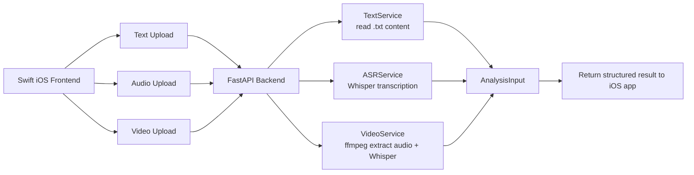

我做的

后面整合到整个项目之后做的删减，和优化

## v1-swift-python

This folder contains the first prototype version of **PhishGuard**, built with a **Swift frontend** and a **Python backend**.

### Structure

- `PhishGuardPythonProject_juntang`
  - Python backend built with **FastAPI**
  - Handles text, audio, and video upload requests
  - Uses **Whisper** for speech-to-text transcription
  - Converts uploaded content into a unified analysis input format

- `transfer_swiftPhishingDetectionApp`
  - Early **iOS frontend prototype** written in Swift
  - Provides the user interface for uploading and testing phishing-related content
  - Communicates with the backend for processing results

### Purpose of This Version

This version was mainly used to validate the early system workflow:
1. collect user input from the iOS app,
2. send the content to the backend,
3. process different input types separately,
4. convert them into a standard format for phishing analysis.

### Notes

This is an early prototype version of the project.  
Later versions gradually moved toward a more integrated Swift-based implementation.
