 期货公司后台系统：交易、运维、安全与灾备实践

> 从个人工作经历出发，解释期货公司后台有哪些系统、一笔交易如何流转，以及运维、安全、灾备和监管保障工作是怎么完成的。

它不是纯粹的期货教材，也不是恒生产品说明书，而是一本连接四个领域的实践型书籍：

- 期货业务
- 金融信息系统
- 系统运维
- 网络安全与监管合规

## 全书目录

- 导读　从恒生期货后台系统认识行业全貌
- 第一部分　期货业务与核心交易系统
  - 第一章　认识期货公司的技术系统
    - 第一节　客户看到的交易软件只是最前端
    - 第二节　一笔期货订单背后的完整链路
    - 第三节　前台、柜台、后台和交易所的关系
    - 第四节　期货公司的主要技术系统
    - 第五节　技术部门在交易业务中的位置
  - 第二章　期货核心后台系统
    - 第一节　期货后台不是一个独立的软件
    - 第二节　核心柜台系统
    - 第三节　交易与行情前置系统
    - 第四节　客户账户管理系统
    - 第五节　交易、查询、结算与风险控制模块
    - 第六节　业务中间件、数据库与前置系统
    - 第七节　一笔期货订单在系统中的流转过程
    - 第八节　系统出现故障时如何定位问题
- 第二部分　系统运行环境与数据基础
  - 第三章　Linux服务器环境
    - 第一节　为什么金融后台大量使用Linux
    - 第二节　物理机、虚拟机与服务器集群
    - 第三节　用户、用户组与文件权限
    - 第四节　系统进程与后台服务
    - 第五节　环境变量与动态链接库
    - 第六节　CPU、内存、磁盘与网络状态
    - 第七节　后台服务的启动与停止
    - 第八节　Linux服务器日常巡检
    - 第九节　常见故障及排查思路
  - 第四章　Oracle数据库与业务中间件
    - 第一节　数据库在期货系统中的作用
    - 第二节　账户、资金、持仓、委托与成交数据
    - 第三节　Oracle实例、数据库用户与权限
    - 第四节　数据导入、导出与备份
    - 第五节　为什么期货系统需要业务中间件
    - 第六节　不同服务之间如何通信
    - 第七节　数据库连接异常的表现
    - 第八节　数据一致性与金融业务风险
- 第三部分　访问控制、网络安全与故障分析
  - 第五章　堡垒机与运维访问控制
    - 第一节　为什么不能随意直接登录生产服务器
    - 第二节　堡垒机的主要作用
    - 第三节　身份认证与权限控制
    - 第四节　运维访问申请与授权流程
    - 第五节　命令审计与操作记录
    - 第六节　最小权限原则
    - 第七节　高权限账号管理
    - 第八节　异常访问的发现与追踪
    - 第九节　堡垒机与网络安全等级保护的关系
  - 第六章　网络配置、日志分析与故障排查
    - 第一节　期货系统的网络区域划分
    - 第二节　管理网、业务网与交易线路
    - 第三节　IP地址、端口与防火墙策略
    - 第四节　期货后台系统中的日志类型
    - 第五节　交易日志、行情日志与中间件日志
    - 第六节　如何根据时间定位故障

---

## 导读　从恒生期货后台系统认识行业全貌

你工作中所说的“恒生期货后台系统”，不是单独一个软件，而是恒生电子为期货公司提供的一整套交易后台系统。根据白皮书，它至少包含三个主要部分：

- UF2.0：期货核心业务与柜台系统
- UFT2.0：交易、行情与交易所报盘系统
- 账户2.0：客户账户管理系统

它们共同完成从客户开户、下单，到风险控制、交易所申报，再到结算的完整流程。

### 一、UF2.0是什么？

UF2.0可以理解为期货公司的“核心后台”。

客户在交易软件里看到的资金、持仓、成交记录、保证金和可用资金等数据，主要由这一类后台系统进行处理。

它包含以下重要模块：

| 模块 | 主要作用 |
|---|---|
| 交易服务 | 接收和处理交易相关业务请求 |
| 查询服务 | 查询客户资金、持仓、委托和成交信息 |
| 结算服务器 | 每个交易日结束后计算资金、盈亏和持仓 |
| 风控服务器 | 计算风险指标并监控客户风险 |
| 银期平台 | 处理银行与期货账户之间的资金划转 |
| 柜员客户端 | 供期货公司后台业务人员操作 |
| 中间件 | 连接客户端、业务服务和数据库 |
| Oracle数据库 | 保存客户、资金、交易、结算等核心数据 |

因此，UF2.0并不只是一个操作界面。它实际上由数据库、中间件、交易服务、查询服务、结算系统、风控系统和银期系统共同组成。

### 二、UFT2.0是什么？

UFT2.0主要负责连接期货公司的内部系统与交易所。

可以把它理解成“下单与交易所之间的通道”。

它主要处理：

- 接收内部柜台系统发出的委托
- 将委托转换成交易所要求的格式
- 向交易所报送订单
- 接收交易所返回的确认和成交信息
- 接收并转发行情数据
- 维护交易和行情连接
- 保存报盘、成交和通信日志

白皮书中出现的主要组件包括：

| 组件 | 作用 |
|---|---|
| `front_trade` | 交易前置，负责交易请求接入 |
| `front_quote` | 行情前置，负责行情数据接入 |
| `uft_trade` | 处理交易业务 |
| `uft_query` | 处理交易及状态查询 |
| `trans` | 与交易所进行交易通信 |
| `quote` | 接收交易所行情 |
| `quote_merger` | 合并或整理行情数据 |
| `arb` | 仲裁及高可用相关组件 |
| `queue` | 排队和消息处理 |
| `front_mgr` | 前置系统管理 |

客户在交易软件中点击“买入”以后，订单并不是直接从客户电脑发送给交易所，大致会经历：


例如：

1. 客户提交一笔螺纹钢期货买入委托。
2. UF2.0检查账户、资金、持仓和基本风控条件。
3. UFT2.0将订单发送到对应期货交易所。
4. 交易所返回“已申报、已成交或已撤单”等结果。
5. UFT2.0将结果传回UF2.0。
6. UF2.0更新客户的委托、成交、资金和持仓信息。
7. 客户在交易软件中看到最终状态。

### 三、账户2.0是什么？

账户2.0主要管理客户账户及相关资料。

通常会涉及：

- 客户基本资料
- 资金账户
- 交易编码
- 账户状态
- 权限设置
- 适当性或业务资格
- 账户资料查询
- 与柜台系统的数据同步

可以简单理解为：

- 账户2.0负责“这个客户是谁、具有什么账户和权限”
- UF2.0负责“这个客户有多少钱、持有什么仓位、进行了什么交易”
- UFT2.0负责“把他的订单送到交易所并接收结果”

### 四、结算和风控分别做什么？

#### 结算系统

期货具有每日无负债结算制度，因此每天收盘后，后台需要重新计算：

- 当日盈亏
- 持仓盈亏
- 平仓盈亏
- 手续费
- 保证金
- 可用资金
- 客户权益
- 次日持仓数据

白皮书中的结算服务器负责执行这类批量处理。

如果结算出现异常，可能造成：

- 客户资金显示错误
- 持仓数据不一致
- 次日无法正常交易
- 保证金计算错误
- 对账结果不一致

所以结算系统通常是期货后台最关键的部分之一。

#### 风控系统

风控服务器持续计算或更新风险相关数据，例如：

- 客户保证金是否足够
- 可用资金是否为负
- 风险度是否超过阈值
- 持仓是否超过限制
- 是否接近强制平仓条件
- 市场变化是否导致客户风险快速上升

它和“网络安全风控”不是同一个概念。这里的风控主要是交易风险、保证金风险和资金风险。

### 五、你当时为什么会接触这些系统？

你当时的工作不是设计期货交易规则，也不是开发恒生系统，而是保障这些系统能够安全、稳定地运行。

你可能接触到的工作包括：

- 登录Linux服务器查看服务状态
- 通过堡垒机访问生产或测试环境
- 检查恒生中间件进程是否正常
- 查看交易、行情、结算或通信日志
- 检查服务器、数据库和网络连接
- 配合业务人员排查柜台异常
- 检查银期转账服务是否正常
- 参与日常巡检、灾备和安全保障
- 处理账号、访问权限和审计记录
- 协助判断问题发生在客户端、柜台、数据库、网络还是交易所接口

例如，用户报告“无法下单”时，后台不能只看一个地方，而要沿着整条链路排查：

1. 客户账户是否正常。
2. UF2.0柜台服务是否运行。
3. 风控是否拒绝了订单。
4. UF2.0与UFT2.0之间是否通信正常。
5. UFT2.0交易前置是否正常。
6. 交易所连接是否正常。
7. 返回信息是否被系统正确处理。
8. 网络、数据库或中间件是否出现异常。

### 六、服务器为什么有很多台？

白皮书显示，这套系统不是安装在一台服务器上的，而是拆分部署在多台物理机和虚拟机中。

这样做主要有三个原因：

- 性能隔离：交易、查询、结算和风控不会全部争用同一台服务器。
- 故障隔离：查询系统出问题时，不一定影响核心交易。
- 高可用：部分服务可以双机部署，主节点故障后由备用节点接管。

系统中可能存在：

- Oracle RAC数据库服务器
- 同城或异地数据库热备服务器
- 交易服务器
- 查询服务器
- 结算服务器
- 风控服务器
- 银期服务器
- 行情和交易前置服务器
- 管理及运维监控服务器

因此，你当时看到很多IP地址、服务器名称、进程和系统模块，是因为一笔交易背后本来就是一套分布式系统。

### 七、你可以怎样理解自己的工作？

你并不是简单地“维护了一台Linux服务器”，而是在保障一条金融交易业务链路：

> 客户账户 → 资金与持仓 → 风险检查 → 柜台处理 → 交易所报盘 → 成交返回 → 日终结算

你的工作处于“业务系统、基础设施和安全控制”的交叉位置。

更准确的自我描述是：

> 参与恒生期货后台系统的运行保障，了解UF2.0、UFT2.0和账户系统之间的业务关系，协助维护交易、查询、结算、风控及银期相关服务，并通过服务器状态、网络连接和系统日志排查后台运行异常。

需要特别注意的是：如果你当时没有亲自部署、配置或管理所有模块，就不要说“负责整个恒生期货系统”。可以说：

- 接触并支持
- 参与运行保障
- 协助维护
- 配合故障排查
- 了解系统架构和业务流程

第一项最核心的一句话就是：

> 恒生期货后台系统是一套连接客户账户、资金、交易、风控、结算和交易所的核心业务平台，而你的工作是保障这套平台底层服务器、网络访问和关键服务的安全稳定运行。

---


-


---


写作时也不使用真实：

- 厂商名称和Logo
- 产品名称及版本号
- 公司名称
- 系统代号
- 服务器名称和IP
- 账号、端口及配置文件名
- 真实网络拓扑
- 未公开故障和内部流程

第一章原来的标题“恒生期货后台系统”，统一改成：

> **第一章：期货核心后台系统**

书的定位则是：

> 以个人工作经历为基础，从通用技术视角解释期货公司的核心后台、服务器、访问控制、灾备、银期接口、安全合规和业务保障工作，不涉及具体厂商、机构及内部系统信息。

后面写正文时，我会自动匿名化：不会再出现“恒生”“九桥”及其他能够识别厂商或原单位的专有名称。

---


## 第一部分　期货业务与核心交易系统

### 第一章　认识期货公司的技术系统


#### 第一节　客户看到的交易软件只是最前端

对于大多数期货投资者来说，期货交易似乎完全发生在手机或电脑上的交易软件中。客户打开软件，查看行情，选择合约，输入价格和数量，然后点击买入或卖出。几秒钟后，界面上便会显示“待报”“已报”“部分成交”“全部成交”或“已撤单”。

从客户的角度看，交易软件似乎完成了整个交易过程。但实际上，它只是期货交易系统中最靠近客户的一层，也就是前端。

交易软件主要负责接收客户操作、展示市场行情和呈现处理结果。真正决定订单能否被接受、账户是否具有交易权限、资金是否充足、需要冻结多少保证金，以及订单应当发送到哪个交易所的，是隐藏在交易软件背后的一系列后台系统。

##### 一、交易软件在整个系统中的位置

客户交易软件处于期货交易系统的最外层。它可能是一款手机应用、电脑客户端、网页交易终端，也可能是程序化交易接口或第三方交易软件。

这些前端虽然具有不同的界面和使用方式，但通常都会通过接入服务连接期货公司的后台系统。后台完成账户、资金和风险检查后，再通过交易前置系统与交易所通信。

一套简化后的期货交易系统，可以分为以下几个层次：

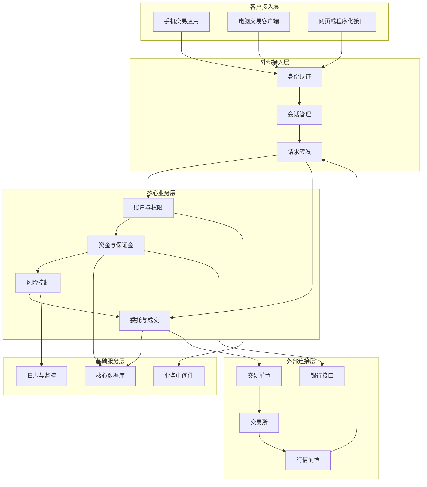

图中的每一层都承担不同职责。客户接入层负责提供操作界面；外部接入层负责认证和请求转发；核心业务层处理账户、资金、交易和风险；基础服务层提供数据库、中间件和日志支持；外部连接层则负责连接交易所与银行。

因此，交易软件并不保存最终的账户数据，也不能独立决定订单是否有效。它更像一个操作入口和信息展示窗口。

例如，客户在软件中看到“可用资金10万元”，并不意味着这笔资金保存在手机或电脑中。交易软件通常会向后台发送查询请求，后台读取账户数据并完成计算，然后把结果返回给前端。

同样，当客户点击“买入”时，交易软件只是收集合约、方向、价格和数量等信息。订单能否继续执行，仍需由后台系统作出判断。

##### 二、一笔订单在后台经历了什么

假设一名客户准备买入一手期货合约。他在交易软件中选择合约，输入价格和数量，然后点击“买入开仓”。

从客户的角度看，这只是一次点击。但在后台，系统通常需要完成身份认证、账户检查、权限检查、保证金计算、风险控制、订单申报和结果更新等多个步骤。

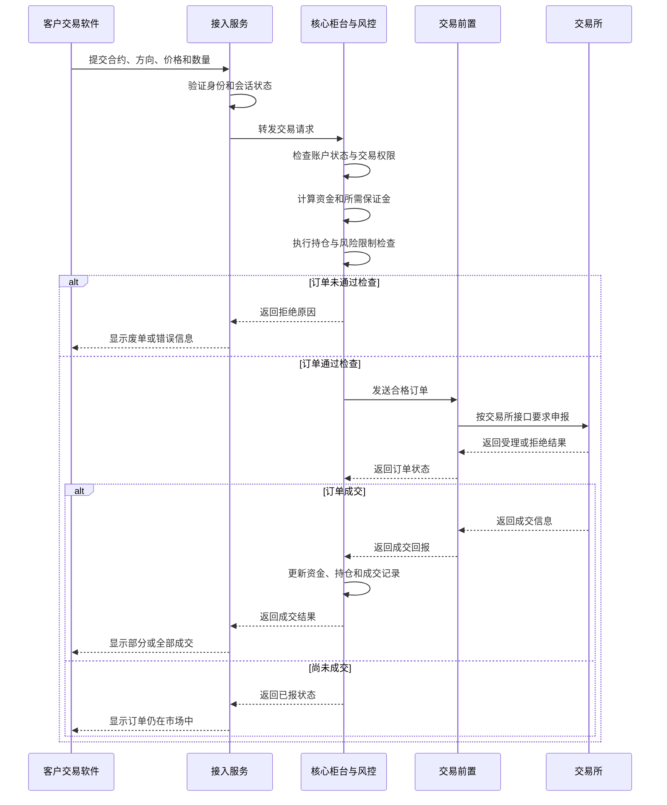

订单进入后台后，系统首先确认客户身份和登录会话是否有效。随后，核心业务系统检查账户是否正常、客户是否具有相应产品的交易权限，以及可用资金能否覆盖所需保证金。

风险控制模块还可能检查客户持仓是否超过限制，订单是否违反内部风险规则，以及当前账户风险水平是否允许继续开仓。

只有通过这些检查的订单，才会进入交易前置系统。交易前置负责按照交易所接口要求组织和发送订单，并接收交易所返回的受理、拒绝或成交信息。

交易所完成处理后，结果沿原有链路返回。后台根据返回结果更新客户的委托、成交、资金和持仓数据，交易软件最终再将结果显示给客户。

交易所提供的技术资料通常也会将电子交易系统区分为订单接入、撮合、行情发布和风险管理等部分。CME Group对其电子交易平台的介绍中，便分别列出了订单接入、撮合引擎、行情数据和风险管理服务。[CME Group：Introduction to Globex](https://www.cmegroup.com/articles/videos/2025/introduction-to-globex-listed-derivatives.html)

##### 三、客户看到的订单状态来自哪里

客户提交订单后，交易软件可能显示不同状态。这些状态通常来自后台或交易所返回的消息，而不是交易软件自己产生的。

| 状态 | 一般含义 |
|---|---|
| 未报 | 订单尚未正式发送 |
| 待报 | 订单正在等待后台处理 |
| 已报 | 订单已经申报，但尚未全部成交 |
| 部分成交 | 只有部分委托数量完成交易 |
| 全部成交 | 委托数量已经全部成交 |
| 已撤单 | 未成交部分已经被撤销 |
| 废单 | 订单未通过检查或被拒绝 |

“已报”并不等于“已成交”。它通常表示订单已经完成申报，但市场中可能暂时没有满足条件的对手方。

例如，客户以较低价格提交买入限价单，而当前市场卖价高于客户报价，这笔订单可能已经进入交易所，但仍然无法立即成交。订单的成交方式还会受到订单类型、有效期和价格条件的影响。[CME Group：Futures Order Types](https://www.cmegroup.com/education/courses/things-to-know-before-trading-cme-futures/futures-order-types)

“废单”则表示订单在某个环节被拒绝。常见原因包括账户状态异常、交易权限不足、可用资金不足、保证金不足、价格不符合规则、委托数量超过限制或交易所拒绝申报。

因此，两个客户虽然都报告“订单没有成交”，实际原因可能完全不同。一笔订单可能已经成功进入交易所，只是尚未匹配；另一笔订单则可能在期货公司内部检查阶段就被拒绝。

国际金融消息标准也会区分订单当前状态与最新执行事件。例如，FIX标准使用订单状态和执行类型描述待撤、部分成交及其他变化。[FIX Trading Community：Order State Changes](https://fixtrading.org/packages/fix-latest-specification-order-state-changes/)

##### 四、行情与交易是两条不同的链路

客户在同一个交易软件中既能查看行情，也能提交订单，因此很容易认为行情和交易由同一套系统处理。实际上，两者通常是相互关联但相对独立的业务链路。

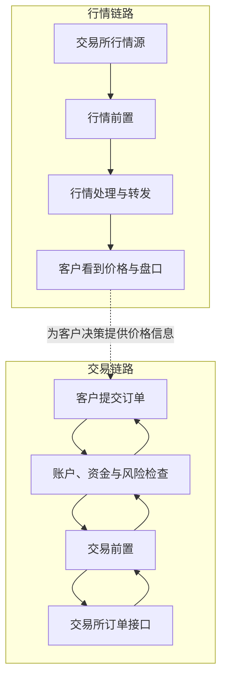

行情链路负责接收交易所发布的价格、成交量、买卖盘口和其他市场数据，再将这些信息分发给客户终端。

交易链路负责接收客户委托，完成账户、资金和风险检查，将订单申报到交易所，并接收订单确认与成交回报。

交易所通常也会为行情数据和订单接入提供不同的技术平台或接口。例如，CME Group的Market Data Platform用于向交易应用提供实时市场数据，而订单提交通过另外的订单接入路径完成。[CME Group：Develop to Globex](https://www.cmegroup.com/solutions/market-access/globex/develop-to-globex.html)

由于两条链路相对独立，客户可能遇到“可以看行情但不能下单”的情况，也可能遇到“可以提交订单但行情更新异常”的情况。

前一种情况可能与账户权限、资金检查、风险控制、交易服务或交易线路有关；后一种情况则更可能与行情接收、行情转发或行情网络有关。

因此，技术人员不能因为交易软件能够打开，就判断整个交易系统处于正常状态。登录、查询、行情、交易、成交回报和资金划转都需要分别验证。

##### 五、为什么不能完全信任交易前端

交易软件需要保护客户身份、账户凭据、资金信息、持仓信息和交易指令，但金融系统的安全不能只依赖前端。

客户端处于客户设备上，运行环境并不完全受期货公司控制。如果身份认证、权限判断和风险检查全部在客户端完成，经过修改或遭到攻击的客户端就可能尝试绕过这些限制。

因此，重要检查必须在后台重新执行，包括身份验证、权限控制、参数校验、资金检查、保证金计算、风险控制和日志记录。

这一思路与零信任架构的基本原则一致。美国国家标准与技术研究院指出，系统不应仅根据网络位置或设备归属给予隐式信任，身份认证与授权应当在访问资源之前完成。[NIST SP 800-207：Zero Trust Architecture](https://www.nist.gov/publications/zero-trust-architecture)

在期货交易系统中，可以把这一原则概括为：

> 前端负责接收操作，后台负责验证并作出最终决定。

即使交易软件提交了一项请求，后台仍需要判断请求来自谁、请求是否合法、账户是否具有权限，以及该操作是否会带来不可接受的风险。

##### 六、从运维角度理解交易软件

对于后台技术人员来说，客户交易软件首先提供的是故障现象，而不是故障原因。

当客户报告“无法交易”时，技术人员需要确定问题影响一个客户还是大量客户，影响一个终端还是全部终端，以及问题发生在登录、查询、行情、交易还是成交回报环节。

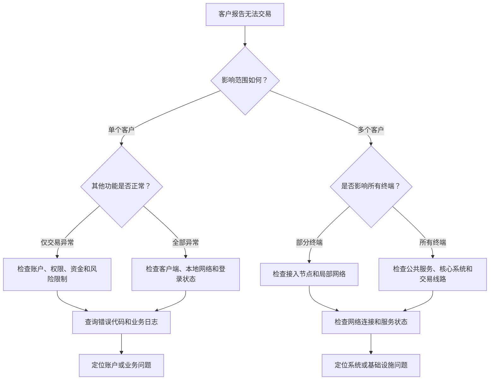

如果只有一名客户出现问题，技术人员应优先检查该客户的账户状态、交易权限、可用资金、客户端和本地网络。如果大量客户同时出现异常，则更可能涉及公共接入服务、核心后台、数据库、网络线路或交易前置系统。

一些常见现象可以提供初步方向：

| 客户表现 | 初步排查方向 |
|---|---|
| 软件完全无法连接 | 客户网络、接入服务或外部线路 |
| 可以登录但无法查询 | 查询服务、数据库或数据同步 |
| 行情正常但不能下单 | 账户状态、风险控制或交易线路 |
| 可以下单但没有回报 | 交易前置、通信线路或回报处理 |
| 只有一个客户异常 | 账户、权限、客户端或本地网络 |
| 大量客户同时异常 | 公共服务、网络、数据库或核心系统 |

这些判断只是排查起点，不能直接作为最终结论。技术人员仍需通过服务进程、网络连接、数据库状态、错误代码和系统日志确认真正原因。

##### 七、小结

客户使用的交易软件，是期货交易系统中最容易被看到的部分，却不是完成交易的核心。

它负责接收客户操作、发送业务请求、展示行情和账户数据，并呈现后台返回的结果。在它背后，账户管理、资金管理、风险控制、核心柜台、交易前置、行情服务、数据库、网络线路和交易所接口共同构成了一条完整的业务链路。

理解“交易软件只是最前端”，是认识期货公司技术系统的第一步。它使我们能够从一个简单的交易界面出发，看到一笔订单背后的账户、资金、风险、网络、数据库和交易所连接。

对于后台技术人员而言，真正需要保障的不是某一个交易界面能够打开，而是从客户发出交易指令，到交易所返回结果，再到资金和持仓完成更新的整条业务链路能够安全、准确并持续地运行。

##### 参考文献

1. CME Group. *Introduction to Globex: Listed Derivatives*. 2025.
 [https://www.cmegroup.com/articles/videos/2025/introduction-to-globex-listed-derivatives.html](https://www.cmegroup.com/articles/videos/2025/introduction-to-globex-listed-derivatives.html)

2. CME Group. *CME Globex: Order Pathways*. 2015.
 [https://www.cmegroup.com/education/demos-and-tutorials/cme-globex-order-pathways](https://www.cmegroup.com/education/demos-and-tutorials/cme-globex-order-pathways)

3. CME Group. *Develop to Globex*.
 [https://www.cmegroup.com/solutions/market-access/globex/develop-to-globex.html](https://www.cmegroup.com/solutions/market-access/globex/develop-to-globex.html)

4. CME Group. *Futures Order Types*.
 [https://www.cmegroup.com/education/courses/things-to-know-before-trading-cme-futures/futures-order-types](https://www.cmegroup.com/education/courses/things-to-know-before-trading-cme-futures/futures-order-types)

5. FIX Trading Community. *FIX Latest Specification: Order State Changes*. 2023.
 [https://fixtrading.org/packages/fix-latest-specification-order-state-changes/](https://fixtrading.org/packages/fix-latest-specification-order-state-changes/)

6. Rose, S., Borchert, O., Mitchell, S. and Connelly, S. *Zero Trust Architecture*. NIST Special Publication 800-207, 2020.
 [https://www.nist.gov/publications/zero-trust-architecture](https://www.nist.gov/publications/zero-trust-architecture)

---


#### 第二节　一笔期货订单背后的完整链路

客户在交易软件中点击“买入”或“卖出”之后，订单并不会直接变成成交。它需要依次经过生成、验证、风险检查、路由、申报、撮合和结果返回等环节。订单成交后，系统还要继续处理资金、持仓、手续费、保证金和日终结算。

因此，一笔期货订单的完整链路不应只理解为“客户下单—交易所成交”。从技术角度看，它是一条从客户操作开始，经过期货公司后台和交易所，再延伸到成交处理与结算的完整业务链路。

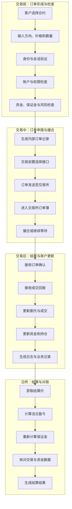

这张图展示了订单从客户输入到日终结算的总体过程。但需要注意，订单和持仓是两个不同概念：订单可能被撤销或拒绝；订单成交后才会形成或改变持仓。订单生命周期结束后，由成交形成的持仓仍会继续参与风险计算和每日结算。

##### 一、订单的产生与交易前检查

一笔订单首先由客户在交易终端中创建。订单通常包含合约代码、买卖方向、开平仓方向、委托价格、委托数量和订单类型等信息。

客户提交订单后，接入系统首先需要确认登录会话是否仍然有效，并识别订单属于哪个客户和账户。随后，核心后台会检查账户是否正常、是否被冻结，以及客户是否具有相应产品或交易类型的权限。

通过账户和权限检查后，系统还要判断客户是否具有足够的资金和保证金。对于开仓订单，后台通常需要根据合约价格、合约乘数、保证金比例和委托数量估算所需保证金。

简化后的保证金关系可以表示为：

\[
	ext{所需保证金}
=
	ext{合约价格}
	imes
	ext{合约乘数}
	imes
	ext{委托数量}
	imes
	ext{保证金比例}
\]

实际系统中的计算可能更加复杂，还要考虑交易方向、组合持仓、交易所标准、期货公司附加保证金和特殊风险参数。

如果可用资金不足，或者订单会导致客户超过持仓限制，系统可能在订单到达交易所前就将其拒绝。

这一阶段称为交易前检查。它的主要作用是防止明显不符合业务规则或风险要求的订单进入交易所。

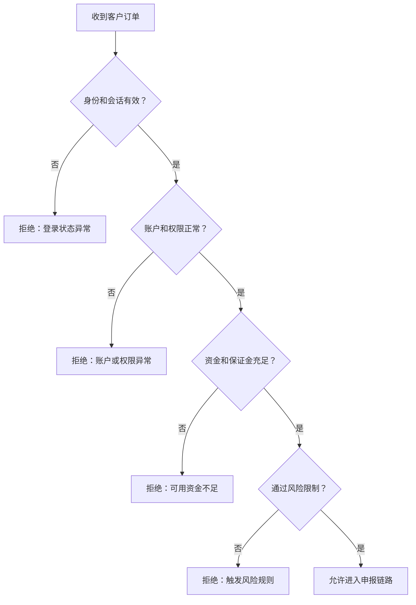

交易前检查不是单纯的技术验证，而是金融业务规则在信息系统中的实际执行。检查结果必须准确、及时，并能够通过错误代码和日志说明订单被接受或拒绝的原因。

##### 二、订单如何被发送到交易所

订单通过交易前检查后，核心后台会生成内部订单记录，并为其分配用于追踪的标识。随后，订单被发送到交易前置系统。

交易前置是期货公司内部系统与交易所之间的重要连接层。它需要识别订单对应的交易所和交易接口，将内部订单转换成目标接口能够识别的消息，并通过交易通信线路进行发送。

期货公司的内部订单编号与交易所返回的订单编号可能并不相同，因此系统需要保存二者之间的对应关系。否则，当交易所返回撤单结果或成交回报时，后台可能无法准确找到对应的客户订单。

订单在这条链路中可能具有多个时间点：

- 客户提交订单的时间；
- 后台接收订单的时间；
- 完成风险检查的时间；
- 发送至交易前置的时间；
- 交易所接收订单的时间；
- 订单成交或撤销的时间。

这些时间戳对性能监控、故障排查和事后审计都很重要。例如，客户认为订单“发送很慢”，技术人员可以比较不同环节的时间，判断延迟发生在客户端、接入层、风险检查、交易前置还是交易所通信阶段。

##### 三、订单进入交易所后发生什么

交易所接收有效订单后，会根据订单的价格、方向、数量和有效条件，将其放入相应合约的订单簿中。

如果订单能够立即与市场中的反向订单匹配，就可能直接成交；如果暂时没有满足条件的对手方，订单会继续留在订单簿中等待。订单也可能只成交一部分，剩余数量继续等待。

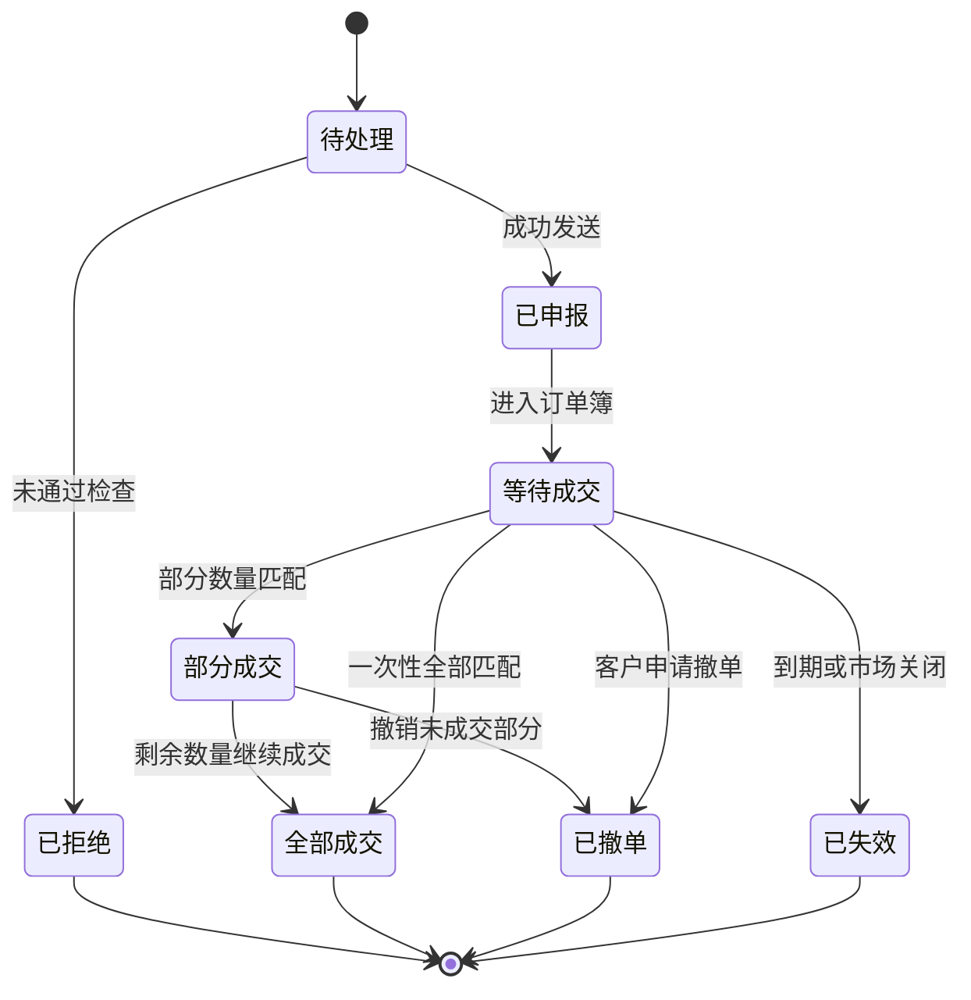

订单进入交易所并不意味着它一定能够成交。限价单是否成交取决于客户指定的价格能否与市场中的反向订单匹配，市价单虽然强调尽快成交，但实际成交价格和数量仍会受到市场流动性的影响。

不同交易所和合约可能采用不同的订单类型、撮合规则和有效期条件。CME Group的期货订单资料将市价单、限价单和止损单列为常见订单类型，并说明订单条件会影响订单的成交方式。[CME Group：Futures Order Types](https://www.cmegroup.com/education/courses/things-to-know-before-trading-cme-futures/futures-order-types)

交易所通常按照公开规则和既定算法处理订单。订单进入、修改、成交和撤销都会改变订单簿的状态。CME Group关于市场运行的资料也指出，订单按照预先定义的撮合算法进行处理。[CME Group：How Agricultural Markets Operate](https://www.cmegroup.com/content/dam/cmegroup/education/files/how-cme-group-agricultural-markets-operate.pdf)

##### 四、成交结果如何返回并更新账户

订单被交易所接受或成交后，交易所会向交易前置返回订单确认和成交信息。交易前置再将这些消息传递给核心后台。

后台收到结果后，需要根据订单标识找到原始客户、账户和委托记录，并依次更新：

- 订单当前状态；
- 已成交数量与剩余数量；
- 实际成交价格；
- 客户持仓；
- 冻结或释放的保证金；
- 可用资金；
- 手续费；
- 成交记录。

如果订单只成交一部分，系统需要同时保存已成交数量和未成交数量。未成交部分可能继续等待，也可能由客户撤销。

这一过程中，订单确认与成交回报也不能混为一谈。订单确认表示交易所已经接收或处理订单；成交回报则表示订单已经与另一笔订单成功匹配。

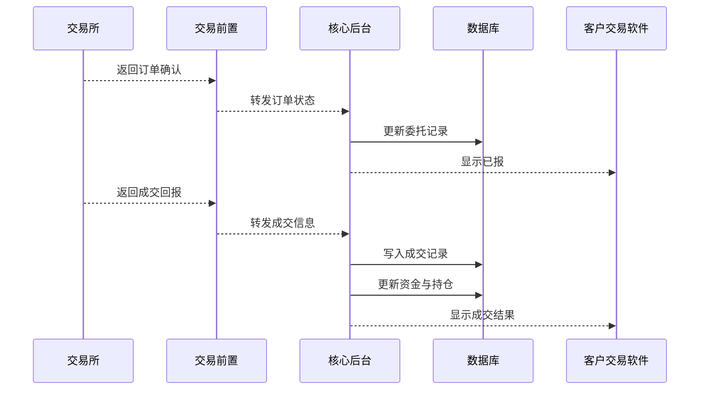

如果订单已经在交易所成交，但成交回报没有正确返回或没有被后台处理，就可能出现客户看不到成交、持仓未及时更新或资金显示异常等问题。

因此，技术人员不仅要检查订单是否成功发送，还要检查订单确认、成交回报和账户更新是否全部完成。

##### 五、撤单不是简单地删除订单

当客户点击“撤单”时，交易软件不会直接从界面中删除订单，而是生成一条新的撤单请求。

后台收到撤单请求后，需要确认原订单仍然存在未成交数量，并将撤单请求发送至交易所。如果订单在撤单请求到达前已经全部成交，撤单就无法成功。

撤单过程可能出现以下结果：

- 原订单尚未成交，撤单成功；
- 原订单部分成交，剩余部分撤单成功；
- 原订单已经全部成交，撤单失败；
- 撤单请求尚在传输过程中；
- 交易所拒绝撤单；
- 通信异常导致撤单结果暂时未知。

因此，客户点击“撤单”后看到的“撤单已提交”，并不等于交易所已经确认撤单成功。只有收到正式的撤单确认，系统才能确定剩余委托已经从市场中移除。

##### 六、成交以后为什么还没有结束

订单全部成交后，订单本身的生命周期基本结束，但由成交形成的持仓仍然存在。

如果这是一笔开仓交易，系统会增加相应方向的持仓；如果是平仓交易，则会减少已有持仓，并计算平仓盈亏。后台还需要处理手续费、冻结资金释放和保证金变化。

交易完成后，相关信息通常还需要进入查询、风控、结算和对账等后续流程。因此，从系统角度看，“成交”只是订单处理的终点，却不是整个期货业务流程的终点。

自动化的直通式处理可以将订单路由、执行、确认和后续处理连接起来，从而减少人工干预和操作风险。[CME Group：Straight Through Processing](https://www.cmegroup.com/solutions/processing-and-reporting/straight-through-processing.html)

##### 七、订单如何进入日终结算

交易日结束后，期货系统需要根据交易所公布的结算结果，对客户资金和持仓进行统一处理。

期货市场通常实行每日盯市或当日无负债结算。交易所根据当日结算价计算未平仓合约的盈亏和保证金变化，再将结算结果提供给结算会员；期货公司随后根据交易所结果对客户进行结算。

中国金融期货交易所的结算规则明确规定了保证金制度和当日无负债结算制度。交易结束后，系统需要对盈亏、交易保证金、手续费及其他费用进行清算。[中国金融期货交易所：《结算细则》](https://www.cffex.com.cn/u/cms/www/202501/071747590uho.pdf)

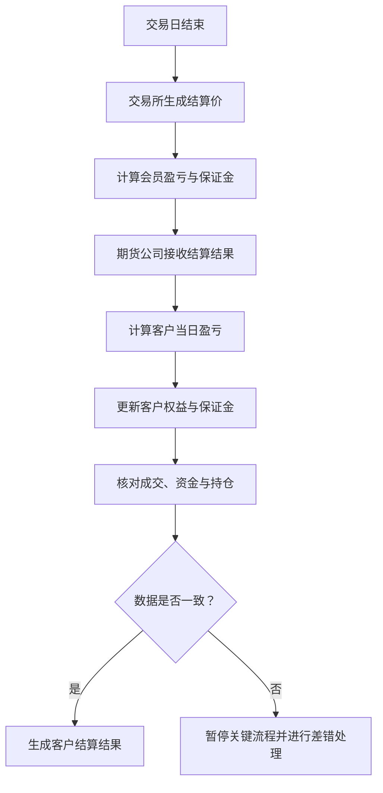

日终结算一般需要处理当日平仓盈亏、持仓盈亏、手续费、保证金、客户权益和可用资金等内容。结算完成后，系统还需要核对交易所数据、后台成交记录、持仓数据和资金数据是否一致。

每日盯市的核心作用，是按照统一的结算价重新计算未平仓头寸的当日盈亏。CME Group也将每日结算价描述为计算持仓盈亏和保证金的重要基础。[CME Group：Mark-to-Market](https://www.cmegroup.com/education/courses/introduction-to-futures/mark-to-market)

##### 八、技术人员如何观察这条链路

技术人员通常不能只通过客户界面判断订单是否正常，而需要从不同系统中收集证据。

如果客户表示“订单没有发出去”，技术人员需要检查接入日志、账户和风险检查结果、核心后台订单记录以及交易前置发送记录。

如果客户表示“订单已经成交，但软件没有显示”，则需要检查交易所成交回报、前置接收记录、后台消息处理、数据库更新和客户端查询结果。

订单链路可以按照时间顺序进行检查：

| 检查位置 | 需要确认的问题 |
|---|---|
| 客户端 | 是否生成并发送了订单 |
| 接入服务 | 是否收到客户请求 |
| 核心后台 | 是否完成账户和风险检查 |
| 交易前置 | 是否将订单发送至交易所 |
| 交易所回报 | 是否返回受理或成交结果 |
| 数据库 | 是否更新委托、成交、资金和持仓 |
| 客户端查询 | 是否正确显示最新结果 |

这种排查方式的关键，是找到订单最后一次被正常处理的位置。如果核心后台已经生成订单，但交易前置没有收到，问题可能位于内部通信链路；如果交易前置已经发送，但没有收到交易所确认，则应检查交易线路或交易所接口；如果成交回报已经返回，但客户持仓没有更新，则需要继续检查后台处理和数据库写入。

##### 九、小结

一笔期货订单的完整链路，可以概括为：

> 订单生成 → 身份验证 → 账户检查 → 资金与风险检查 → 交易前置 → 交易所申报 → 撮合成交 → 成交回报 → 资金与持仓更新 → 日终结算

客户看到的只是订单提交和最终结果，中间过程则由多个后台系统共同完成。

对于后台技术人员而言，理解这条链路具有两个重要作用。第一，它能够帮助技术人员理解不同系统之间的业务关系；第二，当交易出现异常时，可以按照订单实际经过的路径逐步检查，而不是没有方向地查看所有服务器和日志。

一笔订单能否被安全、准确地执行，不仅取决于交易软件是否正常，还取决于身份认证、账户权限、风险控制、交易通信、数据库更新和日终结算等环节能否协调工作。

##### 参考文献

1. 中国金融期货交易所：《中国金融期货交易所结算细则》，2025年。
 [https://www.cffex.com.cn/u/cms/www/202501/071747590uho.pdf](https://www.cffex.com.cn/u/cms/www/202501/071747590uho.pdf)

2. CME Group. *Futures Order Types*.
 [https://www.cmegroup.com/education/courses/things-to-know-before-trading-cme-futures/futures-order-types](https://www.cmegroup.com/education/courses/things-to-know-before-trading-cme-futures/futures-order-types)

3. CME Group. *How CME Group Agricultural Markets Operate*.
 [https://www.cmegroup.com/content/dam/cmegroup/education/files/how-cme-group-agricultural-markets-operate.pdf](https://www.cmegroup.com/content/dam/cmegroup/education/files/how-cme-group-agricultural-markets-operate.pdf)

4. CME Group. *Straight Through Processing*.
 [https://www.cmegroup.com/solutions/processing-and-reporting/straight-through-processing.html](https://www.cmegroup.com/solutions/processing-and-reporting/straight-through-processing.html)

5. CME Group. *Mark-to-Market*.
 [https://www.cmegroup.com/education/courses/introduction-to-futures/mark-to-market](https://www.cmegroup.com/education/courses/introduction-to-futures/mark-to-market)


---
#### 第三节　前台、柜台、后台和交易所的关系

在期货交易过程中，客户会接触交易软件，期货公司内部需要运行柜台和后台系统，订单最终还要进入交易所。前台、柜台、后台和交易所共同组成一条完整的交易链路，但它们承担的职责并不相同。

简单来说：

> 前台负责接收客户操作，柜台负责处理交易业务，后台负责支撑账户、资金、风控和结算，交易所负责组织市场并撮合成交。

需要注意的是，“前台”和“后台”在不同场景中可能有不同含义。本节主要从信息系统角度讨论：前台指客户直接使用的交易终端；后台则指期货公司内部用于账户、资金、查询、结算、风控和运行管理的系统。

##### 一、四者在系统中的基本位置

前台、柜台、后台和交易所并不是四个完全独立的软件，而是四个不同的功能层次。

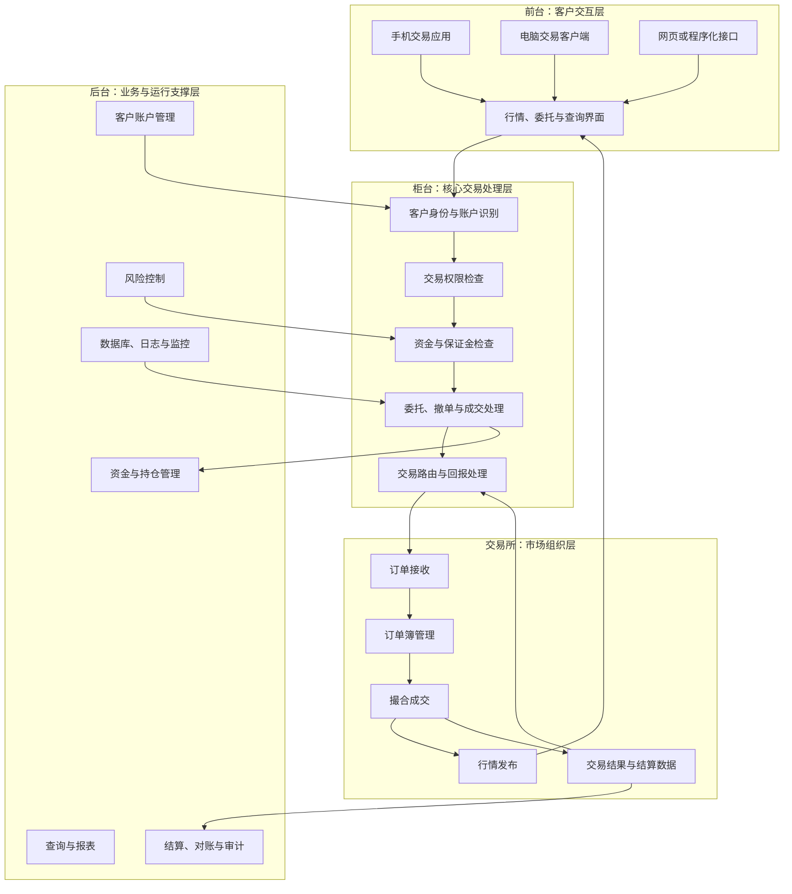

前台直接面对客户，柜台处于交易链路的中心，后台为柜台提供账户、资金、风控和数据支持，交易所则负责接收订单、组织撮合并返回结果。

从系统关系上看，柜台连接了另外三个部分：

- 向前连接客户交易终端；
- 向后连接内部账户、资金和结算系统；
- 向外连接交易所的交易与行情接口。

因此，柜台通常被视为期货公司交易系统的核心。

##### 二、前台负责客户与系统之间的交互

前台是客户最容易看到的部分，包括手机交易应用、电脑交易客户端、网页交易终端和程序化交易接口。

前台主要承担两类任务：一类是接收客户操作，另一类是展示后台结果。

客户可以通过前台登录账户、查询资金和持仓、查看行情、提交订单、申请撤单和查看成交结果。但前台通常不保存最终的账户数据，也不能独立决定客户是否能够交易。

例如，客户提交一笔“买入开仓”订单时，前台只负责收集合约、方向、价格和数量等参数，然后将请求发送给柜台。

同样，客户看到的资金、持仓和订单状态，也通常来自柜台或后台查询结果。前台只是将这些数据以便于理解的方式展示出来。

所以，前台的核心作用可以概括为：

> 将客户操作转换为系统请求，再将系统处理结果转换为客户能够理解的信息。

如果前台发生故障，客户可能无法登录、无法查看行情或者无法提交订单。但前台故障并不一定意味着柜台或交易所也发生了故障。例如，一个手机应用无法连接时，电脑客户端可能仍然能够正常交易。

##### 三、柜台负责处理期货公司的核心交易业务

“柜台”并不是营业网点里的物理柜台，而是期货公司内部处理客户交易请求的核心业务系统。

当客户订单进入柜台后，系统需要确认订单属于哪个客户和账户，并检查账户状态、交易权限、资金、保证金和风险限制。订单只有通过这些检查，才会被送往交易所。

柜台通常需要处理：

| 业务 | 柜台的主要职责 |
|---|---|
| 登录 | 识别客户、账户与会话 |
| 查询 | 返回资金、持仓、委托和成交数据 |
| 下单 | 接收并验证客户交易指令 |
| 撤单 | 检查原订单并发送撤销请求 |
| 风控 | 检查保证金、持仓和风险限制 |
| 回报 | 接收交易所订单确认与成交结果 |
| 更新 | 更新客户的委托、成交、资金和持仓 |

中国金融期货交易所的交易规则规定，客户通过会员进行期货交易，会员需要按照规定对客户交易指令进行资金和持仓验证；接受客户委托后，订单进入交易所集中交易。[中国金融期货交易所：《交易规则》](https://www.cffex.com.cn/cn/gzjygz/20260410/43076.html)

这说明柜台不仅是一条技术通道，还承担期货公司作为中介机构所必须执行的业务控制。

柜台不能简单地将所有客户请求原样转发给交易所。它必须先回答几个问题：

- 这是谁提交的订单？
- 这个账户是否正常？
- 客户是否有权交易该产品？
- 资金和保证金是否充足？
- 订单是否违反持仓或风险限制？
- 订单应该发送到哪个交易所？

只有完成这些判断后，柜台才会将合格订单交给交易前置系统。

##### 四、后台负责账户、资金、风控与结算支持

狭义上的后台，通常指不直接面向客户，却持续支撑交易业务的内部系统。

后台可能包括客户账户管理、资金管理、持仓管理、风险控制、查询、报表、结算、对账、数据库、日志和系统监控等功能。

柜台与后台之间的关系非常紧密。例如，柜台在检查一笔开仓订单时，需要获取客户账户状态、交易权限、可用资金和已有持仓；这些数据通常由后台数据库和相关业务模块提供。

订单成交后，后台还要继续完成以下工作：

1. 保存成交记录；
2. 更新客户持仓；
3. 计算和收取手续费；
4. 调整冻结保证金与可用资金；
5. 更新风险指标；
6. 为客户查询提供最新数据；
7. 在交易日结束后完成结算与对账。

因此，柜台更侧重“订单现在是否可以处理”，后台则更加关注“账户、资金和持仓如何持续保持准确”。

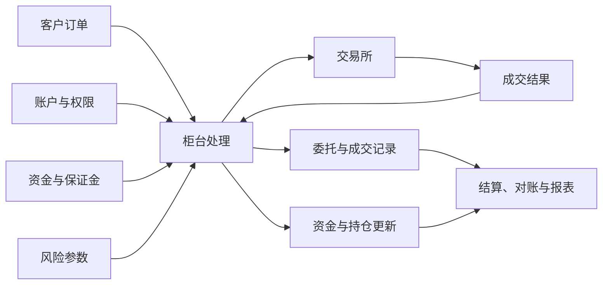

客户保证金也不是普通业务资金。中国证监会发布的《期货公司监督管理办法》要求期货公司通过规定的期货保证金账户和客户结算账户办理保证金存取，并对客户保证金实行专门管理。[中国证监会：《期货公司监督管理办法》](https://www.csrc.gov.cn/csrc/c106256/c1654011/1654011/files/59610807f66f4bf59c28243384300e8f.pdf)

因此，后台资金系统不仅要计算准确，还要满足资金隔离、数据报送、审计和监管要求。

##### 五、交易所负责市场组织与撮合成交

交易所位于期货公司外部，是集中交易市场的组织者。

交易所负责制定交易规则、接收会员申报、维护订单簿、按照既定规则撮合订单、发布市场行情，并向会员返回订单与成交结果。

客户通常不是直接将订单发送给交易所，而是先通过期货公司。期货公司的柜台完成账户和风险检查后，再通过交易前置系统将合格订单发送给相应交易所。

订单到达交易所后，交易所关注的重点不再是客户手机上显示什么，而是订单是否符合交易所规则，以及能否与订单簿中的反向订单匹配。

中国金融期货交易所的规则明确了客户通过会员进行交易以及订单自动撮合成交的基本关系。[中国金融期货交易所：《交易规则》](https://www.cffex.com.cn/cn/gzjygz/20260410/43076.html)

在其他市场中也存在类似结构。CME Group的订单路径资料将订单描述为由执行交易机构提交至电子交易平台，再进入后续执行路径。[CME Group：CME Globex Order Pathways](https://www.cmegroup.com/education/demos-and-tutorials/cme-globex-order-pathways)

交易所完成处理后，会将订单确认、撤单结果和成交回报返回给期货公司。期货公司柜台再根据这些信息更新内部数据，并通过前台告知客户。

##### 六、四者如何共同完成一笔交易

一笔订单从客户发出到最终显示成交结果，四个部分分别承担不同职责：

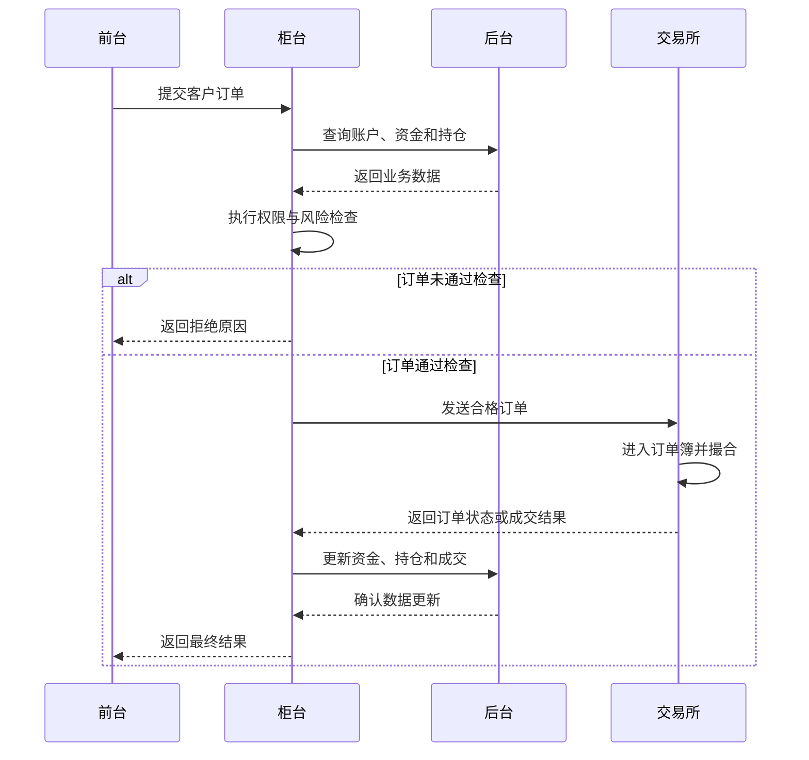

在这条链路中：

- 前台回答“客户想做什么”；
- 柜台回答“这项操作能否被接受”；
- 后台回答“账户、资金和持仓应如何记录与变化”；
- 交易所回答“订单是否进入市场以及是否成交”。

任何一个环节出现问题，客户感受到的现象都可能是“无法交易”，但真正原因可能完全不同。

如果前台故障，客户可能无法提交订单；如果柜台故障，订单可能无法完成业务检查；如果后台数据库异常，账户和资金数据可能无法读取或更新；如果交易所连接异常，订单可能无法申报或无法收到回报。

##### 七、广义后台与狭义后台

在实际工作中，“后台系统”有两种常见用法。

狭义后台是指账户、资金、结算、报表、数据库和管理系统，与客户前台和核心柜台相区别。

广义后台则可能指期货公司内部所有不直接展示给客户的系统。在这种说法中，柜台、交易前置、结算、风控、数据库和监控平台都可能被统称为后台系统。

因此，当有人说“后台出现问题”时，这个描述通常过于宽泛。技术人员需要进一步确认：

- 是核心柜台异常，还是查询系统异常？
- 是资金和持仓数据异常，还是交易所连接异常？
- 是业务服务异常，还是数据库和网络异常？
- 是订单无法发送，还是成交回报无法返回？

明确术语范围，有助于不同部门准确沟通，也能减少故障处理中产生的误解。

##### 八、小结

前台、柜台、后台和交易所共同构成了期货交易的基本技术链路。

| 部分 | 核心职责 |
|---|---|
| 前台 | 接收客户操作并展示数据和结果 |
| 柜台 | 验证和处理交易请求，连接前台、后台与交易所 |
| 后台 | 管理账户、资金、持仓、风控、结算和运行数据 |
| 交易所 | 接收订单、组织撮合、发布行情并返回交易结果 |

它们之间不是简单的软件连接关系，而是一种业务职责的分工。

前台让客户能够使用系统；柜台保证订单符合期货公司的业务和风险要求；后台保证账户、资金、持仓与结算数据持续准确；交易所则通过集中市场和撮合规则完成交易。

从技术运维的角度看，理解四者之间的关系，是判断系统位置、分析业务影响和定位交易故障的基础。

##### 参考文献

1. 中国金融期货交易所：《中国金融期货交易所交易规则》，2026年。
 [https://www.cffex.com.cn/cn/gzjygz/20260410/43076.html](https://www.cffex.com.cn/cn/gzjygz/20260410/43076.html)

2. 中国证券监督管理委员会：《期货公司监督管理办法》。
 [https://www.csrc.gov.cn/csrc/c106256/c1654011/1654011/files/59610807f66f4bf59c28243384300e8f.pdf](https://www.csrc.gov.cn/csrc/c106256/c1654011/1654011/files/59610807f66f4bf59c28243384300e8f.pdf)

3. CME Group. *CME Globex: Order Pathways*.
 [https://www.cmegroup.com/education/demos-and-tutorials/cme-globex-order-pathways](https://www.cmegroup.com/education/demos-and-tutorials/cme-globex-order-pathways)

---


#### 第四节　期货公司的主要技术系统

期货公司的技术体系并不是由某一个“交易系统”独立构成的。客户开户、登录、查询行情、提交订单、转入保证金、查看持仓以及接收结算单，都需要不同系统共同完成。

从业务位置来看，这些系统大致可以分成四个层次：

1. 客户接入与账户服务系统；
2. 核心交易与风险控制系统；
3. 资金、结算与数据管理系统；
4. 运行保障与信息安全系统。

中国证监会发布的行业管理规定将交易、行情、开户、结算、风控和通信等列为证券期货行业的重要信息系统。[中国证监会：《证券期货业网络和信息安全管理办法》](https://www.csrc.gov.cn/csrc/c101953/c7202800/7202800/files/%E9%99%84%E4%BB%B61%EF%BC%9A%E8%AF%81%E5%88%B8%E6%9C%9F%E8%B4%A7%E4%B8%9A%E7%BD%91%E7%BB%9C%E5%92%8C%E4%BF%A1%E6%81%AF%E5%AE%89%E5%85%A8%E7%AE%A1%E7%90%86%E5%8A%9E%E6%B3%95.pdf)

从整体上看，期货公司的主要技术系统可以形成如下结构：

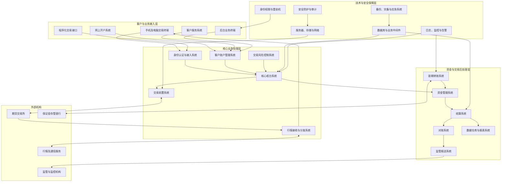

这张图并不代表所有期货公司都采用完全相同的系统结构。不同公司的产品、规模和部署方式可能存在差异，但主要业务功能通常比较接近。

##### 一、客户接入与账户服务系统

客户接入系统位于整个技术体系的最外层，主要负责连接客户与期货公司的内部系统。

客户直接使用的手机交易应用、电脑交易客户端、网页服务和程序化接口都属于这一层。它们提供行情展示、账户查询、订单提交、撤单、银期转账和结算单查询等功能。

但是，客户在前端看到的内容通常来自其他系统。例如，实时行情来自行情分发系统，资金与持仓来自核心柜台或查询系统，订单状态来自交易链路，银期转账结果则来自银行接口系统。

客户接入层还包括身份认证和会话管理。系统需要确认登录者的身份，检查账号状态，并控制登录设备、访问时间和会话有效期。对于程序化交易接口，还可能需要进行接口认证、流量控制和异常请求限制。

账户管理系统则负责客户从开户到销户的整个账户生命周期，包括客户资料、身份信息、协议、交易编码、适当性评估、业务权限和账户状态。

中国人民银行发布的行业信息系统分类标准中，也将账户管理、适当性管理、非现场开户和交易风控等作为期货经营机构的重要系统类别。[中国证监会：《证券期货业信息系统分类与代码》](https://www.csrc.gov.cn/csrc/c101954/c7608135/7608135/files/%E9%99%84%E4%BB%B62%EF%BC%9A%E3%80%8A%E8%AF%81%E5%88%B8%E6%9C%9F%E8%B4%A7%E4%B8%9A%E4%BF%A1%E6%81%AF%E7%B3%BB%E7%BB%9F%E5%88%86%E7%B1%BB%E4%B8%8E%E4%BB%A3%E7%A0%81%E3%80%8B.pdf)

客户完成开户并不代表立即具有全部交易权限。账户管理系统还要根据客户资料、风险承受能力和业务规则，为客户配置相应权限。核心柜台在处理订单时，会读取这些账户和权限信息。

##### 二、核心交易与风险控制系统

核心交易系统是期货公司技术体系的中心，主要包括核心柜台、交易前置、行情系统和交易风控系统。

核心柜台接收客户订单，检查账户状态、交易权限、可用资金、保证金和持仓限制，并维护客户的委托、成交、资金和持仓数据。

如果订单通过柜台检查，就会被发送到交易前置系统。交易前置负责连接不同交易所，将内部订单转换成交易所接口能够识别的消息，并接收订单确认、撤单结果和成交回报。

行情系统则负责接收交易所或行情服务机构发布的数据，并向不同客户终端进行分发。它处理的内容包括最新价格、买卖盘口、成交量、持仓量和涨跌幅等。

风险控制系统会持续监测客户和公司的风险状态。在客户下单时，它可能检查保证金是否充足、持仓是否超过限制；在市场价格变化时，它还会重新计算账户风险，识别需要追加保证金或采取风险处置措施的账户。

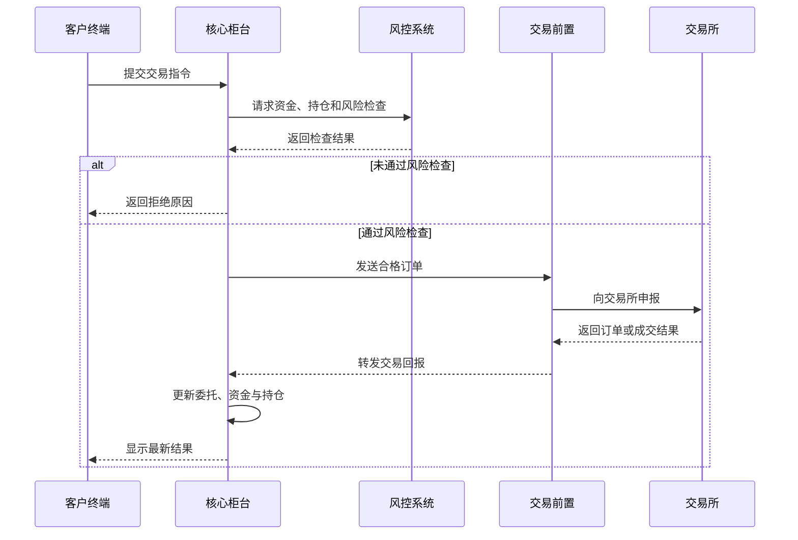

核心交易系统通常对实时性要求很高。交易时段内，即使只是几秒钟的延迟，也可能影响订单执行和客户权益。因此，柜台、交易前置、行情和风控系统通常需要重点监控，并配置相应的高可用和灾备能力。

##### 三、资金、银期与结算系统

期货交易实行保证金制度，因此资金管理是期货公司后台业务的重要组成部分。

银期转账系统连接期货公司与保证金存管银行，负责处理客户银行账户和期货资金账户之间的入金、出金及结果查询。

客户发起转账后，系统需要验证客户身份、银行账户、期货账户、转账方向、金额和业务时间，再通过银行接口提交请求。银行完成处理后，结果返回期货公司，资金系统随后更新客户的期货账户余额。

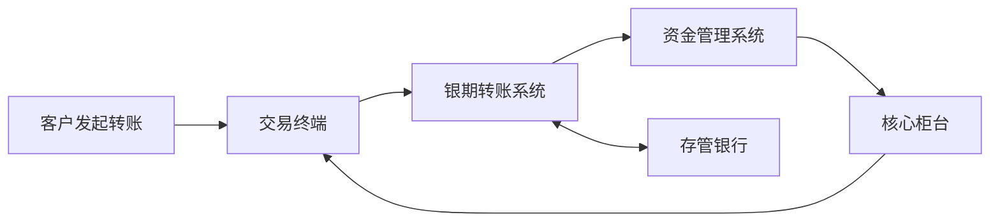

资金系统需要区分客户资金和期货公司的自有资金，并保证客户保证金按照规定存放和使用。资金数据出现错误可能直接影响客户可用资金、保证金计算和出金，因此需要严格的对账和审计机制。

结算系统主要在交易日结束后工作。它根据交易所结算结果，对客户的成交、持仓、盈亏、保证金、手续费和权益进行统一处理。

在当日无负债结算制度下，系统需要使用结算价重新计算未平仓合约的当日盈亏，并更新客户权益和保证金状态。中国金融期货交易所的结算规则要求结算会员及时、准确地了解客户的盈亏、费用和资金收付情况。[中国金融期货交易所：《结算规则》](https://www.cffex.com.cn/cn/gzjygz/20260410/47570.html)

对账系统则负责比较多个来源的数据，例如：

- 交易所成交数据与期货公司成交记录；
- 交易所持仓数据与客户持仓汇总；
- 银行资金流水与期货资金账户；
- 结算前数据与结算后结果。

如果数据不一致，技术人员和业务人员需要在下一交易日开始前完成差错处理，避免错误继续传递。

##### 四、数据、报表与监管报送系统

期货公司每天会产生大量账户、委托、成交、资金、持仓、行情、风险和日志数据。这些数据不仅用于交易，还需要支持客户服务、经营分析、合规检查和监管报送。

数据仓库通常从核心业务系统中抽取数据，并按照主题进行整理。它可能支持客户分析、交易量统计、收入分析、风险统计和历史趋势查询。

报表系统则将数据转换成业务人员能够使用的统计报表。与实时交易系统相比，报表系统通常不直接决定订单是否成交，但它对经营管理和监管合规非常重要。

监管报送系统按照规定格式，将相关账户、交易、资金、风险和系统运行数据报送给监管机构、行业监控机构或交易所。

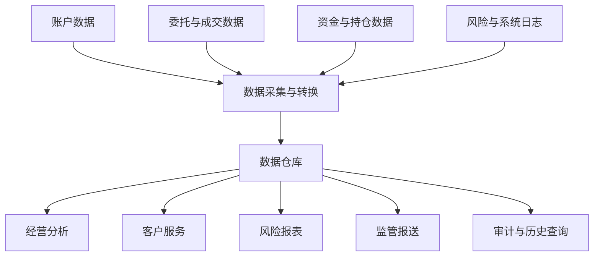

数据系统必须解决准确性、一致性和时效性问题。如果核心系统中的客户编号、合约代码或交易日期与报送系统理解不一致，就可能出现漏报、重复报送或统计错误。

因此，数据管理并不是简单地复制数据库，而是需要统一数据定义、校验规则和处理流程。

##### 五、基础设施、运维与安全保障系统

前面的业务系统都需要运行在服务器、数据库、存储和网络之上。基础设施虽然不直接处理期货订单的业务含义，却决定了所有业务系统能否稳定运行。

这一层通常包括：

| 系统类别 | 主要作用 |
|---|---|
| 服务器与虚拟化 | 运行业务程序、数据库和管理服务 |
| 网络与通信 | 连接客户、内部系统、银行和交易所 |
| 数据库 | 保存账户、资金、持仓、委托和成交数据 |
| 业务中间件 | 实现不同服务之间的通信与消息传递 |
| 日志与监控 | 监测服务、主机、数据库和业务状态 |
| 堡垒机与权限系统 | 控制和审计运维人员的访问 |
| 安全防护系统 | 实现边界防护、入侵检测和安全审计 |
| 备份与灾备系统 | 在故障或灾难发生后恢复数据和业务 |

监控系统需要持续观察CPU、内存、磁盘、网络、进程、数据库连接和业务接口。如果某项指标超过阈值，系统应及时产生告警。

日志系统则用于保存登录、交易、接口通信、数据库和运维操作记录。在故障排查或安全事件调查中，技术人员可以利用时间戳和订单标识，将分散在不同系统中的记录连接起来。

堡垒机和权限管理系统用于限制谁能够访问生产服务器、能够执行哪些操作，并对高权限行为进行记录和审计。

灾备系统负责在主系统发生严重故障后恢复业务。行业备份能力规范通常使用恢复时间目标（RTO）和恢复点目标（RPO）衡量系统需要多快恢复，以及能够容忍多少数据损失。[中国证监会：《证券期货业信息系统备份能力规范》](https://www.csrc.gov.cn/csrc/c101954/c7528845/7528845/files/%E9%99%84%E4%BB%B62%EF%BC%9A%E3%80%8A%E8%AF%81%E5%88%B8%E6%9C%9F%E8%B4%A7%E4%B8%9A%E4%BF%A1%E6%81%AF%E7%B3%BB%E7%BB%9F%E5%A4%87%E4%BB%BD%E8%83%BD%E5%8A%9B%E8%A7%84%E8%8C%83%E3%80%8B.pdf)

##### 六、系统之间如何形成完整业务链路

期货公司的技术系统虽然具有不同名称和职责，但它们最终围绕客户、订单、资金和持仓四类核心对象协同工作。

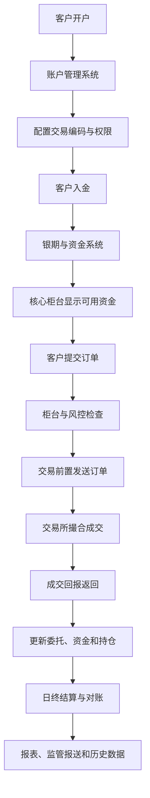

客户首先通过账户系统完成开户和权限配置，然后通过银期系统转入保证金。核心柜台确认资金后，客户才能提交订单。

订单经过风险检查和交易前置进入交易所。成交结果返回后，柜台更新资金和持仓。交易日结束后，结算系统完成盈亏和保证金计算，相关数据随后进入对账、报表和监管报送流程。

任何一项业务都不是由单个系统独立完成的。例如，客户“买入一手期货”可能同时涉及交易终端、身份认证、账户管理、核心柜台、风控、交易前置、交易所、数据库、日志和结算系统。

##### 七、小结

期货公司的主要技术系统可以概括为以下四层：

| 层次 | 主要系统 |
|---|---|
| 客户接入层 | 交易终端、网上开户、客户服务和程序化接口 |
| 核心业务层 | 账户管理、核心柜台、交易前置、行情和风控 |
| 资金与处理层 | 银期转账、资金管理、结算、对账和监管报送 |
| 技术保障层 | 数据库、中间件、服务器、网络、安全、监控和灾备 |

这些系统共同支持客户从开户、入金、交易到结算的完整业务过程。

对技术人员来说，理解系统名称并不是最终目的。更重要的是理解每个系统负责什么数据、连接哪些上下游，以及某个系统发生故障后会影响哪些业务。

只有建立这种整体认识，才能在日常巡检、故障排查、安全检查和灾备演练中准确判断系统的重要程度和业务影响。

##### 参考文献

1. 中国证监会：《证券期货业信息系统分类与代码》，2026年。
 [https://www.csrc.gov.cn/csrc/c101954/c7608135/7608135/files/附件2：《证券期货业信息系统分类与代码》.pdf](https://www.csrc.gov.cn/csrc/c101954/c7608135/7608135/files/%E9%99%84%E4%BB%B62%EF%BC%9A%E3%80%8A%E8%AF%81%E5%88%B8%E6%9C%9F%E8%B4%A7%E4%B8%9A%E4%BF%A1%E6%81%AF%E7%B3%BB%E7%BB%9F%E5%88%86%E7%B1%BB%E4%B8%8E%E4%BB%A3%E7%A0%81%E3%80%8B.pdf)

2. 中国证监会：《证券期货业网络和信息安全管理办法》。
 [https://www.csrc.gov.cn/csrc/c101953/c7202800/7202800/files/附件1：证券期货业网络和信息安全管理办法.pdf](https://www.csrc.gov.cn/csrc/c101953/c7202800/7202800/files/%E9%99%84%E4%BB%B61%EF%BC%9A%E8%AF%81%E5%88%B8%E6%9C%9F%E8%B4%A7%E4%B8%9A%E7%BD%91%E7%BB%9C%E5%92%8C%E4%BF%A1%E6%81%AF%E5%AE%89%E5%85%A8%E7%AE%A1%E7%90%86%E5%8A%9E%E6%B3%95.pdf)

3. 中国证监会：《证券期货业信息系统备份能力规范》，2024年。
 [https://www.csrc.gov.cn/csrc/c101954/c7528845/7528845/files/附件2：《证券期货业信息系统备份能力规范》.pdf](https://www.csrc.gov.cn/csrc/c101954/c7528845/7528845/files/%E9%99%84%E4%BB%B62%EF%BC%9A%E3%80%8A%E8%AF%81%E5%88%B8%E6%9C%9F%E8%B4%A7%E4%B8%9A%E4%BF%A1%E6%81%AF%E7%B3%BB%E7%BB%9F%E5%A4%87%E4%BB%BD%E8%83%BD%E5%8A%9B%E8%A7%84%E8%8C%83%E3%80%8B.pdf)

4. 中国金融期货交易所：《中国金融期货交易所结算规则》，2026年。
 [https://www.cffex.com.cn/cn/gzjygz/20260410/47570.html](https://www.cffex.com.cn/cn/gzjygz/20260410/47570.html)


#### 第五节　技术部门在交易业务中的位置

技术部门虽然不直接决定客户买卖什么合约，也不负责判断市场价格的涨跌，但几乎所有交易业务都依赖技术系统完成。

客户开户、登录、查询行情、提交订单、接收成交回报、进行银期转账以及查看结算结果，都要经过期货公司的信息系统。技术部门的职责，就是保障这些系统和连接它们的服务器、网络、数据库及通信线路能够安全、准确并持续地运行。

因此，技术部门并不是一个单纯“修电脑”的辅助部门，而是交易业务能够正常开展的重要保障部门。

##### 一、技术部门位于业务链路的中间位置

从公司组织结构看，技术部门通常位于客户、业务部门、风险管理部门、合规部门和外部技术机构之间。

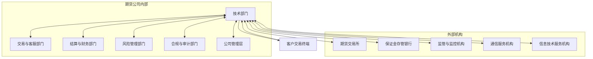

交易部门和客户服务部门关注客户能否正常登录、查询和下单；结算部门关注成交、持仓、盈亏和资金是否准确；风险管理部门关注保证金和账户风险；合规部门关注权限、日志和制度是否符合要求；技术部门则需要把这些业务要求转化为可以稳定运行的系统功能。

技术部门还要维护公司与交易所、银行、通信服务机构及其他外部平台之间的技术连接。一旦其中某个接口发生异常，技术部门通常是最先进行排查和协调的部门之一。

因此，技术部门具有两种位置：

> 在业务上，它是各部门的技术支持者；在系统上，它是不同业务链路的连接者和运行保障者。

##### 二、技术部门不决定交易，但保障交易能够完成

技术人员一般不会决定客户是否应该买入某个合约，也不会代替风险管理部门制定保证金政策。但是，相关业务规则最终都需要通过系统实现。

例如，风险管理部门决定提高某类合约的保证金比例后，技术部门可能需要配合确认参数是否正确配置、系统是否正确读取新参数，以及调整后是否会影响客户开仓和风险度计算。

这种关系可以表示为：


在正常情况下，业务部门定义“需要做什么”，技术部门解决“系统如何实现和稳定运行”。

但技术部门不能在没有授权的情况下自行修改关键交易规则。例如，保证金比例、客户权限、交易参数和风险限制通常需要经过规定的申请、审核和复核流程。技术人员负责执行技术操作，不等于技术人员可以决定业务规则。

这种分工能够防止一个人同时提出要求、修改系统并确认结果，降低误操作和内部滥用风险。

##### 三、技术部门贯穿整个交易日

技术部门的工作不是只在系统故障时才开始。一个完整交易日通常包括开盘前、交易时段、收盘后和日终结算等阶段，每个阶段都有不同的保障重点。

```mermaid
timeline
 title 技术部门在一个交易日中的工作位置
 开盘前
 : 检查服务器和核心进程
 : 检查数据库与网络连接
 : 验证交易、行情和银行接口
 交易时段
 : 监控订单与行情链路
 : 观察性能、容量和告警
 : 处理客户与业务部门反馈
 收盘后
 : 检查成交回报完整性
 : 核对服务和接口状态
 : 准备结算运行环境
 结算期间
 : 保障结算任务执行
 : 监控数据库和批处理
 : 配合处理数据差异
 结算完成后
 : 检查结果与系统状态
 : 完成日志、记录与备份
 : 为下一交易日做准备
```

开盘前，技术人员通常需要确认核心服务器、数据库、业务进程和网络通信是否正常，并检查与交易所、银行及其他外部系统的连接。

交易时段内，技术部门需要持续监控系统状态。如果客户报告行情中断、订单无法提交或成交回报延迟，技术人员需要结合影响范围、服务状态和日志迅速判断问题位置。

收盘后，技术工作的重点会逐渐转向成交数据、持仓数据和结算环境。日终结算期间，技术人员需要保障结算程序、数据库和批处理任务正常运行，并配合业务人员处理数据差异。

结算完成并不代表工作完全结束。技术部门还需要检查日志、备份和系统状态，为下一个交易日做好准备。

##### 四、技术部门承担哪些主要职责

技术部门的职责可以概括为系统运行、基础设施、信息安全、变更管理、数据保护和应急保障六个方面。

| 职责 | 主要内容 |
|---|---|
| 系统运行保障 | 保证开户、行情、交易、银期、结算和风控系统正常运行 |
| 基础设施管理 | 管理服务器、数据库、存储、网络和通信线路 |
| 监控与故障处理 | 发现异常、分析日志、定位故障并恢复业务 |
| 权限与安全管理 | 管理运维访问、系统权限、安全设备和审计记录 |
| 变更与测试 | 管理升级、配置修改、补丁、上线和回退 |
| 备份与灾备 | 保障数据备份、系统恢复和灾备切换能力 |

中国证监会发布的网络和信息安全管理规定要求经营机构建立合理的信息系统架构，并具备与业务相适应的性能、容量、可靠性和安全性；同时需要开展监测、数据备份和应急处置。[中国证监会：《证券期货业网络和信息安全管理办法》](https://www.csrc.gov.cn/csrc/c100028/c7202729/content.shtml)

技术工作并不仅限于“系统能不能启动”。例如，一个服务虽然仍在运行，但如果响应时间持续增加、磁盘空间即将耗尽，或者数据库连接数接近上限，仍然可能在交易高峰期造成业务中断。

因此，技术部门既要处理已经发生的故障，也要提前发现可能演变成故障的风险。

##### 五、技术部门如何与业务部门配合

当客户报告问题时，业务部门通常最先获得客户描述，技术部门则负责把业务现象转化为可以检查的技术问题。

例如，客户说“无法交易”时，这个描述并不足以直接定位故障。技术人员还需要确认：

- 客户能否正常登录；
- 行情是否正常更新；
- 资金和持仓能否查询；
- 订单是否到达柜台；
- 订单是否被风险检查拒绝；
- 是否发送到交易所；
- 是否收到订单确认和成交回报。

业务部门负责补充客户、账户、订单和发生时间等信息，技术部门则根据这些信息检查系统、数据库、网络和日志。

```mermaid
sequenceDiagram
 participant C as 客户
 participant B as 业务部门
 participant T as 技术部门
 participant R as 风控或结算部门
 participant E as 外部机构

 C->>B: 报告交易异常
 B->>B: 确认客户、时间和业务现象
 B->>T: 提交完整问题信息
 T->>T: 检查服务、网络和日志

 alt 属于账户或风险规则
 T->>R: 请求核实业务状态
 R-->>T: 返回账户或规则结果
 else 属于外部连接
 T->>E: 核实接口或线路状态
 E-->>T: 返回处理结果
 end

 T-->>B: 说明原因和处理状态
 B-->>C: 向客户反馈
```

如果缺少业务信息，技术人员可能只能在大量日志中盲目搜索；如果业务部门直接将问题归结为“系统故障”，也可能忽略账户权限、资金不足或交易规则等非技术原因。

因此，技术部门与业务部门之间需要建立明确的问题报告流程。至少应包含发生时间、客户范围、使用终端、业务功能、错误提示和订单信息。

##### 六、技术部门也是安全控制的一部分

技术人员拥有接触服务器、数据库、网络设备和重要系统的机会，因此技术部门本身也是信息安全控制的重点。

生产系统的访问通常需要经过身份认证、审批、权限控制和操作审计。关键操作应遵循最小权限和职责分离原则，避免所有人员都可以直接修改交易或资金数据。

技术部门还需要配合完成：

- 账号和权限定期复核；
- 漏洞扫描与安全整改；
- 日志保存和安全审计；
- 网络区域划分与访问控制；
- 恶意代码和入侵防范；
- 客户信息与交易数据保护；
- 等保测评和监管检查；
- 安全事件报告与调查。

技术部门不仅要恢复系统，还要保护故障现场和相关证据。系统恢复得很快，但如果日志、配置和时间线被破坏，就可能无法查明故障原因，也难以防止相同问题再次发生。

实际监管案例也表明，网络安全事件发生后，如果机构不能妥善保护证据或确定真实原因，仍可能被认定为应急处置和信息安全管理存在缺陷。[天津证监局：关于期货公司网络安全事件处置问题的监管决定](https://www.csrc.gov.cn/tianjin/c103610/c7561432/content.shtml)

##### 七、技术部门如何处理系统变更

交易系统的升级、补丁、参数调整和网络变更都可能影响正常交易，因此生产变更通常不能由技术人员临时决定并直接实施。

较完整的变更过程通常包括：

```mermaid
flowchart TD
 A["提出变更需求"] --> B["评估业务与安全影响"]
 B --> C["制定实施和回退方案"]
 C --> D["在测试环境验证"]
 D --> E{"测试是否通过？"}

 E -->|"否"| C
 E -->|"是"| F["审批实施窗口"]

 F --> G["备份配置和关键数据"]
 G --> H["实施生产变更"]
 H --> I["执行技术与业务验证"]
 I --> J{"运行是否正常？"}

 J -->|"是"| K["记录结果并持续监控"]
 J -->|"否"| L["执行回退或应急处理"]
 L --> I
```

在变更前，需要明确修改什么、影响哪些系统、由谁实施、如何验证以及失败后怎样回退。变更完成后，既要进行技术检查，也要进行业务验证。

例如，服务进程能够启动，并不意味着交易功能一定正常。还需要验证客户登录、行情接收、查询、订单申报和回报处理等关键功能。

监管实践也强调重要信息系统上线和变更前应进行审查、测试和监测，不能将“程序成功安装”当成“业务可以安全运行”。[深圳证监局：关于加强重要信息系统上线与变更管理的监管决定](https://www.csrc.gov.cn/shenzhen/c104320/c7471669/content.shtml)

##### 八、系统故障时技术部门的位置

系统故障发生后，技术部门通常需要同时完成四件事：

1. 判断故障影响范围；
2. 尽快恢复关键业务；
3. 保存日志和相关证据；
4. 查明原因并防止再次发生。

```mermaid
flowchart TD
 A["监控告警或业务报告"] --> B["确认故障是否真实"]
 B --> C["判断影响系统与客户范围"]
 C --> D["启动应急响应和内部通知"]
 D --> E{"能否快速修复？"}

 E -->|"可以"| F["实施修复并验证业务"]
 E -->|"不可以"| G["切换备用系统或灾备环境"]

 F --> H["持续监控恢复状态"]
 G --> H

 H --> I["保存日志、配置和时间线"]
 I --> J["分析根因与业务影响"]
 J --> K["形成报告和整改措施"]
```

技术部门不能只关注某台服务器是否恢复，还要确认相关业务是否真正恢复。例如，交易服务启动后，仍需验证客户能否登录、订单能否通过风险检查、交易所是否收到申报，以及成交回报能否正常返回。

如果故障影响较大，技术部门还需要向管理层、业务部门、合规部门和外部机构同步信息。技术人员负责提供准确的系统状态和时间线，避免在原因尚未确认时作出没有证据的判断。

##### 九、技术部门的责任边界

技术部门非常重要，但并不意味着所有系统问题都由技术部门单独负责。

| 问题类型 | 主要负责部门 | 技术部门的作用 |
|---|---|---|
| 客户交易权限 | 业务或合规部门 | 提供系统配置与查询支持 |
| 保证金和风控规则 | 风险管理部门 | 实现参数配置并验证系统结果 |
| 客户资金核对 | 结算或财务部门 | 保障数据、接口和结算程序 |
| 系统故障 | 技术部门 | 定位、恢复、验证和复盘 |
| 安全事件 | 技术、安全与合规部门 | 技术处置、证据保存和影响分析 |
| 监管报送 | 合规、业务与技术部门 | 提供数据、系统和传输支持 |

技术部门不能代替业务部门解释交易规则，也不能代替风控部门决定风险政策。同样，业务人员也不应绕过技术流程，直接要求修改生产系统或数据库。

不同部门各自承担职责，通过审批、复核和记录形成相互制约的控制机制。

##### 十、小结

技术部门处于期货交易业务与技术基础设施的交叉位置。

它向内连接交易、客服、结算、风控、合规和管理层，向外连接交易所、银行、监管机构、通信服务机构和技术服务机构。

技术部门不决定客户的投资行为，也不制定全部业务规则，但负责将业务规则落实到系统中，并保障交易、行情、资金、结算和风控系统能够持续运行。

从客户提交订单到交易所返回成交结果，技术部门需要保障以下条件：

> 系统可用、网络畅通、数据准确、权限合理、操作可审计、故障可恢复。

这也是技术部门在交易业务中的真正位置：它不是交易决策者，而是交易系统的建设者、连接者、安全控制者和运行保障者。

##### 参考文献

1. 中国证监会：《证券期货业网络和信息安全管理办法》，2023年。
 [https://www.csrc.gov.cn/csrc/c100028/c7202729/content.shtml](https://www.csrc.gov.cn/csrc/c100028/c7202729/content.shtml)

2. 中国证监会：《证券期货业信息系统分类与代码》，2026年。
 [https://www.csrc.gov.cn/csrc/c101954/c7608135/content.shtml](https://www.csrc.gov.cn/csrc/c101954/c7608135/content.shtml)

3. 天津证监局：《关于对期货公司采取责令改正监督管理措施的决定》，2025年。
 [https://www.csrc.gov.cn/tianjin/c103610/c7561432/content.shtml](https://www.csrc.gov.cn/tianjin/c103610/c7561432/content.shtml)

4. 深圳证监局：《关于对期货公司采取责令改正措施的决定》，2024年。
 [https://www.csrc.gov.cn/shenzhen/c104320/c7471669/content.shtml](https://www.csrc.gov.cn/shenzhen/c104320/c7471669/content.shtml)

---


### 第二章　期货核心后台系统

#### 第一节　期货后台不是一个独立的软件

在日常工作中，人们经常使用“期货后台系统”这一说法。这种表达容易让人产生一种误解：期货后台好像是一款安装在服务器上的大型软件，只要它能够正常启动，所有交易、查询、风控和结算业务就都能正常运行。

实际上，期货后台不是一个独立的软件，而是由多个业务系统、服务进程、数据库、通信组件和基础设施共同组成的系统集合。

这些组成部分分别承担账户管理、订单处理、资金计算、风险检查、行情接收、交易所连接、结算和查询等职责。它们通过网络和业务接口交换数据，共同支撑客户从开户、入金、交易到结算的完整业务流程。

因此，更准确的理解是：

> 期货后台不是一款软件，而是一套围绕账户、资金、订单、成交和持仓协同运行的金融信息系统。

##### 一、为什么期货后台必须拆分成多个系统

一笔期货交易涉及的业务并不单一。

客户提交订单时，系统需要确认客户身份、检查账户状态、读取交易权限、计算可用资金、判断保证金是否充足，并执行持仓和风险限制。订单成交后，系统还要更新委托、成交、资金和持仓，并在交易日结束后完成结算和对账。

如果所有功能都由一个程序处理，这个程序会同时承担登录、查询、交易、行情、风控、资金和结算等大量任务。任何一个功能出现异常，都可能影响整个业务系统。

因此，期货后台通常按照不同职责拆分为多个模块：

```mermaid
flowchart TD
 subgraph CORE["期货核心后台"]
 A["账户管理"]

 subgraph TRADE["交易处理"]
 B1["订单接入"]
 B2["交易检查"]
 B3["委托与成交"]
 B4["交易所连接"]
 B1 --> B2 --> B3 --> B4
 end

 subgraph MONEY["资金与风险"]
 C1["可用资金"]
 C2["保证金计算"]
 C3["持仓限制"]
 C4["风险度监控"]
 C1 --> C2 --> C3 --> C4
 end

 subgraph POST["交易后处理"]
 D1["资金与持仓更新"]
 D2["日终结算"]
 D3["数据对账"]
 D4["结算单与报表"]
 D1 --> D2 --> D3 --> D4
 end

 subgraph SUPPORT["公共支撑"]
 E1["业务中间件"]
 E2["核心数据库"]
 E3["日志与监控"]
 E4["权限与审计"]
 end
 end

 A --> B1
 A --> C1
 B3 --> D1
 C4 --> B2

 E1 --> B1
 E1 --> B4
 E2 --> A
 E2 --> D1
 E3 --> B3
 E3 --> D2
 E4 --> A
```

这些模块在业务上相互依赖，但又具有相对独立的职责。

例如，查询系统出现异常时，客户可能暂时无法查看历史成交，但核心交易链路仍可能正常；行情系统出现异常时，客户可能看不到最新价格，但后台订单处理服务不一定停止；结算系统主要在收盘后运行，它发生故障时可能不影响当时已经结束的交易，却会影响下一交易日的资金和持仓数据。

这种拆分可以实现功能隔离、性能隔离和故障隔离。

##### 二、从客户角度看是一个系统，从技术角度看是多个系统

客户在一个交易软件中可以完成登录、行情查看、资金查询、下单、撤单和银期转账，所以这些功能看起来像属于同一个系统。

但客户每执行一项操作，交易软件实际上可能访问不同的后台服务。

```mermaid
flowchart LR
 A["客户交易软件"] --> B["统一接入服务"]

 B --> C1["身份认证服务"]
 B --> C2["行情查询服务"]
 B --> C3["资金与持仓查询"]
 B --> C4["交易与撤单服务"]
 B --> C5["银期转账服务"]

 C1 --> D1["账户数据"]
 C2 --> D2["行情数据"]
 C3 --> D3["资金与持仓数据"]
 C4 --> D4["订单与成交数据"]
 C5 --> D5["银行接口与资金流水"]
```

客户点击“查询资金”时，前端会调用资金查询服务；点击“买入开仓”时，请求会进入交易服务；查看行情时，数据来自行情分发服务；发起银期转账时，请求又会进入银行接口系统。

这些功能可能共享客户账号和部分基础数据，但它们使用的服务进程、网络连接、数据库表和外部接口并不完全相同。

因此，客户所说的“交易软件不能用”，可能代表完全不同的问题：

- 无法登录，可能是身份认证或接入服务异常；
- 能登录但无法查询，可能是查询服务或数据库异常；
- 能看行情但无法下单，可能是交易服务或交易线路异常；
- 能下单但没有成交回报，可能是交易前置或回报链路异常；
- 交易正常但不能转账，可能是银行接口或银期系统异常。

技术人员需要将客户看到的一个界面，拆解为背后的多个系统和业务链路。

##### 三、业务模块、服务进程和服务器不是同一个概念

理解期货后台时，还需要区分三个容易混淆的概念：业务模块、服务进程和服务器。

**业务模块**描述系统负责什么。例如，交易、查询、结算和风控都是业务模块。

**服务进程**是业务模块在操作系统中运行的程序。一个业务模块可能由多个服务进程共同完成，也可能在不同服务器上运行多个相同进程，以提高处理能力和可用性。

**服务器**则是承载这些进程的物理机或虚拟机。一台服务器可以运行多个服务进程，同一个业务模块也可以分布在多台服务器上。

三者之间的关系可以表示为：

```mermaid
flowchart TD
 subgraph BUSINESS["逻辑业务层"]
 A1["交易模块"]
 A2["查询模块"]
 A3["风控模块"]
 A4["结算模块"]
 end

 subgraph SERVICE["应用服务层"]
 B1["交易接入进程"]
 B2["订单处理进程"]
 B3["查询服务进程"]
 B4["风险计算进程"]
 B5["结算批处理进程"]
 B6["消息与通信进程"]
 end

 subgraph HOST["计算资源层"]
 C1["应用服务器组"]
 C2["查询服务器组"]
 C3["风控与结算服务器"]
 C4["数据库服务器组"]
 end

 A1 --> B1
 A1 --> B2
 A2 --> B3
 A3 --> B4
 A4 --> B5

 B1 --> C1
 B2 --> C1
 B3 --> C2
 B4 --> C3
 B5 --> C3
 B6 --> C1

 C1 --> C4
 C2 --> C4
 C3 --> C4
```

例如，“查询系统正常”并不等于某一台查询服务器正常。查询服务可能部署在两台服务器上，其中一台发生故障后，另一台仍然继续提供服务。

相反，一台服务器操作系统仍然正常，也不代表运行在上面的业务进程一定正常。服务器可以正常响应网络请求，但交易进程可能已经停止、阻塞或失去数据库连接。

所以，技术巡检需要同时观察：

- 服务器是否正常；
- 业务进程是否存在；
- 进程是否真正提供服务；
- 服务之间是否能够通信；
- 数据库连接是否正常；
- 业务请求是否能够完成。

##### 四、期货后台通常采用分层结构

期货后台不只是在业务功能上进行拆分，在技术架构上也通常采用分层结构。

常见层次包括接入层、业务处理层、数据层和外部通信层。

```mermaid
flowchart TD
 subgraph ACCESS["接入层"]
 A1["客户终端接入"]
 A2["后台业务终端接入"]
 A3["接口认证与会话管理"]
 A4["请求分发与流量控制"]
 end

 subgraph APP["业务处理层"]
 B1["账户服务"]
 B2["交易服务"]
 B3["查询服务"]
 B4["风险服务"]
 B5["结算服务"]
 end

 subgraph DATA["数据层"]
 C1["核心交易数据库"]
 C2["账户数据库"]
 C3["历史与查询数据库"]
 C4["缓存与内存数据"]
 C5["日志与审计数据"]
 end

 subgraph LINK["外部通信层"]
 D1["交易所交易接口"]
 D2["交易所行情接口"]
 D3["银行接口"]
 D4["监管报送接口"]
 end

 A1 --> A3
 A2 --> A3
 A3 --> A4

 A4 --> B1
 A4 --> B2
 A4 --> B3

 B1 --> C2
 B2 --> C1
 B3 --> C3
 B4 --> C1
 B5 --> C1

 B2 --> D1
 D2 --> B3
 B1 --> D3
 B5 --> D4

 C4 --> B2
 B2 --> C5
 B4 --> C5
 B5 --> C5
```

接入层处理客户和业务终端的连接，并完成身份认证、会话管理和请求分发。

业务处理层根据请求类型执行账户、交易、查询、风控和结算逻辑。

数据层保存账户、资金、持仓、委托、成交和日志等数据。有些对时延要求较高的数据可能保存在内存或高速缓存中，最终结果再写入数据库。

外部通信层连接交易所、银行和监管机构。内部业务系统通过接口与这些外部机构交换订单、行情、资金和报送数据。

分层结构能够降低不同系统之间的直接耦合。如果客户终端直接访问核心数据库，或者每个业务系统都直接连接交易所，不仅安全风险较高，后续升级和故障处理也会非常困难。

行业技术架构管理指南也强调，需要从业务、应用、数据和技术等不同角度管理信息技术架构，并持续评估架构是否满足业务需求。[中国证监会：《证券期货业信息技术架构管理指南》](https://www.csrc.gov.cn/shanxi/c106408/c7525016/content.shtml)

##### 五、中间件为什么重要

多个后台系统之间需要持续交换订单、成交、资金和状态信息，但不同程序可能采用不同的运行方式和数据结构。

业务中间件位于系统之间，负责连接服务、传递消息和管理通信。它可以将客户请求发送到对应的业务服务，也可以将成交回报和状态变化传递给其他系统。

```mermaid
flowchart LR
 A["客户接入服务"] --> M["业务中间件"]

 M --> B1["账户服务"]
 M --> B2["交易服务"]
 M --> B3["查询服务"]
 M --> B4["风控服务"]

 B2 --> M
 B4 --> M

 M --> C["交易前置"]
 C --> D["交易所"]

 D --> C
 C --> M
 M --> B2
```

如果没有中间件，各个服务可能需要直接了解其他服务的位置、通信方式和数据格式。系统数量增加后，连接关系会变得非常复杂。

中间件可以提供：

- 请求路由；
- 消息传递；
- 服务发现；
- 连接管理；
- 超时与重试；
- 负载分配；
- 日志记录；
- 部分故障隔离。

但是，中间件自身也可能成为重要依赖。如果中间件发生故障，即使数据库和交易服务本身仍然运行，不同模块之间也可能无法交换消息。

因此，技术人员不能只检查业务程序和数据库，也需要检查中间件进程、连接状态、消息积压和通信日志。

行业数据通信标准的目的之一，就是统一系统之间交换信息的业务概念、数据格式、报文组织方式和传输机制，提高跨系统信息交换的质量与效率。[中国证监会：《期货交易数据交换协议》等行业标准](https://www.csrc.gov.cn/csrc/c100039/c1362117/content.shtml)

##### 六、为什么要将系统部署在多台服务器上

期货后台通常不会全部运行在一台服务器上，而是根据业务重要性、性能需求和故障影响进行拆分部署。

```mermaid
flowchart TD
 subgraph USERS["接入区域"]
 U1["客户访问节点1"]
 U2["客户访问节点2"]
 L["流量分配或接入控制"]
 U1 --> L
 U2 --> L
 end

 subgraph APPS["应用区域"]
 A1["交易服务节点1"]
 A2["交易服务节点2"]
 Q1["查询服务节点1"]
 Q2["查询服务节点2"]
 R["风控服务"]
 S["结算服务"]
 end

 subgraph DBS["数据区域"]
 D1["主数据库节点"]
 D2["备用数据库节点"]
 H["历史与查询数据库"]
 D1 <--> D2
 D1 --> H
 end

 subgraph EXTERNAL["外部连接区域"]
 G1["交易前置节点1"]
 G2["交易前置节点2"]
 E["交易所"]
 G1 <--> E
 G2 <--> E
 end

 L --> A1
 L --> A2
 L --> Q1
 L --> Q2

 A1 --> D1
 A2 --> D1
 Q1 --> H
 Q2 --> H
 R --> D1
 S --> D1

 A1 --> G1
 A2 --> G2
```

拆分部署主要有以下原因。

第一是性能隔离。查询、交易、结算和风险计算对资源的使用方式不同。如果全部运行在同一台服务器上，大量历史查询可能占用CPU和数据库资源，从而影响实时交易。

第二是故障隔离。某个非核心服务出现问题时，不应立即拖垮整个交易系统。例如，报表系统故障不应阻止客户下单。

第三是高可用。重要服务可以配置多个节点，当一个节点故障时，由另一个节点继续提供服务。

第四是安全隔离。客户接入区、核心业务区、数据库区和外部通信区可以部署在不同网络区域，并通过访问控制限制通信关系。

中国证监会的网络和信息安全管理规定要求证券期货机构建立与业务相适应的信息系统，使其具有合理架构以及足够的性能、容量、可靠性、扩展性和安全性。[中国证监会：《证券期货业网络和信息安全管理办法》](https://www.csrc.gov.cn/csrc/c100028/c7202729/content.shtml)

##### 七、多个系统如何保持数据一致

期货后台被拆分成多个系统后，一个重要问题就是：不同系统中的数据如何保持一致？

例如，一笔订单成交后，至少可能影响以下内容：

- 委托状态；
- 成交记录；
- 客户持仓；
- 冻结保证金；
- 可用资金；
- 风险度；
- 查询结果；
- 日终结算数据。

```mermaid
flowchart TD
 A["收到成交回报"] --> B["确认客户与原始订单"]
 B --> C["写入成交记录"]
 C --> D["更新委托状态"]
 C --> E["更新持仓"]
 C --> F["调整保证金和可用资金"]
 E --> G["重新计算风险"]
 F --> G

 D --> H["更新查询结果"]
 E --> H
 F --> H

 C --> I["进入日终结算数据"]
 G --> J["记录风险变化"]
 H --> K["客户终端显示最新结果"]
```

如果成交记录已经写入，但资金或持仓没有更新，就会出现数据不一致。客户可能看到“订单已成交”，却看不到相应持仓；或者持仓已经增加，但可用资金没有正确减少。

因此，系统需要通过事务处理、消息确认、顺序控制、重复数据识别和对账机制，保证多个模块对同一业务事件形成一致理解。

完全避免任何中间状态并不容易，特别是在分布式系统中。实际设计通常需要在实时性、性能和强一致性之间作出权衡。

对技术人员而言，排查数据问题时不能只查看某一个系统。需要围绕同一订单编号、客户编号和时间线，检查订单、成交、资金、持仓和日志是否相互对应。

##### 八、系统拆分后也会产生新的风险

模块化设计能够提高性能、扩展性和故障隔离能力，但也会增加系统依赖和运维复杂度。

例如：

- 交易服务正常，但无法连接数据库；
- 数据库正常，但中间件消息发生积压；
- 交易前置正常，但与交易所的通信线路中断；
- 主节点发生故障，但备用节点没有正确接管；
- 成交回报已经收到，但资金更新服务没有处理；
- 一个系统升级后，接口格式与其他系统不兼容。

```mermaid
flowchart TD
 A["客户下单失败"] --> B{"接入服务收到请求？"}

 B -->|"否"| C["检查客户端、网络和接入节点"]
 B -->|"是"| D{"柜台完成检查？"}

 D -->|"否"| E["检查账户、资金、风控与数据库"]
 D -->|"是"| F{"交易前置收到订单？"}

 F -->|"否"| G["检查中间件和内部通信"]
 F -->|"是"| H{"交易所返回确认？"}

 H -->|"否"| I["检查交易线路和外部接口"]
 H -->|"是"| J{"结果正确更新？"}

 J -->|"否"| K["检查回报处理、数据库和数据同步"]
 J -->|"是"| L["订单链路正常"]
```

因此，后台系统越复杂，越需要完善的监控、日志、变更管理和配置管理。

技术人员不仅需要知道“有哪些服务器”，还需要理解服务器之间的依赖关系。只有这样，才能判断一个节点发生故障后会影响哪些上游和下游业务。

##### 九、如何理解“期货后台正常”

由于期货后台由多个系统组成，“后台正常”不能只用某个服务是否启动来判断。

一个真正正常的期货后台，至少需要满足以下条件：

1. 客户能够正常登录和查询；
2. 行情能够持续接收和分发；
3. 订单能够通过账户和风险检查；
4. 交易前置能够连接交易所；
5. 订单确认和成交回报能够返回；
6. 资金和持仓能够正确更新；
7. 银期转账及外部接口正常；
8. 结算和对账能够正常完成；
9. 日志、监控和备份持续有效。

这意味着，系统监控不能只停留在“服务器在线”和“进程存在”。还需要通过业务验证确认整条链路真正可用。

例如，技术人员可以进行登录、行情、查询、下单链路和回报链路的检查。对结算系统，则需要确认结算任务是否执行、数据是否完整、结果是否一致。

##### 十、小结

期货后台不是一个可以单独打开或关闭的软件，而是一套由多个层次共同构成的系统体系：

- 业务上，包括账户、交易、查询、风控、资金和结算；
- 应用上，包括接入服务、交易服务、查询服务和通信服务；
- 数据上，包括核心数据库、历史数据库、缓存和日志；
- 部署上，包括应用服务器、数据库服务器、交易前置和备用节点；
- 保障上，包括网络、监控、安全、备份和灾备。

这些系统通过中间件、数据库和通信接口共同工作，最终向客户呈现为一个完整的交易平台。

理解这一点之后，技术人员面对“后台故障”时，就不会将它视为一个模糊的整体问题，而是会继续追问：

> 是哪个业务功能异常？请求经过了哪些服务？最后正常到达了哪个节点？哪些数据已经更新，哪些数据尚未更新？

这正是理解期货核心后台系统的起点。

##### 参考文献

1. 中国证监会：《证券期货业信息系统分类与代码》，2026年。
 [https://www.csrc.gov.cn/csrc/c101954/c7608135/content.shtml](https://www.csrc.gov.cn/csrc/c101954/c7608135/content.shtml)

2. 中国证监会：《证券期货业信息技术架构管理指南》，2024年。
 [https://www.csrc.gov.cn/shanxi/c106408/c7525016/content.shtml](https://www.csrc.gov.cn/shanxi/c106408/c7525016/content.shtml)

3. 中国证监会：《证券期货业网络和信息安全管理办法》，2023年。
 [https://www.csrc.gov.cn/csrc/c100028/c7202729/content.shtml](https://www.csrc.gov.cn/csrc/c100028/c7202729/content.shtml)

4. 中国证监会：《期货交易数据交换协议》等四项行业标准，2015年。
 [https://www.csrc.gov.cn/csrc/c100039/c1362117/content.shtml](https://www.csrc.gov.cn/csrc/c100039/c1362117/content.shtml)

---

#### 第二节　核心柜台系统

在期货公司的技术体系中，核心柜台系统处于最重要的位置。客户登录、查询资金、提交订单、申请撤单以及接收成交结果，都可能经过柜台系统处理。

这里的“柜台”不是营业网点中的物理柜台，而是一套负责处理客户账户和交易业务的核心信息系统。它位于客户交易终端与交易所之间，同时连接账户、资金、持仓、风险控制、数据库和结算系统。

核心柜台的主要作用可以概括为：

> 接收客户交易请求，根据账户、资金、持仓和风险规则进行检查，将合格订单送往交易所，并根据交易结果更新客户数据。

##### 一、核心柜台处于什么位置

客户交易终端一般不会直接连接交易所，而是先将订单发送给期货公司的柜台系统。柜台完成必要检查后，再通过交易前置系统将订单发送给对应交易所。

```mermaid
flowchart TD
 subgraph CLIENT["客户接入"]
 A1["手机交易应用"]
 A2["电脑交易客户端"]
 A3["程序化交易接口"]
 A4["后台业务终端"]
 end

 subgraph COUNTER["核心柜台"]
 B1["身份与账户识别"]
 B2["权限与交易规则检查"]
 B3["资金与保证金检查"]
 B4["订单与撤单处理"]
 B5["成交回报处理"]
 B6["资金与持仓更新"]
 end

 subgraph SUPPORT["内部支撑系统"]
 C1["账户管理系统"]
 C2["交易风险控制系统"]
 C3["核心数据库"]
 C4["结算系统"]
 C5["查询与报表系统"]
 end

 subgraph EXCHANGE["外部交易链路"]
 D1["交易前置系统"]
 D2["交易所订单接口"]
 D3["交易所撮合系统"]
 D4["交易所回报接口"]
 end

 A1 --> B1
 A2 --> B1
 A3 --> B1
 A4 --> B1

 C1 --> B1
 C2 --> B3
 C3 --> B2

 B1 --> B2 --> B3 --> B4
 B4 --> D1 --> D2 --> D3
 D3 --> D4 --> B5
 B5 --> B6

 B6 --> C3
 B6 --> C4
 B6 --> C5
```

柜台向前连接客户终端，向后连接交易所，向内连接期货公司的账户、资金、风控和结算系统。因此，柜台不仅是一条转发订单的通道，也是客户交易规则在期货公司内部真正被执行的位置。

中国金融期货交易所的交易规则要求会员对客户交易指令进行资金和持仓验证，客户委托通过会员进入交易所集中交易。这种业务关系决定了期货公司必须在客户与交易所之间建立交易检查和订单处理系统。[中国金融期货交易所：《交易规则》](https://www.cffex.com.cn/cn/gzjygz/20260410/43076.html)

##### 二、柜台系统管理哪些核心数据

柜台系统围绕五类主要数据运行：账户、资金、持仓、委托和成交。

| 数据对象 | 主要内容 |
|---|---|
| 账户 | 客户身份、账户状态、交易编码和业务权限 |
| 资金 | 客户权益、可用资金、冻结资金、保证金和手续费 |
| 持仓 | 合约、方向、数量、成本和持仓盈亏 |
| 委托 | 客户提交的合约、方向、价格、数量及订单状态 |
| 成交 | 实际成交价格、成交数量、成交时间及交易所回报 |

这五类数据并不是相互独立的。

账户决定客户能否参与交易；资金和持仓决定订单能否通过风险检查；委托记录客户想要进行什么交易；成交表示市场实际完成了什么；成交结果又会反过来改变资金和持仓。

```mermaid
flowchart TD
 A["客户账户"] --> B["交易权限"]
 A --> C["资金账户"]
 A --> D["持仓"]

 B --> E["委托检查"]
 C --> E
 D --> E

 E --> F["生成订单"]
 F --> G["交易所成交"]

 G --> H["成交记录"]
 H --> I["更新资金"]
 H --> J["更新持仓"]

 I --> K["重新计算可用资金与风险"]
 J --> K
 K --> E
```

例如，客户提交一笔开仓订单后，柜台需要检查账户是否正常、是否具有该品种权限，以及资金是否足以覆盖所需保证金。如果订单成交，系统会增加持仓、调整保证金和可用资金，并重新计算账户风险。

因此，柜台不是简单记录客户订单，而是在持续维护客户账户状态。

##### 三、柜台如何处理一笔订单

客户提交一笔订单后，柜台通常会依次完成参数校验、账户检查、权限检查、资金检查和风险检查。

参数校验用于确认合约、买卖方向、开平仓方向、价格和数量是否符合系统要求。账户检查用于确认客户账户是否正常。权限检查用于判断客户是否可以交易相应品种。资金和风险检查则判断账户能否承担这笔订单带来的保证金和持仓变化。

```mermaid
sequenceDiagram
 participant U as 客户终端
 participant C as 核心柜台
 participant R as 风控与账户数据
 participant G as 交易前置
 participant E as 交易所

 U->>C: 提交合约、方向、价格和数量
 C->>C: 校验订单参数
 C->>R: 查询账户、权限、资金和持仓
 R-->>C: 返回最新数据
 C->>C: 计算保证金并执行风险检查

 alt 检查未通过
 C->>C: 保存拒绝原因
 C-->>U: 返回废单或错误信息
 else 检查通过
 C->>C: 生成内部订单记录
 C->>G: 发送合格订单
 G->>E: 向交易所申报
 E-->>G: 返回订单确认
 G-->>C: 返回交易所订单信息
 C-->>U: 显示已报
 end
```

通过检查后，柜台会生成内部订单记录和订单标识。这个标识用于连接客户请求、内部处理记录、交易所回报和后续成交数据。

如果订单未通过检查，柜台需要返回明确原因。例如，资金不足、账户被冻结、没有交易权限、价格超出范围或持仓超过限制。

这些拒绝原因不仅供客户理解，也用于业务处理、技术排查和事后审计。

##### 四、柜台与交易所撮合系统有什么区别

柜台系统和交易所撮合系统都参与订单处理，但职责完全不同。

| 核心柜台系统 | 交易所撮合系统 |
|---|---|
| 由期货公司运行 | 由期货交易所运行 |
| 面向本公司的客户 | 面向交易所会员提交的订单 |
| 检查账户、资金和权限 | 检查申报是否符合交易所规则 |
| 维护客户级资金和持仓 | 维护市场订单簿 |
| 将订单发送给交易所 | 按撮合规则匹配买卖订单 |
| 接收并处理成交回报 | 产生市场成交结果 |

柜台回答的问题是：

> 这个客户是否有资格、有资金并且被允许提交这笔订单？

交易所撮合系统回答的问题是：

> 这笔订单能否与市场中的反向订单按照交易规则成交？

因此，订单通过柜台检查，并不代表一定能够成交。它只是获得了进入交易所市场的资格。

```mermaid
flowchart LR
 A["客户订单"] --> B{"柜台检查"}

 B -->|"不通过"| C["返回拒绝原因"]
 B -->|"通过"| D["进入交易所订单簿"]

 D --> E{"能否与反向订单匹配？"}

 E -->|"不能"| F["继续等待或由客户撤单"]
 E -->|"部分匹配"| G["部分成交"]
 E -->|"全部匹配"| H["全部成交"]

 G --> I["剩余部分继续等待或撤销"]
```

交易所完成撮合后，成交结果会返回柜台。柜台再根据结果更新客户级别的数据。

##### 五、柜台如何处理撤单

客户在交易软件中点击“撤单”时，系统不会直接删除原订单，而是创建一条针对原订单的撤销请求。

柜台首先需要找到原订单，并确认它是否仍然存在未成交数量。随后，撤单请求通过交易前置发送给交易所。

```mermaid
stateDiagram-v2
 [*] --> 已申报

 已申报 --> 等待成交
 等待成交 --> 部分成交: 部分数量成交
 等待成交 --> 全部成交: 全部数量成交

 等待成交 --> 撤单处理中: 客户提交撤单
 部分成交 --> 撤单处理中: 撤销剩余数量

 撤单处理中 --> 已撤单: 交易所确认撤单
 撤单处理中 --> 全部成交: 撤单到达前已经成交
 撤单处理中 --> 撤单失败: 交易所拒绝或原订单不可撤

 撤单失败 --> 等待成交: 原订单仍有效
 已撤单 --> [*]
 全部成交 --> [*]
```

撤单请求和原订单在通信过程中可能同时变化。例如，客户提交撤单时，原订单可能正在成交。如果成交先发生，撤单只能撤销剩余数量；如果订单已经全部成交，则撤单无法成功。

因此，柜台必须根据交易所返回的正式结果确定订单最终状态，不能仅根据客户点击撤单的动作就立即释放全部保证金或删除订单。

##### 六、成交回报如何改变资金和持仓

交易所返回成交结果后，柜台需要找到对应的客户订单并更新业务数据。

如果是开仓成交，系统需要增加相应持仓，并按照规则占用保证金；如果是平仓成交，则需要减少原有持仓、计算平仓盈亏并释放相应保证金。

```mermaid
flowchart TD
 A["收到成交回报"] --> B["匹配原始订单与客户"]
 B --> C["写入成交记录"]
 C --> D{"开仓还是平仓？"}

 D -->|"开仓"| E["增加对应方向持仓"]
 E --> F["增加保证金占用"]

 D -->|"平仓"| G["减少原有持仓"]
 G --> H["计算平仓盈亏"]
 H --> I["释放对应保证金"]

 F --> J["扣除手续费"]
 I --> J

 J --> K["更新客户权益与可用资金"]
 K --> L["重新计算风险度"]
 L --> M["向客户返回最新结果"]
```

这一过程需要保持数据一致。如果成交记录已经写入，但持仓没有增加，就会出现“已成交但没有持仓”；如果持仓已经更新，但保证金没有调整，账户风险和可用资金就可能出现错误。

因此，成交处理通常是柜台中最关键的数据更新过程之一。

##### 七、为什么有些柜台被称为全内存交易系统

为了降低交易延迟，一些柜台系统会在交易时段将账户、资金、持仓、风险参数和订单状态等高频访问数据加载到内存中。

订单到达后，系统可以直接从内存读取数据并完成检查，而不需要每一步都等待数据库磁盘读写。这种设计通常被称为全内存或内存化交易架构。

```mermaid
flowchart TD
 subgraph RUNTIME["交易时段的实时处理"]
 A["客户订单"]
 B["内存账户数据"]
 C["内存资金与持仓"]
 D["内存风险参数"]
 E["实时订单处理"]
 A --> E
 B --> E
 C --> E
 D --> E
 end

 subgraph PERSIST["持久化与恢复"]
 F["事务日志"]
 G["核心数据库"]
 H["备份与恢复数据"]
 end

 E --> F
 E --> G
 F --> H
 G --> H

 G -->|"启动时加载"| B
 G -->|"启动时加载"| C
 G -->|"启动时加载"| D
```

但是，“全内存”并不等于不需要数据库，也不代表所有数据只存在内存中。

内存中的数据主要用于快速处理，数据库和事务日志仍然承担持久化、查询、结算、审计和故障恢复等职责。如果服务器突然断电，系统需要依靠持久化数据重新恢复正确状态。

不同柜台的技术架构可能不同。有些系统大量使用内存计算，有些系统依赖数据库与缓存结合，因此不能将“全内存”视为所有柜台的统一特征。

##### 八、柜台为什么需要中间件和数据库

柜台内部可能包含多个账户、交易、查询和风险服务。这些服务需要互相传递请求和处理结果，因此通常需要业务中间件提供通信和路由。

数据库则用于保存账户、资金、持仓、委托、成交和系统配置。

```mermaid
flowchart TD
 A["客户接入"] --> M["业务中间件"]

 M --> B1["账户服务"]
 M --> B2["交易服务"]
 M --> B3["查询服务"]
 M --> B4["风控服务"]

 B1 --> D["核心数据库"]
 B2 --> D
 B3 --> Q["历史与查询数据库"]
 B4 --> D

 B2 --> G["交易前置"]
 G --> E["交易所"]

 E --> G
 G --> M
 M --> B2
```

中间件发生异常时，客户请求可能无法到达交易服务，或者交易所回报无法返回柜台。数据库异常时，柜台可能无法读取账户、保存订单或更新资金和持仓。

因此，核心柜台的健康状态不能仅通过柜台程序是否运行来判断，还需要同时检查中间件、数据库和外部连接。

##### 九、柜台系统为什么必须具备高可用能力

核心柜台直接关系客户交易和资产数据，不能依赖单一服务器长期运行。重要服务通常需要配置备用节点、数据库冗余和灾备环境。

```mermaid
flowchart TD
 subgraph MAIN["主运行环境"]
 A1["主接入节点"]
 A2["主交易节点"]
 A3["主数据库"]
 A1 --> A2 --> A3
 end

 subgraph STANDBY["备用运行环境"]
 B1["备用接入节点"]
 B2["备用交易节点"]
 B3["备用数据库"]
 B1 --> B2 --> B3
 end

 subgraph DR["灾备环境"]
 C1["灾备应用节点"]
 C2["灾备数据库"]
 C1 --> C2
 end

 A3 -->|"实时或准实时同步"| B3
 A3 -->|"灾备数据复制"| C2

 M["监控与切换控制"] --> A1
 M --> B1
 M --> C1
```

高可用并不只是准备一台备用服务器。备用环境还必须满足以下条件：

- 程序版本与主环境一致；
- 配置和风险参数保持同步；
- 数据能够按照目标持续复制；
- 网络和外部接口能够切换；
- 技术人员知道何时以及如何切换；
- 切换后能够完成业务验证。

如果备用节点存在但长期没有测试，真正发生故障时仍可能无法接管业务。

证券期货行业网络和信息安全管理规定要求信息系统具有足够的性能、容量、可靠性和安全性，并对重要系统开展监测、备份和应急管理。[中国证监会：《证券期货业网络和信息安全管理办法》](https://www.csrc.gov.cn/csrc/c100028/c7202729/content.shtml)

##### 十、技术人员如何判断柜台是否正常

柜台服务器能够登录、进程能够看到，并不代表柜台业务完全正常。

技术人员通常需要从多个层次进行检查：

| 检查层次 | 需要确认的内容 |
|---|---|
| 主机层 | CPU、内存、磁盘、时间和网络状态 |
| 进程层 | 接入、交易、查询、风控和通信进程 |
| 中间件层 | 服务注册、连接状态和消息积压 |
| 数据库层 | 数据库实例、连接和读写状态 |
| 外部接口层 | 交易所、行情和银行接口 |
| 业务层 | 登录、查询、下单、撤单和回报 |
| 数据层 | 委托、成交、资金和持仓是否一致 |

如果客户可以登录但无法查询，问题可能位于查询服务或数据库；如果可以查询但无法下单，可能涉及交易服务、账户检查或风控；如果柜台已经生成订单，但交易所没有收到，可能是交易前置或通信线路异常；如果交易所已经返回成交，但客户数据未更新，则需要检查回报处理和数据库写入。

```mermaid
flowchart TD
 A["客户报告柜台异常"] --> B{"能否登录？"}

 B -->|"否"| C["检查接入、认证和网络"]
 B -->|"是"| D{"能否查询资金与持仓？"}

 D -->|"否"| E["检查查询服务和数据库"]
 D -->|"是"| F{"能否提交订单？"}

 F -->|"否"| G["检查交易服务、账户与风控"]
 F -->|"是"| H{"交易所是否返回确认？"}

 H -->|"否"| I["检查交易前置和通信线路"]
 H -->|"是"| J{"成交后数据是否更新？"}

 J -->|"否"| K["检查回报处理和数据库写入"]
 J -->|"是"| L["柜台主要交易链路正常"]
```

这种排查方式的关键，是确定请求最后在哪个节点被正常处理，然后从该节点继续检查下游依赖。

##### 十一、小结

核心柜台系统是期货公司内部处理客户交易的中心。它连接客户交易终端、账户数据、风险控制、交易前置、数据库和结算系统。

柜台主要完成以下工作：

- 识别客户和账户；
- 检查交易权限；
- 读取资金和持仓；
- 计算保证金并执行风险限制；
- 生成和维护订单；
- 向交易所申报订单和撤单；
- 接收订单确认与成交回报；
- 更新委托、成交、资金和持仓。

柜台系统与交易所撮合系统不能混为一谈。柜台负责判断客户订单是否符合期货公司的业务和风险要求，交易所则负责将合格订单放入市场并按照规则撮合。

对技术人员来说，理解柜台不是为了记住某个产品的操作方法，而是为了掌握账户、资金、持仓、订单和成交之间的变化关系。只有理解这些业务对象，才能在出现交易异常时判断问题发生在账户检查、风险控制、订单发送、交易所回报还是数据更新阶段。

##### 参考文献

1. 中国金融期货交易所：《中国金融期货交易所交易规则》，2026年。
 [https://www.cffex.com.cn/cn/gzjygz/20260410/43076.html](https://www.cffex.com.cn/cn/gzjygz/20260410/43076.html)

2. 中国证监会：《证券期货业信息系统分类与代码》，2026年。
 [https://www.csrc.gov.cn/csrc/c101954/c7608135/content.shtml](https://www.csrc.gov.cn/csrc/c101954/c7608135/content.shtml)

3. 中国证监会：《期货交易数据交换协议》等四项行业标准，2015年。
 [https://www.csrc.gov.cn/csrc/c100039/c1362117/content.shtml](https://www.csrc.gov.cn/csrc/c100039/c1362117/content.shtml)

4. 中国证监会：《证券期货业网络和信息安全管理办法》，2023年。
 [https://www.csrc.gov.cn/csrc/c100028/c7202729/content.shtml](https://www.csrc.gov.cn/csrc/c100028/c7202729/content.shtml)

---


#### 第三节　交易与行情前置系统

核心柜台完成账户、资金和风险检查后，还需要将订单发送给交易所；交易所产生新的价格、盘口和成交信息后，也需要将行情数据传递给期货公司和客户。

负责连接期货公司与交易所的系统，通常被称为前置系统。根据传输内容不同，前置系统主要分为两类：

- **交易前置系统**：负责订单申报、撤单以及交易结果返回；
- **行情前置系统**：负责接收、处理和分发交易所行情。

这里的“前置”不是客户使用的前端界面，而是部署在期货公司内部、靠近交易所通信接口的一组系统。

##### 一、交易与行情为什么需要前置系统

期货公司的核心柜台使用内部业务格式处理客户账户和订单，而不同交易所的通信协议、连接方式、会话规则和数据字段可能不同。

如果核心柜台直接处理所有交易所接口，它既要承担客户资金和订单业务，又要理解每个交易所的通信细节，系统会变得非常复杂。

前置系统在柜台和交易所之间承担适配作用：

```mermaid
flowchart TD
 subgraph CLIENT["客户与内部系统"]
 A1["客户交易终端"]
 A2["程序化交易接口"]
 A3["核心柜台系统"]
 A4["风险控制系统"]
 end

 subgraph FRONT["前置系统区域"]
 subgraph TF["交易前置"]
 B1["订单接收"]
 B2["协议转换"]
 B3["会话与序号管理"]
 B4["交易所路由"]
 B5["回报处理"]
 end

 subgraph QF["行情前置"]
 C1["行情接收"]
 C2["报文解析"]
 C3["序号与丢包检查"]
 C4["行情合并"]
 C5["行情分发"]
 end
 end

 subgraph EXCHANGE["交易所"]
 D1["订单接口"]
 D2["撮合系统"]
 D3["交易回报接口"]
 D4["行情发布接口"]
 end

 A1 --> A3
 A2 --> A3
 A4 --> A3

 A3 --> B1 --> B2 --> B3 --> B4
 B4 --> D1 --> D2
 D2 --> D3 --> B5
 B5 --> A3

 D2 --> D4
 D4 --> C1 --> C2 --> C3 --> C4 --> C5
 C5 --> A1
 C5 --> A2
 C5 --> A3
```

对于核心柜台来说，前置系统隐藏了不同交易所接口之间的差异。柜台只需按照内部约定发送订单，交易前置会将其转换成目标交易所能够识别的报文。

这种结构能够降低系统耦合。交易所接口升级时，主要调整前置系统和接口适配部分，不一定需要重新修改整个柜台系统。

##### 二、交易前置系统负责什么

交易前置系统负责订单从期货公司到交易所的发送链路，以及交易结果从交易所返回期货公司的回报链路。

它通常处理以下业务：

| 业务 | 交易前置的作用 |
|---|---|
| 登录交易所 | 建立交易会话并完成身份认证 |
| 订单申报 | 将柜台订单转换并发送给交易所 |
| 撤单 | 将客户撤单请求发送给交易所 |
| 订单确认 | 接收交易所受理或拒绝结果 |
| 成交回报 | 接收并转发成交信息 |
| 状态查询 | 查询会话、订单或交易状态 |
| 序号管理 | 保证消息能够按照正确顺序处理 |
| 心跳检测 | 判断交易所连接是否仍然存活 |

交易前置不是独立判断客户是否有足够资金的系统。资金和风险检查通常由柜台及风险控制系统完成。交易前置更关注订单如何可靠地送达交易所，以及交易所返回的结果如何可靠地送回柜台。

```mermaid
sequenceDiagram
 participant C as 核心柜台
 participant F as 交易前置
 participant S as 交易会话
 participant E as 交易所
 participant R as 回报处理

 C->>F: 发送内部订单
 F->>F: 检查字段与目标交易所
 F->>S: 转换为交易所报文
 S->>E: 发送订单申报

 E-->>S: 返回受理或拒绝
 S-->>R: 解析交易所回报
 R-->>C: 返回柜台订单状态

 alt 订单成交
 E-->>S: 发送成交回报
 S-->>R: 解析成交信息
 R-->>C: 更新委托、成交、资金和持仓
 else 订单尚未成交
 E-->>S: 保持订单在订单簿中
 end
```

交易前置需要保存内部订单标识和交易所订单标识之间的对应关系。否则，交易所返回成交或撤单结果时，柜台可能无法判断结果属于哪个客户和原始订单。

##### 三、为什么交易链路通常使用可靠的点对点通信

交易订单和成交回报具有明确的发送方和接收方，而且要求尽量保证消息完整、有序和可确认。因此，交易链路通常采用面向连接的点对点通信方式，例如基于TCP的会话。

TCP本身提供有序传输、丢失重传和连接状态管理，适合传递订单、撤单和成交回报等重要消息。

```mermaid
flowchart LR
 A["核心柜台"] -->|"订单请求"| B["交易前置"]
 B -->|"TCP或专用可靠会话"| C["交易所订单接口"]
 C -->|"订单确认"| B
 C -->|"成交回报"| B
 B -->|"内部可靠通信"| A
```

但是，使用TCP并不意味着交易业务一定不会丢失或重复。网络中断、会话重连、应用程序崩溃和超时重试仍可能产生复杂情况。

例如，前置系统已经将订单发送给交易所，但在收到确认前连接中断。此时系统不能简单地再次发送相同订单，否则可能造成重复申报。它需要根据会话序号、订单标识、查询结果或交易所恢复机制判断原订单是否已被接收。

所以，交易前置通常还需要处理：

- 消息序号；
- 会话登录和退出；
- 心跳与超时；
- 重连与恢复；
- 重复消息识别；
- 未确认订单查询；
- 断线期间回报补取。

通信协议不仅规定数据字段，还规定消息在什么条件下发送、怎样确认以及发生中断后如何恢复。中国证监会发布的《期货交易数据交换协议》和数据通信应用指南，目的之一就是统一业务概念、报文格式和传输机制，提高期货交易数据交换的质量与效率。[中国证监会：《期货交易数据交换协议》等行业标准](https://www.csrc.gov.cn/csrc/c100039/c1362117/content.shtml)

##### 四、行情前置系统负责什么

行情前置系统负责接收交易所发布的实时行情，再将行情发送给期货公司的交易终端、柜台、风险系统和其他内部平台。

行情数据通常包括：

- 合约代码及交易状态；
- 最新成交价；
- 买卖盘口；
- 成交量与持仓量；
- 开盘价、最高价和最低价；
- 涨跌停价格；
- 结算价或参考价格；
- 行情时间戳和消息序号。

行情前置接收到交易所报文后，需要完成解析、校验和转换，再以内部系统能够识别的格式进行分发。

```mermaid
flowchart TD
 subgraph SOURCE["交易所行情源"]
 A1["合约信息"]
 A2["盘口增量更新"]
 A3["成交与统计信息"]
 A4["市场状态"]
 end

 subgraph RECEIVE["行情接收与处理"]
 B1["行情接收进程"]
 B2["报文解析"]
 B3["消息序号检查"]
 B4["重复和异常过滤"]
 B5["行情快照或订单簿重建"]
 B6["多路行情合并"]
 end

 subgraph DISTRIBUTE["行情分发"]
 C1["客户交易终端"]
 C2["程序化交易系统"]
 C3["柜台与查询系统"]
 C4["风控与监控系统"]
 C5["行情存储系统"]
 end

 A1 --> B1
 A2 --> B1
 A3 --> B1
 A4 --> B1

 B1 --> B2 --> B3 --> B4 --> B5 --> B6

 B6 --> C1
 B6 --> C2
 B6 --> C3
 B6 --> C4
 B6 --> C5
```

行情数据量通常远大于单个客户的交易数据量。市场活跃时，价格、盘口和成交信息可能高速变化，因此行情前置需要具备较高的处理性能。

##### 五、行情为什么经常使用组播

同一份行情需要同时发送给大量接收者。如果交易所分别向每个客户或会员发送一份完全相同的数据，会产生大量重复流量。

组播允许发送方将一份数据发送到一个组播地址，已经加入该组的接收者可以同时接收。它适合“一份行情、多个接收者”的分发场景。

```mermaid
flowchart TD
 E["交易所行情发布"] --> M["行情组播通道"]

 M --> R1["行情前置节点1"]
 M --> R2["行情前置节点2"]
 M --> R3["低延迟行情系统"]
 M --> R4["监控与记录系统"]

 R1 --> C1["客户终端组1"]
 R1 --> C2["客户终端组2"]

 R2 --> B1["备用行情链路"]
 R3 --> Q1["程序化交易平台"]
```

组播提高了分发效率，但它通常基于UDP，本身不会像TCP那样保证每个数据包一定送达，也不会自动重传丢失数据。

因此，行情报文通常带有连续的消息序号。行情前置发现序号不连续时，可以判断发生了丢包，并通过恢复通道请求缺失数据或重新获取行情快照。

CME Group的公开技术通知同时提到市场数据组播通道和TCP行情恢复地址，反映了“组播分发实时行情、TCP辅助恢复”的常见设计。[CME Group：MDP 3.0市场数据与TCP恢复更新](https://www.cmegroup.com/notices/electronic-trading/2026/03/20260302.html)

但并非所有行情系统都必须使用组播。小规模系统、互联网行情或跨网络区域传输也可能使用TCP、WebSocket或其他单播方式。具体选择取决于数据量、延迟要求、网络环境和接收者数量。

##### 六、行情丢包以后如何恢复

行情前置不能因为漏掉一个数据包就继续假设后续行情完全正确。

假设行情报文序号应当依次为100、101、102和103，但系统只收到100、101和103，就可以判断序号102丢失。

```mermaid
flowchart TD
 A["接收实时行情"] --> B["读取消息序号"]
 B --> C{"序号是否连续？"}

 C -->|"是"| D["解析并更新本地行情状态"]
 D --> E["向下游分发"]

 C -->|"否"| F["记录缺失序号范围"]
 F --> G{"缺失范围是否较小？"}

 G -->|"是"| H["通过恢复通道请求缺失报文"]
 H --> I["按顺序补齐数据"]
 I --> D

 G -->|"否或无法补齐"| J["请求完整行情快照"]
 J --> K["重建本地订单簿或行情状态"]
 K --> E
```

如果缺失数据较少，系统可以通过恢复通道获取缺失报文；如果缺失范围过大，或者系统刚刚启动，可能需要重新获取完整行情快照，再继续处理实时增量数据。

因此，一个完整的行情系统通常不仅有实时数据流，还可能包括：

- 合约定义数据；
- 行情快照；
- 实时增量行情；
- 历史或缺失数据恢复；
- 市场状态信息；
- 通道配置与连接信息。

##### 七、什么是行情合并

为了提高可用性，期货公司可能从多条线路、多个节点或不同数据源接收同一市场的行情。

行情合并模块需要对这些数据进行比较、去重和排序，再生成一条相对完整、连续的行情流。

```mermaid
flowchart TD
 A1["行情线路A"]
 A2["行情线路B"]
 A3["备用数据源"]

 A1 --> B["行情合并模块"]
 A2 --> B
 A3 --> B

 B --> C1["序号比较"]
 B --> C2["重复数据过滤"]
 B --> C3["时间与状态校验"]
 B --> C4["缺失数据识别"]

 C1 --> D["生成统一行情流"]
 C2 --> D
 C3 --> D
 C4 --> D

 D --> E1["客户行情"]
 D --> E2["程序化交易"]
 D --> E3["风控与监控"]
```

如果两条线路同时收到相同报文，合并模块需要过滤重复数据；如果其中一条线路丢包，另一条线路的数据可以用于补充；如果两个来源的数据状态不同，则需要根据序号、时间戳和业务规则判断应采用哪一份。

行情合并并不是简单地将两条数据流放在一起，而是要保证输出数据尽量连续、正确且不重复。

##### 八、交易数据流与行情数据流的区别

交易数据流和行情数据流都连接交易所，但它们的通信特点明显不同。

| 比较项目 | 交易数据流 | 行情数据流 |
|---|---|---|
| 主要内容 | 订单、撤单、确认和成交回报 | 价格、盘口、成交量和市场状态 |
| 通信方向 | 双向 | 主要由交易所向外发布 |
| 接收对象 | 特定期货公司或交易会话 | 大量会员和行情接收者 |
| 数据规模 | 相对较小，但每条消息重要 | 数据量大、更新频率高 |
| 常见通信方式 | TCP或专用可靠会话 | 组播、UDP、TCP或WebSocket |
| 可靠性处理 | 确认、重传、查询和会话恢复 | 序号检查、双路接收和快照恢复 |
| 主要风险 | 重复订单、回报丢失、会话中断 | 丢包、乱序、延迟和行情不连续 |

简单来说：

> 交易数据强调“每一条都要正确处理”，行情数据强调“持续、快速地向大量接收者分发”。

这也是为什么交易和行情通常不会完全共用同一套通信链路。

##### 九、前置系统为什么通常需要多节点和多线路

交易前置和行情前置都属于重要系统。单个前置节点或单条线路出现故障时，不应立即导致全部客户无法交易或无法接收行情。

因此，前置系统通常会采用多节点、多会话或多线路结构。

```mermaid
flowchart TD
 subgraph INTERNAL["期货公司内部"]
 C["核心柜台"]

 T1["主交易前置"]
 T2["备用交易前置"]

 Q1["行情前置A"]
 Q2["行情前置B"]

 M["行情合并与分发"]
 end

 subgraph NETWORK["通信线路"]
 L1["主交易线路"]
 L2["备用交易线路"]
 L3["行情线路A"]
 L4["行情线路B"]
 end

 subgraph EXCHANGE["交易所接口"]
 E1["主订单接口"]
 E2["备用订单接口"]
 E3["行情通道A"]
 E4["行情通道B"]
 end

 C --> T1 --> L1 --> E1
 C --> T2 --> L2 --> E2

 E3 --> L3 --> Q1
 E4 --> L4 --> Q2

 Q1 --> M
 Q2 --> M
 M --> C
```

主节点故障后，备用节点能否立即接管，取决于会话状态、订单状态和配置信息是否同步。

交易前置切换尤其需要谨慎。系统必须确认切换前已经发送了哪些订单、哪些订单仍未收到确认，以及交易所是否保留原会话中的订单。盲目重发可能造成重复订单。

行情前置切换则需要重新建立行情状态，检查消息序号，并通过快照或恢复通道补齐中断期间的数据。

##### 十、技术人员如何检查前置系统

交易前置和行情前置的检查方法不同。

交易前置需要重点检查：

- 与核心柜台的内部连接；
- 交易所会话登录状态；
- 心跳和通信状态；
- 消息发送与回报序号；
- 未确认订单和消息积压；
- 主备节点与线路状态。

行情前置需要重点检查：

- 是否持续收到行情报文；
- 行情通道序号是否连续；
- 是否发生丢包、乱序或延迟；
- 双路行情是否都在工作；
- 行情恢复是否成功；
- 下游终端是否收到更新。

```mermaid
flowchart TD
 A["客户报告交易或行情异常"] --> B{"交易异常还是行情异常？"}

 B -->|"交易异常"| C{"柜台是否已发送订单？"}
 C -->|"否"| D["检查柜台、风控和内部通信"]
 C -->|"是"| E{"交易前置是否发送至交易所？"}
 E -->|"否"| F["检查前置进程、队列和会话"]
 E -->|"是"| G["检查交易所确认与回报链路"]

 B -->|"行情异常"| H{"前置是否收到行情？"}
 H -->|"否"| I["检查行情线路、组播和网络配置"]
 H -->|"是"| J{"消息序号是否连续？"}
 J -->|"否"| K["执行丢包恢复或重新获取快照"]
 J -->|"是"| L["检查解析、合并和下游分发"]
```

当客户能够看到行情但不能下单时，行情链路可能正常，而交易前置、交易会话或订单接口存在问题。

当客户能够下单但行情停止更新时，则更可能是行情接收、组播网络、数据解析或行情分发出现异常。

##### 十一、小结

交易前置和行情前置都位于期货公司与交易所之间，但承担不同职责。

交易前置负责：

- 建立交易会话；
- 发送订单和撤单；
- 接收订单确认和成交回报；
- 管理序号、心跳和断线恢复；
- 将交易所结果返回核心柜台。

行情前置负责：

- 接收交易所实时行情；
- 解析合约、价格和盘口信息；
- 检查消息序号和丢包；
- 合并多路行情；
- 向客户终端、柜台和风控系统分发数据。

交易链路通常强调点对点、可靠、有序和可确认；行情链路则强调低延迟、高吞吐和一对多分发。

理解两条链路的区别后，技术人员就能更准确地分析“有行情但不能交易”“可以下单但没有回报”以及“部分客户端行情不更新”等问题。

##### 参考文献

1. 中国证监会：《期货交易数据交换协议》等四项行业标准，2015年。
 [https://www.csrc.gov.cn/csrc/c100039/c1362117/content.shtml](https://www.csrc.gov.cn/csrc/c100039/c1362117/content.shtml)

2. 中国证监会：《证券期货业机构内部接口——证券交易》等行业标准，2022年。
 [https://www.csrc.gov.cn/csrc/c100028/c6550574/content.shtml](https://www.csrc.gov.cn/csrc/c100028/c6550574/content.shtml)

3. CME Group. *Configuration and Connectivity Details*.
 [https://www.cmegroup.com/solutions/market-access/globex/globex-resources.html](https://www.cmegroup.com/solutions/market-access/globex/globex-resources.html)

4. CME Group. *MDP 3.0 Multicast and TCP Recovery Updates*, 2026.
 [https://www.cmegroup.com/notices/electronic-trading/2026/03/20260302.html](https://www.cmegroup.com/notices/electronic-trading/2026/03/20260302.html)

---

#### 第四节　客户账户管理系统

客户在交易软件中输入账号和密码后，通常只会看到一个“期货账户”。但从后台系统的角度看，一个客户并不只对应一个简单的账号，而是由客户身份、资金账户、交易编码、银行账户、登录方式、交易权限和风险属性等多类信息共同组成。

客户账户管理系统的作用，就是建立这些信息之间的关系，并管理客户从开户、启用、交易、资料变更到休眠或销户的完整生命周期。

如果把核心柜台比作交易系统的心脏，那么客户账户管理系统更像是系统中的“身份基础”。核心柜台在处理订单之前，首先要知道客户是谁、账户处于什么状态、可以交易哪些品种，以及应当把交易结果记录到哪个账户中。

##### 一、客户不等于交易账号

在日常交流中，人们经常把客户号、资金账号、交易账号和交易编码混在一起。实际上，这些概念承担着不同职责。

**客户**代表真实存在的个人或机构，是法律和业务意义上的主体。客户信息通常包括姓名或机构名称、证件类型、证件号码、联系方式、联系地址以及风险承受能力等内容。

**资金账户**是期货公司内部用于记录资金、持仓、委托和成交的业务账户。客户登录交易软件时使用的账号，很多情况下与资金账户存在直接关系。

**交易编码**用于标识客户在特定交易场所的交易身份。一个客户可能参与多个交易场所，因此可能对应多个交易编码。

**银行结算账户**是客户用于办理资金划转的银行账户。它与期货资金账户建立关联，但两者并不是同一个账户。

**登录身份**则用于手机交易软件、电脑客户端或程序化接口的身份认证。登录身份与业务账户通常相关联，但从安全角度看，两者仍然属于不同层次。

它们之间的关系可以概括为：

```mermaid
flowchart TB
 C["客户主体<br/>个人或机构"] --> I["身份资料<br/>证件、联系方式、地址"]
 C --> S["适当性资料<br/>风险测评、投资经历"]
 C --> F["期货资金账户"]

 F --> L["登录身份<br/>客户端或接口认证"]
 F --> P["业务权限<br/>市场、品种、交易方式"]
 F --> R["风险参数<br/>保证金、限仓、风控状态"]
 F --> B["银行结算账户"]
 F --> T["交易编码"]

 T --> T1["交易场所A编码"]
 T --> T2["交易场所B编码"]
 T --> T3["交易场所C编码"]

 F --> D["账户业务数据"]
 D --> D1["资金"]
 D --> D2["持仓"]
 D --> D3["委托"]
 D --> D4["成交"]
```

这张图说明，客户账户并不是数据库中的一条简单记录，而是一组彼此关联的数据对象。

例如，客户的身份证件发生变化，修改的是身份资料；客户申请新增某类品种的交易权限，修改的是业务权限；客户更换银行卡，调整的是银期关系；客户在新的交易场所申请交易编码，则会增加新的市场身份。

这些变化最终都可能影响客户能否登录、查询、转账或交易。

##### 二、账户管理系统保存什么信息

客户账户管理系统中的信息大致可以分为五类。

第一类是**身份信息**，包括客户姓名、证件类型、证件号码、证件有效期、联系方式和联系地址等。机构客户还可能涉及统一社会信用代码、法定代表人、授权代理人和受益所有人等资料。

第二类是**业务信息**，包括资金账户、客户分类、开户日期、所属营业机构、交易编码以及账户当前状态等。

第三类是**权限信息**，包括客户可以参与哪些市场、交易哪些品种、是否允许使用特定委托方式，以及是否具备某类特殊业务资格。

第四类是**风险与适当性信息**，包括风险承受能力、投资经历、知识测试结果以及业务适配情况。适当性管理不是简单地在系统中打一个标签，而是要让客户特征、产品风险和业务权限之间形成可以检查的关系。

第五类是**安全与审计信息**，包括资料修改时间、操作人员、审批人员、变更前后的内容以及相关业务凭证。

因此，账户系统保存的不只是“客户是谁”，还要回答以下问题：

> 这个客户目前能否开展业务？可以开展哪些业务？由谁完成授权？相关资料是否仍然有效？发生过哪些变更？

##### 三、账户的完整生命周期

客户账户从建立到停止使用，会经历多个状态。不同公司的具体业务流程可能存在差异，但整体上可以归纳为开户申请、资料审核、账户建立、权限开通、正常交易、状态调整和销户归档几个阶段。

```mermaid
stateDiagram-v2
 [*] --> 开户申请

 开户申请 --> 身份核验
 身份核验 --> 退回修改: 资料不完整或核验失败
 退回修改 --> 开户申请
 身份核验 --> 适当性评估: 身份核验通过

 适当性评估 --> 业务审核
 业务审核 --> 账户建立: 审核通过
 业务审核 --> 退回修改: 审核未通过

 账户建立 --> 编码申请
 编码申请 --> 权限配置
 权限配置 --> 正常状态

 正常状态 --> 限制状态: 证件过期或风险控制
 限制状态 --> 正常状态: 补充资料或解除限制

 正常状态 --> 休眠状态: 长期无交易并符合条件
 休眠状态 --> 正常状态: 完成激活

 正常状态 --> 销户审核: 客户申请销户
 限制状态 --> 销户审核: 满足销户条件
 休眠状态 --> 销户审核: 满足销户条件

 销户审核 --> 正常状态: 存在持仓、资金或未结事项
 销户审核 --> 已销户: 审核通过
 已销户 --> [*]
```

开户并不是在数据库中增加一条客户记录就结束了。系统还需要完成身份核验、适当性评估、协议签署、资料审核、资金账户建立、交易编码申请和权限配置。

当这些步骤全部完成后，账户才具备正常开展交易的基础条件。

账户进入正常状态后，也不是永远保持不变。客户的证件可能过期，联系方式可能变化，风险测评可能需要更新，银行卡可能需要更换，交易权限也可能根据业务申请进行调整。

如果账户长期没有资金、持仓和交易活动，并满足相关条件，可能进入休眠状态。休眠账户通常不能直接恢复全部业务，需要重新核验身份、更新资料或完成适当性评估后才能激活。监管部门发布的投资者教育案例也说明，休眠账户办理出金或恢复业务时，往往需要先补充资料并完成身份核实。[深圳证监局：休眠账户要出金，资料需要准备全](https://www.csrc.gov.cn/shenzhen/c105614/c2030133/content.shtml)

销户则意味着客户主动结束账户关系。但是，只要账户中仍有资金、持仓、未完成交割事项或其他未结业务，系统通常不能直接完成销户。

##### 四、账户状态如何影响交易

核心柜台收到订单后，会根据资金账户找到对应的客户信息、交易编码、业务权限和风险参数。

假设客户提交了一笔买入开仓委托，账户相关检查可能包括：

```mermaid
flowchart LR
 A["收到交易指令"] --> B{"登录会话<br/>是否有效"}
 B -- 否 --> X1["拒绝：认证失败"]
 B -- 是 --> C{"资金账户<br/>是否可交易"}

 C -- 否 --> X2["拒绝：账户受限"]
 C -- 是 --> D{"交易编码<br/>是否有效"}

 D -- 否 --> X3["拒绝：编码无效"]
 D -- 是 --> E{"是否具有<br/>相关业务权限"}

 E -- 否 --> X4["拒绝：无交易权限"]
 E -- 是 --> F{"资金和保证金<br/>是否充足"}

 F -- 否 --> X5["拒绝：可用资金不足"]
 F -- 是 --> G{"是否满足<br/>风险控制规则"}

 G -- 否 --> X6["拒绝：触发风控限制"]
 G -- 是 --> H["订单进入申报链路"]
```

由此可以看出，账户管理不是只在开户时使用。客户每次登录、查询、交易和转账，后台都可能读取账户的部分信息。

例如，客户能够正常登录，但提交订单时提示“无交易权限”，说明登录身份可能没有问题，异常更可能出现在业务权限或交易编码上。

如果客户无法登录，则应优先检查登录身份、密码状态、认证服务和账户登录限制，而不是直接检查交易线路。

##### 五、账户状态与业务权限是两个概念

账户状态回答的是“这个账户现在是否可以使用”，业务权限回答的是“这个账户可以开展哪些业务”。

一个账户可能处于正常状态，但没有某个品种的交易权限；也可能已经具备业务权限，却由于证件过期、账户冻结或风险限制而暂时不能交易。

常见的账户状态可以抽象为：

| 账户状态 | 一般含义 | 可能受到影响的业务 |
| --- | --- | --- |
| 正常 | 账户可以按照已有权限办理业务 | 通常不受额外限制 |
| 只可平仓 | 不允许增加新持仓 | 开仓受限，平仓保留 |
| 禁止交易 | 暂时不能提交交易指令 | 开仓和平仓均可能受限 |
| 禁止出金 | 资金暂时不能转出 | 交易是否受影响需另行判断 |
| 休眠 | 长期未使用并符合休眠条件 | 通常需要激活后恢复业务 |
| 冻结 | 因风险、司法或内部控制要求受到限制 | 取决于冻结范围 |
| 已销户 | 账户关系已经终止 | 不能继续办理正常业务 |

这张表只能用于理解逻辑。实际系统中可能会使用多个状态字段共同控制业务，例如分别设置登录状态、交易状态、资金状态和银期状态。

因此，技术人员看到“账户正常”时，不能马上得出“客户一定可以交易”的结论。还需要继续检查交易编码、品种权限、资金状态、风控标志和交易时段。

##### 六、账户系统与核心柜台的关系

账户管理系统和核心柜台关系密切，但不能简单地认为它们是同一个系统。

账户管理系统更侧重客户资料、账户关系、业务权限和生命周期管理；核心柜台更侧重交易检查、委托处理、资金计算、持仓更新和成交记录。

两者之间通常存在数据同步或服务调用关系：

```mermaid
flowchart TB
 subgraph A["账户管理领域"]
 A1["客户身份资料"]
 A2["适当性资料"]
 A3["账户状态"]
 A4["交易权限"]
 A5["银行账户关系"]
 end

 subgraph B["核心交易领域"]
 B1["登录与会话"]
 B2["交易检查"]
 B3["资金与保证金"]
 B4["委托与成交"]
 B5["持仓与结算"]
 end

 subgraph C["外部业务机构"]
 C1["交易场所"]
 C2["银行系统"]
 C3["行业监测监控设施"]
 end

 A1 --> B1
 A3 --> B1
 A3 --> B2
 A4 --> B2
 A5 --> C2

 B2 --> B3
 B3 --> B4
 B4 --> C1
 C1 --> B4
 B4 --> B5

 A1 --> C3
 A3 --> C3
 B3 --> C3
 B4 --> C3
```

如果账户管理数据与核心柜台数据不同步，就可能出现“前台显示已经开通，但交易时仍提示无权限”的情况。

这类问题不能只看业务页面是否修改成功，还需要确认变更是否已经写入正式数据、是否同步至核心柜台、缓存是否刷新，以及相关服务是否已经读取到新状态。

##### 七、账户信息为什么必须严格控制

客户账户中包含大量身份信息、交易信息和资产信息。任何错误修改都可能直接影响客户权益。

例如，把交易权限错误地配置给不符合条件的账户，可能突破业务准入要求；把银行账户错误关联到其他客户，可能产生严重的资金风险；错误解除账户限制，可能使原本应当受到控制的账户重新进行交易。

因此，账户变更通常需要经过身份核实、业务审核、权限复核和操作留痕。重要修改不应只依赖单个操作人员完成，而应通过审批、复核或岗位分离降低误操作和违规操作风险。

《中华人民共和国期货和衍生品法》要求期货经营机构妥善保存与业务经营相关的资料和信息，不得泄露、隐匿、伪造、篡改或者毁损；有关业务信息和资料的保存期限不得少于二十年。[中国人大网：《中华人民共和国期货和衍生品法》](https://www.npc.gov.cn/npc/c2/c30834/202204/t20220420_317569.html)

从技术角度看，账户系统至少需要关注以下控制：

- 操作人员只能访问职责范围内的客户资料；
- 敏感信息在界面、日志和导出文件中应当适当隐藏；
- 重要资料的修改应当经过审核或复核；
- 系统需要保留修改前后的内容；
- 每次操作都应记录人员、时间、终端和结果；
- 数据导出和批量修改应受到更严格的权限限制；
- 应避免生产账户数据被随意复制到测试环境。

账户数据不仅需要“不能丢”，还需要保证其保密性、完整性和可追溯性。《证券期货业网络和信息安全管理办法》将投资者保护、信息系统安全和个人信息保护纳入证券期货经营机构的安全管理要求。[司法部：《证券期货业网络和信息安全管理办法》](https://www.moj.gov.cn/pub/sfbgw/flfggz/flfggzbmgz/202306/t20230620_481046.html)

##### 八、账户系统常见异常

账户系统出现异常时，客户看到的现象可能并不直接包含“账户系统故障”几个字。

例如，客户无法登录，可能是密码错误、登录身份锁定、认证服务异常或者账户状态变化；客户能登录但不能下单，可能是交易编码、业务权限或风险标志存在问题；客户已经完成资料变更，但系统仍显示旧信息，可能是数据同步、缓存或查询节点没有及时更新。

技术人员应先确定异常属于单一账户还是公共服务。

如果只有一名客户异常，应优先检查客户资料、账户状态、交易权限和具体错误代码。如果大量客户在同一时间出现相同问题，则更可能是认证服务、账户服务、数据库、缓存或系统发布引起的公共故障。

排查时可以按照以下顺序建立证据链：

```mermaid
flowchart LR
 A["确认客户现象"] --> B["核对发生时间"]
 B --> C["检查账户状态"]
 C --> D["检查业务权限"]
 D --> E["检查交易编码"]
 E --> F["检查资金与风险标志"]
 F --> G["检查数据同步状态"]
 G --> H["检查服务及数据库日志"]
 H --> I["确认故障环节"]
 I --> J["修复并验证"]
 J --> K["记录与复盘"]
```

排查过程中不应为了测试而随意修改生产账户。技术人员首先应查询现有状态和日志，只有在确认原因并完成必要审批后，才能进行账户资料或权限调整。

##### 九、从运维角度理解账户管理

后台运维人员未必直接负责开户审核，但必须理解账户之间的基本关系。否则，面对客户报障时，很容易把账户问题误判为交易系统故障。

例如，“客户不能交易”至少可能对应四种完全不同的情况：

第一种是账户本身受到限制；第二种是缺少相应业务权限；第三种是交易编码没有生效；第四种是资金或风险检查没有通过。只有最后确认账户相关条件均正常后，才有必要继续检查交易前置、网络线路和交易场所接口。

因此，账户排查的重点不是查看某一个字段，而是沿着“客户—资金账户—交易编码—业务权限—风险参数”的关系逐层确认。

运维人员还应特别关注批量开户、批量权限调整、系统迁移和版本升级。这些操作涉及的数据量较大，一旦字段映射、默认值或同步规则出现错误，影响的可能不是一个客户，而是一批账户。

##### 十、小结

客户账户管理系统是连接客户身份与交易业务的基础系统。它既管理客户是谁，也管理客户能够做什么、账户当前处于什么状态，以及客户与资金账户、交易编码和银行账户之间的关系。

从客户角度看，账户只是登录交易软件时输入的一串号码；从后台角度看，账户却是一组相互关联、受到严格控制的数据对象。

理解客户账户管理系统，需要把握三个重点：

> 第一，客户、资金账户、交易编码和银行账户不是同一个概念。
> 第二，账户状态正常，不代表所有交易权限都已经具备。
> 第三，账户资料的任何变化，都可能影响登录、交易、转账、风控和结算。

核心柜台处理一笔订单之前，必须先通过账户信息确认客户身份和业务资格。因此，客户账户管理系统不是交易之外的辅助工具，而是交易能够安全、准确发生的重要基础。

##### 参考文献

1. [中国人大网：《中华人民共和国期货和衍生品法》](https://www.npc.gov.cn/npc/c2/c30834/202204/t20220420_317569.html)
2. [中国证监会：《期货市场客户开户管理规定（征求意见稿）》及修订说明](https://www.csrc.gov.cn/csrc/c100028/c1444770/content.shtml)
3. [司法部：《证券期货业网络和信息安全管理办法》](https://www.moj.gov.cn/pub/sfbgw/flfggz/flfggzbmgz/202306/t20230620_481046.html)
4. [深圳证监局：休眠账户要出金，资料需要准备全](https://www.csrc.gov.cn/shenzhen/c105614/c2030133/content.shtml)

---

#### 第五节　交易、查询、结算与风险控制模块

客户通过交易软件进入期货后台后，主要会使用四类业务能力：提交交易、查询数据、完成结算以及接受风险控制。

这四类功能在客户端中经常出现在同一个界面里，因此客户很容易认为它们属于同一个系统。实际上，它们虽然共享账户、资金、持仓和成交数据，却承担着不同职责，对性能和准确性的要求也不完全相同。

交易模块强调快速、连续和准确；查询模块强调及时展示和并发处理；结算模块强调完整计算和账务一致；风险控制模块则贯穿交易前、中、后全过程，防止客户或公司承担超出控制能力的风险。

它们之间的总体关系如下：

```mermaid
flowchart TB
 U["客户交易终端"]

 subgraph RT["实时业务链路"]
 A["接入与认证服务"]
 T["交易模块"]
 R1["交易前风险检查"]
 G["交易前置"]
 E["交易场所"]
 Q["查询模块"]
 end

 subgraph DATA["核心业务数据"]
 O["委托记录"]
 D["成交记录"]
 P["持仓数据"]
 F["资金与保证金"]
 C["客户与权限"]
 end

 subgraph POST["交易后业务链路"]
 S["结算模块"]
 R2["盘中风险监控"]
 R3["结算后风险监控"]
 B["结算单与对账结果"]
 end

 U --> A
 A --> T
 A --> Q

 T --> R1
 R1 --> G
 G --> E
 E --> G
 G --> T

 T --> O
 T --> D
 T --> P
 T --> F
 C --> R1

 Q --> O
 Q --> D
 Q --> P
 Q --> F

 D --> S
 P --> S
 F --> S
 S --> B
 S --> F
 S --> P

 P --> R2
 F --> R2
 R2 --> T

 B --> R3
 R3 --> C
```

这张图中，交易和盘中风险控制主要运行在交易时段；结算模块一般在交易结束后集中处理；查询模块则横跨整个业务过程，负责把后台状态展示给客户和内部人员。

##### 一、交易模块负责处理订单

交易模块负责接收、检查、记录和转发客户的交易指令。它是核心柜台中对实时性要求最高的部分之一。

客户发出一笔委托后，交易模块首先检查指令本身是否完整。例如，委托必须包含资金账户、合约代码、买卖方向、开平仓方向、委托价格和委托数量等基本信息。

之后，系统会检查账户状态、交易权限、资金和持仓是否满足要求。只有通过这些检查，订单才能进入交易前置并向交易场所申报。

交易模块处理的不只是“买入”和“卖出”，还需要管理订单在整个生命周期中的状态变化：

```mermaid
stateDiagram-v2
 [*] --> 已接收

 已接收 --> 本地检查
 本地检查 --> 本地拒绝: 账户、权限、资金或格式异常
 本地检查 --> 待申报: 检查通过

 待申报 --> 已发送
 已发送 --> 已报: 收到申报确认
 已发送 --> 申报失败: 通信或申报异常
 已报 --> 交易场所拒绝: 不符合交易规则

 已报 --> 未成交
 未成交 --> 部分成交
 部分成交 --> 全部成交
 未成交 --> 撤单处理中: 客户申请撤单
 部分成交 --> 撤单处理中: 撤销剩余数量

 撤单处理中 --> 已撤单
 撤单处理中 --> 撤单失败
 撤单失败 --> 未成交
 撤单失败 --> 部分成交

 本地拒绝 --> [*]
 申报失败 --> [*]
 交易场所拒绝 --> [*]
 全部成交 --> [*]
 已撤单 --> [*]
```

订单状态不能随意跳转。例如，一笔尚未通过本地检查的订单，不应直接显示为“已报”；一笔已经全部成交的订单，也不能再次成功撤销。

因此，订单状态实际上是一套受到严格约束的状态机。每次状态变化，都应当由明确的业务事件触发，并保留对应的时间、来源和结果。

##### 二、交易检查不仅检查资金

很多人认为，客户下单前只需要检查可用资金是否充足。实际上，交易模块要完成的检查远比资金检查复杂。

一笔订单可能依次经过以下判断：

```mermaid
flowchart LR
 A["客户指令"] --> B{"会话有效？"}
 B -- 否 --> X1["拒绝"]
 B -- 是 --> C{"账户可交易？"}

 C -- 否 --> X2["拒绝"]
 C -- 是 --> D{"交易编码有效？"}

 D -- 否 --> X3["拒绝"]
 D -- 是 --> E{"合约处于<br/>可交易状态？"}

 E -- 否 --> X4["拒绝"]
 E -- 是 --> F{"具有品种权限？"}

 F -- 否 --> X5["拒绝"]
 F -- 是 --> G{"价格和数量<br/>符合规则？"}

 G -- 否 --> X6["拒绝"]
 G -- 是 --> H{"开仓或平仓<br/>条件满足？"}

 H -- 否 --> X7["拒绝"]
 H -- 是 --> I{"资金或持仓<br/>是否充足？"}

 I -- 否 --> X8["拒绝"]
 I -- 是 --> J{"风险限制<br/>是否允许？"}

 J -- 否 --> X9["拒绝"]
 J -- 是 --> K["冻结相关资源"]
 K --> L["向交易场所申报"]
```

买入开仓通常需要检查并冻结相应的保证金；平仓则需要检查账户中是否存在足够的可平持仓。

“冻结”并不等于实际发生了资金支出，而是暂时降低账户可以继续使用的资金或持仓数量，防止同一份资源被多笔订单重复占用。

例如，客户拥有10万元可用资金，提交了一笔预计占用3万元保证金的开仓委托。即使该委托尚未成交，系统也可能先冻结相应资金，使客户不能继续用完整的10万元重复提交其他订单。

如果订单被撤销或拒绝，冻结的资源应当释放；如果订单成交，则冻结部分会转换为实际保证金占用或持仓变化。

##### 三、成交回报如何改变账户数据

交易场所返回成交结果后，交易模块需要同时更新多类数据。

对于一笔开仓成交，系统通常需要增加持仓、计算成交手续费、调整可用资金并增加保证金占用。

对于一笔平仓成交，系统需要减少原有持仓、计算平仓盈亏、释放相应保证金，并扣除手续费。

这个过程可以抽象为：

```mermaid
flowchart TB
 A["收到成交回报"] --> B["核对订单标识与成交编号"]
 B --> C{"是否重复回报"}

 C -- 是 --> X["忽略或记录重复事件"]
 C -- 否 --> D["更新委托已成交数量"]

 D --> E{"开仓还是平仓"}

 E -- 开仓 --> F1["增加持仓"]
 F1 --> F2["释放委托冻结资金"]
 F2 --> F3["增加持仓保证金"]
 F3 --> H["计算手续费"]

 E -- 平仓 --> G1["减少可平持仓"]
 G1 --> G2["释放持仓保证金"]
 G2 --> G3["计算平仓盈亏"]
 G3 --> H

 H --> I["更新客户资金"]
 I --> J["写入成交记录"]
 J --> K["向查询与风控模块发布结果"]
 K --> L["向客户返回成交状态"]
```

这里最重要的要求是数据更新必须保持一致。

系统不能只增加持仓，却没有扣除保证金；也不能已经计算平仓盈亏，却没有减少对应持仓。否则，客户看到的资金、持仓和成交就会相互矛盾。

为防止同一笔成交被重复处理，系统还必须识别成交编号、报单编号和回报序号。如果通信重连后再次收到同一条成交回报，后台应当判断它是否已经处理，而不能再次增加持仓或重复计算资金。

##### 四、查询模块不是简单地读取数据库

查询模块负责向客户、业务人员和运维人员展示账户及交易数据。常见查询内容包括：

- 客户资料和账户状态；
- 可用资金、账户权益和保证金；
- 当前持仓与可平持仓；
- 当日委托与历史委托；
- 当日成交与历史成交；
- 风险度、手续费和盈亏；
- 结算单和资金流水。

虽然查询看起来只是“读取数据”，但其设计并不简单。

交易时段内，大量客户可能同时刷新行情、资金、持仓和委托。如果所有查询都直接访问核心交易数据库，可能给交易处理带来额外压力。

因此，实际系统可能采用独立查询服务、只读数据库、缓存或数据副本，将部分查询请求与实时交易处理隔离。

```mermaid
flowchart LR
 A["客户与内部终端"] --> Q["查询服务"]

 Q --> C["高速缓存"]
 Q --> R["只读数据副本"]
 Q --> H["历史数据存储"]

 T["核心交易服务"] --> M["实时业务数据库"]
 M --> S["数据同步"]
 S --> C
 S --> R
 M --> H

 Q -. "必要时查询" .-> M
```

这种设计能够提高查询能力，但也会带来一个问题：**查询数据可能存在短暂延迟。**

例如，成交已经写入核心交易数据库，但查询副本尚未同步，客户可能暂时看不到最新持仓。几秒钟后数据恢复正常，并不一定代表交易本身出现错误，也可能只是查询链路的数据更新较慢。

因此，运维人员必须区分“核心数据没有更新”和“核心数据已经更新，但查询结果没有及时展示”。

##### 五、查询结果与真实账务数据

客户交易软件展示的数据，不一定全部来自同一个时间点。

委托状态可能刚刚收到交易场所回报，持仓数据可能来自核心柜台，账户权益可能根据最新行情动态计算，而历史结算数据则来自前一交易日的结算结果。

因此，在极短时间内，不同页面之间可能存在暂时差异。

排查查询问题时，技术人员应当明确：

> 查询的是实时数据还是历史数据？
> 数据来自核心数据库、查询副本还是缓存？
> 页面展示的是最终结算结果，还是根据盘中行情计算的参考结果？

客户界面显示异常，不一定等于账务数据异常。技术人员应首先确认数据源，再判断问题发生在核心计算、数据同步、查询服务还是客户端展示层。

##### 六、结算模块负责重新确认一天的交易结果

交易模块负责处理交易时段内发生的每一笔委托和成交，结算模块则负责在交易结束后，对当天全部业务进行集中计算和确认。

结算并不是简单地把当日成交加总，而是要把成交、持仓、结算价格、保证金、手续费、出入金和交割等因素统一纳入账户计算。

《中华人民共和国期货和衍生品法》明确规定期货交易实行保证金制度，保证金用于结算和履约保障；同时规定期货交易实行当日无负债结算制度。[中国人大网：《中华人民共和国期货和衍生品法》](https://www.npc.gov.cn/npc/c2/c30834/202204/t20220420_317569.html)

一个典型的日终结算过程可以表示为：

```mermaid
flowchart TB
 A["交易结束"] --> B["停止接收当日普通交易"]
 B --> C["接收并核对最终成交数据"]
 C --> D["核对出入金及其他资金变动"]
 D --> E["获取交易场所结算参数"]

 E --> E1["结算价格"]
 E --> E2["保证金标准"]
 E --> E3["手续费参数"]
 E --> E4["交割与行权数据"]

 E1 --> F["逐客户、逐合约计算"]
 E2 --> F
 E3 --> F
 E4 --> F

 F --> G["计算当日盈亏"]
 G --> H["计算手续费及其他费用"]
 H --> I["重新计算保证金占用"]
 I --> J["更新客户权益和可用资金"]
 J --> K["形成结算后持仓"]

 K --> L{"内部校验是否通过"}
 L -- 否 --> M["停止后续处理并排查"]
 M --> F

 L -- 是 --> N["与交易场所及相关数据对账"]
 N --> O{"对账是否一致"}
 O -- 否 --> P["生成差异并人工核查"]
 O -- 是 --> Q["生成客户结算单"]
 P --> Q

 Q --> R["保存结算结果"]
 R --> S["准备下一交易日数据"]
```

结算过程中通常需要遵循“先核对、再计算、再复核、最后生成下一日数据”的顺序。如果基础数据不完整，就不能贸然继续结算。

##### 七、结算如何计算客户权益

为了理解结算模块，可以使用一个简化模型：

```text
当日结存 = 上日结存
 + 当日入金
 - 当日出金
 + 平仓盈亏
 + 持仓盯市盈亏
 - 手续费
 ± 其他资金变动
```

结算后的客户权益还需要与保证金占用结合，才能得到可用资金：

```text
可用资金 = 客户权益
 - 持仓保证金
 - 委托冻结资金
 - 其他冻结金额
```

这里的公式只是用于理解系统逻辑。不同品种、业务类型和交易场所的具体计算规则可能存在差异，应以适用的业务规则和系统参数为准。

假设客户上日结存为100,000元，当日没有出入金，获得平仓盈利2,000元，持仓盯市亏损1,000元，手续费为100元，那么简化后的当日结存为：

```text
100,000 + 2,000 - 1,000 - 100 = 100,900元
```

如果结算后持仓需要占用30,000元保证金，并且没有其他冻结金额，那么可用资金可以简化理解为：

```text
100,900 - 30,000 = 70,900元
```

实际系统还可能涉及期权权利金、交割资金、质押资产、不同保证金优惠方式以及特殊费用，因此正式结算不能只依赖这一简化公式。

##### 八、盘中数据和结算后数据为什么会不同

客户有时会发现，收盘前看到的权益、盈亏或保证金，与结算单中的最终数字不同。这并不一定是系统计算错误。

盘中系统通常使用最新成交价或实时行情估算持仓盈亏，而日终结算会按照交易场所公布的结算价格进行统一计算。

此外，结算时还可能重新计算手续费、保证金标准、组合优惠、交割费用和其他资金项目。

因此，可以把两类数据理解为：

| 数据类型 | 主要用途 | 特点 |
| --- | --- | --- |
| 盘中实时数据 | 交易决策和实时风险监控 | 随行情不断变化 |
| 日终结算数据 | 确认当日账务和下一日基础 | 按正式结算参数统一计算 |

盘中浮动盈亏反映的是当前市场变化，结算结果则用于正式确认账户在一个交易日结束时的资金与持仓状态。

##### 九、风险控制不是一个单独按钮

风险控制模块的任务，是持续判断客户和期货公司承担的风险是否处于可接受范围。

它不是在某一个固定时刻才运行，而是分布在交易前、交易中和结算后。

```mermaid
flowchart LR
 subgraph PRE["交易前风险控制"]
 P1["账户状态检查"]
 P2["交易权限检查"]
 P3["资金与持仓检查"]
 P4["价格、数量与限额检查"]
 end

 subgraph LIVE["盘中风险控制"]
 L1["实时权益计算"]
 L2["保证金占用监控"]
 L3["风险度监控"]
 L4["异常交易监测"]
 L5["预警与限制"]
 end

 subgraph POST["结算后风险控制"]
 E1["正式权益确认"]
 E2["追加保证金判断"]
 E3["穿仓风险识别"]
 E4["次日权限与参数调整"]
 end

 PRE -->|"订单通过"| LIVE
 LIVE -->|"交易结束"| POST
 POST -->|"形成下一日基础"| PRE

 L3 --> A1["风险提示"]
 L3 --> A2["限制开仓"]
 L3 --> A3["只允许平仓"]
 L3 --> A4["进入人工处置流程"]
```

交易前风险控制重点判断一笔新订单能否进入市场；盘中风险控制关注行情变化对账户权益的影响；结算后风险控制则根据正式结算结果识别保证金不足和其他风险。

##### 十、保证金与风险度

保证金制度允许交易者不必支付合约全部价值就能建立期货持仓，同时也意味着价格的小幅变化可能对账户权益产生较大影响。

不同系统对风险度的显示方式可能不同。一种常见的简化表示是：

```text
风险度 = 保证金占用 ÷ 客户权益 × 100%
```

例如，客户权益为100,000元，持仓保证金占用为60,000元，则风险度为：

```text
60,000 ÷ 100,000 × 100% = 60%
```

当市场向不利方向变化时，客户权益下降，而保证金占用可能保持不变或上升，风险度就会增加。

不过，不同公司或不同界面可能使用不同公式。有的系统以权益为分母，有的系统以保证金可用情况或其他内部指标表达风险。因此，看到风险度数值时，应先确认其计算口径，不能只根据百分比作出判断。

风险控制模块通常需要持续接收行情、持仓和资金数据：

```mermaid
flowchart TB
 M["实时行情"] --> V["持仓估值"]
 P["客户持仓"] --> V
 V --> E["动态权益计算"]

 F["静态资金数据"] --> E
 O["未成交委托"] --> G["冻结资金计算"]
 P --> G

 E --> R["风险指标计算"]
 G --> R
 C["公司风控参数"] --> R
 X["交易场所规则"] --> R

 R --> D{"是否达到风险阈值"}

 D -- 否 --> N["继续监控"]
 N --> M

 D -- 接近阈值 --> W["发送风险预警"]
 D -- 超过阈值 --> L["限制新增风险"]
 D -- 风险继续扩大 --> H["进入人工处置或强平流程"]
```

这里可以看到，风险监控依赖多个数据源。行情中断、持仓错误、资金数据延迟或参数配置错误，都可能使风险度计算失去准确性。

##### 十一、风险控制不能只依靠技术系统

系统可以按照预设规则计算风险、发送预警或限制订单，但系统无法替代全部风险管理工作。

例如，极端行情中价格快速变化，客户风险可能在很短时间内扩大。系统能够发现风险指标变化，但是否需要联系客户、限制开仓、调整保证金或者进入强制平仓流程，通常还需要按照制度和权限由相关业务人员处理。

因此，完整的风险控制应当由技术系统、业务制度和人工决策共同构成：

```mermaid
flowchart LR
 A["技术系统<br/>计算、监控、拦截"] --> D["风险处置"]
 B["业务制度<br/>阈值、流程、责任"] --> D
 C["人工判断<br/>确认、通知、审批"] --> D

 D --> E["风险提示"]
 D --> F["限制开仓"]
 D --> G["追加保证金通知"]
 D --> H["强制平仓处置"]
 D --> I["事件报告与复盘"]
```

风险控制系统如果过于宽松，可能放大资金风险；如果规则错误或过于严格，也可能错误拒绝正常订单。因此，保证金比例、风险阈值、品种权限和持仓限制等参数的修改，都应经过严格审批、复核和验证。

《期货和衍生品法》规定了保证金制度、持仓限额制度、实际控制关系账户管理以及强行平仓等风险控制基础制度。[中国人大网：《中华人民共和国期货和衍生品法》](https://www.npc.gov.cn/npc/c2/c30834/202204/t20220420_317569.html)

##### 十二、四个模块之间如何相互影响

交易、查询、结算和风险控制并不是四个孤立模块，而是围绕同一组账户数据循环运行：

```mermaid
flowchart LR
 T["交易模块<br/>产生委托和成交"]
 Q["查询模块<br/>展示业务结果"]
 S["结算模块<br/>确认日终账务"]
 R["风险控制模块<br/>限制风险暴露"]

 T -->|"委托、成交、持仓变化"| Q
 T -->|"成交与持仓数据"| S
 T -->|"实时风险敞口"| R

 R -->|"允许、拒绝或限制"| T
 R -->|"风险指标"| Q

 S -->|"结算资金与持仓"| Q
 S -->|"下一日基础数据"| T
 S -->|"正式风险结果"| R

 Q -. "不应直接修改核心账务" .-> T
```

交易产生业务数据，查询负责展示数据，结算对数据进行日终确认，风险控制再根据资金和持仓决定后续交易能否继续。

其中任何一个模块发生问题，都可能影响其他模块。例如：

- 成交处理遗漏，会导致持仓、资金、查询和结算同时出现差异；
- 查询同步延迟，可能只影响客户展示，不一定影响真实交易；
- 结算失败，会影响结算单和下一交易日初始化；
- 风控参数异常，可能导致大量正常订单被拒绝；
- 行情数据异常，可能影响盘中盈亏和风险度计算。

##### 十三、运维人员如何判断问题属于哪个模块

客户报告“系统不正常”时，技术人员需要先根据现象判断故障大致属于哪一类。

| 故障现象 | 优先检查方向 |
| --- | --- |
| 订单提交后立即被拒绝 | 账户、权限、资金、风控规则和本地交易检查 |
| 订单长时间停留在待报状态 | 交易服务、前置服务和申报链路 |
| 已成交但持仓没有更新 | 成交回报处理、持仓更新和数据同步 |
| 客户端数据与核心记录不同 | 查询缓存、只读副本和同步服务 |
| 大量客户无法查询 | 查询服务、数据库连接或公共缓存 |
| 盘中风险度明显异常 | 行情、持仓、资金和风险参数 |
| 日终结算无法完成 | 成交完整性、结算参数、数据库和对账结果 |
| 结算单与盘中显示不同 | 先确认是否为正常的结算口径差异 |
| 次日开盘前账户数据异常 | 日终结算、数据初始化和交易日切换 |

技术排查时应先保护原始数据和日志，不应直接修改资金、持仓或成交记录。金融系统中的数据修复必须建立在原因明确、影响范围确认和审批流程完成的基础上。

##### 十四、小结

交易模块负责让订单正确进入市场并接收结果；查询模块负责把账户和交易状态展示出来；结算模块负责在交易结束后确认正式账务；风险控制模块则在交易前、交易中和结算后持续限制风险。

四个模块的关系可以概括为：

> 交易产生数据，查询展示数据，结算确认数据，风控使用数据并反过来约束交易。

对于后台技术人员来说，不能只判断“系统是否能打开”，而要进一步判断订单是否成功申报、成交是否正确处理、查询数据是否及时同步、结算是否完整完成以及风险计算是否使用了正确的数据和参数。

只有这四个模块共同正常运行，客户看到的资金、持仓、委托、成交和风险信息才具有完整的业务意义。

##### 参考文献

1. [中国人大网：《中华人民共和国期货和衍生品法》](https://www.npc.gov.cn/npc/c2/c30834/202204/t20220420_317569.html)
2. [中国金融期货交易所：《交易规则》](https://www.cffex.com.cn/cn/gzjygz/20260410/43076.html)
3. [中国金融期货交易所：《结算细则》](https://www.cffex.com.cn/cn/gzjygz/20260410/47570.html)
4. [中国证监会：《期货市场程序化交易管理规定（试行）》](https://www.csrc.gov.cn/csrc/c100028/c7564353/content.shtml)


#### 第六节　业务中间件、数据库与前置系统

在期货后台中，核心柜台并不是独自运行的。交易软件、账户系统、风险控制、结算系统、银行接口和交易场所之间需要持续交换数据。要使这些系统连接起来，通常还需要业务中间件、数据库和前置系统。

这三类组件都位于后台，因此容易被混为一谈。简单来说：

> 中间件负责在系统之间传递和协调信息；数据库负责持久保存业务数据；前置系统负责连接特定的外部机构或外部通信环境。

如果把期货后台比作一座城市，核心柜台是业务处理中心，数据库是保存档案和账目的仓库，中间件是城市内部的道路与交通调度系统，前置系统则是连接城市与外部世界的出入口。

##### 一、三类系统在整体架构中的位置

一套典型的期货后台，可以抽象为以下结构：

```mermaid
flowchart LR
 subgraph CLIENT["访问层"]
 C1["手机交易终端"]
 C2["电脑交易终端"]
 C3["程序化交易接口"]
 C4["内部业务终端"]
 end

 subgraph ACCESS["接入与中间件层"]
 A1["接入服务"]
 A2["身份认证"]
 A3["接口网关"]
 A4["消息中间件"]
 A5["服务注册与配置"]
 end

 subgraph CORE["核心业务层"]
 B1["账户管理"]
 B2["交易处理"]
 B3["查询服务"]
 B4["风险控制"]
 B5["结算处理"]
 end

 subgraph DATA["数据层"]
 D1[("核心交易数据库")]
 D2[("查询数据库")]
 D3[("历史数据库")]
 D4[("缓存")]
 D5[("备份与归档")]
 end

 subgraph FRONT["前置系统层"]
 F1["交易前置"]
 F2["行情前置"]
 F3["银行接口前置"]
 F4["监管报送前置"]
 end

 subgraph EXTERNAL["外部机构"]
 E1["交易场所"]
 E2["银行系统"]
 E3["行业监测监控设施"]
 end

 C1 --> A1
 C2 --> A1
 C3 --> A3
 C4 --> A1

 A1 --> A2
 A2 --> B1
 A3 --> B2
 A4 <--> B2
 A4 <--> B4
 A5 -.配置与发现.-> A1
 A5 -.配置与发现.-> B2

 B1 <--> D1
 B2 <--> D1
 B3 --> D2
 B4 <--> D1
 B5 <--> D1

 D1 --> D2
 D1 --> D3
 D1 --> D5
 D1 <--> D4

 B2 <--> F1
 B3 <--> F2
 B5 <--> F3
 B1 <--> F4

 F1 <--> E1
 F2 <--> E1
 F3 <--> E2
 F4 <--> E3
```

这里的“前置系统”与“客户前端”不是同一个概念。

客户前端是客户直接使用的手机软件、电脑客户端或程序化交易接口；前置系统则通常位于期货公司的后台网络中，负责连接交易场所、银行或其他外部机构。

##### 二、业务中间件为什么存在

如果系统数量很少，应用程序之间可以直接建立连接。例如，交易软件直接调用核心柜台接口，核心柜台再直接访问数据库。

但随着系统数量增加，直接连接会变得越来越复杂。

假设账户系统、交易系统、风险系统、结算系统和查询系统全部直接互相连接，那么任何一个接口发生变化，都可能要求多个系统同时修改。

```mermaid
flowchart TB
 subgraph DIRECT["大量直接连接"]
 A1["账户系统"] <--> A2["交易系统"]
 A1 <--> A3["风险系统"]
 A1 <--> A4["查询系统"]
 A2 <--> A3
 A2 <--> A4
 A2 <--> A5["结算系统"]
 A3 <--> A4
 A3 <--> A5
 A4 <--> A5
 end
```

这种架构可能产生几个问题：

连接关系复杂，接口数量不断增加；一个系统升级可能影响多个系统；服务暂时不可用时，调用方容易一起阻塞；不同系统可能使用不同的数据格式和通信协议；错误处理、重试和日志记录难以统一。

中间件的作用，就是在这些系统之间增加一个相对统一的通信和协调层。

```mermaid
flowchart LR
 S1["账户系统"] --> M["业务中间件"]
 S2["交易系统"] <--> M
 S3["风险系统"] <--> M
 S4["查询系统"] <--> M
 S5["结算系统"] <--> M

 M --> M1["消息传递"]
 M --> M2["接口转换"]
 M --> M3["请求路由"]
 M --> M4["连接管理"]
 M --> M5["失败重试"]
 M --> M6["状态监控"]
```

这样，各业务系统不必完全了解对方的内部实现。它们只需要按照约定的接口格式发送或接收消息。

证券期货行业标准也在持续规范机构内部系统的数据字段、数据格式、交互协议和消息流程，其目的之一就是降低跨系统集成成本，减少不同系统对同一业务概念的理解差异。[中国证监会：证券期货业机构内部接口相关标准](https://www.csrc.gov.cn/csrc/c100028/c6550574/content.shtml)

##### 三、中间件不只是消息队列

日常工作中，“中间件”有时被用来泛指所有位于应用和操作系统之间的软件。对于期货后台，可以从功能上将其理解为几种类型。

**消息中间件**负责传递交易事件、成交回报、资金变化和风险预警。例如，交易系统处理完一笔成交后，可以发布一条成交消息，由查询、风险和监控服务分别接收。

**接口网关**负责统一接收外部请求，并完成身份验证、格式检查、访问限制和路由转发。

**应用服务器或服务容器**为业务程序提供运行环境，管理服务实例、连接资源和运行状态。

**配置与注册服务**用于保存服务地址、运行参数和节点状态，使应用能够找到需要调用的服务。

**缓存服务**保存访问频繁但不适合每次都查询数据库的数据，例如合约参数、静态字典、部分账户状态和查询结果。

因此，中间件的价值不只是“传一条消息”，而是把连接管理、通信协议、服务定位、失败处理和运行监控等公共能力从业务程序中分离出来。

##### 四、同步调用与异步消息

系统之间的通信大致可以分为同步和异步两种方式。

同步调用类似于打电话。调用方发送请求后，需要等待对方返回结果。例如，交易模块在接收订单后，需要立即查询账户是否有效，这类操作通常要求尽快得到明确答案。

异步消息类似于寄送一封带编号的通知。发送方将消息交给中间件后，可以继续处理其他工作，接收方稍后再消费消息。例如，成交结果生成后，可以通过消息通知查询、风险和监控模块。

```mermaid
sequenceDiagram
 participant A as 交易服务
 participant B as 账户服务
 participant M as 消息中间件
 participant R as 风险服务
 participant Q as 查询服务

 A->>B: 同步查询账户状态
 B-->>A: 返回账户状态与权限

 A->>A: 完成订单处理
 A->>M: 发布成交事件
 M-->>A: 确认消息已接收

 M->>R: 发送成交事件
 R->>R: 更新风险敞口
 R-->>M: 确认处理

 M->>Q: 发送成交事件
 Q->>Q: 更新查询数据
 Q-->>M: 确认处理
```

同步方式的优点是结果明确，缺点是下游服务缓慢时会影响调用方。异步方式可以降低系统之间的直接依赖，但必须解决消息重复、消息丢失、顺序变化和处理延迟等问题。

金融系统不能简单假设“一条消息只会到达一次”。网络重连或服务重试可能使同一条消息被发送多次。因此，接收方通常需要根据业务编号判断消息是否已经处理，这种能力称为**幂等处理**。

例如，系统收到同一笔成交回报两次，正确结果仍然只能增加一次持仓。第二次消息可以被记录为重复消息，但不能再次改变资金和持仓。

##### 五、数据库保存什么

数据库是期货后台的主要持久化存储。客户资料、账户状态、资金、持仓、委托、成交、结算结果和操作记录，都可能保存在不同的数据表中。

其中，业务数据可以大致分为以下几类：

| 数据类别 | 典型内容 | 主要特点 |
| --- | --- | --- |
| 基础数据 | 客户、账户、合约和交易日 | 变化相对较慢 |
| 实时交易数据 | 委托、成交、撤单和持仓变化 | 更新频率高 |
| 资金数据 | 入金、出金、保证金、手续费和盈亏 | 对准确性要求高 |
| 结算数据 | 日终权益、结算持仓和结算单 | 按交易日形成 |
| 参数数据 | 保证金比例、手续费率和权限参数 | 修改必须严格控制 |
| 审计数据 | 登录、操作、修改和审批记录 | 强调可追溯性 |
| 历史数据 | 历史委托、成交、资金和持仓 | 数据量持续增长 |

数据库不是简单地把数据写入磁盘。它还需要保证一组相关操作要么全部成功，要么全部失败。

例如，一笔开仓成交可能同时引起以下变化：

```mermaid
flowchart LR
 A["开仓成交"] --> B["写入成交记录"]
 B --> C["更新委托成交数量"]
 C --> D["增加客户持仓"]
 D --> E["释放委托冻结资金"]
 E --> F["增加持仓保证金"]
 F --> G["扣除交易手续费"]
 G --> H["更新客户权益"]
 H --> I["提交数据库事务"]
```

如果系统已经增加持仓，却没有扣除保证金，就会造成账务不一致。因此，这些相互依赖的数据库操作通常需要放在一个事务中。

数据库事务可以理解为一个不可分割的业务处理单元：

- 全部操作成功时执行提交，使修改正式生效；
- 中间任何关键操作失败时执行回滚，撤销本次未完成的修改。

Oracle官方文档将事务描述为数据库作为一个整体处理的一组SQL语句；`COMMIT`使事务中的修改永久生效，`ROLLBACK`则撤销未提交的修改。[Oracle Database：Transaction Control Statements](https://docs.oracle.com/en/database/oracle/oracle-database/19/tdddg/transaction-control-statements.html)

##### 六、为什么数据库已经写入，页面却没有显示

客户查询的数据不一定直接来自核心交易数据库。为了降低实时交易库的压力，系统可能将数据同步到只读数据库、历史数据库或缓存，再由查询服务对外提供。

```mermaid
flowchart TB
 T["核心交易服务"] --> DB1[("核心交易数据库")]
 DB1 --> SYNC["同步或复制服务"]

 SYNC --> DB2[("查询数据库")]
 SYNC --> DB3[("历史数据库")]
 SYNC --> C["查询缓存"]

 U["客户交易终端"] --> Q["查询服务"]
 Q --> C
 Q --> DB2
 Q --> DB3

 DB1 --> BK["备份与归档"]
```

这种架构可以避免大量查询阻塞核心交易，但不同数据副本之间可能存在短暂的同步延迟。

因此，“客户没有看到最新成交”可能对应两种情况：

第一种是核心交易数据库根本没有正确处理成交；第二种是核心数据库已经更新，但查询数据库或缓存还没有同步。

技术人员需要查看核心成交记录、数据同步状态和查询服务日志，不能只根据客户端页面判断真实账务状态。

##### 七、数据库日志和业务日志不是一回事

数据库日志主要用于记录数据库内部的数据变化、事务状态和恢复信息。业务日志则由应用程序产生，用于记录订单、账户、接口调用和错误信息。

两者关注的角度不同：

```mermaid
flowchart LR
 A["一笔交易请求"] --> B["应用程序处理"]
 B --> C["业务日志<br/>记录请求、判断和结果"]
 B --> D["数据库事务"]
 D --> E["数据库日志<br/>记录数据变化与事务状态"]
 D --> F[("业务数据表")]

 G["故障排查"] --> C
 G --> E
 G --> F
```

业务日志可以帮助回答“为什么这笔订单被拒绝”；数据库日志更适合判断“这次数据修改是否提交”“数据库是否发生回滚”以及“故障后能否恢复”。

排查问题时，两类日志通常需要结合使用。只查看业务日志，可能不知道数据库是否真正提交；只查看数据库日志，又可能无法理解操作对应的具体业务含义。

##### 八、什么是前置系统

前置系统是期货公司内部系统与外部机构之间的连接节点。它通常针对特定外部对象、通信协议或业务线路运行。

常见前置系统包括：

- 交易前置；
- 行情前置；
- 银行接口前置；
- 监管数据报送前置；
- 身份认证或外部账户接口前置。

前置系统的核心任务，是在内部业务格式和外部接口格式之间建立可靠连接。

```mermaid
flowchart LR
 subgraph INSIDE["期货公司内部"]
 A["核心柜台"]
 B["内部订单格式"]
 C["内部成交格式"]
 end

 subgraph GATEWAY["交易前置系统"]
 D["会话管理"]
 E["协议转换"]
 F["序号管理"]
 G["报文校验"]
 H["重连与恢复"]
 I["链路监控"]
 end

 subgraph OUTSIDE["外部交易环境"]
 J["交易接入网关"]
 K["撮合与交易系统"]
 end

 A --> B
 B --> D
 D --> E
 E --> F
 F --> G
 G --> J
 J --> K

 K --> J
 J --> H
 H --> F
 F --> E
 E --> C
 C --> A

 I -.监控.-> D
 I -.监控.-> H
```

交易前置需要维持与交易场所的会话，管理登录、心跳、报文序号、订单发送和回报接收。通信中断后，它还需要判断哪些订单已经发送、哪些回报尚未接收，以及是否需要补收或恢复数据。

前置系统的价值不只是“转发”，还在于隔离内部系统与外部接口变化。如果外部接口格式发生调整，通常优先修改前置适配部分，而不必让所有内部系统直接适配外部协议。

##### 九、行情前置与交易前置的差别

行情前置和交易前置都连接交易场所，但两者处理的数据性质不同。

交易前置传递的是客户订单、撤单请求、委托确认和成交回报。这些消息通常要求身份明确、顺序可靠、结果可追踪。

行情前置接收的是合约价格、买卖盘口、成交量和持仓量等市场信息。行情更新频率高，同一份数据可能需要同时发送给大量客户端。

| 对比项目 | 交易前置 | 行情前置 |
| --- | --- | --- |
| 主要数据 | 委托、撤单、确认和成交 | 价格、盘口、成交量和持仓量 |
| 通信特点 | 强调可靠、顺序和可追踪 | 强调低延迟和大规模分发 |
| 数据方向 | 双向通信 | 以接收和分发为主 |
| 数据遗漏影响 | 可能影响订单状态与客户权益 | 可能造成行情跳变或盘口不完整 |
| 恢复重点 | 会话、序号、订单与回报状态 | 丢包检测、快照和增量恢复 |

一些交易场所的行情平台采用组播发送实时增量数据，并通过TCP恢复通道补充遗漏内容。这体现了行情系统在“快速分发”和“可靠恢复”之间的平衡。[CME Group：Market Data Recovery Test](https://www.cmegroup.com/tools-information/webhelp/autocert-mdp3/Content/RecoveryNonImp.html)

##### 十、前置系统为什么要管理序号

网络通信可能出现断开、重连、重复发送和报文丢失。如果前置系统只接收消息而不记录顺序，就难以判断数据是否完整。

假设前置系统依次收到编号为1001、1002、1004的回报，那么它应当意识到1003可能缺失，并启动相应的查询或恢复流程。

```mermaid
sequenceDiagram
 participant E as 外部交易环境
 participant F as 前置系统
 participant C as 核心柜台

 E->>F: 序号1001：订单确认
 F->>C: 转发1001
 E->>F: 序号1002：部分成交
 F->>C: 转发1002
 E->>F: 序号1004：全部成交

 F->>F: 发现序号1003缺失
 F->>E: 请求恢复1003
 E-->>F: 序号1003：剩余成交
 F->>C: 转发并完成去重
 F->>C: 转发1004
```

序号管理既能发现遗漏，也能帮助识别重复消息。但序号本身不能解决全部问题，核心柜台仍需要根据订单编号和成交编号进行业务级去重。

##### 十一、中间件、数据库和前置系统如何共同处理订单

一笔订单从客户发出到最终保存，可能经过以下完整过程：

```mermaid
sequenceDiagram
 autonumber
 participant U as 客户终端
 participant A as 接入网关
 participant M as 业务中间件
 participant C as 核心柜台
 participant D as 核心数据库
 participant F as 交易前置
 participant E as 交易场所
 participant Q as 查询服务
 participant R as 风险服务

 U->>A: 提交订单
 A->>A: 身份与报文检查
 A->>M: 转发业务请求
 M->>C: 路由至交易服务

 C->>D: 查询账户、资金和权限
 D-->>C: 返回账户数据
 C->>C: 完成交易前检查
 C->>D: 记录订单并冻结资源
 D-->>C: 事务提交成功

 C->>F: 发送合格订单
 F->>F: 协议转换与序号登记
 F->>E: 申报订单
 E-->>F: 返回委托确认
 F-->>C: 转换为内部回报

 C->>D: 更新订单状态
 E-->>F: 返回成交结果
 F-->>C: 转发成交回报
 C->>D: 更新成交、资金和持仓
 D-->>C: 事务提交成功

 C->>M: 发布成交事件
 M-->>Q: 更新查询数据
 M-->>R: 更新风险数据
 C-->>A: 返回成交结果
 A-->>U: 展示成交状态
```

这条链路说明，三类组件承担不同责任：

- 中间件解决系统之间如何通信；
- 数据库解决数据如何可靠保存；
- 前置系统解决内部系统如何连接外部机构。

三者共同参与订单处理，但都不能代替核心柜台作出业务判断。

##### 十二、三类组件的常见故障表现

不同组件发生故障，客户看到的现象可能十分相似。例如，“下单后没有结果”既可能是中间件消息阻塞，也可能是数据库事务等待，还可能是交易前置通信中断。

| 故障现象 | 可能涉及的组件 | 进一步检查内容 |
| --- | --- | --- |
| 请求进入后台后长时间无响应 | 中间件或应用服务 | 消息积压、线程状态和服务连接 |
| 服务之间调用失败 | 接口网关或配置服务 | 服务地址、端口、认证和路由 |
| 数据写入缓慢 | 数据库 | 锁等待、连接数、存储和事务状态 |
| 数据库显示正常但客户端未更新 | 查询中间件或同步服务 | 缓存、数据复制和消费进度 |
| 订单停留在待报状态 | 交易前置 | 会话状态、网络线路和发送队列 |
| 行情停止但交易仍然正常 | 行情前置 | 行情连接、组播接收和数据分发 |
| 银期转账单独失败 | 银行接口前置 | 银行连接、签名验证和对账状态 |
| 重连后出现重复消息 | 前置或消息中间件 | 序号、重试机制和幂等处理 |
| 多个系统同时出现数据库错误 | 数据库或公共连接组件 | 实例状态、连接池和网络连接 |

这些只是初步排查方向。真正定位问题时，还需要结合故障时间、受影响范围、服务状态、网络连接和日志记录。

##### 十三、排查时应沿着数据流逐层确认

面对跨系统故障，最有效的方法不是同时检查所有服务器，而是选择一笔具体业务，根据时间和业务编号沿链路追踪。

```mermaid
flowchart LR
 A["客户请求<br/>是否到达接入层"] --> B{"找到接入日志？"}
 B -- 否 --> X1["检查客户端、网络和接入服务"]
 B -- 是 --> C{"中间件是否成功转发？"}

 C -- 否 --> X2["检查队列、路由和服务发现"]
 C -- 是 --> D{"核心柜台是否处理？"}

 D -- 否 --> X3["检查应用状态和业务日志"]
 D -- 是 --> E{"数据库事务是否提交？"}

 E -- 否 --> X4["检查锁、连接和数据库错误"]
 E -- 是 --> F{"前置是否发送？"}

 F -- 否 --> X5["检查发送队列和前置会话"]
 F -- 是 --> G{"外部是否返回结果？"}

 G -- 否 --> X6["检查外部线路和接口状态"]
 G -- 是 --> H{"回报是否写入并发布？"}

 H -- 否 --> X7["检查回报处理和消息中间件"]
 H -- 是 --> I{"客户端是否显示？"}

 I -- 否 --> X8["检查查询同步和前端展示"]
 I -- 是 --> J["链路正常"]
```

每经过一个节点，都需要找到能够证明请求到达或离开的证据，例如请求时间、消息编号、订单编号、数据库记录或通信序号。

这样的排查方式可以把“系统好像有问题”转化为一个更具体的问题：

> 请求到达了哪一步，又在哪一步停止继续流转？

##### 十四、小结

业务中间件、数据库和前置系统共同构成核心业务系统运行的技术基础，但三者职责不同。

业务中间件主要负责系统之间的连接、路由、消息传递和运行协调；数据库负责长期保存客户、资金、持仓、委托、成交和结算数据，并通过事务保证相关修改的一致性；前置系统则负责连接交易场所、银行和其他外部机构，处理会话、协议、序号与通信恢复。

理解三者的关键是不要只记住软件名称，而要理解它们在数据流中的位置：

> 中间件位于系统之间，数据库位于数据之下，前置系统位于内部系统与外部机构之间。

当系统发生故障时，技术人员应选择一笔具体业务，沿着接入、中间件、核心柜台、数据库、前置和外部机构逐层查找证据。只有这样，才能判断问题究竟是消息没有传到、数据没有写入，还是外部连接没有返回结果。

##### 参考文献

1. [中国证监会：《证券期货业信息技术架构管理指南》等行业标准](https://www.csrc.gov.cn/shanxi/c106408/c7525016/content.shtml)
2. [中国证监会：证券期货业机构内部接口相关标准](https://www.csrc.gov.cn/csrc/c100028/c6550574/content.shtml)
3. [中国证监会：《证券期货业机构内部接口——账户管理》等行业标准](https://www.csrc.gov.cn/csrc/c100028/c7088360/content.shtml)
4. [Oracle Database：Transaction Control Statements](https://docs.oracle.com/en/database/oracle/oracle-database/19/tdddg/transaction-control-statements.html)
5. [CME Group：Market Data Recovery Test](https://www.cmegroup.com/tools-information/webhelp/autocert-mdp3/Content/RecoveryNonImp.html)

---


#### 第七节　一笔期货订单在系统中的流转过程

前面几节分别介绍了客户账户、核心柜台、交易前置、数据库、中间件和风险控制模块。本节把这些部分连接起来，完整观察一笔期货订单如何在系统中流转。

为了便于说明，下面假设客户提交了一笔普通的限价开仓委托：

| 订单字段 | 示例内容 |
| --- | --- |
| 合约 | 某期货合约 |
| 买卖方向 | 买入 |
| 开平仓方向 | 开仓 |
| 委托价格 | 3,500元 |
| 委托数量 | 1手 |
| 委托类型 | 限价委托 |
| 有效方式 | 当日有效 |

以上内容只是用于说明系统原理，并不代表任何真实客户、真实合约或交易建议。

从客户点击“买入开仓”到最终形成结算记录，这笔订单会经历三个阶段：

> 第一阶段是期货公司内部检查；第二阶段是交易场所申报和撮合；第三阶段是成交后的资金、持仓与结算处理。

##### 一、订单的完整流转链路

一笔订单的正常流转过程可以概括为：

```mermaid
flowchart TB
 subgraph CLIENT["客户访问层"]
 A["客户填写订单"]
 B["交易终端生成请求"]
 C["显示订单状态"]
 end

 subgraph ACCESS["接入层"]
 D["接入服务"]
 E["身份与会话认证"]
 F["报文格式检查"]
 end

 subgraph CORE["核心柜台"]
 G["生成内部订单编号"]
 H["账户与权限检查"]
 I["资金与持仓检查"]
 J["交易前风险检查"]
 K["冻结资金或持仓"]
 L["保存原始委托"]
 end

 subgraph GATEWAY["交易前置"]
 M["内部格式转换"]
 N["会话与序号管理"]
 O["发送订单"]
 P["接收确认与成交回报"]
 end

 subgraph EXCHANGE["交易场所"]
 Q["接入网关检查"]
 R["进入订单簿"]
 S["撮合成交"]
 end

 subgraph RESULT["成交后处理"]
 T["更新委托状态"]
 U["写入成交记录"]
 V["更新资金与保证金"]
 W["更新客户持仓"]
 X["发布查询与风控消息"]
 Y["日终结算"]
 end

 A --> B
 B --> D
 D --> E
 E --> F
 F --> G
 G --> H
 H --> I
 I --> J
 J --> K
 K --> L
 L --> M
 M --> N
 N --> O
 O --> Q
 Q --> R
 R --> S

 S --> P
 P --> T
 T --> U
 U --> V
 V --> W
 W --> X
 X --> C
 X --> Y
```

这张图展示的是一条成功成交的主路径。实际上，订单在其中任何一个检查点都可能被拒绝，也可能进入交易场所后暂时无法成交。

因此，“客户已经点击下单”并不等于“订单已经到达交易场所”，而“订单已经到达交易场所”也不等于“订单已经成交”。

##### 二、第一步：客户填写订单

客户在交易终端中选择合约，并填写方向、价格、数量和开平仓标志。交易终端会把这些内容组织成一条订单请求。

一条订单通常需要包含三类信息。

第一类是**客户与账户信息**，用于识别是谁提交了订单，以及应当使用哪个资金账户和交易编码。

第二类是**交易内容**，包括合约、买卖方向、开平仓方向、价格、数量、委托类型和有效方式。

第三类是**技术标识**，包括客户端订单编号、会话编号、请求时间和终端信息。这些字段主要用于识别请求、追踪链路和防止重复提交。

订单刚刚在客户端生成时，通常只有客户端能够识别的请求编号。随着订单进入不同系统，还会增加核心柜台订单编号、前置会话序号、交易场所报单编号和成交编号。

```mermaid
flowchart LR
 A["客户端订单<br/>客户端请求编号"] --> B["核心柜台订单<br/>内部订单编号"]
 B --> C["前置报文<br/>会话号与发送序号"]
 C --> D["交易场所订单<br/>报单编号"]
 D --> E["成交结果<br/>成交编号"]
```

这些编号不是重复设计，而是分别由不同系统生成并管理。故障排查时，需要通过它们之间的对应关系追踪同一笔订单。

##### 三、第二步：客户端进行基础检查

交易终端一般会先进行简单检查，例如价格和数量是否为空、数量是否为正数、是否选择了买卖方向。

这些检查的主要目的，是尽早发现明显的输入错误，减少无效请求。

但是，客户端检查不能作为最终依据。客户端可能使用旧参数，也可能被修改或绕过。因此，即使客户端已经完成检查，后台仍然必须重新验证全部关键字段。

金融系统不能因为客户端显示“资金充足”，就直接相信客户一定拥有足够资金。资金、权限和风险状态都必须以后端系统保存的数据为准。

##### 四、第三步：订单进入接入服务

订单离开客户端后，首先进入期货公司的接入环境。接入服务负责验证连接、登录会话和请求格式。

这一阶段通常会检查：

- 客户是否已经成功登录；
- 当前会话是否有效；
- 请求是否来自允许的接入方式；
- 报文结构是否完整；
- 请求大小和发送频率是否正常；
- 是否出现明显的重复提交。

如果客户的网络在点击下单后立即断开，会出现一个重要问题：客户可能不知道请求是否已经到达后台。

此时客户端不能简单地再次发送同一笔订单，否则可能产生重复委托。比较安全的做法是先查询原订单状态，或者使用相同的客户端请求标识进行幂等重试。

##### 五、第四步：核心柜台生成内部订单

接入检查通过后，订单进入核心柜台。核心柜台会为这笔订单分配内部订单编号，并记录接收时间、账户、合约和委托内容。

这个内部编号非常重要。后续的风险检查、资金冻结、交易场所申报、成交回报和撤单请求，都需要与它建立关系。

此时订单可能处于“已接收”或“待检查”状态，但还不能认为已经向交易场所申报。

核心柜台通常会先保存一条原始请求记录。这样，即使后续检查失败，系统仍然可以说明客户曾经提交过什么指令，以及该指令为什么没有继续流转。

##### 六、第五步：账户、权限和合约检查

核心柜台首先判断客户是否有资格提交这笔订单。

它会检查资金账户是否正常、交易编码是否有效，以及客户是否具备相应市场和品种的交易权限。

系统还会检查合约本身的状态。例如：

- 合约是否存在；
- 当前是否处于交易时间；
- 合约是否已经到期；
- 是否允许继续开仓；
- 委托价格是否符合最小变动价位；
- 委托数量是否超过单笔限制。

如果其中任何一项不满足要求，订单会在期货公司内部被拒绝。此时交易场所并没有收到这笔订单。

##### 七、第六步：资金、保证金和风险检查

对于买入开仓订单，核心柜台需要估算订单成交后可能占用的保证金和费用。

一个简化的保证金估算可以表示为：

```text
预计保证金 = 委托价格 × 合约乘数 × 委托数量 × 保证金比例
```

假设委托价格为3,500元，合约乘数为每点10元，数量为1手，保证金比例为12%，则简化估算为：

```text
3,500 × 10 × 1 × 12% = 4,200元
```

实际系统需要按照具体合约规则、公司保证金标准和业务参数计算，不能直接使用这个简化例子。

风险检查还可能涉及客户风险状态、持仓限额、自成交风险、异常交易限制以及公司内部风险参数。

如果客户资金不足，订单会被拒绝；如果资金充足，系统通常会先冻结预计需要的资金。

```mermaid
flowchart LR
 A["开仓订单"] --> B["估算保证金"]
 B --> C["估算手续费"]
 C --> D["读取可用资金"]
 D --> E{"可用资金是否充足"}

 E -- 否 --> F["生成拒绝原因"]
 F --> G["订单结束<br/>未发送至交易场所"]

 E -- 是 --> H["冻结预计保证金"]
 H --> I["冻结预计手续费"]
 I --> J["进入申报阶段"]
```

冻结资金是为了避免重复使用。订单尚未成交时，账户总权益可能没有发生实际减少，但可用资金会因为冻结而降低。

##### 八、第七步：订单进入交易前置

通过全部本地检查后，核心柜台将订单交给交易前置。

交易前置会把内部订单格式转换成外部接口所要求的格式，并补充交易会话、报文序号和报送身份等信息。

交易前置通常还需要记录：

- 订单由哪个核心节点发出；
- 通过哪条交易线路发送；
- 使用哪个交易会话；
- 发送前的报文序号；
- 发送时间；
- 是否收到外部确认。

这个阶段的订单可以理解为“准备离开期货公司”。

如果核心柜台已经把订单交给交易前置，但交易前置尚未成功发送，客户可能看到“待报”等状态。具体状态名称会因系统设计不同而有所差异。

##### 九、第八步：交易场所接收订单

交易前置将订单发送到交易场所的接入环境后，交易场所还会进行自己的检查。

期货公司内部检查通过，并不代表交易场所一定会接受订单。外部检查可能涉及会员身份、交易编码、合约状态、价格范围、数量限制和交易规则等内容。

如果交易场所接受订单，会返回报单确认，并分配相应的报单标识。核心柜台收到确认后，通常把订单状态更新为“已报”。

如果交易场所拒绝订单，则会返回拒绝信息。核心柜台需要保存拒绝原因，释放此前冻结的资金或持仓，并将结果返回客户。

中国金融期货交易所公布的交易规则和结算规则，对交易申报、成交、结算及会员和客户之间的业务关系作出了规范。[中国金融期货交易所：交易规则与结算规则发布通知](https://www.cffex.com.cn/en_new/Notices/20260410/47561.html)

##### 十、第九步：订单进入订单簿

交易场所接受限价订单后，会根据合约、买卖方向、价格和进入市场的顺序，将订单放入对应的订单簿。

如果市场中已经存在可以与该订单匹配的反向订单，它可能立即成交；如果没有满足条件的对手方，订单会继续等待。

因此，“已报”而没有成交，并不表示系统故障。它通常只说明：

> 订单已经被交易场所接受，但市场中暂时没有符合条件的对手方。

一笔订单可能出现三种主要结果：

```mermaid
flowchart TB
 A["订单进入交易场所"] --> B{"是否存在可匹配订单"}

 B -- 否 --> C["未成交<br/>继续排队"]
 B -- 是 --> D{"是否能够全部匹配"}

 D -- 是 --> E["全部成交"]
 D -- 否 --> F["部分成交"]

 F --> G["剩余数量继续排队"]
 G --> H{"后续是否再次匹配"}
 H -- 是 --> E
 H -- 否 --> I{"客户是否撤单"}

 C --> I
 I -- 否 --> C
 I -- 是 --> J["撤销剩余数量"]
```

部分成交意味着订单中的一部分数量已经成交，剩余部分仍然等待或被撤销。系统必须分别记录原始委托数量、已成交数量、未成交数量和已撤数量。

它们之间通常应满足：

```text
原始委托数量 = 已成交数量 + 未成交数量 + 已撤数量
```

如果这几个数字不能对应，就可能说明订单状态或成交处理存在异常。

##### 十一、第十步：成交回报返回期货公司

订单成交后，交易场所生成成交回报。成交回报通过交易前置返回核心柜台。

成交回报通常包含订单标识、成交编号、成交价格、成交数量、成交时间和交易编码等信息。

```mermaid
sequenceDiagram
 autonumber
 participant U as 客户终端
 participant C as 核心柜台
 participant F as 交易前置
 participant E as 交易场所
 participant D as 核心数据库
 participant R as 风险系统
 participant Q as 查询系统

 U->>C: 买入开仓请求
 C->>D: 保存委托并冻结资金
 D-->>C: 提交成功

 C->>F: 发送内部订单
 F->>E: 转换并申报
 E-->>F: 报单确认
 F-->>C: 返回“已报”
 C-->>U: 显示“已报”

 E->>E: 撮合成交
 E-->>F: 成交回报
 F-->>C: 转换并转发

 C->>C: 校验编号并检查重复
 C->>D: 更新委托和成交
 C->>D: 更新资金与持仓
 D-->>C: 事务提交成功

 C->>R: 发布风险变化
 C->>Q: 发布查询更新
 C-->>U: 显示成交结果
```

核心柜台收到成交回报后，必须先确认它对应哪一笔订单，并检查该回报是否已经处理。

这种重复检查十分重要。通信重连、消息重发或故障恢复都可能使同一条成交回报再次出现。如果系统重复处理，同一笔成交可能被错误地计算两次。

##### 十二、第十一步：更新委托、成交、资金和持仓

确定成交回报有效且未被处理后，核心柜台需要在一个受控过程中修改多类数据。

对于买入开仓订单，通常会发生以下变化：

1. 委托记录中的已成交数量增加；
2. 生成一条成交记录；
3. 减少原来为委托冻结的资金；
4. 增加持仓保证金占用；
5. 扣除相应手续费；
6. 增加客户的多头持仓；
7. 重新计算可用资金和风险指标。

这些操作必须保持一致。

假设数据库只完成了持仓增加，却没有完成资金更新，客户就可能获得没有保证金支持的持仓；如果资金已经扣除而持仓没有增加，则会损害客户权益。

因此，一组相互依赖的数据修改通常应在数据库事务中完成。只有全部关键操作成功，系统才提交事务；如果中间发生错误，则应回滚尚未提交的修改。

##### 十三、第十二步：客户看到成交结果

数据库事务成功后，核心柜台会向查询系统和客户终端发布新的订单状态。

客户可能看到：

- 委托状态由“已报”变为“全部成交”；
- 当日成交记录中增加一笔成交；
- 持仓中增加一手多头持仓；
- 可用资金下降；
- 保证金占用增加；
- 手续费增加；
- 风险度发生变化。

但这些页面不一定在完全相同的时间刷新。

例如，委托状态可能已经显示“全部成交”，而持仓页面几秒后才更新。这可能是因为委托、持仓和资金数据通过不同的查询接口或同步服务提供。

因此，应区分“界面更新顺序不同”和“核心账务数据不一致”。前者可能只是短暂的查询延迟，后者才是真正需要重点处理的问题。

##### 十四、如果客户在成交前撤单

如果订单尚未全部成交，客户可以对未成交部分提出撤单申请。

撤单并不是删除数据库中的订单，而是生成一条新的业务请求。该请求同样要经过客户端、接入服务、核心柜台、交易前置和交易场所。

```mermaid
sequenceDiagram
 participant U as 客户终端
 participant C as 核心柜台
 participant F as 交易前置
 participant E as 交易场所

 U->>C: 请求撤销原订单
 C->>C: 检查订单是否仍可撤销
 C->>F: 发送撤单请求
 F->>E: 申报撤单

 alt 剩余订单仍在市场
 E->>E: 撤销未成交部分
 E-->>F: 撤单成功
 F-->>C: 返回撤单确认
 C->>C: 更新已撤数量并释放冻结
 C-->>U: 显示“已撤单”
 else 订单已经全部成交
 E-->>F: 撤单失败
 F-->>C: 返回失败原因
 C-->>U: 显示成交结果或撤单失败
 end
```

客户点击撤单时，订单可能正好在交易场所成交。因此，撤单请求发出并不意味着一定能够成功。

如果原订单已经部分成交，只能撤销剩余未成交数量，已经成交的部分不能通过撤单恢复。

##### 十五、订单可能在哪些环节失败

一笔订单失败，并不代表发生了同一种故障。根据发生位置，可以分为以下几类：

| 失败位置 | 典型表现 | 订单是否到达交易场所 |
| --- | --- | --- |
| 客户端检查失败 | 价格或数量填写错误 | 否 |
| 登录与接入检查失败 | 会话失效、认证失败 | 否 |
| 账户检查失败 | 账户受限、交易编码无效 | 否 |
| 权限检查失败 | 没有相应品种权限 | 否 |
| 资金或风险检查失败 | 保证金不足、超过风险限制 | 否 |
| 前置发送失败 | 待报、发送超时或链路异常 | 不确定，需要查日志 |
| 交易场所拒绝 | 已发送但申报不符合外部规则 | 是 |
| 未能撮合 | 显示已报但长期未成交 | 是，通常不是技术故障 |
| 回报处理异常 | 外部已经成交，内部状态未及时更新 | 是 |
| 查询同步异常 | 核心数据正确，但客户端显示滞后 | 是且可能已成交 |

其中最危险的是“状态不确定”。

例如，交易前置已经发送订单，但在收到确认前网络中断。此时不能直接认定订单失败，因为订单可能已经到达交易场所。系统必须通过会话恢复、订单查询或回报补收确定最终状态。

##### 十六、如何追踪一笔具体订单

技术人员排查订单问题时，应以订单编号和时间为主线，而不是只检查服务器是否运行。

完整的证据链可能包括：

```mermaid
flowchart LR
 A["客户端请求编号"] --> B["接入日志"]
 B --> C["核心柜台订单编号"]
 C --> D["风险检查记录"]
 D --> E["数据库委托记录"]
 E --> F["前置发送序号"]
 F --> G["交易场所报单编号"]
 G --> H["成交编号"]
 H --> I["资金与持仓更新"]
 I --> J["查询系统更新时间"]
 J --> K["客户界面结果"]
```

排查时可以依次回答：

1. 客户什么时候提交了订单？
2. 接入服务是否收到请求？
3. 核心柜台是否生成了内部订单？
4. 订单是否通过账户、资金和风险检查？
5. 数据库是否记录了原始委托？
6. 交易前置是否发送了订单？
7. 交易场所是否返回报单确认？
8. 是否存在成交回报？
9. 成交是否正确更新资金和持仓？
10. 查询系统是否将结果展示给客户？

当这些问题都有日志、编号或数据库记录作为证据时，才能准确说明订单停在了哪个环节。

##### 十七、订单流转中最重要的三个一致性问题

第一是**状态一致性**。客户界面、核心柜台和交易场所对同一笔订单的状态最终应当一致。

第二是**账务一致性**。成交记录、资金变化、保证金和持仓变化必须相互对应。

第三是**时间与编号一致性**。不同系统使用的订单编号、报文序号和成交编号必须能够建立追踪关系，系统时间也应保持合理同步。

如果没有这些一致性关系，即使每台服务器都处于运行状态，整个交易链路也不能被认为真正正常。

中国证监会发布的期货交易数据交换相关行业标准，目的之一就是规范交易数据交换格式和信息表达，使不同系统能够准确识别和处理委托、成交等业务数据。[中国证监会：期货交易数据交换协议相关标准](https://www.csrc.gov.cn/csrc/c100039/c1362117/content.shtml)

##### 十八、小结

一笔期货订单并不是从客户交易软件直接进入交易场所。它需要依次经过客户端、接入服务、核心柜台、风险检查、数据库、交易前置和交易场所，再沿着回报链路返回。

在这个过程中：

> 客户端负责表达交易意图；
> 核心柜台负责检查和记录；
> 风险系统负责判断是否允许承担新的风险；
> 数据库负责保存订单及账务变化；
> 交易前置负责连接外部交易环境；
> 交易场所负责接受申报和撮合成交；
> 查询系统负责把最终结果展示给客户。

客户点击一次“买入”，后台实际上完成了身份识别、权限验证、资金冻结、风险检查、订单申报、撮合回报、成交确认、持仓更新和资金计算等一系列操作。

理解这条完整链路后，技术人员面对“订单没有成交”“订单一直待报”或“成交后没有持仓”等问题时，就能沿着订单流转方向逐层定位，而不是把所有异常都简单归结为交易软件或核心柜台故障。

##### 参考文献

1. [中国人大网：《中华人民共和国期货和衍生品法》](https://www.npc.gov.cn/npc/c2/c30834/202204/t20220420_317569.html)
2. [中国金融期货交易所：交易规则与结算规则发布通知](https://www.cffex.com.cn/en_new/Notices/20260410/47561.html)
3. [中国证监会：期货交易数据交换协议相关标准](https://www.csrc.gov.cn/csrc/c100039/c1362117/content.shtml)
4. [中国证监会：《证券期货业机构内部接口》相关行业标准](https://www.csrc.gov.cn/csrc/c100028/c6550574/content.shtml)

---


#### 第八节　系统出现故障时如何定位问题

期货后台由交易终端、接入服务、核心柜台、数据库、中间件、前置系统、网络线路和外部交易环境共同组成。客户看到的一个简单故障现象，可能由链路中完全不同的位置引起。

例如，客户反映“无法下单”，可能是账户没有权限，也可能是可用资金不足、交易服务异常、前置会话中断、防火墙策略错误或者交易场所拒绝申报。

因此，故障定位不能从“猜测哪个服务器坏了”开始，而应从业务现象出发，逐步缩小范围。

一个基本原则是：

> 先确认影响，再定位链路；先保存证据，再进行修改；先恢复关键业务，再分析根本原因。

##### 一、故障现象不等于故障原因

客户报告的内容通常只是表面现象。

“无法登录”不一定是认证服务故障，也可能是密码错误、账户冻结、客户端网络异常或者接入地址不可达。

“无法交易”不一定是核心柜台故障，也可能是品种权限、保证金、交易时段或订单参数问题。

“看不到持仓”也不一定代表持仓丢失。核心数据库可能已经正确更新，只是查询缓存或数据同步出现延迟。

因此，运维人员收到故障报告后，不能立即根据一句描述判断原因，而要把模糊现象转换成可以验证的问题。

例如，把“客户无法交易”进一步拆分为：

- 能否打开交易软件；
- 能否完成登录；
- 能否查看行情；
- 能否查询资金和持仓；
- 能否提交订单；
- 订单提交后显示什么状态；
- 是否收到明确的错误代码；
- 能否撤销未成交订单；
- 其他客户是否出现相同问题。

只有把现象拆开，才能判断问题可能位于哪条业务链路。

##### 二、第一步是确定影响范围

影响范围是故障定位中最有价值的信息之一。

如果只有一名客户异常，通常优先检查账户状态、业务权限、客户端环境和客户网络。

如果一个营业机构的客户异常，而其他地区正常，则可能与区域接入节点、当地网络线路或机构配置有关。

如果所有客户端都不能交易，但行情正常，问题更可能位于交易接入、核心柜台、风险控制或交易前置。

如果所有业务同时异常，则需要重点检查公共网络、数据库、基础中间件、机房基础设施或重大系统变更。

```mermaid
flowchart TB
 A["收到故障报告"] --> B{"多少用户受到影响？"}

 B -- "单个客户" --> C["检查账户、权限、资金<br/>客户端和本地网络"]
 B -- "部分客户" --> D{"是否集中在同一渠道或区域？"}
 B -- "全部客户" --> E{"哪些业务同时异常？"}

 D -- "同一交易终端" --> D1["检查终端版本和接入节点"]
 D -- "同一区域" --> D2["检查区域网络和接入线路"]
 D -- "同一业务类型" --> D3["检查对应业务服务"]

 E -- "仅交易异常" --> E1["检查交易服务、风控和交易前置"]
 E -- "仅行情异常" --> E2["检查行情前置和行情分发"]
 E -- "仅查询异常" --> E3["检查查询服务、缓存和数据同步"]
 E -- "登录、查询、交易均异常" --> E4["检查公共网络、认证、数据库和中间件"]
```

影响范围越大，故障点通常越靠近公共基础设施；影响范围越小，越应优先检查客户或账户的个别条件。

不过，这只是一种初步判断，不能直接作为最终结论。

##### 三、建立故障时间线

故障排查不仅要知道“发生了什么”，还要知道“什么时候发生”。

技术人员至少应记录以下时间：

| 时间点 | 需要确认的内容 |
| --- | --- |
| 首次发现时间 | 监控或客户何时最早发现异常 |
| 实际开始时间 | 日志中最早出现异常的时间 |
| 报告时间 | 故障何时被报告给技术人员 |
| 处置开始时间 | 何时开始采取恢复措施 |
| 业务恢复时间 | 核心功能何时恢复 |
| 完全恢复时间 | 积压、同步和数据核对何时完成 |

首次发现时间不一定等于实际开始时间。

例如，客户在10:15报告无法下单，但日志可能表明交易前置从10:08开始出现心跳异常。因此，真正的故障起点应以监控、日志和业务记录为依据。

时间线还应与系统变更记录进行比较。如果故障发生前刚刚完成程序升级、参数修改、防火墙策略调整或服务重启，这些变更应成为重点排查对象。

##### 四、用“对照组”快速缩小范围

故障定位很像做实验。不能只观察异常对象，还要寻找正常对象进行比较。

例如：

- 手机客户端异常，电脑客户端是否正常；
- 一个客户异常，其他客户是否正常；
- 一个接入节点异常，其他节点是否正常；
- 主线路异常，备用线路是否正常；
- 交易异常时，行情和查询是否正常；
- 同一个客户不能开仓，是否可以平仓；
- 一个合约不能交易，其他合约是否正常；
- 当前交易场所异常，其他交易场所是否正常。

这种比较可以快速排除大量不相关因素。

假设手机和电脑客户端都无法下单，但两者都可以查看行情，说明问题不太可能只是某个客户端页面错误；如果另一个交易渠道能够正常下单，则核心柜台和交易线路可能仍然正常，问题更可能位于特定接入渠道。

##### 五、先画出受影响的业务链路

确定影响范围后，应把对应业务链路画出来，再逐个检查节点。

例如，“客户能登录、能看行情，但订单一直待报”主要涉及以下链路：

```mermaid
flowchart LR
 A["客户终端"] --> B["接入服务"]
 B --> C["核心柜台"]
 C --> D["风险检查"]
 D --> E[("核心数据库")]
 E --> F["交易前置"]
 F --> G["交易线路"]
 G --> H["交易场所"]

 A -. "能登录" .-> B
 A -. "能看行情" .-> I["行情链路正常"]
 C -. "生成内部订单？" .-> C
 E -. "存在委托记录？" .-> E
 F -. "进入发送队列？" .-> F
 G -. "连接是否建立？" .-> G
 H -. "是否返回确认？" .-> H
```

既然客户能够登录和查看行情，就没有必要一开始检查所有系统。排查重点应放在订单进入核心柜台之后的交易链路。

相反，如果客户连登录界面都无法打开，就没有必要首先检查订单撮合和结算数据。

##### 六、从入口开始逐跳验证

完整的故障定位可以遵循“逐跳验证”的方法。每经过一个系统节点，都寻找能够证明请求到达和离开的证据。

```mermaid
flowchart TB
 A["确认客户请求"] --> B{"接入层收到请求？"}

 B -- 否 --> X1["检查客户端、DNS、网络<br/>负载均衡和接入服务"]
 B -- 是 --> C{"中间件成功转发？"}

 C -- 否 --> X2["检查消息队列、路由<br/>连接池和服务注册"]
 C -- 是 --> D{"核心柜台完成处理？"}

 D -- 否 --> X3["检查业务线程、账户检查<br/>风险检查和应用日志"]
 D -- 是 --> E{"数据库事务提交？"}

 E -- 否 --> X4["检查数据库连接、锁等待<br/>空间、事务和实例状态"]
 E -- 是 --> F{"前置系统收到请求？"}

 F -- 否 --> X5["检查内部接口和发送队列"]
 F -- 是 --> G{"前置成功发送？"}

 G -- 否 --> X6["检查会话、线路、序号<br/>证书和外部连接"]
 G -- 是 --> H{"收到外部确认？"}

 H -- 否 --> X7["订单状态可能不确定<br/>查询外部状态并保护现场"]
 H -- 是 --> I{"回报完成内部处理？"}

 I -- 否 --> X8["检查回报解析、去重<br/>数据库更新和消息积压"]
 I -- 是 --> J{"查询端正确显示？"}

 J -- 否 --> X9["检查数据同步、缓存<br/>查询服务和客户端刷新"]
 J -- 是 --> K["链路处理正常"]
```

逐跳验证的核心不是检查“服务是否存活”，而是检查“这笔具体业务是否经过了该服务”。

一个进程仍在运行，不代表它能够正常处理请求；一个端口能够连接，也不代表应用已经正确完成业务。

##### 七、选择一笔具体业务作为追踪对象

面对大量错误日志时，最有效的方法通常不是阅读所有日志，而是先选择一笔具有代表性的订单。

需要尽量获得：

- 客户资金账号或经过脱敏的账户标识；
- 订单提交时间；
- 客户端请求编号；
- 内部订单编号；
- 合约和买卖方向；
- 报单编号；
- 成交编号；
- 客户看到的状态或错误代码。

然后按照同一个编号和时间窗口，在不同系统中查找记录：

```mermaid
flowchart LR
 A["客户端请求编号"] --> B["接入日志"]
 B --> C["核心订单编号"]
 C --> D["业务处理日志"]
 D --> E["数据库委托记录"]
 E --> F["前置发送序号"]
 F --> G["外部报单编号"]
 G --> H["成交或撤单编号"]
 H --> I["资金与持仓记录"]
 I --> J["查询同步记录"]
```

如果接入日志中存在请求，而核心柜台中找不到对应订单，问题可能位于接入与核心之间。

如果核心数据库已有委托，但前置没有发送记录，则问题可能位于核心柜台到前置的接口或发送队列。

如果外部已经返回成交，而内部没有更新资金和持仓，则应检查成交回报处理和数据库事务。

##### 八、日志应当按时间和编号关联

单独看一行错误日志，往往不能说明完整原因。

例如，日志中出现“数据库连接失败”，可能是数据库实例故障，也可能是应用连接池耗尽、网络中断、密码失效或连接超时。

正确的方法是把不同系统的日志按照时间和业务编号关联起来：

```text
10:08:15.120 接入服务收到客户订单
10:08:15.126 核心柜台生成内部订单编号
10:08:15.131 风险检查通过
10:08:15.135 数据库记录委托成功
10:08:15.140 订单进入前置发送队列
10:08:18.141 前置等待确认超时
10:08:18.145 前置记录会话连接异常
```

从这组记录可以判断，客户端、接入服务、核心柜台和数据库都完成了处理，异常更可能发生在交易前置或外部通信链路。

需要注意的是，不同服务器的系统时间必须保持同步。如果多台服务器的时间相差几秒，日志顺序可能被误判，故障定位也会受到影响。

##### 九、日志正常时还要检查运行指标

日志主要记录离散事件，但有些故障不会立即产生明显错误日志。例如，服务运行缓慢可能只是线程池、CPU、内存或磁盘性能逐渐恶化。

因此，还需要观察运行指标：

| 检查对象 | 重点指标 |
| --- | --- |
| CPU | 使用率、负载、单个进程占用 |
| 内存 | 可用内存、交换空间、内存泄漏迹象 |
| 磁盘 | 使用率、读写延迟、剩余空间 |
| 网络 | 延迟、丢包、错误包和连接数量 |
| 应用服务 | 请求量、错误率、响应时间和线程状态 |
| 中间件 | 消息积压、消费延迟和连接状态 |
| 数据库 | 会话数、锁等待、慢查询和事务状态 |
| 前置系统 | 登录状态、心跳、序号和发送队列 |

如果应用日志没有明确报错，但响应时间持续升高，同时数据库锁等待增加，问题可能是数据库阻塞，而不是应用程序本身停止运行。

##### 十、优先检查最近发生的变化

很多故障都与变更有关。

常见变更包括：

- 应用程序升级；
- 数据库脚本执行；
- 系统参数修改；
- 防火墙或路由策略调整；
- 证书更新；
- 账号密码变更；
- 服务器重启；
- 操作系统补丁安装；
- 中间件配置修改；
- 主备系统切换。

但“故障发生在变更之后”只能说明两者存在时间关系，不能自动证明变更就是根本原因。

技术人员仍然需要通过配置差异、日志和恢复测试建立证据，避免因为存在一次变更就忽略其他可能性。

监管实践中曾出现系统变更风险评估和测试不充分，最终导致客户登录异常的情况。这说明变更记录、上线测试和回退方案本身就是故障排查的重要证据。[监管案例：系统变更风险评估与测试不足](https://www.csrc.gov.cn/shanghai/c103864/c7539047/content.shtml)

##### 十一、网络故障应当分层检查

看到“连接超时”时，不能直接判断是网络线路故障。连接失败可能发生在多个层次：

```mermaid
flowchart TB
 A["应用连接失败"] --> B{"域名能否解析？"}
 B -- 否 --> X1["DNS或配置问题"]
 B -- 是 --> C{"目标IP是否可达？"}

 C -- 否 --> X2["路由、线路或网络设备"]
 C -- 是 --> D{"目标端口能否建立连接？"}

 D -- 否 --> X3["防火墙、访问控制<br/>端口或服务监听"]
 D -- 是 --> E{"应用握手是否成功？"}

 E -- 否 --> X4["证书、协议版本<br/>身份认证或会话参数"]
 E -- 是 --> F{"业务请求是否有响应？"}

 F -- 否 --> X5["应用阻塞、线程池<br/>数据库或下游服务"]
 F -- 是 --> G["连接链路正常"]
```

能够连通IP，只能说明部分网络路径可达；能够连接端口，也只能说明相应端口存在响应。只有完成应用握手并成功处理业务请求，才能证明完整链路正常。

##### 十二、数据库故障不只是数据库停止运行

数据库问题可能表现为：

- 应用无法建立数据库连接；
- 查询速度明显变慢；
- 事务长时间不提交；
- 数据表被锁定；
- 数据库空间不足；
- 日志写入异常；
- 主备同步延迟；
- 数据存在但查询副本没有更新。

数据库进程存在，并不能证明数据库业务正常。

例如，一笔订单已经进入核心柜台，但由于数据库锁等待，委托记录迟迟无法提交。此时交易服务可能仍在运行，端口也可以连接，但订单处理已经受到影响。

排查数据库时应先确认：

1. 数据库实例是否正常；
2. 应用是否能够建立连接；
3. 是否出现大量锁等待；
4. 是否存在长时间未提交事务；
5. 数据文件和日志空间是否充足；
6. 主库与查询副本是否正常同步；
7. 问题发生前是否执行过批量脚本或结构变更。

未经确认，不应直接结束数据库会话或修改业务数据，因为这样可能破坏现场并扩大影响。

##### 十三、必须谨慎处理“订单状态不确定”

交易系统中最需要谨慎的情况之一，是订单已经发送，但尚未收到明确确认。

例如，交易前置向交易场所发送订单后网络立即断开。此时可能存在三种情况：

```mermaid
flowchart TB
 A["订单发送后连接中断"] --> B["状态暂时不确定"]

 B --> C["情况一：订单未到达外部"]
 B --> D["情况二：订单已接收但未成交"]
 B --> E["情况三：订单已经成交<br/>但回报尚未返回"]

 C --> F["确认后可以按流程重试"]
 D --> G["查询原订单状态<br/>不得重复申报"]
 E --> H["补收成交回报<br/>更新资金与持仓"]

 F --> I["形成最终状态"]
 G --> I
 H --> I
```

在状态明确之前，不能简单地重新发送订单。否则，原订单和重发订单可能同时进入市场，造成重复交易。

技术人员应通过会话恢复、订单查询、报单编号、成交回报和交易场所数据确认最终状态。

##### 十四、故障处置和根因分析不是同一件事

在交易时段发生严重故障时，首要目标通常是控制影响并恢复关键业务。但恢复服务并不等于已经找到根本原因。

例如，重启服务后业务恢复，只能证明重启消除了当前异常状态，并不能证明故障原因就是“服务需要重启”。

真正的根本原因可能是：

- 内存持续泄漏；
- 数据库连接没有释放；
- 消息积压；
- 配置错误；
- 网络设备状态异常；
- 程序缺陷；
- 容量不足；
- 监控没有及时发现早期征兆。

因此，应把两个目标分开：

```mermaid
flowchart LR
 A["故障发生"] --> B["控制影响"]
 B --> C["恢复关键业务"]
 C --> D["完成数据核对"]
 D --> E["保存日志与现场"]
 E --> F["分析根本原因"]
 F --> G["制定整改措施"]
 G --> H["验证整改效果"]
 H --> I["更新监控、流程和预案"]
```

“如何恢复”回答的是本次事件如何结束，“为什么发生”回答的是如何防止下一次再次出现。

##### 十五、恢复服务前后都要验证业务

服务进程重新启动，只说明程序进入运行状态。故障是否真正恢复，还需要通过业务验证确认。

恢复验证至少应覆盖：

- 客户是否能够登录；
- 行情是否连续更新；
- 资金和持仓是否能够查询；
- 测试订单能否正常申报；
- 是否能够收到委托确认；
- 是否能够撤单；
- 成交回报是否正常处理；
- 风险数据是否正确更新；
- 中间件是否仍有消息积压；
- 数据库和查询副本是否完成同步。

如果故障期间存在未确认订单，还必须核对这些订单的最终状态，防止遗漏成交或重复处理。

##### 十六、故障期间要保护日志和现场

故障发生后，技术人员可能本能地重启服务、清理文件或修改配置。但这些操作可能覆盖日志、改变内存状态或者破坏原始现场。

监管案例表明，如果事件处置过程中没有妥善保护现场和相关证据，最终可能无法确定真实原因。这不仅影响技术复盘，也会使后续报告和整改缺少可靠依据。[监管案例：未妥善保护事件现场和证据](https://www.csrc.gov.cn/tianjin/c103610/c7561432/content.shtml)

因此，在不妨碍紧急恢复的前提下，应尽可能保存：

- 应用日志和数据库日志；
- 中间件和前置日志；
- 操作系统日志；
- 网络设备日志；
- 监控截图和告警记录；
- 故障时的进程、连接和资源状态；
- 变更记录；
- 操作人员执行过的命令；
- 故障期间的业务编号和客户报告。

需要清理日志、重启服务或修改配置时，也应记录操作时间、操作人员、原因和结果。

##### 十七、故障记录应当能够回答什么

一份完整的故障记录，应当使没有参加现场处置的人也能理解事件过程。

它至少应回答：

1. 发生了什么；
2. 什么时候开始；
3. 哪些客户和业务受到影响；
4. 哪些系统没有受到影响；
5. 技术人员如何发现问题；
6. 采取了哪些处置措施；
7. 业务什么时候恢复；
8. 故障期间是否存在异常订单或数据；
9. 根本原因是什么；
10. 如何避免再次发生。

可以使用如下时间线记录：

| 时间 | 事件或操作 | 依据 | 结果 |
| --- | --- | --- | --- |
| 10:08 | 监控发现交易前置心跳异常 | 监控告警 | 开始核查 |
| 10:10 | 确认部分订单停留在待报状态 | 订单日志 | 交易链路受影响 |
| 10:13 | 检查核心柜台和数据库 | 服务及数据库记录 | 核心处理正常 |
| 10:16 | 确认外部会话中断 | 前置日志 | 定位至前置链路 |
| 10:20 | 按预案恢复备用连接 | 操作记录 | 会话恢复 |
| 10:23 | 补收订单确认与成交回报 | 回报日志 | 状态完成同步 |
| 10:28 | 完成业务验证 | 测试记录 | 交易恢复正常 |

这种记录比“10点左右系统异常，重启后恢复”更有价值，因为它能够说明判断依据和处置过程。

##### 十八、从故障中改进系统

故障复盘的目的不是简单寻找某个人的错误，而是找出系统为什么允许这个错误造成影响。

例如，某个配置错误导致服务中断，进一步的问题应当是：

- 为什么配置可以未经复核直接修改；
- 为什么测试环境没有发现问题；
- 为什么监控没有及时告警；
- 为什么备用节点没有自动接管；
- 为什么回退过程耗时较长；
- 为什么操作记录不完整；
- 为什么相同风险之前没有被发现。

NIST在2025年发布的事件响应指南中强调，应将事件响应融入整个网络安全风险管理过程，通过检测、响应、恢复和持续改进降低事件数量与影响。[NIST SP 800-61 Rev.3](https://www.nist.gov/news-events/news/2025/04/nist-revises-sp-800-61-incident-response-recommendations-and-considerations)

因此，故障整改通常不应只停留在“以后注意”，而应转化为可以验证的措施，例如增加监控、完善权限复核、补充自动化检查、优化主备切换、更新应急预案和开展演练。

##### 十九、小结

系统出现故障时，定位问题的核心不是依赖经验猜测，而是逐步建立证据链。

完整过程可以概括为：

> 明确现象，确定范围，建立时间线，画出业务链路，选择具体订单，逐个节点验证，保护现场，恢复业务，核对数据，分析根因并完成整改。

对于期货系统而言，最重要的不只是让服务重新启动，还要确认订单有没有遗漏、成交有没有重复、资金和持仓是否一致，以及故障期间的业务状态是否全部得到确认。

一个成熟的运维人员不会只问“哪台服务器坏了”，而会继续追问：

> 哪项业务受到影响？
> 请求到达了哪一步？
> 哪一条证据证明它停在这里？
> 恢复后如何证明整条业务链路已经正常？

当这些问题都能得到清晰回答时，故障才算真正完成定位和处理。

##### 参考文献

1. [司法部：《证券期货业网络和信息安全管理办法》](https://www.moj.gov.cn/pub/sfbgw/flfggz/flfggzbmgz/202306/t20230620_481046.html)
2. [NIST：SP 800-61 Rev.3事件响应建议](https://www.nist.gov/news-events/news/2025/04/nist-revises-sp-800-61-incident-response-recommendations-and-considerations)
3. [监管案例：系统变更风险评估与测试不足](https://www.csrc.gov.cn/shanghai/c103864/c7539047/content.shtml)
4. [监管案例：未妥善保护事件现场和证据](https://www.csrc.gov.cn/tianjin/c103610/c7561432/content.shtml)
5. [监管案例：网络冗余、监控和配置恢复机制不足](https://www.csrc.gov.cn/shanghai/c103864/c7469394/content.shtml)

---


## 第二部分　系统运行环境与数据基础

### 第三章 Linux服务器环境

#### 第一节 为什么金融后台大量使用Linux

客户使用的交易软件通常运行在手机或个人电脑上，但交易软件连接的核心服务、交易前置、行情服务、中间件、数据库辅助程序和监控系统，往往运行在数据中心的服务器中。

在这些服务器上，Linux是一种常见的操作系统。

金融机构选择Linux，并不是因为Linux永远不会发生故障，也不是因为其他操作系统不能承载金融业务，而是因为Linux在长期运行、资源控制、网络通信、自动化管理、安全隔离和故障分析等方面形成了成熟的能力和生态。

##### 一、操作系统位于业务系统与硬件之间

交易服务不能直接随意使用服务器中的CPU、内存、磁盘和网卡。应用程序需要通过操作系统访问这些硬件资源。

```mermaid
flowchart TB
 subgraph BUSINESS["金融业务系统"]
 A1["交易服务"]
 A2["行情服务"]
 A3["风险控制"]
 A4["中间件"]
 A5["数据库"]
 A6["监控与日志"]
 end

 subgraph OS["Linux操作系统"]
 B1["进程与线程管理"]
 B2["内存管理"]
 B3["文件系统"]
 B4["网络协议栈"]
 B5["设备驱动"]
 B6["用户与权限"]
 B7["系统调用"]
 end

 subgraph HW["服务器硬件"]
 C1["CPU"]
 C2["内存"]
 C3["磁盘"]
 C4["网卡"]
 C5["其他设备"]
 end

 A1 --> B7
 A2 --> B7
 A3 --> B7
 A4 --> B7
 A5 --> B7
 A6 --> B7

 B7 --> B1
 B7 --> B2
 B7 --> B3
 B7 --> B4
 B7 --> B5
 B7 --> B6

 B1 --> C1
 B2 --> C2
 B3 --> C3
 B4 --> C4
 B5 --> C5
```

当交易服务启动时，Linux负责创建对应进程，为它分配内存和CPU时间，并允许它按照权限访问配置文件、日志目录、数据库和网络端口。

当服务出现异常时，Linux也提供进程状态、内存使用、磁盘读写和网络连接等信息，帮助技术人员判断问题发生在应用程序、系统资源还是通信链路。

因此，后台运维人员面对的不是单独的业务软件，而是：

> 业务程序、操作系统和服务器硬件共同组成的运行环境。

##### 二、金融后台首先需要持续运行

期货系统有明确的交易时间，但很多后台服务并不是收盘后就全部关闭。日终结算、数据同步、备份、归档、对账、监控和次日初始化等工作，通常会在交易结束后继续运行。

这意味着服务器需要长时间持续提供服务，并能够控制后台进程的启动、停止、重启和异常恢复。

Linux把正在运行的程序组织为进程和服务。每个进程通常拥有独立的进程编号、内存空间、运行用户和资源状态。运维人员可以明确查询：

- 服务是否正在运行；
- 由哪个用户启动；
- 已经运行多长时间；
- 使用多少CPU和内存；
- 打开了哪些文件；
- 监听哪些网络端口；
- 与哪些远程地址建立连接。

这种清晰的进程模型适合管理大量后台服务。

如果交易前置发生异常，技术人员可以先查看对应进程是否存在，再检查进程是否仍然响应、端口是否监听以及日志是否继续产生，而不必仅依赖业务界面判断服务状态。

##### 三、稳定不是“永远不出故障”

人们经常说Linux稳定，但这里的稳定并不意味着系统永远不会崩溃。

Linux同样可能因为程序缺陷、驱动问题、磁盘故障、内存耗尽、配置错误或错误操作而中断。它的优势更多体现在系统行为相对清晰、服务可以独立管理，并且故障后通常能够通过日志和运行状态进行分析。

例如，一个查询服务异常时，可以只重启查询服务，而不一定需要重启整台服务器。如果多个业务程序运行在同一服务器上，这种独立管理能力可以减少处置动作对其他业务的影响。

但是否能够单独恢复，还取决于应用自身的设计。如果应用之间高度依赖，随意重启某个节点仍可能产生数据不同步或会话中断。

所以更准确的表述是：

> Linux为稳定运行提供了良好的基础，但真正的稳定性仍然依赖应用设计、系统配置、硬件可靠性、监控和运维流程。

##### 四、Linux可以精细管理系统资源

金融后台同时运行多个进程。交易服务、行情服务、查询程序和日志程序可能共同使用CPU、内存、磁盘和网络资源。

如果某个非核心程序突然占用大量内存或CPU，可能影响交易等关键服务。Linux提供了多种资源观察与控制能力，可以限制或分配进程所使用的资源。

Linux内核中的控制组，也就是cgroup，可以把进程组织成层级结构，并对CPU、内存和输入输出等资源进行分配或限制。[Linux Kernel：Control Group v2](https://www.kernel.org/doc/html/v6.8/admin-guide/cgroup-v2.html)

```mermaid
flowchart TB
 H["服务器总资源"]

 H --> C1["核心交易服务"]
 H --> C2["行情处理服务"]
 H --> C3["查询服务"]
 H --> C4["日志与辅助任务"]

 C1 --> R1["优先保障CPU和内存"]
 C2 --> R2["保障网络处理能力"]
 C3 --> R3["限制最大资源占用"]
 C4 --> R4["避免批处理影响核心业务"]

 C1 --> M["持续监控"]
 C2 --> M
 C3 --> M
 C4 --> M
```

在实际环境中，资源控制不一定直接通过手工配置cgroup完成，也可能由服务管理工具、虚拟化平台或容器平台统一实现。

关键思想是：不同业务的重要程度不同，不能让所有进程毫无约束地争抢资源。

##### 五、Linux具有成熟的网络处理能力

期货后台高度依赖网络。

客户订单需要从接入服务进入核心柜台，再通过交易前置到达交易场所；行情数据需要通过专用链路或网络接口进入行情前置，并继续向不同终端分发；数据库和中间件之间同样需要建立大量网络连接。

Linux提供了完整的TCP/IP协议栈、路由、网络接口、组播、端口管理和防火墙能力。运维人员可以在操作系统层面检查：

- 网卡是否正常；
- IP地址和路由是否正确；
- 端口是否监听；
- TCP连接处于什么状态；
- 是否存在明显丢包；
- 组播是否加入成功；
- 防火墙是否允许相应通信；
- 网络错误是否持续增加。

这使Linux不仅能承载普通业务服务，也适合运行交易前置、行情接收和高并发接入等网络密集型程序。

但是，操作系统支持组播或高速网络，并不意味着应用一定能够正确处理。应用程序仍需处理报文顺序、重复数据、丢包恢复和连接重建等问题。

##### 六、文件和权限模型比较清晰

在Linux中，配置文件、程序文件、日志文件和设备接口通常都以统一的文件方式呈现，并受到用户、用户组和访问权限控制。

一个文件通常会区分：

- 文件所有者；
- 文件所属用户组；
- 其他用户；
- 读取权限；
- 写入权限；
- 执行权限。

例如，交易服务可以使用独立的业务用户运行。该用户只能读取自己的程序和配置，并向指定日志目录写入数据，而不能随意修改其他系统文件。

```mermaid
flowchart LR
 A["运维管理员"] -->|"受控管理"| B["交易服务用户"]
 A -->|"受控管理"| C["行情服务用户"]
 A -->|"受控管理"| D["数据库用户"]

 B --> B1["交易程序"]
 B --> B2["交易配置"]
 B --> B3["交易日志"]

 C --> C1["行情程序"]
 C --> C2["行情配置"]
 C --> C3["行情日志"]

 D --> D1["数据库进程"]
 D --> D2["数据库文件"]

 B -. "默认不能访问" .-> C2
 C -. "默认不能修改" .-> D2
```

这种隔离有助于实施最小权限原则。如果一个普通服务账号被错误使用，其影响可以被限制在该账号拥有权限的范围内。

Linux还可以结合强制访问控制机制进一步限制进程。以SELinux为例，在强制模式下，系统会依据安全策略允许或拒绝访问，而不只依靠传统的文件所有者权限。[Red Hat：Using SELinux](https://docs.redhat.com/en/documentation/red_hat_enterprise_linux/10/html-single/using_selinux/using_selinux)

不过，安全机制只有在正确配置时才有效。为了临时解决权限错误而直接关闭安全控制，虽然可能让程序恢复运行，却也可能扩大系统风险。

##### 七、命令行适合远程管理和自动化

金融服务器通常位于数据中心或受控机房，运维人员并不会坐在服务器旁边操作。很多管理工作需要通过堡垒机或受控网络远程完成。

Linux的命令行环境适合这种工作方式。

例如，技术人员可以通过命令查看进程、磁盘、日志和网络连接，也可以把多个重复步骤写成脚本，用于：

- 开盘前检查；
- 服务状态检查；
- 磁盘空间检查；
- 日志关键字检查；
- 文件备份；
- 数据传输；
- 日终任务；
- 异常告警。

```mermaid
flowchart LR
 A["运维人员"] --> B["堡垒机或受控入口"]
 B --> C["Linux服务器"]

 C --> D["检查进程"]
 C --> E["检查端口"]
 C --> F["检查资源"]
 C --> G["检查日志"]
 C --> H["执行受控脚本"]

 D --> I["巡检结果"]
 E --> I
 F --> I
 G --> I
 H --> I

 I --> J["记录、告警和复核"]
```

自动化可以减少大量机械操作，但自动化脚本本身也可能产生风险。如果脚本判断条件错误、目标服务器配置错误，或者使用过高权限，它可能在短时间内影响大量系统。

因此，重要脚本应当进行测试、版本管理、权限控制和执行记录，不能因为它是自动化工具就跳过审批与复核。

##### 八、Linux便于观察系统内部状态

系统发生故障时，技术人员需要知道系统在故障时做了什么。

Linux提供了大量运行状态和日志接口，可以从不同角度观察系统：

| 观察对象 | 可以回答的问题 |
| --- | --- |
| 进程 | 服务是否存在，是否阻塞，资源占用是否异常 |
| 内存 | 是否内存不足，是否发生大量交换 |
| CPU | 是否负载过高，哪个进程消耗资源 |
| 磁盘 | 空间是否耗尽，读写是否缓慢 |
| 网络 | 端口是否监听，连接是否建立，是否丢包 |
| 文件 | 配置和日志是否存在，权限是否正确 |
| 系统日志 | 服务何时启动、停止或发生异常 |
| 内核信息 | 是否出现硬件、驱动或文件系统错误 |

这些信息让技术人员能够区分：

> 是应用没有启动，还是启动后没有监听端口；是网络无法连接，还是应用收到请求后没有响应；是程序本身缓慢，还是数据库或磁盘使程序被迫等待。

Linux的价值不只在于运行程序，也在于提供较完整的故障分析入口。

##### 九、金融软件生态长期围绕Linux发展

操作系统是否适合金融后台，不只取决于系统本身，还取决于业务软件是否支持。

数据库、中间件、监控平台、高可用软件、虚拟化平台和各种开发运行环境，通常都提供成熟的Linux版本。大量后台应用也按照Linux的进程、文件目录、环境变量和动态链接库机制设计。

当业务应用、中间件、数据库和监控工具都能在同一类操作系统环境中运行时，部署和运维方式更容易统一。

例如，可以统一规定：

- 程序安装目录；
- 配置文件目录；
- 日志目录；
- 业务运行用户；
- 服务启动方式；
- 监控采集方式；
- 补丁和版本管理方式。

这种标准化有助于减少不同服务器之间的环境差异。

##### 十、Linux适合构建虚拟化和容器环境

现代金融系统不一定全部直接运行在物理服务器上。部分查询、管理、开发测试和辅助服务可能运行在虚拟机或容器中。

Linux内核提供了命名空间和控制组等基础机制。命名空间可以隔离进程看到的系统资源，控制组则可以组织进程并限制其资源使用。这些能力共同构成了Linux容器技术的重要基础。[Linux Kernel：Namespaces](https://docs.kernel.org/admin-guide/namespaces/index.html)

不过，虚拟机和容器不会自动提高系统可靠性。

如果多个关键服务被放在同一台物理服务器上，即使它们分别运行在不同虚拟机或容器中，物理服务器故障仍可能同时影响这些服务。

因此，隔离需要从多个层次考虑：

```mermaid
flowchart TB
 A["业务隔离"] --> B["进程与账号隔离"]
 A --> C["虚拟机或容器隔离"]
 A --> D["物理服务器隔离"]
 A --> E["网络区域隔离"]
 A --> F["机房或灾备中心隔离"]

 B --> G["降低单个进程影响"]
 C --> H["降低运行环境冲突"]
 D --> I["降低单机故障影响"]
 E --> J["限制网络攻击与错误传播"]
 F --> K["应对中心级故障"]
```

##### 十一、Linux并不会自动带来安全

Linux经常被认为比其他操作系统更安全，但这种说法过于简单。

一台Linux服务器如果使用弱密码、开放不必要端口、长期不安装安全更新、使用最高权限运行全部服务，或者允许任何人直接登录，同样可能非常危险。

Linux提供的是安全能力，而不是自动完成的安全结果。

安全运行仍然需要：

- 删除或停用不必要服务；
- 限制远程登录来源；
- 使用独立业务账号；
- 控制高权限账户；
- 设置合理的文件权限；
- 管理补丁和软件版本；
- 记录登录与操作行为；
- 对关键配置进行备份；
- 定期开展漏洞检查；
- 对异常访问进行监控。

因此，金融机构选择Linux之后，仍然需要建立完整的安全基线、变更管理和运维审计制度。

##### 十二、Linux也有使用成本

Linux具有较强的可配置性，但可配置性也意味着复杂性。

同一个问题可能涉及系统参数、权限、环境变量、动态链接库、服务配置和网络规则。配置错误有时不会让服务彻底停止，而是表现为偶发超时、性能下降或重启后无法运行。

此外，Linux中的高权限操作通常不会反复弹出图形化确认窗口。一条错误命令可能立即改变文件、权限或服务状态。因此，运维人员需要理解命令实际作用，不能只记住操作步骤。

在生产环境中，重要操作通常需要：

1. 明确操作目的；
2. 确认目标服务器；
3. 备份原有配置；
4. 评估业务影响；
5. 准备回退方法；
6. 按权限和审批流程执行；
7. 完成操作后验证；
8. 保存操作记录。

##### 十三、金融业务要求与Linux能力的对应关系

金融后台大量采用Linux，可以从业务要求与系统能力的对应关系来理解：

```mermaid
flowchart LR
 subgraph NEED["金融后台的要求"]
 N1["长期连续运行"]
 N2["低延迟网络通信"]
 N3["严格权限控制"]
 N4["资源可预测"]
 N5["批量管理与自动化"]
 N6["故障可定位"]
 N7["环境可标准化"]
 end

 subgraph CAP["Linux提供的基础能力"]
 C1["进程与服务管理"]
 C2["成熟的网络协议栈"]
 C3["用户、组与访问控制"]
 C4["CPU、内存和I/O控制"]
 C5["命令行、脚本和远程管理"]
 C6["日志、状态与诊断接口"]
 C7["统一目录和软件生态"]
 end

 N1 --> C1
 N2 --> C2
 N3 --> C3
 N4 --> C4
 N5 --> C5
 N6 --> C6
 N7 --> C7
```

Linux并不是业务系统本身，它不会计算客户保证金，也不会决定订单是否允许申报。它提供的是业务程序能够运行、通信、存储数据和接受管理的基础环境。

##### 十四、从运维角度理解Linux

对于金融后台技术人员来说，学习Linux的目的不是背诵大量命令，而是理解业务程序如何依赖操作系统运行。

看到一个服务无法启动时，需要想到程序文件、运行用户、环境变量、动态链接库、配置文件和监听端口。

看到服务响应缓慢时，需要想到CPU、内存、磁盘、网络、数据库连接和线程状态。

看到“权限不足”时，不能只想到修改文件权限，还要判断是传统文件权限、运行用户、目录权限还是强制访问控制策略造成的。

因此，学习Linux应该围绕三个问题展开：

> 程序以什么身份运行？
> 程序正在使用哪些系统资源？
> 程序如何与其他系统通信？

后面的用户与权限、进程与服务、环境变量、资源状态和日常巡检，实际上都是对这三个问题的进一步展开。

##### 十五、小结

金融后台大量采用Linux，不是因为它能够自动保证系统安全，也不是因为它绝不会发生故障，而是因为它提供了适合服务器环境的一组基础能力：

- 可以长期运行和独立管理后台服务；
- 可以观察和控制CPU、内存、磁盘与网络；
- 可以通过用户、用户组和安全策略限制访问；
- 具有成熟的网络通信能力；
- 适合远程管理和自动化运维；
- 能够提供丰富的日志与故障诊断信息；
- 拥有成熟的数据库、中间件和服务器软件生态。

对技术人员而言，Linux不是一组零散命令，而是金融业务系统赖以运行的基础平台。

只有理解操作系统与业务程序之间的关系，才能在服务异常时判断：问题究竟发生在业务逻辑、进程状态、系统资源、文件权限、数据库连接还是网络通信之中。

##### 参考文献

1. [Linux Kernel：Control Group v2](https://www.kernel.org/doc/html/v6.8/admin-guide/cgroup-v2.html)
2. [Linux Kernel：Namespaces](https://docs.kernel.org/admin-guide/namespaces/index.html)
3. [Linux Kernel：CPU与内存节点资源分配](https://www.kernel.org/doc/html/latest/admin-guide/cgroup-v1/cpusets.html)
4. [Red Hat：Using SELinux](https://docs.redhat.com/en/documentation/red_hat_enterprise_linux/10/html-single/using_selinux/using_selinux)
5. [中国证监会：《证券期货业信息技术架构管理指南》等行业标准](https://www.csrc.gov.cn/shanxi/c106408/c7525016/content.shtml)

---

#### 第二节 物理机、虚拟机与服务器集群

在期货后台环境中，技术人员经常会听到“物理机”“虚拟机”“宿主机”“节点”和“集群”等词语。这些词描述的不是同一个层面的概念。

物理机描述实际存在的硬件服务器；虚拟机描述由虚拟化平台创建的独立运行环境；服务器集群描述多台服务器通过一定机制共同提供服务。

三者之间可以同时存在。例如，一个交易系统集群可以由多台虚拟机构成，而这些虚拟机又分别运行在多台物理服务器上。

##### 一、什么是物理机

物理机是机房中真实存在的服务器设备。它通常包含CPU、内存、硬盘或存储接口、网卡、电源和其他硬件组件。

```mermaid
flowchart TB
 P["物理服务器"]

 P --> C["CPU<br/>执行程序指令"]
 P --> M["内存<br/>保存运行数据"]
 P --> D["本地磁盘或存储接口"]
 P --> N["网络接口"]
 P --> W["电源与散热"]
 P --> H["硬件管理模块"]

 C --> OS["Linux操作系统"]
 M --> OS
 D --> OS
 N --> OS

 OS --> A1["交易服务"]
 OS --> A2["行情服务"]
 OS --> A3["中间件"]
```

如果直接在物理机上安装Linux和业务程序，这种运行方式称为物理机部署，也可以理解为业务系统直接使用服务器硬件。

物理机部署的层次比较简单：

```text
业务程序
 ↓
Linux操作系统
 ↓
物理服务器硬件
```

由于中间层较少，业务程序能够较直接地使用CPU、内存、磁盘和网卡资源。这对于延迟敏感、资源消耗大或需要特殊硬件接口的业务具有一定价值。

例如，部分核心交易、行情接收、数据库或低延迟通信服务，可能更关注CPU调度、内存访问和网络性能的可预测性。在这些场景下，物理机能够减少资源争用和虚拟化调度带来的额外复杂性。

##### 二、物理机部署的优点与限制

物理机的主要优点是资源边界比较明确。一台服务器有多少CPU、内存和网卡，通常比较容易确认。

业务程序不需要与同一物理机上的大量虚拟机竞争资源，性能变化也相对容易分析。如果网络时延突然上升，可以直接检查这台服务器的CPU、网卡、中断和应用进程。

但是，物理机部署也有明显限制。

如果一台服务器的资源没有被充分使用，剩余的CPU和内存可能长期闲置。新部署一套系统时，还可能需要采购、上架和配置新的硬件，周期较长。

物理服务器发生硬件故障时，直接运行在上面的业务也会受到影响。如果没有备用服务器或集群机制，恢复过程可能包括更换硬件、安装系统、恢复配置和重新启动服务。

因此，物理机提供的是独立硬件资源，并不自动代表高可用。

##### 三、什么是虚拟机

虚拟机是在物理服务器上通过虚拟化技术创建的逻辑服务器。

一台物理服务器可以同时运行多台虚拟机。每台虚拟机拥有自己的虚拟CPU、虚拟内存、虚拟磁盘、虚拟网卡和操作系统。

从虚拟机内部看，它很像一台独立服务器。管理员可以在其中安装Linux、创建用户、配置网络并启动业务服务。

```mermaid
flowchart TB
 subgraph HOST["物理服务器，也称宿主机"]
 HW["CPU、内存、磁盘与网卡"]
 HV["虚拟化层或Hypervisor"]

 subgraph VM1["虚拟机一"]
 O1["Linux"]
 A1["查询服务"]
 end

 subgraph VM2["虚拟机二"]
 O2["Linux"]
 A2["监控服务"]
 end

 subgraph VM3["虚拟机三"]
 O3["Linux"]
 A3["中间件服务"]
 end

 HW --> HV
 HV --> VM1
 HV --> VM2
 HV --> VM3
 end
```

Linux内核中的KVM是常见的虚拟化基础技术之一，它使Linux能够支持运行虚拟机。[Linux Kernel：Virtualization Support](https://docs.kernel.org/virt/)

需要注意的是，虚拟机虽然在逻辑上彼此独立，但它们仍可能共享同一台物理服务器的CPU、内存、网络和存储资源。

##### 四、宿主机和虚拟机是什么关系

承载虚拟机运行的物理服务器通常称为宿主机，也称为虚拟化主机或Hypervisor主机。

虚拟机是宿主机上的运行实例。

假设一台物理服务器上运行五台虚拟机，其中分别部署账户查询、日志分析、监控、中间件和内部管理系统。虽然这些系统拥有不同的IP地址和操作系统，但它们在底层仍然依赖同一台物理服务器。

```mermaid
flowchart TB
 P["物理宿主机"]

 P --> V1["虚拟机A<br/>账户查询"]
 P --> V2["虚拟机B<br/>日志分析"]
 P --> V3["虚拟机C<br/>监控服务"]
 P --> V4["虚拟机D<br/>中间件"]
 P --> V5["虚拟机E<br/>内部管理"]

 F["宿主机硬件故障"] --> P
 P --> I["五台虚拟机可能同时受影响"]
```

因此，看到系统分别部署在五台“服务器”上时，还需要继续确认：

> 这五台服务器是真正独立的物理机，还是运行在同一台物理宿主机上的五台虚拟机？

如果关键系统的主节点和备用节点位于同一宿主机，它们就共享同一个物理故障点。宿主机断电或硬件损坏时，主备节点可能同时失效。

##### 五、为什么要使用虚拟机

虚拟机的主要价值是提高资源利用率，并使系统部署更加灵活。

如果一个小型查询服务只需要少量CPU和内存，单独为它准备一台高配置物理服务器可能造成浪费。通过虚拟化，可以把一台物理服务器划分为多个相对独立的运行环境。

虚拟机还便于进行标准化部署。管理员可以根据统一模板创建操作系统环境，再配置IP地址、主机名、磁盘和业务程序。

```mermaid
flowchart LR
 A["标准虚拟机模板"] --> B["创建虚拟机"]
 B --> C["分配CPU和内存"]
 C --> D["配置虚拟磁盘"]
 D --> E["配置网络"]
 E --> F["安装业务程序"]
 F --> G["接入监控与备份"]
 G --> H["测试后投入使用"]
```

与采购新物理服务器相比，创建虚拟机通常更快，也方便调整CPU、内存和磁盘配置。

因此，开发测试环境、内部管理系统、监控系统、查询服务和部分中间件常适合运行在虚拟化环境中。核心业务是否使用虚拟机，则需要结合性能、延迟、故障域和支持条件进行评估。

##### 六、虚拟机的资源不是凭空产生的

虚拟机界面中可以显示多颗虚拟CPU和较大的内存，但这些资源最终都来自物理宿主机。

例如，一台宿主机拥有32个物理CPU核心和128GB内存。如果平台创建了多台虚拟机，并为它们合计配置了超过物理资源的虚拟CPU和内存，就会形成资源超分配。

超分配并不一定立即导致故障，因为不同虚拟机通常不会同时使用全部资源。但是，一旦多台虚拟机同时进入高负载，便可能出现资源竞争。

```mermaid
flowchart TB
 P["宿主机实际资源<br/>32核CPU、128GB内存"]

 P --> V1["交易辅助服务<br/>12核、32GB"]
 P --> V2["查询服务<br/>12核、32GB"]
 P --> V3["日志服务<br/>12核、48GB"]
 P --> V4["监控服务<br/>8核、32GB"]

 V1 --> T["虚拟配置合计<br/>44核、144GB"]
 V2 --> T
 V3 --> T
 V4 --> T

 T --> R["高负载时可能发生<br/>CPU等待或内存压力"]
```

因此，排查虚拟机性能问题时，不能只检查虚拟机内部，还要检查宿主机整体负载和同一宿主机上的其他虚拟机。

一台虚拟机CPU使用率不高，却仍然响应缓慢，可能是宿主机CPU调度繁忙、共享存储延迟或虚拟网络拥塞造成的。

##### 七、虚拟机迁移与高可用

多台虚拟化宿主机可以组成虚拟化集群。虚拟机可以根据配置在不同宿主机之间迁移，或者在原宿主机故障后到其他宿主机上重新启动。

```mermaid
flowchart LR
 subgraph CLUSTER["虚拟化集群"]
 H1["宿主机A"]
 H2["宿主机B"]
 H3["宿主机C"]

 S[("共享存储")]

 V["关键业务虚拟机"]
 V --> H1

 H1 --> S
 H2 --> S
 H3 --> S
 end

 H1 -- "硬件故障" --> F["集群发现主机不可用"]
 F --> H2
 H2 --> V2["虚拟机在宿主机B重新启动"]
 S --> V2
```

虚拟化平台的高可用功能通常会监控宿主机和存储状态。当宿主机故障时，高可用虚拟机可以在其他宿主机上重新启动。[Red Hat：Virtual Machine High Availability](https://docs.redhat.com/en/documentation/red_hat_virtualization/4.1/html/virtual_machine_management_guide/sect-improving_uptime_with_virtual_machine_high_availability)

但这里需要注意“重新启动”这个词。

虚拟机在另一台宿主机上重新启动，通常仍然需要一定时间。虚拟机内部的操作系统和业务服务也需要重新启动，并完成数据库连接、前置登录和业务初始化。

所以，虚拟化高可用并不必然等于业务无中断。

##### 八、什么是服务器集群

服务器集群是由多台服务器节点组成的整体。节点之间通过一定的通信、监控和任务分配机制，共同提供服务。

集群中的节点既可以是物理机，也可以是虚拟机。

```mermaid
flowchart TB
 U["客户端请求"] --> L["负载均衡或访问入口"]

 subgraph C["业务服务器集群"]
 N1["节点一"]
 N2["节点二"]
 N3["节点三"]
 end

 L --> N1
 L --> N2
 L --> N3

 N1 --> D[("数据库或共享数据")]
 N2 --> D
 N3 --> D

 M["集群监控"] -.-> N1
 M -.-> N2
 M -.-> N3
```

集群的目标可能包括：

- 提高系统处理能力；
- 分担大量客户请求；
- 避免单个节点成为唯一故障点；
- 支持故障切换；
- 在升级维护时减少业务中断。

但并不是把几台服务器放在一起就自动形成有效集群。服务器之间必须具备明确的工作方式、状态同步和故障处理机制。

##### 九、负载均衡集群

负载均衡集群中的多个节点通常同时对外提供服务。前端的负载均衡设备或软件将不同请求分配给不同节点。

```mermaid
flowchart LR
 U1["客户一"] --> L["统一访问地址"]
 U2["客户二"] --> L
 U3["客户三"] --> L
 U4["客户四"] --> L

 L --> N1["业务节点A"]
 L --> N2["业务节点B"]
 L --> N3["业务节点C"]

 N1 --> D[("公共业务数据")]
 N2 --> D
 N3 --> D
```

这种方式适合大量相互独立的查询或接入请求。增加节点可以提升整体处理能力，单个节点异常时，入口也可以停止向它分配新请求。

但是，如果客户登录状态只保存在某一个节点的内存中，那么下一次请求被分配到其他节点时，可能无法识别原来的会话。

因此，负载均衡集群还需要考虑：

- 会话是否共享；
- 请求是否必须保持在同一节点；
- 节点之间的数据是否一致；
- 如何判断节点真正健康；
- 故障节点恢复后如何重新加入。

##### 十、主备集群

主备集群通常由一个主节点提供业务，备用节点保持等待或同步状态。

```mermaid
flowchart LR
 U["业务请求"] --> V["业务访问地址"]
 V --> M["主节点<br/>对外提供服务"]

 M --> D[("业务数据")]
 M --> S["状态或数据同步"]
 S --> B["备用节点"]

 X["主节点故障"] --> C["集群检测与确认"]
 C --> F["隔离原主节点"]
 F --> B
 B --> N["备用节点接管服务"]
 V --> N
```

主备集群的关键不只是启动备用节点，而是确认原主节点已经停止提供服务。

如果主节点因为网络隔离而失去集群联系，但实际上仍在运行，同时备用节点又被提升为主节点，就可能出现两个主节点同时处理业务的情况。这类问题通常被称为“双主”或“脑裂”。

对于资金、持仓和订单等金融数据，双主可能造成严重的数据冲突。因此，高可用集群通常需要隔离机制，确保故障节点不能继续访问共享资源或对外提供服务。

##### 十一、集群中的心跳和健康检查

集群需要判断节点是否正常。最常见的方法是节点之间定期发送心跳信息。

```mermaid
sequenceDiagram
 participant A as 主节点
 participant M as 集群管理服务
 participant B as 备用节点

 loop 正常运行
 A->>M: 发送心跳与服务状态
 B->>M: 发送心跳与备用状态
 M-->>A: 状态正常
 M-->>B: 继续等待
 end

 A-xM: 心跳中断
 M->>M: 等待并重复检测
 M->>A: 尝试确认节点状态
 M->>M: 检查网络、存储与服务
 M->>A: 执行隔离或确认停止
 M->>B: 发出接管指令
 B->>B: 启动或提升业务服务
```

心跳中断不一定代表服务器已经关闭。它也可能是网络故障、监控程序故障或系统负载过高。

因此，成熟的集群不能根据一次心跳失败就立即切换。它通常需要重复检测，并结合网络、存储、进程和电源状态作出判断。

##### 十二、集群不一定解决所有故障

服务器集群主要降低单节点故障带来的影响，但它无法自动解决所有问题。

如果集群中的所有节点都使用同一份错误配置，那么配置发布后可能同时故障。

如果所有节点都依赖同一个数据库，而数据库发生异常，增加更多应用节点也不能恢复业务。

如果主备节点运行在同一台宿主机上，宿主机故障可能使两个节点同时中断。

如果所有服务器位于同一个机房，那么机房断电或网络中断仍可能影响整个集群。

```mermaid
flowchart TB
 A["业务集群"]

 A --> N1["应用节点A"]
 A --> N2["应用节点B"]
 A --> N3["应用节点C"]

 N1 --> D[("同一个数据库")]
 N2 --> D
 N3 --> D

 N1 --> S["同一个共享存储"]
 N2 --> S
 N3 --> S

 N1 --> R["同一个网络出口"]
 N2 --> R
 N3 --> R

 D --> F1["数据库仍可能成为公共故障点"]
 S --> F2["共享存储仍可能成为公共故障点"]
 R --> F3["网络出口仍可能成为公共故障点"]
```

因此，判断系统是否真正具有高可用能力，不能只问“有没有集群”，还要问：

> 集群中还存在哪些共同依赖？

##### 十三、物理集群、虚拟化集群与业务集群

这三种集群处于不同层次。

**虚拟化集群**管理物理宿主机和虚拟机。它关心的是某台宿主机故障后，虚拟机能否在其他宿主机上重新运行。

**业务集群**管理业务服务。它关心的是某个应用节点故障后，请求能否切换到其他应用节点。

**数据库集群**管理数据库实例和数据。它关心的是数据库节点故障后，数据能否继续被读取和写入。

```mermaid
flowchart TB
 U["客户请求"] --> B["业务集群"]

 subgraph APP["业务集群层"]
 A1["应用节点一"]
 A2["应用节点二"]
 end

 B --> A1
 B --> A2

 subgraph VM["虚拟机层"]
 V1["虚拟机一"]
 V2["虚拟机二"]
 V3["数据库虚拟机一"]
 V4["数据库虚拟机二"]
 end

 A1 --> V1
 A2 --> V2

 subgraph HOST["虚拟化宿主机集群"]
 H1["物理宿主机A"]
 H2["物理宿主机B"]
 H3["物理宿主机C"]
 end

 V1 --> H1
 V2 --> H2
 V3 --> H2
 V4 --> H3

 subgraph DB["数据库集群层"]
 D1["数据库主节点"]
 D2["数据库备用节点"]
 end

 V3 --> D1
 V4 --> D2
 A1 --> D1
 A2 --> D1
 D1 --> D2
```

即使虚拟化平台能够自动重启虚拟机，业务程序仍可能需要业务级健康检查。反过来，即使业务程序具有主备能力，如果两个节点落在同一宿主机上，底层仍存在共同故障风险。

##### 十四、虚拟机、集群、备份和灾备不能混为一谈

这几个概念解决的问题不同：

| 技术 | 主要解决的问题 | 不能单独解决的问题 |
| --- | --- | --- |
| 虚拟机 | 提高资源利用率和部署灵活性 | 不能自动防止宿主机故障 |
| 集群 | 降低单节点故障影响 | 不能自动防止错误配置和数据损坏 |
| 高可用 | 缩短服务中断时间 | 不一定能够做到完全无中断 |
| 数据备份 | 恢复被删除、损坏或错误修改的数据 | 不一定能立即接管业务 |
| 灾备 | 应对中心级或区域级重大故障 | 需要持续同步、演练和人员流程 |

例如，一套系统拥有三台集群节点，但如果错误操作删除了数据库中的关键数据，这个删除动作可能被同步到全部节点。此时集群不能代替历史备份。

同样，虚拟机快照也不应被简单视为完整的数据备份。对于持续写入的数据库，如果快照没有与数据库状态协调，恢复后可能面临事务或数据一致性问题。

中国证监会发布的《证券期货业信息系统备份能力规范》将信息系统备份能力作为独立的行业技术要求，这也说明服务器冗余、业务集群和数据备份属于不同层次的保障措施。[中国证监会：《证券期货业信息系统备份能力规范》等行业标准](https://www.csrc.gov.cn/csrc/c100028/c7528847/content.shtml)

##### 十五、主备节点应该如何分布

为了避免共同故障点，关键系统的节点不应只在名称上分开，还应尽可能在底层资源上分开。

```mermaid
flowchart LR
 subgraph BAD["不合理分布"]
 H1["宿主机A"]
 H1 --> M1["主节点"]
 H1 --> B1["备用节点"]
 end

 subgraph GOOD["较合理分布"]
 H2["宿主机A"]
 H3["宿主机B"]

 H2 --> M2["主节点"]
 H3 --> B2["备用节点"]
 end

 subgraph STRONGER["更进一步的隔离"]
 R1["机房或资源域A"]
 R2["机房或资源域B"]

 R1 --> M3["主节点"]
 R2 --> B3["备用节点"]
 end
```

是否需要跨宿主机、跨机柜、跨网络区域或跨机房部署，取决于系统重要性、性能要求和灾备目标。

不是所有辅助系统都需要最高级别的隔离，但核心交易、账户、风险控制和结算系统通常需要更严格地分析故障域。

##### 十六、运维人员如何判断服务器类型

登录一台Linux服务器后，技术人员不能只根据主机名判断它是物理机还是虚拟机。可以结合资产管理记录和系统信息确认：

- 服务器是否对应真实硬件资产；
- 是否存在虚拟化平台记录；
- CPU和硬件信息是否显示虚拟化特征；
- 网卡和磁盘是否为虚拟设备；
- 该虚拟机运行在哪台宿主机上；
- 是否属于某个虚拟化集群；
- 是否配置了高可用或自动迁移；
- 同一宿主机还运行哪些关键虚拟机。

这些信息对于故障影响分析十分重要。

如果一台宿主机出现硬件告警，技术人员需要快速知道它承载了哪些业务虚拟机，而不能等虚拟机逐台出现故障后再确认。

##### 十七、故障排查时要检查多个层次

物理机故障和虚拟机故障的排查范围不同。

```mermaid
flowchart TB
 A["虚拟机中的业务异常"] --> B{"虚拟机操作系统正常？"}

 B -- 否 --> C["检查虚拟机CPU、内存<br/>磁盘和操作系统"]
 B -- 是 --> D["检查业务进程和网络"]

 C --> E{"同宿主机其他虚拟机正常？"}
 D --> E

 E -- 否 --> F["检查宿主机资源和硬件"]
 E -- 是 --> G["问题可能局限于单台虚拟机"]

 F --> H{"共享存储和虚拟网络正常？"}
 H -- 否 --> I["检查虚拟化公共基础设施"]
 H -- 是 --> J["检查单台宿主机"]

 G --> K["检查虚拟机配置与业务服务"]
 I --> L["评估多系统影响范围"]
 J --> L
```

如果只有一台虚拟机异常，问题可能位于该虚拟机的操作系统或业务服务。

如果同一宿主机上的多台虚拟机同时异常，则需要优先检查宿主机、虚拟交换网络和存储。

如果多台宿主机上的虚拟机同时异常，则应考虑共享存储、虚拟化管理平台或公共网络故障。

##### 十八、小结

物理机、虚拟机和服务器集群分别描述不同层次：

> 物理机是实际硬件；
> 虚拟机是由虚拟化平台创建的逻辑服务器；
> 服务器集群是多台节点共同提供服务的运行方式。

物理机资源边界明确，适合对性能、时延和硬件访问要求较高的业务，但资源利用和扩展可能不够灵活。

虚拟机便于快速部署、资源分配和统一管理，但多台虚拟机仍可能共享同一宿主机、存储或网络，因此不能只看逻辑服务器数量判断可靠性。

服务器集群可以分担请求并降低单节点故障影响，但集群并不自动消除数据库、共享存储、网络出口和错误配置等公共故障点。

对于后台技术人员来说，最重要的问题不是简单判断“用了几台服务器”，而是理解：

> 业务运行在哪个节点？
> 节点运行在哪台物理机上？
> 主备节点是否共享底层资源？
> 某个组件故障时，会影响哪些其他系统？
> 系统能否自动切换，切换后如何验证？

只有把业务层、虚拟机层和物理资源层联系起来，才能真正理解服务器环境的可靠性。

##### 参考文献

1. [Linux Kernel：Virtualization Support](https://docs.kernel.org/virt/)
2. [Red Hat：Virtualization Architecture and Hosts](https://docs.redhat.com/en/documentation/red_hat_virtualization/4.4/epub/product_guide/rhv_architecture)
3. [Red Hat：Virtual Machine High Availability](https://docs.redhat.com/en/documentation/red_hat_virtualization/4.1/html/virtual_machine_management_guide/sect-improving_uptime_with_virtual_machine_high_availability)
4. [Red Hat：High Availability Capacity Reservation](https://docs.redhat.com/en/documentation/Red_Hat_Enterprise_Virtualization/3.6/html/technical_reference/highly_available_virtual_machine_reservation)
5. [中国证监会：《证券期货业信息系统备份能力规范》等行业标准](https://www.csrc.gov.cn/csrc/c100028/c7528847/content.shtml)

---


#### 第三节 用户、用户组与文件权限

Linux是一套多用户操作系统。即使一台服务器实际上只有少数运维人员管理，系统中仍然可能存在几十个甚至更多用户。这些用户并不全部代表真实的人，其中许多是专门用于运行业务程序的服务账号。

用户、用户组和文件权限共同解决一个基本问题：

> 谁正在访问系统，以及这个身份可以读取、修改或执行哪些内容？

在金融后台环境中，这套机制可以减少不同业务之间的相互影响。例如，交易服务可以读取自己的配置、执行自己的程序并写入自己的日志，但不应随意修改数据库文件或其他业务系统的配置。

##### 一、Linux为什么需要不同用户

如果所有程序和运维人员都使用同一个高权限账号，系统很难区分操作来源，也无法限制不同程序的访问范围。

例如，交易服务、行情服务和数据库可以分别使用不同的账号运行：

```mermaid
flowchart TB
 R["Linux服务器"]

 R --> A["运维人员账号"]
 R --> B["交易服务账号"]
 R --> C["行情服务账号"]
 R --> D["数据库服务账号"]
 R --> E["监控采集账号"]

 A --> A1["登录、检查和受控运维"]
 B --> B1["读取交易配置"]
 B --> B2["写入交易日志"]
 C --> C1["读取行情配置"]
 C --> C2["写入行情日志"]
 D --> D1["访问数据库文件"]
 E --> E1["读取必要的监控指标"]

 B -. "默认不应访问" .-> D1
 C -. "默认不应修改" .-> B1
 E -. "默认不应修改" .-> B2
```

这样，即使行情服务程序出现缺陷，它能够访问的资源仍然受到行情服务账号权限限制，不会因为程序运行在同一台服务器上就自动获得数据库或交易系统的权限。

不同用户还能帮助审计。系统日志可以记录哪个账号在什么时间登录、执行了什么操作，以及是否使用了更高权限。

##### 二、用户在系统中由UID标识

技术人员登录Linux时通常使用用户名，例如：

```text
operator
tradeapp
marketapp
dbservice
```

但Linux内部主要通过UID，也就是用户标识号，识别用户。

用户名是便于人理解的名称，UID才是系统用于权限判断的数字身份。用户名与UID的对应关系通常保存在系统账户配置中。

```mermaid
flowchart LR
 A["用户名<br/>tradeapp"] --> B["UID<br/>例如1001"]
 B --> C["运行中的进程"]
 B --> D["文件所有者"]
 B --> E["权限判断"]
 B --> F["日志与审计记录"]
```

因此，复制文件或迁移服务器时，不能只看用户名是否相同，还应关注UID是否正确对应。

假设旧服务器中的某个业务用户UID为1001，而新服务器上UID 1001属于另一个用户。直接复制保留数字所有者的文件后，新服务器可能把这些文件识别为另一个账号所有。

##### 三、什么是用户组

用户组是多个用户的集合，系统内部通常使用GID，也就是用户组标识号进行识别。

一个用户可以拥有一个主要用户组，并同时加入多个附加用户组。

用户组主要解决多人或多个服务需要共享部分权限的问题。

例如，交易服务账号和经过授权的运维账号都需要读取交易日志。与其分别为每个账号设置权限，可以建立一个日志读取组：

```mermaid
flowchart TB
 G["交易日志读取组"]

 U1["交易服务账号"] --> G
 U2["值班运维账号"] --> G
 U3["日志采集账号"] --> G

 G --> F["交易日志目录<br/>组成员可以读取"]

 U4["普通账号"] -. "不属于该组" .-> X["不能读取"]
 F --> X
```

以后有新的值班人员需要查看日志，可以将其账号加入相应用户组，而不必把日志开放给所有用户。

用户组的价值是把权限授予角色，而不是不断授予单个用户。这与企业中的岗位权限管理类似。

##### 四、文件具有所有者和所属组

Linux中的每个文件和目录通常都有三个基本属性：

1. 所有者；
2. 所属用户组；
3. 访问权限。

可以使用以下命令查看文件详细信息：

```bash
ls -l
```

可能得到类似结果：

```text
-rw-r----- 1 tradeapp tradeops 4096 Jul 31 09:00 trade.conf
```

这行内容可以拆解为：

```mermaid
flowchart LR
 A["-rw-r-----"] --> A1["文件类型与权限"]
 B["tradeapp"] --> B1["文件所有者"]
 C["tradeops"] --> C1["文件所属用户组"]
 D["4096"] --> D1["文件大小"]
 E["Jul 31 09:00"] --> E1["修改时间"]
 F["trade.conf"] --> F1["文件名称"]
```

这里表示：

- `trade.conf`是一个普通文件；
- 文件所有者是`tradeapp`；
- 文件所属组是`tradeops`；
- 所有者可以读取和修改；
- 所属组成员可以读取；
- 其他用户没有访问权限。

##### 五、r、w和x分别代表什么

Linux的基础访问权限使用三个字母表示：

| 权限 | 英文 | 对普通文件的含义 |
| --- | --- | --- |
| `r` | read | 可以读取文件内容 |
| `w` | write | 可以修改文件内容 |
| `x` | execute | 可以把文件作为程序执行 |

三个权限会分别应用于三类身份：

| 身份 | 符号 | 含义 |
| --- | --- | --- |
| 所有者 | `u` | 文件的拥有者 |
| 所属组 | `g` | 文件所属组的成员 |
| 其他用户 | `o` | 既不是所有者，也不属于匹配组的用户 |

以以下权限为例：

```text
-rwxr-x---
```

可以拆分为：

```text
- rwx r-x ---
│ │ │ │
│ │ │ └── 其他用户：无权限
│ │ └───────── 所属组：可读、可执行
│ └──────────────── 所有者：可读、可写、可执行
└────────────────────── 普通文件
```

GNU Coreutils文档将文件的所有者、所属组和访问权限列为文件的重要属性，并分别通过`chown`、`chgrp`和`chmod`等工具进行管理。[GNU Coreutils：Changing File Attributes](https://www.gnu.org/s/coreutils/manual/html_node/Changing-file-attributes.html)

##### 六、系统如何判断使用哪一组权限

Linux进行传统文件权限判断时，并不是把所有者权限、用户组权限和其他用户权限全部相加。

系统首先判断访问者是不是文件所有者。如果是，就使用所有者权限。

如果不是所有者，再判断访问者是否属于文件匹配的用户组。如果属于，就使用所属组权限。

如果前两种都不匹配，才使用其他用户权限。

```mermaid
flowchart TB
 A["某个进程访问文件"] --> B["取得进程的UID和GID"]
 B --> C{"UID是否等于<br/>文件所有者UID？"}

 C -- 是 --> D["使用所有者权限"]
 C -- 否 --> E{"进程是否属于<br/>文件所属组？"}

 E -- 是 --> F["使用所属组权限"]
 E -- 否 --> G["使用其他用户权限"]

 D --> H{"权限是否允许操作？"}
 F --> H
 G --> H

 H -- 是 --> I["允许访问"]
 H -- 否 --> J["拒绝访问"]
```

例如，某个用户既是文件所属组成员，又恰好是文件所有者，那么系统使用所有者权限，不会再把用户组权限补充进来。

这一点在排查权限问题时很重要。有时文件的组权限包含读取权限，但文件所有者权限反而没有读取权限。对于文件所有者本人，系统仍然按照所有者权限判断。

##### 七、目录权限与文件权限不同

`r`、`w`和`x`用于目录时，含义与普通文件有所不同。

| 权限 | 对目录的含义 |
| --- | --- |
| `r` | 可以读取目录中的名称列表 |
| `w` | 可以在目录中创建、删除或重命名项目，但通常还需要`x` |
| `x` | 可以进入和穿过目录，并访问其中已知名称的文件 |

目录的执行权限不是“执行目录”，而是允许用户穿过该目录。

假设业务程序需要读取：

```text
/opt/trading/config/trade.conf
```

即使`trade.conf`本身允许读取，程序仍需要对路径中的`/opt`、`trading`和`config`目录具有执行权限。缺少任意一级目录的`x`权限，都可能导致最终文件无法访问。

```mermaid
flowchart LR
 A["业务进程"] --> B{"/opt<br/>有x权限？"}
 B -- 否 --> X1["无法继续访问"]
 B -- 是 --> C{"/opt/trading<br/>有x权限？"}
 C -- 否 --> X2["无法继续访问"]
 C -- 是 --> D{"config目录<br/>有x权限？"}
 D -- 否 --> X3["无法继续访问"]
 D -- 是 --> E{"trade.conf<br/>有r权限？"}
 E -- 否 --> X4["无法读取文件"]
 E -- 是 --> F["读取成功"]
```

因此，看到“Permission denied”时，不能只检查目标文件，还要检查整条目录路径。

##### 八、为什么删除文件主要取决于目录权限

一个容易混淆的问题是：用户没有某个文件的写权限，为什么仍然可能删除这个文件？

原因是删除文件本质上是修改文件所在目录中的目录项。因此，是否能够删除文件，主要取决于用户是否对父目录拥有相应的写入和执行权限，而不只取决于文件本身的写权限。

这意味着，即使日志文件本身设置为只读，如果其所在目录对某用户开放了写权限，该用户仍可能删除或重命名该文件。

所以保护重要文件时，既要检查文件权限，也要检查父目录权限。

##### 九、数字权限是如何计算的

Linux权限经常使用三个八进制数字表示：

```text
读 r = 4
写 w = 2
执行 x = 1
```

将需要的权限相加，就能得到相应数字：

| 权限组合 | 计算 | 数字 |
| --- | ---: | ---: |
| `---` | 0 | 0 |
| `--x` | 1 | 1 |
| `-w-` | 2 | 2 |
| `-wx` | 2+1 | 3 |
| `r--` | 4 | 4 |
| `r-x` | 4+1 | 5 |
| `rw-` | 4+2 | 6 |
| `rwx` | 4+2+1 | 7 |

例如：

```text
640 = rw-r-----
```

含义是：

- 所有者权限为6，即可读、可写；
- 所属组权限为4，即只读；
- 其他用户权限为0，即没有权限。

```text
750 = rwxr-x---
```

含义是：

- 所有者可读、可写、可执行；
- 所属组可读、可执行；
- 其他用户没有权限。

`chmod`既支持数字模式，也支持`u`、`g`、`o`等符号模式。GNU文档说明，数字模式通过将读取、写入和执行对应的4、2、1相加得出。[Linux manual：chmod](https://man7.org/linux/man-pages/man1/chmod.1.html)

##### 十、chmod、chown和chgrp分别做什么

这三个命令容易混淆：

| 命令 | 主要作用 |
| --- | --- |
| `chmod` | 修改文件或目录的访问权限 |
| `chown` | 修改文件所有者，也可以同时修改所属组 |
| `chgrp` | 修改文件所属组 |

例如：

```bash
chmod 640 trade.conf
```

表示把文件权限设置为所有者可读写、所属组只读、其他用户无权限。

```bash
chown tradeapp trade.conf
```

表示把文件所有者改为`tradeapp`。

```bash
chown tradeapp:tradeops trade.conf
```

表示同时把文件所有者设为`tradeapp`，所属组设为`tradeops`。

这些命令可能直接影响业务运行。错误修改程序文件、配置目录或日志目录的所有者，可能导致服务无法启动或无法写入日志。

特别是递归参数会影响目录下大量文件。GNU Coreutils还提示，递归操作与符号链接结合时可能产生安全风险，因为操作可能跟随链接到达非预期目标。[GNU Coreutils：chmod](https://www.gnu.org/software/coreutils/manual/html_node/chmod-invocation.html)

因此，在生产环境执行递归权限修改前，必须确认目标路径、影响文件和符号链接情况。

##### 十一、新文件的默认权限从哪里来

程序创建新文件时，并不是每次都明确指定完整权限。Linux会结合程序申请的权限和`umask`，得到最终权限。

`umask`可以理解为默认需要去掉的权限。

例如，普通文件常以666作为基础权限：

```text
基础权限：666，也就是 rw-rw-rw-
umask： 027
最终权限：640，也就是 rw-r-----
```

目录通常以777作为基础权限：

```text
基础权限：777，也就是 rwxrwxrwx
umask： 027
最终权限：750，也就是 rwxr-x---
```

这个过程可以简化理解为：

```mermaid
flowchart LR
 A["程序申请创建文件"] --> B["基础权限"]
 B --> C["应用umask"]
 C --> D["去除被屏蔽的权限"]
 D --> E["形成最终权限"]
```

严格来说，`umask`是对权限位进行屏蔽，并不是普通十进制减法。不过，用“从基础权限中去除相应权限”理解会更直观。

如果日志文件突然变成其他用户也可以读取，除了检查`chmod`操作，还要检查服务运行时使用的`umask`。

Red Hat系统管理文档指出，每个进程都有自己的`umask`，它会参与决定新建文件的初始权限。[Red Hat：Setting Default Permissions Using umask](https://docs.redhat.com/en/documentation/red_hat_enterprise_linux/7/epub/system_administrators_guide/part-basic_system_configuration)

##### 十二、root用户为什么特殊

`root`是Linux中的超级用户，通常使用UID 0。它拥有非常高的系统权限，可以修改系统文件、管理用户、停止服务和调整网络配置。

`root`的价值在于完成普通用户无法执行的系统管理任务，但它同时也是高风险身份。

如果所有业务程序都以`root`运行，一旦某个程序存在漏洞，攻击者可能借助该程序获得非常大的控制范围。

如果所有运维人员共享同一个`root`密码，系统也很难准确判断某次操作由谁执行。

因此，生产环境一般不应把`root`作为普通工作账号。更合理的方式是：

```mermaid
flowchart LR
 A["运维人员个人账号"] --> B["身份认证"]
 B --> C["申请或获得必要权限"]
 C --> D["通过sudo执行特定命令"]
 D --> E["记录人员、时间和命令"]
 E --> F["完成受控管理操作"]
```

个人账号用于区分人员身份，`sudo`用于在需要时临时执行经过授权的高权限操作。

##### 十三、sudo不是普通的命令前缀

`sudo`允许经过授权的用户以其他身份执行命令，最常见的是以`root`身份执行。

例如：

```bash
sudo systemctl restart example-service
```

这并不意味着使用者永久变成了`root`，而是这一条命令按照配置获得了相应权限。

合理的`sudo`配置可以只允许某个运维岗位执行特定服务的启动、停止和状态查询，而不是开放全部系统权限。

但如果配置成可以无条件执行任意命令，它带来的权限范围可能接近完整的`root`访问。

因此，需要关注的不只是“这个用户能不能使用sudo”，还要关注：

> 他可以通过sudo执行哪些命令，以什么身份执行，是否需要重新认证，以及操作是否被记录。

##### 十四、服务账号通常不应该允许交互式登录

业务服务账号主要用于运行程序，不一定需要像普通运维账号一样登录服务器。

例如，数据库服务账号只需启动数据库进程并访问数据库文件。它未必需要通过远程方式登录服务器。

因此，服务账号通常可以设置为：

- 不允许普通交互式登录；
- 不使用简单密码；
- 只访问业务所需目录；
- 只启动指定服务；
- 不加入无关高权限用户组；
- 不与其他业务共享。

这样可以减少服务账号被用于人工操作或横向访问其他系统的风险。

##### 十五、传统权限不够时可以使用ACL

传统权限只能分别设置所有者、所属组和其他用户三类权限。当一个文件需要对多个特定用户或用户组授予不同权限时，仅靠传统模式可能不够灵活。

访问控制列表，也就是ACL，可以为额外的用户或用户组设置权限。

```mermaid
flowchart TB
 F["业务日志文件"]

 F --> O["所有者<br/>读写"]
 F --> G["所属组<br/>只读"]
 F --> T["特定审计账号<br/>只读"]
 F --> M["特定维护账号<br/>读写"]
 F --> X["其他用户<br/>无权限"]
```

ACL仍然需要谨慎管理。权限条目过多时，文件的真实访问关系会变得难以理解。排查权限问题时，不能只查看`ls -l`，还应确认是否存在额外ACL。

Linux ACL文档定义了针对特定用户、特定用户组以及其他用户的访问条目。[Linux manual：acl](https://man7.org/linux/man-pages/man5/acl.5.html)

##### 十六、为什么不建议直接使用777

面对“Permission denied”，最简单粗暴的处理方式是：

```bash
chmod 777 文件或目录
```

`777`意味着所有用户都拥有读取、写入和执行权限。这可能暂时消除权限报错，却没有解决权限设计问题。

对于配置文件，过宽的写权限可能允许未授权修改；对于程序文件，可能允许替换可执行内容；对于日志文件，可能允许删除或篡改记录；对于包含客户信息的文件，还可能造成数据泄露。

正确的排查顺序应是：

```mermaid
flowchart TB
 A["出现Permission denied"] --> B["确认实际运行用户"]
 B --> C["检查目标文件所有者和所属组"]
 C --> D["检查文件权限"]
 D --> E["检查父目录权限"]
 E --> F["检查ACL"]
 F --> G["检查安全策略和挂载限制"]
 G --> H["确定真正需要的最小权限"]
 H --> I["按审批流程修改并验证"]
```

权限不足不一定意味着权限设置错误。也可能是程序本来就不应该访问该文件。

##### 十七、金融后台中的常见权限风险

在金融后台环境中，以下做法容易形成风险：

| 风险做法 | 可能后果 |
| --- | --- |
| 多人共享同一个运维账号 | 无法准确追踪操作人员 |
| 全部服务使用`root`运行 | 单个程序问题扩大为系统级风险 |
| 配置文件允许所有用户写入 | 业务参数可能被未授权修改 |
| 日志目录权限过宽 | 日志可能被删除或篡改 |
| 密钥或密码文件对所有用户可读 | 凭据可能泄露 |
| 离职人员账号未及时停用 | 保留不必要的远程访问能力 |
| 用户加入过多高权限组 | 权限超过岗位实际需要 |
| 递归修改权限但未核对路径 | 大量业务文件可能同时受影响 |
| 测试账号在生产环境长期保留 | 形成未受控访问入口 |

证券期货行业的网络和信息安全要求覆盖身份管理、访问控制、系统运行和投资者信息保护等领域。[中国证监会：《证券期货业网络和信息安全管理办法》](https://www.csrc.gov.cn/csrc/c100028/c7202729/content.shtml)

##### 十八、排查服务权限问题的方法

假设某个业务服务启动失败，日志显示无法读取配置文件，可以按照以下顺序排查：

1. 确认服务实际以哪个用户运行；
2. 查看目标文件的所有者、所属组和权限；
3. 确认运行用户所属的用户组；
4. 检查路径中每一级目录的执行权限；
5. 检查文件是否存在ACL；
6. 检查强制访问控制策略；
7. 检查文件系统是否以只读或禁止执行方式挂载；
8. 查看服务和系统安全日志；
9. 确定服务真正需要读取、写入还是执行权限；
10. 使用最小范围的修改解决问题。

重点是先找到权限判断在哪一步失败，再修改对应位置，而不是直接扩大所有权限。

##### 十九、小结

Linux通过用户、用户组和文件权限控制不同人员与程序能够访问哪些资源。

用户用于标识个人或服务身份，用户组用于把具有相似职责的用户组织起来，文件权限则规定所有者、组成员和其他用户可以进行哪些操作。

理解Linux权限需要记住：

> 用户名背后是UID，用户组背后是GID；
> 文件同时具有所有者、所属组和权限；
> `r`、`w`、`x`在文件和目录上的含义不完全相同；
> 系统按照所有者、所属组、其他用户的顺序选择一组权限，而不是将权限相加；
> `root`和`sudo`应当用于受控管理，不能代替正常的权限设计。

在金融后台中，权限配置的目标不是让程序“总能运行”，而是让程序和人员只能完成其职责范围内的操作。

权限过小会导致业务无法运行，权限过大则会增加误操作、数据泄露和攻击扩大的风险。真正合理的权限，是在业务正常运行和最小权限原则之间取得平衡。

##### 参考文献

1. [GNU Coreutils：Changing File Attributes](https://www.gnu.org/s/coreutils/manual/html_node/Changing-file-attributes.html)
2. [GNU Coreutils：chmod](https://www.gnu.org/software/coreutils/manual/html_node/chmod-invocation.html)
3. [Linux manual：chmod](https://man7.org/linux/man-pages/man1/chmod.1.html)
4. [Linux manual：Access Control Lists](https://man7.org/linux/man-pages/man5/acl.5.html)
5. [Red Hat：用户组与umask管理](https://docs.redhat.com/en/documentation/red_hat_enterprise_linux/7/epub/system_administrators_guide/part-basic_system_configuration)
6. [中国证监会：《证券期货业网络和信息安全管理办法》](https://www.csrc.gov.cn/csrc/c100028/c7202729/content.shtml)

---

`2026-07-31 17:41` | `id:260731-1741` ^260731-174138

系统进程与后台服务

---

`2026-07-31 17:41` | `id:260731-1741` ^260731-174145

我继续写第四节。这一节会把“程序文件、进程、线程、守护进程和后台服务”分清楚，再说明服务启动后究竟经过了哪些阶段，以及为什么“进程存在”并不等于“业务正常”。

---

`2026-07-31 17:42` | `id:260731-1742` ^260731-174202

#### 第四节 系统进程与后台服务

在Linux服务器上，业务系统最终都以进程的形式运行。交易服务、行情服务、风险控制、中间件和数据库，看起来是不同的软件系统，但从操作系统的角度看，它们都是一个或多个正在执行的进程。

运维人员检查系统状态时，经常会问：“进程在不在？”但进程存在，只能说明程序还没有退出，并不能证明它能够正常处理业务。

要理解后台服务的运行状态，需要先区分程序、进程、线程和服务。

##### 一、程序与进程不是同一个概念

程序是保存在磁盘上的可执行文件。它包含计算机可以执行的指令，但在没有启动之前，只是一份静态文件。

进程是程序启动后形成的运行实例。Linux会为它分配进程编号、内存空间、运行用户、文件描述符和CPU执行时间。

```mermaid
flowchart LR
 A["程序文件<br/>保存在磁盘"] -->|"启动"| B["进程<br/>正在内存中运行"]

 B --> C["进程编号PID"]
 B --> D["运行用户UID"]
 B --> E["内存空间"]
 B --> F["线程"]
 B --> G["打开的文件"]
 B --> H["网络连接"]
 B --> I["环境变量"]
```

同一个程序可以启动多个进程。

例如，同一套查询程序可以启动三个实例，分别监听不同端口并共同处理客户请求。这三个进程使用相同的程序文件，但拥有不同的PID、内存空间和网络连接。

程序文件存在，并不代表服务正在运行；进程存在，也不代表业务功能正常。

##### 二、Linux如何标识进程

Linux使用PID，也就是进程编号，标识当前正在运行的进程。

例如：

```text
交易服务进程：PID 3152
行情服务进程：PID 4287
日志服务进程：PID 5103
```

PID由系统分配。进程结束后，其PID在未来可能被其他进程重新使用。因此，不能永久地认为某个PID一定属于某个业务程序。

每个进程通常还具有父进程编号PPID。父进程创建子进程，从而形成进程树。

```mermaid
flowchart TB
 I["系统初始化进程<br/>PID 1"] --> S["服务管理进程"]
 S --> T["交易主进程"]
 S --> M["行情主进程"]
 S --> Q["查询主进程"]

 T --> T1["交易工作进程一"]
 T --> T2["交易工作进程二"]

 M --> M1["行情接收进程"]
 M --> M2["行情分发进程"]

 Q --> Q1["查询工作进程一"]
 Q --> Q2["查询工作进程二"]
```

进程树可以帮助技术人员理解一个主进程启动了哪些子进程，以及异常退出的进程原来由谁负责管理。

Linux内核通过`/proc`虚拟文件系统提供进程信息。每个运行中的进程通常对应一个以PID命名的目录，例如`/proc/3152`，其中可以查看进程状态、命令行、环境变量、内存映射和打开的文件描述符等信息。[Linux Kernel：The /proc Filesystem](https://docs.kernel.org/filesystems/proc.html)

##### 三、什么是线程

线程是进程内部的执行单元。一个进程可以只有一个线程，也可以同时拥有多个线程。

多线程程序可以让不同线程分别处理网络连接、业务计算、日志写入和后台任务。

```mermaid
flowchart TB
 P["交易服务进程"]

 P --> T1["主线程<br/>初始化与调度"]
 P --> T2["网络接收线程"]
 P --> T3["订单处理线程"]
 P --> T4["成交回报线程"]
 P --> T5["数据库写入线程"]
 P --> T6["日志线程"]

 T2 --> Q1["接收客户订单"]
 T3 --> Q2["检查和处理订单"]
 T4 --> Q3["处理成交回报"]
 T5 --> Q4["更新业务数据"]
 T6 --> Q5["写入运行日志"]
```

同一进程中的线程通常共享进程的内存和文件资源，因此线程之间交换数据比较方便。但一个线程发生严重错误，也可能影响整个进程。

在故障排查中，进程存在但业务没有响应，可能是其中某个关键线程发生阻塞。例如，网络线程仍在监听端口，但订单处理线程正在等待数据库锁，客户请求就可能进入系统却迟迟得不到结果。

##### 四、什么是后台服务

后台服务是长期运行、持续提供某种能力的程序。它一般不依赖用户一直打开终端，也不需要持续与用户进行交互。

Linux中长期运行的后台程序也经常被称为守护进程，即daemon。许多守护进程的名称习惯以字母`d`结尾，但这不是必须遵守的规则。

在金融后台中，以下程序都可以表现为后台服务：

- 交易接入服务；
- 行情接收与转发服务；
- 核心业务服务；
- 风险监控服务；
- 消息中间件；
- 数据库服务；
- 日志采集服务；
- 时间同步服务；
- 系统监控服务。

后台服务通常需要在服务器启动后自动启动，并在运行过程中接受监控。如果进程异常退出，服务管理系统可以根据配置记录失败或尝试重新启动。

##### 五、服务与进程有什么区别

进程是操作系统中的运行实体，服务则是运维和业务层面的管理对象。

一个服务可能对应一个进程，也可能对应多个进程。

```mermaid
flowchart LR
 S1["简单服务"] --> P1["单个进程"]

 S2["多进程服务"] --> P2["主进程"]
 P2 --> P3["工作进程一"]
 P2 --> P4["工作进程二"]
 P2 --> P5["工作进程三"]

 S3["复杂业务服务"] --> P6["接入进程"]
 S3 --> P7["业务处理进程"]
 S3 --> P8["数据同步进程"]
```

例如，一个数据库服务可能包含监听进程、后台写入进程、日志进程和其他辅助进程。

因此，看到其中一个进程存在，不能马上判断完整服务正常。需要确认所有必要进程是否齐全，以及它们之间的关系是否正常。

##### 六、systemd如何管理服务

现代Linux发行版通常使用systemd管理系统和后台服务。

systemd通过服务单元文件描述一个服务如何启动、以哪个用户运行、依赖哪些资源、失败后是否重新启动，以及是否随系统开机启动。

一个简化的服务定义可能包括：

```ini
[Unit]
Description=Example Trading Service
After=network.target

[Service]
User=tradeapp
WorkingDirectory=/opt/trading
ExecStart=/opt/trading/bin/trading-service
Restart=on-failure

[Install]
WantedBy=multi-user.target
```

这段内容表示：

- 服务需要在网络基础环境之后启动；
- 服务使用`tradeapp`账号运行；
- 工作目录为`/opt/trading`；
- 启动程序位于指定路径；
- 程序异常退出后尝试重新启动；
- 服务可以被配置为随系统启动。

服务从配置到实际运行的过程如下：

```mermaid
flowchart TB
 A["服务单元文件"] --> B["systemd读取配置"]

 B --> C["检查依赖关系"]
 C --> D["确定运行用户"]
 D --> E["设置工作目录与环境"]
 E --> F["执行启动命令"]
 F --> G["创建业务进程"]
 G --> H{"启动是否成功"}

 H -- 否 --> I["记录失败状态与日志"]
 I --> J{"是否配置自动重启"}
 J -- 是 --> F
 J -- 否 --> K["保持失败状态"]

 H -- 是 --> L["服务进入运行状态"]
 L --> M["持续管理或监控进程"]
```

systemd管理的服务可以使用`systemctl`命令启动、停止、查询和重启。Red Hat文档指出，systemd会记录由其启动的服务主进程PID，并据此跟踪和管理服务。[Red Hat：Managing Services with systemd](https://docs.redhat.com/en/documentation/red_hat_enterprise_linux/7/html/system_administrators_guide/chap-managing_services_with_systemd)

##### 七、服务常见的管理状态

使用以下命令可以查看服务状态：

```bash
systemctl status example.service
```

常见状态可以简化理解为：

| 状态 | 基本含义 |
| --- | --- |
| `active (running)` | 服务被认为正在运行 |
| `active (exited)` | 启动动作已完成，进程可能已经退出 |
| `inactive` | 服务当前没有运行 |
| `activating` | 服务正在启动 |
| `deactivating` | 服务正在停止 |
| `failed` | 服务启动或运行失败 |
| `reloading` | 服务正在重新加载配置 |

其中，`active (running)`也不能直接等同于业务正常。它只说明systemd认为服务主进程仍然存在。

如果业务进程进入死循环、线程阻塞或数据库连接失效，systemd仍可能显示服务处于运行状态。

##### 八、start、stop、restart和reload的区别

服务管理中常见的操作包括：

```bash
systemctl start example.service
systemctl stop example.service
systemctl restart example.service
systemctl reload example.service
```

它们的含义不同：

| 操作 | 含义 |
| --- | --- |
| `start` | 启动当前未运行的服务 |
| `stop` | 停止正在运行的服务 |
| `restart` | 先停止，再重新启动 |
| `reload` | 不停止主进程，重新读取配置 |
| `status` | 查看服务当前状态 |
| `enable` | 配置服务在系统启动时自动启动 |
| `disable` | 取消开机自动启动 |

`reload`是否有效取决于应用程序是否支持重新加载配置。某些服务支持在不中断现有连接的情况下加载新配置，另一些服务则必须重启才能使配置生效。

Red Hat文档指出，`restart`会停止并重新启动服务，可能中断服务连接；`reload`则仅适用于支持重新加载配置的服务。[Red Hat：Managing System Services with systemctl](https://docs.redhat.com/en/documentation/red_hat_enterprise_linux/10/html/using_systemd_unit_files_to_customize_and_optimize_your_system/managing-system-services-with-systemctl)

##### 九、enable不等于start

这是服务管理中一个常见的误解。

```bash
systemctl enable example.service
```

通常表示允许该服务在以后系统启动时自动启动，但不一定会立即启动当前服务。

```bash
systemctl start example.service
```

表示立即启动服务，但不一定会配置下次开机自动启动。

二者可以组合理解为：

| 当前是否运行 | 开机是否自动启动 | 含义 |
| --- | --- | --- |
| 是 | 是 | 当前运行，重启服务器后也应自动启动 |
| 是 | 否 | 当前运行，但重启服务器后可能不会自动启动 |
| 否 | 是 | 当前未运行，下次启动系统时尝试自动启动 |
| 否 | 否 | 当前未运行，也不会自动启动 |

因此，开盘前发现服务没有运行时，除了启动服务，还要查明它为什么没有自动启动。

##### 十、服务启动时依赖哪些条件

一个后台服务的启动通常依赖多个条件。

```mermaid
flowchart LR
 A["启动业务服务"] --> B{"程序文件存在？"}
 B -- 否 --> X1["启动失败"]

 B -- 是 --> C{"运行用户和权限正确？"}
 C -- 否 --> X2["权限错误"]

 C -- 是 --> D{"配置文件有效？"}
 D -- 否 --> X3["配置解析失败"]

 D -- 是 --> E{"环境变量和动态库正常？"}
 E -- 否 --> X4["运行环境异常"]

 E -- 是 --> F{"端口可以使用？"}
 F -- 否 --> X5["端口冲突或权限不足"]

 F -- 是 --> G{"数据库或中间件可连接？"}
 G -- 否 --> X6["下游依赖异常"]

 G -- 是 --> H{"外部线路或前置会话正常？"}
 H -- 否 --> X7["服务可能启动但业务不完整"]

 H -- 是 --> I["服务正常初始化"]
```

这说明“启动进程”只是第一步。部分服务在数据库不可用时会直接退出；部分服务仍会保持进程存在，但无法对外提供完整业务。

##### 十一、进程有哪些常见状态

Linux进程在不同时间可能处于不同状态。

| 状态符号 | 常见含义 |
| --- | --- |
| `R` | 正在运行或等待CPU运行 |
| `S` | 可中断睡眠，通常在等待某个事件 |
| `D` | 不可中断睡眠，常见于等待I/O |
| `T` | 已停止或被跟踪 |
| `Z` | 僵尸进程 |

`S`状态并不一定异常。后台服务多数时间可能都在等待网络请求、定时任务或其他事件，因此显示为睡眠状态很常见。

`D`状态如果持续存在，需要关注磁盘、存储或其他内核I/O等待。

`Z`状态表示子进程已经结束，但父进程尚未读取其退出状态。少量短暂的僵尸进程不一定造成严重影响，但大量长期存在的僵尸进程可能反映父进程处理异常。

Linux内核的`/proc/PID/status`会显示进程状态、父进程、用户、用户组、内存和线程数量等信息。[Linux Kernel：Process-Specific Information](https://docs.kernel.org/filesystems/proc.html)

##### 十二、如何查看系统中的进程

常见的进程查看工具包括：

```bash
ps
ps -ef
ps aux
top
```

`ps`更适合查看某一时刻的进程快照，`top`则持续更新CPU、内存和进程状态。

查看进程时，不能只关注进程名称。还应关注：

- 运行用户；
- PID和PPID；
- 启动时间；
- CPU和内存占用；
- 完整启动参数；
- 进程状态；
- 线程数量；
- 是否存在多个异常实例。

例如，同名进程出现两个，可能是正常的主从结构，也可能是旧实例没有停止，新实例又被启动，导致端口冲突或重复处理。

##### 十三、后台运行不等于后台服务

在命令末尾增加`&`，可以让程序在Shell后台运行：

```bash
./example-program &
```

但这不等于建立了一个受系统管理的后台服务。

手工后台运行的程序可能面临：

- 用户退出会话后程序受到影响；
- 没有统一的自动重启策略；
- 启动参数不容易标准化；
- 日志输出位置不明确；
- systemd不知道如何正确管理它；
- 服务器重启后不会自动恢复；
- 其他运维人员不知道程序由谁启动。

Red Hat文档说明，如果守护进程不是由systemd启动，`systemctl`可能无法正确识别和管理它的状态。[Red Hat：Managing Services with systemd](https://docs.redhat.com/en/documentation/red_hat_enterprise_linux/7/htmlsingle/system_administrators_guide/chap-managing_services_with_systemd)

生产环境中的长期服务更适合通过规范的服务管理机制启动，而不是依赖个人登录会话。

##### 十四、进程存在为什么业务仍然可能异常

一项后台服务至少存在多个健康层次：

```mermaid
flowchart TB
 A["第一层：进程存在"] --> B["第二层：端口监听"]
 B --> C["第三层：连接可以建立"]
 C --> D["第四层：请求能够处理"]
 D --> E["第五层：下游依赖正常"]
 E --> F["第六层：业务结果正确"]
```

例如：

- 进程存在，但没有监听业务端口；
- 端口监听，但连接建立后没有响应；
- 请求能够进入，但数据库连接失败；
- 数据库连接正常，但交易前置尚未登录；
- 订单能够发送，但成交回报无法处理；
- 所有技术接口都可用，但资金和持仓计算错误。

因此，服务检查不能停留在`ps`或`systemctl status`。

对于交易相关服务，完整验证还可能包括登录、查询、下单、撤单和回报处理。

##### 十五、进程和网络端口的关系

服务器程序通常通过网络端口提供服务。一个进程可以监听一个端口，也可以监听多个端口。

```mermaid
flowchart LR
 A["交易服务进程<br/>PID 3152"] --> B["监听地址<br/>10.0.0.10"]
 B --> C["业务端口<br/>例如某内部端口"]
 C --> D["接收上游连接"]

 A --> E["数据库连接"]
 A --> F["中间件连接"]
 A --> G["前置系统连接"]
```

排查服务时，应确认：

- 预期端口是否正在监听；
- 监听地址是否正确；
- 端口由哪个进程占用；
- 客户端能否建立连接；
- 防火墙是否允许通信；
- 服务是否建立了必要的下游连接。

如果服务启动失败并提示端口已占用，需要找出实际占用端口的进程，而不是随意终止所有相似进程。

##### 十六、进程与文件描述符

Linux进程访问普通文件、日志、网络连接和管道时，通常通过文件描述符进行管理。

```mermaid
flowchart TB
 P["业务进程"]

 P --> F0["文件描述符0<br/>标准输入"]
 P --> F1["文件描述符1<br/>标准输出"]
 P --> F2["文件描述符2<br/>标准错误"]
 P --> F3["配置文件"]
 P --> F4["日志文件"]
 P --> F5["数据库连接"]
 P --> F6["客户端连接"]
 P --> F7["前置系统连接"]
```

如果服务处理大量客户连接，却没有正确关闭已经失效的连接，文件描述符可能持续增加。达到系统或进程限制后，服务可能无法打开新文件或接受新连接。

此时进程仍然存在，端口甚至仍在监听，但新客户可能无法登录。

Linux的`/proc/PID/fd`目录可以显示一个进程当前打开的文件描述符及其对应对象。[Linux Kernel：`/proc/PID/fd`](https://docs.kernel.org/filesystems/proc.html)

##### 十七、如何安全停止进程

Linux可以通过信号通知进程执行某种操作。

常见的终止方式包括：

```bash
kill PID
kill -TERM PID
kill -KILL PID
```

普通`kill PID`通常发送`TERM`信号，请求进程正常退出。程序有机会停止接收新请求、完成当前任务、写入必要数据并释放资源。

`KILL`信号会强制结束进程，程序无法自行处理该信号，也没有机会完成正常清理。

因此，通常应先使用应用提供的停止方式或服务管理命令：

```bash
systemctl stop example.service
```

只有在进程无法正常停止，并完成影响评估后，才考虑强制终止。

对于正在处理订单、写入数据库或执行结算的进程，强制终止可能造成：

- 请求处理到一半；
- 数据库事务回滚；
- 临时文件没有清理；
- 消息停留在队列中；
- 外部会话状态不确定；
- 主备节点发生错误切换。

##### 十八、为什么不能看到高CPU就直接结束进程

高CPU可能表示进程异常，也可能表示服务正在处理大量正常业务。

同样，低CPU也不代表服务健康。进程可能因为数据库锁、磁盘I/O或网络响应而处于等待状态。

因此，终止进程前至少应确认：

1. 该进程属于什么服务；
2. 当前是否处于交易或结算关键时段；
3. 高负载持续了多长时间；
4. 是否有大量正常业务请求；
5. 日志中是否存在异常；
6. 主备系统是否可以接管；
7. 终止进程会影响哪些数据；
8. 是否有标准停止与恢复流程。

进程管理是一项可能直接影响业务的操作，不能把`kill`当作普通的故障诊断命令。

##### 十九、自动重启也可能掩盖问题

服务管理系统可以配置进程异常退出后自动重启。这能够缩短部分故障的中断时间，但也可能掩盖持续存在的问题。

```mermaid
flowchart LR
 A["程序发生异常"] --> B["进程退出"]
 B --> C["systemd自动重启"]
 C --> D["服务短暂恢复"]
 D --> E["相同条件再次触发"]
 E --> A
```

如果程序每隔几分钟崩溃一次，又被自动重启，监控页面可能显示它大部分时间处于运行状态，但客户仍会反复遭遇连接中断。

因此，运维人员不仅要查看服务当前是否运行，还要查看：

- 服务最近重启次数；
- 每次退出的状态码；
- 首次异常时间；
- 自动重启间隔；
- 是否形成重复失败循环；
- 重启期间是否产生订单或数据积压。

##### 二十、后台服务故障的基本排查顺序

当某项服务异常时，可以按照以下顺序检查：

```mermaid
flowchart TB
 A["确认业务现象"] --> B["查看服务管理状态"]
 B --> C["检查主进程和子进程"]
 C --> D["检查启动与运行日志"]
 D --> E["确认运行用户和启动参数"]
 E --> F["检查CPU、内存和文件描述符"]
 F --> G["检查监听端口和网络连接"]
 G --> H["检查数据库、中间件和前置依赖"]
 H --> I["执行最小范围业务验证"]
 I --> J{"业务是否正常"}

 J -- 是 --> K["记录结果并持续观察"]
 J -- 否 --> L["根据证据进一步定位"]
```

排查时尤其要区分以下三种情况：

| 现象 | 可能方向 |
| --- | --- |
| 服务无法启动 | 权限、配置、环境变量、端口冲突或依赖异常 |
| 服务启动后立即退出 | 程序错误、配置解析失败或必要资源不可用 |
| 服务一直运行但业务异常 | 线程阻塞、连接失效、资源耗尽或下游故障 |

##### 二十一、小结

程序是保存在磁盘上的文件，进程是程序启动后的运行实例，线程是进程内部的执行单元，后台服务则是由操作系统长期管理并持续提供业务能力的程序。

在Linux中，systemd可以根据服务配置完成依赖检查、进程启动、状态管理、自动重启和开机启动。

理解进程和服务时，需要避免三个常见误区：

> 程序文件存在，不代表程序已经运行；
> 进程存在，不代表服务能够正常响应；
> 服务显示运行，不代表完整业务链路正常。

对于金融后台技术人员来说，检查服务不能只看一个PID或者一个绿色状态。还应继续检查运行用户、子进程、线程、资源、端口、数据库连接、中间件、前置会话以及最终业务结果。

真正的服务健康，不是“进程还活着”，而是它能够持续、准确地完成应当承担的业务处理。

##### 参考文献

1. [Linux Kernel：The `/proc` Filesystem](https://docs.kernel.org/filesystems/proc.html)
2. [Linux Kernel：Process-Specific Information](https://docs.kernel.org/6.12/filesystems/proc.html)
3. [Red Hat：Managing Services with systemd](https://docs.redhat.com/en/documentation/red_hat_enterprise_linux/7/html/system_administrators_guide/chap-managing_services_with_systemd)
4. [Red Hat：Managing System Services with systemctl](https://docs.redhat.com/en/documentation/red_hat_enterprise_linux/10/html/using_systemd_unit_files_to_customize_and_optimize_your_system/managing-system-services-with-systemctl)
5. [Linux manual：Sending Signals to Processes](https://man7.org/linux/man-pages/man1/kill.1.html)

---

`2026-07-31 17:45` | `id:260731-1745` ^260731-174532

环境变量与动态链接库

---

`2026-07-31 17:45` | `id:260731-1745` ^260731-174538

我继续写第五节。这一节会重点解释两个很常见却容易“看不见”的故障来源：同一个程序为什么换个用户就启动不了，以及程序文件明明存在，为什么仍会提示找不到共享库。还会把 `PATH`、`LD_LIBRARY_PATH`、环境继承和动态加载顺序连成一条图。

---

`2026-07-31 17:45` | `id:260731-1745` ^260731-174552

#### 第五节 环境变量与动态链接库

有些Linux故障看起来非常奇怪：同一个程序，由一名用户手工执行时可以正常启动，换成另一名用户就提示命令不存在；在终端中能够启动，配置成后台服务后却启动失败；程序文件明明存在，运行时却提示找不到某个`.so`文件。

这些问题经常与环境变量和动态链接库有关。

它们通常不会直接显示在文件目录或进程列表中，却会影响程序寻找命令、配置、运行组件和外部服务的方式。因此，可以把它们理解为程序运行时的“隐形环境”。

##### 一、什么是环境变量

环境变量是由名称和值组成的一组运行参数，常见形式为：

```text
NAME=value
```

例如：

```text
PATH=/usr/local/bin:/usr/bin:/bin
LANG=zh_CN.UTF-8
APP_HOME=/opt/trading
LOG_DIR=/var/log/trading
```

环境变量不一定由操作系统统一定义。部分变量由Linux和Shell使用，部分由具体业务程序自行约定。

```mermaid
flowchart TB
 E["进程运行环境"]

 E --> P["PATH<br/>命令搜索目录"]
 E --> L["LANG与LC_*<br/>语言和字符编码"]
 E --> H["HOME<br/>用户主目录"]
 E --> U["USER<br/>当前用户信息"]
 E --> D["LD_LIBRARY_PATH<br/>动态库搜索目录"]
 E --> A["应用自定义变量<br/>配置、日志和节点信息"]

 P --> R["影响程序如何启动"]
 L --> R
 H --> R
 U --> R
 D --> R
 A --> R
```

程序启动后，可以读取这些变量，并据此确定使用哪个目录、配置文件或运行模式。

Linux的`environ`文档说明，环境由一组`name=value`字符串构成，并在新程序启动时传递给进程；子进程通常会继承父进程环境的副本。[Linux manual：environ](https://man7.org/linux/man-pages/man7/environ.7.html)

##### 二、环境变量属于进程环境

环境变量不是永久漂浮在整个系统中的公共数据，它通常属于某个进程的运行环境。

用户登录Shell后，Shell拥有一组环境变量。Shell启动新程序时，新程序继承相应环境。

```mermaid
flowchart TB
 A["用户登录"] --> B["启动Shell"]
 B --> C["Shell加载环境配置"]
 C --> D["形成Shell环境变量"]

 D --> E["启动业务程序"]
 D --> F["启动查询命令"]
 D --> G["执行脚本"]

 E --> E1["继承一份环境"]
 F --> F1["继承一份环境"]
 G --> G1["继承一份环境"]

 G1 --> H["脚本再启动子进程"]
 H --> H1["继续继承脚本环境"]
```

如果在一个终端中修改环境变量，通常只会影响当前Shell以及之后由它启动的子进程，不会自动改变已经运行的其他进程。

例如：

```bash
export APP_HOME=/opt/trading
```

执行后，当前Shell新启动的程序可以读取`APP_HOME`。但此前已经运行的交易服务通常不会自动得到这个新值。

##### 三、普通Shell变量与环境变量的区别

在Shell中执行：

```bash
APP_HOME=/opt/trading
```

会创建一个Shell变量。当前Shell可以使用它，但子进程不一定能够继承。

执行：

```bash
export APP_HOME=/opt/trading
```

则会把该变量标记为可传递给后续启动的子进程。

```mermaid
flowchart LR
 A["APP_HOME=/opt/trading"] --> B["Shell内部变量"]
 B --> C["当前Shell可以使用"]
 B -. "通常不传递" .-> D["子进程"]

 E["export APP_HOME=/opt/trading"] --> F["环境变量"]
 F --> G["当前Shell可以使用"]
 F --> H["后续子进程可以继承"]
```

这可以解释一种常见现象：启动脚本中虽然设置了变量，但如果没有正确导出，脚本后面启动的业务程序可能仍然读不到该变量。

##### 四、PATH决定系统如何寻找命令

`PATH`是最常见的环境变量之一。它保存一组以冒号分隔的目录。

例如：

```text
PATH=/usr/local/bin:/usr/bin:/bin
```

当用户输入：

```bash
example-service
```

Shell会按照`PATH`中目录的先后顺序寻找名为`example-service`的可执行文件。

```mermaid
flowchart LR
 A["输入命令<br/>example-service"] --> B["检查是否包含路径"]

 B -- "不包含斜杠" --> C["读取PATH"]
 C --> D["检查/usr/local/bin"]
 D -->|"未找到"| E["检查/usr/bin"]
 E -->|"未找到"| F["检查/bin"]
 F -->|"未找到"| G["command not found"]

 D -->|"找到"| H["检查执行权限"]
 E -->|"找到"| H
 F -->|"找到"| H
 H --> I["启动程序"]
```

如果直接使用完整路径：

```bash
/opt/trading/bin/example-service
```

Shell就不需要通过`PATH`搜索程序。

因此，当系统提示“command not found”时，并不一定代表程序文件不存在，也可能是程序所在目录没有加入当前用户的`PATH`。

##### 五、为什么同一个命令在不同用户下表现不同

不同用户登录后可能加载不同的环境配置，因此拥有不同的`PATH`、语言设置和应用变量。

例如：

```text
运维用户PATH：
/usr/local/bin:/usr/bin:/bin:/opt/trading/bin

服务用户PATH：
/usr/bin:/bin
```

当两名用户都输入：

```bash
trading-service
```

运维用户能够找到`/opt/trading/bin/trading-service`，服务用户却可能得到“命令不存在”。

```mermaid
flowchart TB
 C["同一条命令<br/>trading-service"]

 C --> U1["运维用户"]
 C --> U2["服务用户"]

 U1 --> P1["PATH包含<br/>/opt/trading/bin"]
 U2 --> P2["PATH不包含<br/>/opt/trading/bin"]

 P1 --> R1["找到并执行程序"]
 P2 --> R2["command not found"]
```

因此，不能因为管理员手工执行成功，就认定服务账号也一定能够成功。

生产环境启动脚本最好使用明确的程序路径，减少对交互式用户环境的隐式依赖。

##### 六、环境变量从哪些地方产生

Linux环境变量可能来自多个位置：

- 系统级环境配置；
- 用户级Shell配置；
- 用户登录配置；
- 当前终端手工设置；
- 启动脚本；
- systemd服务单元；
- 容器或虚拟化配置；
- 应用自己的配置文件。

不同启动方式加载的文件不一定相同。

例如，用户登录Shell时可能加载个人配置，而systemd启动后台服务时通常不会继承该用户交互式终端中的完整环境。

Red Hat的systemd文档指出，系统服务不会自动继承调用用户会话中的`HOME`、`PATH`等环境上下文，而是在较干净的执行环境中运行。[Red Hat：Managing Services with systemd](https://docs.redhat.com/en/documentation/red_hat_enterprise_linux/7/htmlsingle/system_administrators_guide/chap-managing_services_with_systemd)

这正是“终端手工启动正常，开机自动启动失败”的常见原因之一。

##### 七、环境变量如何影响后台服务

假设某个业务程序依赖以下环境：

```text
APP_HOME=/opt/trading
CONFIG_DIR=/opt/trading/config
LD_LIBRARY_PATH=/opt/trading/lib
```

运维人员登录后，这些变量可能由个人Shell配置自动设置，因此程序能够正常启动。

但systemd启动服务时没有这些变量，程序就可能出现：

- 找不到配置文件；
- 找不到动态链接库；
- 日志写入错误目录；
- 读取了错误的默认参数；
- 连接了错误的测试或生产地址；
- 因路径为空而直接退出。

```mermaid
flowchart LR
 subgraph MANUAL["手工启动"]
 A1["登录Shell"] --> A2["加载用户环境"]
 A2 --> A3["环境变量完整"]
 A3 --> A4["程序正常启动"]
 end

 subgraph SERVICE["服务启动"]
 B1["systemd"] --> B2["使用服务定义环境"]
 B2 --> B3["缺少必要变量"]
 B3 --> B4["程序启动失败"]
 end
```

解决方法不应是让服务依赖某个管理员的个人配置，而应在服务定义、专用环境文件或应用配置中明确设置必要变量。

##### 八、环境变量可以保存业务参数，但不适合随意存放秘密

应用程序可以通过环境变量读取数据库地址、服务端口或运行模式。但如果把数据库密码、密钥或其他敏感内容直接放入环境变量，可能带来泄露风险。

环境变量可能被以下位置接触：

- 进程检查接口；
- 故障转储；
- 调试工具；
- 服务配置；
- 自动化部署日志；
- 错误输出；
- 具有相应权限的其他进程。

Linux的`/proc/PID/environ`可以保存并展示进程启动时的初始环境，其访问受系统权限控制。[Linux manual：`/proc/PID/environ`](https://www.man7.org/linux/man-pages/man5/proc_pid_environ.5.html)

因此，敏感数据应根据系统设计使用专门的凭据文件、密钥管理或秘密管理机制，并设置严格权限，而不是把所有内容都直接写进普通环境变量。

##### 九、什么是链接库

应用程序不会自己实现所有功能。它通常会调用操作系统或其他软件提供的公共功能，例如：

- 内存管理；
- 文件读写；
- 网络通信；
- 加密处理；
- 数据压缩；
- 数据库访问；
- 字符编码转换。

这些公共功能可以被组织在库文件中，供多个程序共同使用。

Linux中的库主要可以分为静态库和动态链接库。

| 类型 | 常见形式 | 基本特点 |
| --- | --- | --- |
| 静态库 | `.a` | 构建程序时将所需代码复制进可执行文件 |
| 动态链接库 | `.so` | 程序运行时再加载外部库文件 |

##### 十、静态链接与动态链接的区别

静态链接会在构建程序时，把所需库代码放入最终可执行文件。

动态链接则在可执行文件中记录需要哪些库，程序启动或运行时由动态链接器查找并加载相应的共享库。

```mermaid
flowchart TB
 subgraph STATIC["静态链接"]
 S1["程序代码"] --> S3["构建"]
 S2["静态库代码"] --> S3
 S3 --> S4["包含库代码的可执行文件"]
 end

 subgraph DYNAMIC["动态链接"]
 D1["程序代码"] --> D3["构建"]
 D2["记录所需动态库名称"] --> D3
 D3 --> D4["可执行文件"]
 D4 --> D5["运行时动态链接器"]
 D5 --> D6["加载外部.so文件"]
 end
```

动态链接的优点是多个程序可以共享同一个库，减少重复文件，并且库的部分更新不需要重新生成全部应用程序。

但它也产生了运行依赖：程序文件存在并不够，所需动态库必须同时存在、能够被找到，并且版本和接口兼容。

##### 十一、动态链接库为什么常以.so结尾

`.so`是shared object的缩写，可以理解为共享对象。

常见名称可能类似：

```text
libexample.so
libexample.so.1
libexample.so.1.2
```

这些名称可能通过符号链接建立关系：

```mermaid
flowchart LR
 A["libexample.so"] -->|"符号链接"| B["libexample.so.1"]
 B -->|"符号链接"| C["libexample.so.1.2"]
 C --> D["实际库文件"]
```

程序可能声明依赖`libexample.so.1`，系统再通过相应链接找到实际版本文件。

如果实际库文件被删除、符号链接失效或版本名称不匹配，程序可能无法启动。

##### 十二、程序启动时如何寻找动态库

Linux动态链接器会按照一定顺序寻找程序依赖的共享库。完整顺序会受程序编译方式、安全运行模式和系统配置影响，可以简化理解为：

```mermaid
flowchart TB
 A["启动动态链接程序"] --> B["读取程序所需共享库"]
 B --> C{"依赖项是否写有明确路径"}

 C -- 是 --> D["按指定路径加载"]
 C -- 否 --> E["检查程序中的RPATH或RUNPATH"]

 E --> F["检查LD_LIBRARY_PATH"]
 F --> G["检查动态库缓存<br/>/etc/ld.so.cache"]
 G --> H["检查系统默认库目录"]

 H --> I{"找到兼容库？"}
 I -- 是 --> J["加载库并解析符号"]
 I -- 否 --> K["程序启动失败"]
```

不同系统版本和程序构建方式可能影响部分顺序。Linux动态链接器文档详细说明了`RPATH`、`LD_LIBRARY_PATH`、`RUNPATH`、缓存和默认目录等搜索机制。[Linux manual：ld.so](https://man7.org/linux/man-pages/man8/ld.so.8.html)

##### 十三、LD_LIBRARY_PATH有什么作用

`LD_LIBRARY_PATH`用于指定额外的动态链接库搜索目录。例如：

```bash
export LD_LIBRARY_PATH=/opt/trading/lib:$LD_LIBRARY_PATH
```

表示将`/opt/trading/lib`加入动态库搜索路径。

如果业务程序依赖安装在专用目录中的库，这个变量可以使动态链接器找到它们。

但是，`LD_LIBRARY_PATH`不仅决定“能否找到库”，还可能决定“优先加载哪一个库”。

假设系统中存在两个同名但版本不同的库：

```mermaid
flowchart TB
 P["业务程序需要<br/>libexample.so"]

 P --> L["LD_LIBRARY_PATH搜索"]
 L --> A["/opt/old/lib/libexample.so"]
 L --> B["/opt/new/lib/libexample.so"]

 A --> C["路径顺序靠前"]
 C --> D["程序加载旧版本"]
 D --> E["可能出现兼容性问题"]
```

如果路径顺序错误，程序可能加载不兼容的旧库，即使正确版本也存在于服务器上。

##### 十四、为什么不建议随意修改全局库路径

为了让一个程序能够启动，有时会直接把某个目录加入所有用户的全局`LD_LIBRARY_PATH`。这种做法可能影响其他程序。

假设两个业务系统需要同名库的不同版本。将其中一个版本放到全局搜索路径前面，可能使另一个业务程序加载错误版本。

因此，更合理的做法通常包括：

- 使用应用专用目录；
- 在服务配置中为单个服务设置环境；
- 构建程序时设置合理的运行路径；
- 通过系统动态库配置管理正式公共库；
- 避免把当前目录放入动态库搜索路径；
- 修改前确认其他程序的依赖关系。

Red Hat文档指出，`LD_LIBRARY_PATH`需要在程序运行时提供，并建议对于私有库考虑使用程序运行路径等更明确的方式。[Red Hat：Software Collection Library Support](https://docs.redhat.com/fr/documentation/red_hat_software_collections/3/epub/packaging_guide/sect-building_a_software_collection_locally)

##### 十五、动态库存在为什么仍然提示找不到

程序提示：

```text
error while loading shared libraries:
libexample.so.1: cannot open shared object file
```

并不一定代表服务器上完全没有这个文件。可能原因包括：

- 库文件不在动态链接器搜索路径中；
- 程序需要的是`libexample.so.1`，系统只有其他版本；
- 符号链接损坏；
- 服务启动时没有继承`LD_LIBRARY_PATH`；
- 库文件或目录权限不允许读取；
- 文件架构不匹配；
- 动态库依赖的另一个库缺失；
- 动态库缓存尚未更新；
- 安全运行模式忽略了部分环境变量。

因此，不能只用文件搜索确认“库在不在”，还要确认动态链接器是否能够按照实际运行环境找到并加载它。

##### 十六、动态库版本不兼容可能如何表现

动态库问题不一定只表现为程序无法启动。

可能出现的现象包括：

| 现象 | 可能原因 |
| --- | --- |
| 提示找不到`.so`文件 | 搜索路径错误或库缺失 |
| 提示版本不存在 | 需要的库版本与实际版本不同 |
| 提示某个符号未定义 | 库接口不兼容 |
| 程序启动后立即崩溃 | 加载了不兼容的库 |
| 只有部分功能异常 | 某功能运行时才动态加载对应库 |
| 手工启动正常，服务启动失败 | 两种启动方式的环境不同 |
| 升级后旧程序异常 | 公共库或符号链接发生变化 |

有些程序在启动时加载全部必要库，因此问题会立即出现；有些程序只在调用特定功能时通过`dlopen()`加载库，因此可能运行一段时间后才报错。

Linux的`dlopen()`接口允许程序在运行期间打开动态共享对象。如果目标库还依赖其他共享对象，动态链接器会继续加载其依赖。[Linux manual：dlopen](https://www.man7.org/linux/man-pages/man3/dlclose.3.html)

##### 十七、常用的检查命令

查看当前环境变量可以使用：

```bash
env
printenv
```

查看某个变量：

```bash
echo "$PATH"
printenv LD_LIBRARY_PATH
```

确认命令实际来自哪里：

```bash
command -v example-service
type example-service
```

查看程序依赖的动态库：

```bash
ldd /opt/trading/bin/example-service
```

查看动态链接器缓存中的库：

```bash
ldconfig -p
```

检查文件类型和架构：

```bash
file /opt/trading/bin/example-service
file /opt/trading/lib/libexample.so
```

这些命令的结果需要在与实际服务相同的用户和环境中进行验证。管理员终端中的结果不一定代表服务账号或systemd环境中的结果。

对于不可信的可执行文件，使用依赖分析工具时也需要谨慎，避免在生产环境中对未知文件执行可能产生副作用的操作。

##### 十八、环境问题的基本排查方法

假设程序手工启动正常，但systemd启动失败，可以按照以下过程排查：

```mermaid
flowchart TB
 A["服务启动失败"] --> B["查看服务状态和启动日志"]
 B --> C["确认实际运行用户"]
 C --> D["确认systemd使用的启动命令"]
 D --> E["查看服务定义中的环境变量"]
 E --> F["比较手工环境与服务环境"]

 F --> G{"PATH是否不同"}
 F --> H{"LD_LIBRARY_PATH是否不同"}
 F --> I{"HOME、LANG及应用变量是否不同"}
 F --> J{"工作目录是否不同"}

 G --> K["使用绝对路径或明确配置"]
 H --> L["确认动态库搜索路径和版本"]
 I --> M["补充必要变量"]
 J --> N["设置正确工作目录"]

 K --> O["以服务账号重新测试"]
 L --> O
 M --> O
 N --> O

 O --> P["完成业务验证"]
```

排查重点不是简单复制管理员的全部环境，而是找出程序真正依赖哪些变量，并在服务配置中明确声明。

##### 十九、常见错误做法

环境变量和动态库排查中，以下操作容易带来新的风险：

| 错误做法 | 可能后果 |
| --- | --- |
| 把当前目录加入`PATH`最前面 | 可能执行到同名恶意或错误程序 |
| 把当前目录加入`LD_LIBRARY_PATH` | 可能加载非预期共享库 |
| 全局替换系统公共库 | 其他业务程序可能同时受到影响 |
| 手工修改符号链接但不留记录 | 后续升级和回退困难 |
| 只在个人Shell中设置变量 | 自动启动和其他账号仍然失败 |
| 把密码直接写入普通启动脚本 | 凭据可能被读取或记录 |
| 发现库缺失就从其他服务器随意复制 | 可能出现版本、架构和依赖不兼容 |
| 修改后只检查进程存在 | 程序可能已加载但业务功能仍异常 |

##### 二十、在金融后台中为什么要特别谨慎

金融后台中的动态库可能参与网络通信、加密、数据库访问和订单处理。如果程序加载了错误版本的库，问题可能不只是启动失败，还可能表现为协议解析错误、连接异常、字符编码错误或运行时崩溃。

同时，环境变量可能决定程序连接的是哪套数据库、哪个节点或哪个运行环境。如果配置错误，程序甚至可能连接到不应该访问的环境。

因此，修改环境变量或动态库前应当确认：

1. 影响哪个用户和服务；
2. 是临时修改还是永久修改；
3. 是否会影响服务器上的其他程序；
4. 原值是否已经备份；
5. 修改后是否需要重启服务；
6. 是否存在明确的回退方式；
7. 是否完成了业务级验证。

##### 二十一、小结

环境变量用于向进程提供运行参数，动态链接库则向程序提供可以共享的功能代码。

两者共同影响程序能否正确启动和运行：

> `PATH`决定Shell到哪里寻找命令；
> `LD_LIBRARY_PATH`参与决定动态链接器到哪里寻找共享库；
> systemd服务环境与用户交互式Shell环境可能不同；
> 动态库文件存在，不代表程序一定能找到并正确加载；
> 找到同名库，也不代表该版本一定兼容。

运维人员遇到“手工运行正常、服务启动失败”或“文件明明存在却提示找不到”的问题时，应比较实际运行用户、启动方式、环境变量、工作目录和动态库搜索结果。

真正可靠的运行环境，不应依赖某名管理员临时执行过的一条`export`命令，而应通过明确、可审计、可重复的配置建立。

##### 参考文献

1. [Linux manual：Environment Variables](https://man7.org/linux/man-pages/man7/environ.7.html)
2. [Linux manual：Dynamic Linker and Loader](https://man7.org/linux/man-pages/man8/ld.so.8.html)
3. [Linux manual：Loading Shared Objects with `dlopen`](https://www.man7.org/linux/man-pages/man3/dlclose.3.html)
4. [Linux manual：`/proc/PID/environ`](https://www.man7.org/linux/man-pages/man5/proc_pid_environ.5.html)
5. [Red Hat：Using Dynamic Libraries](https://docs.redhat.com/en/documentation/red_hat_enterprise_linux/8/epub/developing_c_and_cpp_applications_in_rhel_8/gcc-toolset-10_toolsets)
6. [Red Hat：Managing Services with systemd](https://docs.redhat.com/en/documentation/red_hat_enterprise_linux/7/htmlsingle/system_administrators_guide/chap-managing_services_with_systemd)

---

`2026-07-31 17:49` | `id:260731-1749` ^260731-174932

CPU、内存、磁盘与网络状态

---

`2026-07-31 17:49` | `id:260731-1749` ^260731-174941

我继续写第六节。这一节会把四类资源放到同一条请求链路里解释，并重点区分“使用率高”和“真正形成瓶颈”：CPU看负载与等待，内存看可用量和交换，磁盘看容量与I/O延迟，网络看连通性、丢包和连接状态。

---

`2026-07-31 17:49` | `id:260731-1749` ^260731-174957

#### 第六节 CPU、内存、磁盘与网络状态

一项后台服务能否正常运行，不只取决于程序本身，还取决于服务器是否具有足够的CPU、内存、磁盘和网络资源。

这四类资源相互影响。数据库磁盘响应缓慢，可能使交易进程大量等待；内存不足可能引发频繁交换，进一步增加磁盘压力；网络异常可能导致进程不断重连，占用更多线程和CPU。

因此，系统性能问题不能只看某一个百分比，而要结合业务现象、时间变化和多个资源指标共同判断。

##### 一、四类资源如何支撑一笔请求

假设客户提交一笔查询请求，系统可能经历以下过程：

```mermaid
flowchart LR
 A["客户请求"] --> N1["网卡接收数据"]
 N1 --> C1["CPU处理网络协议"]
 C1 --> M1["内存保存请求和会话"]
 M1 --> P["业务进程处理"]
 P --> D1["读取数据库或磁盘数据"]
 D1 --> M2["结果进入内存"]
 M2 --> C2["CPU完成编码和计算"]
 C2 --> N2["网卡发送响应"]
 N2 --> B["客户收到结果"]

 C1 -. "CPU不足" .-> X1["请求排队"]
 M1 -. "内存不足" .-> X2["交换或分配失败"]
 D1 -. "磁盘缓慢" .-> X3["进程等待I/O"]
 N2 -. "网络异常" .-> X4["延迟、丢包或超时"]
```

同样是“查询变慢”，可能由四类不同问题造成：

- CPU忙，业务线程得不到足够执行时间；
- 内存紧张，系统频繁交换或回收内存；
- 数据库磁盘响应缓慢，进程长时间等待；
- 网络发生丢包、拥塞或连接异常。

所以，性能排查不能从“服务器是不是卡了”这样模糊的问题开始，而要明确：

> 请求慢在哪一段？进程是在计算、等待内存、等待磁盘，还是等待网络？

##### 二、资源使用率高不一定等于故障

服务器资源本来就是为了被使用。CPU使用率高、内存剩余较少或网络流量较大，并不必然表示系统异常。

真正需要关注的是：

- 高使用率是否持续；
- 是否超过了服务器正常基线；
- 是否与业务高峰相符；
- 是否产生请求延迟或错误；
- 是否出现资源等待和排队；
- 是否还有足够容量应对下一波负载；
- 问题是否只发生在某个进程或节点。

例如，开盘时交易请求增加，CPU使用率从20%上升到60%，但订单响应仍然正常，这可能只是合理使用。

如果CPU使用率只有40%，但大量任务都在等待磁盘I/O，业务仍可能非常缓慢。

因此，比“用了多少”更重要的问题是：

> 业务因为资源不足等待了多久？

Linux内核提供PSI压力阻塞信息，用于衡量任务因CPU、内存或I/O资源竞争而停顿的时间。内核文档指出，资源竞争会造成延迟尖峰、吞吐量下降，并可能增加内存不足风险。[Linux Kernel：Pressure Stall Information](https://kernel.org/doc/html/v6.0/accounting/psi.html)

##### 三、CPU负责什么

CPU负责执行程序指令。交易检查、风险计算、报文解析、行情处理、加密运算和数据库查询都需要CPU参与。

服务器通常拥有多个CPU核心，可以同时执行多个任务。

```mermaid
flowchart TB
 CPU["多核CPU"]

 CPU --> C1["核心一<br/>处理网络接收"]
 CPU --> C2["核心二<br/>处理订单检查"]
 CPU --> C3["核心三<br/>处理成交回报"]
 CPU --> C4["核心四<br/>处理日志和监控"]

 Q["等待运行的任务"] --> C1
 Q --> C2
 Q --> C3
 Q --> C4
```

如果等待执行的任务数量超过CPU能够及时处理的范围，请求会进入运行队列，响应时间可能增加。

##### 四、CPU使用率由哪些部分组成

使用`top`、`vmstat`或`mpstat`查看CPU时，常见指标可以简化理解为：

| 指标 | 含义 |
| --- | --- |
| `user`或`us` | 用户空间程序使用CPU的时间 |
| `system`或`sy` | 内核处理系统调用、网络和设备等工作的时间 |
| `idle`或`id` | CPU空闲时间 |
| `iowait`或`wa` | CPU没有执行其他任务，同时系统存在未完成I/O的时间 |
| `steal`或`st` | 虚拟机等待宿主机分配物理CPU的时间 |
| `irq` | 处理硬件中断的时间 |
| `softirq` | 处理软件中断的时间 |

如果`user`很高，可能是业务程序进行了大量计算。

如果`system`或`softirq`很高，可能与大量网络包、系统调用、设备处理或内核工作有关。

如果`steal`持续较高，虚拟机可能正在与同一宿主机上的其他虚拟机竞争CPU。

如果`iowait`较高，应继续检查磁盘和存储，而不能简单地认为CPU计算能力不足。

##### 五、CPU百分比应该如何理解

多核服务器上，进程CPU百分比的显示方式可能因工具而异。

某些工具把一个CPU核心的全部使用能力表示为100%。在这种口径下，一个多线程进程可能显示超过100%。

例如，一台服务器有8个逻辑CPU，如果某进程持续占满两个核心，它可能显示接近200%。

因此，看到单个进程CPU超过100%时，不一定是显示错误，需要先确认工具的统计口径。

还应区分“总CPU不高”和“单个核心不高”。

```mermaid
flowchart TB
 A["8核服务器<br/>总使用率约25%"]

 A --> C1["核心一：100%"]
 A --> C2["核心二：100%"]
 A --> C3["核心三：0%"]
 A --> C4["核心四：0%"]
 A --> C5["其他核心：接近空闲"]

 C1 --> B["关键单线程服务<br/>可能已经达到瓶颈"]
```

如果关键业务程序主要依赖单线程，即使服务器总体CPU使用率不高，某一个核心也可能已经占满。

##### 六、负载平均值不等于CPU使用率

Linux常使用负载平均值观察系统压力，可以通过以下命令查看：

```bash
uptime
cat /proc/loadavg
```

可能得到：

```text
load average: 1.20, 0.90, 0.70
```

三个数字分别表示过去1分钟、5分钟和15分钟的平均负载。

负载主要包括正在运行、等待CPU运行以及处于不可中断等待状态的任务。Linux的`/proc/loadavg`文档说明，负载平均值包含运行队列中的任务和等待磁盘I/O的任务。[Linux manual：`/proc/loadavg`](https://www.man7.org/linux/man-pages/man5/proc_loadavg.5.html)

因此，负载很高可能有两种主要原因：

```mermaid
flowchart TB
 A["系统负载升高"] --> B{"任务主要在等待什么？"}

 B -- "等待CPU" --> C["CPU计算或调度压力"]
 B -- "处于D状态" --> D["磁盘、存储或其他I/O等待"]

 C --> E["检查CPU使用率、运行队列和热点进程"]
 D --> F["检查磁盘延迟、存储和内核日志"]
```

不能只看到负载高，就直接增加CPU或终止高CPU进程。

##### 七、CPU问题的基本排查方法

常见观察工具包括：

```bash
top
ps
vmstat
mpstat
pidstat
```

排查时可以依次确认：

1. CPU总体使用率是否异常；
2. 是否只有单个CPU核心满载；
3. 主要由用户态还是内核态消耗；
4. 哪些进程和线程使用CPU；
5. 运行队列是否持续增加；
6. 是否存在大量I/O等待；
7. 虚拟机是否存在较高`steal`；
8. 问题是否与开盘、结算或批处理时间一致。

高CPU不能只靠一次截图判断。最好查看一段时间内的趋势，并与正常交易日同一时段比较。

##### 八、内存用于保存什么

内存用于保存正在运行的程序代码、业务数据、进程堆栈、文件缓存和内核数据结构。

相比磁盘，内存访问速度更快。交易系统和数据库通常会尽量把经常访问的数据保留在内存中，以减少磁盘读写。

```mermaid
flowchart TB
 M["服务器物理内存"]

 M --> A["业务进程内存"]
 M --> B["数据库缓存"]
 M --> C["文件页缓存"]
 M --> D["内核数据结构"]
 M --> E["网络缓冲区"]
 M --> F["共享内存"]
```

因此，Linux内存看起来“被使用很多”往往是正常现象。系统会利用空闲内存保存文件缓存，并在应用需要时回收部分缓存。

##### 九、为什么不能只看free

查看内存时，经常使用：

```bash
free -h
cat /proc/meminfo
```

常见字段包括：

| 字段 | 基本含义 |
| --- | --- |
| `total` | 总内存 |
| `used` | 已使用内存 |
| `free` | 完全未被使用的内存 |
| `buff/cache` | 缓冲区和文件缓存 |
| `available` | 估计可供新程序使用的内存 |
| `swap` | 交换空间 |

`free`很低并不一定说明内存不足，因为大量内存可能被用于可回收缓存。

相比单纯的`free`，`available`通常更适合判断系统还能向应用提供多少内存。

Linux内核的`/proc/meminfo`提供`MemTotal`、`MemFree`、`MemAvailable`、缓存和交换空间等信息。[Linux Kernel：`/proc/meminfo`](https://docs.kernel.org/6.2/filesystems/proc.html)

##### 十、什么是Swap

Swap是磁盘上的交换空间。当物理内存紧张时，系统可以把部分暂时不活跃的内存页面移到Swap，为其他程序释放物理内存。

```mermaid
flowchart LR
 A["物理内存压力上升"] --> B["识别暂时不活跃页面"]
 B --> C["写入磁盘Swap"]
 C --> D["释放部分物理内存"]
 D --> E["程序再次需要该页面"]
 E --> F["从Swap读回内存"]
```

Swap可以为系统提供一定缓冲，但磁盘速度通常远低于内存。频繁在内存和Swap之间换入换出，会使程序响应明显变慢。

因此，需要关注的不是“Swap使用量是否大于零”，而是是否持续发生大量换入和换出。

可以通过`vmstat`等工具观察`si`和`so`，即换入和换出活动。如果二者持续较高，同时业务延迟增加，说明内存压力可能已经影响系统。

##### 十一、什么是内存泄漏

内存泄漏指程序申请内存后没有在不再使用时正确释放，导致进程占用的内存随着时间持续增长。

```mermaid
flowchart LR
 A["程序启动"] --> B["处理业务请求"]
 B --> C["申请内存"]
 C --> D["请求处理完成"]
 D --> E{"内存是否正确释放"}

 E -- 是 --> B
 E -- 否 --> F["内存占用逐渐增加"]
 F --> B
 F --> G["系统可用内存下降"]
 G --> H["交换、分配失败或OOM"]
```

判断内存泄漏不能只看某个时刻的内存占用，而应观察趋势。

数据库和缓存服务本来就可能使用大量内存；只要其使用量稳定、符合配置并能在需要时释放，就不一定存在泄漏。

如果某进程内存每天持续增加，并且与业务量不成比例，则需要进一步分析。

##### 十二、什么是OOM

当系统无法满足必要的内存分配时，可能触发OOM，也就是Out of Memory。

Linux可能选择终止某个进程，以释放内存维持系统运行。这会导致后台服务突然消失，并可能被systemd重新启动。

故障现象可能表现为：

- 服务进程突然退出；
- systemd记录进程被信号终止；
- 系统日志出现OOM相关信息；
- 服务自动重启；
- 业务在短时间内中断；
- 重启后暂时正常，但内存继续增长。

如果只看到“进程重启”，可能误以为程序自己崩溃。必须结合内核日志和内存趋势判断是否发生OOM。

##### 十三、内存问题的基本排查方法

常见工具包括：

```bash
free -h
vmstat
top
ps
pidstat
cat /proc/meminfo
```

排查时应确认：

1. `MemAvailable`是否持续下降；
2. 是否发生频繁Swap换入换出；
3. 哪些进程占用内存最多；
4. 进程内存是否持续增长；
5. 是否出现OOM日志；
6. 是否存在大量共享内存；
7. 是否为数据库或缓存的正常配置；
8. 虚拟机是否达到了配置的内存上限。

不要在不了解业务的情况下直接清理缓存或终止大内存进程。数据库占用大量内存可能是正常设计，强制释放反而会导致性能下降或业务中断。

##### 十四、磁盘有两个不同问题：容量和性能

检查磁盘时，要区分两个完全不同的问题：

> 磁盘还能不能继续写，和磁盘写得快不快。

磁盘容量不足会导致新文件无法创建、日志无法写入、数据库无法扩展。

磁盘性能不足则可能导致文件和数据库读写缓慢，即使仍有大量剩余空间，业务也可能受到影响。

```mermaid
flowchart TB
 D["磁盘状态"]

 D --> C["容量问题"]
 D --> P["性能问题"]

 C --> C1["文件系统使用率"]
 C --> C2["剩余空间"]
 C --> C3["inode数量"]

 P --> P1["读写延迟"]
 P --> P2["I/O队列"]
 P --> P3["吞吐量"]
 P --> P4["设备繁忙程度"]
```

##### 十五、如何查看磁盘空间

常用命令包括：

```bash
df -h
du -sh
```

`df`用于查看文件系统整体容量和使用率，`du`用于估算某个目录或文件占用的空间。

如果`df`显示磁盘已满，但`du`统计的文件大小明显较小，可能存在已经删除却仍被进程打开的文件。

```mermaid
flowchart LR
 A["日志文件很大"] --> B["管理员删除文件名"]
 B --> C["业务进程仍保持文件打开"]
 C --> D["磁盘空间仍未释放"]
 D --> E["进程关闭文件或重启"]
 E --> F["空间才真正释放"]
```

这种情况经常发生在日志文件被直接删除，而业务进程仍继续向原文件描述符写入时。

##### 十六、inode耗尽也会导致无法创建文件

文件系统除了存储数据内容，还需要使用inode记录文件元数据。

如果系统存在大量小文件，可能出现磁盘容量还有剩余，但inode已经耗尽的情况。此时仍然无法创建新文件。

可以使用：

```bash
df -i
```

查看inode使用情况。

因此，“No space left on device”不一定只表示磁盘字节空间耗尽，也可能是inode不足。

##### 十七、日志为什么容易占满磁盘

金融后台会产生交易日志、行情日志、中间件日志、数据库日志、审计日志和系统日志。

如果日志轮转、压缩、归档或清理机制异常，文件可能持续增长并占满文件系统。

```mermaid
flowchart LR
 A["业务持续运行"] --> B["不断生成日志"]
 B --> C{"日志轮转正常？"}

 C -- 是 --> D["按大小或时间切分"]
 D --> E["压缩、归档或按策略清理"]

 C -- 否 --> F["单个日志持续增长"]
 F --> G["磁盘空间下降"]
 G --> H["数据库、日志和服务写入失败"]
```

不能为了腾出空间就随意删除当前交易日志。应先确认日志用途、保存要求、进程是否仍在写入，并按照规定进行归档或清理。

##### 十八、磁盘I/O性能怎么看

常见工具包括：

```bash
iostat
vmstat
pidstat
```

磁盘I/O需要关注：

- 每秒读写次数；
- 每秒读写数据量；
- 请求平均等待时间；
- I/O队列长度；
- 设备忙碌程度；
- 哪些进程产生大量I/O。

Linux内核通过`/proc/diskstats`和`/sys/block/<device>/stat`提供磁盘I/O统计，`iostat`和`sar`等工具会使用这些数据。[Linux Kernel：I/O Statistics Fields](https://docs.kernel.org/next/admin-guide/iostats.html)

磁盘使用率接近100%不一定单独证明性能异常，需要同时看请求延迟和业务响应。高速设备可能在高忙碌状态下仍能正常处理请求；低吞吐设备也可能因为单次请求延迟过高而影响业务。

##### 十九、本地磁盘、共享存储和数据库存储

Linux看到的一个磁盘或挂载目录，底层不一定是本地硬盘。

它可能来自：

- 本地硬盘；
- RAID设备；
- 存储区域网络；
- 网络文件系统；
- 虚拟化共享存储；
- 云盘或其他远程块设备。

```mermaid
flowchart TB
 A["Linux文件系统"] --> B["块设备或挂载点"]

 B --> C1["本地物理磁盘"]
 B --> C2["RAID控制器"]
 B --> C3["共享存储"]
 B --> C4["虚拟磁盘"]
 B --> C5["网络文件系统"]

 C3 --> N["存储网络"]
 C4 --> H["虚拟化宿主机和存储"]
 C5 --> N
```

因此，虚拟机中的磁盘缓慢可能不是虚拟机本身的问题，而是宿主机、共享存储或存储网络异常。

##### 二十、网络状态不仅是“能不能ping通”

网络故障可以发生在多个层次：

```mermaid
flowchart TB
 A["业务无法连接"] --> B{"网卡状态正常？"}
 B -- 否 --> X1["网卡、驱动或链路故障"]

 B -- 是 --> C{"IP和路由正确？"}
 C -- 否 --> X2["地址或路由配置错误"]

 C -- 是 --> D{"目标IP可达？"}
 D -- 否 --> X3["中间网络或线路异常"]

 D -- 是 --> E{"目标端口可连接？"}
 E -- 否 --> X4["防火墙、端口或服务监听"]

 E -- 是 --> F{"应用握手成功？"}
 F -- 否 --> X5["协议、证书或认证异常"]

 F -- 是 --> G{"业务请求及时响应？"}
 G -- 否 --> X6["应用或下游依赖缓慢"]

 G -- 是 --> H["完整业务链路正常"]
```

`ping`通常只能帮助判断部分IP网络可达性。即使可以ping通目标服务器，业务端口也可能未开放，应用服务也可能没有响应。

反过来，部分网络环境会限制ICMP，因此ping不通也不一定代表业务TCP连接一定失败。

##### 二十一、网络需要观察哪些指标

常见网络指标包括：

| 指标 | 说明 |
| --- | --- |
| 接口状态 | 网卡是否启用，物理链路是否连接 |
| IP与路由 | 请求是否会发送到正确网络 |
| 接收与发送流量 | 当前网络负载 |
| 丢包 | 数据包是否在传输中丢失 |
| 错误包 | 网卡或链路是否出现错误 |
| 延迟 | 数据到达目标所需时间 |
| 抖动 | 延迟是否大幅变化 |
| 重传 | TCP是否重复发送未确认的数据 |
| 连接数 | 当前建立、等待或关闭中的连接数量 |
| 端口状态 | 服务是否监听预期端口 |

对于交易和行情系统，低平均延迟并不代表完全正常。偶发的延迟尖峰和短时丢包同样可能影响订单或行情连续性。

##### 二十二、TCP连接状态如何理解

使用`ss`等工具可以查看TCP连接。

常见状态包括：

| 状态 | 含义 |
| --- | --- |
| `LISTEN` | 服务器正在等待连接 |
| `ESTABLISHED` | TCP连接已经建立 |
| `SYN-SENT` | 已发送连接请求，等待对方响应 |
| `SYN-RECV` | 收到连接请求，等待握手完成 |
| `CLOSE-WAIT` | 对方已关闭，等待本地程序关闭 |
| `TIME-WAIT` | 连接关闭后暂时保留状态 |
| `FIN-WAIT` | 本地正在等待连接关闭完成 |

大量`CLOSE-WAIT`长期存在，可能说明应用收到对方关闭通知后没有及时释放连接。

大量`SYN-SENT`可能说明本机不断发起连接，却没有收到对方响应。

大量`TIME-WAIT`不一定是故障，它可能来自大量短连接。但如果数量异常增长并伴随端口或连接资源耗尽，就需要进一步检查应用连接方式。

##### 二十三、网络流量高不一定是网络瓶颈

网络使用率高可能只是业务流量增加。判断是否成为瓶颈，还要结合：

- 网卡最大带宽；
- 是否发生丢包；
- TCP是否大量重传；
- 请求延迟是否上升；
- 接收和发送队列是否积压；
- CPU是否忙于处理网络中断；
- 上游或下游是否限速。

例如，行情数据量增加时，网卡流量和软件中断可能同时上升。如果CPU来不及处理网络包，即使物理带宽尚未占满，也可能出现丢包。

##### 二十四、CPU、内存、磁盘和网络会互相影响

系统资源之间并不是独立的。

```mermaid
flowchart TB
 C["CPU压力"] --> C1["应用处理变慢"]
 C1 --> C2["网络请求和队列积压"]
 C2 --> M["内存占用增加"]

 M --> M1["可用内存下降"]
 M1 --> S["开始频繁使用Swap"]
 S --> D["磁盘I/O增加"]

 D --> D1["磁盘等待升高"]
 D1 --> L["系统负载升高"]

 N["网络丢包或超时"] --> N1["应用反复重试"]
 N1 --> C
 N1 --> M
 N1 --> D
```

例如，网络不稳定使应用不断重连和重试，可能增加CPU和日志写入；日志增加又可能加重磁盘压力。

因此，最终看到的最高指标不一定是最初原因。

##### 二十五、建立正常基线比记住固定阈值更重要

不同服务器承担的业务不同，不能使用同一个固定阈值判断所有系统。

数据库服务器可能长期使用大量内存，行情服务器可能具有较高网络流量，批处理服务器可能在夜间出现高CPU。

更有效的方法是建立正常基线：

```mermaid
flowchart LR
 A["收集正常交易日数据"] --> B["按业务时段分类"]
 B --> C1["开盘前"]
 B --> C2["开盘高峰"]
 B --> C3["盘中"]
 B --> C4["收盘后"]
 B --> C5["结算时段"]

 C1 --> D["形成CPU、内存、磁盘和网络基线"]
 C2 --> D
 C3 --> D
 C4 --> D
 C5 --> D

 D --> E["与当前异常时段比较"]
```

例如，CPU达到70%是否异常，要看该服务器在同一业务时段通常是多少，以及业务响应是否受到影响。

##### 二十六、不要只看当前值，还要看趋势

很多问题在技术人员登录服务器时已经恢复。如果只运行一次`top`或`free`，可能看不到故障发生时的状态。

因此，监控系统应持续保存历史数据：

- CPU使用率和负载趋势；
- 内存可用量和Swap趋势；
- 磁盘空间和I/O延迟趋势；
- 网络流量、丢包和重传趋势；
- 进程资源使用趋势；
- 业务请求量和响应时间。

Red Hat文档将`vmstat`、`sar`、`iostat`、`perf`等列为系统性能观察工具，其中`sar`可以收集并报告历史系统活动。[Red Hat：Performance Monitoring Options](https://docs.redhat.com/en/documentation/red_hat_enterprise_linux/8/html/monitoring_and_managing_system_status_and_performance/overview-of-performance-monitoring-options_monitoring-and-managing-system-status-and-performance)

##### 二十七、一个完整的资源排查过程

当客户报告系统缓慢时，可以按照以下顺序检查：

```mermaid
flowchart TB
 A["确认业务缓慢"] --> B["记录开始时间和影响范围"]
 B --> C["查看业务请求量与响应时间"]
 C --> D["检查CPU和系统负载"]
 D --> E["检查内存、Swap和OOM"]
 E --> F["检查磁盘容量与I/O延迟"]
 F --> G["检查网络连接、丢包与重传"]
 G --> H["定位高资源进程"]
 H --> I["检查数据库、中间件与外部依赖"]
 I --> J["与正常基线比较"]
 J --> K["确认根因并恢复"]
 K --> L["完成业务验证和复盘"]
```

这里的顺序不是绝对的。如果现象明显指向网络或磁盘，可以优先检查相应部分。

关键是把资源数据与业务时间和具体请求关联起来，而不是脱离业务单独看服务器指标。

##### 二十八、常见命令与作用

| 检查目标 | 常见命令 |
| --- | --- |
| CPU与进程 | `top`、`ps`、`mpstat`、`pidstat` |
| 系统负载 | `uptime`、`cat /proc/loadavg` |
| 内存 | `free -h`、`vmstat`、`cat /proc/meminfo` |
| 磁盘容量 | `df -h`、`df -i`、`du` |
| 磁盘I/O | `iostat`、`vmstat`、`pidstat` |
| 网卡和地址 | `ip addr`、`ip link` |
| 路由 | `ip route` |
| 端口与连接 | `ss` |
| 网络路径 | `ping`、`traceroute`或等效工具 |
| 历史活动 | `sar` |
| 系统压力 | `/proc/pressure/cpu`、`memory`、`io` |

这些命令用于观察和诊断。修改网络、终止进程、清理文件或调整系统参数则属于可能影响业务的操作，需要经过更谨慎的确认。

##### 二十九、常见错误判断

| 错误判断 | 为什么不准确 |
| --- | --- |
| CPU没有100%，所以没有CPU问题 | 可能单核满载，或存在运行队列 |
| 负载高就是CPU不足 | 负载还包括不可中断I/O等待 |
| `free`很低就是内存不足 | 大量内存可能用于可回收缓存 |
| 使用了Swap就一定故障 | 更应关注是否持续大量换入换出 |
| 磁盘空间充足就没有磁盘问题 | 仍可能存在高I/O延迟 |
| 磁盘使用率100%就一定坏了 | 需要结合延迟、队列和业务影响 |
| 能ping通就是网络正常 | 端口、协议和应用仍可能异常 |
| 端口能连接就是服务正常 | 应用可能无法处理业务请求 |
| 网络流量不满就没有网络问题 | 可能有丢包、抖动或重传 |
| 重启后正常就是问题解决 | 根本原因可能仍然存在 |

##### 三十、小结

CPU、内存、磁盘和网络共同支撑Linux服务器上的金融业务。

CPU负责执行程序指令；内存保存运行数据和缓存；磁盘负责长期存储程序、日志与业务数据；网络负责连接客户、后台服务和外部机构。

判断资源状态时，需要记住：

> CPU不仅看使用率，还要看核心分布、负载和任务等待；
> 内存不仅看`free`，还要看`available`、Swap活动和变化趋势；
> 磁盘既要看剩余空间和inode，也要看I/O延迟；
> 网络不仅看是否连通，还要看端口、丢包、重传和应用响应。

真正的性能瓶颈不是某个数字看起来很高，而是业务因为资源竞争产生了等待、延迟、错误或中断。

对于金融后台技术人员而言，资源检查的目标不是追求所有指标都很低，而是确保关键业务在高峰和异常情况下仍然拥有足够、稳定且可预测的运行能力。

##### 参考文献

1. [Linux Kernel：Pressure Stall Information](https://kernel.org/doc/html/v6.0/accounting/psi.html)
2. [Linux Kernel：`/proc` Filesystem](https://docs.kernel.org/filesystems/proc.html)
3. [Linux Kernel：I/O Statistics Fields](https://docs.kernel.org/next/admin-guide/iostats.html)
4. [Linux manual：`/proc/loadavg`](https://www.man7.org/linux/man-pages/man5/proc_loadavg.5.html)
5. [Linux Kernel：`/proc/meminfo`](https://docs.kernel.org/6.2/filesystems/proc.html)
6. [Red Hat：Performance Monitoring Options](https://docs.redhat.com/en/documentation/red_hat_enterprise_linux/8/html/monitoring_and_managing_system_status_and_performance/overview-of-performance-monitoring-options_monitoring-and-managing-system-status-and-performance)

---

`2026-07-31 17:55` | `id:260731-1755` ^260731-175510

后台服务的启动与停止

---

`2026-07-31 17:55` | `id:260731-1755` ^260731-175520

我继续写第七节。为了避免和“进程与后台服务”重复，这一节会聚焦实际操作逻辑：启动前检查、依赖顺序、优雅停止、强制终止风险，以及主备或集群环境中为什么不能随便同时启动两个节点。

---

`2026-07-31 17:55` | `id:260731-1755` ^260731-175535

#### 第七节 后台服务的启动与停止

在Linux服务器上，启动或停止一个后台服务，从命令层面看可能只需要一行：

```bash
systemctl start example.service
systemctl stop example.service
```

但在金融后台中，服务启停并不是单纯地让一个进程出现或消失。一个服务可能依赖数据库、中间件、网络线路和其他业务节点，还可能正在处理订单、成交回报、结算任务或数据同步。

因此，服务启停应被理解为一个受控的业务过程：

> 启动是让服务按照正确顺序进入可用状态；停止是让服务在保护连接、任务和数据的前提下安全退出。

##### 一、为什么启动服务不能只看一条命令

一个交易相关服务启动前，可能依赖以下条件：

- 服务器操作系统正常；
- 磁盘空间充足；
- 运行用户和文件权限正确；
- 环境变量和动态库完整；
- 配置文件正确；
- 业务端口没有被占用；
- 数据库已经启动；
- 中间件连接正常；
- 网络和路由正确；
- 上游或下游服务已经准备完成；
- 主备角色明确；
- 当前交易日参数已经初始化。

```mermaid
flowchart TB
 A["准备启动业务服务"] --> B["检查服务器资源"]
 B --> C["检查运行用户与权限"]
 C --> D["检查程序、配置和动态库"]
 D --> E["检查数据库与中间件"]
 E --> F["检查网络与外部依赖"]
 F --> G["确认主备角色"]
 G --> H["执行启动命令"]
 H --> I["创建业务进程"]
 I --> J["完成内部初始化"]
 J --> K["建立下游连接"]
 K --> L["开放业务端口"]
 L --> M["完成业务验证"]
```

如果只确认进程出现，而没有确认初始化和外部连接，就可能把尚未准备完成的服务误判为正常。

##### 二、服务启动前应先确认影响范围

在生产环境中启动服务前，应明确四个问题：

1. 要启动的是哪台服务器上的哪个服务；
2. 该节点是主节点、备用节点还是普通集群节点；
3. 当前是否有其他实例正在提供相同业务；
4. 启动后是否会对外接受真实请求。

这些问题可以防止启动错误节点或重复启动相同业务。

例如，某个备用节点本应保持等待状态。如果在未确认角色的情况下直接启动为主节点，可能与现有主节点同时处理数据。

##### 三、启动前为什么要确认旧进程

服务显示停止，并不一定代表所有相关进程都已经退出。有时主进程结束了，但子进程或手工启动的旧实例仍然存在。

如果此时直接启动新服务，可能出现：

- 端口被旧进程占用；
- 两个实例同时处理消息；
- 两个进程同时写入同一日志；
- 重复建立外部会话；
- 重复消费消息；
- 错误覆盖PID文件或状态文件。

```mermaid
flowchart TB
 A["准备启动服务"] --> B{"服务管理状态是否停止"}
 B -- 否 --> C["确认是否确实需要重启"]
 B -- 是 --> D{"是否仍存在相关旧进程"}

 D -- 是 --> E["确认进程来源与状态"]
 E --> F{"能否按正常方式停止"}
 F -- 是 --> G["完成优雅停止"]
 F -- 否 --> H["评估后进入异常处置"]

 D -- 否 --> I["继续启动前检查"]
 G --> I
```

不能只根据进程名称就终止旧进程。同名进程可能属于其他实例或其他业务环境，需要结合PID、运行用户、完整命令行、端口和启动时间确认身份。

##### 四、系统服务之间存在启动顺序

金融后台的多个服务通常具有依赖关系。

例如，数据库需要先于核心业务服务可用；中间件需要先建立消息通信能力；核心业务服务完成初始化后，接入和查询服务才能对外提供完整功能。

一个简化的启动顺序可以表示为：

```mermaid
flowchart LR
 A["操作系统和基础网络"] --> B["存储与文件系统"]
 B --> C["数据库"]
 C --> D["中间件与配置服务"]
 D --> E["账户和核心业务服务"]
 E --> F["风险控制服务"]
 E --> G["交易与行情前置"]
 F --> H["接入与查询服务"]
 G --> H
 H --> I["监控、巡检和业务验证"]
```

这不是所有系统必须使用的固定顺序，而是用于理解依赖关系。

有些服务能够在下游尚未启动时保持等待并自动重连；有些服务则会在依赖不可用时直接启动失败。因此，实际顺序应以系统架构、运行手册和经过验证的启停流程为准。

##### 五、服务依赖与启动顺序不是完全相同的概念

systemd可以使用`After`、`Before`、`Requires`和`Wants`等配置描述服务关系。

| 配置 | 简化含义 |
| --- | --- |
| `After` | 本服务的启动顺序排在指定单元之后 |
| `Before` | 本服务的启动顺序排在指定单元之前 |
| `Requires` | 对指定单元建立较强依赖 |
| `Wants` | 对指定单元建立较弱依赖 |
| `Conflicts` | 两个单元不应同时处于活动状态 |

`After`主要表达顺序，不一定会主动启动对方；`Requires`表达依赖，但如果还需要明确先后顺序，通常仍需结合顺序配置。

Red Hat的systemd文档说明，服务排序关系和依赖关系是相互独立的，需要根据实际需要组合设置。[Red Hat：Working with systemd Unit Files](https://docs.redhat.com/en/documentation/red_hat_enterprise_linux/8/html/using_systemd_unit_files_to_customize_and_optimize_your_system/assembly_working-with-systemd-unit-files_working-with-systemd)

##### 六、执行启动命令后发生了什么

执行：

```bash
systemctl start example.service
```

之后，systemd通常会读取服务单元配置，处理依赖关系，设置运行用户和环境，然后执行启动命令。

```mermaid
sequenceDiagram
 autonumber
 participant O as 运维人员
 participant S as systemd
 participant D as 依赖服务
 participant P as 业务进程
 participant L as 日志系统
 participant M as 监控系统

 O->>S: 启动服务
 S->>S: 读取服务配置
 S->>D: 检查或启动依赖
 D-->>S: 返回依赖状态
 S->>P: 按指定用户执行程序
 P->>P: 读取配置和动态库
 P->>P: 初始化内部模块
 P->>D: 建立数据库或中间件连接
 P->>L: 写入启动日志
 P-->>S: 进入运行状态
 M->>P: 执行健康检查
 P-->>M: 返回服务状态
```

其中任何一步失败，都可能导致启动失败或启动不完整。

##### 七、启动成功需要分层确认

判断服务是否成功启动，至少需要经过以下几个层次：

```mermaid
flowchart TB
 A["命令执行成功"] --> B["服务状态为active"]
 B --> C["必要进程完整"]
 C --> D["预期端口正在监听"]
 D --> E["数据库和中间件连接正常"]
 E --> F["前置或外部会话正常"]
 F --> G["业务请求能够处理"]
 G --> H["业务结果准确"]
```

`systemctl start`没有报错，只能说明服务管理命令被接受并完成了相应操作。

`active (running)`只能说明systemd认为主进程存在。

端口监听只能说明应用已经打开网络入口。

真正的启动完成，还需要验证业务请求是否能够得到正确结果。

##### 八、服务启动日志应检查什么

启动后应查看当前服务状态和日志，例如：

```bash
systemctl status example.service
journalctl -u example.service
```

需要关注：

- 服务使用哪个用户运行；
- 主进程PID是什么；
- 启动时间是否正确；
- 是否出现配置文件错误；
- 是否存在动态库缺失；
- 是否出现权限不足；
- 是否发生端口冲突；
- 是否连接数据库成功；
- 是否登录中间件或外部服务；
- 是否反复退出并自动重启。

如果服务启动后又立即退出，当前状态可能只显示`failed`，真正原因通常需要从启动日志中寻找。

##### 九、自动重启可能让启动失败不明显

服务可能配置异常退出后自动重启。

```mermaid
flowchart LR
 A["启动程序"] --> B["初始化失败"]
 B --> C["进程退出"]
 C --> D["systemd自动重启"]
 D --> A
```

这时服务可能反复经历“启动—退出—重启”。如果只在某个瞬间查看进程，可能误以为它正在运行。

应继续检查：

- 服务最近重启次数；
- 主进程PID是否不断变化；
- 每次退出的状态码；
- 重启间隔；
- 最早失败原因；
- 自动重启是否造成日志快速增长。

##### 十、为什么停止服务比终止进程更复杂

后台服务停止时，可能仍在处理：

- 客户请求；
- 未完成订单；
- 成交回报；
- 数据库事务；
- 消息队列；
- 文件写入；
- 数据同步；
- 日终任务。

如果直接强制结束进程，这些工作可能停留在不确定状态。

一个理想的优雅停止过程可以表示为：

```mermaid
flowchart TB
 A["收到停止指令"] --> B["停止接收新请求"]
 B --> C["等待正在处理的请求完成"]
 C --> D["停止领取新的消息"]
 D --> E["提交或回滚数据库事务"]
 E --> F["刷新内存数据和日志"]
 F --> G["关闭外部会话"]
 G --> H["关闭数据库和中间件连接"]
 H --> I["释放端口与文件"]
 I --> J["进程正常退出"]
 J --> K["记录停止结果"]
```

并不是所有程序都会完整实现以上步骤，但核心思想是：停止服务应尽量让程序自行完成清理，而不是突然终止。

##### 十一、systemctl stop通常如何工作

执行：

```bash
systemctl stop example.service
```

systemd通常会按照服务定义向主进程发送终止信号，并等待程序正常退出。

如果程序在规定时间内没有退出，服务管理器可能根据配置采取进一步操作。

因此，停止命令返回较慢不一定代表命令失效。程序可能正在等待当前任务完成、关闭连接或刷新数据。

但如果停止时间明显超过正常基线，应检查：

- 程序是否在等待数据库；
- 是否存在无法结束的工作线程；
- 是否有I/O阻塞；
- 是否仍在等待外部接口响应；
- 停止脚本是否卡住；
- systemd是否正在等待超时。

##### 十二、TERM与KILL的区别

正常停止通常使用`TERM`信号通知进程退出。程序可以捕获该信号，并执行必要清理。

`KILL`信号会立即强制终止进程，程序不能自行忽略或处理。

```mermaid
flowchart LR
 A["TERM信号"] --> B["程序收到停止请求"]
 B --> C["清理资源"]
 C --> D["完成事务"]
 D --> E["正常退出"]

 F["KILL信号"] --> G["内核立即终止进程"]
 G --> H["程序没有机会清理"]
```

因此，不能因为程序暂时没有退出，就直接执行强制终止。

对于交易、数据库和消息处理中间件，强制结束可能造成：

- 事务回滚；
- 回报处理到一半；
- 消息未确认；
- 临时文件残留；
- 外部会话状态不确定；
- 主备切换异常；
- 故障现场被破坏。

##### 十三、什么时候才考虑强制终止

只有在正常停止方式无效，并且继续等待可能扩大影响时，才应根据预案考虑强制终止。

在此之前应确认：

1. 目标PID和服务身份；
2. 当前是否处于交易或结算关键阶段；
3. 是否存在未完成订单或数据处理；
4. 主备节点是否能够接管；
5. 是否需要先隔离服务入口；
6. 日志和现场信息是否已保存；
7. 强制终止后如何恢复和核对数据；
8. 操作是否经过必要授权。

强制终止不是普通的排查命令，而是带有业务影响的应急处置。

##### 十四、restart并不是无影响操作

执行：

```bash
systemctl restart example.service
```

通常等价于先停止服务，再重新启动。

在停止和启动之间，服务可能短暂不可用；现有连接可能被中断；内存中的会话和缓存可能丢失；未完成请求可能需要重试。

Red Hat文档明确指出，服务重启可能中断连接。[Red Hat：Managing System Services with systemctl](https://docs.redhat.com/en/documentation/red_hat_enterprise_linux/10/html/using_systemd_unit_files_to_customize_and_optimize_your_system/managing-system-services-with-systemctl)

因此，“重启一下试试”不应成为生产环境中的默认排查方式。

重启前需要回答：

> 为什么要重启？预期重启能改变什么状态？如果重启无效，下一步做什么？重启是否会覆盖故障现场？

##### 十五、reload与restart的区别

如果应用支持重新加载配置，可以使用：

```bash
systemctl reload example.service
```

`reload`通常不结束主进程，而是让程序重新读取配置。

```mermaid
flowchart TB
 A["配置文件发生变化"] --> B{"程序是否支持reload"}

 B -- 是 --> C["执行reload"]
 C --> D["主进程继续运行"]
 D --> E["重新读取配置"]
 E --> F["现有连接可能继续保留"]

 B -- 否 --> G["评估是否需要restart"]
 G --> H["停止并重新启动进程"]
 H --> I["连接和内存状态可能中断"]
```

但不是所有服务都支持`reload`，也不是所有配置都能通过重新加载生效。

例如，部分监听端口、内存参数或启动参数可能必须重启才能改变。

因此，执行前需要确认程序文档和实际支持情况，而不能假设`reload`一定无影响。

##### 十六、主备系统中的启动风险

主备系统中，主节点对外处理业务，备用节点负责同步或等待接管。

启动备用节点前，必须确认它应当以什么角色运行。

```mermaid
flowchart LR
 subgraph NORMAL["正常状态"]
 M1["主节点<br/>对外提供服务"]
 M1 --> D["共享或同步数据"]
 D --> B1["备用节点<br/>等待接管"]
 end

 subgraph RISK["错误启动"]
 M2["原主节点<br/>仍在运行"]
 B2["备用节点<br/>错误提升为主"]
 M2 --> X["同时写入或处理业务"]
 B2 --> X
 X --> Y["数据冲突或重复处理"]
 end
```

因此，启动命令之前可能还需要确认：

- 原主节点是否仍然运行；
- 集群是否已经完成故障判定；
- 原节点是否已被隔离；
- 数据同步是否达到接管要求；
- 共享存储是否只允许一个节点写入；
- 外部访问地址是否指向正确节点。

##### 十七、停止集群节点也需要先摘除流量

对于多个节点同时提供服务的集群，停止某一节点前，通常应先停止向它分配新请求。

```mermaid
sequenceDiagram
 participant O as 运维人员
 participant L as 负载均衡
 participant N as 目标节点
 participant M as 监控系统

 O->>L: 将目标节点摘除
 L->>N: 停止分配新请求
 O->>N: 等待已有请求完成
 O->>N: 执行服务停止
 N-->>O: 进程正常退出
 M->>L: 确认其他节点容量
 O->>M: 确认集群业务正常
```

如果直接停止仍在接收大量请求的节点，客户连接可能突然中断，并把压力瞬间转移到其他节点。

恢复节点时，也不应进程一启动就立即承接全部流量。通常需要先完成健康检查，再逐步加入服务。

##### 十八、服务停止后应检查什么

服务停止命令完成后，应确认：

- systemd状态是否已变为停止；
- 主进程和子进程是否全部退出；
- 端口是否已经释放；
- 数据库连接是否关闭；
- 中间件消费是否停止；
- 外部会话是否退出；
- 是否仍有残留PID文件或锁文件；
- 日志中是否记录正常停止；
- 集群是否正确更新节点状态。

如果端口仍然被占用，可能说明存在残留进程；如果进程已经退出但集群仍认为节点在线，则可能影响后续切换。

##### 十九、服务启动后应如何验证

一项服务启动后，应按照从系统到业务的顺序验证。

```mermaid
flowchart TB
 A["服务启动完成"] --> B["检查进程与systemd状态"]
 B --> C["检查CPU、内存和文件描述符"]
 C --> D["检查监听端口"]
 D --> E["检查数据库和中间件连接"]
 E --> F["检查外部会话"]
 F --> G["执行查询或测试请求"]
 G --> H["检查返回结果"]
 H --> I["检查日志与监控"]
 I --> J["确认无积压和异常告警"]
```

对于不同服务，业务验证内容不同：

| 服务类型 | 可能的验证方式 |
| --- | --- |
| 接入服务 | 能否建立连接和完成认证 |
| 查询服务 | 能否查询资金、持仓和委托 |
| 交易服务 | 测试订单是否完成内部检查和申报 |
| 行情服务 | 行情是否持续更新，序号是否连续 |
| 中间件 | 消息能否正常发送和消费 |
| 数据库 | 实例、监听、查询和主备状态是否正常 |
| 风险服务 | 风险指标是否更新，限制规则是否生效 |
| 日志服务 | 日志是否采集、传输和保存 |

生产环境中的测试操作必须符合业务和审批要求，不能为了验证服务随意提交真实交易。

##### 二十、批量启停为什么风险更大

系统维护时，技术人员可能使用脚本批量启动或停止多个服务。

批量操作可以提高效率，但也可能在短时间内放大错误：

- 服务器清单写错；
- 主备节点同时启动；
- 停止顺序错误；
- 上游尚未停止就关闭数据库；
- 单个节点失败后脚本仍继续执行；
- 部分节点成功、部分节点失败；
- 输出太多，关键错误被忽略。

因此，批量脚本应具备：

- 明确的目标清单；
- 执行前检查；
- 单步结果判断；
- 失败时停止或转人工；
- 日志记录；
- 幂等性；
- 回退方法；
- 完成后的统一验证。

##### 二十一、开机自动启动也需要验证

服务配置了`enable`，不等于每次服务器重启后都一定能正确提供业务。

开机时可能出现：

- 数据库尚未完全就绪；
- 网络接口已启用，但外部线路尚未恢复；
- 文件系统尚未挂载；
- 环境变量缺失；
- 时间同步尚未完成；
- 服务启动顺序错误；
- 业务初始化参数还未生成。

因此，重要服务器重启后不能只等待自动启动结束，还要按照开盘前检查流程验证全部关键业务。

##### 二十二、启停操作为什么需要记录

启停服务会改变生产系统状态，应当记录：

| 记录内容 | 作用 |
| --- | --- |
| 操作时间 | 与日志和业务异常建立时间关系 |
| 操作人员 | 明确责任和联系对象 |
| 目标服务器 | 防止混淆操作范围 |
| 服务名称 | 明确被改变的对象 |
| 操作原因 | 说明为什么需要启停 |
| 操作前状态 | 判断是否存在旧故障 |
| 执行命令或流程 | 支持审计和复盘 |
| 操作结果 | 判断是否成功 |
| 验证内容 | 证明业务已经恢复 |
| 异常情况 | 为后续排查保留信息 |

重要信息系统的上线、变更、测试和运行操作需要受到管理与监测。监管实践也反映出，上线测试不足、变更行为缺少监控可能直接影响系统安全运行。[监管案例：重要系统上线与变更管理不足](https://www.csrc.gov.cn/shenzhen/c104320/c7471669/content.shtml)

##### 二十三、后台服务启停的标准思路

可以把服务启停整理为以下完整闭环：

```mermaid
flowchart LR
 A["提出启停需求"] --> B["确认业务影响"]
 B --> C["获得必要审批"]
 C --> D["检查节点、角色和依赖"]
 D --> E["保存当前状态与日志"]
 E --> F["按顺序执行启停"]
 F --> G["检查系统层状态"]
 G --> H["验证完整业务链路"]
 H --> I{"验证是否通过"}

 I -- 否 --> J["停止扩大影响"]
 J --> K["回退或进入故障处置"]
 K --> G

 I -- 是 --> L["更新监控与运行记录"]
 L --> M["操作完成"]
```

##### 二十四、小结

后台服务的启动与停止，不只是执行`start`或`stop`命令，而是管理服务从不可用、初始化、可用到安全退出的完整过程。

启动前需要确认运行用户、配置、动态库、端口、数据库、中间件、网络和主备角色；启动后需要验证进程、连接、日志和业务结果。

停止服务时，应先控制新请求，再等待正在处理的任务完成，关闭连接并保存必要数据。只有在正常停止无效且完成风险评估后，才考虑强制终止。

需要特别记住：

> `start`成功不代表业务已经可用；
> `stop`返回不代表所有相关进程已经退出；
> `restart`会造成实际中断；
> `reload`只有在程序支持时才有效；
> 主备和集群环境中的启停必须先确认节点角色。

金融后台服务的启停目标，不是简单地让进程出现或消失，而是确保业务状态明确、数据保持一致、操作可以追踪，并且系统能够在启停之后安全地继续运行。

##### 参考文献

1. [Red Hat：Managing System Services with systemctl](https://docs.redhat.com/en/documentation/red_hat_enterprise_linux/10/html/using_systemd_unit_files_to_customize_and_optimize_your_system/managing-system-services-with-systemctl)
2. [Red Hat：Working with systemd Unit Files](https://docs.redhat.com/en/documentation/red_hat_enterprise_linux/8/html/using_systemd_unit_files_to_customize_and_optimize_your_system/assembly_working-with-systemd-unit-files_working-with-systemd)
3. [Red Hat：systemd服务依赖与启动顺序](https://docs.redhat.com/en/documentation/red_hat_enterprise_linux/8/html-single/using_systemd_unit_files_to_customize_and_optimize_your_system/index)
4. [中国证监会：《证券期货业网络和信息安全管理办法》](https://www.csrc.gov.cn/csrc/c100028/c7202729/content.shtml)
5. [监管案例：重要系统上线与变更管理不足](https://www.csrc.gov.cn/shenzhen/c104320/c7471669/content.shtml)

---

`2026-07-31 17:59` | `id:260731-1759` ^260731-175912

Linux服务器日常巡检

---

`2026-07-31 17:59` | `id:260731-1759` ^260731-175946

我会沿用前文的书稿结构，并使用可视化技能绘制一张较完整但便于阅读的巡检流程图；参考依据以 Linux 官方文档和监管机构公开材料为主。

---

`2026-07-31 17:59` | `id:260731-1759` ^260731-175958

#### 第八节 Linux服务器日常巡检

Linux服务器日常巡检，是技术人员按照固定时间、固定范围和固定标准，对服务器运行状态进行检查、记录和判断的过程。

在期货业务中，服务器即使能够正常登录，也不代表上面的业务系统一定处于正常状态。进程可能仍在运行，但已经无法响应请求；磁盘可能尚未写满，但增长速度已经明显异常；网络端口可能仍在监听，但与下游系统的连接已经中断。因此，巡检不能只看服务器是否“开机”，而要同时检查操作系统、后台服务、网络连接、数据库连接和业务功能。

Linux内核通过 `/proc` 等接口提供CPU、内存、进程、磁盘、网络和系统运行时间等信息，这些数据构成了服务器巡检的基础。[Linux内核文档](https://docs.kernel.org/filesystems/proc.html)

##### 一、巡检的真正目的

日常巡检的目的，不只是发现已经发生的故障，更重要的是提前发现可能引发故障的异常趋势。

例如，一台服务器当前磁盘使用率为70%，从数字上看可能还没有达到告警标准。但是，如果前一天只有50%，并且日志仍在快速增长，那么磁盘很可能在交易期间被写满。这种情况虽然尚未造成故障，却已经需要处理。

因此，巡检通常需要回答三个问题：

1. 当前系统能否正常运行；
2. 是否存在正在发展的异常趋势；
3. 如果发生故障，是否保留了足够的记录用于定位。

一次有效的巡检，应当形成如下闭环：

```mermaid
flowchart LR
 A["读取监控与巡检任务"] --> B["检查服务器基础状态"]
 B --> C["检查进程与后台服务"]
 C --> D["检查CPU、内存与磁盘"]
 D --> E["检查网络与系统时间"]
 E --> F["检查日志及异常信息"]
 F --> G["验证关键业务功能"]

 G --> H{"是否发现异常"}

 H -- "否" --> I["记录巡检结果"]
 I --> J["与历史基线比较"]
 J --> K["完成本次巡检"]

 H -- "是" --> L["确认影响范围"]
 L --> M["保存日志与现场信息"]
 M --> N["按照级别进行报告"]
 N --> O["处理或启动应急流程"]
 O --> P["验证恢复结果"]
 P --> Q["补充故障记录与复盘"]
```

这说明巡检并不是简单地在表格中打勾，而是一个从检查、判断、处置到记录的完整过程。

##### 二、不同时间的巡检重点

Linux服务器巡检可以根据业务时间分为开盘前、交易期间、收盘后和周期性巡检。

开盘前巡检的核心目标，是确认当天的交易环境已经准备完毕。技术人员需要确认服务器时间正常、文件系统已经挂载、关键进程已经启动、网络连接已经建立，必要的数据和配置已经准备完成。

交易期间的巡检更关注实时运行状态，例如CPU是否突然升高、内存是否持续减少、磁盘等待是否增加、网络连接是否频繁中断、后台服务是否出现大量错误日志。交易期间原则上应避免进行不必要的配置修改和服务重启。

收盘后的巡检主要检查业务数据是否完成处理、日志是否正常生成、批处理任务是否执行、备份任务是否成功，以及系统是否留下未处理的错误。

周期性巡检一般按周、月或季度进行，重点检查系统容量趋势、账号权限、软件版本、安全补丁、备份恢复能力和长期未处理的告警。

| 巡检阶段 | 主要目标 | 重点内容 |
|---|---|---|
| 开盘前 | 确认系统具备业务条件 | 时间、挂载、进程、端口、连接、业务状态 |
| 交易期间 | 发现实时运行异常 | 资源使用率、连接状态、错误日志、响应时间 |
| 收盘后 | 确认数据和任务完成 | 日志、批处理、备份、数据同步、异常记录 |
| 周期巡检 | 发现长期风险 | 容量趋势、权限、版本、补丁、备份恢复能力 |

不同阶段的巡检项目存在重复，但判断标准不同。例如，开盘前发现交易服务没有启动，通常属于必须立即处理的问题；收盘后发现某个非关键统计任务尚未完成，则可以先分析任务状态和影响范围，再决定是否处理。

##### 三、确认服务器身份与系统时间

登录服务器后，首先要确认自己连接的是哪台服务器。

生产环境中可能存在多台名称相近的主机，例如主节点、备用节点、查询节点和测试节点。如果在没有确认服务器身份的情况下执行命令，可能在错误的服务器上进行操作。

常见的只读检查包括：

```bash
hostname
hostnamectl
uname -r
uptime
date
who
```

这些命令可以帮助确认主机名称、内核版本、运行时间、当前时间和登录用户。

系统时间在金融业务中尤其重要。委托、成交、资金变化、日志记录和故障分析都需要按照时间排序。如果不同服务器之间存在明显的时间偏差，就可能出现日志无法对应、事件顺序混乱和数据处理异常。

检查系统时间时，不能只看时间是否“大致正确”，还要确认：

- 时区设置是否正确；
- 时间同步服务是否运行；
- 与标准时间源的偏差是否在允许范围内；
- 最近是否发生过时间跳变；
- 业务服务器之间的时间是否一致。

时间异常不一定立刻导致服务停止，但可能严重影响日志分析、身份认证、证书验证和业务对账。

##### 四、检查进程与后台服务

进程存在，只能说明程序已经被操作系统加载，并不能证明业务功能正常。

日常巡检通常需要检查：

- 关键进程是否存在；
- 进程数量是否符合预期；
- 服务是否处于运行状态；
- 进程是否频繁重启；
- 服务启动时间是否异常；
- 是否出现僵尸进程；
- 是否存在CPU或内存占用异常的进程。

例如，可以通过以下命令查看进程和服务状态：

```bash
ps -ef
ps aux
systemctl --failed
systemctl status 服务名称
```

其中，`systemctl --failed` 可以显示由服务管理器判断为失败的单元。但是，没有失败单元并不代表全部业务正常。有些服务在内部连接失败后，主进程仍然可能保持运行状态。

因此，服务巡检至少应分为三层：

```mermaid
flowchart TD
 A["第一层：进程存在"] --> B["第二层：端口和连接正常"]
 B --> C["第三层：业务请求能够完成"]

 A1["程序是否仍在运行"] --> A
 B1["监听端口、数据库连接、下游连接"] --> B
 C1["登录、查询、报单、回报等功能验证"] --> C
```

如果只检查第一层，可能把“进程存在但业务失效”的服务误判为正常。

##### 五、检查CPU状态

CPU巡检不能只看某一瞬间的使用率，还要结合系统负载、进程状态和历史趋势。

常用的检查信息包括：

- CPU总体使用率；
- 用户态和内核态占用；
- I/O等待时间；
- 系统负载；
- 可运行进程数量；
- 单个进程的CPU占用；
- CPU占用是否持续异常。

可以使用：

```bash
top
uptime
vmstat 1 5
```

`uptime`显示的负载值通常分别代表过去1分钟、5分钟和15分钟的平均负载。Linux内核文档说明，`/proc/loadavg`还包含当前可运行进程数和系统进程总数等信息。[Linux `/proc`文档](https://docs.kernel.org/filesystems/proc.html)

负载升高不一定等于CPU不足。进程等待磁盘I/O时，也可能造成系统负载升高。因此，需要把CPU使用率、I/O等待、磁盘延迟和进程状态结合起来判断。

例如：

| 表现 | 可能方向 |
|---|---|
| CPU使用率和负载同时升高 | 计算任务增加、程序循环或业务流量增加 |
| CPU使用率不高但负载很高 | 磁盘I/O、网络存储或进程阻塞 |
| 单个进程长期占用一个核心 | 单线程任务繁忙或程序异常循环 |
| 内核态CPU持续升高 | 系统调用、网络处理、驱动或内核活动异常 |

这里的结论只能作为排查方向，不能仅凭一个指标直接认定故障原因。

##### 六、检查内存使用情况

Linux会把一部分空闲内存用于文件缓存，以提高磁盘访问效率。因此，`free`数值很低不一定代表内存不足。

巡检时需要同时关注：

- 总内存；
- 可用内存；
- 缓存占用；
- 交换空间使用量；
- 是否频繁发生内存换入换出；
- 进程内存是否持续增长；
- 是否出现内存不足记录。

常用命令包括：

```bash
free -h
vmstat 1 5
ps aux --sort=-%mem
```

如果某个后台进程的内存使用量每天都在增长，即使当前尚未达到上限，也可能存在内存未释放的问题。巡检记录应当保留历史数据，观察增长趋势，而不是只判断当前是否超过阈值。

交换空间已经被使用，也不必立即判断为故障。关键是观察交换是否仍在持续发生。如果系统频繁把数据换入换出，业务响应时间可能受到明显影响。

##### 七、检查磁盘和文件系统

磁盘问题是日常巡检中非常重要的一部分。日志、临时文件、备份文件和业务数据都可能持续占用磁盘空间。

常用检查包括：

```bash
df -h
df -i
lsblk
mount
```

其中，`df -h`主要检查磁盘空间，`df -i`则检查inode使用情况。

有时磁盘还有剩余容量，却无法继续创建文件，原因可能是inode已经用尽。大量小日志、临时文件或者异常生成的小文件，都可能造成这种现象。

磁盘巡检还应注意：

- 关键文件系统是否正常挂载；
- 挂载点是否变成只读状态；
- 日志目录是否增长异常；
- 临时目录是否堆积大量文件；
- 备份文件是否按规定保留；
- 磁盘I/O等待是否异常；
- 是否出现磁盘或文件系统错误。

如果发现磁盘空间快速增长，不应立即删除文件。首先需要确认增长来源、文件用途、保留要求和是否仍被进程占用。金融系统中的日志和记录可能需要满足审计、调查和留存要求，未经确认直接清理可能导致重要证据丢失。

##### 八、检查网络和端口状态

服务器网络正常，不能只通过“能够远程登录”来判断。管理网络能够访问，并不代表业务网络和交易线路正常。

网络巡检通常包括：

- 网卡是否处于正常状态；
- IP地址和路由是否符合预期；
- 是否存在丢包或错误计数；
- 业务端口是否监听；
- 与上下游系统的连接是否建立；
- 连接数量是否异常；
- 是否出现大量重传或连接超时；
- 域名解析是否正常。

常见的只读检查命令包括：

```bash
ip addr
ip route
ip -s link
ss -lntp
ss -ant
```

在获得授权并明确目标后，也可以使用连通性测试工具检查指定地址和端口。但不能因为能够建立TCP连接，就直接判断业务系统正常。端口连通仅说明网络和监听状态基本正常，不能证明应用已经正确处理请求。

网络巡检可以按照以下层次理解：

```mermaid
flowchart LR
 A["网卡状态"] --> B["IP与路由"]
 B --> C["目标地址可达"]
 C --> D["目标端口可连接"]
 D --> E["应用协议正常"]
 E --> F["完整业务交易正常"]

 G["管理网络正常"] -. "不等于" .-> H["业务网络正常"]
 H -. "不等于" .-> I["外部交易线路正常"]
```

##### 九、检查系统日志和业务日志

日志是判断系统状态和定位故障的重要依据。

Linux服务器上常见的日志来源包括系统日志、内核日志、服务管理日志、安全日志和应用程序日志。检查时可以重点关注：

- 服务启动失败；
- 进程异常退出；
- 内存不足；
- 磁盘和文件系统错误；
- 网络接口异常；
- 身份认证失败；
- 数据库连接中断；
- 下游连接超时；
- 消息积压；
- 重复出现的警告和错误。

可以使用：

```bash
journalctl -p err
journalctl --since "today"
dmesg
```

日志检查不能只搜索“error”一个关键词。不同程序可能使用不同的错误级别和描述方式，还可能以错误代码、超时、断开、拒绝或重试等形式记录异常。

发现重要异常后，应先保存时间范围、相关日志和系统状态，再进行重启或配置修改。监管公开案例表明，如果事件现场和相关证据没有得到妥善保护，可能导致故障真实原因无法确定。[中国证监会天津监管局公开决定](https://www.csrc.gov.cn/tianjin/c103610/c7561432/content.shtml)

##### 十、检查安全与访问状态

安全巡检是Linux日常巡检的一部分，而不是完全独立的工作。

需要关注的内容包括：

- 是否存在异常登录；
- 是否出现连续认证失败；
- 是否有未经批准的新账号；
- 高权限账号是否被异常使用；
- 文件权限是否发生变化；
- 是否存在异常监听端口；
- 安全防护服务是否正常；
- 关键配置是否被修改；
- 是否出现来源异常的网络连接。

例如，可以查看当前登录用户、近期登录记录和失败登录信息：

```bash
who
last
lastb
```

这些命令的输出涉及账号和地址信息，巡检记录应按照公司的安全要求保存，不能随意复制到非受控环境。

##### 十一、从系统正常走向业务正常

Linux巡检最终必须回到业务。

服务器CPU、内存、磁盘和网络全部正常，也只能说明操作系统运行环境基本正常。对于交易业务，还要验证关键业务链路，例如：

- 账户登录是否正常；
- 资金和持仓能否查询；
- 行情数据是否持续更新；
- 委托请求能否正常处理；
- 委托状态和成交回报能否返回；
- 数据库连接是否正常；
- 主备节点状态是否符合预期；
- 数据同步是否存在延迟；
- 后台批处理是否按计划完成。

因此，完整巡检不是单向查看服务器指标，而是从基础设施逐步检查到业务结果：

```mermaid
flowchart TB
 subgraph L1["基础设施层"]
 A1["物理机或虚拟机"]
 A2["存储与网络"]
 A3["系统时间"]
 end

 subgraph L2["操作系统层"]
 B1["CPU与内存"]
 B2["磁盘与文件系统"]
 B3["进程与权限"]
 end

 subgraph L3["平台服务层"]
 C1["数据库连接"]
 C2["中间件服务"]
 C3["前置与接入服务"]
 end

 subgraph L4["业务功能层"]
 D1["登录与查询"]
 D2["行情与交易"]
 D3["成交回报与结算"]
 end

 L1 --> L2 --> L3 --> L4
```

越靠近底层的问题，影响范围通常越广；越靠近业务层的问题，越需要结合账户、订单、权限和业务规则具体分析。

##### 十二、巡检不能只依赖固定阈值

为CPU、内存和磁盘设置阈值是必要的，但固定阈值不能代替技术人员的判断。

例如，两台服务器的CPU使用率同样为80%，其含义可能完全不同。一台服务器平时就在70%左右运行，80%可能仍在正常范围；另一台服务器平时只有10%，突然升至80%，则可能需要立即调查。

更合理的方法是同时参考：

- 当前数值；
- 历史基线；
- 变化速度；
- 持续时间；
- 同类服务器状态；
- 当前业务量；
- 是否已经影响业务。

因此，日常巡检最有价值的并不是“全部正常”四个字，而是逐渐建立服务器正常运行时的基线。只有熟悉正常状态，才更容易识别异常。

##### 十三、发现异常后的处理原则

巡检发现异常后，首先应判断其真实性和影响范围，避免在证据不足时立即进行重启、删除日志或修改配置。

一般可以按照以下顺序处理：

1. 记录异常发现时间和具体现象；
2. 确认影响单台服务器还是多台服务器；
3. 判断影响系统层还是业务层；
4. 保存相关日志、监控截图和进程状态；
5. 检查近期是否发生配置、网络或版本变更；
6. 根据影响程度进行报告和升级；
7. 按照授权采取恢复措施；
8. 恢复后重新验证完整业务链路；
9. 补充故障记录并跟踪后续整改。

监管公开材料也反映出，日志保存不足、缺陷未及时发现、监控机制不完善以及故障定位时间过长，都可能构成信息技术管理问题。[江苏证监局公开决定](https://www.csrc.gov.cn/jiangsu/c103899/c7490354/content.shtml) [上海证监局公开决定](https://www.csrc.gov.cn/shanghai/c103864/c7469394/content.shtml)

##### 十四、巡检记录应当写什么

巡检记录至少应能回答以下问题：

| 记录内容 | 需要说明的问题 |
|---|---|
| 巡检时间 | 何时开始、何时完成 |
| 巡检人员 | 谁执行、谁复核 |
| 服务器范围 | 检查了哪些主机和业务节点 |
| 检查项目 | 检查了哪些系统和业务指标 |
| 实际结果 | 具体数值、状态或验证结果 |
| 异常情况 | 异常现象、发生时间和影响范围 |
| 处理过程 | 采取了什么措施、由谁批准 |
| 恢复验证 | 系统和业务是否真正恢复 |
| 后续事项 | 是否需要整改、观察或复盘 |

只写“正常”往往无法证明具体检查过什么。更好的记录方式，是保留必要的数值、状态、时间和验证结果。

但巡检记录也不应包含明文密码、密钥、完整敏感配置和不必要的客户信息。巡检材料本身同样需要受到访问控制和安全保护。

##### 十五、小结

Linux服务器日常巡检，是连接基础设施运维和期货业务保障的一项重要工作。

它既要检查CPU、内存、磁盘、网络、进程和日志，也要确认数据库连接、中间件服务、数据同步和关键业务链路。真正有效的巡检，不是证明服务器“还活着”，而是确认系统正在按照预期方式持续运行。

巡检工作可以概括为四个层次：

- 看状态：服务器和服务当前是否正常；
- 看趋势：资源和日志是否正在向异常方向发展；
- 看业务：关键交易功能是否真正可用；
- 留证据：发现异常后能否还原时间、范围和原因。

对于技术人员来说，长期认真进行巡检，最大的价值是逐步建立对系统正常状态的认识。只有知道正常情况下服务器应该是什么样子，才能在故障发生之前，更早地发现那些尚未造成明显影响的异常变化。

##### 参考文献

1. Linux Kernel Documentation, [The `/proc` Filesystem](https://docs.kernel.org/filesystems/proc.html)。
2. Linux Kernel Documentation, [Pressure Stall Information](https://kernel.org/doc/html/v6.0/accounting/psi.html)。
3. Red Hat Documentation, [Monitoring and managing system status and performance](https://docs.redhat.com/en/documentation/red_hat_enterprise_linux/8/html/monitoring_and_managing_system_status_and_performance/overview-of-performance-monitoring-options_monitoring-and-managing-system-status-and-performance)。
4. 司法部，[《证券期货业网络和信息安全管理办法》](https://www.moj.gov.cn/pub/sfbgw/flfggz/flfggzbmgz/202306/t20230620_481046.html)。
5. 中国证监会江苏监管局，[关于监控日志保存及压力测试问题的公开监管决定](https://www.csrc.gov.cn/jiangsu/c103899/c7490354/content.shtml)。
6. 中国证监会天津监管局，[关于事件现场和相关证据保护问题的公开监管决定](https://www.csrc.gov.cn/tianjin/c103610/c7561432/content.shtml)。
7. 中国证监会上海监管局，[关于网络监控及故障定位问题的公开监管决定](https://www.csrc.gov.cn/shanghai/c103864/c7469394/content.shtml)。

---

`2026-07-31 18:01` | `id:260731-1801` ^260731-180145

常见故障及排查思路

---

`2026-07-31 18:01` | `id:260731-1801` ^260731-180149

我继续按书稿体例写“第九节”，重点会把“现象—层次—证据—根因—恢复验证”串起来，并用一张综合排障图展示不同故障之间的关系。

---

`2026-07-31 18:01` | `id:260731-1801` ^260731-180155

\### 第四章 Oracle数据库与业务中间件

1. 数据库在期货系统中的作用

---

`2026-07-31 18:02` | `id:260731-1802` ^260731-180204

接下来进入第四章。我会先写“数据库在期货系统中的作用”，重点解释它与账户、订单、资金、持仓、结算及中间件之间的关系；图示会体现完整的数据读写链路。

---

`2026-07-31 18:02` | `id:260731-1802` ^260731-180227

常见故障及排查思路

---

`2026-07-31 18:03` | `id:260731-1803` ^260731-180347

#### 第九节 常见故障及排查思路

Linux服务器发生故障时，技术人员最先接触到的通常不是明确的故障原因，而是一个模糊的业务现象，例如“系统登录不了”“查询速度很慢”“行情停止更新”或者“订单没有返回结果”。

这些现象只能说明系统的某个环节出现了异常，不能直接说明故障发生在Linux服务器上。客户无法登录，可能是客户端网络问题，也可能是接入服务、身份认证服务、数据库连接或者后台业务服务异常。订单没有返回结果，既可能是交易前置连接中断，也可能是消息积压、数据库阻塞或者下游系统没有及时返回。

因此，故障排查的核心不是立即执行某条命令，而是把模糊的业务现象逐步转换成可以验证的技术问题。

##### 一、故障排查的基本逻辑

一次完整的故障排查通常包括五个阶段：

```mermaid
flowchart LR
 A["故障现象"] --> B["确认影响范围"]
 B --> C["定位异常层次"]
 C --> D["收集技术证据"]
 D --> E["提出原因假设"]
 E --> F["逐项验证假设"]
 F --> G["确定直接原因"]
 G --> H["实施恢复措施"]
 H --> I["验证完整业务链路"]
 I --> J["分析根本原因"]
 J --> K["形成记录与整改"]

 F -->|"假设不成立"| E
 I -->|"业务仍未恢复"| B
```

这里需要区分两个概念：

- **恢复业务**：让系统重新具备对外服务能力；
- **查明原因**：解释故障为什么发生，以及为什么原有监控、冗余或管理措施没有阻止故障。

重启服务可能恢复业务，但不一定已经找到故障原因。反过来，技术人员可能已经知道某个进程发生内存泄漏，却仍然需要按照授权流程进行切换或重启，才能恢复服务。

##### 二、先确认影响范围

故障发生后，第一步不是登录服务器，而是确认影响范围。

需要了解的问题包括：

- 是一名客户异常，还是大量客户同时异常？
- 是一个交易终端异常，还是所有终端异常？
- 是一个账户异常，还是所有账户异常？
- 是登录、查询、行情、交易还是资金划转异常？
- 是单台服务器异常，还是多个节点同时异常？
- 是主节点异常，还是主备节点均异常？
- 问题从什么时间开始？
- 故障发生前是否执行过系统变更？

不同影响范围通常对应不同的排查方向：

| 故障范围 | 优先考虑的方向 |
|---|---|
| 单个客户异常 | 客户端、账户状态、权限、资金或本地网络 |
| 单个接入节点异常 | 节点进程、端口、配置或所在服务器 |
| 同类服务全部异常 | 公共依赖、数据库、网络或上游系统 |
| 多个系统同时异常 | 基础网络、存储、虚拟化平台或机房设施 |
| 主节点异常、备用节点正常 | 主节点服务、配置或本地资源 |
| 主备节点同时异常 | 公共依赖、共享配置或错误变更 |

影响范围越广，越应优先检查公共依赖。多个系统同时出现问题时，如果分别检查每个应用程序，可能浪费大量时间；更有效的做法是先检查它们共同使用的网络、数据库、存储或认证服务。

##### 三、按照系统层次逐步排查

期货后台系统由多个层次组成。排查时可以从业务现象出发，逐层向下检查，也可以从基础设施开始逐层向上验证。

```mermaid
flowchart TB
 subgraph L5["业务层"]
 A1["登录"]
 A2["查询"]
 A3["行情"]
 A4["交易"]
 A5["结算"]
 end

 subgraph L4["应用服务层"]
 B1["接入服务"]
 B2["业务处理服务"]
 B3["消息与中间件"]
 B4["交易前置"]
 end

 subgraph L3["数据层"]
 C1["数据库连接"]
 C2["事务与锁"]
 C3["数据同步"]
 C4["存储空间"]
 end

 subgraph L2["操作系统层"]
 D1["进程与服务"]
 D2["CPU与内存"]
 D3["磁盘与文件系统"]
 D4["系统时间"]
 end

 subgraph L1["基础设施与网络层"]
 E1["物理机或虚拟机"]
 E2["交换与路由"]
 E3["防火墙策略"]
 E4["外部通信线路"]
 end

 L5 --> L4 --> L3 --> L2 --> L1
```

如果服务器无法连接，应从网络或主机层开始排查；如果服务器能够连接、服务也在运行，但客户查询失败，则更应关注应用日志、数据库连接和业务处理过程。

层次化排查的价值在于防止思路混乱。技术人员不需要同时检查所有可能性，而是先确定问题大致处于哪一层，再在该层内部继续缩小范围。

##### 四、服务器无法远程登录

服务器无法登录是最常见的故障现象之一，但“无法登录”可能包含完全不同的问题：

- 服务器地址无法到达；
- 远程管理端口没有开放；
- 服务没有运行；
- 防火墙拒绝连接；
- 用户名或密码错误；
- 账号被锁定；
- 登录权限发生变化；
- 服务器负载过高，无法及时响应；
- 堡垒机或管理网络异常。

排查时可以先判断网络是否可达，再判断端口是否开放，最后判断身份认证是否成功。

```mermaid
flowchart TD
 A["无法登录服务器"] --> B{"服务器地址是否可达"}
 B -- "否" --> C["检查管理网络、路由、网卡及主机状态"]
 B -- "是" --> D{"远程管理端口是否可连接"}
 D -- "否" --> E["检查服务、监听端口及防火墙策略"]
 D -- "是" --> F{"是否进入身份认证阶段"}
 F -- "否" --> G["检查协议协商、连接限制和服务日志"]
 F -- "是" --> H{"认证是否成功"}
 H -- "否" --> I["检查账号、密码、锁定状态及登录权限"]
 H -- "是" --> J["检查终端会话及系统资源"]
```

如果只有一名技术人员无法登录，而其他人员能够正常登录，应优先检查个人账号、权限和访问路径。如果所有人员都无法登录，则更可能是网络、服务器或远程管理服务出现异常。

##### 五、后台服务无法启动

服务启动失败时，不应连续重复执行启动命令。重复操作可能覆盖重要日志，或者导致多个残留进程同时存在。

应先检查服务状态和日志：

```bash
systemctl status 服务名称
journalctl -u 服务名称
systemctl --failed
```

常见原因包括：

| 故障原因 | 常见表现 |
|---|---|
| 配置文件错误 | 启动后立即退出，日志提示参数或格式错误 |
| 端口被占用 | 日志提示地址已被使用 |
| 文件权限不足 | 无法读取配置、证书或写入日志 |
| 依赖服务未启动 | 数据库、消息服务或下游连接失败 |
| 环境变量缺失 | 无法找到配置、程序或动态链接库 |
| 动态链接库异常 | 启动时报共享库不存在或版本不匹配 |
| 磁盘空间不足 | 无法创建日志、临时文件或状态文件 |
| 残留进程存在 | 服务管理器判断停止，但端口仍被旧进程占用 |
| 许可证或证书异常 | 服务拒绝启动或连接建立失败 |

排查重点是找到程序第一次出现的有效错误，而不是只看最后一行。后面的错误可能只是前一个错误引发的连锁结果。

例如，程序因为无法读取配置文件而启动失败，随后又出现数据库连接失败和服务注册失败。真正需要处理的是最早出现的配置文件问题。

##### 六、服务正在运行，但业务无法使用

这是比“服务无法启动”更容易误判的情况。

`systemctl`显示服务处于运行状态，只能证明主进程没有退出，不能证明内部线程、数据库连接和下游通信全部正常。此时应继续检查：

- 服务是否监听正确端口；
- 客户端连接能否建立；
- 数据库连接池是否耗尽；
- 下游连接是否中断；
- 消息队列是否积压；
- 工作线程是否阻塞；
- 日志是否持续产生超时；
- 一个简单业务请求能否完成。

可以使用只读命令检查进程和连接：

```bash
ps -ef
ss -lntp
ss -ant
journalctl -u 服务名称
```

判断服务是否正常，应当至少经过以下三个层次：

| 检查层次 | 需要确认的内容 |
|---|---|
| 进程层 | 程序是否存在、是否频繁重启 |
| 通信层 | 端口是否监听、上下游连接是否正常 |
| 业务层 | 登录、查询或交易请求能否真正完成 |

因此，“进程存在”不是排查的终点，而只是第一步。

##### 七、CPU使用率或系统负载过高

CPU异常通常表现为服务器响应变慢、请求超时、日志写入延迟或者后台任务无法按时完成。

可以通过以下命令观察：

```bash
top
uptime
vmstat 1 5
ps aux --sort=-%cpu
```

CPU使用率高并不一定是故障。开盘、结算或批量任务执行期间，业务量增加可能使CPU占用正常上升。真正需要关注的是：

- CPU占用是否与业务量相符；
- 是否只有一个进程异常升高；
- 占用是否持续而不是短暂波动；
- 系统负载是否同时升高；
- I/O等待是否异常；
- 是否发生在最近一次变更之后。

常见判断关系如下：

| 监控表现 | 初步排查方向 |
|---|---|
| CPU和业务量同时升高 | 判断容量是否满足当前业务需求 |
| 单个进程CPU持续接近上限 | 程序循环、线程异常或计算任务过重 |
| CPU不高但负载很高 | 磁盘I/O、存储或进程阻塞 |
| 内核态CPU异常升高 | 网络处理、系统调用、驱动或内核活动 |
| CPU突然升高后进程退出 | 资源耗尽、程序异常或保护机制触发 |

如果系统已经出现严重卡顿，应先保存进程列表、系统负载和相关日志，再决定是否切换节点或重启服务。

##### 八、内存不足与进程被终止

内存问题可能表现为服务运行越来越慢、交换空间频繁使用、进程突然退出，或者系统日志中出现内存不足信息。

常用检查包括：

```bash
free -h
vmstat 1 5
ps aux --sort=-%mem
dmesg
```

需要特别注意以下几种情况：

第一，Linux会把一部分内存用于缓存，因此“空闲内存很少”不等于内存已经耗尽，应重点关注可用内存和持续换页情况。

第二，某个进程的内存长期增长，可能存在内存没有正常释放的问题。单次检查不容易发现，应与历史监控数据比较。

第三，系统内存严重不足时，内核可能终止部分进程以释放资源。此时只看到“业务进程突然退出”并不足以说明是程序主动退出，还应检查内核日志中是否存在内存不足和进程终止记录。

恢复业务可以通过切换节点或按流程重启进程完成，但根本解决通常还需要分析内存增长来源、业务负载和程序行为。

##### 九、磁盘空间不足

磁盘空间不足可能导致服务无法写日志、数据库无法扩展、临时文件创建失败，严重时甚至造成业务进程退出。

可以检查：

```bash
df -h
df -i
du -sh 指定目录
```

磁盘故障排查需要区分三类问题：

- 磁盘容量耗尽；
- inode耗尽；
- 文件系统或挂载异常。

磁盘空间仍有剩余，并不代表文件系统一定正常。如果inode被大量小文件耗尽，系统仍然无法创建新文件。如果业务目录所在的文件系统没有正确挂载，程序可能把数据写入本地同名目录，造成数据位置错误或者根目录被写满。

发现磁盘不足后，不应立即删除日志。应先确认：

1. 哪个文件系统出现问题；
2. 哪个目录增长最快；
3. 增长文件由哪个进程产生；
4. 文件是否属于业务、审计或监管留存材料；
5. 文件是否仍被进程打开；
6. 清理操作是否得到授权。

未经确认直接删除日志，可能破坏故障证据和审计记录。

##### 十、磁盘I/O异常

有时磁盘空间充足，但系统仍然非常缓慢。这可能不是容量问题，而是磁盘读写延迟升高。

常见表现包括：

- 系统负载较高，但CPU使用率不高；
- 进程大量处于等待状态；
- 数据库查询和日志写入明显变慢；
- 服务请求频繁超时；
- 批处理任务耗时明显增加。

这类问题可能与磁盘设备、共享存储、虚拟化平台、数据库大量读写或者日志异常增长有关。

排查时要把应用现象、I/O等待、磁盘延迟和存储告警结合起来。不能因为应用程序日志显示“数据库超时”，就直接认定数据库程序本身存在问题；底层存储延迟同样可能造成数据库响应变慢。

##### 十一、网络连接异常

网络故障可能表现为服务器无法访问、服务连接超时、连接频繁断开、行情中断或者交易回报延迟。

基本排查顺序是：

```mermaid
flowchart LR
 A["确认网卡状态"] --> B["确认IP地址"]
 B --> C["检查路由"]
 C --> D["检查目标地址可达性"]
 D --> E["检查目标端口"]
 E --> F["检查连接状态"]
 F --> G["检查应用协议"]
 G --> H["验证完整业务功能"]
```

常见只读命令包括：

```bash
ip addr
ip route
ip -s link
ss -ant
ss -lntp
```

网络排查需要注意两个问题。

第一，管理网络正常不等于业务网络正常。一台服务器可能可以通过管理地址登录，但业务网卡、交易线路或者下游连接已经中断。

第二，目标端口能够连接不等于业务正常。端口测试只能说明网络路径和监听状态基本正常，不能证明应用已经正确处理请求。

如果连接表现为间歇性中断，还应检查丢包、重传、连接数量、设备接口错误和近期策略变更。监管公开案例曾指出，网络冗余没有有效发挥作用、监控机制不完善和故障定位耗时过长，都可能反映出运维管理方面的问题。[中国证监会上海监管局公开决定](https://www.csrc.gov.cn/shanghai/c103864/c7469394/content.shtml)

##### 十二、数据库连接异常

Linux上的业务服务往往需要连接数据库。数据库连接异常可能表现为登录失败、查询超时、订单处理延迟或者业务服务无法启动。

常见原因包括：

- 数据库服务未运行；
- 监听服务异常；
- 网络或防火墙策略阻断；
- 连接地址或服务名称配置错误；
- 数据库账号被锁定；
- 密码或认证信息发生变化；
- 连接池已经耗尽；
- 数据库会话数量达到限制；
- SQL执行时间过长；
- 数据库锁等待；
- 底层磁盘I/O异常。

排查时应先区分“无法建立连接”和“已经建立连接但请求执行缓慢”。

| 表现 | 主要方向 |
|---|---|
| 连接立即被拒绝 | 监听服务、端口或目标地址 |
| 连接长时间超时 | 网络、防火墙或服务器负载 |
| 身份认证失败 | 账号、密码、锁定状态或权限 |
| 可以连接但查询缓慢 | SQL、锁等待、资源或存储 |
| 部分服务正常、部分服务异常 | 连接配置、账号权限或连接池 |
| 所有业务同时出现数据库错误 | 数据库公共服务或基础设施 |

数据库连接恢复后，还要检查失败期间是否出现未完成事务、消息积压或数据同步延迟，不能只确认“现在可以连接”。

##### 十三、动态链接库或环境变量异常

后台程序可能依赖环境变量和动态链接库。程序升级、运行用户改变或者启动方式变化后，可能出现“手工启动正常，但系统服务启动失败”的情况。

常见表现包括：

- 提示找不到共享库；
- 提示找不到配置文件；
- 找不到可执行程序；
- 读取了错误的环境配置；
- 连接到了错误的数据库或服务地址；
- 使用不同账号启动时结果不同。

可以检查：

```bash
env
ldd 程序文件
systemctl show 服务名称
```

需要注意，交互式终端中的环境变量与服务管理器启动进程时的环境变量可能不同。因此，技术人员在命令行中手工执行成功，并不能证明系统服务配置正确。

排查时应比较正常节点和异常节点的程序版本、启动用户、环境变量、配置文件路径和动态库路径，而不是凭经验直接修改系统范围的环境配置。

##### 十四、日志异常增长

日志本身通常不是故障，但日志异常增长往往说明系统正在反复处理某个错误。

常见原因包括：

- 下游连接持续失败并不断重试；
- 某个请求被循环处理；
- 调试日志被意外开启；
- 错误配置导致程序重复输出；
- 日志轮转机制没有执行；
- 某个异常请求大量出现。

日志增长可能进一步造成磁盘被写满，因此需要同时处理“为什么日志增长”和“如何防止磁盘耗尽”两个问题。

只删除日志而不处理错误来源，日志通常还会再次快速增长。只修复程序而不检查剩余磁盘空间，也可能留下容量风险。

##### 十五、系统时间异常

系统时间异常可能导致日志顺序混乱、证书验证失败、身份认证异常、定时任务错误以及不同系统之间的数据难以对应。

常见现象包括：

- 多台服务器日志时间无法对齐；
- 某些定时任务提前或延后执行；
- 程序提示证书尚未生效或已经过期；
- 主备节点记录的同一事件时间不同；
- 故障发生后无法建立准确时间线。

排查时应检查当前时间、时区和时间同步状态，并比较多台服务器之间的偏差。

时间调整属于可能影响业务的重要操作。发现时间异常时，不应在交易期间随意进行大幅修改，应先确认影响范围并按照变更或应急流程处理。

##### 十六、主备状态异常

主备系统的常见故障包括：

- 主节点服务异常，但没有自动切换；
- 主节点恢复后与备用节点同时对外服务；
- 备用节点数据同步中断；
- 备用节点进程正常，但无法承担业务；
- 切换后部分服务仍指向原主节点；
- 监控显示正常，但实际业务没有转移。

主备排查不能只看两台服务器是否都在线，还要确认：

- 当前哪个节点承担业务；
- 备用节点是否真正可用；
- 数据同步是否正常；
- 是否存在双主风险；
- 客户端和上游系统实际连接到哪个节点；
- 切换后的业务结果是否完整。

所谓“双主”，是两个节点同时认为自己具有主节点身份并同时处理业务。这可能造成重复处理、状态冲突和数据不一致，风险通常高于单个节点停止服务。

##### 十七、近期变更是重要线索

大量故障都与近期变更存在时间上的联系，例如：

- 修改防火墙策略；
- 更换程序版本；
- 修改环境变量；
- 调整数据库连接；
- 变更账号权限；
- 修改服务启动顺序；
- 更新证书；
- 迁移服务器；
- 扩容磁盘或调整挂载；
- 改变主备关系。

排查时应明确询问：

> 故障发生之前，系统发生过什么变化？

但“变更之后出现故障”并不自动证明变更就是原因。技术人员仍然需要通过日志、配置差异和回退验证建立证据。

监管公开材料显示，系统升级前风险评估不足、缺少回退方案、关键操作缺少复核，以及防火墙策略修改后测试不充分，都可能带来实际运行风险。[中国证监会安徽监管局公开决定](https://www.csrc.gov.cn/anhui/c103990/c7590865/content.shtml) [中国证监会浙江监管局公开决定](https://www.csrc.gov.cn/zhejiang/c103952/c7486818/content.shtml)

##### 十八、建立一条准确的故障时间线

复杂故障往往涉及多台服务器和多个系统。排查时应以时间为线索，把监控、日志、业务反馈和人工操作放在同一条时间线上。

| 时间 | 事件 | 证据来源 |
|---|---|---|
| 08:45 | 服务完成启动 | 服务启动日志 |
| 08:52 | 数据库连接出现重试 | 应用日志 |
| 08:53 | 查询响应时间升高 | 监控平台 |
| 08:54 | 第一名客户反馈异常 | 客户服务记录 |
| 08:56 | 技术人员开始排查 | 值班记录 |
| 09:02 | 备用节点接管业务 | 切换记录 |
| 09:05 | 业务验证恢复 | 验证记录 |

时间线可以帮助判断哪个是原因，哪个只是后续现象。例如，数据库连接错误出现在CPU升高之前，则CPU升高可能是程序大量重试造成的结果，而不是最初原因。

建立时间线之前，应确认不同服务器的系统时间基本一致，否则日志的先后顺序可能产生误导。

##### 十九、排查过程中应当保护现场

出现重要故障后，日志、进程状态、网络连接和监控数据都是分析原因的证据。

在采取重启、切换或清理操作前，应在不扩大业务影响的前提下尽量保存：

- 故障发生时间；
- 进程和服务状态；
- CPU、内存、磁盘及网络状态；
- 相关时间范围的系统日志；
- 应用程序日志；
- 当前连接和端口状态；
- 近期变更记录；
- 监控告警和业务反馈；
- 已经执行过的操作。

如果不保存现场就直接重启，故障可能暂时消失，但进程状态、内存信息和部分临时日志也会随之丢失。公开监管材料中曾出现因未妥善保护事件现场和相关证据，最终无法确定真实原因的情况。[中国证监会天津监管局公开决定](https://www.csrc.gov.cn/tianjin/c103610/c7561432/content.shtml)

保护现场并不意味着为了收集证据而延误业务恢复。对于影响交易的严重故障，应根据应急预案同时推进业务恢复、证据保存和事件报告。

##### 二十、恢复后必须进行业务验证

服务重新启动、端口重新监听或者告警恢复，都不能单独证明故障已经解决。

恢复验证应沿着实际业务链路进行：

```mermaid
flowchart LR
 A["客户端接入"] --> B["身份认证"]
 B --> C["账户查询"]
 C --> D["行情接收"]
 D --> E["交易请求"]
 E --> F["风险检查"]
 F --> G["订单发送"]
 G --> H["状态或成交回报"]
 H --> I["资金与持仓更新"]
```

根据故障影响范围，至少需要确认：

- 客户能否重新登录；
- 资金和持仓能否查询；
- 行情是否连续更新；
- 交易请求能否正常处理；
- 委托状态和成交回报是否返回；
- 数据库和消息系统是否存在积压；
- 主备及数据同步状态是否正常；
- 故障期间的数据是否需要补处理。

恢复验证结束后，还要继续观察一段时间。某些服务可能启动后短暂正常，随后因内存增长、连接池耗尽或错误重试再次出现故障。

##### 二十一、从直接原因追到根本原因

故障报告不能停留在“服务异常”或“网络中断”这样的描述上。

例如，一次故障的直接原因可能是服务配置文件错误，但还可以继续追问：

1. 为什么配置文件会错误？
2. 为什么错误配置能够进入生产环境？
3. 为什么变更前测试没有发现？
4. 为什么上线后监控没有立即告警？
5. 为什么备用系统没有及时接管？
6. 为什么恢复过程耗时较长？

通过连续追问，可以把问题从技术现象扩展到变更流程、复核机制、监控能力和应急准备。

```mermaid
flowchart TD
 A["客户无法查询"] --> B["查询服务无法访问数据库"]
 B --> C["数据库连接地址配置错误"]
 C --> D["生产配置被人工修改"]
 D --> E["修改过程缺少双人复核"]
 E --> F["上线前未执行完整业务测试"]
 F --> G["监控只检查进程，没有检查查询功能"]

 B -. "直接技术原因" .-> C
 C -. "操作原因" .-> D
 D -. "管理原因" .-> E
 E -. "控制缺陷" .-> F
```

只有找到根本原因，后续整改才可能真正降低相同故障再次发生的概率。

##### 二十二、常见现象与初步排查方向

| 故障现象 | 初步排查方向 |
|---|---|
| 服务器无法访问 | 主机状态、网络、路由、防火墙 |
| 无法远程登录 | 管理服务、端口、账号、权限 |
| 服务启动失败 | 日志、配置、权限、依赖、动态库 |
| 服务运行但业务失败 | 端口、连接池、数据库、下游服务 |
| 系统响应缓慢 | CPU、内存、I/O、网络、数据库锁 |
| 进程突然退出 | 应用错误、内存不足、信号、权限 |
| 磁盘快速写满 | 日志增长、临时文件、备份、异常任务 |
| 查询失败 | 查询服务、数据库连接、SQL和数据同步 |
| 行情停止更新 | 行情接收、网络连接、转发服务 |
| 订单没有回报 | 前置连接、消息积压、下游通信 |
| 主备无法切换 | 心跳、切换策略、数据同步和权限 |
| 多个系统同时异常 | 公共网络、数据库、存储或基础设施 |

这张表只能用于确定起点，不能代替日志和证据验证。同一种现象可能由多种原因造成，同一种原因也可能产生多种不同现象。

##### 二十三、小结

Linux故障排查不是记忆命令，而是建立一套稳定的推理过程：

> 先确认现象，再确定范围；先判断层次，再收集证据；先验证原因，再实施处理；系统恢复后，还要验证完整业务链路。

技术人员需要特别避免三种做法：

- 看到服务异常就直接重启；
- 看到某个指标升高就立即认定原因；
- 服务恢复后不再追查根本原因。

对期货后台系统而言，故障排查不仅要关注服务器是否恢复，还要确认客户登录、行情、查询、交易、回报、资金和持仓等功能是否恢复正常。

真正成熟的故障处理，应同时完成三件事：尽快恢复业务、保存故障证据、降低故障再次发生的可能性。

##### 参考文献

1. Linux Kernel Documentation, [The `/proc` Filesystem](https://docs.kernel.org/filesystems/proc.html)。
2. Linux Kernel Documentation, [Pressure Stall Information](https://kernel.org/doc/html/v6.0/accounting/psi.html)。
3. Linux Kernel Documentation, [Softlockup and Hardlockup Detectors](https://docs.kernel.org/admin-guide/lockup-watchdogs.html)。
4. Red Hat Documentation, [Monitoring and Managing System Status and Performance](https://docs.redhat.com/en/documentation/red_hat_enterprise_linux/8/html/monitoring_and_managing_system_status_and_performance/overview-of-performance-monitoring-options_monitoring-and-managing-system-status-and-performance)。
5. 司法部，[《证券期货业网络和信息安全管理办法》](https://www.moj.gov.cn/pub/sfbgw/flfggz/flfggzbmgz/202306/t20230620_481046.html)。
6. 中国证监会上海监管局，[关于网络监测、冗余和故障定位问题的公开监管决定](https://www.csrc.gov.cn/shanghai/c103864/c7469394/content.shtml)。
7. 中国证监会天津监管局，[关于故障现场及证据保护问题的公开监管决定](https://www.csrc.gov.cn/tianjin/c103610/c7561432/content.shtml)。
8. 中国证监会安徽监管局，[关于系统升级、回退方案和操作复核问题的公开监管决定](https://www.csrc.gov.cn/anhui/c103990/c7590865/content.shtml)。

---

`2026-07-31 18:06` | `id:260731-1806` ^260731-180625

\### 第四章 Oracle数据库与业务中间件

1. 数据库在期货系统中的作用

---

`2026-07-31 18:06` | `id:260731-1806` ^260731-180630

我会把这一节写成第四章的入口：先解释数据库为何是“业务事实的保存中心”，再连接账户、委托、成交、资金、持仓、风控、结算和审计，并用一张完整的数据关系图辅助理解。

---

`2026-07-31 18:06` | `id:260731-1806` ^260731-180637

### 第四章 Oracle数据库与业务中间件

#### 第一节 数据库在期货系统中的作用

客户在交易软件中看到的账户、资金、持仓、委托和成交信息，最终都需要有一个可以长期保存、准确查询和受控修改的位置。这个位置通常就是数据库。

在许多期货后台环境中，Oracle数据库承担着核心业务数据的存储与管理工作。不过，数据库并不是一个简单的电子表格，也不只是用来“保存数据”的服务器。它还需要处理并发访问、事务提交、数据一致性、权限控制、日志记录、备份恢复和故障恢复等问题。

如果把交易前端看作客户操作的窗口，把核心业务系统看作处理业务规则的大脑，那么数据库更像是系统的长期记忆。它保存系统已经确认的业务事实，并为查询、风控、结算、对账、审计和故障恢复提供数据基础。

##### 一、为什么期货系统离不开数据库

一名客户从开户到参与交易，会持续产生大量相互关联的数据，例如：

- 客户身份和账户状态；
- 交易编码与交易权限；
- 资金余额和可用资金；
- 保证金占用情况；
- 当前持仓和持仓方向；
- 委托、撤单与成交记录；
- 出入金和资金流水；
- 风险度及风控处置记录；
- 每日结算结果；
- 系统操作与审计记录。

这些数据不能只保存在交易软件中，也不能只保存在服务器内存中。客户端可能被关闭，服务进程可能被重启，服务器也可能发生故障。如果数据没有可靠保存，系统就无法恢复客户的真实账户状态。

数据库的基本作用，可以概括为：

> 将业务处理过程中产生的数据，以结构化、可查询、可控制和可恢复的形式长期保存。

数据库中的数据并不是彼此独立的。一笔成交会同时影响委托状态、成交记录、资金、保证金和持仓；一次资金划转也会影响账户余额、可用资金和资金流水。因此，数据库不仅要保存每一张表，还要维持不同数据之间的关联关系。

##### 二、数据库保存的是已经确认的业务事实

在期货系统中，并不是客户提交的所有信息都会立即成为最终数据。

例如，客户提交一笔买入开仓委托后，这笔委托可能经历待处理、风险检查、发送、确认、部分成交、全部成交或者撤销等状态。数据库需要保存这些状态变化，并使系统能够区分：

- 客户提交了什么；
- 后台系统接受了什么；
- 向外部交易系统发送了什么；
- 最终成交了什么；
- 成交后账户发生了什么变化。

因此，数据库中通常既有当前状态，也有历史流水。

“当前持仓表”可以帮助系统快速查询客户目前持有多少合约；“成交记录”则可以说明这些持仓是怎样形成的。当前余额表示此刻的账户结果，而资金流水记录余额是通过哪些入金、出金、盈亏、手续费和保证金变化形成的。

这种设计可以概括为：

```mermaid
flowchart LR
 A["原始业务事件"] --> B["业务规则处理"]
 B --> C["生成状态变化"]
 C --> D["写入业务流水"]
 C --> E["更新当前状态"]

 D --> F["历史追溯"]
 D --> G["审计与对账"]
 E --> H["实时查询"]
 E --> I["风控计算"]
 E --> J["后续业务处理"]
```

当前状态便于系统快速运行，历史流水则提供追溯依据。两者需要能够相互验证。

##### 三、数据库与核心业务模块的关系

数据库本身通常不负责判断客户能否交易，也不会独立决定保证金比例或者强制平仓条件。这些业务规则一般由核心业务程序和风险控制模块执行。

数据库主要负责保存业务程序处理后的数据，并向得到授权的系统提供查询和更新能力。

```mermaid
flowchart TB
 subgraph U["业务入口"]
 U1["客户交易终端"]
 U2["业务管理终端"]
 U3["外部接口"]
 end

 subgraph S["业务服务层"]
 S1["账户服务"]
 S2["交易服务"]
 S3["查询服务"]
 S4["风险控制服务"]
 S5["结算服务"]
 S6["资金划转服务"]
 end

 subgraph M["中间件与数据访问层"]
 M1["服务调用"]
 M2["消息传递"]
 M3["连接池"]
 M4["数据访问组件"]
 end

 subgraph D["数据库"]
 D1[("客户与账户")]
 D2[("资金与流水")]
 D3[("委托与成交")]
 D4[("持仓与保证金")]
 D5[("结算数据")]
 D6[("权限与审计记录")]
 end

 U1 --> S2
 U1 --> S3
 U2 --> S1
 U2 --> S4
 U3 --> S6

 S1 --> M
 S2 --> M
 S3 --> M
 S4 --> M
 S5 --> M
 S6 --> M

 M --> D1
 M --> D2
 M --> D3
 M --> D4
 M --> D5
 M --> D6

 D1 -. "账户状态" .-> S2
 D2 -. "可用资金" .-> S4
 D4 -. "当前持仓" .-> S4
 D3 -. "成交结果" .-> S5
 D5 -. "结算结果" .-> S3
```

这张图说明，数据库位于多个业务模块的共同下方。账户、交易、查询、风控和结算模块可能处理不同的业务，但都需要访问相关数据。

这也意味着，数据库异常往往具有较大的影响范围。如果某个交易服务发生故障，影响的可能只是交易功能；如果核心数据库整体不可用，则登录、查询、交易、风控和结算等多个模块都可能受到影响。

##### 四、账户数据是业务关系的基础

客户账户数据是其他业务数据建立关联的基础。

数据库中通常需要保存客户标识、资金账户、账户状态、交易权限、风险属性和相关业务关系。为了安全起见，不同类型的信息可能被拆分到不同的数据表或不同的系统中，并受到不同权限控制。

账户状态会直接影响其他业务。例如：

- 正常账户可以按照权限参与交易；
- 冻结账户可能只能查询，不能提交新委托；
- 休眠账户可能需要重新激活；
- 某些账户只能交易已经开通的品种；
- 特定账户可能适用额外的风险控制规则。

因此，账户数据并不是静态的客户档案，而是交易、查询、风控和结算模块共同使用的基础数据。

##### 五、资金、保证金与持仓数据

资金数据是期货数据库中最敏感的数据之一。

客户看到的账户权益、可用资金、保证金占用、浮动盈亏、手续费和风险度，并不是相互独立的数字，而是通过业务规则计算形成的结果。

可以用一个简化关系表示：

\[
可用资金
\approx
账户权益
-
保证金占用
-
冻结资金
-
其他占用
\]

这个公式只是帮助理解，实际计算还可能受到持仓方向、合约品种、保证金比例、费用、结算方式和公司风险规则的影响。

当客户提交开仓委托时，系统可能需要冻结相应资金；订单成交后，冻结金额可能转化为保证金占用；撤单后，未成交部分对应的冻结资金需要解除。数据库必须准确记录这些变化。

```mermaid
stateDiagram-v2
 [*] --> 可用资金
 可用资金 --> 委托冻结: 提交开仓委托
 委托冻结 --> 保证金占用: 委托成交
 委托冻结 --> 可用资金: 委托撤销或未成交
 保证金占用 --> 持仓结算: 持仓进入结算
 持仓结算 --> 保证金占用: 继续持仓
 持仓结算 --> 可用资金: 平仓及资金释放
```

如果其中某一步的数据没有正确更新，就可能出现资金、委托和持仓无法对应的问题。轻微的数据差异可能导致客户查询结果异常，严重时则可能影响风险判断和结算结果。

##### 六、委托与成交数据

委托和成交不是同一个概念。

委托是客户提交的交易请求，成交是经过外部交易撮合后产生的结果。一笔委托可能完全未成交，也可能部分成交，还可能对应多笔成交记录。

因此，数据库中通常需要区分：

| 数据类型 | 主要内容 |
|---|---|
| 委托数据 | 合约、方向、开平、价格、数量、申报时间和状态 |
| 成交数据 | 成交价格、成交数量、成交时间及成交标识 |
| 撤单数据 | 撤销请求、撤销数量、处理状态和返回结果 |
| 状态流水 | 委托从提交到结束的状态变化 |
| 错误记录 | 检查失败、申报拒绝及异常原因 |

假设客户提交一笔数量为5手的委托，可能先成交2手，随后又成交1手，剩余2手被撤销。系统最终需要表达：

- 原始委托数量为5手；
- 累计成交数量为3手；
- 撤销数量为2手；
- 对应存在多笔成交记录；
- 资金和持仓只按照实际成交的3手更新。

这要求数据库中的委托、成交、资金和持仓数据保持一致。

##### 七、数据库事务保证一组操作共同完成

一次业务处理通常会修改多个数据对象。

例如，一笔开仓成交可能需要完成以下操作：

1. 更新委托状态；
2. 写入成交记录；
3. 增加客户持仓；
4. 更新冻结资金；
5. 增加保证金占用；
6. 记录资金和业务流水。

这些步骤在业务上属于同一个整体。如果只写入成交记录，却没有更新持仓；或者持仓已经增加，但资金没有扣除，就会造成数据不一致。

数据库通过“事务”把多项操作组合为一个逻辑单位。事务成功时全部提交；出现错误时则回滚未完成的修改。

```mermaid
flowchart TD
 A["收到成交结果"] --> B["开始数据库事务"]
 B --> C["更新委托状态"]
 C --> D["写入成交记录"]
 D --> E["更新持仓"]
 E --> F["更新资金与保证金"]
 F --> G["写入业务流水"]
 G --> H{"全部操作是否成功"}

 H -- "是" --> I["提交事务"]
 I --> J["数据正式生效"]

 H -- "否" --> K["回滚事务"]
 K --> L["撤销本次未完成修改"]
 L --> M["记录错误并进入异常处理"]
```

Oracle数据库使用提交和回滚机制管理事务。在事务提交前，数据修改仍属于未完成状态；提交成功后，修改才成为数据库正式状态。Oracle还会生成撤销信息和重做信息，用于数据一致性及恢复处理。[Oracle事务管理文档](https://docs.oracle.com/en/database/oracle/oracle-database/19/cncpt/transactions.html)

不过，数据库事务只能保证数据库内部的一组操作。订单发送到外部系统、消息写入中间件和数据库更新如果跨越多个系统，还需要业务程序通过状态机、唯一业务编号、重试控制、补偿处理和对账机制维持整体一致性。

##### 八、数据库支持并发交易

交易期间可能有大量客户同时登录、查询和提交委托。数据库必须允许多个业务进程并发访问数据。

例如，同一时间可能发生：

- 客户查询账户资金；
- 交易模块冻结保证金；
- 成交模块更新持仓；
- 风控模块读取风险数据；
- 管理人员查询账户状态；
- 结算程序处理历史数据。

这些操作可能同时访问同一客户的数据。数据库需要通过事务隔离、锁和一致性读取等机制，防止多个操作相互破坏。

如果两个进程同时修改同一条关键数据，就可能发生锁等待。其中一个事务长期不提交，还可能阻塞后续请求，造成查询或交易处理变慢。

因此，数据库巡检不仅要看服务是否运行，还要关注：

- 活跃会话数量；
- 长时间运行的事务；
- 锁等待与阻塞关系；
- 慢查询；
- 连接池使用情况；
- 表空间与存储容量；
- 数据库响应时间。

数据库服务仍在运行，不代表它能够及时处理业务请求。这与Linux后台进程“存在但业务不可用”的情况相似。

##### 九、数据库为查询提供统一的数据来源

客户、业务人员、风控人员和结算人员看到的数据，通常来自不同的查询服务，但最终需要指向一致的业务结果。

例如，一笔成交完成后：

- 客户需要看到成交记录；
- 风控人员需要看到持仓和风险度变化；
- 结算人员需要在结算处理中使用成交数据；
- 客户服务人员可能需要查询委托处理过程；
- 审计人员需要查看对应的业务流水。

这些查询的用途不同，但不能出现相互矛盾的结果。

数据库通过结构化的数据关系，让不同系统能够按照权限读取相应的数据。不过，为了性能和安全，实际系统可能设置只读副本、查询数据库、数据仓库或者缓存。此时，查询结果可能存在短暂的同步延迟。

因此，排查“客户页面数据没有更新”时，需要区分：

- 核心业务数据是否已经正确生成；
- 主数据库中是否已经写入；
- 数据是否已经同步到查询环境；
- 查询服务是否读取了正确的数据源；
- 客户端是否刷新了最新结果。

页面显示异常不一定代表核心数据已经丢失，也可能只是查询链路或同步过程异常。

##### 十、数据库与风险控制的关系

风险控制需要依赖准确、及时的账户数据。

系统在判断一笔订单是否可以接受时，可能需要查询：

- 账户是否正常；
- 客户是否具有交易权限；
- 当前可用资金；
- 当前持仓；
- 已提交但尚未成交的委托；
- 已冻结的保证金；
- 品种和账户风险限制。

如果数据库返回的是过期数据，或者不同风险字段之间不一致，就可能造成错误判断。因此，风险控制不仅依赖计算公式，还依赖底层数据的完整性和及时性。

部分高性能交易系统会把交易时段内的关键数据保存在内存中，以减少数据库访问延迟。这并不意味着数据库失去作用。内存状态仍需要通过日志、流水、同步或持久化机制保存，以支持故障恢复、盘后结算和审计。

所以，不能简单地理解为“每一笔订单都必须先写数据库才能发送”，也不能理解为“全内存运行就不需要数据库”。实际架构会在交易速度、数据可靠性和恢复能力之间进行平衡。

##### 十一、数据库与结算的关系

交易期间的数据主要反映客户的实时状态。交易结束后，结算系统还需要根据成交、持仓、结算价格、手续费和保证金规则，对账户进行日终处理。

数据库在结算过程中主要承担：

- 汇总当日委托和成交；
- 计算或保存持仓结果；
- 更新资金和保证金；
- 记录手续费和盈亏；
- 生成结算数据；
- 保存结算前后的状态；
- 为客户账单和内部核对提供依据。

结算前后数据具有明显的时间边界。因此，技术人员需要关注业务日期，而不仅是服务器日期。

例如，服务器已经进入次日凌晨，但某些系统仍在处理前一个交易日的数据。如果程序错误地使用自然日期代替业务日期，就可能把数据归入错误的交易日。

##### 十二、数据库为对账提供依据

期货系统不是完全封闭的。交易结果、资金划转和结算数据可能来自不同外部系统，因此需要进行对账。

对账的基本思路是：

```mermaid
flowchart LR
 A["内部委托与成交数据"] --> D["对账处理"]
 B["外部返回数据"] --> D
 C["资金及结算数据"] --> D

 D --> E{"数量、金额与状态是否一致"}
 E -- "一致" --> F["生成对账完成记录"]
 E -- "不一致" --> G["形成差异清单"]
 G --> H["定位缺失、重复或状态错误"]
 H --> I["按照授权进行补处理"]
 I --> J["再次核对"]
```

常见差异包括：

- 内部有委托，外部没有对应记录；
- 外部已经成交，内部没有完整接收；
- 同一业务被重复处理；
- 成交数量或价格不一致；
- 资金划转双方状态不同；
- 结算前后持仓无法对应。

数据库保存的流水、时间、状态和唯一业务编号，是识别这些差异的重要依据。

##### 十三、数据库支持日志、审计与追溯

金融系统不仅需要完成业务，还需要说明业务是如何完成的。

当客户对某笔交易提出疑问，或者系统发生异常时，技术人员可能需要回答：

- 客户何时提交了请求；
- 系统是否接受了请求；
- 请求经过了哪些状态；
- 外部系统返回了什么；
- 哪些数据发生了修改；
- 谁执行过管理操作；
- 故障期间是否存在重复处理或数据缺失。

数据库中的业务流水、操作记录和审计信息，可以与应用日志、系统日志和网络日志相互印证。

不过，业务数据库不能代替所有日志。数据库主要记录结构化的业务结果；应用日志记录程序处理过程；系统日志记录操作系统和服务状态；网络日志记录通信与访问情况。故障调查通常需要把多种证据按照时间线组合起来。

##### 十四、数据库权限必须受到严格控制

数据库中保存着客户信息、交易记录、资金和持仓等敏感数据，因此不能允许所有技术人员随意查询和修改。

常见控制原则包括：

- 应用程序使用专门的数据库账号；
- 查询账号与修改账号相互区分；
- 普通运维人员只获得工作所需权限；
- 高权限账号受到审批和审计；
- 禁止多人共用无法追踪到个人的账号；
- 重要数据修改需要审批、复核和记录；
- 测试环境不应随意使用真实生产数据；
- 密码和连接信息不能明文散落在脚本中。

《证券期货业网络和信息安全管理办法》要求相关机构建立网络和信息安全管理机制，并对系统运行、安全保护和数据处理承担相应责任。[司法部公开文本](https://www.moj.gov.cn/pub/sfbgw/flfggz/flfggzbmgz/202306/t20230620_481046.html)

对数据库进行直接修改通常具有较高风险。即使只修改一行数据，也可能破坏资金、持仓、流水和结算结果之间的对应关系。因此，能够通过业务程序完成的操作，一般不应直接在数据库中修改。

##### 十五、数据库需要备份，但备份不等于可以恢复

数据库可能面临磁盘损坏、误操作、数据文件异常、服务器故障和机房灾害等风险，因此需要建立备份与恢复机制。

Oracle数据库的恢复机制会使用数据文件、控制信息以及重做日志等内容，把数据库恢复到一致的状态。Oracle官方文档也指出，如果只恢复旧备份而不应用之后产生的重做信息，就会丢失备份之后发生的事务。[Oracle备份与恢复文档](https://docs.oracle.com/cd/B28359_01/server.111/b28318/backrec.htm)

因此，数据库保护不能只问“有没有备份”，还需要确认：

- 备份是否成功完成；
- 备份文件是否完整；
- 备份是否存放在适当位置；
- 日志是否能够支持预期恢复目标；
- 恢复步骤是否经过验证；
- 恢复需要多长时间；
- 最多能够接受丢失多少数据；
- 恢复后如何验证业务一致性。

没有经过恢复测试的备份，只能证明产生过备份文件，不能完全证明系统具备实际恢复能力。

##### 十六、数据库故障为什么会影响多个业务

数据库位于多个业务模块的共同依赖位置，因此它的故障可能具有明显的连锁效应。

例如：

```mermaid
flowchart TD
 A["数据库响应异常"] --> B["连接池逐渐占满"]
 B --> C["业务线程等待连接"]
 C --> D["查询请求超时"]
 C --> E["交易处理延迟"]
 C --> F["风控数据无法读取"]
 C --> G["结算任务停滞"]

 D --> H["客户端不断重试"]
 H --> I["接入压力继续升高"]
 I --> B
```

这是一种典型的故障放大过程。最初可能只是数据库查询变慢，随后业务线程开始等待，客户端又不断重试，最终使接入服务和业务服务同时承受更大压力。

因此，排查数据库相关故障时，不能只关注数据库服务器，还要检查连接池、业务线程、消息积压和客户端重试情况。

##### 十七、数据库正常不代表业务数据正确

数据库服务能够启动、连接能够建立、SQL能够执行，只能说明数据库技术状态基本正常，并不能证明业务数据一定正确。

业务数据错误可能来自：

- 程序使用了错误的计算规则；
- 消息被重复处理；
- 某个成交结果没有接收；
- 交易日期使用错误；
- 数据同步延迟；
- 人工修改不完整；
- 不同系统对同一状态理解不同；
- 结算或批处理任务没有完整执行。

因此，数据库运维和业务验证必须结合起来。

技术人员既要检查数据库是否可用，也要检查：

- 委托数量能否与成交和撤单对应；
- 成交能否与持仓变化对应；
- 保证金变化能否与资金流水对应；
- 内部数据能否与外部数据对应；
- 结算前后的余额关系是否合理。

##### 十八、从运维角度理解数据库

对于Linux和后台运维人员来说，数据库巡检通常需要关注以下几个方面：

| 检查范围 | 主要关注内容 |
|---|---|
| 服务状态 | 数据库实例和连接服务是否正常 |
| 连接状态 | 业务程序能否建立和保持连接 |
| 会话情况 | 会话数量、长时间会话和异常连接 |
| 性能状态 | 响应时间、慢查询、锁等待和资源使用 |
| 存储容量 | 数据文件、日志文件和归档空间 |
| 备份状态 | 备份任务是否成功、文件是否可用 |
| 错误日志 | 是否出现连接、存储、恢复或内部错误 |
| 主备状态 | 数据同步、角色和延迟是否正常 |
| 业务验证 | 登录、查询、交易和结算是否正常 |

运维人员不一定负责设计数据库表，也不一定直接编写核心业务SQL，但必须理解数据库故障会怎样表现为业务问题。

例如，客户查询变慢不一定是查询服务器CPU不足，也可能是数据库存在锁等待；服务无法启动不一定是程序文件损坏，也可能是数据库监听不可达；磁盘空间不足也可能不是Linux日志造成的，而是数据库日志或归档数据持续增长。

##### 十九、小结

数据库是期货信息系统的重要数据基础，但它不是孤立存在的。

它连接账户、资金、委托、成交、持仓、风控、结算、查询和审计等多个业务环节，主要承担四类作用：

- 保存当前业务状态；
- 记录完整业务流水；
- 支持并发查询和业务处理；
- 为对账、审计和故障恢复提供依据。

理解数据库的关键，不是把它看成许多数据表的集合，而是把它看成系统保存业务事实、维持数据关系和恢复历史状态的核心基础设施。

对技术人员而言，判断数据库是否正常，也不能只看实例是否运行。还需要同时确认连接是否正常、事务是否顺利、存储是否充足、数据是否一致、备份是否可恢复，以及上层业务是否真正可用。

##### 参考文献

1. Oracle Database Documentation, [Transactions](https://docs.oracle.com/en/database/oracle/oracle-database/19/cncpt/transactions.html)。
2. Oracle Database Documentation, [Transaction Management](https://docs.oracle.com/cd/B28359_01/server.111/b28318/transact.htm)。
3. Oracle Database Documentation, [Application and Oracle Net Services Architecture](https://docs.oracle.com/en/database/oracle/oracle-database/18/cncpt/application-and-networking-architecture.html)。
4. Oracle Database Documentation, [Backup and Recovery](https://docs.oracle.com/cd/B28359_01/server.111/b28318/backrec.htm)。
5. 司法部，[《证券期货业网络和信息安全管理办法》](https://www.moj.gov.cn/pub/sfbgw/flfggz/flfggzbmgz/202306/t20230620_481046.html)。

---

`2026-07-31 18:10` | `id:260731-1810` ^260731-181040

账户、资金、持仓、委托与成交数据

---

`2026-07-31 18:10` | `id:260731-1810` ^260731-181045

这一节我会重点解释五类核心数据之间如何关联，以及一笔委托从冻结资金到形成成交、持仓的变化过程。图中会区分“业务指令”“当前状态”和“历史流水”，避免把委托与成交混为一谈。

---

`2026-07-31 18:11` | `id:260731-1811` ^260731-181102

#### 第二节 账户、资金、持仓、委托与成交数据

在期货后台数据库中，账户、资金、持仓、委托和成交是最核心的五类业务数据。

这五类数据并不是五个彼此独立的记录集合，而是围绕同一名客户的交易活动形成的完整关系：

- 账户说明“谁在参与交易”；
- 资金说明“账户目前具备多少履约能力”；
- 委托说明“客户希望执行什么交易”；
- 成交说明“市场实际执行了什么”；
- 持仓说明“成交以后客户承担了什么头寸”。

从数据库角度看，一笔期货交易实际上就是这五类数据之间不断建立联系、改变状态和形成历史记录的过程。

##### 一、五类数据之间的总体关系

客户首先需要拥有一个有效账户。账户下面记录资金和持仓，客户通过账户提交委托。委托经过检查和申报后，可能形成一笔或多笔成交。成交结果又会反过来更新资金与持仓。

```mermaid
flowchart LR
 A["客户账户"] --> B["资金状态"]
 A --> C["持仓状态"]
 A --> D["委托记录"]

 D --> E{"委托处理结果"}
 E -- "未成交" --> F["继续等待或撤销"]
 E -- "部分成交" --> G["生成部分成交记录"]
 E -- "全部成交" --> H["生成全部成交记录"]
 E -- "申报失败" --> I["生成错误或废单记录"]

 G --> J["更新资金"]
 G --> K["更新持仓"]
 H --> J
 H --> K

 F --> L["解除未成交部分的资金或持仓冻结"]
 I --> L

 J --> M["资金流水"]
 K --> N["持仓变化流水"]
```

这张图说明，委托只是交易意图，成交才是市场实际执行的结果。资金和持仓通常根据实际成交结果发生变化，但在委托提交后、尚未成交之前，系统也可能先冻结部分资金或持仓，以避免客户重复使用同一份交易能力。

##### 二、账户数据：所有业务关系的起点

账户数据用于识别客户及其业务状态。在数据库设计中，一个自然人或机构客户可能对应多个不同层次的标识，例如客户编号、资金账户、交易编码和内部业务编号。

这些编号的用途并不完全相同：

| 数据标识 | 主要作用 |
|---|---|
| 客户编号 | 标识客户主体 |
| 资金账户 | 关联资金、保证金和交易数据 |
| 交易编码 | 标识客户在相应市场中的交易身份 |
| 内部账户编号 | 供内部系统建立数据关系 |
| 登录标识 | 用于客户身份认证和终端登录 |

实际系统不一定采用完全相同的命名和结构，但基本原则是：不同数据必须能够准确关联到同一客户，同时又不能把不同用途的编号混为一谈。

账户数据通常包含以下几类信息：

- 基本身份与客户类型；
- 账户当前状态；
- 已开通的业务和品种权限；
- 风险属性与控制标志；
- 关联的交易编码；
- 账户生效、冻结或注销时间；
- 数据创建与最后修改时间。

账户状态会直接影响客户能否交易。例如，一个账户虽然存在，但如果处于冻结、休眠、注销或者限制交易状态，后台系统仍可能拒绝其新委托。

因此，排查客户“能够登录但无法交易”的问题时，不能只检查登录账号是否正确，还需要检查账户状态和交易权限。

##### 三、资金数据：账户履约能力的反映

期货交易采用保证金制度，客户通常不需要支付合约的全部价值，而是按照一定规则缴纳保证金。但这并不意味着数据库中只需要保存一个“账户余额”。

资金状态通常由多个相互关联的指标组成，例如：

- 上日结存；
- 当日入金与出金；
- 当前权益；
- 可用资金；
- 保证金占用；
- 委托冻结资金；
- 手续费；
- 平仓盈亏；
- 持仓盈亏；
- 风险度。

为了便于理解，可以使用一个简化关系：

\[
当前权益
\approx
上日结存
+
当日入金
-
当日出金
+
平仓盈亏
+
持仓盈亏
-
手续费
\]

可用资金则可以简化为：

\[
可用资金
\approx
当前权益
-
保证金占用
-
委托冻结资金
-
其他冻结或占用
\]

这些公式只用于解释数据关系。实际计算会受到业务规则、品种、结算方式、保证金比例和风险参数等因素影响，不能直接作为真实系统的计算规则。

资金数据通常需要区分两种保存形式：

| 数据形式 | 作用 |
|---|---|
| 当前资金状态 | 快速显示账户此刻的资金结果 |
| 资金变化流水 | 说明资金为什么发生变化 |

例如，客户当前可用资金为8万元，这只是结果。要解释为什么是8万元，还需要查看入金、出金、手续费、盈亏、保证金冻结和释放等资金流水。

只有当前结果而没有流水，系统就难以追溯资金变化；只有流水而没有汇总状态，实时查询和风控计算又可能效率较低。因此，两种数据通常需要同时保留并相互核对。

##### 四、资金冻结不是资金已经损失

客户提交开仓委托后，系统可能先冻结与委托对应的资金。

冻结的目的，是避免客户在委托尚未成交时，又使用同一笔可用资金提交其他订单。如果不进行冻结，同一笔资金可能被多个未成交委托重复占用。

假设客户有10万元可用资金，提交一笔预计需要2万元保证金的开仓委托。系统可能先把2万元从可用状态调整为委托冻结状态：

```mermaid
stateDiagram-v2
 [*] --> 可用资金
 可用资金 --> 委托冻结: 提交开仓委托
 委托冻结 --> 保证金占用: 委托成交
 委托冻结 --> 可用资金: 撤单、废单或未成交
 保证金占用 --> 可用资金: 平仓后释放
```

冻结并不表示资金已经支付给外部机构，也不代表客户已经产生亏损。它只是系统内部对资金使用权进行暂时限制。

如果委托全部成交，冻结资金会按照实际成交情况转化为保证金占用；如果委托没有成交或者被撤销，相应冻结应当解除；如果只成交一部分，则需要按照成交和未成交数量分别处理保证金占用与冻结释放。

##### 五、持仓数据：客户当前承担的头寸

持仓表示客户在某一期货合约上尚未平仓的交易头寸。

一条持仓数据通常需要说明：

- 属于哪个账户；
- 对应哪个期货合约；
- 是买入方向还是卖出方向；
- 持仓数量是多少；
- 哪些属于今日形成，哪些属于历史持仓；
- 开仓成本或持仓成本；
- 已占用多少保证金；
- 当前盈亏情况；
- 是否存在冻结数量；
- 是否受到持仓限制。

持仓数据不能只保存一个总数量。例如，同一客户可能在同一合约上同时存在不同方向、不同形成日期或者不同用途的持仓，业务处理方式可能有所区别。

在一个简化模型中：

```mermaid
flowchart LR
 A["买入开仓成交"] --> B["增加买方向持仓"]
 C["卖出平仓成交"] --> D["减少买方向持仓"]

 E["卖出开仓成交"] --> F["增加卖方向持仓"]
 G["买入平仓成交"] --> H["减少卖方向持仓"]

 B --> I["重新计算保证金和风险"]
 D --> I
 F --> I
 H --> I
```

这里需要特别注意：

> 买入不一定意味着增加持仓，卖出也不一定意味着减少持仓。

“买入开仓”通常增加买方向持仓；“买入平仓”则可能减少原有卖方向持仓。同样，“卖出开仓”增加卖方向持仓，“卖出平仓”减少原有买方向持仓。

因此，数据库不能只保存买卖方向，还需要记录开仓、平仓等业务属性。

##### 六、持仓冻结

客户提交平仓委托时，系统可能冻结相应数量的持仓。

假设客户拥有5手买方向持仓，并提交卖出平仓3手的委托。在这3手尚未成交之前，系统需要防止客户再次提交另一笔5手平仓委托，否则两个委托合计可能试图平掉8手，而客户实际只有5手。

此时持仓可以理解为：

| 持仓项目 | 数量 |
|---|---:|
| 总持仓 | 5手 |
| 平仓冻结 | 3手 |
| 可平持仓 | 2手 |

如果3手全部成交，总持仓减少为2手；如果委托全部撤销，冻结的3手重新变为可平持仓；如果只成交1手，则总持仓变为4手，同时剩余未成交部分仍可能保持冻结，直至撤单或委托结束。

持仓冻结与资金冻结的逻辑相似：

- 开仓委托主要检查并冻结资金；
- 平仓委托主要检查并冻结可平持仓。

实际系统还会根据合约规则、账户类型和业务要求执行更复杂的检查。

##### 七、委托数据：客户的交易指令

委托记录表示客户希望系统执行什么交易。它通常包含：

- 账户与客户标识；
- 合约代码；
- 买卖方向；
- 开仓或平仓属性；
- 委托价格；
- 委托数量；
- 委托时间；
- 委托来源；
- 当前状态；
- 已成交数量；
- 未成交数量；
- 撤销数量；
- 错误代码或拒绝原因；
- 内部委托编号与外部报单编号。

委托记录最重要的特点，是它具有状态变化。

```mermaid
stateDiagram-v2
 [*] --> 已受理: 客户提交
 已受理 --> 检查中: 进入后台处理

 检查中 --> 已拒绝: 账户、资金、权限或规则不满足
 检查中 --> 待发送: 检查通过

 待发送 --> 已申报: 完成外部申报
 待发送 --> 发送失败: 通信或服务异常

 已申报 --> 部分成交: 成交一部分
 已申报 --> 全部成交: 一次全部成交
 已申报 --> 已撤销: 未成交部分成功撤销

 部分成交 --> 全部成交: 剩余部分继续成交
 部分成交 --> 部分撤销: 剩余部分撤销

 已拒绝 --> [*]
 发送失败 --> [*]
 全部成交 --> [*]
 已撤销 --> [*]
 部分撤销 --> [*]
```

不同系统对状态名称的定义可能不同，不能只根据界面文字判断订单所处环节。技术人员应结合状态代码、时间、内部编号、外部编号和日志进行分析。

##### 八、委托与订单的关系

在日常工作中，“委托”和“订单”经常被混合使用，但从严格的数据处理角度看，两者可以有所区别。

客户在前端提交的是交易意图。后台接受后形成内部委托记录，经过检查和格式转换后，再生成向外部交易系统发送的申报信息。

因此，一笔客户操作可能对应：

```mermaid
flowchart LR
 A["客户操作"] --> B["客户端请求编号"]
 B --> C["内部委托编号"]
 C --> D["外部申报编号"]
 D --> E["一笔或多笔成交编号"]
```

这些编号共同构成订单追踪链路。

排查一笔交易时，如果只有客户账号和大概时间，可能需要在大量日志中搜索。若能取得内部委托编号或外部申报编号，就能更准确地关联接入日志、业务日志、数据库记录和返回信息。

##### 九、成交数据：市场实际执行的结果

成交数据表示委托已经实际撮合的部分。

一笔成交记录通常包括：

- 所属账户；
- 对应委托；
- 交易合约；
- 买卖方向；
- 开平属性；
- 成交价格；
- 成交数量；
- 成交时间；
- 成交编号；
- 交易日期；
- 相关费用或计算依据。

一笔委托不一定只对应一笔成交。

例如，客户提交买入开仓5手的委托，可能先成交2手，再成交1手，最后成交2手。数据库中的关系是：

```mermaid
flowchart TB
 A["委托：买入开仓5手"] --> B["成交记录1：2手"]
 A --> C["成交记录2：1手"]
 A --> D["成交记录3：2手"]

 B --> E["累计成交2手"]
 C --> F["累计成交3手"]
 D --> G["累计成交5手"]

 G --> H["委托状态：全部成交"]
 G --> I["持仓增加5手"]
 G --> J["保证金按成交结果占用"]
```

如果最后2手没有成交而被撤销，则该委托应表现为：

- 原始委托数量：5手；
- 成交数量：3手；
- 撤销数量：2手；
- 最终状态：部分成交、剩余撤销；
- 持仓变化：增加3手；
- 保证金占用：按照3手成交计算；
- 未成交部分的冻结资金：解除。

##### 十、委托不等于成交

这是理解交易数据时最重要的区别之一。

| 对比项目 | 委托 | 成交 |
|---|---|---|
| 表示含义 | 客户希望执行的交易 | 市场实际完成的交易 |
| 是否一定产生持仓 | 不一定 | 开仓成交通常会形成持仓 |
| 是否一定影响实际盈亏 | 不一定 | 成交后才进入实际持仓或平仓处理 |
| 是否可以撤销 | 未成交部分可能撤销 | 已成交结果通常不能作为普通委托撤销 |
| 一条记录的数量 | 客户申报数量 | 实际撮合数量 |
| 数量关系 | 一笔委托可对应多笔成交 | 一笔成交通常属于某笔委托 |

客户提交委托后看到“已报”，并不意味着已经成交。只有收到成交结果，系统才能根据成交数量和成交价格正式更新持仓与相关资金数据。

##### 十一、五类数据如何共同变化

下面以一笔买入开仓委托为例，观察五类数据的变化。

假设某账户当前可用资金为10万元，没有该合约持仓。客户提交买入开仓5手的委托，系统预计需要冻结2万元。

```mermaid
sequenceDiagram
 participant C as 客户
 participant A as 账户服务
 participant R as 资金与风控
 participant O as 委托处理
 participant X as 外部交易系统
 participant D as 数据库

 C->>A: 提交买入开仓5手
 A->>D: 查询账户状态与交易权限
 D-->>A: 账户正常、权限有效

 A->>R: 检查资金和风险
 R->>D: 查询可用资金与已有冻结
 D-->>R: 可用资金10万元
 R->>D: 冻结预计保证金2万元

 R->>O: 风险检查通过
 O->>D: 写入委托记录
 O->>X: 发送5手委托
 X-->>O: 返回申报成功
 O->>D: 更新委托为已申报

 X-->>O: 成交3手
 O->>D: 写入成交记录
 O->>D: 增加3手持仓
 O->>D: 更新保证金占用
 O->>D: 更新累计成交数量

 C->>O: 撤销剩余2手
 O->>X: 发送撤单请求
 X-->>O: 剩余2手撤销成功
 O->>D: 更新撤销数量
 O->>D: 解除未成交部分资金冻结

 O-->>C: 返回成交3手、撤销2手
```

最终数据库中的结果应当能够相互对应：

| 数据类别 | 最终结果 |
|---|---|
| 账户 | 状态保持正常 |
| 委托 | 原始数量5手，成交3手，撤销2手 |
| 成交 | 一笔或多笔记录，累计3手 |
| 持仓 | 增加3手买方向持仓 |
| 资金 | 按3手占用保证金，释放剩余2手冻结 |

##### 十二、开仓和平仓的数据变化不同

开仓成交和以相反方向平仓成交，对资金与持仓的影响不同。

| 交易行为 | 持仓变化 | 资金变化 |
|---|---|---|
| 买入开仓 | 增加买方向持仓 | 增加保证金占用 |
| 卖出开仓 | 增加卖方向持仓 | 增加保证金占用 |
| 卖出平仓 | 减少买方向持仓 | 释放相关保证金并计算平仓结果 |
| 买入平仓 | 减少卖方向持仓 | 释放相关保证金并计算平仓结果 |

因此，数据库更新不能只根据买入或卖出方向判断。它必须同时读取开平属性、持仓方向、成交数量和业务规则。

平仓成交以后，系统还需要计算或记录平仓盈亏、手续费以及保证金释放情况。持仓数量减少，并不代表相同金额直接回到可用资金，因为最终资金还会受到盈亏和费用的影响。

##### 十三、当前状态与历史流水

五类数据中，账户、资金和持仓通常具有明显的“当前状态”特征；委托和成交则更强调业务过程和历史记录。

但实际系统往往同时保存状态和流水：

```mermaid
flowchart LR
 subgraph CURRENT["当前状态数据"]
 A["账户当前状态"]
 B["当前资金"]
 C["当前持仓"]
 D["委托当前状态"]
 end

 subgraph HISTORY["历史流水数据"]
 E["账户状态变更"]
 F["资金流水"]
 G["持仓变化流水"]
 H["委托状态流水"]
 I["成交明细"]
 end

 E --> A
 F --> B
 G --> C
 H --> D
 I --> B
 I --> C
 I --> D
```

当前状态用于快速回答“现在是什么情况”，历史流水用于回答“为什么变成这样”。

例如，客户当前持有3手合约，这是状态；这3手分别由哪些成交形成，则需要通过成交记录和持仓流水解释。

##### 十四、关键数据之间的数量校验

数据库中的数据必须满足一些基本对应关系。例如，一笔已经结束的委托通常应满足：

\[
委托数量
=
累计成交数量
+
累计撤销数量
+
其他终止数量
\]

对于仍在活动状态的委托，可以简化为：

\[
委托数量
=
累计成交数量
+
剩余有效数量
+
累计撤销数量
\]

持仓也应能与开仓和平仓成交建立对应关系。简化表示为：

\[
期末持仓
=
期初持仓
+
开仓成交
-
平仓成交
\]

资金数据也应能够通过期初数据和当日流水推导出期末结果：

\[
期末资金
=
期初资金
+
当日资金增加
-
当日资金减少
\]

实际业务会更加复杂，但这些基本关系可以用于数据核对和故障排查。

##### 十五、常见的数据不一致现象

五类数据关系复杂，如果消息丢失、重复处理、事务失败或系统同步异常，就可能出现数据不一致。

| 异常现象 | 可能原因 |
|---|---|
| 委托显示已成交，但没有成交明细 | 成交数据未完整写入或查询同步延迟 |
| 有成交记录，但持仓没有变化 | 持仓更新失败或后续处理积压 |
| 持仓增加，但保证金没有变化 | 资金更新失败或规则处理异常 |
| 委托已撤销，但冻结资金未释放 | 撤单后释放流程未完成 |
| 平仓后持仓仍被冻结 | 冻结数量更新异常 |
| 同一成交出现两次 | 回报重复接收且缺少幂等控制 |
| 成交数量大于委托数量 | 数据重复处理或关联错误 |
| 客户端与后台查询结果不同 | 缓存、查询副本或数据同步延迟 |

发现这些现象时，不应立即手工修改数据库。应先确定数据在哪个环节开始出现差异，并确认核心数据、查询数据和客户端显示是否来自同一数据源。

##### 十六、重复回报与幂等处理

网络异常时，同一条成交回报可能被重复发送。系统不能因为收到两次相同回报，就把同一笔成交处理两次。

因此，成交数据通常需要具有可以识别唯一业务事件的编号。系统在写入前，应判断该成交是否已经处理。

```mermaid
flowchart TD
 A["收到成交回报"] --> B["读取成交唯一标识"]
 B --> C{"数据库中是否已经存在"}

 C -- "不存在" --> D["写入成交记录"]
 D --> E["更新委托、资金和持仓"]
 E --> F["提交事务"]

 C -- "已经存在" --> G["识别为重复回报"]
 G --> H["不重复更新资金和持仓"]
 H --> I["记录重复接收情况"]
```

这种“同一个业务事件重复提交，结果仍然只生效一次”的特性，通常称为幂等性。

数据库唯一约束可以帮助阻止完全相同的数据被重复插入，但完整的幂等处理仍然需要业务程序正确识别事件、控制状态，并处理并发情况。

##### 十七、数据库事务与五类数据的一致性

一笔成交可能同时影响委托、成交、资金和持仓。如果这些操作被拆开执行，其中一步失败，就可能形成不完整状态。

较理想的数据库处理过程是：

```mermaid
flowchart TD
 A["开始事务"] --> B["确认成交未被处理"]
 B --> C["写入成交记录"]
 C --> D["更新委托累计成交数量"]
 D --> E["更新持仓"]
 E --> F["更新资金和保证金"]
 F --> G["写入相关流水"]
 G --> H{"全部成功"}

 H -- "是" --> I["提交事务"]
 H -- "否" --> J["回滚本次数据库修改"]
```

Oracle数据库支持提交、回滚、一致性读取和并发控制。单条查询能够基于一个一致的数据时间点读取已提交数据，从而减少查询过程中同时发生的数据修改带来的混乱。[Oracle数据并发与一致性文档](https://docs.oracle.com/cd/A91202_01/901_doc/server.901/a88856/c21cnsis.htm)

但是，如果处理跨越数据库、消息系统和外部交易系统，就不能只依靠一个本地数据库事务。系统还需要通过业务状态、消息确认、重试、补偿和对账机制处理跨系统一致性。

##### 十八、查询数据可能存在短暂延迟

为了减轻核心数据库压力，客户查询可能由独立查询服务、缓存或同步数据库提供。

这意味着，核心交易数据已经更新后，客户界面可能需要很短时间才能看到最新结果。正常的短暂延迟与真正的数据丢失，需要通过不同数据源进行判断：

```mermaid
flowchart LR
 A["核心交易处理"] --> B[("核心业务数据")]
 B --> C["数据同步"]
 C --> D[("查询数据")]
 D --> E["查询服务"]
 E --> F["客户交易终端"]

 B -. "核心数据已更新" .-> G["业务事实已经形成"]
 D -. "同步尚未完成" .-> H["页面可能暂时未更新"]
```

排查时可以依次确认：

1. 核心成交记录是否存在；
2. 委托状态是否已经更新；
3. 资金和持仓是否正确；
4. 数据是否同步到查询环境；
5. 查询服务是否返回最新结果；
6. 客户端是否完成刷新。

这样可以避免把查询延迟误判为核心交易数据丢失。

##### 十九、直接修改业务数据的风险

账户、资金、持仓、委托和成交之间存在严格关联，因此不应把业务数据库当作普通表格直接修改。

例如，只把委托状态从“部分成交”改为“全部成交”，并不会自动补充成交记录、增加持仓或调整保证金。单独修改资金余额，也可能造成当前余额与资金流水无法对应。

数据库直接修改可能带来：

- 当前状态和历史流水不一致；
- 资金与持仓无法对应；
- 委托和成交数量不一致；
- 结算结果错误；
- 对账出现差异；
- 审计无法解释数据来源；
- 后续程序再次覆盖人工修改。

如果确实需要进行数据修复，应当先确定受影响的完整数据范围，经过审批、备份和复核，通过正式的数据修复方案执行，并在处理后完成业务核对。

监管公开案例表明，在向外传递交易指令之前，应对客户账户资金和持仓进行验证，同时交易活动需要保留相应委托记录。[中国证监会上海监管局公开决定](https://www.csrc.gov.cn/shanghai/c103864/c5777708/content.shtml)

##### 二十、从运维角度如何排查这五类数据

客户提出“我的资金不对”或“我的持仓不对”时，技术人员不能只查询一张资金表或持仓表。

应按照业务链路逐步核对：

```mermaid
flowchart TD
 A["确认客户与账户"] --> B["确认交易日期和合约"]
 B --> C["查询原始委托"]
 C --> D["核对委托状态变化"]
 D --> E["查询对应成交明细"]
 E --> F["核对持仓变化"]
 F --> G["核对资金与保证金变化"]
 G --> H["检查查询同步与客户端显示"]
 H --> I["与外部数据及结算数据核对"]
```

排查时尤其要保留以下信息：

- 客户账户标识；
- 业务日期；
- 合约代码；
- 委托编号；
- 成交编号；
- 委托、成交和撤销数量；
- 开平和买卖方向；
- 关键状态变化时间；
- 资金及持仓变化流水；
- 相关应用日志和数据库处理记录。

如果这些信息能够按照统一编号和时间线对应起来，故障定位会更加准确。

##### 二十一、小结

账户、资金、持仓、委托和成交共同构成了期货交易数据的核心。

它们之间的关系可以概括为：

> 账户提供交易身份，资金提供履约能力，委托表达交易意图，成交记录实际执行结果，持仓反映成交后尚未结束的风险头寸。

数据库不仅需要保存五类数据，还必须保证它们之间能够正确关联：

- 委托数量应当与成交、撤销和剩余数量对应；
- 成交结果应当引起正确的持仓变化；
- 持仓变化应当对应保证金和资金变化；
- 当前状态应当能够由历史流水解释；
- 重复消息不能造成重复成交处理；
- 查询结果应当与核心业务事实一致。

理解这五类数据的关系，是后续学习数据库结构、交易故障排查、结算对账和风险控制的基础。

##### 参考文献

1. Oracle Database Documentation, [Transactions](https://docs.oracle.com/en/database/oracle/oracle-database/19/cncpt/transactions.html)。
2. Oracle Database Documentation, [Data Concurrency and Consistency](https://docs.oracle.com/cd/A91202_01/901_doc/server.901/a88856/c21cnsis.htm)。
3. 中国证监会上海监管局，[关于账户资金、持仓验证及委托记录问题的公开监管决定](https://www.csrc.gov.cn/shanghai/c103864/c5777708/content.shtml)。
4. 中国证监会深圳监管局，[持仓风险要重视，交易规则提前知](https://www.csrc.gov.cn/shenzhen/c105614/c7602074/content.shtml)。
5. 中国金融期货交易所，[股指期货合约信息](https://www.cffex.com.cn/hs300/)。

---

`2026-07-31 18:13` | `id:260731-1813` ^260731-181315

Oracle实例、数据库用户与权限

---

`2026-07-31 18:13` | `id:260731-1813` ^260731-181323

这一节我会把最容易混淆的三个概念拆开：实例是运行中的内存与进程，数据库是磁盘上的数据集合，数据库用户则是访问这些数据的身份。随后再解释角色、系统权限、对象权限以及生产环境中的最小权限控制。

---

`2026-07-31 18:13` | `id:260731-1813` ^260731-181336

#### 第三节 Oracle实例、数据库用户与权限

在Oracle数据库的日常运维中，“数据库”“实例”“用户”“模式”和“权限”经常一起出现，但它们并不是同一个概念。

当业务系统提示“数据库连接失败”时，问题可能是数据库实例没有启动，也可能是监听服务异常、数据库没有打开、用户被锁定、密码失效，或者该用户缺少访问业务表的权限。只有先区分这些概念，才能准确判断问题位于哪里。

可以先用一句话概括：

> 数据库负责保存数据，实例负责运行数据库，用户代表访问身份，模式组织数据库对象，权限决定这个身份能够做什么。

##### 一、Oracle数据库与实例不是一回事

在Oracle体系中，数据库主要指保存在磁盘上的一组文件，而实例是运行在服务器内存中的内存结构和后台进程。

```mermaid
flowchart LR
 subgraph I["Oracle实例：运行状态"]
 I1["SGA共享内存"]
 I2["数据库缓冲区"]
 I3["共享SQL区"]
 I4["日志缓冲区"]
 I5["后台进程"]
 end

 subgraph D["Oracle数据库：持久化文件"]
 D1[("数据文件")]
 D2[("控制文件")]
 D3[("联机重做日志")]
 D4[("归档日志")]
 D5[("参数及相关文件")]
 end

 A["业务程序"] --> B["数据库连接"]
 B --> I

 I1 --> D1
 I4 --> D3
 I5 --> D1
 I5 --> D2
 I5 --> D3
 D3 --> D4
```

数据库文件关闭后仍然存在于磁盘中；实例停止后，其内存结构和后台进程会消失。

因此，服务器上存在数据文件，并不表示数据库当前能够提供服务。只有实例已经启动、数据库已经正确装载并打开，业务程序才能正常读取和修改数据。

Oracle官方文档将实例描述为管理数据库文件的一组内存结构和后台进程，其中系统全局区（SGA）保存共享数据和控制信息，程序全局区（PGA）则与服务器进程或后台进程有关。[Oracle数据库架构文档](https://docs.oracle.com/en/database/oracle/oracle-database/19/cncpt/introduction-to-oracle-database.html)

##### 二、用“仓库与工作人员”理解实例

可以把Oracle数据库理解为一座仓库。

仓库中的货物、货架和登记材料相当于磁盘上的数据文件。即使仓库停止营业，这些货物仍然存在。

实例则相当于仓库营业时的工作人员、工作台和临时处理区域。工作人员负责接收请求、查找数据、修改记录并把修改结果保存回仓库。

| 数据库概念 | 类比 |
|---|---|
| 数据文件 | 仓库中长期保存的货物 |
| 控制文件 | 仓库的结构和状态登记 |
| 重做日志 | 对数据修改过程的连续记录 |
| 实例 | 正在运行的仓库管理系统 |
| SGA | 多个工作人员共享的操作区域 |
| 后台进程 | 执行写入、恢复等任务的工作人员 |
| 数据库用户 | 进入仓库办理业务的身份 |
| 权限 | 身份被允许执行的操作范围 |

这个比喻并不完全等同于真实技术结构，但有助于理解为什么“数据库文件存在”和“数据库正在运行”是两个不同概念。

##### 三、实例内部有哪些主要组成部分

Oracle实例主要由内存结构和后台进程组成。

内存结构用于临时保存数据块、SQL语句、执行信息和日志记录。这样，业务程序不必每次查询都直接读取磁盘，可以提高处理效率。

实例中的典型内存区域包括：

| 内存区域 | 主要作用 |
|---|---|
| 数据库缓冲区 | 缓存从数据文件读取的数据块 |
| 共享池 | 保存解析后的SQL、执行计划和数据字典信息 |
| 重做日志缓冲区 | 暂存数据库修改形成的重做记录 |
| PGA | 保存单个进程需要的排序、会话和执行信息 |

后台进程则负责把内存中的变化写入磁盘、记录事务修改、执行检查点、清理异常会话以及完成实例恢复等任务。

```mermaid
flowchart TB
 A["业务SQL请求"] --> B["服务器进程"]
 B --> C["共享池：解析SQL与查找执行计划"]
 C --> D["数据库缓冲区：读取或修改数据块"]

 D --> E["事务产生数据变化"]
 E --> F["生成撤销信息"]
 E --> G["生成重做记录"]

 G --> H["重做日志缓冲区"]
 H --> I[("联机重做日志")]

 D --> J["后台写入进程"]
 J --> K[("数据文件")]

 L["检查点等后台协调"] --> J
 L --> M[("控制文件")]
```

业务程序通常不需要直接控制这些后台进程，但运维人员需要理解：某个进程异常、内存不足或者日志无法写入，都可能影响数据库的整体运行。

##### 四、数据库的启动过程

Oracle数据库启动并不是一个瞬间完成的动作，而是依次经历若干状态。

```mermaid
stateDiagram-v2
 [*] --> SHUTDOWN: 数据库完全停止
 SHUTDOWN --> NOMOUNT: 创建实例
 NOMOUNT --> MOUNT: 读取控制文件
 MOUNT --> OPEN: 打开数据文件和日志文件

 OPEN --> MOUNT: 关闭数据访问
 MOUNT --> NOMOUNT: 卸载数据库
 NOMOUNT --> SHUTDOWN: 停止实例
```

各状态可以这样理解：

| 状态 | 主要含义 |
|---|---|
| `SHUTDOWN` | 实例没有运行 |
| `NOMOUNT` | 实例已经创建，但还没有装载数据库 |
| `MOUNT` | 已读取控制文件并识别数据库结构 |
| `OPEN` | 已打开数据文件，可以对外提供正常数据访问 |

如果实例停留在`MOUNT`状态，管理员可能可以进行某些维护或恢复操作，但普通业务程序通常无法正常读写业务数据。

因此，“实例已经启动”不完全等于“数据库已经可以供业务使用”。排查时需要进一步确认数据库是否已经进入预期的打开状态。

##### 五、一个数据库与一个实例的关系

在最简单的单实例环境中，一个Oracle实例通常管理一个数据库。

```mermaid
flowchart LR
 I["实例A"] --> D[("数据库A")]
```

在集群环境中，多个实例也可以访问同一个数据库：

```mermaid
flowchart LR
 A["服务器节点A
实例A"] --> D[("共享数据库")]
 B["服务器节点B
实例B"] --> D
 C["服务器节点C
实例C"] --> D
```

这种结构可以提高处理能力和可用性，但也使故障判断更加复杂。

某个实例异常时，其他实例可能仍然能够提供服务。因此，不能因为一台服务器上的数据库进程异常，就直接认定整个数据库服务完全中断。相反，如果共享存储或数据库文件出现问题，多个实例可能同时受到影响。

##### 六、数据库服务名称与实例名称

业务程序连接数据库时，通常不会直接说“连接某个数据文件”，而是通过网络地址、端口和服务名称请求数据库服务。

这里还需要区分实例名称和服务名称：

- 实例名称用于标识运行中的数据库实例；
- 服务名称向客户端表示某项可连接的数据库服务；
- 一个服务可以对应一个或多个实例；
- 一个实例也可以提供多个服务。

```mermaid
flowchart LR
 A["业务程序"] --> B["数据库连接地址"]
 B --> C["监听服务"]
 C --> D{"请求的服务名称"}

 D --> E["实例A"]
 D --> F["实例B"]

 E --> G[("数据库")]
 F --> G
```

因此，数据库连接失败并不一定是实例没有运行。也可能是客户端使用了错误的服务名称，监听服务没有正确注册实例，或者网络地址和端口配置错误。

##### 七、什么是数据库用户

数据库用户是Oracle内部用于身份认证和访问控制的主体。

业务程序连接数据库时，通常需要提供数据库用户名和相应的认证信息。Oracle确认身份后，再根据该用户拥有的权限，决定它能够执行哪些SQL语句、访问哪些表和调用哪些程序。

数据库用户与Linux操作系统用户不是同一个概念。

| 对比项目 | Linux用户 | Oracle数据库用户 |
|---|---|---|
| 管理范围 | 操作系统 | Oracle数据库 |
| 主要用途 | 登录服务器、运行进程、访问文件 | 建立数据库会话、访问数据库对象 |
| 权限对象 | 文件、目录、进程、系统命令 | 表、视图、存储过程和数据库操作 |
| 认证位置 | 操作系统或统一身份系统 | 数据库或数据库支持的外部认证机制 |

一个业务服务可能由Linux用户`appsvc`运行，但它连接数据库时使用的是另一个数据库账户。Linux用户有权启动程序，并不表示该用户自动拥有数据库查询权限。

这两层身份控制需要分别管理。

##### 八、数据库用户与客户账户不是一回事

数据库用户也不能与期货客户账户混为一谈。

客户账户是业务数据，代表参与期货业务的客户；数据库用户是技术身份，代表程序或管理人员访问数据库的权限主体。

例如，数据库中可能保存几十万条客户账户记录，但业务系统连接数据库时，只使用少量专门的应用账户。

```mermaid
flowchart LR
 A["应用程序"] --> B["数据库应用用户"]
 B --> C[("客户账户表")]

 C --> D["客户账户001"]
 C --> E["客户账户002"]
 C --> F["客户账户003"]
```

这表示应用程序使用一个数据库身份访问客户账户数据，而不是为每一名客户创建一个Oracle数据库用户。

如果把数据库用户和客户账户混为一谈，就容易错误理解权限控制范围。冻结一名客户账户不会自动锁定数据库用户；锁定应用数据库用户却可能导致大量客户同时无法使用相关业务。

##### 九、什么是Schema

Schema通常翻译为“模式”。它是数据库中一组对象的逻辑集合，例如：

- 表；
- 视图；
- 索引；
- 序列；
- 存储过程；
- 函数；
- 软件包；
- 触发器。

在Oracle传统结构中，用户与Schema关系紧密。创建一个普通数据库用户时，数据库通常会为其建立同名Schema。该用户创建的表和其他对象默认归属于自己的Schema。

例如，某个应用用户创建了一张账户表，其完整对象名称可以表示为：

```sql
APP_OWNER.ACCOUNT_DATA
```

其中：

- `APP_OWNER`表示对象所属的Schema；
- `ACCOUNT_DATA`表示表名。

但用户与Schema仍然不是完全等价的概念。用户强调“谁能够认证并连接”，Schema强调“数据库对象归属于哪个逻辑空间”。Oracle还支持只用于保存对象、但不允许直接登录的Schema账户。[Oracle Schema安全文档](https://docs.oracle.com/en/database/oracle/oracle-database/19/dbseg/protecting-database-objects-using-schemas.html)

##### 十、对象所有者与应用访问用户可以分离

为了降低风险，生产环境可以将对象所有者和日常应用连接账户分开。

```mermaid
flowchart TB
 A["对象所有者Schema"] --> B[("账户表")]
 A --> C[("资金表")]
 A --> D[("持仓表")]
 A --> E["业务存储过程"]

 F["交易应用用户"] --> G["业务角色"]
 H["查询应用用户"] --> I["只读角色"]
 J["运维查询用户"] --> K["受限诊断角色"]

 G --> B
 G --> C
 G --> D
 G --> E

 I --> L["授权视图"]
 K --> M["监控与诊断视图"]

 L --> B
 L --> C
```

对象所有者负责拥有表和程序，但不一定用于日常连接。交易应用用户获得完成交易处理所需的权限；查询用户只读取必要数据；运维用户只能查看诊断信息。

这种分离可以避免应用账户拥有创建、删除或任意修改全部数据库对象的能力。

##### 十一、什么是数据库权限

权限决定用户可以在数据库中执行什么操作。

Oracle权限主要可以分为系统权限和对象权限。

###### 1. 系统权限

系统权限允许用户执行某类数据库操作，例如：

- 创建数据库会话；
- 创建表；
- 创建用户；
- 创建存储过程；
- 修改系统参数；
- 查询所有表；
- 管理表空间。

典型示例是：

```sql
GRANT CREATE SESSION TO app_user;
```

`CREATE SESSION`允许用户建立数据库会话。Oracle官方文档指出，新创建的用户默认不能连接数据库，至少需要获得相应的会话创建权限。[Oracle用户创建文档](https://docs.oracle.com/en/database/oracle/oracle-database/19/dbseg/creating-user-accounts.html)

某些系统权限的作用范围非常大，尤其是带有`ANY`的权限。例如，`SELECT ANY TABLE`意味着可以读取大范围的数据库表，而不仅是某一张特定业务表。因此，这类权限必须谨慎授予。

###### 2. 对象权限

对象权限针对某一个具体数据库对象，例如某张表、视图或存储过程。

常见对象权限包括：

| 权限 | 含义 |
|---|---|
| `SELECT` | 查询数据 |
| `INSERT` | 插入数据 |
| `UPDATE` | 更新数据 |
| `DELETE` | 删除数据 |
| `EXECUTE` | 执行存储过程、函数或软件包 |
| `ALTER` | 修改指定对象 |
| `INDEX` | 在指定表上创建索引 |

例如：

```sql
GRANT SELECT ON app_owner.account_data TO query_user;
```

它表示允许`query_user`读取`app_owner`模式下的`account_data`表，但不自动允许其修改或删除表中数据。

对象权限比“读取任意表”更加精确，更符合最小权限原则。Oracle官方文档也将权限区分为系统权限、对象权限及相关表、视图和程序权限。[Oracle权限与角色文档](https://docs.oracle.com/en/database/oracle/oracle-database/19/dbseg/privileges-and-roles.html)

以上SQL仅用于说明概念。真实生产环境中的账号和授权变更应通过审批、复核和授权流程执行。

##### 十二、为什么需要角色

如果分别向每个用户授予大量权限，权限管理很容易变得混乱。角色可以把一组相关权限组合起来，再把角色授予用户。

```mermaid
flowchart LR
 subgraph P["具体权限"]
 P1["查询账户视图"]
 P2["查询资金视图"]
 P3["查询持仓视图"]
 P4["执行诊断程序"]
 end

 P1 --> R["运维查询角色"]
 P2 --> R
 P3 --> R
 P4 --> R

 R --> U1["运维用户A"]
 R --> U2["运维用户B"]
 R --> U3["值班用户C"]
```

角色的优点是便于统一管理。如果某类岗位不再需要查看资金数据，可以从角色中撤销相应权限，而不必逐个修改每个用户。

但角色也不能设计得过大。如果一个角色同时包含查询、修改、删除和管理权限，那么把它授予任何用户都会带来较高风险。

Oracle官方建议根据实际职责创建范围明确的角色，只向用户授予其真正需要的权限。[Oracle角色安全指南](https://docs.oracle.com/en/database/oracle/oracle-database/19/dbseg/guidelines-securing-roles.html)

##### 十三、用户、角色与权限的完整关系

```mermaid
flowchart TB
 A["数据库用户"] --> B["直接授予的系统权限"]
 A --> C["直接授予的对象权限"]
 A --> D["获得的角色"]

 D --> E["角色中的系统权限"]
 D --> F["角色中的对象权限"]
 D --> G["下级角色"]

 B --> H["建立会话、创建对象等"]
 C --> I["访问指定表、视图或程序"]
 E --> H
 F --> I
 G --> J["继承更多权限"]

 K["PUBLIC角色"] --> A
 K --> L["所有数据库用户共享的权限"]
```

这里还需要注意`PUBLIC`。每个数据库用户都会自动拥有`PUBLIC`所包含的权限。因此，把敏感对象权限授予`PUBLIC`，相当于向数据库中的所有用户开放。

Oracle官方特别提醒，应谨慎向`PUBLIC`授予权限，并严格控制作用范围较大的`ANY`类系统权限。[Oracle系统权限管理文档](https://docs.oracle.com/en/database/oracle/oracle-database/19/dbseg/managing-system-privileges.html)

##### 十四、应用账户、查询账户和管理账户

生产数据库通常需要按照用途区分不同账户。

| 账户类型 | 主要用途 | 典型权限范围 |
|---|---|---|
| 应用运行账户 | 供业务服务连接数据库 | 查询、写入及执行必要业务程序 |
| 查询账户 | 客户查询或内部查询 | 只读访问必要视图 |
| 运维账户 | 日常巡检和故障诊断 | 查看状态、会话及有限业务信息 |
| 数据发布账户 | 部署表结构和程序 | 创建或修改指定Schema对象 |
| 备份恢复账户 | 执行备份和恢复 | 专门的备份恢复权限 |
| 安全审计账户 | 查看权限和审计记录 | 只读安全与审计信息 |
| 高权限管理账户 | 重大管理及恢复操作 | 严格控制的管理权限 |

不同账户不能因为“使用方便”而长期共享同一个高权限账号。否则将产生两个问题：

第一，任何一个程序或人员都可能获得超出工作需要的权限；第二，发生误操作或未授权访问后，难以确定真实责任主体。

##### 十五、最小权限原则

最小权限原则要求：一个用户只获得完成当前工作所必需的权限，不多授予，也不永久保留不再需要的权限。

例如：

- 查询程序只需要读取数据，就不应拥有删除权限；
- 应用账户只访问自己的业务对象，就不应拥有读取所有Schema的权限；
- 运维人员只需要查看服务状态，就不应默认拥有修改业务数据的权限；
- 临时数据修复所需权限，应在任务结束后及时收回；
- 备份人员不一定需要修改业务表；
- 开发人员不应因为调试方便而长期拥有生产数据库高权限。

Oracle官方安全指南明确建议限制系统权限、对象权限、`SYS`级连接和`ANY`类权限的授予范围，并尽量通过角色授予必要权限。[Oracle最小权限指南](https://docs.oracle.com/en/database/oracle/oracle-database/19/dbseg/guidelines-securing-user-accounts-and-privileges.html)

##### 十六、职责分离

最小权限解决“一个身份拥有多少权限”，职责分离则解决“一个人能否独立完成整套高风险操作”。

例如，生产数据库的重要修改可以划分为：

```mermaid
flowchart LR
 A["业务人员提出需求"] --> B["技术人员制定方案"]
 B --> C["数据库管理员审查SQL"]
 C --> D["授权人员审批"]
 D --> E["执行人员实施"]
 E --> F["复核人员验证"]
 F --> G["审计记录留存"]
```

如果同一个人能够提出修改、批准修改、执行修改并删除审计记录，那么即使每一步都有账号，控制仍然可能失效。

合理的职责分离可以包括：

- 业务确认与技术执行分离；
- 方案编写与审批分离；
- 数据修改与结果复核分离；
- 数据库管理与安全审计分离；
- 备份执行与恢复验证分离。

##### 十七、高权限账户为什么危险

Oracle中的管理权限可以绕过大量普通访问控制，因此必须严格限制。

高权限账户可能具备：

- 启动和关闭实例；
- 创建或删除数据库用户；
- 修改数据库结构；
- 读取大范围的数据；
- 执行备份和恢复；
- 修改安全配置；
- 访问数据字典；
- 终止数据库会话。

如果业务程序直接使用高权限账户运行，一旦程序漏洞、配置泄露或服务器被入侵，攻击者就可能获得对整个数据库的控制能力。

Oracle提供了针对备份恢复、灾备管理和加密密钥管理等不同任务的专门管理权限，以支持职责分离；其官方文档建议只向可信用户授予管理权限，并减少对统一超级管理权限的依赖。[Oracle管理权限文档](https://docs.oracle.com/en/database/oracle/oracle-database/19/dbseg/managing-administrative-privileges.html)

##### 十八、数据库账号的常见状态

数据库用户并不只有“存在”和“不存在”两种状态。账号可能因为安全策略或管理操作处于不同状态：

- 正常开放；
- 被锁定；
- 密码已过期；
- 密码即将过期；
- 尚未获得登录权限；
- 只作为Schema使用，不允许登录；
- 临时授权已经到期；
- 因连续认证失败被自动锁定。

这些状态会产生不同的故障表现。

| 故障表现 | 可能原因 |
|---|---|
| 新建用户无法登录 | 尚未获得建立会话的权限 |
| 原来正常，突然认证失败 | 密码变更、过期或账号锁定 |
| 能登录但无法查询表 | 缺少对象权限或角色未生效 |
| 可以查询但不能修改 | 只获得了读取权限 |
| 程序启动后立即报数据库错误 | 应用账号认证信息或权限异常 |
| 只有一个模块异常 | 该模块使用的专用账户发生问题 |
| 多个模块同时异常 | 共享应用账户、实例或公共连接服务异常 |

##### 十九、权限通过角色获得还是直接获得

多数普通访问权限可以通过角色统一授予，但并非所有程序执行场景都完全等同。

Oracle中的存储过程可能按照定义者权限或调用者权限运行。某些程序单元在编译和执行时，对直接授权与角色授权的处理方式不同。

这意味着一个用户在命令行中可以通过角色查询某张表，并不一定代表它创建的存储过程也能以同样方式访问该表。

排查以下问题时，需要关注权限来源：

- 用户手工执行SQL成功，但存储过程执行失败；
- 程序编译时提示对象不存在或权限不足；
- 角色已经授予，但特定程序仍无法访问对象；
- 更换用户后，相同程序出现不同结果。

不能只检查“这个用户有没有某个角色”，还需要检查该权限是直接授予、通过角色获得，还是由程序定义者权限间接使用。

##### 二十、权限变更为什么需要谨慎

权限变更看起来不像删除数据那样直接，但同样可能造成严重业务影响。

例如：

- 撤销应用账户的查询权限，可能导致业务服务停止；
- 授予过大的读取权限，可能造成客户信息泄露；
- 授予更新权限，可能使查询程序意外修改数据；
- 锁定共享应用账户，可能影响大量客户；
- 修改角色内容，可能同时影响多个用户；
- 向`PUBLIC`授权，可能把权限扩大到整个数据库；
- 使用`WITH ADMIN OPTION`或类似转授权能力，可能形成权限扩散。

权限变更前应当确认受影响的用户、角色、对象和业务程序，并准备验证与回退方案。

##### 二十一、权限巡检需要检查什么

数据库权限巡检不能只查看用户列表，还要检查用户、角色、直接权限和对象权限之间的完整关系。

| 巡检对象 | 主要检查内容 |
|---|---|
| 数据库用户 | 是否仍在使用、状态是否正常 |
| 应用账户 | 权限是否与应用功能相符 |
| 人员账户 | 是否与当前岗位和人员状态一致 |
| 高权限账户 | 数量、使用记录及授权必要性 |
| 系统权限 | 是否存在不必要的`ANY`类权限 |
| 对象权限 | 是否访问了不需要的业务表 |
| 角色 | 权限范围是否过大、是否存在嵌套扩散 |
| `PUBLIC`权限 | 是否向所有用户开放了敏感能力 |
| 临时权限 | 到期后是否及时收回 |
| 审计记录 | 登录、授权和高风险操作是否可追溯 |

对于已经离职、转岗、项目结束或长期未使用的人员账户，应根据制度进行停用、锁定或权限回收。对应用账户则需要先确认依赖关系，不能因为长期没有人工登录，就误判为无用账户。

##### 二十二、从故障角度区分实例和权限问题

数据库连接异常可以按照以下路径判断：

```mermaid
flowchart TD
 A["业务提示数据库连接失败"] --> B{"服务器网络是否可达"}

 B -- "否" --> C["检查网络、路由和防火墙"]
 B -- "是" --> D{"监听端口是否可达"}

 D -- "否" --> E["检查监听服务和端口"]
 D -- "是" --> F{"实例是否运行"}

 F -- "否" --> G["检查实例状态和启动日志"]
 F -- "是" --> H{"数据库是否打开"}

 H -- "否" --> I["检查装载、恢复和数据文件状态"]
 H -- "是" --> J{"用户认证是否成功"}

 J -- "否" --> K["检查密码、锁定、过期及认证配置"]
 J -- "是" --> L{"目标操作是否成功"}

 L -- "否" --> M["检查系统权限、对象权限和角色"]
 L -- "是" --> N["继续检查SQL、锁、性能和业务逻辑"]
```

这条流程体现了不同错误层次：

- 网络问题发生在数据库之外；
- 监听问题发生在连接入口；
- 实例问题发生在数据库运行层；
- 用户问题发生在身份认证层；
- 权限问题发生在授权层；
- SQL和业务问题发生在数据访问和业务处理层。

##### 二十三、小结

Oracle数据库、实例、用户和权限可以归纳为四个层次：

```mermaid
flowchart TB
 A["数据库文件
保存业务数据"] --> B["数据库实例
运行并管理数据"]
 B --> C["数据库用户
提供访问身份"]
 C --> D["角色与权限
限制可执行操作"]
 D --> E["业务表、视图与程序
真正被访问的对象"]
```

其中：

- 数据库是磁盘上的数据和相关文件；
- 实例是管理数据库的内存结构和后台进程；
- 数据库用户是连接和访问数据库的技术身份；
- Schema是数据库对象的逻辑归属空间；
- 系统权限控制数据库级操作；
- 对象权限控制对具体表、视图和程序的访问；
- 角色用于组合和统一管理权限。

对期货后台系统而言，数据库权限不仅关系到服务能否正常运行，也关系到客户信息、资金、持仓和交易数据能否得到正确保护。

因此，权限管理必须遵循最小权限、职责分离、审批复核和操作审计等原则。排查数据库故障时，也应先判断问题属于实例状态、网络连接、用户认证还是权限控制，避免把所有“数据库连接失败”都归结为同一个原因。

##### 参考文献

1. Oracle Database Documentation, [Introduction to Oracle Database](https://docs.oracle.com/en/database/oracle/oracle-database/19/cncpt/introduction-to-oracle-database.html)。
2. Oracle Database Documentation, [Oracle Database Instance](https://docs.oracle.com/en/database/oracle/oracle-database/19/cncpt/oracle-database-instance.html)。
3. Oracle Database Documentation, [About Privileges and Roles](https://docs.oracle.com/en/database/oracle/oracle-database/19/dbseg/privileges-and-roles.html)。
4. Oracle Database Documentation, [Guidelines for Securing User Accounts and Privileges](https://docs.oracle.com/en/database/oracle/oracle-database/19/dbseg/guidelines-securing-user-accounts-and-privileges.html)。
5. Oracle Database Documentation, [Protecting Database Objects by Using Schemas](https://docs.oracle.com/en/database/oracle/oracle-database/19/dbseg/protecting-database-objects-using-schemas.html)。
6. Oracle Database Documentation, [Managing System Privileges](https://docs.oracle.com/en/database/oracle/oracle-database/19/dbseg/managing-system-privileges.html)。
7. Oracle Database Documentation, [Managing Administrative Privileges](https://docs.oracle.com/en/database/oracle/oracle-database/19/dbseg/managing-administrative-privileges.html)。
8. 司法部，[《证券期货业网络和信息安全管理办法》](https://www.moj.gov.cn/pub/sfbgw/flfggz/flfggzbmgz/202306/t20230620_481046.html)。

---

`2026-07-31 18:15` | `id:260731-1815` ^260731-181549

数据导入、导出与备份

---

`2026-07-31 18:15` | `id:260731-1815` ^260731-181554

这一节我会把三件常被混淆的事情分清：导入/导出用于数据迁移和交换，备份/恢复用于灾难恢复；同时说明逻辑备份、物理备份、归档日志和恢复验证之间的关系。

---

`2026-07-31 18:16` | `id:260731-1816` ^260731-181611

#### 第四节 数据导入、导出与备份

在Oracle数据库运维中，数据导入、数据导出和数据库备份经常被放在一起讨论，因为它们都涉及数据的复制和保存。但三者的目的并不相同。

数据导出是从数据库中提取指定的数据或数据库对象；数据导入是把这些数据和对象装载到目标数据库；数据库备份则是为了在数据库损坏、数据误删或者服务器故障后恢复系统。

最需要先明确的一点是：

> 数据导出可以辅助数据迁移和局部恢复，但通常不能代替完整的数据库备份与恢复体系。

##### 一、导入、导出与备份的区别

三者可以从目的、处理对象和恢复能力进行区分。

| 操作 | 主要目的 | 处理内容 | 典型场景 |
|---|---|---|---|
| 数据导出 | 提取和转移数据 | 表、Schema、数据和对象定义 | 数据迁移、测试准备、局部留存 |
| 数据导入 | 向目标数据库装载数据 | 导出文件中的数据和元数据 | 环境搭建、数据迁移、局部恢复 |
| 数据备份 | 为故障恢复保存数据库副本 | 数据文件、控制文件、日志等 | 灾难恢复、误操作恢复、介质故障恢复 |
| 数据恢复 | 使用备份重建可用数据库 | 备份文件及后续日志 | 数据库损坏、服务器故障、数据误删 |

它们之间的关系可以表示为：

```mermaid
flowchart TB
 subgraph L["逻辑数据移动"]
 A["源数据库"] --> B["数据导出"]
 B --> C[("导出文件")]
 C --> D["数据导入"]
 D --> E["目标数据库"]
 end

 subgraph P["物理备份与恢复"]
 F["生产数据库"] --> G["数据库备份"]
 G --> H[("数据文件备份")]
 G --> I[("控制文件备份")]
 G --> J[("归档日志备份")]
 H --> K["还原"]
 I --> K
 J --> L2["应用后续变化"]
 K --> L2
 L2 --> M["恢复后的数据库"]
 end
```

上半部分主要解决“把哪些数据移动到哪里”，下半部分主要解决“数据库损坏以后如何恢复”。

##### 二、什么是数据导出

数据导出是把数据库中的数据和对象定义提取出来，保存为可供后续导入使用的文件。

Oracle Data Pump Export可以导出数据及相关元数据。所谓元数据，是描述数据库对象结构的信息，例如：

- 表的定义；
- 字段及数据类型；
- 索引；
-约束；
- 视图；
- 序列；
- 存储过程；
- 用户授权；
- 对象之间的依赖关系。

Oracle Data Pump的导出客户端通常称为`expdp`。它可以按照不同范围执行导出：

| 导出范围 | 主要内容 |
|---|---|
| 表级导出 | 一张或多张指定表 |
| Schema级导出 | 某个业务Schema中的对象和数据 |
| 表空间级导出 | 与指定表空间相关的对象 |
| 全库级导出 | 符合导出条件的数据库对象及数据 |
| 元数据导出 | 只导出对象定义，不导出表中数据 |
| 数据导出 | 重点导出表数据 |

Oracle官方说明，Data Pump Export会把数据和元数据卸载到一组由操作系统保存的转储文件中，这些文件采用专用格式，需要通过Data Pump Import读取。[Oracle Data Pump文档](https://docs.oracle.com/en/database/oracle/oracle-database/19/sutil/oracle-data-pump-overview.html)

##### 三、导出文件保存在哪里

Data Pump的导出处理主要发生在数据库服务器一侧。导出文件通常写入数据库服务器能够访问的目录，而不是简单地写入执行命令人员的本地电脑。

为了让数据库识别导出位置，需要在数据库内部建立目录对象，并将它映射到服务器上的实际文件系统目录。

```mermaid
flowchart LR
 A["运维终端"] --> B["提交导出任务"]
 B --> C["Oracle数据库实例"]
 C --> D["数据库目录对象"]
 D --> E["Linux服务器目录"]
 E --> F[("转储文件")]
 E --> G[("导出日志")]
```

这里存在两层权限：

- Linux文件系统权限决定数据库进程能否访问实际目录；
- Oracle数据库权限决定数据库用户能否使用相应目录对象。

因此，导出失败可能不是数据库表权限不足，而是目录对象配置错误、数据库用户缺少目录权限、Linux目录不可写或者磁盘空间不足。

##### 四、数据导出通常用于什么

在期货后台环境中，数据导出可能用于以下场景：

- 将部分业务数据迁移到新环境；
- 将表结构迁移到测试环境；
- 保存某次数据修改前的局部数据；
- 向获授权的分析系统提供数据；
- 提取故障调查所需的数据范围；
- 在系统升级前保存部分关键对象；
- 将历史数据转移到归档环境；
- 对指定Schema进行逻辑备份。

例如，某次程序升级需要修改一张业务表。技术人员可能在变更前导出该表，以便出现问题时核对修改前的数据。

但如果数据库服务器整体损坏，仅有一张业务表的导出文件显然不能恢复整个数据库。因此，局部导出只能作为特定场景下的保护措施，不能替代完整备份。

##### 五、什么是数据导入

数据导入是把导出文件中的数据和元数据装载到目标数据库。

Oracle Data Pump Import通常通过`impdp`启动。导入时可以完成：

- 创建表和其他数据库对象；
- 写入表数据；
- 重建索引和约束；
- 恢复存储过程或视图；
- 将对象导入不同Schema；
- 将对象映射到不同表空间；
- 只导入对象结构；
- 只导入表数据。

```mermaid
flowchart TD
 A[("导出文件")] --> B["读取导出内容"]
 B --> C{"目标对象是否已经存在"}

 C -- "不存在" --> D["创建对象结构"]
 D --> E["写入数据"]
 E --> F["创建索引与约束"]

 C -- "已经存在" --> G{"预定处理策略"}
 G --> H["跳过对象"]
 G --> I["追加数据"]
 G --> J["替换数据"]
 G --> K["删除后重新创建"]

 F --> L["检查导入日志"]
 H --> L
 I --> L
 J --> L
 K --> L
```

目标对象已经存在时，如何处理是导入操作中非常重要的问题。如果选择错误的处理方式，可能造成重复数据、覆盖现有数据或者对象被重新创建。

##### 六、导入不是简单地复制文件

导出文件不是普通的SQL文本或表格文件。Data Pump Import会读取其中的数据、元数据和控制信息，并按照依赖关系在目标数据库中重建对象。

导入过程中可能依次处理：

1. 用户或Schema相关信息；
2. 表和字段定义；
3. 表数据；
4. 索引；
5. 主键与外键；
6. 视图；
7. 存储过程和函数；
8. 触发器；
9. 权限和同义词；
10. 统计信息。

不同对象之间存在依赖关系。例如，视图可能依赖表，存储过程可能依赖其他函数，外键依赖主表。因此，导入日志中可能暂时出现对象无效或依赖未满足的提示，后续对象创建完成后还需要重新检查。

##### 七、导入操作的主要风险

导入属于会修改数据库的操作，风险通常高于导出。

常见风险包括：

| 风险 | 可能结果 |
|---|---|
| 连接到错误数据库 | 把测试数据导入生产环境 |
| 选择错误Schema | 数据进入错误对象空间 |
| 对象处理策略错误 | 覆盖、追加或重复数据 |
| 表空间映射错误 | 数据写入错误存储位置 |
| 字符集不兼容 | 中文或特殊字符异常 |
| 版本不兼容 | 对象定义或数据类型无法识别 |
| 权限不足 | 对象只导入一部分 |
| 磁盘空间不足 | 导入中途失败 |
| 触发器自动执行 | 导入数据时产生额外业务变化 |
| 约束冲突 | 数据无法插入或关系不完整 |
| 权限一并导入 | 目标用户得到超出预期的权限 |

因此，导入前必须确认源环境、目标环境、导入范围、对象处理策略、剩余空间和回退方法。

##### 八、为什么不能直接把生产数据导入测试环境

生产数据库中可能包含客户身份、账户、资金、持仓、委托、成交和联系方式等敏感信息。

即使测试环境不直接面对客户，也不能因此随意复制真实生产数据。测试环境的访问人员通常更多，安全保护水平也可能低于生产环境，直接复制可能增加数据泄露风险。

如果测试必须使用接近真实的数据结构，可以采用：

- 数据脱敏；
- 字段替换；
- 随机化；
- 数据抽样；
- 删除不必要字段；
- 生成模拟数据；
- 限制测试环境访问权限；
- 设置数据保留期限。

导出文件本身也应被视为敏感数据。它不能随意存放在个人电脑、普通共享目录或者不受控制的云盘中。

##### 九、什么是数据库备份

数据库备份是按照恢复目标，对数据库文件及相关日志制作可用于恢复的副本。

Oracle数据库的物理备份通常需要考虑：

- 数据文件；
- 控制文件；
-服务器参数文件；
- 联机重做日志的保护；
- 归档日志；
- 备份记录及恢复目录；
- 加密密钥等外部依赖。

数据库不是由单一文件组成的，因此不能简单地复制一个数据文件，就认为完成了全库备份。

```mermaid
flowchart TB
 A["Oracle数据库"] --> B["数据文件"]
 A --> C["控制文件"]
 A --> D["参数文件"]
 A --> E["联机重做日志"]
 E --> F["归档日志"]

 B --> G["数据库备份集"]
 C --> G
 D --> G
 F --> H["日志备份集"]

 G --> I["还原数据库基础状态"]
 H --> J["恢复备份后的事务"]
 I --> J
 J --> K["恢复到目标时间点"]
```

##### 十、逻辑备份与物理备份

从处理方式看，数据库保护通常可以分为逻辑备份和物理备份。

###### 1. 逻辑备份

逻辑备份保存的是数据库对象和数据的逻辑内容，例如表结构、存储过程和表中记录。Data Pump导出是典型的逻辑数据保护方式。

逻辑备份适合：

- 恢复少量误删对象；
- 迁移Schema；
- 转移指定表；
- 保存对象结构；
- 在不同环境间移动数据。

它的局限是恢复大型数据库时速度可能较慢，也不能天然保存数据库运行所需的全部物理文件和日志状态。

###### 2. 物理备份

物理备份保存数据文件、控制文件和相关日志等数据库物理组成部分。Oracle Recovery Manager通常简称为RMAN，是进行Oracle物理备份和恢复的重要工具。

物理备份适合：

- 数据库服务器损坏后的整体恢复；
- 数据文件损坏后的恢复；
- 恢复整个数据库；
- 恢复指定表空间或数据文件；
- 结合日志恢复到指定时间。

两类备份可以同时存在：

```mermaid
flowchart LR
 A["数据库保护策略"] --> B["逻辑保护"]
 A --> C["物理保护"]

 B --> B1["表级导出"]
 B --> B2["Schema级导出"]
 B --> B3["对象结构导出"]

 C --> C1["全量或基础备份"]
 C --> C2["增量备份"]
 C --> C3["控制文件备份"]
 C --> C4["归档日志备份"]

 B1 --> D["局部数据恢复与迁移"]
 B2 --> D
 B3 --> D

 C1 --> E["数据库整体恢复"]
 C2 --> E
 C3 --> E
 C4 --> E
```

逻辑保护更加灵活，物理保护更适合完整恢复。两者并不是互相排斥的关系。

##### 十一、全量备份与增量备份

全量备份通常保存备份范围内的全部数据。增量备份则只保存相对于某个基础备份发生变化的数据块。

假设数据库每天都在发生变化，可以采用如下组合：

```mermaid
timeline
 title 一种简化的备份时间线
 周日 : 基础备份
 周一 : 增量备份 : 归档日志备份
 周二 : 增量备份 : 归档日志备份
 周三 : 增量备份 : 归档日志备份
 周四 : 增量备份 : 归档日志备份
 周五 : 增量备份 : 归档日志备份
 周六 : 增量备份 : 归档日志备份
```

如果周五发生故障，恢复时可能需要：

1. 还原周日的基础备份；
2. 应用后续增量备份；
3. 应用增量备份之后的归档日志；
4. 将数据库恢复到允许的目标时间。

增量备份可以减少每日备份量，但恢复链路可能更加复杂。任何一个必要备份或日志缺失，都可能影响最终可恢复的时间范围。

##### 十二、什么是重做日志与归档日志

数据库运行期间，每次事务修改都会生成重做信息。重做信息记录的是数据库发生了哪些变化。

联机重做日志数量有限，会循环使用。如果数据库启用了归档模式，已经写满并切换的重做日志可以被复制保存为归档日志。

```mermaid
flowchart LR
 A["业务事务"] --> B["生成重做记录"]
 B --> C["重做日志缓冲区"]
 C --> D[("联机重做日志")]
 D --> E{"日志发生切换"}
 E --> F[("归档日志")]
 F --> G["归档日志备份"]
 G --> H["数据库恢复"]
```

归档日志的重要作用，是帮助数据库恢复备份之后发生的事务。

假设每天凌晨进行一次备份，下午发生故障。如果只有凌晨的备份而没有后续日志，数据库可能只能恢复到凌晨；如果相关日志完整，则可能恢复到更接近故障发生前的时间。

##### 十三、备份、还原与恢复的区别

在数据库运维中，“还原”和“恢复”也不是完全相同的概念。

- **备份**：把数据库文件和日志保存到备份介质；
- **还原**：把备份中的文件复制回数据库所需位置；
- **恢复**：向还原的数据文件应用后续日志，使数据达到一致状态或目标时间点；
- **打开数据库**：确认恢复完成后，让数据库重新对外提供服务。

```mermaid
flowchart LR
 A[("备份文件")] --> B["还原 Restore"]
 B --> C[("较早时间的数据文件")]
 C --> D["应用增量与归档日志"]
 D --> E["恢复 Recover"]
 E --> F[("一致的数据库状态")]
 F --> G["打开数据库"]
 G --> H["业务验证"]
```

只完成还原，不一定意味着数据库已经能够使用。如果数据文件来自不同时间，或者还缺少备份之后的事务，就需要继续执行恢复操作。

##### 十四、一致性备份与在线备份

如果数据库在完全关闭且数据文件处于一致状态时进行备份，可以形成一致性较好的关闭状态备份。但期货后台数据库往往不能为了备份每天长时间停止服务，因此更常见的是在数据库运行期间执行在线备份。

在线备份期间，数据库仍然可能不断发生数据修改。因此，恢复时通常需要结合重做或归档日志，把不同文件恢复到相互一致的状态。

这也是为什么不能把“直接复制正在运行的数据文件”简单等同于有效数据库备份。复制文件时，不同文件可能来自不同时间点，如果没有相应的恢复信息，复制结果不一定可以正常打开。

##### 十五、恢复点目标与恢复时间目标

备份方案需要回答两个问题：

1. 最多能够接受丢失多少时间的数据？
2. 系统最多允许多长时间不能提供服务？

这两个问题分别对应：

- **恢复点目标（RPO）**：最多能够接受的数据丢失时间；
- **恢复时间目标（RTO）**：从故障发生到恢复业务所允许的最长时间。

例如：

| 目标 | 含义 |
|---|---|
| RPO为24小时 | 最坏情况下可能丢失最近24小时的数据 |
| RPO为5分钟 | 需要将数据丢失范围控制在约5分钟内 |
| RTO为4小时 | 故障后应在目标4小时内恢复服务 |
| RTO为30分钟 | 需要快速切换或高度自动化的恢复能力 |

备份频率主要影响RPO，恢复流程、备份介质、数据库规模和灾备能力则共同影响RTO。

对于交易数据，实际目标应根据业务重要性、监管要求、系统架构和风险承受能力正式制定，不能由技术人员临时决定。

##### 十六、备份文件为什么也需要保护

数据库备份通常包含大量真实业务数据。如果攻击者获得备份文件，就可能绕过业务系统的访问控制，直接分析客户、资金和交易数据。

因此，备份文件需要受到与生产数据相适应的保护：

- 限制访问人员；
- 设置文件和目录权限；
- 对敏感备份进行加密；
- 分离生产管理权限与备份管理权限；
- 保留备份访问和复制记录；
- 避免长期存放在生产服务器本地；
- 防止所有备份被同一次故障或攻击破坏；
- 安全处理超过保存期限的备份；
- 保护恢复所需的密钥和认证信息。

如果数据库使用了加密功能，仅保存数据文件而没有保存对应密钥，恢复后的数据可能无法读取。因此，密钥保护和备份必须纳入整体恢复方案，但密钥又不能与数据备份毫无隔离地放在同一位置。

##### 十七、为什么备份不能只保存在原服务器

如果数据库备份只保存在数据库服务器的另一目录中，当服务器磁盘整体损坏、服务器被勒索软件加密或者机房发生故障时，数据库和备份可能同时丢失。

因此，备份通常需要考虑多副本和位置隔离：

```mermaid
flowchart TB
 A["生产数据库"] --> B["本地快速恢复副本"]
 A --> C["独立备份存储"]
 A --> D["异地备份副本"]

 B --> E["处理单文件或短期故障"]
 C --> F["处理服务器或存储故障"]
 D --> G["处理机房级灾害"]

 H["备份监控"] --> B
 H --> C
 H --> D

 I["定期恢复测试"] --> B
 I --> C
 I --> D
```

不同副本解决不同层次的故障。本地副本恢复速度快，但可能与生产系统受到同一故障影响；异地副本隔离性更强，但恢复时间和传输成本可能更高。

##### 十八、备份成功不等于可以恢复

备份任务显示“成功”，只能证明备份程序完成了预定操作，不能完全证明这些文件在真实故障中能够成功恢复数据库。

有效的备份管理至少包括三个层次：

```mermaid
flowchart LR
 A["备份任务完成"] --> B["备份文件存在"]
 B --> C["完整性验证通过"]
 C --> D["能够执行还原"]
 D --> E["能够完成数据库恢复"]
 E --> F["业务数据验证正常"]
```

Oracle RMAN提供了备份验证能力，可以检查缺失文件、损坏数据块以及备份能否用于还原。Oracle官方文档介绍了`VALIDATE`、`BACKUP ... VALIDATE`和`RESTORE ... VALIDATE`等验证方式。[Oracle备份验证文档](https://docs.oracle.com/en/database/oracle/oracle-database/19/bradv/validating-database-files-backups.html)

但是，验证命令仍然不能完全替代真实恢复演练。最可靠的验证方式之一，是在隔离环境中还原备份、应用必要日志、打开数据库并进行业务检查。Oracle官方文档同样建议定期验证备份，并指出在独立主机上执行实际还原和恢复，是检验备份可用性的有效方式。[Oracle用户管理备份文档](https://docs.oracle.com/en/database/oracle/oracle-database/19/bradv/user-managed-database-backups.html)

##### 十九、数据库恢复后还要验证什么

数据库能够打开，只表示技术层面的恢复取得了重要进展，并不意味着业务已经完全恢复。

恢复后还需要检查：

- 数据库恢复到了哪个时间点；
- 恢复后的业务日期是否正确；
- 用户和权限是否完整；
- 表、索引和存储过程是否有效；
- 应用程序能否建立连接；
- 账户、资金和持仓是否一致；
- 委托与成交数据是否完整；
- 备份之后是否存在需要补处理的数据；
- 中间件消息是否出现重复或积压；
- 查询数据库是否需要重新同步；
- 业务服务能否正常启动；
- 客户端能否完成查询和交易验证。

恢复到较早时间点时，还应特别防止外部系统重新发送历史消息，导致数据库把同一笔成交或资金业务重复处理。

##### 二十、数据导入的标准工作流程

一次受控的数据导入大致可以分为以下阶段：

```mermaid
flowchart TD
 A["提出数据导入需求"] --> B["明确源库、目标库和数据范围"]
 B --> C["评估敏感数据与业务影响"]
 C --> D["检查数据库版本、字符集和存储空间"]
 D --> E["制定对象冲突处理策略"]
 E --> F["准备备份或回退措施"]
 F --> G["在测试环境验证"]
 G --> H["审批并确定实施窗口"]
 H --> I["执行正式导入"]
 I --> J["检查导入日志"]
 J --> K["核对对象数量与数据量"]
 K --> L["执行应用和业务验证"]
 L --> M["形成操作记录"]
```

其中最容易被忽略的是对象冲突策略。目标数据库中已有同名表时，是跳过、追加、替换还是重建，会导致完全不同的结果。

##### 二十一、数据库备份的完整闭环

数据库备份不是一次性的文件复制，而是一项持续运行的管理工作。

```mermaid
flowchart LR
 A["确定RPO与RTO"] --> B["制定备份策略"]
 B --> C["执行备份"]
 C --> D["监控备份结果"]
 D --> E["校验备份完整性"]
 E --> F["异地或隔离保存"]
 F --> G["定期恢复测试"]
 G --> H["业务数据验证"]
 H --> I["记录问题与改进"]
 I --> B
```

一个完整的备份策略需要明确：

- 备份哪些数据库和文件；
- 多久执行一次；
- 保存多少份；
- 保存多长时间；
- 备份存放在哪里；
- 谁可以访问；
- 如何监控失败；
- 如何执行恢复；
- 谁负责恢复后的业务验证；
- 多久开展一次恢复演练。

##### 二十二、运维人员日常需要关注什么

对于数据库导入、导出和备份任务，Linux及数据库运维人员通常需要关注以下内容：

| 检查范围 | 主要内容 |
|---|---|
| 任务状态 | 导出、导入或备份任务是否完成 |
| 日志结果 | 是否存在错误、警告和跳过对象 |
| 磁盘容量 | 转储文件、备份集和归档日志是否占满空间 |
| 文件权限 | 数据库进程是否可以读写目标目录 |
| 备份完整性 | 文件是否缺失、损坏或无法读取 |
| 备份时效 | 最近一次成功备份距离当前多长时间 |
| 归档状态 | 归档日志是否连续、是否及时备份 |
| 保留策略 | 过期备份是否按照制度处理 |
| 异地副本 | 备份是否已复制到独立位置 |
| 恢复验证 | 最近一次恢复测试是否成功 |

归档目录空间不足是需要特别关注的问题。如果归档日志持续产生却不能及时转移或清理，归档空间可能被写满，并进一步影响数据库运行。

清理归档日志不能直接以“文件太多”为理由手工删除。必须确认日志是否已经完成必要备份、是否仍被恢复或同步过程需要，并通过受控方式处理。

##### 二十三、常见故障与排查方向

| 故障现象 | 初步排查方向 |
|---|---|
| 导出任务立即失败 | 用户权限、目录对象、连接信息 |
| 无法创建导出文件 | Linux目录权限、磁盘空间 |
| 导出文件异常小 | 导出范围、过滤条件、任务是否提前失败 |
| 导入时对象已存在 | 对象处理策略和目标环境 |
| 导入后数据重复 | 使用了追加方式或重复执行任务 |
| 部分对象导入失败 | 权限、依赖、表空间和版本兼容 |
| 中文或特殊字符异常 | 字符集及数据转换 |
| 备份任务失败 | 存储、权限、数据库状态和备份配置 |
| 归档空间快速增长 | 日志产生量、备份任务和清理策略 |
| 备份存在但无法还原 | 文件损坏、记录缺失或环境不匹配 |
| 恢复后业务无法启动 | 用户权限、服务配置和数据一致性 |
| 恢复后出现重复数据 | 外部消息或积压任务被再次处理 |

故障排查时应先保存任务日志、时间、数据库状态和文件信息，避免在不清楚恢复依赖关系的情况下直接删除备份或归档文件。

##### 二十四、小结

数据导入、导出和备份虽然都涉及数据复制，但它们解决的是不同问题：

> 导出用于把数据取出来，导入用于把数据装进去，备份用于在故障后恢复数据库。

Data Pump适合迁移表、Schema、对象定义和部分业务数据；RMAN等物理备份机制则更适合数据库整体恢复、数据文件恢复和基于日志的时间点恢复。

一套有效的数据保护体系应当同时考虑：

- 逻辑导出；
- 物理备份；
- 增量备份；
- 归档日志；
- 备份保留策略；
- 异地或隔离副本；
- 备份完整性验证；
- 实际恢复演练；
- 恢复后的业务验证。

对于期货系统来说，备份的最终目标不是产生一批备份文件，而是在真正发生故障时，能够在允许的时间内恢复账户、资金、持仓、委托和成交数据，并证明恢复后的业务状态是完整、准确和可继续运行的。

##### 参考文献

1. Oracle Database Documentation, [Overview of Oracle Data Pump](https://docs.oracle.com/en/database/oracle/oracle-database/19/sutil/oracle-data-pump-overview.html)。
2. Oracle Database Documentation, [Oracle Data Pump](https://docs.oracle.com/en/database/oracle/oracle-database/19/sutil/oracle-data-pump.html)。
3. Oracle Database Documentation, [Data Pump Export](https://docs.oracle.com/en/database/oracle/oracle-database/18/sutil/oracle-data-pump-export-utility.html)。
4. Oracle Database Documentation, [Configuring the RMAN Environment](https://docs.oracle.com/en/database/oracle/oracle-database/19/bradv/configuring-rman-client-basic.html)。
5. Oracle Database Documentation, [Validating Database Files and Backups](https://docs.oracle.com/en/database/oracle/oracle-database/19/bradv/validating-database-files-backups.html)。
6. Oracle Database Documentation, [Making User-Managed Database Backups](https://docs.oracle.com/en/database/oracle/oracle-database/19/bradv/user-managed-database-backups.html)。
7. 司法部，[《证券期货业网络和信息安全管理办法》](https://www.moj.gov.cn/pub/sfbgw/flfggz/flfggzbmgz/202306/t20230620_481046.html)。

---

`2026-07-31 18:19` | `id:260731-1819` ^260731-181925

为什么期货系统需要业务中间件

---

`2026-07-31 18:19` | `id:260731-1819` ^260731-181930

这一节会从“系统为什么不能彼此直接硬连接”讲起，说明中间件怎样处理服务调用、消息传递、连接管理、流量缓冲和故障隔离，并明确它不负责替代核心业务规则。

---

`2026-07-31 18:19` | `id:260731-1819` ^260731-181949

#### 第五节 为什么期货系统需要业务中间件

期货后台并不是由一个程序独立完成所有业务。客户登录、账户查询、风险检查、委托处理、成交回报、资金划转和结算，往往由不同服务共同完成。

这些服务需要不断交换请求和数据。如果每个系统都直接连接其他系统，就会形成复杂、脆弱的连接关系。一个接口发生变化，可能需要同时修改多个程序；一个下游系统处理变慢，也可能拖慢整条业务链路。

业务中间件位于不同系统之间，负责建立相对统一、可管理的通信方式。

> 中间件不直接决定客户能否交易，而是帮助账户、交易、查询、风控、数据库和外部接口稳定地交换请求与结果。

##### 一、什么是业务中间件

中间件位于操作系统、数据库和业务应用之间，为不同程序提供通用能力。

这些能力可能包括：

- 服务调用；
- 消息发送与接收；
- 请求路由；
- 数据格式转换；
- 数据库连接管理；
- 身份认证与访问控制；
- 事务协调；
- 服务注册与发现；
- 流量控制；
- 日志与运行监控；
- 故障转移。

“中间件”不是某一个固定软件的名称，而是一类技术组件的统称。

```mermaid
flowchart TB
 subgraph F["前端与外部系统"]
 F1["客户交易终端"]
 F2["内部管理终端"]
 F3["资金与外部接口"]
 end

 subgraph M["业务中间件层"]
 M1["接入与路由"]
 M2["服务调用"]
 M3["消息队列"]
 M4["连接池"]
 M5["数据转换"]
 M6["认证与访问控制"]
 M7["日志与监控"]
 end

 subgraph B["业务服务层"]
 B1["账户服务"]
 B2["查询服务"]
 B3["交易服务"]
 B4["风险控制服务"]
 B5["结算服务"]
 B6["资金服务"]
 end

 subgraph D["数据与外部连接"]
 D1[("业务数据库")]
 D2["交易前置"]
 D3["行情服务"]
 D4["外部业务系统"]
 end

 F1 --> M
 F2 --> M
 F3 --> M

 M --> B1
 M --> B2
 M --> B3
 M --> B4
 M --> B5
 M --> B6

 B1 --> D1
 B2 --> D1
 B3 --> D2
 B4 --> D1
 B5 --> D1
 B6 --> D4
 D3 --> M
```

不同系统采用的中间件类型可能不同。有些主要负责消息传递，有些主要负责应用服务运行，还有一些负责数据库连接、接口接入或服务治理。

##### 二、如果没有中间件会发生什么

假设系统中有交易、查询、风控、结算和资金五个服务。如果所有服务都直接相互连接，就会形成大量点对点接口。

```mermaid
flowchart LR
 subgraph P["直接连接模式"]
 A1["交易服务"] <--> A2["查询服务"]
 A1 <--> A3["风控服务"]
 A1 <--> A4["结算服务"]
 A1 <--> A5["资金服务"]
 A2 <--> A3
 A2 <--> A4
 A2 <--> A5
 A3 <--> A4
 A3 <--> A5
 A4 <--> A5
 end
```

这种结构在系统数量较少时可能仍能工作，但随着业务增长，会出现几个问题。

首先，连接数量快速增加。新增一个服务时，不仅要开发新服务，还可能要修改多个现有系统。

其次，各系统可能使用不同的数据格式和通信协议。每个程序都要自行完成转换，容易产生重复开发和理解差异。

再次，一个系统发生故障时，其他直接连接它的系统可能同时受到影响。故障会沿调用关系传播。

通过中间件建立相对统一的通信方式后，系统间关系会更加清晰：

```mermaid
flowchart LR
 A1["交易服务"] <--> M["中间件"]
 A2["查询服务"] <--> M
 A3["风控服务"] <--> M
 A4["结算服务"] <--> M
 A5["资金服务"] <--> M
 A6["新增业务服务"] <--> M
```

中间件并没有消除系统之间的业务依赖，但把分散的连接、通信和数据转换集中到了可管理的层次。

##### 三、统一不同系统的通信方式

期货后台中的不同系统可能使用不同的技术语言、部署环境和数据结构。

例如：

- 一个服务使用Java；
- 一个服务使用C或C++；
- 一个系统直接访问数据库；
- 一个系统通过接口调用；
- 一个外部系统使用固定报文；
- 一个内部系统使用结构化消息。

如果所有程序直接交换内部数据结构，任何一方修改字段或格式，都可能造成接口不兼容。

中间件可以在系统之间建立统一的消息或接口规范：

```mermaid
flowchart LR
 A["系统A内部数据"] --> B["转换为标准业务消息"]
 B --> C["中间件传输"]
 C --> D["校验消息版本与格式"]
 D --> E["转换为系统B可识别数据"]
 E --> F["系统B"]
```

统一消息通常需要明确：

- 消息类型；
- 业务编号；
- 客户与账户标识；
- 业务时间；
- 请求和响应关系；
- 字段含义；
- 消息版本；
- 错误代码；
- 重试与重复处理规则。

这样可以减少系统之间对内部实现的依赖。

##### 四、同步调用与异步消息

业务系统之间的通信可以分为同步和异步两种基本方式。

###### 1. 同步调用

同步调用类似于打电话。调用方发送请求后，需要等待接收方立即返回结果。

```mermaid
sequenceDiagram
 participant A as 查询服务
 participant M as 中间件
 participant B as 账户服务

 A->>M: 查询账户状态
 M->>B: 转发请求
 B-->>M: 返回账户状态
 M-->>A: 返回结果
```

同步调用适合：

- 登录验证；
- 实时账户查询；
- 交易前风险检查；
- 需要立即知道成功或失败的操作。

它的缺点是调用方会依赖接收方的实时可用性。如果账户服务响应变慢，调用它的查询服务也可能被拖慢。

###### 2. 异步消息

异步消息类似于投递信件。发送方把消息交给中间件后，可以继续处理其他任务；接收方按照自己的速度读取消息。

```mermaid
sequenceDiagram
 participant A as 成交接收服务
 participant Q as 消息队列
 participant B as 持仓服务
 participant C as 查询服务
 participant D as 结算服务

 A->>Q: 发布成交消息
 Q-->>A: 确认消息已接收
 Q->>B: 投递成交消息
 Q->>C: 投递成交消息
 Q->>D: 投递成交消息
```

异步消息适合：

- 成交结果分发；
- 资金状态通知；
- 结算任务触发；
- 日志和审计数据传递；
- 不要求立即返回结果的后台任务。

异步方式可以降低发送方与接收方之间的实时依赖，但会增加消息积压、重复处理、顺序控制和数据一致性等问题。

##### 五、用消息队列缓冲业务流量

交易期间的请求量可能在开盘、行情剧烈波动或批量处理时突然增加。如果下游服务处理速度暂时跟不上，请求可能大量堆积。

没有缓冲时，发送方会直接把压力传递给接收方：

```mermaid
flowchart LR
 A["大量请求"] --> B["处理能力有限的下游服务"]
 B --> C["线程耗尽"]
 C --> D["请求超时"]
 D --> E["客户端重试"]
 E --> B
```

加入消息队列后，可以让发送和处理在一定程度上分离：

```mermaid
flowchart LR
 A["短时间大量消息"] --> Q[("消息队列")]
 Q --> B1["消费者1"]
 Q --> B2["消费者2"]
 Q --> B3["消费者3"]

 Q --> M["积压量监控"]
 M --> W{"是否超过阈值"}
 W -- "是" --> C["告警、限流或扩容"]
```

消息队列不能无限吸收请求。如果生产速度长期高于消费速度，队列仍会持续增长，最终可能占满内存或磁盘。

因此，队列必须配合：

- 容量限制；
- 积压监控；
- 消费速度监控；
- 超时处理；
- 流量控制；
- 异常消息隔离；
- 扩容和降级策略。

##### 六、降低系统之间的直接依赖

假设成交接收服务需要把成交结果同时提供给持仓、资金、查询、结算和审计模块。

如果采用直接调用，成交服务需要知道每个下游系统的位置、协议和状态：

```mermaid
flowchart LR
 A["成交接收服务"] --> B["持仓服务"]
 A --> C["资金服务"]
 A --> D["查询服务"]
 A --> E["结算服务"]
 A --> F["审计服务"]
```

只要其中一个服务响应缓慢，成交接收过程就可能受到影响。

采用消息发布方式后，成交服务只负责把成交事件发送到中间件，由不同系统分别订阅：

```mermaid
flowchart LR
 A["成交接收服务"] --> T[("成交事件主题")]

 T --> B["持仓处理"]
 T --> C["资金处理"]
 T --> D["查询同步"]
 T --> E["结算准备"]
 T --> F["审计记录"]
```

新增一个统计服务时，只需要让它订阅相应消息，不一定需要修改成交接收服务。这种方式降低了系统之间的直接耦合。

##### 七、帮助处理短暂故障

如果下游服务暂时停止，而上游仍在产生消息，中间件可以在容量和策略允许的情况下暂存消息，等待下游恢复后继续处理。

```mermaid
stateDiagram-v2
 [*] --> 消息已发送
 消息已发送 --> 队列中等待
 队列中等待 --> 投递处理中
 投递处理中 --> 已确认: 消费成功
 投递处理中 --> 重新投递: 消费失败或未确认
 重新投递 --> 投递处理中
 重新投递 --> 异常消息区: 超过重试限制
 已确认 --> [*]
```

对于需要持久保存的消息，通常还要配置持久化消息和持久化队列。官方消息系统文档指出，持久消息进入持久队列后可以写入持久存储，并在服务重启后重新投递；但是否真正持久化取决于消息和队列的具体配置。[Red Hat消息持久化文档](https://docs.redhat.com/en/documentation/red_hat_enterprise_mrg/3/html/messaging_programming_reference/sect-durable_queues)

这说明“使用了消息队列”并不自动等于“消息绝不会丢失”。还需要检查消息持久化、队列持久化、确认机制、存储状态和高可用配置。

##### 八、确认机制与消息责任转移

消息发送成功需要明确“成功到了哪一步”。

例如，以下状态并不相同：

1. 业务程序成功生成消息；
2. 消息成功到达中间件；
3. 中间件成功写入持久存储；
4. 消息成功投递给消费者；
5. 消费者完成业务处理；
6. 消费者提交数据库事务；
7. 消费者向中间件确认完成。

```mermaid
sequenceDiagram
 participant P as 消息生产者
 participant Q as 消息中间件
 participant C as 消息消费者
 participant D as 数据库

 P->>Q: 发送业务消息
 Q-->>P: 确认已接收或已持久化
 Q->>C: 投递消息
 C->>D: 更新业务数据
 D-->>C: 事务提交成功
 C-->>Q: 确认消费完成
 Q->>Q: 移除或标记消息已完成
```

如果消费者在数据库提交之后、发送确认之前发生故障，中间件可能认为消息没有处理完成，并再次投递。这就可能形成重复消息。

所以，中间件提高了可靠性，却不能自动解决所有业务一致性问题。

##### 九、为什么会出现重复消息

为了尽量避免消息丢失，很多消息系统采用“至少投递一次”的策略。这意味着同一条消息可能被接收一次以上。

例如：

```mermaid
sequenceDiagram
 participant Q as 消息队列
 participant C as 业务服务
 participant D as 数据库

 Q->>C: 投递成交消息
 C->>D: 写入成交并更新持仓
 D-->>C: 提交成功
 Note over C: 返回确认前服务中断

 Q->>C: 重新投递同一消息
 C->>D: 再次尝试处理
```

如果业务程序不识别重复消息，同一笔成交可能被处理两次，造成持仓和资金重复变化。

因此，消费者通常需要使用业务唯一编号判断消息是否已经处理：

```mermaid
flowchart TD
 A["收到消息"] --> B["读取业务唯一编号"]
 B --> C{"是否已经处理"}

 C -- "否" --> D["执行数据库事务"]
 D --> E["记录处理编号"]
 E --> F["返回处理成功"]

 C -- "是" --> G["不重复修改业务数据"]
 G --> H["返回已处理结果"]
```

这种设计称为幂等处理。它需要业务程序、数据库唯一约束和消息确认机制共同配合。

##### 十、中间件支持事务协调，但不能消除分布式问题

一个业务动作可能同时涉及数据库和消息系统。

例如，成交处理服务需要：

1. 写入成交记录；
2. 更新资金和持仓；
3. 发布成交完成消息。

如果数据库事务提交成功，但消息发送失败，其他系统可能不知道成交已经处理；如果消息发送成功，但数据库事务回滚，其他系统又可能收到一个实际不存在的成交状态。

某些中间件支持把多个资源纳入协调事务。Oracle官方中间件文档指出，事务可以把一组消息发送和接收视为一个处理单元：提交时整体生效，回滚时已接收消息重新返回消息系统，而未完成发送的消息被撤销。[Oracle消息事务文档](https://docs.oracle.com/middleware/11119/core/ASHIA/ha_soa.htm)

不过，分布式事务通常会增加性能成本和系统复杂度。实际架构也可能采用本地事务、事件表、补偿处理和定期对账等方式实现最终一致性。

##### 十一、管理数据库连接

业务服务访问Oracle数据库时，需要建立数据库连接。建立连接涉及网络通信、身份认证和会话初始化，如果每次请求都重新连接，开销较大。

中间件或应用容器通常提供数据库连接池：

```mermaid
flowchart LR
 A1["业务线程1"] --> P[("数据库连接池")]
 A2["业务线程2"] --> P
 A3["业务线程3"] --> P
 A4["业务线程4"] --> P

 P --> C1["连接1"]
 P --> C2["连接2"]
 P --> C3["连接3"]

 C1 --> D[("Oracle数据库")]
 C2 --> D
 C3 --> D
```

连接池会预先建立或复用一定数量的数据库连接。业务线程需要访问数据库时，从连接池中借用连接，完成后再归还。

连接池可以减少频繁创建连接的成本，但也可能出现：

- 连接池耗尽；
- 无效连接没有被及时清理；
- 连接泄漏；
- 最大连接数设置过大；
- 数据库恢复后连接池仍保留失效连接；
- 某些慢查询长期占用连接。

因此，数据库可用而业务无法查询时，还需要检查中间件连接池状态。

##### 十二、统一请求路由

后台可能部署多个相同功能的服务节点。中间件可以根据配置把请求分配给不同节点。

```mermaid
flowchart LR
 A["客户请求"] --> G["接入与路由中间件"]
 G --> H{"健康检查与路由"}

 H --> S1["交易服务节点1"]
 H --> S2["交易服务节点2"]
 H --> S3["交易服务节点3"]

 S1 --> D[("业务数据库")]
 S2 --> D
 S3 --> D
```

当某个节点停止响应时，中间件可以根据健康检查结果停止向该节点发送新请求。

但路由切换能否生效，还取决于：

- 健康检查是否能够真实反映业务状态；
- 客户会话是否依赖特定节点；
- 故障节点是否已停止处理旧请求；
- 数据是否保存在共享位置；
- 新节点是否具备完整业务状态。

如果健康检查只确认端口能够连接，可能把“进程存在但业务已经失效”的节点继续判断为健康。

##### 十三、隔离故障传播

在直接同步调用中，一个下游系统变慢，可能逐步占满上游线程和连接，引发连锁故障。

```mermaid
flowchart TD
 A["数据库响应变慢"] --> B["查询服务等待数据库"]
 B --> C["查询线程逐渐耗尽"]
 C --> D["接入请求大量等待"]
 D --> E["客户端超时并重试"]
 E --> F["系统压力继续增加"]
 F --> B
```

中间件可以配合超时、限流、熔断、队列缓冲和降级等机制，限制故障传播：

```mermaid
flowchart LR
 A["上游请求"] --> B["超时与限流"]
 B --> C{"下游是否健康"}

 C -- "健康" --> D["正常调用"]
 C -- "异常" --> E["停止或减少新请求"]
 E --> F["返回明确失败或降级结果"]
 E --> G["保留允许异步处理的消息"]
```

这些机制不能修复下游故障，但可以防止一个局部问题迅速拖垮所有相关服务。

##### 十四、中间件支持安全控制

中间件位于大量业务请求经过的位置，因此也可以承担部分安全控制功能，例如：

- 服务身份认证；
- 接口访问授权；
- 通信加密；
- 请求来源限制；
- 接口调用审计；
- 敏感字段保护；
- 异常频率检测；
- 调用链追踪。

NIST关于微服务安全的资料指出，专门的服务通信基础设施可以支持身份认证、授权、安全服务发现、安全通信和安全监控等能力。[NIST SP 800-204A介绍](https://www.nist.gov/news-events/news/2020/05/building-secure-microservices-based-applications-using-service-mesh)

但是，中间件通过认证并不代表业务一定有权执行。中间件可以确认“这个交易服务可以调用账户服务”，账户服务仍然需要判断“这个账户是否具有某项业务权限”。

安全控制需要分层完成：

```mermaid
flowchart LR
 A["调用请求"] --> B["网络访问控制"]
 B --> C["中间件身份认证"]
 C --> D["接口级授权"]
 D --> E["业务账户权限检查"]
 E --> F["数据库对象权限"]
 F --> G["执行受控业务操作"]
```

##### 十五、中间件提供统一监控位置

如果服务之间完全直接通信，技术人员需要分别登录多个系统检查连接和日志。中间件可以提供相对集中的运行信息，例如：

- 当前连接数量；
- 请求量和响应时间；
- 队列积压量；
- 消息生产与消费速度；
- 消息重试次数；
- 异常消息数量；
- 数据库连接池使用率；
- 服务节点健康状态；
- 认证失败和异常调用。

这使技术人员能够更快判断问题发生在生产者、中间件还是消费者。

```mermaid
flowchart TD
 A["业务异常"] --> B{"中间件是否收到请求"}

 B -- "未收到" --> C["检查客户端、接入和上游网络"]
 B -- "已收到" --> D{"请求是否成功路由或入队"}

 D -- "否" --> E["检查中间件规则、容量和内部错误"]
 D -- "是" --> F{"消费者是否取走消息"}

 F -- "否" --> G["检查消费者状态和订阅关系"]
 F -- "是" --> H{"业务是否处理成功"}

 H -- "否" --> I["检查业务日志、数据库和下游依赖"]
 H -- "是" --> J["检查响应返回或查询同步链路"]
```

##### 十六、中间件不能替代什么

中间件提供通信和运行能力，但不能代替业务系统本身。

它通常不能独立决定：

- 客户是否具有交易权限；
- 可用资金是否充足；
- 保证金如何计算；
- 是否超过持仓限制；
- 委托是否合法；
- 成交后如何更新持仓；
- 结算结果是否正确；
- 账户是否需要采取风险措施。

这些判断仍然需要由账户、交易、风控和结算模块按照业务规则完成。

同时，中间件也不能自动保证：

- 所有消息绝不丢失；
- 所有消息只处理一次；
- 所有系统数据永远同步；
- 下游故障时业务一定成功；
- 配置错误不会影响系统；
- 集群存在就一定能够切换。

中间件提供实现可靠性的工具，但可靠性最终取决于架构设计、程序处理、配置、监控、运维和恢复验证。

##### 十七、不是所有交易链路都适合经过通用中间件

期货交易对延迟较敏感，因此并不是所有数据都一定通过同一种通用业务中间件。

某些对延迟特别敏感的交易请求，可能采用更直接、更轻量的通信方式；成交结果分发、查询数据同步、结算任务和审计记录则更适合使用消息中间件。

```mermaid
flowchart TB
 A["客户委托"] --> B["低延迟交易处理链路"]
 B --> C["风险检查"]
 C --> D["交易前置"]

 D --> E["委托与成交回报"]
 E --> F[("业务消息中间件")]

 F --> G["持仓更新"]
 F --> H["资金更新"]
 F --> I["查询同步"]
 F --> J["结算准备"]
 F --> K["审计与统计"]
```

实际系统需要在处理速度、可靠性、数据一致性和系统复杂度之间进行平衡。

因此，不能简单地认为“经过中间件一定更先进”，也不能认为“直接连接一定更快、更好”。关键在于具体业务需要什么样的通信保证。

##### 十八、中间件自身也可能成为故障点

中间件处于多个系统之间，一旦发生故障，可能同时影响多个业务模块。

常见故障包括：

| 故障现象 | 可能原因 |
|---|---|
| 服务无法连接中间件 | 进程、网络、端口或认证异常 |
| 消息持续积压 | 消费者停止、处理速度下降或下游故障 |
| 消息重复处理 | 确认丢失、重试或幂等控制不足 |
| 消息丢失 | 非持久配置、存储异常或错误确认 |
| 请求响应缓慢 | 线程池、连接池或下游系统阻塞 |
| 部分节点正常、部分异常 | 集群节点配置或状态不一致 |
| 数据库连接池耗尽 | 慢SQL、连接泄漏或容量不足 |
| 服务无法发现 | 注册信息、健康检查或网络异常 |
| 中间件磁盘写满 | 持久消息积压、日志增长或清理异常 |
| 故障切换失败 | 共享存储、仲裁或切换配置异常 |

因此，中间件不能因为位于“中间层”就被忽略。它本身也需要高可用、备份、监控、权限控制和故障演练。

##### 十九、中间件日常巡检内容

中间件巡检通常需要结合服务、消息、连接和业务四个层面。

| 巡检层面 | 主要内容 |
|---|---|
| 服务状态 | 进程、节点、集群角色和启动时间 |
| 网络状态 | 监听端口、客户端连接和节点间通信 |
| 消息状态 | 队列深度、生产速度、消费速度和重试量 |
| 存储状态 | 持久消息目录、日志目录和剩余空间 |
| 线程状态 | 活跃线程、等待线程和线程池使用率 |
| 连接池 | 数据库连接总数、占用量和等待量 |
| 路由状态 | 服务注册、健康检查和节点分配 |
| 安全状态 | 认证失败、权限变更和异常来源 |
| 业务验证 | 登录、查询、交易、回报和数据同步 |

尤其需要关注趋势。队列中存在少量消息可能是正常状态，但如果积压量持续上升，就说明生产速度已经超过消费能力，或者消费者出现故障。

##### 二十、从运维角度排查中间件故障

客户报告“查询不到最新持仓”时，可以按照业务链路逐步判断：

```mermaid
flowchart TD
 A["客户端持仓未更新"] --> B["确认核心成交是否存在"]
 B --> C{"成交是否已发布"}

 C -- "否" --> D["检查成交处理服务"]
 C -- "是" --> E{"消息是否进入中间件"}

 E -- "否" --> F["检查生产者连接和发送日志"]
 E -- "是" --> G{"消息是否积压"}

 G -- "是" --> H["检查消费者和下游数据库"]
 G -- "否" --> I{"消费者是否确认处理"}

 I -- "否" --> J["检查消费异常与重试"]
 I -- "是" --> K["检查查询数据库及缓存刷新"]
 K --> L["验证客户端最新结果"]
```

这种排查方式能够区分：

- 成交没有生成；
- 消息没有发送；
- 中间件没有接收；
- 消息发生积压；
- 消费者处理失败；
- 数据库更新失败；
- 查询同步延迟；
- 客户端没有刷新。

##### 二十一、小结

期货系统需要业务中间件，是因为账户、交易、查询、风控、结算、资金和外部接口等多个系统必须持续交换大量业务数据。

中间件的主要价值包括：

- 统一系统通信方式；
- 降低服务之间的直接依赖；
- 支持同步调用和异步消息；
- 缓冲短时间业务流量；
- 管理数据库和服务连接；
- 支持消息持久化、确认和重试；
- 提供请求路由与故障隔离；
- 集中记录运行状态和调用信息；
- 支持认证、授权和通信保护。

但中间件不是业务系统的替代品，也不是可靠性的自动保证。消息是否丢失、是否重复、数据是否一致，仍然需要业务唯一编号、幂等控制、数据库事务、消息确认和对账机制共同保障。

从运维角度看，中间件是连接多个系统的关键通道。技术人员不仅要检查中间件进程是否运行，还要关注队列是否积压、消费者是否正常、连接池是否耗尽、消息是否重复，以及完整业务链路是否真正恢复。

##### 参考文献

1. Oracle Documentation, [Oracle Enterprise Messaging Service](https://docs.oracle.com/cd/B25221_04/web.1013/b14427/jms.htm)。
2. Oracle Documentation, [Configuring High Availability for Oracle SOA Suite](https://docs.oracle.com/middleware/11119/core/ASHIA/ha_soa.htm)。
3. Oracle Documentation, [WebLogic Server Value-Added JMS Features](https://docs.oracle.com/en/middleware/standalone/weblogic-server/15.1.1/jmsad/weblogic-server-value-added-jms-features.html)。
4. Red Hat Documentation, [Durable Queues and Persistent Messages](https://docs.redhat.com/en/documentation/red_hat_enterprise_mrg/3/html/messaging_programming_reference/sect-durable_queues)。
5. NIST, [Building Secure Microservices-Based Applications Using Service-Mesh Architecture](https://www.nist.gov/news-events/news/2020/05/building-secure-microservices-based-applications-using-service-mesh)。
6. 司法部，[《证券期货业网络和信息安全管理办法》](https://www.moj.gov.cn/pub/sfbgw/flfggz/flfggzbmgz/202306/t20230620_481046.html)。

---

`2026-07-31 20:08` | `id:260731-2008` ^260731-200852

不同服务之间如何通信

---

`2026-07-31 20:09` | `id:260731-2009` ^260731-200902

“#### 第六节 不同服务之间如何通信”已经写完，内容包括同步调用、异步消息、队列、发布订阅、数据库接口表、文件交换、超时重试、幂等、消息顺序、通信安全及故障排查。

下一节“#### 第七节 数据库连接异常的表现”也已经完成。按原目录，接下来应写：


---

`2026-07-31 20:11` | `id:260731-2011` ^260731-201103

1. 不同服务之间如何通信
2. 数据库连接异常的表现这两个没写

---

`2026-07-31 20:11` | `id:260731-2011` ^260731-201112

明白，可能前面的内容没有进入你的书稿。我现在把这两节重新整理成可直接粘贴的正式版本，保持第四章的层级和写法，并保留必要的流程图。

---

`2026-07-31 20:11` | `id:260731-2011` ^260731-201116

好的，我重新整理成两节可直接放入书稿的内容。

#### 第六节 不同服务之间如何通信

期货后台不是一个独立运行的程序，而是由账户、交易、查询、风控、行情、结算和资金等多个服务共同组成。这些服务可能运行在不同服务器上，却需要围绕同一笔业务不断交换信息。

例如，客户提交一笔开仓委托后，交易服务需要确认账户状态，风险控制服务需要检查资金和持仓，交易前置需要发送订单，成交处理服务需要更新资金和持仓，查询服务还要把结果返回给客户。这些过程都离不开服务之间的通信。

服务通信的本质是：

> 一个程序按照双方约定的地址、协议和数据格式，把请求或业务事件发送给另一个程序，并获得处理结果或确认信息。

##### 一、服务通信需要哪些条件

两个服务能够正常通信，至少需要明确以下内容：

| 通信要素 | 主要作用 |
|---|---|
| IP地址或服务地址 | 确定目标服务所在位置 |
| 端口 | 确定服务器上的具体服务进程 |
| 传输协议 | 约定数据如何在网络中传输 |
| 应用协议 | 约定请求和响应如何表达 |
| 数据格式 | 说明每个业务字段的含义 |
| 身份认证 | 确认调用方身份 |
| 访问权限 | 判断调用方能否执行该操作 |
| 超时时间 | 规定等待结果的最长时间 |
| 重试规则 | 规定通信失败后是否重新发送 |
| 业务编号 | 识别请求并防止重复处理 |
| 返回状态 | 表示接收、处理或失败结果 |
| 日志记录 | 支持故障追踪和审计 |

一次完整通信可以概括为：

```mermaid
flowchart LR
 A["调用方服务"] --> B["查找目标服务地址"]
 B --> C["建立网络连接"]
 C --> D["身份认证与权限检查"]
 D --> E["发送业务请求"]
 E --> F["接收方解析请求"]
 F --> G["执行业务处理"]
 G --> H["访问数据库或下游服务"]
 H --> I["形成处理结果"]
 I --> J["返回响应或确认"]
 J --> K["调用方更新本地状态"]
```

其中任何一步失败，都可能表现为“服务通信异常”，但实际原因可能完全不同。

##### 二、IP地址、端口和协议

IP地址用于确定目标服务器，端口用于确定服务器上的具体服务。

同一台Linux服务器可以同时运行账户服务、查询服务、消息服务和监控服务。它们可能使用同一个IP地址，但监听不同端口。

```mermaid
flowchart LR
 A["业务调用方"] --> B["目标服务器IP"]

 B --> C["端口A：账户服务"]
 B --> D["端口B：交易服务"]
 B --> E["端口C：查询服务"]
 B --> F["端口D：消息服务"]
```

网络和端口能够连接，只能证明通信的基础路径基本正常，不能证明业务一定处理成功。接收方还需要解析消息、检查权限、执行业务逻辑并提交数据库事务。

##### 三、同步请求与响应

同步通信是最容易理解的方式。调用方发送请求后，等待接收方返回结果，然后再继续处理。

例如，交易服务在接受订单之前，需要向账户服务查询账户状态：

```mermaid
sequenceDiagram
 participant T as 交易服务
 participant A as 账户服务
 participant D as 数据库

 T->>A: 查询账户状态
 A->>D: 读取账户数据
 D-->>A: 返回账户状态
 A-->>T: 账户正常、权限有效
 T->>T: 继续处理委托
```

同步通信适合需要立即知道处理结果的场景，例如登录认证、账户查询、风险检查和交易权限验证。

它的问题在于调用关系较强。如果账户服务响应变慢，交易服务就需要等待；如果等待的请求不断增加，交易服务的线程和连接也可能逐渐耗尽。

```mermaid
flowchart TD
 A["数据库响应变慢"] --> B["账户服务等待数据库"]
 B --> C["账户服务线程被占用"]
 C --> D["交易服务等待账户服务"]
 D --> E["交易请求逐渐积压"]
 E --> F["客户端超时并重试"]
 F --> C
```

因此，同步调用通常需要设置连接超时、读取超时、最大并发数量以及合理的重试规则。

HTTP是常见的请求—响应协议。其标准语义规定，客户端发送请求表达操作意图，服务器解析请求并返回响应，客户端根据状态码和响应内容判断处理结果。[RFC 9110](https://www.rfc-editor.org/rfc/rfc9110.html)

##### 四、异步消息通信

异步通信中，发送方把消息交给消息中间件后，可以继续执行其他任务，不必一直等待接收方完成全部处理。

例如，成交服务收到成交结果后，可以发布一条成交消息，由持仓、资金、查询和结算服务分别处理：

```mermaid
sequenceDiagram
 participant T as 成交处理服务
 participant Q as 消息中间件
 participant P as 持仓服务
 participant F as 资金服务
 participant S as 查询服务
 participant C as 结算服务

 T->>Q: 发布成交事件
 Q-->>T: 确认消息已接收

 Q->>P: 投递成交事件
 Q->>F: 投递成交事件
 Q->>S: 投递成交事件
 Q->>C: 投递成交事件

 P-->>Q: 持仓更新完成
 F-->>Q: 资金更新完成
 S-->>Q: 查询数据更新完成
 C-->>Q: 结算数据准备完成
```

异步通信可以降低不同服务之间的直接依赖，也可以缓冲短时间内的大量业务消息。

但它会带来新的问题：

- 消息是否已经进入中间件；
- 消费者是否已经取走消息；
- 消费者是否完成数据库处理；
- 消息是否发生积压；
- 同一消息是否被重复投递；
- 多条消息是否按照正确顺序处理。

##### 五、队列和发布订阅

消息通信通常包含队列和发布订阅两种基本模式。

队列主要用于把一条任务交给一个消费者处理：

```mermaid
flowchart LR
 A1["生产者A"] --> Q[("业务队列")]
 A2["生产者B"] --> Q

 Q --> C1["消费者1"]
 Q --> C2["消费者2"]
 Q --> C3["消费者3"]
```

多个消费者可以共同提高处理能力，但一条队列消息通常由其中一个消费者负责处理。

发布订阅则适合一个事件需要通知多个系统的情况：

```mermaid
flowchart TB
 A["成交服务"] --> T[("成交事件主题")]

 T --> B["持仓订阅者"]
 T --> C["资金订阅者"]
 T --> D["查询订阅者"]
 T --> E["结算订阅者"]
 T --> F["审计订阅者"]
```

成交服务只需要发布“发生了一笔成交”，不必逐个调用所有下游服务。新的统计服务如果需要成交数据，也可以增加订阅，而不一定需要修改成交服务。

JMS体系同样区分点对点队列和发布订阅两类模型：点对点消息由一个消费者处理，而发布订阅允许多个订阅者接收同一事件。[Oracle消息模型文档](https://docs.oracle.com/cd/E19688-01/817-0355/overview.html)

##### 六、通过数据库交换数据

部分服务也可以通过数据库表交换数据。例如，系统A把任务写入接口表，系统B定期读取未处理记录。

```mermaid
sequenceDiagram
 participant A as 系统A
 participant D as 接口表
 participant B as 系统B

 A->>D: 写入待处理业务
 B->>D: 查询未处理记录
 D-->>B: 返回业务数据
 B->>B: 执行业务处理
 B->>D: 更新处理结果
 A->>D: 查询最终状态
```

这种方式结构简单，也容易保留处理状态。但是，如果多个服务直接修改彼此的核心业务表，会形成很强的依赖：

- 表结构变化可能影响多个服务；
- 不同系统可能对字段含义理解不同；
- 很难判断某条数据由谁修改；
- 服务可能绕过正常业务规则；
- 数据库权限范围容易过大。

因此，数据库可以用于服务间的数据交换，但通常应使用受控的接口表、视图、存储过程或数据访问服务。

##### 七、通过文件交换数据

对于实时性要求不高、数据量较大的业务，不同系统也可以通过文件交换数据。

文件交换常用于日终结算、批量对账、历史数据归档和报表传输。

```mermaid
flowchart LR
 A["源系统生成文件"] --> B["检查记录数量与完整性"]
 B --> C["通过安全通道传输"]
 C --> D["目标目录接收"]
 D --> E["目标系统导入"]
 E --> F["生成处理结果"]
 F --> G["双方对账"]
```

文件一般需要包含业务日期、批次号、记录数量、生成时间、数据版本和完整性校验信息。

只看到文件出现在目录中，不能立即判断文件已经生成完毕。源系统可能仍在写入。因此，可以使用临时文件名、完成标志文件或者生成完成后再重命名的方式区分“正在生成”和“已经完成”。

##### 八、通信消息包含什么

一条业务消息通常分为消息头和消息正文。

```mermaid
flowchart TB
 A["业务消息"] --> B["消息头"]
 A --> C["消息正文"]

 B --> B1["消息类型"]
 B --> B2["消息长度"]
 B --> B3["协议版本"]
 B --> B4["业务唯一编号"]
 B --> B5["发送时间"]
 B --> B6["来源服务"]

 C --> C1["账户标识"]
 C --> C2["合约标识"]
 C --> C3["买卖和开平"]
 C --> C4["价格与数量"]
 C --> C5["其他业务字段"]
```

消息头帮助接收程序判断消息类型、版本和来源；消息正文保存具体业务数据。

业务唯一编号非常重要。它既可以用于关联不同服务的日志，也可以帮助接收方识别重复请求。

##### 九、超时不等于处理失败

调用方发送请求后，如果在规定时间内没有收到响应，就会发生超时。

但超时只能说明调用方没有及时获得结果，不能证明接收方没有处理请求。

```mermaid
sequenceDiagram
 participant A as 调用方
 participant B as 接收方
 participant D as 数据库

 A->>B: 提交业务请求
 B->>D: 执行业务更新
 D-->>B: 事务提交成功
 B--xA: 返回响应时连接中断
 Note over A: 调用方发生超时
 Note over B: 业务实际上已经成功
```

如果调用方在超时后直接重新生成一条新请求，可能造成重复委托或重复资金处理。

较合理的处理方式是使用原业务编号查询原请求状态。如果确认原请求失败，再决定是否重新提交。

##### 十、重试与幂等

网络通信可能因为短暂故障失败，所以系统需要重试。但重试又可能导致同一请求多次到达。

幂等处理要求同一个业务请求即使重复到达，也只能产生一次业务效果。

```mermaid
flowchart TD
 A["收到业务请求"] --> B["读取业务唯一编号"]
 B --> C{"是否已经处理"}

 C -- "没有" --> D["执行业务操作"]
 D --> E["提交数据库事务"]
 E --> F["保存处理结果"]
 F --> G["返回成功"]

 C -- "已经处理" --> H["读取原处理结果"]
 H --> I["不重复修改业务数据"]
 I --> G
```

幂等一般需要业务编号、数据库唯一约束、事务控制和处理状态记录共同配合。

##### 十一、消息顺序

同一笔委托可能依次产生受理、申报、部分成交、撤销和结束等状态。接收方必须按照正确的业务顺序处理这些状态。

```mermaid
flowchart LR
 A["委托已受理"] --> B["委托已申报"]
 B --> C["部分成交"]
 C --> D["剩余撤销"]
 D --> E["最终状态：部分成交、部分撤销"]
```

如果网络或并行消费使“撤销”先于“部分成交”到达，系统不能简单地用最后到达的消息覆盖当前状态。

常见的顺序控制依据包括：

- 委托编号；
- 事件序号；
- 业务状态机；
- 数据版本号；
- 同一业务键的顺序队列。

##### 十二、通信安全

即使服务都位于内部网络，也不能默认彼此完全可信。

服务之间的通信通常需要考虑：

- 服务身份认证；
- 接口访问授权；
- 通信加密；
- 消息完整性；
- 防止重放；
- 敏感字段保护；
- 密钥和证书管理；
- 调用日志与安全审计。

```mermaid
flowchart LR
 A["服务A发起请求"] --> B["确认服务身份"]
 B --> C["检查接口权限"]
 C --> D["建立加密通信"]
 D --> E["校验消息完整性"]
 E --> F["检查业务编号和时间"]
 F --> G["服务B执行业务"]
```

NIST关于微服务安全的资料强调，服务之间的交互也应根据服务、用户或设备身份进行认证和授权，而不应仅依赖请求来自内部网络这一条件。[NIST SP 800-204B](https://www.nist.gov/publications/attribute-based-access-control-microservices-based-applications-using-service-mesh)

##### 十三、一笔订单如何经过多个服务

```mermaid
sequenceDiagram
 participant C as 客户终端
 participant G as 接入服务
 participant A as 账户服务
 participant R as 风控服务
 participant T as 交易服务
 participant X as 交易前置
 participant Q as 消息中间件
 participant P as 持仓与资金服务
 participant S as 查询服务

 C->>G: 提交委托
 G->>A: 查询账户状态
 A-->>G: 账户正常

 G->>R: 检查资金、持仓和风险
 R-->>G: 风险检查通过

 G->>T: 创建内部委托
 T->>X: 发送申报
 X-->>T: 返回申报确认
 T-->>G: 返回已申报状态
 G-->>C: 显示已申报

 X-->>T: 返回成交结果
 T->>Q: 发布成交事件
 Q->>P: 更新资金和持仓
 P-->>Q: 确认处理完成

 Q->>S: 更新查询数据
 S-->>Q: 确认更新完成
 G-->>C: 显示成交结果
```

这条链路同时使用了同步调用、外部通信、异步消息、数据库事务和查询数据同步。

因此，客户看到“订单状态没有更新”，并不一定是订单没有发送，也可能是成交消息、持仓更新、查询同步或者结果返回环节发生异常。

##### 十四、常见通信故障

| 故障表现 | 初步排查方向 |
|---|---|
| 无法建立连接 | IP、端口、路由、防火墙和服务状态 |
| 连接后立即断开 | 协议、认证或程序异常 |
| 请求持续超时 | 下游阻塞、线程池或网络问题 |
| 消息持续积压 | 消费者停止或处理速度下降 |
| 消息重复处理 | 重试、确认丢失或幂等不足 |
| 消息顺序错误 | 并行消费或顺序控制异常 |
| 部分节点正常 | 节点配置、版本或健康状态不同 |
| 数据库已更新但前端没显示 | 查询同步或响应链路异常 |
| 文件没有被导入 | 文件未完成、命名或定时任务异常 |

##### 十五、小结

期货后台服务之间主要通过同步接口、异步消息、数据库接口表和文件交换等方式通信。

同步调用适合必须立即获得结果的业务，但容易受到下游延迟影响；异步消息可以降低直接依赖并缓冲流量，但需要处理积压、重复和顺序问题；文件适合批量结算和对账，却不适合高实时性交易。

可靠通信不仅要确认数据已经发送，还要明确对方是否接收、是否完成业务处理、数据库事务是否提交，以及结果是否返回。发生超时后，还必须使用业务编号确认原请求状态，防止重复处理。

---

#### 第七节 数据库连接异常的表现

业务服务需要通过数据库连接读取和更新账户、资金、持仓、委托及成交数据。一旦连接出现异常，客户看到的通常不是“数据库连接失败”，而是登录失败、查询超时、订单无法处理或者后台服务无法启动。

数据库连接异常也不等于数据库一定停止运行。问题可能发生在网络、监听、服务名称、实例状态、用户认证、权限、连接池或者SQL执行阶段。

##### 一、数据库连接的完整过程

```mermaid
flowchart LR
 A["业务程序"] --> B["读取数据库配置"]
 B --> C["解析数据库地址"]
 C --> D["经过业务网络"]
 D --> E["访问监听端口"]
 E --> F["监听接收连接"]
 F --> G["查找数据库服务"]
 G --> H["建立数据库会话"]
 H --> I["验证用户名与密码"]
 I --> J["检查对象权限"]
 J --> K["执行SQL"]
 K --> L["返回处理结果"]
```

数据库连接异常可以分为五类：

| 异常层次 | 典型问题 |
|---|---|
| 网络层 | 地址、路由、防火墙和网卡异常 |
| 监听与实例层 | 监听停止、服务未注册、数据库未打开 |
| 身份认证层 | 用户名、密码、账号锁定或过期 |
| 连接池层 | 连接耗尽、泄漏和失效连接 |
| SQL执行层 | 锁等待、慢SQL、存储或资源不足 |

##### 二、客户端看到的业务现象

| 客户表现 | 可能涉及的问题 |
|---|---|
| 无法登录 | 账户服务无法读取账户状态 |
| 资金和持仓一直加载 | 查询请求等待数据库连接 |
| 页面显示空白 | 查询SQL失败或查询服务异常 |
| 行情正常但无法查询 | 行情链路独立，数据库查询链路异常 |
| 能看行情但不能下单 | 交易服务无法读取账户、资金或风险数据 |
| 委托状态不更新 | 数据库更新、消息或查询同步异常 |
| 大量客户同时异常 | 公共数据库、网络或连接池故障 |
| 时好时坏 | 连接池中存在失效连接 |

行情正常不能证明数据库正常，因为行情和交易查询可能使用不同的通信链路。

##### 三、后台服务无法启动

许多后台服务在启动时需要连接数据库，读取业务日期、参数和账户配置。如果连接失败，服务可能：

- 启动后立即退出；
- 长时间停留在初始化阶段；
- 进程存在但业务端口没有开放；
- 不断自动重启；
- 持续输出连接失败日志。

```mermaid
flowchart TD
 A["启动后台服务"] --> B["读取本地配置"]
 B --> C["建立数据库连接池"]
 C --> D{"数据库连接是否成功"}

 D -- "否" --> E["启动失败或持续重试"]
 E --> F["业务端口未开放"]
 E --> G["进程频繁重启"]
 E --> H["错误日志快速增长"]

 D -- "是" --> I["读取业务参数"]
 I --> J["初始化完成"]
 J --> K["对外提供服务"]
```

因此，看到进程存在，不能直接判断服务已经正常运行。

##### 四、网络连接超时

业务服务器到数据库之间的网络异常时，通常表现为连接长时间等待后超时。

可能原因包括：

- 数据库地址错误；
- 域名解析失败；
- 路由缺失；
- 防火墙没有开放端口；
- 业务网卡异常；
- 数据库服务器无响应；
- 网络设备或物理线路异常。

Oracle官方说明，连接超时可能由网络不可达、防火墙阻断、系统延迟或数据库服务器无法及时响应等原因造成。[Oracle ORA-12170说明](https://docs.oracle.com/en/error-help/db/ora-12170/)

##### 五、监听服务异常

Oracle监听负责接收新的数据库连接。如果监听没有运行，或者业务程序连接了错误地址和端口，就无法建立新会话。

```mermaid
sequenceDiagram
 participant A as 业务程序
 participant L as Oracle监听
 participant D as 数据库实例

 A->>L: 请求建立数据库连接

 alt 监听正常
 L->>D: 转交数据库服务
 D-->>A: 建立数据库会话
 else 监听未运行
 L--xA: 无监听或连接被拒绝
 end
```

`ORA-12541`通常表示指定地址和端口没有可用监听程序，可能是监听进程未运行，也可能是连接字符串中的主机或端口错误。[Oracle ORA-12541说明](https://docs.oracle.com/en/error-help/db/ora-12541/index.html)

监听异常时，数据库实例本身可能仍然运行。已经建立的旧连接可能暂时继续工作，而新启动的服务无法建立连接。

##### 六、数据库服务名称或实例状态异常

监听正常以后，还要根据服务名称把连接交给正确的数据库实例。

如果服务名称错误、实例没有完成注册或者数据库没有打开，可能出现：

- 端口能够连接，但数据库登录失败；
- 一个数据库服务正常，另一个异常；
- 数据库重启后服务暂时不可用；
- 主备切换后仍然连接旧节点；
- 数据库处于只读状态，查询正常但写入失败。

数据库实例可能处于停止、启动、装载或者打开等不同状态。只有达到相应的可用状态，业务用户才能正常访问数据。

##### 七、用户名、密码和账号锁定

网络、监听和实例正常后，数据库还需要验证用户身份。

用户名或密码错误时，Oracle可能返回`ORA-01017`，表示凭据无效或没有获得相应授权。[Oracle ORA-01017说明](https://docs.oracle.com/en/error-help/db/ora-01017/)

常见原因包括：

- 应用仍然使用旧密码；
- 配置文件没有正确加载；
- 服务连接到错误数据库；
- 特殊字符被配置程序错误解析；
- 不同服务器使用了不同版本的配置。

如果服务不断使用错误密码重试，数据库账号还可能被锁定。

```mermaid
flowchart LR
 A["应用使用错误密码"] --> B["不断尝试连接"]
 B --> C["连续认证失败"]
 C --> D["数据库账号被锁定"]
 D --> E["所有使用该账号的服务连接失败"]
```

`ORA-28000`通常表示账户已经被锁定，可能由连续认证失败或管理员操作造成。[Oracle ORA-28000说明](https://docs.oracle.com/en/error-help/db/ora-28000/)

处理时不能只解锁账号。必须先停止错误重试并修正应用配置，否则账号可能很快再次被锁定。

##### 八、连接成功但权限不足

用户成功登录数据库，不代表它可以访问所有业务对象。

可能出现：

- 能建立数据库连接；
- 能执行简单测试查询；
- 但不能查询账户表；
- 不能更新资金或持仓；
- 不能执行存储过程；
- 不能访问其他Schema中的对象。

```mermaid
flowchart TD
 A["数据库认证成功"] --> B["执行业务SQL"]
 B --> C{"是否拥有对象权限"}

 C -- "是" --> D["正常处理业务"]
 C -- "否" --> E["返回权限不足"]
 E --> F["应用报告数据库访问失败"]
```

这种问题属于数据库授权失败，不是网络连接失败，但在应用日志中可能同样被概括为数据库异常。

##### 九、连接池耗尽

业务程序通常通过连接池复用数据库连接。当所有连接都被占用，并且连接池已经达到最大容量时，新请求只能等待。

```mermaid
flowchart LR
 A1["请求1"] --> P[("连接池")]
 A2["请求2"] --> P
 A3["请求3"] --> P
 A4["新请求等待"] --> P

 P --> C1["已占用连接1"]
 P --> C2["已占用连接2"]
 P --> C3["已占用连接3"]

 C1 --> D[("数据库")]
 C2 --> D
 C3 --> D
```

连接池耗尽可能由以下原因造成：

- 业务请求突然增加；
- SQL执行时间过长；
- 数据库锁等待；
- 程序没有归还连接；
- 长事务没有提交；
- 数据库存储响应缓慢；
- 连接池容量不合理；
- 池中存在大量失效连接。

Oracle连接池文档指出，当全部连接都在使用且连接池达到最大容量时，新请求会等待可用连接，超过等待时间后返回异常。[Oracle UCP文档](https://docs.oracle.com/en/database/oracle/oracle-database/21/jjucp/stale-ucp-connections.html)

##### 十、连接泄漏

连接泄漏是指程序借出数据库连接后，没有在处理结束时正确归还。

```mermaid
flowchart TD
 A["借用数据库连接"] --> B["执行SQL"]
 B --> C{"完成后是否归还"}

 C -- "是" --> D["连接重新进入连接池"]
 C -- "否" --> E["连接长期被占用"]
 E --> F["可用连接逐渐减少"]
 F --> G["连接池最终耗尽"]
```

连接泄漏通常具有渐进性：服务启动时正常，运行一段时间后越来越慢，重启后暂时恢复，随后再次出现。

这种情况下，重启只能释放被占用的连接，不能解决程序没有正确归还连接的根本问题。

##### 十一、连接池中存在失效连接

数据库重启、网络中断或者防火墙清理空闲会话后，连接池中可能仍然保存已经失效的连接。

```mermaid
flowchart LR
 P[("连接池")] --> A["有效连接"]
 P --> B["有效连接"]
 P --> C["失效连接"]
 P --> D["失效连接"]

 E["业务请求"] --> P
 P -->|"借到有效连接"| F["请求成功"]
 P -->|"借到失效连接"| G["连接中断或SQL失败"]
```

这类问题通常表现为：

- 同一服务有时成功、有时失败；
- 数据库重启后应用仍持续报错；
- 刷新连接池后恢复；
- 部分应用节点正常，部分节点异常。

Oracle官方文档指出，失效连接和长期被借用的连接都会影响连接可用性，需要通过连接验证、回收和超时机制进行管理。[Oracle失效连接文档](https://docs.oracle.com/en/database/oracle/oracle-database/23/jjucp/stale-ucp-connections.html)

##### 十二、连接成功但SQL执行缓慢

如果连接已经成功，而业务查询长时间没有返回，问题可能位于数据库执行阶段。

常见原因包括：

- SQL执行计划异常；
- 查询数据量过大；
- 缺少索引；
- 数据库锁等待；
- 长事务未提交；
- CPU或内存资源不足；
- 磁盘I/O延迟；
- 临时空间不足。

```mermaid
flowchart TD
 A["连接成功"] --> B["提交业务SQL"]
 B --> C{"SQL是否发生等待"}

 C -- "锁等待" --> D["查找阻塞会话"]
 C -- "I/O等待" --> E["检查存储与读取量"]
 C -- "CPU繁忙" --> F["检查执行计划和并发"]
 C -- "无明显等待" --> G["检查应用和响应链路"]
```

锁等待可能只影响某一个账户或某类更新操作，而其他查询仍然正常。这时不能因为部分业务可用，就排除数据库内部阻塞。

##### 十三、主备切换后的连接异常

数据库完成主备切换后，应用可能仍然保留指向旧节点的连接。

常见表现包括：

- 部分服务连接新主节点，部分仍连接旧节点；
- 查询正常，但写入失败；
- 旧连接间歇性报错；
- 数据库已经切换，连接池没有刷新；
- 服务名称仍然指向错误角色。

因此，数据库切换后不仅要检查主备角色，还要验证应用重新建立连接、失效连接被清理，并完成真实业务读写测试。

##### 十四、排查流程

```mermaid
flowchart TD
 A["发现数据库访问异常"] --> B["确认影响范围和发生时间"]
 B --> C{"数据库网络是否可达"}

 C -- "否" --> D["检查地址、路由和网络设备"]
 C -- "是" --> E{"监听端口是否可达"}

 E -- "否" --> F["检查防火墙、监听和端口"]
 E -- "是" --> G{"目标数据库服务是否存在"}

 G -- "否" --> H["检查服务名称、实例和注册状态"]
 G -- "是" --> I{"用户认证是否成功"}

 I -- "否" --> J["检查密码、锁定和过期状态"]
 I -- "是" --> K{"能否执行简单查询"}

 K -- "否" --> L["检查权限和数据库状态"]
 K -- "是" --> M{"业务SQL是否及时返回"}

 M -- "否" --> N["检查锁、SQL、I/O和资源"]
 M -- "是" --> O{"应用连接池是否正常"}

 O -- "否" --> P["检查连接耗尽、泄漏和失效连接"]
 O -- "是" --> Q["检查业务逻辑和查询同步"]

 Q --> R["恢复后验证完整业务链路"]
```

排查应当先执行只读检查。未经授权不应直接修改账号、终止数据库会话、扩大连接池或者重启数据库。

##### 十五、恢复后的业务验证

数据库客户端能够登录，只能证明部分连接环节已经恢复。完整验证还应包括：

```mermaid
flowchart LR
 A["网络可达"] --> B["监听可达"]
 B --> C["数据库认证成功"]
 C --> D["简单查询成功"]
 D --> E["业务表查询成功"]
 E --> F["业务事务正常"]
 F --> G["应用连接池恢复"]
 G --> H["登录、查询和交易验证"]
```

还要检查：

- 应用使用的数据库用户是否正常；
- 连接池是否已清除失效连接；
- 查询和写入权限是否完整；
- 数据库是否处于正确读写状态；
- 故障期间是否出现消息积压；
- 查询数据库和缓存是否恢复同步；
- 账户、资金、持仓和委托数据是否一致。

##### 十六、小结

数据库连接异常可能发生在网络、监听、实例、用户认证、权限、连接池和SQL执行等多个层次。

最重要的排查原则是：

> 先确认请求能够到达哪一步，再判断它在哪一层停止；先区分“无法建立连接”和“连接成功但业务执行失败”，再决定检查网络、监听、账号、连接池还是数据库内部状态。

从业务上看，数据库连接异常可能表现为登录失败、资金和持仓查询超时、委托无法处理、后台服务启动失败，或者多个业务模块同时异常。

恢复后也不能只测试数据库端口和登录，而应继续验证应用连接池、业务查询、数据写入、消息处理和完整交易链路。

##### 参考文献

1. IETF, [RFC 9110: HTTP Semantics](https://www.rfc-editor.org/rfc/rfc9110.html)。
2. Oracle Documentation, [JMS Point-to-Point and Publish/Subscribe Models](https://docs.oracle.com/cd/E19688-01/817-0355/overview.html)。
3. NIST, [Attribute-Based Access Control for Microservices Using a Service Mesh](https://www.nist.gov/publications/attribute-based-access-control-microservices-based-applications-using-service-mesh)。
4. Oracle Database Documentation, [ORA-12541: Cannot Connect—No Listener](https://docs.oracle.com/en/error-help/db/ora-12541/index.html)。
5. Oracle Database Documentation, [ORA-12170: Connect Timeout](https://docs.oracle.com/en/error-help/db/ora-12170/)。
6. Oracle Database Documentation, [ORA-01017: Invalid Credential](https://docs.oracle.com/en/error-help/db/ora-01017/)。
7. Oracle Database Documentation, [ORA-28000: Account Locked](https://docs.oracle.com/en/error-help/db/ora-28000/)。
8. Oracle Database Documentation, [Stale Connections in Universal Connection Pool](https://docs.oracle.com/en/database/oracle/oracle-database/21/jjucp/stale-ucp-connections.html)。

---

`2026-07-31 20:16` | `id:260731-2016` ^260731-201621

数据一致性与金融业务风险

---

`2026-07-31 20:16` | `id:260731-2016` ^260731-201628

这一节会作为第四章的收束：先说明“数据一致”不只是字段相同，而是账户、资金、持仓、委托与成交在同一业务事实下能够相互验证；再解释重复、丢失、乱序和延迟怎样转化为真实金融风险。

---

`2026-07-31 20:16` | `id:260731-2016` ^260731-201641

#### 第八节 数据一致性与金融业务风险

在普通信息系统中，一条数据错误可能只造成页面显示异常；但在期货系统中，数据直接代表账户、资金、保证金、持仓、委托和成交状态。一条数据被遗漏、重复或者错误更新，都可能进一步影响客户交易、风险判断和日终结算。

因此，期货系统所说的“数据一致”，并不是要求所有数据库表中的数字完全相同，而是要求不同系统、不同数据表和不同业务阶段，对同一个业务事实作出相互兼容、能够验证的记录。

例如，一笔开仓成交发生后，系统应当同时形成成交记录、更新委托状态、增加持仓并调整保证金。如果数据库中已经存在成交记录，但持仓和资金没有发生相应变化，虽然每张表本身都能正常查询，整体业务数据仍然是不一致的。

##### 一、什么是数据一致性

数据一致性可以理解为：

> 同一项业务在账户、资金、持仓、委托、成交和结算等不同数据中，能够按照业务规则相互对应，并且可以通过历史记录解释其形成过程。

例如，一笔委托最终结束后，可以用简化关系表示：

\[
委托数量
=
成交数量
+
撤销数量
+
其他终止数量
\]

持仓变化可以简化表示为：

\[
期末持仓
=
期初持仓
+
开仓成交
-
平仓成交
\]

资金变化则可以表示为：

\[
期末资金
=
期初资金
+
入金
-
出金
+
盈亏
-
手续费
-
其他资金变动
\]

这些公式不代表真实系统的全部计算规则，但可以说明：一个业务结果应当能够通过相关流水和业务事件推导出来。

##### 二、数据一致性的不同层次

数据一致性并不只发生在数据库内部。它至少包括五个层次：

```mermaid
flowchart TB
 A["字段与记录一致性"] --> B["数据库事务一致性"]
 B --> C["跨表业务一致性"]
 C --> D["跨服务数据一致性"]
 D --> E["内部与外部数据一致性"]

 A1["字段格式、取值范围、唯一性"] --> A
 B1["一组修改共同提交或回滚"] --> B
 C1["成交、持仓、资金相互对应"] --> C
 D1["交易、查询、风控和结算状态协调"] --> D
 E1["内部记录与外部返回、资金和结算数据相符"] --> E
```

###### 1. 字段与记录一致性

这是最基础的一层。例如：

- 账户编号不能缺失；
- 委托数量必须大于零；
- 买卖方向只能使用规定值；
- 同一成交编号不能被重复写入；
- 平仓数量不能无条件超过可平持仓；
- 业务日期必须使用统一格式。

这些要求可以通过字段类型、非空约束、唯一约束和业务校验实现。

###### 2. 数据库事务一致性

一笔成交可能同时需要写入成交记录、更新委托、调整资金并更新持仓。这些操作应当作为一个业务整体处理。

```mermaid
flowchart TD
 A["收到成交结果"] --> B["开始数据库事务"]
 B --> C["写入成交记录"]
 C --> D["更新委托状态"]
 D --> E["更新持仓"]
 E --> F["更新资金和保证金"]
 F --> G["写入业务流水"]
 G --> H{"全部操作是否成功"}

 H -- "是" --> I["提交事务"]
 H -- "否" --> J["回滚本次修改"]
```

如果成交记录写入成功，但资金和持仓更新失败，就不能简单保留前一步结果，否则会产生不完整的业务状态。

Oracle数据库使用事务、锁和多版本一致性机制管理并发修改。官方文档指出，单条查询能够读取某个时间点已经提交的一致数据，避免读取其他事务尚未提交的“脏数据”。[Oracle数据并发与一致性文档](https://docs.oracle.com/en/database/oracle/oracle-database/19/cncpt/data-concurrency-and-consistency.html)

###### 3. 跨表业务一致性

即使每一次数据库事务都成功，不同业务表之间仍可能因为程序错误、重复处理或人工修改出现不一致。

例如：

| 数据表现 | 可能存在的问题 |
|---|---|
| 委托已全部成交，但成交数量不足 | 成交记录丢失或委托状态错误 |
| 有成交记录，但持仓没有增加 | 持仓更新失败 |
| 持仓已经增加，但保证金未占用 | 资金处理异常 |
| 委托已经撤销，但冻结资金未释放 | 撤单后续处理未完成 |
| 平仓已经完成，但持仓仍被冻结 | 冻结数量没有正确更新 |
| 当前余额与资金流水无法对应 | 流水缺失、重复或人工修改不完整 |

这类问题通常需要按照业务编号、委托号、成交号和时间线进行核对。

###### 4. 跨服务数据一致性

交易服务、查询服务、风控服务和结算服务可能分别保存自己的数据或缓存。同一笔成交在不同服务中完成更新的时间也可能不同。

```mermaid
flowchart LR
 A["成交事件"] --> B["核心交易数据"]
 A --> C["资金与持仓数据"]
 A --> D["查询数据"]
 A --> E["风险数据"]
 A --> F["结算准备数据"]

 B --> G{"是否形成同一业务结果"}
 C --> G
 D --> G
 E --> G
 F --> G
```

核心交易数据已经更新，而查询数据尚未同步，可能只造成短暂显示延迟；但如果风险控制服务长期没有获得最新持仓，就可能基于过期数据接受新的委托，形成真实风险。

###### 5. 内部与外部数据一致性

期货系统还需要与外部交易、资金和结算数据进行核对。

例如：

- 内部委托与外部申报记录是否对应；
- 内部成交与外部成交回报是否一致；
- 内部资金划转与外部资金记录是否一致；
- 内部持仓与结算结果是否一致；
- 内部业务日期与外部数据日期是否一致。

这种一致性通常不能只依靠本地数据库事务保证，需要通过消息确认、补发、对账和异常处理实现。

##### 三、强一致与最终一致

不同业务对一致性的时间要求并不相同。

强一致强调业务在继续执行之前，必须读取到已经确认的最新状态。例如，交易前的资金和持仓检查不能长期使用明显过期的数据。

最终一致则允许不同系统在短时间内存在差异，但经过消息传递和后台处理后，最终达到相同业务结果。例如，成交已经写入核心数据库，客户查询页面可能稍后才刷新。

```mermaid
timeline
 title 一笔成交在不同系统中的更新时间
 T0 : 收到成交结果
 T1 : 核心成交事务提交
 T2 : 资金与持仓完成更新
 T3 : 查询数据库完成同步
 T4 : 客户终端显示最新结果
 T5 : 结算与统计系统接收数据
```

从T1到T4之间可能存在短暂延迟。如果延迟在系统设计允许的范围内，可以视为正常的最终一致过程；如果消息丢失导致查询数据一直不更新，则属于一致性故障。

因此，判断数据是否一致，需要同时考虑数值、状态和时间。

##### 四、并发交易为什么会造成一致性问题

同一账户可能在很短时间内提交多笔订单。多个服务或线程也可能同时读取和修改同一份资金和持仓数据。

假设账户有10万元可用资金，同时提交两笔各需要8万元保证金的开仓委托：

```mermaid
sequenceDiagram
 participant A as 委托A
 participant B as 委托B
 participant D as 资金数据

 A->>D: 查询可用资金
 D-->>A: 可用资金10万元

 B->>D: 查询可用资金
 D-->>B: 可用资金10万元

 A->>D: 准备冻结8万元
 B->>D: 准备冻结8万元

 Note over A,B: 如果缺少并发控制，两笔委托可能都被接受
```

如果两个请求都根据修改前的10万元完成判断，系统可能错误地冻结16万元。

因此，资金和持仓更新需要通过事务、锁、版本控制或原子操作进行并发保护。数据库锁的作用之一，就是防止多个事务对共享数据进行破坏性修改。

但锁使用不当也会带来长时间等待、死锁或吞吐量下降。因此，一致性和并发性能之间需要合理平衡。

##### 五、消息丢失造成的数据缺口

一笔成交在核心交易服务中已经确认，但如果成交消息没有成功发送到资金或持仓服务，就可能形成：

```mermaid
flowchart LR
 A["成交已经确认"] --> B["核心成交记录存在"]
 A -. "消息丢失" .-> C["持仓没有更新"]
 A -. "消息丢失" .-> D["保证金没有更新"]
 A -. "消息丢失" .-> E["查询结果没有变化"]

 B --> F["内部数据出现差异"]
 C --> F
 D --> F
 E --> F
```

这种问题可能导致客户看到的成交与持仓不一致，也可能使风险控制使用错误的持仓和资金数据。

为了降低消息丢失风险，系统通常需要：

- 持久化重要消息；
- 记录消息发送状态；
- 使用消息确认；
- 对失败消息进行重试；
- 监控消息积压；
- 对未发送消息进行补发；
- 定期对账。

##### 六、重复消息造成重复业务处理

为了避免消息丢失，中间件可能重新投递没有获得确认的消息。因此，同一成交消息可能到达消费者多次。

```mermaid
sequenceDiagram
 participant Q as 消息中间件
 participant S as 持仓服务
 participant D as 数据库

 Q->>S: 投递成交消息
 S->>D: 增加3手持仓
 D-->>S: 提交成功
 S--xQ: 返回确认时连接中断

 Q->>S: 再次投递同一消息
 S->>D: 再次尝试增加3手
```

如果消费者没有幂等控制，实际3手成交可能被处理成6手持仓，同时保证金也可能被重复占用。

因此，成交、资金划转等关键业务需要具有唯一业务编号。接收方在处理前应检查该编号是否已经完成处理。

```mermaid
flowchart TD
 A["收到业务消息"] --> B["读取唯一业务编号"]
 B --> C{"是否已有成功记录"}

 C -- "没有" --> D["执行业务事务"]
 D --> E["保存处理编号和结果"]
 E --> F["返回确认"]

 C -- "已有" --> G["不重复修改数据"]
 G --> H["返回原处理结果"]
```

幂等控制不是只在消息中间件中配置一个选项，而是需要业务程序、数据库唯一约束和事务共同实现。

##### 七、消息乱序造成状态倒退

一笔委托可能依次经历已受理、已申报、部分成交和剩余撤销等状态。如果消息乱序到达，系统可能把新状态覆盖为旧状态。

```mermaid
flowchart LR
 A["状态1：已受理"] --> B["状态2：已申报"]
 B --> C["状态3：部分成交"]
 C --> D["状态4：剩余撤销"]

 E["乱序到达"] -.-> D
 D -. "之后又收到较旧消息" .-> B
```

如果查询系统先处理“剩余撤销”，又处理较早的“已申报”，客户可能看到订单从已结束重新变为活动状态。

常见控制方式包括：

- 为事件设置递增序号；
- 使用明确的状态机；
- 比较数据库版本号；
- 按订单编号进行顺序消费；
- 拒绝不符合状态转移规则的消息；
- 记录异常乱序事件。

单纯依靠服务器时间不能完全解决顺序问题，因为不同服务器之间可能存在时间偏差。

##### 八、数据延迟造成风险判断错误

数据延迟不一定意味着数据已经丢失，但如果延迟超过业务允许范围，也会形成风险。

例如，客户已经完成一笔开仓成交，但风控服务仍使用成交前的持仓和资金数据。此时，系统可能错误地认为客户仍有足够可用资金，从而接受新的委托。

```mermaid
flowchart TD
 A["开仓成交"] --> B["核心持仓增加"]
 A --> C["保证金占用增加"]

 B -. "同步延迟" .-> D["风控仍读取旧持仓"]
 C -. "同步延迟" .-> E["风控仍读取旧资金"]

 D --> F["错误评估可交易能力"]
 E --> F
 F --> G["可能接受超过实际承受能力的订单"]
```

因此，对于交易前风险检查，数据的新鲜程度本身也是一致性要求的一部分。

##### 九、查询不一致与真实业务不一致

客户页面显示的数据与核心业务数据不同，可能有两种性质完全不同的问题。

第一种是查询延迟。核心数据已经正确形成，只是查询数据库、缓存或客户端还没有及时更新。

第二种是核心业务不一致。例如，成交已经发生，但资金和持仓处理本身失败。

排查时应按照以下顺序判断：

```mermaid
flowchart TD
 A["客户显示异常"] --> B["检查核心委托与成交"]
 B --> C{"核心业务数据是否正确"}

 C -- "否" --> D["核心处理或数据库事务异常"]
 C -- "是" --> E["检查资金与持仓"]

 E --> F{"资金和持仓是否正确"}
 F -- "否" --> G["跨模块处理异常"]
 F -- "是" --> H["检查查询数据库和缓存"]

 H --> I{"查询数据是否已同步"}
 I -- "否" --> J["查询同步延迟或中断"]
 I -- "是" --> K["检查查询服务和客户端刷新"]
```

不能因为客户页面错误，就直接修改核心数据库；也不能因为核心数据库正确，就忽视客户长期看不到最新数据带来的交易决策风险。

##### 十、数据不一致可能引发哪些金融风险

数据不一致的影响可以从客户、公司和市场三个层面理解。

###### 1. 资金风险

如果资金、保证金或冻结金额错误，可能造成：

- 客户无法使用本应可用的资金；
- 同一笔资金被重复使用；
- 保证金占用不足；
- 撤单后资金没有释放；
- 平仓后资金没有正确恢复；
- 客户权益和流水无法对应。

###### 2. 持仓风险

持仓数据错误可能导致：

- 实际持仓与查询结果不同；
- 平仓数量判断错误；
- 客户无法平掉真实持仓；
- 系统允许超过可平数量的请求；
- 风控低估或高估客户风险；
- 日终结算使用错误头寸。

###### 3. 交易风险

委托和成交不一致可能造成：

- 已成交订单被误认为未成交；
- 未成交订单被误认为成交；
- 客户重复提交订单；
- 同一成交被重复处理；
- 撤单状态错误；
- 客户无法获得准确交易结果。

###### 4. 风险控制错误

风控系统依赖资金和持仓。如果数据过期或不完整，可能：

- 错误接受本应拒绝的委托；
- 错误拒绝本应接受的委托；
- 错误计算风险度；
- 延迟发出风险通知；
- 错误触发或未触发风险处置。

###### 5. 结算风险

日终结算需要使用完整成交、持仓、结算价格和资金数据。任何缺失或重复都可能造成：

- 盈亏计算错误；
- 手续费计算错误；
- 保证金结果错误；
- 客户账单错误；
- 次日初始资金和持仓错误。

###### 6. 合规与声誉风险

如果无法解释账户数据变化，可能产生：

- 客户投诉和纠纷；
- 无法提供完整交易记录；
- 审计证据不足；
- 监管检查发现问题；
- 故障原因无法还原；
- 公司声誉受损。

##### 十一、从一次数据异常到风险扩大的过程

数据异常往往不是静止的。一个小问题可能沿业务链路不断扩大。

```mermaid
flowchart TD
 A["一笔成交消息丢失"] --> B["持仓没有更新"]
 B --> C["保证金占用不准确"]
 C --> D["风险度计算偏低"]
 D --> E["系统继续接受新委托"]
 E --> F["客户风险敞口继续扩大"]
 F --> G["结算时出现数据差异"]
 G --> H["需要人工核对和修复"]
 H --> I["客户投诉、财务和合规风险"]
```

这说明数据一致性并不是单纯的数据库技术问题，而是金融风险控制的一部分。

##### 十二、数据库事务能够解决什么

Oracle事务可以保证同一数据库中的一组操作共同提交或回滚。

例如，成交处理包含：

- 写入成交；
- 更新委托；
- 更新持仓；
- 更新保证金；
- 写入流水。

如果其中一步失败，可以回滚本次未提交修改。Oracle官方文档说明，`COMMIT`使事务修改永久生效，`ROLLBACK`则撤销未提交事务的修改。[Oracle事务文档](https://docs.oracle.com/en/database/oracle/oracle-database/19/cncpt/transactions.html)

但是，数据库事务不能自动解决所有跨系统问题。

```mermaid
flowchart LR
 A["数据库事务"] --> B["可以保证同一数据库内的一组修改"]
 A -. "不能自动保证" .-> C["外部系统已经接收订单"]
 A -. "不能自动保证" .-> D["消息已经成功发送"]
 A -. "不能自动保证" .-> E["其他数据库完成同步"]
 A -. "不能自动保证" .-> F["客户端已经收到结果"]
```

跨系统一致性还需要消息确认、幂等、状态管理、补偿和对账。

##### 十三、状态机防止非法状态变化

委托不能任意从一个状态跳到另一个状态。系统应当定义合法的状态转换关系。

```mermaid
stateDiagram-v2
 [*] --> 已受理
 已受理 --> 检查中
 检查中 --> 已拒绝
 检查中 --> 已申报
 已申报 --> 部分成交
 已申报 --> 全部成交
 已申报 --> 已撤销
 部分成交 --> 全部成交
 部分成交 --> 部分撤销

 已拒绝 --> [*]
 全部成交 --> [*]
 已撤销 --> [*]
 部分撤销 --> [*]
```

如果系统收到一条要求把“全部成交”改回“已申报”的消息，就应拒绝该状态变化并记录异常，而不是直接覆盖原状态。

状态机能够减少消息乱序、重复回报和程序错误造成的数据倒退。

##### 十四、对账是发现一致性问题的重要手段

数据库事务和消息机制主要用于防止问题，对账则用于发现已经发生的差异。

```mermaid
flowchart LR
 A["内部委托与成交"] --> E["对账处理"]
 B["外部返回数据"] --> E
 C["资金与持仓数据"] --> E
 D["结算数据"] --> E

 E --> F{"数量、金额、状态是否一致"}

 F -- "一致" --> G["生成对账完成记录"]
 F -- "不一致" --> H["形成差异清单"]
 H --> I["定位缺失、重复、乱序或延迟"]
 I --> J["按审批流程补处理"]
 J --> K["再次核对"]
```

对账可以按不同时间执行：

- 实时或准实时核对；
- 交易时段内定期核对；
- 收盘后核对；
- 日终结算核对；
- 周期性历史数据核对。

对账不只是比较总金额。总量相同，也可能是两笔错误互相抵消。因此，关键业务还应按照账户、合约、业务编号和成交明细逐笔核对。

##### 十五、数据修复为什么不能只改最终数字

发现不一致后，最危险的处理方式是直接把某个字段改成“看起来正确”的结果。

例如，客户实际成交3手，但持仓表只有2手。如果只把持仓改成3手，还需要继续回答：

- 缺失的1手成交记录是否存在；
- 保证金是否按照3手占用；
- 持仓流水是否完整；
- 风险度是否重新计算；
- 查询数据库是否需要同步；
- 结算数据是否已经使用错误持仓；
- 该问题是否会再次被原程序覆盖。

```mermaid
flowchart TD
 A["发现持仓少1手"] --> B["确认原始成交"]
 B --> C["确认委托状态"]
 C --> D["检查资金和保证金"]
 D --> E["检查持仓变化流水"]
 E --> F["检查查询与结算数据"]
 F --> G["制定完整修复方案"]
 G --> H["审批、备份与复核"]
 H --> I["执行修复"]
 I --> J["重新对账和业务验证"]
```

数据修复应当恢复完整业务关系，而不是只调整页面上看到的某个数值。

##### 十六、审计流水为什么重要

当前状态只能回答“现在是什么”，流水记录才能回答“为什么变成这样”。

例如，当前持仓是5手，仅凭这一数字无法判断：

- 由哪些开仓成交形成；
- 是否发生过部分平仓；
- 保证金如何变化；
- 是否存在人工调整；
- 数据何时被修改；
- 哪个服务完成了处理。

因此，关键业务通常需要保留：

- 原始业务请求；
- 状态变化记录；
- 成交回报；
- 资金流水；
- 持仓变化流水；
- 消息处理记录；
- 人工操作记录；
- 数据修复记录；
- 对账结果。

如果只保存最终状态而缺少形成过程，发生客户争议或系统故障后就很难还原事实。

##### 十七、一致性监控应关注什么

数据一致性监控不能只检查数据库是否运行，还应检查业务关系。

| 监控项目 | 主要目的 |
|---|---|
| 委托与成交数量关系 | 发现成交缺失或重复 |
| 成交与持仓变化 | 发现持仓更新异常 |
| 持仓与保证金 | 发现资金占用错误 |
| 撤单与冻结释放 | 发现资金或持仓长期冻结 |
| 消息生产与消费数量 | 发现消息丢失或积压 |
| 重复业务编号 | 发现重复处理 |
| 查询同步延迟 | 发现客户数据过期 |
| 内外部成交对账 | 发现外部回报差异 |
| 日终余额核对 | 发现资金和结算差异 |
| 数据修复记录 | 确保异常修改可追溯 |

监控阈值需要结合业务量和时间阶段。交易时段中短暂存在少量未处理消息可能是正常现象，但如果积压持续增长，就需要立即调查。

##### 十八、发生不一致后的处理流程

```mermaid
flowchart TD
 A["发现数据不一致"] --> B["记录时间、账户和业务编号"]
 B --> C["确认影响范围"]
 C --> D["保存日志、消息和数据库现场"]
 D --> E["判断是否仍在继续扩大"]

 E -- "仍在扩大" --> F["限制相关业务或隔离故障组件"]
 E -- "已经停止" --> G["进入原因分析"]

 F --> G
 G --> H["核对原始委托、成交和外部数据"]
 H --> I["确定正确业务事实"]
 I --> J["制定修复与回退方案"]
 J --> K["审批并执行修复"]
 K --> L["重新计算和对账"]
 L --> M["验证交易、查询、风控和结算"]
 M --> N["形成故障报告与整改措施"]
```

处理时应优先确定“正确的业务事实是什么”。如果还没有确认真实成交、资金和持仓情况，就不应急于修改数据库。

##### 十九、数据一致性与安全的关系

数据一致性属于信息安全中的完整性要求。

攻击者不一定需要删除整个数据库，只要能够修改保证金、账户权限、持仓或委托状态，就可能造成严重业务影响。

因此，需要通过以下措施保护数据完整性：

- 最小数据库权限；
- 关键操作双人复核；
- 生产数据修改审批；
- 数据库和应用审计；
- 消息完整性校验；
- 关键配置变更控制；
- 备份与恢复验证；
- 异常修改监控；
- 开发、测试和生产环境隔离；
- 防止共享高权限账号。

《证券期货业网络和信息安全管理办法》将系统安全运行、数据保护、应急处置和监督管理纳入行业网络和信息安全要求。[司法部公开文本](https://www.moj.gov.cn/pub/sfbgw/flfggz/flfggzbmgz/202306/t20230620_481046.html)

##### 二十、数据一致性与DeFi系统的联系

传统期货系统通过数据库事务、消息中间件、对账和人工复核维护数据一致性。DeFi衍生品系统则通常通过智能合约状态、交易原子性和链上事件维持账户、保证金、仓位与清算状态。

两者虽然技术结构不同，但面对的问题非常相似：

| 传统期货系统 | DeFi衍生品系统 |
|---|---|
| 数据库账户余额 | 智能合约账户状态 |
| 持仓表 | 链上仓位状态 |
| 成交回报 | 链上交易与事件 |
| 风控服务 | 保证金和清算合约 |
| 消息重复 | 交易或事件重复处理 |
| 查询数据延迟 | 索引器或前端同步延迟 |
| 数据修复与对账 | 状态迁移与链上不变量验证 |

例如，两类系统都应满足类似的不变量：

\[
可用资金 + 已占用资金
\quad 	ext{应当与账户总体资金关系相符}
\]

\[
总持仓变化
\quad 	ext{应当能够由开仓和平仓事件解释}
\]

这也是传统期货系统经验能够自然延伸到DeFi永续合约安全研究的地方：关注的不只是程序是否运行，而是任何状态变化之后，资金、仓位、保证金和风险之间的数学关系是否仍然成立。

##### 二十一、小结

数据一致性是期货系统安全运行的基础。它要求账户、资金、持仓、委托、成交、查询、风险控制和结算数据对同一业务事实形成相互兼容的记录。

常见的一致性风险包括：

- 消息丢失造成数据缺口；
- 重复消息造成重复处理；
- 消息乱序造成状态倒退；
- 数据延迟造成错误风险判断；
- 并发修改造成资金或持仓超用；
- 人工修改造成状态和流水脱节；
- 查询数据与核心业务数据长期不一致。

数据库事务可以保证同一数据库内部的一组修改共同提交或回滚，但跨服务、跨数据库和跨外部系统的一致性，还需要依靠业务唯一编号、幂等处理、状态机、消息确认、补偿机制和对账共同维护。

对技术人员而言，真正需要保护的不是孤立的一条数据库记录，而是整条业务关系：

> 一笔委托为什么产生、是否成交、形成多少持仓、占用多少保证金、最终如何结算，都必须能够通过数据和流水完整解释。

##### 参考文献

1. Oracle Database Documentation, [Data Concurrency and Consistency](https://docs.oracle.com/en/database/oracle/oracle-database/19/cncpt/data-concurrency-and-consistency.html)。
2. Oracle Database Documentation, [Transactions](https://docs.oracle.com/en/database/oracle/oracle-database/19/cncpt/transactions.html)。
3. Oracle Database Documentation, [SET TRANSACTION](https://docs.oracle.com/en/database/oracle/oracle-database/19/sqlrf/SET-TRANSACTION.html)。
4. Oracle Database Documentation, [Introduction to Oracle Database—Data Consistency](https://docs.oracle.com/en/database/oracle/oracle-database/19/cncpt/introduction-to-oracle-database.html)。
5. 司法部，[《证券期货业网络和信息安全管理办法》](https://www.moj.gov.cn/pub/sfbgw/flfggz/flfggzbmgz/202306/t20230620_481046.html)。
6. 司法部，[《中国人民银行业务领域数据安全管理办法》](https://www.moj.gov.cn/pub/sfbgw/flfggz/flfggzdfzwgz/202511/t20251112_527889.html)。

---

`2026-07-31 20:34` | `id:260731-2034` ^260731-203421

\## 第三部分：访问与安全控制

\### 第五章 堡垒机与运维访问控制

1. 为什么不能随意直接登录生产服务器

---

`2026-07-31 20:34` | `id:260731-2034` ^260731-203433

这一节会从生产服务器的特殊性讲起，解释为什么“账号密码正确”不等于可以直接登录，并把身份、授权、访问路径、操作审计和紧急访问串成一张完整控制图。

---

`2026-07-31 20:34` | `id:260731-2034` ^260731-203449

## 第三部分　访问控制、网络安全与故障分析

### 第五章 堡垒机与运维访问控制

#### 第一节 为什么不能随意直接登录生产服务器

生产服务器承载着真实的账户、资金、持仓、委托、成交和结算业务。技术人员在服务器上执行的一条命令，可能影响某个后台进程，也可能影响大量客户的交易功能。

因此，生产服务器不能像个人电脑或普通测试服务器一样，只要知道IP地址、用户名和密码就可以直接登录。

这里所说的“不能随意直接登录”，并不是指技术人员在任何情况下都不能进入生产服务器，而是指：

> 访问生产环境必须经过身份确认、权限审批、受控路径和操作审计，不能绕过访问控制体系直接建立无法管理、无法追踪的连接。

##### 一、什么是直接登录生产服务器

直接登录通常是指技术人员从个人电脑、普通办公终端或其他服务器，直接连接生产服务器的管理端口。

```mermaid
flowchart LR
 A["个人电脑或办公终端"] -->|"直接远程连接"| B["生产服务器"]
 B --> C["交易服务"]
 B --> D["数据库连接配置"]
 B --> E["日志与业务文件"]
```

这种方式看起来简单：技术人员只需要知道服务器地址、端口和账号，就可以进入服务器处理问题。

但是，它会绕过公司用于身份认证、授权审批、来源限制、会话记录和命令审计的控制环节。

受控访问通常采用如下路径：

```mermaid
flowchart LR
 A["运维人员"] --> B["身份认证"]
 B --> C["访问申请与审批"]
 C --> D["堡垒机或受控运维入口"]
 D --> E["权限检查"]
 E --> F["建立受审计会话"]
 F --> G["目标生产服务器"]
 G --> H["执行被授权的运维操作"]
 H --> I["保存命令、时间和操作结果"]
```

堡垒机并不是简单地“多登录一台服务器”，而是把生产访问集中到一个能够识别人员、检查权限和保留记录的控制点。

##### 二、拥有账号不等于拥有访问授权

在生产环境中，需要区分三个概念：

- 能否证明你是谁；
- 你是否被允许访问这台服务器；
- 你是否被允许执行当前操作。

用户名和密码只能部分解决身份认证问题，不能自动证明本次访问已经获得业务授权。

例如，一名技术人员可能拥有生产服务器的查询权限，但不代表他可以在交易期间重启服务；拥有日志查看权限，也不代表可以修改配置文件；被允许访问一台查询服务器，也不代表可以访问数据库服务器。

```mermaid
flowchart TD
 A["技术人员提交登录请求"] --> B{"身份是否真实有效"}
 B -- "否" --> C["拒绝访问"]
 B -- "是" --> D{"是否有目标服务器权限"}

 D -- "否" --> C
 D -- "是" --> E{"本次操作是否经过授权"}

 E -- "否" --> F["仅允许规定范围或重新申请"]
 E -- "是" --> G["建立受控运维会话"]
```

因此，生产访问不能只依赖“这个人以前知道密码”或者“这个账号以前可以登录”。

##### 三、生产服务器中的操作可能直接影响交易

测试环境中的操作通常只影响测试数据和测试用户；生产环境中的操作则可能影响真实业务。

例如：

| 运维操作 | 可能产生的影响 |
|---|---|
| 停止后台服务 | 客户无法登录、查询或交易 |
| 修改配置文件 | 服务连接错误节点或使用错误参数 |
| 删除日志 | 故障证据、审计记录或业务记录丢失 |
| 调整文件权限 | 程序无法读取配置或写入数据 |
| 修改环境变量 | 程序无法加载动态链接库 |
| 修改防火墙策略 | 服务之间无法通信 |
| 终止进程 | 未完成交易或后台任务中断 |
| 清理磁盘文件 | 误删数据、备份或归档文件 |
| 修改系统时间 | 日志、交易时间线和任务调度异常 |
| 使用高权限账户 | 一个错误操作影响整台服务器 |

很多命令本身并不危险，危险的是在错误时间、错误服务器、错误用户或错误目录中执行。

例如，重启测试服务可能只是普通操作，但在交易期间重启生产交易服务，就可能造成大量客户连接中断。

##### 四、直接登录会扩大账号泄露风险

如果允许运维人员从多个终端直接连接生产服务器，生产账号和认证信息就可能分散在不同位置：

- 个人电脑上的客户端配置；
- 命令历史；
- 本地脚本；
- 文本文档；
- 共享表格；
- 即时通信记录；
- 多个服务器上的配置文件。

```mermaid
flowchart TD
 A["生产服务器账号"] --> B["运维人员A电脑"]
 A --> C["运维人员B电脑"]
 A --> D["临时脚本"]
 A --> E["共享文档"]
 A --> F["外部协作人员终端"]

 B --> G["终端失陷风险"]
 C --> G
 D --> H["明文泄露风险"]
 E --> H
 F --> I["第三方访问风险"]
```

账号保存位置越多，泄露概率越高。一旦某个终端感染恶意程序，攻击者可能窃取生产凭据，并以合法账号身份进入系统。

集中访问可以减少生产凭据在个人终端上的暴露。运维人员先通过个人身份登录受控入口，再由访问控制平台根据授权建立到目标服务器的连接，不必让所有人员直接持有目标服务器的长期密码。

##### 五、直接访问会扩大网络暴露面

如果多台办公终端都能直接访问生产服务器管理端口，防火墙和网络策略就必须允许更多来源地址连接生产区。

```mermaid
flowchart LR
 subgraph O["办公及其他网络"]
 A1["终端1"]
 A2["终端2"]
 A3["终端3"]
 A4["外部维护终端"]
 end

 A1 --> P["生产服务器管理端口"]
 A2 --> P
 A3 --> P
 A4 --> P
```

来源越多，访问策略越复杂，误配置和未授权访问的风险越高。

采用集中运维入口后，生产服务器只需要允许少量受控地址访问：

```mermaid
flowchart LR
 subgraph U["运维人员"]
 A1["技术人员A"]
 A2["技术人员B"]
 A3["外部维护人员"]
 end

 A1 --> J["堡垒机或受控入口"]
 A2 --> J
 A3 --> J

 J --> P1["生产服务器1"]
 J --> P2["生产服务器2"]
 J --> P3["数据库服务器"]
```

这样可以把“哪些终端可以连接生产服务器”的问题，收敛为“哪些受控运维入口可以连接生产服务器”。

##### 六、直接登录难以确认真实操作人

生产环境中有时会使用系统内置账号、应用运行账号或者高权限管理账号。若多人共享同一个账号，服务器日志只能记录这个账号执行了操作，却无法直接说明现实中是谁使用了它。

例如：

```text
10:25 管理账号登录服务器
10:27 修改配置文件
10:30 重启业务服务
```

如果管理账号由多人共用，就很难回答：

- 谁发起了登录；
- 谁批准了本次操作；
- 为什么修改配置；
- 执行前是否进行了备份；
- 操作结果是否经过验证。

堡垒机通常先使用个人身份认证，再代为连接目标系统，从而把个人身份与目标服务器账号建立关联。

```mermaid
flowchart LR
 A["现实人员：运维人员甲"] --> B["个人登录身份"]
 B --> C["受控运维会话编号"]
 C --> D["目标服务器管理账号"]
 D --> E["具体命令和操作结果"]
```

即使目标服务器上使用的是共享技术账号，也可以通过会话记录追溯到实际操作人员。

##### 七、直接登录难以形成完整操作审计

Linux服务器可以记录登录和部分系统事件，但普通系统日志未必能完整回答：

- 操作人员输入了哪些命令；
- 操作发生在哪个会话；
- 命令输出是什么；
- 是否进行过文件上传或下载；
- 操作持续了多长时间；
- 操作前是否获得审批；
- 是否执行了高风险命令；
- 操作结束后验证了什么。

集中运维访问可以把审批、登录、命令和操作结果联系起来：

```mermaid
flowchart LR
 A["访问申请"] --> B["审批记录"]
 B --> C["登录人员身份"]
 C --> D["目标服务器"]
 D --> E["会话开始与结束时间"]
 E --> F["命令或操作记录"]
 F --> G["操作结果与文件传输"]
 G --> H["事后复核"]
```

审计的目的不只是追究责任。它还可以帮助技术人员在故障发生后还原操作过程。

例如，某项业务从10点32分开始异常，而审计记录显示10点31分有人修改过配置，这就成为重要的排查线索。

##### 八、直接登录容易绕过审批和变更流程

生产环境中的很多操作都应先经过风险评估和审批，例如：

- 修改服务配置；
- 变更网络策略；
- 升级程序版本；
- 修改数据库权限；
- 重启关键服务；
- 清理日志和数据；
- 执行数据修复。

如果技术人员能够直接登录服务器，就可能在没有正式申请的情况下临时修改配置。即使操作动机是尽快解决问题，也可能导致：

- 没有人复核命令和目标；
- 没有准备回退方案；
- 其他部门不知道系统正在变更；
- 监控告警被误认为新故障；
- 故障扩大后无法准确还原过程。

受控访问可以要求人员先关联工单或审批单，再获得特定时间和特定服务器的访问权限。

##### 九、权限容易长期保留

直接为每名技术人员在大量服务器上创建本地账号，会带来权限管理困难。

员工转岗、离职或者项目结束后，需要在每台服务器上分别检查和撤销权限。如果遗漏任何一台，就可能形成长期残留账号。

```mermaid
flowchart TD
 A["一名技术人员"] --> B["服务器1本地账号"]
 A --> C["服务器2本地账号"]
 A --> D["服务器3本地账号"]
 A --> E["数据库服务器账号"]
 A --> F["备用环境账号"]

 G["人员离职或转岗"] --> H["需要逐台回收"]
 H -. "可能遗漏" .-> B
 H -. "可能遗漏" .-> C
 H -. "可能遗漏" .-> D
 H -. "可能遗漏" .-> E
 H -. "可能遗漏" .-> F
```

集中权限管理可以按照人员、岗位、服务器组和有效时间统一授权。人员状态变化后，可以在集中入口停止其访问能力，并继续检查目标系统中是否存在遗留账号。

##### 十、直接登录可能破坏最小权限原则

如果为了方便，把同一个高权限账号提供给所有运维人员，很多人就会获得超出工作需要的能力。

一名只负责查看日志的人员，可能同时获得：

- 停止服务；
- 修改系统配置；
- 创建用户；
- 删除文件；
- 修改网络策略；
- 读取敏感业务数据。

更合理的授权应按照岗位和任务划分：

| 工作任务 | 适当权限范围 |
|---|---|
| 日常巡检 | 查看系统状态和指定日志 |
| 应用运维 | 管理指定业务服务 |
| 数据库巡检 | 查看数据库状态和监控信息 |
| 网络维护 | 管理授权范围内的网络配置 |
| 安全审计 | 查看账号、权限和操作记录 |
| 故障处理 | 在指定时间获得临时扩大权限 |
| 数据修复 | 审批后获得限定对象的临时权限 |

最小权限不是让技术人员“什么都不能做”，而是让权限与当前职责和任务匹配。

##### 十一、个人终端本身可能不可信

技术人员的办公终端可能安装浏览器、邮件客户端、开发工具和大量第三方软件。终端也可能连接公共网络、个人存储设备或其他环境。

如果个人终端可以直接进入生产区，一旦终端遭受恶意软件、钓鱼攻击或远程控制，攻击者就可能借助合法网络路径进入生产系统。

NIST关于远程访问安全的指南指出，远程访问涉及终端、通信通道、访问服务器和内部资源等多个组件，这些组件都需要根据风险进行安全保护。[NIST SP 800-46 Rev.2](https://csrc.nist.gov/pubs/sp/800/46/r2/final)

因此，生产访问通常还需要考虑：

- 是否使用公司受管终端；
- 终端是否安装安全防护软件；
- 操作系统和补丁是否符合要求；
- 是否允许复制粘贴；
- 是否允许文件上传和下载；
- 是否允许从外部网络访问；
- 是否需要多因素认证；
- 是否限制会话空闲时间。

##### 十二、直接访问会增加横向移动风险

如果一台普通业务服务器可以直接访问多台生产服务器，攻击者控制该服务器后，可能利用保存的凭据或开放的管理端口继续攻击其他系统。

```mermaid
flowchart LR
 A["普通终端或低重要性服务器失陷"] --> B["窃取账号或密钥"]
 B --> C["登录生产服务器A"]
 C --> D["发现更多凭据和配置"]
 D --> E["访问生产服务器B"]
 E --> F["访问数据库或关键业务系统"]
```

这种从一台主机继续进入其他主机的过程称为横向移动。

通过网络隔离、受控入口、来源限制和最小权限，可以减少攻击者从普通环境直接进入核心生产系统的机会。

##### 十三、文件上传和下载同样需要控制

运维访问不只是输入命令，还可能涉及文件传输，例如：

- 上传程序安装包；
- 上传配置文件；
- 下载日志；
- 下载数据库导出文件；
- 下载故障现场材料；
- 上传数据修复脚本。

直接登录时，文件可能通过个人电脑与生产服务器之间直接传输，容易带来：

- 未检查程序进入生产环境；
- 恶意文件或错误版本被上传；
- 客户数据被下载到非受控终端；
- 文件传输无法审计；
- 临时文件长期残留；
- 敏感日志被复制到外部环境。

因此，文件传输通常需要独立审批、恶意代码检查、完整性校验和审计记录。下载后的敏感文件还需要限制存储位置和保存期限。

##### 十四、第三方维护人员为什么更需要受控访问

外部技术人员可能需要协助升级系统或定位故障，但他们不应长期持有生产服务器账号，也不应使用未经管理的设备直接连接核心系统。

第三方访问通常需要额外明确：

- 由谁提出访问需求；
- 访问哪台服务器；
- 访问目的是什么；
- 允许执行哪些操作；
- 访问从何时开始、何时结束；
- 是否由内部人员陪同；
- 是否允许上传或下载文件；
- 会话是否完整记录；
- 工作结束后权限是否立即回收。

```mermaid
flowchart LR
 A["第三方提出技术支持"] --> B["内部负责人确认需求"]
 B --> C["审批访问范围和时间"]
 C --> D["创建临时受控权限"]
 D --> E["内部人员监看或陪同"]
 E --> F["完成操作并验证"]
 F --> G["立即回收权限"]
 G --> H["保存操作与审计记录"]
```

##### 十五、堡垒机提供哪些控制

堡垒机的主要作用不是替代所有安全系统，而是在人员和生产服务器之间建立统一访问控制点。

```mermaid
flowchart TB
 subgraph U["访问人员"]
 U1["内部运维人员"]
 U2["数据库管理员"]
 U3["安全人员"]
 U4["第三方维护人员"]
 end

 subgraph B["受控运维入口"]
 B1["个人身份认证"]
 B2["多因素认证"]
 B3["访问审批"]
 B4["服务器与账号授权"]
 B5["会话代理"]
 B6["命令与操作审计"]
 B7["文件传输控制"]
 B8["高风险操作告警"]
 end

 subgraph P["生产环境"]
 P1["应用服务器"]
 P2["数据库服务器"]
 P3["中间件服务器"]
 P4["网络与安全设备"]
 end

 U --> B
 B --> P
```

通过这一结构，可以实现：

- 使用个人身份登录；
- 隐藏或托管生产账号密码；
- 限制可以访问的服务器；
- 限制授权时间；
- 保留命令和会话记录；
- 控制文件上传与下载；
- 对高风险操作进行告警；
- 在人员离职或转岗后集中回收权限。

##### 十六、堡垒机不是绝对安全保证

使用堡垒机并不意味着生产访问自动安全。

堡垒机本身也可能存在：

- 高权限账号配置过多；
- 共享个人账号；
- 审批流于形式；
- 会话记录没有定期检查；
- 文件传输控制不严格；
- 堡垒机自身补丁和配置不安全；
- 管理员可以删除审计记录；
- 存在绕过堡垒机的网络路径；
- 紧急账号长期处于开放状态。

因此，还需要配合网络隔离、多因素认证、最小权限、日志审计、账号复核和应急管理。

##### 十七、什么情况下可能允许紧急直接访问

“不能随意直接登录”不等于任何情况下都绝对禁止直接访问。

如果堡垒机自身发生故障，而生产系统正在出现严重业务中断，组织可能预留紧急访问机制。这类账号有时被称为紧急账号或“破窗账号”。

紧急访问必须具备更严格的控制：

```mermaid
flowchart TD
 A["发生重大生产故障"] --> B{"正常运维入口是否可用"}

 B -- "可用" --> C["继续使用受控运维入口"]
 B -- "不可用" --> D["启动紧急访问流程"]

 D --> E["确认故障级别"]
 E --> F["指定批准人员"]
 F --> G["启用临时紧急权限"]
 G --> H["记录操作过程"]
 H --> I["完成恢复与业务验证"]
 I --> J["立即关闭紧急权限"]
 J --> K["事后审计和复盘"]
```

紧急机制不能变成日常绕过堡垒机的通道。使用后应立即更换凭据、回收权限并检查操作记录。

##### 十八、生产访问的标准流程

一次规范的生产服务器访问，可以按照以下过程进行：

```mermaid
flowchart LR
 A["提出访问申请"] --> B["说明服务器、时间和目的"]
 B --> C["负责人审批"]
 C --> D["分配最小权限"]
 D --> E["通过堡垒机登录"]
 E --> F["确认服务器身份"]
 F --> G["执行批准范围内操作"]
 G --> H["验证业务结果"]
 H --> I["退出会话"]
 I --> J["保存操作和审计记录"]
```

访问申请不应只写“系统维护”，而应尽量明确：

- 目标服务器；
- 访问目的；
- 计划时间；
- 需要的权限；
- 拟执行操作；
- 风险和影响；
- 回退方法；
- 验证方式。

##### 十九、运维人员登录后首先要做什么

即使已经通过堡垒机获得授权，进入服务器后也不能立即执行操作。

首先应确认：

- 主机名称；
- 当前登录用户；
- 当前目录；
- 当前日期和时间；
- 服务器环境；
- 主备角色；
- 业务服务状态；
- 本次操作对象。

```mermaid
flowchart TD
 A["进入生产服务器"] --> B["确认主机名称"]
 B --> C["确认当前账号与权限"]
 C --> D["确认当前目录"]
 D --> E["确认生产、备用或其他环境"]
 E --> F["确认业务状态和操作窗口"]
 F --> G["执行经批准的操作"]
```

许多生产事故并不是因为命令本身错误，而是命令执行在了错误服务器或错误目录。

##### 二十、直接登录可能造成的风险汇总

| 风险类型 | 直接登录可能带来的问题 |
|---|---|
| 身份风险 | 无法确认实际操作人员 |
| 账号风险 | 密码和密钥分散保存 |
| 权限风险 | 高权限账号被长期共享 |
| 网络风险 | 生产管理端口向多个来源开放 |
| 操作风险 | 绕过审批和双人复核 |
| 审计风险 | 缺少完整命令和会话记录 |
| 数据风险 | 敏感文件被直接下载 |
| 第三方风险 | 外部人员获得长期生产访问能力 |
|攻击风险 | 终端失陷后形成生产入侵通道 |
| 合规风险 | 无法证明访问控制制度真实执行 |
| 故障风险 | 无法还原变更与故障的时间关系 |

##### 二十一、小结

生产服务器不能随意直接登录，是因为生产访问本身就是一种高风险操作。

账号密码只能证明访问者可能拥有某个身份，不能证明本次访问已经获得授权，也不能限制其进入服务器后能够执行什么操作。直接登录还会造成凭据分散、网络暴露面扩大、权限长期残留和操作难以审计等问题。

受控的生产访问应当形成以下链路：

> 个人身份认证 → 访问申请 → 权限审批 → 受控入口 → 最小权限 → 会话审计 → 业务验证 → 权限回收。

堡垒机的意义，不是给运维工作增加一个多余步骤，而是把“谁、在什么时间、因为什么原因、进入哪台服务器、执行了什么操作、产生了什么结果”完整记录下来。

在期货业务中，生产访问控制既是网络安全措施，也是交易运行保障和金融风险控制的一部分。

##### 参考文献

1. 司法部，[《证券期货业网络和信息安全管理办法》](https://www.moj.gov.cn/pub/sfbgw/flfggz/flfggzbmgz/202306/t20230620_481046.html)。
2. 中国证监会，[发布《证券期货业网络和信息安全管理办法》](https://www.csrc.gov.cn/csrc/c100028/c7202729/content.shtml)。
3. NIST, [SP 800-46 Rev.2: Guide to Enterprise Telework, Remote Access, and BYOD Security](https://csrc.nist.gov/pubs/sp/800/46/r2/final)。
4. NIST, [SP 800-53 Rev.5: Security and Privacy Controls for Information Systems and Organizations](https://csrc.nist.gov/pubs/sp/800/53/r5/upd1/final)。
5. 中国证监会江苏监管局，[关于核心交易系统运行维护问题的公开监管决定](https://www.csrc.gov.cn/jiangsu/c103899/c7435465/content.shtml)。

---

`2026-07-31 20:36` | `id:260731-2036` ^260731-203640

堡垒机的主要作用

---

`2026-07-31 20:36` | `id:260731-2036` ^260731-203645

这一节会承接上一节，把堡垒机概括为四个核心问题：确认“谁在访问”、限制“能访问什么”、记录“做了什么”、发现“是否异常”，同时说明它与VPN、防火墙和目标服务器权限的区别。

---

`2026-07-31 20:36` | `id:260731-2036` ^260731-203652

#### 第二节 堡垒机的主要作用

堡垒机是运维人员访问生产服务器、数据库和网络设备时使用的集中管理入口。它位于运维人员和目标系统之间，对登录身份、访问权限、操作过程和文件传输进行统一控制。

从表面上看，堡垒机只是让技术人员先登录一个平台，再连接目标服务器。但它真正解决的是四个问题：

> 谁在访问、能够访问什么、执行了什么操作、出现问题后能否追溯。

```mermaid
flowchart LR
 A["运维人员"] --> B["堡垒机"]

 subgraph C["堡垒机控制能力"]
 C1["身份认证"]
 C2["访问授权"]
 C3["账号托管"]
 C4["会话代理"]
 C5["命令审计"]
 C6["文件传输控制"]
 C7["异常告警"]
 end

 B --> C
 C --> D1["应用服务器"]
 C --> D2["数据库服务器"]
 C --> D3["中间件服务器"]
 C --> D4["网络设备"]
 C --> D5["安全设备"]
```

##### 一、建立统一的生产访问入口

如果没有统一入口，技术人员可能从不同办公终端直接登录不同生产服务器。每台服务器都需要单独开放管理端口、创建账号和配置权限。

随着服务器数量增加，访问关系会越来越复杂：

```mermaid
flowchart LR
 A1["人员A"] --> S1["服务器1"]
 A1 --> S2["服务器2"]
 A2["人员B"] --> S2
 A2 --> S3["服务器3"]
 A3["第三方人员"] --> S1
 A3 --> S3
```

使用堡垒机后，人员首先连接统一入口，再由堡垒机根据权限连接目标设备：

```mermaid
flowchart LR
 A1["人员A"] --> B["堡垒机"]
 A2["人员B"] --> B
 A3["第三方人员"] --> B

 B --> S1["服务器1"]
 B --> S2["服务器2"]
 B --> S3["服务器3"]
 B --> S4["数据库服务器"]
```

这样，生产服务器只需要接受来自堡垒机等少量受控地址的管理连接，不必向大量办公终端开放管理端口。

##### 二、确认实际访问人员身份

堡垒机的第一个核心作用是身份认证。

运维人员通常使用个人账号登录堡垒机，而不是直接使用服务器上的共享管理账号。个人账号可以与员工身份、部门、岗位和联系方式关联。

身份认证可能包括：

- 用户名和密码；
- 动态验证码；
- 令牌或认证应用；
- 数字证书；
- 终端身份；
- 统一身份认证；
- 多因素认证。

```mermaid
flowchart TD
 A["用户输入登录信息"] --> B["验证用户名和密码"]
 B --> C["验证第二认证因素"]
 C --> D["检查账号状态"]
 D --> E["检查来源地址或终端"]
 E --> F{"身份验证是否通过"}

 F -- "否" --> G["拒绝登录并记录"]
 F -- "是" --> H["建立个人运维会话"]
```

多因素认证的意义在于：即使密码被泄露，攻击者仍然需要获得第二种认证因素，才能进入运维入口。

##### 三、把个人身份与目标账号关联起来

目标服务器上可能存在应用运行账号、数据库管理账号和系统管理账号。这些账号不一定对应某个具体人员。

例如，多名管理员可能都需要在特定情况下使用同一个服务器管理账号。如果直接共享密码，服务器日志只能记录管理账号登录，不能说明是谁使用的。

堡垒机可以建立如下关联：

```mermaid
flowchart LR
 A["个人身份：运维人员甲"] --> B["堡垒机会话编号"]
 B --> C["目标系统账号"]
 C --> D["目标服务器"]
 D --> E["命令与操作记录"]
```

这样，即使目标服务器使用的是技术账号，也可以通过堡垒机记录追溯到现实中的具体人员。

##### 四、集中管理目标系统账号

堡垒机可以集中保存或管理目标服务器的账号信息。运维人员获得的是“使用某个账号的权限”，而不一定直接知道该账号密码。

这种模式称为账号托管。

```mermaid
flowchart TD
 A["目标服务器管理账号"] --> B["由堡垒机受控保管"]
 C["运维人员"] --> D["申请使用权限"]
 D --> E["堡垒机代为建立连接"]
 E --> F["运维人员进入服务器"]
 F --> G["运维人员不必直接获取长期密码"]
```

账号托管可以减少生产密码被保存在个人电脑、脚本、文档或聊天记录中的风险。

它还可以支持：

- 定期更换密码；
- 密码复杂度管理；
- 密码到期提醒；
- 避免多人长期掌握密码；
- 人员离职后立即停止访问；
- 降低第三方维护人员获得长期凭据的风险。

但账号托管系统自身必须受到严格保护。如果堡垒机管理员可以随意查看和导出全部密码，就可能形成新的集中风险点。

##### 五、按照人员和岗位控制权限

堡垒机可以根据人员、岗位、服务器、账号和时间范围授予权限。

例如：

| 人员或岗位 | 允许访问的对象 | 允许的权限 |
|---|---|---|
| 应用运维人员 | 指定应用服务器 | 查看日志、管理指定服务 |
| 数据库管理员 | 数据库服务器 | 数据库管理和诊断 |
| 网络人员 | 指定网络设备 | 查看或修改网络配置 |
| 安全人员 | 安全设备和审计系统 | 查询告警和审计记录 |
| 值班人员 | 值班范围内的服务器 | 日常巡检和有限故障处理 |
| 第三方人员 | 指定服务器 | 指定时间内的临时权限 |

权限控制通常需要回答：

- 哪个人可以访问；
- 可以访问哪台服务器；
- 可以使用哪个目标账号；
- 可以通过什么协议访问；
- 可以在什么时间访问；
- 权限什么时候失效；
- 是否允许上传和下载文件。

```mermaid
flowchart TD
 A["用户请求访问目标服务器"] --> B{"用户是否有效"}
 B -- "否" --> C["拒绝"]

 B -- "是" --> D{"是否拥有服务器权限"}
 D -- "否" --> C

 D -- "是" --> E{"是否拥有目标账号权限"}
 E -- "否" --> C

 E -- "是" --> F{"是否在授权时间内"}
 F -- "否" --> C

 F -- "是" --> G["建立受审计会话"]
```

这种授权方式比直接把高权限账号密码交给所有技术人员更加精细。

##### 六、实施最小权限原则

最小权限原则要求人员只获得完成当前工作所必需的权限。

例如，一名负责Linux日常巡检的人员可能只需要：

- 查看CPU、内存和磁盘；
- 查看服务状态；
- 读取指定日志；
- 检查网络连接。

他不一定需要删除文件、创建系统用户、修改防火墙或关闭数据库。

堡垒机可以配合目标服务器权限，把访问能力划分为不同层次：

```mermaid
flowchart LR
 A["只读巡检权限"] --> B["查看状态和日志"]
 C["应用运维权限"] --> D["启动和停止指定服务"]
 E["系统管理权限"] --> F["修改系统配置"]
 G["紧急高权限"] --> H["重大故障期间临时使用"]
```

堡垒机不能独立替代Linux和数据库自身的权限控制。更合理的做法是：

- 堡垒机决定谁能够进入哪台服务器；
- Linux用户和用户组决定进入后能够访问哪些文件和命令；
- 数据库权限决定能够查询或修改哪些数据库对象；
- 业务程序继续执行账户和业务权限检查。

##### 七、代理运维连接

堡垒机通常作为运维人员与目标服务器之间的会话代理。

运维人员的连接先到达堡垒机，再由堡垒机建立到目标系统的第二段连接：

```mermaid
sequenceDiagram
 participant U as 运维人员
 participant B as 堡垒机
 participant S as 生产服务器

 U->>B: 使用个人身份登录
 B->>B: 检查权限和审批
 U->>B: 选择目标服务器
 B->>S: 使用受控目标账号建立连接
 S-->>B: 返回服务器会话
 B-->>U: 转发受控运维界面
```

代理模式使堡垒机能够记录会话开始时间、结束时间、目标服务器和执行操作，也可以在发现异常时中断连接。

##### 八、记录完整运维会话

堡垒机的重要作用之一是保留运维过程。

它可能记录：

- 登录人员；
- 登录时间；
- 来源地址；
- 目标服务器；
- 使用的目标账号；
- 会话持续时间；
- 执行的命令；
- 命令返回结果；
- 文件上传和下载；
- 数据库操作；
- 图形界面操作；
- 会话是否被中断。

```mermaid
flowchart LR
 A["运维会话"] --> B["人员身份"]
 A --> C["目标服务器"]
 A --> D["开始和结束时间"]
 A --> E["命令与输出"]
 A --> F["文件传输"]
 A --> G["审批或工单编号"]

 B --> H["完整审计记录"]
 C --> H
 D --> H
 E --> H
 F --> H
 G --> H
```

这些记录可以用于：

- 故障排查；
- 变更复核；
- 异常行为调查；
- 内部审计；
- 监管检查；
- 人员责任确认；
- 操作经验复盘。

##### 九、帮助还原故障过程

堡垒机审计并不只是为了事后处罚。它也是故障定位的重要证据来源。

假设某个交易服务从10点15分开始出现异常，可以把不同记录放在同一时间线上：

```mermaid
timeline
 title 故障时间线示例
 10:08 : 运维人员登录服务器
 10:10 : 修改服务配置
 10:12 : 重启后台服务
 10:15 : 监控出现连接异常
 10:17 : 客户开始反馈查询失败
 10:20 : 技术人员启动故障排查
```

如果没有会话记录，技术人员可能只看到“服务在10点15分异常”，却不知道故障之前发生过配置修改。

当然，时间上的先后关系不能自动证明配置修改就是根本原因，但它可以提供非常重要的调查线索。

##### 十、控制高风险命令

部分堡垒机可以根据规则识别高风险命令，例如：

- 删除文件；
- 终止关键进程；
- 修改系统用户；
- 修改网络策略；
- 停止关键服务；
- 修改重要配置；
- 执行提权操作。

根据风险等级，可以采取：

- 只记录；
- 实时告警；
- 要求二次确认；
- 阻止执行；
- 请求管理员审批；
- 中断当前会话。

```mermaid
flowchart TD
 A["用户输入命令"] --> B["堡垒机分析命令"]
 B --> C{"是否命中风险规则"}

 C -- "否" --> D["转发到目标服务器"]
 C -- "是" --> E{"风险处理策略"}

 E --> F["记录并放行"]
 E --> G["告警并要求确认"]
 E --> H["等待审批"]
 E --> I["阻止执行"]
 E --> J["中断会话"]
```

但命令控制不能完全依赖关键词。例如，同一条命令可能在测试目录中安全，在生产数据目录中却非常危险。复杂脚本也可能绕过简单的命令匹配。

因此，高风险命令控制只能作为辅助措施，不能替代权限管理、审批和双人复核。

##### 十一、控制文件上传与下载

生产运维经常需要上传程序包、配置文件或修复脚本，也可能需要下载日志和故障材料。

堡垒机可以记录和限制文件传输：

```mermaid
flowchart LR
 A["运维人员提交文件"] --> B["检查文件名称与类型"]
 B --> C["恶意代码检查"]
 C --> D["审批与完整性校验"]
 D --> E["通过堡垒机上传"]
 E --> F["目标服务器指定目录"]
 F --> G["记录上传人员、时间和结果"]
```

文件下载也可以要求：

- 只能下载指定目录；
- 敏感文件需要额外审批；
- 记录下载人和文件名称；
- 禁止直接下载数据库转储和密钥；
- 设置下载文件保存期限；
- 对文件进行脱敏或加密。

文件传输控制可以降低错误版本进入生产环境以及敏感数据离开生产区的风险。

##### 十二、支持第三方临时访问

外部技术人员有时需要协助升级、排障或维护。堡垒机可以为第三方建立临时、限定范围的访问权限。

```mermaid
flowchart LR
 A["第三方维护需求"] --> B["内部负责人确认"]
 B --> C["审批服务器、账号和时间"]
 C --> D["创建临时堡垒机权限"]
 D --> E["内部人员陪同或监看"]
 E --> F["完成维护"]
 F --> G["立即回收访问权限"]
 G --> H["复核审计记录"]
```

这样可以避免第三方长期持有生产服务器密码，也可以在维护结束后集中回收访问权限。

##### 十三、关联工单和审批记录

堡垒机可以把一次登录与访问申请、故障单或变更单关联起来。

例如，一条完整记录可能包含：

| 记录项目 | 示例内容 |
|---|---|
| 申请人员 | 运维人员甲 |
| 访问目的 | 排查查询服务异常 |
| 目标服务器 | 指定查询节点 |
| 访问时间 | 20:00—21:00 |
| 使用权限 | 日志查看和服务状态检查 |
| 审批人员 | 值班负责人 |
| 会话编号 | 受控访问记录编号 |
| 操作结果 | 发现连接池异常，未修改配置 |
| 后续处理 | 提交配置变更申请 |

这使访问行为与业务目的相互对应，而不是只知道“某个账号登录过服务器”。

##### 十四、支持实时监看与会话中断

对于高风险操作或第三方维护，可以由内部人员实时查看运维会话。

如果发现未经授权的操作，可以：

- 提醒操作者；
- 暂停操作；
- 中断会话；
- 收回权限；
- 保留当前证据；
- 启动安全事件调查。

```mermaid
flowchart LR
 A["正在进行的运维会话"] --> B["堡垒机实时转发"]
 B --> C["审计人员实时监看"]
 C --> D{"是否发现异常"}

 D -- "否" --> E["继续会话"]
 D -- "是" --> F["告警"]
 F --> G["暂停或中断会话"]
 G --> H["保存证据并调查"]
```

##### 十五、集中回收访问权限

人员离职、转岗或者项目结束后，堡垒机可以集中停用个人账号和相关授权。

如果所有权限都分散在不同服务器上，需要逐台检查和删除；使用统一入口后，可以先立即切断访问路径，再继续清理目标服务器上的遗留账号。

权限回收通常包括：

- 停用个人账号；
- 撤销服务器授权；
- 撤销目标账号使用权限；
- 关闭第三方临时权限；
- 收回令牌和证书；
- 检查近期访问记录；
- 检查是否存在遗留密钥；
- 确认目标服务器没有绕过路径。

##### 十六、提供访问和审计报表

堡垒机可以生成集中报表，例如：

- 哪些人员访问过生产环境；
- 哪些服务器被访问最频繁；
- 哪些账号长期没有使用；
- 哪些权限即将到期；
- 哪些操作命中了风险规则；
- 哪些会话发生异常中断；
- 哪些第三方权限尚未回收；
- 哪些文件被上传或下载。

这些报表可以帮助发现权限过大、长期未使用账号和异常访问行为，也可以为等级保护、内部审计及监管检查准备证据。

##### 十七、堡垒机与VPN的区别

VPN和堡垒机解决的问题不同。

| 对比项目 | VPN | 堡垒机 |
|---|---|---|
| 主要作用 | 建立到内部网络的安全通信通道 | 管理和审计对目标系统的运维访问 |
| 解决的问题 | 如何安全进入内部网络 | 进入后可以访问什么、做了什么 |
| 是否控制服务器账号 | 通常不直接控制 | 可以托管或关联目标账号 |
| 是否记录命令 | 通常不记录具体运维命令 | 可以记录命令和会话 |
| 是否关联审批 | 通常较弱 | 可以关联访问申请和工单 |
| 是否控制文件传输 | 通常只保护传输通道 | 可以记录或限制文件传输 |

VPN可以把人员安全地带到内部网络，但不代表其自动获得生产服务器访问权限。

一种常见关系是：

```mermaid
flowchart LR
 A["外部受管终端"] --> B["VPN安全通道"]
 B --> C["堡垒机"]
 C --> D["生产服务器"]
```

##### 十八、堡垒机与防火墙的区别

防火墙主要根据地址、端口、协议和连接状态控制网络通信；堡垒机主要根据人员身份、目标账号、访问时间和操作过程控制运维行为。

```mermaid
flowchart TB
 A["运维人员"] --> B["堡垒机：人员与操作控制"]
 B --> C["防火墙：网络路径控制"]
 C --> D["目标生产服务器"]
 D --> E["Linux与数据库权限控制"]
```

三者共同构成不同层次的保护：

- 防火墙决定网络连接能不能到达；
- 堡垒机决定什么人能以什么身份访问；
- 服务器和数据库决定进入后可以执行什么操作。

##### 十九、堡垒机与目标服务器权限的区别

堡垒机授权某人访问某台服务器，不代表这个人进入服务器后应当拥有全部权限。

目标服务器仍然需要通过：

- Linux用户和用户组；
- 文件权限；
- 提权控制；
- 数据库用户和角色；
- 应用管理权限；
- 网络设备权限级别；

限制实际操作范围。

堡垒机和目标系统权限应当互相配合：

```mermaid
flowchart LR
 A["人员身份"] --> B["堡垒机访问授权"]
 B --> C["目标服务器账号"]
 C --> D["Linux或数据库权限"]
 D --> E["受控业务操作"]
```

##### 二十、堡垒机自身的风险

堡垒机集中管理大量生产访问，也会成为重要的安全目标。

如果堡垒机被攻击，攻击者可能获得通向多个生产系统的访问路径。因此，堡垒机自身需要受到严格保护：

- 部署在受控管理网络；
- 限制可以访问堡垒机的来源；
- 使用多因素认证；
- 及时更新补丁；
- 严格控制堡垒机管理员；
- 保护目标账号凭据；
- 对审计日志进行防篡改保护；
- 定期备份配置和审计记录；
- 监控异常登录与批量访问；
- 建立故障和灾备方案；
- 检查是否存在绕过堡垒机的路径。

##### 二十一、堡垒机不能替代什么

堡垒机不能替代：

- 防火墙和网络隔离；
- Linux文件权限；
- 数据库用户权限；
- 应用系统权限；
- 生产变更审批；
- 双人复核；
- 日志监控；
- 终端安全；
- 数据备份；
- 应急响应。

如果服务器仍然允许办公终端直接登录，那么即使部署了堡垒机，也可能被绕过。如果所有运维人员进入服务器后都使用最高权限，最小权限原则同样没有真正落实。

##### 二十二、如何判断堡垒机是否真正发挥作用

不能只以“已经部署堡垒机”作为访问控制有效的证明，还需要检查：

| 检查内容 | 判断重点 |
|---|---|
| 网络路径 | 是否仍存在绕过堡垒机的直接连接 |
| 个人账号 | 是否一人一号，能否对应真实人员 |
| 多因素认证 | 高风险访问是否使用更强认证 |
| 权限范围 | 是否只授权必要服务器和账号 |
| 权限期限 | 临时权限是否自动失效 |
| 审批流程 | 登录是否与真实工作需求关联 |
| 会话记录 | 命令、操作和文件传输是否完整 |
| 日志保护 | 审计人员是否能随意删除记录 |
| 第三方访问 | 是否临时授权并及时回收 |
| 定期复核 | 长期账号和多余权限是否被清理 |
| 应急账号 | 使用后是否更换凭据并复盘 |

##### 二十三、小结

堡垒机的主要作用可以概括为：

> 统一入口、身份确认、账号管理、权限控制、会话审计和风险追踪。

它把人员身份与目标系统账号关联起来，并记录访问时间、目标服务器、执行命令、文件传输和操作结果。当出现故障或异常行为时，可以通过审计记录还原操作过程。

堡垒机最核心的价值不是“挡住所有攻击”，而是让生产运维从不可见、不可控的直接登录，变成能够授权、限制、记录和追溯的受控访问。

对期货系统而言，这种控制既保护生产服务器，也保护账户、资金、持仓、委托和成交等关键业务数据，并为故障调查、内部审计和监管检查提供证据。

##### 参考文献

1. 司法部，[《证券期货业网络和信息安全管理办法》](https://www.moj.gov.cn/pub/sfbgw/flfggz/flfggzbmgz/202306/t20230620_481046.html)。
2. 中国证监会，[发布《证券期货业网络和信息安全管理办法》](https://www.csrc.gov.cn/csrc/c100028/c7202729/content.shtml)。
3. NIST, [SP 800-46 Rev.2: Guide to Enterprise Telework, Remote Access, and BYOD Security](https://csrc.nist.gov/pubs/sp/800/46/r2/final)。
4. NIST, [SP 800-53 Rev.5: Security and Privacy Controls for Information Systems and Organizations](https://csrc.nist.gov/pubs/sp/800/53/r5/upd1/final)。

---

`2026-07-31 20:38` | `id:260731-2038` ^260731-203838

身份认证与权限控制

---

`2026-07-31 20:38` | `id:260731-2038` ^260731-203842

这一节会重点区分“认证”和“授权”：前者确认你是谁，后者决定你能做什么；再把个人账号、多因素认证、角色授权、临时权限、提权和定期复核串成完整的生产访问控制流程。

---

`2026-07-31 20:39` | `id:260731-2039` ^260731-203931

#### 第三节 身份认证与权限控制

在生产环境中，技术人员能够通过堡垒机访问服务器，并不意味着他可以不受限制地操作所有系统。一次完整的运维访问，通常需要回答两个不同的问题：

> 身份认证回答“你是谁”，权限控制回答“你可以做什么”。

如果系统不能确认访问者的真实身份，后续的授权便失去了基础；如果只完成身份认证，却没有限制访问范围，那么普通运维人员也可能接触与其职责无关的服务器、数据库和业务数据。

因此，身份认证与权限控制必须同时存在，并贯穿账号申请、访问审批、系统登录、命令执行、权限复核和账号注销的全过程。

##### 一、身份认证与权限控制的区别

身份认证是系统确认访问者身份的过程。用户输入用户名、密码、动态验证码或者使用数字证书，都是在向系统证明“当前操作人是谁”。

权限控制则发生在身份确认之后。系统需要根据用户的岗位、职责、审批记录和访问场景，判断他可以访问哪些设备、使用哪些账号以及执行哪些操作。

例如，一名数据库运维人员通过身份认证登录堡垒机后，系统可能只允许他访问数据库服务器，而不允许访问交易前置服务器；即使允许登录数据库服务器，也可能只允许使用普通维护账号，不能直接使用数据库管理员账号。

二者的关系可以表示为：

```mermaid
flowchart LR
 A["运维人员"] --> B["提交身份凭据"]
 B --> C{"身份认证是否通过"}

 C -- "未通过" --> D["拒绝登录并记录失败事件"]
 C -- "通过" --> E["确认人员身份"]

 E --> F{"是否具有有效访问申请"}
 F -- "否" --> G["拒绝访问目标资源"]
 F -- "是" --> H["加载岗位与角色权限"]

 H --> I{"目标设备是否在授权范围内"}
 I -- "否" --> G
 I -- "是" --> J{"目标账号及协议是否允许"}

 J -- "否" --> G
 J -- "是" --> K["建立受控运维会话"]

 K --> L["服务器或数据库再次执行权限检查"]
 L --> M["执行允许的操作"]
 M --> N["记录命令、时间和操作结果"]
```

由此可见，登录堡垒机只是完成了第一道检查。用户还需要经过访问申请、角色授权、目标设备授权、账号授权和目标系统权限检查，才能真正执行操作。

##### 二、生产环境中的身份类型

生产系统中并不只有一种账号。根据使用对象和用途，常见身份大致可以分为人员账号、系统账号、目标账号和应急账号。

人员账号与具体员工绑定，用于登录办公系统、运维平台或者堡垒机。原则上，每名员工应当使用自己的账号，不应多人共用同一个登录身份。只有这样，审计日志才能准确反映操作责任。

系统账号是应用程序、中间件、监控平台或者定时任务使用的账号。这类账号通常不代表某个自然人，而是代表某项服务。例如，中间件可能使用专门的数据库账号查询业务数据，监控程序可能使用只读账号获取服务器状态。

目标账号是服务器、数据库和网络设备中的实际账号。用户通过堡垒机访问目标设备时，堡垒机可能将个人身份与目标账号建立映射。例如，运维人员使用个人账号登录堡垒机，再由堡垒机代为连接服务器中的维护账号。

应急账号用于系统严重故障、普通认证平台不可用或者重大业务恢复等特殊场景。这类账号权限通常较高，因此必须严格保管，明确启用条件，并在使用后及时更换凭据、检查操作记录。

此外，外部技术支持人员也可能需要临时身份。外部人员的账号应当设置明确的有效期、访问对象和使用时段，工作结束后及时停用，而不应长期保留。

##### 三、身份认证依靠什么

身份认证通常可以使用三类因素：

| 认证因素 | 含义 | 常见形式 |
|---|---|---|
| 知识因素 | 用户知道的信息 | 密码、个人识别码 |
| 持有因素 | 用户持有的设备或凭据 | 动态令牌、数字证书、安全密钥 |
| 生物因素 | 用户自身具有的特征 | 指纹、人脸等 |

只使用用户名和密码属于单因素认证。密码一旦泄露，攻击者就可能冒用合法身份。对于生产服务器、数据库、高权限运维平台等重要资源，通常应结合两个或多个相互独立的认证因素。

例如，登录过程可以同时要求：

1. 输入个人账号和密码；
2. 提交动态验证码或者使用安全密钥；
3. 通过受控终端或指定网络发起访问。

需要注意的是，连续输入两个不同密码并不一定构成真正的多因素认证，因为它们仍然属于同一种“知识因素”。多因素认证强调不同类型凭据的组合。

NIST数字身份指南把身份核验、认证器管理和身份联合视为数字身份体系的重要组成部分，并根据风险确定不同的认证保证要求。[NIST SP 800-63-4《数字身份指南》](https://pages.nist.gov/800-63-4/)

##### 四、个人账号为什么不能共用

假设三名运维人员共同使用一个名为`admin`的账号。当系统中发生误操作时，日志只能显示`admin`执行了命令，却无法确认实际操作人。

共用账号会产生几个问题：

- 无法准确追踪操作责任；
- 人员离职后难以单独收回权限；
- 密码需要在多人之间传递，泄露概率增加；
- 无法根据不同人员的职责设置不同权限；
- 审计记录不能真实反映操作主体。

因此，人员登录身份应尽量做到一人一号。即使目标服务器出于技术原因保留了共享维护账号，也应通过堡垒机把个人身份与目标账号的使用记录关联起来。

典型的身份映射关系如下：

```mermaid
flowchart TB
 subgraph U["人员身份层"]
 U1["运维人员甲<br/>个人账号：user_a"]
 U2["运维人员乙<br/>个人账号：user_b"]
 U3["外部支持人员<br/>临时账号：vendor_t"]
 end

 subgraph B["统一访问控制层"]
 B1["身份认证"]
 B2["多因素认证"]
 B3["访问审批"]
 B4["人员—资产—账号映射"]
 B5["会话与命令审计"]
 end

 subgraph T["目标资源层"]
 T1["应用服务器<br/>维护账号"]
 T2["数据库服务器<br/>数据库运维账号"]
 T3["网络设备<br/>只读或配置账号"]
 end

 U1 --> B1
 U2 --> B1
 U3 --> B1
 B1 --> B2 --> B3 --> B4
 B4 --> T1
 B4 --> T2
 B4 --> T3
 T1 --> B5
 T2 --> B5
 T3 --> B5
```

这样，即使多人通过同一个目标维护账号连接服务器，审计平台仍然可以追溯到具体的个人身份。

##### 五、权限不是简单的“允许”或“拒绝”

生产环境中的权限控制通常包含多个维度。系统不只是判断“某个人能不能登录”，还要回答以下问题：

- 可以访问哪一台服务器或者哪一组服务器；
- 可以使用什么目标账号；
- 可以通过SSH、数据库客户端还是远程桌面连接；
- 可以在什么时间访问；
- 权限从什么日期开始、什么日期失效；
- 可以查询数据还是可以修改数据；
- 能否启动、停止或重新配置服务；
- 能否切换到高权限账号；
- 是否必须关联经过批准的运维工单。

因此，一条比较完整的授权规则可以描述为：

> 某运维人员在批准的维护时间内，从受控终端通过堡垒机访问指定应用服务器，并使用普通维护账号完成日志检查，不允许切换至高权限账号。

这比简单授予“服务器访问权限”更加明确，也更容易审计。

##### 六、基于角色分配权限

如果每名员工都单独配置所有权限，管理工作会非常复杂，也容易出现遗漏。因此，组织通常会根据岗位建立角色，再把人员加入对应角色。

例如，可以建立以下角色：

| 角色 | 典型权限范围 |
|---|---|
| 系统运维角色 | 查看服务器状态、检查日志、维护后台服务 |
| 数据库运维角色 | 查看数据库状态、执行经过审批的数据库操作 |
| 网络运维角色 | 查看网络设备状态、维护经批准的网络配置 |
| 安全审计角色 | 查看访问记录和安全告警，不直接修改生产业务 |
| 应用支持角色 | 查看应用日志、执行限定的应用维护操作 |
| 外部支持角色 | 在限定时间内访问指定设备，权限自动失效 |

角色授权能够降低管理复杂度，但角色本身也需要定期检查。如果一个角色长期增加权限而不清理，最终可能演变成“几乎什么都能做”的角色。

公开监管决定中曾经出现过“运维平台用户权限设置不当且缺少复核角色”的问题，这说明权限设计不仅要限制操作范围，还要考虑复核和职责分离。[中国证监会浙江监管局公开监管决定](https://www.csrc.gov.cn/zhejiang/c103952/c7486818/content.shtml)

##### 七、最小权限与职责分离

最小权限原则要求用户只拥有完成当前工作所必需的权限，不因“以后可能用到”而长期保留额外权限。

例如，日常巡检通常只需要查看进程、日志、磁盘和网络状态，并不需要修改系统配置。此时应当优先使用只读或低权限账号。只有执行服务维护、配置变更等操作时，才临时申请更高权限。

职责分离则要求一项高风险操作不能完全由同一人发起、批准和执行。例如：

```mermaid
flowchart LR
 A["操作人员提出变更申请"] --> B["业务或系统负责人确认影响"]
 B --> C["授权人员审批访问权限"]
 C --> D["运维人员执行变更"]
 D --> E["另一名人员复核结果"]
 E --> F["归档工单、日志与验证记录"]
```

在实际工作中，人员数量有限时不一定能做到每一步都由不同人员完成，但至少应当避免申请人自行审批自己的高权限，并通过工单、审计日志和事后复核形成补充控制。

NIST SP 800-53将账号管理、访问控制、最小权限、身份认证以及审计问责分别纳入不同控制族，反映出安全不能依赖单一措施，而应形成相互配合的控制体系。[NIST SP 800-53 Rev.5](https://csrc.nist.gov/pubs/sp/800/53/r5/upd1/final)

##### 八、临时授权与权限提升

生产环境中的高权限不宜永久授予。对于数据库修改、网络配置、服务切换和系统升级等操作，可以采用临时授权方式：

1. 操作人员提交申请，说明业务目的、目标设备和预计时间；
2. 负责人评估操作风险并完成审批；
3. 系统在规定时间开放指定权限；
4. 运维人员通过堡垒机执行操作；
5. 到达截止时间后，权限自动失效；
6. 相关人员复核操作结果和审计记录。

这种方式有时被称为“按需授权”或“即时授权”。它的核心思想是：高权限只在确有需要的时间窗口内存在。

如果用户需要使用高权限命令，也可以先以普通账号登录，再通过受控机制提升权限。系统应记录权限提升前的个人身份、提升时间、执行命令和退出时间。

##### 九、堡垒机授权不等于目标系统授权

堡垒机可以控制用户是否能够建立连接，但最终能够执行哪些操作，还取决于目标系统自身的权限配置。

以Linux服务器为例，实际权限可能继续受到以下机制限制：

- 用户和用户组；
- 文件所有者和读写执行权限；
- 特权命令授权；
- 服务配置文件权限；
- 日志文件访问权限；
- 应用程序自身的权限检查。

在数据库中，还会继续检查：

- 数据库用户名；
- 用户是否处于有效状态；
- 被授予的角色；
- 系统权限；
- 表、视图等对象权限；
- 是否允许执行特定存储过程。

因此，安全控制应当形成多层防护：

```mermaid
flowchart TB
 A["个人身份认证"] --> B["堡垒机资产授权"]
 B --> C["目标账号授权"]
 C --> D["操作系统或数据库权限"]
 D --> E["应用程序内部权限"]
 E --> F["审计与异常检测"]

 G["任意一层拒绝"] -.-> H["操作无法继续"]
 A -. "认证失败" .-> G
 B -. "资产未授权" .-> G
 C -. "账号不可用" .-> G
 D -. "系统权限不足" .-> G
 E -. "业务权限不足" .-> G
```

不能因为部署了堡垒机，就忽略服务器、数据库和应用系统内部的权限管理。反过来，也不能只依赖目标服务器的密码，而绕过统一访问入口。

##### 十、账号的全生命周期管理

身份和权限并不是配置一次就永远不变。员工入职、调岗、离职以及项目结束，都会引起账号和权限变化。

完整的账号生命周期通常包括：

```mermaid
flowchart LR
 A["入职或工作需要"] --> B["账号申请"]
 B --> C["身份核验与审批"]
 C --> D["创建个人账号"]
 D --> E["分配岗位角色"]
 E --> F["日常使用与审计"]
 F --> G{"人员状态是否变化"}

 G -- "岗位不变" --> H["定期权限复核"]
 H --> F

 G -- "调岗" --> I["撤销原岗位权限"]
 I --> J["重新审批新岗位权限"]
 J --> E

 G -- "离职或项目结束" --> K["停用账号"]
 K --> L["回收凭据与令牌"]
 L --> M["确认无遗留权限"]
```

其中，调岗是容易被忽视的环节。如果只增加新岗位权限，却不删除原有权限，员工工作时间越长，权限可能越积越多，形成“权限膨胀”。

离职账号如果没有及时停用，则会形成孤立账号。即使原员工不再使用，它仍可能被他人发现和利用。

因此，权限复核不能只检查“当前有哪些账号”，还应检查：

- 账号是否对应在岗人员；
- 权限是否符合当前岗位；
- 临时权限是否已经过期；
- 长期未使用账号是否仍有必要保留；
- 高权限账号是否存在多人共享；
- 系统账号是否具有不必要的登录能力；
- 外部人员账号是否已经到期；
- 应急账号是否经过定期检查。

##### 十一、认证失败与账号锁定

连续认证失败可能意味着用户忘记密码，也可能意味着有人正在尝试猜测账号凭据。系统通常会设置失败次数限制、验证码、延迟响应或者临时锁定机制。

但锁定策略也需要结合业务连续性。如果攻击者能够通过不断输入错误密码锁定重要运维账号，账号锁定机制本身也可能被用于制造拒绝服务。

因此，系统应综合考虑：

- 失败次数和观察时间窗口；
- 锁定持续时间；
- 解锁审批流程；
- 高权限账号异常登录告警；
- 同一来源大量尝试不同账号；
- 同一账号从多个异常位置登录；
- 非工作时间的高权限访问；
- 短时间内反复登录和退出。

技术人员在排查“无法登录”时，不应只检查密码是否正确，还要检查账号是否被锁定、是否已过期、动态认证是否正常、时间是否同步以及授权是否仍然有效。

##### 十二、常见问题及判断思路

| 故障现象 | 可能原因 | 初步检查方向 |
|---|---|---|
| 无法登录堡垒机 | 密码错误、账号锁定、认证服务异常 | 账号状态、认证日志、认证服务 |
| 密码正确仍认证失败 | 动态令牌异常、系统时间偏差、认证策略变化 | 时间同步、令牌状态、策略记录 |
| 可以登录但看不到服务器 | 资产未授权、角色配置错误、权限已到期 | 访问申请、角色和资产映射 |
| 可以看到服务器但无法连接 | 目标账号失效、网络不通、连接协议受限 | 目标账号、端口、网络和协议策略 |
| 可以连接但不能执行命令 | 操作系统权限不足、命令受到限制 | 用户组、文件权限和命令授权 |
| 原本可以访问，突然失去权限 | 临时授权到期、岗位调整、权限被回收 | 授权期限和权限变更记录 |
| 离职人员账号仍然存在 | 账号注销流程未完成 | 人员清单、账号清单和停用记录 |
| 多人使用同一高权限账号 | 账号管理不规范 | 个人身份映射和共享账号控制 |

这些现象可能同时出现。例如，用户虽然通过了堡垒机认证，但目标服务器账号已被锁定，最终仍然无法登录。排查时应按照“个人身份—堡垒机权限—网络连接—目标账号—系统权限”的顺序逐层确认。

##### 十三、身份认证不能代替操作审批

一个人能够证明自己的身份，并不表示他的所有操作都是合理的。

合法员工也可能误操作、越权操作或者在错误的时间修改错误的系统。因此，高风险操作还需要结合变更审批、双人复核、维护时间窗口和业务验证。

同样，权限控制也不能代替身份认证。如果多人共享一个经过授权的账号，系统虽然知道这个账号“有权操作”，却不知道当前实际操作人是谁。

完整的控制关系应当是：

> 真实身份、合理授权、受控操作、完整记录和事后复核缺一不可。

多因素认证也不是绝对安全。终端被控制、认证会话被劫持、审批人员判断错误或者高权限配置不当，都可能绕过单一保护措施。因此，身份认证必须与网络隔离、终端管理、最小权限、日志审计和异常监测共同发挥作用。

##### 十四、小结

身份认证与权限控制是生产系统安全访问的基础。

身份认证确认访问者是谁，权限控制决定他能够访问哪些系统、使用哪些账号以及执行哪些操作。堡垒机把个人身份、访问申请、目标资产、目标账号和操作记录联系起来，但它不能替代服务器、数据库和应用系统内部的权限检查。

对于技术人员而言，理解这一部分不能停留在“输入账号和密码”。更重要的是认识到，一次生产访问背后包含身份核验、角色分配、访问审批、临时授权、权限执行、操作审计和定期复核等多个环节。

当这些环节形成闭环时，组织才能回答三个关键问题：

> 谁进入了系统？
> 他为什么拥有这项权限？
> 他进入系统以后做了什么？

##### 参考文献

1. [NIST SP 800-63-4：Digital Identity Guidelines](https://pages.nist.gov/800-63-4/)
2. [NIST SP 800-63B-4：Authentication and Authenticator Management](https://pages.nist.gov/800-63-4/sp800-63b.html)
3. [NIST SP 800-53 Rev.5：Security and Privacy Controls for Information Systems and Organizations](https://csrc.nist.gov/pubs/sp/800/53/r5/upd1/final)
4. [中国证监会浙江监管局：关于运维平台权限设置及复核角色问题的公开监管决定](https://www.csrc.gov.cn/zhejiang/c103952/c7486818/content.shtml)

---

`2026-07-31 20:48` | `id:260731-2048` ^260731-204837

运维访问申请与授权流程

---

`2026-07-31 20:48` | `id:260731-2048` ^260731-204848

这一节我会沿用前面的书稿结构，重点把“为什么申请—谁审批—何时授权—如何执行—怎样收回和留痕”串成完整闭环，并用一张较完整的流程图呈现。

---

`2026-07-31 20:48` | `id:260731-2048` ^260731-204850

#### 第四节 运维访问申请与授权流程

生产系统中的运维访问不能只依靠口头通知，也不能因为技术人员“平时负责这个系统”，就默认其可以随时登录服务器。一次规范的生产访问，应当从明确的工作事项开始，经过申请、审批、授权、执行、验证和归档，最终形成可以追溯的闭环。

这套流程的目的并不是增加操作步骤，而是确保每一次生产访问都能回答以下问题：

> 为什么要访问？
> 谁批准了访问？
> 可以访问哪些系统？
> 允许执行什么操作？
> 实际进行了什么操作？
> 操作完成后结果是否正常？

##### 一、为什么运维访问需要申请

测试环境中的错误通常可以通过重新部署、恢复数据或者修正配置解决，但生产环境直接承载真实业务。一次错误的服务停止、数据库修改或者网络策略调整，都可能影响客户登录、行情接收、交易申报、成交回报和日终结算。

因此，即使操作人员具有相应技术能力，也不能仅凭个人判断进入生产系统。

访问申请首先是一份“业务理由说明”。它需要明确本次访问是为了日常巡检、故障排查、系统变更、数据查询，还是应急处置。不同目的对应不同风险，也应采用不同的审批和授权方式。

例如，查看服务器磁盘使用率通常属于低风险操作；修改数据库数据、重启核心服务或者变更防火墙策略，则可能直接影响业务运行，需要更严格的审批、复核和验证。

##### 二、一次完整的访问流程

运维访问通常不是简单的“申请后登录”，而是一条包含管理控制和技术控制的链路。

```mermaid
flowchart TB
 A["发现运维需求"] --> B["确认访问目的与影响范围"]
 B --> C["提交访问申请或关联变更工单"]

 C --> D{"申请信息是否完整"}
 D -- "否" --> E["退回补充<br/>目标系统、操作内容、时间及回退方案"]
 E --> C

 D -- "是" --> F{"风险等级判断"}

 F -- "低风险<br/>查询、巡检" --> G["系统或运维负责人审批"]
 F -- "中风险<br/>服务维护、配置调整" --> H["系统负责人和业务负责人审批"]
 F -- "高风险<br/>数据库修改、核心切换" --> I["多级审批及复核人员确认"]

 G --> J["创建授权策略"]
 H --> J
 I --> J

 J --> K["限定人员、资产、账号、协议和时间"]
 K --> L["权限生效"]
 L --> M["运维人员通过受控入口登录"]

 M --> N{"身份认证与权限校验"}
 N -- "失败" --> O["拒绝访问并记录事件"]
 N -- "成功" --> P["建立受审计会话"]

 P --> Q["执行批准范围内的操作"]
 Q --> R{"是否出现异常"}

 R -- "否" --> S["完成业务和技术验证"]
 R -- "是" --> T["停止操作并评估影响"]
 T --> U{"是否能够继续处理"}
 U -- "可以" --> Q
 U -- "不可以" --> V["执行回退或启动应急流程"]
 V --> S

 S --> W["退出目标系统"]
 W --> X["临时权限到期或主动回收"]
 X --> Y["复核命令、日志和操作结果"]
 Y --> Z["关闭工单并归档证据"]
```

这张图可以分为三个阶段：访问前控制、访问中控制和访问后控制。

访问前要证明操作具有合理理由并获得授权；访问中要限制登录对象和操作范围；访问后则要验证业务状态、回收权限并保存证据。

##### 三、访问申请需要填写什么

一份有效的访问申请，应当让审批人员能够理解操作内容并判断风险，而不能只写“系统维护”“处理问题”或者“进入服务器检查”等模糊描述。

通常需要说明以下内容：

| 申请内容 | 需要说明的问题 |
|---|---|
| 申请人员 | 谁需要进入生产环境 |
| 访问原因 | 为什么需要访问 |
| 目标系统 | 要访问哪套业务系统 |
| 目标设备 | 涉及哪些服务器、数据库或网络设备 |
| 目标账号 | 需要使用普通账号还是高权限账号 |
| 操作内容 | 准备查看、修改或执行什么 |
| 访问时间 | 权限从什么时候开始、什么时候结束 |
| 业务影响 | 是否影响交易、查询、行情或结算 |
| 风险说明 | 操作失败可能造成什么后果 |
| 回退方案 | 出现异常后如何恢复 |
| 验证方法 | 如何确认操作结果正确 |
| 复核人员 | 谁负责监督或复核结果 |

例如，“申请登录生产服务器处理故障”过于笼统，审批人员无法判断需要授予多大权限。

更完整的描述可以是：

> 申请于当日收盘后登录指定应用服务器，检查某后台服务反复退出的问题。操作范围包括查看系统日志、进程状态和服务配置，不修改数据库业务数据。若确认需要调整配置，将另行提交变更申请。

这样的申请明确了时间、对象、目的和操作边界，也防止故障排查在未经批准的情况下扩大为配置变更。

##### 四、申请权限不等于申请账号

运维人员申请的不是一个孤立的用户名，而是一组受到限制的访问条件。完整授权通常至少包括人员、资产、目标账号、访问协议、操作权限和有效时间。

可以把一条授权关系理解为：

```text
授权 = 人员身份
 + 目标系统
 + 目标设备
 + 目标账号
 + 连接方式
 + 操作范围
 + 有效时段
 + 对应工单
```

例如，一名应用运维人员可能被允许在晚上八点至十点之间，通过安全外壳协议访问两台应用服务器，并使用普通维护账号检查日志，但不能访问数据库服务器，也不能切换到系统最高权限账号。

如果只规定“允许访问生产环境”，授权范围就过于宽泛。技术人员可能看到与本次工作无关的服务器，甚至能够进入本不属于其职责范围的系统。

##### 五、不同类型访问需要不同审批

并非所有运维访问都需要完全相同的审批流程。组织可以根据操作风险进行分级。

日常巡检一般以查看为主，不修改生产配置，可以通过预先批准的岗位权限完成，但仍应保留登录和操作记录。

普通故障排查可能需要查看更多日志、进程和连接状态。此类访问通常需要关联故障记录，说明异常现象、发生时间和排查范围。

配置变更、服务重启和程序发布可能影响业务连续性，通常需要关联变更工单，并明确维护窗口、回退方案和验证人员。

数据库数据修改、核心服务切换、网络边界策略调整以及灾备接管等高风险操作，则应采用更严格的审批和复核机制。必要时由业务、技术和安全等相关负责人共同确认。

| 访问类型 | 典型操作 | 主要控制要求 |
|---|---|---|
| 日常巡检 | 查看进程、磁盘和日志 | 固定岗位权限、操作留痕 |
| 故障排查 | 检查连接、日志和服务状态 | 关联故障记录、限定排查范围 |
| 系统变更 | 修改配置、发布程序 | 变更审批、测试、回退和验证 |
| 高风险操作 | 修改生产数据、核心切换 | 多级审批、双人复核、全程记录 |
| 应急访问 | 处理重大故障或安全事件 | 应急授权、事后补充材料和复盘 |
| 外部支持 | 厂商或第三方协助 | 临时账号、全程陪同、到期回收 |

风险分级不应只根据操作名称判断。同样是“重启服务”，重启测试服务器和交易时段的核心业务服务，风险显然不同。审批时还需要考虑系统重要程度、业务时段、影响客户数量和回退难度。

##### 六、谁负责审批

审批不是简单地在流程中点击“同意”。审批人员需要确认申请是否合理、权限是否必要以及风险是否可以接受。

系统负责人主要判断操作对象和技术范围是否准确；业务负责人判断操作时间和业务影响是否可以接受；安全或权限管理人员检查授权是否符合访问控制要求；变更负责人则确认测试、回退和验证安排是否完整。

在理想情况下，申请、审批、执行和复核不应全部由同一个人完成。

```mermaid
flowchart LR
 A["申请人<br/>说明工作需要"] --> B["系统负责人<br/>确认技术范围"]
 B --> C["业务负责人<br/>确认业务影响"]
 C --> D["权限管理员<br/>配置访问权限"]
 D --> E["操作人员<br/>执行批准操作"]
 E --> F["复核人员<br/>检查结果和记录"]

 G["职责分离"] -.-> A
 G -.-> B
 G -.-> D
 G -.-> F
```

在人员较少的团队中，可能无法实现每个环节完全分离，但至少应避免操作人员自行审批自己的高权限申请。对于风险较高的操作，可以增加事后复核或者双人现场确认作为补充控制。

监管公开信息中曾出现运维平台权限设置不当、缺少复核角色等问题。这说明申请审批不能只看流程是否存在，还要检查角色是否真正分离、权限是否按照审批内容执行。[中国证监会浙江监管局公开监管决定](https://www.csrc.gov.cn/zhejiang/c103952/c7486818/content.shtml)

##### 七、审批通过后如何授权

申请通过后，权限管理员应根据审批内容创建授权策略，而不是直接授予一个长期有效的高权限角色。

授权策略通常需要限制：

- 登录人员；
- 目标服务器或资产组；
- 可以使用的目标账号；
- 允许采用的连接协议；
- 权限生效和失效时间；
- 是否允许文件上传或下载；
- 是否允许切换高权限账号；
- 是否限制高风险命令；
- 是否需要全程录屏或者实时监控。

授权应当与申请内容一致。如果审批的是日志查询，就不应授予数据库修改权限；如果审批的是一台服务器，就不应直接开放整个生产服务器组。

对于临时任务，权限最好自动失效。这样即使操作人员忘记申请回收，系统也能在规定时间关闭访问入口。

##### 八、执行过程中的控制

运维人员获得权限后，应当通过规定的受控入口访问目标系统，避免绕过堡垒机直接连接生产服务器。

执行过程中需要遵循两个基本要求：按照批准范围操作，以及发现异常及时停止。

如果审批内容仅包括检查日志，运维人员在排查中发现需要修改配置，就不应直接继续修改。此时应评估风险，补充变更申请或者取得相应授权。

这可以防止一种常见现象：最初申请的是低风险排查，但操作范围在现场不断扩大，最终演变成未经审批的生产变更。

对于高风险操作，还可以采用双人操作模式。一人执行，另一人根据工单核对命令、参数、目标设备和操作结果。双人操作的重点不是两个人同时看屏幕，而是由复核人员进行独立确认。

##### 九、文件传输也属于生产访问

运维访问不只是输入命令。向生产服务器上传程序、脚本、配置文件或者补丁，也会改变系统状态，因此应当受到控制。

上传前需要确认：

- 文件来源是否可信；
- 是否经过测试；
- 文件版本是否正确；
- 是否完成恶意代码检查；
- 是否计算并核对文件摘要；
- 是否上传到正确的服务器和目录；
- 是否具有回退所需的原文件备份。

从生产服务器下载日志和数据同样需要控制。日志中可能包含客户标识、账户信息、网络地址和系统配置，不能因为“只是排查故障”就随意复制到个人电脑。

因此，文件上传、下载和复制行为也应被纳入访问申请与审计范围。

##### 十、操作完成后的业务验证

命令执行成功并不代表工作已经完成。运维人员还需要确认系统在业务层面恢复正常。

例如，重启某项交易相关服务后，至少可能需要验证：

- 服务进程是否正常运行；
- 监听端口是否恢复；
- 数据库连接是否正常；
- 上下游服务是否重新建立连接；
- 行情或业务数据是否继续更新；
- 测试请求是否得到正确响应；
- 日志中是否出现新的错误；
- 监控告警是否恢复；
- 是否影响其他业务节点。

验证应尽量由技术检查和业务检查共同组成。技术人员确认进程和端口正常，业务人员确认实际功能可用，二者不能完全相互替代。

##### 十一、权限回收与工单关闭

访问结束后，临时权限应当及时回收。需要检查的不只是堡垒机访问权限，还包括临时创建的服务器账号、数据库角色、网络策略和文件权限。

一次访问的结束过程通常包括：

1. 操作人员退出目标系统；
2. 确认临时会话已经断开；
3. 回收临时访问权限；
4. 停用或删除临时账号；
5. 恢复为操作临时开放的策略；
6. 填写实际操作内容和结果；
7. 上传验证记录和必要的日志；
8. 由负责人或复核人员确认；
9. 关闭并归档工单。

如果操作与计划不一致，还应说明差异。例如，计划修改配置但现场判断无需修改，或者实际操作中执行了回退，都需要在工单中如实记录。

##### 十二、应急情况下怎么办

发生重大业务故障时，正常审批流程可能无法满足处置时效。例如交易链路中断、核心数据库异常或者重要网络区域失联，都可能需要立即处理。

应急并不等于取消控制，而是把部分控制从“事前完整审批”调整为“快速授权加事后复核”。

```mermaid
flowchart LR
 A["重大故障发生"] --> B["确认达到应急条件"]
 B --> C["通知应急负责人"]
 C --> D["快速批准最小必要权限"]
 D --> E["启用应急账号或临时授权"]
 E --> F["全程记录操作"]
 F --> G["恢复业务"]
 G --> H["立即回收应急权限"]
 H --> I["补充工单和审批材料"]
 I --> J["复核日志并开展故障复盘"]
```

应急访问至少应保留故障时间、授权人员、操作人员、目标系统、关键操作和恢复结果。事后还要检查应急账号是否关闭、密码是否更换以及临时策略是否撤销。

如果“应急”被频繁使用，说明正常流程可能设计得不合理，或者团队存在绕过审批的习惯，需要进一步整改。

##### 十三、外部技术支持人员的访问

外部支持人员有时比内部人员更熟悉某套系统，但他们并不因此自然获得生产访问权限。

外部人员访问生产系统时，应当明确服务事项、访问设备、操作时间和保密要求，并使用独立的临时身份。内部技术人员应当参与或陪同操作，避免直接把生产账号和密码交给外部人员。

外部访问结束后，应当立即停用临时账号并检查其操作记录。如果外部人员上传了脚本、程序或补丁，还要确认文件来源、版本和实际执行结果。

需要强调的是，外部人员提出某项操作建议，并不代表组织必须直接执行。生产操作的决定和责任仍然属于系统运营方。

##### 十四、如何检查流程是否真正有效

判断访问流程是否有效，不能只看是否存在制度文件或者电子审批系统，还要抽查申请、授权和实际操作是否一致。

可以选择一条已经完成的运维记录，进行反向核对：

```mermaid
flowchart RL
 A["服务器实际操作日志"] --> B["对应堡垒机会话"]
 B --> C["对应访问授权记录"]
 C --> D["对应审批工单"]
 D --> E["对应故障、变更或维护任务"]
 E --> F["对应验证和关闭记录"]
```

核对时可以关注：

- 日志中的操作人是否与申请人一致；
- 实际访问设备是否在审批范围内；
- 访问时间是否超出授权窗口；
- 使用的目标账号是否符合申请；
- 实际命令是否与工作内容相关；
- 高风险操作是否经过复核；
- 临时权限是否已经回收；
- 工单是否记录真实操作结果。

如果申请写的是“查看日志”，实际却执行了服务重启；或者权限已经到期，但账号仍可登录，都说明流程没有真正落实。

##### 十五、小结

运维访问申请与授权流程，是把管理要求转化为技术控制的重要环节。它并不是简单地提交一张表，而是将工作目的、访问身份、目标系统、操作权限、时间范围和审计记录联系起来。

一套完整的流程应当覆盖：

> 事前有申请，访问有授权；
> 操作有边界，过程有记录；
> 完成有验证，权限有回收；
> 异常有报告，事后有复核。

对于技术人员来说，最重要的认识是：具备操作能力并不等于拥有操作权限，拥有系统权限也不等于可以执行任何操作。生产访问必须同时满足工作必要性、审批有效性和操作合规性。

##### 参考文献

1. [NIST SP 800-53 Rev.5：Security and Privacy Controls for Information Systems and Organizations](https://csrc.nist.gov/pubs/sp/800/53/r5/upd1/final)
2. [NIST SP 800-46 Rev.2：Guide to Enterprise Telework, Remote Access, and BYOD Security](https://csrc.nist.gov/pubs/sp/800/46/r2/final)
3. [中国证监会浙江监管局：关于运维平台权限设置及复核角色问题的公开监管决定](https://www.csrc.gov.cn/zhejiang/c103952/c7486818/content.shtml)

---

`2026-07-31 21:03` | `id:260731-2103` ^260731-210318

1. 命令审计与操作记录
2. 最小权限原则
3. 高权限账号管理
4. 异常访问的发现与追踪
5. 堡垒机与网络安全等级保护的关系

---

`2026-07-31 21:05` | `id:260731-2105` ^260731-210511

命令审计与操作记录

---

`2026-07-31 21:05` | `id:260731-2105` ^260731-210521

这一节我会把“记录了什么、记录如何关联、出了问题怎样回放”写清楚，并用图展示从运维申请到责任追踪的完整证据链。

---

`2026-07-31 21:05` | `id:260731-2105` ^260731-210526

#### 第五节 命令审计与操作记录

堡垒机不仅是进入生产服务器的通道，也是记录运维操作的重要审计节点。当技术人员通过堡垒机访问服务器、数据库或者网络设备时，系统通常会记录登录身份、目标设备、访问时间、执行命令和会话过程。

这些记录的作用并不是单纯监督技术人员，而是建立一条可以验证的证据链。当系统出现异常时，组织可以根据记录还原：谁在什么时间进入了哪台设备，执行了哪些操作，操作前后系统发生了什么变化。

命令审计的核心目标可以概括为：

> 操作前能够确认身份，操作中能够记录行为，操作后能够追溯责任。

##### 一、什么是命令审计

命令审计是指记录并检查用户在目标系统中执行的命令。以Linux服务器为例，技术人员登录后可能执行查看进程、读取日志、修改文件、重启服务或者切换用户等操作，这些行为都可以成为审计对象。

一条比较完整的命令记录通常包含：

| 审计字段 | 记录内容 |
|---|---|
| 操作人员 | 登录堡垒机的个人账号 |
| 来源信息 | 来源地址、终端或者访问入口 |
| 目标资产 | 被访问服务器、数据库或网络设备 |
| 目标账号 | 登录目标系统时使用的账号 |
| 访问协议 | SSH、远程桌面或数据库协议等 |
| 开始时间 | 会话建立时间 |
| 结束时间 | 会话退出或者断开时间 |
| 执行命令 | 会话中输入的命令和参数 |
| 执行结果 | 命令成功、失败或者返回信息 |
| 关联工单 | 本次访问对应的申请或变更编号 |
| 文件行为 | 文件上传、下载和传输记录 |
| 会话记录 | 字符操作回放或图形界面录像 |

例如，审计记录不应只显示“某维护账号登录了服务器”，还应尽量将目标账号与实际操作人员关联起来：

```text
个人身份：user_a
目标设备：应用服务器01
目标账号：app_admin
访问时间：20:05—20:27
关联工单：某次服务维护申请
主要操作：查看日志、检查进程、重启指定服务
操作结果：服务恢复，业务验证正常
```

即使服务器中的`app_admin`是一个多人可能使用的维护账号，仍然可以通过堡垒机记录确认本次操作由谁发起。

##### 二、为什么只记录登录日志还不够

普通登录日志通常只能说明某个账号在某个时间进入了系统，却不能说明进入系统以后做了什么。

假设某项后台服务在晚上八点十五分停止运行。系统登录日志显示一名运维人员在八点进入服务器，但仅凭这一条记录，无法判断：

- 服务是人为停止还是自行异常退出；
- 运维人员是否修改过配置文件；
- 是否执行过重启命令；
- 操作是否属于已经批准的维护任务；
- 服务停止与本次登录是否真正相关。

如果系统同时保留命令记录、服务日志、堡垒机会话和变更工单，排查范围就会明显缩小。

```mermaid
flowchart LR
 A["个人登录身份"] --> B["堡垒机访问会话"]
 B --> C["目标服务器账号"]
 C --> D["实际执行命令"]
 D --> E["配置或服务状态变化"]
 E --> F["业务系统表现"]

 G["访问申请与工单"] -. "说明为什么操作" .-> B
 H["操作系统日志"] -. "验证命令影响" .-> E
 I["应用与数据库日志"] -. "验证业务结果" .-> F
 J["监控告警"] -. "确定异常时间" .-> E

 F --> K["形成完整事件时间线"]
 G --> K
 H --> K
 I --> K
 J --> K
```

因此，命令审计不能孤立存在。它需要与身份认证、访问授权、操作系统日志、应用日志和监控告警相互印证。

##### 三、操作记录不只有命令

“操作记录”的范围比“命令记录”更广。技术人员对生产系统的影响，并不一定都通过命令行发生。

常见的操作记录还包括：

- 登录和退出记录；
- 数据库查询和修改记录；
- 图形化管理界面的操作录像；
- 文件上传和下载记录；
- 账号切换和权限提升记录；
- 网络设备配置变更；
- 会话中断和强制退出；
- 运维申请、审批和授权记录；
- 服务重启前后的验证结果；
- 异常情况下的回退操作。

例如，数据库运维人员可能通过图形化客户端修改数据，并没有在Linux终端中输入命令。此时仅检查Linux命令日志，无法还原数据库操作，需要结合数据库审计记录、结构化查询语句记录和业务数据变化进行分析。

同样，远程桌面中的鼠标点击不容易转化为普通命令文本，因此通常需要通过屏幕录像或者操作回放进行审计。

##### 四、命令记录与会话回放

对于字符终端会话，堡垒机通常可以记录用户输入的命令，并保存终端返回内容。审计人员能够按照时间顺序查看或者搜索相关操作。

对于图形化会话，系统可能以录像形式保存操作过程。出现问题时，审计人员可以回放会话，观察操作人员打开了哪些程序、修改了哪些设置，以及系统返回了什么结果。

命令记录适合快速检索。例如，可以搜索某段时间内是否有人执行过服务停止、文件删除、账号创建或者权限修改相关命令。

会话回放则更适合还原上下文。例如，某条命令本身没有问题，但可能在错误的目录、错误的服务器或者错误的业务时段执行。只有结合前后操作，才能理解实际影响。

二者的关系可以概括为：

| 记录方式 | 主要优点 | 主要局限 |
|---|---|---|
| 命令文本 | 便于搜索、统计和告警 | 可能缺少图形操作和完整上下文 |
| 终端回放 | 可以观察命令与返回结果 | 检查大量会话需要较多时间 |
| 屏幕录像 | 能记录图形化操作 | 文件较大，文字检索不方便 |
| 系统日志 | 能反映系统实际执行结果 | 不一定能直接对应真实操作人 |
| 工单记录 | 能说明操作原因和批准范围 | 不能证明实际操作完全符合计划 |

因此，真正可靠的审计通常需要多种记录互相补充，而不是依赖单一日志。

##### 五、命令审计记录是怎样形成的

一次运维操作从申请到归档，可能经过以下过程：

```mermaid
sequenceDiagram
 autonumber
 participant U as 运维人员
 participant W as 工单与审批系统
 participant B as 堡垒机
 participant T as 目标服务器
 participant L as 日志与审计平台
 participant R as 复核人员

 U->>W: 提交访问申请
 W->>W: 审批访问对象、账号与时间
 W-->>B: 下发临时授权
 U->>B: 使用个人账号登录
 B->>B: 完成身份认证和权限检查
 B->>T: 使用受控目标账号建立连接
 B->>L: 记录人员、资产和会话信息

 U->>T: 查看日志或执行维护命令
 B->>L: 记录命令及终端返回
 T->>L: 产生系统、服务与安全日志

 U->>T: 完成操作并退出
 B->>L: 记录会话结束时间
 U->>W: 填写操作结果和验证情况
 W-->>B: 到期回收访问权限

 R->>L: 检查命令与会话记录
 R->>W: 核对申请、审批和实际操作
 R-->>W: 确认结果并关闭工单
```

这条链路形成了几个相互关联的证据：

- 工单说明为什么需要操作；
- 审批记录说明谁允许了操作；
- 授权策略说明允许访问什么；
- 堡垒机记录说明实际访问了什么；
- 系统日志说明操作产生了什么影响；
- 验证记录说明业务是否恢复正常。

只有这些信息能够相互对应，审计记录才真正具有价值。

##### 六、如何判断操作是否超出授权范围

命令审计不仅用于事后回放，也可以用于判断实际操作是否符合申请内容。

假设申请内容是“查看应用日志并确认异常原因”，那么执行查看日志、检查进程和查询系统资源等命令通常与申请目的相符。

如果操作过程中又修改了配置、删除了文件或者重启了服务，就可能超出原有授权范围。即使这些操作最终没有造成故障，也应检查是否补充了变更审批。

可以从四个方面进行比对：

| 比对维度 | 需要检查的问题 |
|---|---|
| 人员 | 实际操作人是否是申请人 |
| 时间 | 操作是否发生在批准的时间窗口 |
| 对象 | 实际访问的设备是否在授权范围 |
| 行为 | 实际执行内容是否符合申请目的 |

例如，某项维护申请只涉及应用服务器，但审计记录显示操作人员还登录了数据库服务器。此时需要查明是否存在补充授权，还是发生了越权访问。

##### 七、高风险命令的识别与控制

有些命令可能改变系统状态、破坏数据或者影响业务连续性，因此应当被列为重点审计对象。

常见的高风险操作包括：

- 删除或者批量移动重要文件；
- 修改系统用户、用户组和权限；
- 停止、重启关键服务；
- 修改系统启动配置；
- 调整网络和防火墙策略；
- 终止重要业务进程；
- 修改数据库结构或生产数据；
- 清理、关闭或者篡改日志；
- 上传并执行未经验证的脚本；
- 切换到系统或数据库高权限账号。

堡垒机可以根据关键字、命令模式、目标设备和账号级别设置审计规则。当系统发现高风险命令时，可以采取记录、告警、要求复核或者阻断等不同措施。

```mermaid
flowchart TD
 A["用户输入命令"] --> B["解析命令、参数和上下文"]
 B --> C{"是否命中风险规则"}

 C -- "未命中" --> D["允许执行并记录"]
 C -- "低风险" --> E["允许执行<br/>增加审计标记"]
 C -- "中风险" --> F["实时告警或要求确认"]
 C -- "高风险" --> G{"是否具有专项授权"}

 G -- "是" --> H["允许执行<br/>全程重点记录"]
 G -- "否" --> I["阻断命令或终止会话"]

 D --> J["写入审计日志"]
 E --> J
 F --> J
 H --> J
 I --> J
```

不过，命令阻断不能只依靠简单的文字匹配。相同的系统操作可能有多种实现方式，脚本、别名和程序调用也可能绕过单个关键字。因此，命令控制只能作为保护措施之一，不能代替操作系统权限、文件权限和审批制度。

##### 八、审计记录本身也需要保护

审计日志如果能够被普通运维人员随意修改或删除，就无法作为可靠证据。因此，日志系统本身也应受到保护。

通常需要考虑：

- 审计人员和普通运维人员职责分离；
- 日志集中保存，避免只保留在目标服务器本地；
- 限制日志删除和修改权限；
- 设置合理的留存期限；
- 保证服务器与审计平台时间同步；
- 对日志传输和存储采取完整性保护；
- 监控日志服务停止、存储空间不足等异常；
- 定期验证日志是否能够查询和回放；
- 对日志导出和下载行为进行记录。

时间同步尤其重要。如果堡垒机、服务器、数据库和监控平台的系统时间不同，同一次事件可能在不同日志中显示不同时间，给故障还原带来困难。

例如，堡垒机显示命令在20:05执行，而应用日志显示服务在20:01停止。如果两台设备相差五分钟，技术人员可能错误地认为服务在操作前就已经停止。因此，准确、统一的时间是建立事件时间线的基础。

##### 九、如何利用记录进行故障追踪

当系统出现故障时，命令审计通常不是首先单独检查的对象，而是与故障发生时间结合使用。

基本过程可以分为以下几步：

1. 根据客户报告、监控告警或应用日志确定异常时间；
2. 查询该时间前后是否存在生产访问会话；
3. 确认操作人员、目标服务器和目标账号；
4. 查看相关命令、文件传输和权限提升记录；
5. 对比变更工单中的计划内容；
6. 检查系统和应用日志是否在操作后出现异常；
7. 判断操作与故障之间是否存在时间和技术上的关联；
8. 形成事件时间线并保留相关证据。

例如，系统在21:12出现连接异常，可以首先检查21:00至21:15之间是否有人修改网络配置、重启服务或者调整连接参数。

但“操作发生在故障之前”并不能直接证明“操作导致了故障”。还需要验证操作对象、技术影响和日志表现是否一致，避免仅凭时间接近就作出错误判断。

##### 十、一个简单的追踪案例

假设交易时段前，监控系统发现某项查询服务无法连接数据库。

排查人员首先确定异常发生在08:42。堡垒机记录显示，一名技术人员在08:35登录了查询服务器，并在08:40修改了数据库连接配置。应用日志显示，服务从08:42开始连续出现数据库认证失败。

进一步检查工单后发现，本次操作原计划修改测试环境配置，但实际登录的是生产服务器。技术人员随后恢复原配置并重启服务，数据库连接在08:50恢复正常。

这次事件的证据关系可以表示为：

```mermaid
timeline
 title 查询服务连接异常的事件时间线
 08:30 : 维护窗口开始
 08:35 : 运维人员登录服务器
 08:40 : 修改数据库连接配置
 08:42 : 应用开始出现认证失败
 08:43 : 监控平台产生告警
 08:45 : 排查人员检查堡垒机会话
 08:47 : 恢复原配置并重启服务
 08:50 : 数据库连接和查询功能恢复
 09:10 : 回收权限并记录事件
```

如果没有堡垒机会话和命令记录，排查人员可能需要花费更长时间比较配置文件、检查应用版本和询问多名操作人员。

但有了审计记录，也不能只停留在追究个人责任。更重要的是继续分析：

- 为什么测试环境操作可以进入生产服务器；
- 目标服务器名称或界面是否容易混淆；
- 访问授权范围是否过大；
- 变更前是否缺少目标确认；
- 是否需要增加双人复核；
- 是否需要完善配置备份和自动回退。

这样才能把一次故障转化为系统性的改进。

##### 十一、记录得多不等于审计有效

有些系统保存了大量日志，却很少有人检查。这样的记录只能算“留存”，还不能算真正有效的审计。

有效审计还应当包括：

- 定期抽查生产访问记录；
- 检查高权限账号的使用情况；
- 核对工单与实际命令是否一致；
- 识别非工作时间和异常来源访问；
- 复核被阻断或告警的高风险命令；
- 检查离职人员和过期账号是否仍有访问记录；
- 验证临时权限是否按时回收；
- 形成审计问题并跟踪整改。

因此，命令审计包含两个不同层次：

> 第一层是把操作记录下来；
> 第二层是有人根据规则检查这些记录，并对异常作出处理。

如果只记录而不分析，真正的问题可能长期隐藏在海量日志中。

##### 十二、审计记录的局限性

堡垒机记录能够提高运维操作的可追溯性，但它并不是万能的。

如果人员绕过堡垒机直接登录服务器，堡垒机就无法记录相应会话；如果多人共用同一个堡垒机账号，记录也不能准确对应个人；如果目标系统的本地日志被删除，部分操作结果可能难以验证。

此外，有些复杂操作由脚本自动完成。堡垒机可能只记录“执行了某个脚本”，却无法直接说明脚本内部修改了哪些文件和数据。这时需要结合脚本版本、执行输出、系统日志以及配置变化继续分析。

因此，可靠审计还需要与以下措施配合：

- 关闭或者严格限制绕过堡垒机的访问路径；
- 坚持一人一号；
- 保护目标系统日志；
- 管理脚本、程序和配置文件版本；
- 集中收集多个系统的安全日志；
- 定期测试审计记录的完整性和可用性。

##### 十三、小结

命令审计与操作记录，使生产运维从“有人说自己做过什么”转变为“系统能够证明实际发生了什么”。

一条完整的审计链应当能够关联：

> 个人身份、访问申请、审批授权、目标设备、目标账号、实际命令、系统变化和业务结果。

命令记录说明技术人员执行了什么，会话回放展示操作过程，系统日志反映实际影响，工单则说明操作的目的和批准范围。只有这些信息彼此对应，才能在故障排查、安全事件调查和合规检查中形成可信证据。

对于运维工作来说，审计并不是在出现问题后寻找责任人的单一工具。它更重要的价值，是及时发现错误权限、异常行为和流程缺陷，并通过复盘降低同类问题再次发生的概率。

##### 参考文献

1. [GB/T 22239—2019《信息安全技术 网络安全等级保护基本要求》](https://gat.gxzf.gov.cn/xxgk_68662/fdzdgknr/xzgfxwj/t13738906.shtml)
2. [全国标准信息公共服务平台：GB/T 22239—2019标准信息](https://std.samr.gov.cn/gb/search/gbDetailed?id=88F4E6DA63434198E05397BE0A0ADE2D)
3. [NIST SP 800-53 Rev.5：Security and Privacy Controls for Information Systems and Organizations](https://csrc.nist.gov/pubs/sp/800/53/r5/upd1/final)
4. [中国证监会江苏监管局：关于监控日志保存问题的公开监管决定](https://www.csrc.gov.cn/jiangsu/c103899/c7490354/content.shtml)

---

`2026-07-31 21:09` | `id:260731-2109` ^260731-210917

最小权限原则

---

`2026-07-31 21:09` | `id:260731-2109` ^260731-210926

这一节我会重点解释：最小权限不是“尽量不给权限”，而是让权限与人员、任务、时间和目标资源精确匹配，并说明它在堡垒机、Linux、数据库和业务系统中的具体落点。

---

`2026-07-31 21:09` | `id:260731-2109` ^260731-210930

#### 第六节 最小权限原则

最小权限原则是访问控制中最基础、也最容易被误解的原则之一。它并不是简单地“尽量不给权限”，而是要求每个人、每个程序和每项服务，只获得完成当前工作所必需的权限。

换句话说，权限不能只回答“能不能访问”，还需要进一步限定：

> 谁可以访问、访问什么、使用什么账号、能够执行什么操作，以及可以使用多长时间。

如果一个人只需要查看应用日志，就不应同时拥有修改数据库和停止核心服务的权限；如果一项权限只在某次维护中使用，就不应长期保留；如果某项后台服务只需要读取一张业务表，就不应使用具有整个数据库管理权限的账号。

##### 一、为什么权限不能越大越方便

从工作效率看，给技术人员一个高权限账号似乎最方便。无论遇到什么问题，都可以直接登录、修改和处理，不必反复申请权限。

但这种“方便”实际上把大量风险集中到了一个账号上。一旦发生误操作、账号泄露或者恶意使用，影响范围可能迅速扩大。

例如，一名应用运维人员原本只需要检查程序日志。如果他同时拥有数据库管理权限、系统最高权限和网络设备修改权限，那么一次凭据泄露可能同时影响：

- 应用程序和配置文件；
- 客户账户与交易数据；
- 操作系统服务和文件；
- 网络连接与访问策略；
- 审计日志和备份数据。

最小权限的价值，就是把这种影响范围限制在完成工作所需的最小边界内。

```mermaid
flowchart LR
 A["账号或凭据发生问题"] --> B{"账号权限范围"}

 B -- "权限过大" --> C["可访问大量生产服务器"]
 C --> D["可修改数据库"]
 D --> E["可停止核心服务"]
 E --> F["可影响多个业务系统"]
 F --> G["故障或安全事件范围扩大"]

 B -- "最小权限" --> H["只能访问指定设备"]
 H --> I["只能使用限定账号"]
 I --> J["只能执行必要操作"]
 J --> K["影响被限制在局部范围"]
```

因此，最小权限不仅用于防范攻击，也用于降低正常技术人员误操作造成的影响。

##### 二、最小权限不是“不给权限”

最小权限不等于让技术人员无法完成工作。如果权限限制过度，运维人员每查看一条日志、检查一个进程都需要重新申请，可能影响故障处理效率，甚至促使人员寻找绕过控制的办法。

合理的做法是把权限划分为不同层次。

日常且低风险的操作，可以通过固定岗位角色长期授予。例如，负责某套应用的技术人员可以查看对应服务器的运行状态和应用日志。

不经常使用、但风险较高的操作，则通过临时申请获得。例如，修改生产配置、重启核心服务或者进入数据库执行维护操作。

极少使用且影响重大的权限，应采用应急授权、双人复核或者受控高权限账号。

这种设计可以表示为：

| 权限层次 | 使用场景 | 授权方式 |
|---|---|---|
| 基础权限 | 日常巡检、查看状态和日志 | 根据岗位长期授予并定期复核 |
| 临时权限 | 服务维护、配置修改、程序发布 | 按工单限时授权 |
| 高风险权限 | 数据修改、核心切换、系统级变更 | 多级审批、双人复核 |
| 应急权限 | 重大故障和安全事件处置 | 快速授权、全程记录、事后复盘 |

最小权限的目标不是让工作变得困难，而是让权限与实际工作需要相匹配。

##### 三、权限需要从多个维度限制

最小权限不能只通过“普通账号”和“管理员账号”两个等级实现。一次完整授权通常需要同时限定多个维度。

```mermaid
flowchart TB
 A["工作任务"] --> B["确认实际需要"]

 B --> C["人员范围<br/>谁需要权限"]
 B --> D["资产范围<br/>访问哪些设备"]
 B --> E["账号范围<br/>使用什么身份"]
 B --> F["功能范围<br/>可以做什么"]
 B --> G["数据范围<br/>可以查看哪些数据"]
 B --> H["时间范围<br/>何时生效和失效"]
 B --> I["来源范围<br/>从哪里发起访问"]

 C --> J["形成最小权限策略"]
 D --> J
 E --> J
 F --> J
 G --> J
 H --> J
 I --> J

 J --> K["审批与授权"]
 K --> L["执行、审计和到期回收"]
```

例如，“允许某技术人员访问生产系统”过于宽泛。更符合最小权限的授权应当类似于：

> 允许指定应用运维人员在批准的维护时间内，通过堡垒机访问两台应用服务器，使用普通维护账号查看日志和服务状态，不允许访问数据库服务器，不允许上传文件，也不允许切换至系统最高权限账号。

这条授权同时限制了人员、时间、资产、账号和操作范围。

##### 四、堡垒机中的最小权限

堡垒机是实施最小权限的重要入口。它可以根据人员岗位和访问申请，控制用户能够看到哪些资产、使用哪些目标账号以及通过什么协议建立连接。

在堡垒机中，最小权限通常体现在以下方面：

- 用户只能看到与其职责相关的设备；
- 只能使用经过批准的目标账号；
- 只能在规定时间内建立连接；
- 限制文件上传和下载；
- 限制高风险命令；
- 高权限使用需要额外审批；
- 临时权限到期后自动失效；
- 外部人员只能访问指定的少量设备。

例如，数据库运维人员可以访问数据库服务器，但不一定需要访问交易前置服务器；网络运维人员可以管理网络设备，但不一定需要查看客户账户数据；安全审计人员可以查询日志，却不应直接修改生产配置。

堡垒机授权只是第一层。用户进入目标系统后，还应继续受到操作系统、数据库和应用程序自身权限的限制。

##### 五、Linux系统中的最小权限

Linux中的权限控制主要通过用户、用户组、文件权限和特权命令授权等机制实现。

日常维护时，技术人员通常应先使用普通账号登录。只有在确实需要执行系统级操作时，才通过受控方式获得更高权限。这样可以避免所有命令都在最高权限环境下执行。

例如，应用维护人员可能只需要：

- 查看应用目录中的日志；
- 检查指定服务的运行状态；
- 查看CPU、内存和磁盘使用情况；
- 重启自己负责的某项服务。

他通常不需要：

- 修改系统用户；
- 查看所有业务系统的敏感文件；
- 改变网络和安全配置；
- 删除其他应用的目录；
- 关闭审计服务；
- 长期使用系统最高权限账号。

可以通过用户组、目录权限和特权命令规则，将访问范围限制在具体目录和具体命令。

但命令授权需要谨慎设计。有些看起来普通的工具可以调用其他程序、修改文件或者启动交互式命令环境。如果只根据命令名称授权，而不考虑参数和实际能力，可能间接形成权限绕过。

##### 六、数据库中的最小权限

数据库保存账户、资金、持仓、委托和成交等重要数据，因此数据库权限需要更加细致。

不同使用者的权限应当有所区别：

| 使用主体 | 合理的权限范围 |
|---|---|
| 业务应用程序 | 只访问业务运行所需的表、视图和存储过程 |
| 查询人员 | 只读访问经过批准的数据范围 |
| 数据库运维人员 | 实例维护、性能检查和授权范围内的管理操作 |
| 开发测试人员 | 原则上只访问开发或测试环境 |
| 审计人员 | 查看审计记录，不直接修改生产数据 |
| 备份程序 | 执行备份所需权限，不承担日常交互登录 |

应用程序不应为了方便而直接使用数据库最高权限账号。如果应用存在漏洞，攻击者可能借助这个高权限连接读取或修改整个数据库。

更合理的方式是为不同应用建立独立账号，并只授予其运行所需权限。例如，查询服务只需要读取部分视图，就不应获得删除表、创建用户或者修改其他业务数据的权限。

此外，生产数据库账号与测试数据库账号应当分开，避免因为配置错误而使测试程序连接到生产数据库。

##### 七、业务系统中的最小权限

业务系统内部同样需要按照岗位划分权限。技术人员能够进入服务器，并不意味着他应当拥有所有业务功能。

例如，账户管理、资金调整、参数配置、风险控制和结算处理可能分别属于不同岗位。系统应根据职责设置角色，并限制每个角色可以使用的菜单、功能和数据范围。

一些高风险业务操作还需要复核机制。操作人员提交修改后，由另一名具有复核权限的人员检查并确认，而不应由同一人完成申请、修改和复核。

这种控制不仅是技术权限划分，也是业务风险控制的一部分。

```mermaid
flowchart LR
 A["操作人员"] --> B["提交业务操作"]
 B --> C["系统检查操作权限"]
 C --> D["生成待复核记录"]
 D --> E["复核人员"]
 E --> F{"内容是否正确"}
 F -- "否" --> G["退回或拒绝"]
 F -- "是" --> H["执行并记录结果"]
```

公开监管决定中曾出现运维平台权限设置不当、缺少复核角色的问题，说明权限过宽和职责未分离会成为真实的信息技术管理风险。[中国证监会浙江监管局公开监管决定](https://www.csrc.gov.cn/zhejiang/c103952/c7486818/content.shtml)

##### 八、人员权限与系统账号权限的区别

最小权限需要同时管理两类主体：人和系统。

人员账号由员工使用，权限应与岗位职责、访问申请和工作时间相匹配。

系统账号由应用程序、中间件、监控工具、定时任务或者备份程序使用，其权限应与程序功能相匹配。系统账号不应因为“无人直接使用”就不受管理。

例如，一个只负责监控服务器状态的程序通常不需要修改系统配置；一个只负责读取行情数据的服务不应获得修改客户资金数据的权限；一个备份账号也不一定需要交互式登录能力。

系统账号还需要注意：

- 是否设置了不必要的高权限；
- 是否允许从任意设备登录；
- 凭据是否写在普通配置文件中；
- 多个程序是否共用同一账号；
- 密码或密钥是否长期不更换；
- 程序停用后账号是否仍然存在。

如果多个服务共用同一个高权限数据库账号，一旦出现异常，就很难判断是哪项服务进行了操作，也扩大了凭据泄露后的影响范围。

##### 九、临时权限比永久权限更安全

某些高权限工作一年可能只执行几次。如果把权限长期保留在个人账号中，就会形成没有持续业务需要的风险。

临时权限通常按照以下流程管理：

```mermaid
sequenceDiagram
 autonumber
 participant U as 运维人员
 participant W as 申请审批系统
 participant P as 权限管理平台
 participant T as 目标系统
 participant A as 审计平台

 U->>W: 申请指定任务所需权限
 W->>W: 审批人员、资产、操作和时间
 W->>P: 下发限时授权
 P-->>U: 权限在维护窗口内生效
 U->>T: 执行批准范围内的操作
 T->>A: 记录登录和系统变化
 P->>A: 记录授权与使用情况
 P-->>U: 到期自动回收权限
 A->>W: 提供操作记录用于复核
```

临时授权能够降低“权限申请后无人回收”的风险。即使维护工作提前完成，也可以主动结束权限，而不必等待授权时间自然到期。

##### 十、权限会随时间不断膨胀

最小权限并不是一次配置完成后永久有效。员工调岗、项目调整和系统升级，都可能改变其实际工作需要。

常见问题是：员工每次调岗都会增加新权限，但原岗位权限没有删除。随着时间推移，一个账号可能同时保留多个岗位的访问范围，这种现象可以称为权限积累或权限膨胀。

因此，应定期进行权限复核，检查：

- 账号是否对应在岗人员；
- 当前权限是否符合实际岗位；
- 临时权限是否已经过期；
- 长期未使用权限是否仍然必要；
- 外部人员账号是否已经停用；
- 是否存在多人共享账号；
- 高权限是否可以降为普通权限；
- 是否存在能够绕过堡垒机的直接访问；
- 应用和服务账号是否仍有业务用途。

权限复核不能只把账号清单发给负责人并要求签字，而应结合岗位、资产、登录记录和实际使用情况判断。

如果某项高权限已经半年没有使用，应进一步确认它是否还有必要长期保留。

##### 十一、紧急情况下是否还需要最小权限

重大系统故障发生时，技术人员可能需要快速取得高权限。如果审批流程过长，可能延误业务恢复。

但应急访问仍然应遵循“最小必要”的思想。应急账号并不意味着可以无限制地进入所有系统，而应尽可能限定故障相关资产和处理时间。

应急权限通常需要：

- 明确启动条件；
- 由指定负责人批准；
- 记录实际使用人员；
- 限定故障相关系统；
- 全程记录操作；
- 故障恢复后立即回收；
- 更换应急账号凭据；
- 事后补充审批和复盘。

应急状态改变的是授权速度，而不是取消权限控制。

##### 十二、最小权限可能出现的错误做法

最小权限在执行中容易出现两个极端。

第一个极端是权限过大。为了方便工作，技术人员长期拥有大量服务器和数据库的管理权限。这样虽然处理问题较快，但误操作和账号泄露的影响范围很大。

第二个极端是权限过小。正常巡检和常规排查都无法进行，任何简单操作都需要多层审批。这样会降低效率，也可能导致人员通过共享账号或者其他非正式方式绕过流程。

常见的不合理情况包括：

| 表现 | 实际问题 |
|---|---|
| 所有运维人员都能看到全部服务器 | 资产授权范围过大 |
| 日常巡检直接使用最高权限账号 | 账号权限与任务不匹配 |
| 临时权限申请后长期有效 | 缺少到期回收 |
| 多个应用共用数据库管理账号 | 系统账号权限过大且无法区分责任 |
| 调岗后只增加新权限 | 原有权限未撤销 |
| 外部人员使用内部员工账号 | 身份和权限无法准确对应 |
| 权限过度限制导致无法排障 | 权限模型没有覆盖实际工作 |
| 只限制堡垒机，不限制目标系统 | 控制停留在访问入口 |

因此，合理的最小权限应当同时兼顾安全性和可操作性。

##### 十三、怎样判断权限是否“最小”

判断一项权限是否合理，可以连续询问几个问题：

1. 没有这项权限，当前工作能否完成？
2. 权限是否可以缩小到更少的设备？
3. 是否可以只开放某个功能或者目录？
4. 是否可以使用普通账号完成？
5. 是否可以把写权限改为只读权限？
6. 是否可以设置明确的有效期？
7. 是否需要加入复核人员？
8. 工作结束后是否能够自动回收？

如果某项权限无法对应具体工作任务，也没有明确负责人和有效期限，就很可能不符合最小权限原则。

##### 十四、小结

最小权限原则的核心不是“权限越少越好”，而是：

> 权限刚好足以完成工作，同时不扩展到与工作无关的系统、数据和时间范围。

它需要在多个层面同时实施：堡垒机限制可以访问的资产和账号，Linux限制用户和命令权限，数据库限制数据和对象权限，业务系统限制功能与操作角色，审批流程限制权限的用途和有效期。

在生产环境中，最小权限能够降低三类风险：账号泄露后的攻击范围、技术人员误操作的影响范围，以及内部越权行为能够触及的资源范围。

真正有效的最小权限不是一次性的配置，而是一个持续过程：

```text
工作需要 → 权限申请 → 精确授权 → 受控使用
 → 操作审计 → 权限回收 → 定期复核
```

只有权限随着岗位、任务和时间不断调整，最小权限原则才能真正落实。

##### 参考文献

1. [NIST SP 800-53 Rev.5：Security and Privacy Controls for Information Systems and Organizations](https://csrc.nist.gov/pubs/sp/800/53/r5/upd1/final)
2. [NIST SP 800-207：Zero Trust Architecture](https://csrc.nist.gov/pubs/sp/800/207/final)
3. [GB/T 22239—2019《信息安全技术 网络安全等级保护基本要求》](https://gat.gxzf.gov.cn/xxgk_68662/fdzdgknr/xzgfxwj/t13738906.shtml)
4. [中国证监会浙江监管局：关于运维平台用户权限及复核角色问题的公开监管决定](https://www.csrc.gov.cn/zhejiang/c103952/c7486818/content.shtml)

---

`2026-07-31 21:11` | `id:260731-2111` ^260731-211156

高权限账号管理

---

`2026-07-31 21:12` | `id:260731-2112` ^260731-211204

这一节我会区分个人账号、系统账号和应急高权限账号，重点说明高权限凭据如何保管、申请、使用、审计和回收，并画出完整的受控使用链路。

---

`2026-07-31 21:12` | `id:260731-2112` ^260731-211211

#### 第七节 高权限账号管理

在服务器、数据库、网络设备和业务系统中，通常都存在能够执行系统级操作的高权限账号。这些账号可以安装程序、修改配置、创建用户、调整权限、停止服务，甚至改变或删除重要数据。

高权限账号是系统维护不可缺少的工具，也是生产环境中风险最集中的身份之一。一旦高权限凭据被泄露、滥用或者误用，普通访问控制可能失去作用，影响范围也可能从单台设备扩展到整套业务系统。

因此，高权限账号管理的目标不是完全取消高权限，而是确保：

> 高权限只在确有必要时，由经过授权的人，在规定时间和范围内使用，并且整个过程可以追溯。

##### 一、什么是高权限账号

高权限账号是指能够执行重要管理操作、绕过普通限制或者访问大量敏感资源的账号。

不同系统中的高权限账号形式不同：

| 系统类型 | 高权限账号的典型能力 |
|---|---|
| Linux服务器 | 管理用户、修改系统配置、控制服务、访问大部分文件 |
| 数据库 | 创建用户、分配权限、修改结构、访问或维护大量数据 |
| 网络设备 | 修改路由、访问控制、地址转换和网络安全策略 |
| 虚拟化平台 | 创建、删除、启动和迁移虚拟机 |
| 中间件平台 | 部署应用、修改连接配置、启动和停止服务 |
| 业务系统 | 管理业务用户、参数和功能权限 |
| 堡垒机 | 管理资产、账号映射、授权规则和审计策略 |
| 备份系统 | 访问备份数据、执行恢复或者调整备份任务 |

高权限是一种相对概念。某个账号可能不是操作系统的最高权限账号，但如果它能够修改交易参数、客户权限或重要业务数据，同样属于需要重点管理的高风险账号。

因此，判断一个账号是否属于高权限账号，不能只看名称，还要看它实际能够做什么。

##### 二、高权限账号为什么危险

普通账号的权限范围通常有限，即使账号被盗或者发生误操作，影响也可能被限制在特定目录、功能或者数据范围内。

高权限账号则可能突破这些限制。例如，它可能具备以下能力：

- 修改其他用户的权限；
- 创建新的管理账号；
- 停止安全和审计服务；
- 查看敏感配置与凭据；
- 修改生产程序和业务参数；
- 访问客户及交易相关数据；
- 改变网络访问路径；
- 删除或篡改操作记录；
- 关闭关键服务；
- 破坏备份和恢复能力。

高权限账号的风险可以从三个方向理解。

第一是外部攻击。攻击者获取高权限凭据后，可以直接控制重要系统。

第二是内部滥用。合法人员可能利用超出职责范围的权限查看或修改不应接触的信息。

第三是误操作。技术人员没有恶意，但在错误的设备、目录或时间执行了高风险操作，仍可能造成严重故障。

```mermaid
flowchart TD
 A["高权限账号"] --> B["凭据泄露"]
 A --> C["内部越权使用"]
 A --> D["正常人员误操作"]
 A --> E["账号配置不当"]

 B --> F["未经授权进入生产系统"]
 C --> G["查看或修改非职责范围数据"]
 D --> H["误改配置、停止服务或删除数据"]
 E --> I["普通用户获得过多管理能力"]

 F --> J["业务中断或数据风险"]
 G --> J
 H --> J
 I --> J

 J --> K["交易、查询、结算或风险控制受影响"]
```

因此，高权限账号不能采用与普通账号完全相同的管理方式。

##### 三、高权限账号有哪些类型

生产环境中的高权限账号大致可以分为个人高权限账号、共享目标账号、系统服务账号和应急账号。

个人高权限账号与具体员工身份绑定，适合需要明确区分操作责任的场景。系统能够直接知道是谁执行了操作，但仍应限制权限范围和有效期限。

共享目标账号存在于服务器、数据库或者网络设备中，可能由多名人员通过堡垒机调用。此类账号不宜直接公开密码，而应由访问控制平台进行账号映射和凭据代填，使实际操作仍能追溯到个人身份。

系统服务账号供应用程序、中间件、监控、备份或者自动化任务使用。它通常不由人员日常登录，但可能拥有较高权限，因此仍需要管理凭据、使用范围和生命周期。

应急账号用于重大故障、认证平台失效或者灾难恢复等特殊场景。其权限可能较高，但平时应处于封存、禁用或者严格受控状态。

```mermaid
flowchart LR
 A["高权限身份"] --> B["个人高权限账号"]
 A --> C["共享目标账号"]
 A --> D["系统服务账号"]
 A --> E["应急账号"]

 B --> B1["与个人身份绑定<br/>按岗位或任务授权"]
 C --> C1["通过堡垒机调用<br/>不直接公开密码"]
 D --> D1["供程序自动使用<br/>限制登录与调用范围"]
 E --> E1["特殊情况下启用<br/>使用后立即检查和重置"]
```

不同类型的账号不能使用同一套简单规则。例如，个人账号强调一人一号，系统账号强调禁止不必要的交互登录，应急账号则强调封存、启用条件和事后复核。

##### 四、为什么不应直接共享高权限密码

多人知道同一个高权限密码，会造成明显的管理问题。

首先，组织无法准确判断实际操作人。服务器日志可能只显示某个管理账号登录，却无法确认是谁使用了它。

其次，人员离职或者岗位调整后，很难只收回某一个人的使用权。除非立即更换密码，否则原人员可能仍然知道凭据。

再次，密码会在即时通信、文档、邮件或者个人笔记中不断复制，泄露范围随时间扩大。即使最初只告诉两个人，最终也可能无法确认有多少人保存了密码。

更合理的做法是让技术人员使用个人账号登录堡垒机，由堡垒机在获得授权后代为连接目标高权限账号。这样，操作人员不一定需要直接知道目标密码，同时审计记录仍可以关联到其个人身份。

```mermaid
sequenceDiagram
 autonumber
 participant U as 运维人员
 participant W as 审批系统
 participant B as 堡垒机
 participant V as 凭据保管组件
 participant T as 目标系统
 participant A as 审计平台

 U->>W: 申请高权限操作
 W->>W: 审批目标、操作和时间
 W-->>B: 下发临时授权
 U->>B: 使用个人身份登录
 B->>B: 完成多因素认证
 B->>V: 请求目标账号凭据
 V-->>B: 在受控会话中代填凭据
 B->>T: 建立高权限连接
 B->>A: 记录人员、资产和会话
 U->>T: 执行批准范围内的操作
 T->>A: 产生系统和业务日志
 U->>B: 退出会话
 B->>V: 触发凭据检查或轮换
 B->>A: 保存命令与会话记录
```

这样可以减少高权限密码在人与人之间传播。

##### 五、高权限账号的申请和审批

高权限不能因为“技术人员可能会用到”而长期默认授予。申请时应说明具体工作目的、目标设备、所需权限、操作时间、风险和回退方案。

审批人员需要判断：

- 是否确实需要高权限；
- 普通账号能否完成任务；
- 是否可以只开放某项命令或功能；
- 是否可以限制到单台设备；
- 是否可以设置较短的授权时间；
- 是否需要另一名人员复核；
- 操作失败后能否恢复；
- 是否处于适当的业务时间窗口。

高权限申请不应只写“系统维护”或者“故障处理”。这类描述无法说明为什么普通权限不足，也不能帮助审批人员判断实际风险。

更完整的申请可以表述为：

> 申请在收盘后的维护窗口内访问指定应用服务器，使用系统管理权限修改经过测试的服务配置并重启对应服务。操作前备份原配置，出现异常时恢复原文件，由另一名技术人员验证服务状态和业务连接。

这类描述明确了对象、操作、时间、回退和复核安排。

##### 六、按需授权与限时使用

高权限最好采用按需授予的方式。用户平时使用普通权限，只有执行特定任务时才临时获得更高权限。

```mermaid
flowchart TB
 A["发现高权限操作需要"] --> B["确认普通权限无法完成"]
 B --> C["提交高权限申请"]
 C --> D{"审批是否通过"}

 D -- "否" --> E["拒绝或调整方案"]
 D -- "是" --> F["授予限定范围的临时权限"]

 F --> G["开始维护时间窗口"]
 G --> H["身份认证和工单核验"]
 H --> I["执行批准操作"]
 I --> J["记录命令、文件和系统变化"]
 J --> K["验证业务结果"]

 K --> L{"结果是否正常"}
 L -- "否" --> M["执行回退或应急处理"]
 L -- "是" --> N["结束会话"]
 M --> N

 N --> O["自动或人工回收高权限"]
 O --> P["复核日志并关闭工单"]
```

临时权限应设置明确的开始和结束时间。权限到期后自动失效，可以减少工作完成后忘记回收的情况。

如果维护提前结束，也应主动结束授权，而不是让高权限继续保持到时间窗口结束。

##### 七、高权限操作应当与日常账号分离

技术人员不宜长期使用高权限账号完成日常工作。查看日志、检查磁盘、确认进程等普通任务，应当使用普通维护账号。

只有需要修改系统级配置、管理用户或者执行特定维护操作时，才进行权限提升。

这样做有几个好处：

- 降低日常误操作风险；
- 减少高权限凭据暴露；
- 便于区分普通查看和高风险变更；
- 使权限提升行为成为明确的审计事件；
- 限制账号被盗后的初始影响范围。

如果技术人员从登录开始就一直处于最高权限环境中，一个简单的路径错误、变量错误或者操作对象判断错误，都可能产生更严重的后果。

因此，比较合理的使用方式是：

```text
个人账号登录
 ↓
使用普通维护权限开展检查
 ↓
确认确实需要高权限
 ↓
关联有效审批进行权限提升
 ↓
完成指定操作
 ↓
退出高权限状态
```

##### 八、数据库高权限账号管理

数据库高权限账号可以管理用户、角色、存储结构和数据对象，因此需要重点保护。

数据库维护应尽量区分不同任务。性能检查、备份管理、用户授权和业务数据修改，不一定需要使用同一个最高权限账号。

尤其需要避免以下做法：

- 应用程序长期使用数据库最高权限账号；
- 多个应用共用同一个管理账号；
- 开发测试人员直接掌握生产管理凭据；
- 高权限密码写在普通脚本或者配置文件中；
- 日常查询使用数据库管理账号；
- 数据修改没有工单和复核记录；
- 数据库管理账号允许从不受控终端直接登录。

业务应用通常只应获得运行所需的表、视图或存储过程权限。即使应用程序出现漏洞，攻击者能够利用的数据库权限也会受到限制。

对于需要直接修改生产数据的特殊操作，应明确修改对象、影响记录数量、执行语句、回退方法和验证方式，并保留数据库审计记录。

##### 九、系统服务账号的特殊管理

系统服务账号由应用程序自动使用，可能长期运行，因此容易被忽视。

这类账号虽然不是员工日常登录账号，但其凭据可能保存在配置文件、脚本、环境变量或者密钥管理组件中。一旦凭据泄露，攻击者可能直接冒充业务服务访问数据库或其他后台系统。

系统账号应当满足以下要求：

- 每项重要服务尽量使用独立账号；
- 权限只覆盖该服务所需资源；
- 禁止不必要的交互式登录；
- 限制允许连接的来源设备；
- 避免在代码和普通文件中明文保存凭据；
- 定期检查账号是否仍被使用；
- 服务停用后及时停用对应账号；
- 变更凭据时同步更新依赖服务；
- 对异常调用和认证失败进行监控。

系统账号的密码轮换需要谨慎。如果只更改数据库端密码，却没有同步更新应用配置，可能导致服务大规模连接失败。因此，凭据轮换也应作为受控变更进行测试、执行和验证。

##### 十、应急高权限账号

当统一身份认证、堡垒机或者正常授权平台发生故障时，组织可能仍需要进入生产系统恢复业务，因此通常会设置应急高权限账号。

应急账号不能作为日常审批不便时的替代通道。它只应在预先规定的条件下启用，例如：

- 正常访问控制平台不可用；
- 重大系统故障需要立即恢复；
- 灾备切换需要特殊管理权限；
- 严重安全事件需要紧急隔离系统。

应急账号通常应采用严格的保管和启用机制。凭据可以分开保管，或者要求两名授权人员共同启用。使用时应记录启用原因、批准人、操作人、目标系统和实际操作内容。

使用结束后还应：

1. 立即退出应急会话；
2. 回收临时开放的访问路径；
3. 修改或重新封存凭据；
4. 检查是否创建了其他账号；
5. 审查命令和系统日志；
6. 补充工单与审批材料；
7. 复盘应急账号为何被启用。

如果某个团队频繁使用应急账号，说明正常访问流程、权限设计或者系统可用性可能存在问题。

##### 十一、双人管理与职责分离

高权限账号不应由一个人同时完成申请、审批、使用和审计。对于影响较大的操作，可以通过职责分离降低风险。

例如：

| 角色 | 主要职责 |
|---|---|
| 申请人员 | 说明操作目的和所需权限 |
| 系统负责人 | 判断技术必要性和影响范围 |
| 授权管理员 | 根据审批结果配置权限 |
| 操作人员 | 执行批准的维护操作 |
| 复核人员 | 检查命令、结果和业务状态 |
| 审计人员 | 定期检查高权限使用情况 |

实际人员较少时，角色可能无法完全由不同人员承担，但申请与审批、高风险操作与结果复核至少应尽量分离。

监管公开信息中出现过运维平台权限设置不当、缺少复核角色的问题，说明高权限控制不仅要求“有人审批”，还需要关注角色之间是否真正形成制约。[中国证监会浙江监管局公开监管决定](https://www.csrc.gov.cn/zhejiang/c103952/c7486818/content.shtml)

##### 十二、高权限操作需要重点审计

高权限会话应比普通会话受到更严格的审计。通常需要记录：

- 个人登录身份；
- 审批和工单编号；
- 目标设备与目标账号；
- 权限提升时间；
- 执行命令及返回结果；
- 文件上传和下载；
- 配置或数据修改；
- 会话开始和结束时间；
- 操作后的验证结果；
- 高权限回收时间。

对于系统配置修改、数据库数据调整、网络策略变化和审计功能变更，可以设置实时告警或者双人复核。

高权限审计还要重点关注以下情况：

- 非工作时间使用高权限；
- 没有关联有效工单；
- 权限使用对象超出申请范围；
- 短时间登录大量服务器；
- 创建新的高权限账号；
- 修改或清理审计日志；
- 关闭监控或安全服务；
- 临时权限到期后仍能访问；
- 应急账号在非应急场景下被使用。

日志保存本身也需要受到保护。公开监管决定曾指出监控日志保存时间不足的问题，说明仅仅产生记录还不够，还需要按照制度和适用要求妥善留存，并保证记录可查询、可关联。[中国证监会江苏监管局公开监管决定](https://www.csrc.gov.cn/jiangsu/c103899/c7490354/content.shtml)

##### 十三、高权限账号的定期检查

高权限账号应建立专门清单，并进行周期性复核。清单至少应说明账号所在系统、主要用途、责任人、权限范围、凭据管理方式和当前状态。

复核时需要关注：

- 账号是否仍有业务需要；
- 是否存在无人负责的高权限账号；
- 离职或调岗人员权限是否已经回收；
- 是否存在长期未使用账号；
- 是否存在默认账号和默认凭据；
- 是否存在多人直接共享密码；
- 系统账号是否具有不必要的交互登录权限；
- 应急账号是否经过定期可用性检查；
- 高权限密码或者密钥是否按策略更新；
- 最近一次使用能否对应到工单和个人；
- 是否出现越权、异常时间或异常来源访问。

特别需要检查“权限增加后长期不减少”的情况。员工可能因为参与不同项目不断获得新权限，最终积累成事实上的全局管理权限。

##### 十四、高权限账号管理中的常见问题

| 常见现象 | 主要风险 |
|---|---|
| 多人知道同一个管理密码 | 无法确认实际使用者，凭据容易扩散 |
| 日常工作一直使用最高权限 | 误操作风险和攻击影响范围扩大 |
| 高权限长期有效 | 工作结束后仍可继续访问 |
| 应用使用数据库管理账号 | 应用漏洞可能转化为数据库全面失陷 |
| 外部支持人员直接获得管理密码 | 权限和责任边界不清晰 |
| 应急账号日常使用 | 绕过正常申请和审计流程 |
| 离职人员权限未及时回收 | 形成遗留访问路径 |
| 高权限账号无人负责 | 无法确认用途和审批责任 |
| 账号使用没有关联工单 | 无法证明操作的业务必要性 |
| 只记录登录，不记录实际操作 | 出现问题后难以还原过程 |

这些问题通常不是单一技术故障，而是账号、流程、人员和审计之间没有形成闭环。

##### 十五、高权限管理的完整闭环

高权限账号管理可以概括为以下生命周期：

```mermaid
flowchart LR
 A["识别高权限账号"] --> B["登记用途与责任人"]
 B --> C["评估必要权限范围"]
 C --> D["安全保管账号凭据"]
 D --> E["根据任务申请使用"]
 E --> F["审批并限时授权"]
 F --> G["受控登录和操作"]
 G --> H["记录命令与系统变化"]
 H --> I["验证操作结果"]
 I --> J["回收权限或轮换凭据"]
 J --> K["复核和归档"]
 K --> L{"账号是否仍有必要"}
 L -- "是" --> M["定期检查"]
 M --> D
 L -- "否" --> N["停用或注销账号"]
```

这个闭环中的任何一环缺失，都可能留下风险。例如，有账号清单但没有使用审计，无法知道账号被谁使用；有审批但不回收权限，临时授权会变成长期授权；有命令记录但不保护日志，记录可能在事后被破坏。

##### 十六、小结

高权限账号不是普通账号的“增强版本”，而是能够改变系统安全边界和业务运行状态的特殊身份。

管理高权限账号需要坚持几个基本原则：

> 高权限不长期默认授予；
> 高权限密码不随意共享；
> 日常工作优先使用普通账号；
> 高权限操作必须关联具体任务；
> 授权应限定人员、资产、操作和时间；
> 使用过程必须记录，完成后必须回收；
> 应急账号必须封存、审计并事后复核。

对于金融后台系统而言，高权限账号管理的最终目的，不只是防止某个密码泄露，而是确保任何能够影响交易、资金、持仓、网络和系统运行的重要操作，都处于可授权、可控制、可审计和可追溯的状态。

##### 参考文献

1. [NIST SP 800-53 Rev.5：Security and Privacy Controls for Information Systems and Organizations](https://csrc.nist.gov/pubs/sp/800/53/r5/upd1/final)
2. [NIST SP 800-53B：Control Baselines for Information Systems and Organizations](https://csrc.nist.gov/pubs/sp/800/53/b/upd1/final)
3. [GB/T 22239—2019《信息安全技术 网络安全等级保护基本要求》](https://gat.gxzf.gov.cn/xxgk_68662/fdzdgknr/xzgfxwj/t13738906.shtml)
4. [中国证监会浙江监管局：关于运维平台权限设置及复核角色问题的公开监管决定](https://www.csrc.gov.cn/zhejiang/c103952/c7486818/content.shtml)
5. [中国证监会江苏监管局：关于监控日志保存问题的公开监管决定](https://www.csrc.gov.cn/jiangsu/c103899/c7490354/content.shtml)

---

`2026-07-31 21:13` | `id:260731-2113` ^260731-211355

异常访问的发现与追踪

---

`2026-07-31 21:14` | `id:260731-2114` ^260731-211401

这一节会从“什么算异常”开始，写清楚告警如何由单条日志升级为事件，以及怎样把身份、设备、命令、系统变化和业务影响串成时间线。图中会特别区分“发现异常”和“确认事故”，避免把每次异常登录都直接判定为攻击。

---

`2026-07-31 21:14` | `id:260731-2114` ^260731-211413

#### 第八节 异常访问的发现与追踪

堡垒机能够记录谁在什么时间访问了哪台设备，但“有访问记录”并不等于“存在异常访问”。技术人员在夜间处理故障、短时间登录多台服务器或者使用高权限账号，都可能具有合理原因。

异常访问的判断，需要把人员身份、岗位权限、访问时间、目标资产、执行操作和业务背景结合起来。

例如，一名数据库运维人员在批准的维护时间内访问数据库服务器，属于正常访问；如果同一账号在没有工单的情况下，于凌晨从陌生终端登录大量生产服务器，并尝试创建新账号，就具有明显异常特征。

因此，异常访问发现的核心不是简单寻找“不同寻常的登录”，而是判断：

> 这次访问是否符合人员身份、授权范围、工作任务和正常行为模式。

##### 一、什么是异常访问

异常访问是指与正常身份、权限、时间、来源或者操作模式不一致的访问行为。

它可能是外部攻击者窃取账号后发起的访问，也可能是内部人员越权、账号配置错误、自动化程序异常或者正常应急操作。

常见异常可以分为以下几类：

| 异常类型 | 典型表现 |
|---|---|
| 身份异常 | 离职人员账号登录、共享账号无法对应实际人员 |
| 认证异常 | 短时间内大量密码错误、动态认证连续失败 |
| 时间异常 | 非工作时间使用生产高权限账号 |
| 来源异常 | 从未登记的终端、网络区域或地址发起访问 |
| 资产异常 | 用户访问与岗位无关的服务器或数据库 |
| 权限异常 | 普通人员突然获得高权限，临时权限到期后仍可使用 |
| 行为异常 | 创建账号、批量读取数据、关闭日志或安全服务 |
| 频率异常 | 短时间登录大量设备、反复建立和断开会话 |
| 工单异常 | 高风险访问没有对应申请或审批 |
| 结果异常 | 登录后紧接着发生服务中断、配置变化或数据异常 |

异常并不等同于攻击。它只是说明某项行为偏离了预期，需要进一步调查。

##### 二、异常、告警和安全事件的区别

在实际工作中，需要区分三个概念：异常行为、安全告警和安全事件。

异常行为是系统观察到的偏离，例如某账号在凌晨登录生产服务器。

安全告警是监测平台根据规则或分析结果发出的提示，例如“高权限账号在非维护时段登录”。

安全事件则是在进一步核查后，确认该行为已经违反安全策略、造成风险或者影响系统运行。

```mermaid
flowchart LR
 A["访问行为"] --> B{"是否偏离正常模式"}
 B -- "否" --> C["正常记录"]
 B -- "是" --> D["异常行为"]

 D --> E{"是否命中监测规则"}
 E -- "否" --> F["保留记录并持续观察"]
 E -- "是" --> G["产生安全告警"]

 G --> H["结合身份、工单、日志和业务背景核查"]
 H --> I{"能否合理解释"}

 I -- "可以" --> J["确认正常或误报"]
 J --> K["记录原因并优化规则"]

 I -- "不能" --> L{"是否违反策略或造成影响"}
 L -- "暂未确认" --> M["升级调查"]
 L -- "是" --> N["确认为安全事件"]

 N --> O["控制、处置、恢复与复盘"]
```

如果把所有异常都直接当作攻击，会产生大量误报，使真正重要的告警被淹没；如果因为没有立即造成故障就忽视异常，又可能错过攻击或越权行为的早期信号。

##### 三、异常访问从哪里被发现

异常访问通常不是由单一系统发现，而是由多个日志和监控来源共同提供线索。

主要数据来源包括：

- 堡垒机登录及会话记录；
- 统一身份认证日志；
- 多因素认证记录；
- 服务器登录和系统日志；
- 数据库连接及审计日志；
- 网络设备和防火墙日志；
- 应用系统操作日志；
- 权限申请和审批记录；
- 终端安全和恶意代码告警；
- 文件上传与下载记录；
- 监控平台产生的服务和资源告警。

这些数据分别回答不同问题：

| 数据来源 | 主要回答的问题 |
|---|---|
| 身份认证日志 | 谁尝试登录，认证是否成功 |
| 堡垒机日志 | 谁访问了哪台设备，使用了什么账号 |
| 命令记录 | 登录后执行了什么操作 |
| 操作系统日志 | 系统层面实际发生了什么变化 |
| 数据库审计 | 查询或修改了哪些数据对象 |
| 网络日志 | 连接从哪里来、到哪里去 |
| 工单记录 | 操作是否具有合理业务原因 |
| 应用日志 | 操作是否影响具体业务功能 |
| 监控告警 | 异常从什么时候开始、影响了哪些服务 |

NIST的日志管理指南强调，应在组织范围内建立和维护有效的日志管理过程，而不只是让各设备分散产生日志。[NIST SP 800-92《计算机安全日志管理指南》](https://csrc.nist.gov/pubs/sp/800/92/final)

##### 四、基于规则发现异常

最直接的异常检测方式是设置规则。当访问行为满足某些条件时，系统自动产生告警。

常见规则包括：

- 高权限账号在非维护时间登录；
- 同一账号连续认证失败；
- 同一账号在短时间内从不同来源登录；
- 已停用或过期账号重新出现；
- 用户访问未授权的生产设备；
- 临时权限到期后仍建立会话；
- 外部人员账号访问非指定资产；
- 没有对应工单却使用高权限；
- 登录后立即关闭日志或安全服务；
- 短时间内上传或下载大量文件；
- 在多台设备上创建新账号；
- 生产服务器出现绕过堡垒机的直接登录。

```mermaid
flowchart TD
 A["访问日志进入监测平台"] --> B["身份规则"]
 A --> C["时间规则"]
 A --> D["资产与权限规则"]
 A --> E["命令与行为规则"]
 A --> F["访问频率规则"]
 A --> G["工单关联规则"]

 B --> H["离职、停用或共享账号"]
 C --> I["非工作时间或异常时段"]
 D --> J["越权资产或过期权限"]
 E --> K["高风险命令或异常文件操作"]
 F --> L["大量失败或批量访问"]
 G --> M["无审批、超范围或超时操作"]

 H --> N["风险评分与告警合并"]
 I --> N
 J --> N
 K --> N
 L --> N
 M --> N

 N --> O{"风险程度"}
 O -- "低" --> P["记录并观察"]
 O -- "中" --> Q["人工核查"]
 O -- "高" --> R["立即通知并限制访问"]
```

规则方法容易理解和实施，但只能发现已经定义的行为。如果攻击者使用合法账号，在正常时间内进行缓慢操作，单一规则可能无法发现。

##### 五、基于行为基线发现异常

除了固定规则，还可以根据用户或系统的历史行为建立正常基线。

例如，一名应用运维人员平时只在工作日访问三台应用服务器。如果其账号突然在凌晨登录数据库服务器、网络设备和多台交易相关主机，即使命中了有效密码，也与过去的行为明显不一致。

行为基线可以考虑：

- 常用登录时间；
- 常用来源终端；
- 常访问的设备；
- 常使用的目标账号；
- 正常会话时长；
- 常见命令类型；
- 通常访问的数据范围；
- 文件传输频率和大小；
- 高权限使用频率；
- 与工单的关联情况。

但行为基线不能机械使用。技术人员调岗、参与新项目或者处理紧急故障时，正常行为也会发生变化。因此，基线应当定期更新，并结合岗位和工单判断。

##### 六、异常访问的风险判断

发现异常后，需要判断其严重程度。一个实用的方法是同时考虑身份、权限、资产、行为和业务影响。

| 判断维度 | 需要回答的问题 |
|---|---|
| 身份可信度 | 是否为在岗人员，认证方式是否正常 |
| 权限合法性 | 是否具有有效授权，权限是否已经过期 |
| 目标重要性 | 是否涉及核心服务器、数据库或网络设备 |
| 行为危险性 | 是否修改配置、提升权限、关闭日志或批量读取数据 |
| 时间合理性 | 是否处于工作时间或批准的维护窗口 |
| 工单一致性 | 实际操作是否符合申请内容 |
| 业务影响 | 是否出现服务中断、数据异常或客户影响 |
| 扩散范围 | 是否访问了多个系统或创建了新的访问路径 |
| 可解释性 | 是否能够由负责人和操作人员合理说明 |

例如，普通账号在非工作时间登录测试服务器，可能只是低风险异常；高权限账号在无工单情况下登录生产数据库并修改数据，则应当被视为高风险。

##### 七、发现异常后的第一步

发现异常后，第一步不是立即删除账号或关闭服务器，而是快速确认事实并控制风险。

处理过于激进可能中断正常业务，也可能破坏后续调查需要的证据；处理过慢则可能让异常行为继续扩大。

基本过程如下：

```mermaid
flowchart TB
 A["监测平台产生异常访问告警"] --> B["确认告警时间、账号和目标资产"]
 B --> C["查询账号状态与岗位信息"]
 C --> D["检查是否存在有效工单或应急任务"]
 D --> E{"访问是否可以合理解释"}

 E -- "可以" --> F["联系负责人确认"]
 F --> G["记录为正常、例外或误报"]
 G --> H["必要时调整检测规则"]

 E -- "不能" --> I["保存相关日志和会话记录"]
 I --> J["评估是否仍有活动会话"]
 J --> K{"风险是否正在扩大"}

 K -- "否" --> L["继续调查并加强监控"]
 K -- "是" --> M["限制账号、会话或访问路径"]
 M --> N["通知系统、安全和业务负责人"]

 L --> O["建立事件时间线"]
 N --> O
 O --> P["确认范围、原因和影响"]
 P --> Q["处置、恢复和复盘"]
```

如果业务正处于交易或者结算关键时段，限制访问前还要评估对业务连续性的影响。对于已经确认的恶意高权限会话，则需要优先控制风险。

##### 八、如何建立事件时间线

异常追踪的关键，是把不同系统中的日志按照时间排序，形成事件时间线。

通常可以从最早的异常信号开始，向前和向后扩展调查：

1. 告警在什么时间产生；
2. 账号此前是否出现认证失败；
3. 成功登录来自哪个来源；
4. 登录了哪些目标设备；
5. 使用了哪些目标账号；
6. 是否发生权限提升；
7. 执行了哪些命令；
8. 是否上传或下载文件；
9. 哪些配置、服务或数据发生变化；
10. 之后是否访问了其他系统；
11. 什么时候退出或被终止；
12. 业务何时受到影响、何时恢复。

```mermaid
timeline
 title 异常访问调查时间线示例
 01:52 : 同一账号连续出现认证失败
 01:56 : 从非常用来源完成登录
 01:58 : 通过堡垒机访问应用服务器
 02:02 : 尝试切换至高权限账号
 02:05 : 访问与岗位无关的配置目录
 02:07 : 上传一个未登记文件
 02:09 : 应用服务出现异常退出
 02:10 : 监控平台产生服务告警
 02:13 : 安全人员发现高风险会话
 02:16 : 会话被终止，账号临时冻结
 02:25 : 完成初步影响范围确认
```

这只是一个说明追踪方法的示例，并不表示每个类似行为都一定是攻击。

##### 九、如何关联个人身份与目标账号

生产服务器上的高权限账号可能由多名人员通过堡垒机使用。因此，追踪不能只停留在目标服务器日志中的账号名称。

需要建立以下映射：

```text
个人账号
 → 身份认证记录
 → 堡垒机会话编号
 → 目标服务器
 → 目标高权限账号
 → 实际命令和文件操作
 → 系统及业务变化
```

如果堡垒机显示个人账号`user_a`调用了目标服务器中的管理账号，那么服务器日志中的管理操作就可以进一步关联到`user_a`的会话。

如果多人直接知道目标密码，并绕过堡垒机登录，则这种映射可能中断。这也是生产访问应统一经过受控入口的重要原因。

##### 十、追踪不能只看堡垒机

堡垒机主要记录经过它的访问。如果存在其他登录路径，仅依靠堡垒机可能得出错误结论。

调查时还需要检查：

- 目标服务器是否允许直接远程登录；
- 是否存在本地控制台访问；
- 是否存在自动化运维平台；
- 是否有应用程序使用系统账号连接；
- 数据库是否接受其他来源连接；
- 网络设备是否存在独立管理入口；
- 灾备环境是否使用不同访问路径；
- 是否存在历史遗留账号；
- 是否有第三方远程支持通道。

如果服务器日志显示有人登录，但堡垒机没有相应会话，可能存在绕过访问入口的路径，也可能是自动化任务、本地操作或日志关联问题，需要继续确认。

##### 十一、如何保存调查证据

异常追踪过程中，相关记录可能会随着日志轮转、会话结束或系统恢复而丢失。因此，应及时保存与事件相关的信息。

通常需要保留：

- 原始告警信息；
- 身份认证和登录记录；
- 堡垒机会话及命令回放；
- 目标服务器系统日志；
- 数据库和应用日志；
- 网络连接记录；
- 工单、审批和权限变化记录；
- 相关文件的基本信息和摘要；
- 服务、进程和连接状态；
- 调查人员采取的处置措施；
- 完整事件时间线。

保存证据时应尽量保留原始记录，并记录提取时间、来源和操作人员。不要为了方便阅读而只复制少量片段，因为被省略的上下文可能影响判断。

同时，调查人员本身执行的命令也需要记录，避免将调查行为误认为异常行为。

##### 十二、常见异常场景与排查方向

| 异常现象 | 可能原因 | 重点检查 |
|---|---|---|
| 深夜使用高权限账号 | 应急处理、计划维护或账号被盗 | 工单、值班记录、来源和命令 |
| 连续大量认证失败 | 密码输入错误、旧程序重试或暴力尝试 | 来源、频率、账号范围和后续成功登录 |
| 离职账号仍然登录 | 账号未回收或凭据被继续使用 | 人员状态、账号生命周期和登录来源 |
| 短时间访问大量设备 | 批量巡检、自动化任务或横向扩散 | 任务记录、访问顺序和执行命令 |
| 登录后立即提升权限 | 正常维护或越权操作 | 审批内容、目标账号和实际行为 |
| 大量下载日志或数据 | 故障分析、备份或数据外传 | 文件内容、数量、目的和接收位置 |
| 无工单修改生产配置 | 应急处置或未经授权变更 | 操作原因、批准人、配置差异和影响 |
| 堡垒机无记录但服务器有登录 | 直接连接、自动程序或本地控制台 | 网络路径、系统账号和登录方式 |
| 关闭日志或监控服务 | 故障处理、配置错误或掩盖行为 | 命令、时间、后续活动和审批记录 |

这些信息只能提供初步方向，不能直接替代调查结论。

##### 十三、误报为什么不可避免

异常检测规则越严格，发现可疑行为的机会越多，但误报也可能增加。

例如，技术人员在节假日处理故障可能触发非工作时间告警；系统升级后，服务账号可能从新的服务器发起连接；批量巡检工具可能在短时间访问大量设备。

误报并不表示规则没有价值。它说明规则缺少部分业务背景，需要进一步调整。

可以通过以下方法减少误报：

- 将批准的维护窗口提供给监测平台；
- 关联运维工单和临时授权；
- 定期更新人员岗位和资产归属；
- 为自动化任务建立独立身份；
- 区分测试、生产和灾备环境；
- 根据资产重要性设置不同阈值；
- 对应急操作增加特殊标记；
- 根据调查结果调整规则。

但不能因为误报较多就直接关闭高风险告警。更合理的方法是提高告警的上下文信息和优先级判断能力。

##### 十四、调查结束后还要做什么

调查确认异常原因后，还需要根据结果采取相应措施。

如果是误报，应记录合理原因，并评估是否调整规则。

如果是权限配置错误，应回收多余权限，检查同类账号是否也存在相同问题。

如果是人员误操作，应恢复系统状态，分析流程、界面、授权和复核环节为何没有阻止错误。

如果确认账号凭据泄露，应控制账号、终止异常会话、轮换相关凭据，并检查攻击者是否建立了其他访问方式。

如果已经形成安全事件，还需要按照组织的事件响应流程完成影响评估、处置、恢复、报告和复盘。NIST SP 800-61 Rev.3强调把事件响应纳入整体网络安全风险管理，以改善事件的准备、发现、响应和恢复能力。[NIST SP 800-61 Rev.3](https://csrc.nist.gov/pubs/sp/800/61/r3/final)

```mermaid
flowchart LR
 A["异常调查结论"] --> B{"原因分类"}

 B -- "正常例外或误报" --> C["记录原因并优化规则"]
 B -- "权限配置错误" --> D["回收权限并检查同类账号"]
 B -- "人员误操作" --> E["恢复业务并改进流程"]
 B -- "账号凭据泄露" --> F["冻结账号、终止会话、轮换凭据"]
 B -- "确认安全事件" --> G["启动事件响应和报告机制"]

 C --> H["更新检测基线"]
 D --> H
 E --> H
 F --> H
 G --> H

 H --> I["复盘并持续改进"]
```

##### 十五、异常追踪的局限性

异常追踪的效果取决于日志是否完整、时间是否一致、身份是否明确以及访问路径是否受控。

如果多人共用账号，就很难确认实际人员；如果系统时间不同步，事件顺序可能被误判；如果日志保存时间太短，早期行为可能已经被覆盖；如果存在绕过堡垒机的登录路径，则会形成审计盲区。

公开监管决定中曾指出监控日志仅保存较短时间的问题，这说明日志不仅要产生，还要根据制度和适用要求妥善保存，确保发生事件时能够回溯。[中国证监会江苏监管局公开监管决定](https://www.csrc.gov.cn/jiangsu/c103899/c7490354/content.shtml)

异常追踪能力不能只在发生问题时临时建立。账号清单、资产清单、时间同步、日志集中管理、访问控制和事件响应预案，都需要在日常工作中提前准备。

##### 十六、小结

异常访问的发现与追踪，是把分散的访问日志转化为安全判断的过程。

发现阶段关注的是：哪些行为偏离了正常身份、权限、时间和操作模式。追踪阶段关注的是：这次行为由谁发起、经过什么路径、执行了什么操作、影响了哪些系统，以及是否违反授权或造成业务风险。

一条完整的追踪链可以概括为：

```text
异常信号
 → 身份与账号
 → 来源与访问路径
 → 目标设备和权限
 → 命令与文件操作
 → 系统和数据变化
 → 业务影响
 → 处置与恢复
```

需要始终注意：

> 异常不一定是攻击，但每个重要异常都应当能够得到合理解释。

真正有效的异常访问管理，不是产生尽可能多的告警，而是让重要告警能够及时被发现、准确被调查、有效被处置，并最终推动权限、流程和监测能力持续改进。

##### 参考文献

1. [NIST SP 800-61 Rev.3：Incident Response Recommendations and Considerations for Cybersecurity Risk Management](https://csrc.nist.gov/pubs/sp/800/61/r3/final)
2. [NIST SP 800-92：Guide to Computer Security Log Management](https://csrc.nist.gov/pubs/sp/800/92/final)
3. [NIST SP 800-53 Rev.5：Security and Privacy Controls for Information Systems and Organizations](https://csrc.nist.gov/pubs/sp/800/53/r5/upd1/final)
4. [全国标准信息公共服务平台：GB/T 22239—2019《网络安全等级保护基本要求》](https://std.samr.gov.cn/gb/search/gbDetailed?id=88F4E6DA63434198E05397BE0A0ADE2D)
5. [中国证监会江苏监管局：关于监控日志保存问题的公开监管决定](https://www.csrc.gov.cn/jiangsu/c103899/c7490354/content.shtml)

---

`2026-07-31 21:16` | `id:260731-2116` ^260731-211603

堡垒机与网络安全等级保护的关系

---

`2026-07-31 21:16` | `id:260731-2116` ^260731-211611

这一节我会明确一个关键点：等级保护提出的是身份鉴别、访问控制、安全审计和运维管理等控制目标，堡垒机只是实现这些目标的一类技术手段，部署设备本身不等于通过等保。图中会把“等保要求—堡垒机能力—仍需其他控制”对应起来。

---

`2026-07-31 21:16` | `id:260731-2116` ^260731-211622

#### 第九节 堡垒机与网络安全等级保护的关系

堡垒机经常出现在网络安全等级保护建设和测评整改中，因此有人容易产生一种误解：只要部署了堡垒机，就满足了等级保护要求。

实际上，网络安全等级保护提出的是一套系统性的安全要求，包括身份鉴别、访问控制、安全审计、入侵防范、数据保护、备份恢复、安全管理制度和运维管理等内容。堡垒机只是帮助实现其中部分要求的一类技术手段。

两者的关系可以概括为：

> 等级保护规定需要达到哪些安全目标；堡垒机帮助实现部分运维访问控制和审计目标。

因此，堡垒机与等级保护有关，但堡垒机本身并不等于等级保护。

##### 一、什么是网络安全等级保护

网络安全等级保护通常简称“等保”。其基本思想是根据信息系统受到破坏后可能造成的影响，对系统划分不同安全保护等级，并采取与等级相适应的技术和管理措施。

信息系统的重要程度不同，面临的风险和需要承担的保护责任也不同。普通内部信息系统与直接支持重要金融业务的系统，在身份认证、安全审计、业务连续性和应急处置方面通常不应采用完全相同的保护强度。

等级保护工作并不只是购买安全设备，而是一套持续过程，通常涉及：

- 确定保护对象；
- 进行系统定级；
- 完成备案；
- 开展安全建设和整改；
- 接受等级测评；
- 持续进行安全运维和监督检查。

《网络安全法》确立了网络安全等级保护制度的法律基础；《数据安全法》也规定，利用信息网络开展数据处理活动，应当在网络安全等级保护制度的基础上履行数据安全保护义务。[《中华人民共和国网络安全法》](https://www.samr.gov.cn/zw/zfxxgk/fdzdgknr/bgt/art/2023/art_66129f936b9b4ca188eb073fbf2f144e.html) [《中华人民共和国数据安全法》](https://www.npc.gov.cn/npc/c2/c30834/202106/t20210610_311888.html)

##### 二、等级保护不是一台设备

等级保护覆盖的对象远比堡垒机广泛。从技术角度看，它涉及物理环境、通信网络、区域边界、计算环境和安全管理中心；从管理角度看，还涉及制度、机构、人员、建设和运维。

```mermaid
flowchart TB
 A["网络安全等级保护"] --> B["安全技术要求"]
 A --> C["安全管理要求"]

 B --> B1["安全物理环境"]
 B --> B2["安全通信网络"]
 B --> B3["安全区域边界"]
 B --> B4["安全计算环境"]
 B --> B5["安全管理中心"]

 C --> C1["安全管理制度"]
 C --> C2["安全管理机构"]
 C --> C3["安全管理人员"]
 C --> C4["安全建设管理"]
 C --> C5["安全运维管理"]

 B4 --> D["身份鉴别、访问控制与安全审计"]
 B5 --> E["集中管理、监测与审计"]
 C5 --> F["运维人员、访问过程与操作记录管理"]

 D --> G["堡垒机可提供部分技术支持"]
 E --> G
 F --> G

 G --> H["但不能覆盖全部等保要求"]
```

防火墙可以帮助实现网络边界访问控制，但不能代替数据库权限管理；备份系统可以提高恢复能力，但不能代替身份认证；同样，堡垒机可以控制和记录运维访问，却不能完成机房安全、恶意代码防护、数据备份和业务连续性建设。

##### 三、堡垒机主要对应哪些要求

堡垒机与等级保护的关系，主要集中在以下几个方面：

| 等级保护相关控制目标 | 堡垒机能够提供的支持 |
|---|---|
| 身份鉴别 | 个人账号登录、多因素认证、账号状态检查 |
| 访问控制 | 限制用户可访问的设备、账号、协议和时间 |
| 最小权限 | 根据岗位和任务分配必要访问范围 |
| 安全审计 | 记录登录、命令、文件传输和会话过程 |
| 集中管理 | 统一管理运维入口、资产和访问策略 |
| 高权限控制 | 受控调用目标高权限账号，减少密码共享 |
| 运维管理 | 关联申请、审批、授权、执行和复核 |
| 责任追踪 | 将个人身份与目标账号及实际操作关联 |
| 异常发现 | 对异常时间、来源和高风险操作产生告警 |

因此，堡垒机更准确的定位是：

> 一套面向运维访问的身份管理、权限控制和操作审计平台。

它主要解决“谁能够以什么方式进入什么系统，以及进入后做了什么”的问题。

##### 四、堡垒机怎样支持身份鉴别

等级保护中的身份鉴别关注系统能否确认用户身份，以及身份认证机制是否具有足够强度。

堡垒机可以为运维人员建立独立账号，并采用密码、动态令牌、数字证书或者其他认证因素。对于重要系统，可以结合多因素认证，提高凭据被盗后的防护能力。

通过个人账号登录，系统能够区分不同运维人员，避免所有人共同使用一个无法追溯的登录身份。

但需要注意，堡垒机完成的身份认证主要针对运维入口。应用系统、数据库和操作系统自身仍然需要适当的身份鉴别机制。

如果用户通过堡垒机完成了身份认证，但进入业务系统后所有人仍共用一个应用管理员身份，而且系统无法关联个人，那么身份追踪仍然可能不完整。

##### 五、堡垒机怎样支持访问控制

等级保护中的访问控制不仅要求系统验证身份，还要求根据安全策略限制访问对象和操作范围。

堡垒机可以控制：

- 哪些人员能够登录；
- 用户可以看到哪些服务器；
- 可以使用哪些目标账号；
- 可以使用什么连接协议；
- 能否上传或下载文件；
- 是否允许使用高权限账号；
- 权限在什么时间生效；
- 临时权限什么时候失效。

```mermaid
flowchart LR
 A["运维人员"] --> B["身份认证"]
 B --> C["岗位与角色"]
 C --> D["访问申请与审批"]
 D --> E["堡垒机授权策略"]

 E --> F["指定资产"]
 E --> G["指定目标账号"]
 E --> H["指定连接协议"]
 E --> I["指定操作权限"]
 E --> J["指定有效时间"]

 F --> K["建立受控会话"]
 G --> K
 H --> K
 I --> K
 J --> K

 K --> L["目标系统继续检查本地权限"]
 L --> M["执行允许的操作"]
```

不过，堡垒机授权不能代替目标系统内部的访问控制。堡垒机允许某人连接数据库服务器，并不表示该人员应当自动拥有修改所有业务数据的权限。

服务器还需要通过用户、用户组、文件权限和特权命令规则进行限制；数据库还需要通过用户、角色和对象权限进行限制；业务系统也需要按照岗位划分功能权限。

##### 六、堡垒机怎样支持安全审计

安全审计要求系统记录重要安全事件和用户行为，使事件能够被发现、分析和追踪。

堡垒机通常可以记录：

- 个人登录身份；
- 来源地址和终端信息；
- 访问的目标设备；
- 使用的目标账号；
- 会话开始与结束时间；
- 执行的命令；
- 文件上传和下载；
- 权限提升行为；
- 字符终端回放；
- 图形化操作录像；
- 命令阻断和告警信息。

这些记录可以帮助组织回答：

> 谁在什么时候登录了哪台设备？
> 使用了什么账号？
> 实际执行了什么操作？
> 这些操作是否经过授权？

等级保护要求关注的不只是“有没有日志”，还包括日志是否覆盖重要行为、时间是否准确、记录是否受到保护、保存期限是否符合要求，以及是否有人定期检查。

如果堡垒机产生了大量日志，却从来没有人复核；或者磁盘空间不足导致录像无法保存，那么审计功能并未真正发挥作用。

##### 七、堡垒机怎样支持集中安全管理

大型金融后台可能包含应用服务器、数据库服务器、网络设备、中间件和虚拟化平台。如果每台设备分别管理账号和日志，容易出现权限不一致、账号遗漏和记录分散等问题。

堡垒机能够形成相对统一的运维入口：

```mermaid
flowchart TB
 subgraph U["运维人员"]
 U1["系统运维"]
 U2["数据库运维"]
 U3["网络运维"]
 U4["外部支持人员"]
 end

 subgraph B["集中运维访问控制"]
 B1["统一身份认证"]
 B2["角色与资产授权"]
 B3["高权限凭据托管"]
 B4["命令和会话审计"]
 B5["异常访问告警"]
 end

 subgraph T["目标资源"]
 T1["Linux服务器"]
 T2["数据库"]
 T3["网络设备"]
 T4["中间件平台"]
 T5["虚拟化平台"]
 end

 U1 --> B1
 U2 --> B1
 U3 --> B1
 U4 --> B1

 B1 --> B2
 B2 --> B3
 B3 --> T1
 B3 --> T2
 B3 --> T3
 B3 --> T4
 B3 --> T5

 T1 --> B4
 T2 --> B4
 T3 --> B4
 T4 --> B4
 T5 --> B4
 B4 --> B5
```

这种集中方式有利于统一人员身份、资产范围、授权时间和审计规则。

但“集中”也意味着堡垒机自身变得非常重要。如果堡垒机出现故障、配置错误或者被攻击，可能影响大量运维访问。因此，堡垒机本身也需要进行安全加固、权限分离、备份、监控和可用性保障。

##### 八、为什么有堡垒机仍可能不符合要求

部署堡垒机只是开始。如果使用方式不正确，仍然可能出现许多问题。

常见情况包括：

| 表面上已有堡垒机 | 实际存在的问题 |
|---|---|
| 技术人员拥有堡垒机账号 | 多人共享同一个个人账号 |
| 生产设备已纳入管理 | 仍保留可以绕过堡垒机的直接登录路径 |
| 系统能够记录命令 | 日志保存不完整或无人检查 |
| 设置了访问权限 | 所有运维人员仍能访问全部设备 |
| 托管了高权限账号 | 目标密码仍被多人直接掌握 |
| 有申请审批功能 | 实际操作不关联工单 |
| 配置了临时授权 | 权限到期后没有真正回收 |
| 支持会话录像 | 存储不足导致录像无法查询 |
| 能够产生异常告警 | 告警无人处理或长期被忽略 |
| 有管理员角色 | 管理、操作和审计由同一个人完成 |

公开监管决定中曾出现运维平台用户权限设置不当、缺少复核角色等问题。这说明是否使用了运维平台并不是唯一判断标准，平台中的权限和角色是否正确配置同样重要。[中国证监会浙江监管局公开监管决定](https://www.csrc.gov.cn/zhejiang/c103952/c7486818/content.shtml)

##### 九、测评时可能怎样检查堡垒机

等级保护测评通常不会只询问“是否购买了堡垒机”，而会检查相关控制是否真正落实。

测评或者内部检查可能关注以下内容：

##### 1. 身份与账号

检查是否一人一号，是否存在共享个人账号，离职人员账号是否及时停用，高权限账号是否受到专门管理。

##### 2. 认证机制

检查密码策略、多因素认证、失败处理、账号锁定和认证日志是否有效。

##### 3. 权限配置

检查用户是否只能访问职责相关的设备，权限是否符合最小权限原则，临时权限是否设置有效期。

##### 4. 访问路径

检查生产服务器是否原则上通过统一入口访问，是否仍存在未经控制的直接连接方式。

##### 5. 安全审计

检查能否记录登录、命令和会话，日志是否包含人员、时间、目标和结果等必要信息。

##### 6. 日志保护

检查普通运维人员能否修改或删除审计记录，日志保存空间和留存策略是否合理。

##### 7. 日常复核

检查是否定期审查高权限使用、异常访问和超范围操作，并保留审查记录。

##### 8. 流程证据

抽取一项运维操作，核对其申请、审批、授权、实际命令、业务验证和权限回收是否能够完整对应。

```mermaid
flowchart RL
 A["实际命令与会话记录"] --> B["堡垒机登录记录"]
 B --> C["个人身份与目标账号映射"]
 C --> D["访问授权记录"]
 D --> E["申请与审批工单"]
 E --> F["故障、变更或维护任务"]
 F --> G["结果验证和复核记录"]

 H["测评或内部检查"] --> A
 H --> C
 H --> E
 H --> G
```

这种反向核对比单纯查看制度文件更能说明控制是否真正运行。

##### 十、堡垒机不能覆盖哪些要求

堡垒机只能解决部分运维访问问题，不能替代以下控制：

- 机房出入和物理环境保护；
- 网络区域划分和边界防护；
- 防火墙与入侵防范；
- 终端恶意代码防护；
- 操作系统和数据库安全加固；
- 应用系统身份认证和权限控制；
- 数据加密、完整性保护和分类分级；
- 漏洞扫描、补丁和配置管理；
- 备份恢复与灾难恢复；
- 业务连续性管理；
- 安全事件应急响应；
- 制度建设、人员培训和供应商管理。

堡垒机也不能代替业务系统自身的审计。它可以记录数据库客户端发起的操作，但数据库内部发生的自动任务、存储过程执行和应用程序访问，仍需要数据库和应用日志进行补充。

因此，等级保护建设需要多项控制共同配合：

```mermaid
flowchart TB
 A["等级保护控制目标"] --> B["网络边界防护"]
 A --> C["主机与数据库安全"]
 A --> D["应用和数据安全"]
 A --> E["身份与运维访问控制"]
 A --> F["集中监测与审计"]
 A --> G["备份、恢复与应急"]
 A --> H["制度、人员与流程"]

 E --> I["堡垒机"]
 I --> I1["身份认证"]
 I --> I2["资产和账号授权"]
 I --> I3["高权限管控"]
 I --> I4["命令与会话审计"]

 B --> J["共同形成系统安全保障"]
 C --> J
 D --> J
 I --> J
 F --> J
 G --> J
 H --> J
```

##### 十一、堡垒机自身也需要保护

堡垒机集中保存账号映射、访问权限和操作日志，有时还托管目标系统凭据。如果堡垒机自身失陷，攻击者可能借助它访问大量生产设备。

因此，堡垒机本身也应纳入安全管理：

- 限制管理地址和管理终端；
- 对管理员采用较强身份认证；
- 分离系统管理、权限管理和审计角色；
- 定期检查管理员权限；
- 及时处理安全更新和漏洞；
- 监控系统资源和服务状态；
- 备份配置、策略和必要审计数据；
- 防止日志存储空间耗尽；
- 限制审计日志导出和删除；
- 建立故障情况下的应急访问方案；
- 定期验证会话记录能否查询和回放。

还需要考虑堡垒机故障对运维工作的影响。如果所有生产访问都依赖单一堡垒机，而系统没有可用性保障或者受控应急方案，堡垒机自身可能成为运维链路中的单点故障。

##### 十二、技术证据与管理证据缺一不可

等级保护不仅检查设备配置，也关注安全制度是否执行。因此，与堡垒机相关的证据可以分为技术证据和管理证据。

技术证据包括：

- 账号与角色配置；
- 资产授权关系；
- 多因素认证配置；
- 高权限账号管理策略；
- 命令和会话记录；
- 异常告警与处置记录；
- 系统时间和日志保存设置。

管理证据包括：

- 运维访问管理制度；
- 账号申请和注销流程；
- 权限审批记录；
- 定期权限复核记录；
- 高权限使用记录；
- 外部人员访问记录；
- 异常访问调查记录；
- 堡垒机巡检和故障处理记录。

如果制度规定所有生产访问都必须经过堡垒机，但网络上仍允许技术人员直接登录服务器，说明制度和技术实现不一致。

如果技术平台配置了完整审计功能，却没有任何定期检查记录，则无法证明审计结果被实际使用。

##### 十三、堡垒机与证券期货行业要求

证券期货行业除了适用网络安全法律和通用等级保护要求，还需要结合行业管理要求和相关行业标准开展安全建设。

全国标准信息公共服务平台显示，GB/T 22239—2019《信息安全技术 网络安全等级保护基本要求》目前处于现行状态，并列出了JR/T 0060—2021《证券期货业网络安全等级保护基本要求》等相近行业标准。[全国标准信息公共服务平台](https://std.samr.gov.cn/gb/search/gbDetailed?id=88F4E6DA63434198E05397BE0A0ADE2D)

对于期货公司的后台系统，运维访问不仅关系一般网络安全，还可能影响交易申报、客户资金、持仓、风险控制和结算结果。因此，身份认证、权限管理和操作审计通常需要结合系统重要程度和业务时段实施。

例如，同样是一次服务器重启，在普通测试环境中可能只是常规操作；如果发生在交易时段并涉及核心后台服务，则需要更严格的审批、复核和业务验证。

##### 十四、如何理解“等保整改中的堡垒机”

在等级测评中，如果发现生产服务器直接使用共享高权限账号登录、缺少操作审计或者无法追溯实际人员，整改方案可能包括部署或完善堡垒机。

但整改不能只停留在设备上线。真正的整改至少应包括：

1. 梳理运维人员和目标资产；
2. 清理无效、共享和过期账号；
3. 建立个人身份与目标账号映射；
4. 按岗位划分访问范围；
5. 设置高权限申请和使用流程；
6. 将生产访问收敛到受控入口；
7. 开启命令、文件和会话审计；
8. 设置日志留存和保护策略；
9. 建立异常告警处理流程；
10. 定期复核权限和审计记录；
11. 对相关人员开展培训；
12. 保留整改及持续运行证据。

因此，“安装堡垒机”只是技术部署，“有效使用堡垒机”才是控制真正落地。

##### 十五、小结

堡垒机与网络安全等级保护之间，是“控制要求”和“实现手段”的关系。

等级保护要求组织建立完整的网络安全保护体系；堡垒机主要支持身份鉴别、访问控制、最小权限、高权限账号管理、安全审计和运维管理等部分要求。

需要避免两个错误认识：

> 第一，不能认为没有某一特定品牌或形态的堡垒机，就一定无法实现相关控制目标；
> 第二，也不能认为购买并部署了堡垒机，就自动满足了等级保护要求。

真正需要验证的是：

- 运维人员身份是否明确；
- 权限是否与岗位和任务匹配；
- 生产访问是否经过受控入口；
- 高权限账号是否得到保护；
- 操作过程是否完整记录；
- 异常访问是否能够发现和追踪；
- 审计日志是否得到保护和检查；
- 管理制度是否在实际工作中执行。

堡垒机的价值，不在于它作为一台安全设备存在，而在于它能否把人员、权限、资产、操作和审计连接成一条真正运行的安全控制链。

##### 参考文献

1. [《中华人民共和国网络安全法》](https://www.samr.gov.cn/zw/zfxxgk/fdzdgknr/bgt/art/2023/art_66129f936b9b4ca188eb073fbf2f144e.html)
2. [《中华人民共和国数据安全法》](https://www.npc.gov.cn/npc/c2/c30834/202106/t20210610_311888.html)
3. [全国标准信息公共服务平台：GB/T 22239—2019《信息安全技术 网络安全等级保护基本要求》](https://std.samr.gov.cn/gb/search/gbDetailed?id=88F4E6DA63434198E05397BE0A0ADE2D)
4. [GB/T 22239—2019《信息安全技术 网络安全等级保护基本要求》公开文件页面](https://gat.gxzf.gov.cn/xxgk_68662/fdzdgknr/xzgfxwj/t13738906.shtml)
5. [中国证监会浙江监管局：关于运维平台权限设置及复核角色问题的公开监管决定](https://www.csrc.gov.cn/zhejiang/c103952/c7486818/content.shtml)

---


### 第六章 网络配置、日志分析与故障排查

#### 1. 期货系统的网络区域划分

期货公司的服务器、数据库、办公电脑和交易线路不会部署在一个完全互通的内部网络中，而是根据系统用途、业务重要程度、数据敏感程度和访问来源，划分为多个相对独立的网络区域。

网络区域划分的基本原则是：**不同用途的系统分别部署，不同安全等级的区域相互隔离，只开放完成业务所必需的通信关系。**

例如，员工办公电脑感染病毒时，不应影响核心交易系统；公司网站受到互联网攻击时，攻击者也不能直接访问客户资金、持仓和成交数据；开发人员测试新版本时，测试程序也不能连接正式交易线路。

中国证监会要求证券期货经营机构合理设置网络结构、划分安全区域，在各区域之间实施有效隔离，并具备防范、监控和阻断内外部网络攻击的能力。[中国证监会：《证券期货业信息安全保障管理办法》](https://www.csrc.gov.cn/csrc/c106256/c1653967/content.shtml)

##### 1.1 网络区域的整体结构

期货公司的网络通常包括互联网接入区、业务服务区、核心交易区、数据存储区、交易线路接入区和运维管理区。办公区、开发测试区和灾备区则应当与正式生产环境保持相对独立。

**图6-1 期货系统网络区域划分示意图**

```mermaid
flowchart TB
 A["客户交易终端<br/>手机、电脑、API"] --> B["互联网接入区<br/>接入网关、网上开户、公司网站"]
 B --> C["业务服务区<br/>身份认证、账户查询、银期转账"]
 B --> D["核心交易区<br/>交易后台、风控、行情、报盘"]

 C --> E["数据存储区<br/>生产数据库、历史数据库、备份"]
 D --> E

 D --> F["交易线路接入区<br/>专线设备、通信网关"]
 F --> G["期货交易所<br/>银行、监控中心"]

 H["运维管理区<br/>堡垒机、监控、日志平台"] -.受控运维.-> C
 H -.受控运维.-> D
 H -.受控运维.-> E

 I["办公区"] -.禁止直接访问.-> D
 J["开发测试区"] -.与生产环境隔离.-> D
 K["灾备区"] <-->|"数据同步与应急切换"| E
```

图中的实线表示正常业务通信，虚线表示受限制的管理访问或者原则上需要隔离的关系。不同期货公司的区域名称可能存在差异，但整体划分思路基本一致。

需要注意的是，完成网络分区并不意味着同一区域中的设备可以无条件互相访问。美国国家标准与技术研究院提出，不能仅因为用户或设备位于内部网络，就默认其可信；访问重要资源前仍然需要验证用户身份、设备状态和访问权限。[NIST：《Zero Trust Architecture》](https://csrc.nist.gov/pubs/sp/800/207/final)

因此，网络分区解决的是不同系统之间的整体隔离问题，身份认证和权限控制则进一步决定具体用户、设备和服务能够访问哪些资源。

##### 1.2 互联网接入区

互联网接入区是客户从外部网络进入期货公司系统的第一站，通常部署公司网站、网上开户入口、客户交易接入网关、移动交易接口和对外行情服务。

客户使用手机或电脑登录期货交易软件时，请求不会直接到达核心交易服务器，而是先进入互联网接入区。接入服务器完成身份认证、连接检查和请求过滤后，再将合法请求转发至内部系统。

该区域位于互联网和内部生产网络之间，因此也常被称为外联区或者DMZ。其作用是在外部网络和核心系统之间建立一道缓冲边界。即使互联网接入服务器受到攻击，攻击者也不能因此直接进入核心交易区或者访问生产数据库。

互联网接入区与内部网络之间通常通过防火墙进行隔离，只允许指定服务器访问指定的目标地址和服务端口。

NIST将防火墙定义为控制不同安全状态网络或主机之间流量的设备或程序，并建议组织根据风险分析，明确哪些地址、协议、应用和服务可以穿越防火墙。[NIST：《Guidelines on Firewalls and Firewall Policy》](https://csrc.nist.gov/pubs/sp/800/41/r1/final)

##### 1.3 业务服务区

业务服务区负责处理客户身份认证、账户查询、网上开户、适当性管理、银期转账、结算查询和风险信息查询等业务。

以客户查询账户资金为例，请求首先从互联网接入区进入业务服务区。业务系统确认客户身份和查询权限后，再调用后台接口读取相应数据，最后将查询结果返回客户。

业务服务区可以理解为外部接入系统与内部后台系统之间的业务处理层。它可以访问完成业务所必需的接口，但不能任意连接所有交易服务器和数据库。

例如，网上开户系统需要访问客户资料服务，但通常不需要访问交易报盘主机；结算查询系统可以读取结算结果，但不应拥有修改实时交易数据的权限。

##### 1.4 核心交易区

核心交易区是期货公司生产网络中最重要的区域，主要部署交易后台、交易前置、实时风控系统、行情系统和报盘系统。

客户提交委托后，交易后台需要检查客户是否具有交易权限、账户资金是否充足、持仓是否满足要求，以及委托是否触发风险控制规则。检查通过后，报盘系统才会将委托发送至期货交易所。

交易所完成撮合后，返回的委托确认和成交回报也会进入核心交易区。交易后台随后更新客户的委托状态、资金、持仓和成交记录，并将处理结果返回客户交易终端。

核心交易区直接关系到报单、撤单、成交回报和实时风险控制，因此不能被互联网、普通办公终端或者开发测试系统直接访问。

《证券期货业网络安全等级保护基本要求》从安全通信网络、安全区域边界、安全计算环境和安全管理中心等方面提出了相应要求。其中，安全区域边界不仅包括访问控制，还涉及入侵防范、安全审计和边界完整性检查。[中国证监会：《证券期货业网络安全等级保护基本要求》](https://www.csrc.gov.cn/csrc/c101950/c4b253aaadc764923ae4396a6db190b91/4b253aaadc764923ae4396a6db190b91/files/%E9%99%84%E4%BB%B61%EF%BC%9A%E3%80%8A%E8%AF%81%E5%88%B8%E6%9C%9F%E8%B4%A7%E4%B8%9A%E7%BD%91%E7%BB%9C%E5%AE%89%E5%85%A8%E7%AD%89%E7%BA%A7%E4%BF%9D%E6%8A%A4%E5%9F%BA%E6%9C%AC%E8%A6%81%E6%B1%82.pdf)

##### 1.5 数据存储区

数据存储区主要部署生产数据库、历史数据库、文件存储和备份系统。

客户资料、账户资金、持仓、委托、成交和结算结果等重要数据都保存在该区域。普通用户、办公电脑和互联网服务器原则上不能直接访问生产数据库，只有经过授权的业务系统才能通过指定地址和端口建立连接。

例如，交易后台需要读取客户资金和持仓数据，因此可以连接相应的交易数据库；公司网站没有直接处理交易数据的需要，因此不应获得生产数据库访问权限。

将数据库单独部署在数据存储区，可以进一步限制核心数据的访问范围。即使某台业务服务器出现安全问题，攻击者仍然需要突破数据库区域的边界控制、数据库身份认证和账户权限，才能接触重要数据。

因此，数据库访问不能只依赖“网络已经连通”。网络策略、数据库账户和应用权限应当共同发挥作用。

##### 1.6 交易线路接入区

交易线路接入区负责连接期货交易所、银行、期货市场监控中心以及其他行业机构。

期货公司的报盘系统需要通过专用交易线路向交易所发送委托，交易所也会通过相应线路返回委托确认、成交回报和行情数据。这类通信通常具有固定的对端地址、通信端口和业务协议，与普通互联网通信存在明显区别。

交易线路接入区主要负责连接公司外部的市场机构，核心交易区则负责公司内部的交易处理。两者虽然联系紧密，但仍然应当通过防火墙、访问控制设备或者通信网关进行隔离。

证券期货行业还建设了证联网。证监会将其描述为独立于原有通信交易网络、覆盖证券期货行业相关机构的数据通信专网，可以支持监管部门、市场核心机构、经营机构和银行等主体之间的网络互联。[中国证监会：《高效互联，助力创新——证联网完成建设正式投入运行》](https://www.csrc.gov.cn/csrc/c100028/c1002005/content.shtml)

国外交易所也会分别管理订单接入、行情分发和数据恢复连接。CME Globex按照不同市场和服务发布交易接入及行情平台的连接配置，相关系统需要使用交易所指定的线路、地址和端口。[CME Group：《Configuration and Connectivity Details》](https://www.cmegroup.com/solutions/market-access/globex/globex-resources.html)

CME的MDP 3.0用于发布期货、期权等市场数据，并将行情划分为不同的通道和通道组。[CME Group：《CME MDP 3.0 Market Data》](https://www.cmegroup.com/confluence/display/EPICSANDBOX/CME%2BMDP%2B3.0%2BMarket%2BData)

这说明交易线路不是一条可以传输所有数据的普通网络。订单、实时行情、成交回报和行情恢复可能使用不同的连接、IP地址、端口和通信机制。实施人员必须按照交易所技术文件进行配置，不能仅根据“服务器之间可以连通”判断线路已经部署完成。

##### 1.7 运维管理区

运维管理区是管理员维护生产服务器、数据库和网络设备时使用的区域，通常部署堡垒机、专用运维终端、网络管理系统、监控平台和日志审计系统。

管理员不应直接从普通办公电脑登录交易服务器，而应先进入运维管理区，再通过堡垒机访问获得授权的生产设备。堡垒机负责身份认证、权限控制和操作审计，管理网络则负责承载相对独立的运维通信。

即使管理员已经登录堡垒机，也不代表其可以访问全部生产设备。系统还需要根据岗位和授权范围，限制其能够访问的服务器、数据库和管理端口。

运维管理区可以连接多个生产区域，因此自身也需要严格保护。一旦运维账号或者堡垒机被攻破，攻击者可能利用管理通道进一步进入核心交易系统。

##### 1.8 办公区

办公区主要供员工日常办公使用，包括办公电脑、邮件系统、打印设备和内部办公平台。

办公电脑需要访问互联网、接收邮件和打开外部文件，因此面临钓鱼邮件、恶意附件和终端病毒等风险。办公区虽然位于公司内部，但不应因此获得直接访问核心交易区和生产数据库的权限。

员工需要查询生产数据时，应通过经过授权的业务系统或受控接口访问，而不能直接连接交易服务器或数据库。

这也体现了零信任原则：系统不能仅根据访问者“位于公司内部”就默认允许访问，而应当继续验证其身份、设备和业务权限。[NIST：《Zero Trust Architecture》](https://csrc.nist.gov/pubs/sp/800/207/final)

##### 1.9 开发测试区

开发测试区用于软件开发、接口联调、版本测试和上线前验证。

测试程序可能存在错误，也可能产生大量模拟请求。如果开发测试区与生产区完全互通，错误程序就可能影响正式交易。因此，开发测试环境与生产环境应当在网络地址、系统账户、数据库、交易线路和配置文件等方面明确分开。

测试系统原则上使用测试账户和测试数据。需要连接交易所时，也应连接交易所提供的测试环境，不能将测试程序直接连接正式生产线路。

对于必须使用生产数据结构进行测试的情况，应当使用经过脱敏处理的数据，避免将真实客户身份、资金和交易信息复制到安全控制相对较弱的测试环境。

##### 1.10 灾备区

灾备区用于部署核心交易系统、数据库和通信设备的备用环境。当生产中心因设备故障、机房事故或者网络中断无法继续提供服务时，可以切换到灾备中心运行。

生产中心和灾备中心之间通常需要同步数据库日志、交易数据和系统配置，但只应开放数据复制、状态监控和应急切换所必需的通信关系。

灾备区并不是简单地存放几台备用服务器。只有当数据能够持续同步、应用能够正常启动、交易线路能够完成切换并且业务能够被实际接管时，灾备系统才真正具备作用。

《证券期货业网络和信息安全管理办法》要求经营机构建立网络和信息安全应急处置机制，并对重要信息系统实施业务连续性管理。[司法部、中国证监会：《证券期货业网络和信息安全管理办法》](https://www.moj.gov.cn/pub/sfbgw/flfggz/flfggzbmgz/202306/t20230620_481046.html)

国外交易所的灾备设计同样涉及网络地址和恢复服务的切换。例如，CME Group的技术说明显示，在灾备环境中，组播行情源地址和TCP连接地址可能发生变化，市场数据系统还需要使用TCP Replay和Market Recovery等恢复服务。[CME Group：《Disaster Recovery for CME Globex Market Data》](https://www.cmegroup.com/confluence/display/EPICSANDBOX/CME%2BBrokerTec%2BDisaster%2BRecovery%2Bfor%2BCME%2BGlobex%2BMarket%2BData)

因此，灾备演练不能只检查备用服务器是否启动，还应确认路由是否正确、防火墙是否放行灾备地址、行情通道是否完成切换，以及应用系统能否连接灾备环境中的交易和数据恢复服务。

##### 1.11 一笔委托如何经过不同网络区域

以客户提交一笔期货买入委托为例，客户首先通过交易软件连接期货公司的互联网接入区。接入网关完成身份认证和连接检查后，将合法委托发送至核心交易区。

交易后台检查客户的交易权限、资金、持仓和风险指标。检查通过后，报盘系统通过交易线路接入区，将委托发送至期货交易所。

交易所接收委托并完成撮合后，将委托确认和成交回报发送给期货公司。报盘系统接收回报，交易后台更新客户的委托、成交、资金和持仓记录，并将结果返回客户交易终端。

主要通信路径可以概括为：

> **客户交易终端 → 互联网接入区 → 核心交易区 → 交易线路接入区 → 期货交易所**

数据存储区负责保存业务数据，运维管理区负责维护系统。办公区和开发测试区原则上不参与正式交易数据的流转。

##### 1.12 网络分区对故障排查的作用

网络分区不仅用于安全隔离，也可以帮助实施和运维人员缩小故障排查范围。

如果所有互联网客户都无法登录，但公司内部柜台可以正常使用，说明核心交易系统可能仍在运行，故障更可能位于互联网接入区、外部线路或者接入网关。

如果客户可以登录并查询账户，但无法提交委托，说明互联网接入和部分业务服务基本正常，应重点检查核心交易区中的交易后台、风控系统、报盘系统以及交易线路。

如果客户交易正常，但管理员无法远程登录服务器，问题通常与运维管理区、堡垒机、管理线路或者管理端口策略有关。

如果交易、查询和结算同时出现异常，并伴随数据库连接错误，则需要重点检查数据存储区、数据库服务以及业务区与数据库区之间的防火墙策略。

因此，理解期货系统的网络区域划分，是后续分析管理网、业务网、交易线路、IP地址、端口、防火墙策略和系统日志的基础。

---

#### 参考文献


- [中国证券监督管理委员会：《证券期货业信息安全保障管理办法》](https://www.csrc.gov.cn/csrc/c106256/c1653967/content.shtml)

- [中国证券监督管理委员会：《证券期货业网络安全等级保护基本要求》（JR/T 0060—2021）](https://www.csrc.gov.cn/csrc/c101950/c4b253aaadc764923ae4396a6db190b91/4b253aaadc764923ae4396a6db190b91/files/%E9%99%84%E4%BB%B61%EF%BC%9A%E3%80%8A%E8%AF%81%E5%88%B8%E6%9C%9F%E8%B4%A7%E4%B8%9A%E7%BD%91%E7%BB%9C%E5%AE%89%E5%85%A8%E7%AD%89%E7%BA%A7%E4%BF%9D%E6%8A%A4%E5%9F%BA%E6%9C%AC%E8%A6%81%E6%B1%82.pdf)

- [司法部、中国证券监督管理委员会：《证券期货业网络和信息安全管理办法》](https://www.moj.gov.cn/pub/sfbgw/flfggz/flfggzbmgz/202306/t20230620_481046.html)

- [中国证券监督管理委员会：《高效互联，助力创新——证联网完成建设正式投入运行》](https://www.csrc.gov.cn/csrc/c100028/c1002005/content.shtml)

- [NIST：《Zero Trust Architecture》（SP 800-207）](https://csrc.nist.gov/pubs/sp/800/207/final)

- [NIST：《Guidelines on Firewalls and Firewall Policy》（SP 800-41 Rev. 1）](https://csrc.nist.gov/pubs/sp/800/41/r1/final)

- [NIST：《Guide to a Secure Enterprise Network Landscape》（SP 800-215）](https://csrc.nist.gov/pubs/sp/800/215/final)

- [CME Group：《Configuration and Connectivity Details》](https://www.cmegroup.com/solutions/market-access/globex/globex-resources.html)

- [CME Group：《CME MDP 3.0 Market Data》](https://www.cmegroup.com/confluence/display/EPICSANDBOX/CME%2BMDP%2B3.0%2BMarket%2BData)

- [CME Group：《Disaster Recovery for CME Globex Market Data》](https://www.cmegroup.com/confluence/display/EPICSANDBOX/CME%2BBrokerTec%2BDisaster%2BRecovery%2Bfor%2BCME%2BGlobex%2BMarket%2BData)

- [ICE：《ICE Global Network & Colocation Technical Specifications》](https://www.ice.com/publicdocs/IGN_Colocation_US_Technical_Specifications.pdf)


#### 2. 管理网、业务网与交易线路

在期货系统中，管理网、业务网和交易线路承担着完全不同的任务。

管理网用于管理员维护服务器和网络设备；业务网用于期货公司内部系统之间传输业务数据；交易线路则用于期货公司与交易所等外部市场机构通信。

三者虽然可能共用部分机房设备或网络基础设施，但在逻辑上应当相互区分，不能混合使用。

**图6-2 管理网、业务网与交易线路的关系**

```mermaid
flowchart LR
 A["运维人员"] --> B["管理网<br/>堡垒机、监控、管理接口"]
 B -.运维管理.-> C["交易服务器"]

 D["客户接入系统"] --> E["业务网<br/>委托、查询、风控、结算"]
 E --> C
 C --> F["报盘系统"]

 F --> G["交易线路<br/>专线、通信网关"]
 G --> H["期货交易所"]

 C --> I["生产数据库"]
```

图中的三类网络分别对应三种数据流：

> **管理网传输运维操作，业务网传输公司内部业务数据，交易线路传输期货公司与交易所之间的数据。**

##### 2.1 管理网

管理网是管理员维护生产系统时使用的专用网络，主要承载服务器管理、网络设备管理、系统监控、日志采集、配置下发和数据库维护等流量。

生产服务器通常具有业务地址和管理地址。业务地址供其他业务系统调用，管理地址则供管理员或监控平台使用。两个地址可以配置在不同网卡、不同VLAN或者不同逻辑网络中。

例如，一台交易服务器的业务地址负责接收委托请求，管理地址则用于SSH登录、系统监控和文件维护。即使业务网络出现拥塞，管理员仍有可能通过管理网查看服务器状态和分析日志。

管理员一般不能直接从办公电脑连接生产服务器，而应先登录堡垒机，再由堡垒机通过管理网访问获得授权的设备。这样可以限制管理入口，并记录管理员的登录时间、目标设备和操作命令。

管理网通常承载以下活动：

- 通过SSH、远程桌面或者数据库管理工具维护系统；
- 采集CPU、内存、磁盘、进程和网络状态；
- 收集服务器、数据库、中间件和安全设备日志；
- 对网络设备进行配置备份和策略变更；
- 向服务器下发配置文件、证书或者经过审批的程序版本。

由于管理网可以连接大量重要设备，一旦管理网账号、堡垒机或者管理终端被攻破，攻击者可能利用管理通道进入核心交易系统。因此，管理网应当采用严格的身份认证、最小权限和操作审计措施。

NIST的零信任架构强调，不能仅因为用户或设备位于企业内部网络，就默认其可信。建立管理会话前，仍然需要对用户身份、设备和访问权限进行验证。[NIST：《Zero Trust Architecture》](https://csrc.nist.gov/pubs/sp/800/207/final)

管理网与第五章介绍的堡垒机之间存在直接关系：**堡垒机控制管理员如何登录，管理网决定管理流量通过哪条网络传输。**

##### 2.2 业务网

业务网用于期货公司内部各业务系统之间传输数据，是客户接入系统、交易后台、风控系统、行情系统、结算系统和数据库之间的主要通信网络。

客户登录、账户查询、委托提交、风险检查、成交处理和结算查询等业务，都需要通过业务网完成。

例如，客户提交一笔委托后，接入系统通过业务网将委托发送给交易后台。交易后台读取客户资金和持仓数据，完成风险检查，再把委托交给报盘系统。成交回报返回后，交易后台通过业务网更新数据库，并将结果返回客户。

因此，业务网传输的数据主要包括客户身份信息、账户信息、委托、成交、资金、持仓、行情和结算结果。

业务网并不是一个所有系统都能任意通信的内部网络。不同业务系统之间仍然需要按照实际调用关系设置访问控制。例如，交易后台可以访问交易数据库，监控平台可以读取运行状态，但普通办公终端不能直接连接生产数据库。

《证券期货业网络安全等级保护基本要求》要求对重要网络区域进行边界防护和访问控制，并限制未经授权的通信。[中国证监会：《证券期货业网络安全等级保护基本要求》](https://www.csrc.gov.cn/csrc/c101950/c4b253aaadc764923ae4396a6db190b91/4b253aaadc764923ae4396a6db190b91/files/%E9%99%84%E4%BB%B61%EF%BC%9A%E3%80%8A%E8%AF%81%E5%88%B8%E6%9C%9F%E8%B4%A7%E4%B8%9A%E7%BD%91%E7%BB%9C%E5%AE%89%E5%85%A8%E7%AD%89%E7%BA%A7%E4%BF%9D%E6%8A%A4%E5%9F%BA%E6%9C%AC%E8%A6%81%E6%B1%82.pdf)

业务网还需要特别关注通信时延、带宽占用和网络稳定性。行情数据量突然增加、大量日志跨网络传输或者备份任务占用带宽，都可能影响正常交易流量。因此，日志传输、数据备份和大文件分发应避免与交易高峰重叠。

##### 2.3 交易线路

交易线路用于连接期货公司与期货交易所、银行、期货市场监控中心及其他市场机构。其中，与交易所连接的线路直接承担委托申报、撤单、成交回报和行情接收等任务。

交易线路通常不是普通互联网线路，而是由交易所、通信运营商或者行业专网提供的专用通信链路。线路通常具有明确的对端地址、路由、端口和通信协议。

期货公司的报盘系统通过交易线路向交易所发送委托。交易所接收并处理委托后，再通过相应线路返回委托确认和成交回报。行情系统也可能通过独立的行情通道接收实时市场数据。

证券期货行业建设的证联网，是独立于原有通信交易网络、覆盖行业相关机构的数据通信专网，可以支持监管机构、交易所、经营机构和银行等主体之间的网络互联。[中国证监会：《高效互联，助力创新——证联网完成建设正式投入运行》](https://www.csrc.gov.cn/csrc/c100028/c1002005/content.shtml)

国外交易所同样会分别提供订单接入、行情分发和数据恢复连接。CME Globex按照不同市场、服务和环境发布相应的连接配置。[CME Group：《Configuration and Connectivity Details》](https://www.cmegroup.com/solutions/market-access/globex/globex-resources.html)

因此，“交易线路正常”不能只根据设备端口亮起或者能够ping通对端地址判断。还需要进一步确认：

- 路由是否到达正确的交易所地址；
- 本地和交易所防火墙是否放行相应端口；
- 报盘程序是否成功建立业务会话；
- 交易所是否完成登录认证；
- 委托、成交回报和心跳数据是否正常传输。

只有网络连接、应用连接和业务会话全部正常，才能确认交易线路真正可用。

##### 2.4 交易线路与普通互联网线路的区别

普通互联网线路主要用于公司网站、客户互联网接入和日常办公访问。其通信对象较多，路径也可能随运营商路由发生变化。

交易线路的通信对象则较为固定，通常只连接交易所或指定行业机构。它更强调低时延、稳定性、可监控性和线路冗余。

ICE的全球网络采用面向交易所和数据服务机构的专用网络及数据线路，并通过冗余连接降低单点故障风险。[ICE：《The Evolution of Market Connectivity》](https://www.ice.com/insights/the-evolution-of-market-connectivity)

期货公司通常不会只依赖一条交易线路，而是配置主线路和备用线路。主线路发生故障时，可以切换到备用线路。主备线路最好经过不同运营商或不同物理路径，否则两条线路可能因为同一个光缆中断、运营商故障或者机房设备故障而同时失效。

##### 2.5 三类网络之间的通信关系

管理网、业务网和交易线路并非完全没有联系，而是按照明确的边界进行受控通信。

管理员通过管理网登录交易服务器，但其操作不应经过客户业务通道。客户委托通过业务网进入交易后台，但普通业务系统不能直接向交易所发送数据。报盘系统位于业务网与交易线路之间，是内部交易处理与外部交易所通信的连接点。

可以将三类网络的关系简单理解为：

> **管理网负责维护系统，业务网负责处理业务，交易线路负责连接市场。**

这三类流量如果混合在同一网络中，就可能互相影响。例如，管理员通过业务网传输大型安装包，可能占用交易流量所需的带宽；办公终端能够访问交易线路，可能增加恶意程序进入交易环境的风险；交易数据经过管理网传输，则会使网络边界和访问关系难以审计。

因此，即使受到设备数量或机房条件限制，无法为三类网络建设完全独立的物理设备，也应通过VLAN、虚拟路由、防火墙和访问控制策略实现逻辑隔离。

##### 2.6 主备线路与冗余设计

交易线路出现中断时，期货公司可能无法向交易所发送委托，也无法及时接收成交回报。因此，核心交易线路通常需要采用冗余设计。

主线路和备用线路应分别配置路由、访问策略和监控规则。备用线路不能只完成物理连接，还需要进行定期测试，确认报盘程序能够通过备用线路建立连接。

需要特别注意的是，“有两条线路”不一定意味着真正实现了冗余。如果两条线路使用同一台路由器、同一台防火墙、同一个运营商接入点或者同一条物理光缆，其中任何一个公共节点发生故障，都可能造成主备线路同时中断。

ICE公布的连接技术资料同样强调专用连接和冗余网络设计，以降低单点故障对市场连接的影响。[ICE：《ICE Global Network & Colocation Technical Specifications》](https://www.ice.com/publicdocs/IGN_Colocation_US_Technical_Specifications.pdf)

##### 2.7 如何根据故障现象判断网络范围

如果客户交易正常，但管理员无法登录服务器，通常应优先检查管理网、堡垒机、管理地址和管理端口。

如果客户可以登录，却无法查询资金或提交委托，应重点检查业务网、交易后台、数据库连接和相关防火墙策略。

如果公司内部交易系统运行正常，但所有委托都无法发送至交易所，则应重点检查报盘系统、交易线路、线路路由和交易所会话状态。

如果实时行情中断，但报单和成交回报正常，则不应直接判断整条交易线路故障。订单线路和行情线路可能使用不同的地址、端口和通信方式，需要分别检查。

CME的市场数据平台将实时行情划分为不同通道，并提供TCP重放或市场恢复机制。由此可以看出，行情实时分发和缺失数据恢复可能依赖不同的通信连接。[CME Group：《CME MDP 3.0 Market Data》](https://www.cmegroup.com/confluence/display/EPICSANDBOX/CME%2BMDP%2B3.0%2BMarket%2BData)

因此，排查网络故障时不能只问“网络是否正常”，而应进一步明确：

> **哪一类用户、通过哪一条网络、访问哪个目标地址和端口、执行什么业务时出现异常。**

只有先确定故障属于管理网、业务网还是交易线路，才能继续检查相应的IP地址、路由、端口、防火墙策略和应用日志。

---

#### 参考文献


- [中国证券监督管理委员会：《证券期货业信息安全保障管理办法》](https://www.csrc.gov.cn/csrc/c106256/c1653967/content.shtml)

- [中国证券监督管理委员会：《证券期货业网络安全等级保护基本要求》（JR/T 0060—2021）](https://www.csrc.gov.cn/csrc/c101950/c4b253aaadc764923ae4396a6db190b91/4b253aaadc764923ae4396a6db190b91/files/%E9%99%84%E4%BB%B61%EF%BC%9A%E3%80%8A%E8%AF%81%E5%88%B8%E6%9C%9F%E8%B4%A7%E4%B8%9A%E7%BD%91%E7%BB%9C%E5%AE%89%E5%85%A8%E7%AD%89%E7%BA%A7%E4%BF%9D%E6%8A%A4%E5%9F%BA%E6%9C%AC%E8%A6%81%E6%B1%82.pdf)

- [中国证券监督管理委员会：《高效互联，助力创新——证联网完成建设正式投入运行》](https://www.csrc.gov.cn/csrc/c100028/c1002005/content.shtml)

- [NIST：《Zero Trust Architecture》（SP 800-207）](https://csrc.nist.gov/pubs/sp/800/207/final)

- [NIST：《Guidelines on Firewalls and Firewall Policy》（SP 800-41 Rev. 1）](https://csrc.nist.gov/pubs/sp/800/41/r1/final)

- [CME Group：《Configuration and Connectivity Details》](https://www.cmegroup.com/solutions/market-access/globex/globex-resources.html)

- [CME Group：《CME MDP 3.0 Market Data》](https://www.cmegroup.com/confluence/display/EPICSANDBOX/CME%2BMDP%2B3.0%2BMarket%2BData)

- [ICE：《The Evolution of Market Connectivity》](https://www.ice.com/insights/the-evolution-of-market-connectivity)

- [ICE：《ICE Global Network & Colocation Technical Specifications》](https://www.ice.com/publicdocs/IGN_Colocation_US_Technical_Specifications.pdf)


`2026-08-02 02:03` | `id:260802-0203` ^260802-020306

这一节我会重点把三个概念之间的关系讲清楚：IP地址决定“连接哪台设备”，端口决定“访问设备上的哪个服务”，防火墙策略决定“这次连接是否允许通过”。


#### 3. IP地址、端口与防火墙策略

在期货系统中，一次网络通信能否成功，通常取决于三个基本条件：

> **IP地址决定访问哪台设备，端口决定访问设备上的哪个服务，防火墙策略决定这次访问是否被允许。**

例如，交易后台需要连接报盘服务器时，必须知道报盘服务器的IP地址和服务端口。同时，两台服务器之间的路由必须可达，沿途防火墙也必须允许相应通信。任何一个条件不满足，连接都可能失败。

**图6-3 IP地址、端口与防火墙策略的关系**

```mermaid
flowchart LR
 A["交易后台<br/>源IP：10.20.10.15"] --> B{"防火墙策略<br/>是否允许TCP连接"}
 B -->|"允许"| C["报盘服务器<br/>目标IP：10.30.10.20<br/>目标端口：9001"]
 B -->|"拒绝"| D["连接超时或被拒绝"]
 C --> E["交易线路"]
 E --> F["期货交易所"]
```

图中的IP地址和端口仅用于说明，不代表任何期货公司的真实配置。

##### 3.1 IP地址的作用

IP地址用于标识网络中的设备或网络接口。交易服务器、报盘服务器、数据库、防火墙和路由器都需要通过IP地址进行通信。

一台服务器可能同时配置多个IP地址。例如，交易服务器可以配置一个业务地址和一个管理地址：

- 业务地址用于接收委托、查询和成交回报；
- 管理地址用于管理员登录、系统监控和日志采集。

虽然两个地址属于同一台服务器，但应位于不同的网络区域，并受到不同访问策略的保护。业务系统不能因为能够访问服务器的业务地址，就同时获得访问管理地址的权限。

在期货系统实施过程中，通常需要明确记录服务器名称、所属网络区域、IP地址、子网掩码、默认网关和用途。生产环境、测试环境和灾备环境的地址也应当清楚区分，避免应用程序连接错误。

例如，测试报盘系统如果错误配置了生产交易线路的目标地址，就可能向正式环境发送连接请求。因此，不能仅依赖工作人员记忆区分不同环境，还应通过网络隔离、防火墙策略和配置检查共同控制。

##### 3.2 固定地址、虚拟地址与域名

核心交易系统通常使用相对稳定的固定IP地址，因为交易后台、数据库和报盘系统之间需要建立明确、可审计的通信关系。

在高可用环境中，系统还可能使用虚拟IP地址。两台服务器组成主备集群时，对外提供一个统一的虚拟地址。正常情况下，虚拟地址由主服务器提供；主服务器发生故障后，虚拟地址漂移到备用服务器，其他系统仍然访问原来的地址。

因此，排查故障时不能只检查虚拟IP是否能够访问，还应确认该地址当前由哪台服务器持有。如果虚拟地址错误地同时出现在两台服务器上，可能产生IP冲突；如果主备切换后虚拟地址没有漂移，客户端也无法连接备用服务。

部分系统会通过域名连接服务。域名最终仍然需要经过DNS解析得到IP地址。出现连接问题时，应同时检查域名是否能够解析、解析结果是否正确，以及解析后的地址是否与防火墙策略一致。

##### 3.3 端口的作用

同一台服务器上可以同时运行多个服务，端口用于区分客户端希望访问哪一个服务。

例如，一台服务器可能同时提供HTTPS接口、SSH管理和应用服务。客户端访问同一个IP地址时，使用不同端口就会进入不同程序。

常见端口包括HTTPS使用的TCP 443、SSH使用的TCP 22，以及数据库和中间件使用的特定服务端口。但期货交易后台、报盘系统和行情系统使用的端口通常由软件配置、交易所规范或者公司内部规划决定，不能简单套用统一数值。

端口可以分为监听端口和临时端口。服务器在固定端口上等待连接，客户端发起连接时通常会自动分配一个临时源端口。例如：

> 交易后台 `10.20.10.15:52136` → 报盘服务器 `10.30.10.20:9001`

其中，`52136`是客户端临时使用的源端口，`9001`是报盘服务监听的目标端口。防火墙策略通常重点限制目标服务端口，但也必须允许已经建立连接的返回流量。

需要特别区分“端口没有监听”和“端口被防火墙拦截”。如果服务器上的应用程序没有启动，即使防火墙已经放行，客户端仍然无法建立连接；如果应用程序正在监听，但防火墙没有放行，连接同样会失败。

##### 3.4 TCP、UDP与组播通信

防火墙策略除了指定IP地址和端口，还必须指定通信协议。相同的端口号在TCP和UDP中代表不同的通信对象。

交易委托、查询请求、成交回报和数据库连接通常需要可靠传输，因此经常使用TCP。TCP建立连接时需要完成握手，后续还会对数据进行确认和重传。

部分实时行情采用UDP组播方式分发。组播接收端不是主动连接某一台服务器，而是加入指定的组播组，接收发送到相应组播地址和端口的数据。

因此，能够测试TCP端口，并不能证明组播行情一定正常。组播行情还受到组播路由、IGMP、交换机配置、网卡绑定和组播源地址等因素影响。

国外交易所的行情平台也会按照不同通道发布组播IP地址和端口。CME Group的连接配置中会分别维护市场数据通道、组播组以及相关连接信息。[CME Group：《Configuration and Connectivity Details》](https://www.cmegroup.com/solutions/market-access/globex/globex-resources.html)

##### 3.5 防火墙策略的基本组成

一条完整的防火墙策略通常需要明确以下内容：

> **源区域、源IP、目标区域、目标IP、通信协议、目标端口、访问方向、处理动作和日志记录方式。**

例如，交易后台需要通过TCP访问报盘服务器的9001端口，可以形成如下逻辑：

> 允许核心交易区中的交易后台，访问报盘区中的指定服务器TCP 9001端口，并记录连接日志。

这条策略只允许指定交易后台访问指定报盘服务。其他服务器即使位于同一网络区域，也不能自动获得相同权限。

防火墙策略不应简单写成“交易区可以访问报盘区全部端口”，因为这会扩大攻击面，也会使异常通信难以追踪。

NIST指出，防火墙策略应根据组织的安全政策，明确不同IP地址、地址范围、协议和应用流量的处理方式。[NIST：《Guidelines on Firewalls and Firewall Policy》](https://csrc.nist.gov/pubs/sp/800/41/r1/final)

证券期货业信息系统审计也会检查网络边界是否部署访问控制设备，以及防火墙接口参数和过滤规则是否正确配置。[中国证监会：《证券期货业信息系统审计指南》](https://www.csrc.gov.cn/csrc/c101950/c1048085/1048085/files/%E9%99%84%E4%BB%B61%EF%BC%9A%E8%AF%81%E6%9C%88%E6%9C%9F%E8%B4%A7%E4%B8%9A%E4%BF%A1%E6%81%AF%E7%B3%BB%E7%BB%9F%E5%AE%A1%E8%AE%A1%E6%8C%87%E5%8D%97%20%E7%AC%AC5%E9%83%A8%E5%88%86%EF%BC%9A%E8%AF%81%E5%88%B8%E5%85%AC%E5%8F%B8.pdf)

##### 3.6 默认拒绝与按需放行

防火墙策略应遵循“默认拒绝、按需放行”的原则。即没有经过明确批准的通信，默认不允许通过；只有存在实际业务需要的地址、协议和端口，才配置相应放行策略。

NIST将“默认拒绝”定义为阻止所有未被防火墙策略明确允许的入站和出站流量。[NIST：《Deny by Default》](https://csrc.nist.gov/glossary/term/deny_by_default)

例如，业务服务器需要连接数据库时，只开放业务服务器到数据库服务端口的通信即可。没有必要同时开放SSH、远程桌面和其他数据库端口。

按需放行还应限制访问方向。交易后台需要主动连接报盘服务器，并不代表报盘服务器可以主动访问交易后台的所有端口。对于有状态防火墙，合法连接的返回流量通常可以根据会话状态自动放行，不需要再配置一条完全开放的反向策略。

##### 3.7 策略顺序与隐藏规则

防火墙通常按照一定顺序匹配策略。数据包满足前面某条规则后，可能不会继续检查后续规则。

因此，一条范围过大的拒绝策略可能挡住后面的允许策略；一条范围过大的允许策略也可能使后面的精细控制失去作用。

例如，管理员已经为交易后台到报盘服务器配置了允许策略，但在它前面存在一条“拒绝业务区访问报盘区”的规则，最终连接仍然会被拒绝。

排查这类问题时，不能只确认“防火墙中存在允许规则”，还需要检查：

- 允许规则是否位于正确位置；
- 实际流量是否匹配该规则；
- 数据包是否被前面的其他规则处理；
- 策略是否已经正式下发到运行设备；
- 主备防火墙的策略是否保持一致。

##### 3.8 网络地址转换

在部分网络环境中，防火墙或网关会进行网络地址转换，即NAT。服务器发出的数据经过防火墙后，其源IP地址可能被转换为另一个地址。

例如，期货公司内部报盘服务器使用私有地址，但交易所只允许某个指定地址接入。报盘服务器的连接经过出口防火墙时，需要转换为交易所登记的源地址。

这时，即使内部路由和端口全部正确，如果NAT地址配置错误，交易所仍然可能拒绝连接。

排查时需要分别确认服务器看到的本地地址、防火墙转换后的地址，以及交易所实际看到的源地址。不能只检查服务器自身的IP配置。

##### 3.9 交易所IP和端口的变更

交易所可能因为系统升级、通道调整或者灾备建设而变更连接地址和端口。期货公司收到技术通知后，需要同步修改路由、防火墙、报盘配置和监控规则。

CME Group曾发布通知，调整部分MDP 3.0市场数据恢复通道的TCP IP地址和端口，并要求客户从连接配置页面获取生产环境参数。[CME Group：《MDP 3.0 TCP Recovery IP Update》](https://www.cmegroup.com/notices/electronic-trading/2026/05/20260504.html)

这一过程说明，IP地址和端口变更并不是只修改一个应用配置文件。完整变更通常涉及：

> 交易所通知确认 → 配置影响分析 → 测试环境验证 → 防火墙策略调整 → 应用配置修改 → 生产切换 → 连通性及业务验证。

如果只修改报盘程序中的目标地址，却没有同步更新防火墙策略，程序仍然无法连接新的地址。如果只修改防火墙而没有更新监控规则，连接虽然恢复，但监控系统可能继续检查旧地址并持续告警。

##### 3.10 如何判断连接失败的位置

不同故障现象通常对应不同的问题范围。

如果提示“无法解析主机名”，应优先检查DNS或者本地主机名配置。

如果提示“没有到达目标网络的路由”，应检查IP地址、子网掩码、网关和路由表。

如果连接长时间等待后超时，可能是防火墙静默丢弃数据包、目标地址不可达或者返回路由不正确。

如果立即提示连接被拒绝，通常说明数据已经到达目标服务器，但对应端口没有程序监听，或者目标设备主动拒绝连接。

如果TCP连接已经建立，但应用仍然提示登录失败，则网络层可能已经正常，应继续检查应用账号、证书、协议版本、会话参数和服务端日志。

因此，“能够ping通”并不能证明业务服务正常。ping主要检查ICMP通信，而交易系统通常使用TCP、UDP或组播。防火墙可能允许ping但拒绝业务端口，也可能禁止ping但允许正常业务连接。

##### 3.11 防火墙策略变更管理

防火墙策略直接影响交易系统通信，因此不能在没有记录和验证的情况下随意修改。

申请新增策略时，应说明业务原因、源地址、目标地址、协议、端口、访问方向、使用期限和验证方法。涉及交易线路的变更，还应确认是否需要交易所、运营商或软件供应商配合。

策略上线后，应分别验证网络连通性和业务功能。仅测试端口连通还不够，还需要确认应用能否成功建立会话、完成身份认证并正常收发业务数据。

临时测试策略应设置到期时间。系统下线、服务器迁移或者接口停用后，应及时清理不再使用的规则。长期保留失效策略不仅扩大攻击面，也会增加后续排查和审计的难度。

防火墙还应记录策略命中和拒绝日志。当系统出现连接异常时，可以根据源IP、目标IP、端口和时间，判断数据是否到达防火墙、匹配了哪条策略以及最终被允许还是拒绝。

因此，IP地址、端口、防火墙策略和应用配置必须保持一致。任何一项发生变化，都可能造成交易连接、行情接收、数据库访问或者运维登录异常。

---

#### 参考文献


- [中国证券监督管理委员会：《证券期货业网络安全等级保护基本要求》（JR/T 0060—2021）](https://www.csrc.gov.cn/csrc/c101950/c4b253aaadc764923ae4396a6db190b91/4b253aaadc764923ae4396a6db190b91/files/%E9%99%84%E4%BB%B61%EF%BC%9A%E3%80%8A%E8%AF%81%E5%88%B8%E6%9C%9F%E8%B4%A7%E4%B8%9A%E7%BD%91%E7%BB%9C%E5%AE%89%E5%85%A8%E7%AD%89%E7%BA%A7%E4%BF%9D%E6%8A%A4%E5%9F%BA%E6%9C%AC%E8%A6%81%E6%B1%82.pdf)

- [中国证券监督管理委员会：《证券期货业信息系统审计指南》](https://www.csrc.gov.cn/csrc/c101950/c1048085/1048085/files/%E9%99%84%E4%BB%B65%EF%BC%9A%E8%AF%81%E5%88%B8%E6%9C%9F%E8%B4%A7%E4%B8%9A%E4%BF%A1%E6%81%AF%E7%B3%BB%E7%BB%9F%E5%AE%A1%E8%AE%A1%E6%8C%87%E5%8D%97%20%E7%AC%AC5%E9%83%A8%E5%88%86%EF%BC%9A%E8%AF%81%E5%88%B8%E5%85%AC%E5%8F%B8.pdf)

- [NIST：《Guidelines on Firewalls and Firewall Policy》（SP 800-41 Rev. 1）](https://csrc.nist.gov/pubs/sp/800/41/r1/final)

- [NIST：《Deny by Default》](https://csrc.nist.gov/glossary/term/deny_by_default)

- [NIST：《Zero Trust Architecture》（SP 800-207）](https://csrc.nist.gov/pubs/sp/800/207/final)

- [CME Group：《Configuration and Connectivity Details》](https://www.cmegroup.com/solutions/market-access/globex/globex-resources.html)

- [CME Group：《MDP 3.0 TCP Recovery IP Update》](https://www.cmegroup.com/notices/electronic-trading/2026/05/20260504.html)


`2026-08-02 02:05` 

这一节我会先说明“日志不是一种文件”，再按照业务链把交易、行情、中间件、数据库、系统、安全和运维审计日志串起来。重点会放在每类日志记录什么、能解决什么问题，以及它们之间如何形成同一条时间线。

#### 4. 期货后台系统中的日志类型

日志是系统在运行过程中形成的事件记录。它可以记录系统何时启动、用户何时登录、客户提交了什么请求、委托经过了哪些服务、数据库是否成功处理，以及系统出现了什么异常。

期货后台系统由交易、行情、风控、结算、数据库、中间件、操作系统和网络设备共同组成，因此不存在一份能够记录所有过程的“总日志”。一笔委托从客户终端进入期货公司，到达交易所并返回成交结果，会在多个系统中分别留下记录。

证券期货行业标准要求经营机构对内部应用系统日志的记录、存储、采集、监控、审计和销毁进行管理。[中国证监会：《证券期货业经营机构内部应用系统日志规范等金融行业标准发布》](https://www.csrc.gov.cn/csrc/c100028/c1556052/content.shtml)

##### 4.1 日志在期货系统中的作用

日志最直接的作用是记录系统运行过程。当客户反映“委托没有成交”时，实施人员不能只根据客户看到的界面判断故障，而需要依次确认委托是否到达接入系统、是否进入交易后台、是否通过风险检查、是否发送至交易所，以及交易所是否返回结果。

日志还承担运行监控、安全审计、责任追踪和数据核对等作用。例如，管理员修改了某项交易参数，需要通过操作日志确认修改人员和修改时间；系统出现异常登录，需要通过安全日志确定来源地址和认证结果；结算结果不一致时，则需要结合业务流水和数据库日志检查数据处理过程。

信息系统审计过程中，日志文件、配置文件和运维记录都可以作为审计证据。[中国证监会：《证券期货业信息系统审计指南》](https://www.csrc.gov.cn/csrc/c101950/c1048085/1048085/files/%E9%99%84%E4%BB%B65%EF%BC%9A%E8%AF%81%E5%88%B8%E6%9C%9F%E8%B4%A7%E4%B8%9A%E4%BF%A1%E6%81%AF%E7%B3%BB%E7%BB%9F%E5%AE%A1%E8%AE%A1%E6%8C%87%E5%8D%97%20%E7%AC%AC5%E9%83%A8%E5%88%86%EF%BC%9A%E8%AF%81%E5%88%B8%E5%85%AC%E5%8F%B8.pdf)

##### 4.2 一笔委托会产生哪些日志

以客户提交一笔委托为例，其处理过程会经过多个系统，并在不同位置留下日志。

**图6-4 一笔委托产生的日志链路**

```mermaid
flowchart LR
 A["客户接入<br/>接入日志"] --> B["交易后台<br/>交易日志"]
 B --> C["风控系统<br/>风控日志"]
 C --> D["报盘中间件<br/>通信日志"]
 D --> E["期货交易所<br/>委托与成交回报"]
 B --> F["数据库<br/>数据库日志"]
 D --> G["行情系统<br/>行情日志"]
```

客户接入系统首先记录登录、连接和请求信息。交易后台记录委托接收、参数检查和业务处理结果。风控系统记录资金、持仓和风险规则的校验情况。报盘中间件记录向交易所发送的报文以及收到的委托确认和成交回报。数据库则记录数据查询、写入、事务提交和异常情况。

因此，排查交易故障时，不能只查看某一个日志文件，而应根据委托编号、客户号、会话号或者时间范围，将不同系统的日志连接起来。

##### 4.3 交易日志

交易日志记录委托在交易后台中的处理过程，是分析报单、撤单、成交和拒单问题时最重要的日志之一。

交易日志通常会记录委托接收时间、客户或账户标识、合约代码、买卖方向、开平标志、价格、数量、委托编号、风险检查结果和处理状态。

例如，客户看到“委托失败”时，交易日志可能显示该请求已经到达交易后台，但因为资金不足、交易权限不符、价格超出限制或者系统状态异常而被拒绝。此时问题不一定出现在交易线路，也可能属于正常的业务控制结果。

交易日志还可以用于判断重复报单、委托顺序异常、成交回报未处理等问题。详细的交易日志、行情日志和中间件日志将在下一节进一步介绍。

##### 4.4 行情日志

行情日志记录行情系统接收、解析和分发行情数据的过程。

行情数据通常具有持续、高频和数据量大的特点，因此行情日志不一定记录每一条完整行情内容。系统可能只记录行情通道状态、组播地址、接收数量、消息序号、数据缺口、恢复请求和异常信息。

当客户出现行情停止、部分合约没有更新或者价格跳变时，可以通过行情日志判断系统是否持续收到交易所行情、是否出现消息序号不连续，以及是否启动行情恢复机制。

行情日志还需要与交易日志区分。客户能够正常报单，并不代表行情一定正常；行情出现中断，也不一定意味着交易线路整体中断。订单和行情可能使用不同的地址、端口和通信通道。

##### 4.5 中间件与接口日志

期货后台系统中的不同服务通常通过中间件、消息队列、通信网关或者接口服务进行连接。中间件日志记录消息在不同系统之间的发送、接收、转换、排队和重试过程。

例如，交易后台已经生成委托，但报盘中间件没有成功发送，交易日志可能只显示“已提交至报盘”，真正的连接错误则会记录在中间件日志中。

中间件日志通常包含服务启动状态、连接建立与断开、消息编号、报文方向、队列长度、超时、重发和错误代码等内容。

当上游系统显示请求已发送，而下游系统没有收到时，中间件日志通常是连接两端的关键证据。

##### 4.6 应用运行日志

应用运行日志记录程序自身的启动、停止、配置加载、线程运行、资源使用和异常处理情况。

系统启动时，应用日志可能记录程序版本、配置文件路径、监听地址、服务端口和数据库连接结果。运行过程中，则可能记录线程阻塞、内存不足、连接池耗尽、文件读取失败和未捕获异常。

应用运行日志与交易日志的区别在于：交易日志主要描述“这笔业务如何处理”，应用运行日志主要描述“程序本身是否正常”。

例如，客户委托大量超时，交易日志中可能没有明显错误，但应用日志显示数据库连接池已经耗尽。此时根本原因不是客户委托参数，而是应用资源不足。

##### 4.7 数据库日志

数据库日志记录数据库运行状态、用户登录、SQL执行、事务处理、锁等待、主备同步和数据备份等情况。

期货后台系统中的资金、持仓、委托、成交和结算数据都需要写入数据库。如果数据库响应缓慢，可能造成交易查询延迟；如果事务提交失败，可能出现应用已经处理请求，但数据没有成功保存的情况。

数据库日志可以帮助判断连接是否建立、SQL是否执行、事务是否提交，以及是否发生死锁、锁等待、磁盘空间不足或主备复制中断。

需要注意的是，数据库日志与数据库中的业务流水不是同一个概念。数据库日志主要记录数据库系统如何运行，而业务流水记录资金、持仓和交易数据发生了什么变化。排查数据一致性问题时，通常需要同时核对两者。

##### 4.8 操作系统日志

操作系统日志记录服务器层面的运行事件，例如系统启动和关闭、用户登录、进程异常、磁盘错误、文件系统问题、网络接口变化和内核异常。

如果应用突然停止，但应用日志中没有正常退出记录，就需要检查操作系统是否终止了进程、服务器是否发生重启，或者是否因为内存不足触发了进程清理。

操作系统日志还能帮助确认系统时间是否被调整、磁盘是否写满、网卡是否频繁断开，以及管理员是否登录过服务器。

应用日志和操作系统日志应当结合分析。应用报告“无法写入日志文件”时，真正原因可能是操作系统磁盘空间不足，而不是应用本身存在错误。

##### 4.9 网络与安全设备日志

网络日志主要来自路由器、交换机、防火墙、负载均衡设备和入侵检测系统。

防火墙日志可以记录源IP、目标IP、协议、端口、匹配策略和允许或拒绝结果。路由器和交换机日志可以反映接口状态、链路切换、路由变化和组播异常。负载均衡日志则可以显示请求被转发到了哪一台后台服务器。

当应用提示连接超时时，网络设备日志可以帮助确认数据包是否到达防火墙、是否被策略拒绝，以及返回流量是否正常。

安全日志还包括异常登录、口令尝试、恶意流量、病毒检测和入侵告警等记录。《证券基金经营机构信息技术管理办法》要求完善日志记录、病毒防范和非法入侵检测等安全保障措施。[中国证监会：《证券基金经营机构信息技术管理办法》](https://www.csrc.gov.cn/csrc/c106256/c1653896/content.shtml)

##### 4.10 运维操作与审计日志

运维操作日志记录管理员对生产系统进行的登录、查询、配置修改、程序启停和文件传输等操作。

堡垒机通常记录登录人员、来源地址、目标设备、开始时间、结束时间、执行命令和操作录像。数据库审计系统还可以记录管理员执行的SQL语句和影响的数据范围。

当系统在某个时间突然出现异常时，应检查故障发生前是否存在版本发布、配置修改、数据库维护或者防火墙策略变更。

运维日志的价值不只是追究责任，更重要的是帮助恢复现场。例如，确认某个参数被修改后，可以根据操作记录找到原值、修改时间和影响范围。

##### 4.11 批处理与结算日志

期货后台系统除了日间实时交易，还会在盘后执行结算、数据归档、报表生成、对账和备份等批处理任务。

批处理日志通常记录任务开始时间、处理批次、数据量、执行步骤、完成状态和错误原因。一个批处理任务可能依赖前一个任务的结果，因此某一步失败可能导致后续多个任务无法执行。

例如，成交数据导入失败，可能进一步造成持仓计算、资金结算和报表生成无法完成。此时不能只检查最后失败的报表任务，而应沿任务依赖关系向前查找最早出现异常的步骤。

##### 4.12 监控与告警日志

监控系统会定期检查服务器、数据库、应用进程、交易线路和业务指标，并在发现异常时产生告警。

监控日志通常记录检查对象、指标值、触发阈值、告警时间、恢复时间和通知状态。常见告警包括CPU使用率过高、磁盘空间不足、进程停止、数据库连接失败、交易线路中断和业务处理量异常。

监控日志告诉实施人员“系统何时出现异常”，应用和业务日志则进一步解释“为什么出现异常”。

证券期货业信息系统审计要求记录并集中分类存储必要的操作日志、系统日志、应用日志和安全日志，以满足审计需要。[中国证监会：《证券期货业信息系统审计指南——证券交易所》](https://www.csrc.gov.cn/csrc/c101950/c1048085/1048085/files/%E9%99%84%E4%BB%B61%EF%BC%9A%E8%AF%81%E5%88%B8%E6%9C%9F%E8%B4%A7%E4%B8%9A%E4%BF%A1%E6%81%AF%E7%B3%BB%E7%BB%9F%E5%AE%A1%E8%AE%A1%E6%8C%87%E5%8D%97%20%E7%AC%AC1%E9%83%A8%E5%88%86%EF%BC%9A%E8%AF%81%E5%88%B8%E4%BA%A4%E6%98%93%E6%89%80.pdf)

##### 4.13 日志中的关键字段

不同系统的日志格式并不完全相同，但为了支持故障定位和审计，通常需要包含时间、系统名称、主机地址、事件类型、处理结果和关联标识。

其中，时间和关联标识最为重要。时间用于把不同系统中的事件排列成完整过程；委托编号、会话号、请求ID或者消息序号则用于确认不同日志是否属于同一笔业务。

国外交易所对电子交易审计轨迹也十分重视。CME Globex要求前端审计轨迹记录订单提交、修改、撤销以及交易所响应等信息，并记录相应时间。[CME Group：《Globex Front-End Audit Trail Requirements》](https://www.cmegroup.com/confluence/display/EPICSANDBOX/CME%2BGlobex%2BFront-End%2BAudit%2BTrail%2BRequirements)

如果不同服务器的系统时间不一致，同一笔委托可能在下游日志中看起来比上游更早发生，导致错误判断。因此，生产服务器、数据库、网络设备和日志平台应当使用统一、可靠的时间源。

##### 4.14 日志、业务流水与监控指标的区别

日志记录的是某个时间发生的具体事件，例如“收到委托”“数据库连接失败”或者“管理员修改参数”。

业务流水记录的是业务状态变化，例如客户资金变动、持仓变化、委托状态和成交结果。

监控指标则反映一段时间内的运行状态，例如CPU使用率、每秒委托数、数据库响应时间和错误数量。

三者需要结合使用。监控指标先发现交易处理量突然下降，日志进一步显示报盘连接中断，业务流水则用于确认中断期间有哪些委托未完成处理。

NIST将日志定义为计算资产、网络、服务和云环境中发生事件的记录，并指出日志管理包括日志的生成、传输、存储、访问和处置。[NIST：《Cybersecurity Log Management Planning Guide》](https://csrc.nist.gov/pubs/sp/800/92/r1/ipd)

因此，日志管理不能只停留在“系统生成了日志文件”。还需要保证日志能够被找到、时间准确、内容完整、权限受控，并在需要排查故障时可以将不同系统的记录关联起来。

---

#### 参考文献


- [中国证券监督管理委员会：《证券期货业经营机构内部应用系统日志规范等金融行业标准发布》](https://www.csrc.gov.cn/csrc/c100028/c1556052/content.shtml)

- [中国证券监督管理委员会：《证券期货业信息系统审计指南》](https://www.csrc.gov.cn/csrc/c101950/c1048085/1048085/files/%E9%99%84%E4%BB%B65%EF%BC%9A%E8%AF%81%E5%88%B8%E6%9C%9F%E8%B4%A7%E4%B8%9A%E4%BF%A1%E6%81%AF%E7%B3%BB%E7%BB%9F%E5%AE%A1%E8%AE%A1%E6%8C%87%E5%8D%97%20%E7%AC%AC5%E9%83%A8%E5%88%86%EF%BC%9A%E8%AF%81%E5%88%B8%E5%85%AC%E5%8F%B8.pdf)

- [中国证券监督管理委员会：《证券基金经营机构信息技术管理办法》](https://www.csrc.gov.cn/csrc/c106256/c1653896/content.shtml)

- [中国证券监督管理委员会：《证券期货业软件测试规范》（JR/T 0175—2019）](https://www.csrc.gov.cn/csrc/c101950/c1048030/1048030/files/%E9%99%84%E4%BB%B6%EF%BC%9A%E3%80%8A%E8%AF%81%E5%88%B8%E6%9C%9F%E8%B4%A7%E4%B8%9A%E8%BD%AF%E4%BB%B6%E6%B5%8B%E8%AF%95%E8%A7%84%E8%8C%83%E3%80%8B.pdf)

- [NIST：《Cybersecurity Log Management Planning Guide》（SP 800-92 Rev.1草案）](https://csrc.nist.gov/pubs/sp/800/92/r1/ipd)

- [CME Group：《Globex Front-End Audit Trail Requirements》](https://www.cmegroup.com/confluence/display/EPICSANDBOX/CME%2BGlobex%2BFront-End%2BAudit%2BTrail%2BRequirements)

- [CME Group：《AutoCert+ Audit Trail for iLink User Manual》](https://www.cmegroup.com/tools-information/webhelp/autocert-audit-trail-ilink3/Content/autocert-audit-trail-ilink3.pdf)

---


`2026-08-02 02:10` 

这一节比上一节更深入：分别解释三类日志中应该看哪些字段、常见异常长什么样，以及怎样用委托编号、行情序号和时间戳把它们串起来。示例日志会使用虚构地址与编号，避免让示例看起来像真实生产配置。

---

同时 会把排查方法写成“先确定故障时间窗口，再沿业务链寻找最早异常点”，重点解释为什么不能只盯着最后一条报错，以及如何处理服务器时间不一致、日志量过大和同一请求跨多个系统的问题。

#### 6. 如何根据时间线定位故障

期货后台系统由客户接入、交易、风控、报盘、行情、数据库和网络设备等多个部分组成。一个故障通常会在多个系统中留下记录，但不同系统记录的是故障传播过程中的不同阶段。

例如，客户看到“委托超时”时，真正的问题可能不是发生在客户端，而是报盘程序在几秒钟前已经与交易所断开。数据库连接异常也可能只是最终表现，最早的原因可能是磁盘空间在几分钟前已经耗尽。

因此，日志分析的核心不是寻找错误数量最多的日志，而是：

> **按照统一时间顺序排列事件，沿业务处理方向寻找最早出现异常的位置。**

##### 6.1 什么是故障时间线

故障时间线是将故障发生前后不同系统中的事件，按照时间顺序排列形成的完整过程。

以一笔正常委托为例，其时间线可能是：

```text
09:30:01.120 接入系统收到客户委托
09:30:01.125 交易后台接收委托
09:30:01.128 风控检查通过
09:30:01.132 报盘中间件发送委托
09:30:01.145 交易所返回委托确认
09:30:01.149 交易后台更新委托状态
09:30:01.153 客户终端收到确认
```

如果故障发生在报盘环节，时间线可能变成：

```text
09:30:01.120 接入系统收到客户委托
09:30:01.125 交易后台接收委托
09:30:01.128 风控检查通过
09:30:01.132 报盘中间件尝试发送
09:30:04.132 等待交易所响应超时
09:30:04.136 交易后台返回委托失败
09:30:04.140 客户终端显示委托超时
```

从客户角度看，故障发生在`09:30:04.140`。但从系统处理过程看，异常在`09:30:01.132`之后已经出现，因为报盘中间件没有收到交易所响应。

因此，**用户看到故障的时间通常不是故障真正开始的时间。**

##### 6.2 建立时间线的基本方法

建立故障时间线时，可以按照“确定现象—缩小时间—关联请求—寻找断点”的顺序进行。

**图6-5 根据时间线定位故障的基本过程**

```mermaid
flowchart TB
 A["确定故障现象<br/>谁、什么业务、何时异常"] --> B["确定时间窗口<br/>故障前后若干分钟"]
 B --> C["寻找关联标识<br/>委托号、会话号、请求ID"]
 C --> D["按业务方向排列日志<br/>接入→交易→风控→报盘→交易所"]
 D --> E["寻找最早异常点<br/>最后一次成功与第一次失败"]
 E --> F["结合系统与变更记录<br/>确认根本原因"]
```

首先应明确故障影响了哪些用户和业务。例如，是单个客户不能报单，还是所有客户都不能报单；是某个合约没有行情，还是所有行情通道都已中断。

然后确定故障发生的大致时间。不要只截取客户报错的某一秒，而应检查故障前后几分钟的日志。很多故障在客户发现之前已经出现连接重试、资源告警或者性能下降。

接下来寻找能够贯穿多个系统的关联标识，例如客户号、委托编号、会话号、消息序号、请求ID或者交易所返回编号。最后按照业务处理方向排列相关日志，寻找处理过程在哪个环节中断。

##### 6.3 第一步：确定故障现象

时间线分析必须从明确的故障现象开始。

“系统有问题”“交易很慢”或者“行情不正常”都过于模糊，无法直接确定需要查看哪些日志。更有效的故障描述应当包括发生时间、受影响用户、业务操作、系统表现和错误提示。

例如：

> 09:31左右，多个客户可以登录和查询资金，但提交委托后长时间没有收到交易所确认。

这个描述表明客户接入、身份认证和查询服务可能仍然正常，问题更可能位于交易后台、报盘中间件或者交易线路。

如果故障描述是：

> 09:31开始，只有一名客户提交某个合约的委托时被拒绝，其他客户交易正常。

这种情况则更可能与客户权限、合约状态、委托参数或风险控制有关，而不是整个交易系统发生故障。

##### 6.4 第二步：确定时间窗口

确定故障时间后，应向前和向后扩展一定范围，而不是只搜索报错发生的准确时刻。

向前检查可以发现故障的前兆，例如连接频繁重试、磁盘空间持续下降、数据库响应变慢或者行情消息开始丢失。

向后检查则可以确认故障是否持续、系统是否自动恢复，以及恢复后是否仍有积压请求需要处理。

例如，客户在`09:30:10`发现委托超时，可以先检查`09:25:00—09:35:00`之间的日志。如果日志量过大，再逐步缩小到`09:29:30—09:30:30`。

时间窗口应根据故障类型调整。实时交易问题通常需要分析秒级甚至毫秒级时间；日终结算和批处理问题则可能需要检查数小时的任务执行过程。

##### 6.5 第三步：统一不同系统的时间

只有不同服务器的时间保持一致，日志才能按照正确顺序排列。

如果交易后台时间比报盘服务器快两秒，日志可能显示交易所回报早于委托发送。此时按照日志表面时间分析，就会得到错误结论。

《证券期货业经营机构内部应用系统日志规范》要求应用服务器与机构的时钟同步服务器进行同步，并要求运维人员定期检查时间同步情况。[上海市地方金融监督管理局：《证券期货业经营机构内部应用系统日志规范》](https://jrj.sh.gov.cn/cmsres/e5/e5f35fc27eff49e0a7ab1b6506434e8e/530321243acfbf9542e719a7a8241e1a.pdf)

《证券期货业网络时钟授时规范》还对时钟检测、误差校正和检测日志提出要求。[证券期货业信息化工作机构：《证券期货业网络时钟授时规范》](https://www.csisc.cn/zbscbzw/c100188/201301/948b18b93b8d46b5b076f1174eff8263/files/%E3%80%8A%E8%AF%81%E5%88%B8%E6%9C%9F%E8%B4%A7%E4%B8%9A%E7%BD%91%E7%BB%9C%E6%97%B6%E9%92%9F%E6%8E%88%E6%97%B6%E8%A7%84%E8%8C%83%E3%80%8B%E5%8F%91%E5%B8%83%E7%A8%BF-20250801113322943.pdf)

国际交易系统同样重视时间戳。CME Globex的电子审计轨迹要求记录消息发送和接收时间，并采用至少毫秒级精度的UTC时间戳。[CME Group：《Globex Front-End Audit Trail Requirements》](https://www.cmegroup.com/market-regulation/files/15-120_exb.pdf)

如果已经发现服务器时间存在偏差，不应直接混合日志，而应先记录各服务器相对于标准时间的偏移量，再对日志时间进行校正。

例如：

```text
交易服务器时间比标准时间快1.2秒
报盘服务器时间比标准时间慢0.3秒
数据库服务器时间与标准时间一致
```

比较日志时，需要先将三者换算到同一个时间基准。

##### 6.6 第四步：使用关联标识寻找同一笔业务

只根据时间搜索日志通常不够准确，因为交易高峰期间同一毫秒内可能产生大量请求。

更可靠的方法是先找到一条与故障有关的记录，再从中提取能够跨系统追踪的关联标识，例如：

- 客户号或交易账户；
- 本地委托编号；
- 交易所委托编号；
- 会话编号；
- 请求ID或流水号；
- 消息序号；
- 合约代码。

例如，在客户接入日志中找到本地委托号`L20260802000125`后，可以继续在交易日志、风控日志和报盘日志中搜索同一编号。

如果每个系统使用的编号不同，则需要查找编号转换关系。例如，接入系统生成请求ID，交易后台生成本地委托号，交易所返回交易所委托号。日志中应保留这些标识之间的对应关系。

CME Globex要求电子审计轨迹完整记录订单系统与交易所之间的电子通信，使订单提交、修改、撤销和响应能够被连续追踪。[CME Group：《CME Globex Front-End Audit Trail Requirements》](https://cmegroupclientsite.atlassian.net/wiki/spaces/EPICSANDBOX/pages/457086776/CME%2BGlobex%2BFront-End%2BAudit%2BTrail%2BRequirements)

##### 6.7 第五步：沿业务方向排列日志

找到同一笔业务的相关记录后，应按照业务处理方向排列，而不是按照日志文件名称逐个阅读。

一笔委托通常经过以下过程：

> **客户接入 → 交易后台 → 风控检查 → 报盘中间件 → 交易线路 → 交易所 → 成交回报 → 数据库更新 → 客户返回**

在每个环节都需要确认三个问题：

> **上游是否发送、当前系统是否收到、当前系统是否继续发送。**

例如：

```text
接入日志：已收到客户委托
交易日志：已接收并完成参数校验
风控日志：风险检查通过
报盘日志：未找到对应委托
```

这说明委托已经通过交易后台和风控系统，但没有进入报盘中间件。故障范围可以缩小到交易后台向报盘中间件发送数据的过程。

另一种情况是：

```text
报盘日志：已向交易所发送委托
网络日志：连接正常
报盘日志：未收到交易所确认
```

这时需要继续检查交易线路、交易所会话状态、消息序号，以及交易所是否返回拒绝或重发请求。

##### 6.8 寻找“最后一次成功”和“第一次失败”

时间线中最重要的两个节点是：

> **最后一次成功事件，以及紧接着出现的第一次失败事件。**

这两个节点之间通常就是故障发生的位置。

例如：

```text
09:29:59.980 最后一笔委托正常收到交易所确认
09:30:00.015 报盘连接出现心跳超时
09:30:00.120 第一笔委托发送失败
09:30:03.120 客户收到委托超时
```

客户虽然在`09:30:03.120`才看到异常，但真正的故障点是`09:30:00.015`发生的报盘连接心跳超时。

如果只查看最后一条“客户委托超时”，很容易把故障归因于交易后台；沿时间线向前查找后，才能发现问题起始于报盘连接。

##### 6.9 区分原因日志与结果日志

一个故障发生后，可能在大量系统中产生错误。这些错误并不都代表根本原因。

例如，数据库停止响应后，可能同时出现以下日志：

```text
数据库日志：磁盘空间不足
交易后台：数据库连接超时
查询系统：无法读取账户信息
结算系统：任务执行失败
监控平台：多个应用接口不可用
```

其中，数据库磁盘空间不足是最早出现的原因；其他日志是故障向上游扩散后的结果。

判断原因日志时，可以观察它是否满足三个条件：

1. 出现时间早于其他异常；
2. 能够解释后续多个系统的错误；
3. 处理该问题后，相关异常能够恢复。

因此，错误级别最高的日志不一定是根本原因，最后出现的错误也通常不是根本原因。

##### 6.10 将系统变更加入时间线

如果故障突然出现，还应检查故障前是否执行过系统变更。

需要加入时间线的变更包括程序发布、配置修改、数据库脚本执行、防火墙策略调整、证书更换、交易线路切换和服务器重启。

例如：

```text
08:50 运维人员修改报盘目标地址
08:55 报盘程序重新启动
09:00 开盘后首次建立交易会话失败
09:01 客户委托开始大量超时
```

如果只查看交易日志，可能只能看到连接失败；将变更记录加入时间线后，可以进一步判断故障可能与目标地址配置有关。

但时间上的接近只能说明存在关联，不能直接证明因果关系。还需要检查实际配置、程序日志和网络连接，确认变更是否真正导致故障。

##### 6.11 时间线排查示例

假设多个客户反映可以登录和查询资金，但无法报单。

首先确定故障时间为`09:30:05`左右，并检查前后五分钟日志。随后从客户日志中找到本地委托号，再依次检查各系统：

```text
09:30:04.810 接入系统收到委托
09:30:04.814 交易后台接收委托
09:30:04.817 风控检查通过
09:30:04.820 交易后台发送至报盘队列
09:30:04.821 中间件提示队列不可用
09:30:07.820 交易后台等待报盘结果超时
09:30:07.825 客户收到委托超时
```

从时间线可以看出，客户登录和查询正常，说明接入系统、交易后台和数据库并未整体中断。委托在风控检查后进入报盘环节时失败，最早异常是中间件队列不可用。

接下来应检查中间件进程、队列状态、连接配置和相关服务器资源，而不是继续排查客户终端或交易数据库。

##### 6.12 时间线分析的最终结果

完整的故障时间线不仅要说明“发生了什么”，还应回答以下问题：

> 故障从什么时候开始？
> 最早异常出现在哪个系统？
> 哪些业务和用户受到影响？
> 故障如何从一个系统传播到其他系统？
> 系统在什么时候恢复？
> 恢复后是否存在遗漏、重复或未处理的数据？

NIST的事件响应指南强调，应当对事件相关数据进行分析，以支持事件判断、处置和恢复。[NIST：《Incident Response Recommendations and Considerations for Cyber Risk Management》](https://csrc.nist.gov/pubs/sp/800/61/r3/final)

因此，根据时间线定位故障，不是简单地把日志按时间排序，而是通过时间、关联标识和业务调用关系，还原故障发生与传播的全过程。只有找到最早异常点，才能进一步分析真正的根本原因。

---

#### 参考文献


- [上海市地方金融监督管理局：《证券期货业经营机构内部应用系统日志规范》（JR/T 0233—2021）](https://jrj.sh.gov.cn/cmsres/e5/e5f35fc27eff49e0a7ab1b6506434e8e/530321243acfbf9542e719a7a8241e1a.pdf)

- [证券期货业信息化工作机构：《证券期货业网络时钟授时规范》（JR/T 0084—2012）](https://www.csisc.cn/zbscbzw/c100188/201301/948b18b93b8d46b5b076f1174eff8263/files/%E3%80%8A%E8%AF%81%E5%88%B8%E6%9C%9F%E8%B4%A7%E4%B8%9A%E7%BD%91%E7%BB%9C%E6%97%B6%E9%92%9F%E6%8E%88%E6%97%B6%E8%A7%84%E8%8C%83%E3%80%8B%E5%8F%91%E5%B8%83%E7%A8%BF-20250801113322943.pdf)

- [上海证券交易所：《证券期货业信息安全运营管理指南》（JR/T 0291—2023）](https://www.sse.com.cn/lawandrules/regulations/csrcannoun/c/10751844/files/17f5aef33e3f4b16b799781755e1fdd3.pdf)

- [NIST：《Incident Response Recommendations and Considerations for Cyber Risk Management》（SP 800-61 Rev.3）](https://csrc.nist.gov/pubs/sp/800/61/r3/final)

- [NIST：《Guide to Computer Security Log Management》（SP 800-92）](https://nvlpubs.nist.gov/nistpubs/legacy/sp/nistspecialpublication800-92.pdf)

- [CME Group：《CME Globex Front-End Audit Trail Requirements》](https://cmegroupclientsite.atlassian.net/wiki/spaces/EPICSANDBOX/pages/457086776/CME%2BGlobex%2BFront-End%2BAudit%2BTrail%2BRequirements)

- [CME Group：《Globex Front-End Audit Trail Data Definitions and Validation Rules》](https://www.cmegroup.com/market-regulation/files/15-120_exb.pdf)

---


#### 7. 从故障现象到根本原因的排查方法

`2026-08-02 02:13` 

这一节会和上一节区分开：上一节解决“故障按什么顺序发生”，这一节解决“为什么会发生”。我会用“现象—影响范围—故障层级—证据验证—根本原因”的思路展开，并加入一个完整的期货报单故障案例。


故障现象是用户或者监控系统直接观察到的异常，例如无法登录、委托超时、行情停止、数据库连接失败或者服务器CPU使用率过高。

根本原因则是导致这些异常发生的底层原因，例如报盘目标地址配置错误、数据库磁盘空间耗尽、行情组播路由丢失或者程序存在资源泄漏。

二者不能混为一谈。例如，“报盘进程停止”是直接故障，“程序内存泄漏导致操作系统终止进程”才可能是根本原因；“数据库连接超时”是应用看到的现象，“防火墙策略变更阻断数据库端口”才是导致连接超时的原因。

故障排查的目标不是找到一条错误日志，而是建立一条经过证据验证的因果链：

> **故障现象 → 直接故障点 → 触发条件 → 深层原因 → 根本原因**

中国证监会发布的信息系统审计指南要求建立问题管理制度，对运维活动中发现的问题进行根本解决，并形成问题记录。[中国证监会：《证券期货业信息系统审计指南》](https://www.csrc.gov.cn/csrc/c101950/c1048085/1048085/files/%E9%99%84%E4%BB%B65%EF%BC%9A%E8%AF%81%E5%88%B8%E6%9C%9F%E8%B4%A7%E4%B8%9A%E4%BF%A1%E6%81%AF%E7%B3%BB%E7%BB%9F%E5%AE%A1%E8%AE%A1%E6%8C%87%E5%8D%97%20%E7%AC%AC5%E9%83%A8%E5%88%86%EF%BC%9A%E8%AF%81%E5%88%B8%E5%85%AC%E5%8F%B8.pdf)

##### 7.1 故障排查的整体过程

从故障现象到根本原因，可以按照以下过程展开。

**图6-6 从故障现象到根本原因的排查过程**

```mermaid
flowchart TB
 A["确认故障现象<br/>时间、用户、业务表现"] --> B["判断影响范围<br/>单用户、单系统或全市场"]
 B --> C["确定故障层级<br/>终端、应用、中间件、数据库、网络"]
 C --> D["建立并验证假设<br/>日志、监控、配置、测试"]
 D --> E["恢复业务<br/>隔离、切换、回退或重启"]
 E --> F["分析根本原因<br/>触发因素与系统缺陷"]
 F --> G["制定整改措施<br/>防止再次发生"]
```

实际处理时，恢复业务和查找根本原因可以同时进行。在交易时段，应优先控制影响和恢复服务；业务恢复后，再继续完成深入分析。

这两项工作不能相互替代。重启程序可能恢复服务，但不能说明故障已经真正解决。如果不继续分析进程为什么停止，相同问题仍可能再次发生。

##### 7.2 准确描述故障现象

排查开始时，应先把模糊的用户描述转换为可以验证的技术问题。

例如，“系统很慢”可以进一步明确为：

> 09:30至09:35期间，多个客户的委托确认时间由正常的几十毫秒上升到3秒以上，但账户查询和行情显示正常。

这段描述提供了故障时间、影响对象、异常业务和正常业务，可以帮助排除无关方向。

如果用户只说“无法交易”，还需要继续确认其具体表现：无法登录、无法提交委托、委托被业务规则拒绝，还是委托已经发送但没有收到交易所确认。不同现象对应完全不同的排查路径。

##### 7.3 根据影响范围缩小故障位置

影响范围是判断故障层级的重要依据。

如果只有一个客户异常，通常先检查客户账户、交易权限、终端网络和请求参数。如果同一营业部的客户异常，但其他地区正常，则可能与区域接入线路、前置节点或者负载均衡有关。

如果所有客户都能查询但不能报单，则核心查询服务和部分数据库连接可能仍然正常，问题更可能位于交易后台、风控、报盘或者交易线路。

如果交易、行情、查询和运维访问同时中断，则需要考虑机房网络、核心交换设备、电力或者整个数据中心级别的故障。

影响范围可以按照以下方向逐步确认：

> **单用户 → 单节点 → 单业务 → 单网络区域 → 全系统**

范围越明确，需要检查的组件就越少。

##### 7.4 按系统层级进行排查

期货后台系统可以从上到下划分为终端与接入、业务应用、中间件、数据库、操作系统和网络基础设施等层级。

当客户提示委托超时时，可以沿业务调用方向检查：

> 客户请求是否到达接入服务器？
> 接入服务器是否转发给交易后台？
> 交易后台是否完成风控检查？
> 委托是否进入报盘中间件？
> 报盘是否发送至交易所？
> 交易所是否返回确认？

如果上一个环节有记录，下一个环节没有记录，故障通常位于两个环节之间。

例如，交易日志显示委托已经交给报盘系统，但报盘日志中没有对应记录，应重点检查交易后台与报盘中间件之间的接口、队列和连接，而不是直接检查交易所线路。

##### 7.5 建立故障假设

确定可能的故障范围后，应提出可以被验证的假设。

例如，报盘无法连接交易所时，可以提出以下假设：

- 交易线路中断；
- 防火墙阻断目标端口；
- 报盘目标地址配置错误；
- 交易所会话认证失败；
- 报盘进程没有正常运行。

假设只是排查方向，不是结论。每一个假设都需要通过日志、监控、配置或者测试结果验证。

Google的故障排查方法强调，应根据观察结果提出假设，再通过测试逐步排除，直到识别出根本原因。[Google SRE：《Troubleshooting Methodology》](https://sre.google/sre-book/effective-troubleshooting/)

排查人员应优先验证最有可能、最容易检查并且风险最低的假设。例如，先检查进程状态和报盘日志，再进行网络连通性测试，最后才考虑修改生产配置。

##### 7.6 使用证据验证假设

故障结论应建立在证据之上。常见证据包括业务日志、系统日志、监控指标、防火墙日志、配置文件、数据库状态和变更记录。

假设“交易线路中断”时，可以检查线路设备接口状态、路由、报盘连接日志和交易所会话心跳。如果线路接口和网络连接正常，但报盘日志显示身份认证失败，则“线路中断”的假设不成立。

假设“数据库性能下降”时，可以检查SQL响应时间、锁等待、磁盘I/O和连接池状态。如果数据库指标正常，而应用线程大量阻塞在中间件调用，则应转向检查中间件。

证据应当相互印证。一条孤立日志通常不足以确认根本原因。例如，日志中出现一次“连接超时”，可能由网络丢包、对端服务繁忙、线程阻塞或者防火墙丢弃等多种原因造成。

NIST关于数字调查的方法强调，应结合证据评估相互竞争的假设，而不是只选择第一种看起来合理的解释。[NIST：《Digital Investigation Techniques》](https://nvlpubs.nist.gov/nistpubs/ir/2022/NIST.IR.8354.pdf)

##### 7.7 使用对比缩小范围

对比是故障排查中非常有效的方法。可以比较正常和异常用户、主节点和备用节点、生产与测试环境，以及故障前后的配置和指标。

例如，主报盘节点无法连接交易所，但备用节点可以正常连接，说明交易所整体服务和公司外部线路可能没有完全中断。问题更可能位于主节点的配置、进程、路由或者本地防火墙。

如果同一台服务器上查询业务正常，交易业务异常，说明服务器和基础网络并未完全失效，应进一步比较两个业务使用的进程、端口、数据库和下游接口。

有效的对比要求每次尽量只改变一个条件。否则同时更换服务器、修改配置并切换线路，即使系统恢复，也很难确认究竟是哪一项改变解决了问题。

##### 7.8 区分直接原因、触发条件与根本原因

复杂系统中的故障通常不是由单一原因造成，而是多个条件共同作用的结果。

例如：

> 直接原因：报盘进程被操作系统终止。
> 触发条件：开盘后委托量快速增加。
> 深层原因：程序存在内存泄漏。
> 根本原因：容量测试未覆盖高并发异常路径，监控也没有提前发现内存持续增长。

如果只把“报盘进程停止”写为故障原因，整改措施通常只是重新启动进程。这样虽然恢复了服务，却不能避免问题再次发生。

Google SRE指出，复杂事故可能同时存在触发因素、潜在缺陷和多个贡献原因，事故复盘应识别这些因素，并制定能够降低再次发生概率或影响范围的措施。[Google SRE：《Example Postmortem》](https://sre.google/sre-book/example-postmortem/)

因此，根本原因分析不应强行寻找唯一原因。对于复杂交易系统，更合理的结论可能是多个技术和管理因素共同造成故障。

##### 7.9 使用“为什么”继续向下分析

找到直接故障后，可以继续追问“为什么”，直到得到可以采取长期整改措施的原因。

例如：

> 为什么客户无法报单？
> 因为报盘系统无法向交易所发送委托。
>
> 为什么报盘系统无法发送？
> 因为报盘目标端口无法建立连接。
>
> 为什么目标端口无法连接？
> 因为防火墙没有放行新的交易所地址。
>
> 为什么没有放行？
> 因为交易所地址变更后，只修改了报盘配置，没有同步提交防火墙变更。
>
> 为什么会遗漏防火墙变更？
> 因为变更流程中没有完整列出应用、网络、监控和灾备配置的关联检查项。

这样得到的根本原因就不再是简单的“防火墙未放行”，而是**变更管理流程缺少跨系统影响检查**。

相应整改也不应只是补充一条防火墙策略，而应完善交易所地址变更清单，并要求应用、网络、监控和灾备负责人共同确认。

##### 7.10 恢复业务不等于找到根本原因

交易时段出现故障时，应优先降低业务影响。常见措施包括切换备用节点、切换备用线路、回退最近版本、隔离异常服务或者重新启动进程。

但这些操作只能说明某项措施暂时恢复了系统，不能直接证明已经找到根本原因。

例如，重启数据库后查询恢复，可能是因为重启清除了锁等待，也可能是因为释放了连接和内存。要确定原因，仍然需要检查重启前的数据库日志、锁信息和资源指标。

如果在重启前没有保留现场数据，部分关键证据可能永久丢失。因此，在不扩大故障影响的前提下，应尽可能保存日志、进程状态、资源使用情况、连接状态和当前配置。

现行证券期货业研发运营指南强调建立快速恢复、主动预防和评估改进机制，以便及时处置故障并持续优化系统。[中国证券监督管理委员会：《证券期货业研发运营一体化体系建设指南》](https://www.csrc.gov.cn/csrc/c101954/c7633115/7633115/files/%E9%99%84%E4%BB%B61%EF%BC%9A%E3%80%8A%E8%AF%81%E5%88%B8%E6%9C%9F%E8%B4%A7%E4%B8%9A%E7%A0%94%E5%8F%91%E8%BF%90%E8%90%A5%E4%B8%80%E4%BD%93%E5%8C%96%E4%BD%93%E7%B3%BB%E5%BB%BA%E8%AE%BE%E6%8C%87%E5%8D%97%E3%80%8B.pdf)

##### 7.11 完整排查案例：客户可以查询但无法报单

假设开盘后多个客户反映，资金和持仓查询正常，但提交委托后一直没有收到确认。

首先确定影响范围：多个客户同时发生，查询正常，只有报单异常。这说明客户接入和数据库没有完全中断，排查重点应放在交易后台、风控、报盘和交易线路。

根据委托编号建立时间线：

```text
09:30:01.120 接入系统收到委托
09:30:01.125 交易后台接收委托
09:30:01.128 风控检查通过
09:30:01.132 交易后台提交至报盘系统
09:30:01.134 报盘系统连接目标地址失败
09:30:04.132 交易后台等待结果超时
09:30:04.140 客户终端显示委托超时
```

报盘日志显示无法连接交易所目标地址，但专线设备和路由状态正常。继续检查防火墙日志，发现报盘服务器访问新目标地址的连接被拒绝。

再检查变更记录，发现交易所在前一天调整了接入地址。应用人员已经修改报盘配置，但防火墙仍然只允许访问旧地址。

由此可以形成完整因果链：

> 客户委托超时
> → 报盘系统未收到交易所确认
> → 报盘无法连接新的交易所地址
> → 防火墙只放行旧地址
> → 地址变更流程遗漏网络策略检查
> → 根本原因是变更流程缺少跨系统影响确认。

临时处理措施是放行新的交易所地址并验证报盘会话。长期整改措施则包括完善地址变更检查清单、增加变更前连通性测试、更新监控目标，并确认灾备环境同步修改。

##### 7.12 根本原因必须能够解释全部现象

一个可信的根本原因应当能够解释故障的主要现象、影响范围和时间变化。

例如，“数据库故障”无法解释为什么客户查询正常但只有报单失败，因此它不是一个充分的结论。

“交易所地址变更后防火墙未同步放行”则能够同时解释：

- 为什么所有客户同时无法报单；
- 为什么查询业务仍然正常；
- 为什么报盘系统建立连接失败；
- 为什么故障恰好在地址切换后出现；
- 为什么增加防火墙策略后业务恢复。

如果某个结论只能解释部分现象，就需要继续调查是否存在其他原因。

##### 7.13 故障复盘与整改

故障恢复后，应形成完整的故障记录，说明故障现象、影响范围、时间线、直接原因、根本原因、处置过程和整改措施。

整改措施不应只写“加强监控”“加强培训”或者“要求工作人员注意”。这些措施难以验证，也不能有效防止问题再次发生。

更具体的整改方式包括增加自动检查、补充配置校验、设置资源阈值、增加主备切换演练、完善变更清单，以及对同类系统进行全面排查。

Google SRE提出，无责复盘应重点理解事故中的贡献因素，并制定有效的预防措施，而不是将故障简单归咎于某个操作人员。[Google SRE：《Blameless Postmortem for System Resilience》](https://sre.google/sre-book/postmortem-culture/)

例如，“管理员忘记修改防火墙”只描述了人的操作失误；进一步分析还需要回答，为什么流程允许应用配置和网络策略分别修改，为什么测试没有发现问题，以及为什么上线前没有自动检查新地址的连通性。

因此，根本原因分析的最终目标不是找到一个可以承担责任的人，而是找到可以通过系统、流程和技术措施消除的薄弱环节。

---

#### 参考文献


- [中国证券监督管理委员会：《证券期货业信息系统审计指南》](https://www.csrc.gov.cn/csrc/c101950/c1048085/1048085/files/%E9%99%84%E4%BB%B65%EF%BC%9A%E8%AF%81%E5%88%B8%E6%9C%9F%E8%B4%A7%E4%B8%9A%E4%BF%A1%E6%81%AF%E7%B3%BB%E7%BB%9F%E5%AE%A1%E8%AE%A1%E6%8C%87%E5%8D%97%20%E7%AC%AC5%E9%83%A8%E5%88%86%EF%BC%9A%E8%AF%81%E5%88%B8%E5%85%AC%E5%8F%B8.pdf)

- [中国证券监督管理委员会：《证券期货业研发运营一体化体系建设指南》（JR/T 0351—2026）](https://www.csrc.gov.cn/csrc/c101954/c7633115/7633115/files/%E9%99%84%E4%BB%B61%EF%BC%9A%E3%80%8A%E8%AF%81%E5%88%B8%E6%9C%9F%E8%B4%A7%E4%B8%9A%E7%A0%94%E5%8F%91%E8%BF%90%E8%90%A5%E4%B8%80%E4%BD%93%E5%8C%96%E4%BD%93%E7%B3%BB%E5%BB%BA%E8%AE%BE%E6%8C%87%E5%8D%97%E3%80%8B.pdf)

- [中国证券监督管理委员会：《证券基金经营机构运维自动化能力成熟度规范》](https://www.csrc.gov.cn/csrc/c101954/c7520291/7520291/files/%E9%99%84%E4%BB%B68%EF%BC%9A%E3%80%8A%E8%AF%81%E5%88%B8%E5%9F%BA%E9%87%91%E7%BB%8F%E8%90%A5%E6%9C%BA%E6%9E%84%E8%BF%90%E7%BB%B4%E8%87%AA%E5%8A%A8%E5%8C%96%E8%83%BD%E5%8A%9B%E6%88%90%E7%86%9F%E5%BA%A6%E8%A7%84%E8%8C%83%E3%80%8B.pdf)

- [NIST：《Incident Response Recommendations and Considerations for Cyber Risk Management》（SP 800-61 Rev.3）](https://csrc.nist.gov/pubs/sp/800/61/r3/final)

- [NIST：《Digital Investigation Techniques》（NIST IR 8354）](https://nvlpubs.nist.gov/nistpubs/ir/2022/NIST.IR.8354.pdf)

- [Google SRE：《Troubleshooting Methodology》](https://sre.google/sre-book/effective-troubleshooting/)

- [Google SRE：《Blameless Postmortem for System Resilience》](https://sre.google/sre-book/postmortem-culture/)

- [Google SRE：《Example Postmortem》](https://sre.google/sre-book/example-postmortem/)

---

#### 8. 常见网络故障与服务故障

到底是“网络不通”，还是“网络已通但服务不可用”。然后分别整理常见故障现象、判断依据和排查顺序，并用报盘连接和行情中断两个案例说明。


`2026-08-02 02:16`、


期货系统出现连接异常时，首先需要判断问题属于网络故障还是服务故障。

网络故障是指数据无法正常到达目标设备，或者在传输过程中出现丢包、延迟和路由异常。服务故障则是指网络已经可以到达目标服务器，但服务器上的程序没有正常提供业务功能。

两者的现象有时非常相似。例如，报盘程序无法连接交易所，既可能是交易线路中断，也可能是交易所会话服务没有启动；客户端无法查询资金，既可能是防火墙阻断，也可能是数据库连接池耗尽。

因此，不能简单地把“连接失败”全部判断为网络问题。

> **网络正常只能证明数据可能到达服务器，不能证明服务器上的业务服务正常。**

##### 8.1 网络故障与服务故障的判断思路

判断过程可以从网络底层逐步检查到应用层。

**图6-7 网络故障与服务故障的判断过程**

```mermaid
flowchart TB
 A["业务请求失败"] --> B{"目标IP是否可达"}
 B -->|"不可达"| C["检查网卡、VLAN、网关和路由"]
 B -->|"可达"| D{"目标端口是否可连接"}
 D -->|"不可连接"| E["检查防火墙、监听端口和进程"]
 D -->|"可以连接"| F{"应用会话是否建立"}
 F -->|"失败"| G["检查认证、证书、协议和配置"]
 F -->|"成功"| H["检查业务处理、数据库和中间件"]
```

排查时应依次回答以下问题：

> 服务器是否在线？
> 网络路径是否正确？
> 目标端口是否可以连接？
> 应用程序是否正在监听？
> 应用会话是否成功建立？
> 业务请求是否被正确处理？

问题在哪一步出现，故障范围就可以缩小到相应层级。

##### 8.2 物理线路与网络接口故障

物理线路故障是最底层的网络问题，包括光纤或网线中断、交换机端口关闭、网卡故障、光模块异常以及运营商专线中断。

发生这类故障时，网络设备通常会记录接口状态由`UP`变为`DOWN`。服务器可能显示网卡没有连接，路由器也可能无法通过相应接口发送数据。

如果主交易线路和备用交易线路同时中断，还应检查它们是否经过同一运营商、同一物理光缆、同一交换机或者同一防火墙。表面上配置了两条线路，并不一定真正消除了单点故障。

《证券期货业信息技术服务连续性管理指南》将信息系统故障、基础设施故障和外部通信中断等情况纳入信息技术服务连续性管理范围。[中国证券监督管理委员会：《证券期货业信息技术服务连续性管理指南》](https://www.csrc.gov.cn/csrc/c101954/c6550642/6550642/files/%E9%99%84%E4%BB%B64%EF%BC%9A%E3%80%8A%E8%AF%81%E5%88%B8%E6%9C%9F%E8%B4%A7%E4%B8%9A%E4%BF%A1%E6%81%AF%E6%8A%80%E6%9C%AF%E6%9C%8D%E5%8A%A1%E8%BF%9E%E7%BB%AD%E6%80%A7%E7%AE%A1%E7%90%86%E6%8C%87%E5%8D%97.pdf)

##### 8.3 IP地址和子网配置错误

服务器IP地址、子网掩码或者默认网关配置错误，会导致服务器无法与其他网络区域通信。

如果两台服务器位于同一网段，系统通常通过ARP获取对方的物理地址。如果地址冲突、子网掩码错误或者ARP信息异常，可能出现间歇性连接失败。

例如，两台服务器错误地配置了相同IP地址，客户端的请求可能一会儿到达第一台服务器，一会儿到达第二台服务器。此类故障常表现为连接时好时坏，而且交换机或操作系统可能记录IP冲突。

默认网关错误则可能导致服务器可以访问同一网段的设备，却不能访问其他网段。此时容易误判为远端服务故障，实际数据根本没有正确离开本地网络。

##### 8.4 VLAN与交换网络故障

VLAN用于在交换网络中实现逻辑隔离。如果服务器端口被划入错误VLAN，即使IP地址配置正确，也无法与预期网络中的设备通信。

常见问题包括交换机端口VLAN配置错误、Trunk链路没有允许相应VLAN、主备交换机配置不一致，以及生成树或链路聚合状态异常。

例如，交易服务器迁移到新交换机后无法连接报盘服务器，但原服务器仍然正常。此时应比较新旧交换机端口配置，而不是立即修改报盘程序。

交换机接口错误计数、丢包和拥塞也可能导致网络延迟或连接不稳定。Cisco的故障排查资料建议结合接口状态、利用率、错误计数和丢包情况分析网络时延问题。[Cisco：《Troubleshooting Network Latency and Packet Drops》](https://www.cisco.com/c/en/us/support/docs/switches/catalyst-9300-series-switches/225617-troubleshooting-network-latency-and.html)

##### 8.5 路由故障

当源设备和目标设备位于不同网段时，数据需要经过路由器或三层交换设备进行转发。

常见路由故障包括缺少目标路由、下一跳配置错误、主备路由切换失败、返回路由缺失和策略路由错误。

网络通信必须能够双向完成。源服务器能够把请求发送到目标服务器，并不代表目标服务器一定能够找到返回路径。如果返回路由缺失，客户端通常仍会表现为连接超时。

因此，排查时不能只检查从源端到目标端的路径，还要检查返回方向。

对于多网卡服务器，还需要确认应用实际使用了哪一个源IP地址。如果报盘程序从错误网卡发出连接，即使目标路由存在，交易所也可能因为源地址不符合登记信息而拒绝访问。

##### 8.6 防火墙策略故障

防火墙可能因为策略遗漏、地址填写错误、端口不正确、规则顺序不当或者策略未正式下发而阻断通信。

如果服务器可以ping通目标地址，但应用端口无法连接，应重点检查防火墙和目标端口状态。因为ping使用ICMP，而交易服务通常使用TCP、UDP或组播，防火墙可能允许ICMP但拒绝业务端口。

防火墙日志通常可以显示源IP、目标IP、协议、端口和允许或拒绝结果。排查时应使用实际通信地址检查策略，尤其要注意NAT转换后的地址。

如果交易所更换了接入地址，应用人员修改了报盘配置，但防火墙仍然只放行旧地址，也会造成连接失败。

##### 8.7 DNS解析故障

应用使用域名连接服务时，DNS解析异常可能导致目标地址无法获取或者解析到错误地址。

DNS故障通常表现为域名无法解析、解析速度很慢、不同服务器得到不同结果，或者应用仍然使用已经失效的缓存地址。

判断时可以比较域名访问和直接IP访问。如果直接使用IP可以连接，但通过域名无法连接，应重点检查DNS服务器、解析记录、缓存和本机配置。

需要注意的是，直接IP访问只能用于定位DNS问题，不一定适合作为长期替代方案。部分服务的证书、负载均衡和灾备切换依赖域名，永久改为固定IP可能产生新的问题。

##### 8.8 网络延迟、丢包与抖动

网络并非只有“通”和“不通”两种状态。链路可以保持连接，但存在高延迟、丢包或者抖动。

延迟是数据到达目标所需的时间；丢包是部分数据在传输过程中消失；抖动则表示延迟不断变化。

实时交易对这类问题较为敏感。少量丢包可能触发TCP重传，造成委托确认时间增加；行情组播丢包则可能造成消息序号不连续，需要启动行情恢复。

常见原因包括线路拥塞、接口错误、设备负载过高、路由不稳定和物理链路质量异常。Cisco指出，路由或ARP状态不稳定可能造成丢包、时延增加或者流量无法到达目标。[Cisco：《Troubleshoot TCP Performance on Nexus 9000》](https://www.cisco.com/c/en/us/support/docs/switches/nexus-9000-series-switches/225840-troubleshoot-tcp-performance.html)

排查时不能只执行一次连通测试，而应观察一段时间内的延迟变化、丢包率、接口错误和带宽利用率。

##### 8.9 组播行情故障

行情系统常见的特殊网络问题是组播数据无法接收。

组播行情不仅需要服务器网卡和IP地址配置正确，还依赖交换机IGMP、组播VLAN、组播路由、组播源地址和应用网卡绑定。

可能出现以下现象：

- 服务器可以连接交易所其他服务，但收不到组播行情；
- 部分行情通道正常，部分通道没有数据；
- 主行情源正常，备用行情源无法接收；
- 行情数据存在连续的消息序号缺口。

这种情况下，普通TCP端口测试不能证明组播链路正常。需要检查服务器是否加入正确的组播组、网络设备是否转发该组播，以及应用是否监听正确的网卡、组播地址和端口。

##### 8.10 进程停止与端口未监听

服务故障中最常见的情况是应用进程没有正常运行，或者进程虽然存在，但没有监听预期端口。

进程停止可能由程序异常退出、内存不足、人工操作、服务器重启或者依赖服务失败造成。此时服务器网络可能完全正常，但客户端连接目标端口时会失败。

如果连接立即提示“拒绝连接”，通常说明数据已经到达服务器，但目标端口没有服务监听，或者服务器主动拒绝连接。

如果连接长时间等待后超时，则可能是防火墙丢弃数据、网络路径异常或者服务已经无法响应。

进程重新启动后服务可能恢复，但仍应检查进程为什么停止。如果只把“启动进程”作为最终处理，相同故障可能再次发生。

##### 8.11 服务假运行

有些程序进程仍然存在，端口也仍在监听，但已经不能正常处理业务，这种情况可以称为“服务假运行”。

例如，交易服务的主线程已经阻塞，但监听线程仍然接受TCP连接；数据库连接池已经耗尽，但应用端口仍可访问；报盘进程仍在运行，但与交易所的业务会话已经失效。

因此，进程存在和端口连通只能证明服务的部分状态，不能证明业务功能正常。

更可靠的检查方式是执行应用级健康检查，例如：

> 交易服务是否能够完成一次查询？
> 报盘系统是否持续收到交易所心跳？
> 数据库是否能够执行简单查询？
> 行情系统的消息序号是否持续增加？

##### 8.12 中间件和依赖服务故障

期货后台应用通常依赖数据库、中间件、消息队列、缓存和认证服务。主程序本身正常，并不代表整个业务链正常。

例如，交易后台收到客户委托后，需要通过消息队列发送给报盘系统。如果消息队列不可用，交易后台可能仍然可以登录和查询，但委托无法继续传递。

数据库响应缓慢时，应用线程会等待数据库结果，最终表现为接口超时。认证服务故障时，所有新用户可能无法登录，但已经建立的交易会话仍然可以运行。

排查服务故障时，应查看应用依赖关系，确认每个下游服务是否正常，不能只检查当前程序。

##### 8.13 资源耗尽故障

CPU、内存、磁盘、文件句柄、线程和连接池耗尽，都可能导致服务响应缓慢或者完全停止。

磁盘写满后，应用可能无法生成日志、写入交易数据或者创建临时文件。内存不足可能导致进程被操作系统终止。文件句柄耗尽后，应用无法建立新的网络连接或打开日志文件。

连接池耗尽时，已有请求可能仍在处理，但新请求会持续等待。此类问题通常表现为服务逐渐变慢，而不是突然完全中断。

因此，排查服务故障时，应同时检查业务日志和资源监控，特别关注故障前一段时间内资源是否持续增长。

##### 8.14 配置、证书与协议不匹配

服务程序已经启动、网络和端口也正常，但应用会话仍可能因为配置不一致而失败。

常见问题包括账户或密码错误、证书过期、协议版本不兼容、会话编号错误、生产与测试参数混用，以及交易日或系统状态配置不正确。

例如，报盘服务器可以连接交易所端口，但登录后立即被拒绝。这说明TCP网络连接已经成功，应继续检查登录报文、会话参数、证书和交易所返回的错误代码。

CME的连接测试将网络断开、会话重新登录和登录确认分别处理，也说明网络恢复后仍需重新建立有效的应用会话。[CME Group：《Market Data and Order Session Disconnection Tests》](https://www.cmegroup.com/tools-information/webhelp/acp-ebs-taker-api/Content/Disconnection.html)

##### 8.15 负载均衡与集群故障

在集群环境中，故障可能只发生在部分节点。

例如，两个交易接入节点中有一个数据库配置错误。客户请求经过负载均衡后，一部分进入正常节点，一部分进入异常节点，最终表现为系统时好时坏。

这时应检查负载均衡日志，确认异常请求被转发到了哪台服务器，并比较各节点的程序版本、配置文件、服务状态和依赖连接。

主备集群还可能出现虚拟IP没有漂移、主备节点同时提供服务或者备用节点数据未同步等问题。切换备用节点前，应确认备用系统已经具备接管条件。

##### 8.16 网络故障与服务故障的综合判断

假设报盘系统无法连接交易所，可以按照以下顺序判断：

```text
1. 检查报盘服务器网卡和交易线路接口是否正常
2. 检查目标IP是否可达、路由和返回路径是否正确
3. 检查防火墙是否允许目标地址和端口
4. 检查目标端口是否能够建立TCP连接
5. 检查报盘进程是否运行并监听正确端口
6. 检查交易所会话登录和心跳是否正常
7. 检查委托和成交回报能否正常收发
```

如果前三步失败，问题更可能属于网络层。如果网络和端口连接成功，但登录认证、心跳或业务处理失败，则更可能属于服务层。

CME的测试流程会模拟订单或行情会话的硬断开，并要求客户端重新连接、重新登录和接收确认，说明“网络重连成功”和“交易会话恢复正常”是两个不同阶段。[CME Group：《Market Data and Order Session Hard Disconnection Test》](https://www.cmegroup.com/tools-information/webhelp/acp-ebs-maker-api/Content/hard-disconnect.html)

##### 8.17 故障处理中的注意事项

交易时段发生故障时，应优先判断影响范围和业务风险，再决定是否切换线路、切换节点或者重新启动服务。

操作前应尽可能保留日志、连接状态、资源指标和当前配置。直接重启设备可能恢复服务，但也可能清除能够证明根本原因的现场信息。

《证券期货业网络和信息安全管理办法》要求经营机构及时处置网络安全事件、尽快恢复系统正常运行，并保护事件现场和相关证据。[中国证券监督管理委员会：《证券期货业网络和信息安全管理办法》](https://www.csrc.gov.cn/csrc/c101953/c7202800/7202800/files/%E9%99%84%E4%BB%B61%EF%BC%9A%E3%80%8A%E8%AF%81%E5%88%B8%E6%9C%9F%E8%B4%A7%E4%B8%9A%E7%BD%91%E7%BB%9C%E5%92%8C%E4%BF%A1%E6%81%AF%E5%AE%89%E5%85%A8%E7%AE%A1%E7%90%86%E5%8A%9E%E6%B3%95.pdf)

因此，故障排查既要快速恢复业务，也要避免在没有记录的情况下连续修改配置。每次操作都应记录时间、内容和结果，否则后续很难判断究竟是哪一步使系统恢复。

---

#### 参考文献


- [中国证券监督管理委员会：《证券期货业网络和信息安全管理办法》](https://www.csrc.gov.cn/csrc/c101953/c7202800/7202800/files/%E9%99%84%E4%BB%B61%EF%BC%9A%E3%80%8A%E8%AF%81%E5%88%B8%E6%9C%9F%E8%B4%A7%E4%B8%9A%E7%BD%91%E7%BB%9C%E5%92%8C%E4%BF%A1%E6%81%AF%E5%AE%89%E5%85%A8%E7%AE%A1%E7%90%86%E5%8A%9E%E6%B3%95.pdf)

- [中国证券监督管理委员会：《证券期货业网络安全等级保护基本要求》（JR/T 0060—2021）](https://www.csrc.gov.cn/csrc/c101950/c4b253aaadc764923ae4396a6db190b91/4b253aaadc764923ae4396a6db190b91/files/%E9%99%84%E4%BB%B61%EF%BC%9A%E3%80%8A%E8%AF%81%E5%88%B8%E6%9C%9F%E8%B4%A7%E4%B8%9A%E7%BD%91%E7%BB%9C%E5%AE%89%E5%85%A8%E7%AD%89%E7%BA%A7%E4%BF%9D%E6%8A%A4%E5%9F%BA%E6%9C%AC%E8%A6%81%E6%B1%82.pdf)

- [中国证券监督管理委员会：《证券期货业信息技术服务连续性管理指南》](https://www.csrc.gov.cn/csrc/c101954/c6550642/6550642/files/%E9%99%84%E4%BB%B64%EF%BC%9A%E3%80%8A%E8%AF%81%E5%88%B8%E6%9C%9F%E8%B4%A7%E4%B8%9A%E4%BF%A1%E6%81%AF%E6%8A%80%E6%9C%AF%E6%9C%8D%E5%8A%A1%E8%BF%9E%E7%BB%AD%E6%80%A7%E7%AE%A1%E7%90%86%E6%8C%87%E5%8D%97.pdf)

- [中国证券监督管理委员会：《证券期货业研发运营一体化体系建设指南》（JR/T 0351—2026）](https://www.csrc.gov.cn/csrc/c101954/c7633115/7633115/files/%E9%99%84%E4%BB%B61%EF%BC%9A%E3%80%8A%E8%AF%81%E5%88%B8%E6%9C%9F%E8%B4%A7%E4%B8%9A%E7%A0%94%E5%8F%91%E8%BF%90%E8%90%A5%E4%B8%80%E4%BD%93%E5%8C%96%E4%BD%93%E7%B3%BB%E5%BB%BA%E8%AE%BE%E6%8C%87%E5%8D%97%E3%80%8B.pdf)

- [Cisco：《Troubleshooting Network Latency and Packet Drops》](https://www.cisco.com/c/en/us/support/docs/switches/catalyst-9300-series-switches/225617-troubleshooting-network-latency-and.html)

- [Cisco：《Troubleshoot TCP Performance on Nexus 9000》](https://www.cisco.com/c/en/us/support/docs/switches/nexus-9000-series-switches/225840-troubleshoot-tcp-performance.html)

- [CME Group：《Market Data and Order Session Disconnection Tests》](https://www.cmegroup.com/tools-information/webhelp/acp-ebs-taker-api/Content/Disconnection.html)

- [CME Group：《Market Data and Order Session Hard Disconnection Test》](https://www.cmegroup.com/tools-information/webhelp/acp-ebs-maker-api/Content/hard-disconnect.html)

---


#### 9. 故障记录、报告与复盘

`2026-08-02 02:18` 

##### 这一节我会把三者分开：故障记录用于保存现场事实，故障报告用于正式说明影响与处置，故障复盘用于找出系统和流程上的改进点。正文还会给出一套可直接用于白皮书的报告结构。


故障处理并不会随着系统恢复而结束。一次完整的故障管理过程还应当包括现场记录、正式报告、原因分析、整改跟踪和后续复盘。

故障记录、故障报告和故障复盘的用途不同：

> **故障记录用于保存事实，故障报告用于说明事件，故障复盘用于防止再次发生。**

如果没有及时记录，系统重启、配置回退或者线路切换后，关键证据可能消失；如果只有记录而没有正式报告，相关人员难以全面了解业务影响；如果报告完成后没有复盘，相同故障仍然可能再次出现。

中国证监会要求证券期货经营机构建立网络安全事件应急处置机制，及时恢复信息系统正常运行，同时保护事件现场和相关证据，并按照规定开展报告和调查处理。[中国证监会：《证券期货业网络和信息安全管理办法》](https://www.csrc.gov.cn/csrc/c101953/c7202800/7202800/files/%E9%99%84%E4%BB%B61%EF%BC%9A%E3%80%8A%E8%AF%81%E5%88%B8%E6%9C%9F%E8%B4%A7%E4%B8%9A%E7%BD%91%E7%BB%9C%E5%92%8C%E4%BF%A1%E6%81%AF%E5%AE%89%E5%85%A8%E7%AE%A1%E7%90%86%E5%8A%9E%E6%B3%95.pdf)

##### 9.1 故障管理的完整闭环

一次故障从发现到关闭，通常需要经历发现、记录、处置、报告、复盘和整改验证等阶段。

**图6-8 故障记录、报告与复盘闭环**

```mermaid
flowchart TB
 A["发现故障<br/>用户反馈或监控告警"] --> B["建立故障记录<br/>保存时间、现象和证据"]
 B --> C["应急处置<br/>隔离、切换、回退或恢复"]
 C --> D["形成故障报告<br/>影响、时间线和原因"]
 D --> E["组织复盘<br/>分析根本原因和薄弱环节"]
 E --> F["落实整改<br/>负责人、期限和验证标准"]
 F --> G{"整改是否有效"}
 G -->|"否"| F
 G -->|"是"| H["关闭故障并纳入问题库"]
```

故障恢复只代表业务暂时恢复，不能直接进入关闭状态。只有根本原因已经明确、整改措施完成并经过验证，故障管理才形成真正的闭环。

##### 9.2 故障记录

故障记录是在故障处置过程中持续填写的原始记录，强调及时、客观和可追溯。

记录工作应当从第一次收到告警或用户反馈时开始，而不是等系统恢复后再依靠记忆补写。处置人员每执行一次重要操作，都应记录操作时间、操作内容、执行人员和操作结果。

例如：

```text
09:30:02 监控平台发现报盘会话中断
09:30:10 值班人员确认主报盘无法连接交易所
09:31:05 检查专线设备，物理接口状态正常
09:32:20 防火墙日志显示新目标地址被拒绝
09:34:15 完成应急策略审批
09:35:02 放行新目标地址
09:35:18 报盘重新登录交易所
09:36:00 委托与成交回报恢复正常
```

故障记录中的内容应当描述实际发生的事实，避免写入未经验证的判断。例如，可以记录“报盘日志显示连接超时”，但在没有证据时，不应直接记录“运营商线路故障”。

##### 9.3 故障记录应包含的内容

一份完整的故障记录通常需要说明故障编号、发现时间、发现方式、故障现象、影响范围、相关系统和当前状态。

处置过程还应记录告警信息、关键日志、监控截图、系统资源状态、配置变化、执行过的命令、临时措施和恢复验证结果。

对于交易相关故障，还应记录受影响的交易时段、客户范围、业务类型、交易所、报盘节点、行情通道，以及是否存在未确认委托、成交回报延迟或者数据不一致。

故障处理过程中可能产生大量截图和日志文件。正文记录不需要复制全部内容，但应注明证据的保存位置、文件名称、采集时间和采集人员。

##### 9.4 保护故障现场与证据

故障发生后，重启应用、清理日志、删除临时文件或者修改配置，都可能破坏原始现场。

在不影响业务恢复的前提下，应尽可能保存以下信息：

- 应用、数据库、操作系统和网络设备日志；
- 故障时的进程、端口和连接状态；
- CPU、内存、磁盘和网络监控数据；
- 防火墙命中与拒绝记录；
- 故障前后的配置文件和程序版本；
- 堡垒机操作记录和变更审批记录。

如果必须立即重启服务，应在操作前尽量采集关键现场信息。无法完整保存时，也应记录哪些信息没有保存以及原因。

证据文件应防止被随意修改，并按照权限要求保存。涉及客户身份、账户、交易或认证信息时，还应避免在普通聊天工具和不受控终端中传播。

##### 9.5 故障报告

故障报告是在基本事实和原因得到确认后形成的正式文档。它面向管理人员、业务部门、技术部门、合规部门或者监管机构，重点说明事件造成了什么影响、如何处置以及后续如何整改。

故障报告通常包括以下内容：

```text
一、故障概述
二、影响范围
三、发现与处置时间线
四、系统及业务影响
五、应急处置过程
六、直接原因与根本原因
七、数据完整性检查
八、恢复验证结果
九、整改措施
十、附件和证据索引
```

报告应当区分已经确认的事实、技术判断和仍需调查的问题。对于暂时无法确定的内容，应明确写为“正在核查”，不能为了快速提交报告而填写未经验证的结论。

##### 9.6 故障概述与影响范围

故障概述应当用简洁语言说明什么系统在什么时间发生了什么问题。

例如：

> 2026年8月2日09:30至09:36，主报盘系统无法与某交易所建立交易会话，导致部分客户委托无法及时发送。账户查询、资金查询和行情服务未受影响。系统于09:36恢复，经核对未发现重复成交。

影响范围应尽量量化，避免使用“影响较大”“部分用户受到影响”等模糊描述。

可以说明受影响时长、客户数量、失败或延迟委托数量、涉及交易所和业务种类，以及是否造成资金、持仓或成交数据异常。

如果暂时无法获得准确数据，可以先给出初步范围，并在后续报告中更新。

##### 9.7 时间线与处置过程

故障报告中的时间线应当保留关键节点，不需要复制全部排查记录。

通常需要包括故障开始时间、首次告警时间、人工确认时间、应急响应启动时间、关键判断时间、恢复操作时间和业务恢复时间。

时间线应当反映系统实际上发生了什么，而不是只记录会议、电话和人员沟通过程。

例如：

```text
09:30:02 报盘系统与交易所会话中断
09:30:05 第一批客户委托出现超时
09:30:10 监控平台触发告警
09:32:20 确认防火墙阻断新目标地址
09:35:02 完成策略调整
09:35:18 报盘会话恢复
09:36:00 交易功能验证通过
```

时间线可以帮助读者理解故障如何发生、扩大和恢复，也能用于计算发现时间、响应时间和恢复时间。

##### 9.8 直接原因与根本原因

故障报告应当区分直接原因和根本原因。

例如：

> 直接原因：防火墙未放行交易所新的目标地址，导致报盘系统无法建立连接。
>
> 根本原因：交易所地址变更流程只覆盖应用配置，没有要求同步检查网络策略、监控配置和灾备环境。

如果还存在其他贡献因素，也应如实说明。例如，测试环境没有模拟生产防火墙策略，监控系统仍然检查旧地址，导致上线前和故障初期都没有发现问题。

复杂系统中的故障可能同时存在多个原因，不应为了报告简洁而强行归纳为单一人员操作失误。

##### 9.9 数据完整性与业务核对

对于交易系统故障，恢复服务后还必须检查业务数据是否完整。

重点需要确认故障期间是否存在已发送但状态未知的委托、交易所已经接受但公司系统没有处理的委托、重复报单、成交回报遗漏，以及资金和持仓是否一致。

不能因为客户已经可以重新报单，就认为系统已经完全恢复。如果一笔委托实际上已经到达交易所，但公司系统没有收到确认，客户再次提交可能造成重复交易。

因此，故障报告需要说明交易所、报盘系统、交易后台和数据库之间的核对结果。发现差异时，应记录差异数量、处理方式和最终状态。

##### 9.10 恢复验证

恢复验证不能只检查进程是否启动或者网络是否连通，还应验证完整业务功能。

例如，报盘系统恢复后，应确认交易所会话登录成功、心跳正常、测试委托可以发送、委托确认能够返回、成交回报能够处理，并且数据库状态可以正确更新。

对于行情故障，应确认各行情通道持续收到数据、消息序号连续、缺失数据已经恢复，并且前端行情时间持续更新。

对于数据库故障，应确认应用连接恢复、主备复制正常、交易数据完整，以及备份任务没有受到影响。

验证过程和结果应写入故障记录，并由相应的技术或业务负责人确认。

##### 9.11 故障报告与监管报告

公司内部故障报告与对外监管报告并不完全相同。

内部报告用于完整保存事件过程，可以包含详细服务器、地址、日志和配置。监管报告则需要按照事件级别、报告程序和监管要求提交相应内容。

发生较大影响的事件时，应及时判断是否达到监管报告标准，并由指定部门统一对外报告。技术人员不应因为原因尚未完全查明而延误初步报告，也不应在未经授权的情况下自行对外发布信息。

《证券期货业网络和信息安全管理办法》要求核心机构和经营机构及时处置网络安全事件，并按照规定进行应急报告和调查整改。[中国证监会：《证券期货业网络和信息安全管理办法》](https://www.csrc.gov.cn/csrc/c101953/c7202800/7202800/files/%E9%99%84%E4%BB%B61%EF%BC%9A%E3%80%8A%E8%AF%81%E5%88%B8%E6%9C%9F%E8%B4%A7%E4%B8%9A%E7%BD%91%E7%BB%9C%E5%92%8C%E4%BF%A1%E6%81%AF%E5%AE%89%E5%85%A8%E7%AE%A1%E7%90%86%E5%8A%9E%E6%B3%95.pdf)

具体报告对象、时限和材料应以事件发生时适用的监管规定及公司内部制度为准。

##### 9.12 故障复盘

故障复盘是在业务恢复、事实基本确认后，由相关人员共同回顾整个事件。

复盘不是重复阅读故障报告，而是回答以下问题：

> 为什么系统没有提前发现风险？
> 为什么故障能够影响生产交易？
> 告警是否及时、准确？
> 应急预案是否有效？
> 主备系统是否真正发挥作用？
> 排查过程中存在哪些信息或工具缺失？
> 如何降低故障再次发生的概率和影响？

NIST指出，事件响应和根本原因分析形成的经验可以改善网络安全风险管理，并提高组织后续识别、响应和恢复事件的能力。[NIST：《Incident Response Recommendations and Considerations for Cyber Risk Management》](https://csrc.nist.gov/pubs/sp/800/61/r3/final)

##### 9.13 无责复盘

复盘应关注系统和流程，而不是简单寻找某个人承担责任。

例如，“管理员忘记配置防火墙”只是表面描述。复盘还需要继续分析：为什么变更流程没有强制网络人员确认，为什么上线前没有连通性测试，为什么监控没有检查新地址，以及为什么备用节点也存在相同配置问题。

Google SRE提倡无责复盘，即假设参与者在当时掌握的信息和条件下采取了其认为合理的行动，复盘重点是识别贡献因素并改进系统。[Google SRE：《Blameless Postmortem for System Resilience》](https://sre.google/sre-book/postmortem-culture/)

无责并不等于没有责任或者不处理违规操作，而是避免把复杂故障简单归咎于“工作人员不够小心”。如果只要求人员以后注意，却不修改系统和流程，故障仍然可能再次发生。

##### 9.14 整改措施

整改措施应当针对根本原因和贡献因素，并且可以执行、检查和验证。

不够有效的整改通常写成：

> 加强监控。
> 加强培训。
> 要求工作人员提高责任心。

这些表述没有明确对象、实施方式和完成标准，很难确认是否真正完成。

更有效的整改措施可以写成：

> 在交易所地址变更流程中增加防火墙、应用、监控和灾备配置检查项，由网络和应用负责人共同确认，计划于2026年8月15日前上线新的变更模板，并在测试环境完成一次验证。

每项整改应至少明确措施内容、负责人、完成期限、优先级、验证方式和当前状态。

Google SRE的复盘方法强调，复盘的目标包括记录事件、理解贡献原因，并制定能够降低事件再次发生概率或影响程度的行动项。[Google SRE：《Postmortem Culture》](https://sre.google/sre-book/postmortem-culture/)

##### 9.15 整改跟踪与关闭

复盘会议结束并不代表整改已经完成。所有行动项都应进入问题跟踪系统，持续更新状态。

整改完成后，还需要验证其有效性。例如，新增监控规则后，应测试异常发生时能否正确告警；修改主备切换流程后，应通过演练确认备用系统能够接管；完善防火墙变更清单后，应抽查后续变更是否真正执行。

《证券基金经营机构运维自动化能力成熟度规范》提出，应对审计和专项分析发现的问题进行改进，跟踪整改进展并形成闭环。[中国证监会：《证券基金经营机构运维自动化能力成熟度规范》](https://www.csrc.gov.cn/csrc/c101954/c7520291/7520291/files/%E9%99%84%E4%BB%B68%EF%BC%9A%E3%80%8A%E8%AF%81%E5%88%B8%E5%9F%BA%E9%87%91%E7%BB%8F%E8%90%A5%E6%9C%BA%E6%9E%84%E8%BF%90%E7%BB%B4%E8%87%AA%E5%8A%A8%E5%8C%96%E8%83%BD%E5%8A%9B%E6%88%90%E7%86%9F%E5%BA%A6%E8%A7%84%E8%8C%83%E3%80%8B.pdf)

只有当整改措施完成、验证结果符合预期，并且相关制度、配置和文档已经更新后，故障才能正式关闭。

##### 9.16 建立故障知识库

已完成的故障记录和复盘报告应纳入统一的问题库或知识库。

知识库可以按照交易、行情、数据库、中间件、网络和安全等类型分类，并记录故障现象、判断依据、根本原因、解决方式和验证方法。

当相似问题再次发生时，实施人员可以通过错误代码、日志关键字或者故障现象快速查找历史案例。

但历史案例只能作为参考，不能直接代替当前排查。同样的“连接超时”可能由防火墙、网络丢包、服务停止或者资源耗尽等不同原因造成，仍需结合当前日志和现场证据进行验证。

最终，故障记录帮助保存事实，故障报告帮助传递事实，故障复盘则把一次故障转化为系统改进。三者共同构成期货后台系统故障管理的完整闭环。

---

#### 参考文献


- [中国证券监督管理委员会：《证券期货业网络和信息安全管理办法》](https://www.csrc.gov.cn/csrc/c101953/c7202800/7202800/files/%E9%99%84%E4%BB%B61%EF%BC%9A%E3%80%8A%E8%AF%81%E5%88%B8%E6%9C%9F%E8%B4%A7%E4%B8%9A%E7%BD%91%E7%BB%9C%E5%92%8C%E4%BF%A1%E6%81%AF%E5%AE%89%E5%85%A8%E7%AE%A1%E7%90%86%E5%8A%9E%E6%B3%95.pdf)

- [中国证券监督管理委员会：《证券期货业信息系统审计指南》](https://www.csrc.gov.cn/csrc/c101950/c1048085/1048085/files/%E9%99%84%E4%BB%B65%EF%BC%9A%E8%AF%81%E5%88%B8%E6%9C%9F%E8%B4%A7%E4%B8%9A%E4%BF%A1%E6%81%AF%E7%B3%BB%E7%BB%9F%E5%AE%A1%E8%AE%A1%E6%8C%87%E5%8D%97%20%E7%AC%AC5%E9%83%A8%E5%88%86%EF%BC%9A%E8%AF%81%E5%88%B8%E5%85%AC%E5%8F%B8.pdf)

- [中国证券监督管理委员会：《证券期货业信息技术服务连续性管理指南》](https://www.csrc.gov.cn/csrc/c101954/c6550642/6550642/files/%E9%99%84%E4%BB%B64%EF%BC%9A%E3%80%8A%E8%AF%81%E5%88%B8%E6%9C%9F%E8%B4%A7%E4%B8%9A%E4%BF%A1%E6%81%AF%E6%8A%80%E6%9C%AF%E6%9C%8D%E5%8A%A1%E8%BF%9E%E7%BB%AD%E6%80%A7%E7%AE%A1%E7%90%86%E6%8C%87%E5%8D%97.pdf)

- [中国证券监督管理委员会：《证券期货业研发运营一体化体系建设指南》（JR/T 0351—2026）](https://www.csrc.gov.cn/csrc/c101954/c7633115/7633115/files/%E9%99%84%E4%BB%B61%EF%BC%9A%E3%80%8A%E8%AF%81%E5%88%B8%E6%9C%9F%E8%B4%A7%E4%B8%9A%E7%A0%94%E5%8F%91%E8%BF%90%E8%90%A5%E4%B8%80%E4%BD%93%E5%8C%96%E4%BD%93%E7%B3%BB%E5%BB%BA%E8%AE%BE%E6%8C%87%E5%8D%97%E3%80%8B.pdf)

- [中国证券监督管理委员会：《证券基金经营机构运维自动化能力成熟度规范》](https://www.csrc.gov.cn/csrc/c101954/c7520291/7520291/files/%E9%99%84%E4%BB%B68%EF%BC%9A%E3%80%8A%E8%AF%81%E5%88%B8%E5%9F%BA%E9%87%91%E7%BB%8F%E8%90%A5%E6%9C%BA%E6%9E%84%E8%BF%90%E7%BB%B4%E8%87%AA%E5%8A%A8%E5%8C%96%E8%83%BD%E5%8A%9B%E6%88%90%E7%86%9F%E5%BA%A6%E8%A7%84%E8%8C%83%E3%80%8B.pdf)

- [NIST：《Incident Response Recommendations and Considerations for Cyber Risk Management》（SP 800-61 Rev.3）](https://csrc.nist.gov/pubs/sp/800/61/r3/final)

- [Google SRE：《Blameless Postmortem for System Resilience》](https://sre.google/sre-book/postmortem-culture/)

- [Google SRE：《Example Postmortem》](https://sre.google/sre-book/example-postmortem/)


## 第四部分：外部连接与灾备

### 第七章 银期与银行接口系统

`2026-08-02 02:23` 


##### 进入第四部分后，写法会从内部系统转向外部机构连接。本节先把银期转账的业务本质讲清楚：它不是普通银行转账，而是银行账户与期货保证金账户之间经过身份校验、额度控制和双方记账完成的资金划转。随后再落到后台系统和接口链路。

#### 1. 什么是银期转账

银期转账是银行系统与期货公司资金系统之间建立的一种专用资金划转服务。投资者完成签约后，可以在本人银行结算账户和期货资金账户之间办理资金转入、转出和余额查询。

中国期货业协会将银期转账定义为：银行结算系统与期货公司账务核算系统实时联网，使投资者能够通过银行或期货公司的交易渠道，在期货保证金账户和银行存款账户之间进行资金调拨。[中国期货业协会：《期货投资者应知应会问答——出入金篇》](https://edu.cfachina.org/zthd/zts2/TJCP/202005/t20200522_20577.html)

从投资者角度看，银期转账就是交易软件中的“入金”和“出金”。但从后台系统角度看，它涉及银行、期货公司、保证金账户、资金系统、银期接口和对账系统之间的一系列通信及记账操作。

##### 1.1 银期转账的两个方向

银期转账包括入金和出金两个方向。

**入金**是将投资者银行账户中的资金划入期货保证金体系，同时增加投资者在期货公司资金账户中的可用资金。投资者完成入金后，新增资金可以用于开仓、补充保证金或者承担交易亏损。

**出金**是减少投资者期货资金账户中的可取资金，并将相应资金划回其签约银行账户。

中国期货业协会发布的期货公司柜台系统出入金接口标准对二者进行了明确区分：入金是将资金从投资者期货结算账户划入期货公司保证金账户并增加客户可用资金；出金则是减少客户可用资金，再将资金划入投资者期货结算账户。[中国期货业协会：《期货公司柜台系统管理接口标准——出入金接口》](https://www.cfachina.org/aboutassociation/associationannouncement/202502/P020250221602662913040.pdf)

**图7-1 银期转账的基本方向**

```mermaid
flowchart LR
 A["投资者银行账户"] -->|"入金"| B["银行银期系统"]
 B --> C["期货公司银期接口"]
 C --> D["期货资金账户<br/>增加可用资金"]

 D -->|"出金申请"| C
 C --> B
 B -->|"出金到账"| A
```

图中的“期货资金账户”是期货公司柜台系统中为投资者建立的资金账簿，并不是投资者在商业银行开立的另一个普通银行账户。

##### 1.2 银行账户与期货资金账户

理解银期转账，首先要区分银行账户和期货资金账户。

银行账户由商业银行管理，记录投资者在银行中的存款。期货资金账户由期货公司柜台系统管理，记录投资者用于期货交易的资金、保证金占用、交易盈亏、手续费、可用资金和可取资金。

例如，投资者银行账户中有10万元，通过银期转账入金5万元。转账完成后，银行账户余额减少5万元，期货资金账户中的可用资金相应增加5万元。

需要注意的是，这并不表示资金直接进入一个由客户单独控制的普通银行账户。实际资金会按照期货保证金存管制度进入期货公司在存管银行开立的保证金账户，期货公司柜台系统再通过客户资金明细账记录每个投资者的权益。

中国金融期货交易所要求指定存管银行按照期货保证金安全存管规定办理保证金存取业务，并对期货保证金实行封闭运行。[中国金融期货交易所：《指定存管银行管理办法》](https://www.cffex.com.cn/u/cms/www/202003/27164418jcv9.pdf)

##### 1.3 为什么需要银期转账

投资者进行期货交易时，必须先准备足够的保证金。传统银行汇款需要人工提交信息、核对账户并确认资金到账，处理速度较慢，也容易出现附言错误、账户识别失败和到账状态不一致等问题。

银期转账把银行系统和期货公司资金系统直接连接起来。投资者发起请求后，系统可以自动完成身份校验、余额检查、资金划转、账务更新和结果返回。

中国银行对银期转账的说明指出，该服务可以实现投资者本人银行结算账户与期货保证金账户之间定向、实时的资金划转，客户可以从银行渠道或期货交易渠道发起交易。[中国银行：《银期转账》](https://www.bankofchina.com/pbservice/pb3/201211/t20121119_2057305.html)

因此，银期转账的核心价值在于提高资金划转效率，同时通过签约关系和指定账户控制资金流向。

##### 1.4 银期转账不是普通银行转账

银期转账虽然最终涉及银行资金变化，但它与普通银行转账存在明显区别。

普通转账通常由付款人填写收款账号和金额，将资金转给另一个银行账户。银期转账则建立在预先签订的银期协议之上，资金只能在已经绑定的银行账户和期货资金账户之间定向划转。

投资者不能在银期转账界面中随意填写其他人的收款账户，也不能将期货资金直接转入未登记的银行卡。

中国证监会关于期货保证金存取业务的规定要求，投资者出入金应当通过其登记的期货结算账户与期货公司在同一期货保证金存管银行开立的保证金账户，以同行转账方式办理，不得通过现金收付或者期货公司内部划转方式办理。[中国证监会：《关于规范期货保证金存取业务有关问题的通知》](https://www.cfachina.org/governmentrules/departmentregulations/200601/t20060119_1151.html)

这种定向划转机制可以降低资金进入非本人账户或者非登记账户的风险，也便于银行、期货公司和监管机构核对资金流向。

##### 1.5 银期转账涉及哪些参与方

一笔银期转账通常涉及投资者、期货公司和存管银行。

投资者负责发起转账请求并完成密码或身份验证。期货公司负责检查客户状态、资金余额、可取金额和转账权限，并更新客户资金账簿。银行负责检查银行账户状态和余额，完成银行侧扣款或入账。

在后台系统中，银行与期货公司并不是直接操作对方的数据库，而是通过事先约定的银期接口交换请求和处理结果。

我国已经制定证券期货业与银行间业务数据交换标准，对银期转账等业务的处理流程、消息报文和数据元素进行规范。[国家市场监督管理总局、国家标准化管理委员会：《证券期货业与银行间业务数据交换协议 第1部分》](https://www.cfachina.org/governmentrules/nationalstandard/202509/P020250929537176751786.pdf)

##### 1.6 银期转账的基本处理过程

以投资者从银行账户向期货账户入金为例，基本处理过程如下：

```mermaid
sequenceDiagram
 participant U as 投资者
 participant F as 期货公司
 participant B as 银行
 participant A as 资金系统

 U->>F: 提交入金请求
 F->>F: 检查客户和签约关系
 F->>B: 发送银行转期货请求
 B->>B: 验证账户、密码和余额
 B-->>F: 返回银行扣款结果
 F->>A: 增加客户可用资金
 A-->>U: 返回入金成功
```

如果是出金，处理方向相反。期货公司先检查客户可取资金、出金权限和风险状态，减少客户期货资金账户中的相应金额，再通知银行将资金划入客户签约银行账户。

在实际系统中，处理顺序会根据银行接口模式和期货公司系统设计有所差异，但核心要求相同：银行账务和期货账务最终必须保持一致。

##### 1.7 可用资金与可取资金

投资者期货账户中显示的“可用资金”不一定全部可以立即转回银行。

可用资金是账户中可以继续用于交易或承担风险的资金。可取资金则是在满足保证金、持仓、风险控制和期货公司出金规则后，可以转回银行账户的金额。

例如，投资者账户显示可用资金5万元，但其中部分资金可能来自当日平仓盈利，或者需要保留用于保证金和风险控制，因此系统显示的可取资金可能低于5万元。

银期出金时，期货公司检查的是可取资金，而不是简单按照账户总权益或可用资金放行。

不同期货公司的出金时间、单笔限额、每日次数和可取资金计算方式可能有所不同，应以期货公司当时公布的业务规则为准。中国银行的企业网银规则也指出，不同期货公司可能对期转银金额设置不同限制。[中国银行：《企业网上银行业务规则》](https://www.bankofchina.com/ebanking/service/cs1/200810/t20081022_989533.html?keywords=%E7%BD%91%E4%B8%8A%E9%93%B6%E8%A1%8C)

##### 1.8 银行端发起与期货端发起

银期转账可以从银行端或者期货端发起。

银行端发起是指投资者通过银行手机银行、网上银行、电话银行或者柜台办理。请求先进入银行系统，再发送给期货公司。

期货端发起是指投资者通过期货交易软件或者期货公司网上服务系统办理。请求先进入期货公司系统，再通过银期接口发送给银行。

两种方式的入口不同，但最终都需要银行系统和期货公司系统共同完成验证与记账。

如果银行端可以转账，但期货交易软件无法转账，说明银行账户和银期签约关系可能基本正常，问题更可能位于期货端入口或期货公司银期接口。反之，如果多个期货公司渠道都无法连接同一家银行，则需要重点检查银行端系统或银行通信线路。

##### 1.9 银期转账中的双边记账

银期转账最关键的技术问题是银行和期货公司双方都要正确记账。

一笔入金成功后，银行账户应当减少相应金额，期货公司资金系统应当增加客户可用资金。一笔出金成功后，期货公司资金账户应当减少相应金额，银行账户应当增加相应金额。

如果一方已经成功记账，另一方因为网络中断没有收到结果，就可能出现“银行已经扣款，但期货账户没有增加资金”或者“期货账户已经扣款，但银行账户没有到账”的情况。

这类问题不能简单地重复发起转账，因为重复处理可能造成重复记账。系统需要依靠银行流水号、期货流水号、请求状态和对账结果判断原交易是否已经完成。

因此，银期转账系统不仅要处理正常请求，还要处理超时、重发、冲正、结果查询和日终对账等异常场景。这些内容将在后续银行接口系统和数据一致性章节中详细介绍。

##### 1.10 银期转账与交易所的关系

客户进行银期转账时，资金是在银行系统和期货公司保证金体系之间划转，并不是直接转入期货交易所。

客户资金进入期货资金账户后，期货公司再根据交易、结算和保证金管理要求，与交易所办理会员保证金相关资金业务。

因此，需要区分两个层次：

> **客户银期转账：投资者银行账户与期货公司保证金体系之间的资金划转。**

> **期货公司与交易所出入金：期货公司保证金账户与交易所相关账户之间的资金划转。**

两者都与期货保证金有关，但参与方、账户关系、系统接口和业务权限并不相同。

##### 1.11 银期转账的安全意义

银期转账采用预先签约、同名账户和定向划转机制，可以限制资金流向，降低资金被转入未经登记账户的风险。

与此同时，系统仍需要防范密码泄露、身份冒用、重复请求、报文篡改和接口伪造等风险。因此，银行和期货公司需要分别执行身份认证、账户校验、金额检查、权限控制和日志记录。

期货保证金安全存管并不是中国市场独有的风险控制思想。美国商品期货交易委员会同样要求期货佣金商将用于交易所期货交易的客户资金与公司自有资金隔离保管。[美国商品期货交易委员会：《Segregation of Customer Funds》](https://www.cftc.gov/IndustryOversight/Intermediaries/FCMs/fcmsegregationfunds)

不过，中国的银期转账属于国内期货市场中特定的银行—期货公司实时联网模式，国外客户入金流程和账户体系并不一定采用相同系统设计。

##### 1.12 银期转账的本质

从客户角度看，银期转账是交易软件中的一个资金操作功能；从期货公司角度看，它是连接银行系统与期货柜台资金系统的重要外部接口。

它必须同时满足三个要求：

> **资金能够及时划转，银行与期货公司账务保持一致，客户资金只能按照规定路径流动。**

因此，银期转账不仅是一个“转账按钮”，而是一套包含签约关系、身份校验、资金检查、接口通信、双方记账、异常处理和日终对账的完整系统。

---

#### 参考文献


- [中国期货业协会：《期货投资者应知应会问答——出入金篇》](https://edu.cfachina.org/zthd/zts2/TJCP/202005/t20200522_20577.html)

- [中国期货业协会：《期货公司柜台系统管理接口标准——出入金接口》](https://www.cfachina.org/aboutassociation/associationannouncement/202502/P020250221602662913040.pdf)

- [中国证监会：《关于规范期货保证金存取业务有关问题的通知》](https://www.cfachina.org/governmentrules/departmentregulations/200601/t20060119_1151.html)

- [中国金融期货交易所：《指定存管银行管理办法》](https://www.cffex.com.cn/u/cms/www/202003/27164418jcv9.pdf)

- [国家市场监督管理总局、国家标准化管理委员会：《证券期货业与银行间业务数据交换协议 第1部分》（GB/T 45249.1—2025）](https://www.cfachina.org/governmentrules/nationalstandard/202509/P020250929537176751786.pdf)

- [中国银行：《银期转账》](https://www.bankofchina.com/pbservice/pb3/201211/t20121119_2057305.html)

- [中国银行：《企业网上银行业务规则》](https://www.bankofchina.com/ebanking/service/cs1/200810/t20081022_989533.html?keywords=%E7%BD%91%E4%B8%8A%E9%93%B6%E8%A1%8C)

- [美国商品期货交易委员会：《Futures Commission Merchants—Segregation of Customer Funds》](https://www.cftc.gov/IndustryOversight/Intermediaries/FCMs/fcmsegregationfunds)

---


#### 2. 银行账户与期货资金账户

`2026-08-02 02:29` | `id:260802-0229` ^260802-022954

##### 这一节最容易混淆的是“期货资金账户”和“期货公司在银行开立的保证金账户”。我会把客户银行账户、客户在柜台系统中的资金账户、期货公司保证金账户三层关系分开说明，并解释为什么客户账面余额不等于一笔独立存放在银行里的同额存款。

银期转账涉及两个最容易混淆的账户：投资者在银行开立的银行结算账户，以及期货公司柜台系统为投资者建立的期货资金账户。

除此之外，实际资金划转还会经过期货公司在存管银行开立的保证金账户。因此，从系统和账务角度看，银期业务至少涉及三个不同层次的账户：

> **投资者银行结算账户、投资者期货资金账户、期货公司保证金账户。**

三类账户的开立机构、记录内容和用途并不相同。

##### 2.1 三类账户的基本关系

**图7-2 银行账户、期货资金账户与保证金账户的关系**

```mermaid
flowchart TB
 A["投资者银行结算账户<br/>由银行管理<br/>记录银行存款"] -->|"银期入金"| B["期货公司保证金账户<br/>开立于存管银行<br/>实际存放客户保证金"]
 B -->|"银期出金"| A

 C["投资者期货资金账户<br/>由期货公司柜台系统管理<br/>记录客户资金明细"] -.账务对应.-> B

 C --> D["资金、持仓、盈亏<br/>保证金占用、手续费"]
 B --> E["交易所及其他结算机构<br/>保证金封闭圈"]
```

投资者银行结算账户和期货公司保证金账户都是真实开立在银行系统中的账户。投资者期货资金账户则主要存在于期货公司的柜台系统中，是用于记录单个客户资金权益变化的内部资金明细账户。

因此，投资者期货资金账户并不是一张单独的银行卡，也不是以投资者名义在银行开立的普通存款账户。

##### 2.2 投资者银行结算账户

投资者银行结算账户是投资者在商业银行开立或者指定的银行账户，用于办理期货保证金的存入和取出，因此也称为期货结算账户。

个人投资者一般使用本人借记卡对应的银行账户，机构投资者则使用以本机构名义开立的单位银行结算账户。

投资者在办理银期转账前，需要把相应银行账户登记为期货结算账户，并与期货公司和存管银行建立银期签约关系。

账户登记主要用于确认三个方面：

> 资金从哪个银行账户转入；
> 期货出金可以转回哪个账户；
> 银行账户所有人与期货客户是否一致。

投资者不能随意将期货资金转入其他人的银行账户。中国证监会规定，投资者出入金应当通过已经登记的期货结算账户与期货公司的保证金账户办理，不得采用现金收付或者期货公司内部划转方式。[中国证监会：《关于规范期货保证金存取业务有关问题的通知》](https://www.cfachina.org/governmentrules/departmentregulations/200601/t20060119_1151.html)

##### 2.3 期货资金账户

期货资金账户是期货公司柜台系统为客户建立的内部资金明细账户，用于记录客户在期货公司中的资金权益。

客户每次入金、出金、开仓、平仓、结算和缴纳手续费，都会引起期货资金账户中相应数据的变化。

期货资金账户通常记录客户权益、可用资金、可取资金、保证金占用、冻结资金、交易盈亏、手续费和出入金流水等信息。

例如，投资者入金5万元后，期货公司的资金系统会增加其期货资金账户中的可用资金。投资者开仓后，部分资金被占用为交易保证金，可用资金相应减少，但客户权益不一定立即减少。

期货公司柜台系统接口标准明确指出，入金需要增加投资者期货资金账户的可用资金，出金则需要先减少投资者期货资金账户中的可用资金，再完成银行侧划转。[中国期货业协会：《期货公司柜台系统管理接口标准——出入金接口》](https://www.cfachina.org/aboutassociation/associationannouncement/202502/P020250221602662913040.pdf)

##### 2.4 期货公司保证金账户

期货公司保证金账户是期货公司以自身名义在期货保证金存管银行开立的专用账户，用于存放客户保证金。

它虽然以期货公司名义开立，但其中属于客户的保证金不能与期货公司自有资金混合使用。

《期货公司保证金封闭管理办法》将保证金账户定义为期货公司在存管银行开立、专门用于保证金存放的账户。[中国期货业协会转发：《期货公司保证金封闭管理办法》](https://www.cfachina.org/governmentrules/departmentregulations/202101/t20210121_15074.html)

一家期货公司可能服务大量客户，但并不意味着每个客户都在银行拥有一个独立的期货保证金账户。银行侧保存的是期货公司保证金账户的实际资金，期货公司柜台系统则通过内部资金账户分别记录每位客户的权益。

可以将两者简单理解为：

> **银行保证金账户记录“总资金实际存放在哪里”，期货资金账户记录“总资金中每位客户分别拥有多少权益”。**

##### 2.5 为什么期货资金账户不是银行存款账户

期货资金账户中的余额与银行存款在法律关系和用途上并不相同。

银行存款反映储户与银行之间的存款关系。期货保证金则用于期货交易结算和履约保障，并受到专户存放、封闭运行和安全监控等要求约束。

中国期货业协会指出，客户期货保证金在性质上与银行存款不同。客户保证金应当与期货公司自有资金分开、专户存放，除用于客户交易结算、支付手续费和按照客户要求支付可用资金等规定情形外，不得挪作他用。[中国期货业协会：《客户期货保证金是安全的吗？》](https://edu.cfachina.org/wqbh/rxwd/202210/t20221017_30924.html)

因此，客户不能把期货资金账户当作普通储蓄账户使用。资金只有通过规定的出金流程转回银行账户后，才重新表现为客户银行账户中的存款。

##### 2.6 客户权益、可用资金与可取资金

期货资金账户中会同时显示多个金额，它们的含义不同。

**客户权益**反映客户在期货账户中的总体资金权益，通常会受到入金、出金、交易盈亏和手续费等因素影响。

可以用一个简化关系表示：

\[
	ext{客户权益}
=
	ext{上日结存}
+
	ext{当日入金}
-
	ext{当日出金}
+
	ext{交易盈亏}
-
	ext{手续费}
\]

实际计算还可能涉及持仓盈亏、交割费用、权利金及其他结算项目，具体以期货公司柜台系统和交易所结算规则为准。

**可用资金**是扣除保证金占用、冻结资金等项目后，仍然可以用于新开仓或者承担风险的资金。

\[
	ext{可用资金}
\approx
	ext{客户权益}
-
	ext{保证金占用}
-
	ext{冻结资金}
\]

**可取资金**则是在满足风险控制和出金规则后，可以通过银期转账转回银行账户的金额。可取资金通常不会高于可用资金，但两者也不一定相等。

例如，客户权益为10万元，其中6万元已被持仓占用为保证金。剩余4万元可能显示为可用资金，但根据当日盈利、最低留存资金或者出金规则，可取资金可能低于4万元。

##### 2.7 入金时三个账户如何变化

假设投资者从银行账户向期货账户转入5万元。

银行首先检查投资者账户余额、银期签约关系和身份认证信息。验证通过后，投资者银行账户减少5万元，期货公司保证金账户增加相应资金。

期货公司收到银行处理成功的结果后，在柜台系统中为该投资者增加5万元入金流水，并增加其期货资金账户的可用资金。

整个过程可以表示为：

```text
投资者银行账户： -50,000元
期货公司保证金账户： +50,000元
投资者期货资金账户： +50,000元
```

前两项是银行账户中的实际资金变化，第三项是期货公司柜台系统中的客户明细账变化。

##### 2.8 出金时三个账户如何变化

出金时，期货公司首先检查客户状态和可取资金。

假设投资者申请出金2万元。期货资金系统确认可以出金后，减少客户期货资金账户中的相应金额，并通过银期接口通知银行。

银行完成处理后，期货公司保证金账户减少2万元，投资者银行结算账户增加2万元。

```text
投资者期货资金账户： -20,000元
期货公司保证金账户： -20,000元
投资者银行账户： +20,000元
```

由于出金同时涉及期货公司账务和银行账务，任意一方处理超时都可能产生状态不确定问题。因此，系统需要通过流水号、结果查询、冲正和对账机制确认最终状态，不能在结果不明时直接重复出金。

##### 2.9 保证金封闭圈

客户保证金并不是进入期货公司保证金账户后就可以任意转出，而是在规定账户构成的保证金封闭圈内运行。

保证金封闭圈通常包括期货公司在存管银行开立的保证金账户、期货公司在交易所所在地存管银行开立的相关专用资金账户，以及期货公司在期货交易所或其他结算机构中的资金账户。

保证金可以在这些规定账户之间划转，用于期货交易和结算，但不能随意转入期货公司普通自有资金账户或者无关第三方账户。

《期货公司保证金封闭管理办法》要求期货公司将保证金存放于保证金账户，并按照封闭运行原则管理。[中国期货市场监控中心：《期货公司保证金封闭管理办法》](https://www.cfmmc.com/main/a/20230424/40817.shtml)

##### 2.10 客户明细账与银行总账的关系

期货公司的银行保证金账户可能包含多名客户的资金，因此银行账户余额和单个客户期货资金账户余额不能直接一一对应。

期货公司需要维护每个客户的内部资金明细账，并保证所有客户权益与保证金封闭圈中的资金相匹配。

例如，一家期货公司有三名客户：

```text
客户A权益：30万元
客户B权益：50万元
客户C权益：20万元
客户权益合计：100万元
```

在不考虑期货公司自有资金等其他项目的简化情况下，保证金封闭圈中的实际资金应当能够覆盖这100万元客户权益。

《期货公司保证金封闭管理办法》要求，期货公司保证金封闭圈内资金余额应当大于或者等于当期所有客户权益。[中国期货市场监控中心：《期货公司保证金封闭管理办法》](https://www.cfmmc.com/main/a/20230424/40817.shtml)

这也是为什么期货公司需要进行银行、柜台系统、交易所和监控中心之间的资金核对。

##### 2.11 中国期货市场监控中心的作用

期货公司需要按照规定向中国期货市场监控中心报送客户权益、出入金、保证金账户和其他保证金安全存管相关数据。

监控中心可以将期货公司报送的客户权益，与保证金封闭圈资金等数据进行监控和核对，帮助发现客户权益与实际保证金之间的异常差异。

投资者也可以通过监控中心提供的查询系统查看期货结算账单和客户权益。如果查询结果与期货公司交易系统显示的数据不一致，应及时向期货公司或监控中心核实。[中国期货市场监控中心：《投资者查询服务及资金安全提示》](https://investorservice.cfmmc.com/)

监控中心显示的结算数据通常以期货公司报送和结算结果为基础，与交易软件中的盘中实时数据可能存在时间差，因此比较时还需要确认交易日和数据生成时间。

##### 2.12 银行账、期货账与交易所账的核对

期货公司需要核对的不只是银行账户和客户资金账户。

完整的资金核对通常还涉及：

> 银行系统中的保证金账户余额；
> 期货公司柜台系统中的客户权益；
> 期货公司在交易所的结算资金；
> 监控中心接收的报送数据。

如果银行已经完成入金，但柜台系统没有增加客户资金，就会产生银行账与期货账不一致。如果交易所已经扣收保证金，但期货公司结算系统没有正确更新，也可能产生公司账与交易所账不一致。

因此，银行账户、期货资金账户和交易所资金账户共同构成期货资金管理与对账的重要基础。

##### 2.13 与国外客户资金制度的比较

不同国家的客户入金系统不一定采用中国的银期转账模式，但客户资金与期货公司自有资金隔离是常见的风险控制原则。

美国商品期货交易委员会要求期货佣金商将用于交易所期货交易的客户资金与公司的自有资金分开保管，并以客户利益账户的方式进行标识。[美国商品期货交易委员会：《Segregation of Customer Funds》](https://www.cftc.gov/IndustryOversight/Intermediaries/FCMs/fcmsegregationfunds)

美国全国期货协会也将客户资金隔离视为期货行业客户保护制度的基础。[美国全国期货协会：《Financial Requirements—Segregation of Customer Funds》](https://www.nfa.futures.org/rulebooksql/rules.aspx?RuleID=9066&Section=9)

中国的特点在于，通过存管银行、保证金封闭圈、期货公司内部资金账户以及监控中心数据报送，共同形成客户保证金安全管理体系。

##### 2.14 三类账户的本质区别

三类账户可以用一句话分别概括：

> **投资者银行结算账户记录客户在银行中的存款。**

> **投资者期货资金账户记录客户在期货公司柜台系统中的资金权益。**

> **期货公司保证金账户用于在存管银行实际存放客户保证金。**

银期转账把这三者联系起来：银行完成实际资金划转，期货公司完成客户资金明细记账，双方再通过流水和对账机制保证资金变化一致。

---

#### 参考文献


- [中国证监会：《关于规范期货保证金存取业务有关问题的通知》](https://www.cfachina.org/governmentrules/departmentregulations/200601/t20060119_1151.html)

- [中国期货业协会：《期货公司柜台系统管理接口标准——出入金接口》](https://www.cfachina.org/aboutassociation/associationannouncement/202502/P020250221602662913040.pdf)

- [中国期货业协会：《客户期货保证金是安全的吗？》](https://edu.cfachina.org/wqbh/rxwd/202210/t20221017_30924.html)

- [中国期货业协会：《保证金管理及注意事项》](https://www.cfachina.org/inv/zsyd/ywzn/qhjjyw/201510/t20151022_20390.html)

- [中国期货市场监控中心：《期货公司保证金封闭管理办法（2022年修订）》](https://www.cfmmc.com/main/a/20230424/40817.shtml)

- [中国期货市场监控中心：《投资者查询服务及资金安全提示》](https://investorservice.cfmmc.com/)

- [中国金融期货交易所：《指定存管银行管理办法》](https://www.cffex.com.cn/u/cms/www/202003/27164418jcv9.pdf)

- [美国商品期货交易委员会：《Futures Commission Merchants—Segregation of Customer Funds》](https://www.cftc.gov/IndustryOversight/Intermediaries/FCMs/fcmsegregationfunds)

- [美国全国期货协会：《Financial Requirements—Segregation of Customer Funds》](https://www.nfa.futures.org/rulebooksql/rules.aspx?RuleID=9066&Section=9)

---


#### 3. 银行、期货公司与客户之间的关系


`2026-08-02 02:32` | `id:260802-0232` ^260802-023222

##### 这一节会从“谁管理什么、谁对什么负责”来写，避免只画资金流。重点说明：银行负责真实资金账户与划拨，期货公司负责客户交易和内部资金账，客户负责授权并发起操作；三方通过签约关系和对账机制连接，但职责不能互相替代。

银期转账不是银行单方面提供的普通转账功能，也不是期货公司可以独立完成的内部记账，而是客户、银行和期货公司共同参与的一项资金服务。

三方分别承担不同职责：

> **客户负责授权和发起转账，银行负责真实资金账户及银行账务，期货公司负责期货交易账户及客户资金明细。**

银行与期货公司通过专用接口交换请求和处理结果，再通过流水核对和日终对账保证双方记录一致。

##### 3.1 三方关系的整体结构

**图7-3 银行、期货公司与客户之间的关系**

```mermaid
flowchart TB
 A["客户<br/>签约、认证、发起转账"] -->|"银行账户关系"| B["存管银行<br/>管理银行账户和实际资金"]
 A -->|"期货经纪关系"| C["期货公司<br/>管理交易与期货资金账户"]

 B <-->|"银期接口<br/>转账请求、结果与对账"| C

 C --> D["期货交易所<br/>交易、结算与保证金"]
 B --> E["期货公司保证金账户<br/>实际存放客户保证金"]
 C -.客户资金明细对应.-> E
```

客户分别与银行和期货公司建立业务关系。银行与期货公司则通过银期合作协议、通信线路和接口系统建立连接。

三方关系相互联系，但各方的职责不能相互替代。

##### 3.2 客户与银行的关系

客户在银行开立银行结算账户，并由银行负责保存账户余额、验证客户身份和处理银行侧资金收付。

客户使用银期转账前，需要完成银期签约和必要的信息登记。签约后，银行系统会建立客户银行账户、期货公司和期货资金账号之间的对应关系。

客户从银行端发起转账时，银行通常需要检查：

> 银行账户是否正常；
> 银期签约关系是否存在；
> 客户身份认证是否通过；
> 银行账户余额是否充足；
> 转账金额是否符合银行侧规则。

银行验证通过后，才会进行扣款或者入账。

中国银行的业务说明显示，银期转账可以实现客户本人银行结算账户与期货保证金账户之间定向、实时划转，客户可以从银行渠道或期货公司交易渠道发起操作。[中国银行：《银期转账》](https://www.bankofchina.com/pbservice/pb3/201211/t20121119_2057305.html)

银行负责银行账户的真实性和银行账务处理，但不负责判断客户是否应当开仓，也不负责计算客户的持仓保证金和交易风险。

##### 3.3 客户与期货公司的关系

客户在期货公司办理开户并签订期货经纪合同后，期货公司为其建立期货交易账户和内部资金账户。

期货公司负责接收客户委托、执行交易前风险检查、向交易所报送委托、接收成交回报，并计算客户的资金、持仓、保证金、盈亏和手续费。

在银期业务中，期货公司还需要检查客户状态、银期签约关系、期货资金密码、可用资金、可取资金和出金限制。

例如，客户银行账户中虽然没有问题，但期货账户处于休眠、冻结或者限制出金状态时，期货公司仍然可能拒绝出金请求。

《期货公司监督管理办法》规定，客户保证金和委托资产属于客户资产，应当与期货公司自有资产相互独立、分别管理。客户与期货公司应当通过备案的期货保证金账户和客户登记的期货结算账户存取保证金。[中国证监会：《期货公司监督管理办法》](https://www.csrc.gov.cn/csrc/c106256/c1654011/content.shtml)

期货公司负责期货资金账户中的客户明细，但不能因此任意操作客户银行账户。银行侧真实资金变动仍然必须经过银行系统处理。

##### 3.4 银行与期货公司的关系

银行与期货公司之间存在保证金存管、资金划转、接口通信和对账合作关系。

期货公司需要在符合规定的期货保证金存管银行开立保证金账户，用于存放客户保证金。银行则需要在自身系统中识别这些账户的特殊性质，并按照保证金存管要求办理资金划转。

银期转账请求通过银行与期货公司之间的接口传输。接口通常需要支持转账、余额查询、结果返回、状态查询、冲正和对账等业务。

银行与期货公司还需要约定通信地址、报文格式、身份认证、加密方式、系统开放时间和异常处理流程。

中国已经发布证券期货业与银行间业务数据交换标准，对银期转账的处理流程、消息报文、业务组件和数据元素进行规范。[国家市场监督管理总局、国家标准化管理委员会：《证券期货业与银行间业务数据交换协议 第1部分》](https://www.cfachina.org/governmentrules/nationalstandard/202509/P020250929537176751786.pdf)

##### 3.5 存管银行的作用

并不是任何一家银行都可以直接承担期货保证金存管业务。存管银行需要符合相应资格和管理要求。

在银期业务中，存管银行主要承担三个方面的作用。

首先，存管银行保存客户银行账户中的资金，并完成客户银行账户的扣款和入账。

其次，存管银行为期货公司开立保证金账户，实际存放进入期货保证金体系的资金。

最后，存管银行需要按照规定报送相关数据，并配合交易所、监控中心和监管机构开展保证金安全管理。

中国金融期货交易所要求指定存管银行按照期货保证金安全存管规定办理保证金存取业务，不得协助会员在期货保证金账户上设定担保，并接受交易所的自律监管。[中国金融期货交易所：《指定存管银行管理办法》](https://www.cffex.com.cn/u/cms/www/202003/27164418jcv9.pdf)

因此，存管银行不只是提供一条普通支付通道，还承担保证金账户管理和资金安全存管职责。

##### 3.6 期货公司的作用

期货公司位于客户、银行与交易所之间，是客户交易和资金管理的核心业务处理方。

对于银期转账，期货公司主要负责维护客户与银行账户的签约关系，检查客户是否可以办理出入金，更新客户内部资金账户，并保存完整的出入金流水。

期货公司还需要将客户保证金全额存放在保证金账户和交易所专用结算账户内，不能将其放入普通自有资金账户。

《期货公司监督管理办法》要求期货公司在存管银行开立保证金账户，及时向保证金安全存管监控机构报送信息，并向客户披露保证金账户的开立、变更和撤销情况。[中国证监会：《期货公司监督管理办法》](https://www.csrc.gov.cn/csrc/c106256/c1654011/content.shtml)

期货公司虽然负责客户的交易和资金明细核算，但客户保证金仍然属于客户资产，不能用于期货公司自身经营或清偿期货公司债务。

##### 3.7 客户的权利与责任

客户有权按照业务规则查询资金、办理出入金，并通过结算账单了解自身权益。

客户也需要妥善保管银行密码、期货资金密码和交易终端，不得将账户交给他人操作。发现银行账户扣款与期货账户入账不一致时，应及时联系银行和期货公司核查。

客户还应确保登记的银行账户信息真实、有效，并在账户变更后按照规定重新办理登记或签约。

客户发起转账并不代表交易一定能够成功。银行和期货公司仍需分别执行各自的检查。任何一方验证失败，都可能返回转账失败结果。

##### 3.8 三方如何共同完成一笔入金

以客户通过期货交易软件入金为例，基本过程如下。

```mermaid
sequenceDiagram
 participant U as 客户
 participant F as 期货公司
 participant B as 银行
 participant A as 期货资金系统

 U->>F: 发起银行转期货请求
 F->>F: 检查客户与银期签约
 F->>B: 发送入金请求
 B->>B: 验证账户、身份和余额
 B-->>F: 返回扣款成功
 F->>A: 增加客户资金权益
 A-->>U: 返回入金结果
```

在这一过程中，客户负责提交请求，银行负责从客户银行账户扣款，期货公司负责增加客户期货资金账户中的相应金额。

如果银行扣款成功，但期货公司没有收到返回结果，期货公司不能简单判断交易失败。系统需要根据银行流水号查询原交易状态，并通过对账确认最终结果。

##### 3.9 三方如何共同完成一笔出金

出金通常由期货公司先判断客户是否具备足够的可取资金。

期货公司检查通过后，减少客户期货资金账户中的相应金额，并向银行发送出金请求。银行收到请求后，将资金从期货公司保证金账户划入客户签约的银行结算账户。

银行负责判断银行账户能否正常入账，期货公司负责判断期货资金是否可以转出。

因此，即使客户期货账户中显示有资金，也不代表银行可以跳过期货公司的可取资金检查直接办理出金。

不同期货公司可能根据风险管理要求设置出金金额、次数和时间限制。中国银行的企业网银规则也提示，不同期货公司对期转银金额可能设置不同限制。[中国银行：《企业网上银行业务规则》](https://www.bankofchina.com/ebanking/service/cs1/200810/t20081022_989533.html?keywords=%E7%BD%91%E4%B8%8A%E9%93%B6%E8%A1%8C)

##### 3.10 银行不负责期货交易结果

银行提供银期转账和保证金存管服务，但不参与客户交易决策，也不对期货交易盈亏负责。

客户入金成功，只表示资金已经进入期货保证金体系，并不表示交易一定盈利。客户的持仓、盈亏、风险度和强制平仓等事项，由期货市场规则、期货公司风险控制和客户交易行为决定。

同样，银行不能根据客户在银行账户中的余额，判断其期货账户是否具有足够可取资金。相关信息由期货公司资金系统计算。

##### 3.11 期货公司不能直接控制客户银行账户

期货公司虽然可以通过银期接口向银行发送转账请求，但并不意味着期货公司可以任意操作客户银行账户。

转账必须建立在客户授权、银期签约、身份认证和规定业务请求的基础上。银行仍需验证账户状态、签约关系和相关认证信息。

资金流向也受到限制，原则上只能在客户登记的期货结算账户与期货公司备案的保证金账户之间进行。

这种设计使银行和期货公司分别完成各自检查，避免单一系统独立决定整个资金划转过程。

##### 3.12 三方账务必须保持一致

一笔银期转账完成后，银行账户、期货公司保证金账户和客户期货资金账户中的相关记录必须一致。

入金成功意味着客户银行账户减少、期货公司保证金账户增加、客户期货资金账户权益增加。

出金成功意味着客户期货资金账户权益减少、期货公司保证金账户减少、客户银行账户增加。

如果三方记录不一致，就需要通过转账流水、原交易查询、冲正和对账机制进行处理。

因此，银期系统中的“成功”不能只依据一方结果判断。期货公司显示成功但银行没有入账，或者银行已经扣款但期货公司没有增加资金，都属于需要立即核查的异常状态。

##### 3.13 保证金安全监控关系

除了客户、银行和期货公司之外，中国期货市场监控中心也参与保证金安全监控。

期货公司和存管银行需要按照规定报送保证金账户、客户权益和资金划转等相关数据。监控中心通过数据核对发现保证金封闭圈资金与客户权益之间的异常情况。

《期货公司保证金封闭管理办法》要求保证金在规定账户构成的封闭圈内运行，并对期货公司、存管银行和监控中心的职责作出规定。[中国期货市场监控中心：《期货公司保证金封闭管理办法》](https://www.cfmmc.com/main/a/20230424/40817.shtml)

因此，银期业务并不是只有三方完成一次转账，还处于交易所、监控中心和监管机构共同构成的保证金安全管理体系之中。

##### 3.14 异常情况下的责任边界

发生银期异常时，应根据故障发生的位置判断由哪一方处理。

如果客户无法完成银行身份认证，或者银行账户余额不足，通常由银行侧处理。

如果银行已经返回成功，但期货账户没有增加资金，应由期货公司检查银期接口、资金流水和账务处理，同时与银行核对原交易状态。

如果期货公司已经减少可取资金，但客户银行账户没有到账，需要检查银行返回结果、出金流水和是否发生冲正。

如果多家期货公司连接同一家银行同时异常，更可能是银行系统或银行通信线路问题；如果只有某一家期货公司异常，则更可能与该期货公司的银期接口、网络或者配置有关。

但在原因没有确认前，不能根据故障现象直接认定责任归属。应由双方根据相同流水号和时间线共同核对。

##### 3.15 与国外客户资金关系的比较

国外期货市场不一定采用与中国相同的集中式银期转账系统，但银行、期货中介机构和客户之间同样需要明确资金管理责任。

美国商品期货交易委员会要求期货佣金商将客户资金与自身资金隔离，客户保证金应当单独核算和保管。[美国商品期货交易委员会：《Segregation of Customer Funds》](https://www.cftc.gov/IndustryOversight/Intermediaries/FCMs/fcmsegregationfunds)

美国全国期货协会也将客户资金隔离视为期货客户保护体系的基础。[美国全国期货协会：《Financial Requirements—Segregation of Customer Funds》](https://www.nfa.futures.org/rulebooksql/rules.aspx?RuleID=9066&Section=9)

中国银期系统的特点是通过客户签约账户、期货公司保证金账户、银行—期货接口和监控中心数据报送，建立较为明确的定向划转和保证金监控关系。

##### 3.16 三方关系的本质

银行、期货公司与客户之间的关系可以概括为：

> **客户拥有资金并发起授权操作；银行保存和划转真实资金；期货公司提供交易服务并记录客户期货权益。**

银行不能代替期货公司判断交易风险，期货公司不能绕过银行直接修改客户银行存款，客户也不能绕过签约关系将保证金随意转入其他账户。

三方通过银期接口、资金流水和对账机制相互连接，又通过职责分离和保证金封闭管理相互制约。

---

#### 参考文献


- [中国证监会：《期货公司监督管理办法》](https://www.csrc.gov.cn/csrc/c106256/c1654011/content.shtml)

- [中国期货市场监控中心：《期货公司保证金封闭管理办法（2022年修订）》](https://www.cfmmc.com/main/a/20230424/40817.shtml)

- [中国金融期货交易所：《指定存管银行管理办法》](https://www.cffex.com.cn/u/cms/www/202003/27164418jcv9.pdf)

- [国家市场监督管理总局、国家标准化管理委员会：《证券期货业与银行间业务数据交换协议 第1部分》（GB/T 45249.1—2025）](https://www.cfachina.org/governmentrules/nationalstandard/202509/P020250929537176751786.pdf)

- [中国银行：《银期转账》](https://www.bankofchina.com/pbservice/pb3/201211/t20121119_2057305.html)

- [中国银行：《企业网上银行业务规则》](https://www.bankofchina.com/ebanking/service/cs1/200810/t20081022_989533.html?keywords=%E7%BD%91%E4%B8%8A%E9%93%B6%E8%A1%8C)

- [美国商品期货交易委员会：《Futures Commission Merchants—Segregation of Customer Funds》](https://www.cftc.gov/IndustryOversight/Intermediaries/FCMs/fcmsegregationfunds)

- [美国全国期货协会：《Financial Requirements—Segregation of Customer Funds》](https://www.nfa.futures.org/rulebooksql/rules.aspx?RuleID=9066&Section=9)


#### 4. 期转银的基本流程

`2026-08-02 02:34` 

期银转账通常是指“期转银”，也就是投资者将期货资金账户中的可取资金转回已经签约的银行结算账户。它属于银期转账中的出金方向。

期转银并不是期货公司直接修改客户的银行余额，而是由期货公司和银行分别完成资金检查与账务处理：

> **期货公司减少客户期货资金，银行增加客户银行账户余额。**

由于一笔期转银同时涉及两个机构的系统，双方必须通过统一流水号、处理状态和对账机制保证结果一致。

##### 4.1 期转银的整体流程

**图7-4 期转银的基本处理流程**

```mermaid
sequenceDiagram
 participant C as 客户
 participant F as 期货公司银期系统
 participant A as 期货资金系统
 participant B as 银行银期系统
 participant K as 客户银行账户

 C->>F: 提交期转银申请
 F->>F: 验证客户与银期签约
 F->>A: 查询并检查可取资金
 A-->>F: 返回资金检查结果
 F->>A: 冻结或扣减出金金额
 F->>B: 发送期转银请求
 B->>B: 验证账户与请求
 B->>K: 将资金划入客户账户
 B-->>F: 返回银行处理结果
 F->>A: 确认出金或执行回退
 F-->>C: 返回最终结果
```

以上是期转银的典型逻辑流程。不同银行和期货公司的接口在扣款、冻结和确认顺序上可能存在差异，但都需要完成客户验证、资金检查、银行入账、结果返回和账务核对。

中国期货业协会发布的柜台系统接口标准将出金定义为：期货公司减少投资者期货资金账户中的可用资金，并将相应保证金从期货公司保证金账户划入投资者期货结算账户。[中国期货业协会：《期货公司柜台系统管理接口标准——出入金接口》](https://www.cfachina.org/aboutassociation/associationannouncement/202502/P020250221602662913040.pdf)

##### 4.2 客户发起出金申请

客户可以通过期货交易软件、期货公司网上服务系统或者银行渠道发起期转银申请。

申请通常需要提供或者由系统自动带出以下信息：

```text
期货资金账号
银行编号
签约银行账户
转账金额
币种
资金密码或银行认证信息
```

客户不能在转账时随意填写其他人的银行账号。目标账户应当是客户已经登记并完成银期签约的期货结算账户。

《期货公司监督管理办法》要求，客户应当向期货公司登记以本人名义开立的期货结算账户，期货公司和客户应通过备案的保证金账户与登记的期货结算账户存取保证金。[中国证监会：《期货公司监督管理办法》](https://www.csrc.gov.cn/csrc/c106256/c1654011/content.shtml)

##### 4.3 客户身份与签约关系校验

期货公司收到期转银申请后，首先需要确认请求是否来自有效客户。

系统通常会检查期货资金账号是否存在、账户状态是否正常、银行账户是否已签约，以及输入的资金密码或其他认证信息是否正确。

如果客户更换了银行卡，但没有重新办理登记和银期签约，系统可能因为银行账号与签约信息不一致而拒绝转账。

身份验证失败、资金密码错误或签约关系不存在时，请求通常不会进入后续资金处理阶段。

##### 4.4 出金权限检查

客户身份验证通过后，期货公司还需要确认当前账户是否允许办理出金。

系统可能检查客户是否处于冻结、休眠、销户处理或司法限制状态，当前时间是否位于期转银开放时间内，以及客户是否超过单笔金额、当日累计金额或操作次数限制。

机构客户还可能受到经办、复核和授权流程限制。

不同期货公司可以根据风险管理和系统安排设置具体的出金时间及限额。银行公开规则也提示，不同期货公司对期转银金额可能采用不同限制。[中国银行：《企业网上银行业务规则》](https://www.bankofchina.com/ebanking/service/cs1/200810/t20081022_989533.html?keywords=%E7%BD%91%E4%B8%8A%E9%93%B6%E8%A1%8C)

##### 4.5 可取资金检查

期货公司不能仅根据客户权益或者可用资金判断能否出金，而应检查客户当前的可取资金。

期货资金系统通常需要考虑：

> 客户当前权益；
> 持仓占用的交易保证金；
> 委托冻结的资金；
> 当日交易盈亏；
> 手续费和其他待扣项目；
> 最低留存资金及风险控制要求。

例如，客户账户权益为10万元，但持仓占用6万元保证金，可用资金约为4万元。由于当日盈利、风险控制或者公司出金规则的影响，可取资金可能只有3万元。

如果客户申请出金5万元，系统会因为申请金额超过可取资金而拒绝。

##### 4.6 冻结或预扣出金金额

资金检查通过后，期货资金系统通常会冻结或者预先扣减相应金额，防止同一笔资金在等待银行处理期间再次被用于开仓或重复出金。

例如，客户有3万元可取资金并申请出金2万元。请求进入处理中状态后，这2万元应当暂时不能再次使用。

如果系统不进行控制，客户可能在银行尚未完成入账前再次提交出金，或者使用相同资金开仓，从而造成资金透支和账务风险。

具体采用“先冻结后确认”还是其他处理方式，取决于银期接口协议和柜台系统设计。无论采用哪种方式，都必须能够识别处理中、成功、失败和状态不确定等情况。

##### 4.7 生成期转银流水

期货公司会为每笔期转银生成唯一或可关联的流水信息，用于跟踪该笔请求。

流水通常包含期货公司流水号、银行流水号、客户资金账号、银行编号、转账金额、发起时间、处理状态和错误代码。

流水号非常重要。发生网络超时或者双方账务不一致时，银行和期货公司需要根据相同流水核对原交易，而不是重新提交一笔新的出金。

我国证券期货业与银行间业务数据交换标准对银期转账的业务流程、消息报文和数据元素进行了规范。[国家市场监督管理总局、国家标准化管理委员会：《证券期货业与银行间业务数据交换协议 第1部分》](https://www.cfachina.org/governmentrules/nationalstandard/202509/P020250929537176751786.pdf)

##### 4.8 向银行发送期转银请求

期货公司银期接口将出金请求发送至签约银行。

请求中通常会包含客户标识、期货资金账号、银行账户标识、期货公司代码、币种、金额、流水号和认证信息。敏感字段应按照接口规范进行保护，避免在传输过程中被篡改或泄露。

银行收到请求后，会检查银期签约关系、目标银行账户状态、请求金额、交易时间和报文完整性。

如果银行账户已经销户、冻结或者签约关系失效，银行会返回失败结果。

##### 4.9 银行完成入账

银行验证通过后，将相应资金从期货公司保证金账户划入客户签约银行账户。

从客户角度看，此时银行卡余额增加；从期货公司角度看，保证金账户中的实际资金减少；从柜台系统角度看，客户期货资金账户中的资金也应相应减少。

正常期转银完成后的账务变化可以表示为：

```text
客户期货资金账户： -20,000元
期货公司保证金账户： -20,000元
客户银行结算账户： +20,000元
```

保证金只能按照规定路径从期货公司的保证金账户转入客户登记的结算账户，不能先转入期货公司普通自有资金账户再向客户支付。

《期货公司保证金封闭管理办法》要求保证金在封闭圈内运行，除客户出金等规定情形外，期货公司不得将资金划出保证金封闭圈。[中国期货市场监控中心：《期货公司保证金封闭管理办法》](https://www.cfmmc.com/main/a/20230424/40817.shtml)

##### 4.10 银行返回处理结果

银行完成处理后，会向期货公司返回成功或失败结果。

成功结果通常包含银行流水号、处理时间和成功状态。期货公司收到成功结果后，将客户资金流水更新为出金成功，并确认对应资金扣减。

失败结果则可能包含账户状态异常、签约关系不存在、银行系统未开放、报文校验失败或者超过银行限额等错误信息。

期货公司收到明确失败结果后，应取消出金冻结或恢复此前预扣的资金，并将失败原因返回客户。

##### 4.11 向客户返回结果

期货公司完成内部账务确认后，将最终处理结果返回客户交易终端。

正常情况下，客户可以看到：

```text
转账方向：期转银
转账金额：20,000元
处理状态：成功
期货流水号：F202608020001
银行流水号：B202608020315
处理时间：09:45:12
```

客户应当同时检查期货资金账户和银行账户。期货系统显示成功但银行余额没有变化，或者银行已经入账但期货账户没有正确扣减，都需要进一步核查。

##### 4.12 网络超时与状态不确定

银期转账最复杂的情况不是明确成功或明确失败，而是请求发送后发生网络超时。

例如，银行已经成功入账，但返回报文在传输过程中丢失。期货公司没有收到成功结果，如果直接把请求当作失败并恢复客户资金，就会造成客户银行账户和期货账户同时增加资金。

相反，如果银行实际上没有入账，而期货公司直接将请求标记为成功，客户期货资金已经减少，但银行账户没有收到资金。

因此，超时不能直接等同于失败。系统应将交易标记为“处理中”或“状态不确定”，再通过原交易查询、银行流水核对或者后续对账确认最终状态。

##### 4.13 原交易查询

发生超时后，期货公司可以使用原交易流水号向银行查询处理结果。

银行根据流水号返回该交易的最终状态：

> 如果银行已经入账，期货公司确认出金成功；
> 如果银行明确没有处理，期货公司恢复客户资金；
> 如果银行仍无法确定，则继续保留待处理状态并进行人工核查。

原交易查询不能使用新的业务流水重新发起出金，否则可能造成重复入账。

##### 4.14 冲正与资金回退

冲正用于处理原交易未正常完成或者双方状态不一致的情况。

如果期货公司已经冻结或扣减客户资金，但银行明确返回失败，期货资金系统需要取消冻结或恢复客户资金。

如果银行侧已经执行了部分处理，则需要按照银行与期货公司约定的协议确认是继续完成原交易，还是执行反向账务处理。

冲正不是普通的新转账，而是针对原交易进行状态修正。因此，冲正流水必须能够关联原期转银流水，并记录处理原因和最终结果。

##### 4.15 日终对账

即使所有实时请求都返回成功，银行和期货公司仍然需要进行日终对账。

双方根据交易日期、流水号、转账方向、金额和处理状态比较当天的期转银记录。

可能出现的对账结果包括双方一致、期货公司单边记录、银行单边记录、金额不一致和状态不一致。

对账发现差异后，应暂停自动重复处理，由系统或工作人员根据原交易流水、通信日志和银行账务确认真实结果。

日终对账是发现实时通信异常、漏记账和重复记账的重要保障。

##### 4.16 期转银失败的常见原因

期转银失败通常可能来自客户账户、期货资金、银行系统或通信接口。

客户侧常见问题包括资金密码错误、银行卡未签约、账户信息不一致或者在非业务时间操作。

期货公司侧常见问题包括可取资金不足、账户处于限制状态、超过出金限额、银期服务停止或者资金系统异常。

银行侧常见问题包括银行账户冻结、银行系统维护、签约关系失效或者银行侧金额限制。

接口和网络侧则可能出现专线中断、报文超时、身份认证失败、密钥或证书异常以及双方流水状态不一致。

因此，客户看到“期转银失败”时，应结合错误代码和流水日志判断具体发生在哪个环节，不能笼统归因于银行或期货公司。

##### 4.17 期转银的风险控制

期转银会减少客户期货账户中的资金，因此期货公司必须防止出金后保证金不足。

在客户持有较大仓位、市场波动明显或者存在未完成委托时，系统可能限制可取资金。部分大额出金还可能需要人工复核。

风险控制的目标不是阻止客户正常提取资金，而是保证出金完成后，账户仍然能够满足持仓保证金和风险管理要求。

客户保证金属于客户资产，但其提取仍需符合期货交易、结算和保证金管理规则。[中国证监会：《期货公司监督管理办法》](https://www.csrc.gov.cn/csrc/c106256/c1654011/content.shtml)

##### 4.18 期转银的完整状态变化

一笔期转银请求通常不会只有“成功”和“失败”两种状态，而可能经历：

```text
已受理
→ 校验中
→ 资金冻结
→ 已发送银行
→ 银行处理中
→ 成功 / 失败 / 状态不确定
→ 对账确认
```

设计银期系统时，应保证每个状态都有明确的进入条件、退出条件和异常处理方式。

尤其是“已发送银行但未收到结果”的状态，不能被自动当作失败，也不能在没有确认原交易结果的情况下允许客户再次提交相同出金。

##### 4.19 期转银流程的核心控制点

期转银流程最终需要保证四项结果：

> **客户身份真实，出金账户已经签约，出金金额不超过可取资金，银行与期货公司账务最终一致。**

前两项保证资金只转入正确的客户账户，第三项保护交易和保证金安全，最后一项防止银行账与期货账出现差异。

因此，期转银并不是简单的“从期货账户扣钱，再向银行卡加钱”，而是一套包含身份认证、风险检查、双方记账、异常查询、冲正和对账的完整处理流程。

---

#### 参考文献


- [中国证监会：《期货公司监督管理办法》](https://www.csrc.gov.cn/csrc/c106256/c1654011/content.shtml)

- [中国期货业协会：《期货公司柜台系统管理接口标准——出入金接口》](https://www.cfachina.org/aboutassociation/associationannouncement/202502/P020250221602662913040.pdf)

- [中国期货市场监控中心：《期货公司保证金封闭管理办法（2022年修订）》](https://www.cfmmc.com/main/a/20230424/40817.shtml)

- [国家市场监督管理总局、国家标准化管理委员会：《证券期货业与银行间业务数据交换协议 第1部分》（GB/T 45249.1—2025）](https://www.cfachina.org/governmentrules/nationalstandard/202509/P020250929537176751786.pdf)

- [中国期货业协会：《期货投资者应知应会问答——出入金篇》](https://edu.cfachina.org/zthd/zts2/TJCP/202005/t20200522_20577.html)

- [中国银行：《银期转账》](https://www.bankofchina.com/pbservice/pb3/201211/t20121119_2057305.html)

- [中国银行：《企业网上银行业务规则》](https://www.bankofchina.com/ebanking/service/cs1/200810/t20081022_989533.html?keywords=%E7%BD%91%E4%B8%8A%E9%93%B6%E8%A1%8C)


---


#### 5. 统一接入平台与银行接口

`2026-08-02 02:36` 

##### 这一节会从系统架构角度解释：为什么期货柜台不直接为每家银行分别写一套业务逻辑，而通常通过统一接入平台完成协议适配、路由、认证、流水和异常处理。还会说明统一接入平台与银行接口各自负责什么。

一家期货公司通常需要同时连接多家存管银行，而不同银行在通信地址、报文格式、认证方式、业务时间和错误代码等方面可能存在差异。

如果期货柜台系统直接连接每一家银行，就需要在柜台内部维护多套接口。一家银行升级接口时，还可能影响整个柜台系统。为降低这种复杂度，期货公司通常会在柜台系统与银行之间部署统一接入平台。

统一接入平台也可能被称为银期前置、银期通信平台、银行接口平台或者外联接入平台。不同公司和软件产品使用的名称并不完全相同，但其作用基本一致：

> **对内向期货柜台提供统一服务，对外适配不同银行的接口。**

##### 5.1 统一接入平台的整体位置

**图7-5 统一接入平台与银行接口架构**

```mermaid
flowchart LR
 A["客户渠道<br/>交易软件、网上营业厅"] --> B["期货柜台系统<br/>客户、资金、风控"]
 B --> C["统一接入平台<br/>路由、转换、认证、流水"]

 C --> D1["银行A适配器"]
 C --> D2["银行B适配器"]
 C --> D3["银行C适配器"]

 D1 --> E1["银行A银期系统"]
 D2 --> E2["银行B银期系统"]
 D3 --> E3["银行C银期系统"]

 C --> F["日志与监控"]
 C --> G["对账与差错处理"]
```

期货柜台系统负责判断客户是否可以入金或出金，并更新客户期货资金账户。统一接入平台负责把柜台系统的统一请求转换成目标银行可以识别的报文，再通过对应银行线路发送。

银行处理完成后，统一接入平台接收银行返回报文，转换成期货公司内部统一格式，再交给柜台资金系统完成后续账务处理。

##### 5.2 为什么需要统一接入平台

假设一家期货公司连接六家银行，而每家银行都使用不同的接口。

如果没有统一接入平台，期货柜台系统需要分别实现六套通信、认证、报文解析和错误处理逻辑。新增一家银行时，还需要直接修改柜台程序。

采用统一接入平台后，柜台系统只需要调用一套内部接口，例如：

```text
银行转期货
期货转银行
查询银行余额
查询期货余额
查询原交易状态
```

统一接入平台根据银行编号把请求转发给对应适配器。各银行的差异被限制在适配器内部，不需要扩散到核心资金系统。

这种设计可以降低核心柜台与外部银行的耦合程度，也有利于统一监控、日志记录和异常处理。

##### 5.3 柜台系统与统一接入平台的职责边界

柜台系统负责期货业务判断，统一接入平台负责外部通信和协议适配。

例如，客户申请期转银时，柜台系统需要检查客户身份、银期签约关系、可取资金、转账限额和账户状态。统一接入平台不应自行计算客户可取资金，也不应直接修改客户权益。

统一接入平台收到柜台请求后，主要完成银行路由、报文转换、身份认证、发送接收和流水记录。

可以将二者的职责概括为：

> **柜台系统决定这笔业务能不能做，统一接入平台负责把业务请求安全、准确地送到正确银行。**

中国期货业协会发布的柜台系统出入金接口标准，对柜台系统中的入金、出金和银期出入金等概念进行了统一，有利于核心柜台与外围系统之间形成相对稳定的接口边界。[中国期货业协会：《期货公司柜台系统管理接口标准——出入金接口》](https://www.cfachina.org/aboutassociation/associationannouncement/202502/P020250221602662913040.pdf)

##### 5.4 统一业务接口

统一接入平台首先需要向内部系统提供统一业务接口。

例如，无论客户选择哪家银行，期货柜台都可以按照统一格式提交期转银请求：

```text
业务类型：期转银
期货资金账号：F000125
银行编号：BANK_A
币种：CNY
转账金额：20000.00
期货流水号：F202608020001
```

柜台系统不需要了解银行A使用何种报文格式、通信协议和字段名称。这些差异由统一接入平台中的银行适配器处理。

我国《证券期货业与银行间业务数据交换协议》对银期转账的流程、消息报文、业务组件和基本数据类型进行规范，为跨机构数据交换提供统一基础。[国家市场监督管理总局、国家标准化管理委员会：《证券期货业与银行间业务数据交换协议 第1部分》](https://www.cfachina.org/governmentrules/nationalstandard/202509/P020250929537176751786.pdf)

##### 5.5 银行路由

统一接入平台收到请求后，需要根据银行编号、业务类型、币种和运行环境选择正确的银行接口。

例如：

```text
BANK_A + CNY + 生产环境 → 银行A人民币生产接口
BANK_A + CNY + 测试环境 → 银行A人民币测试接口
BANK_B + USD + 生产环境 → 银行B外币生产接口
```

银行路由配置错误可能造成请求被发送到错误银行、错误环境或者错误线路。

生产环境和测试环境必须严格区分。测试银期请求不能发送至银行生产系统，生产转账也不能因为配置错误进入测试接口。

##### 5.6 银行适配器

银行适配器负责处理不同银行之间的接口差异。

统一接入平台内部使用统一字段，但不同银行可能对客户号、银行账号、流水号、金额、日期和错误代码采用不同名称、长度和格式。

适配器需要完成字段映射、字符编码、金额格式转换、日期格式转换、报文组装和返回报文解析。

例如，期货内部系统使用`customer_id`表示客户资金账号，而某银行接口可能使用另一个字段名称。适配器需要确保两者正确对应。

如果字段映射错误，即使网络和银行服务都正常，银行也可能因为账号格式、金额格式或者必填字段缺失而拒绝请求。

##### 5.7 银行接口的通信方式

银行接口不仅是一组业务字段，还包括完整的通信规则。

银行与期货公司通常需要事先约定：

> 通信地址与端口；
> 使用的网络线路；
> 请求和响应的报文格式；
> 身份认证和加密方式；
> 连接建立与心跳机制；
> 超时、重发和状态查询规则；
> 生产与测试环境的区分。

部分接口可能采用长连接，由双方系统持续维持会话；部分接口可能在每次请求时建立连接；还有一些系统可能通过消息中间件或者其他通信网关交换数据。

因此，银行接口测试不能只检查IP和端口是否连通，还应验证认证、报文解析、业务请求和结果返回是否正常。

##### 5.8 报文转换与标准化

统一接入平台需要将内部统一报文转换成银行报文，并将银行返回报文转换回内部格式。

这一过程通常包括三个阶段：

```text
期货内部请求
→ 银行专用请求报文
→ 银行专用响应报文
→ 期货内部统一结果
```

例如，不同银行可能使用不同错误码表示“余额不足”。统一接入平台可以将其映射为公司内部统一错误类型，同时保留银行原始错误码，便于后续核查。

统一错误码方便客户终端和柜台系统处理，银行原始错误码则有利于与银行技术人员共同排查问题。

国际金融系统同样重视统一报文模型。ISO 20022通过统一建模方法、业务数据字典和消息定义，提高不同金融机构之间的信息互操作能力。[ISO：《ISO 20022—Universal Financial Industry Message Scheme》](https://www.iso20022.org/iso-20022)

中国银期接口并不等同于ISO 20022，但二者体现了相似的工程思想：通过标准化报文减少机构之间的理解差异和重复开发。

##### 5.9 身份认证与报文安全

银期报文涉及客户账号、银行账户和转账金额，统一接入平台需要保证请求来自可信系统，并且报文在传输过程中没有被篡改。

常见安全控制包括通信双方身份认证、报文完整性校验、传输加密、访问地址限制、密钥或证书管理，以及敏感字段保护。

统一接入平台还应限制调用来源。只有经过授权的柜台系统、资金系统或银行接口服务可以提交银期请求，普通办公终端和无关业务服务器不能直接访问转账接口。

日志中应避免明文记录完整银行卡号、密码、密钥和认证报文。需要用于排查时，可以保留脱敏账号、流水号、银行编号和处理结果。

##### 5.10 统一流水管理

每笔银期请求都需要生成可以贯穿柜台、统一接入平台和银行系统的关联标识。

统一接入平台通常会记录：

```text
期货流水号
平台流水号
银行流水号
客户资金账号
银行编号
转账方向
转账金额
请求时间
响应时间
处理状态
银行原始错误码
```

当客户反映“银行已经扣款，期货账户没有入账”时，实施人员可以根据期货流水号找到平台流水，再与银行流水进行核对。

如果三个系统使用完全不同的流水号，又没有保存对应关系，就很难确认不同日志是否属于同一笔业务。

##### 5.11 重复请求与幂等控制

网络超时后，客户或上游系统可能重复提交相同请求。统一接入平台必须防止同一笔转账被重复处理。

例如，客户提交入金请求后没有及时看到结果，再次点击入金。如果平台把第二次请求当作全新交易，银行账户可能被重复扣款。

平台可以根据客户、业务类型、金额、原流水号和请求时间识别重复请求。对于已经成功或正在处理的原交易，应返回原状态或者执行原交易查询，而不是再次发起资金划转。

这种“相同请求重复到达时，不重复产生业务结果”的能力通常称为幂等控制。

##### 5.12 超时与状态查询

统一接入平台向银行发送请求后，可能因为网络中断或银行处理较慢而没有及时收到结果。

超时并不一定代表银行处理失败。可能存在以下情况：

> 银行没有收到请求；
> 银行收到但尚未处理；
> 银行已经处理，但响应报文丢失；
> 期货平台收到响应，但内部处理失败。

因此，平台应将这类请求标记为状态不确定，并使用原交易流水向银行查询。

如果银行确认已经成功，平台应继续完成期货侧账务；如果银行确认未处理，则按照业务规则解除冻结或执行回退。

##### 5.13 冲正与差错处理

当银行和期货公司对同一笔交易记录不一致时，需要通过冲正、补账或人工核查恢复一致。

冲正必须关联原交易，不能简单生成一笔方向相反的新转账。否则新旧交易之间缺少关联，后续审计和对账会更加困难。

统一接入平台通常负责保存原请求、原响应和冲正关系，但最终是否修改客户资金，应由柜台资金系统按照业务规则处理。

涉及人工处理时，应经过授权和复核，并保留完整操作记录，避免工作人员直接修改数据库完成“平账”。

##### 5.14 日终对账接口

统一接入平台还可能负责接收、生成或转发银行对账文件。

日终时，银行与期货公司会按照交易日期、流水号、方向、金额和状态核对当天所有银期转账。

对账可能得到以下结果：

```text
双方一致
期货公司单边
银行单边
金额不一致
状态不一致
流水重复
```

对于不一致记录，需要根据原始流水和通信日志确定真实处理结果，再执行补账、冲正或者人工确认。

实时接口解决的是单笔交易处理，日终对账解决的是全天结果是否完整一致。两者不能相互替代。

##### 5.15 日志与监控

统一接入平台是所有银期请求经过的中心节点，因此需要记录完整的运行日志和业务日志。

运行日志记录进程启动、银行连接、线程状态、队列长度和资源使用情况。通信日志记录报文发送、接收、超时和重连。业务日志则记录流水号、银行、方向、金额、状态和错误码。

监控系统应关注银行连接状态、请求成功率、平均响应时间、连续失败数量、待确认流水和对账差异。

如果一家银行的成功率突然下降，而其他银行正常，可以优先检查该银行接口、线路或适配器；如果所有银行同时异常，则更可能与统一接入平台、核心网络或者柜台系统有关。

##### 5.16 高可用与故障隔离

统一接入平台集中处理多家银行请求，如果平台发生故障，可能造成所有银期业务同时中断，因此通常需要采用主备或集群部署。

高可用不仅要求备用服务器能够启动，还应保证配置、密钥、银行路由、流水数据和处理状态可以正确接管。

同时，不同银行接口之间应尽量实现故障隔离。一家银行接口阻塞时，不应耗尽平台全部线程或连接，导致其他银行也无法转账。

例如，可以为不同银行配置相对独立的连接池、队列和超时控制。银行A响应缓慢时，平台仍能继续处理银行B和银行C的请求。

##### 5.17 统一接入平台与银行接口的故障定位

银期转账异常时，可以根据日志所在位置判断故障范围。

如果柜台系统已经生成转账请求，但统一接入平台没有收到，应检查柜台与平台之间的内部接口。

如果平台已经接收请求，却没有生成对应银行报文，应检查银行路由和适配器。

如果银行报文已经发送，但一直没有响应，应检查银行线路、通信连接和银行系统状态。

如果银行返回成功，但柜台没有更新客户资金，则应检查平台返回处理、内部队列和柜台资金记账。

如果只有一家银行异常，应优先检查该银行专用适配器和连接。如果所有银行同时异常，则应重点检查统一接入平台的公共服务、数据库、中间件和网络。

##### 5.18 统一接入平台的本质

统一接入平台不是资金最终记账系统，也不是银行核心系统。它位于期货柜台与多家银行之间，承担连接、转换和控制作用。

其核心功能可以概括为：

> **统一内部接口、适配银行差异、选择正确路由、保护通信安全、保存完整流水、处理超时与重复，并为对账和故障排查提供依据。**

通过统一接入平台，期货公司的核心柜台不需要直接处理每家银行的技术差异，银行接口变更也可以尽量被限制在相应适配器中。

但平台的集中化也带来了更高的可用性要求。一旦统一接入平台整体中断，可能同时影响多家银行，因此必须重视主备切换、故障隔离、日志监控和状态一致性。

---

#### 参考文献


- [中国期货业协会：《期货公司柜台系统管理接口标准——出入金接口》](https://www.cfachina.org/aboutassociation/associationannouncement/202502/P020250221602662913040.pdf)

- [国家市场监督管理总局、国家标准化管理委员会：《证券期货业与银行间业务数据交换协议 第1部分》（GB/T 45249.1—2025）](https://www.cfachina.org/governmentrules/nationalstandard/202509/P020250929537176751786.pdf)

- [中国证监会：《关于规范期货保证金存取业务有关问题的通知》](https://www.cfachina.org/governmentrules/departmentregulations/200601/t20060119_1151.html)

- [中国证券监督管理委员会：《证券期货业信息系统分类与代码》（JR/T 0348—2026）](https://www.csrc.gov.cn/csrc/c101954/c7608135/7608135/files/%E9%99%84%E4%BB%B62%EF%BC%9A%E3%80%8A%E8%AF%81%E5%88%B8%E6%9C%9F%E8%B4%A7%E4%B8%9A%E4%BF%A1%E6%81%AF%E7%B3%BB%E7%BB%9F%E5%88%86%E7%B1%BB%E4%B8%8E%E4%BB%A3%E7%A0%81%E3%80%8B.pdf)

- [ISO：《ISO 20022—Universal Financial Industry Message Scheme》](https://www.iso20022.org/iso-20022)

- [SWIFT：《ISO 20022 Standards》](https://www.swift.com/standards/iso-20022/iso-20022-standards)

---


#### 6. 期转银失败的可能原因

`2026-08-02 02:44` 

这一节按“客户与账户—资金与风控—银行—期货公司—接口与网络—状态一致性”来分类。这样看到失败提示时，可以先判断是业务拒绝、技术故障，还是结果暂时不确定，而不是把所有失败都归为银行系统异常。

期转银是指客户将期货资金账户中的可取资金转入已签约银行结算账户，也就是通常所说的“出金”。一笔期转银交易需要经过期货交易客户端、期货公司柜台系统、统一接入平台或银行接口前置、银行业务系统等多个环节。因此，客户看到“转账失败”时，原因不一定发生在银行，也不一定意味着资金已经没有转出。

实际排查时，应先区分三种状态：**明确失败、处理中或结果未知、转账成功但显示延迟**。其中，“通信超时”“银行应答超时”等提示通常只能说明系统没有按时收到结果，不能直接认定交易失败。

```mermaid
flowchart TD
 A["客户提交期转银"] --> B["账户与签约校验"]
 B -->|不通过| F1["账户或签约原因"]
 B --> C["可取资金与限额校验"]
 C -->|不通过| F2["资金或风控原因"]
 C --> D["统一接入平台发送银行"]
 D -->|发送异常| F3["接口或网络原因"]
 D --> E["银行处理并返回结果"]
 E -->|拒绝| F4["银行业务原因"]
 E -->|超时| F5["结果暂时未知"]
 E -->|成功| G["银行入账并更新状态"]
```

##### 6.1 可取资金不足

可取资金不足是最常见的期转银失败原因。客户期货资金账户中的“账户权益”“可用资金”和“可取资金”并不是同一个概念。

账户权益反映账户的总体资金状况；可用资金主要表示扣除保证金占用后还可以用于开仓的资金；可取资金则是在可用资金基础上，进一步考虑当日盈亏、冻结资金、手续费、最低留存资金以及期货公司出金控制规则后，允许转入银行账户的金额。

因此，即使客户看到可用资金大于转账金额，也不代表该金额一定可以出金。例如，账户中的部分资金可能正在被未成交委托冻结，或者属于尚未完成结算的当日平仓盈利。中国期货业协会在投资者问答中说明，按照现行结算和风险控制安排，当日平仓盈利在结算完成前通常不能直接出金：[中国期货业协会：当日平仓盈利在结算完成前为什么不能出金](https://www.cfachina.org/inv/wqbh/rxwd/202407/t20240729_74982.html)。

排查此类问题时，应以柜台系统计算出的“可取资金”为准，并同时检查保证金占用、委托冻结、当日出入金、当日平仓盈亏、手续费和最低留存金额，不能只查看客户终端显示的账户余额。

##### 6.2 超出转账时间或出金次数限制

银期转账并非全天开放。期货公司和合作银行一般会根据交易日、银行清算时间和系统维护安排设置转账时段。客户在非交易日、结算期间、夜盘非开放时段或银行系统维护期间提交期转银，可能收到“不在业务受理时间”“银行系统关闭”或“当前渠道不可用”等提示。

此外，不同期货公司和银行可能设置不同的单笔限额、每日累计限额、转账次数限制以及大额出金审核规则。中国银行的相关业务规则也说明，不同期货公司可以分别设置期转银限额：[中国银行企业网上银行业务规则](https://www.bankofchina.com/ebanking/service/cs1/200810/t20081022_989533.html?keywords=%E7%BD%91%E4%B8%8A%E9%93%B6%E8%A1%8C)。

因此，同一客户的小额出金能够成功，而大额出金失败，并不一定是系统故障。技术人员应核对失败金额、当日累计金额、转账次数、期货公司控制参数以及银行端渠道限额。

##### 6.3 银期签约关系异常

期转银只能在客户已建立银期转账签约关系的银行账户与期货资金账户之间进行。客户未完成签约、签约已解除、签约信息尚未同步，或者更换银行卡后没有重新建立签约关系，都可能导致转账失败。

常见异常还包括客户姓名、证件类型、证件号码、银行账号或期货资金账号不一致。部分客户更新身份证件后，只在银行或期货公司一侧修改了资料，另一侧仍保留旧信息，也会造成身份校验失败。

银期转账强调银行结算账户与期货资金账户之间的对应关系。工商银行对银期转账的说明中，也将其描述为期货公司保证金账户与投资者银行结算账户之间建立对应关系后进行的实时转账服务：[中国工商银行：银期转账业务介绍](https://m.icbc.com.cn/page/721857610125819912.html)。

出现“签约关系不存在”“客户信息不符”或“银行账号未登记”等错误时，应分别核查银行端签约记录、期货公司登记的结算账户以及接口平台中的签约同步状态。

##### 6.4 密码错误或账户状态受限

期转银通常需要校验资金密码、银行密码或者渠道认证信息。密码输入错误、密码已锁定、银行卡密码被重置但渠道信息未更新，都可能导致银行拒绝交易。

账户状态异常也会影响出金。例如：

- 银行卡已经注销、挂失、冻结或者被限制非柜面交易；
- 期货资金账户处于冻结、休眠、销户处理中或司法限制状态；
- 客户资料超过有效期，账户被限制资金转出；
- 期货公司根据反洗钱、异常交易或风险控制要求暂停出金。

这类失败通常会返回比较明确的业务错误码。排查时不应只看客户端翻译后的中文提示，还应保留银行原始响应码、响应信息和接口流水号。客户端显示的“银行返回失败”过于笼统，真正原因往往只能从原始银行应答中确认。

##### 6.5 银行账户与出金银行不匹配

客户可能在多家银行办理银期签约，但每条签约关系都对应特定的银行账户和银行接口。期转银不能随意转入其他银行卡，也不能将通过某家银行转入的资金直接作为跨行转账指令处理。

中国期货业协会的投资者资料明确指出，银期转账是在客户本人银行结算账户与期货资金账户之间进行的点对点资金划转，不具有普通跨行转账功能：[中国期货业协会：期货投资者应知应会问答（出入金篇）](https://edu.cfachina.org/zthd/zts2/TJCP/202005/t20200522_20577.html)。

如果客户选择的银行代码、签约银行卡或者期货公司银行路由配置不一致，统一接入平台可能无法找到正确的银行接口，或者银行收到请求后以“账号不存在”“未签约”等原因拒绝。

##### 6.6 期货公司风控或人工审核未通过

期货公司通常会对大额、频繁或异常出金设置风险控制规则。例如，短时间内多次入金后立即出金、出金金额明显偏离客户日常行为、账户存在穿仓风险或争议交易时，系统可能暂停自动出金并转入人工审核。

这类交易在客户终端上可能显示为“处理中”“需审核”或“暂不允许出金”，不应简单归类为技术失败。后台人员需要检查风控规则命中记录、审核任务状态以及审批意见。

客户保证金受到专户存放和封闭管理要求约束，不能在未经授权的情况下转入非登记账户。相关管理要求可参见[期货公司保证金封闭管理办法（2022年修订）](https://www.cfmmc.com/main/a/20230424/40817.shtml)。

##### 6.7 银行或期货系统暂时不可用

期转银业务依赖多个系统同时在线。任何一个关键节点异常，都可能导致交易失败或暂时无法确定结果，常见情况包括：

期货柜台资金服务停止、统一接入平台进程异常、银行接口前置未登录、银行业务系统维护、专线中断、防火墙策略变化、域名解析异常、数字证书到期、接口密钥不一致，以及消息队列或数据库出现延迟。

如果同一时间多名客户、多个账号均无法向同一家银行出金，应优先检查公共链路和银行接口，而不是逐一排查客户账户。反之，如果其他客户转账正常，只有单个客户失败，则更可能是签约、账户、资金或限额问题。

后台可以按照以下顺序缩小故障范围：

1. 柜台系统是否成功生成转账请求；
2. 统一接入平台是否收到请求并分配平台流水号；
3. 银行接口前置是否向银行发送报文；
4. 银行是否返回响应码和银行流水号；
5. 柜台是否根据响应正确更新资金流水和账户状态。

我国银期转账的数据交换流程、消息结构和数据字典已有相应技术标准，可参见[GB/T 45249.1—2025《证券期货业与银行间业务数据交换协议 第1部分：三方存管、银期转账和结售汇业务》](https://www.cfachina.org/governmentrules/nationalstandard/202509/P020250929537176751786.pdf)。

##### 6.8 通信超时与“结果未知”

通信超时是排查中风险较高的一类情况。它表示请求方没有在规定时间内收到响应，但不能证明银行没有处理该笔交易。

例如，期货公司已经把出金请求发送给银行，银行也已完成入账，但银行响应报文在返回途中因网络中断而丢失。此时期货柜台可能显示“超时”或“未知”，而客户银行账户实际已经收到资金。

典型日志可能表现为：

```text
09:45:12.306 柜台接收期转银请求，平台流水号 F202608020001
09:45:12.331 账户、可取资金及限额校验通过
09:45:12.418 银行接口前置发送请求成功
09:45:42.419 等待银行响应超时，交易状态置为 UNKNOWN
09:46:03.872 原交易查询返回：银行处理成功
09:46:03.901 柜台补记成功状态并完成资金核对
```

此时不能让客户立即重复提交同金额的期转银，否则可能出现重复出金。正确处理方式是根据期货流水号、平台流水号和银行流水号发起原交易查询，并结合银行余额、柜台资金流水和日终对账结果确定最终状态。

接口系统还应使用业务流水号实现幂等控制。相同流水号的重复请求应返回原交易结果，或者明确拒绝重复处理，而不能生成新的资金划转。

##### 6.9 银行成功但柜台状态未及时更新

在少数情况下，银行已经返回成功，但期货柜台由于消息队列积压、回调处理异常、数据库锁等待或服务重启，没有及时将交易状态更新为成功。客户可能发现银行卡已经到账，而期货客户端仍显示“处理中”或“失败”。

排查时应对比三个层面的记录：银行资金结果、统一接入平台交易状态和期货柜台资金流水。如果银行已成功而柜台尚未完成账务处理，应按照期货公司的异常账务处理流程进行补记和核对，不能直接再次发起出金。

日终还需要将期货公司出入金流水与银行对账文件进行核对，识别“银行有、柜台无”“柜台成功、银行失败”以及金额不一致等差错。

##### 6.10 从失败提示快速确定排查方向

“可取资金不足”通常指向资金计算、保证金占用、当日盈亏或最低留存控制；“不在转账时间”应核查期货公司和银行双方的开放时段；“签约关系不存在”应检查银期签约及客户资料；“密码错误”或“账户受限”主要由银行账户或认证状态引起；“银行返回失败”需要继续查看原始响应码；“通信超时”则必须先查询原交易结果。

从系统链路看，如果请求在进入统一接入平台之前就被拒绝，问题通常位于客户账户、资金或期货公司风控环节；如果平台已经生成流水但没有向银行发送报文，应检查路由、接口前置和配置；如果请求已经发送但没有响应，应检查专线、银行状态和超时记录；如果银行明确返回成功而柜台状态不一致，则应重点检查回调处理、消息队列和账务更新。

一次完整的故障记录至少应包含发生时间、客户资金账号脱敏值、签约银行、转账金额、操作渠道、期货流水号、平台流水号、银行流水号、原始错误码、最终交易状态以及处理人员。只有把这些信息放到同一条时间线上，才能准确判断故障发生在哪个系统节点。

银期转账不可用时，期货公司可以按照内部审批和客户身份核验制度采用人工出入金流程，但人工处理应通过已备案的保证金账户和正式业务流程完成，不能将资金转入工作人员或其他非登记账户。中国期货业协会发布的接口标准也将人工出入金定义为银期转账未开通或发生故障时的补充处理方式：[期货公司柜台系统管理接口标准第1部分：出入金接口](https://www.cfachina.org/aboutassociation/associationannouncement/202502/P020250221602662913040.pdf)。

#### 参考文献


- [中国期货业协会：《期货公司柜台系统管理接口标准第1部分：出入金接口》](https://www.cfachina.org/aboutassociation/associationannouncement/202502/P020250221602662913040.pdf)
- [国家标准：GB/T 45249.1—2025《证券期货业与银行间业务数据交换协议 第1部分》](https://www.cfachina.org/governmentrules/nationalstandard/202509/P020250929537176751786.pdf)
- [中国期货业协会：期货投资者应知应会问答（出入金篇）](https://edu.cfachina.org/zthd/zts2/TJCP/202005/t20200522_20577.html)
- [中国期货业协会：当日平仓盈利在结算完成前为什么不能出金](https://www.cfachina.org/inv/wqbh/rxwd/202407/t20240729_74982.html)
- [中国期货市场监控中心：《期货公司保证金封闭管理办法（2022年修订）》](https://www.cfmmc.com/main/a/20230424/40817.shtml)
- [中国证券监督管理委员会：《期货公司监督管理办法》](https://www.csrc.gov.cn/csrc/c106256/c1654011/content.shtml)
- [中国银行：银期转账服务介绍](https://www.bankofchina.com/pbservice/pb3/201211/t20121119_2057305.html)
- [中国工商银行：银期转账业务介绍](https://m.icbc.com.cn/page/721857610125819912.html)


---


#### 7. 对账与数据一致性
这一节我会把“对账”与“数据一致性”分开说明：对账是发现差异的机制，数据一致性是系统最终要达到的状态。重点会写清银行、统一接入平台和期货柜台三方如何核对，以及“银行成功、柜台未知”这类差错怎样处理。

银期转账不仅要完成资金划拨，还必须保证银行、统一接入平台和期货柜台对同一笔交易形成相同的最终记录。客户银行卡已经扣款，并不代表期货资金账户一定完成入账；同样，期货柜台显示“成功”，也必须能够在银行流水和保证金账户余额中找到对应记录。

因此，银期系统通常需要同时解决两个问题：第一，交易发生时尽量保持实时一致；第二，如果因超时、断网或服务异常造成短暂不一致，能够通过查询和对账恢复到正确状态。

##### 7.1 什么是对账

对账是指不同系统按照交易日期、业务流水号、银行账号、期货资金账号、转账方向、金额和交易状态等信息，对同一批银期转账记录进行比对。

在银期业务中，主要存在以下三类数据：

- 银行系统记录的银行卡及保证金账户资金变动；
- 统一接入平台记录的银期转账请求、银行应答和交易状态；
- 期货柜台记录的客户资金账户入金、出金及资金余额变化。

理想情况下，一笔成功入金应当同时表现为：客户银行卡扣款成功、期货公司保证金账户收到资金、统一接入平台返回成功、客户期货资金账户增加相同金额。任何一个环节缺失，都可能形成账务差异。

```mermaid
flowchart TD
 A["银行交易流水"] --> D["银期对账处理"]
 B["统一接入平台流水"] --> D
 C["期货柜台资金流水"] --> D
 D --> E{"金额、方向和状态一致？"}
 E -->|一致| F["对账通过并归档"]
 E -->|不一致| G["生成差错记录"]
 G --> H["原交易查询与人工复核"]
 H --> I["补账、冲正或继续观察"]
```

对账不是简单比较两个余额。余额相同只能说明最终数字暂时相同，不能证明每一笔业务都正确。例如，一笔入金少记1000元，同时另一笔出金也少记1000元，最终余额可能仍然相同，但两笔交易均存在错误。因此，银期系统既要进行**逐笔流水对账**，也要进行**账户余额对账**。

##### 7.2 逐笔对账与余额对账

逐笔对账以每一笔银期转账为对象，比较银行、统一接入平台和期货柜台中的关键字段。通常需要核对交易日期、业务流水号、银行流水号、客户资金账号、银行账号脱敏值、转账方向、币种、金额、返回码和最终状态。

其中，流水号是连接不同系统记录的关键。客户资金账号可能在一天内发生多次相同金额的转账，仅依靠账号、金额和时间无法可靠识别同一笔业务。系统应当保存期货柜台流水号、统一接入平台流水号和银行流水号之间的对应关系。

余额对账则从整体资金角度判断账务是否闭合。对于某个保证金账户，可以使用以下基本关系进行校验：

\[
期末余额 = 期初余额 + 当日入金 - 当日出金 + 其他资金变动
\]

“其他资金变动”可能包括存款利息、自有资金补入、手续费划转、交易所结算资金往来以及经过批准的调账事项。技术人员不能把所有余额差异都归因于银期转账，而应结合银行账户明细和柜台资金科目逐项分析。

中国证监会发布的《期货公司监督管理办法》要求，客户通过备案的期货保证金账户和本人登记的期货结算账户转账存取保证金，同时要求期货公司及时向期货保证金安全存管监控机构报送信息。这些要求决定了银期流水不仅要在公司内部正确，还必须能够与银行和监控体系中的记录相互验证：[中国证监会：《期货公司监督管理办法》](https://www.csrc.gov.cn/csrc/c106256/c1654011/1654011/files/59610807f66f4bf59c28243384300e8f.pdf)。

##### 7.3 实时一致性与最终一致性

在理想状态下，银行处理成功后，统一接入平台立即收到银行应答，期货柜台随即更新客户资金。这属于实时一致性。

但银期转账跨越多个独立系统，无法假设所有步骤一定同时完成。例如，银行已经完成扣款，但应答报文因网络中断没有返回；或者统一接入平台已经收到成功结果，但柜台服务在更新数据库前发生重启。此时三个系统会短暂显示不同状态。

因此，银期系统一般更强调**最终一致性**：允许交易在短时间内处于“处理中”或“结果未知”状态，但必须通过原交易查询、重复消息处理、异常任务补偿和日终对账，最终确定为成功或失败。

国际清算银行和国际证监会组织发布的《金融市场基础设施原则》强调，金融市场基础设施应当明确结算何时最终完成，并尽可能在交易日内或实时实现结算终局性。这一原则说明，系统不能长期保留含义不清的中间状态：[CPMI-IOSCO：Principles for Financial Market Infrastructures](https://www.bis.org/cpmi/publ/d101a.pdf)。

##### 7.4 银期交易状态的设计

银期交易不能只使用“成功”和“失败”两个状态。因为在分布式系统中，超时只表示请求方没有及时收到应答，并不表示银行没有处理请求。

较合理的状态变化可以表示为：

```mermaid
stateDiagram-v2
 [*] --> 已受理
 已受理 --> 处理中
 处理中 --> 成功
 处理中 --> 失败
 处理中 --> 结果未知: 应答超时
 结果未知 --> 成功: 原交易查询成功
 结果未知 --> 失败: 银行确认未处理
 结果未知 --> 待人工处理: 无法自动确认
 待人工处理 --> 成功
 待人工处理 --> 失败
```

“失败”应当表示银行或柜台已经明确拒绝该笔交易；“结果未知”则表示最终结果尚未确认。两者在处理方式上有明显区别：明确失败的交易通常可以在排除原因后重新提交，而结果未知的交易必须先查询原流水，不能立即重复转账。

系统还需要定义状态更新的优先级。例如，某笔交易先因超时被标记为“结果未知”，随后收到银行的延迟成功应答，应允许状态从“结果未知”更新为“成功”；但已经确认成功的交易，不应被迟到的超时报文重新改为失败。

##### 7.5 常见的对账差异

最常见的差异是“银行有、柜台无”。例如客户银行卡已经扣款或到账，银行流水显示成功，但期货柜台没有生成对应资金记录。这通常与银行应答丢失、柜台服务中断、消息队列积压或数据库更新失败有关。

第二种情况是“柜台有、银行无”。柜台记录为成功并更新了客户资金，但银行没有相应资金变化。这类问题风险较高，因为客户可能使用尚未实际进入保证金账户的资金进行交易。发生这种差异时，应立即核实银行最终状态，并根据业务制度采取资金冻结、冲正或人工调整措施。

第三种情况是双方都有记录，但金额、方向或状态不同。例如银行记录为出金10万元，柜台只扣减1万元；或者银行记录为成功，柜台仍显示处理中。这类问题通常与字段转换、金额单位、消息重复、状态回写或人工录入错误有关。

还有一种情况是逐笔流水全部一致，但银行保证金账户余额与柜台汇总余额不一致。此时需要继续检查利息、自有资金、交易所结算款、在途资金以及非银期人工划款，不能只检查客户银期流水。

##### 7.6 重复交易与幂等控制

客户在界面没有及时看到结果时，可能连续点击转账按钮；统一接入平台也可能因为没有收到响应而自动重发请求。如果系统把每次请求都当成新交易，就可能造成重复入金或重复出金。

解决这一问题的核心是幂等控制。柜台在首次受理交易时生成唯一业务流水号，后续相同流水号的请求只能返回原交易状态，不能再次执行资金变动。银行接口也应保存外部流水号与银行流水号的对应关系，用于识别重复报文。

判断是否重复不能只依靠“同一客户、同一金额、同一时间”。客户可能确实需要连续进行两笔相同金额的转账。真正用于幂等判断的应当是全局唯一或在规定范围内唯一的业务标识。

我国《证券期货业与银行间业务数据交换协议》对银期转账业务流程、消息报文、业务组件和数据字段进行了统一规范，为不同机构识别和关联同一笔交易提供了标准基础：[GB/T 45249.1—2025《证券期货业与银行间业务数据交换协议 第1部分》](https://www.cfachina.org/governmentrules/nationalstandard/202509/P020250929537176751786.pdf)。

##### 7.7 冲正、补账与人工调账

发现差错后，不能直接修改数据库中的余额数字。银期资金数据涉及客户权益和保证金安全，任何调整都应产生独立流水，并保留调整前状态、调整原因、操作人员、审核人员和关联原交易。

如果原交易实际失败，但柜台已经增加或扣减客户资金，通常需要通过冲正交易撤销原来的账务影响。如果银行已经成功，而柜台没有记账，则可能需要根据银行确认结果补记资金流水。如果银行和柜台都无法自动确认最终结果，应将交易转入人工差错处理，等待银行回单、原交易查询或对账文件进一步确认。

冲正并不等于删除原流水。正确做法是保留原交易，再生成方向相反或具有冲正标识的新流水，使整个处理过程可以审计和追溯。

中国期货业协会发布的出入金接口标准，对期货公司内部系统之间的出入金数据定义、查询内容和接口交互进行了规范，可用于建立统一的流水查询和差错处理机制：[中国期货业协会：《期货公司柜台系统管理接口标准第1部分：出入金接口》](https://www.cfachina.org/index/zygx/202509/P020250909330500114775.pdf)。

##### 7.8 日间核对与日终对账

银期系统不应只依靠日终对账。对于大额转账、长时间处于未知状态的交易以及连续发生的接口异常，应在交易日内主动查询和核对，避免差错持续扩大。

日间核对主要关注正在发生的业务，通常通过原交易查询、异常状态扫描和超时任务补偿完成。日终对账则在银行业务结束后，对当日全部银期流水和账户余额进行完整核对。

日终处理可以按照以下逻辑进行：先检查银行文件是否完整、交易日期是否正确；再按照流水号匹配银行和柜台记录；随后检查金额、方向、账号和状态；最后核对银行账户期初余额、资金变动和期末余额。未能自动匹配的交易应进入差错清单，而不能因为数量较少而直接忽略。

如果银行对账文件未到达、文件校验失败或记录数量异常，系统应产生告警，并避免把“未完成对账”误记为“对账通过”。

##### 7.9 数据一致性的技术保障

银期数据一致性不能只依赖日终人工检查，而应从系统设计阶段进行控制。

数据库事务可以保证柜台内部的资金流水、账户余额和业务状态同时提交或同时回滚。消息队列需要采用可靠投递、消费确认和失败重试机制。接口调用应使用唯一流水号、数字签名、时间戳和完整性校验，防止报文被重复处理或传输过程中发生异常变化。

系统还应保存完整的状态变化历史，而不是只保留当前状态。例如，一笔交易从“处理中”变为“结果未知”，再经原交易查询变为“成功”，三个状态及其发生时间都应保留。这样才能在故障排查时重建真实时间线。

《证券期货业数据模型第5部分：期货公司逻辑模型》提出了期货公司数据域、实体关系、字段和代码映射等统一建模要求。统一的数据定义能够减少柜台、数据平台和报送系统对同一字段产生不同解释的问题：[JR/T 0176.5—2024《证券期货业数据模型第5部分：期货公司逻辑模型》](https://www.cfachina.org/governmentrules/industrystandard/202501/P020250108380543158199.pdf)。

##### 7.10 对账差异的排查方法

发生对账差异时，应先确定哪一个系统的记录最接近资金实际结果。对于银期转账，银行账户资金变化和银行确认结果通常是判断资金是否实际划拨的重要依据，但仍需结合业务规则确定最终账务状态。

排查人员应围绕同一业务流水建立时间线，依次确认柜台受理时间、平台发送时间、银行接收时间、银行处理结果、应答返回时间、柜台记账时间和对账发现时间。如果不同服务器的系统时间没有同步，日志顺序可能出现错乱，因此柜台、统一接入平台、数据库、消息队列和银行前置应使用统一可靠的时间源。

一个完整的差错处理记录至少应回答以下问题：资金实际上在哪里，客户资金是否可以使用或提取，哪一个系统的状态不正确，是否存在重复处理风险，需要采取补账还是冲正，以及差错是否已经在银行、柜台和监控数据中全部消除。

只有当逐笔流水、账户余额、最终状态和监管报送结果均已一致时，该笔差错才能真正关闭。

#### 参考文献


- [国家标准：GB/T 45249.1—2025《证券期货业与银行间业务数据交换协议 第1部分》](https://www.cfachina.org/governmentrules/nationalstandard/202509/P020250929537176751786.pdf)
- [中国期货业协会：《期货公司柜台系统管理接口标准第1部分：出入金接口》](https://www.cfachina.org/index/zygx/202509/P020250909330500114775.pdf)
- [中国证券监督管理委员会：《期货公司监督管理办法》](https://www.csrc.gov.cn/csrc/c106256/c1654011/1654011/files/59610807f66f4bf59c28243384300e8f.pdf)
- [中国期货市场监控中心：《期货公司保证金封闭管理办法（2022年修订）》](https://www.cfmmc.com/main/a/20230424/40817.shtml)
- [JR/T 0176.5—2024《证券期货业数据模型第5部分：期货公司逻辑模型》](https://www.cfachina.org/governmentrules/industrystandard/202501/P020250108380543158199.pdf)
- [JR/T 0304.2—2024《证券期货业基础数据元规范第2部分》](https://www.cfachina.org/governmentrules/industrystandard/202406/P020240613332182930407.pdf)
- [CPMI-IOSCO: Principles for Financial Market Infrastructures](https://www.bis.org/cpmi/publ/d101a.pdf)
- [CPMI-IOSCO: Guidance on Cyber Resilience for Financial Market Infrastructures](https://www.bis.org/cpmi/publ/d146.pdf)

---


#### 8. 银期系统面临的安全风险


##### 这一节我会继续沿用前面的白皮书风格，但重点区分两类风险：一类是黑客攻击、密钥泄露等传统安全风险；另一类是重复转账、报文篡改、超时重放和越权调账等直接影响客户资金的业务安全风险。我先核对现行监管与技术标准，再给你可直接接在“对账与数据一致性”后面的正文。

银期系统连接期货柜台、统一接入平台和银行业务系统，直接处理客户入金、出金、签约查询和余额查询等业务。与普通信息系统相比，它的安全问题不仅表现为数据泄露或服务中断，还可能直接造成客户资金被错误划转、重复划转、账务状态不一致，甚至破坏期货保证金封闭管理。

因此，银期系统的安全目标不能只概括为“防止黑客攻击”，而应同时保障：

> **发起转账的人身份可信、转账指令未经篡改、同一指令不会被重复执行、交易结果能够确认、敏感数据不会泄露、系统发生故障后仍能恢复，并且所有操作均可审计追溯。**

从信息安全角度看，这些要求分别对应身份真实性、数据机密性、数据完整性、服务可用性和操作可追溯性。CPMI与IOSCO发布的金融市场基础设施网络韧性指引，也将机密性、完整性和可用性作为金融基础设施安全控制的基本目标：[CPMI-IOSCO：《金融市场基础设施网络韧性指引》](https://www.bis.org/cpmi/publ/d146.pdf)。

##### 8.1 身份冒用与未授权转账

银期系统首先面临身份冒用风险。攻击者如果获得客户资金账号、资金密码、银行卡认证信息或者内部接口凭据，可能冒充客户或内部系统发起转账。

风险来源不一定是银期系统本身被直接攻破，也可能是客户终端感染恶意程序、交易密码被钓鱼网站窃取、内部账号共享，或者接口用户名和密码被写入配置文件后泄露。

对于客户发起的转账，系统需要校验客户身份、资金账号、已签约银行账户、交易密码、操作渠道和账户状态。对于柜台与统一接入平台之间的系统调用，则不能只因为请求来自内部网络就默认可信，还应进行接口认证和调用方授权。

中国期货业协会发布的出入金接口标准提出，对外服务应使用HTTPS，可以通过用户名、密码或Token验证调用方身份，并可以增加客户端IP白名单。这说明银期接口至少需要同时回答两个问题：**是谁在调用，以及该调用方是否有权执行这个接口。**[中国期货业协会：《期货公司柜台系统管理接口标准第1部分：出入金接口》](https://www.cfachina.org/aboutassociation/associationannouncement/202502/P020250221602662913040.pdf)

##### 8.2 接口凭据和密钥泄露

统一接入平台通常保存银行通信账号、接口密码、数字证书、私钥、签名密钥和数据库连接信息。这些凭据一旦泄露，攻击者可能伪造合法请求、解密敏感报文，或者冒充期货公司连接银行接口。

常见隐患包括将密码明文写入配置文件、在程序日志中输出Token、把生产证书复制到测试环境、多人共用同一个接口账号，以及长期不更换密钥。开发人员还可能在代码仓库、部署脚本或故障截图中无意暴露敏感信息。

密钥和证书应集中管理并限制导出，生产环境与测试环境应使用不同凭据。系统还应记录凭据的申请、分发、启用、轮换、吊销和销毁过程。证书即将到期、密钥异常调用或同一凭据从非预期地址访问时，应及时告警。

##### 8.3 报文被窃听或篡改

银期转账报文可能包含客户资金账号、银行账号、证件信息、转账金额、转账方向和业务流水号。如果通信过程未加密，攻击者可能窃取客户敏感信息；如果报文缺乏完整性保护，攻击者还可能修改金额、账号或转账方向。

例如，客户原本发起一笔1万元的入金请求，如果传输过程中金额字段被修改为10万元，而接收方没有验证数字签名或报文摘要，错误指令就可能进入后续处理。

因此，银期接口应使用TLS保护通信通道，并通过数字签名、消息认证码或其他完整性校验机制验证报文。HTTPS能够保护传输过程，但不能完全替代业务报文签名：报文进入统一接入平台后还可能经过代理、队列或内部服务，重要资金指令仍应具有可验证的业务完整性。

出入金接口标准明确提出使用HTTPS保护数据机密性和完整性，并可以使用服务端证书防范中间人攻击；数据加密和数字签名方案则由交互双方协商确定。[中国期货业协会：《期货公司柜台系统管理接口标准第1部分：出入金接口》](https://www.cfachina.org/aboutassociation/associationannouncement/202502/P020250221602662913040.pdf)

##### 8.4 重放攻击与重复转账

重放攻击是指攻击者截获一条合法转账请求后，再次向系统发送相同报文。如果系统只验证用户名、密码和报文格式，却没有检查流水号、时间戳和随机数，就可能把旧请求当成新的交易再次执行。

重复转账也可能由非恶意原因产生。例如，客户连续点击转账按钮，统一接入平台在通信超时后自动重发，或者消息队列因消费确认失败而重复投递。无论原因是攻击还是系统故障，最终结果都可能是资金被多次划转。

系统应为每笔业务生成唯一流水号，并通过幂等机制保证同一流水只能产生一次资金影响。请求中还可以加入时间戳、随机数、签名和有效时间范围。超过有效期的报文、已经处理过的流水以及不符合顺序要求的消息，应被拒绝或直接返回原交易结果。

这里需要注意：**通信重试可以重复，资金处理不能重复。**系统允许重新发送同一业务请求，但必须能够识别它属于原交易，而不是再次创建一笔新交易。

##### 8.5 越权访问与内部人员风险

银期系统的安全威胁并不全部来自外部。运维人员、开发人员、数据库管理员或业务操作人员如果拥有超过岗位需要的权限，可能绕过正常流程查询客户信息、修改接口参数、补记资金流水或直接调整数据库数据。

危险做法包括多人共用管理员账号、开发人员长期拥有生产数据库写权限、单人即可完成补账和审核，以及通过后台数据库直接修改交易状态。即使操作没有恶意，也可能因为误操作造成资金错误。

应根据岗位划分查询、配置、转账复核、差错处理、数据库管理和审计权限。补账、冲正、签约信息修改、限额调整和密钥更换等高风险操作，应经过审批或双人复核。高权限账号应通过堡垒机或其他受控入口使用，避免共享，并完整记录登录、命令和操作结果。

《证券期货业网络和信息安全管理办法》要求经营机构落实网络安全等级保护制度，建立网络和信息安全管理体系，并对网络和信息系统安全运行承担责任：[司法部转载：《证券期货业网络和信息安全管理办法》](https://www.moj.gov.cn/pub/sfbgw/flfggz/flfggzbmgz/202306/t20230620_481046.html)。

##### 8.6 敏感信息泄露

银期系统保存大量客户敏感数据，包括姓名、证件号码、银行卡号、资金账号、联系方式、余额和转账记录。这些信息可能通过数据库查询、接口响应、日志文件、测试数据、对账文件和运维截图泄露。

日志是容易被忽视的泄露渠道。为了排查故障，开发人员可能把完整请求报文、银行卡号、密码或Token写入日志。虽然日志解决了可追溯问题，却产生了新的数据泄露风险。

系统应按照最小必要原则采集和使用客户信息。银行卡号、证件号码和资金账号在界面与日志中应脱敏；密码、私钥和完整认证Token原则上不应写入日志。对账文件应加密传输，并限制下载、复制和保存期限。测试环境应使用脱敏或模拟数据，不能直接复制生产客户数据。

##### 8.7 接口伪造与中间人攻击

如果统一接入平台没有正确验证银行服务器证书，攻击者可能伪装成银行接口接收转账请求，或者返回伪造的成功结果。反过来，如果银行无法可靠验证期货公司调用方身份，攻击者也可能伪造期货公司请求。

这类风险通常与证书校验不完整有关，例如程序接受任何证书、忽略证书域名不匹配、使用已经过期的证书，或者为了调试关闭TLS验证。

银期通信应验证证书有效期、证书链、服务端身份和撤销状态。在条件允许时，可以使用双向TLS，使银行和期货公司相互验证身份。证书更新前还应进行联调和监控，防止证书到期直接造成接口中断。

##### 8.8 数据库和交易数据完整性风险

攻击者不一定需要直接调用转账接口，也可能通过数据库漏洞修改客户余额、交易状态或银行路由。如果数据库账号权限过大、审计不足或者应用存在SQL注入，银期业务数据可能被非法读取或修改。

数据完整性风险也可能由程序缺陷引起。例如，资金流水已经写入但账户余额更新失败，或者状态更新成功但消息没有发送。最终表现为同一笔交易在银行、统一接入平台和期货柜台中的记录不同。

因此，数据库层面应实施账户分离、最小权限、访问审计和重要数据备份。应用系统应通过事务保证资金流水、账户余额和业务状态的关联更新。对于人工调整，不应直接覆盖原始记录，而应生成新的补账或冲正流水。

##### 8.9 拒绝服务与系统不可用

银期系统可能遭受大量请求、恶意连接或异常报文攻击，导致线程、连接池、消息队列或数据库资源耗尽。即使没有外部攻击，客户端错误重试、银行响应缓慢和接口程序死循环，也可能产生类似的拒绝服务效果。

银期业务不可用会使客户无法及时入金补充保证金，也可能无法正常出金。特别是在市场剧烈波动时，入金通道中断可能间接增加客户强制平仓和期货公司风险控制压力。

系统应对同一IP、账号和接口设置合理的访问频率限制，对报文大小、连接数量和处理时间进行控制。不同银行接口宜采用相对独立的线程池、连接池或队列，避免一家银行阻塞拖垮整个平台。出入金接口标准也提出了访问限流、消息大小限制和访问审计要求。[中国期货业协会：《期货公司柜台系统管理接口标准第1部分：出入金接口》](https://www.cfachina.org/index/zygx/202509/P020250909330500114775.pdf)

##### 8.10 恶意报文与接口输入风险

银行和期货公司之间交换的报文虽然来自合作机构，但仍不能完全假设其内容正确。程序缺陷、版本不一致或被入侵的上游系统，都可能发送字段缺失、类型错误、长度异常或者包含恶意内容的报文。

如果接口没有严格校验输入，可能出现金额溢出、负数转账、账号格式错误、超长字段耗尽内存、特殊字符破坏日志结构，甚至触发SQL注入或代码执行漏洞。

接口应按照数据交换标准校验字段类型、长度、必填项、金额范围、币种、转账方向和业务状态。不能仅依赖客户端校验，也不能因为请求来自内部网络或合作银行而跳过服务端校验。

##### 8.11 软件漏洞与供应链风险

银期系统通常由柜台软件、统一接入平台、银行适配器、数据库、中间件、操作系统和第三方密码组件共同构成。任何一个组件存在漏洞，都可能成为攻击入口。

风险不仅来自公开漏洞，也可能来自未经审查的升级包、被篡改的安装程序、来源不明的依赖库，以及第三方运维人员远程接入。银行接口版本升级后，如果期货公司临时使用未经充分测试的适配器，也可能引入新的安全缺陷。

期货公司应建立软件资产和版本清单，跟踪操作系统、中间件、数据库和第三方组件的安全漏洞。升级包应验证来源和完整性，在测试环境完成兼容性、安全性及回退验证后再进入生产。外部供应商远程维护应经过授权，限定时间和权限，并保留审计记录。

##### 8.12 日志被删除或审计记录不完整

银期系统发生资金争议后，通常需要根据柜台流水、平台日志、银行应答和操作记录重建交易过程。如果日志缺失、时间不同步或者可以被管理员随意修改，就无法确定是谁在什么时间发起了什么操作。

系统应记录调用账号、客户操作渠道、请求时间、接口名称、业务流水号、转账方向、金额、响应码、最终状态和状态变化过程。敏感字段需要脱敏，但关键业务证据不能因此丢失。

审计日志应与普通业务日志适当分离，并采取访问控制、完整性保护和集中保存措施。服务器之间还应使用统一可靠的时间源，否则跨系统日志难以按照真实顺序排列。接口标准要求记录请求账户、访问时间、访问接口及成功与否等信息，为银期调用审计提供了基本依据。[中国期货业协会：《期货公司柜台系统管理接口标准第1部分：出入金接口》](https://www.cfachina.org/index/zygx/202509/P020250909330500114775.pdf)

##### 8.13 灾备切换带来的安全风险

银期系统进行主备切换时，不仅要恢复服务，还要保证配置、证书、密钥、银行路由、交易流水和处理中状态能够正确接管。如果备用环境使用旧密钥、旧配置或不完整流水，可能出现接口认证失败、请求发送至错误银行，或者已经处理过的交易被再次执行。

切换过程中还可能存在“双主”风险，即主系统尚未完全停止，备用系统已经开始对外服务，两个节点同时处理同一笔交易。

因此，灾备设计必须同时考虑可用性和数据完整性。主备切换应具有明确的互斥机制，切换前后核对处理中交易和未知状态，验证银行连接、证书、流水号生成规则及幂等数据。灾备演练也不能只验证页面能否打开，而应验证一笔完整转账是否能够安全处理和正确对账。

##### 8.14 监控不足与攻击发现滞后

如果银期系统只监控进程是否存活，而不监控交易行为，很多安全异常不会被及时发现。例如，同一账号短时间发起大量出金、非业务时段出现接口调用、某个IP连续认证失败、转账金额明显异常，或者大量请求使用已经处理过的流水号。

安全监控应结合系统指标与业务指标。系统指标包括CPU、内存、连接数、接口延迟和错误率；业务指标包括入金与出金笔数、金额分布、连续失败次数、未知状态数量、重复流水数量和对账差异。

如果所有银行接口同时出现异常，应重点检查统一接入平台、公共网络或数据库；如果只有一家银行异常，则应检查对应适配器、证书和专线；如果只有单个客户异常，则更可能与账号、签约、认证或风控有关。

##### 8.15 银期系统安全风险的本质

银期系统最严重的风险，不一定是系统完全停止，而是系统仍在运行，却处理了错误的资金指令。

例如：

- 未授权人员成功发起出金；
- 合法报文被修改金额或方向；
- 同一笔转账被重复执行；
- 银行已经成功，但柜台错误地再次处理；
- 运维人员绕过业务流程直接修改资金数据；
- 日志或对账记录不足，导致资金去向无法确认。

因此，银期系统的安全建设不能只依靠防火墙和杀毒软件，而应贯穿客户认证、接口调用、报文传输、资金记账、状态更新、差错处理、日志审计和灾备恢复全过程。

可以将其核心控制要求概括为：

> **身份可验证、权限受限制、报文不可篡改、交易不可重放、资金处理具有幂等性、敏感数据受到保护、异常能够及时发现、故障能够安全恢复、所有操作可以追溯。**

证监会《证券期货业信息安全保障管理办法》规定，证券期货业信息安全工作遵循“谁运行、谁负责，谁使用、谁负责”的原则，相关机构应保护投资者交易安全和数据安全，并对本机构信息系统安全运行承担责任。[中国证监会：《证券期货业信息安全保障管理办法》](https://www.csrc.gov.cn/csrc/c106256/c1653967/content.shtml)

#### 参考文献


- [中国证券监督管理委员会：《证券期货业信息安全保障管理办法》](https://www.csrc.gov.cn/csrc/c106256/c1653967/content.shtml)
- [《证券期货业网络和信息安全管理办法》](https://www.moj.gov.cn/pub/sfbgw/flfggz/flfggzbmgz/202306/t20230620_481046.html)
- [中国期货业协会：《期货公司柜台系统管理接口标准第1部分：出入金接口》](https://www.cfachina.org/aboutassociation/associationannouncement/202502/P020250221602662913040.pdf)
- [JR/T 0060—2021《证券期货业网络安全等级保护基本要求》](https://www.csrc.gov.cn/csrc/c101950/c4b253aaadc764923ae4396a6db190b91/4b253aaadc764923ae4396a6db190b91/files/%E9%99%84%E4%BB%B61%EF%BC%9A%E8%AF%81%E5%88%B8%E6%9C%9F%E8%B4%9A%E7%BD%91%E7%BB%9C%E5%AE%89%E5%85%A8%E7%AD%89%E7%BA%A7%E4%BF%9D%E6%8A%A4%E5%9F%BA%E6%9C%AC%E8%A6%81%E6%B1%82.pdf)
- [GB/T 45249.1—2025《证券期货业与银行间业务数据交换协议 第1部分》](https://www.cfachina.org/governmentrules/nationalstandard/202509/P020250929537176751786.pdf)
- [CPMI-IOSCO：《金融市场基础设施网络韧性指引》](https://www.bis.org/cpmi/publ/d146.pdf)
- [CPMI-IOSCO：《金融市场基础设施原则》](https://www.bis.org/cpmi/publ/d101a.pdf)


#### 9. 银期系统的运行保障


`2026-08-03 16:19` 

##### 这一节我会接在“安全风险”之后，写成“如何保障稳定运行”的落地部分。重点不再重复风险清单，而是围绕交易前检查、日间监控、异常处置、日终对账、变更管理和灾备演练，说明技术人员每天具体保障什么。我会先核对现行监管文件和行业标准。

银期系统的运行保障，是指通过人员值守、技术监控、业务核对、变更控制、应急处置和灾备恢复等措施，保证客户能够正常办理入金、出金和查询业务，并确保每一笔资金指令处理正确。

需要注意，银期系统“能够访问”并不等于“运行正常”。接口进程可能仍然存活，但银行请求已经大量超时；客户可能收到成功提示，但柜台尚未完成资金记账；监控页面可能全部显示绿色，但个别银行的证书已经临近到期。因此，运行保障必须同时关注三个层面：

> **技术服务是否可用、资金交易是否正确、异常交易是否能够得到确认和恢复。**

中国证监会《证券期货业网络和信息安全管理办法》要求经营机构建立网络和信息安全防护体系，对重要信息系统实施运行监测，建立应急预案并开展应急演练。这意味着银期运行保障不能只依靠故障发生后的临时处理，而应形成贯穿交易前、交易中、交易后以及非交易时段的持续保障机制：[中国证监会：《证券期货业网络和信息安全管理办法》](https://www.csrc.gov.cn/csrc/c101953/c7202800/7202800/files/%E9%99%84%E4%BB%B61%EF%BC%9A%E8%AF%81%E5%88%B8%E6%9C%9F%E8%B4%A7%E4%B8%9A%E7%BD%91%E7%BB%9C%E5%92%8C%E4%BF%A1%E6%81%AF%E5%AE%89%E5%85%A8%E7%AE%A1%E7%90%86%E5%8A%9E%E6%B3%95.pdf)。

##### 9.1 运行保障的对象

银期业务不是由一台服务器独立完成的，而是依赖期货柜台、统一接入平台、银行适配器、数据库、消息中间件、网络专线、证书密钥以及银行端系统共同运行。

因此，技术人员不能只检查银期前置进程是否存在，还要确认完整业务链路是否正常。典型链路可以表示为：

```mermaid
flowchart LR
 A["交易终端"] --> B["期货柜台"]
 B --> C["统一接入平台"]
 C --> D["银行适配器"]
 D --> E["银行系统"]
 B --> F["资金数据库"]
 C --> G["流水与对账记录"]
```

其中任何一个环节发生异常，都可能影响业务。例如：

- 柜台正常、银行适配器异常，客户请求可以提交但无法送达银行；
- 银行处理成功、应答链路中断，交易会进入结果未知状态；
- 接口通信正常、数据库连接池耗尽，资金记录无法及时更新；
- 主系统正常、流水同步异常，灾备系统无法安全接管业务。

真正的运行保障对象不是某一个应用，而是这条从客户请求到最终资金记账的完整链路。

##### 9.2 交易前检查

每日银期业务开放前，应对系统运行环境和银行连接进行检查。检查的目的不是提前“发现所有故障”，而是确认当天业务具备基本运行条件。

首先需要确认服务器、数据库、中间件、柜台和统一接入平台均已正常启动，系统日期、交易日和清算日设置正确。银期业务对日期非常敏感，如果银行端已经进入新的交易日，而期货柜台仍保留上一交易日状态，可能造成流水日期不一致或请求被银行拒绝。

其次应检查各家银行的网络连接和接口登录状态。专线连通只能说明网络层可达，还需要确认应用层会话已经建立、接口认证成功、银行签到完成，并且能够执行必要的查询操作。

证书和密钥也应纳入交易前检查。证书过期通常会导致接口在某一天突然无法建立安全连接，因此不能等到连接失败后才处理。技术部门应提前监控证书有效期，并在更新前完成测试和生产切换安排。

交易前检查还应关注前一交易日遗留的问题，包括未完成对账、仍处于“处理中”或“结果未知”的交易、尚未关闭的故障工单以及银行计划内维护通知。未解决的历史差异可能影响当天资金判断，不能在未确认的情况下直接忽略。

##### 9.3 日间运行监控

交易时段内，运行监控应同时观察基础设施、接口性能和资金业务三个层面。

基础设施监控主要包括服务器CPU、内存、磁盘空间、网络状态、数据库连接数、消息队列积压和进程存活情况。这类指标可以发现资源耗尽、程序退出和网络中断，但不能单独说明银期业务正常。

接口监控需要关注各家银行的连接状态、请求量、响应时间、成功率、超时率和返回码分布。如果某家银行接口延迟突然增加，而其他银行均正常，通常应优先检查该银行专线、适配器或银行端服务；如果所有银行同时出现超时，则更可能与统一接入平台、公共数据库或内部网络有关。

业务监控则直接反映资金处理状态，应重点观察：

- 入金和出金的笔数及金额是否明显异常；
- 是否出现大量连续失败或相同返回码；
- “处理中”和“结果未知”交易是否持续增加；
- 是否出现重复流水、补账、冲正或对账差异；
- 柜台资金变化与银行成功交易是否基本对应。

业务量为零也不一定表示故障，但如果正常活跃时段长时间没有任何成功交易，同时出现客户咨询或接口心跳异常，就需要进一步检查。

因此，银期监控不能简单理解为“服务器有没有报警”，而应判断资金业务是否仍在按照预期完成。

##### 9.4 关键监控指标与告警

银期系统的告警应能够反映异常程度，并避免所有问题都使用相同的告警级别。

例如，单笔因密码错误导致的转账失败通常属于一般业务失败；同一银行短时间连续出现大量超时，可能属于接口异常；多家银行同时无法转账，或者出现银行成功而柜台未入账，则应按照较高级别事件处置。

告警阈值不宜完全使用固定数值。不同银行、不同交易时段的业务量存在差异。例如，夜盘开始前、市场剧烈波动期间以及追加保证金集中发生时，入金量可能明显增加。如果只设置固定交易笔数阈值，容易产生大量误报。

更合理的方法是结合历史基线和连续变化判断异常。例如，某家银行平时响应时间为数百毫秒，突然持续升至数秒；某时段通常有大量成功交易，但成功笔数突然降为零；未知状态交易平时接近零，却在几分钟内连续增加。这些变化比单一指标更能说明问题。

告警信息至少应包含发生时间、银行名称、接口名称、异常指标、影响范围、相关流水和初步状态，使值班人员能够立即开始定位，而不是收到一条只有“系统异常”的模糊通知。

##### 9.5 异常交易处理

银期系统运行中最需要谨慎处理的，不是已经明确失败的交易，而是结果未知的交易。

例如，期货柜台已经发送一笔10万元入金请求，但等待银行应答时发生超时。技术人员此时不能直接认定交易失败，也不能立即重新提交。因为银行可能已经完成扣款，只是应答没有返回。如果再次发起新交易，就可能造成重复扣款。

正确处理过程应围绕原业务流水展开：

```mermaid
flowchart TD
 A["发现超时或状态异常"] --> B["停止自动重复处理"]
 B --> C["查询原交易流水"]
 C --> D{"银行结果是否明确？"}
 D -->|成功| E["核对柜台资金并补记状态"]
 D -->|失败| F["确认未发生资金影响"]
 D -->|仍未知| G["隔离交易并人工复核"]
 E --> H["对账确认并关闭"]
 F --> H
 G --> H
```

如果银行确认成功而柜台没有记账，应按照授权流程补记资金；如果柜台已经记账但银行确认失败，应根据业务制度进行冲正或资金控制；如果银行仍无法确认，则应暂时冻结该笔交易的进一步处理，并与银行共同核实。

异常处置期间应防止客户反复提交同一请求。系统可以允许重复查询，但资金指令必须通过唯一流水号和幂等控制保证只执行一次。

##### 9.6 故障定位与影响判断

银期故障发生后，首先要判断影响范围，而不是立即重启所有服务。

可以从三个方向缩小范围。第一，判断是单个客户、单家银行还是全部银行异常；第二，判断异常发生在入金、出金、查询还是所有业务；第三，判断问题属于请求未发出、银行未处理、应答未返回还是柜台未记账。

如果只有单个客户失败，应检查签约关系、资金密码、银行卡状态、出金权限和账户限额。如果只有一家银行失败，应检查对应银行的网络、签到状态、证书和适配器。如果全部银行都失败，则应检查统一接入平台、柜台、数据库和公共网络。

故障排查需要根据同一流水号重建时间线，依次查找：

> 客户提交时间 → 柜台受理时间 → 平台发送时间 → 银行接收时间 → 银行处理时间 → 应答返回时间 → 柜台记账时间。

只有找到业务链路中最后一个确定成功的节点，才能判断故障发生在哪里。

在技术定位之外，还必须判断业务影响：是否影响入金或出金、是否存在已扣款未入账、是否产生重复处理风险、客户资金当前能否使用，以及是否需要暂停部分业务。技术故障恢复并不代表资金影响已经消除。

##### 9.7 服务恢复的顺序

银期服务恢复应遵循“先确认数据，后恢复处理”的原则。

如果只是无状态接口进程退出，在确认没有未完成交易后，可以重新启动服务。但如果故障发生在银行应答、消息消费或资金记账阶段，直接重启可能重新消费历史消息，造成重复处理。

恢复前应确认处理中交易数量、消息队列积压、数据库事务状态、流水号生成状态以及主备节点运行情况。恢复后也不能只测试接口是否连通，而应选择受控业务完成一次端到端验证，确认请求能够送达银行、应答能够返回、柜台能够记账，并且交易能够在查询和对账记录中正确显示。

对于历史积压消息，应按照原业务流水进行补偿处理，不能简单清空队列。积压消息中可能包含已经在银行端成功的资金指令，直接删除会造成账务缺失；全部重新执行又可能造成重复划款。

##### 9.8 变更与发布管理

银期系统的很多运行事故并非由硬件损坏引起，而是发生在程序升级、证书更换、网络策略调整和配置修改之后。

涉及银行接口版本、地址、端口、证书、签名算法、字段格式、超时时间和路由关系的变更，都可能影响资金处理。即使只修改一个配置项，也应确认影响哪些银行、哪些业务方向以及是否需要双方同步实施。

生产变更前应完成测试和审批，准备实施步骤、验证方法和回退方案。测试不能只验证接口返回成功，还应覆盖入金、出金、余额查询、重复请求、超时、冲正和异常状态查询等场景。

变更完成后，应重点观察响应时间、失败率、返回码和未知状态数量。如果出现异常，应根据回退条件及时恢复原版本。回退也必须考虑数据兼容性，不能仅仅替换程序文件。

《证券期货业网络和信息安全管理办法》的立法说明特别提到，随着数字化建设加快，系统建设任务和上线变更更加频繁，网络和信息安全管理复杂度随之增加。因此，变更控制本身就是运行保障的重要组成部分：[中国证监会：《证券期货业网络和信息安全管理办法》立法说明](https://www.csrc.gov.cn/csrc/c101953/c7202800/7202800/files/%E9%99%84%E4%BB%B62%EF%BC%9A%E5%85%B3%E4%BA%8E%E3%80%8A%E8%AF%81%E5%88%B8%E6%9C%9F%E8%B4%A7%E4%B8%9A%E7%BD%91%E7%BB%9C%E5%92%8C%E4%BF%A1%E6%81%AF%E5%AE%89%E5%85%A8%E7%AE%A1%E7%90%86%E5%8A%9E%E6%B3%95%E3%80%8B%E7%9A%84%E7%AB%8B%E6%B3%95%E8%AF%B4%E6%98%8E.pdf)。

##### 9.9 日终对账与运行闭环

日终对账是判断当天银期业务是否真正完成的重要环节。

运行人员需要核对银行流水、统一接入平台流水和柜台资金流水，检查业务流水号、账号、金额、方向和最终状态是否一致。同时还要核对保证金账户余额，确认期初余额、当日入金、当日出金及其他资金变动能够正确解释期末余额。

如果对账文件没有按时到达、文件记录数量明显异常或者校验失败，不能把当天标记为“对账通过”。系统应明确记录“尚未完成对账”，并产生告警。

日终发现的差异应形成差错清单，每笔差异都应记录资金实际位置、银行状态、柜台状态、临时控制措施、处理责任人和关闭结果。只有银行记录、柜台记录、客户资金和相关报送数据均已一致，差错才能关闭。

运行保障因此形成一个完整闭环：

> **监控发现异常 → 定位原交易 → 控制业务影响 → 恢复技术服务 → 核对资金数据 → 记录处理结果 → 分析并整改原因。**

##### 9.10 灾备与业务连续性

银期系统需要具备故障备份和灾难恢复能力，但备用系统是否能够启动，并不是判断灾备有效的唯一标准。

备用环境应具备与生产环境匹配的程序版本、银行适配器、网络路由、证书密钥、配置参数和业务数据。流水号、幂等记录和处理中交易也必须能够正确接续，否则备用系统恢复服务后可能重复执行故障前已经处理的资金指令。

切换时还要防止主备系统同时处理业务。主系统没有完全停止，备用系统已经接管，就可能出现“双主”状态。因此，主备切换需要明确的互斥机制和操作授权。

灾备演练应至少验证一笔完整业务，而不能只验证服务器能够开机。演练需要确认：

- 银行连接和身份认证是否正常；
- 入金、出金及查询能否完成；
- 交易流水能否正确生成和查询；
- 处理中交易能否被接管；
- 灾备交易能否参与日终对账；
- 切回主系统后是否存在重复或遗漏数据。

CPMI与IOSCO的网络韧性指引将识别、保护、检测、响应、恢复、测试和持续改进作为金融基础设施韧性建设的主要环节。该文件直接面向金融市场基础设施，但其“恢复的不只是技术系统，还包括正确可信的业务状态”这一思路，对银期系统运行保障同样具有参考意义：[CPMI-IOSCO：《金融市场基础设施网络韧性指引》](https://www.bis.org/cpmi/publ/d146.pdf)。

##### 9.11 应急处置与外部协同

银期系统连接期货公司和多家银行，很多故障无法由期货公司单独解决。因此，应提前建立银行、软件服务商、网络运营方和公司内部业务部门之间的联系机制。

发生故障后，技术部门负责确定系统状态和技术原因，结算或财务部门负责核实资金结果，客服部门负责接收并统一回应客户问题，合规及管理人员负责判断是否需要升级报告。涉及银行端状态时，应通过事先确定的联系方式和验证流程联系银行，避免故障发生后临时寻找人员。

对外沟通内容应保持一致。对于尚未确认结果的交易，不能简单告诉客户“失败”或要求客户重新操作，而应明确说明交易正在核实，并提示不要重复提交。

如果事件达到规定的报告条件，还应按照监管要求及时报告。初次报告可以先说明事件时间、影响范围、当前状态和已采取措施；在恢复后再补充根本原因、资金影响、处置过程和整改计划。不能因为技术服务已经恢复而隐瞒曾经发生的数据差异或客户资金影响。

##### 9.12 运行记录与复盘

每次银期故障都应留下可以追溯的运行记录。记录内容不应只写“重启后恢复”，而应说明故障现象、发生时间、影响银行、影响业务、异常流水、排查过程、资金核对结果、恢复时间和后续措施。

复盘需要区分直接原因与根本原因。例如，直接原因可能是数据库连接池耗尽，但根本原因可能是银行响应变慢后程序没有及时释放连接；直接原因可能是证书过期，但根本原因可能是没有证书台账和到期告警。

整改措施也不能只停留在“加强监控”。应明确增加什么指标、设置什么阈值、由谁接收告警、出现告警后如何处理，以及何时验证整改效果。

运行保障的最终目标不是保证系统永远不发生故障，而是做到：

> **故障能够尽早发现，影响能够迅速控制，资金结果能够准确确认，业务能够安全恢复，同类问题不再反复发生。**

#### 参考文献


- [中国证券监督管理委员会：《证券期货业网络和信息安全管理办法》](https://www.csrc.gov.cn/csrc/c101953/c7202800/7202800/files/%E9%99%84%E4%BB%B61%EF%BC%9A%E8%AF%81%E5%88%B8%E6%9C%9F%E8%B4%A7%E4%B8%9A%E7%BD%91%E7%BB%9C%E5%92%8C%E4%BF%A1%E6%81%AF%E5%AE%89%E5%85%A8%E7%AE%A1%E7%90%86%E5%8A%9E%E6%B3%95.pdf)
- [中国证券监督管理委员会：《证券期货业网络和信息安全管理办法》立法说明](https://www.csrc.gov.cn/csrc/c101953/c7202800/7202800/files/%E9%99%84%E4%BB%B62%EF%BC%9A%E5%85%B3%E4%BA%8E%E3%80%8A%E8%AF%81%E5%88%B8%E6%9C%9F%E8%B4%A7%E4%B8%9A%E7%BD%91%E7%BB%9C%E5%92%8C%E4%BF%A1%E6%81%AF%E5%AE%89%E5%85%A8%E7%AE%A1%E7%90%86%E5%8A%9E%E6%B3%95%E3%80%8B%E7%9A%84%E7%AB%8B%E6%B3%95%E8%AF%B4%E6%98%8E.pdf)
- [中国证券监督管理委员会：《证券期货业信息安全保障管理办法》](https://www.csrc.gov.cn/csrc/c106256/c1653967/1653967/files/0dcad0ea9ce24a74abb72cf3b2d0bfab.pdf)
- [中国期货业协会：《期货公司柜台系统管理接口标准第1部分：出入金接口》](https://www.cfachina.org/aboutassociation/associationannouncement/202502/P020250221602662913040.pdf)
- [中国期货业协会：《期货公司核心应用软件产品与技术服务合同指引》](https://www.cfachina.org/governmentrules/selfdisciplinerules/businessspecificationclass/201312/t20131216_1256.html)
- [CPMI-IOSCO: Guidance on Cyber Resilience for Financial Market Infrastructures](https://www.bis.org/cpmi/publ/d146.pdf)
- [CPMI-IOSCO: Principles for Financial Market Infrastructures](https://www.bis.org/cpmi/info_pfmi.htm)

---


### 第八章 期货业务灾备系统


`2026-08-03 16:29` 

这一节先只解释“灾备是什么”，我会把它和普通数据备份、高可用、应急处置区分开，并结合期货业务说明为什么恢复的不只是服务器，还包括交易数据、业务状态和外部连接。我先核对现行监管文件中的定义与要求。

#### 1. 什么是灾备

灾备，是“灾难备份与灾难恢复”的简称，是指期货公司的主生产系统因机房火灾、供电中断、网络故障、设备损坏、软件故障、网络攻击或者其他重大事件无法正常运行时，利用事先准备的备用系统、备用数据和备用场所，在规定时间内恢复关键业务。

简单来说，灾备解决的是一个问题：

> **如果正在运行的期货系统突然无法使用，公司怎样继续交易、风控、结算和出入金业务？**

期货公司的业务高度依赖信息系统。客户委托需要经过交易终端、交易前置、核心柜台和交易所接口；成交后还要更新资金、持仓、保证金和风险控制数据。如果主机房或者核心柜台发生严重故障，客户可能无法下单、撤单和平仓，公司也可能无法掌握实时持仓和风险。

因此，灾备不是简单地“多准备一台服务器”，而是为整个关键业务链路准备替代运行能力。通常包括：

- 备用服务器、存储和网络设备；
- 同城或异地灾备中心；
- 核心柜台、交易前置、行情、结算和风控系统；
- 数据库副本和业务数据备份；
- 交易所、银行及其他外部机构的备用线路；
- 灾备切换程序、操作人员和应急预案。

当主系统发生严重故障时，公司可以按照预案将业务切换到备用环境，使客户继续交易，并保证资金、持仓、委托和成交数据保持正确。

##### 1.1 灾备不等于数据备份

数据备份是灾备的重要组成部分，但两者并不相同。

数据备份主要是把数据库、配置文件、日志和程序文件复制到其他存储介质或地点。例如，每天对客户资料、委托、成交、资金和持仓数据进行备份。当原始数据被误删或损坏时，可以使用备份数据进行恢复。

但是，只有数据备份并不代表业务能够立即恢复。假设期货公司保存了完整的数据库备份，但没有备用服务器、柜台程序、网络线路和交易所连接，那么主机房发生故障后，即使数据还在，客户仍然无法交易。

灾备则不仅要求“数据没有丢失”，还要求具备恢复业务运行的条件。

| 对比内容 | 数据备份 | 灾备 |
|---|---|---|
| 主要目的 | 防止数据永久丢失 | 在严重故障后恢复业务 |
| 主要对象 | 数据库、文件、配置和日志 | 系统、数据、网络、场所、人员和流程 |
| 故障后结果 | 可以找回数据 | 可以重新提供业务服务 |
| 是否需要备用系统 | 不一定 | 通常需要 |
| 是否需要切换演练 | 主要验证数据能否恢复 | 需要验证完整业务能否接管 |

因此，可以将二者的关系概括为：

> **数据备份保证“数据还能找回来”，灾备保证“业务还能继续运行”。**

《证券期货业网络和信息安全管理办法》也将两者分别提出要求：经营机构应建立本地、同城和异地数据备份设施，同时还应建立重要信息系统的故障备份设施和灾难备份设施，并根据系统重要程度和业务影响确定恢复目标。[中国证监会：《证券期货业网络和信息安全管理办法》](https://www.csrc.gov.cn/csrc/c101953/c7202800/7202800/files/%E9%99%84%E4%BB%B61%EF%BC%9A%E8%AF%81%E5%88%B8%E6%9C%9F%E8%B4%A7%E4%B8%9A%E7%BD%91%E7%BB%9C%E5%92%8C%E4%BF%A1%E6%81%AF%E5%AE%89%E5%85%A8%E7%AE%A1%E7%90%86%E5%8A%9E%E6%B3%95.pdf)

##### 1.2 灾备与高可用的区别

高可用主要处理局部、常见的系统故障。例如，一台应用服务器宕机后，集群中的另一台服务器自动接管；一条网络线路中断后，流量自动切换到备用线路。整个过程通常发生在同一生产环境中，恢复速度较快，部分切换甚至不会被客户感知。

灾备主要处理影响范围更大的事件。例如：

- 整个主机房停电；
- 机房发生火灾或水灾；
- 核心存储设备严重损坏；
- 主数据中心网络完全中断；
- 勒索病毒影响大量生产服务器；
- 主系统及其本地备用设备同时不可用。

这时，仅依靠同一机房内的集群可能无法恢复业务，需要将系统切换到同城或者异地灾备中心。

因此，高可用和灾备不是相互替代的关系：

> **高可用处理局部故障，灾备处理生产环境整体或大范围不可用。**

##### 1.3 期货灾备恢复的内容

期货业务灾备恢复的不只是服务器和程序，还包括正确的业务状态。

例如，主系统发生故障前，一笔客户委托可能已经送到交易所，但成交回报还没有写入柜台；一笔银期入金可能已经被银行处理，但柜台还没有完成资金记账；某个客户可能正处于追加保证金或强制平仓流程中。

如果灾备系统只恢复到几分钟前的数据，就可能不知道这些业务已经发生，进而出现：

- 同一笔委托被重复发送；
- 成交已经产生，但客户持仓没有更新；
- 银行已经扣款，期货账户却没有入账；
- 原系统和灾备系统同时处理业务；
- 风控系统根据旧资金和旧持仓作出错误判断。

因此，期货业务灾备至少需要恢复以下内容：

1. 核心系统能够启动并对外服务；
2. 客户、资金、持仓、委托和成交数据保持一致；
3. 未完成交易和处理中业务能够得到正确接续；
4. 交易所、银行、行情源和监管报送线路能够重新连接；
5. 主系统与灾备系统之间不会同时处理同一业务；
6. 恢复后的交易能够正常进入结算、对账和审计流程。

灾备是否有效，不能只看“服务器能否开机”或者“登录页面能否打开”，而应验证客户是否能够完成一笔真实、完整且数据正确的业务。

##### 1.4 灾备的两个核心目标

灾备设计通常通过两个指标确定恢复要求。

**RTO（恢复时间目标）**是指系统中断后，业务必须在多长时间内恢复。例如，某项关键交易业务要求在较短时间内恢复，那么备用系统就必须具备较快的启动和切换能力。

**RPO（恢复点目标）**是指系统恢复后，最多允许丢失多长时间的数据。例如，RPO为5分钟，表示恢复后的数据最多可以回退到故障发生前5分钟的状态。

可以简单理解为：

- RTO关注：**系统要多久恢复？**
- RPO关注：**最多可以丢失多少数据？**

对于期货交易、资金和风险控制系统，数据变化频繁、业务时效要求高，通常需要设置较严格的恢复目标。如果恢复时间过长，客户可能失去平仓机会；如果恢复点过早，则可能丢失委托、成交、资金或持仓变化。

2024年发布的JR/T 0059—2024《证券期货业信息系统备份能力规范》将备份能力划分为数据备份能力、故障应对能力、灾难应对能力和重大灾难应对能力，强调应根据信息系统承载的业务和重要程度配置相应的恢复能力。[中国证监会：《证券期货业信息系统备份能力规范》](https://www.csrc.gov.cn/csrc/c101954/c7528845/7528845/files/%E9%99%84%E4%BB%B62%EF%BC%9A%E3%80%8A%E8%AF%81%E5%88%B8%E6%9C%9F%E8%B4%A7%E4%B8%9A%E4%BF%A1%E6%81%AF%E7%B3%BB%E7%BB%9F%E5%A4%87%E4%BB%BD%E8%83%BD%E5%8A%9B%E8%A7%84%E8%8C%83%E3%80%8B.pdf)

##### 1.5 灾备的本质

期货业务灾备的最终目标不是建设一个长期闲置的备用机房，而是在主系统无法继续提供服务时，仍然能够维持关键业务，并保证交易和资金数据准确。

灾备能力通常由技术、数据、场所、人员和管理制度共同构成。即使备用设备配置齐全，如果数据没有同步、外部线路没有开通、证书已经过期、人员不熟悉切换流程，灾备系统仍然可能无法真正接管业务。

因此，可以将灾备概括为：

> **灾备是在主生产环境发生严重故障时，依靠事先准备的备用系统、数据、网络、场所、人员和流程，在规定时间内恢复关键业务，并保证交易、资金和持仓数据完整一致的能力。**

---


#### 2. 为什么期货交易系统必须建设灾备

`2026-08-03 16:31` 

##### 这一节我会接在“什么是灾备”之后，重点说明“不建设灾备会造成什么具体业务后果”，从客户交易、实时风控、资金结算、数据一致性、外部连接和监管责任几个方面展开。后续各节我都会继续附参考文献，并优先采用证监会、行业标准和国际金融基础设施文件。

期货交易系统必须建设灾备，根本原因在于期货业务具有高度实时、连续交易、高杠杆和多系统联动等特点。信息系统一旦长时间中断，造成的后果不仅是客户暂时无法使用软件，还可能直接影响客户平仓、公司风险控制、资金结算以及市场正常运行。

期货公司不能保证生产系统永远不发生故障，但必须保证生产系统发生严重故障后，关键业务仍然能够在规定时间内恢复。

> **灾备建设的目的，不是消除所有故障，而是防止单一故障演变为长时间业务中断、数据错误和大范围金融风险。**

##### 2.1 保证客户能够持续交易

期货价格变化速度快，客户可能需要根据行情立即下单、撤单或者平仓。如果核心柜台、交易前置或者主机房发生故障，客户可能无法及时进行交易。

例如，某客户持有一笔价格快速下跌的多头合约，希望立即平仓控制损失。如果期货公司的交易系统中断，客户即使能够看到行情，也无法将平仓指令发送到交易所。等系统恢复以后，市场价格可能已经发生较大变化，客户损失进一步扩大。

期货交易还包括日盘和夜盘，系统运行时间长，留给技术人员处理故障和维护系统的窗口有限。仅依靠人工维修生产系统，可能无法满足交易业务对恢复速度的要求。

建设灾备系统后，当主系统无法继续提供服务时，可以将客户接入、交易处理和交易所连接切换到备用环境，缩短业务中断时间。

##### 2.2 保证风险控制不中断

期货交易采用保证金制度，客户只需要缴纳合约价值的一部分资金就可以建立较大规模的持仓。因此，期货公司需要持续计算客户权益、可用资金、保证金占用和风险度。

风险控制系统需要实时接收：

- 客户资金变化；
- 当前持仓；
- 委托和成交回报；
- 最新市场价格；
- 保证金参数；
- 涨跌停板和持仓限额等数据。

如果主系统发生故障，风控系统可能无法获得最新成交和持仓数据。此时，公司可能无法准确判断哪些客户保证金不足、哪些持仓已经接近风险控制标准，也无法及时实施追加保证金、限制开仓或者强制平仓。

更严重的情况是，客户委托已经在交易所成交，但成交回报尚未写入期货柜台。此时，如果灾备系统使用旧数据恢复业务，就可能低估客户实际持仓和保证金占用。

因此，灾备系统不能只恢复交易入口，还必须恢复资金、持仓、委托、成交和风险控制之间的数据关系。

##### 2.3 防止交易数据丢失或者重复处理

期货交易系统在运行过程中会不断产生委托、撤单、成交、资金和持仓数据。系统可能在业务处理的任何阶段发生故障。

例如，一笔委托可能处于以下状态之一：

1. 客户已经提交，但柜台尚未受理；
2. 柜台已经受理，但尚未发送到交易所；
3. 交易所已经收到，但柜台尚未收到确认；
4. 委托已经成交，但成交回报尚未写入数据库；
5. 柜台已经更新持仓，但客户终端尚未收到结果。

如果灾备系统不能识别这些处理中状态，恢复后可能出现两类问题。

第一类是业务遗漏。交易所已经产生成交，但灾备系统没有相应记录，导致客户持仓、资金和保证金数据不正确。

第二类是重复处理。原委托已经发送到交易所，灾备系统恢复后再次发送相同指令，可能产生重复委托。

因此，灾备系统需要同步的不只是最终结果，还包括业务流水号、委托状态、成交序号、消息队列和处理中记录。恢复后还要根据交易所回报对数据进行核对，确认哪些业务已经完成、哪些业务需要继续处理。

##### 2.4 保证资金和结算数据正确

期货系统不仅处理交易，还负责客户入金、出金、盯市盈亏、手续费、保证金和每日结算等业务。

如果系统在资金处理过程中发生故障，可能出现：

- 银行已经扣款，但期货账户没有入金；
- 期货账户已经减少资金，但银行没有完成出金；
- 成交已经发生，但保证金和手续费没有更新；
- 结算数据不完整，客户权益计算错误；
- 主系统和灾备系统分别生成不同的资金记录。

这些问题不一定表现为系统完全不可用。有时系统已经恢复运行，但内部资金状态仍然不一致。如果技术人员只检查客户能否登录，而没有核对资金流水和处理中交易，错误可能一直延续到日终结算。

因此，期货灾备恢复必须同时满足两个条件：

> **系统能够重新提供服务，恢复后的交易和资金数据准确一致。**

灾备切换后，应核对柜台流水、银行流水、交易所成交、客户持仓和结算数据，防止技术恢复掩盖实际账务差异。

##### 2.5 应对整个生产环境失效

普通高可用架构通常可以处理单台服务器、单个应用进程或者单条网络线路故障，但不能覆盖所有重大事件。

例如：

- 主机房发生长时间供电中断；
- 火灾、水灾导致机房无法进入；
- 核心存储设备和本地备份同时损坏；
- 主机房网络出口完全中断；
- 错误配置同时影响生产集群中的多个节点；
- 勒索病毒扩散至大量生产服务器；
- 数据库出现严重逻辑损坏；
- 区域性自然灾害影响整个数据中心。

如果备用设备、数据库副本和主系统都位于同一个机房，它们可能同时受到影响。因此，关键系统需要根据业务重要程度配置同城或者异地灾备资源。

同城灾备通常具有网络延迟较低、数据同步较快和切换方便等特点，适合应对单个机房故障；异地灾备与主中心之间距离更远，可以降低区域性灾害同时影响两个中心的可能性。

##### 2.6 保证外部连接能够恢复

期货公司的核心业务需要连接多个外部机构，包括：

- 期货交易所；
- 期货市场监控机构；
- 保证金存管银行；
- 行情服务机构；
- 监管报送平台；
- 网络运营商和时间同步服务。

即使灾备中心的服务器和数据库能够正常启动，如果没有准备备用交易线路、银行专线、网络地址、数字证书和访问权限，备用系统仍然无法真正承接业务。

例如，灾备柜台已经启动，但交易所只允许生产中心的固定网络地址接入，灾备系统就无法发送委托；或者银行接口使用的证书没有同步到灾备中心，银期转账仍然不能办理。

因此，灾备建设必须覆盖完整的外部连接关系。灾备演练也应验证交易所登录、行情接收、银行通信和监管报送，而不能只验证内部服务器。

##### 2.7 防止单点故障影响全部业务

单点故障是指某个设备、系统或者连接一旦失效，整个业务就无法继续运行。

期货系统中可能形成单点故障的位置包括：

- 只有一套核心柜台；
- 只有一个数据库实例；
- 只有一台交易前置；
- 只有一条交易所线路；
- 所有系统共用一套存储；
- 主备设备使用同一个供电系统；
- 灾备中心依赖生产中心的身份认证服务；
- 灾备系统与主系统使用同一套容易同时失效的管理组件。

灾备建设需要识别这些关键依赖，并通过备用设备、数据复制、多条线路和独立运行环境降低单点故障风险。

但是，简单增加设备数量并不能自动消除单点故障。如果主系统和备用系统使用同一数据库、同一网络出口或者同一电源，它们仍然可能同时中断。因此，需要从完整业务链路分析真正的共同依赖。

##### 2.8 应对网络攻击造成的大范围中断

灾备不仅用于应对硬件故障和自然灾害，也需要考虑网络攻击。

勒索软件可能加密生产服务器和共享存储；攻击者可能删除数据库或者修改关键配置；分布式拒绝服务攻击可能使客户无法访问交易入口；供应链攻击可能使生产系统中的相同软件同时受到影响。

传统主备系统主要关注设备故障。如果生产系统中的错误数据、恶意程序或者被篡改配置被实时同步到灾备系统，灾备环境也可能同时失效。

因此，面向网络攻击的灾备还需要考虑：

- 保留与生产环境隔离的数据备份；
- 防止备份被普通生产账号修改或删除；
- 保存不同时间点的历史副本；
- 对备份数据进行完整性验证；
- 控制灾备中心的访问权限；
- 在切换前确认备用环境没有受到同一攻击影响；
- 准备在数据被篡改后恢复到可信状态的方法。

CPMI和IOSCO的网络韧性指引强调，金融基础设施的恢复目标不仅是重新启动系统，还应恢复准确、完整和可信的数据，并通过测试验证极端网络攻击情形下的恢复能力。该文件主要面向金融市场基础设施，但其恢复原则对期货公司灾备建设也具有参考意义。[CPMI-IOSCO：《金融市场基础设施网络韧性指引》](https://www.bis.org/cpmi/publ/d146.pdf)

##### 2.9 降低故障对市场和客户的连锁影响

期货公司的信息系统并不是孤立运行的。客户交易、期货公司风控、交易所撮合、银行资金划转和日终结算相互关联。

一家期货公司的交易系统长时间中断，首先影响该公司的客户；如果发生在市场剧烈波动期间，可能导致大量客户无法平仓、保证金不足和集中投诉。公司也可能无法及时执行风险控制，形成穿仓或资金损失。

如果交易所、结算机构或者其他重要市场基础设施发生长时间中断，影响范围还可能扩展至大量市场参与者，妨碍市场完成交易和结算。

《金融市场基础设施原则》要求金融市场基础设施识别内部和外部操作风险，并通过适当的系统、政策、程序和控制措施降低影响；业务连续性安排应当支持重大中断后的及时恢复。[CPMI-IOSCO：《金融市场基础设施原则》](https://www.bis.org/cpmi/publ/d101a.pdf)

虽然期货公司与交易所承担的市场职能不同，但期货公司同样需要通过灾备建设控制业务中断对客户和市场产生的连锁影响。

##### 2.10 满足监管和行业标准要求

灾备建设不仅是技术部门根据经验作出的选择，也是证券期货行业的明确管理要求。

《证券期货业网络和信息安全管理办法》要求核心机构和经营机构建立本地、同城和异地数据备份设施，建立重要信息系统的故障备份设施和灾难备份设施，并根据信息系统的重要程度和业务影响确定恢复目标，保证业务连续运行。灾难备份设施应通过同城或者异地灾难备份中心体现。[中国证监会：《证券期货业网络和信息安全管理办法》](https://www.csrc.gov.cn/csrc/c101953/c7202800/7202800/files/%E9%99%84%E4%BB%B61%EF%BC%9A%E8%AF%81%E5%88%B8%E6%9C%9F%E8%B4%A7%E4%B8%9A%E7%BD%91%E7%BB%9C%E5%92%8C%E4%BF%A1%E6%81%AF%E5%AE%89%E5%85%A8%E7%AE%A1%E7%90%86%E5%8A%9E%E6%B3%95.pdf)

JR/T 0059—2024《证券期货业信息系统备份能力规范》进一步将信息系统备份能力划分为数据备份能力、故障应对能力、灾难应对能力和重大灾难应对能力，并分别对实时信息系统和非实时信息系统提出分级要求。[中国证监会：JR/T 0059—2024《证券期货业信息系统备份能力规范》](https://www.csrc.gov.cn/csrc/c101954/c7528845/7528845/files/%E9%99%84%E4%BB%B62%EF%BC%9A%E3%80%8A%E8%AF%81%E5%88%B8%E6%9C%9F%E8%B4%A7%E4%B8%9A%E4%BF%A1%E6%81%AF%E7%B3%BB%E7%BB%9F%E5%A4%87%E4%BB%BD%E8%83%BD%E5%8A%9B%E8%A7%84%E8%8C%83%E3%80%8B.pdf)

JR/T 0060—2021《证券期货业网络安全等级保护基本要求》也要求机构根据数据重要程度以及数据对系统运行的影响，制定备份策略、恢复策略、备份程序和恢复程序。[中国证监会：JR/T 0060—2021《证券期货业网络安全等级保护基本要求》](https://www.csrc.gov.cn/csrc/c101950/c4b253aaadc764923ae4396a6db190b91/4b253aaadc764923ae4396a6db190b91/files/%E9%99%84%E4%BB%B61%EF%BC%9A%E8%AF%81%E5%88%B8%E6%9C%9F%E8%B4%A7%E4%B8%9A%E7%BD%91%E7%BB%9C%E5%AE%89%E5%85%A8%E7%AD%89%E7%BA%A7%E4%BF%9D%E6%8A%A4%E5%9F%BA%E6%9C%AC%E8%A6%81%E6%B1%82.pdf)

这意味着期货公司不仅要“建设了灾备”，还需要证明：

- 灾备能力与系统重要程度相匹配；
- 恢复时间和数据恢复目标已经明确；
- 备用数据真实、完整并且可以恢复；
- 灾备系统具备实际接管业务的能力；
- 切换流程经过演练；
- 演练和问题整改具有完整记录。

##### 2.11 灾备建设的本质

期货交易系统必须建设灾备，是因为系统中断可能同时影响客户交易、实时风控、资金处理、持仓数据、日终结算和外部机构连接。

没有灾备时，公司只能等待原生产系统修复，恢复时间无法得到保证；有了经过验证的灾备能力，公司才能在主系统严重故障时，使用备用环境继续维持关键业务。

因此，可以将期货交易系统建设灾备的原因概括为：

> **期货业务不能把全部交易能力、风险控制能力和资金数据集中在一个可能发生故障的生产环境中。灾备通过准备独立的系统、数据、线路、场所、人员和恢复流程，保证重大故障发生后，关键业务能够及时恢复，交易和资金数据不会发生无法控制的丢失、遗漏或重复。**

#### 参考文献


- [中国证券监督管理委员会：《证券期货业网络和信息安全管理办法》](https://www.csrc.gov.cn/csrc/c101953/c7202800/7202800/files/%E9%99%84%E4%BB%B61%EF%BC%9A%E8%AF%81%E5%88%B8%E6%9C%9F%E8%B4%A7%E4%B8%9A%E7%BD%91%E7%BB%9C%E5%92%8C%E4%BF%A1%E6%81%AF%E5%AE%89%E5%85%A8%E7%AE%A1%E7%90%86%E5%8A%9E%E6%B3%95.pdf)
- [中国证券监督管理委员会：《证券期货业网络和信息安全管理办法》立法说明](https://www.csrc.gov.cn/csrc/c101953/c7202800/7202800/files/%E9%99%84%E4%BB%B62%EF%BC%9A%E5%85%B3%E4%BA%8E%E3%80%8A%E8%AF%81%E5%88%B8%E6%9C%9F%E8%B4%A7%E4%B8%9A%E7%BD%91%E7%BB%9C%E5%92%8C%E4%BF%A1%E6%81%AF%E5%AE%89%E5%85%A8%E7%AE%A1%E7%90%86%E5%8A%9E%E6%B3%95%E3%80%8B%E7%9A%84%E7%AB%8B%E6%B3%95%E8%AF%B4%E6%98%8E.pdf)
- [中国证券监督管理委员会：JR/T 0059—2024《证券期货业信息系统备份能力规范》](https://www.csrc.gov.cn/csrc/c101954/c7528845/7528845/files/%E9%99%84%E4%BB%B62%EF%BC%9A%E3%80%8A%E8%AF%81%E5%88%B8%E6%9C%9F%E8%B4%A7%E4%B8%9A%E4%BF%A1%E6%81%AF%E7%B3%BB%E7%BB%9F%E5%A4%87%E4%BB%BD%E8%83%BD%E5%8A%9B%E8%A7%84%E8%8C%83%E3%80%8B.pdf)
- [中国证券监督管理委员会：JR/T 0060—2021《证券期货业网络安全等级保护基本要求》](https://www.csrc.gov.cn/csrc/c101950/c4b253aaadc764923ae4396a6db190b91/4b253aaadc764923ae4396a6db190b91/files/%E9%99%84%E4%BB%B61%EF%BC%9A%E8%AF%81%E5%88%B8%E6%9C%9F%E8%B4%A7%E4%B8%9A%E7%BD%91%E7%BB%9C%E5%AE%89%E5%85%A8%E7%AD%89%E7%BA%A7%E4%BF%9D%E6%8A%A4%E5%9F%BA%E6%9C%AC%E8%A6%81%E6%B1%82.pdf)
- [中国证券监督管理委员会：《证券期货业信息安全保障管理办法》](https://www.csrc.gov.cn/csrc/c106256/c1653967/content.shtml)
- [CPMI-IOSCO: Principles for Financial Market Infrastructures](https://www.bis.org/cpmi/publ/d101a.pdf)
- [CPMI-IOSCO: Guidance on Cyber Resilience for Financial Market Infrastructures](https://www.bis.org/cpmi/publ/d146.pdf)

#### 3. 主中心、同城灾备与异地灾备

##### 这一节接着区分三层架构：主中心负责日常生产，同城灾备侧重快速接管机房级故障，异地灾备侧重应对区域性重大灾难。我会同时说明它们的数据同步、切换速度、独立性和适用场景，并继续附参考文献。

期货公司的灾备体系通常由主中心、同城灾备中心和异地灾备中心共同组成。三个中心承担的任务不同：

- 主中心负责日常生产运行；
- 同城灾备中心负责快速接管机房级故障；
- 异地灾备中心负责应对区域性重大灾难。

三者并不是简单地把同一套服务器放在三个地点，而是按照不同风险范围、恢复时间和数据保护要求形成分层保障体系。

> **主中心保证正常生产，同城灾备保证快速恢复，异地灾备保证重大灾难发生后仍然保留业务恢复能力。**

##### 3.1 主中心

主中心也称生产中心，是期货公司日常实际处理业务的数据中心。客户平时使用的交易、查询、出入金等功能，主要由主中心内的系统提供。

主中心通常部署：

- 核心交易柜台；
- 交易前置和行情前置；
- 资金、持仓和风险控制系统；
- 结算及账务系统；
- 银期转账系统；
- 数据库、中间件和消息队列；
- 交易所、银行及监管机构连接线路；
- 网络、安全、监控和运维管理系统。

客户提交委托后，主中心负责验证客户身份、检查资金和持仓、执行交易前风险控制、向交易所发送委托并接收成交回报。成交后，系统还要更新客户持仓、保证金、手续费和可用资金。

因此，主中心保存的是最新生产数据，并承担绝大多数实时业务处理压力。

主中心内部通常也会建设服务器集群、数据库主备、双网络设备、双电源和多条通信线路。这些措施主要解决单台设备、单个进程或者单条线路故障，属于高可用和故障应对能力。

但是，主中心内部的冗余设备通常位于相同或相近的生产环境。如果整个机房发生停电、火灾、网络出口中断或者大范围网络攻击，主中心内的多台设备仍然可能同时受到影响。因此，仅在主中心内部增加备用设备，并不能完全替代灾备中心。

##### 3.2 同城灾备中心

同城灾备中心是指与主中心位于同一城市或相近地理区域，但在物理空间、供电、网络和基础设施方面保持一定独立性的备用数据中心。

同城灾备主要用于应对以下事件：

- 主中心所在机房停电；
- 机房空调、消防或者供电系统故障；
- 主中心核心网络或存储设备大范围损坏；
- 主中心所在建筑无法进入；
- 生产系统发生难以在短时间内修复的严重故障；
- 主中心需要整体停用，但城市范围内的通信条件仍然正常。

同城距离相对较近，通常可以建设高速、低延迟的数据同步链路。因此，主中心产生的交易、成交、资金和持仓数据能够较快地复制到同城灾备中心。

在配置条件允许的情况下，同城灾备中心可以部署：

- 备用核心柜台；
- 备用交易和行情前置；
- 数据库实时或准实时副本；
- 备用风险控制与结算系统；
- 交易所和银行备用线路；
- 独立的网络出口和安全设备；
- 灾备监控、运维和身份认证设施。

当主中心无法继续运行时，公司可以按照切换预案，将交易入口、外部线路和业务处理转移到同城灾备中心。

同城灾备的主要优势是恢复速度较快、数据差异较小，比较适合承接实时交易系统。但是，它也存在明显局限：由于主中心和同城灾备中心处于相同或相近地区，地震、洪水、大范围停电、城市骨干网络中断等区域性事件可能同时影响两个中心。

因此，同城灾备主要解决的是：

> **主中心或主机房失效，但所在城市和区域仍具备基本运行条件时，如何快速恢复业务。**

##### 3.3 异地灾备中心

异地灾备中心是指与主中心保持较大地理距离，并尽量避免受到同一种区域性灾害影响的备用数据中心。

异地灾备主要用于应对影响范围更大的事件，例如：

- 地震、洪水、台风等区域性自然灾害；
- 大范围供电或通信中断；
- 主中心和同城灾备中心同时不可用；
- 城市级公共安全事件；
- 大规模网络攻击影响同一区域内的多个系统；
- 生产中心所在区域长时间无法恢复运行。

异地灾备中心一般保存重要业务数据、系统程序、配置文件和恢复所需资源。根据系统重要程度及建设模式，也可以部署能够接管业务的应用系统、数据库、网络设备和外部连接。

由于异地距离较远，数据同步面临网络延迟、传输带宽和链路稳定性等限制。与同城灾备相比，异地灾备的数据同步和业务切换可能更加复杂，恢复时间也可能更长。

但异地灾备的核心价值在于独立性。即使主中心和同城灾备中心因同一场区域性灾难同时失效，期货公司仍然保留关键数据和重新恢复业务的能力。

异地灾备主要解决的是：

> **当一个城市或较大区域的生产能力受到破坏时，公司是否仍然拥有可信的数据、可运行的系统和继续恢复业务的场所。**

##### 3.4 三个中心的主要区别

| 对比内容 | 主中心 | 同城灾备中心 | 异地灾备中心 |
|---|---|---|---|
| 主要作用 | 承担日常生产业务 | 快速接管主中心或机房级故障 | 应对区域性重大灾难 |
| 平时状态 | 持续对外提供服务 | 备用、热备或参与双活 | 备用、数据保护或重大灾难接管 |
| 地理位置 | 主要生产地点 | 与主中心同城但物理隔离 | 与主中心保持较大地理距离 |
| 数据同步 | 保存最新生产数据 | 通常实时或准实时同步 | 根据条件实时、准实时或定期同步 |
| 恢复速度 | 正常运行 | 通常较快 | 通常慢于同城灾备 |
| 主要风险 | 自身设备和机房故障 | 可能与主中心同时受到区域性事件影响 | 长距离链路和切换过程更复杂 |
| 典型场景 | 正常交易日 | 主机房停电、网络或设备严重故障 | 地震、洪水、大范围通信或供电中断 |

这张表描述的是常见建设方式，并不意味着所有期货公司的灾备架构完全相同。实际采用何种模式，应根据信息系统重要程度、业务影响、RTO、RPO、技术条件和监管要求确定。

##### 3.5 同城灾备为什么通常恢复得更快

同城灾备中心与主中心的距离相对较近，可以使用延迟较低、带宽较高的专用网络进行数据复制。

例如，主中心完成一笔成交后，相应的委托状态、成交记录、资金变化和持仓变化可以较快同步到同城灾备数据库。主中心发生故障时，同城灾备中心保存的数据通常更加接近故障发生时的生产状态。

此外，同城灾备通常可以长期保持应用程序、数据库和外部线路处于热备或待接管状态。切换时不需要重新搭建整个系统，只需要完成主备确认、数据库角色转换、网络路由调整和业务验证。

但是，数据同步速度快并不代表能够自动安全切换。切换之前仍然需要确认：

- 主中心是否已经停止业务处理；
- 最后一批数据是否已经完成同步；
- 是否存在已经发往交易所但尚未收到回报的委托；
- 主备数据库是否存在差异；
- 外部线路和交易席位是否允许灾备系统接管；
- 客户接入是否已经指向新的中心。

如果这些问题没有确认，即使同城灾备系统能够迅速启动，也可能出现重复委托、遗漏成交或者主备同时运行的问题。

##### 3.6 为什么有了同城灾备还需要异地灾备

同城灾备可以降低单个机房故障造成的影响，但不能完全隔离城市级和区域性风险。

例如，主中心和同城灾备中心虽然位于不同建筑，但可能仍然共同依赖：

- 同一城市电网；
- 同一家通信运营商的骨干网络；
- 同一条区域性光缆通道；
- 同一个云服务区域；
- 同一套远程运维或身份认证平台；
- 同一批运维人员；
- 同一地区的交通和公共基础设施。

当影响范围扩大时，这些共同依赖可能导致两个中心同时无法运行。

异地灾备通过扩大地理隔离范围，降低同一事件同时破坏全部业务能力和全部数据副本的概率。因此，同城灾备和异地灾备不是二选一：

- 同城灾备侧重较小RTO、较小RPO和快速接管；
- 异地灾备侧重区域隔离、数据保存和重大灾难恢复。

##### 3.7 灾备中心必须具备独立运行条件

灾备中心是否有效，不能只看服务器是否放在另一个机房。它还需要尽量减少对主中心的关键依赖。

例如，灾备系统虽然部署在同城或异地机房，但登录时仍然必须访问主中心的身份认证服务器；交易所备用线路虽然已经开通，但路由仍然经过主中心；灾备数据库虽然存在副本，但解密密钥只能从主中心获取。在这些情况下，主中心完全失效后，灾备系统仍然不能独立运行。

一个能够真正接管业务的灾备中心通常需要具备：

1. 可运行的服务器、存储和数据库；
2. 与生产环境匹配的应用版本和配置；
3. 可用的网络、安全和域名解析服务；
4. 独立或可替代的身份认证和权限控制；
5. 交易所、银行及其他外部机构的备用线路；
6. 有效的证书、密钥、账号和访问权限；
7. 监控、日志、时间同步和运维管理能力；
8. 能够执行切换的人员和操作终端；
9. 明确的切换授权、互斥和回退机制。

所谓“独立运行”并不代表灾备中心与主中心完全没有联系，而是指主中心整体不可用时，灾备中心不能因为缺少某个关键依赖而无法接管业务。

##### 3.8 数据如何在三个中心之间同步

主中心、同城灾备中心和异地灾备中心之间通常采用不同的数据保护方式。

对于委托、成交、资金、持仓等实时性要求较高的数据，可以采用数据库复制、存储复制、消息复制或者应用层同步。对于程序安装包、配置文件、日志和历史结算数据，则可以采用定期备份和文件复制。

常见的同步关系是：

1. 主中心产生实时生产数据；
2. 数据同步到同城灾备中心，用于快速接管；
3. 重要数据同时或分阶段复制到异地灾备中心；
4. 各中心保留必要的历史备份和不可被生产系统直接修改的副本；
5. 定期验证数据是否完整、是否能够实际恢复。

同步方式需要在数据及时性和风险隔离之间取得平衡。如果所有数据都立即同步，主中心发生误删除、逻辑错误或者勒索软件攻击时，错误也可能快速传播到灾备中心。因此，除了实时副本，还应保留具有时间间隔、访问隔离或者不可变属性的历史备份。

##### 3.9 主备、双活与多活

传统灾备架构通常采用“主备模式”。主中心处理生产业务，灾备中心平时不处理或者只处理有限业务，发生故障后再由灾备中心接管。

双活模式是两个数据中心同时具备生产能力，可以共同处理业务，或者分别承载不同业务。当其中一个中心发生故障时，另一个中心继续运行。

多活模式则由多个数据中心同时提供业务能力。

双活和多活可以提高资源利用率，缩短部分故障的恢复时间，但会增加系统复杂度。例如，需要解决：

- 客户请求如何分配；
- 多中心数据如何保持一致；
- 同一笔委托如何避免重复处理；
- 网络分区时由哪个中心继续运行；
- 中心恢复后数据如何重新合并；
- 外部交易和资金接口是否支持多中心接入。

《证券期货业网络和信息安全管理办法》规定，采取双活或者多活架构部署重要信息系统的，在确保业务连续运行的前提下，任一数据中心可以视为其他数据中心的灾难备份设施。这说明灾备的关键并不只是是否设置了名为“备用”的机房，而是数据中心之间是否真正具备相互接管和持续运行的能力。[中国证监会：《证券期货业网络和信息安全管理办法》](https://www.csrc.gov.cn/csrc/c101953/c7202800/7202800/files/%E9%99%84%E4%BB%B61%EF%BC%9A%E8%AF%81%E5%88%B8%E6%9C%9F%E8%B4%A7%E4%B8%9A%E7%BD%91%E7%BB%9C%E5%92%8C%E4%BF%A1%E6%81%AF%E5%AE%89%E5%85%A8%E7%AE%A1%E7%90%86%E5%8A%9E%E6%B3%95.pdf)

##### 3.10 三中心架构的切换顺序

主中心发生故障后，并不一定直接切换到异地灾备中心。通常需要根据故障影响范围选择接管中心。

如果只是单台服务器或者单条线路故障，应先通过主中心内部的集群、备用设备和备用线路恢复。

如果整个主中心机房无法运行，但同城区域仍然正常，可以切换到同城灾备中心。

如果主中心和同城灾备中心同时受到影响，或者所在城市不再具备安全运行条件，则需要启用异地灾备中心。

可以概括为：

1. 局部设备故障：主中心内部高可用接管；
2. 主中心或机房级故障：同城灾备中心接管；
3. 区域性重大灾难：异地灾备中心恢复。

切换层级越高，涉及的系统、人员、线路和外部协调通常越多。因此，公司应提前规定不同故障级别对应的启动条件、授权人员、切换流程和验证要求。

##### 3.11 不能只建设中心，还要验证完整业务

三中心架构建成以后，还需要通过演练验证它是否能够实际运行。

演练不能只检查灾备服务器能否开机，还应验证：

- 客户能否登录灾备交易系统；
- 委托、撤单和成交回报是否正常；
- 行情能否连续接收；
- 资金、持仓和保证金是否正确；
- 风险控制规则是否正常执行；
- 银期入金、出金及查询是否可用；
- 交易所、银行和监管线路是否能够连接；
- 故障前的处理中业务能否正确接续；
- 灾备期间产生的数据能否参与结算和对账；
- 切回主中心后是否存在数据遗漏或重复。

JR/T 0059—2024将证券期货业机构的信息系统备份能力分为数据备份能力、故障应对能力、灾难应对能力和重大灾难应对能力。其中，灾难应对能力涉及切换到同城或异地灾难备份中心恢复运行，重大灾难应对能力则用于处理影响范围更大的事件。[中国证监会：JR/T 0059—2024《证券期货业信息系统备份能力规范》](https://www.csrc.gov.cn/csrc/c101954/c7528845/7528845/files/%E9%99%84%E4%BB%B62%EF%BC%9A%E3%80%8A%E8%AF%81%E5%88%B8%E6%9C%9F%E8%B4%9A%E4%B8%9A%E4%BF%A1%E6%81%AF%E7%B3%BB%E7%BB%9F%E5%A4%87%E4%BB%BD%E8%83%BD%E5%8A%9B%E8%A7%84%E8%8C%83%E3%80%8B.pdf)

##### 3.12 三者之间的关系

主中心、同城灾备中心和异地灾备中心共同形成分层防护体系：

> **主中心负责“正常运行”，同城灾备负责“快速接管”，异地灾备负责“保留最后的恢复能力”。**

三者的建设不能只关注机房距离，还需要考虑数据同步、共同依赖、外部线路、人员安排和实际切换能力。

如果同城灾备与主中心共用同一网络出口，它可能无法应对网络出口故障；如果异地灾备只有数据而没有应用、线路和人员，它只能承担数据保存作用，不能立即接管交易业务；如果三个中心运行相同的错误程序或者共享同一套被攻击的管理系统，地理隔离也不一定能够阻止故障扩散。

因此，判断三中心灾备体系是否有效，最终要看：

- 各中心针对的风险是否明确；
- 数据是否能够按照RPO要求恢复；
- 业务是否能够按照RTO要求接管；
- 灾备中心是否具有必要的独立性；
- 切换后交易、资金和持仓是否准确；
- 整个过程是否经过完整演练和验证。

#### 参考文献


- [中国证券监督管理委员会：《证券期货业网络和信息安全管理办法》](https://www.csrc.gov.cn/csrc/c101953/c7202800/7202800/files/%E9%99%84%E4%BB%B61%EF%BC%9A%E8%AF%81%E5%88%B8%E6%9C%9F%E8%B4%A7%E4%B8%9A%E7%BD%91%E7%BB%9C%E5%92%8C%E4%BF%A1%E6%81%AF%E5%AE%89%E5%85%A8%E7%AE%A1%E7%90%86%E5%8A%9E%E6%B3%95.pdf)
- [中国证券监督管理委员会：JR/T 0059—2024《证券期货业信息系统备份能力规范》](https://www.csrc.gov.cn/csrc/c101954/c7528845/7528845/files/%E9%99%84%E4%BB%B62%EF%BC%9A%E3%80%8A%E8%AF%81%E5%88%B8%E6%9C%9F%E8%B4%A7%E4%B8%9A%E4%BF%A1%E6%81%AF%E7%B3%BB%E7%BB%9F%E5%A4%87%E4%BB%BD%E8%83%BD%E5%8A%9B%E8%A7%84%E8%8C%83%E3%80%8B.pdf)
- [中国证券监督管理委员会：JR/T 0060—2021《证券期货业网络安全等级保护基本要求》](https://www.csrc.gov.cn/csrc/c101950/c4b253aaadc764923ae4396a6db190b91/4b253aaadc764923ae4396a6db190b91/files/%E9%99%84%E4%BB%B61%EF%BC%9A%E8%AF%81%E5%88%B8%E6%9C%9F%E8%B4%A7%E4%B8%9A%E7%BD%91%E7%BB%9C%E5%AE%89%E5%85%A8%E7%AD%89%E7%BA%A7%E4%BF%9D%E6%8A%A4%E5%9F%BA%E6%9C%AC%E8%A6%81%E6%B1%82.pdf)
- [中国证券监督管理委员会：《证券期货业信息安全保障管理办法》](https://www.csrc.gov.cn/csrc/c106256/c1653967/1653967/files/0dcad0ea9ce24a74abb72cf3b2d0bfab.pdf)
- [CPMI-IOSCO: Principles for Financial Market Infrastructures](https://www.bis.org/cpmi/publ/d101a.pdf)
- [CPMI-IOSCO: Guidance on Cyber Resilience for Financial Market Infrastructures](https://www.bis.org/cpmi/publ/d146.pdf)

---


#### 4. 数据备份与业务接管

`2026-08-03 16:37` 

##### 这一节我会重点区分“备份”和“接管”：备份解决数据能否找回，业务接管解决系统能否真正继续交易；再把数据库、应用、线路、账号和未完成交易如何衔接讲清楚。

数据备份和业务接管是灾备体系中的两个不同环节。

数据备份解决的是：生产数据损坏或丢失后，能否找到完整、可信的副本。

业务接管解决的是：主中心不能运行后，灾备中心能否使用这些数据继续提供交易、查询、风控、出入金和结算服务。

因此，拥有数据备份并不等于具备业务接管能力。

> **备份保证数据能够恢复，接管保证业务能够继续。**

##### 4.1 期货系统需要备份哪些数据

期货公司的备份对象不仅是数据库，还应覆盖恢复完整业务所需的全部资源。

核心业务数据主要包括客户账户、资金余额、持仓、委托、成交、保证金、手续费、银期转账流水和结算结果。这些数据直接关系客户权益，恢复后必须准确、完整并保持相互对应。

系统运行数据还包括：

- 数据库文件和事务日志；
- 应用程序及安装包；
- 中间件和消息队列配置；
- 交易、行情与银行接口参数；
- 网络和安全设备配置；
- 用户、角色与权限数据；
- 数字证书、密钥及其安全备份；
- 监控规则、调度任务和系统脚本；
- 日志、审计记录和操作记录。

如果只恢复业务数据库，却缺少应用版本、接口配置或者数字证书，系统仍然可能无法连接交易所和银行。反过来，如果应用可以启动，但资金、持仓和成交数据不完整，也不能安全对外提供服务。

##### 4.2 实时复制不能完全替代备份

主中心通常会把数据库变化实时或准实时复制到灾备中心。这种机制可以缩小主备之间的数据差异，有利于快速接管。

但是，实时复制本质上主要是维持另一份接近生产状态的数据副本。它也可能把生产环境中的错误同步出去。例如：

- 运维人员误删除业务数据；
- 错误程序批量修改客户资金；
- 数据库发生逻辑损坏；
- 勒索软件加密共享文件；
- 攻击者使用高权限账号删除记录；
- 错误配置同步到多个中心。

如果这些变化立即传播到灾备中心，灾备副本也会受到影响。

因此，完整的数据保护通常需要同时保留：

1. 用于快速接管的实时或准实时副本；
2. 按固定周期生成的数据库备份；
3. 可以恢复到指定时间点的事务日志；
4. 与生产环境隔离的离线或不可变副本；
5. 保存在不同地点的历史备份。

实时复制主要应对设备和机房故障，历史备份则主要应对误操作、逻辑损坏、恶意篡改和勒索软件攻击。

##### 4.3 全量备份、增量备份与日志备份

全量备份保存某一时点的全部目标数据，恢复过程相对直接，但占用空间较大，执行时间也较长。

增量备份只保存上一次备份以后发生变化的数据，可以降低存储和传输压力，但恢复时需要组合全量备份和后续增量数据。

数据库日志备份记录数据库中的连续事务变化。在全量备份和增量备份的基础上，通过重放日志，可以把数据库恢复到更接近故障发生时间的状态。

例如，系统在凌晨完成全量备份，白天持续保存数据库事务日志。如果下午发生数据库损坏，技术人员可以先恢复凌晨的全量备份，再依次重放后续日志，而不必直接退回到凌晨状态。

对于实时交易系统，仅依赖每天一次的全量备份通常不能满足业务需要。因为恢复后可能丢失当天已经发生的委托、成交、资金和持仓变化。因此，需要根据系统重要程度配置更加连续的数据复制和日志保护机制。

##### 4.4 RPO决定允许丢失多少数据

恢复点目标（RPO）表示发生故障后，系统最多可以恢复到多早以前的数据状态，也就是能够容忍的数据丢失范围。

例如：

- RPO为24小时，表示极端情况下可能丢失最近一天的数据；
- RPO为30分钟，表示恢复点与故障时间之间最多相差30分钟；
- RPO接近零，表示需要通过实时或准实时复制尽量避免已确认数据丢失。

期货核心交易、资金和持仓数据的RPO通常需要严格控制。因为即使只丢失少量数据，也可能造成委托状态、成交结果和客户权益不一致。

但是，RPO接近零并不等于绝对不会丢失数据。网络中断时，部分数据可能仍停留在主中心；异步复制时，最新事务可能尚未传输完成；同步复制则可能增加系统延迟，并使主备更容易同时接收错误数据。

因此，RPO需要结合业务风险、系统性能、同步方式和灾备距离确定。

##### 4.5 RTO决定业务多久必须恢复

恢复时间目标（RTO）表示从业务中断开始，到系统恢复到规定服务水平所允许的最长时间。

RTO不仅包括启动灾备服务器所需的时间，还包括：

- 确认故障范围；
- 作出灾备切换决定；
- 停止主中心业务；
- 检查数据同步状态；
- 转换数据库角色；
- 启动应用和中间件；
- 调整网络、域名及接入入口；
- 恢复交易所和银行连接；
- 验证资金、持仓和委托状态；
- 允许客户重新登录。

如果备用系统能够在十分钟内启动，但需要两个小时才能完成数据核对和外部线路恢复，那么实际业务RTO并不是十分钟。

RPO和RTO关注的内容不同：

| 指标 | 主要问题 | 期货业务中的含义 |
|---|---|---|
| RPO | 最多允许丢失多少数据 | 能否恢复到接近故障发生时的委托、成交、资金和持仓状态 |
| RTO | 最多允许中断多长时间 | 客户交易、查询、风控和资金业务多久能够重新提供 |

##### 4.6 业务接管前必须阻止主备同时处理

灾备切换中最危险的情况之一，是主中心和灾备中心同时认为自己是生产系统。

例如，主中心与灾备中心之间的网络中断，但主中心仍然连接交易所；灾备人员误以为主中心已经停止，便启动灾备柜台。此时两个中心可能同时处理客户请求、更新数据库或者发送委托。

这种情况称为“脑裂”。它可能造成：

- 同一笔委托被重复发送；
- 两个中心分别修改客户资金；
- 主备系统生成不同的持仓记录；
- 银期转账重复处理；
- 故障恢复后无法直接合并数据。

因此，业务接管前必须建立互斥机制，确认原生产中心已经停止处理业务或者失去对外服务能力。必要时，应断开主中心交易线路、关闭业务入口或者通过仲裁机制保证同一时间只有一个中心拥有生产身份。

##### 4.7 数据备份恢复的一般过程

当生产数据损坏，不能直接使用灾备副本接管时，通常需要执行数据恢复。

基本过程包括：

1. 确认故障时间、影响范围和可能原因；
2. 隔离受损系统，防止错误继续传播；
3. 选择故障发生前可信的备份恢复点；
4. 校验备份文件的完整性和可读性；
5. 恢复数据库、应用程序及相关配置；
6. 根据需要重放事务日志；
7. 检查数据库表、索引和约束状态；
8. 核对账户、资金、持仓、委托和成交数据；
9. 验证交易所、银行及其他外部数据；
10. 经业务和技术共同确认后恢复服务。

如果故障由网络攻击引起，还需要确认恢复环境中不存在恶意程序、被盗账号或者被篡改配置。否则，即使数据恢复成功，系统重新上线后仍可能再次受到攻击。

##### 4.8 业务接管的一般过程

主中心发生严重故障后，业务接管通常按照以下顺序进行。

首先，由监控和运维人员确认故障不是单台设备或者单个进程问题。如果主中心内部的高可用机制能够恢复，应优先在主中心内部处理。

如果主中心无法在目标时间内恢复，应按照应急预案上报，并由具有授权的负责人作出灾备切换决定。

随后需要停止或隔离主中心，确认最后的数据同步位置，并检查灾备数据库是否满足接管条件。完成数据库角色转换后，再依次启动中间件、柜台、风控、行情、银期和其他依赖系统。

系统启动后，还需要恢复：

- 客户交易入口；
- 交易所和行情线路；
- 银行接口及证书；
- 风险控制参数；
- 监控、日志和时间同步；
- 运维账号及权限控制。

只有在交易、撤单、成交回报、资金、持仓和外部连接均通过验证后，灾备中心才可以正式承接业务。

##### 4.9 故障时未完成交易的处理

接管过程中，最难处理的通常不是已经明确成功或明确失败的业务，而是故障发生时处于中间状态的交易。

例如，一笔委托可能已经由柜台发往交易所，但柜台尚未收到交易所回报。此时灾备系统不能简单地把委托重新发送，因为原委托可能已经被交易所接受，重新发送可能形成重复委托。

银期转账也可能处于类似状态：

- 银行已经扣款，但期货柜台尚未记账；
- 柜台已经发出请求，但没有收到银行结果；
- 灾备系统中只有请求记录，没有最终状态。

因此，灾备接管后需要对这些处理中业务进行专项核对。技术人员应根据业务流水号、委托编号、报单编号和时间戳，与交易所、银行及相关系统进行查询或对账，再决定补记、冲正、重发或者人工处理。

> **状态不明确的业务不能直接按失败处理，也不能未经核对再次执行。**

##### 4.10 接管后的数据一致性检查

灾备系统启动成功并不代表接管已经完成。恢复后的数据还必须经过一致性检查。

重点核对内容包括：

- 客户账户是否完整；
- 资金余额、可用资金和冻结资金是否正确；
- 持仓数量、方向和成本是否一致；
- 委托与成交是否能够对应；
- 成交是否已经更新保证金和手续费；
- 银行流水与期货柜台流水是否一致；
- 交易所成交与公司内部成交记录是否一致；
- 风险控制参数是否为最新版本；
- 日终结算是否能够连续执行。

这些检查通常需要技术、交易、结算、风控和财务人员共同参与。因为技术人员可以确认数据库和程序是否正常，却不一定能够独立判断客户权益和业务流水是否正确。

##### 4.11 灾备运行期间的数据保护

灾备中心接管后，它就成为新的生产中心。接管期间产生的委托、成交、资金和持仓变化必须继续备份，不能因为系统处于应急状态而中断数据保护。

同时需要保存完整的切换记录，包括：

- 故障发生时间；
- 告警和确认过程；
- 切换决定及授权人员；
- 主中心最后处理位置；
- 灾备中心启用时间；
- 数据差异及处理结果；
- 系统验证记录；
- 灾备期间的业务流水；
- 异常交易和人工处理记录。

这些信息不仅用于事后复盘，也是以后将业务切回主中心的重要依据。

##### 4.12 业务切回不能简单反向操作

主中心修复后，不能立即把业务重新切回。

灾备中心接管期间已经产生新的交易和资金数据，而修复后的主中心可能仍停留在故障发生时的旧状态。因此，需要先把灾备期间产生的数据安全同步回主中心，并确认双方的数据基准一致。

切回前应完成：

1. 确认主中心故障已经彻底排除；
2. 恢复与灾备中心一致的应用版本和配置；
3. 将灾备期间的新数据同步到主中心；
4. 核对委托、成交、资金、持仓和银期流水；
5. 验证主中心的外部线路和业务功能；
6. 选择适当的业务窗口停止灾备中心处理；
7. 保证切换过程中只有一个生产中心；
8. 切回后继续监控并进行业务对账。

因此，切回往往比首次切换更加谨慎。其核心不是把网络地址改回来，而是保证灾备期间形成的全部业务状态能够完整延续。

##### 4.13 备份必须经过恢复验证

备份任务显示“成功”，只能说明系统生成了备份文件，并不能证明这些文件一定可以恢复。

备份可能存在文件损坏、内容缺失、加密密钥丢失、版本不兼容或者恢复程序失效等问题。如果从未进行恢复测试，这些问题可能直到真正发生灾难时才被发现。

因此，应定期把备份恢复到独立测试环境，验证：

- 备份文件能否读取；
- 数据库能否正常启动；
- 应用程序能否连接数据库；
- 关键数据是否完整；
- 事务日志能否连续重放；
- 恢复时间是否满足RTO；
- 恢复点是否满足RPO；
- 交易、资金和结算功能能否正常运行。

《证券期货业网络和信息安全管理办法》要求重要信息系统每天至少备份数据一次，并每季度至少进行一次数据备份有效性验证；同时要求机构根据系统重要程度和业务影响确定恢复目标，保证业务连续运行。[中国证监会：《证券期货业网络和信息安全管理办法》](https://www.csrc.gov.cn/csrc/c101953/c7202800/7202800/files/%E9%99%84%E4%BB%B61%EF%BC%9A%E8%AF%81%E5%88%B8%E6%9C%9F%E8%B4%A7%E4%B8%9A%E7%BD%91%E7%BB%9C%E5%92%8C%E4%BF%A1%E6%81%AF%E5%AE%89%E5%85%A8%E7%AE%A1%E7%90%86%E5%8A%9E%E6%B3%95.pdf)

##### 4.14 数据备份与业务接管的关系

完整的灾备能力可以概括为以下过程：

> **生产数据持续复制和定期备份；主中心故障后选择可信恢复点；灾备中心取得唯一生产身份；应用、数据库和外部线路恢复；未完成业务得到核对；交易和资金数据验证无误后正式对外服务。**

数据备份是业务接管的基础，但业务接管还依赖应用系统、网络线路、证书权限、操作人员和外部机构配合。

JR/T 0059—2024将备份能力划分为数据备份能力、故障应对能力、灾难应对能力和重大灾难应对能力。这种分类说明，保存数据只是最基本的能力；更高层次的要求是信息系统及其数据能够及时恢复并继续运作。[中国证监会：JR/T 0059—2024《证券期货业信息系统备份能力规范》](https://www.csrc.gov.cn/csrc/c101954/c7528845/7528845/files/%E9%99%84%E4%BB%B62%EF%BC%9A%E3%80%8A%E8%AF%81%E5%88%B8%E6%9C%9F%E8%B4%A7%E4%B8%9A%E4%BF%A1%E6%81%AF%E7%B3%BB%E7%BB%9F%E5%A4%87%E4%BB%BD%E8%83%BD%E5%8A%9B%E8%A7%84%E8%8C%83%E3%80%8B.pdf)

因此，判断期货公司的备份是否有效，不能只问“有没有备份文件”，还需要继续确认：

- 备份是否完整、可信并且能够恢复；
- 恢复的数据是否满足RPO；
- 恢复过程是否满足RTO；
- 灾备环境是否具备完整业务运行条件；
- 未完成交易是否能够正确衔接；
- 接管和切回是否经过实际演练。

#### 参考文献


- [中国证券监督管理委员会：《证券期货业网络和信息安全管理办法》](https://www.csrc.gov.cn/csrc/c101953/c7202800/7202800/files/%E9%99%84%E4%BB%B61%EF%BC%9A%E8%AF%81%E5%88%B8%E6%9C%9F%E8%B4%A7%E4%B8%9A%E7%BD%91%E7%BB%9C%E5%92%8C%E4%BF%A1%E6%81%AF%E5%AE%89%E5%85%A8%E7%AE%A1%E7%90%86%E5%8A%9E%E6%B3%95.pdf)
- [中国证券监督管理委员会：JR/T 0059—2024《证券期货业信息系统备份能力规范》](https://www.csrc.gov.cn/csrc/c101954/c7528845/7528845/files/%E9%99%84%E4%BB%B62%EF%BC%9A%E3%80%8A%E8%AF%81%E5%88%B8%E6%9C%9F%E8%B4%A7%E4%B8%9A%E4%BF%A1%E6%81%AF%E7%B3%BB%E7%BB%9F%E5%A4%87%E4%BB%BD%E8%83%BD%E5%8A%9B%E8%A7%84%E8%8C%83%E3%80%8B.pdf)
- [中国证券监督管理委员会：《证券期货业信息安全保障管理办法》](https://www.csrc.gov.cn/csrc/c106256/c1653967/1653967/files/0dcad0ea9ce24a74abb72cf3b2d0bfab.pdf)

---


#### 5. 热备、冷备与双机配置

热备、冷备和双机配置都是提高系统可用性的技术手段，但三者并不处于完全相同的分类层次。

热备和冷备描述的是备用系统平时所处的状态；双机配置描述的是两台服务器如何共同构成高可用系统。

因此，双机系统既可以采用热备方式，也可能只是两台设备互为冷备。

##### 5.1 热备

热备是指备用服务器、数据库或应用系统平时已经启动，并持续接收生产系统的数据和状态变化。主系统发生故障后，备用系统可以在较短时间内接管业务。

在期货系统中，热备节点通常已经具备与主节点相同的程序版本、配置文件、数据库结构和运行环境，并通过数据库复制、存储复制或者应用层同步保持数据更新。

例如，核心柜台运行在主服务器上，备用服务器同时运行相关服务并接收最新数据。当主服务器发生硬件故障、操作系统异常或者应用进程无法恢复时，系统可以把业务切换到备用服务器。

热备的主要优点是恢复速度较快，适合交易、行情、风控、数据库和网络接入等对连续性要求较高的系统。

但热备并不代表一定能够立即自动接管。切换前仍可能需要确认数据库状态、停止原主节点、调整网络入口并验证交易业务，防止主备同时运行。

##### 5.2 冷备

冷备是指备用设备或备用环境平时不运行生产业务，部分系统甚至没有持续开机。发生故障后，需要人工启动服务器、恢复数据、加载配置并重新连接外部系统。

冷备通常保存：

- 备用服务器或虚拟机资源；
- 应用程序安装包；
- 数据库备份；
- 系统和网络配置；
- 数字证书及密钥备份；
- 恢复操作手册。

冷备的建设成本相对较低，也不容易把生产环境中的逻辑错误立即传播到备用环境。但是，其恢复过程较长，对备份完整性、操作人员熟练程度和恢复文档质量的依赖较大。

例如，某个历史查询系统发生故障后，可以在备用服务器上重新安装应用、恢复前一日数据库备份并修改网络配置。由于该系统不直接处理实时交易，较长的恢复时间可能仍然可以接受。

冷备更适合恢复时间要求相对宽松的非核心系统、历史数据以及作为最后恢复手段保留的环境。对于核心交易柜台，仅依靠冷备通常难以满足交易时段内的快速恢复要求。

##### 5.3 热备与冷备的主要区别

| 对比内容 | 热备 | 冷备 |
|---|---|---|
| 备用系统状态 | 已启动或处于随时可接管状态 | 通常未启动或未完整运行 |
| 数据更新 | 实时或准实时同步 | 定期复制或发生故障后恢复 |
| 接管速度 | 较快 | 较慢 |
| 自动化程度 | 可以自动或半自动切换 | 通常需要较多人工操作 |
| 建设成本 | 较高 | 相对较低 |
| 错误传播风险 | 生产错误可能同步到备用端 | 相对容易保留较早的干净副本 |
| 适用系统 | 交易、行情、风控、数据库等核心系统 | 非核心系统、历史数据和最终恢复环境 |

热备与冷备并不是互相替代的关系。实际环境中，核心系统可以采用热备保证快速接管，同时保留冷备或离线备份，应对数据损坏、错误同步和网络攻击。

##### 5.4 什么是双机配置

双机配置是指使用两台服务器构成一个高可用运行单元。当其中一台发生故障时，另一台可以接管其服务。

最常见的是“双机热备”，其基本结构包括：

1. 一台主服务器负责处理生产业务；
2. 一台备用服务器持续监控主服务器状态；
3. 两台服务器通过心跳链路判断对方是否正常；
4. 业务数据通过共享存储或复制机制保持一致；
5. 主服务器故障后，备用服务器取得生产身份；
6. 客户端通过虚拟IP地址或统一访问入口继续连接系统。

在正常情况下，客户并不需要知道当前是哪台服务器提供服务。发生切换后，业务访问地址通常保持不变，只是该地址所对应的实际服务器发生变化。

##### 5.5 主备模式与双活模式

双机配置常见的运行方式包括主备和双活。

主备模式也称为主动—备用模式。一台服务器处理业务，另一台服务器处于等待状态。主机故障后，备机接管服务。该模式结构相对清晰，数据冲突风险较低，适合核心柜台、数据库和部分中间件系统。

双活模式是两台服务器同时运行，并共同处理业务。例如，两台行情服务器可以同时向不同客户提供行情服务；两台无状态应用服务器可以通过负载均衡分担请求。

双活能够提高设备利用率，但对系统设计要求更高。特别是涉及资金、持仓、委托和成交写入的系统，需要解决并发修改、数据一致性和重复处理问题。因此，不能简单地让两套柜台同时接收并处理相同委托。

##### 5.6 心跳检测

心跳检测是双机系统判断另一台服务器是否正常的机制。

主备服务器会通过专用网络或管理网络周期性发送状态信息。如果备用服务器在规定时间内没有收到主服务器的心跳，可能认为主服务器已经发生故障，并准备执行切换。

但是，心跳中断并不一定代表主服务器已经停止工作，也可能只是：

- 心跳网卡故障；
- 心跳线路中断；
- 网络设备异常；
- 系统负载过高导致响应延迟；
- 防火墙策略阻断心跳通信。

如果备机仅根据一条心跳线路中断就立即接管，而原主机仍然对外提供服务，便可能形成脑裂。

因此，重要系统通常设置多条心跳链路，并结合应用进程、网络连接、存储访问和仲裁结果判断是否真正需要切换。

##### 5.7 虚拟IP地址与业务入口切换

双机系统通常通过虚拟IP地址对外提供服务。

正常情况下，虚拟IP地址绑定在主服务器上，客户终端、中间件或者其他业务系统通过这个地址访问服务。主服务器发生故障后，备用服务器接管虚拟IP地址，使业务请求转向新的服务器。

这种方式可以减少客户端配置修改，但切换时还需要处理交换机地址表、路由、域名解析、防火墙策略和会话状态。

对于期货系统，服务器切换成功并不代表业务已经完全恢复。还要确认：

- 交易终端能否重新连接；
- 柜台与交易前置是否正常通信；
- 行情和成交回报是否连续；
- 数据库连接是否切换成功；
- 防火墙是否允许备用服务器通信；
- 交易所和银行是否识别新的连接来源。

##### 5.8 双机之间如何保持数据一致

双机系统能否接管，关键取决于备用服务器是否拥有正确的数据。

常见的数据保持方式包括共享存储和数据复制。

共享存储是两台服务器连接同一套磁盘阵列或存储设备。发生切换后，备机接管原有磁盘和数据。这种方式可以减少数据复制差异，但共享存储本身可能成为共同故障点，因此通常还需要配置存储冗余。

数据复制则由主服务器把数据库、文件或业务状态同步到备用服务器。它可以降低对单一存储设备的依赖，但必须控制复制延迟，并确认切换时最新数据是否已经到达备用端。

对于数据库系统，还需要区分数据库实例是否已经完成角色转换。即使数据文件已经同步，备用数据库如果仍处于只读、恢复或者同步状态，也不能直接承接生产写入。

##### 5.9 自动切换与人工切换

双机系统可以配置自动切换，也可以要求人工确认后切换。

自动切换速度较快，适合故障边界清楚、系统状态容易判断的场景。例如，无状态查询服务中的一台服务器故障后，负载均衡设备可以自动停止向其发送请求。

但对于核心交易和资金系统，错误切换可能造成比短时间中断更严重的后果。如果主机实际上仍在运行，备机自动接管可能导致重复处理、数据分叉或者双主运行。

因此，核心系统常采用“自动检测、人工确认、受控切换”的方式：系统自动发现故障并发出告警，由授权人员确认主机状态、数据同步位置和外部连接情况后执行切换。

是否采用自动切换，应根据业务特征、故障识别可靠性和数据一致性风险确定，而不是单纯追求更短的切换时间。

##### 5.10 双机切换的一般过程

当主服务器发生故障时，双机系统通常按照以下过程接管：

1. 监控系统发现主机、应用或网络异常；
2. 通过多种检测方式确认故障；
3. 停止或隔离原主机，防止继续处理业务；
4. 检查备机数据是否同步完整；
5. 由备机挂载存储或转换数据库角色；
6. 启动应用程序和相关服务；
7. 接管虚拟IP地址和对外连接；
8. 恢复交易所、银行及其他系统通信；
9. 验证交易、查询、资金和风控功能；
10. 确认无重复处理和数据差异后正式恢复服务。

对于已经建立的客户端连接，切换后通常仍需要重新连接。双机热备可以缩短服务中断时间，但不一定能保存故障发生前的全部网络会话。

##### 5.11 双机配置不能替代灾备中心

双机热备通常解决单台服务器、操作系统或者应用进程故障，但不能单独应对整个机房失效。

如果两台服务器位于同一机房，并共同依赖同一套存储、交换机、电源、空调或网络出口，那么这些公共设施发生故障时，两台服务器可能同时不可用。

因此，双机配置属于系统或设备层面的高可用措施，灾备中心则用于应对机房级和区域级故障。

两者的保护范围可以概括为：

| 技术措施 | 主要应对的故障 |
|---|---|
| 进程重启 | 单个应用进程异常 |
| 双机热备 | 单台服务器或操作系统故障 |
| 冗余网络和存储 | 单条线路、单台网络设备或单个存储部件故障 |
| 同城灾备 | 主中心或整个机房无法运行 |
| 异地灾备 | 城市级或区域性重大灾难 |
| 离线、不可变备份 | 误删除、逻辑损坏、勒索软件和恶意篡改 |

##### 5.12 配置双机后仍需定期演练

双机系统长期不发生切换，并不代表备用节点始终可用。备机可能存在应用版本落后、配置文件遗漏、证书过期、复制中断或者网络策略不完整等问题。

因此，应定期进行主备切换演练，验证：

- 心跳和故障检测是否正常；
- 备用服务器能否取得生产身份；
- 数据是否保持完整一致；
- 虚拟IP地址能否正确漂移；
- 应用和数据库能否正常启动；
- 交易所、银行及其他外部线路能否连接；
- 客户端能否重新登录并开展业务；
- 原主机恢复后能否重新加入双机系统；
- 切回过程中是否会出现数据遗漏或双主运行。

> **热备解决快速接管，冷备保留恢复手段，双机配置解决单节点故障；它们只有与数据备份、网络冗余和灾备中心配合，才能形成完整的业务连续性保障体系。**

---


#### 6. 灾备系统在实际工作中的作用

灾备系统并不是只有发生地震、火灾等重大灾难时才会使用。在期货公司的实际工作中，它既承担系统故障后的业务恢复，也参与日常备份、切换演练、系统升级和监管检查。

它的核心作用可以概括为：

> **当正常生产环境不能继续运行时，保住关键数据，并在规定时间内恢复交易业务。**

##### 6.1 保证交易业务连续运行

期货交易具有实时性。核心柜台、交易前置、行情系统或者网络线路一旦中断，客户可能无法报单、撤单和查询成交，风控人员也可能无法及时掌握客户风险。

灾备系统可以在主中心发生严重故障时接管核心业务，使客户重新登录并继续进行交易、查询和资金管理。它不能保证系统永远不发生故障，但可以缩短故障造成的业务中断时间。

##### 6.2 保护客户交易与资金数据

灾备系统会保存或同步客户账户、资金、持仓、委托、成交、保证金和银期转账等关键数据。

当生产数据库损坏、服务器故障或者机房无法使用时，技术人员可以利用灾备副本和历史备份恢复数据，避免客户权益记录永久丢失。

但灾备系统的作用不只是“保存一份数据”。恢复后还需要核对委托与成交、持仓与资金、银行流水与柜台流水，确认数据能够正确衔接。

##### 6.3 应对不同范围的故障

实际工作中的故障范围并不相同，因此灾备体系通常采用分层处理方式。

单个应用进程异常时，可以重新启动服务；单台服务器故障时，可以由双机备用节点接管；整个机房发生电力、网络或存储故障时，则需要切换到同城灾备中心；如果发生影响整个地区的重大灾难，还可能启用异地灾备中心。

因此，灾备系统并不是一个孤立的备用机房，而是由服务器高可用、数据复制、备份系统、同城灾备和异地灾备共同组成的恢复体系。

##### 6.4 为系统升级和设备维护提供保障

灾备系统也可以用于计划内维护。

例如，生产服务器需要更换硬件、升级操作系统或者调整数据库时，可以先确认备用系统具备接管能力，再将业务切换到备用环境。生产设备完成维护并验证正常后，再按照计划切回。

这种方式可以减少维护窗口对客户交易的影响。不过，灾备系统能否用于承接升级期间的业务，还要取决于其容量、数据同步状态和外部线路是否完整，不能把灾备环境简单当作普通测试环境使用。

##### 6.5 为重大故障处理争取时间

如果没有灾备系统，生产中心发生严重故障后，技术人员可能需要一边修复原系统，一边承受业务中断压力。仓促处理容易扩大故障，例如误删数据、错误重启服务或者在状态不明时重复发送交易请求。

启用灾备系统后，可以先恢复基本业务，再对原生产环境进行隔离、取证和维修。这样能够为故障分析和系统修复争取时间，也可以避免为了尽快恢复而跳过必要的数据检查。

##### 6.6 支撑网络安全事件恢复

灾备系统同样用于应对勒索软件、恶意程序、账号入侵、数据篡改和错误配置扩散等网络安全事件。

但网络攻击场景与普通硬件故障不同。如果攻击者已经进入管理网络，或者错误数据已经同步到灾备中心，直接切换可能把安全问题带到新的生产环境。

因此，网络安全事件发生后，需要先判断灾备副本是否可信，检查账号、程序、配置、证书和日志，再选择未受影响的恢复点。必要时，应从离线或不可变备份中恢复，而不是直接使用实时同步副本。

##### 6.7 支持交易、结算与银期业务恢复

期货公司的灾备接管并不只是启动一台服务器。完整恢复通常涉及核心柜台、交易前置、行情、风控、结算、银期接口、数据库、中间件以及客户接入入口。

例如，核心柜台已经在灾备中心启动，但交易所线路尚未恢复，客户仍然无法报单；交易业务恢复后，如果银行接口和数字证书没有启用，客户仍然无法进行银期转账；如果结算系统没有恢复，当日成交和客户权益也无法正常完成结算。

因此，灾备系统需要按照业务依赖顺序恢复，而不是孤立地启动各个设备。

##### 6.8 处理故障发生时的未完成业务

系统故障发生时，部分委托和转账可能正处于处理中。

一笔委托可能已经到达交易所，但柜台还没有收到回报；一笔银期转账可能已经由银行扣款，但期货系统还没有完成记账。这些业务既不能直接认定为失败，也不能在灾备系统中立即重新发送。

灾备系统恢复后，技术和业务人员需要根据委托编号、业务流水号、时间戳以及交易所和银行记录进行核对，再决定补记、冲正、重发或者人工处理。

这也是灾备系统区别于普通数据恢复的重要之处：它不仅要恢复文件和数据库，还要延续故障发生前的业务状态。

##### 6.9 支撑日常演练和人员培训

灾备系统平时需要通过切换演练验证其有效性。演练通常包括故障报告、切换决策、主中心隔离、数据确认、灾备启动、线路恢复、业务验证和切回等环节。

通过演练可以发现很多仅靠配置检查无法发现的问题，例如备用服务器程序版本不一致、证书已经过期、防火墙没有开放必要端口、联系人发生变化或者操作手册与实际环境不符。

演练也能让技术、交易、结算、风控和管理人员熟悉各自职责。真正发生故障时，是否有人能够及时作出决策并正确执行操作，往往与设备是否可用同样重要。

##### 6.10 为监管检查提供证明

监管机构不仅关注期货公司是否建设了灾备中心，还会关注灾备体系是否真正具备恢复能力。

实际检查中，期货公司通常需要提供灾备建设方案、系统清单、数据备份记录、同步状态记录、切换预案、演练报告、问题整改记录以及RPO和RTO验证结果。

因此，灾备系统也是期货公司满足业务连续性和网络信息安全监管要求的重要组成部分。仅有设备采购记录或者机房照片，不能充分证明灾备能力；切换记录、恢复结果和业务验证材料更能说明系统是否真正有效。

##### 6.11 灾备系统不能完全消除风险

灾备系统可以降低故障影响，但不能保证业务绝对不中断。

如果主中心和灾备中心共用同一网络出口、电源、存储或者管理平台，共同依赖发生故障时，两个中心仍可能同时不可用。如果数据同步机制把错误操作或被篡改的数据复制到灾备端，灾备系统也可能失去可信恢复能力。

此外，如果长期没有演练，备用系统可能存在程序版本落后、配置不完整、容量不足或者外部线路无法连接等问题。

因此，灾备能力必须与高可用配置、网络冗余、离线备份、安全隔离、应急预案和人员演练共同建设。

##### 6.12 实际工作中的灾备处理逻辑

发生异常后，技术人员通常先判断故障范围。

如果只是单个进程或者单台服务器异常，应优先使用本地高可用机制恢复；如果主中心整体无法在目标时间内恢复，再启动同城或异地灾备切换。切换前需要隔离原生产系统并确认数据状态，切换后则要验证交易、撤单、成交回报、资金、持仓、行情、风控和外部接口。

业务恢复后，还需要保存故障和切换记录，继续监控灾备系统运行，并为以后修复主中心和实施业务切回做好准备。

> **灾备系统真正的价值，不在于“有一套备用设备”，而在于发生故障后能够恢复可信数据、接续未完成业务，并让交易系统在可接受的时间内重新运行。**

---


#### 7. 灾备切换前的检查

灾备切换不是发现主中心异常后立即启动备用系统。切换前必须确认故障范围、主中心状态、数据同步情况以及灾备环境是否具备接管条件。

检查的核心目标是：

> **确认确有切换必要，保证主中心不再处理业务，并确保灾备中心能够依据可信数据安全接管。**

##### 7.1 判断是否达到切换条件

技术人员首先应判断故障属于单个进程、单台设备，还是已经影响整个生产中心。

如果通过进程重启、双机切换、网络线路切换或者设备更换能够在RTO内恢复，通常不需要启动灾备中心。只有主中心无法在规定时间内恢复，或者继续运行可能扩大风险时，才应考虑灾备切换。

需要确认：

- 故障发生时间和影响范围；
- 交易、行情、查询、风控及银期业务是否受影响；
- 主中心内部的高可用机制是否已经失效；
- 预计修复时间是否会超过RTO；
- 故障是否仍在扩大；
- 灾备切换是否能够降低总体业务风险。

##### 7.2 获得正式切换授权

灾备切换会改变生产中心、数据库角色和外部业务入口，不能由单个技术人员自行决定。

切换前应按照应急预案完成故障上报，由具有相应权限的负责人组织技术、交易、结算、风控等部门共同评估，并作出正式切换决定。

相关记录应包括故障现象、判断依据、决定时间、授权人员、执行人员和预计影响。紧急情况下可以简化审批流程，但不能缺少明确授权，并应在事后补全记录。

##### 7.3 确认主中心已经停止处理业务

这是切换前最重要的检查之一。

必须确认主中心已经停止接收客户请求、发送委托和更新生产数据。否则灾备中心启动后，主备两端可能同时处理业务，形成脑裂。

可采取的隔离措施包括：

- 关闭主中心客户接入入口；
- 停止核心柜台和中间件服务；
- 断开主中心交易所及银行线路；
- 撤销主中心虚拟IP地址；
- 禁止主数据库继续写入；
- 通过防火墙或交换机隔离业务网络；
- 使用集群仲裁或存储隔离机制撤销主机生产权限。

不能只因为“无法远程登录主中心”就认为主中心已经停止运行。网络中断时，主中心可能仍在独立处理业务，因此还应通过交易所连接状态、数据库写入情况、网络设备和机房人员进行交叉确认。

##### 7.4 检查灾备数据同步状态

灾备数据库必须拥有足以支持接管的完整数据。

切换前应检查：

- 最近一次成功同步时间；
- 主备之间是否存在复制延迟；
- 事务日志是否连续；
- 是否存在未传输或未应用的数据；
- 数据库是否出现损坏或复制错误；
- 灾备数据所对应的具体恢复点；
- 实际数据差异是否满足RPO；
- 故障或攻击是否已经传播到灾备端。

如果数据并未完全同步，应明确可能缺失的时间范围和业务记录，不能把“同步进程正常”直接等同于“主备数据完全一致”。

##### 7.5 检查未完成的交易和资金业务

故障发生时，可能存在已经发出但尚未收到最终结果的业务。

切换前应尽量确定：

- 已发送但未收到回报的委托；
- 已申请但尚未确认的撤单；
- 成交回报尚未完成柜台记账的交易；
- 银行已处理但柜台状态不明确的转账；
- 柜台已发起但银行尚未返回结果的转账；
- 尚未完成的结算、出入金和风险处置任务。

这些业务应根据委托编号、报单编号、业务流水号和时间戳建立待核对清单。状态不明确的业务不能在灾备中心直接重新执行，以免造成重复报单、重复转账或者资金差异。

##### 7.6 检查灾备基础设施

灾备中心应具备稳定运行生产业务的基础条件。

检查内容通常包括：

- 服务器、存储和虚拟化平台是否正常；
- 数据库和中间件资源是否充足；
- 电力、空调及机房环境是否正常；
- 网络设备和安全设备是否可用；
- 时间同步服务是否正常；
- 磁盘空间、内存、CPU和连接数是否满足要求；
- 监控、日志和告警系统是否已经启用。

还应确认灾备中心的资源容量能够承受实际生产负载，而不只是能够启动系统。

##### 7.7 检查应用版本和配置

灾备环境中的应用程序应与主中心生产版本一致，并包含最新的业务参数和系统配置。

重点检查：

- 核心柜台、前置、行情和风控程序版本；
- 数据库结构及升级脚本执行情况；
- 中间件、运行库和系统补丁版本；
- 交易参数、保证金参数和风控参数；
- 客户权限、白名单和访问控制配置；
- 网络地址、端口及服务依赖；
- 定时任务和日终作业配置；
- 配置文件的完整性及最后更新时间。

如果灾备程序版本较旧，即使数据库能够启动，也可能因字段、接口或业务逻辑不兼容而无法接管。

##### 7.8 检查网络和对外线路

灾备中心接管后，需要与客户、交易所、银行及其他业务系统重新建立通信。

切换前应确认：

- 客户访问入口能否切换到灾备中心；
- 虚拟IP、域名或负载均衡配置是否正确；
- 交易所专线和交易前置是否可用；
- 行情线路是否能够接收数据；
- 银期转账线路是否正常；
- 防火墙是否开放必要地址和端口；
- 交易所和银行是否已允许灾备地址接入；
- 路由、访问控制和网络地址转换配置是否完整。

线路“连通”不等于业务“可用”。除了测试IP和端口，还应验证登录认证、报文交互和业务握手。

##### 7.9 检查证书、密钥和账号权限

期货系统与交易所、银行及外部平台通信时，通常需要数字证书、密钥和专用账号。

切换前应确认：

- 数字证书是否存在并且尚未过期；
- 私钥和密码是否能够正常使用；
- 交易所、银行及行情账号是否有效；
- 灾备服务器是否具备相应访问权限；
- 运维人员能否通过堡垒机登录；
- 应急账号是否经过授权并留有审计记录；
- 高权限账号是否处于受控状态。

如果证书已经过期或密钥无法读取，网络线路即使正常，也无法建立有效业务连接。

##### 7.10 检查启动顺序和人员准备

灾备系统需要按照依赖关系启动。一般应先恢复基础网络、存储和数据库，再启动中间件、核心柜台、交易前置、行情、风控、银期及客户接入服务。

切换前应确认：

- 当前使用的是最新切换预案；
- 启动顺序和操作命令已经明确；
- 每项操作都有负责人和复核人员；
- 技术、交易、结算、风控人员已经到位；
- 交易所、银行和供应商联系人能够及时联络；
- 业务验证项目和验收标准已经确定；
- 出现失败时具备停止切换或回退的方案。

##### 7.11 确认切换窗口和当前业务阶段

切换风险与所处业务时间密切相关。

开盘前、连续交易期间、结算期间和银期转账时段，系统内正在处理的业务不同。切换前应确认当前是否存在集中报单、强制平仓、结算处理、批量任务或大量转账等关键业务。

如果情况允许，应选择业务量相对较低的时间实施切换。但在主中心已经完全中断的紧急情况下，不能为了等待理想窗口而超过RTO，只能在明确风险后尽快执行。

##### 7.12 保存切换前状态

正式操作前，应尽可能保存当时的系统状态，为后续数据核对和故障调查提供依据。

需要记录：

- 故障发生和确认时间；
- 主中心最后正常服务时间；
- 数据库最后同步位置；
- 最后一笔已确认委托和成交；
- 最后一笔银期转账流水；
- 主中心与灾备中心的服务状态；
- 网络连接和外部线路状态；
- 告警、系统日志和操作记录；
- 待核对业务清单；
- 切换命令及执行时间。

在网络安全事件中，还应注意保护日志和受损环境，避免切换操作破坏后续调查所需的证据。

##### 7.13 切换前的最终确认

完成检查后，应由技术和业务人员共同进行最终确认：

| 检查方面 | 必须确认的结果 |
|---|---|
| 切换条件 | 主中心无法在RTO内恢复，确有切换必要 |
| 授权 | 已由规定负责人批准 |
| 主中心隔离 | 不再接收请求、发送业务或写入数据 |
| 数据状态 | 恢复点明确，数据差异满足RPO |
| 灾备环境 | 服务器、存储、网络和应用具备运行条件 |
| 外部连接 | 交易所、行情和银行线路可以启用 |
| 身份权限 | 证书、密钥、账号和运维权限有效 |
| 未完成业务 | 已形成待核对清单，不会直接重复执行 |
| 人员安排 | 执行、复核和业务验证人员已经到位 |
| 操作记录 | 切换原因、状态和执行过程可以追溯 |

> **灾备切换前检查的重点不是证明备用服务器能够开机，而是确认主中心已经退出生产、灾备数据可信、外部连接可用，并且切换后不会出现双主运行、重复交易或资金数据错误。**

`2026-08-03 16:50` 

#### 8. 灾备切换的基本流程

灾备切换是把生产业务从主中心转移到灾备中心的过程。它不仅包括启动备用服务器，还涉及主中心隔离、数据角色转换、应用恢复、网络入口切换、外部线路连接和业务数据验证。

基本流程可以概括为：

> **发现故障并上报 → 评估并批准切换 → 隔离主中心 → 确认灾备数据 → 启动灾备系统 → 切换网络和外部线路 → 验证业务与数据 → 正式恢复服务。**

##### 8.1 发现故障并启动应急响应

监控系统或业务人员发现生产异常后，技术人员首先确认故障现象和影响范围，例如：

- 客户是否无法登录、报单或撤单；
- 行情和成交回报是否中断；
- 核心柜台、数据库或网络是否异常；
- 银期转账和风控功能是否受到影响；
- 本地主备和冗余线路能否恢复业务。

同时记录故障发生时间、告警信息、系统状态和已采取的处理措施，并按照应急预案上报。

##### 8.2 评估并批准灾备切换

技术人员根据故障范围、预计修复时间、RTO和业务影响判断是否需要启用灾备中心。

确认主中心无法在规定时间内恢复后，由授权负责人作出切换决定，并明确：

- 切换范围；
- 数据恢复点；
- 执行人员和复核人员；
- 业务验证人员；
- 外部机构联系人；
- 切换失败后的处理方案。

##### 8.3 停止并隔离主中心

正式启动灾备系统前，应确保主中心不再处理生产业务，防止主中心和灾备中心同时接收委托、更新资金或写入数据库。

通常需要：

- 停止客户接入和应用服务；
- 禁止主数据库继续写入；
- 断开交易所、银行和行情连接；
- 撤销虚拟IP或生产访问入口；
- 通过网络、存储或集群机制隔离原主机；
- 确认主中心已经失去生产身份。

如果无法远程操作主中心，应结合机房人员、网络设备、数据库状态和外部机构连接记录进行确认。

##### 8.4 确认灾备数据恢复点

检查灾备数据库的同步状态，确定灾备中心可以恢复到哪个时间点。

需要确认事务日志是否连续、数据是否已经应用、复制延迟是否满足RPO，以及故障或错误数据是否已经传播到灾备端。

如果不能使用最新同步副本，应选择可信的备份恢复点，并记录可能缺失的数据范围。

##### 8.5 将灾备数据库转换为生产角色

灾备数据库通常处于备用、只读或者恢复状态。接管时，需要停止复制或恢复任务，并将其转换为可读写的生产数据库。

转换后应检查：

- 数据库实例是否正常打开；
- 数据文件和日志文件是否完整；
- 用户、权限和连接配置是否正确；
- 数据库时间与系统时间是否一致；
- 中间件和应用是否能够建立连接；
- 原主数据库是否已无法继续写入。

数据库取得生产角色后，应避免在状态不明的情况下重新连接原主数据库。

##### 8.6 按依赖顺序启动应用系统

灾备系统应按照业务依赖关系逐层启动，一般顺序为：

1. 网络、存储、时间同步和安全设备；
2. 数据库；
3. 中间件、消息服务及公共服务；
4. 核心柜台和风控系统；
5. 交易前置和行情前置；
6. 银期、结算和查询系统；
7. 客户接入、监控和告警系统。

每启动一层，都应检查进程、端口、日志、资源占用和上下游连接，不能在底层服务异常时继续启动后续系统。

##### 8.7 切换网络入口

应用启动后，需要把生产访问入口指向灾备中心。常见方式包括：

- 漂移虚拟IP地址；
- 修改负载均衡配置；
- 调整路由或网络地址转换；
- 切换域名解析；
- 启用灾备防火墙策略；
- 将客户接入流量转向灾备中心。

切换后应确认客户端能够连接到灾备地址，并防止流量仍然进入原主中心。

##### 8.8 恢复外部业务线路

灾备中心需要重新建立与交易所、行情源、银行及其他机构的连接。

恢复时应检查专线、账号、证书、密钥、来源地址和防火墙策略，并确认外部机构已经识别灾备中心的生产连接。

对于交易线路，不仅要确认端口连通，还要确认登录、会话建立、报文收发和成交回报均正常。

##### 8.9 核对未完成业务

根据切换前形成的待核对清单，检查故障发生时状态不明确的委托、撤单、成交和银期转账。

应以交易所、银行和柜台记录进行交叉核对，分别确定业务是已经成功、明确失败还是仍需人工处理。未经确认，不得直接重新发送，以免发生重复报单、重复转账或重复记账。

##### 8.10 进行技术和业务验证

灾备系统启动完成后，应先进行内部验证，再正式向客户开放。

验证内容通常包括：

- 客户登录和身份认证；
- 委托、撤单及成交回报；
- 行情接收和展示；
- 资金、持仓和可用保证金查询；
- 交易前和交易后风险控制；
- 银期转账；
- 结算和查询功能；
- 日志、监控和告警；
- 与交易所、银行及其他系统的数据一致性。

技术人员确认服务运行正常，交易、结算和风控人员确认业务数据正确后，才能认定灾备中心具备正式运行条件。

##### 8.11 正式恢复对外服务

验证通过后，由授权负责人批准恢复服务，逐步开放客户接入和业务功能。

恢复初期应加强监控，重点观察：

- 服务器和数据库负载；
- 数据库连接和锁等待；
- 委托与成交处理速度；
- 行情和回报是否连续；
- 客户重连情况；
- 银期流水和资金变化；
- 网络流量和异常告警。

如果部分非核心系统尚未恢复，可以优先保障交易、行情、风控和查询等关键业务，并明确剩余系统的恢复安排。

##### 8.12 保存记录并持续运行

切换完成后，应保存故障判断、授权、操作命令、执行时间、数据恢复点、验证结果和异常处理记录。

灾备中心接管生产后，技术人员还需要持续监控系统，并开始准备：

- 修复和检查原主中心；
- 分析故障原因；
- 核对灾备运行期间产生的数据；
- 制定后续切回方案；
- 更新应急预案和问题整改清单。

灾备中心已经接管并不代表事件处理结束。原主中心在修复完成后，不能直接重新接入生产，应先进行数据反向同步和完整验证，再按照单独的切回流程恢复原有架构。

> **灾备切换的关键不是尽快把备用系统启动起来，而是在确保主中心退出生产和灾备数据可信的前提下，使数据库、应用、网络及外部线路按正确顺序取得唯一生产身份。**

---


#### 9. 切换后的业务验证

灾备系统完成启动、网络入口和外部线路完成切换后，不能立即认定业务已经恢复。技术人员还需要与交易、结算、风控等业务人员共同验证系统功能和数据状态。

业务验证的核心目标是：

> **确认客户可以正常开展业务，交易与资金数据保持正确，并且灾备中心已经成为唯一的生产系统。**

##### 9.1 确认生产入口已经正确切换

首先检查客户终端和内部系统是否已经连接到灾备中心，并确认业务流量不再进入原主中心。

需要关注虚拟IP、域名解析、负载均衡、路由和防火墙策略是否已经生效。同时检查主中心是否仍存在活动连接、应用进程或数据库写入，防止主备两端同时处理业务。

##### 9.2 验证客户登录和查询功能

使用测试账号或授权业务账号登录交易终端，确认身份认证、客户权限和会话建立正常。

登录后应检查客户基本信息、资金余额、可用资金、持仓、委托、成交和结算单等查询结果。查询功能虽然不直接产生交易，但可以较快发现数据库连接、权限配置和数据加载是否存在异常。

##### 9.3 验证行情接收

检查各交易所行情是否能够正常接收和展示，包括行情更新时间、合约代码、最新价、买卖价和成交量等信息。

还要确认行情是否连续，是否存在长时间停顿、明显延迟、重复数据或交易日错误。客户端能够显示行情，并不代表行情一定正常，还需要结合行情前置日志和时间戳进行判断。

##### 9.4 验证委托与撤单

在允许的业务窗口内，通过测试账号发送小规模、可控的测试委托，确认：

- 委托能够进入灾备柜台；
- 风控检查能够正常执行；
- 委托能够发送到交易所；
- 交易所能够返回报单状态；
- 客户终端能够收到委托回报；
- 撤单请求能够正确处理；
- 委托和撤单不会被重复发送。

如果不能实际报单，可以通过仿真环境、交易所测试机制或经批准的其他验证方式完成，不能为了验证系统而随意产生真实交易风险。

##### 9.5 验证成交回报与持仓更新

如果测试委托产生了成交，应确认成交回报能够从交易所传回灾备系统，并正确更新客户成交、持仓、资金和保证金。

重点检查：

- 成交数量和价格是否正确；
- 成交是否只记录一次；
- 持仓方向和数量是否正确；
- 可用资金和保证金是否同步变化；
- 成交回报是否能够推送到客户终端；
- 风控系统是否取得最新成交和持仓数据。

没有产生成交时，也应通过交易所查询、历史回报补发或业务对账方式验证成交回报链路。

##### 9.6 验证资金与风险控制

灾备切换后，应重点核对客户权益、可用资金、占用保证金、浮动盈亏和风险度等数据。

还应验证交易前风控规则是否生效，例如保证金不足时能否拒绝委托、客户交易权限是否受到正确限制、合约限仓和风险参数是否正确加载。

风控系统可以启动并显示页面，并不代表风险控制已经有效。必须确认其获取的数据是最新的，并且能够实际拦截不符合规则的业务。

##### 9.7 验证银期转账

检查灾备中心与银行系统之间的通信是否正常，并验证签约查询、余额查询、入金、出金和转账结果回报等功能。

如果进行测试转账，应使用经过批准的账号和小额资金，并核对：

- 银行是否成功处理；
- 柜台是否正确记账；
- 资金余额是否及时更新；
- 银行流水与柜台流水是否一致；
- 同一流水是否被重复处理；
- 失败交易是否正确回滚或冲正。

如果当前不处于银期业务时间，应至少验证线路、登录认证、证书和报文通信，并在业务窗口开放后补充完整验证。

##### 9.8 核对切换期间的未完成业务

对切换前记录的待确认委托、撤单、成交和银期转账逐笔核对。

应结合柜台、交易所、银行和客户终端记录，判断业务的最终状态。对于已经在外部系统成功但灾备数据库尚未记录的业务，应按照规定补记；对于明确失败的业务，才能决定是否重新发起。

任何状态不明确的业务都不能直接重发，否则可能造成重复委托、重复转账或客户权益错误。

##### 9.9 验证结算及日终处理

如果灾备系统需要持续运行到收盘后，还应验证结算和日终批处理能力。

需要检查成交归集、持仓结转、保证金计算、手续费计算、客户权益计算、结算单生成和报送文件输出等功能。还应确认定时任务、批处理脚本和交易日参数已经切换到灾备环境。

交易时段能够正常报单，并不代表系统一定能够完成当日结算。

##### 9.10 进行数据一致性核对

业务功能验证完成后，应对关键数据进行交叉核对，包括：

- 柜台委托与交易所报单记录；
- 柜台成交与交易所成交记录；
- 客户持仓与成交变化；
- 客户资金与保证金变化；
- 银期流水与银行处理结果；
- 核心柜台与风控、查询、结算系统的数据；
- 切换前后的业务流水是否连续。

核对时不仅要比较记录总数，还要比较业务编号、客户号、合约、方向、数量、价格、状态和时间戳，防止总数相同但具体记录不一致。

##### 9.11 检查系统运行状态

业务验证期间，技术人员还应持续观察数据库、应用和网络运行状态。

重点检查CPU、内存、磁盘空间、数据库连接数、锁等待、消息队列积压、网络延迟和错误日志。灾备系统可能能够处理少量测试请求，但在客户集中重连后出现性能不足，因此还要确认其能够承受实际生产负载。

##### 9.12 确认监控、日志与告警有效

检查灾备中心的系统监控、应用监控、日志采集和告警通知是否已经启用。

应确认数据库异常、服务停止、线路中断、资源不足和业务积压等情况能够被及时发现。日志时间应保持一致，并能够记录客户访问、委托处理、系统操作和外部接口通信，为后续核查提供依据。

##### 9.13 由技术和业务人员共同确认

切换后的验收不能只由技术人员完成。

技术人员主要确认服务器、数据库、应用、网络和接口正常；交易人员确认委托、撤单和成交回报；结算人员确认资金、持仓和结算数据；风控人员确认风险参数和控制规则有效；银期业务人员确认转账和流水处理正常。

各项验证结果应形成记录，并由相关负责人确认。存在未恢复功能时，应明确影响范围、临时措施和后续恢复时间。

##### 9.14 逐步开放正式业务

业务验证通过后，可以按照授权逐步恢复客户访问。通常先开放登录、行情和查询功能，再开放委托、撤单、银期转账等业务。

开放初期应加强监控，关注客户集中重连、委托积压、成交回报延迟和数据库负载。如果出现严重异常，应及时暂停相关功能，避免问题扩大。

##### 9.15 形成业务验证记录

业务验证记录通常应包括：

- 验证时间和灾备数据恢复点；
- 参与验证的部门和人员；
- 使用的账号、终端和业务环境；
- 登录、查询、行情、委托、撤单和成交验证结果；
- 资金、持仓、风控和银期验证结果；
- 未完成业务的核对结果；
- 数据一致性核对结果；
- 发现的问题及处理措施；
- 正式恢复服务的批准时间和授权人员。

> **切换后的业务验证不能只看服务器是否启动、端口是否连通，而要确认委托能够完整流转、成交能够正确记账、资金和持仓保持一致、风险控制实际有效，并且所有业务只由灾备中心处理。**

---


#### 10. 灾备演练与复盘

灾备系统长期处于备用状态，设备能够启动并不代表发生故障时一定能够接管业务。因此，期货公司需要定期开展灾备演练，验证系统、数据、线路、人员和应急预案是否真正有效。

《证券期货业网络和信息安全管理办法》要求经营机构制定网络安全应急预案并组织应急演练；《证券期货业信息技术服务连续性管理指南》也将培训、演练、评估和持续改进列为连续性管理的重要工作内容。[1][2]

##### 10.1 灾备演练的主要内容

演练前应明确故障场景、演练范围、参与人员和回退方案。例如，可以模拟核心柜台故障、数据库不可用、交易线路中断或者主机房整体失效。

演练开始后，技术人员按照预案完成故障上报、影响评估、主中心隔离、灾备数据确认、系统启动和网络切换。交易、结算、风控等业务人员则验证委托、撤单、成交、资金、持仓、银期转账和风险控制功能。

```mermaid
flowchart LR
 A[设定故障场景] --> B[启动应急响应]
 B --> C[切换灾备系统]
 C --> D[验证业务与数据]
 D --> E[切回生产中心]
 E --> F[复盘与整改]
```

演练不能只看备用服务器是否成功启动，还要确认灾备数据是否满足RPO要求、重要业务能否在RTO内恢复，以及应用版本、系统配置、证书和外部线路是否有效。

完成业务验证后，应按照预定流程切回原生产中心，并确认灾备运行期间产生的数据已经完整同步。切回过程同样需要经过授权、操作复核和业务验证。

##### 10.2 演练结果记录

演练过程应形成完整记录，包括演练时间、模拟场景、参加人员、切换步骤、各环节耗时、数据恢复点、业务验证结果以及切回情况。

如果实际恢复时间超过RTO，或者数据差异超过RPO，应如实记录原因，不能简单地把演练结论写成“成功”。应用版本不一致、证书过期、防火墙策略缺失、外部线路无法连接以及操作手册不准确等问题，也应纳入演练报告。

相关行业审计要求通常会把灾备建设情况、备份策略和应急演练记录作为判断灾难应对能力的重要证明材料。[3] 因此，演练记录不仅用于内部改进，也可能成为监管检查和信息系统审计的依据。

##### 10.3 演练后的复盘

复盘的重点不是重复描述演练过程，而是分析哪些问题可能在真实故障中阻碍业务恢复。

技术和业务人员应共同检查哪些操作耗时过长、哪些步骤过度依赖个人经验、哪些系统没有正常恢复，以及部门之间的信息传递是否及时。对于演练中发现的问题，应形成整改清单，明确责任人、完成时间和验证方式。

```mermaid
flowchart TD
 A[演练发现问题] --> B[分析原因]
 B --> C[制定整改措施]
 C --> D[落实整改]
 D --> E[重新验证]
 E -->|仍未解决| B
 E -->|验证通过| F[更新预案和操作手册]
```

例如，发现灾备服务器程序版本落后后，不仅要完成版本升级，还应重新进行启动和业务兼容性验证；发现数字证书即将过期后，还应建立证书有效期监控，避免同类问题再次发生。

演练报告、验证记录、问题清单和整改结果应统一保存，使每次演练都能够推动灾备体系持续改进。

> **灾备演练的目的不是证明演练“顺利完成”，而是提前发现真实故障中可能导致切换失败的问题，并通过复盘、整改和重新验证提高业务恢复能力。**

#### 参考文献


[1] 中国证券监督管理委员会：《[证券期货业网络和信息安全管理办法](https://www.csrc.gov.cn/csrc/c101953/c7202800/7202800/files/%E9%99%84%E4%BB%B61%EF%BC%9A%E8%AF%81%E5%88%B8%E6%9C%9F%E8%B4%A7%E4%B8%9A%E7%BD%91%E7%BB%9C%E5%92%8C%E4%BF%A1%E6%81%AF%E5%AE%89%E5%85%A8%E7%AE%A1%E7%90%86%E5%8A%9E%E6%B3%95.pdf)》。

[2] 中国证券监督管理委员会：《[证券期货业信息技术服务连续性管理指南](https://www.csrc.gov.cn/csrc/c101954/c6550642/6550642/files/%E9%99%84%E4%BB%B64%EF%BC%9A%E8%AF%81%E5%88%B8%E6%9C%9F%E8%B4%A7%E4%B8%9A%E4%BF%A1%E6%81%AF%E6%8A%80%E6%9C%AF%E6%9C%8D%E5%8A%A1%E8%BF%9E%E7%BB%AD%E6%80%A7%E7%AE%A1%E7%90%86%E6%8C%87%E5%8D%97.pdf)》。

[3] 中国证券监督管理委员会：《[证券期货业信息系统审计指南](https://www.csrc.gov.cn/csrc/c101950/c1048085/1048085/files/%E9%99%84%E4%BB%B61%EF%BC%9A%E8%AF%81%E5%88%B8%E6%9C%9F%E8%B4%A7%E4%B8%9A%E4%BF%A1%E6%81%AF%E7%B3%BB%E7%BB%9F%E5%AE%A1%E8%AE%A1%E6%8C%87%E5%8D%97%20%E7%AC%AC1%E9%83%A8%E5%88%86%EF%BC%9A%E8%AF%81%E5%88%B8%E4%BA%A4%E6%98%93%E6%89%80.pdf)》。

后面的章节可以继续采用这种形式：以正文为主，每个大主题最多配置一张流程图，引用使用 `[1][2]` 编号，所有来源在整篇白皮书末尾统一汇总。


`2026-08-03 17:16` 
## 第五部分：监管与业务保障
### 第九章 网络安全等级保护相关工作


##### 这一节先把“等保是什么、为什么要分级、与期货公司有什么关系”解释清楚。

#### 1. 什么是网络安全等级保护

网络安全等级保护通常简称“等保”，是我国根据网络和信息系统的重要程度，以及系统遭到破坏后可能造成的影响，对其划分不同安全保护等级，并采取相应管理和技术措施的一项基本网络安全制度。

《[中华人民共和国网络安全法](https://www.cac.gov.cn/2025-12/29/c_1768735112911946.htm)》明确规定国家实行网络安全等级保护制度。网络运营者需要建立安全管理制度，落实网络安全责任，并采取防范网络攻击、监测系统运行、保存网络日志、保护重要数据以及开展数据备份等措施。

等保的基本思路是：

> **系统越重要，发生故障或数据泄露造成的影响越大，需要达到的安全保护等级就越高，相应的管理和技术要求也越严格。**

网络安全等级由低到高分为五级。第一级和第二级主要适用于影响范围相对有限的系统；第三级系统遭到破坏后，可能对社会秩序和公共利益造成严重影响；第四级和第五级则面向影响范围更大、安全要求更高的系统。系统具体属于哪一级，不能仅由技术人员根据服务器数量或系统规模决定，而应根据业务重要性、服务对象以及系统受破坏后可能产生的影响进行定级。

```mermaid
flowchart TD
 A[识别等级保护对象] --> B[分析系统受破坏后的影响]
 B --> C[确定安全保护等级]
 C --> D[按照相应等级开展安全建设]
 D --> E[备案、测评与持续整改]
```

等保对象也不只是某一台服务器。根据《[证券期货业网络安全等级保护基本要求](https://www.csrc.gov.cn/csrc/c101950/c4b253aaadc764923ae4396a6db190b91/4b253aaadc764923ae4396a6db190b91/files/%E9%99%84%E4%BB%B61%EF%BC%9A%E8%AF%81%E5%88%B8%E6%9C%9F%E8%B4%A7%E4%B8%9A%E7%BD%91%E7%BB%9C%E5%AE%89%E5%85%A8%E7%AD%89%E7%BA%A7%E4%BF%9D%E6%8A%A4%E5%9F%BA%E6%9C%AC%E8%A6%81%E6%B1%82.pdf)》，等级保护对象通常是按照一定规则对信息进行收集、存储、传输、交换和处理的系统，可以包括基础信息网络、业务信息系统、云计算平台、大数据平台和移动互联系统等。

对于期货公司而言，核心柜台、网上交易、行情、银期转账、结算、风险控制和客户服务等系统都可能成为等级保护对象。由于这些系统直接处理客户委托、资金、持仓和身份信息，一旦遭到攻击、数据被篡改或者服务长时间中断，可能影响客户交易和公司的风险控制，甚至影响期货市场的正常运行。

因此，《[证券期货业网络和信息安全管理办法](https://www.csrc.gov.cn/csrc/c101953/c7202800/7202800/files/%E9%99%84%E4%BB%B61%EF%BC%9A%E8%AF%81%E5%88%B8%E6%9C%9F%E8%B4%A7%E4%B8%9A%E7%BD%91%E7%BB%9C%E5%92%8C%E4%BF%A1%E6%81%AF%E5%AE%89%E5%85%A8%E7%AE%A1%E7%90%86%E5%8A%9E%E6%B3%95.pdf)》要求证券期货经营机构落实等级保护制度，开展网络和信息系统的定级备案、等级测评和安全建设，并按照要求报送等级保护工作的开展情况。

需要注意，等保不是取得一次测评报告后便永久完成，也不能简单理解为购买防火墙、堡垒机和日志审计设备。它是一项持续性的安全管理工作，通常包括确定保护对象、合理定级、办理备案、开展安全建设、接受等级测评、整改发现的问题，并在系统架构或业务范围发生重大变化后重新评估。

> **等保的核心不是取得一张“合格证明”，而是根据系统的重要程度，持续建立与其风险相匹配的安全保护能力。**

#### 参考资料


国家互联网信息办公室：《[中华人民共和国网络安全法](https://www.cac.gov.cn/2025-12/29/c_1768735112911946.htm)》。

中国证券监督管理委员会：《[证券期货业网络和信息安全管理办法](https://www.csrc.gov.cn/csrc/c101953/c7202800/7202800/files/%E9%99%84%E4%BB%B61%EF%BC%9A%E8%AF%81%E5%88%B8%E6%9C%9F%E8%B4%A7%E4%B8%9A%E7%BD%91%E7%BB%9C%E5%92%8C%E4%BF%A1%E6%81%AF%E5%AE%89%E5%85%A8%E7%AE%A1%E7%90%86%E5%8A%9E%E6%B3%95.pdf)》。

中国证券监督管理委员会：《[证券期货业网络安全等级保护基本要求（JR/T 0060—2021）](https://www.csrc.gov.cn/csrc/c101950/c4b253aaadc764923ae4396a6db190b91/4b253aaadc764923ae4396a6db190b91/files/%E9%99%84%E4%BB%B61%EF%BC%9A%E8%AF%81%E5%88%B8%E6%9C%9F%E8%B4%A7%E4%B8%9A%E7%BD%91%E7%BB%9C%E5%AE%89%E5%85%A8%E7%AD%89%E7%BA%A7%E4%BF%9D%E6%8A%A4%E5%9F%BA%E6%9C%AC%E8%A6%81%E6%B1%82.pdf)》。

中国证券监督管理委员会：《[证券期货业网络安全等级保护测评要求（JR/T 0067—2021）](https://www.csrc.gov.cn/csrc/c101950/c4b253aaadc764923ae4396a6db190b91/content.shtml)》。


#### 2. 为什么期货公司的重要信息系统通常定为第三级

`2026-08-03 17:18` 

我先核对一下证券期货行业的定级依据，再把“为什么通常是三级”解释清楚，避免把“行业惯例”和“法律强制”混在一起。

严格来说，不是期货公司整体“通过三级等保”，而是公司根据不同系统的重要程度，分别确定等级保护对象和安全保护等级。核心柜台、网上交易、银期转账、结算和风险控制等重要系统，由于直接关系客户交易和市场运行，通常需要按照第三级要求进行保护并接受等级测评。

第三级的判断标准是：系统遭到破坏后，可能对社会秩序和公共利益造成严重损害，或者对国家安全造成损害。期货公司的重要系统通常具备这一特征。

首先，期货交易具有较强的实时性。客户委托必须在交易时段内及时进入交易所，核心柜台或者交易接入系统一旦长时间中断，大量客户可能无法报单、撤单或查询成交结果。客户还可能因为无法及时平仓而扩大亏损，影响正常交易秩序。

其次，期货系统直接处理客户资金、持仓和保证金。数据库或者应用程序遭到篡改，可能造成资金余额错误、持仓记录不一致、保证金计算错误或者风险控制失效。其影响不再局限于公司内部，而可能损害大量客户权益。

再次，期货公司需要与交易所、银行、监控中心等外部机构连接。核心系统既是公司内部的业务平台，也是期货市场基础设施的一部分。如果交易报单、银期转账、结算报送等接口出现严重故障，影响可能沿业务链条向外扩散。

此外，期货业务具有高杠杆特征。普通系统短时间故障可能只会导致业务办理延迟，但期货系统在剧烈行情中出现中断，可能使客户无法及时止损，也可能使公司无法追加保证金、执行强平或控制风险，因此系统故障造成的后果更加严重。

```mermaid
flowchart TD
 A[重要期货信息系统遭到破坏] --> B[客户无法交易或撤单]
 A --> C[资金、持仓或结算数据错误]
 A --> D[保证金与风险控制失效]
 B --> E[大量客户权益受到影响]
 C --> E
 D --> F[风险向公司和市场扩散]
 E --> G[交易秩序和公共利益受到严重影响]
 F --> G
```

根据《[证券期货业网络安全等级保护基本要求](https://www.csrc.gov.cn/csrc/c101950/c4b253aaadc764923ae4396a6db190b91/4b253aaadc764923ae4396a6db190b91/files/%E9%99%84%E4%BB%B61%EF%BC%9A%E8%AF%81%E5%88%B8%E6%9C%9F%E8%B4%A7%E4%B8%9A%E7%BD%91%E7%BB%9C%E5%AE%89%E5%85%A8%E7%AD%89%E7%BA%A7%E4%BF%9D%E6%8A%A4%E5%9F%BA%E6%9C%AC%E8%A6%81%E6%B1%82.pdf)》，证券期货经营机构应当对等级保护对象开展定级、备案、安全建设、等级测评和持续整改。第三级系统需要在身份鉴别、访问控制、安全审计、入侵防范、数据备份、灾难恢复以及安全管理制度等方面达到相应要求。

不过，期货公司的所有系统并不一定都是第三级。内部办公、培训或一般信息展示系统可能根据实际影响定为第二级；核心交易类系统是否定为第三级，则需要结合服务范围、处理数据、业务依赖程度以及系统受破坏后的影响正式判断，并经过主管部门审核和公安机关备案。

> **期货公司重要系统通常定为第三级，根本原因不是服务器数量多，而是系统故障、攻击或数据错误可能同时影响大量客户权益、公司风险控制和期货市场交易秩序。**

#### 参考资料


中国证券监督管理委员会：《[证券期货业网络安全等级保护基本要求（JR/T 0060—2021）](https://www.csrc.gov.cn/csrc/c101950/c4b253aaadc764923ae4396a6db190b91/4b253aaadc764923ae4396a6db190b91/files/%E9%99%84%E4%BB%B61%EF%BC%9A%E8%AF%81%E5%88%B8%E6%9C%9F%E8%B4%A7%E4%B8%9A%E7%BD%91%E7%BB%9C%E5%AE%89%E5%85%A8%E7%AD%89%E7%BA%A7%E4%BF%9D%E6%8A%A4%E5%9F%BA%E6%9C%AC%E8%A6%81%E6%B1%82.pdf)》。

中国证券监督管理委员会：《[证券期货业网络和信息安全管理办法](https://www.csrc.gov.cn/csrc/c101953/c7202800/7202800/files/%E9%99%84%E4%BB%B61%EF%BC%9A%E8%AF%81%E5%88%B8%E6%9C%9F%E8%B4%A7%E4%B8%9A%E7%BD%91%E7%BB%9C%E5%92%8C%E4%BF%A1%E6%81%AF%E5%AE%89%E5%85%A8%E7%AE%A1%E7%90%86%E5%8A%9E%E6%B3%95.pdf)》。

公安部等部门：《[信息安全等级保护管理办法](https://www.sz.gov.cn/cn/xxgk/zfxxgj/zcfg/content/post_8966153.html)》。


#### 3. 三级等保的技术要求和管理要求

`2026-08-03 17:24` |

##### 我会把这一节写成“技术要求解决系统怎么防，管理要求解决人员和流程怎么管”，并结合期货公司的实际系统说明。相关制度名称继续直接加超链接，结尾保留参考资料。

三级等保并不只是检查防火墙、堡垒机等安全设备，而是同时检查两方面：一方面是信息系统是否具备实际的安全防护能力，另一方面是公司是否建立了能够长期维持这些能力的管理机制。

简单来说：

> **技术要求解决“系统如何防护”，管理要求解决“由谁负责、按照什么流程执行以及如何留下证据”。**

《[信息安全技术 网络安全等级保护基本要求（GB/T 22239—2019）](https://openstd.samr.gov.cn/bzgk/std/newGbInfo?hcno=BAFB47E8874764186BDB7865E8344DAF)》提出了等级保护的通用要求；证券期货行业还需要结合《[证券期货业网络安全等级保护基本要求（JR/T 0060—2021）](https://www.csrc.gov.cn/csrc/c101950/c4b253aaadc764923ae4396a6db190b91/4b253aaadc764923ae4396a6db190b91/files/%E9%99%84%E4%BB%B61%EF%BC%9A%E8%AF%81%E5%88%B8%E6%9C%9F%E8%B4%A7%E4%B8%9A%E7%BD%91%E7%BB%9C%E5%AE%89%E5%85%A8%E7%AD%89%E7%BA%A7%E4%BF%9D%E6%8A%A4%E5%9F%BA%E6%9C%AC%E8%A6%81%E6%B1%82.pdf)》，落实适用于交易、行情、结算、银期转账和风险控制等系统的行业要求。

##### 3.1 技术要求

三级等保的技术要求主要覆盖安全物理环境、安全通信网络、安全区域边界、安全计算环境和安全管理中心。这五个方面并不是相互独立的设备清单，而是从机房、网络、服务器、应用、数据到集中管理形成完整的防护体系。

| 技术领域 | 主要要求 | 在期货系统中的体现 |
|---|---|---|
| 安全物理环境 | 保护机房、设备和通信线路 | 门禁、视频监控、消防、防雷、防水、温湿度监控、备用供电 |
| 安全通信网络 | 保证网络结构和传输过程安全 | 网络分区、链路冗余、访问路径控制、重要数据加密传输 |
| 安全区域边界 | 控制不同网络区域之间的访问 | 防火墙策略、入侵检测、恶意代码防范、边界访问审计 |
| 安全计算环境 | 保护服务器、数据库、应用和数据 | 身份认证、权限控制、漏洞修复、安全审计、数据备份 |
| 安全管理中心 | 对安全设备和日志进行集中管理 | 集中监控、日志汇总、统一告警、审计分析和时间同步 |

**安全物理环境**要求机房能够防止未经授权的人员进入，并具备防火、防水、防雷、防静电和备用供电能力。对于期货公司来说，核心柜台、数据库和网络设备所在机房一旦停电或者发生环境故障，可能直接影响客户交易，因此还需要对温度、湿度、供配电和设备运行状态进行持续监控。

**安全通信网络**重点检查网络结构是否合理、重要线路是否具有冗余，以及数据在传输过程中是否受到保护。期货公司通常需要划分交易网、业务网、管理网、互联网接入区等不同区域，防止办公终端或者互联网侧的风险直接进入核心交易区域。重要业务数据经过公共网络传输时，还应采用符合要求的加密和完整性保护措施。

**安全区域边界**关注不同网络区域之间“哪些访问可以通过”。公司应通过防火墙、访问控制策略、入侵检测或者其他安全设备限制跨区域访问，并记录访问行为。例如，普通办公终端不应直接连接核心柜台数据库，外部互联网也不能绕过安全边界直接访问交易服务器。

**安全计算环境**覆盖网络设备、服务器、操作系统、数据库、中间件、业务应用和数据。系统应识别登录人员的身份，根据岗位分配权限，记录重要操作，并及时修复高风险漏洞。客户身份信息、资金、持仓、委托和成交等重要数据还应采取访问控制、备份和恢复措施，防止被未授权访问、篡改或者丢失。

对于重要服务器、数据库和网络设备，普通账号与管理账号应当分开，高权限操作应经过授权并受到审计。连续多次登录失败、异常时间登录、大量数据导出或者权限突然提升等行为，也应能够被发现和告警。

**安全管理中心**要求对分散在各系统中的安全信息进行集中管理。期货公司需要统一收集服务器、数据库、网络设备、防火墙、堡垒机和业务系统日志，并保持各设备时间一致。这样发生故障或安全事件后，技术人员才能按照统一时间线还原访问、操作和交易过程。

##### 3.2 管理要求

只有技术设备而没有管理制度，安全措施往往无法持续运行。例如，公司虽然部署了堡垒机，但管理员仍然可以绕过堡垒机直接登录服务器；虽然开启了日志功能，却长期无人检查；虽然制定了备份制度，却从未验证数据能否恢复。这些都说明管理要求与技术要求同样重要。

三级等保的管理要求主要包括安全管理制度、安全管理机构、安全管理人员、安全建设管理和安全运维管理。

| 管理领域 | 主要解决的问题 |
|---|---|
| 安全管理制度 | 安全工作依据什么制度执行 |
| 安全管理机构 | 哪个部门负责，出现问题由谁决策 |
| 安全管理人员 | 人员如何录用、授权、培训和离岗 |
| 安全建设管理 | 系统如何定级、采购、开发、测试和上线 |
| 安全运维管理 | 系统上线后如何巡检、变更、备份和应急处置 |

**安全管理制度**要求公司建立覆盖账号权限、网络管理、系统运维、数据保护、日志审计、备份恢复、事件报告和应急处置等方面的制度。制度不能长期停留在最初版本，还应根据业务变化、安全事件和测评结果定期修订。

**安全管理机构**要求明确网络安全责任体系，设置负责网络安全工作的部门和岗位，并明确审批、执行和监督职责。重要操作不能由同一个人完成申请、审批和执行，应通过职责分离减少误操作和内部违规风险。

**安全管理人员**覆盖人员录用、保密协议、安全培训、岗位调动和离职管理。员工离职或者岗位发生变化后，应及时收回系统账号、门禁权限、VPN权限和设备，避免原有权限继续有效。数据库管理员、网络管理员和安全管理员等关键岗位，还应进行更严格的权限管理和操作审计。

**安全建设管理**贯穿系统建设全过程，包括定级备案、安全方案设计、产品采购、软件开发、测试验收、上线交付和外包服务管理。新交易系统不能只通过功能测试便投入生产，还应检查身份认证、权限控制、日志记录、数据保护和漏洞风险。系统发生重大架构或者业务变化后，也需要重新评估原有定级和安全措施是否仍然适用。

**安全运维管理**是三级等保日常执行的重点，涉及机房管理、资产管理、配置管理、漏洞管理、恶意代码防范、账号权限、日志检查、数据备份、变更发布和应急演练。生产环境中的程序升级、防火墙策略修改、数据库操作和账号权限调整，都应经过申请、审批、实施、复核和记录。

外部厂商需要进入生产环境维护系统时，公司仍然承担安全管理责任。厂商人员应使用实名账号，在授权时间和范围内通过受控通道操作，并保留登录、命令和文件传输记录，不能多人共用一个高权限账号。

##### 3.3 技术要求与管理要求的关系

技术要求和管理要求必须共同落实。例如，部署堡垒机属于技术措施，制定运维访问制度、审批登录申请和定期检查审计记录属于管理措施；部署备份系统属于技术措施，规定备份周期、保管责任和恢复演练频率属于管理措施。

```mermaid
flowchart LR
 A[管理制度与责任] --> B[配置技术措施]
 B --> C[日常执行与监控]
 C --> D[检查和等级测评]
 D --> E[整改发现的问题]
 E --> A
```

三级等保测评不仅检查设备是否存在，还会通过访谈、文档检查、配置核查和技术测试确认要求是否真正执行。因此，公司需要同时提供制度文件和执行证据。例如，账号管理制度需要对应账号清单、权限审批单和离职账号回收记录；备份制度需要对应备份日志、恢复测试记录和灾备演练报告。

> **三级等保不是“购买一批安全设备”，而是通过技术防护、制度约束、人员管理和持续检查，共同保障重要信息系统安全运行。**

#### 参考资料


国家市场监督管理总局、国家标准化管理委员会：《[信息安全技术 网络安全等级保护基本要求（GB/T 22239—2019）](https://openstd.samr.gov.cn/bzgk/std/newGbInfo?hcno=BAFB47E8874764186BDB7865E8344DAF)》。

中国证券监督管理委员会：《[证券期货业网络安全等级保护基本要求（JR/T 0060—2021）](https://www.csrc.gov.cn/csrc/c101950/c4b253aaadc764923ae4396a6db190b91/4b253aaadc764923ae4396a6db190b91/files/%E9%99%84%E4%BB%B61%EF%BC%9A%E8%AF%81%E5%88%B8%E6%9C%9F%E8%B4%A7%E4%B8%9A%E7%BD%91%E7%BB%9C%E5%AE%89%E5%85%A8%E7%AD%89%E7%BA%A7%E4%BF%9D%E6%8A%A4%E5%9F%BA%E6%9C%AC%E8%A6%81%E6%B1%82.pdf)》。

国家市场监督管理总局、国家标准化管理委员会：《[信息安全技术 网络安全等级保护测评要求（GB/T 28448—2019）](https://std.samr.gov.cn/gb/search/gbDetailed?id=7E2903B0D53A5A63E05397BE0A0AF660)》。

---


#### 4. 身份识别与身份鉴别

`2026-08-03 17:34` 

##### 我继续把“身份识别”作为三级等保技术要求中的一个具体小节来写，重点讲清楚它识别谁、怎么识别，以及在期货系统里为什么不能只靠用户名和密码。结尾仍保留参考资料。

身份识别是指系统在允许用户访问之前，首先确认“当前操作人员是谁”。用户输入账号、工号、客户号或者使用数字证书，都是向系统声明自己的身份。

但用户声明“我是谁”并不等于系统已经确认其身份。因此，身份识别通常需要与身份鉴别结合：

> **身份识别用于声明身份，身份鉴别用于证明该身份确实属于当前用户。**

例如，运维人员输入自己的实名账号属于身份识别，再输入密码并通过动态验证码确认属于身份鉴别。只有鉴别成功后，系统才能根据该账号的权限决定其可以访问哪些服务器、数据库和业务功能。

##### 4.1 身份识别的主要要求

三级等保要求登录用户具有唯一身份标识。每名员工、管理员和外部维护人员原则上都应使用自己的账号，不能多人共用同一个“admin”或“运维账号”。

唯一账号能够将系统操作与具体人员对应起来。发生异常配置修改、客户数据导出或者数据库误操作后，技术人员可以根据账号和日志确定操作人员、操作时间及操作内容。如果多人共用账号，即使系统留下了日志，也很难确认实际操作者。

身份标识还应具有完整的生命周期管理。员工入职或岗位调整时，应按照其职责创建或变更账号；员工离职、外部维护工作结束或者账号长期不再使用时，应及时停用或删除。系统中的默认账号、测试账号、临时账号和长期未使用账号也需要定期检查。

##### 4.2 身份鉴别的主要方式

最常见的鉴别方式是密码，但仅依靠密码存在被猜测、泄露或者冒用的风险。三级系统的重要设备、服务器、数据库和管理平台通常应采用两种或两种以上鉴别技术进行组合。

常用的鉴别因素包括：

| 鉴别因素 | 具体形式 |
|---|---|
| 用户知道的信息 | 密码、PIN码 |
| 用户持有的凭证 | 动态令牌、USB Key、数字证书、手机验证码 |
| 用户自身的特征 | 指纹、人脸等生物特征 |

例如，运维人员登录堡垒机时先输入账号和密码，再使用动态令牌完成验证；客户登录期货交易客户端后，在修改重要信息或者执行敏感操作时，系统还可以要求短信验证码、设备验证或者其他二次确认。

这里的“双因素认证”不是连续输入两个密码，而是使用两类不同的鉴别因素。密码加安全问题仍然都属于“用户知道的信息”，保护能力弱于密码与动态令牌的组合。

##### 4.3 密码和登录过程的保护

密码应具备一定复杂度，并按照公司的密码策略进行管理。系统不应在界面或日志中明文显示密码，也不应在数据库中直接保存明文密码。密码在网络中传输时，还需要通过加密通道防止被截获。

系统还应具备登录失败处理能力。当同一账号连续多次输入错误密码时，可以采取限制再次登录、暂时锁定账号或者触发安全告警等措施，降低暴力破解风险。但锁定策略也需要合理设计，避免攻击者通过故意输错密码批量锁定正常客户账号。

对于已经登录的会话，系统应设置超时退出机制。用户长时间没有操作，或者主动退出系统后，原有会话凭证应失效，不能继续使用旧的会话信息访问系统。远程运维连接结束后，也应及时终止连接并释放授权。

##### 4.4 期货系统中的实际应用

期货公司的身份识别对象主要包括客户、公司员工、系统管理员和外部维护人员，但不同人员的鉴别强度和访问范围并不相同。

客户登录交易系统后，可以查看自己的资金、持仓并提交委托；结算人员可以处理结算业务，但不应拥有服务器管理权限；数据库管理员可以维护数据库，却不应随意执行客户交易；外部厂商只能在批准的时间内访问指定设备。

因此，身份识别需要与权限控制共同使用：

```mermaid
flowchart LR
 A[输入唯一账号] --> B[验证密码与第二因素]
 B --> C{鉴别是否成功}
 C -->|否| D[拒绝访问并记录]
 C -->|是| E[读取岗位权限]
 E --> F[允许访问授权功能]
 F --> G[记录操作与退出]
```

对于核心柜台、数据库、网络设备和堡垒机等重要系统，应重点防止共用账号、弱密码、默认密码、离职账号未停用以及绕过统一认证直接登录等问题。高权限账号还应限制使用场景，重要操作应经过审批，并通过堡垒机或审计系统保留完整记录。

身份鉴别也不能只在首次登录时进行。客户修改绑定手机号、重置密码、进行大额资金操作，或者管理员执行权限提升、配置修改和数据导出等敏感操作时，可以根据风险再次验证身份，防止已登录会话被他人冒用。

在等保测评中，测评人员不仅会查看登录界面，还可能检查账号清单、密码策略、登录失败处理、会话超时、多因素认证配置以及离职账号回收记录。因此，公司既要具备身份鉴别功能，也要证明这些功能在日常工作中得到持续执行。

> **身份识别的目的不只是让用户“登录成功”，而是确保每次访问都能对应到真实、唯一且经过验证的人员，并使其只能使用与职责相符的权限。**

#### 参考资料


国家市场监督管理总局、国家标准化管理委员会：《[信息安全技术 网络安全等级保护基本要求（GB/T 22239—2019）](https://openstd.samr.gov.cn/bzgk/std/newGbInfo?hcno=BAFB47E8874764186BDB7865E8344DAF)》。

中国证券监督管理委员会：《[证券期货业网络安全等级保护基本要求（JR/T 0060—2021）](https://www.csrc.gov.cn/csrc/c101950/c4b253aaadc764923ae4396a6db190b91/4b253aaadc764923ae4396a6db190b91/files/%E9%99%84%E4%BB%B61%EF%BC%9A%E8%AF%81%E5%88%B8%E6%9C%9F%E8%B4%A7%E4%B8%9A%E7%BD%91%E7%BB%9C%E5%AE%89%E5%85%A8%E7%AD%89%E7%BA%A7%E4%BF%9D%E6%8A%A4%E5%9F%BA%E6%9C%AC%E8%A6%81%E6%B1%82.pdf)》。

中国证券监督管理委员会：《[证券期货业移动互联网应用程序安全检测规范（JR/T 0240—2021）](https://www.csrc.gov.cn/csrc/c101954/c1718681/1718681/files/%E9%99%84%E4%BB%B6%EF%BC%9A%E8%AF%81%E5%88%B8%E6%9C%9F%E8%B4%A7%E4%B8%9A%E7%A7%BB%E5%8A%A8%E4%BA%92%E8%81%94%E7%BD%91%E5%BA%94%E7%94%A8%E7%A8%8B%E5%BA%8F%E5%AE%89%E5%85%A8%E6%A3%80%E6%B5%8B%E8%A7%84%E8%8C%83.pdf)》。

---


#### 5. 访问控制

`2026-08-03 17:35` 

我继续把“访问控制”接在身份识别之后，重点讲清楚：身份确认后，系统如何限制用户只能访问被授权的服务器、数据和功能，并结合期货公司的岗位分权说明。结尾保留参考资料。

身份鉴别解决“访问者是谁”，访问控制则解决“这个人可以访问什么、可以执行哪些操作”。

用户通过身份鉴别，并不代表可以访问系统中的全部资源。系统还需要根据用户岗位、工作职责和授权范围，限制其能够进入的网络区域、使用的业务功能以及查看或修改的数据。

> **身份鉴别是进入系统的第一道门，访问控制决定进入以后可以去哪里、做什么。**

##### 5.1 访问控制的基本原则

访问控制的核心是“先授权，后访问”。系统只允许已经明确批准的访问行为，其余访问原则上应当拒绝。

权限分配应遵循最小权限原则。用户只获得完成当前工作所必需的权限，不应因为操作方便而获得与岗位无关的高权限。例如，结算人员可以使用结算功能，但不应拥有数据库管理员权限；网络管理员可以维护网络设备，但不应查看或修改客户资金数据。

权限还应尽量分配给岗位或角色，而不是直接逐项授予个人。例如，可以预先设置交易运维、结算、风控、数据库管理和安全审计等角色。当员工岗位发生变化时，只需调整其所属角色，能够减少权限遗漏和管理混乱。

##### 5.2 网络访问控制

网络访问控制主要限制不同网络区域之间的通信。根据《[证券期货业网络安全等级保护基本要求](https://www.csrc.gov.cn/csrc/c101950/c4b253aaadc764923ae4396a6db190b91/4b253aaadc764923ae4396a6db190b91/files/%E9%99%84%E4%BB%B61%EF%BC%9A%E8%AF%81%E5%88%B8%E6%9C%9F%E8%B4%A7%E4%B8%9A%E7%BD%91%E7%BB%9C%E5%AE%89%E5%85%A8%E7%AD%89%E7%BA%A7%E4%BF%9D%E6%8A%A4%E5%9F%BA%E6%9C%AC%E8%A6%81%E6%B1%82.pdf)》，应当在网络边界或者安全区域之间按照访问控制策略设置规则，原则上除明确允许的通信外，其他通信均应受到限制。

期货公司通常会划分互联网接入区、办公网、业务网、交易网和管理网。不同区域之间不能任意互通，而应通过防火墙等设备，根据源地址、目标地址、协议、端口和访问方向设置规则。

例如，办公电脑可以访问办公系统，但不应直接连接核心柜台数据库；交易前置只能通过指定端口与核心柜台或者交易所接口通信；管理员远程维护生产服务器时，应先进入堡垒机，不能从互联网直接登录服务器。

防火墙策略也不能设置完成后长期不检查。临时开放的端口应规定有效期限，业务下线后应及时删除无效规则，并定期清理范围过大、来源不明或者长期未使用的访问策略。

##### 5.3 系统和应用访问控制

进入服务器、数据库或者业务系统后，还需要继续限制用户可以使用的功能和数据。访问权限通常可以分为查看、新增、修改、删除、导出和管理等不同级别，不能简单划分为“可以登录”和“不能登录”。

在期货系统中，不同岗位的访问范围可能表现为：

| 岗位 | 可以执行的操作 | 不应拥有的权限 |
|---|---|---|
| 交易运维人员 | 查看服务状态、启动或停止授权服务 | 修改客户资金和持仓数据 |
| 结算人员 | 执行结算、查看结算结果 | 修改网络设备配置 |
| 风控人员 | 查看风险指标、执行授权的风控操作 | 管理数据库系统账号 |
| 数据库管理员 | 维护数据库和处理经审批的数据操作 | 直接发起客户交易 |
| 安全审计人员 | 查看日志和审计记录 | 修改或删除被审计日志 |

对于客户访问，系统还应确保客户只能查询和操作自己的账户，不能通过修改客户号、请求参数或者接口地址访问其他客户的资金、持仓和成交数据。此类权限判断应在服务器端完成，不能只依赖客户端隐藏按钮或页面。

##### 5.4 高权限账号控制

系统管理员、数据库管理员和超级用户拥有较大的操作能力，一旦被滥用或者账号被盗，可能造成严重影响。因此，高权限账号应受到更严格的限制。

高权限账号不应作为日常办公账号使用，也不应多人共用。确需进行程序发布、数据库修改、权限调整等操作时，应先申请授权，通过堡垒机等受控通道登录，并记录操作人员、操作时间、目标系统和具体命令。

对于特别敏感的操作，还可以采取双人复核或者权限临时提升。例如，管理员平时使用普通账号，只有在审批通过后才临时获得高权限，操作完成后立即收回。

##### 5.5 权限申请、变更和回收

访问权限不是一次授予后永久有效，而应覆盖完整的账号生命周期。

```mermaid
flowchart LR
 A[提交权限申请] --> B[负责人审批]
 B --> C[管理员配置]
 C --> D[复核并投入使用]
 D --> E[定期检查权限]
 E --> F[岗位变化或离职]
 F --> G[变更或收回权限]
```

新员工入职时，应根据岗位分配权限；员工调岗后，应先收回原岗位权限，再授予新岗位权限；员工离职或者外部维护工作结束后，应及时停用账号并撤销VPN、堡垒机和生产系统访问权限。

公司还应定期开展权限复核，将在职人员名单、岗位信息与系统账号清单进行比对，重点检查离职账号、长期未使用账号、临时账号、权限超过岗位需要的账号以及无人负责的公共账号。

##### 5.6 访问控制的检查证据

三级等保测评不会只查看系统是否具有权限管理功能，还会检查权限是否真正按照制度执行。公司通常需要提供访问控制制度、账号及权限清单、权限申请审批记录、岗位变更记录、离职权限回收记录、防火墙策略清单以及高权限操作审计记录。

例如，制度中规定外部厂商只能在审批时间内访问指定服务器，公司就需要提供厂商实名账号、访问申请、审批结果、堡垒机登录记录和操作日志。如果制度有要求，却没有对应的执行记录，通常不能证明访问控制已经有效落实。

> **访问控制的核心，是让每个用户只能在获得授权的范围内，访问必要的系统和数据，执行与其岗位职责相符的操作。**

#### 参考资料


国家市场监督管理总局、国家标准化管理委员会：《[信息安全技术 网络安全等级保护基本要求（GB/T 22239—2019）](https://openstd.samr.gov.cn/bzgk/std/newGbInfo?hcno=BAFB47E8874764186BDB7865E8344DAF)》。

中国证券监督管理委员会：《[证券期货业网络安全等级保护基本要求（JR/T 0060—2021）](https://www.csrc.gov.cn/csrc/c101950/c4b253aaadc764923ae4396a6db190b91/4b253aaadc764923ae4396a6db190b91/files/%E9%99%84%E4%BB%B61%EF%BC%9A%E8%AF%81%E5%88%B8%E6%9C%9F%E8%B4%A7%E4%B8%9A%E7%BD%91%E7%BB%9C%E5%AE%89%E5%85%A8%E7%AD%89%E7%BA%A7%E4%BF%9D%E6%8A%A4%E5%9F%BA%E6%9C%AC%E8%A6%81%E6%B1%82.pdf)》。

中国证券监督管理委员会：《[证券期货业网络安全等级保护测评要求（JR/T 0067—2021）](https://www.csrc.gov.cn/csrc/c101950/c4b253aaadc764923ae4396a6db190b91/content.shtml)》。

#### 6. 安全审计

##### 我继续把“安全审计”接在访问控制之后，重点说明审计记录什么、如何集中保存和分析，以及它在期货交易故障与违规操作追踪中的作用。结尾保留参考资料。

安全审计是指系统对用户登录、权限使用、配置修改、数据访问和安全事件进行记录、检查与分析。它主要解决三个问题：

> **谁在什么时间，访问了哪个系统，执行了什么操作。**

身份鉴别确认“操作者是谁”，访问控制限制“操作者可以做什么”，安全审计则记录“操作者实际上做了什么”。

##### 6.1 安全审计的作用

安全审计并不直接阻止所有违规行为，但可以发现异常、追查责任并为事件处置提供证据。

例如，核心柜台参数被修改后出现交易异常，技术人员可以结合堡垒机、服务器、数据库和业务系统日志，查明修改人员、修改时间、执行命令及审批记录。如果没有完整日志，只能看到系统出现异常，却难以还原原因。

在期货公司中，安全审计通常具有以下作用：

- 发现异常登录、越权访问和高风险操作；
- 追踪程序发布、参数调整和数据库修改；
- 还原交易故障或网络安全事件的过程；
- 检查安全制度和审批流程是否实际执行；
- 为等保测评、监管检查和责任认定提供证据。

##### 6.2 安全审计记录的内容

按照《[证券期货业网络安全等级保护基本要求（JR/T 0060—2021）](https://www.csrc.gov.cn/csrc/c101950/c4b253aaadc764923ae4396a6db190b91/4b253aaadc764923ae4396a6db190b91/files/%E9%99%84%E4%BB%B61%EF%BC%9A%E8%AF%81%E5%88%B8%E6%9C%9F%E8%B4%A7%E4%B8%9A%E7%BD%91%E7%BB%9C%E5%AE%89%E5%85%A8%E7%AD%89%E7%BA%A7%E4%BF%9D%E6%8A%A4%E5%9F%BA%E6%9C%AC%E8%A6%81%E6%B1%82.pdf)》，安全审计应覆盖每个用户，并对重要用户行为和重要安全事件进行记录。

一条有效的审计记录通常应包括：

| 审计要素 | 具体内容 |
|---|---|
| 操作主体 | 用户账号、人员身份、来源地址 |
| 操作时间 | 登录、访问和操作发生的准确时间 |
| 操作对象 | 服务器、数据库、应用、数据或配置 |
| 操作内容 | 登录、查询、修改、删除、导出或执行命令 |
| 操作结果 | 成功、失败、拒绝或发生异常 |
| 其他信息 | 终端地址、访问方式、会话编号等 |

例如，日志不能只记录“数据库发生修改”，还应尽量记录哪个账号从哪个终端登录、修改了什么对象、操作是否成功。

审计内容也需要合理控制。密码、私钥、完整身份证号码等敏感信息不应直接写入普通日志，避免日志本身成为敏感信息泄露来源。

##### 6.3 期货公司需要审计的主要对象

期货公司的业务链条涉及网络设备、服务器、数据库、中间件和交易应用，单一系统的日志通常无法完整还原事件。因此，安全审计需要覆盖多个层次。

| 审计对象 | 重点记录内容 |
|---|---|
| 防火墙和网络设备 | 策略变更、异常连接、设备登录 |
| 堡垒机 | 登录人员、目标服务器、执行命令、文件传输 |
| 操作系统 | 账号登录、服务启停、文件修改、权限提升 |
| 数据库 | 登录、数据查询、修改、删除、批量导出 |
| 中间件 | 服务调用、接口异常、连接失败、配置调整 |
| 业务系统 | 客户登录、委托、撤单、结算及参数修改 |
| 安全设备 | 攻击告警、恶意流量、病毒和异常行为 |

对于核心柜台、交易前置、结算、风控和银期转账系统，还应重点记录系统启停、程序发布、参数修改、权限调整和重要数据操作。

##### 6.4 审计日志的集中管理

不同系统的日志如果分散保存，发生事件后需要逐台设备查找，不仅效率低，还可能因为设备时间不一致而无法形成准确时间线。

因此，公司通常需要将重要日志集中收集到日志管理或安全管理平台，并统一设备时间。发生异常后，可以按照同一时间线关联分析防火墙、堡垒机、服务器、数据库和业务系统记录。

```mermaid
flowchart TD
 A[网络与安全设备日志] --> E[集中日志审计平台]
 B[堡垒机与服务器日志] --> E
 C[数据库与中间件日志] --> E
 D[交易与业务系统日志] --> E
 E --> F[关联分析与异常告警]
 F --> G[调查、处置与责任追踪]
```

例如，发现某数据库账号在凌晨进行了大量查询，可以继续检查其来源地址、堡垒机登录记录、审批单和数据导出情况，判断该行为是正常维护还是异常访问。

##### 6.5 审计日志的保护

审计日志不仅要生成，还要防止被删除、篡改或者未经授权地查看。否则，违规人员可能在操作后清除记录，使审计失去作用。

日志访问权限应与系统管理权限适当分离。系统管理员可以维护服务器，但不应随意修改审计记录；审计人员原则上以只读方式查询日志，不应直接改变生产配置。

重要日志还应采取集中保存、访问控制、备份和完整性保护等措施。日志存储空间不足时，系统应能够告警或按既定策略处理，不能因为磁盘已满而长期停止记录。

日志保存期限应根据法律法规、行业规范、系统等级和业务需要确定，不能简单地由设备默认容量决定。涉及交易、客户操作和重要运维活动的日志，还需要满足证券期货行业相应的留存要求。

##### 6.6 日志检查与异常告警

安全审计不能只“记录不查看”。公司应定期检查重要日志，并针对高风险行为设置告警，例如：

- 非工作时间登录生产系统；
- 同一账号从异常地址登录；
- 连续多次身份鉴别失败；
- 普通账号突然获得管理员权限；
- 大量查询或导出客户数据；
- 删除日志或者关闭审计功能；
- 未经审批修改防火墙策略或交易参数。

告警出现后，还需要由相应人员判断、处置并留下记录。并非每次异常登录都是攻击，但每个重要告警都应当能够说明是否核查、如何处理以及最终结论。

##### 6.7 安全审计的检查证据

等保测评和监管检查不仅关注系统是否开启日志，还会检查审计范围、日志内容、保存期限、访问权限以及实际检查情况。

公司通常需要提供审计管理制度、日志留存策略、集中日志平台配置、审计人员权限、日常检查记录、异常告警处置记录和日志备份记录。

例如，公司规定每天检查高权限操作，就应当能够提供对应的检查记录；发现异常后，还应保留告警内容、调查过程、处理结果和复核意见。

> **安全审计不是单纯“保存日志”，而是让重要操作可以被记录、异常行为可以被发现、安全事件可以被还原、责任可以被追踪。**

#### 参考资料


国家市场监督管理总局、国家标准化管理委员会：《[信息安全技术 网络安全等级保护基本要求（GB/T 22239—2019）](https://openstd.samr.gov.cn/bzgk/std/newGbInfo?hcno=BAFB47E8874764186BDB7865E8344DAF)》。

中国证券监督管理委员会：《[证券期货业网络安全等级保护基本要求（JR/T 0060—2021）](https://www.csrc.gov.cn/csrc/c101950/c4b253aaadc764923ae4396a6db190b91/4b253aaadc764923ae4396a6db190b91/files/%E9%99%84%E4%BB%B61%EF%BC%9A%E8%AF%81%E5%88%B8%E6%9C%9F%E8%B4%A7%E4%B8%9A%E7%BD%91%E7%BB%9C%E5%AE%89%E5%85%A8%E7%AD%89%E7%BA%A7%E4%BF%9D%E6%8A%A4%E5%9F%BA%E6%9C%AC%E8%A6%81%E6%B1%82.pdf)》。

中国证券监督管理委员会：《[证券期货业网络安全等级保护测评要求（JR/T 0067—2021）](https://www.csrc.gov.cn/csrc/c101950/c4b253aaadc764923ae4396a6db190b91/content.shtml)》。

---


#### 7. 攻击防护与恶意代码防护


`2026-08-03 17:38` 

##### 我继续把“攻击防护与恶意代码防护”接在安全审计之后，重点区分网络攻击防护与病毒、木马等恶意代码防护，并结合期货交易系统强调监测、阻断、更新和证据留存。

攻击防护是指识别并阻止扫描探测、漏洞利用、暴力破解、拒绝服务和异常访问等攻击行为；恶意代码防护则主要针对病毒、木马、勒索软件、蠕虫和恶意脚本。

两者关注的对象不同，但需要相互配合：

> **攻击防护重点防止外部或内部攻击进入系统，恶意代码防护重点防止有害程序在终端和服务器中运行、传播。**

##### 7.1 常见攻击风险

期货公司的互联网服务、交易客户端、移动应用、远程接入平台和办公终端都可能成为攻击入口。常见风险包括：

- 对外服务端口扫描和漏洞探测；
- 利用系统、应用或中间件漏洞入侵服务器；
- 暴力破解客户账号或管理员账号；
- 通过钓鱼邮件窃取密码或投放木马；
- 通过拒绝服务攻击影响交易系统可用性；
- 攻击办公网络后进一步访问核心业务区域。

攻击者不一定直接攻击核心柜台，也可能先控制安全防护较弱的办公终端，再利用错误配置、共用账号或过度开放的网络策略向业务网移动。因此，攻击防护不能只部署在互联网出口，还应覆盖网络边界、服务器、终端和应用系统。

##### 7.2 网络与边界攻击防护

期货公司应在互联网接入区、办公网、业务网和交易网之间设置必要的安全防护措施，通过防火墙、入侵检测或防御设备、Web应用防火墙等手段识别异常流量和攻击行为。

不同设备承担的作用有所区别：

| 防护措施 | 主要作用 |
|---|---|
| 防火墙 | 根据地址、端口和协议限制网络访问 |
| 入侵检测系统 | 发现扫描、漏洞利用和异常流量并产生告警 |
| 入侵防御系统 | 对确认的攻击流量进行阻断 |
| Web应用防火墙 | 防护SQL注入、跨站脚本等Web攻击 |
| 流量清洗服务 | 缓解大规模拒绝服务攻击 |
| 主机防护系统 | 发现服务器上的异常进程、文件和行为 |

安全设备应根据实际业务配置策略，不能只完成部署而长期使用默认规则。策略过于宽松可能无法阻止攻击，策略过于严格又可能误拦正常交易连接。因此，新规则上线前应进行测试，运行中还要根据告警和业务变化持续调整。

##### 7.3 漏洞利用防护

大量网络攻击都是利用已知漏洞完成的。公司应定期开展漏洞扫描，及时关注操作系统、数据库、中间件、网络设备和业务程序的安全更新。

发现漏洞后，需要结合漏洞严重程度、系统重要性和实际暴露范围确定处理顺序。对于可以直接从互联网利用，或者可能影响交易、结算和客户数据的高风险漏洞，应优先处置。

生产系统不能为了修复漏洞而直接在交易时段随意升级。补丁通常需要经过评估、测试、审批、备份和变更实施，并准备必要的回退方案。暂时无法修复时，可以通过关闭不必要端口、限制访问来源、调整防火墙策略或加强监控等方式降低风险。

##### 7.4 恶意代码防护

恶意代码可能通过邮件附件、网页下载、移动存储介质、外部厂商文件、软件安装包和被入侵的更新程序进入公司网络。

公司应在办公终端、服务器和邮件入口等位置采取恶意代码防护措施，对文件、进程和异常行为进行检测。恶意代码特征库和检测引擎应及时更新，发现感染后应能够隔离文件、阻止运行并产生告警。

对于不能安装普通杀毒软件的核心服务器，也不能完全不设防。可以根据系统兼容性和性能要求，采用文件完整性检查、应用白名单、主机入侵检测、进程监控和网络隔离等措施。

应用白名单是指仅允许经过批准的程序运行，能够降低未知程序和恶意脚本被执行的风险。对于功能相对固定的交易服务器，这种方式通常比单纯依赖病毒特征识别更有针对性。

##### 7.5 生产环境中的特殊要求

期货交易系统对实时性和稳定性要求较高。杀毒软件全盘扫描、特征库升级或安全设备策略调整，都可能占用系统资源或影响网络通信。

因此，安全措施需要与生产运行要求协调：

- 在非交易时段进行全盘扫描和大规模更新；
- 先在测试环境验证补丁及安全软件兼容性；
- 对关键进程、目录和端口制定明确保护策略；
- 监控安全软件对CPU、内存、磁盘和网络的影响；
- 发生误拦截时能够快速恢复正常业务。

为了提高性能而永久关闭防护并不可取。正确做法是经过风险评估，对确有必要的程序或目录设置有限例外，并保留审批和复核记录。

##### 7.6 攻击发现与处置

安全设备产生告警后，还需要由技术人员进行分析，判断它是误报、普通扫描还是已经造成影响的真实攻击。

```mermaid
flowchart LR
 A[发现攻击或恶意代码] --> B[分析告警与影响]
 B --> C[隔离终端或阻断连接]
 C --> D[清除威胁并修复漏洞]
 D --> E[恢复业务并持续监控]
 E --> F[形成记录与复盘]
```

如果发现办公终端感染木马，应及时将其与网络隔离，防止继续访问业务系统；如果外部地址持续攻击交易接口，可以采取临时封禁、访问限速或流量清洗措施；如果服务器已经被入侵，还需要保护日志和系统镜像，查明攻击入口和影响范围。

对于影响交易、行情、结算、银期转账或客户数据的重要事件，还应按照公司应急预案启动报告和处置流程，避免技术人员只处理故障而没有留下完整记录。

##### 7.7 检查证据

等保测评和监管检查通常不仅关注是否部署安全设备，还会检查设备是否正常运行、策略是否更新、告警是否处理以及恶意代码库是否及时升级。

公司可以提供以下执行证据：

- 防火墙、入侵检测和主机防护设备清单；
- 攻击检测与阻断策略配置；
- 漏洞扫描、修复和复测记录；
- 恶意代码特征库更新记录；
- 病毒查杀、文件隔离和告警处置记录；
- 安全补丁测试、审批及上线记录；
- 重大攻击事件的调查和复盘报告。

例如，制度规定每月检查恶意代码防护状态，就应保留检查时间、检查对象、特征库版本、发现问题和处理结果。仅提供杀毒软件安装截图，不能充分证明防护措施长期有效运行。

> **攻击防护与恶意代码防护的重点，不只是部署安全产品，而是持续发现威胁、及时阻断攻击、消除风险，并保留完整的处置证据。**

#### 参考资料


国家市场监督管理总局、国家标准化管理委员会：《[信息安全技术 网络安全等级保护基本要求（GB/T 22239—2019）](https://openstd.samr.gov.cn/bzgk/std/newGbInfo?hcno=BAFB47E8874764186BDB7865E8344DAF)》。

中国证券监督管理委员会：《[证券期货业网络安全等级保护基本要求（JR/T 0060—2021）](https://www.csrc.gov.cn/csrc/c101950/c4b253aaadc764923ae4396a6db190b91/4b253aaadc764923ae4396a6db190b91/files/%E9%99%84%E4%BB%B61%EF%BC%9A%E8%AF%81%E5%88%B8%E6%9C%9F%E8%B4%A7%E4%B8%9A%E7%BD%91%E7%BB%9C%E5%AE%89%E5%85%A8%E7%AD%89%E7%BA%A7%E4%BF%9D%E6%8A%A4%E5%9F%BA%E6%9C%AC%E8%A6%81%E6%B1%82.pdf)》。

中国证券监督管理委员会：《[证券期货业网络安全等级保护测评要求（JR/T 0067—2021）](https://www.csrc.gov.cn/csrc/c101950/c4b253aaadc764923ae4396a6db190b91/content.shtml)》。

---


#### 8. 数据备份与恢复

数据备份是指按照规定，将生产系统中的重要数据复制并保存到其他存储位置；数据恢复则是在数据丢失、损坏或者系统发生故障后，利用备份数据重新建立可用的业务环境。

> **备份解决“数据有没有副本”，恢复解决“副本能不能真正用起来”。**

对于期货公司而言，需要保护的不只是客户资料，还包括资金、持仓、委托、成交、结算结果、风险控制参数和系统配置。一旦这些数据丢失或出现错误，可能直接影响客户交易、日终结算和风险控制。

##### 8.1 需要备份的主要内容

不同数据的重要程度和变化速度不同，备份频率也不能完全相同。

| 备份对象 | 主要内容 |
|---|---|
| 核心业务数据 | 客户、资金、持仓、委托、成交和结算数据 |
| 数据库文件 | 数据文件、控制文件、归档日志和配置文件 |
| 应用程序 | 核心柜台、交易前置、中间件及相关程序 |
| 系统配置 | 操作系统、数据库、网络设备和安全设备配置 |
| 安全与审计数据 | 操作日志、安全日志和审计记录 |
| 业务文件 | 结算文件、对账文件、报送文件和接口文件 |

对于核心数据库，只在系统建设完成时备份一次显然不够。随着交易持续进行，资金、持仓和成交数据不断变化，需要通过全量备份、增量备份以及数据库归档日志等方式保存不同时间的数据。

##### 8.2 常见的备份方式

全量备份是对指定范围内的数据进行完整复制，恢复过程相对简单，但占用的存储空间较大，备份时间也较长。

增量备份只保存上一次备份以后发生变化的数据，备份速度较快、占用空间较少，但恢复时通常需要结合最近一次全量备份和后续增量备份。

数据库还可以通过归档日志持续记录数据变化。当数据库发生故障时，可以先恢复最近的备份，再重放后续日志，使数据恢复到较接近故障发生时的状态。

因此，实际工作中通常采用组合方式，例如定期执行全量备份，日常执行增量备份，并持续保存数据库归档日志。

##### 8.3 备份副本的保存

如果生产数据和备份数据保存在同一台服务器或同一个存储设备中，设备损坏后，两者可能同时丢失。因此，重要数据应当保存在相对独立的存储位置。

备份可以分别保存在本地备份设备、同城灾备中心或者异地灾备中心。对于重要业务数据，还应避免所有副本都处于同一个机房、同一个网络区域或者同一套管理权限之下。

备份数据本身也需要安全保护。客户资料、交易记录和资金信息被复制到备份介质后，仍然属于敏感数据，应当设置访问权限，并根据实际需要采取加密、完整性校验和介质登记等措施。备份文件不能随意复制到个人电脑、移动硬盘或者未经批准的云存储中。

##### 8.4 恢复目标

数据恢复通常需要关注两个指标：

- **恢复点目标（RPO）**：系统发生故障后，最多可以接受丢失多长时间的数据。
- **恢复时间目标（RTO）**：从故障发生到系统恢复运行，最多允许使用多长时间。

例如，某系统每天凌晨备份一次，如果下午发生故障，可能丢失当天数小时的数据，其RPO就无法满足高频变化的交易业务。核心交易和结算数据通常需要更短的RPO，并通过实时复制、日志传输等方式减少数据丢失。

RTO则决定恢复速度。普通内部系统可以允许较长时间恢复，而交易、行情、结算和银期转账等重要系统需要结合业务时段设置更严格的恢复要求。

##### 8.5 数据恢复过程

发生数据损坏或系统故障后，不能未经判断就直接覆盖生产数据。技术人员需要先确认故障范围，选择正确的备份版本，并核对备份的完整性。

```mermaid
flowchart LR
 A[发现数据或系统故障] --> B[判断影响范围]
 B --> C[选择可用备份]
 C --> D[恢复系统与数据]
 D --> E[校验数据一致性]
 E --> F[业务确认后恢复运行]
```

恢复完成后，应检查数据库是否正常启动，应用程序能否连接，以及资金、持仓、成交和结算数据是否保持一致。必要时还要由结算、风控等业务人员共同核对，不能只以“数据库启动成功”作为恢复完成的标准。

如果恢复的是交易系统，还应确认交易所回报、本地委托记录和客户持仓是否一致，避免系统虽然可以运行，却因数据缺失或重复处理产生新的业务风险。

##### 8.6 备份有效性检查

备份任务显示“执行成功”，并不能完全证明备份可用。文件可能不完整、介质可能损坏，或者备份所需的密钥、配置和恢复工具已经缺失。

因此，公司应定期检查备份任务执行情况，并开展恢复验证。恢复验证可以在隔离的测试环境中进行，确认备份文件能够读取、数据库能够恢复、应用能够连接以及关键数据能够正确查询。

恢复测试中发现的问题应及时处理。例如，备份文件存在但无法解密，数据库能够恢复但缺少归档日志，或者应用程序版本与备份数据不兼容，都说明当前备份方案还不能真正支持业务恢复。

##### 8.7 备份与灾备的区别

数据备份和灾备并不完全相同。备份主要保存数据副本，灾备则需要在生产环境不可用时，使用备用机房、服务器、网络和应用系统继续提供服务。

因此，只有数据库备份文件，并不代表已经具备灾备能力。灾备环境还需要具备可使用的计算资源、网络线路、系统程序、配置文件和切换流程。

数据备份是灾备的重要基础，但完整的灾备还包括系统切换、业务接管和恢复后的数据回切。

##### 8.8 检查证据

等保测评和监管检查通常会关注备份范围、备份频率、存放位置、访问权限以及恢复测试情况。公司可以提供：

- 数据备份与恢复管理制度；
- 备份对象、周期和保存期限清单；
- 自动备份任务配置及执行记录；
- 异地备份或灾备数据同步记录；
- 备份失败告警与处理记录；
- 数据恢复测试和灾备演练报告；
- 备份介质登记、交接及销毁记录。

例如，公司规定核心数据库每日备份，就应当能够提供连续的备份执行记录，并说明备份失败后如何发现和补做。只提供备份目录中的文件，不能充分证明备份任务一直正常运行。

> **数据备份与恢复的最终目的，不是保存一批备份文件，而是在系统发生故障时，能够在规定时间内恢复完整、准确且可供业务使用的数据。**

#### 参考资料


国家市场监督管理总局、国家标准化管理委员会：《[信息安全技术 网络安全等级保护基本要求（GB/T 22239—2019）](https://openstd.samr.gov.cn/bzgk/std/newGbInfo?hcno=BAFB47E8874764186BDB7865E8344DAF)》。

中国证券监督管理委员会：《[证券期货业网络安全等级保护基本要求（JR/T 0060—2021）](https://www.csrc.gov.cn/csrc/c101950/c4b253aaadc764923ae4396a6db190b91/4b253aaadc764923ae4396a6db190b91/files/%E9%99%84%E4%BB%B61%EF%BC%9A%E8%AF%81%E5%88%B8%E6%9C%9F%E8%B4%A7%E4%B8%9A%E7%BD%91%E7%BB%9C%E5%AE%89%E5%85%A8%E7%AD%89%E7%BA%A7%E4%BF%9D%E6%8A%A4%E5%9F%BA%E6%9C%AC%E8%A6%81%E6%B1%82.pdf)》。

中国证券监督管理委员会：《[证券期货业网络安全等级保护测评要求（JR/T 0067—2021）](https://www.csrc.gov.cn/csrc/c101950/c4b253aaadc764923ae4396a6db190b91/content.shtml)》。


#### 9. 漏洞整改与证据材料

`2026-08-03 17:41` 

##### 我继续把“漏洞整改与证据材料”接在数据备份之后，重点写清楚从发现、定级、修复到复测闭环的过程，以及监管检查中什么材料才能证明漏洞已经真正整改。

漏洞整改是指发现系统、设备或应用存在安全弱点后，对漏洞进行确认、评估、修复和复测，直至风险得到消除或有效控制。

> **漏洞扫描只能证明“发现了问题”，整改闭环才能证明“问题已经得到处理”。**

对于期货公司而言，漏洞可能存在于交易前置、核心柜台外围系统、服务器、数据库、中间件、网络设备、安全设备和办公终端中。如果高风险漏洞长期未处理，攻击者可能借此进入业务网络、获取系统权限，甚至影响交易和客户数据安全。

##### 9.1 漏洞的主要来源

公司可以通过定期漏洞扫描、渗透测试、等保测评、安全检查和厂商通告发现漏洞，也可能从监管通报、应急响应机构或内部技术人员处获知漏洞信息。

常见问题包括操作系统和中间件未安装安全补丁、Web应用存在注入或越权漏洞、设备使用弱口令、管理端口暴露、软件版本停止维护以及不必要的服务长期开放等。

发现漏洞后，应先进行人工验证，排除扫描工具误报，并确认受影响的系统、软件版本、网络位置和实际可利用条件。对于生产系统，验证过程应控制风险，不能为了证明漏洞存在而影响正常交易。

##### 9.2 漏洞分级与整改顺序

漏洞不能只根据扫描工具给出的“高、中、低”等级机械处理，还应结合期货业务判断实际风险。

例如，同一个高危漏洞出现在与外部隔离的测试服务器和互联网交易服务中，实际风险明显不同。整改优先级通常需要综合考虑：

- 漏洞是否可以从互联网或办公网直接利用；
- 是否已经存在公开利用程序或攻击活动；
- 是否涉及交易、行情、结算、风控和银期系统；
- 是否可能导致权限提升、数据泄露或服务中断；
- 系统中是否保存客户、资金、持仓等敏感数据；
- 当前是否已经采取网络隔离等临时控制措施。

能够被外部直接利用、影响重要信息系统或者已经出现攻击迹象的漏洞，应当优先整改。普通配置问题可以按照计划处理，但也应明确负责人和完成期限，不能长期保留在问题清单中。

##### 9.3 漏洞整改过程

根据证监会发布的《[证券期货业研发运营一体化体系建设指南](https://www.csrc.gov.cn/csrc/c101954/c7633115/7633115/files/%E9%99%84%E4%BB%B61%EF%BC%9A%E3%80%8A%E8%AF%81%E5%88%B8%E6%9C%9F%E8%B4%A7%E4%B8%9A%E7%A0%94%E5%8F%91%E8%BF%90%E8%90%A5%E4%B8%80%E4%BD%93%E5%8C%96%E4%BD%93%E7%B3%BB%E5%BB%BA%E8%AE%BE%E6%8C%87%E5%8D%97%E3%80%8B.pdf)》，安全漏洞运营通常包括漏洞发现、验证、评估、修复、复测和复盘。

```mermaid
flowchart LR
 A[发现并验证漏洞] --> B[评估风险等级]
 B --> C[制定整改方案]
 C --> D[测试、审批并实施]
 D --> E[复测验证]
 E --> F[关闭或继续整改]
```

常见的整改方式包括安装补丁、升级软件版本、修正程序代码、关闭不必要的端口、删除默认账号、调整访问权限和修改安全配置。

涉及重要信息系统的整改，还应纳入变更管理。技术人员需要评估补丁对业务的影响，在测试环境验证兼容性，明确实施时间、操作步骤和回退方案，经审批后再在生产环境实施。

《[证券期货业网络和信息安全管理办法](https://www.csrc.gov.cn/csrc/c101953/c7202800/7202800/files/%E9%99%84%E4%BB%B61%EF%BC%9A%E8%AF%81%E5%88%B8%E6%9C%9F%E8%B4%A7%E4%B8%9A%E7%BD%91%E7%BB%9C%E5%92%8C%E4%BF%A1%E6%81%AF%E5%AE%89%E5%85%A8%E7%AE%A1%E7%90%86%E5%8A%9E%E6%B3%95.pdf)》要求，重要信息系统运行变更应充分评估技术和业务风险，制定风险防控、应急处置和回退方案，并对结果进行复核验证；原则上不得在交易时段实施变更，紧急修复情形除外。

##### 9.4 暂时无法整改的漏洞

部分漏洞可能因为没有可用补丁、系统版本过旧、厂商尚未提供解决方案，或者补丁与交易程序不兼容而无法立即修复。

这种情况下，不能简单将漏洞标记为“暂不处理”，而应形成风险说明，并采取临时控制措施，例如限制访问来源、关闭非必要服务、增加防火墙规则、加强日志监控或者将系统进一步隔离。

延期整改应明确原因、责任人、批准人、临时措施和预计完成时间，并定期重新评估。临时措施只能降低风险，通常不能代替最终修复。

##### 9.5 漏洞复测与关闭

整改人员完成操作后，不能自行宣布漏洞已经关闭，还需要重新扫描或进行人工验证，确认原有漏洞无法继续利用。

复测时不仅要检查漏洞是否消失，还要确认整改没有引入新的问题。例如，升级中间件后应检查服务能否正常启动、应用能否连接、交易接口是否正常以及系统性能是否受到影响。

如果复测仍然发现漏洞，应退回继续整改；只有在技术复测通过、业务运行正常且相关记录完整后，才能正式关闭漏洞。

##### 9.6 整改台账

漏洞整改台账用于记录每个漏洞从发现到关闭的全过程。台账至少应说明：

| 内容 | 记录要求 |
|---|---|
| 漏洞信息 | 漏洞名称、编号、等级和发现时间 |
| 影响范围 | 系统名称、地址、软件版本及业务影响 |
| 整改责任 | 责任部门、责任人和整改期限 |
| 整改措施 | 补丁升级、配置调整或临时控制措施 |
| 实施情况 | 实施时间、变更单号和操作结果 |
| 复测结果 | 复测时间、方法、人员和最终结论 |
| 当前状态 | 待处理、整改中、延期或已关闭 |

台账中的状态应与实际情况一致。不能因为整改期限已到，就在没有复测的情况下将漏洞改为“已完成”。

##### 9.7 漏洞整改证据材料

监管检查或等保测评中，通常需要通过连续的材料证明漏洞整改已经形成闭环。一套较完整的证据一般包括：

1. **漏洞发现材料**：扫描报告、渗透测试报告、等保测评问题清单或厂商安全通告；
2. **分析评估材料**：漏洞验证结果、影响范围、风险等级及处置优先级；
3. **整改实施材料**：整改方案、审批记录、变更工单、补丁安装或配置修改记录；
4. **结果验证材料**：复测报告、复测截图、版本信息和业务验证结果；
5. **管理闭环材料**：漏洞整改台账、关闭审批、延期审批和风险接受记录。

例如，扫描报告显示某服务器存在高危中间件漏洞，公司应当能够继续提供补丁测试记录、生产变更审批、升级后的版本信息以及复测结果。只有一张“补丁已安装”的截图，通常不足以证明漏洞对象正确、整改有效且没有影响业务。

证据中的系统名称、地址、漏洞编号和完成时间应当相互对应。扫描报告中的一项漏洞，最终应能在整改台账和复测报告中找到对应结果。

##### 9.8 常见的证据问题

检查中常见的问题不是完全没有整改，而是整改过程无法被材料证明。例如：

- 只有扫描报告，没有整改记录；
- 台账写明已经完成，但没有复测结果；
- 截图没有系统地址、日期或版本信息；
- 整改记录中的设备与扫描报告无法对应；
- 延期漏洞没有审批和临时防护措施；
- 多次扫描反复出现同一漏洞，却没有原因分析；
- 扫描报告包含账号、地址等敏感信息，但未妥善保护。

因此，证据材料应当真实、连续并可核对，同时按照权限进行保存，避免漏洞细节泄露后反而为攻击者提供信息。

> **漏洞整改的完整闭环是：发现问题、确认风险、实施修复、复测有效、材料留痕。只有同时具备整改结果和对应证据，才能证明风险已经得到控制。**

#### 参考资料


国家市场监督管理总局、国家标准化管理委员会：《[信息安全技术 网络安全等级保护基本要求（GB/T 22239—2019）](https://openstd.samr.gov.cn/bzgk/std/newGbInfo?hcno=BAFB47E8874764186BDB7865E8344DAF)》。

中国证券监督管理委员会：《[证券期货业网络和信息安全管理办法](https://www.csrc.gov.cn/csrc/c101953/c7202800/7202800/files/%E9%99%84%E4%BB%B61%EF%BC%9A%E8%AF%81%E5%88%B8%E6%9C%9F%E8%B4%A7%E4%B8%9A%E7%BD%91%E7%BB%9C%E5%92%8C%E4%BF%A1%E6%81%AF%E5%AE%89%E5%85%A8%E7%AE%A1%E7%90%86%E5%8A%9E%E6%B3%95.pdf)》。

中国证券监督管理委员会：《[证券期货业研发运营一体化体系建设指南（JR/T 0351—2026）](https://www.csrc.gov.cn/csrc/c101954/c7633115/7633115/files/%E9%99%84%E4%BB%B61%EF%BC%9A%E3%80%8A%E8%AF%81%E5%88%B8%E6%9C%9F%E8%B4%A7%E4%B8%9A%E7%A0%94%E5%8F%91%E8%BF%90%E8%90%A5%E4%B8%80%E4%BD%93%E5%8C%96%E4%BD%93%E7%B3%BB%E5%BB%BA%E8%AE%BE%E6%8C%87%E5%8D%97%E3%80%8B.pdf)》。

国家互联网信息办公室等：《[网络产品安全漏洞管理规定](https://www.cac.gov.cn/2021-07/13/c_1627761607640342.htm)》。


#### 10. 等保测评与考核的工作流程

`2026-08-03 17:55` 

##### 我把这里按“等保测评与考核的工作流程”来写，接在“漏洞整改与证据材料”之后，重点说明从系统定级、备案、测评、整改到持续监督的完整闭环，并结合期货公司的实际配合工作。

网络安全等级保护不是一次性的检查，而是一项持续进行的安全管理工作。其基本过程包括系统定级、备案、安全建设、等级测评、问题整改和监督检查。

> **等保工作的核心不是取得一份测评报告，而是根据系统的重要程度持续落实相应的安全保护措施。**

##### 10.1 确定测评对象

公司首先需要梳理现有信息系统，明确哪些系统应作为独立的等级保护对象。

期货公司常见的对象包括核心交易系统、网上交易系统、移动交易系统、结算系统、风险监控系统、银期转账系统以及客户服务平台等。

确定对象时，需要明确系统的业务功能、服务对象、网络边界、部署位置、数据类型以及与其他系统的连接关系。不能为了减少测评范围，把相互独立的系统随意合并；也不能把数据库、服务器和业务应用完全割裂，导致测评范围不完整。

##### 10.2 系统定级

确定对象后，需要判断系统受到破坏时可能影响的对象和程度，据此确定安全保护等级。

定级通常考虑两个方面：

- 系统受到破坏后，会影响公民、法人和其他组织的合法权益，还是影响社会秩序、公共利益或国家安全；
- 影响程度属于一般损害、严重损害还是特别严重损害。

期货公司的核心交易、结算、客户资金和重要行情系统具有较强的业务连续性要求，一旦发生中断、数据错误或信息泄露，可能影响大量客户和正常市场秩序，因此通常需要进行较严格的定级论证。

系统运营单位应形成定级报告。对于需要专家评审或主管部门审核的系统，还应保留专家意见和审核材料。

##### 10.3 等保备案

系统等级确定后，应按照要求向公安机关办理备案，并提交系统基本情况、网络结构、定级报告等材料。

备案材料中的系统名称、运营单位、部署地点、业务范围和安全等级应与实际情况一致。系统发生重大变化，例如业务范围扩大、核心架构调整、运营主体改变或者安全影响程度明显提高时，还需要重新评估原有定级和备案是否仍然适用。

备案完成并不表示系统已经符合等保要求，它只是确认了系统需要按照哪个等级开展安全保护。

##### 10.4 差距分析与安全建设

完成定级和备案后，公司应按照相应等级的基本要求，对系统现有安全措施进行差距分析。

等保检查一般同时覆盖技术和管理两个方面：

| 检查范围 | 主要内容 |
|---|---|
| 安全物理环境 | 机房出入、供电、消防、温湿度和设备保护 |
| 安全通信网络 | 网络架构、通信传输和网络设备防护 |
| 安全区域边界 | 边界访问控制、入侵防范和恶意代码防护 |
| 安全计算环境 | 身份鉴别、权限控制、安全审计、数据保护 |
| 安全管理中心 | 集中管理、集中审计和安全策略控制 |
| 安全管理制度 | 制度体系、发布审批和定期评审 |
| 安全管理机构 | 岗位职责、授权审批和人员配备 |
| 安全管理人员 | 录用、培训、考核和离岗管理 |
| 安全建设管理 | 定级备案、方案设计、产品采购和工程验收 |
| 安全运维管理 | 变更、漏洞、日志、备份、应急和外包管理 |

公司应根据差距分析结果制定整改计划，例如补充访问控制策略、清理多余账号、完善日志集中审计、开展备份恢复测试或者补充安全管理制度。

##### 10.5 开展等级测评

安全建设基本完成后，由符合条件的测评机构开展等级测评。测评人员通常通过访谈、材料检查、配置核查、现场观察和技术测试等方式验证控制措施。

```mermaid
flowchart TD
 A[确定对象并定级] --> B[备案]
 B --> C[差距分析与安全建设]
 C --> D[等级测评]
 D --> E[问题整改与复测]
 E --> F[报告备案与持续监督]
```

测评并不是只扫描服务器漏洞。测评人员还会核查制度是否建立、权限是否经过审批、日志是否定期检查、备份能否恢复，以及应急演练是否真实开展。

技术测试应提前评估对生产系统的影响。对于核心交易、结算和银期系统，应避开交易时段，控制扫描强度，并准备监控和应急措施，防止测评活动影响业务运行。

##### 10.6 问题整改与复测

测评发现的问题通常会形成问题清单，公司需要逐项确定责任部门、整改方式和完成时间。

可以立即解决的问题，应及时修改配置、安装补丁或者完善记录；涉及架构调整、程序升级和设备采购的问题，可以分阶段整改，但应说明计划和临时控制措施。

整改完成后，还需要进行复测。测评机构或内部责任人员应确认原有问题是否消除，并检查整改是否对正常业务产生不利影响。未完成的问题不能仅通过书面说明直接关闭。

整改材料应能够形成完整对应关系：

**测评问题 → 整改方案 → 实施记录 → 复测结果 → 关闭结论**

##### 10.7 测评结论与报告管理

测评机构会根据各项要求的符合情况和风险分析形成测评报告。公司应对报告内容进行核对，确认系统范围、网络结构、资产信息、问题描述和整改结果准确。

测评报告中可能包含服务器地址、网络结构、安全设备配置和漏洞信息，属于敏感安全资料，应限制访问范围并妥善保存，不能通过普通邮件或者公共网盘随意传输。

对于需要报送或备案的测评结果，公司应按照公安机关和行业主管部门的要求提交相关材料。

##### 10.8 内部考核与持续监督

等保测评结束后，系统仍然会持续变化。新增服务器、调整网络策略、升级中间件、开通远程访问或者更换外包服务商，都可能使原有测评结果发生变化。

因此，公司可以将等保要求纳入日常安全考核，重点检查：

- 上次测评问题是否全部完成整改；
- 新增资产是否纳入安全管理；
- 高风险漏洞是否在规定期限内处理；
- 高权限账号和访问策略是否定期复核；
- 日志、备份、巡检和应急演练是否按计划执行；
- 系统重大变化后是否重新开展风险评估。

内部考核不能只计算“制度文件数量”或者“设备部署数量”，还应关注措施是否真实执行。例如，制度规定每季度开展权限复核，就应检查复核记录、发现的问题和后续处理结果。

##### 10.9 技术人员的主要职责

在等保工作中，技术人员通常需要配合完成资产梳理、网络结构确认、系统配置核查、漏洞整改和证据准备。

测评前，应检查账号权限、安全策略、日志记录、补丁状态和备份任务；测评过程中，应陪同测评人员开展技术核查，并避免测试影响交易；测评结束后，应根据问题清单实施整改、参加复测并更新台账。

技术人员不应为了通过测评而临时开启安全功能，测评结束后又恢复原状。安全配置应在兼顾业务稳定性的基础上长期有效运行。

##### 10.10 等保工作证据材料

一套完整的等保工作材料通常包括：

1. 系统清单、定级报告和专家评审意见；
2. 备案证明及备案材料；
3. 网络拓扑、资产清单和系统边界说明；
4. 安全建设方案和差距分析报告；
5. 安全管理制度、操作规程和岗位职责；
6. 账号权限、日志审计、漏洞扫描、备份恢复等执行记录；
7. 等级测评报告和问题清单；
8. 整改方案、变更记录及复测证明；
9. 应急演练、风险评估和持续检查记录。

这些材料之间应保持一致。例如，资产清单中的服务器应能在网络拓扑、漏洞扫描报告和测评范围中找到；测评报告中的问题应能在整改台账和复测材料中找到对应结果。

> **等保工作的完整闭环是：准确定级、依法备案、按照标准建设、通过测评发现问题、完成整改并持续保持安全状态。**

#### 参考资料


国家市场监督管理总局、国家标准化管理委员会：《[信息安全技术 网络安全等级保护基本要求（GB/T 22239—2019）](https://openstd.samr.gov.cn/bzgk/std/newGbInfo?hcno=BAFB47E8874764186BDB7865E8344DAF)》。

公安部等：《[信息安全等级保护管理办法](https://www.sz.gov.cn/cn/xxgk/zfxxgj/zcfg/content/post_8966153.html)》。

中国证券监督管理委员会：《[证券期货业网络安全等级保护基本要求（JR/T 0060—2021）](https://www.csrc.gov.cn/csrc/c101950/c4b253aaadc764923ae4396a6db190b91/content.shtml)》。

中国证券监督管理委员会：《[证券期货业网络安全等级保护测评要求（JR/T 0067—2021）](https://www.csrc.gov.cn/csrc/c101950/c4b253aaadc764923ae4396a6db190b91/content.shtml)》。


### 第十章　监管检查准备

#### 第一节　监管机构为什么检查期货公司的信息系统

期货公司的交易、结算、风险控制和客户服务几乎都依赖信息系统。客户提交一笔委托后，指令需要经过交易终端、交易前置、核心柜台、风险控制系统和交易所接口；交易结束后，系统还要继续处理成交、持仓、保证金、客户资金和银期转账等数据。

因此，信息系统一旦发生故障，影响的不只是技术部门，还可能直接影响客户交易、公司风险控制和期货市场的正常运行。这是监管机构检查期货公司信息系统的根本原因。

**第一，确认交易业务能否持续运行。**

期货市场价格变化快，客户对交易时效要求很高。如果核心柜台、行情系统或者交易线路发生故障，客户可能无法下单、撤单和平仓；如果结算系统或风险控制系统计算错误，公司还可能无法及时发现保证金不足、持仓超限等风险。

因此，监管机构需要检查核心系统是否稳定，关键设备和通信线路是否具有备份，以及故障发生后能否及时切换和恢复。检查的重点不仅是系统平时能否运行，更是系统在行情高峰、设备故障、网络中断或者安全攻击等异常情况下，能否继续维持关键业务。

[《期货公司监督管理办法》](https://www.csrc.gov.cn/csrc/c106256/c1654011/content.shtml)规定，期货公司的业务设施和技术系统应当符合相关技术规范并保持良好运行。这说明技术系统的稳定性本身就是期货公司合规经营的重要条件。

**第二，确认客户资金和数据是否安全。**

期货公司的信息系统保存着客户身份资料、银行账户、资金余额、持仓、委托和成交记录。这些数据如果被泄露、篡改或者删除，可能直接损害客户利益。

例如，权限管理不严格，可能导致无关人员查询客户资料；管理员账号多人共用，可能造成异常操作无法追溯；数据库缺少审计，则可能无法确定资金或持仓数据由谁修改。因此，监管机构会检查身份认证、账号权限、数据保护、日志审计、备份恢复和个人信息保护等措施。

[《证券期货业网络和信息安全管理办法》](https://www.csrc.gov.cn/csrc/c101953/c7202800/content.shtml)要求经营机构建立健全网络和信息安全防护体系，保护投资者个人信息，并保障重要信息系统和数据安全。该办法自2023年5月1日起施行，是目前证券期货行业网络和信息安全监管的重要依据。

**第三，确认公司的管理制度是否真正执行。**

期货公司通常都会制定账号管理、权限审批、系统变更、数据备份、日志审计和应急处置等制度。但是，监管检查不能只确认公司“有没有制度”，还要确认这些制度是否真正落实。

例如，公司可能规定离职人员的账号必须及时停用，但生产系统中仍然保留着离职账号；制度可能要求系统变更必须提前审批，实际工作中却存在先修改、后补审批的情况；备份任务可能每天显示成功，却从未进行过恢复测试。

因此，检查人员会把制度文件与实际记录进行对照，通过账号清单、审批单、操作日志、备份记录和应急演练材料，判断制度是否真正运行。

> 制度规定了应该怎样做，记录证明了实际是否这样做。

**第四，在事故发生前发现风险隐患。**

严重的信息系统事故通常不是突然出现的。在事故发生之前，系统可能已经存在磁盘空间不足、数据库备份失败、设备维保过期、管理员账号共用、主备线路共用同一路由或者应急联系人没有更新等问题。

这些问题在日常运行中可能暂时没有造成明显影响，但在行情剧烈波动、设备故障或者网络攻击发生时，可能同时暴露并扩大故障范围。

因此，监管机构会通过材料核验、现场检查、风险评估、漏洞扫描和必要的技术测试，提前发现风险隐患。[《证券期货业网络和信息安全管理办法》立法说明](https://www.csrc.gov.cn/csrc/c101953/c7202800/7202800/files/%E9%99%84%E4%BB%B62%EF%BC%9A%E5%85%B3%E4%BA%8E%E3%80%8A%E8%AF%81%E5%88%B8%E6%9C%9F%E8%B4%A7%E4%B8%9A%E7%BD%91%E7%BB%9C%E5%92%8C%E4%BF%A1%E6%81%AF%E5%AE%89%E5%85%A8%E7%AE%A1%E7%90%86%E5%8A%9E%E6%B3%95%E3%80%8B%E7%9A%84%E7%AB%8B%E6%B3%95%E8%AF%B4%E6%98%8E.pdf)也指出，随着期货业务与信息技术不断融合，系统建设、上线和变更更加频繁，行业面临的网络和信息安全风险也更加复杂。

**第五，推动整改并明确责任。**

监管检查的目的不只是发现问题，还要推动期货公司完成整改。

发现问题后，公司通常需要分析问题原因，确定责任部门，制定整改措施和完成期限，并提交整改结果。监管机构还可能通过后续检查，确认问题是否真正解决。

```mermaid
flowchart LR
 A["发现问题"] --> B["分析原因"]
 B --> C["制定措施"]
 C --> D["完成整改"]
 D --> E["验证结果"]
```

*图10-1　监管检查发现问题后的整改闭环*

通过这一过程，公司可以明确每套系统由谁负责、重要操作由谁审批、故障发生后由谁处置，避免出现责任边界不清或者部门之间相互推诿的情况。

##### 一、国际文件中的类似要求

国外金融监管和信息安全文件也强调系统稳定、风险识别和业务恢复。

CPMI与IOSCO发布的[《金融市场基础设施原则》](https://www.iosco.org/library/pubdocs/pdf/ioscopd377-pfmi.pdf)将操作风险管理列为重要原则，要求金融市场基础设施识别可能造成业务中断的风险来源，建立业务连续性安排，并确保关键业务能够及时恢复。该文件主要适用于支付系统、中央证券存管机构、证券结算系统、中央对手方和交易数据库等金融市场基础设施，并不是直接约束中国期货公司的监管规定，但可以作为理解国际金融系统稳定性要求的参考。

美国国家标准与技术研究院发布的[NIST《网络安全框架2.0》](https://www.nist.gov/publications/nist-cybersecurity-framework-csf-20)则将网络安全管理概括为六项功能：

```mermaid
flowchart LR
 A["治理"] --> B["识别"]
 B --> C["保护"]
 C --> D["检测"]
 D --> E["响应"]
 E --> F["恢复"]
 F -.持续改进.-> A
```

*图10-2　NIST网络安全框架2.0的六项功能*

这一框架说明，信息安全管理不能只依靠防火墙、杀毒软件等防护设备，还需要明确管理责任、识别风险、监测异常、响应安全事件并恢复业务。虽然NIST框架属于通用指导文件，但其管理思路与期货公司监管检查关注的制度建设、安全防护、应急处置和恢复验证具有相似之处。

总体来看，监管机构检查期货公司的信息系统，主要是为了确认：

> 系统能否稳定运行，客户资金和数据是否安全，管理制度是否真正执行，重要操作能否追溯，以及发生故障后业务能否及时恢复。

因此，监管检查准备不能只是在检查前临时整理材料。更重要的是在日常运行中保留真实、完整并且相互印证的记录，用这些记录证明公司的信息技术管理制度一直得到有效执行。

##### 参考文献

1. 中国证券监督管理委员会：《[期货公司监督管理办法](https://www.csrc.gov.cn/csrc/c106256/c1654011/content.shtml)》。
2. 中国证券监督管理委员会：《[证券期货业网络和信息安全管理办法](https://www.csrc.gov.cn/csrc/c101953/c7202800/content.shtml)》，2023年5月1日起施行。
3. 中国证券监督管理委员会：《[关于〈证券期货业网络和信息安全管理办法〉的立法说明](https://www.csrc.gov.cn/csrc/c101953/c7202800/7202800/files/%E9%99%84%E4%BB%B62%EF%BC%9A%E5%85%B3%E4%BA%8E%E3%80%8A%E8%AF%81%E5%88%B8%E6%9C%9F%E8%B4%A7%E4%B8%9A%E7%BD%91%E7%BB%9C%E5%92%8C%E4%BF%A1%E6%81%AF%E5%AE%89%E5%85%A8%E7%AE%A1%E7%90%86%E5%8A%9E%E6%B3%95%E3%80%8B%E7%9A%84%E7%AB%8B%E6%B3%95%E8%AF%B4%E6%98%8E.pdf)》。
4. 中国期货业协会：《[期货公司信息技术管理指引（2019年修订）](https://www.cfachina.org/governmentrules/selfdisciplinerules/businessspecificationclass/201410/t20141008_1273.html)》。
5. CPMI–IOSCO: [*Principles for Financial Market Infrastructures*](https://www.iosco.org/library/pubdocs/pdf/ioscopd377-pfmi.pdf), 2012.
6. National Institute of Standards and Technology: [*The NIST Cybersecurity Framework 2.0*](https://www.nist.gov/publications/nist-cybersecurity-framework-csf-20), 2024.

#### 第二节　监管检查可能关注的内容

监管检查通常不是只查看某台服务器或某份制度，而是从制度文件、系统配置、操作记录和现场情况等多个角度，判断期货公司的信息技术管理是否真正有效。

具体检查范围会因检查类型和公司业务情况而有所不同，但通常包括以下内容。

**第一，信息技术治理与岗位职责。**

检查人员可能首先了解公司的信息技术管理架构，包括：

- 是否明确分管信息技术工作的负责人；
- 技术、交易、结算、风控和合规部门如何分工；
- 重要信息系统是否有明确的系统负责人；
- 关键岗位是否存在职责冲突；
- 外部技术服务商由哪个部门管理。

例如，系统管理员不应同时拥有不受监督的业务数据修改权限；重要系统变更也不应由一个人独立申请、审批和实施。

监管机构会通过岗位职责说明、组织架构、会议记录、授权文件和供应商合同，判断责任是否明确，而不是只看公司是否设立了技术部门。

**第二，重要信息系统的运行情况。**

期货公司的核心柜台、行情系统、交易前置、结算系统、风险控制系统和银期接口等，都是监管检查可能重点关注的对象。

检查内容通常包括：

- 系统运行是否稳定；
- 服务器、数据库和中间件是否存在异常；
- 设备性能是否能够满足交易高峰需要；
- 关键设备和网络线路是否具有冗余；
- 主备系统是否可以正常切换；
- 设备维保、软件许可和技术支持是否有效；
- 日常巡检发现的问题是否得到处理。

监管人员不仅可能查看系统架构图，还可能核对CPU、内存、磁盘和网络带宽的监控记录，确认公司是否能够在性能达到上限前发现风险。

[《证券期货业网络安全等级保护基本要求》](https://www.csrc.gov.cn/csrc/c101950/c4b253aaadc764923ae4396a6db190b91/4b253aaadc764923ae4396a6db190b91/files/%E9%99%84%E4%BB%B61%EF%BC%9A%E8%AF%81%E5%88%B8%E6%9C%9F%E8%B4%A7%E4%B8%9A%E7%BD%91%E7%BB%9C%E5%AE%89%E5%85%A8%E7%AD%89%E7%BA%A7%E4%BF%9D%E6%8A%A4%E5%9F%BA%E6%9C%AC%E8%A6%81%E6%B1%82.pdf)对网络区域划分、访问控制、设备冗余、安全审计和系统处理能力等提出了具体要求。

**第三，网络与安全防护。**

监管检查还可能关注生产网络是否与办公网络、互联网及其他区域进行有效隔离，防止外部攻击或者内部误操作影响交易系统。

常见检查内容包括：

- 网络区域和安全边界是否清晰；
- 防火墙策略是否经过审批；
- 是否存在长期未使用的开放端口；
- 远程运维是否经过授权并采用安全措施；
- 是否部署入侵检测、恶意代码防护等安全措施；
- 漏洞扫描和渗透测试发现的问题是否整改；
- 网络设备和安全设备的配置是否定期核查；
- 主备线路是否真正具有独立性。

例如，两条交易线路虽然分别连接到不同设备，但如果最终经过同一个通信节点，就可能仍然存在单点故障。监管检查关注的不只是“有没有备份”，还会关注备份是否能够真正发挥作用。

**第四，账号、权限和运维访问。**

账号权限直接关系到客户数据和生产系统的安全，因此通常是监管检查的重要内容。

检查人员可能核对：

- 是否实行一人一账号；
- 是否存在多人共用管理员账号；
- 高权限账号是否严格控制；
- 新增和变更权限是否经过审批；
- 离职、转岗人员的权限是否及时取消；
- 权限是否定期复核；
- 运维人员是否通过堡垒机访问生产系统；
- 重要操作是否保留完整审计记录。

检查时，制度、账号清单、人员名单和系统实际配置需要保持一致。如果员工已经离职，但生产系统中的账号仍然有效，即使该账号没有被使用，也可能被认定为权限管理不到位。

**第五，系统变更与软件上线。**

系统升级、参数调整、数据库脚本执行和网络策略修改，都可能影响交易业务。因此，监管机构通常会关注系统变更是否受到控制。

一项完整的变更通常应当具备：

1. 变更申请；
2. 风险评估；
3. 测试记录；
4. 审批记录；
5. 实施方案；
6. 回退方案；
7. 实施记录；
8. 变更后的验证结果。

例如，修改防火墙策略后，不仅要确认目标端口已经连通，还要验证是否意外开放了其他访问路径。数据库结构或者业务参数发生变化后，也需要确认交易、查询、结算和风险控制功能没有受到影响。

监管检查会特别关注未经审批的临时变更、先实施后补材料以及长期未关闭的临时权限。

**第六，数据安全、备份与恢复。**

期货公司的客户资料、委托、成交、持仓和资金数据具有较高的重要性。监管检查可能关注这些数据如何保存、传输、备份和恢复。

主要内容包括：

- 重要数据是否进行分类和保护；
- 敏感数据传输和存储是否采取安全措施；
- 数据库访问是否经过授权；
- 重要数据是否按照计划备份；
- 备份文件是否与生产环境适当隔离；
- 备份结果是否有人检查；
- 是否定期进行恢复测试；
- 数据保留和销毁是否符合要求。

“备份成功”不等于“数据一定能够恢复”。如果公司长期没有进行恢复测试，就无法证明备份文件完整有效。因此，监管检查通常会同时查看备份任务记录和恢复测试记录。

**第七，日志审计与操作追溯。**

当交易异常、数据错误或者安全事件发生时，日志是确定时间、原因和责任的重要依据。

监管检查可能关注：

- 交易、行情、数据库、中间件和网络设备是否记录日志；
- 不同系统的时间是否保持同步；
- 日志内容是否完整；
- 高权限操作是否能够追溯到具体人员；
- 日志是否受到防删除、防篡改保护；
- 日志是否按照规定期限保存；
- 是否定期分析异常登录和异常操作。

例如，如果堡垒机记录显示某管理员登录了数据库服务器，但数据库审计没有对应记录，就需要进一步确认审计范围是否完整。监管人员往往会通过多类记录相互核对，而不是只检查单独的一份日志。

**第八，应急处置与业务连续性。**

监管机构还会检查公司发生系统故障、网络中断、数据异常或者网络攻击时，能否及时作出反应。

重点可能包括：

- 是否制定信息系统应急预案；
- 是否明确应急负责人和联系人；
- 应急联系人是否及时更新；
- 是否定期开展应急演练；
- 演练是否包含真实的故障场景；
- 备用系统、备用线路和备用场所是否可用；
- 故障发生后能否及时报告；
- 事件结束后是否进行原因分析和复盘。

演练不能只停留在会议讨论或者填写签到表。例如，主交易线路中断演练应当验证备用线路是否真正可用，数据库恢复演练应当验证备份数据能否在规定时间内恢复。

[《证券期货业信息技术服务连续性管理指南》](https://www.csrc.gov.cn/csrc/c101954/c6550642/6550642/files/%E9%99%84%E4%BB%B64%EF%BC%9A%E8%AF%81%E5%88%B8%E6%9C%9F%E8%B4%A7%E4%B8%9A%E4%BF%A1%E6%81%AF%E6%8A%80%E6%9C%AF%E6%9C%8D%E5%8A%A1%E8%BF%9E%E7%BB%AD%E6%80%A7%E7%AE%A1%E7%90%86%E6%8C%87%E5%8D%97.pdf)提出了高可用架构、故障切换、备用通信线路、备份能力测试、供应商连续性管理和应急沟通等要求。

**第九，外部服务商和供应链管理。**

期货公司可能使用外部厂商提供的软件、设备、线路、运维或者安全服务，但将工作交给供应商并不意味着公司不再承担管理责任。

监管检查可能关注：

- 供应商是否经过准入评估；
- 合同中是否明确安全和保密责任；
- 外部人员访问生产系统是否经过审批；
- 厂商账号是否按需开通并及时关闭；
- 运维过程是否受到监控和审计；
- 供应商出现故障时是否有替代方案；
- 系统停止服务或者更换厂商时，数据如何迁移和处理。

尤其需要避免外部工程师长期持有不受控制的生产系统账号，或者直接通过互联网远程连接重要系统。

**第十，问题整改和记录真实性。**

监管检查还会关注以前的内部审计、风险评估、安全检测和监管检查发现的问题是否已经整改。

检查人员可能要求公司提供问题清单，核对：

- 问题由哪个部门负责；
- 产生问题的根本原因是什么；
- 计划何时完成整改；
- 实际采取了哪些措施；
- 是否进行了整改验证；
- 同类问题是否仍在其他系统中存在。

监管关注的不只是公司是否提交了“已整改”的说明，而是配置、日志、测试报告和现场情况能否证明问题已经真正解决。

```mermaid
flowchart TD
 A["监管检查"] --> B["查看制度与职责"]
 A --> C["核对系统与配置"]
 A --> D["抽查记录与日志"]
 B --> E["判断要求是否明确"]
 C --> F["判断措施是否有效"]
 D --> G["判断执行是否真实"]
 E --> H["形成检查结论"]
 F --> H
 G --> H
```

*图10-3　监管检查的基本核验思路*

从国际实践看，监管关注的内容也逐渐从单纯的技术防护扩展到整体运营韧性。CPMI与IOSCO发布的[《金融市场基础设施网络韧性指南》](https://www.bis.org/cpmi/publ/d146.pdf)强调治理、风险识别、防护、检测、响应和恢复能力，并要求通过测试和持续改进验证安全措施是否有效。该文件主要适用于金融市场基础设施，并非直接约束中国期货公司的规定，但可以作为国际对照。

总体而言，监管检查可以概括为四个问题：

> 公司制定了什么要求？
> 实际采取了什么措施？
> 有什么记录可以证明？
> 发现问题后是否真正整改？

因此，期货公司准备监管检查时，不应只整理制度文件，还应保证制度、人员、系统配置、操作记录和现场实际情况能够相互印证。

##### 参考文献

1. 中国证券监督管理委员会：《[证券期货业网络和信息安全管理办法](https://www.csrc.gov.cn/csrc/c101953/c7202800/content.shtml)》，2023年5月1日起施行。
2. 中国证券监督管理委员会：《[证券期货业网络安全等级保护基本要求（JR/T 0060—2021）](https://www.csrc.gov.cn/csrc/c101950/c4b253aaadc764923ae4396a6db190b91/4b253aaadc764923ae4396a6db190b91/files/%E9%99%84%E4%BB%B61%EF%BC%9A%E8%AF%81%E5%88%B8%E6%9C%9F%E8%B4%A7%E4%B8%9A%E7%BD%91%E7%BB%9C%E5%AE%89%E5%85%A8%E7%AD%89%E7%BA%A7%E4%BF%9D%E6%8A%A4%E5%9F%BA%E6%9C%AC%E8%A6%81%E6%B1%82.pdf)》。
3. 中国证券监督管理委员会：《[证券期货业信息技术服务连续性管理指南（JR/T 0251—2022）](https://www.csrc.gov.cn/csrc/c101954/c6550642/6550642/files/%E9%99%84%E4%BB%B64%EF%BC%9A%E8%AF%81%E5%88%B8%E6%9C%9F%E8%B4%A7%E4%B8%9A%E4%BF%A1%E6%81%AF%E6%8A%80%E6%9C%AF%E6%9C%8D%E5%8A%A1%E8%BF%9E%E7%BB%AD%E6%80%A7%E7%AE%A1%E7%90%86%E6%8C%87%E5%8D%97.pdf)》。
4. 中国期货业协会：《[期货公司信息技术管理指引（2019年修订）](https://www.cfachina.org/governmentrules/selfdisciplinerules/businessspecificationclass/201410/t20141008_1273.html)》。
5. CPMI–IOSCO: [*Guidance on Cyber Resilience for Financial Market Infrastructures*](https://www.bis.org/cpmi/publ/d146.pdf), 2016.
6. National Institute of Standards and Technology: [*The NIST Cybersecurity Framework 2.0*](https://www.nist.gov/publications/nist-cybersecurity-framework-csf-20), 2024.

#### 第三节　制度文件、执行记录与技术证据

监管检查不是简单地把所有文件集中起来，而是要证明公司的信息技术管理要求已经真正落实。

检查材料通常可以分为三类：

| 材料类型 | 主要作用 | 常见材料 |
|---|---|---|
| 制度文件 | 说明应该怎样管理 | 管理制度、操作规程、应急预案、岗位职责 |
| 执行记录 | 说明实际开展了哪些工作 | 审批单、巡检表、演练记录、会议纪要 |
| 技术证据 | 说明系统中实际发生了什么 | 系统日志、配置文件、监控数据、扫描报告 |

三类材料分别回答三个问题：

> 公司规定应该怎样做？
> 工作人员实际上做了什么？
> 系统和设备能否证明这些工作已经完成？

##### 一、制度文件

制度文件规定信息技术工作的管理原则、责任人员和操作要求，是开展各项工作的依据。

期货公司常见的制度文件包括：

- 信息技术管理制度；
- 网络与信息安全管理制度；
- 账号与权限管理制度；
- 系统运行和日常巡检制度；
- 系统变更管理制度；
- 数据备份与恢复制度；
- 日志管理制度；
- 应急处置和业务连续性制度；
- 外部技术服务商管理制度；
- 网络安全事件报告制度。

制度文件不能只有原则性的表述，还应明确具体责任和执行方式。例如，权限管理制度不能只写“加强权限控制”，还需要说明由谁申请、由谁审批、由谁开通、多久复核一次以及离职人员账号何时停用。

同时，制度文件应当正式发布并进行版本管理。文件发生修订后，需要保留修订时间、修订内容、审批人员和生效日期，避免出现多个版本同时使用的情况。

[《证券期货业网络安全等级保护基本要求》](https://www.csrc.gov.cn/csrc/c101950/c4b253aaadc764923ae4396a6db190b91/4b253aaadc764923ae4396a6db190b91/files/%E9%99%84%E4%BB%B61%EF%BC%9A%E8%AF%81%E5%88%B8%E6%9C%9F%E8%B4%A7%E4%B8%9A%E7%BD%91%E7%BB%9C%E5%AE%89%E5%85%A8%E7%AD%89%E7%BA%A7%E4%BF%9D%E6%8A%A4%E5%9F%BA%E6%9C%AC%E8%A6%81%E6%B1%82.pdf)提出，机构应当形成由安全策略、管理制度、操作规程和记录表单等构成的安全管理制度体系，并对制度进行正式发布、版本控制和定期评审。

##### 二、执行记录

制度文件说明“应该怎样做”，执行记录则证明相关人员是否按照制度开展了工作。

常见的执行记录包括：

- 系统日常巡检表；
- 账号和权限申请单；
- 权限定期复核记录；
- 系统变更申请及审批记录；
- 数据备份检查记录；
- 备份恢复测试记录；
- 漏洞整改记录；
- 应急演练方案和演练报告；
- 故障处理单和复盘报告；
- 外部人员进场和远程运维审批记录；
- 信息安全培训和会议记录。

例如，制度规定生产系统权限每季度复核一次，公司就应当能够提供每个季度的权限复核记录。记录中需要体现复核范围、复核时间、参与人员、发现的问题以及处理结果。

如果只提供一份空白表格，只能证明公司设计了记录模板，不能证明相关工作实际开展。有效的执行记录通常需要包含时间、对象、执行人员、检查结果、异常情况和处理结果。

> 空白表格属于制度附件，填写并确认后的表格才属于执行记录。

##### 三、技术证据

执行记录主要由工作人员填写，而技术证据通常直接来自服务器、数据库、网络设备、安全设备或者管理平台，更接近系统的真实运行状态。

常见的技术证据包括：

- 服务器和数据库运行日志；
- 交易、行情和中间件日志；
- 堡垒机登录及命令审计记录；
- 防火墙策略和策略变更记录；
- 操作系统及数据库账号清单；
- 系统监控平台的CPU、内存、磁盘和网络数据；
- 数据备份任务日志；
- 主备切换测试结果；
- 漏洞扫描和安全检测报告；
- 杀毒软件、入侵检测和终端安全平台告警；
- 时间同步状态；
- 系统版本、补丁和配置情况。

例如，备份检查表上填写“备份成功”，只能说明工作人员进行了确认。监管人员还可能继续查看备份系统的任务日志、备份文件生成时间、文件大小和恢复测试结果，以判断备份是否真实、完整并且可以使用。

截图也可以作为辅助材料，但截图通常只能反映某一时刻的界面，容易缺少时间、系统名称和操作过程。因此，在条件允许的情况下，应优先保留系统导出的日志、报表、配置记录和测试结果，截图主要用于帮助说明。

##### 四、三类材料怎样相互印证

监管检查通常会从一项具体工作出发，把三类材料连接起来核对。

以离职人员账号管理为例：

| 核对层次 | 对应证据 |
|---|---|
| 制度文件 | 规定离职人员账号应当及时停用 |
| 执行记录 | 离职通知、账号停用工单及审批记录 |
| 技术证据 | 系统账号状态、停用时间和登录日志 |
| 检查结果 | 账号已经停用，停用后没有继续登录 |

如果制度规定账号应当在离职当天停用，工单显示账号已经关闭，但系统中账号仍然有效，说明执行记录与技术状态不一致。检查人员可能进一步调查账号是否真正停用、工单是否提前关闭或者系统是否存在管理遗漏。

系统变更也可以采用相同的核对方式：

```mermaid
flowchart TD
 A["变更管理制度"] --> B["变更申请与审批"]
 B --> C["实施和测试记录"]
 C --> D["系统日志与配置"]
 D --> E["变更结果验证"]
```

*图10-4　系统变更材料的证据链*

一项完整的系统变更，需要同时证明：

- 制度规定了变更流程；
- 变更经过申请和审批；
- 实施过程留有记录；
- 系统日志显示变更确实发生；
- 变更后的测试证明系统运行正常。

##### 五、常见的材料问题

监管检查中比较容易出现的问题，不一定是完全没有材料，而是不同材料之间不能对应。

例如：

- 制度要求每月巡检，但部分月份没有巡检记录；
- 权限审批单已经完成，系统权限却没有按审批内容配置；
- 备份记录显示成功，但找不到对应的备份文件；
- 漏洞报告显示问题已经整改，复测报告中仍然存在同一漏洞；
- 应急演练报告写明切换成功，却没有切换日志或者监控记录；
- 制度已经更新，现场人员仍然使用旧版操作规程；
- 日志存在，但系统时间不一致，无法建立准确时间线；
- 记录集中在检查前补充，时间和内容存在明显异常。

因此，材料准备的重点不是数量，而是真实、完整、一致和可追溯。

##### 六、如何建立完整的证据链

期货公司可以按照“制度要求—执行动作—技术结果—问题整改”的顺序整理材料。

```mermaid
flowchart LR
 A["制度要求"] --> B["执行记录"]
 B --> C["技术证据"]
 C --> D["核验结果"]
 D --> E["问题整改"]
 E -.持续改进.-> A
```

*图10-5　制度执行与技术验证的证据链*

例如，对数据备份工作的检查可以整理为：

1. 数据备份管理制度和操作规程；
2. 备份任务清单和责任人员；
3. 每日备份任务运行日志；
4. 异常任务处理记录；
5. 定期恢复测试方案和测试结果；
6. 测试发现问题后的整改记录。

这种整理方式可以让检查人员快速看清制度要求如何落实，也能帮助公司自行发现管理流程中的断点。

##### 七、材料真实性与保存要求

监管检查使用的材料应来自正常的日常工作，不能为了应付检查而临时编造或者集中补签。确实缺少历史记录时，应当如实说明原因，并通过当前系统状态、其他关联日志和后续整改措施进行补充证明。

材料还应当注意：

- 保留生成时间、执行人员和审批人员；
- 重要记录尽量由系统自动产生；
- 对电子记录进行访问控制和备份；
- 避免记录被随意修改或者删除；
- 不同系统使用统一、准确的时间；
- 按照监管要求和公司制度确定保存期限；
- 对客户信息和系统配置进行必要的脱敏。

[《证券期货业网络和信息安全管理办法》](https://www.csrc.gov.cn/csrc/c101953/c7202800/7202800/files/%E9%99%84%E4%BB%B61%EF%BC%9A%E8%AF%81%E5%88%B8%E6%9C%9F%E8%B4%A7%E4%B8%9A%E7%BD%91%E7%BB%9C%E5%92%8C%E4%BF%A1%E6%81%AF%E5%AE%89%E5%85%A8%E7%AE%A1%E7%90%86%E5%8A%9E%E6%B3%95.pdf)要求经营机构全面、准确记录生产运营过程中的业务日志和系统日志，并规定重要信息系统业务日志应当保存五年以上。

##### 八、国际文件中的类似思路

从国际信息安全评估方法看，单独查看制度文件同样不足以证明控制措施有效。

[NIST SP 800-53A Rev.5](https://csrc.nist.gov/pubs/sp/800/53/a/r5/final)将安全控制评估方法概括为检查、访谈和测试。评估人员不仅检查安全制度、系统设计和操作记录，还会访谈相关人员，并测试技术机制是否按照预期运行。这与监管检查中核对制度文件、执行记录和系统实际状态的思路基本一致。

ISO关于“文件化信息”的[指导文件](https://www.iso.org/iso/documented_information.pdf)也指出，文件化信息既可以传达工作要求，也可以证明计划开展的工作实际上已经完成。这说明制度和记录虽然都属于文件化信息，但二者承担的证明作用并不相同。

总体来说：

> 制度文件证明公司建立了要求，执行记录证明人员履行了要求，技术证据证明系统实际落实了要求。

三类材料只有能够相互对应，才能形成完整、可信的监管检查证据链。

##### 参考文献

1. 中国证券监督管理委员会：《[证券期货业网络和信息安全管理办法](https://www.csrc.gov.cn/csrc/c101953/c7202800/7202800/files/%E9%99%84%E4%BB%B61%EF%BC%9A%E8%AF%81%E5%88%B8%E6%9C%9F%E8%B4%A7%E4%B8%9A%E7%BD%91%E7%BB%9C%E5%92%8C%E4%BF%A1%E6%81%AF%E5%AE%89%E5%85%A8%E7%AE%A1%E7%90%86%E5%8A%9E%E6%B3%95.pdf)》。
2. 中国证券监督管理委员会：《[证券期货业网络安全等级保护基本要求（JR/T 0060—2021）](https://www.csrc.gov.cn/csrc/c101950/c4b253aaadc764923ae4396a6db190b91/4b253aaadc764923ae4396a6db190b91/files/%E9%99%84%E4%BB%B61%EF%BC%9A%E8%AF%81%E5%88%B8%E6%9C%9F%E8%B4%A7%E4%B8%9A%E7%BD%91%E7%BB%9C%E5%AE%89%E5%85%A8%E7%AD%89%E7%BA%A7%E4%BF%9D%E6%8A%A4%E5%9F%BA%E6%9C%AC%E8%A6%81%E6%B1%82.pdf)》。
3. 中国证券监督管理委员会：《[证券期货业数据安全管理与保护指引（JR/T 0250—2022）](https://www.csrc.gov.cn/csrc/c101954/c6550642/6550642/files/%E9%99%84%E4%BB%B63%EF%BC%9A%E8%AF%81%E5%88%B8%E6%9C%9F%E8%B4%A7%E4%B8%9A%E6%95%B0%E6%8D%AE%E5%AE%89%E5%85%A8%E7%AE%A1%E7%90%86%E4%B8%8E%E4%BF%9D%E6%8A%A4%E6%8C%87%E5%BC%95.pdf)》。
4. National Institute of Standards and Technology: [*Assessing Security and Privacy Controls in Information Systems and Organizations, SP 800-53A Rev. 5*](https://csrc.nist.gov/pubs/sp/800/53/a/r5/final), 2022.
5. International Organization for Standardization: [*Guidance on the Requirements for Documented Information of ISO 9001:2015*](https://www.iso.org/iso/documented_information.pdf).

#### 第四节　账号与权限管理材料

账号与权限管理材料用于证明：只有经过授权的人员才能访问相应系统，并且其权限与岗位职责相匹配。

期货公司的账号通常分布在核心柜台、结算系统、数据库、服务器、网络设备、堡垒机和安全管理平台等不同系统中。监管检查时，不仅会查看账号管理制度，还会将员工名单、权限审批记录、系统账号清单和操作日志相互核对，确认账号由谁使用、为什么开通、拥有哪些权限以及是否仍有保留必要。

##### 一、账号管理的基本要求

账号管理通常应遵循一人一账号、实名使用和全程留痕的原则。普通用户、系统管理员、数据库管理员和安全审计人员应使用相互独立的账号，避免多人长期共用同一个管理员账号。

对于系统自带的默认账号，应当根据实际情况删除、停用或者修改默认口令。暂时无法停用的账号，可以通过限制来源地址、登录时间和可执行操作等方式降低风险。

每个账号还应当具有明确的责任人。即使某个账号主要供应用程序、数据库接口或者自动化任务使用，也不能处于无人负责的状态。此类账号通常称为系统账号或服务账号，应登记其用途、调用系统、责任部门、权限范围和口令保管方式。

[《证券期货业网络安全等级保护基本要求》](https://www.csrc.gov.cn/csrc/c101950/c4b253aaadc764923ae4396a6db190b91/4b253aaadc764923ae4396a6db190b91/files/%E9%99%84%E4%BB%B61%EF%BC%9A%E8%AF%81%E5%88%B8%E6%9C%9F%E8%B4%9A%E7%BA%A7%E4%BF%9D%E6%8A%A4%E5%9F%BA%E6%9C%AC%E8%A6%81%E6%B1%82.pdf)要求及时删除或者停用多余、过期的账号，避免共享账号，并按照实际工作需要授予管理人员最小权限。

##### 二、账号的完整生命周期

账号管理不是一次性的开通操作，而是从申请到注销的连续过程。

```mermaid
flowchart LR
 A["申请"] --> B["审批"]
 B --> C["开通"]
 C --> D["使用与审计"]
 D --> E["定期复核"]
 E --> F["变更或注销"]
```

*图10-6　账号的生命周期管理*

员工入职或者承担新岗位时，由相关部门提出账号和权限申请，说明所需系统、权限范围和使用期限。审批完成后，再由系统管理员按照批准内容进行配置。

员工转岗时，应重新评估其原有权限，而不是只增加新岗位所需权限。员工离职、外部人员工作结束或者临时任务完成后，则应及时停用相关账号，收回令牌、证书等认证介质，并确认停用后没有继续登录。

因此，一项账号管理活动通常需要留下以下对应关系：

| 管理阶段 | 主要材料 |
|---|---|
| 账号申请 | 申请人、所属部门、使用理由和目标系统 |
| 权限审批 | 部门负责人、系统负责人或者业务负责人的审批 |
| 账号开通 | 账号名称、开通时间、初始权限和操作人员 |
| 权限变更 | 变更原因、变更前后权限及审批记录 |
| 定期复核 | 账号是否仍需保留、权限是否仍然适当 |
| 账号注销 | 注销时间、执行人员、系统状态和验证结果 |

检查人员可能从某名员工或者某个系统中抽取样本，沿着这条生命周期向前和向后核查。如果系统中存在账号，却找不到相应申请和审批记录，就无法证明该账号经过正式授权；如果注销工单已经完成，但账号仍可登录，则说明记录与系统实际状态不一致。

##### 三、权限分配与最小权限

账号用于识别“谁在访问”，权限则决定“能够访问什么、可以执行什么操作”。

权限应当根据岗位职责和业务需要分配。例如，普通运维人员可能只需要查看系统状态和日志，不一定需要修改数据库业务数据；数据库管理员可能负责数据库运行维护，但不应直接拥有不受监督的资金调整权限；安全审计人员需要查看操作记录，但通常不应同时拥有删除审计日志的权限。

对于涉及客户资料、资金、持仓、结算参数和交易控制的重要权限，应当进行更严格的审批。部分高风险操作还可以采用双人复核、临时授权或者操作前再次审批等方式，避免一名人员独立完成申请、审批、实施和验证。

权限管理材料不能只记录“开通管理员权限”，而应尽可能明确授权范围。例如，应说明是允许查看日志、重启服务、修改配置，还是执行数据库脚本。授权内容越笼统，越难判断权限是否超出岗位实际需要。

##### 四、高权限账号和临时权限

管理员、root、数据库超级用户等高权限账号一旦被滥用，可能影响整个系统，因此通常是检查重点。

高权限操作应尽量通过堡垒机等受控入口完成，将登录人员与后台管理员账号建立对应关系，并记录登录时间、来源地址、执行命令和操作结果。确实需要使用共享系统管理员账号时，也应通过个人身份认证、账号托管和操作审计，保证每一次使用都能追溯到具体人员。

夜间故障处理、厂商远程支持和系统升级期间可能需要临时权限。临时权限应明确使用原因和有效期限，任务结束后及时收回。长期不关闭的临时账号和临时管理员权限，容易逐渐变成未经复核的永久权限。

##### 五、定期权限复核

人员岗位和工作内容会发生变化，即使最初的权限分配是合理的，也可能在一段时间后不再适用。因此，公司需要定期将人员名单、岗位职责、账号清单和系统权限进行比对。

权限复核不应只让管理员确认“账号仍然存在”，还应由了解业务职责的部门共同判断该人员是否仍然需要相应权限。发现无责任人账号、离职账号、长期未使用账号、权限叠加或者权限过高时，应记录处理结果并及时整改。

对于系统账号、接口账号和定时任务账号，则需要重点确认其对应程序是否仍在运行。如果直接删除仍被程序使用的账号，可能造成接口中断；因此，应先确认依赖关系，再进行停用或权限调整。

##### 六、监管检查中的材料核对

账号与权限管理需要形成制度、记录和技术状态相互对应的证据链。

以新增数据库查询权限为例，公司应当能够提供权限申请和审批记录，系统权限配置应与审批内容一致，堡垒机及数据库审计日志还应能够证明该账号由指定人员使用。如果审批只允许查询，但数据库中实际授予了修改权限，就属于审批内容与技术配置不一致。

以员工离职为例，可以形成如下证据链：

> 人事离职通知 → 账号注销工单 → 各系统账号状态 → 注销后的登录日志

监管人员也可能将全部在职人员名单与系统账号清单进行交叉比对，以发现离职账号、无归属账号和多人共用账号。因此，公司不仅需要保留单个工单，还应维护覆盖主要系统的账号及权限总表。

##### 七、常见问题

账号与权限管理中较常见的问题包括：离职人员账号没有及时停用，转岗后只增加新权限却没有取消旧权限，管理员账号多人共用，临时权限长期保留，以及系统账号没有明确责任人。

另一些问题表面上已有管理记录，但证据链并不完整。例如，申请单经过审批，系统却没有记录实际开通时间；权限复核表全部填写为“正常”，却没有发现已离职人员账号；堡垒机能够记录登录过程，但部分人员仍可以绕过堡垒机直接访问生产服务器。

这些问题说明，账号管理不能只依靠纸面审批，还必须通过系统配置、登录日志和定期核查确认管理要求已经真正落实。

[《证券期货业网络和信息安全管理办法》](https://www.csrc.gov.cn/csrc/c101953/c7202800/7202800/files/%E9%99%84%E4%BB%B61%EF%BC%9A%E8%AF%81%E5%88%B8%E6%9C%9F%E8%B4%A7%E4%B8%9A%E7%BD%91%E7%BB%9C%E5%92%8C%E4%BF%A1%E6%81%AF%E5%AE%89%E5%85%A8%E7%AE%A1%E7%90%86%E5%8A%9E%E6%B3%95.pdf)要求经营机构综合采取用户认证、访问控制和策略管理等安全措施，并全面、准确记录生产运营过程中的业务日志和系统日志。这些要求共同构成账号识别、权限限制和操作追溯的基础。

总体来说，账号与权限管理材料应当能够回答四个问题：

> 这个账号属于谁？
> 为什么需要这些权限？
> 权限是否经过审批并正确配置？
> 账号使用和注销过程能否追溯？

只有人员、账号、权限、审批和日志能够相互对应，才能证明账号与权限管理真实有效。

##### 参考文献

1. 中国证券监督管理委员会：《[证券期货业网络和信息安全管理办法](https://www.csrc.gov.cn/csrc/c101953/c7202800/7202800/files/%E9%99%84%E4%BB%B61%EF%BC%9A%E8%AF%81%E5%88%B8%E6%9C%9F%E8%8E%B7%E7%BD%91%E7%BB%9C%E5%92%8C%E4%BF%A1%E6%81%AF%E5%AE%89%E5%85%A8%E7%AE%A1%E7%90%86%E5%8A%9E%E6%B3%95.pdf)》。
2. 中国证券监督管理委员会：《[证券期货业网络安全等级保护基本要求（JR/T 0060—2021）](https://www.csrc.gov.cn/csrc/c101950/c4b253aaadc764923ae4396a6db190b91/4b253aaadc764923ae4396a6db190b91/files/%E9%99%84%E4%BB%B61%EF%BC%9A%E8%AF%81%E5%88%B8%E6%9C%9F%E8%B4%A7%E4%B8%9A%E7%BD%91%E7%BB%9C%E5%AE%89%E5%85%A8%E7%AD%89%E7%BA%A7%E4%BF%9D%E6%8A%A4%E5%9F%BA%E6%9C%AC%E8%A6%81%E6%B1%82.pdf)》。
3. 中国证券监督管理委员会：《[证券期货业数据安全管理与保护指引（JR/T 0250—2022）](https://www.csrc.gov.cn/csrc/c101954/c6550642/6550642/files/%E9%99%84%E4%BB%B63%EF%BC%9A%E8%AF%81%E5%88%B8%E6%9C%9F%E8%B4%A7%E4%B8%9A%E6%95%B0%E6%8D%AE%E5%AE%89%E5%85%A8%E7%AE%A1%E7%90%86%E4%B8%8E%E4%BF%9D%E6%8A%A4%E6%8C%87%E5%BC%95.pdf)》。

#### 第五节　网络与安全设备材料

网络与安全设备材料用于证明期货公司的网络边界、访问路径和安全防护措施已经按照设计部署，并且设备处于持续受控和可用的状态。

网络设备主要包括路由器、交换机、负载均衡设备、专线接入设备等；安全设备则包括防火墙、入侵检测与防御设备、网络隔离设备、抗拒绝服务设备、漏洞扫描平台和安全审计设备等。监管检查时，通常会把网络拓扑、设备台账、配置文件、变更记录和运行日志结合起来核对，而不会只确认机房中是否安装了相应设备。

##### 一、设备台账与网络拓扑

公司首先需要说明有哪些设备、部署在哪里以及承担什么作用。设备台账通常记录设备名称、管理地址、型号、序列号、所在机房、所属网络区域、主要用途、责任人员、启用时间、维保期限和当前运行状态。

网络拓扑图则用于说明设备之间的连接关系。图中应当能够识别互联网区、交易区、业务区、管理区和灾备区等主要网络区域，并标明防火墙、路由器、核心交换机和交易线路等关键节点。

台账与拓扑图必须和现场情况一致。如果拓扑图中仍然保留已经下线的设备，或者生产环境新增了网络连接却没有更新图纸，就难以证明公司准确掌握当前网络结构。

对于主备设备和主备线路，还需要说明它们是否真正独立。例如，两条交易线路虽然接入不同的路由器，但如果共同依赖同一个交换机、供电设备或者通信节点，仍然可能存在单点故障。[《期货公司信息技术管理指引》](https://www.cfachina.org/governmentrules/selfdisciplinerules/businessspecificationclass/201910/P020201215492786963661.pdf)明确将交换机、路由器、网关和防火墙等纳入交易系统组成部分，并要求与交易所连接的网络设备避免单点故障。

##### 二、配置基线与配置文件

配置文件反映网络和安全设备实际执行的技术规则，是证明安全措施是否落地的重要证据。

公司通常应为重要设备建立配置基线，明确管理账号、身份认证、远程管理协议、访问控制、日志记录、时间同步、路由策略和不必要服务关闭等要求。设备当前配置应与配置基线定期比较，对偏离基线的项目说明原因并进行处理。

防火墙策略是监管检查中的重点。每条访问规则应具有明确的业务用途和责任人，并能够说明源地址、目的地址、端口、协议和有效期限。已经停用的业务系统所对应的策略，应及时清理；临时开放的策略，应在任务结束后关闭。

[《证券期货业网络安全等级保护基本要求（JR/T 0060—2021）》](https://www.csrc.gov.cn/csrc/c101950/c4b253aaadc764923ae4396a6db190b91/4b253aaadc764923ae4396a6db190b91/files/%E9%99%84%E4%BB%B61%EF%BC%9A%E8%AF%81%E5%88%B8%E6%9C%9F%E8%B4%A7%E4%B8%9A%E7%BD%91%E7%BB%9C%E5%AE%89%E5%85%A8%E7%AD%89%E7%BA%A7%E4%BF%9D%E6%8A%A4%E5%9F%BA%E6%9C%AC%E8%A6%81%E6%B1%82.pdf)要求跨越网络边界的访问通过受控接口进行通信，并根据访问控制策略检查源地址、目的地址、端口和协议，同时删除多余、失效的访问控制规则。

设备配置文件还应定期备份，并保留适当的历史版本。这样既可以在设备故障后恢复配置，也可以比较配置变化，确定某项异常是否与近期调整有关。由于配置文件可能包含网络地址、路由关系、账号信息和安全策略，其访问和导出也需要受到控制。

##### 三、配置变更材料

路由调整、端口开放、访问控制策略修改和设备版本升级都可能影响交易业务，因此需要纳入变更管理。

例如，新增一条防火墙策略时，完整材料应当包括业务部门提出的访问需求、网络安全人员进行的风险评估、负责人审批、设备配置记录以及变更后的连通性和安全性验证。如果只保存一张显示“端口已通”的截图，无法证明这项访问经过授权，也无法判断是否意外开放了其他路径。

配置变更可以形成如下证据链：

```mermaid
flowchart LR
 A["业务需求"] --> B["变更审批"]
 B --> C["设备配置"]
 C --> D["配置差异与日志"]
 D --> E["连通及安全验证"]
```

*图10-7　网络设备配置变更的证据链*

设备上的配置修改时间、管理员操作日志和配置差异，应与变更工单中的实施时间和操作人员相对应。紧急故障处理中确实需要先采取临时措施的，也应记录原因、实施范围和恢复时间，避免临时配置长期保留。

##### 四、运行监控与设备日志

网络与安全设备材料不仅要反映“怎样配置”，还要证明设备是否正常运行。

监管人员可能查看设备的CPU、内存、接口流量、丢包率、链路状态和硬件告警，确认关键设备是否纳入统一监控。对于主备设备，还应关注备用设备是否在线、配置是否同步，以及最近一次切换测试能否成功。

安全设备则需要证明其检测或阻断功能已经启用。例如，入侵检测设备应能够提供攻击告警记录，防火墙应保留允许和拒绝访问日志，网络审计设备应能够关联访问时间、来源地址、目标地址和操作行为。设备已经部署但长期没有告警、日志没有接入分析平台或者规则库长期不更新，都可能影响其实际防护效果。

设备日志还需要统一时间。否则，同一次异常访问在防火墙、交换机、服务器和应用系统中可能显示不同时间，导致故障和安全事件无法准确还原。

2026年上海证监局公布的一项监管措施指出，相关期货公司对核心硬件设备运行状态的监测体系不完善，且未对临近质保期的关键设备定期评估和及时更换。这说明监管关注的不只是设备当前能否运行，还包括设备老化、维保状态和潜在失效风险。[上海证监局监管措施](https://www.csrc.gov.cn/shanghai/c103864/c7636913/content.shtml)

##### 五、安全设备的有效性验证

安装防火墙、入侵检测或者漏洞扫描设备，并不等于相应安全控制一定有效。公司还需要通过测试材料证明设备规则能够发现或阻止预期风险。

例如，防火墙策略核查可以验证未经授权的地址是否确实无法访问目标端口；入侵检测设备可以通过受控测试确认攻击行为能够触发告警；主备路由器可以通过切换演练确认主设备故障后业务能够转移到备用设备。

漏洞扫描报告则应与整改记录和复测结果结合。首次报告说明发现了什么问题，整改记录说明采取了什么措施，复测报告证明问题是否真正消除。不能只将扫描报告本身作为已经完成安全管理的证明。

##### 六、监管检查中的材料核对

监管人员可能先从网络拓扑图中选择一台关键防火墙，然后沿着设备台账、配置基线、策略清单、变更记录和日志向下核查。

| 核对层次 | 主要材料 |
|---|---|
| 设备身份 | 台账、型号、序列号、部署位置和责任人 |
| 网络作用 | 网络拓扑、区域边界和上下联连接关系 |
| 安全配置 | 配置基线、当前配置和访问控制策略 |
| 配置变化 | 变更申请、审批、配置差异及验证结果 |
| 运行状态 | 监控数据、设备告警、运行日志和巡检记录 |
| 控制效果 | 策略测试、主备切换、漏洞复测和整改记录 |

例如，防火墙策略表中写明某端口是临时开放的，监管人员可能继续查看审批记录中的有效期限，再进入设备确认该策略是否已经关闭。如果审批已经到期但设备策略仍然有效，就说明临时权限没有及时收回。

##### 七、常见的材料问题

网络与安全设备材料中常见的问题，是设备实际状态与管理材料不一致。例如，设备台账缺少备用设备，网络拓扑多年没有更新，防火墙中存在无法说明用途的长期策略，设备配置发生变化却找不到审批记录，或者配置备份长期未更新。

此外，还可能出现主备设备配置不一致、安全设备告警无人处理、网络管理仍使用不安全协议、设备账号多人共用，以及已超过维保期的核心设备没有替换计划等情况。

因此，网络与安全设备材料应形成：

> 设备台账 → 网络拓扑 → 配置基线 → 变更记录 → 运行日志 → 测试与整改

这条证据链既要证明设备“存在”，也要证明设备配置正确、运行正常、变化受控，并且在故障或攻击发生时能够真正发挥作用。

##### 参考文献

1. 中国证券监督管理委员会：《[证券期货业网络安全等级保护基本要求（JR/T 0060—2021）](https://www.csrc.gov.cn/csrc/c101950/c4b253aaadc764923ae4396a6db190b91/4b253aaadc764923ae4396a6db190b91/files/%E9%99%84%E4%BB%B61%EF%BC%9A%E8%AF%81%E5%88%B8%E6%9C%9F%E8%B4%A7%E4%B8%9A%E7%BD%91%E7%BB%9C%E5%AE%89%E5%85%A8%E7%AD%89%E7%BA%A7%E4%BF%9D%E6%8A%A4%E5%9F%BA%E6%9C%AC%E8%A6%81%E6%B1%82.pdf)》。
2. 中国期货业协会：《[期货公司信息技术管理指引（2019年修订）](https://www.cfachina.org/governmentrules/selfdisciplinerules/businessspecificationclass/201910/P020201215492786963661.pdf)》。
3. 中国证券监督管理委员会：《[证券期货业信息技术架构管理指南（JR/T 0318—2024）](https://www.csrc.gov.cn/csrc/c101954/c7520291/7520291/files/%E9%99%84%E4%BB%B66%EF%BC%9A%E3%80%8A%E8%AF%81%E5%88%B8%E6%9C%9F%E8%B4%A7%E4%B8%9A%E4%BF%A1%E6%81%AF%E6%8A%80%E6%9C%AF%E6%9E%B6%E6%9E%84%E7%AE%A1%E7%90%86%E6%8C%87%E5%8D%97%E3%80%8B.pdf)》。
4. 中国证券监督管理委员会上海监管局：《[关于对中辉期货有限公司采取出具警示函措施的决定](https://www.csrc.gov.cn/shanghai/c103864/c7636913/content.shtml)》，2026年。

#### 第六节　灾备演练与事故预案

事故预案用于说明信息系统发生故障或安全事件后应当如何处置，灾备演练则用于验证这些安排能否在真实条件下执行。监管检查不仅关注公司是否制定了预案，还会检查人员是否熟悉流程、备用系统能否接管、数据能否恢复以及演练发现的问题是否得到整改。

##### 一、事故预案的主要内容

事故预案应当以具体场景为基础，而不能只写“发生故障后及时处理”。期货公司常见的预案场景包括核心柜台故障、数据库异常、交易线路中断、行情接收异常、机房供电故障、网络攻击、数据损坏和主中心不可用等。

不同场景的处置方法并不相同。例如，交易线路中断后可能需要切换备用线路；数据库故障可能需要启动备用数据库；主中心整体失效时，则可能需要由同城或异地灾备中心接管。因此，预案需要明确故障判断标准、报告路径、处置步骤、人员职责、备用资源、业务恢复顺序以及恢复后的验证方法。

一份能够实际执行的事故预案通常需要回答：

> 谁发现并判断事故？
> 谁决定启动应急响应或灾备切换？
> 技术人员按照什么顺序进行操作？
> 如何确认交易、资金、持仓和订单数据完整？
> 何时向管理层、监管机构及相关单位报告？
> 系统恢复后如何退出应急状态？

应急联系人也应当定期更新。如果预案中的负责人已经离职、供应商联系方式失效或者系统地址发生变化，即使技术步骤正确，事故发生时也可能无法及时执行。

[《证券期货业网络和信息安全管理办法》](https://www.csrc.gov.cn/csrc/c101953/c7202800/7202800/files/%E9%99%84%E4%BB%B61%EF%BC%9A%E8%AF%81%E5%88%B8%E6%9C%9F%E8%B4%A7%E4%B8%9A%E7%BD%91%E7%BB%9C%E5%92%8C%E4%BF%A1%E6%81%AF%E5%AE%89%E5%85%A8%E7%AE%A1%E7%90%86%E5%8A%9E%E6%B3%95.pdf)要求经营机构制定网络安全应急预案并组织应急演练。这说明预案、演练和实际应急处置属于同一套连续的管理机制。

##### 二、灾备演练的作用

灾备系统长期处于备用状态，其配置、数据和程序可能逐渐与生产系统产生差异。如果只检查备用服务器是否开机，无法确认其能否承担真实业务。灾备演练的目的，就是通过模拟故障验证灾备环境、切换流程和人员配合是否有效。

演练可以从简单到复杂逐步开展。桌面推演主要核对职责和处置流程；技术演练可以验证数据库恢复、备用线路切换或单个应用接管；综合演练则可能模拟主中心不可用，由灾备中心承接交易、查询、结算及相关外围系统。

一次完整的灾备演练通常包括：

```mermaid
flowchart LR
 A["确定场景"] --> B["制定方案"]
 B --> C["故障模拟与切换"]
 C --> D["业务及数据验证"]
 D --> E["恢复与整改"]
```

*图10-8　灾备演练的基本过程*

演练不能只以“备用系统已经启动”作为成功标准。系统启动后，还需要验证用户能否登录、订单能否正常提交和返回、行情是否连续、资金和持仓是否正确、外部接口是否连通，以及主备系统之间是否存在未同步的数据。

##### 三、演练方案与风险控制

灾备演练本身可能对生产业务造成影响，因此应当提前制定方案并经过审批。方案中需要说明演练目标、参与系统、故障场景、实施时间、参与人员、切换步骤、验证项目、停止条件和回退方案。

如果演练涉及生产环境，通常应选择非交易时间进行，并提前完成数据备份和风险评估。演练结束后，还要恢复生产配置、清理测试数据并确认所有系统处于正常状态。

[《证券期货业信息系统压力测试指南》](https://www.cfachina.org/governmentrules/industrystandard/202406/P020240626752319190051.pdf)提出，使用生产环境开展应急类演练时，应事前进行风险评估、制定保障预案，在非交易时间执行，并在完成后有效恢复生产环境。

##### 四、演练过程需要保留的材料

灾备演练材料应当能够还原演练的实际过程。演练方案和会议记录只能证明公司计划开展演练，还需要系统日志、监控数据、切换记录和业务验证结果证明演练确实执行。

监管检查中可以按照下表核对：

| 核对阶段 | 主要材料 |
|---|---|
| 演练准备 | 年度计划、演练方案、风险评估和审批记录 |
| 演练启动 | 启动指令、通知记录、参与人员和开始时间 |
| 系统切换 | 主备切换日志、数据库状态和网络路由变化 |
| 业务验证 | 登录、委托、成交、查询、资金及持仓验证结果 |
| 数据核对 | 主备数据差异、未完成交易和接口数据核对 |
| 演练结束 | 回切记录、环境恢复检查和结束时间 |
| 后续改进 | 演练报告、问题清单、整改责任人与复测结果 |

例如，演练报告写明数据库在10分钟内完成切换，数据库日志和监控平台也应当显示相应时间内主备角色发生变化。如果报告中的切换时间与系统日志不一致，或者只有人员签字而没有技术证据，就难以确认演练结果是否真实。

##### 五、恢复目标的验证

灾备演练还需要验证两个重要指标：恢复时间目标和恢复点目标。

恢复时间目标（RTO）表示从系统中断到业务恢复允许经过多长时间；恢复点目标（RPO）表示发生事故后最多能够接受丢失多长时间范围内的数据。例如，RPO为5分钟，意味着恢复后的数据原则上不能比事故发生前落后超过5分钟。

演练报告不应只写“切换成功”，还应记录实际中断时间、实际恢复时间、数据同步延迟和丢失情况，并与公司设定的RTO、RPO进行比较。若未达到目标，应分析是网络切换过慢、数据库同步延迟、人员操作不熟悉，还是预案步骤存在问题。

##### 六、演练后的复盘与整改

演练结束并不代表工作完成。公司还需要分析演练中出现的操作错误、系统依赖遗漏、联系方式失效、配置不同步和恢复超时等问题，并形成整改计划。

整改记录应明确问题、原因、责任人、完成期限和验证结果。例如，演练发现灾备系统缺少最新接口参数，不能只在报告中写“后续完善”，还需要更新参数、重新同步配置并进行复测。

预案也应根据演练结果和系统变化持续修订。新增业务系统、更换数据库、调整网络架构或者改变外部接口后，原有预案可能不再适用。[《证券期货业信息技术架构管理指南（JR/T 0318—2024）》](https://www.csrc.gov.cn/csrc/c101954/c7520291/7520291/files/%E9%99%84%E4%BB%B66%EF%BC%9A%E3%80%8A%E8%AF%81%E5%88%B8%E6%9C%9F%E8%B4%A7%E4%B8%9A%E4%BF%A1%E6%81%AF%E6%8A%80%E6%9C%AF%E6%9E%B6%E6%9E%84%E7%AE%A1%E7%90%86%E6%8C%87%E5%8D%97%E3%80%8B.pdf)也提出，应根据架构变更和业务发展持续更新应急预案，并可将架构风险纳入年度应急演练场景。

##### 七、监管检查中的常见问题

比较常见的问题是预案内容过于原则化，与当前系统架构不一致；演练长期使用相同场景，只验证备用系统能否启动，却没有验证真实交易流程；演练报告显示成功，但缺少切换日志和数据核对结果。

此外，还可能出现演练提前通知全部操作步骤，无法反映人员真实应急能力；灾备系统程序版本落后；主备配置和数据不一致；演练发现的问题长期没有整改；或者供应商代替公司完成全部操作，内部人员并不掌握接管流程。

[《证券期货业网络安全等级保护基本要求（JR/T 0060—2021）》](https://www.csrc.gov.cn/csrc/c101950/c4b253aaadc764923ae4396a6db190b91/4b253aaadc764923ae4396a6db190b91/files/%E9%99%84%E4%BB%B61%EF%BC%9A%E8%AF%81%E5%88%B8%E6%9C%9F%E8%B4%A7%E4%B8%9A%E7%BD%91%E7%BB%9C%E5%AE%89%E5%85%A8%E7%AD%89%E7%BA%A7%E4%BF%9D%E6%8A%A4%E5%9F%BA%E6%9C%AC%E8%A6%81%E6%B1%82.pdf)要求制定包含应急处理和系统恢复流程的重要事件预案，并至少每年开展一次应急预案培训和演练。

因此，灾备演练与事故预案应形成以下证据链：

> 风险场景 → 事故预案 → 演练方案 → 切换与恢复日志 → 业务和数据验证 → 问题整改 → 预案更新

这条证据链不仅要证明公司“开展过演练”，还要证明系统能够在限定时间内恢复、数据保持完整、人员能够正确操作，并且演练发现的问题得到了持续改进。

##### 参考文献

1. 中国证券监督管理委员会：《[证券期货业网络和信息安全管理办法](https://www.csrc.gov.cn/csrc/c101953/c7202800/7202800/files/%E9%99%84%E4%BB%B61%EF%BC%9A%E8%AF%81%E5%88%B8%E6%9C%9F%E8%B4%A7%E4%B8%9A%E7%BD%91%E7%BB%9C%E5%92%8C%E4%BF%A1%E6%81%AF%E5%AE%89%E5%85%A8%E7%AE%A1%E7%90%86%E5%8A%9E%E6%B3%95.pdf)》。
2. 中国证券监督管理委员会：《[证券期货业网络安全等级保护基本要求（JR/T 0060—2021）](https://www.csrc.gov.cn/csrc/c101950/c4b253aaadc764923ae4396a6db190b91/4b253aaadc764923ae4396a6db190b91/files/%E9%99%84%E4%BB%B61%EF%BC%9A%E8%AF%81%E5%88%B8%E6%9C%9F%E8%B4%A7%E4%B8%9A%E7%BD%91%E7%BB%9C%E5%AE%89%E5%85%A8%E7%AD%89%E7%BA%A7%E4%BF%9D%E6%8A%A4%E5%9F%BA%E6%9C%AC%E8%A6%81%E6%B1%82.pdf)》。
3. 中国证券监督管理委员会：《[证券期货业信息技术架构管理指南（JR/T 0318—2024）](https://www.csrc.gov.cn/csrc/c101954/c7520291/7520291/files/%E9%99%84%E4%BB%B66%EF%BC%9A%E3%80%8A%E8%AF%81%E5%88%B8%E6%9C%9F%E8%B4%A7%E4%B8%9A%E4%BF%A1%E6%81%AF%E6%8A%80%E6%9C%AF%E6%9E%B6%E6%9E%84%E7%AE%A1%E7%90%86%E6%8C%87%E5%8D%97%E3%80%8B.pdf)》。
4. 全国金融标准化技术委员会证券分技术委员会：《[证券期货业信息系统压力测试指南（JR/T 0204—2024）](https://www.cfachina.org/governmentrules/industrystandard/202406/P020240626752319190051.pdf)》。

#### 第七节　日志、巡检与故障记录

日志、巡检与故障记录用于证明期货公司持续掌握生产系统的运行状态，并能够发现、处置和追溯异常。

三类材料的作用并不相同：日志由系统自动产生，记录系统实际发生了什么；巡检记录由运维人员或者自动化工具形成，证明公司主动检查了什么；故障记录则说明发现异常后采取了哪些措施以及系统最终如何恢复。监管检查时，通常会将三者放在同一条时间线上进行核对。

##### 一、日志材料

期货系统中的日志来源较多，主要包括交易日志、行情日志、应用日志、数据库日志、操作系统日志、中间件日志、网络设备日志、安全设备日志和堡垒机操作日志。

不同日志反映的信息也不同。例如：

| 日志类型 | 主要记录内容 |
|---|---|
| 交易日志 | 委托接收、风险检查、报单、撤单、成交回报和错误代码 |
| 行情日志 | 行情连接、订阅状态、数据接收、序号跳变和断线重连 |
| 应用日志 | 服务启动、模块调用、接口请求、运行异常和程序错误 |
| 数据库日志 | 数据库连接、事务处理、备份恢复和数据库错误 |
| 操作系统日志 | 用户登录、进程状态、系统服务、资源异常和安全事件 |
| 网络与安全日志 | 连接建立、策略放行或阻断、攻击告警和链路变化 |
| 运维审计日志 | 登录人员、来源地址、执行命令、操作时间和操作结果 |

日志应当能够记录事件发生时间、相关用户或者进程、事件类型、处理结果及其他必要信息。对于交易系统，还需要保留委托编号、合约代码、交易方向、报单状态和错误代码等业务关联信息，以便从客户报障追溯到柜台处理和交易所返回过程。

[《期货公司信息技术管理指引》](https://www.cfachina.org/aboutassociation/associationannouncement/201910/P020201215492786963661.pdf)要求交易系统产生、记录并存储必要的日志信息供审计使用，日志信息保存期限至少为两年。

##### 二、日志的集中管理与保护

如果日志只保存在各台服务器本地，发生故障后需要逐台查找，不仅效率较低，日志还可能因为磁盘损坏、文件覆盖或者服务器失效而丢失。因此，重要系统的日志通常应集中采集、分类保存并设置统一的检索方式。

日志集中管理的基本过程可以表示为：

```mermaid
flowchart LR
 A["应用与设备"] --> B["日志采集"]
 B --> C["集中存储"]
 C --> D["关联分析"]
 D --> E["告警与处置"]
```

*图10-9　日志集中管理过程*

日志内容应受到防删除、防篡改和访问控制保护。普通运维人员可以根据工作需要查询日志，但不应随意修改或者清除审计记录。日志导出、归档和删除也应当按照规定执行，并保留相应操作记录。

日志中还可能包含客户账号、网络地址、系统路径和接口参数等敏感信息，因此不能为了便于排障而将完整生产日志任意发送给外部人员。需要供应商协助分析时，应当控制导出范围，并对敏感数据进行必要处理。

[《证券期货业网络安全等级保护基本要求（JR/T 0060—2021）》](https://www.csrc.gov.cn/csrc/c101950/c4b253aaadc764923ae4396a6db190b91/4b253aaadc764923ae4396a6db190b91/files/%E9%99%84%E4%BB%B61%EF%BC%9A%E8%AF%81%E5%88%B8%E6%9C%9F%E8%B4%A7%E4%B8%9A%E7%BD%91%E7%BB%9C%E5%AE%89%E5%85%A8%E7%AD%89%E7%BA%A7%E4%BF%9D%E6%8A%A4%E5%9F%BA%E6%9C%AC%E8%A6%81%E6%B1%82.pdf)要求详细记录日常巡检、运行维护以及参数设置和修改等运维操作，并由专门人员对日志、监测和报警数据进行分析统计。

##### 三、时间同步与日志关联

故障排查需要将多个系统的记录按照时间顺序排列，因此服务器、数据库、网络设备、安全设备和堡垒机应采用统一、可靠的时间源。

如果柜台服务器的时间比防火墙快两分钟，而数据库又慢一分钟，同一笔报单在不同日志中就会出现相互矛盾的先后关系。这样不仅难以判断故障首先发生在哪个环节，也可能影响安全事件调查和责任追溯。

对于一笔报单异常，可以形成如下时间线：

> 客户端提交委托 → 接入系统收到请求 → 柜台执行风险检查 → 前置发送报单 → 交易所返回结果 → 柜台更新订单状态

检查人员可以利用委托编号、连接地址、会话编号和时间戳，将不同系统的日志关联起来。如果某一环节缺少记录，就需要判断是日志采集不完整、程序没有执行，还是通信链路在该位置中断。

##### 四、日常巡检

日志记录系统发生的事件，巡检则是运维人员主动确认系统当前是否处于正常状态。

期货公司的生产巡检通常围绕开盘前、交易期间、休市和收市后等关键时间点开展。开盘前重点确认交易系统、行情系统、数据库、交易线路和外部接口已经正常启动；交易期间重点关注报单、成交回报、行情更新、资源利用率和告警情况；收市后则需要确认数据处理、结算准备、备份任务和日志归档是否完成。

[《期货公司信息技术管理指引》](https://www.cfachina.org/aboutassociation/associationannouncement/201910/P020201215492786963661.pdf)提出，应在开盘前、休市和收市等关键时间点对生产环境运行状态进行巡检，并保留日常操作和巡检记录。

巡检内容一般包括：

| 巡检对象 | 主要检查内容 |
|---|---|
| 应用系统 | 服务状态、进程数量、连接状态和错误日志 |
| 数据库 | 实例状态、连接数、表空间、归档和主备同步 |
| 服务器 | CPU、内存、磁盘、文件系统和系统时间 |
| 网络线路 | 链路状态、延迟、丢包、流量和主备线路 |
| 交易与行情 | 报单链路、成交回报、行情连续性和前置连接 |
| 外部接口 | 银期、监控中心、短信及其他外围接口状态 |
| 机房设施 | 供电、UPS、空调、温湿度和环境告警 |
| 备份任务 | 备份是否执行、文件是否生成以及是否存在失败 |

2026年发布的[《证券期货业研发运营一体化体系建设指南》](https://www.csrc.gov.cn/csrc/c101954/c7633115/7633115/files/%E9%99%84%E4%BB%B61%EF%BC%9A%E3%80%8A%E8%AF%81%E5%88%B8%E6%9C%9F%E8%B4%A7%E4%B8%9A%E7%A0%94%E5%8F%91%E8%BF%90%E8%90%A5%E4%B8%80%E4%BD%93%E5%8C%96%E4%BD%93%E7%B3%BB%E5%BB%BA%E8%AE%BE%E6%8C%87%E5%8D%97%E3%80%8B.pdf)将巡检定位为监控的补充手段，并提出巡检管理应覆盖计划、具体内容和结果记录，包括发现的问题及采取的措施。

##### 五、巡检记录的真实性

巡检表不能只填写“正常”，而应记录实际检查时间、检查对象、关键指标、发现的问题、处理情况和执行人员。自动巡检形成的报告，也应能够说明脚本检查了哪些项目、采用什么判断标准以及是否存在执行失败。

例如，数据库表空间巡检不能只写“正常”，还可以记录当前使用率、告警阈值和变化趋势。如果表空间已经接近阈值却连续多日被记录为正常，说明巡检没有真正发挥预警作用。

巡检中发现的问题还应进入故障、事件或者问题管理流程。如果巡检表连续记录磁盘空间不足，却没有后续扩容或清理记录，监管人员可能认为公司发现风险后没有进行有效处置。

##### 六、故障记录

故障记录用于还原生产环境发生的异常及其处置过程。无论故障是由监控告警、日常巡检、客户报障还是交易所通知发现，都应当根据影响程度进行登记。

一份完整的故障记录通常需要说明：

> 故障何时发生和发现？
> 影响了哪些系统、客户或者业务？
> 首次出现了什么现象？
> 采取了哪些临时处置措施？
> 系统何时恢复，如何确认恢复正常？
> 故障根本原因是什么？
> 是否需要报告、复盘和整改？

故障记录应尽量保留原始信息。例如，错误代码、告警内容、日志片段和监控曲线应记录实际情况，而不应只写“系统异常，经处理后恢复”。

##### 七、从发现到闭环

故障管理不是完成一次重启就结束，而应形成完整闭环：

```mermaid
flowchart LR
 A["监控或巡检发现"] --> B["故障登记"]
 B --> C["影响判断与处置"]
 C --> D["业务恢复验证"]
 D --> E["根因分析与整改"]
```

*图10-10　故障记录与处置闭环*

故障发生后，首先需要控制影响并尽快恢复业务。例如，主交易线路异常时可以切换备用线路；应用进程失效时可以在确认影响后启动备用服务。但这些措施只是恢复手段，并不等同于根本原因已经查明。

业务恢复后，还应继续分析故障是由程序缺陷、配置错误、资源不足、硬件失效、网络抖动、外部接口异常还是人员操作导致。随后确定修复措施、责任人和完成期限，并通过测试或者持续监控验证问题没有再次发生。

如果故障达到网络安全事件或者信息系统事故的报告标准，还需要按照相应程序向管理层、监管机构、交易所或其他有关单位报告。内部故障记录中的发生时间、影响范围和恢复时间，应与对外报送内容保持一致。

##### 八、监管检查中的材料核对

监管人员可能从某次交易中断或者某条严重告警入手，检查监控告警、系统日志、巡检表、故障工单、应急处置和复盘报告是否相互对应。

| 故障阶段 | 主要核对材料 |
|---|---|
| 异常发生 | 应用、数据库、操作系统及网络设备日志 |
| 异常发现 | 监控告警、巡检记录或客户报障 |
| 影响判断 | 影响系统、持续时间和业务范围 |
| 应急处置 | 操作命令、切换记录、审批及通知记录 |
| 系统恢复 | 服务状态、业务测试和数据核对结果 |
| 原因分析 | 时间线、日志证据和根因分析报告 |
| 后续整改 | 整改工单、责任人、完成时间和验证结果 |

例如，故障报告写明10时05分由监控系统发现数据库连接异常，那么监控平台应当存在相应告警，应用日志中应显示数据库连接失败，数据库日志则应反映当时的具体异常。若故障报告中的时间和原因与原始日志不一致，就需要进一步说明。

##### 九、常见问题

日志、巡检与故障记录中常见的问题包括：关键系统没有开启必要日志，日志只能保存在本地且很快被覆盖，不同系统时间不一致，日志查询和删除权限没有分离，以及日志中包含明文口令或其他敏感数据。

巡检方面可能出现巡检项目长期没有更新、全部记录为“正常”、巡检时间与人员实际值班时间不符，或者发现问题后没有后续处理记录。

故障管理方面则可能出现只记录恢复操作、不分析根本原因；同类故障反复发生却没有整改；故障工单已经关闭，但遗留风险仍然存在；实际进行了紧急配置变更，却没有补充审批和配置记录。

因此，这一部分材料应形成以下证据链：

> 系统日志与监控告警 → 日常巡检 → 异常发现 → 故障登记与处置 → 业务恢复验证 → 根因分析 → 整改与复测

这条证据链既要证明公司能够及时发现故障，也要证明每次处置有依据、恢复经过验证、原因能够追溯，并且相同问题得到持续预防。

##### 参考文献

1. 中国证券监督管理委员会：《[证券期货业网络安全等级保护基本要求（JR/T 0060—2021）](https://www.csrc.gov.cn/csrc/c101950/c4b253aaadc764923ae4396a6db190b91/4b253aaadc764923ae4396a6db190b91/files/%E9%99%84%E4%BB%B61%EF%BC%9A%E8%AF%81%E5%88%B8%E6%9C%9F%E8%B4%A7%E4%B8%9A%E7%BD%91%E7%BB%9C%E5%AE%89%E5%85%A8%E7%AD%89%E7%BA%A7%E4%BF%9D%E6%8A%A4%E5%9F%BA%E6%9C%AC%E8%A6%81%E6%B1%82.pdf)》。
2. 中国期货业协会：《[期货公司信息技术管理指引（2019年修订）](https://www.cfachina.org/aboutassociation/associationannouncement/201910/P020201215492786963661.pdf)》。
3. 中国证券监督管理委员会：《[证券期货业研发运营一体化体系建设指南](https://www.csrc.gov.cn/csrc/c101954/c7633115/7633115/files/%E9%99%84%E4%BB%B61%EF%BC%9A%E3%80%8A%E8%AF%81%E5%88%B8%E6%9C%9F%E8%B4%A7%E4%B8%9A%E7%A0%94%E5%8F%91%E8%BF%90%E8%90%A5%E4%B8%80%E4%BD%93%E5%8C%96%E4%BD%93%E7%B3%BB%E5%BB%BA%E8%AE%BE%E6%8C%87%E5%8D%97%E3%80%8B.pdf)》，2026年。
4. 中国证券监督管理委员会：《[证券期货业信息技术架构管理指南（JR/T 0318—2024）](https://www.csrc.gov.cn/csrc/c101954/c7520291/7520291/files/%E9%99%84%E4%BB%B66%EF%BC%9A%E3%80%8A%E8%AF%81%E5%88%B8%E6%9C%9F%E8%B4%A7%E4%B8%9A%E4%BF%A1%E6%81%AF%E6%8A%80%E6%9C%AF%E6%9E%B6%E6%9E%84%E7%AE%A1%E7%90%86%E6%8C%87%E5%8D%97%E3%80%8B.pdf)》。

#### 第八节　如何证明安全制度得到实际执行

安全制度得到实际执行，不能只依靠制度文件、会议记录或者人员签字来证明。制度文件只能说明公司“规定应当怎样做”，还需要通过系统配置、审批记录、操作日志、检查结果和整改材料，证明工作人员确实按照制度开展了相关工作。

因此，判断一项安全制度是否真正执行，可以从四个层次进行核对：

| 核对层次 | 需要回答的问题 | 主要证明材料 |
|---|---|---|
| 制度要求 | 公司规定了什么 | 制度文件、操作规程、岗位职责 |
| 实际执行 | 谁在什么时间做了什么 | 工单、审批、日志、巡检和培训记录 |
| 控制效果 | 制度是否真正限制或发现了风险 | 系统配置、抽样测试、监控告警和审计结果 |
| 问题整改 | 发现未执行后是否进行了处理 | 整改工单、责任人、完成期限和复测结果 |

只有这四个层次能够相互对应，才能形成比较完整的执行证据。

##### 一、从制度条款转化为可检查的控制要求

制度如果只写“应当加强账号管理”“应当定期开展安全检查”，在实际检查中很难判断是否执行。因此，需要将原则性规定转化为可以操作和验证的要求。

例如，账号管理制度规定：

> 员工离职后，应及时停用其生产系统账号。

这项规定至少需要进一步明确：

- 由哪个部门发起账号停用；
- 在多长时间内完成；
- 涉及哪些系统；
- 由谁负责操作和复核；
- 如何记录停用结果；
- 逾期未停用时如何告警。

如果制度没有明确责任人、执行时间和记录方式，即使制定了文件，也很容易在实际工作中被遗漏。

因此，每项重要制度都应尽量形成以下对应关系：

> 制度条款 → 执行流程 → 责任岗位 → 系统控制 → 留痕材料 → 检查方法

##### 二、通过系统状态证明制度执行

人工填写的表格可以证明工作人员声称完成了某项工作，但系统实际状态更能说明控制是否真正生效。

例如，制度规定生产系统应实行最小权限控制，检查时不能只查看权限管理制度和员工签署的承诺书，还需要进入实际系统核对：

- 普通运维人员是否具有数据库管理员权限；
- 开发人员是否可以直接登录生产服务器；
- 离职人员账号是否仍然存在；
- 临时权限到期后是否已经收回；
- 高权限操作是否必须经过堡垒机；
- 共享账号是否能够追溯到具体使用人员。

如果制度写明“禁止直接登录生产服务器”，但防火墙仍允许办公终端直接访问生产服务器，或者服务器日志中存在绕过堡垒机的登录记录，就说明制度并未得到有效执行。

同样，制度规定重要数据应定期备份，不能仅以备份计划或者“备份成功”邮件作为证明。还需要检查备份任务是否实际运行、备份文件是否生成、文件能否读取，以及恢复测试是否成功。

##### 三、通过过程记录证明人员实际执行

安全管理活动通常会在执行过程中产生自然记录。这些记录不是专门为了应付检查而填写的，而是实际业务流程运行时形成的，因此具有较强的证明作用。

例如，一次生产系统变更应当留下：

```mermaid
flowchart LR
 A["变更申请"] --> B["风险评估与审批"]
 B --> C["实际操作日志"]
 C --> D["变更后验证"]
 D --> E["结果确认与归档"]
```

*图10-11　安全制度执行的过程证据链*

监管人员可以核对申请人、审批人、操作人和复核人是否符合岗位分离要求，还可以将工单中的实施时间与堡垒机日志、服务器日志和配置修改时间进行比较。

如果工单显示变更在晚上20时完成，但设备日志显示配置在当天上午已经修改，说明实际操作可能发生在审批之前。即使工单中的签字完整，也不能证明制度得到正确执行。

##### 四、通过抽样核对判断执行是否持续

一次检查合格，只能证明某个时间点或者某个样本符合要求，不能证明制度长期、全面执行。因此，监管检查和内部审计通常会进行抽样。

例如，检查访问权限管理制度时，可以从以下对象中抽取样本：

- 本年度新入职人员；
- 已经离职或者转岗的人员；
- 拥有生产系统高权限的人员；
- 获得临时权限的人员；
- 供应商远程运维人员；
- 曾经发生异常操作的账号。

对于每个样本，再检查权限申请、负责人审批、系统授权时间、实际权限范围、操作日志和权限收回记录是否一致。

抽样时不应只选择材料最完整的记录，而应覆盖不同部门、不同系统和不同时间，并适当关注节假日、紧急变更、人员离职和重大系统升级等高风险场景。

例如，随机抽取10名离职人员后发现其中3人的生产账号仍然有效，就不能因为另外7人的账号已经停用而认定制度执行有效。此时需要进一步判断问题是个别遗漏，还是人事系统与账号管理流程之间存在系统性缺陷。

##### 五、通过反向追踪发现“纸面执行”

证明制度执行，既可以从制度向实际记录正向检查，也可以从系统中的实际事件反向追踪管理材料。

正向检查是从制度规定出发，查看相关操作是否按照要求完成。例如，从变更管理制度中抽取“生产变更必须审批”这一要求，再检查若干变更工单和日志。

反向检查则是从系统实际发生的事件出发，查找其审批和管理依据。例如：

- 从防火墙配置中选择一条开放策略，查找对应申请和审批；
- 从堡垒机日志中选择一次高权限操作，查找对应工单；
- 从服务器账号列表中选择一个管理员账号，查找授权记录；
- 从告警平台中选择一条严重告警，查找处置和关闭依据；
- 从软件版本记录中选择一次升级，查找测试、审批和回退方案。

反向检查更容易发现“材料中没有记录，但系统中实际发生过”的操作。仅按照公司提供的工单清单检查，可能无法发现未经审批的变更。

##### 六、通过控制效果证明制度不是形式化执行

工作人员完成了流程，并不代表安全控制一定有效。还需要通过测试确认制度达到了预期效果。

例如，制度要求限制数据库远程访问，可以通过受控测试确认未经授权的地址是否确实无法建立连接；制度要求启用异常登录告警，可以模拟多次失败登录，检查监控平台是否生成告警以及值班人员是否收到通知。

常见的有效性验证包括：

| 安全制度 | 执行证据 | 效果验证 |
|---|---|---|
| 账号权限管理 | 申请、审批和授权记录 | 未授权账号确实无法访问 |
| 口令安全管理 | 密码策略配置 | 弱口令是否会被系统拒绝 |
| 堡垒机管理 | 登录和命令审计日志 | 是否能够阻止绕过堡垒机访问 |
| 防火墙管理 | 策略清单和变更记录 | 非授权地址和端口是否无法连通 |
| 日志管理 | 日志采集和归档记录 | 关键事件能否被查询和关联 |
| 数据备份 | 备份任务和文件记录 | 备份数据能否实际恢复 |
| 应急管理 | 演练方案和切换日志 | 系统能否在目标时间内恢复 |
| 安全培训 | 培训和考试记录 | 人员能否识别并正确处置风险 |

例如，所有员工都参加过钓鱼邮件培训，只能证明培训活动已经开展。如果受控钓鱼测试仍显示大量人员点击链接，并且重复点击人员没有接受进一步培训，就说明制度虽然得到形式上的执行，但实际效果不足。

##### 七、通过职责分离提高证据可信度

如果制度制定、具体执行、结果检查和问题关闭全部由同一个人完成，材料的独立性和可信度会受到影响。

重要安全活动应根据风险适当实行职责分离。例如：

- 申请人不能同时作为最终审批人；
- 系统管理员不能自行批准自己的高权限；
- 变更实施人员与结果复核人员适当分离；
- 日志维护人员不应拥有随意删除审计日志的权限；
- 故障处置人员可以分析原因，但重大事故结论应经过独立复核；
- 安全检查发现的问题，不应仅由被检查人员自行确认关闭。

这里的职责分离并不意味着每一步都必须由不同部门完成，而是要防止一个人能够同时发起、批准、执行并销毁记录，从而绕过整个控制流程。

##### 八、通过异常记录判断制度是否真实运行

真实运行的安全制度通常会留下异常、拒绝、退回和整改记录。如果一整年的权限申请全部通过、所有巡检结果全部正常、所有变更均无问题、所有演练均一次成功，反而需要关注记录是否过于形式化。

有效运行的控制可能产生：

- 不符合要求的权限申请被退回；
- 临时权限到期后被自动收回；
- 未经授权的连接被防火墙阻断；
- 巡检发现磁盘空间或者证书期限异常；
- 监控系统发现服务中断并生成告警；
- 审计发现共享账号或者超权访问；
- 演练发现主备配置不一致；
- 整改复测未通过并被重新打开。

这些记录说明制度不仅存在，而且确实对人员行为和系统状态产生了约束。

##### 九、内部检查与独立审计

业务部门和信息技术部门可以通过日常检查确认制度执行情况，合规、风险管理或者内部审计部门则可以开展相对独立的评价。

审计通常综合采用访谈、材料检查和技术测试三种方法：

> 访谈用于了解人员是否知道怎样执行；
> 材料检查用于确认执行过程是否留痕；
> 技术测试用于验证安全控制是否实际生效。

仅进行访谈，人员可能回答“知道制度要求”，但不能证明其实际遵守；仅检查文件，只能确认材料存在；只有将访谈、检查和测试结合起来，才能比较可靠地判断控制有效性。

[《证券期货业网络安全等级保护基本要求（JR/T 0060—2021）》](https://www.csrc.gov.cn/csrc/c101950/c4b253aaadc764923ae4396a6db190b91/4b253aaadc764923ae4396a6db190b91/files/%E9%99%84%E4%BB%B61%EF%BC%9A%E8%AF%81%E5%88%B8%E6%9C%9F%E8%B4%A7%E4%B8%9A%E7%BD%91%E7%BB%9C%E5%AE%89%E5%85%A8%E7%AD%89%E7%BA%A7%E4%BF%9D%E6%8A%A4%E5%9F%BA%E6%9C%AC%E8%A6%81%E6%B1%82.pdf)将安全要求分为安全管理制度、管理机构、管理人员、建设管理和运维管理等方面，体现了安全控制需要同时落实到制度、人员和技术运行中。

##### 十、整改闭环是执行证明的一部分

检查发现问题后，仅形成问题清单并不能证明安全管理有效。公司还需要明确整改措施、责任人、计划完成时间和验证方式。

完整的整改过程包括：

> 发现问题 → 分析原因 → 制定措施 → 完成整改 → 独立复核 → 确认关闭

例如，检查发现离职人员账号未及时停用，整改不能只删除该账号。还需要分析遗漏原因：是人事部门没有发送通知、账号台账不完整，还是部分系统没有纳入统一身份管理。只有修复流程缺陷并重新抽查其他离职账号，才能降低相同问题再次发生的可能性。

如果问题暂时无法完成整改，也应记录原因、剩余风险、临时控制措施和预计完成时间，而不能直接将问题标记为关闭。

##### 十一、监管检查中的综合核对

监管人员可能选择一项制度要求，然后同时检查文件、人员、系统和记录。

例如，针对“生产系统高权限管理制度”，可以按照以下路径核对：

| 检查对象 | 核对内容 |
|---|---|
| 制度文件 | 是否规定申请、审批、使用、审计和收回流程 |
| 人员访谈 | 管理员是否了解高权限使用要求 |
| 账号清单 | 实际高权限账号数量和所属人员 |
| 审批记录 | 每个账号是否具有有效授权 |
| 系统配置 | 实际权限是否超过审批范围 |
| 操作日志 | 高权限操作能否追溯到具体人员 |
| 异常处理 | 未授权操作是否被发现和处置 |
| 定期复核 | 不再需要的权限是否及时收回 |

如果制度、台账和系统状态三者不一致，应以系统实际状态和原始日志为重要判断依据。例如，制度规定共有5名数据库管理员，但数据库中实际存在9个管理员账号，多出的账号又无法找到审批记录，就说明制度执行存在明显缺口。

##### 十二、常见的“有制度、未执行”问题

常见问题包括：制度多年没有更新，与当前系统架构不一致；员工完成培训签到但不了解操作要求；权限申请已经到期，系统权限却没有收回；巡检表填写正常，但监控平台长期存在未处理告警。

此外，还可能出现先操作、后补审批；多份工单使用相同截图；记录中的执行时间与日志不一致；问题整改只修改文字材料，没有改变系统配置；审计问题被标记为关闭，但复测仍然不通过等情况。

因此，证明安全制度实际执行，应形成以下证据链：

> 制度要求 → 职责与流程 → 审批和操作记录 → 系统实际状态 → 抽样与效果测试 → 异常处置 → 整改复测

这条证据链最终需要证明的，不只是“公司制定了制度”或者“工作人员填写了记录”，而是制度已经持续影响人员操作和系统行为，能够预防、发现并纠正安全风险。

##### 参考文献

1. 中国证券监督管理委员会：《[证券期货业网络和信息安全管理办法](https://www.csrc.gov.cn/csrc/c101953/c7202800/7202800/files/%E9%99%84%E4%BB%B61%EF%BC%9A%E8%AF%81%E5%88%B8%E6%9C%9F%E8%B4%A7%E4%B8%9A%E7%BD%91%E7%BB%9C%E5%92%8C%E4%BF%A1%E6%81%AF%E5%AE%89%E5%85%A8%E7%AE%A1%E7%90%86%E5%8A%9E%E6%B3%95.pdf)》。
2. 中国证券监督管理委员会：《[证券期货业网络安全等级保护基本要求（JR/T 0060—2021）](https://www.csrc.gov.cn/csrc/c101950/c4b253aaadc764923ae4396a6db190b91/4b253aaadc764923ae4396a6db190b91/files/%E9%99%84%E4%BB%B61%EF%BC%9A%E8%AF%81%E5%88%B8%E6%9C%9F%E8%B4%A7%E4%B8%9A%E7%BD%91%E7%BB%9C%E5%AE%89%E5%85%A8%E7%AD%89%E7%BA%A7%E4%BF%9D%E6%8A%A4%E5%9F%BA%E6%9C%AC%E8%A6%81%E6%B1%82.pdf)》。
3. 中国期货业协会：《[期货公司信息技术管理指引（2019年修订）](https://www.cfachina.org/aboutassociation/associationannouncement/201910/P020201215492786963661.pdf)》。
4. 中国证券监督管理委员会：《[证券期货业信息系统审计指南第5部分：证券公司](https://www.csrc.gov.cn/csrc/c101950/c1048085/1048085/files/%E9%99%84%E4%BB%B65%EF%BC%9A%E8%AF%81%E5%88%B8%E6%9C%9F%E8%B4%A7%E4%B8%9A%E4%BF%A1%E6%81%AF%E7%B3%BB%E7%BB%9F%E5%AE%A1%E8%AE%A1%E6%8C%87%E5%8D%97%20%E7%AC%AC5%E9%83%A8%E5%88%86%EF%BC%9A%E8%AF%81%E5%88%B8%E5%85%AC%E5%8F%B8.pdf)》。

#### 第九节　核查过程中技术人员的职责

监管检查、等级保护测评、信息系统审计或者内部安全检查，往往需要技术人员配合提供系统架构、配置状态、运行日志和操作记录。技术人员既熟悉生产环境，又可能直接参与被检查事项，因此其职责不仅是“准备材料”，还包括解释系统、协助验证、保护生产安全和推动问题整改。

技术人员不应代替合规、审计或者监管人员作出最终合规结论，也不能为了通过核查临时修改记录或者隐瞒问题。其核心职责是：

> 如实说明系统情况，准确提供技术证据，安全配合现场验证，并将发现的问题落实到整改中。

##### 一、核查前的准备工作

核查开始前，技术人员首先需要了解核查范围，包括涉及哪些业务系统、检查期间、技术控制和所需材料。然后根据检查清单梳理系统资产、责任人员和证据来源。

通常需要准备以下内容：

| 材料类别 | 主要内容 |
|---|---|
| 系统资料 | 系统清单、网络拓扑、系统架构、数据流向和接口关系 |
| 资产资料 | 服务器、数据库、网络设备、安全设备及软件版本 |
| 账号权限 | 用户清单、高权限账号、授权记录和定期复核结果 |
| 安全配置 | 防火墙策略、密码策略、访问控制、日志和告警配置 |
| 运行记录 | 巡检、监控、备份、变更、发布和故障处置记录 |
| 灾备材料 | 主备关系、备份策略、切换记录和恢复测试结果 |
| 外部服务 | 供应商名单、远程运维方式、服务范围和安全管理记录 |

技术人员应提前确认资料是否与当前生产环境一致。例如，网络拓扑中已经下线的服务器应当删除，新增加的外部接口应当补充，防火墙策略清单也应与设备实际配置核对。

准备工作的目的不是临时“美化”系统，而是发现资料与实际状态之间的差异，并如实说明差异产生的原因。如果确实需要修改生产配置，仍应按照正常变更流程进行风险评估、审批、实施和验证，不能因为检查临近就绕过管理流程。

##### 二、确定技术联系人和职责分工

核查可能同时涉及网络、服务器、数据库、应用系统、安全设备和灾备环境，不宜由一名技术人员回答所有问题。公司可以根据系统责任划分确定技术联系人。

| 技术岗位 | 核查中的主要职责 |
|---|---|
| 系统负责人 | 说明系统用途、架构、业务重要性和运行保障措施 |
| 网络人员 | 说明网络分区、访问路径、交易线路和防火墙策略 |
| 系统管理员 | 提供服务器配置、账号、进程、补丁和操作系统日志 |
| 数据库人员 | 说明数据库权限、备份、审计、主备同步和恢复机制 |
| 应用运维人员 | 说明部署架构、运行日志、变更记录和故障处置 |
| 安全人员 | 提供安全策略、漏洞、告警、事件和整改材料 |
| 灾备人员 | 说明数据复制、系统切换、恢复验证和演练情况 |
| 材料协调人员 | 统一接收清单、跟踪材料状态并记录提供过程 |

[《期货公司信息技术管理指引》](https://www.cfachina.org/aboutassociation/associationannouncement/201910/P020201215492786963661.pdf)要求期货公司设置技术部门、配备专职技术人员，并明确职责分工和岗位说明。同时，内部审计岗位应定期检查信息技术流程的执行情况。

技术人员负责提供事实和技术解释，材料协调人员负责组织过程，合规或者审计人员负责判断制度适用性。这样的职责划分可以避免技术人员在不掌握完整监管要求的情况下自行作出合规承诺。

##### 三、如实说明系统实际情况

现场访谈中，技术人员应当根据实际系统状态回答问题。对于不确定的信息，应核对后再回复，而不能凭经验猜测。

例如，检查人员询问“生产服务器是否全部通过堡垒机访问”，技术人员不能仅依据公司制度回答“是”，而应确认：

- 防火墙是否仍存在其他远程管理路径；
- 本地管理员账号能否绕过堡垒机登录；
- 应急账号在什么情况下使用；
- 供应商远程维护经过什么接入通道；
- 近期登录日志中是否存在直接访问记录。

如果部分老旧系统尚未纳入堡垒机，应当如实说明涉及的系统、形成原因、当前补偿措施和整改计划。隐瞒例外情况可能导致访谈结论与设备配置、网络日志相互矛盾。

技术人员还应区分以下三种表述：

> 制度要求怎样做；
> 系统设计为怎样做；
> 生产环境目前实际怎样做。

三者并不一定完全一致。核查的目的正是发现其中的差异。

##### 四、提供真实、完整且可追溯的技术证据

技术人员提供的材料应能说明证据来源、提取时间、覆盖范围和生成方式。重要配置或者日志不宜只提供经过剪裁的截图，还应根据核查需要保留查询条件、系统名称和时间范围。

例如，提供堡垒机操作记录时，应至少能够说明：

- 数据来自哪个堡垒机或者审计平台；
- 覆盖哪段时间；
- 包含哪些目标系统和账号；
- 使用了什么筛选条件；
- 是否存在日志归档或者数据缺失；
- 由谁提取并交付。

完整的材料提供过程可以形成如下记录：

> 材料要求 → 数据来源确认 → 授权提取 → 完整性核对 → 敏感信息处理 → 交付登记

如果检查人员从变更工单中抽取一项操作，技术人员还应协助查找对应的审批记录、堡垒机日志、系统配置变化和验证结果，而不能只提供其中最有利的一项材料。

[《证券期货业信息系统审计指南》](https://www.csrc.gov.cn/csrc/c101950/c1048085/1048085/files/%E9%99%84%E4%BB%B65%EF%BC%9A%E8%AF%81%E5%88%B8%E6%9C%9F%E8%B4%A7%E4%B8%9A%E4%BF%A1%E6%81%AF%E7%B3%BB%E7%BB%9F%E5%AE%A1%E8%AE%A1%E6%8C%87%E5%8D%97%20%E7%AC%AC5%E9%83%A8%E5%88%86%EF%BC%9A%E8%AF%81%E5%88%B8%E5%85%AC%E5%8F%B8.pdf)将访谈、检查和测试作为获取审计证据的主要方法。因此，人员口头说明、管理记录和系统实际状态需要能够相互印证。

##### 五、保护证据的原始性

核查过程中，技术人员不得删除、补写或者篡改日志、工单、巡检和故障记录，也不能通过调整系统时间、重新生成报表等方式改变历史证据。

对于数据库审计日志、堡垒机记录和安全告警等重要数据，可以采取以下措施：

- 优先采用只读方式查询；
- 保留原始文件或者原始查询结果；
- 记录导出人员、时间和查询条件；
- 必要时计算文件哈希值；
- 避免直接修改原生产数据；
- 对二次整理的表格注明其来源；
- 对无法提供或者已经缺失的记录如实说明。

[《证券期货业网络安全等级保护基本要求（JR/T 0060—2021）》](https://www.csrc.gov.cn/csrc/c101950/c4b253aaadc764923ae4396a6db190b91/4b253aaadc764923ae4396a6db190b91/files/%E9%99%84%E4%BB%B61%EF%BC%9A%E8%AF%81%E5%88%B8%E6%9C%9F%E8%B4%A7%E4%B8%9A%E7%BD%91%E7%BB%9C%E5%AE%89%E5%85%A8%E7%AD%89%E7%BA%A7%E4%BF%9D%E6%8A%A4%E5%9F%BA%E6%9C%AC%E8%A6%81%E6%B1%82.pdf)要求记录重要用户行为和安全事件，并保护审计记录，避免记录遭到非预期删除、修改或者覆盖。

如果原始记录确实存在缺失，技术人员应说明缺失范围、缺失原因和可能产生的影响，而不是事后补造一份与历史情况无法对应的记录。

##### 六、保护客户数据和敏感信息

配合核查并不意味着可以不受限制地导出生产数据。技术人员还需要控制材料中的客户信息、交易信息、口令、密钥、网络地址和系统配置等敏感内容。

材料提供前应判断：

- 核查是否确实需要该字段；
- 能否通过脱敏或者最小化方式满足要求；
- 是否需要经过数据导出审批；
- 文件应通过什么渠道传递；
- 哪些人员可以访问；
- 核查结束后如何归还或者销毁；
- 是否需要保留交付和回收记录。

例如，为证明离职人员账号已经停用，通常没有必要提供完整客户交易数据；为证明数据库备份成功，也不应随意把完整生产数据库复制到普通办公终端。

但脱敏不能破坏证据关联性。如果账号、时间和操作对象全部被遮挡，检查人员可能无法判断材料是否对应抽取的样本。因此，需要在保密要求和证据有效性之间进行控制，并由有权限的人员确认提供范围。

##### 七、配合现场查看和技术测试

核查人员可能要求现场查看系统配置，或者进行受控的连通性、权限、告警和恢复测试。技术人员应提前判断测试对生产环境的影响，并安排合适的验证方式。

现场操作通常应遵循：

1. 明确测试对象、方法和预期结果；
2. 评估是否可能影响交易、行情或结算；
3. 按规定取得操作授权；
4. 在技术人员陪同下使用指定账号；
5. 全程保留登录和操作审计记录；
6. 测试结束后检查系统状态；
7. 清理测试账号、数据和临时配置。

对于可能中断业务、修改生产数据或者触发大规模告警的测试，应优先在测试环境、灾备环境或者非交易时段开展。确需在生产环境操作时，应按照公司变更和风险管理程序执行，而不能因为属于“检查测试”就省略审批。

技术人员有责任说明风险并提出安全的替代验证方法，但不能以生产安全为理由拒绝提供所有技术证据。例如，不能直接开展破坏性测试时，可以通过只读配置检查、历史日志、测试环境复现或者受控验证证明控制效果。

##### 八、保障核查期间生产系统安全

核查活动不应影响交易系统正常运行。现场查看可能增加登录、查询和数据导出操作，技术人员需要持续监控系统资源、服务状态和安全告警。

需要特别注意：

- 不在交易高峰期执行高负载查询；
- 不随意重启服务或者切换主备系统；
- 不将检查设备直接接入生产网络；
- 不向检查人员提供不受控制的共享管理员账号；
- 不关闭安全软件、审计功能或者防护策略；
- 不在普通移动介质中保存生产数据；
- 不为了演示功能临时开放长期有效的网络端口。

如果核查操作引起系统异常，技术人员应立即停止相关操作，按照故障和应急流程处置，并保留完整记录。

##### 九、对发现的问题进行技术确认

核查人员提出问题后，技术人员应首先确认事实，包括涉及哪些系统、问题是否能够复现、风险是否仍然存在以及影响范围多大。

问题确认通常需要区分：

| 情况 | 技术人员应采取的行动 |
|---|---|
| 问题事实明确 | 确认涉及范围并协助分析原因 |
| 材料理解存在偏差 | 提供配置、日志或架构说明 |
| 仅在测试环境存在 | 说明环境差异并提供生产证据 |
| 已经整改但材料未更新 | 提供变更和验证记录 |
| 无法立即判断 | 记录待核查事项，补充验证后回复 |
| 存在重大现实风险 | 立即升级报告并采取临时控制措施 |

技术人员可以对事实错误提出说明，但不应通过争论措辞否认已经存在的技术风险。例如，发现一个未经授权的管理员账号时，重点应是确认账号来源、是否被使用以及如何控制风险，而不只是争论它应归类为“严重问题”还是“一般问题”。

##### 十、分析根本原因并制定整改措施

整改不能只针对检查样本。例如，核查发现一名离职人员的数据库账号仍然有效，技术人员不应仅删除该账号，还应检查其他系统和其他离职人员是否存在同类问题。

根本原因可能包括：

- 人事通知没有传递到技术部门；
- 账号台账不完整；
- 多套系统缺少统一身份管理；
- 临时权限没有自动到期机制；
- 操作规程没有明确处理时限；
- 复核人员只检查了部分系统；
- 供应商账号没有纳入内部管理。

整改措施应明确责任人、目标时间、实施步骤、风险控制和验证方法。涉及生产系统的整改仍需经过测试、审批和变更管理，不能为了尽快关闭问题而直接修改生产配置。

##### 十一、配合整改复测与问题关闭

技术人员完成整改后，应提供能够证明问题已经消除的技术证据。例如：

- 整改前后的配置对比；
- 变更申请、审批和实施记录；
- 权限或者防火墙策略的实际状态；
- 漏洞重新扫描结果；
- 恢复测试或者应急演练结果；
- 一段时间内的持续监控数据；
- 对同类系统和账号的扩大抽查结果。

问题是否正式关闭，通常不应仅由实施整改的技术人员自行决定。合规、风险管理、内部审计或者原核查人员应根据复测结果进行确认。对于暂时无法整改的问题，需要记录剩余风险、临时控制措施、责任人和预计完成时间。

##### 十二、技术人员不应承担的职责

明确职责边界同样重要。技术人员一般不应：

- 替代公司负责人对整体网络安全作出最终承诺；
- 替代合规人员解释所有监管条款；
- 替代审计人员评价自己工作的独立有效性；
- 未经授权向外部人员提供生产数据；
- 为通过检查临时关闭告警或者删除异常记录；
- 在没有审批的情况下修改生产配置；
- 对不熟悉的系统作出确定性回答；
- 隐瞒故障、例外账号、过期漏洞或者未完成整改；
- 单独确认自己实施的重大整改已经关闭。

根据[《证券期货业网络和信息安全管理办法》](https://www.csrc.gov.cn/csrc/c101953/c7202800/7202800/files/%E9%99%84%E4%BB%B61%EF%BC%9A%E8%AF%81%E5%88%B8%E6%9C%9F%E8%B4%A7%E4%B8%9A%E7%BD%91%E7%BB%9C%E5%92%8C%E4%BF%A1%E6%81%AF%E5%AE%89%E5%85%A8%E7%AE%A1%E7%90%86%E5%8A%9E%E6%B3%95.pdf)，经营机构对本机构网络和信息安全承担责任，该责任不会因使用外部技术服务而转移。因此，即使系统由供应商建设或维护，公司内部技术人员仍需掌握系统状态，并对供应商提供的说明和材料进行核验。

##### 十三、核查全过程中的职责链

技术人员在核查中的工作可以归纳为：

```mermaid
flowchart LR
 A["核查准备"] --> B["事实说明与取证"]
 B --> C["现场验证与安全保障"]
 C --> D["问题确认与原因分析"]
 D --> E["整改实施与复测"]
```

*图10-12　核查过程中技术人员的职责链*

各阶段形成的证据应当相互衔接：

> 核查范围与材料清单 → 系统实际状态 → 原始配置和日志 → 现场验证记录 → 问题确认 → 整改变更 → 独立复测 → 问题关闭

这条证据链最终要证明：技术人员能够准确说明生产环境，提供真实可靠的技术证据，在不影响业务安全的前提下完成验证，并将核查发现的问题落实为可验证的整改结果。

##### 参考文献

1. 中国证券监督管理委员会：《[证券期货业网络和信息安全管理办法](https://www.csrc.gov.cn/csrc/c101953/c7202800/7202800/files/%E9%99%84%E4%BB%B61%EF%BC%9A%E8%AF%81%E5%88%B8%E6%9C%9F%E8%B4%A7%E4%B8%9A%E7%BD%91%E7%BB%9C%E5%92%8C%E4%BF%A1%E6%81%AF%E5%AE%89%E5%85%A8%E7%AE%A1%E7%90%86%E5%8A%9E%E6%B3%95.pdf)》。
2. 中国证券监督管理委员会：《[证券期货业网络安全等级保护基本要求（JR/T 0060—2021）](https://www.csrc.gov.cn/csrc/c101950/c4b253aaadc764923ae4396a6db190b91/4b253aaadc764923ae4396a6db190b91/files/%E9%99%84%E4%BB%B61%EF%BC%9A%E8%AF%81%E5%88%B8%E6%9C%9F%E8%B4%A7%E4%B8%9A%E7%BD%91%E7%BB%9C%E5%AE%89%E5%85%A8%E7%AD%89%E7%BA%A7%E4%BF%9D%E6%8A%A4%E5%9F%BA%E6%9C%AC%E8%A6%81%E6%B1%82.pdf)》。
3. 中国期货业协会：《[期货公司信息技术管理指引（2019年修订）](https://www.cfachina.org/aboutassociation/associationannouncement/201910/P020201215492786963661.pdf)》。
4. 全国金融标准化技术委员会：《[证券期货业信息系统审计指南第5部分：证券公司（JR/T 0146.5—2016）](https://www.csrc.gov.cn/csrc/c101950/c1048085/1048085/files/%E9%99%84%E4%BB%B65%EF%BC%9A%E8%AF%81%E5%88%B8%E6%9C%9F%E8%B4%A7%E4%B8%9A%E4%BF%A1%E6%81%AF%E7%B3%BB%E7%BB%9F%E5%AE%A1%E8%AE%A1%E6%8C%87%E5%8D%97%20%E7%AC%AC5%E9%83%A8%E5%88%86%EF%BC%9A%E8%AF%81%E5%88%B8%E5%85%AC%E5%8F%B8.pdf)》。

### 第十一章　灾备、重要时期保障与日常运行

#### 第一节　日常系统巡检

日常系统巡检，是指技术人员按照既定周期，对交易系统、行情系统、结算系统、网络线路、数据库、中间件、服务器、安全设备和机房环境进行检查，以便在故障影响业务之前发现异常。

巡检不是简单查看系统是否“正在运行”，而是要确认：

- 系统当前是否可用；
- 运行状态是否符合正常基线；
- 容量和性能是否接近风险阈值；
- 主备系统、数据同步和外部接口是否正常；
- 是否存在尚未处理的告警和异常日志；
- 当日交易、结算和数据传输是否完整；
- 发现的问题是否已经进入处置流程。

日常巡检与监控系统相互配合，但二者并不相同。监控系统持续采集指标并自动告警，巡检则由技术人员结合业务时点、系统关联关系和历史状态进行人工判断。

> 监控回答“哪个指标发生了变化”，巡检还需要判断“这种变化是否会影响交易业务”。

[《期货公司信息技术管理指引（2019年修订）》](https://www.cfachina.org/aboutassociation/associationannouncement/201910/P020201215492786963661.pdf)要求核心系统具备运行监控措施。2026年发布的[《证券期货业研发运营一体化体系建设指南》](https://www.csrc.gov.cn/csrc/c101954/c7633115/7633115/files/%E9%99%84%E4%BB%B61%EF%BC%9A%E3%80%8A%E8%AF%81%E5%88%B8%E6%9C%9F%E8%B4%A7%E4%B8%9A%E7%A0%94%E5%8F%91%E8%BF%90%E8%90%A5%E4%B8%80%E4%BD%93%E5%8C%96%E4%BD%93%E7%B3%BB%E5%BB%BA%E8%AE%BE%E6%8C%87%E5%8D%97%E3%80%8B.pdf)进一步将日常安全巡检、策略维护、安全故障处置以及漏洞、端口和弱口令检查纳入常态化安全运营。

##### 一、巡检对象的确定

期货公司的系统数量较多，不同系统的业务重要性和运行时间不同，因此不能使用一张完全相同的表格检查所有系统。公司应首先建立系统和设备清单，再根据业务重要程度确定巡检范围、周期、责任人和异常阈值。

日常巡检通常包括以下对象：

| 巡检层次 | 主要对象 | 重点检查内容 |
|---|---|---|
| 机房环境 | 供配电、UPS、空调、温湿度、消防 | 环境告警、供电状态和设备异常 |
| 网络通信 | 核心交换机、路由器、防火墙、交易线路 | 端口状态、线路质量、丢包、延迟和策略异常 |
| 服务器 | 物理机、虚拟机、操作系统 | CPU、内存、磁盘、进程和系统日志 |
| 存储设备 | 磁盘阵列、SAN、NAS | 容量、磁盘状态、路径和读写异常 |
| 数据库 | 交易库、结算库、历史库 | 实例状态、连接数、表空间、锁和主备同步 |
| 中间件 | 消息队列、应用容器、接口服务 | 进程、队列积压、线程池和连接池 |
| 应用系统 | 柜台、行情、结算、风控、账户等系统 | 服务状态、业务功能和任务执行结果 |
| 外部接口 | 交易所、监控中心、银行和报送接口 | 网络连接、文件传输、回执和数据完整性 |
| 安全设施 | 堡垒机、日志平台、防病毒和入侵检测系统 | 告警、日志采集、策略和组件状态 |
| 灾备系统 | 备用服务器、数据库、线路和存储 | 数据复制、资源状态和系统可接管性 |

巡检范围应与资产台账、网络拓扑和系统架构保持一致。新系统上线后应及时加入巡检清单，系统下线后也应履行确认和归档程序，避免出现生产设备已经投入运行但长期无人巡检的情况。

##### 二、巡检周期与业务时点

巡检频率不能只按照“每天一次”理解。对于期货核心系统，交易前、交易中和交易结束后的风险不同，检查重点也不同。

| 巡检时点 | 主要目标 |
|---|---|
| 每个交易日前 | 确认系统、线路、数据和业务参数已经具备开市条件 |
| 日盘开市前 | 检查核心柜台、行情、交易线路和交易所连接 |
| 交易过程中 | 关注委托、成交、行情、延迟、容量和异常告警 |
| 日盘结束后 | 核对交易数据、文件生成和盘后任务执行情况 |
| 夜盘开始前 | 重新确认交易日状态、线路、接口和夜盘品种参数 |
| 夜盘结束后 | 检查夜盘成交、数据归档和后续任务 |
| 结算期间 | 重点检查结算任务、资金持仓数据和报送结果 |
| 周期性巡检 | 检查容量趋势、漏洞、备份、账号和主备一致性 |
| 节假日前后 | 检查停复机安排、证书期限、时间同步和外部连接 |

交易时点巡检主要判断系统能否正常承载当日业务；周、月、季度巡检则更关注容量趋势、安全状态和长期隐患。

[《证券期货业网络安全等级保护基本要求（JR/T 0060—2021）》](https://www.csrc.gov.cn/csrc/c101950/c4b253aaadc764923ae4396a6db190b91/4b253aaadc764923ae4396a6db190b91/files/%E9%99%84%E4%BB%B61%EF%BC%9A%E8%AF%81%E5%88%B8%E6%9C%9F%E8%B4%A7%E4%B8%9A%E7%BD%91%E7%BB%9C%E5%AE%89%E5%85%A8%E7%AD%89%E7%BA%A7%E4%BF%9D%E6%8A%A4%E5%9F%BA%E6%9%9C%AC%E8%A6%81%E6%B1%82.pdf)要求定期开展常规安全检查，检查系统日常运行、系统漏洞和数据备份等情况，并规定常规安全检查至少每季度开展一次。这里的季度安全检查不能代替交易系统每天开展的运行巡检。

##### 三、交易前巡检

交易前巡检的目标，是确认核心系统已经进入可以对外提供服务的状态。技术人员通常应在交易开始前留出足够时间完成检查，使异常能够在开市前得到处理。

交易前重点包括：

- 核心交易、行情、风控和账户服务是否正常启动；
- 数据库实例、中间件和消息服务是否正常；
- 交易所交易前置、行情前置和相关通信线路是否连通；
- 主备线路状态是否正常；
- 交易日、系统日期和时间同步是否正确；
- 交易所下发的参数、合约和结算数据是否成功导入；
- 客户登录、查询、报单和撤单链路是否具备服务条件；
- 风险控制参数和客户交易权限是否加载成功；
- 前一交易日的盘后任务是否全部结束；
- 是否存在未清理的测试配置、临时账号或者异常进程；
- 监控、日志采集和告警通知功能是否正常；
- 灾备系统的数据同步状态是否符合要求。

交易前巡检不能只看进程是否存在。例如，交易服务进程虽然处于运行状态，但可能没有成功连接数据库，也可能没有与交易所前置建立会话。因此，需要结合端口、连接、日志和业务功能进行判断。

可以将交易前检查分为四个层次：

> 基础资源正常 → 技术服务正常 → 外部连接正常 → 业务功能正常

只有四个层次均通过检查，才能比较可靠地认定系统具备开市条件。

##### 四、交易过程中巡检

交易过程中，技术人员应以监控平台为主要手段，结合人工检查关注系统状态。此时应尽量避免登录生产服务器反复执行高负载命令，也不应随意重启服务、修改配置或者进行非必要的数据查询。

交易中重点监控：

- 委托、撤单和成交数量是否出现异常变化；
- 报单响应时间是否明显增加；
- 行情是否中断、延迟或者出现品种缺失；
- 交易所连接、银行接口和客户接入是否稳定；
- 数据库连接数、锁等待和慢查询是否异常；
- 消息队列是否发生积压；
- CPU、内存、磁盘和网络流量是否接近阈值；
- 主备数据复制是否延迟；
- 日志是否出现大量错误、超时或者连接重置；
- 安全设备是否产生严重告警；
- 客户服务部门是否集中收到同类故障反馈。

交易系统通常由多个组件共同完成业务处理，因此不能孤立地查看某一台服务器。例如，客户反映报单缓慢时，可能的原因包括客户接入拥堵、交易前置连接异常、数据库锁等待、消息队列积压或者交易所响应延迟。巡检人员需要结合时间线和完整业务链路进行判断。

##### 五、交易结束后的巡检

交易结束不代表当日运行工作已经完成。系统通常还需要执行数据核对、文件生成、数据归档、结算处理、监管报送和备份任务。

交易后巡检应关注：

- 委托、成交和持仓数据是否完整；
- 柜台记录与交易所回报是否存在差异；
- 日盘、夜盘和结算任务是否按照顺序完成；
- 结算文件和报送文件是否成功生成；
- 向交易所、监控中心、银行等外部机构发送的数据是否收到回执；
- 数据备份任务是否成功执行；
- 日志和审计记录是否完整归档；
- 临时文件是否占用大量磁盘空间；
- 主备数据库是否保持同步；
- 当日告警、故障和临时操作是否已经登记；
- 次日运行所需的数据和参数是否准备完成。

“任务显示成功”并不一定代表业务结果正确。技术人员还需要检查任务输出、文件数量、数据条数、校验结果和外部回执。例如，报送程序正常结束，但生成的是空文件，仍属于业务运行异常。

##### 六、基础资源巡检

基础资源巡检主要检查服务器、存储和操作系统是否稳定运行。

常见项目包括：

| 检查项目 | 需要关注的异常 |
|---|---|
| CPU | 持续高负载、单进程异常占用 |
| 内存 | 剩余内存过低、频繁交换、内存泄漏 |
| 磁盘空间 | 文件系统接近满载、日志异常增长 |
| 磁盘状态 | 坏盘、阵列降级、读写错误 |
| 网络接口 | 丢包、错误包、端口频繁上下线 |
| 系统进程 | 进程退出、僵尸进程、重复启动 |
| 系统时间 | 与标准时间偏差过大 |
| 操作系统日志 | 硬件错误、文件系统错误和异常重启 |
| 计划任务 | 未执行、重复执行或者执行失败 |
| 文件句柄 | 使用量过高导致无法建立新连接 |

巡检阈值应结合系统基线设置。例如，CPU瞬时达到90%不一定构成故障，但如果平时只有20%，交易时段突然持续达到90%，同时报单延迟上升，就需要立即分析。

因此，巡检不能只记录“超过或未超过阈值”，还应关注：

> 当前值、持续时间、历史基线、变化趋势和业务影响。

##### 七、数据库和中间件巡检

期货业务数据集中保存在数据库中，数据库或者中间件异常可能同时影响登录、报单、查询、风控和结算等多个功能。

数据库巡检通常包括：

- 数据库实例和监听服务是否正常；
- 当前连接数是否接近上限；
- 是否存在长时间阻塞或者异常锁等待；
- 表空间、归档空间和日志空间是否充足；
- 数据库告警日志是否出现严重错误；
- 备份任务是否成功；
- 主备复制是否中断或者延迟；
- 数据库时间是否与应用服务器一致；
- 高权限账号是否出现异常登录；
- 关键业务表的数据增长是否异常。

中间件巡检通常包括：

- 应用容器和消息服务是否正常；
- 线程池、连接池是否接近上限；
- 消息队列是否发生持续积压；
- 消息是否存在重复、丢失或者长期未消费；
- 服务注册和心跳是否正常；
- 接口调用是否大量超时；
- 错误日志是否突然增加；
- 证书、密钥或者许可证是否临近到期。

部分异常不会立即导致系统停止。例如，消息队列缓慢积压时，客户暂时仍能提交委托，但延迟会逐渐扩大。如果巡检只检查服务是否存活，就可能错过故障形成前的预警阶段。

##### 八、网络和交易线路巡检

网络巡检不仅要确认“能够连通”，还需要检查通信质量和主备路径。

主要内容包括：

- 核心网络设备运行状态；
- 交易线路、行情线路和互联网出口状态；
- 端口、光模块和链路聚合状态；
- 网络延迟、抖动、丢包和错误包；
- 路由状态以及主备路径是否符合设计；
- 防火墙会话数和设备资源使用情况；
- VPN、专线和加密设备状态；
- 网络设备日志是否存在频繁重连；
- 主线路故障后备用线路是否具备接管条件；
- 时间同步、域名解析等基础网络服务是否正常。

需要特别注意“备用线路显示在线，但实际上不能承载业务”的情况。备用线路可能长期未使用，存在路由错误、策略缺失、账号过期或者带宽不足。因此，除了日常状态检查，还应定期进行受控的线路切换或者业务连通验证。

##### 九、应用和业务功能巡检

应用巡检应从业务角度检查系统，而不仅是查看服务进程。

可以使用受控的测试账号或者系统自检功能，对以下功能进行验证：

- 客户登录；
- 账户和资金查询；
- 持仓和委托查询；
- 行情接收；
- 委托申报和撤单链路；
- 成交回报接收；
- 风控校验；
- 银期接口状态；
- 结算任务；
- 监管报送和文件传输。

生产环境中的业务验证应经过授权，并避免产生真实交易风险。如果不能在生产环境提交测试委托，可以通过交易所测试环境、只读查询、历史日志、接口心跳和模拟检查等方式进行验证。

应用巡检尤其需要关注不同系统之间的数据一致性。例如：

- 交易所回报已经到达，但柜台成交记录没有更新；
- 核心柜台已经完成结算，但查询系统仍显示旧数据；
- 银行返回转账成功，但期货资金账户没有及时入账；
- 主系统已经更新客户权限，外围接入系统仍保留旧权限。

这些问题往往不是某个系统完全停止，而是系统之间的接口、消息或者同步过程出现异常。

##### 十、安全状态巡检

日常运行巡检还应包含基本安全检查，避免将运行保障与网络安全完全分开。

安全巡检包括：

- 是否存在异常登录和连续认证失败；
- 是否发现未经审批的新账号或者高权限账号；
- 堡垒机和审计日志是否正常生成；
- 防火墙、入侵检测和终端安全平台是否产生严重告警；
- 日志平台是否正常接收关键系统日志；
- 防病毒和安全组件是否正常运行；
- 是否出现未知端口或者异常外联；
- 系统是否存在长期未处理的高风险漏洞；
- 证书、密钥和安全设备许可证是否临近到期；
- 安全策略是否被意外关闭或者修改。

需要注意，巡检并不等同于完整的漏洞扫描或者安全评估。日常巡检主要确认安全控制处于正常运行状态，专项扫描和渗透测试则应按照独立计划、授权和风险控制程序开展。

##### 十一、灾备状态巡检

灾备系统即使平时不直接承载交易，也不能长期处于“只建设、不检查”的状态。日常巡检至少应确认：

- 灾备服务器、存储和网络设备是否正常；
- 主中心与灾备中心的数据复制是否运行；
- 当前数据延迟是否超过规定范围；
- 灾备数据库能否正常启动或处于预期状态；
- 灾备侧应用版本是否与生产系统一致；
- 网络、安全策略和账号权限是否保持同步；
- 备用交易线路和外部接口是否可用；
- 灾备环境是否存在未处理告警；
- 最近一次切换或者恢复测试发现的问题是否已经整改。

主备系统“均处于运行状态”不能直接证明灾备有效。还需要判断灾备系统的数据是否足够新、配置是否一致、依赖服务是否齐全，以及发生故障后能否在目标时间内接管业务。

##### 十二、巡检结果的判断

巡检表不能只设置“正常”和“异常”两个选项。对于尚未造成故障但已经出现风险趋势的项目，可以设置更细的状态。

| 状态 | 含义 | 处理要求 |
|---|---|---|
| 正常 | 状态符合基线且无明显风险 | 记录并继续观察 |
| 提醒 | 指标出现偏移但暂不影响业务 | 跟踪趋势并安排处理 |
| 告警 | 已超过阈值或者存在明确异常 | 建立工单并及时处理 |
| 严重 | 可能影响交易、结算或数据安全 | 立即升级并启动应急处置 |
| 待确认 | 信息不足，暂时无法判断 | 补充日志、配置或业务核对 |

例如，磁盘使用率达到75%可能属于提醒，达到90%可能属于告警；但如果剩余空间只能维持几个小时，即使当前使用率没有达到统一阈值，也应按照更高等级处理。

异常等级需要结合系统重要性、发生时段、影响范围和发展速度判断，而不能机械使用同一个数值标准。

##### 十三、发现异常后的处置流程

巡检发现异常后，不能只在表格中写一句“已通知相关人员”。异常应进入能够持续跟踪的处置流程。

```mermaid
flowchart TD
 A["巡检发现异常"] --> B["确认现象与影响"]
 B --> C{"是否影响重要业务"}
 C -- "是" --> D["立即升级并应急处置"]
 C -- "否" --> E["建立工单并限期处理"]
 D --> F["恢复业务并分析原因"]
 E --> F
 F --> G["验证结果并关闭问题"]
```

*图11-1　日常巡检异常处置流程*

异常处置记录至少应包括：

- 发现时间和发现人员；
- 涉及的系统、设备或线路；
- 异常现象和相关指标；
- 对交易、行情、结算和客户服务的影响；
- 临时控制措施；
- 通知和升级对象；
- 实际处置过程；
- 恢复时间；
- 根本原因；
- 后续整改和验证结果。

如果发现异常已经影响或可能严重影响重要信息系统，应按照事件分级、内部报告和应急预案要求进行处置，而不能继续按照普通巡检问题缓慢处理。

##### 十四、巡检记录与证据留存

巡检记录应能够证明“谁在什么时间检查了哪个对象、依据什么判断、发现了什么问题以及如何处理”。

一份完整的巡检记录通常包括：

| 字段 | 内容 |
|---|---|
| 巡检日期 | 实际检查日期和时间 |
| 巡检时点 | 交易前、交易中、交易后或周期检查 |
| 系统对象 | 系统、服务器、数据库、设备或线路名称 |
| 检查项目 | 服务、资源、连接、日志、数据或者安全状态 |
| 检查方法 | 监控平台、命令查询、日志检查或功能验证 |
| 实际结果 | 具体指标、状态和异常信息 |
| 判断结论 | 正常、提醒、告警、严重或待确认 |
| 巡检人员 | 实际执行人员 |
| 复核人员 | 对重要系统结果进行复核的人员 |
| 关联记录 | 告警编号、故障单、变更单或应急事件编号 |
| 处理结果 | 措施、责任人、完成时间和验证情况 |

系统自动生成的数据可以作为巡检证据，但不能用同一张监控截图反复代替不同日期的检查记录。重要巡检结果应保留原始监控数据、日志或者查询结果，必要时记录查询条件和提取时间。

##### 十五、自动化巡检

随着系统数量增加，完全依赖人工逐台登录检查容易出现遗漏，也可能给生产系统带来额外风险。因此，可以将状态采集、阈值判断、报表生成和工单创建等工作逐步自动化。

自动化巡检适合完成：

- 批量采集服务器和设备状态；
- 检查进程、端口和服务；
- 汇总CPU、内存、磁盘和连接数；
- 检查数据库主备延迟；
- 识别证书和许可证到期时间；
- 检查备份任务执行结果；
- 生成巡检报表；
- 对异常指标自动建立告警或工单。

但是，自动化不能完全代替人工判断。例如，脚本可以确认交易服务端口处于监听状态，却不一定能够判断当日合约参数是否正确、成交回报是否完整或者外部机构返回的数据是否符合业务逻辑。

自动化巡检本身也需要受到安全控制：

- 巡检账号实行最小权限；
- 脚本和配置纳入版本管理；
- 修改巡检规则需要审批；
- 凭据不得明文保存在脚本中；
- 执行过程和结果应当留痕；
- 失败任务应产生告警；
- 防止批量巡检对生产系统造成过高负载。

##### 十六、常见的巡检形式化问题

实际工作中，巡检容易变成重复填写表格。常见问题包括：

- 每天的巡检结果完全相同；
- 只记录“正常”，没有具体指标；
- 发生过故障，但当日巡检记录仍全部正常；
- 巡检时间早于系统实际启动时间；
- 巡检表已经签字，但监控平台显示当时存在严重告警；
- 发现问题后只写“已处理”，没有处置记录；
- 系统已经新增或者变更，但巡检清单长期没有更新；
- 只检查主系统，不检查备用线路和灾备系统；
- 只看服务器资源，不验证交易和结算功能；
- 由供应商完成巡检，公司内部人员从不复核结果；
- 自动化任务执行失败后，仍自动生成“全部正常”的报表。

真实有效的巡检记录通常会出现提醒、异常、复核和整改内容。长期所有项目均为“正常”，反而需要核对巡检是否实际执行。

##### 十七、巡检与其他运维工作的衔接

巡检不是独立存在的表格，而应与监控、故障、变更、容量、备份和应急管理相互衔接。

> 巡检发现趋势性风险 → 纳入容量或维护计划
> 巡检发现一般异常 → 建立故障或问题工单
> 巡检发现重大异常 → 启动事件报告和应急处置
> 巡检需要修改配置 → 进入变更管理流程
> 巡检发现备份失败 → 补做备份并开展恢复验证
> 巡检发现主备不一致 → 修复同步并评估灾备能力

一次完整的日常巡检可以概括为：

```mermaid
flowchart LR
 A["确定对象和基线"] --> B["采集系统状态"]
 B --> C["结合业务判断"]
 C --> D["记录并处置异常"]
 D --> E["复核与跟踪整改"]
```

*图11-2　日常系统巡检闭环*

日常系统巡检最终要实现的，不是证明技术人员每天填写了一张表，而是持续掌握生产环境状态，在交易、行情、结算或者外部连接受到影响之前发现风险，并将每一项异常落实到可追踪、可验证的处置结果中。

##### 参考文献

1. 中国证券监督管理委员会：《[证券期货业网络和信息安全管理办法](https://neris.csrc.gov.cn/falvfagui/rdqsHeader/mainbody?navbarId=1&secFutrsLawId=dd5be7f90c474f5e912e795c6899948b)》。
2. 中国证券监督管理委员会：《[证券期货业网络安全等级保护基本要求（JR/T 0060—2021）](https://www.csrc.gov.cn/csrc/c101950/c4b253aaadc764923ae4396a6db190b91/4b253aaadc764923ae4396a6db190b91/files/%E9%99%84%E4%BB%B61%EF%BC%9A%E8%AF%81%E5%88%B8%E6%9C%9F%E8%B4%A7%E4%B8%9A%E7%BD%91%E7%BB%9C%E5%AE%89%E5%85%A8%E7%AD%89%E7%BA%A7%E4%BF%9D%E6%8A%A4%E5%9F%BA%E6%9C%AC%E8%A6%81%E6%B1%82.pdf)》。
3. 中国期货业协会：《[期货公司信息技术管理指引（2019年修订）](https://www.cfachina.org/aboutassociation/associationannouncement/201910/P020201215492786963661.pdf)》。
4. 中国证券监督管理委员会：《[证券期货业研发运营一体化体系建设指南](https://www.csrc.gov.cn/csrc/c101954/c7633115/7633115/files/%E9%99%84%E4%BB%B61%EF%BC%9A%E3%80%8A%E8%AF%81%E5%88%B8%E6%9C%9F%E8%B4%A7%E4%B8%9A%E7%A0%94%E5%8F%91%E8%BF%90%E8%90%A5%E4%B8%80%E4%BD%93%E5%8C%96%E4%BD%93%E7%B3%BB%E5%BB%BA%E8%AE%BE%E6%8C%87%E5%8D%97%E3%80%8B.pdf)》。
5. 中国证券监督管理委员会：《[证券期货业信息系统分类与代码](https://www.csrc.gov.cn/csrc/c101954/c7608135/7608135/files/%E9%99%84%E4%BB%B62%EF%BC%9A%E3%80%8A%E8%AF%81%E5%88%B8%E6%9C%9F%E8%B4%A7%E4%B8%9A%E4%BF%A1%E6%81%AF%E7%B3%BB%E7%BB%9F%E5%88%86%E7%B1%BB%E4%B8%8E%E4%BB%A3%E7%A0%81%E3%80%8B.pdf)》。

#### 第二节　开盘前检查

开盘前检查的目的，是在客户开始登录和报单以前，确认从期货公司内部系统到交易所的整条交易链路已经具备服务条件。

它不能只检查服务器是否开机、进程是否存在。一个交易服务即使显示为“运行中”，仍可能没有连接数据库、没有登录交易所前置，或者没有正确加载当日合约参数。因此，开盘前检查应按照业务链路逐层进行。

```mermaid
flowchart LR
 A["基础环境"] --> B["数据库与中间件"]
 B --> C["交易和行情系统"]
 C --> D["交易所连接"]
 D --> E["参数与业务验证"]
```

*图11-3　开盘前检查的基本顺序*

简单来说，前面的基础条件正常，只能说明系统“能够启动”；完成最后的业务验证，才能说明系统“能够交易”。

##### 一、检查前一交易日是否完整结束

当天的开盘准备实际上从前一交易日结束后就已经开始。技术人员首先需要确认结算、数据归档、监管报送、文件传输和数据备份等盘后任务已经完成。

例如，前一日成交数据归档失败，可能不会阻止交易服务启动，却可能造成历史成交查询缺失；结算文件生成失败，则可能导致当日资金、持仓或风险数据不准确。因此，如果上一交易日仍存在失败任务或者尚未解决的数据差异，应先判断其是否会影响当天交易。

这里需要检查的不只是任务状态，还包括任务结果。程序显示“执行成功”，但生成了空文件、错误日期的文件或者数量异常的数据，仍然属于运行异常。

##### 二、确认基础环境正常

完成盘后状态确认后，需要检查机房供电、服务器、存储、操作系统和网络线路。CPU、内存、磁盘与数据库空间应处于正常范围，核心设备不应存在尚未处理的严重告警。

系统时间也是这一阶段的重要检查内容。应用服务器、数据库、行情服务器和网络设备的时间如果不一致，可能造成日志时间线混乱，使委托、成交和故障记录难以对应，也可能影响证书认证和外部通信。因此，需要同时确认自然日期、业务交易日和系统时间设置正确。

如果设备在前一晚发生过重启、磁盘告警或者线路中断，不能只根据当前监控界面的“绿色状态”判断已经恢复，还应检查历史监控和相关日志，确认异常没有再次出现。

##### 三、检查数据库和中间件

核心柜台、行情、风控和查询系统都依赖数据库与中间件。数据库实例、监听服务和应用连接应保持正常，同时不能出现连接数接近上限、严重锁等待、表空间不足或者主备同步中断等情况。

中间件检查主要关注应用容器、消息队列和接口服务。技术人员需要确认消息能够正常发送和消费，不存在前一交易日遗留的大量积压，也没有持续增加的超时和错误日志。

```mermaid
flowchart TD
 A["服务进程存在"] --> B{"数据库连接正常？"}
 B -- "否" --> F["不能提供业务"]
 B -- "是" --> C{"消息与接口正常？"}
 C -- "否" --> F
 C -- "是" --> D{"业务请求有响应？"}
 D -- "否" --> F
 D -- "是" --> E["服务可用"]
```

*图11-4　从“进程存在”到“服务可用”的判断过程*

因此，“进程存在”只是最基础的检查结果。只有数据库连接、消息处理、接口通信和业务响应均正常，才能认为该服务真正可用。

##### 四、确认交易与行情系统已经就绪

随后应确认核心柜台、交易前置、行情前置、风控、账户、查询和客户接入服务已经按照规定顺序启动，并完成相互连接。

其中，交易系统重点检查是否已经与交易所建立会话，报单和成交回报通道是否正常；行情系统则要确认行情数据正在持续更新，没有出现长时间停顿、品种缺失或者时间戳异常。

```mermaid
flowchart LR
 A["客户交易终端"] --> B["客户接入系统"]
 B --> C["风控与核心柜台"]
 C --> D["交易前置"]
 D --> E["交易所"]
 E -. "成交回报" .-> D
 D -. "回报转发" .-> C
 C -. "结果返回" .-> A
```

*图11-5　开盘前需要验证的交易链路*

主线路正常时，还应确认备用线路具备接管条件。备用线路虽然可能显示在线，但如果路由、防火墙策略或者登录配置存在问题，真正发生主线路故障时仍然无法使用。因此，应结合近期连通验证或者切换测试结果进行判断。

对于夜盘，还需要特别核对业务交易日。夜盘的自然日期与其所属交易日可能不同，设置错误可能导致合约、委托和结算数据归属异常。

##### 五、核对当日参数与基础数据

系统连接正常后，还需要确认当日合约、保证金、涨跌停板、手续费、客户交易权限和风险控制参数已经正确加载。

例如，交易所下发的参数文件虽然导入成功，但仍可能存在以下问题：

> 文件属于错误交易日、文件内容为空、合约数量异常，或者新上市合约没有进入交易系统。

因此，检查人员不能只查看“导入成功”的提示，还要核对文件日期、数据数量和关键参数。遇到节假日后首个交易日、新品种上市、合约到期或者交易规则调整时，应增加人工复核。

##### 六、从客户角度验证业务链路

完成系统与参数检查后，还要从客户实际操作的角度验证交易链路。可以使用受控测试账号、系统自检功能或者只读查询，检查客户能否登录、接收行情、查询资金和持仓，并确认委托校验与成交回报通道处于正常状态。

生产环境中的检查应避免产生真实交易风险。如果不能提交测试委托，可以使用交易所测试环境、接口心跳、历史回报核对或者系统自检功能代替。

开盘前检查的判断关系可以概括为：

```mermaid
flowchart TD
 A["服务器正常"] --> B["应用服务正常"]
 B --> C["交易所连接正常"]
 C --> D["当日参数正确"]
 D --> E["客户业务链路可用"]
 E --> F["具备开盘条件"]
```

*图11-6　开盘条件的逐层确认*

服务器正常不代表应用正常，应用正常不代表交易所连接正常，交易所连接正常也不代表客户一定能够完成报单。只有整条链路经过验证，才能认为系统具备开盘条件。

##### 七、检查监控与安全状态

交易系统准备完成后，还要确认监控平台、日志采集和告警通知功能正常。如果业务系统已经启动，但监控数据没有上报，开盘后发生异常时，技术人员可能无法及时发现。

同时，应查看是否存在异常管理员登录、连续认证失败、未知端口、未经审批的配置修改或者严重安全告警。前一日临时开放的账号、权限和网络端口，也应确认是否已经按照计划关闭。

如果安全组件确实影响交易业务，应按照授权和应急流程采取临时措施，不能直接关闭安全控制，也不能在没有记录的情况下修改生产配置。

##### 八、异常处理与开盘确认

开盘前发现问题后，应根据业务影响决定处理方式。如果只是资源使用率轻微偏高，可以记录并持续观察；如果涉及交易所连接失败、行情缺失、关键参数错误、数据库异常或者主备数据不同步，则应立即升级处理。

```mermaid
flowchart TD
 A["发现异常"] --> B{"是否影响核心交易链路？"}
 B -- "否" --> C["记录风险并持续观察"]
 B -- "是" --> D["立即升级处理"]
 D --> E{"开盘前能否恢复？"}
 E -- "是" --> F["重新验证业务链路"]
 E -- "否" --> G["启动切换或应急措施"]
 F --> H["形成开盘确认记录"]
 C --> H
 G --> H
```

*图11-7　开盘前异常处理流程*

如果问题无法在开盘前完全解决，应由相应负责人根据影响范围，决定是否切换线路、启用灾备系统、限制部分功能或者采取其他应急措施。技术人员不能仅凭“进程已经恢复”就认定系统正常。

开盘前检查最终需要确认的是：

> 上一交易日已经完整结束，当日系统和参数准备正确，交易所连接正常，客户交易链路已经通过验证，监控与应急手段处于可用状态。

检查完成后，应记录检查时间、系统状态、尚存风险、处理结果和确认人员。开盘前检查不是机械地完成一张表格，而是用实际证据证明系统能够承载当日交易。

##### 参考文献

1. 中国证券监督管理委员会：《[证券期货业网络和信息安全管理办法](https://neris.csrc.gov.cn/falvfagui/rdqsHeader/mainbody?navbarId=1&secFutrsLawId=dd5be7f90c474f5e912e795c6899948b)》。
2. 中国期货业协会：《[期货公司信息技术管理指引（2019年修订）](https://www.cfachina.org/aboutassociation/associationannouncement/201910/P020201215492786963661.pdf)》。
3. 中国证券监督管理委员会：《[证券期货业网络安全等级保护基本要求（JR/T 0060—2021）](https://www.csrc.gov.cn/csrc/c101950/c4b253aaadc764923ae4396a6db190b91/4b253aaadc764923ae4396a6db190b91/files/%E9%99%84%E4%BB%B61%EF%BC%9A%E8%AF%81%E5%88%B8%E6%9C%9F%E8%B4%A7%E4%B8%9A%E7%BD%91%E7%BB%9C%E5%AE%89%E5%85%A8%E7%AD%89%E7%BA%A7%E4%BF%9D%E6%8A%A4%E5%9F%BA%E6%9C%AC%E8%A6%81%E6%B1%82.pdf)》。

#### 专题一　交易保证金

交易保证金，是客户建立期货持仓后，被交易系统占用、用于担保合约履行的资金。

期货交易不要求客户在开仓时支付合约的全部价值，而是按照合约价值的一定比例缴纳保证金。例如，一份价值10万元的期货合约，如果保证金比例为10%，理论上只需要占用1万元资金即可建立持仓。

这就是期货交易常说的“保证金交易”。

```mermaid
flowchart LR
 A["客户资金账户"] --> B["缴纳一定比例保证金"]
 B --> C["建立期货持仓"]
 C --> D["承担完整合约的价格风险"]
```

*图　期货保证金交易的基本含义*

需要注意，保证金不是购买期货合约的价款，也不是交易手续费。手续费在交易发生时扣收，而保证金只是暂时被持仓占用。客户平仓后，如果没有其他持仓和风险事项，相应的保证金会被释放，重新成为可用资金。

##### 一、交易保证金如何计算

商品期货通常可以按照以下方式理解：

$$
交易保证金=合约价格	imes交易单位	imes持仓手数	imes保证金比例
$$

其中：

- 合约价格，是期货合约每个计价单位的价格；
- 交易单位，是每手合约代表的标的物数量；
- 持仓手数，是客户实际持有的合约数量；
- 保证金比例，是交易所或期货公司规定的比例。

例如，某期货合约价格为5000元/吨，交易单位为10吨/手，客户买入2手，期货公司执行的保证金比例为12%，则所需保证金为：

$$
5000	imes10	imes2	imes12\%=12000	ext{元}
$$

这2手合约的总价值为10万元，但客户开仓时占用的保证金为1.2万元。保证金制度提高了资金使用效率，同时也放大了客户资金相对于合约价值的风险敞口。

> 保证金比例为12%，不等于客户最多只会损失12%。如果价格持续向不利方向变化，亏损仍然按照完整合约价值计算。

##### 二、交易所保证金与期货公司保证金

实际业务中，通常存在两层保证金关系：

```mermaid
flowchart TD
 A["客户"] -->|"按公司标准缴纳"| B["期货公司"]
 B -->|"按交易所标准缴纳"| C["期货交易所"]
 C --> D["统一结算与履约保障"]
```

*图　交易保证金的两层收取关系*

交易所向期货公司会员收取保证金，用于担保会员持有合约的履行；期货公司则按照与客户约定的标准，向客户收取保证金。

期货公司对客户执行的保证金比例通常不低于交易所标准，并可能在交易所标准上增加一定比例，以应对价格波动、结算时间差和客户违约风险。

仍以10万元合约价值为例：

| 保证金层级 | 保证金比例 | 对应金额 |
|---|---:|---:|
| 交易所对期货公司 | 8% | 8000元 |
| 期货公司对客户 | 12% | 12000元 |

客户交易系统中显示的保证金占用通常按照期货公司的客户保证金标准计算，而期货公司与交易所之间则按照交易所标准进行结算。因此，客户在交易软件中看到的保证金比例，可能高于交易所公布的最低标准。

这里的两项保证金不是要求客户分别缴纳、相互叠加。客户面对的是期货公司的保证金标准，期货公司再根据交易所规则履行会员结算义务。

##### 三、交易保证金与结算准备金

交易所规则通常将保证金分为交易保证金和结算准备金：

- **交易保证金**：已经被持仓合约占用的保证金；
- **结算准备金**：尚未被持仓占用、可用于交易结算的保证金。

对于客户账户，也可以近似理解为“已占用资金”和“可用资金”的区别。

```mermaid
flowchart LR
 A["账户权益"] --> B["持仓占用的保证金"]
 A --> C["尚可使用的资金"]
 C --> D["开新仓、承担亏损或支付费用"]
```

*图　账户权益与保证金占用的关系*

客户入金10万元后，如果持仓占用了1.2万元保证金，并暂时不考虑盈亏和手续费，账户中仍有约8.8万元可用资金。随着持仓发生亏损，可用资金会逐渐减少；如果风险继续扩大，客户可能需要追加保证金或者减少持仓。

##### 四、为什么保证金每天会变化

交易保证金并不是开仓时计算一次后永久不变。期货市场实行每日结算，持仓通常会根据当日结算价重新计算盈亏和保证金占用。

保证金变化主要可能来自：

- 合约结算价格发生变化；
- 客户增加或者减少持仓；
- 交易所调整保证金比例；
- 期货公司调整客户保证金比例；
- 合约接近交割月份；
- 市场连续出现涨跌停板；
- 节假日临近或者市场波动明显扩大；
- 客户风险等级或持仓集中度发生变化。

例如，某合约交易单位为10吨/手，持仓2手，保证金比例保持12%：

| 计算价格 | 保证金占用 |
|---:|---:|
| 5000元/吨 | 12000元 |
| 5500元/吨 | 13200元 |
| 6000元/吨 | 14400元 |

即使保证金比例没有变化，随着结算价格上涨，持仓对应的合约价值增加，保证金占用也可能随之增加。

##### 五、保证金不足与追加保证金

每日结算后，系统会重新计算客户权益、持仓保证金和可用资金。如果客户发生亏损，或者保证金标准提高，可用资金可能变为负数，此时账户就会出现保证金不足。

```mermaid
flowchart TD
 A["每日结算"] --> B["重新计算权益和保证金"]
 B --> C{"可用资金是否充足？"}
 C -- "是" --> D["继续持有合约"]
 C -- "否" --> E["追加资金或自行平仓"]
 E --> F{"是否及时恢复充足？"}
 F -- "是" --> D
 F -- "否" --> G["可能被强行平仓"]
```

*图　保证金不足后的处理过程*

客户通常可以通过两种方式恢复风险度：

1. 向期货账户追加资金；
2. 主动平掉部分或全部持仓，释放被占用的保证金。

如果客户没有在规定时间内补足资金或自行减仓，期货公司可能按照合同约定和风险控制规则实施强行平仓。

##### 六、保证金在后台系统中的处理

从期货后台系统角度看，保证金并不是一个单独保存的固定数字，而是由持仓、价格、合约参数和客户保证金标准共同计算出来的结果。

客户提交开仓委托时，系统通常会依次进行以下处理：

```mermaid
flowchart LR
 A["客户提交开仓委托"] --> B["读取合约与保证金参数"]
 B --> C["计算预计保证金"]
 C --> D{"可用资金是否充足？"}
 D -- "否" --> E["拒绝委托"]
 D -- "是" --> F["冻结相应资金"]
 F --> G["委托进入交易链路"]
```

*图　开仓过程中的保证金检查*

委托尚未成交时，系统可能先冻结预计需要的保证金，防止客户重复使用同一笔资金提交多笔委托。委托成交后，冻结资金转为持仓保证金；委托撤销或者未成交部分失效后，对应冻结资金会被释放。

因此，技术人员排查“客户有钱却无法开仓”的问题时，不能只查看账户余额，还需要检查：

- 客户可用资金是否充足；
- 是否存在尚未成交的委托冻结；
- 合约保证金比例是否正确；
- 客户保证金模板是否正确加载；
- 是否执行了临时提高的保证金标准；
- 交易单位和合约乘数是否配置正确；
- 是否存在持仓限额或风险控制限制；
- 参数更新时间和交易日是否正确。

##### 七、保证金参数错误的业务风险

保证金属于核心风险参数。如果系统中的保证金比例低于应执行的标准，客户可能在资金不足的情况下建立过大的持仓，使期货公司承担额外风险；如果比例设置过高，则可能导致客户正常委托被拒绝，影响交易。

常见参数异常包括：

> 交易所已经提高保证金，但柜台仍使用旧比例；
> 新合约上市后没有配置客户保证金；
> 某一客户套用了错误的保证金模板；
> 节假日结束后临时保证金没有正确恢复；
> 交易所参数、核心柜台和查询系统显示不一致。

因此，保证金参数调整一般需要经过接收、导入、复核、发布和验证等环节。技术人员既要确认参数任务执行成功，也要抽查关键品种和客户账户的实际计算结果。

交易保证金最终承担的是两项作用：一方面允许客户使用部分资金参与较大价值的期货合约交易；另一方面为交易所和期货公司提供履约保障。它提高了资金效率，也使资金、持仓、价格和风险之间形成了更加紧密的联动关系。

##### 参考文献

1. 中国证券监督管理委员会：《[期货交易所管理办法](https://www.csrc.gov.cn/csrc/c106256/c1653889/content.shtml)》。
2. 中国期货业协会：《[什么是保证金制度？如何计算所需保证金？](https://www.cfachina.org/inv/zsyd/xszn/201210/t20121020_21451.html)》。
3. 中国期货业协会：《[期货交易账户计算](https://edu.cfachina.org/wqbh/rxwd/202302/t20230208_36037.html)》。
4. 上海期货交易所：《[上海期货交易所结算细则](https://www.shfe.com.cn/content/2023_AO/FJ-4.pdf)》。
5. 中国证券监督管理委员会：《[期货公司监督管理办法](https://www.csrc.gov.cn/ningxia/c105511/c1307597/content.shtml)》。

#### 第三节　收盘后检查

收盘后检查，是指交易时段结束后，对当日交易数据、系统状态和后续结算任务进行核对，为当日结算和下一交易日运行做好准备。

收盘只代表市场停止接受新的交易委托，并不代表期货公司的后台工作已经结束。此时，成交回报仍需核对，交易所文件需要接收，结算系统需要处理当日盈亏、保证金和手续费，数据还需要归档和备份。

```mermaid
flowchart LR
 A["交易收盘"] --> B["核对委托与成交"]
 B --> C["接收交易所数据"]
 C --> D["执行结算任务"]
 D --> E["备份与运行收尾"]
```

*图11-8　收盘后的主要工作顺序*

因此，收盘后不能立即停止交易前置、数据库或者通信服务。只有确认交易所回报接收完整、相关业务任务完成后，才能按照运行规程进行后续操作。

##### 一、确认市场已经正常收盘

首先应确认交易所各交易时段已经结束，系统不再接收新的有效委托，并检查是否存在收盘时段发生的线路中断、交易所会话异常或行情停止更新等问题。

期货市场可能同时存在日盘和夜盘。日盘结束不一定代表整个业务交易日已经结束，因此需要区分：

> 交易时段结束：当前市场暂时停止交易；
> 业务交易日结束：当日全部交易、结算和数据处理任务均已完成。

如果系统仍需支持夜盘，就不能在日盘结束后提前切换交易日、停止核心服务或者执行会影响夜盘的数据库维护。

对于收盘前后收到的最后一批委托和成交回报，应特别关注其时间戳与处理状态。不能仅凭行情已经停止变化，就判断所有交易数据都已接收完成。

##### 二、核对委托、成交与回报

收盘后最重要的工作，是确认期货公司柜台记录与交易所返回结果一致。技术人员需要检查当日委托、撤单、成交和错单记录，确认不存在长期处于“已报”“待撤”或者“未知”状态的异常数据。

```mermaid
flowchart TD
 A["柜台委托记录"] --> D{"与交易所数据一致？"}
 B["成交回报记录"] --> D
 C["撤单与拒单记录"] --> D
 D -- "一致" --> E["进入结算准备"]
 D -- "不一致" --> F["查询日志并重新核对"]
 F --> G["修复或登记异常"]
```

*图11-9　收盘后的交易数据核对*

例如，客户已经在交易所成交，但期货公司柜台没有收到成交回报，可能造成客户持仓显示错误、风险度计算不准确，甚至影响后续平仓和结算。因此，应结合核心柜台日志、交易前置日志、通信序号和交易所对账文件进行确认。

核对时不能只比较成交笔数。还应关注合约、买卖方向、开平标志、成交数量、成交价格和成交编号等关键字段。两边记录数量相同，并不一定代表数据完全一致。

##### 三、检查客户交易链路是否存在遗留状态

客户终端停止报单后，后台系统中仍可能存在未完成任务，例如未返回结果的委托、积压的消息、未写入数据库的成交回报或正在等待处理的接口请求。

```mermaid
flowchart LR
 A["客户委托"] --> B["核心柜台"]
 B --> C["交易前置"]
 C --> D["交易所"]
 D -. "成交或撤单回报" .-> C
 C -. "写入柜台" .-> B
 B -. "返回客户" .-> A
```

*图11-10　收盘后需要确认完整结束的交易链路*

技术人员应检查消息队列是否仍有积压，交易前置是否持续报错，数据库是否存在异常锁等待，以及接口是否出现大量超时。只有最后一批业务数据已经完成接收、传递和保存，交易链路才算真正结束。

如果发现未知状态委托，不能直接修改数据库将其标记为完成。应先核对交易所实际结果，再按照授权流程处理，防止将真实成交误认为未成交。

##### 四、接收并核对交易所文件

交易结束后，交易所会形成成交、持仓、资金、结算参数等相关数据。期货公司需要按照业务安排接收文件，并检查文件日期、大小、记录数量和处理结果。

文件下载程序显示“成功”，只能证明传输任务已经执行，不能证明文件内容一定正确。例如，下载到空文件、上一交易日文件或者不完整文件，都可能使后续结算产生错误。

因此，文件接收通常需要经过以下判断：

```mermaid
flowchart TD
 A["接收交易所文件"] --> B{"交易日正确？"}
 B -- "否" --> F["停止后续处理并排查"]
 B -- "是" --> C{"文件完整且非空？"}
 C -- "否" --> F
 C -- "是" --> D{"记录数量是否合理？"}
 D -- "否" --> F
 D -- "是" --> E["导入结算系统"]
```

*图11-11　交易所文件接收检查*

如果文件迟迟未到、校验失败或者记录数量明显异常，应确认是交易所尚未生成、通信线路异常，还是本地接收程序出现故障。在原因未确定前，不应使用来源不明或未经核对的文件代替。

##### 五、为每日结算做好准备

期货交易实行当日无负债结算。交易所会在每个交易日闭市后，根据当日结算价计算合约盈亏、交易保证金、手续费等款项；期货公司也需要据此完成客户结算。[上海期货交易所结算规则](https://www.shfe.com.cn/regulation/exchangerules/rules/202606/t20260603_831935.html)

结算开始前，技术人员应确认当日成交和持仓已经完整进入结算系统，结算价、保证金比例、手续费率等参数已经正确加载。同时要检查数据库空间、批处理进程和相关接口，避免结算任务在运行中因空间不足、连接中断或参数缺失而失败。

结算不是简单地生成一张账单，而是根据当日交易结果重新计算客户账户：

```mermaid
flowchart LR
 A["当日成交与持仓"] --> D["结算处理"]
 B["结算价与保证金参数"] --> D
 C["客户资金与费用参数"] --> D
 D --> E["盈亏、保证金与手续费"]
 E --> F["客户结算结果"]
```

*图11-12　盘后结算的数据关系*

如果结算任务失败，不能简单地重复运行。应先确认第一次执行已经写入了哪些数据，避免重复扣收手续费、重复生成流水或者破坏原有结算结果。重新执行、回退数据或人工调整均应按照授权流程进行，并保留操作记录。

##### 六、检查结算结果和数据一致性

结算完成后，应检查任务状态、处理数量和错误日志，并核对客户资金、持仓、盈亏和保证金等结果是否合理。对账重点不是要求所有数字与前一日相同，而是确认每一项变化都能由当日成交、价格变化、出入金或费用解释。

例如，结算后出现以下现象时需要进一步确认：

> 客户持仓数量与成交记录无法对应；
> 客户权益发生异常大幅变化；
> 保证金比例调整后，账户占用没有变化；
> 柜台持仓与交易所结算数据不一致；
> 结算显示成功，但部分客户没有生成结算结果。

差异不一定都由程序故障引起，也可能来自参数调整、行权交割、交易所规则或人工业务处理。因此，技术人员应当先保存证据，再与结算、风控等业务人员共同判断原因。

##### 七、完成数据归档和备份

交易与结算数据确认完整后，应执行数据库备份、日志归档和重要文件备份。备份内容通常包括核心交易数据、结算数据、参数文件、应用日志和必要的系统配置。

《证券期货业网络和信息安全管理办法》要求重要信息系统每天至少备份一次数据，并对备份介质、备份结果和恢复能力进行管理。[中国证监会：《证券期货业网络和信息安全管理办法》](https://www.csrc.gov.cn/csrc/c101953/c7202800/7202800/files/%E9%99%84%E4%BB%B61%EF%BC%9A%E8%AF%81%E5%88%B8%E6%9C%9F%E8%B4%A7%E4%B8%9A%E7%BD%91%E7%BB%9C%E5%92%8C%E4%BF%A1%E6%81%AF%E5%AE%89%E5%85%A8%E7%AE%A1%E7%90%86%E5%8A%9E%E6%B3%95.pdf)

但“备份任务执行完成”不等于“数据已经安全保存”。技术人员还需要查看备份文件是否生成、文件大小是否合理、传输是否完整以及异地副本是否成功，并通过定期恢复测试验证备份确实能够使用。

```mermaid
flowchart LR
 A["生成备份"] --> B["检查任务结果"]
 B --> C["校验备份文件"]
 C --> D["复制至备份位置"]
 D --> E["定期恢复验证"]
```

*图11-13　盘后数据备份闭环*

##### 八、检查系统资源和异常日志

盘后批处理、结算和备份通常会集中使用数据库、存储和网络资源。因此，收盘后还应检查CPU、内存、磁盘、表空间、连接数和日志增长情况，确认盘后任务没有使系统进入异常状态。

检查日志时应重点关注当日交易过程中出现的错误、超时、断线和自动重连记录。如果某个问题在交易时没有直接影响客户，也不能因此忽略。它可能说明主备线路切换、数据库连接或外部接口已经存在隐患。

对于异常，应记录发生时间、影响范围、日志位置、处置过程和最终状态。当天不能解决的问题，需要交接给后续值班人员，并在下一次开盘前重新确认。

##### 九、谨慎停止或重启服务

只有在确认交易回报接收完整、结算和备份任务完成后，才能根据运行计划停止非必要服务。核心数据库、监控、日志采集和夜间批处理所依赖的组件不能随意关闭。

如果盘后需要进行系统升级、参数修改、补丁安装或设备维护，应进入正式变更流程。收盘后的业务量虽然下降，但系统中保存的仍是真实生产数据，错误操作同样可能影响下一交易日。

收盘后检查的完整关系可以概括为：

```mermaid
flowchart TD
 A["确认正常收盘"] --> B["核对委托与成交"]
 B --> C["接收并检查交易所数据"]
 C --> D["执行并复核结算"]
 D --> E["完成归档与备份"]
 E --> F["处理异常并交接"]
 F --> G["确认交易日完整结束"]
```

*图11-14　收盘后检查流程*

收盘后检查最终需要证明的不是“市场已经没有行情”，而是：

> 当日委托和成交已经完整落地，柜台与交易所数据保持一致，结算任务正确完成，重要数据得到可靠备份，所有异常均已处理或完成交接，系统具备进入下一交易日的条件。

##### 参考文献

1. 中国证券监督管理委员会：《[证券期货业网络和信息安全管理办法](https://www.csrc.gov.cn/csrc/c101953/c7202800/7202800/files/%E9%99%84%E4%BB%B61%EF%BC%9A%E8%AF%81%E5%88%B8%E6%9C%9F%E8%B4%A7%E4%B8%9A%E7%BD%91%E7%BB%9C%E5%92%8C%E4%BF%A1%E6%81%AF%E5%AE%89%E5%85%A8%E7%AE%A1%E7%90%86%E5%8A%9E%E6%B3%95.pdf)》。
2. 上海期货交易所：《[上海期货交易所结算规则](https://www.shfe.com.cn/regulation/exchangerules/rules/202606/t20260603_831935.html)》。
3. 上海期货交易所：《[上海期货交易所结算管理办法](https://www.shfe.com.cn/regulation/exchangerules/otherrules/202606/t20260622_832187.html)》。
4. 中国证券监督管理委员会：《[证券期货业数据安全管理与保护指引](https://www.csrc.gov.cn/csrc/c101954/c6550642/6550642/files/%E9%99%84%E4%BB%B63%EF%BC%9A%E8%AF%81%E5%88%B8%E6%9C%9F%E8%B4%A7%E4%B8%9A%E6%95%B0%E6%8D%AE%E5%AE%89%E5%85%A8%E7%AE%A1%E7%90%86%E4%B8%8E%E4%BF%9D%E6%8A%A4%E6%8C%87%E5%BC%95.pdf)》。

#### 专题二　结算期限

结算期限，是指一笔期货交易产生的盈亏、保证金、手续费等款项，应当在多长时间内完成计算、确认和资金划转。

与股票常见的“T+1交收”不同，国内期货交易实行当日无负债结算制度。每个交易日结束后，交易所按照当日结算价，对会员的盈亏、保证金和各项费用进行结算；期货公司再根据交易所的结算结果，对客户账户进行结算。

因此，期货结算期限可以简单概括为：

> 当日交易、当日结算；保证金不足的，应当在规定期限内补足。

```mermaid
flowchart LR
 A["当日交易结束"] --> B["交易所计算结算结果"]
 B --> C["交易所与会员结算"]
 C --> D["期货公司与客户结算"]
 D --> E["生成客户结算单"]
```

*图　期货市场的分级结算过程*

##### 一、当日结算不等于成交后立即结算

客户在盘中完成一笔交易后，系统会立即更新成交记录、持仓和可用资金，但这只是实时风险计算，并不代表当日正式结算已经完成。

正式结算通常在交易日结束后进行。交易所确定当日结算价后，系统才会统一计算：

- 当日平仓盈亏；
- 持仓盯市盈亏；
- 交易保证金；
- 手续费及其他费用；
- 结算准备金或者客户可用资金。

```mermaid
flowchart TD
 A["盘中成交"] --> B["实时更新持仓和资金"]
 B --> C["交易日结束"]
 C --> D["按照结算价重新计算"]
 D --> E["形成正式结算结果"]
```

*图　盘中计算与盘后正式结算的区别*

盘中显示的浮动盈亏可能按照最新成交价计算，而盘后结算通常按照交易所公布的结算价计算。因此，客户收盘前看到的账户权益，可能与最终结算单存在差异。

##### 二、“当日”按照交易日判断

期货结算中的“当日”，是指业务交易日，不一定等于自然日。

部分期货品种设有夜盘。夜盘虽然发生在前一个自然日的晚上，但通常属于下一个业务交易日。例如，周一晚上开始的夜盘，一般与周二日盘共同组成周二交易日，并在周二日盘结束后统一结算。

```mermaid
timeline
 title 一个业务交易日的组成
 周一夜间 : 周二交易日夜盘
 周二白天 : 周二交易日日盘
 周二收盘后 : 周二交易日结算
```

*图　夜盘、日盘与业务交易日的关系*

因此，后台系统不能在夜盘结束后就直接完成交易日切换，也不能简单按照零点划分交易数据。系统中的自然日期、交易日期和结算日期必须保持正确对应。

##### 三、交易所与期货公司的结算期限

期货市场采用分级结算方式：

```mermaid
flowchart TD
 A["期货交易所"] -->|"当日结算"| B["结算会员"]
 B -->|"按照结算协议结算"| C["非结算会员"]
 B -->|"当日客户结算"| D["交易客户"]
```

*图　期货市场的分级结算关系*

根据《中华人民共和国期货和衍生品法》，期货结算机构应当在交易场所规定的时间内，于当日按照结算价对结算参与人进行结算；结算参与人再根据结算结果对交易者进行结算，结算结果应当在当日及时通知相关主体。[《中华人民共和国期货和衍生品法》](https://neris.csrc.gov.cn/falvfagui/rdqsHeader/mainbody?body=&navbarId=3&secFutrsLawId=c9f4df6454d745eeb1d614c0d57bfe60)

这里的“当日结算”强调结算责任必须按交易日完成，但不代表全国所有期货品种都在同一个具体时刻完成。实际时间会受到交易所结算安排、夜盘设置、结算文件生成时间以及期货公司内部批处理流程影响。

##### 四、客户结算结果的确认期限

结算完成后，期货公司通常通过交易系统、监控中心账单查询系统或者约定的其他方式，向客户提供交易结算报告。

客户应在期货经纪合同约定的期限内查询并确认结算结果。如果对结算单中的成交、持仓、资金、手续费或者保证金存在异议，应在合同约定的时间内提出。

客户需要核对的主要内容包括：

| 核对项目 | 主要内容 |
|---|---|
| 成交记录 | 合约、方向、开平、数量和价格 |
| 持仓记录 | 持仓数量及多空方向 |
| 当日盈亏 | 平仓盈亏和持仓盯市盈亏 |
| 保证金 | 持仓实际占用的保证金 |
| 费用 | 手续费及其他结算费用 |
| 可用资金 | 结算后能够继续使用的资金 |

如果客户在合同约定期限内没有提出异议，通常会按照合同约定视为已经确认结算结果。因此，结算单不只是供客户参考的账户报表，也是处理交易和资金争议的重要依据。

##### 五、保证金不足的补足期限

每日结算完成后，如果亏损或保证金标准提高导致客户可用资金不足，期货公司会按照合同和风险控制规则发出追加保证金通知。

```mermaid
flowchart TD
 A["每日结算完成"] --> B{"保证金是否充足？"}
 B -- "充足" --> C["可以继续持仓"]
 B -- "不足" --> D["发出追加保证金通知"]
 D --> E{"期限内补足或减仓？"}
 E -- "是" --> C
 E -- "否" --> F["限制开仓或强行平仓"]
```

*图　保证金不足后的期限管理*

以上海期货交易所会员结算为例，如果交易所扣划后仍未补足，会员原则上应当在下一交易日开市前补足至结算准备金最低余额；未按时补足的，可能被限制开仓或按照风险控制规则处理。[《上海期货交易所结算细则》](https://www.shfe.com.cn/content/2023_AO/FJ-4.pdf)

但对普通客户来说，不能直接将“下一交易日开市前”理解为自己必然拥有的统一补款期限。客户的实际期限取决于：

- 期货经纪合同的约定；
- 期货公司发出的追加保证金通知；
- 合约和市场的风险状况；
- 是否遇到连续涨跌停板或剧烈波动；
- 期货公司能否在下一交易日前完成风险处置。

在市场风险迅速扩大时，期货公司可能要求客户在更短时间内补足保证金或自行减仓。因此，客户应以合同和实际通知中的时间为准。

##### 六、结算期限与交割期限不同

结算期限容易与交割期限混淆。

| 概念 | 处理内容 | 一般发生时间 |
|---|---|---|
| 每日结算 | 盈亏、保证金、手续费等 | 每个交易日结束后 |
| 追加保证金 | 补足账户资金缺口 | 通知规定的期限内 |
| 到期交割 | 货物、仓单或者现金的最终履约 | 合约规定的交割期内 |

每日结算发生在合约存续期间，而交割只发生在合约到期并进入交割程序时。客户持有一份数月后到期的合约，并不意味着盈亏也要等几个月后才结算；其持仓在存续期间仍然每天按照结算价进行结算。

##### 七、后台系统如何控制结算期限

在期货后台系统中，结算期限主要通过交易日状态和批处理任务控制。典型流程如下：

```mermaid
flowchart LR
 A["停止交易"] --> B["接收交易所结算数据"]
 B --> C["执行客户结算"]
 C --> D["生成结算单"]
 D --> E["识别保证金不足账户"]
 E --> F["通知、追保与风险处置"]
```

*图　后台系统中的结算期限控制*

系统需要记录每个环节的开始时间、结束时间和执行结果。如果交易所结算文件延迟、客户结算任务失败或者结算单没有及时生成，应立即判断是否会影响：

- 客户查询结算结果；
- 夜盘或下一交易日开盘；
- 可用资金和保证金计算；
- 追加保证金通知；
- 强行平仓名单生成；
- 监管数据报送。

结算任务虽然发生在收盘后，但有明确的业务时间边界。最迟必须在下一阶段依赖这些数据的业务开始前完成，并留出结果复核、异常修正和风险处置的时间。

因此，结算期限的核心不是某个统一的钟点，而是：

> 每个交易日的交易结果应当在当日完成结算并及时通知；结算后出现的资金缺口，应当按照合同、交易所规则和追加保证金通知，在规定期限内处理。

##### 参考文献

1. 全国人民代表大会常务委员会：《[中华人民共和国期货和衍生品法](https://neris.csrc.gov.cn/falvfagui/rdqsHeader/mainbody?body=&navbarId=3&secFutrsLawId=c9f4df6454d745eeb1d614c0d57bfe60)》。
2. 司法部：《[期货交易所管理办法](https://www.moj.gov.cn/pub/sfbgw/flfggz/flfggzbmgz/202306/t20230606_480202.html)》。
3. 上海期货交易所：《[上海期货交易所结算细则](https://www.shfe.com.cn/content/2023_AO/FJ-4.pdf)》。
4. 中国期货业协会：《[期货公司金融期货结算业务办法（2022年修订）](https://www.cfachina.org/governmentrules/departmentregulations/202208/t20220817_29634.html)》。

#### 第四节　节假日与重要时期保障

节假日与重要时期保障，是指在长假、重大活动、重要会议或者监管部门指定的网络和信息安全保障期间，通过专项检查、风险控制、值班值守和应急准备，保证期货交易及后台系统安全稳定运行。

节假日保障和重要时期保障并不完全相同：

| 保障类型 | 主要风险 | 保障重点 |
|---|---|---|
| 节假日保障 | 休市时间较长、外盘持续波动、人员减少、节后集中开盘 | 节前检查、参数调整、假期值守、节后恢复 |
| 重要时期保障 | 网络攻击、数据泄露和系统故障的影响可能被放大 | 安全监测、变更控制、应急值守、信息报送 |

《证券期货业网络和信息安全管理办法》规定，在证券期货业重要时期网络和信息安全保障期间，核心机构和经营机构应当遵循安全优先原则，加强安全生产值守，并严格落实信息报送要求。[中国证监会：《证券期货业网络和信息安全管理办法》](https://www.csrc.gov.cn/csrc/c101953/c7202800/7202800/files/%E9%99%84%E4%BB%B61%EF%BC%9A%E8%AF%81%E5%88%B8%E6%9C%9F%E8%B4%A7%E4%B8%9A%E7%BD%91%E7%BB%9C%E5%92%8C%E4%BF%A1%E6%81%AF%E5%AE%89%E5%85%A8%E7%AE%A1%E7%90%86%E5%8A%9E%E6%B3%95.pdf)

```mermaid
flowchart LR
 A["制定保障方案"] --> B["节前专项检查"]
 B --> C["风险参数与变更控制"]
 C --> D["假期或重要时期值守"]
 D --> E["异常处置与信息报送"]
 E --> F["节后恢复与复盘"]
```

*图　节假日与重要时期保障流程*

##### 一、为什么长假期间风险更高

国内期货市场休市，并不意味着风险同时停止。长假期间，境外商品、金融市场和汇率仍可能发生较大变化。国内市场重新开盘后，价格可能集中反映假期积累的信息，形成跳空、涨跌停或者流动性下降。

与此同时，长假还会带来以下运行风险：

- 现场值班和业务人员减少；
- 设备、线路和服务长时间保持运行；
- 告警可能不能得到及时响应；
- 第三方供应商支持人员不在现场；
- 节后开盘时登录、查询和报单请求集中；
- 交易日历、保证金和涨跌停板参数可能发生变化；
- 证书、密码、授权或专线可能在假期前后到期；
- 节前升级留下的问题可能在节后首次启动时暴露。

因此，节假日保障并不是简单安排一个人接听电话，而是围绕“节前能否安全停、假期能否及时发现、节后能否正常开”建立完整保障闭环。

##### 二、制定专项保障方案

长假或者重要时期到来前，期货公司通常应结合监管通知、交易所安排和本机构系统情况制定专项保障方案。

保障方案至少需要明确：

| 项目 | 主要内容 |
|---|---|
| 保障范围 | 核心柜台、交易前置、行情、银期、结算、网络和安全设备 |
| 保障时间 | 节前准备、假期值守、节后开市直至运行稳定 |
| 人员安排 | 值班人员、技术负责人、业务联系人和管理层负责人 |
| 联系方式 | 交易所、银行、运营商、机房和供应商联系方式 |
| 重点任务 | 巡检、监控、备份、风险参数核对和开市验证 |
| 应急要求 | 故障升级、灾备切换、事件报告和对外沟通流程 |
| 禁止事项 | 未经审批的变更、测试、扫描和高风险操作 |

专项方案不能只列出值班人员姓名，还需要明确在什么情况下联系谁、多久未恢复需要升级，以及哪些事件必须向管理层或者监管部门报告。

##### 三、节前专项检查

节前检查应覆盖从客户接入到交易所连接的完整业务链路。

```mermaid
flowchart LR
 A["客户接入"] --> B["核心柜台"]
 B --> C["交易与行情前置"]
 C --> D["交易所"]
 B --> E["数据库与中间件"]
 B --> F["银期、结算等外部接口"]
```

*图　节前专项检查的主要范围*

主要检查内容包括：

1. **核心交易系统**

 检查核心柜台、交易前置、行情前置、账户、结算和风控服务是否正常，主备进程状态是否一致，近期是否出现异常退出、频繁重连或者消息积压。

2. **数据库与存储**

 检查数据库实例、表空间、归档日志、备份任务、磁盘容量和存储设备状态，确认剩余空间能够覆盖假期和节后运行需求。

3. **网络与通信线路**

 检查交易专线、行情线路、管理网络、互联网出口、银期线路和灾备线路，确认主备链路均可用，路由与防火墙策略没有异常变化。

4. **机房基础设施**

 检查供电、UPS、空调、消防、温湿度、门禁和视频监控系统，并确认机房告警能够正确发送至值班人员。

5. **安全防护设施**

 检查防火墙、入侵检测、防病毒、终端安全、日志审计和安全监测平台的运行状态，确认安全策略和特征库处于有效状态。

6. **备份与灾备系统**

 确认最近一次数据备份成功，备份文件能够读取，异地副本已经完成传输；检查灾备数据库同步状态和备用系统启动条件。

7. **账号与证书**

 检查系统账号、数据库密码、接口密钥、数字证书和线路授权是否将在假期前后到期，避免节后因认证失败导致接口无法连接。

检查结果应形成记录。发现问题后，需要明确责任人、整改期限和复核结果，不能只在检查表上填写“正常”。

##### 四、核对交易日历与业务参数

节假日前后最容易出现的操作错误之一，是系统中的交易日历和交易所安排不一致。

技术人员需要核对：

- 哪一天是节前最后交易日；
- 哪些品种取消或者调整夜盘；
- 节后哪一天恢复交易；
- 夜盘属于哪个业务交易日；
- 结算和文件接收任务何时执行；
- 银期转账开放时间是否变化；
- 交割、行权和监管报送日期是否顺延；
- 自动任务是否会在休市日错误执行。

```mermaid
flowchart TD
 A["接收交易所通知"] --> B["更新交易日历和参数"]
 B --> C["双人复核"]
 C --> D["测试环境验证"]
 D --> E["生产发布"]
 E --> F["抽查实际计算结果"]
```

*图　节假日前后参数调整流程*

如果交易日历配置错误，可能导致系统提前切换交易日、夜盘归属错误、结算任务误启动或者客户无法登录交易。因此，不能仅检查参数是否已经导入，还应在生产系统中核对下一交易日、夜盘标志和自动任务计划。

##### 五、保证金与涨跌停板参数调整

长假期间可能积累较大价格风险。交易所可以根据市场情况调整部分合约的交易保证金比例和涨跌停板幅度，期货公司也可能相应提高客户保证金标准。

参数调整通常涉及：

- 交易所保证金比例；
- 期货公司客户保证金比例；
- 涨跌停板幅度；
- 手续费或申报费标准；
- 客户风险控制参数；
- 套期保值、套利与投机持仓的差异化标准；
- 节后参数恢复日期。

技术人员应核对交易所通知、业务审批结果和柜台实际参数，防止出现以下情况：

> 交易所已经提高保证金，柜台仍使用旧比例；
> 公司仅调整了部分客户，遗漏其他保证金模板；
> 节前参数已经生效，但查询系统仍显示旧数据；
> 节后提前恢复保证金，或者应该恢复却没有恢复；
> 夜盘开市前参数尚未完成发布。

参数发布后，应选择不同品种、不同客户模板和不同持仓方向进行抽查，通过实际计算验证保证金占用和风险度是否正确。

##### 六、重要时期加强网络安全监测

重要时期的保障重点不仅是系统可用，还包括防止入侵、数据泄露和恶意破坏。此时应适当提高对异常登录、网络扫描、恶意程序、流量突增和数据异常访问的监测敏感度。

需要重点关注：

- 堡垒机和生产系统的异常登录；
- 高权限账号在非工作时间的使用；
- 互联网出口出现的异常连接；
- 防火墙拦截和入侵检测告警；
- 大量登录失败或接口认证失败；
- 服务器出现未知进程或异常端口；
- 重要文件、配置和数据库数据被异常修改；
- 日志平台停止接收某台设备的日志；
- 外部服务出现大规模拒绝服务或者访问异常。

```mermaid
flowchart TD
 A["安全监测发现告警"] --> B["确认告警真实性"]
 B --> C{"是否影响重要系统？"}
 C -- "否" --> D["处置并持续观察"]
 C -- "是" --> E["启动应急响应"]
 E --> F["隔离、切换或恢复"]
 F --> G["按要求报告并留存证据"]
```

*图　重要时期安全告警处置流程*

监测平台没有产生告警，并不能直接证明系统安全。还应确认采集代理、日志链路和告警通知本身运行正常，避免因为监控失效而出现“没有发现问题”的假象。

##### 七、严格控制系统变更

节假日和重要时期前后，生产系统应进入更严格的变更控制状态。通常不宜安排缺乏紧迫性的版本升级、架构调整、数据库变更、设备替换或者安全策略大规模修改。

需要延期的操作包括：

- 非紧急应用版本升级；
- 非必要数据库结构调整；
- 防火墙和路由策略重构；
- 机房设备迁移；
- 大规模账号和权限调整；
- 可能影响性能的扫描或压力测试；
- 未经充分验证的补丁安装。

如果存在必须实施的紧急变更，应完成风险评估、审批、备份、回退方案和人员安排，并在变更后验证核心业务链路。

> “重要时期减少变更”不是完全停止维护，而是避免引入无法及时发现和处置的新风险。对于已经直接威胁系统安全的重大漏洞，仍需根据风险评估采取修补、隔离或者临时防护措施。

##### 八、值班值守与人员联动

值班安排应覆盖技术、交易、结算、风控和网络安全等关键岗位。不同人员不一定全部驻场，但必须保证发生问题时能够及时联系和到场处理。

一张有效的值班表至少应包括：

| 内容 | 要求 |
|---|---|
| 值班人员 | 姓名、岗位、电话和具体值守时间 |
| 第一联系人 | 能够直接处理常见故障 |
| 技术负责人 | 负责重大技术决策和资源协调 |
| 业务联系人 | 判断交易、结算和客户影响 |
| 外部联系人 | 交易所、银行、运营商、机房和供应商 |
| 升级条件 | 多久未恢复、影响达到何种程度时升级 |
| 报告对象 | 管理层、监管机构及相关市场核心机构 |

值班人员应具备必要的生产访问权限，但不能为了方便值班而多人共用高权限账号。远程运维仍应通过授权渠道和堡垒机进行，并保留完整操作记录。

##### 九、假期期间的系统巡检

休市期间，部分交易服务可能停止，但数据库、监控、安全设备、灾备同步和机房设施通常仍需持续运行。

假期巡检重点包括：

- 服务器和数据库是否正常运行；
- 磁盘、表空间和日志空间是否充足；
- 主备数据库同步是否中断；
- 网络线路和安全设备是否出现故障；
- 机房供电、空调和温湿度是否正常；
- 备份和日志归档任务是否成功；
- 是否出现异常登录、攻击或恶意扫描；
- 告警短信、电话和邮件是否能够送达；
- 第三方接口是否发布新的运行通知。

巡检不能只查看监控首页是否为绿色。对于核心系统，应抽查服务进程、数据库连接、日志更新时间和主备同步延迟，确认监控结果与实际状态一致。

##### 十、节后开市前恢复检查

节后开市前，应按照开盘前检查标准重新验证系统，而不能直接沿用节前的检查结论。

```mermaid
flowchart TD
 A["启动或确认各项服务"] --> B["核对交易日历与参数"]
 B --> C["验证交易、行情和银期链路"]
 C --> D["检查主备与灾备状态"]
 D --> E["模拟登录、查询和委托"]
 E --> F{"检查是否通过？"}
 F -- "通过" --> G["进入开市保障"]
 F -- "未通过" --> H["处理异常并重新验证"]
```

*图　节后开市前恢复检查*

恢复检查主要包括：

- 启动节日期间停止的应用和接口；
- 检查核心柜台、数据库与中间件状态；
- 确认交易前置和行情前置连接正常；
- 接收交易所参数和上一交易日结算数据；
- 核对节后保证金及涨跌停板标准；
- 验证银期、账户、结算和查询接口；
- 使用测试账户完成登录、查询和委托验证；
- 确认主备系统、灾备同步和监控告警正常；
- 清理过期任务，但不得随意删除业务数据和日志。

若节后首日存在夜盘，应在夜盘开始前完成全部恢复验证。不能等到次日日盘前才检查，因为夜盘已经属于新的业务交易日。

##### 十一、开市后的重点保障

节后第一交易日通常需要加强现场或者远程保障。开盘后应重点观察：

- 客户登录量和接口响应时间；
- 行情是否连续、时间戳是否正常；
- 委托、撤单和成交回报是否及时；
- 交易前置是否发生断线和重连；
- 数据库连接数、CPU、内存和磁盘负载；
- 保证金、涨跌停板和风险度计算；
- 银期转账和客户查询是否正常；
- 客户投诉是否集中指向同一故障。

当部分客户反映“无法开仓”时，应先判断是否为保证金标准提高、交易权限限制或涨跌停板规则所致，不能立即认定为系统故障。

##### 十二、异常事件与信息报送

重要时期发生网络安全事件或重要系统故障后，应立即启动应急预案，优先控制影响、保护交易和数据安全，并按照规定履行报告义务。

事件处置通常包括：

```mermaid
flowchart LR
 A["发现异常"] --> B["初步判断影响"]
 B --> C["应急处置"]
 C --> D["内部升级"]
 D --> E["对外报告"]
 E --> F["恢复验证与复盘"]
```

*图　重要时期异常事件处置顺序*

报告内容应尽可能说明：

- 事件发现时间和发生时间；
- 受影响的系统与业务；
- 客户、交易和数据影响范围；
- 初步原因；
- 已采取的应急措施；
- 当前恢复状态；
- 后续处置计划；
- 负责人与联系方式。

初次报告时原因尚未完全查明是正常情况，但不能因为原因不清而延误报告。后续可以随着调查进展持续补充信息。

##### 十三、保障结束与复盘

节假日结束或者重要时期保障解除后，应恢复正常变更和运维安排，撤销临时开通的账号、网络策略和监控规则，并对保障情况进行复盘。

复盘应重点回答：

- 专项检查发现了哪些风险；
- 假期或重要时期发生了哪些异常；
- 值班和升级流程是否顺畅；
- 外部联系人是否能够及时响应；
- 监控是否及时发现问题；
- 临时措施是否全部撤销；
- 参数是否按照计划恢复；
- 哪些问题需要转为长期整改事项。

节假日与重要时期保障最终需要证明的是：

> 核心系统已经完成专项检查，风险参数和交易日历准确生效，非必要变更得到控制，值班人员与应急资源随时可用，异常能够被及时发现、处置和报告，节后交易可以安全恢复。

##### 参考文献

1. 中国证券监督管理委员会：《[证券期货业网络和信息安全管理办法](https://www.csrc.gov.cn/csrc/c101953/c7202800/7202800/files/%E9%99%84%E4%BB%B61%EF%BC%9A%E8%AF%81%E5%88%B8%E6%9C%9F%E8%B4%A7%E4%B8%9A%E7%BD%91%E7%BB%9C%E5%92%8C%E4%BF%A1%E6%81%AF%E5%AE%89%E5%85%A8%E7%AE%A1%E7%90%86%E5%8A%9E%E6%B3%95.pdf)》。
2. 中国证券监督管理委员会：《[证券期货业网络安全等级保护基本要求（JR/T 0060—2021）](https://www.csrc.gov.cn/csrc/c101950/c4b253aaadc764923ae4396a6db190b91/4b253aaadc764923ae4396a6db190b91/files/%E9%99%84%E4%BB%B61%EF%BC%9A%E8%AF%81%E5%88%B8%E6%9C%9F%E8%B4%A7%E4%B8%9A%E7%BD%91%E7%BB%9C%E5%AE%89%E5%85%A8%E7%AD%89%E7%BA%A7%E4%BF%9D%E6%8A%A4%E5%9F%BA%E6%9C%AC%E8%A6%81%E6%B1%82.pdf)》。
3. 中国证券监督管理委员会：《[证券期货业数据安全管理与保护指引（JR/T 0250—2022）](https://www.csrc.gov.cn/csrc/c101954/c6550642/6550642/files/%E9%99%84%E4%BB%B63%EF%BC%9A%E8%AF%81%E5%88%B8%E6%9C%9F%E8%B4%A7%E4%B8%9A%E6%95%B0%E6%8D%AE%E5%AE%89%E5%85%A8%E7%AE%A1%E7%90%86%E4%B8%8E%E4%BF%9D%E6%8A%A4%E6%8C%87%E5%BC%95.pdf)》。
4. 中国期货业协会：《[期货公司信息技术管理指引（2019年修订）](https://www.cfachina.org/aboutassociation/associationannouncement/201910/P020201215492786963661.pdf)》。
5. 上海期货交易所：《[上海期货交易所交易规则](https://www.shfe.com.cn/regulation/exchangerules/rules/202606/t20260603_831934.html)》。

#### 第五节　异常事件响应

异常事件响应，是指期货公司发现系统故障、网络攻击、数据异常或者外部接口中断后，按照预先制定的流程，对事件进行确认、控制、恢复、报告和复盘。

异常事件可能发生在交易、行情、结算、银期、数据库、网络、安全设备或者机房基础设施等环节。其处理目标不仅是“尽快修好系统”，还包括：

- 控制事件影响，防止故障继续扩大；
- 优先保障交易、行情和客户资金安全；
- 尽快恢复关键业务；
- 保护日志、配置和现场证据；
- 及时完成内部升级和外部报告；
- 查明原因并防止同类事件再次发生。

《证券期货业网络和信息安全管理办法》要求经营机构建立应急处置机制，及时处置网络安全事件，尽快恢复信息系统正常运行，保护事件现场和相关证据，并依法进行应急报告，不得瞒报、谎报、迟报或者漏报。[中国证监会：《证券期货业网络和信息安全管理办法》](https://www.csrc.gov.cn/csrc/c101953/c7202800/7202800/files/%E9%99%84%E4%BB%B61%EF%BC%9A%E8%AF%81%E5%88%B8%E6%9C%9F%E8%B4%A7%E4%B8%9A%E7%BD%91%E7%BB%9C%E5%92%8C%E4%BF%A1%E6%81%AF%E5%AE%89%E5%85%A8%E7%AE%A1%E7%90%86%E5%8A%9E%E6%B3%95.pdf)

```mermaid
flowchart LR
 A["发现异常"] --> B["确认与分级"]
 B --> C["控制影响"]
 C --> D["恢复业务"]
 D --> E["验证与报告"]
 E --> F["调查与整改"]
```

*图　异常事件响应的基本流程*

##### 一、异常事件与普通告警的区别

并不是每一条监控告警都会构成网络安全事件。

例如，单台服务器CPU短时升高、一次登录失败或者某个非核心接口自动重连，可能只是一般运行异常。但如果异常已经造成或者可能造成交易中断、行情错误、数据泄露、客户无法登录或者资金数据异常，就需要按照事件响应流程处理。

| 情况 | 处理方式 |
|---|---|
| 短时告警，业务未受影响 | 记录、核实并持续观察 |
| 服务异常，但主备切换后业务正常 | 启动技术处置并评估影响 |
| 核心交易或行情服务中断 | 立即启动应急响应 |
| 账户、资金、持仓或成交数据异常 | 停止相关操作并保护数据 |
| 疑似入侵、恶意程序或数据泄露 | 隔离风险并保全证据 |
| 多个系统同时出现异常 | 判断是否为网络、数据库或基础设施故障 |
| 影响大量客户或持续扩大 | 提高事件等级并进行内外部报告 |

因此，事件是否严重，不能只看某台设备是否宕机，还要看其对业务和投资者造成的实际影响。

##### 二、常见异常事件类型

期货公司的异常事件大致可以分为以下几类。

| 事件类型 | 常见表现 |
|---|---|
| 交易系统事件 | 无法登录、委托失败、撤单失败、成交回报延迟 |
| 行情系统事件 | 行情中断、时间戳异常、价格停滞或数据缺失 |
| 网络通信事件 | 交易专线中断、网络丢包、主备线路同时异常 |
| 数据库事件 | 连接失败、表空间不足、主备不同步、数据损坏 |
| 结算事件 | 结算任务失败、结算文件缺失、资金持仓不一致 |
| 银期事件 | 转账失败、银行接口超时、对账数据不一致 |
| 网络安全事件 | 入侵、恶意程序、拒绝服务、账号被盗用 |
| 数据安全事件 | 数据泄露、篡改、误删除或者越权访问 |
| 基础设施事件 | 断电、空调故障、存储故障、机房通信中断 |
| 人为操作事件 | 参数配置错误、误停止服务、错误执行数据库命令 |

不同事件的技术原因可能相同，但业务影响并不相同。例如，同样是数据库连接失败，如果发生在测试系统中，影响较小；如果发生在交易高峰期的核心柜台中，则可能迅速升级为重大业务事件。

##### 三、发现和确认异常

异常可能通过多种渠道被发现：

- 监控平台产生告警；
- 值班人员巡检发现异常；
- 客户集中投诉无法交易；
- 交易所或者银行通知线路异常；
- 日志出现大量错误；
- 业务人员发现资金、持仓或者成交不一致；
- 安全设备发现异常流量或入侵行为；
- 供应商发布产品漏洞或者故障通知。

收到告警后，首先要确认异常是否真实。技术人员通常需要核对：

1. 告警发生的准确时间；
2. 哪些服务器、线路或服务受到影响；
3. 是否只有单个客户、单个营业部或单个节点异常；
4. 委托、成交、行情和资金是否受到影响；
5. 主备系统是否同时异常；
6. 最近是否进行过版本、参数、网络或数据库变更；
7. 是否存在攻击、误操作或者设备故障迹象。

```mermaid
flowchart TD
 A["收到告警或客户反馈"] --> B["检查监控和日志"]
 B --> C["验证业务链路"]
 C --> D{"异常是否真实？"}
 D -- "否" --> E["记录误报并调整监控"]
 D -- "是" --> F["确认范围并启动响应"]
```

*图　异常事件的初步确认过程*

确认阶段不能持续过久。如果故障已经明显影响交易，即使原因尚未完全查明，也应先启动应急响应。

##### 四、事件影响判断与分级

事件分级的目的是决定需要投入多少人员、采取什么措施，以及是否需要向外部机构报告。

判断事件影响时，应重点考虑：

- 受影响的信息系统类别和重要程度；
- 交易、行情、结算和银期业务是否中断；
- 影响持续时间；
- 受影响客户数量和范围；
- 委托、成交、持仓和资金数据是否准确；
- 是否发生数据泄露、篡改或损毁；
- 是否可能影响下一交易时段开市；
- 是否需要切换灾备系统；
- 是否可能对投资者合法权益产生影响；
- 是否涉及其他期货公司、交易所、银行或供应商。

《证券期货业网络安全事件报告与调查处理办法》根据事件影响程度对事件进行管理。实际响应中，应依据监管规定和公司内部制度完成事件定级，不能由单一技术人员凭个人经验随意判断。[中国证监会：《证券期货业网络安全事件报告与调查处理办法》](https://www.csrc.gov.cn/csrc/c101799/c9395d8b15e974084b39a23c25be858b3/content.shtml)

初期信息不足时，可以先按较高风险进行响应，待影响范围明确后再调整等级。不能为了降低报告压力而故意低估事件影响。

##### 五、建立应急指挥关系

较严重的异常事件通常不能仅由某一名运维人员独立处理，而应建立统一的应急指挥关系。

```mermaid
flowchart TD
 A["应急负责人"] --> B["技术处置组"]
 A --> C["业务与风控组"]
 A --> D["报告与沟通组"]
 A --> E["供应商及外部机构"]
```

*图　异常事件应急协同关系*

各组主要职责包括：

| 角色 | 主要职责 |
|---|---|
| 应急负责人 | 决定响应等级、处置方向和资源调度 |
| 技术处置人员 | 排查系统、网络、数据库和安全问题 |
| 业务与风控人员 | 判断交易、客户、资金及市场风险 |
| 合规与报告人员 | 完成监管报告和事件材料管理 |
| 客户服务人员 | 接收投诉并向客户说明替代措施 |
| 供应商技术人员 | 协助排查软件、硬件和产品缺陷 |
| 外部机构联系人 | 联系交易所、银行、运营商和机房 |

所有处置指令应通过统一渠道传递。多人同时修改服务、数据库和网络配置，可能使事件进一步扩大，也会破坏对根本原因的判断。

##### 六、优先控制影响范围

确认事件后，第一项任务通常不是立即查明全部原因，而是防止影响继续扩大。

可以采取的控制措施包括：

- 将异常节点从负载均衡或者服务集群中移除；
- 暂停存在错误的数据处理任务；
- 隔离疑似被入侵的服务器或终端；
- 封禁恶意IP、账号或异常网络连接；
- 停止错误参数继续向其他系统同步；
- 限制高风险客户操作或者相关业务功能；
- 将交易、行情或网络线路切换至备用节点；
- 暂停可能覆盖证据的自动清理和日志轮转任务；
- 冻结非必要系统变更。

控制措施必须兼顾业务连续性。例如，直接关闭核心数据库可能阻止错误继续写入，但也可能导致全部客户无法交易。因此，应由技术、业务和风控人员共同判断影响。

> 应急处置的核心不是“把所有异常服务都停掉”，而是用影响最小的方式阻止事件扩大。

##### 七、业务恢复顺序

事件得到初步控制后，应按照业务重要程度恢复系统。期货公司的典型恢复优先级为：

1. 核心柜台和数据库；
2. 交易前置与交易所连接；
3. 行情接收和行情发布；
4. 风控、账户和客户认证；
5. 银期转账；
6. 结算、查询和监管报送；
7. 非核心管理和辅助系统。

具体顺序需要根据事件发生时间调整。交易期间应优先保障委托、撤单和成交回报；收盘后则可能优先保障结算、备份和交易日切换。

```mermaid
flowchart TD
 A["核心数据库与柜台"] --> B["交易和行情链路"]
 B --> C["风控及客户接入"]
 C --> D["银期、结算和查询"]
 D --> E["辅助管理系统"]
```

*图　异常事件后的业务恢复优先级*

恢复措施可能包括：

- 重启异常服务；
- 切换至备用服务器；
- 切换交易或通信线路；
- 回退最近一次变更；
- 恢复数据库或配置文件；
- 启动灾备系统；
- 临时关闭非关键功能；
- 使用交易所或者银行提供的替代通道。

如果需要从备份恢复数据，必须明确恢复时间点，并核对备份之后产生的委托、成交、出入金和结算数据，防止恢复操作造成新的数据缺口。

##### 八、恢复后必须进行业务验证

服务进程能够启动，不代表业务已经恢复。恢复后应从客户和业务角度进行完整验证。

主要验证内容包括：

- 客户能否正常登录；
- 行情能否连续接收和更新；
- 委托能否发送至交易所；
- 撤单和成交回报能否正常返回；
- 持仓、资金和可用保证金是否准确；
- 风险度和强平名单是否正确；
- 银期转账和查询接口是否正常；
- 主备数据库是否重新同步；
- 日志、监控和告警是否恢复；
- 是否仍有消息积压或异常重试。

```mermaid
flowchart LR
 A["技术服务恢复"] --> B["验证交易链路"]
 B --> C["核对业务数据"]
 C --> D["观察运行状态"]
 D --> E["确认恢复完成"]
```

*图　从技术恢复到业务恢复的验证过程*

如果系统仍处于不稳定状态，应继续保持应急响应，不能因为某次测试成功就立即宣布事件结束。

##### 九、数据一致性核对

涉及交易、数据库、网络中断或者系统切换的事件，恢复后必须重点核对数据一致性。

需要比较的数据通常包括：

- 柜台委托与交易所委托；
- 柜台成交与交易所成交；
- 客户持仓与交易所持仓；
- 客户资金与结算结果；
- 银期流水与银行返回结果；
- 主数据库与备用数据库；
- 交易日志与数据库记录；
- 日终文件与系统内结算数据。

尤其需要关注事件发生前后几分钟内的数据。因为网络闪断或系统切换可能造成请求已经送达交易所，但本地尚未收到回报。如果直接允许客户重复报单，可能产生重复成交风险。

对于无法自动核对的数据，应由技术、交易、结算和风控人员共同进行人工复核。

##### 十、保护现场和相关证据

异常事件处理中既要恢复业务，也要防止重要证据被覆盖。

需要保存的材料包括：

- 应用、数据库、中间件和操作系统日志；
- 防火墙、入侵检测和堡垒机日志；
- 网络流量、连接和路由信息；
- 告警短信、邮件和监控截图；
- 事件发生时的进程、端口和资源状态；
- 相关配置文件及其修改记录；
- 账号登录和命令操作记录；
- 版本发布、参数修改和审批记录；
- 事件期间的沟通和处置时间线；
- 受影响的数据文件或恶意程序样本。

证据保全时应记录来源、提取时间、操作人员和校验值，防止材料在后续调查中无法证明真实性。

如果怀疑服务器被入侵，不应在未保留必要信息的情况下反复重启、删除文件或者直接重装系统。某些操作虽然能暂时消除异常，也可能同时破坏攻击路径和根本原因证据。

##### 十一、内部升级与信息报告

事件发生后，应根据影响程度逐级通知技术负责人、业务部门、风险管理部门、合规部门和管理层。

内部报告至少应说明：

- 事件发现时间；
- 当前受影响系统；
- 交易和客户影响；
- 数据是否存在异常；
- 已采取的控制措施；
- 当前恢复状态；
- 是否需要外部支持；
- 下一步处置计划。

达到监管规定报告标准的，应按照《证券期货业网络安全事件报告与调查处理办法》规定的对象、方式和时限报告。首次报告时原因尚未查明，并不能成为延迟报告的理由；可以先报告已知情况，后续再持续补充调查结果。

```mermaid
flowchart LR
 A["首次发现"] --> B["内部应急报告"]
 B --> C["按规定外部报告"]
 C --> D["处置进展续报"]
 D --> E["调查总结报告"]
```

*图　异常事件报告过程*

报告内容应当客观准确。不能为了降低事件影响而隐瞒客户数量、缩短中断时间或者将业务故障描述为普通设备告警。

##### 十二、对客户和相关方的通知

如果异常事件已经影响投资者，期货公司应及时通过官方网站、客户交易终端、电话、短信、邮件或者其他有效渠道，向相关方说明可以采用的替代方式和应急措施，并提示可能存在的风险。

客户通知通常需要说明：

- 哪项业务受到影响；
- 影响开始时间；
- 客户可以使用的替代交易或查询方式；
- 尚未确认的委托应如何处理；
- 是否需要重新登录或者重新提交请求；
- 客户可以联系的服务渠道；
- 恢复后如何核对成交、持仓和资金。

通知内容应经过统一确认，避免技术、客服和业务人员向客户提供不一致的信息。原因尚未查明时，可以说明“正在调查”，但不能作出没有依据的结论。

##### 十三、供应商与外部机构协同

很多异常事件涉及外部系统，例如交易所、银行、通信运营商、机房或者核心系统供应商。

需要外部协助时，应提供：

- 故障开始时间；
- 系统版本和运行环境；
- 错误日志和错误代码；
- 已经执行的操作；
- 当前影响范围；
- 希望对方协助确认的问题；
- 紧急联系人和反馈期限。

供应商可以协助排查产品故障，但期货公司不能将应急责任完全转移给供应商。生产系统的切换、回退、数据库修改和参数变更仍应经过期货公司授权，并保留完整记录。

中国期货业协会发布的《期货公司核心应用软件产品与技术服务合同指引》也要求在合同中明确应急处置流程、应急电话和响应时间，供应商应协助故障排查、修复和事件调查。[中国期货业协会：《期货公司核心应用软件产品与技术服务合同指引》](https://www.cfachina.org/governmentrules/selfdisciplinerules/businessspecificationclass/201312/t20131216_1256.html)

##### 十四、建立完整的事件时间线

事件响应过程中，应安排专人记录关键时间点。

| 时间点 | 记录内容 |
|---|---|
| 首次发生时间 | 根据日志判断的实际异常起点 |
| 首次发现时间 | 监控、人员或客户发现异常的时间 |
| 响应启动时间 | 启动应急流程的时间 |
| 影响确认时间 | 确认系统和客户影响的时间 |
| 控制完成时间 | 事件不再继续扩大的时间 |
| 服务恢复时间 | 技术服务重新可用的时间 |
| 业务恢复时间 | 交易及相关业务验证通过的时间 |
| 报告时间 | 内部和外部报告的时间 |
| 响应结束时间 | 正式解除应急状态的时间 |

应特别区分“系统启动”“服务可用”和“业务完全恢复”。例如，交易前置进程在10:15重新启动，但直到10:20才重新连接交易所，并在10:23完成委托测试，则不能简单将10:15记录为业务恢复时间。

##### 十五、应急状态的解除

只有满足以下条件后，才能考虑结束应急响应：

- 受影响的核心业务已经恢复；
- 委托、成交、持仓和资金核对完成；
- 事件影响已经停止扩大；
- 主备系统和监控恢复正常；
- 临时控制措施已经记录；
- 尚未解决的问题具有明确的后续计划；
- 内部负责人确认可以解除；
- 需要报告的事项已经完成报告或续报。

应急结束不等于事件处理结束。根本原因调查、责任认定、客户处理和长期整改仍可能继续进行。

##### 十六、事件调查与根本原因分析

事件恢复后，应组织内部调查。调查不能只停留在“某个进程退出”或者“网络发生中断”，而要继续分析为什么退出、为什么没有自动恢复、为什么监控没有及时发现，以及为什么备用方案没有发挥作用。

例如：

```mermaid
flowchart TD
 A["客户无法委托"] --> B["交易前置断开"]
 B --> C["专线发生中断"]
 C --> D["备用线路未自动切换"]
 D --> E["路由配置遗漏"]
```

*图　从故障现象追溯根本原因*

调查内容通常包括：

- 直接技术原因；
- 事件发生的触发条件；
- 监控和预警是否有效；
- 应急预案是否被正确执行；
- 主备和灾备系统是否发挥作用；
- 人员操作是否符合流程；
- 变更测试和审批是否充分；
- 供应商产品是否存在缺陷；
- 相同风险是否存在于其他系统；
- 管理制度和职责分工是否存在问题。

《证券期货业网络和信息安全管理办法》要求经营机构及时组织内部调查、完成问题整改、认定并追究事件责任，并配合监管机构开展调查处理。

##### 十七、整改与复盘

复盘的目的不是简单追究某个人操作失误，而是找出技术和管理控制为什么没有阻止事件发生。

整改措施可能包括：

- 修复程序缺陷或者系统漏洞；
- 增加主备切换和自动恢复能力；
- 优化监控指标和告警阈值；
- 补充数据核对工具；
- 修改网络、数据库或应用配置；
- 完善变更审批和回退流程；
- 更新应急预案和联系人；
- 增加备件、备用线路或灾备资源；
- 调整账号权限和操作复核机制；
- 对相关人员开展培训和专项演练；
- 对使用同类产品的其他系统开展风险排查。

整改事项应明确责任人、完成时间和验证方式。只有完成验证，才能关闭事件整改任务。

##### 十八、异常事件响应的完整闭环

```mermaid
flowchart TD
 A["监控和发现"] --> B["确认与分级"]
 B --> C["控制影响"]
 C --> D["切换或恢复"]
 D --> E["业务与数据验证"]
 E --> F["报告和相关方通知"]
 F --> G["调查根本原因"]
 G --> H["整改与演练验证"]
```

*图　异常事件响应闭环*

异常事件响应最终需要证明的是：

> 异常被及时发现并正确分级，影响得到有效控制，关键交易和数据安全得到优先保护，业务在验证后恢复，现场证据和处置记录完整保存，相关信息按照要求报告，并通过整改和演练降低同类事件再次发生的可能性。

##### 参考文献

1. 中国证券监督管理委员会：《[证券期货业网络和信息安全管理办法](https://www.csrc.gov.cn/csrc/c101953/c7202800/7202800/files/%E9%99%84%E4%BB%B61%EF%BC%9A%E8%AF%81%E5%88%B8%E6%9C%9F%E8%B4%A7%E4%B8%9A%E7%BD%91%E7%BB%9C%E5%92%8C%E4%BF%A1%E6%81%AF%E5%AE%89%E5%85%A8%E7%AE%A1%E7%90%86%E5%8A%9E%E6%B3%95.pdf)》。
2. 中国证券监督管理委员会：《[证券期货业网络安全事件报告与调查处理办法](https://www.csrc.gov.cn/csrc/c101799/c9395d8b15e974084b39a23c25be858b3/content.shtml)》。
3. 中国期货业协会：《[期货公司信息技术管理指引（2019年修订）](https://www.cfachina.org/aboutassociation/associationannouncement/201910/P020201215492786963661.pdf)》。
4. 中国期货业协会：《[期货公司核心应用软件产品与技术服务合同指引](https://www.cfachina.org/governmentrules/selfdisciplinerules/businessspecificationclass/201312/t20131216_1256.html)》。
5. 中国期货业协会：《[证券期货业信息技术架构管理指南](https://www.cfachina.org/governmentrules/industrystandard/202412/P020241203550844045304.pdf)》。

#### 第六节　技术部门与业务部门之间的沟通

期货公司的信息系统直接支撑开户、交易、行情、结算、风控和银期转账等业务，因此，许多看似单纯的技术问题，实际上都会产生业务影响。同样，业务部门提出的一项规则调整，也往往需要通过系统参数、程序逻辑和数据接口才能真正落地。

技术部门与业务部门沟通的核心，是在“业务语言”和“技术语言”之间进行准确转换：

> 业务部门需要说明“要实现什么、为什么要做、什么时候生效”；技术部门需要说明“系统如何实现、可能影响什么、存在哪些风险”。

证监会在《证券期货业网络和信息安全管理办法》立法说明中指出，随着业务与技术加速融合，各类业务活动日益依赖网络安全和信息化。中国期货业协会发布的《期货公司信息技术管理指引》也要求对业务部门实施的关键参数修改采取管理和技术手段进行复核。[1][2]

##### 一、日常沟通的主要场景

技术部门与业务部门的沟通通常贯穿系统建设、参数调整、故障处置和业务恢复全过程。

例如，交易部门提出调整某个期货品种的保证金比例时，不能只告诉技术人员“今晚把保证金调高”。业务部门还应明确适用品种、合约月份、客户范围、新旧比例、生效交易日和恢复条件。技术人员则需要确认涉及哪些参数模板，是否影响风险度、可用资金、强平计算和客户查询，并在修改后请业务人员共同核对结果。

又如，客户反映无法开仓时，技术人员不能只检查服务器是否正常。还需要与交易、风控或客服人员确认：客户是否具有交易权限，保证金是否充足，合约是否处于涨跌停板，是否存在持仓限制。只有把技术状态与业务规则结合起来，才能判断这是系统故障还是正常的业务控制。

##### 二、业务需求如何传递给技术部门

业务需求不应只通过电话或者口头消息临时下达。对于系统开发、参数修改、接口调整和报表变更，应形成可以追踪的需求记录。

一项完整的业务需求通常需要说明业务背景、处理规则、适用范围、生效时间、优先级和验收标准。技术部门收到需求后，应进一步分析涉及的系统、数据库、接口和安全控制，并判断是否需要开发、测试、变更审批和回退准备。

```mermaid
flowchart TD
 A["业务部门提出需求"] --> B["双方确认规则与范围"]
 B --> C["技术部门评估实现和风险"]
 C --> D["开发、配置与测试"]
 D --> E["业务部门验收"]
 E --> F["审批后上线"]
 F --> G["运行观察与结果反馈"]
```

*图　业务需求从提出到上线的沟通过程*

业务人员负责确认业务规则是否正确，技术人员负责确认实现方式是否安全可靠。技术部门不能自行改变业务含义，业务部门也不应绕过测试和审批，直接要求技术人员修改生产系统。

##### 三、技术问题如何向业务部门说明

发生故障时，技术人员容易使用“进程退出”“数据库连接池耗尽”“主备同步延迟”等技术术语，但业务部门真正需要了解的是：

> 哪些业务受到影响、从什么时候开始、客户能否继续交易、数据是否准确、预计采取什么措施。

例如，技术人员可以说明：

> 10:05开始，第二交易前置与交易所连接中断，使用该节点的部分客户委托受到影响。核心柜台和成交数据目前正常，技术部门正在将连接切换至备用前置。交易部门需要协助核对10:05至10:08之间状态不明的委托，防止客户重复报单。

这种说明既保留了必要的技术事实，也明确了业务影响和需要采取的行动，比单独报告“前置连接异常”更加有效。

原因尚未查明时，技术人员应区分事实、初步判断和待确认事项，不能把推测直接作为结论。例如，可以说明“目前确认数据库响应变慢，初步怀疑与连接数增加有关，是否由近期变更引起仍在核实”。

##### 四、故障处置中的共同判断

技术部门负责定位系统、网络、数据库和安全问题，业务部门负责判断交易、资金、客户和市场影响。两者需要共同决定是否切换备用系统、暂停相关功能或者启动灾备。

尤其是在交易时段，某项技术操作可能产生新的业务风险。例如，重启交易前置可能恢复连接，也可能导致尚未返回的委托状态暂时不明确；恢复数据库备份可能修复数据损坏，也可能覆盖备份时间点之后产生的交易记录。因此，重大处置不能只根据“技术上是否可行”作出决定，还应考虑客户交易、数据一致性和风险控制。

故障恢复后，也不能只由技术部门确认进程和端口正常。交易、结算、风控等部门还应共同验证登录、行情、委托、成交、资金、持仓和风险度，确认业务真正恢复。

##### 五、避免常见的沟通问题

技术部门和业务部门之间常见的问题，是双方只从自己的角度描述情况。

业务人员可能只说“系统不好用”或者“客户无法交易”，没有说明客户账号、发生时间、操作步骤和错误提示；技术人员则可能只回复“服务器正常”，没有进一步检查具体业务链路。双方获得的信息都不完整，容易延误故障判断。

有效沟通应围绕同一条时间线和同一组业务对象展开。例如，明确异常发生时间、客户或账户范围、涉及的合约、操作类型、错误提示、系统日志以及是否可以重复出现。对于重要问题，还应由专人记录沟通过程和处置决定，避免多人通过不同群聊分别下达指令。

##### 六、建立固定沟通机制

日常工作中，可以通过需求评审、变更评审、开市前检查、故障通报和事件复盘建立固定的跨部门沟通机制。

需求上线前，由业务部门确认规则和验收结果；重大变更前，由技术、业务、风控和合规共同评估影响；异常发生后，由技术部门持续提供系统状态，业务部门持续反馈客户和交易影响；事件结束后，双方共同复盘需求、监控、处置和通知过程中存在的问题。

《证券期货业信息技术服务连续性管理指南》强调，连续性管理需要机构内相关部门共同参与、协同配合，并通过业务影响分析识别重要业务和恢复要求。[3] 因此，技术部门与业务部门的沟通不应只在发生故障时临时建立，而应成为日常管理的一部分。

技术部门与业务部门之间的有效沟通最终需要实现的是：

> 业务需求能够被准确转化为系统规则，技术风险能够被清楚转化为业务影响，重要操作经过共同确认，异常发生后双方能够依据同一信息快速作出决策。

##### 参考文献

1. 中国证券监督管理委员会：《[〈证券期货业网络和信息安全管理办法〉立法说明](https://www.csrc.gov.cn/csrc/c101953/c7202800/7202800/files/%E9%99%84%E4%BB%B62%EF%BC%9A%E5%85%B3%E4%BA%8E%E3%80%8A%E8%AF%81%E5%88%B8%E6%9C%9F%E8%B4%A7%E4%B8%9A%E7%BD%91%E7%BB%9C%E5%92%8C%E4%BF%A1%E6%81%AF%E5%AE%89%E5%85%A8%E7%AE%A1%E7%90%86%E5%8A%9E%E6%B3%95%E3%80%8B%E7%9A%84%E7%AB%8B%E6%B3%95%E8%AF%B4%E6%98%8E.pdf)》。
2. 中国期货业协会：《[期货公司信息技术管理指引（2019年修订）](https://www.cfachina.org/governmentrules/selfdisciplinerules/businessspecificationclass/201410/t20141008_1273.html)》。
3. 中国证券监督管理委员会：《[证券期货业信息技术服务连续性管理指南](https://www.csrc.gov.cn/csrc/c101954/c6550642/6550642/files/%E9%99%84%E4%BB%B64%EF%BC%9A%E8%AF%81%E5%88%B8%E6%9C%9F%E8%B4%A7%E4%B8%9A%E4%BF%A1%E6%81%AF%E6%8A%80%E6%9C%AF%E6%9C%8D%E5%8A%A1%E8%BF%9E%E7%BB%AD%E6%80%A7%E7%AE%A1%E7%90%86%E6%8C%87%E5%8D%97.pdf)》。

#### 第七节　故障升级、解决与报告

期货系统发生故障后，一线技术人员通常先进行初步确认和常规处置。但如果故障影响交易、行情、资金、持仓或客户服务，或者短时间内无法定位原因，就不能继续由个人独立处理，而应及时升级至更高层级，协调业务、风控、合规、供应商和管理人员共同处置。

故障管理的基本原则是：

> 先判断业务影响，再控制故障范围；先保障交易和数据安全，再恢复系统；恢复后完成核对、报告和整改。

《期货公司信息技术管理指引》要求期货公司建立技术事故报告制度和流程，保存技术事故记录，并根据事故情况制定和落实改进措施。[1]《证券期货业网络和信息安全管理办法》进一步要求经营机构及时处置网络安全事件、恢复系统运行、保护现场和证据，并依法进行应急报告。[2]

##### 一、故障为什么需要升级

故障升级不是简单地把问题“交给上级”，而是在当前人员、权限或资源不足时，引入能够作出决定和提供支持的人员。

例如，一名运维人员发现交易前置无法连接交易所，可以先检查进程、网络和日志。如果重启服务即可恢复，而且业务未受影响，可以按照一般故障处理；但如果重启无效、主备线路同时异常，或者已经出现客户无法委托，就需要立即通知技术负责人和交易部门，必要时联系交易所、运营商及系统供应商。

常见的升级条件包括：核心业务已经受到影响；故障持续时间超过内部处置时限；主备系统同时异常；原因不明且影响仍在扩大；涉及数据错误、安全攻击或客户资金；需要切换灾备、回退版本或修改生产数据；需要向监管机构或客户报告。

因此，是否升级不能只看技术难度。一个技术上容易解决的问题，如果发生在交易高峰期并影响大量客户，也可能需要立即升级。

##### 二、故障升级的层级

故障通常可以按照业务影响逐级升级。

| 处理层级 | 典型情况 | 主要参与人员 |
|---|---|---|
| 日常处理 | 单点告警，业务未受影响 | 值班人员、系统管理员 |
| 部门升级 | 服务异常或短时业务受影响 | 技术负责人、相关业务部门 |
| 公司级响应 | 核心交易中断、数据异常或影响扩大 | 管理层、技术、业务、风控、合规 |
| 外部协同 | 涉及交易所、银行、线路或供应商 | 外部机构及技术服务商 |
| 监管报告 | 达到规定的事件报告标准 | 公司负责人、合规部门、监管联系人 |

升级过程中应明确由谁负责统一指挥。多人同时重启服务、修改参数或者调整数据库，不仅可能扩大故障，还会使后续调查难以还原现场。

```mermaid
flowchart TD
 A["发现并确认故障"] --> B["一线初步处置"]
 B --> C{"能否及时控制？"}
 C -- "能" --> D["恢复并验证业务"]
 C -- "不能" --> E["升级技术和业务负责人"]
 E --> F["组织联合处置"]
 F --> G["恢复、报告与整改"]
```

*图　故障处理与升级流程*

##### 三、升级时应传递什么信息

故障升级时，不能只说“系统坏了”或者“现在还没修好”。接手人员需要快速了解已经确认的事实、业务影响和处置进展。

一条有效的升级信息可以写成：

> 10:05发现第二交易前置与交易所断开，影响通过该节点接入的部分客户。核心柜台和数据库目前正常，重连两次未成功，初步怀疑为专线异常。现已停止重复重启并联系运营商，申请将交易连接切换至备用线路。需要交易部门核对10:05之后状态不明的委托。

这段信息同时说明了发生时间、受影响系统、业务范围、已经采取的措施和需要其他部门完成的工作。原因尚未确定时，应明确使用“初步判断”“正在核实”等表述，不能把推测写成最终结论。

##### 四、故障解决的基本顺序

故障解决不等于立即重启所有异常服务。正确的处置通常包括控制影响、恢复业务、核对数据和观察运行四个阶段。

首先应防止影响扩大。例如，将异常节点从集群中移除、暂停错误数据继续同步、隔离疑似受到攻击的服务器，或者冻结非必要的生产变更。随后根据业务重要性选择重连、重启、主备切换、版本回退、线路切换或灾备接管等措施。

恢复操作应尽量采用已经验证过的应急方案。如果需要执行高风险操作，例如修改生产数据库、恢复备份、手工补录成交数据或者切换核心柜台，应经过授权和复核，并提前准备回退方案。

尤其需要避免反复试错。连续重启、同时修改多个参数或者删除异常文件，可能暂时改变故障表现，却破坏日志和现场证据，使真正原因无法查明。

##### 五、从技术恢复到业务恢复

进程启动、端口监听和服务器状态正常，只能说明技术组件已经恢复，并不能证明期货业务已经完全正常。

恢复后，技术部门应与交易、风控、结算等部门共同检查客户登录、行情更新、委托发送、撤单、成交回报、资金、持仓和风险度。涉及网络中断或系统切换时，还应重点核对故障期间状态不明的委托，防止已经送达交易所的报单被重复提交。

可以将恢复状态区分为三个时间点：

- **系统恢复时间**：服务器或进程重新启动；
- **服务恢复时间**：系统之间的连接和接口恢复；
- **业务恢复时间**：交易和数据核对通过，可以正常对外提供服务。

故障报告应采用业务恢复时间，不能把进程启动时间直接写成故障结束时间。

##### 六、故障报告的类型

故障报告通常分为首次报告、进展报告和总结报告。

首次报告强调及时性。即使原因尚未查明，也应先说明故障发生时间、影响范围、当前状态和已采取的措施。进展报告用于补充影响变化、处置结果和预计恢复安排。系统恢复并完成调查后，再形成总结报告，说明完整时间线、业务影响、根本原因和整改计划。

```mermaid
flowchart LR
 A["首次报告"] --> B["处置进展续报"]
 B --> C["恢复结果报告"]
 C --> D["调查总结报告"]
```

*图　故障报告的形成过程*

内部故障报告一般应包括：

1. 故障发生、发现、升级和恢复时间；
2. 受影响的系统、客户和业务；
3. 故障期间的委托、成交和数据情况；
4. 已采取的控制、切换和恢复措施；
5. 技术原因及管理原因；
6. 内外部沟通与报告情况；
7. 整改措施、责任人员和完成期限。

其中，“服务器异常”“网络中断”通常只是直接现象，不一定是根本原因。例如，交易服务退出可能是因为数据库连接耗尽，而连接耗尽又可能来自程序连接未释放、监控阈值缺失和容量评估不足。总结报告应继续追查控制措施为什么没有提前发现或阻止故障。

##### 七、外部报告与客户通知

达到网络安全事件报告标准的故障，应按照监管规定及时报告，不能等待全部原因调查完成后再报。《证券期货业网络和信息安全管理办法》明确要求，不得瞒报、谎报、迟报或者漏报。[2]

监管实践也表明，交易链路中断后未按规定及时报告，以及处置过程中未妥善保护现场和证据，都可能受到监管措施。[3][4] 因此，报告本身不是故障结束后的附加工作，而是应急处置的一部分。

如果故障已经影响投资者，还应通过交易终端、官方网站、电话、短信或邮件等渠道说明受影响业务、替代操作方式和风险提示。客户通知应由技术、业务、客服和合规部门统一确认，避免不同渠道发布相互矛盾的信息。

##### 八、故障关闭与后续整改

只有在业务恢复、数据核对完成、影响不再扩大并完成必要报告后，才能结束应急状态。但故障工单不能因此立即关闭。

后续还需要保存日志、告警、操作记录和沟通时间线，完成根本原因分析，并制定整改措施。整改可能包括修复程序缺陷、调整监控阈值、补充备用线路、完善自动切换、更新应急预案或者加强操作复核。

整改措施应明确责任人、完成期限和验证方式。对于影响较大的故障，还应通过测试或演练验证整改是否真正有效，而不能只以“已经修改配置”作为完成标准。

故障升级、解决与报告最终形成以下闭环：

> 故障被及时发现，在超出一线处置能力时正确升级；技术和业务人员共同控制影响并恢复服务；恢复结果经过业务和数据验证；事件按照要求完成报告；根本原因得到调查，整改措施经过验证后正式关闭。

##### 参考文献

1. 中国期货业协会：《[期货公司信息技术管理指引（2019年修订）](https://www.cfachina.org/aboutassociation/associationannouncement/201910/P020201215492786963661.pdf)》。
2. 中国证券监督管理委员会：《[证券期货业网络和信息安全管理办法](https://www.csrc.gov.cn/csrc/c101953/c7202800/7202800/files/%E9%99%84%E4%BB%B61%EF%BC%9A%E8%AF%81%E5%88%B8%E6%9C%9F%E8%B4%A7%E4%B8%9A%E7%BD%91%E7%BB%9C%E5%92%8C%E4%BF%A1%E6%81%AF%E5%AE%89%E5%85%A8%E7%AE%A1%E7%90%86%E5%8A%9E%E6%B3%95.pdf)》。
3. 中国证监会山东监管局：《[关于对江海汇鑫期货有限公司采取责令改正措施的决定](https://www.csrc.gov.cn/shandong/c104218/c7556342/content.shtml)》。
4. 中国证监会天津监管局：《[关于对华金期货有限公司采取责令改正监督管理措施的决定](https://www.csrc.gov.cn/tianjin/c103610/c7561432/content.shtml)》。

#### 第八节　事件复盘与持续改进

故障恢复并不代表事件管理已经结束。系统重新运行后，期货公司还需要还原事件经过、查明根本原因、评估处置效果，并将调查结论转化为可以验证的整改措施。

事件复盘的核心不是简单回答“是谁操作错了”，而是进一步分析：

> 为什么一次错误操作能够进入生产环境，为什么现有控制没有阻止它，以及怎样避免同类问题再次发生。

《证券期货业网络和信息安全管理办法》要求经营机构及时组织内部调查、完成问题整改并认定追究事件责任；《期货公司信息技术管理指引》也要求保存技术事故记录，根据事故情况提出改进计划并落实改进措施。[1][2]

##### 一、复盘的时间与参与人员

复盘通常应在业务恢复、数据核对完成且关键证据已经保存后尽快开展。如果事件比较复杂，可以先形成初步复盘，待供应商分析、设备检测或监管调查完成后再补充最终结论。

复盘不应只有技术人员参加。交易中断可能涉及交易部门，资金或持仓异常需要结算和风控部门参与，对客户产生影响时还需要客服、合规和管理人员参加。涉及交易所、银行、运营商或系统供应商的，还应要求相关外部机构提供日志、故障说明和技术分析。

复盘会议应以事实和证据为基础。参与人员需要共同确认事件时间线、影响范围、处置操作和恢复结果，避免不同部门根据各自掌握的信息形成相互矛盾的结论。

##### 二、还原完整事件过程

事件复盘首先要回答“发生了什么”。

可以将监控告警、应用日志、数据库日志、网络设备记录、堡垒机操作记录、变更工单和沟通记录按照时间排序，还原从异常发生到业务恢复的全过程。

重点时间通常包括异常实际发生、首次告警、人员发现、故障升级、应急操作、主备切换、服务恢复和业务验证完成等节点。需要特别关注异常已经发生但尚未被发现的时间，以及发现问题后尚未采取有效控制措施的时间。

例如，系统日志显示交易连接在10:02中断，监控在10:03产生告警，但值班人员直到10:08才看到告警，10:15才完成备用线路切换。复盘就不能只写“专线中断13分钟”，还应分析告警为什么没有及时处理、备用线路为什么未能自动切换，以及人工切换为什么耗时较长。

##### 三、区分现象、直接原因和根本原因

复盘报告中常见的问题，是把故障现象当作根本原因。

“交易前置进程退出”“数据库连接耗尽”或者“网络线路中断”只是直接表现。继续追查后，可能发现进程退出是由程序缺陷引起，程序缺陷没有在上线前发现是因为测试场景不完整，而问题扩大则是因为监控、自动切换和回退方案同时失效。

```mermaid
flowchart TD
 A["客户委托失败"] --> B["交易前置退出"]
 B --> C["数据库连接耗尽"]
 C --> D["程序未释放连接"]
 D --> E["测试与监控未覆盖"]
```

*图　从业务现象追溯至技术和管理原因*

因此，根本原因分析既要检查技术问题，也要检查管理控制。技术原因可能包括程序缺陷、设备故障、容量不足和配置错误；管理原因则可能涉及需求理解、测试覆盖、变更审批、监控设置、人员培训和供应商管理。

可以使用“连续追问为什么”的方式寻找原因，但不必机械地限定为五次。分析应一直继续到能够提出具有预防作用的整改措施为止。

##### 四、评价事件处置是否有效

复盘不仅分析事件为什么发生，也要检查应急处置是否合理。

例如，需要判断监控是否及时发现异常，故障分级是否准确，升级对象是否正确，主备切换是否按照预案执行，以及业务恢复后是否完成委托、成交、资金和持仓核对。

如果某项操作虽然恢复了服务，却破坏了日志或者造成新的数据不一致，也不能评价为有效处置。反过来，某个步骤即使没有直接解决技术问题，但成功阻止错误数据继续写入、避免客户重复报单，也具有重要价值。

对于实际处置与应急预案不一致的情况，应查明是人员没有遵守预案，还是预案本身已经不适用于当前系统。不能简单要求人员“下次严格执行”，而忽略预案内容可能已经过时。

##### 五、从个人失误追查控制缺陷

人员操作失误可能是事件的直接原因，但不能作为调查终点。

例如，运维人员误删生产配置文件，表面原因是操作错误；继续分析可能发现，该人员使用了权限过大的共享账号，生产目录没有写保护，操作前不需要审批，配置文件没有纳入版本管理，删除后也无法快速恢复。

这时，整改就不能只停留在批评或培训操作人员，还应同时调整账号权限、增加操作复核、完善配置备份并设置高风险命令控制。

复盘不回避责任认定，但责任认定与系统改进应当分别处理。只有找出允许错误发生并扩大的控制缺陷，才能真正降低同类事件再次发生的概率。

##### 六、将结论转化为整改措施

复盘报告不能以“加强管理”“提高重视”或者“避免再次发生”作为整改结论。这些表述没有明确对象，也无法验证是否完成。

整改措施应当对应已经确认的原因。例如，程序连接未释放，应修复程序并增加连接泄漏测试；告警没有被看到，应调整通知方式、升级规则和值班响应时限；备用线路切换失败，应修正路由配置并重新开展切换演练。

整改事项可以按照以下方式记录：

| 问题 | 整改措施 | 责任部门 | 完成期限 | 验证方式 |
|---|---|---|---|---|
| 数据库连接未释放 | 修复连接管理逻辑并增加压力测试 | 开发部门 | 指定日期 | 压力测试中连接数可正常回落 |
| 告警未及时处理 | 增加电话通知和超时升级 | 运维部门 | 指定日期 | 模拟告警并核对响应时间 |
| 备用线路无法切换 | 修复路由配置并重新演练 | 网络部门 | 指定日期 | 主线路中断后备用线路接管成功 |

整改不仅要解决当前系统的问题，还应排查其他使用相同程序、配置、设备或供应商产品的系统。《证券期货业网络和信息安全管理办法》要求信息技术系统服务机构及时告知使用同类产品或者服务的机构，并配合开展风险排查和整改。[1]

##### 七、整改措施的优先顺序

不同整改措施的预防能力并不相同。

从长期效果看，消除程序缺陷、增加系统隔离和实现自动切换，通常比单纯增加人工检查更可靠；权限控制、强制复核和自动校验，又通常比发通知、重新培训更稳定。

因此，制定整改方案时，应优先考虑能够从系统层面消除或限制风险的措施。人工检查和培训仍然必要，但不应成为所有问题的唯一解决方法。

对于短期无法完成的系统改造，可以先设置临时控制，例如增加人工巡检、限制变更时间或准备现场值守，但应明确这些措施只是过渡方案，不能用临时措施代替长期整改。

##### 八、验证整改是否真正有效

完成配置修改或发布新版本，只能说明整改措施已经执行，不能直接证明风险已经消除。

整改完成后，应通过测试、故障模拟、主备切换或专项演练验证效果。例如，修复数据库连接问题后，需要重新模拟高并发场景；调整监控规则后，需要人为触发告警，检查值班人员是否能在规定时间内收到并完成升级；修改灾备流程后，则需要实际验证灾备系统是否能够接管业务。

《证券期货业信息技术服务连续性管理指南》明确提出，演练的目的之一是发现连续性计划存在的问题，并将演练成果用于改进连续性计划、管理过程和培训。[3]

验证结果不符合预期时，应重新打开整改任务，继续分析和调整，不能为了按期关闭问题而降低验收标准。

##### 九、将事件经验纳入日常管理

一次事件的经验应进入公司的长期管理体系，而不能只保存在复盘报告中。

如果事件暴露出监控缺失，应更新监控基线和告警规则；如果暴露出变更风险，应更新测试、审批和回退要求；如果涉及数据不一致，应完善自动核对工具；如果应急联系人失效，应更新通讯录和升级路径；如果客户通知不及时，则应补充通知模板和部门协作流程。

必要时，还应更新系统架构图、操作手册、应急预案、培训材料和供应商服务要求。这样，复盘结论才能真正改变后续工作方式。

对于多次发生的相似事件，还应进行趋势分析。如果不同事件反复出现告警迟缓、容量不足或者变更测试不充分，就说明问题可能不属于某一个系统，而是公司整体技术管理能力存在薄弱环节。

##### 十、持续改进的完整闭环

```mermaid
flowchart TD
 A["还原事实与影响"] --> B["分析技术和管理原因"]
 B --> C["制定整改措施"]
 C --> D["实施并跟踪整改"]
 D --> E["测试或演练验证"]
 E --> F{"验证通过？"}
 F -- "否" --> B
 F -- "是" --> G["更新制度与知识库"]
```

*图　事件复盘与持续改进闭环*

事件只有在根本原因基本查明、整改任务落实、验证结果通过并完成制度更新后，才可以正式关闭。对于暂时无法完成的长期整改，应保留风险记录和临时控制措施，并持续跟踪，而不能在复盘会议结束后将问题视为已经解决。

事件复盘与持续改进最终需要实现的是：

> 通过证据还原事件过程，从故障现象追查技术和管理根因，将调查结论转化为明确、可验证的整改措施，并通过测试和演练确认整改效果，使一次事件的经验转化为整个组织长期运行能力的提升。

##### 参考文献

1. 中国证券监督管理委员会：《[证券期货业网络和信息安全管理办法](https://www.csrc.gov.cn/csrc/c101953/c7202800/7202800/files/%E9%99%84%E4%BB%B61%EF%BC%9A%E8%AF%81%E5%88%B8%E6%9C%9F%E8%B4%A7%E4%B8%9A%E7%BD%91%E7%BB%9C%E5%92%8C%E4%BF%A1%E6%81%AF%E5%AE%89%E5%85%A8%E7%AE%A1%E7%90%86%E5%8A%9E%E6%B3%95.pdf)》。
2. 中国期货业协会：《[期货公司信息技术管理指引（2019年修订）](https://www.cfachina.org/aboutassociation/associationannouncement/201910/P020201215492786963661.pdf)》。
3. 中国证券监督管理委员会：《[证券期货业信息技术服务连续性管理指南](https://www.csrc.gov.cn/csrc/c101954/c6550642/6550642/files/%E9%99%84%E4%BB%B64%EF%BC%9A%E8%AF%81%E5%88%B8%E6%9C%9F%E8%B4%A7%E4%B8%9A%E4%BF%A1%E6%81%AF%E6%8A%80%E6%9C%AF%E6%9C%8D%E5%8A%A1%E8%BF%9E%E7%BB%AD%E6%80%A7%E7%AE%A1%E7%90%86%E6%8C%87%E5%8D%97.pdf)》。
4. 中国证券监督管理委员会：《[证券期货业研发运营一体化体系建设指南](https://www.csrc.gov.cn/csrc/c101954/c7633115/7633115/files/%E9%99%84%E4%BB%B61%EF%BC%9A%E3%80%8A%E8%AF%81%E5%88%B8%E6%9C%9F%E8%B4%A7%E4%B8%9A%E7%A0%94%E5%8F%91%E8%BF%90%E8%90%A5%E4%B8%80%E4%BD%93%E5%8C%96%E4%BD%93%E7%B3%BB%E5%BB%BA%E8%AE%BE%E6%8C%87%E5%8D%97%E3%80%8B.pdf)》。


## 第六部分　总结与延伸

### 第十二章　从系统运维走向金融系统安全

#### 第一节　运维工作让我明白了什么

在接触期货后台系统之前，我对运维工作的理解更多停留在服务器、网络、数据库和应用程序层面，认为运维人员的主要任务是安装系统、配置环境、查看日志以及处理故障。

真正进入期货公司的运行环境后，我逐渐认识到，金融系统运维并不是单纯地“维护计算机”，而是在维护一条持续运行的交易业务链路。服务器上的一个进程、数据库中的一条记录、防火墙上的一个端口，都可能直接关系到客户能否报单、成交结果能否返回、资金与持仓能否正确计算。

这段经历让我对金融系统形成了几个更深的认识。

##### 一、技术问题背后始终存在业务影响

在普通信息系统中，一项服务短暂不可用，可能只意味着页面暂时无法访问；但在期货交易环境中，即使只有几秒钟的连接中断，也可能使客户错过价格、无法撤单，或者无法确认委托是否已经到达交易所。

因此，判断问题严重程度时，不能只看服务器是否宕机、进程是否退出，还要继续追问：

> 故障影响了哪项业务，发生在什么时间，涉及哪些客户，是否影响委托和成交，数据是否仍然准确。

例如，交易前置断开不只是一个网络连接问题。它可能进一步造成委托无法发送、成交回报延迟以及订单状态不明确。数据库响应变慢也不只是性能下降，它可能影响资金查询、持仓更新、风险度计算和结算处理。

中国证监会将重要信息系统界定为承载证券期货业关键业务活动，一旦出现系统服务异常或数据泄露，可能对证券期货市场和投资者产生重大影响的系统。[1] 这说明金融系统的技术状态不能脱离其承载的业务来评价。

##### 二、系统正常不等于业务正常

运维工作也让我明白，技术组件恢复只是业务恢复的前提，而不是最终结果。

服务器能够登录、进程已经启动、端口处于监听状态，只能证明某个技术组件正在运行。要确认业务真正恢复，还需要继续检查系统之间的连接、交易所通信、行情更新、委托发送、成交回报以及资金和持仓数据。

特别是在系统重启、网络中断或主备切换之后，可能出现这样的情况：服务已经恢复，但部分委托的最终状态仍不明确；数据库已经连接，但资金或者持仓尚未完成同步。如果只根据进程状态宣布恢复，就可能忽略仍然存在的业务风险。

因此，金融系统的恢复需要经过三个层次：

| 恢复层次 | 判断依据 |
|---|---|
| 技术组件恢复 | 服务器、进程、端口和数据库状态正常 |
| 系统服务恢复 | 系统间连接、接口调用和数据传输正常 |
| 业务运行恢复 | 登录、行情、委托、成交、资金、持仓和风控核对通过 |

这使我认识到，运维人员不仅要理解系统怎样启动，还要理解业务怎样通过系统完成。

##### 三、稳定运行依赖的是完整链路

客户发出一笔期货委托后，需要经过客户端、接入网络、交易前置、核心柜台、交易线路和交易所等多个环节；成交后，回报还要沿着相应链路返回，并更新客户的持仓、资金和风险信息。

任何一个环节出现异常，都可能使整个业务失败。

```mermaid
flowchart LR
 A["客户操作"] --> B["网络与前置"]
 B --> C["核心柜台"]
 C --> D["交易所"]
 D --> E["成交与数据回报"]
```

*图　运维工作面对的是完整业务链路*

因此，排查问题不能只盯着最先出现告警的设备。客户无法交易，可能是客户端权限问题，也可能是防火墙策略、交易前置连接、柜台参数、交易线路或者交易所返回的业务限制。

真正有效的故障定位，需要沿着完整链路逐段确认，并将网络、系统、数据库、应用日志和业务规则结合起来。这种认识也改变了我对技术能力的理解：技术能力不只是记住命令，而是能够理解多个组件之间的依赖关系，并根据证据判断问题发生在哪一个环节。

##### 四、金融系统最重要的是准确、稳定和可追溯

在一般系统中，人们经常将性能和使用体验作为主要目标；但在金融系统中，准确性、稳定性和可追溯性具有更高的优先级。

系统处理速度很快，如果资金、持仓或成交状态不准确，仍然不能投入使用；故障恢复很快，如果恢复过程中覆盖了交易数据或者造成重复报单，也不能称为正确处置；操作已经完成，如果没有审批、日志和复核记录，事后就难以确认是谁在什么时间进行了什么操作。

因此，金融系统中的每一项重要操作都需要留下依据。参数修改需要审批与复核，生产登录需要身份认证和操作审计，系统变更需要测试和回退方案，故障处置需要记录完整时间线。

这些控制有时会让操作流程显得更慢，但其目的并不是增加形式，而是避免一个未经确认的操作直接改变客户资金、持仓或交易结果。《期货公司信息技术管理指引》对访问权限、系统变更、运行监控、数据备份、应急处理和技术事故记录等工作提出了管理要求，反映的正是金融系统对受控运行和全过程留痕的要求。[2]

##### 五、运维的核心不是重启，而是控制风险

遇到服务异常时，重启进程可能是最快恢复系统的方法，但它并不一定是最安全的方法。

如果在原因尚未确认时反复重启，可能改变故障现场、覆盖部分日志，甚至使原本状态不明确的交易请求被重复处理。恢复数据库备份、修改生产数据和切换核心系统等操作风险更高，必须同时考虑数据时间点、业务影响和回退方案。

因此，真正成熟的运维处理不是看到异常就立即操作，而是先判断影响，再决定是否隔离、切换、回退或者重启。处理顺序应当是：

> 先保护客户交易和数据，再控制故障范围；先恢复关键业务，再调查根本原因；恢复后还要完成业务核对和持续观察。

这也让我理解了为什么金融机构需要建立主备系统、灾备中心、应急预案和演练机制。它们并不是为了追求绝对不发生故障，而是为了保证故障发生后能够将影响控制在可接受范围内，并在规定时间内恢复服务。

《证券期货业信息技术服务连续性管理指南》将信息技术服务连续性概括为：发生中断后控制负面影响，在可接受时间内将服务恢复至可接受水平，并从已经发生的事件中总结经验、改进管理过程。[3]

##### 六、很多安全问题首先表现为运维问题

网络安全并不总是以明显的攻击形式出现。很多安全风险最初表现为账号异常、端口暴露、配置变化、日志缺失、服务器资源异常或者服务反复退出。

例如，共享高权限账号表面上是运维方便问题，实际上会造成身份无法区分和责任无法追踪；防火墙开放范围过大表面上是网络配置问题，实际上扩大了攻击面；生产系统没有及时修补漏洞表面上是版本维护问题，实际上可能成为攻击者进入核心系统的入口。

同样，一项不规范的日常操作也可能演变为安全事件。未经审批修改生产参数，可能破坏系统完整性；随意复制生产数据，可能造成客户信息泄露；删除日志或者长期不检查审计记录，则可能使异常行为无法追查。

我由此认识到，运维与安全并不是两个完全分离的方向：

```mermaid
flowchart TD
 A["日常运维"] --> B["掌握系统和业务链路"]
 B --> C["发现配置、权限与运行风险"]
 C --> D["建立预防、监测和审计控制"]
 D --> E["金融系统安全"]
```

*图　从系统运维到金融系统安全的认识过程*

运维工作解决的是“系统怎样持续运行”，安全工作则进一步追问“系统在什么风险条件下仍然能够可信地运行”。二者共同关注系统资产、访问权限、变更操作、异常监测、数据保护和业务连续性，只是安全工作需要从攻击者、内部违规和控制失效等角度进行更主动的风险分析。

##### 七、技术人员需要理解责任边界与协作

期货系统涉及技术、交易、结算、风控、客服、合规以及外部服务机构。许多问题无法由技术部门单独解决。

技术人员可以判断服务是否异常，却不能擅自改变保证金、交易权限或者风险控制规则；业务人员可以提出规则调整，却不能绕过测试和审批直接修改生产系统。发生重大故障时，是否切换系统、是否暂停某项服务以及如何通知客户，也需要多个部门共同判断。

因此，运维工作不仅训练了我排查系统问题的能力，也让我理解了技术沟通的重要性。技术人员既要能把业务需求转换为系统配置和技术方案，也要能把“数据库连接耗尽”“主备同步延迟”这样的技术现象转换为业务部门能够理解的影响范围和风险。

真正有价值的技术报告不能只说“哪里坏了”，还应当说明：

> 发生了什么、影响了什么、目前确认了什么、已经采取什么措施，以及下一步需要谁作出决定。

##### 八、从执行操作走向理解系统风险

运维经历带给我的最大变化，是让我不再把一项技术操作孤立地看待。

查看日志不只是寻找报错，也是为故障判断和安全调查保留证据；配置防火墙不只是开放端口，也是控制不同安全区域之间的访问边界；管理账号不只是方便人员登录，也是建立身份识别、最小权限和责任追踪；准备备份不只是复制数据，也是为了在设备故障、误操作或攻击发生后恢复业务。

这段经历让我逐渐形成了一个更完整的认识：

> 金融系统安全并不是在系统建成以后额外安装一些安全设备，而是把安全要求融入系统架构、账号权限、数据处理、变更管理、运行监控、故障处置和灾备恢复的全过程。

运维工作让我看到了系统在真实环境中怎样运行，也让我看到了技术控制失效后可能产生的金融业务风险。正是在这个基础上，我开始从“如何恢复一个发生故障的系统”，进一步思考“如何在故障、误操作和攻击发生之前降低风险，以及如何让系统在异常条件下仍然保持可信”。

这也是从系统运维走向金融系统安全的起点。

##### 参考文献

1. 中国证券监督管理委员会：《[证券期货业网络和信息安全管理办法](https://www.csrc.gov.cn/csrc/c101953/c7202800/7202800/files/%E9%99%84%E4%BB%B61%EF%BC%9A%E8%AF%81%E5%88%B8%E6%9C%9F%E8%B4%A7%E4%B8%9A%E7%BD%91%E7%BB%9C%E5%92%8C%E4%BF%A1%E6%81%AF%E5%AE%89%E5%85%A8%E7%AE%A1%E7%90%86%E5%8A%9E%E6%B3%95.pdf)》。
2. 中国期货业协会：《[期货公司信息技术管理指引（2019年修订）](https://www.cfachina.org/aboutassociation/associationannouncement/201910/P020201215492786963661.pdf)》。
3. 中国证券监督管理委员会：《[证券期货业信息技术服务连续性管理指南](https://www.csrc.gov.cn/csrc/c101954/c6550642/6550642/files/%E9%99%84%E4%BB%B64%EF%BC%9A%E8%AF%81%E5%88%B8%E6%9C%9F%E8%B4%A7%E4%B8%9A%E4%BF%A1%E6%81%AF%E6%8A%80%E6%9C%AF%E6%9C%8D%E5%8A%A1%E8%BF%9E%E7%BB%AD%E6%80%A7%E7%AE%A1%E7%90%86%E6%8C%87%E5%8D%97.pdf)》。
4. 中国证券监督管理委员会：《[〈证券期货业网络和信息安全管理办法〉立法说明](https://www.csrc.gov.cn/csrc/c101953/c7202800/7202800/files/%E9%99%84%E4%BB%B62%EF%BC%9A%E5%85%B3%E4%BA%8E%E3%80%8A%E8%AF%81%E5%88%B8%E6%9C%9F%E8%B4%A7%E4%B8%9A%E7%BD%91%E7%BB%9C%E5%92%8C%E4%BF%A1%E6%81%AF%E5%AE%89%E5%85%A8%E7%AE%A1%E7%90%86%E5%8A%9E%E6%B3%95%E3%80%8B%E7%9A%84%E7%AB%8B%E6%B3%95%E8%AF%B4%E6%98%8E.pdf)》。

#### 第二节　金融业务与网络安全的关系

金融业务与网络安全并不是两个彼此独立的领域。随着开户、交易、结算、风控和客户服务逐渐通过信息系统完成，金融机构经营的已经不仅是资金和金融产品，也包括支撑这些业务运行的系统、网络、账号和数据。

对于期货公司而言，客户发出的委托需要经过交易终端、接入网络、交易前置、核心柜台和交易线路才能到达交易所；成交结果还需要返回柜台，更新客户的资金、持仓和风险度。在这条链路中，任何安全控制失效，都可能转化为实际的金融业务风险。

因此，网络安全保护的对象并不只是服务器和网络设备，而是服务器和网络设备所承载的：

> 客户身份、交易指令、资金数据、持仓数据、风险控制规则以及金融业务的持续运行能力。

##### 一、金融业务已经高度依赖信息系统

传统理解中，网络安全常被看作金融业务之外的一项技术保障工作。但在现代期货业务中，信息系统已经成为交易活动本身的一部分。

客户身份通过账户和认证系统确认，买卖意图通过电子委托表达，保证金和风险度由柜台系统计算，成交结果通过交易系统记录，结算数据则由数据库和结算系统处理。许多过去依赖纸质凭证和人工复核的业务，现在都由程序、接口和数据完成。

这意味着，信息系统一旦受到攻击、发生故障或者被错误操作，影响的就不只是技术部门的工作效率，还可能直接改变金融业务的执行结果。

例如：

- 认证系统失效，可能导致客户无法登录或者他人冒用账户；
- 交易链路中断，可能导致委托无法发送、撤单失败或状态不明；
- 柜台参数被错误修改，可能影响手续费、保证金和交易权限；
- 数据库记录遭到篡改，可能造成资金、持仓或者成交数据不一致；
- 行情系统被干扰，可能使客户依据错误或延迟的信息作出交易判断；
- 日志遭到删除，可能导致异常交易和违规操作无法追查。

因此，金融业务对网络安全的依赖不是附加关系，而是基础关系。

```mermaid
flowchart TD
 A["金融业务规则"] --> B["信息系统执行"]
 B --> C["网络与数据传输"]
 C --> D["交易和资金结果"]
 D --> E["客户权益与市场秩序"]
```

*图　网络安全风险向金融业务风险传导的过程*

##### 二、网络安全目标对应具体的业务要求

网络安全通常关注机密性、完整性和可用性。在金融系统中，这三个目标都可以找到非常具体的业务含义。

| 安全目标 | 在期货业务中的含义 | 控制失效的可能后果 |
|---|---|---|
| 机密性 | 客户身份、交易记录、资金和持仓数据只能由授权人员访问 | 客户信息泄露、交易策略暴露、数据被非法利用 |
| 完整性 | 委托、成交、资金、持仓和风控参数未经授权不能被修改 | 错误交易、资金差错、风险控制失效 |
| 可用性 | 交易、行情、结算和风控系统在需要时能够正常提供服务 | 无法报单或撤单、成交回报中断、结算延迟 |
| 真实性 | 系统能够确认客户、员工、设备和交易指令的真实来源 | 账号冒用、伪造指令、越权操作 |
| 可追溯性 | 重要访问和操作具有完整、可信的审计记录 | 无法调查异常行为、难以认定责任和还原事件 |

由此可以看出，网络安全中的技术目标并不是抽象概念。例如，数据完整性最终保护的是客户资产记录和交易结果；系统可用性最终保护的是客户在交易时间内正常参与市场的能力；身份真实性则决定一笔委托能否被认定为客户本人的有效操作。

##### 三、身份安全是金融业务可信的起点

金融系统首先需要确认“谁正在进行操作”。

客户登录交易系统时，需要证明自己是账户的合法使用者；员工进入生产环境时，需要使用个人账号并获得相应权限；系统之间调用接口时，也需要通过证书、密钥或者其他机制验证通信对象。

如果身份认证失效，后续的权限控制、交易记录和责任追踪都会失去基础。攻击者一旦获得客户账号，可能查询资产、修改账户信息或者发出未经授权的委托；如果运维人员共同使用一个高权限账号，即使系统保留了操作日志，也无法确认具体由谁执行。

因此，金融系统中的身份安全通常需要结合多项控制：

- 客户和员工使用唯一身份；
- 重要操作采用多因素认证；
- 权限根据岗位和业务需要分配；
- 高权限账号受到重点管理；
- 人员离职或岗位变化后及时调整权限；
- 系统接口使用的密钥和证书定期更新并妥善保管。

这些措施的目的，是建立从真实人员到系统账号、从系统账号到具体操作的可信对应关系。

##### 四、访问控制保护业务权限边界

身份得到确认后，系统还要判断该身份能够执行什么操作。

金融机构内部存在明确的职责分工。交易人员、结算人员、风控人员、运维人员和数据库管理员所需要的权限并不相同。客户也只能访问自己的账户和允许使用的交易功能。

如果权限范围过大，技术账号可能绕过业务流程直接修改数据；如果不同岗位之间缺少隔离，同一个人可能同时完成申请、审批和执行；如果离职账号没有及时停用，则可能继续访问内部系统。

因此，访问控制不仅是限制登录，更是将金融业务中的授权关系落实到系统中。例如：

> 业务部门有权提出保证金参数调整，但不能直接登录数据库修改；技术人员可以按照审批结果实施变更，但不能自行决定业务参数；变更完成后还需要由其他人员复核实际结果。

这种职责分离可以防止单个人员独立完成高风险操作，也可以降低账号泄露、内部违规和误操作造成的影响。

##### 五、数据安全关系客户资产和交易结果

金融数据不是普通的业务资料。客户身份信息关系个人隐私，委托和成交记录反映交易行为，资金和持仓数据代表客户权益，风控参数则直接影响账户是否可以继续交易。

数据在金融业务中会经历采集、传输、存储、使用、备份、共享和销毁等多个阶段。任何阶段控制不足，都可能产生风险。

例如，客户数据在传输过程中未加密，可能被窃取；生产数据被随意复制到测试环境，可能扩大泄露范围；备份文件没有访问控制，即使生产数据库保护严格，攻击者仍可能通过备份获取完整信息；关键交易记录如果能够被直接修改，则可能破坏账务与成交结果的可信性。

《中华人民共和国数据安全法》要求建立数据分类分级保护制度，并要求数据处理者开展风险监测、及时处置数据安全事件。[2] 对期货公司而言，这意味着不能对所有数据采用完全相同的保护方式，而应根据数据的重要程度和泄露、篡改、丢失后的业务影响实施不同控制。

例如，公开产品说明、内部运行日志、客户身份信息和交易结算数据的敏感程度并不相同。客户信息和核心交易数据通常需要更严格的访问授权、传输加密、操作审计、备份恢复和导出审批。

##### 六、交易完整性是金融系统安全的特殊要求

期货系统不仅要防止数据被窃取，还要确保交易指令在整个处理过程中保持正确。

一笔委托至少包含客户身份、合约代码、买卖方向、开平方向、价格、数量和时间等信息。如果其中任何字段在传输或处理过程中被错误修改，最终形成的就可能是一笔完全不同的交易。

交易完整性还要求系统防止重复处理、指令丢失和状态混乱。例如，网络中断时，客户可能无法判断委托是否已经到达交易所。如果系统简单地重新发送，就可能产生重复报单；如果直接认定发送失败，则可能遗漏已经成交的委托。

因此，交易系统通常需要通过报单编号、会话序号、状态确认、成交回报、重复请求检查和业务对账等机制，保证每一笔交易能够被唯一识别并正确处理。

```mermaid
flowchart LR
 A["客户委托"] --> B["身份与权限校验"]
 B --> C["报单传输"]
 C --> D["交易所处理"]
 D --> E["成交回报与对账"]
```

*图　交易完整性贯穿委托处理全过程*

由此可见，网络安全不仅要防止外部攻击，还要保证一笔合法交易在不同系统之间传递时不被篡改、不被重复、不被遗漏，并且能够在事后完整还原。

##### 七、系统可用性直接影响客户交易权利

金融系统具有明显的时间敏感性。普通业务系统发生短暂中断，用户可能稍后重新操作；但期货价格持续变化，交易机会和风险敞口不会等待系统恢复。

如果客户在价格快速变化时无法平仓或者撤单，即使系统只中断了几分钟，也可能产生明显损失。结算系统延迟则可能影响次日交易准备，风控系统异常还可能使风险无法及时识别。

因此，金融系统的可用性要求不仅是“最终能够恢复”，还包括：

- 在业务需要的时间段内持续提供服务；
- 发生局部故障时限制影响范围；
- 主系统失效后能够切换至备用系统；
- 数据恢复点满足交易和结算要求；
- 恢复后能够核对故障期间的委托、成交和资金状态。

中国证监会发布的《证券期货业网络和信息安全管理办法》要求核心机构和经营机构建立网络和信息安全保障体系，对重要信息系统实施重点保护，并建立应急处置与报告机制。[1] 这反映了证券期货业务对系统连续运行和故障恢复能力的特殊要求。

##### 八、风险控制系统本身也需要受到保护

期货交易具有保证金交易和杠杆效应，风险控制是核心业务能力之一。系统需要根据客户资金、持仓、合约价格和保证金比例持续计算风险度，并在达到一定条件时采取限制开仓、追加保证金或者强制平仓等措施。

如果风控参数被未经授权修改，或者风险计算所使用的数据不准确，即使交易系统仍然能够正常报单，也可能已经处于不安全状态。

例如：

- 保证金比例被错误调低，可能使客户建立超过承受能力的仓位；
- 行情数据延迟，可能导致风险度计算不能反映当前市场价格；
- 持仓数据没有及时更新，可能造成风险敞口被低估；
- 风控告警没有送达，可能错过必要的处置时间；
- 越权人员修改交易限制，可能绕过既定的风险控制。

因此，网络安全需要保护的不只是交易系统，还包括风控规则的制定、审批、配置、执行和审计过程。业务规则只有在信息系统中得到正确、稳定和受控的执行，才能真正发挥作用。

##### 九、网络攻击可以转化为金融风险

攻击者的目标不一定是让服务器彻底停止运行。有些攻击会通过更加隐蔽的方式影响业务。

例如，窃取客户账号可以用于非法交易；篡改行情或交易数据可以干扰客户判断；勒索软件可能同时破坏生产系统和备份；拒绝服务攻击可能使客户在重要行情期间无法访问交易系统；进入内部网络后，攻击者还可能窃取系统结构、接口信息和高权限凭据，为后续攻击做准备。

网络攻击造成的影响也不限于直接经济损失，还可能包括：

- 客户投诉和索赔；
- 监管报告与调查；
- 业务暂停或整改；
- 市场信誉受损；
- 客户数据泄露；
- 对交易秩序和市场稳定造成影响。

这说明网络风险可以沿着“技术系统—业务流程—客户权益—市场秩序”的路径逐步扩大。金融机构进行网络安全建设时，不能只根据设备是否受到攻击来评估风险，还需要分析攻击能够影响哪些业务和数据。

##### 十、业务规则决定安全控制应当怎样设计

安全措施不能脱离金融业务单独设计。同一种技术异常，发生在不同系统和不同时间，业务影响可能完全不同。

例如，交易时段内交易前置中断与夜间测试系统中断的严重程度不同；结算前数据库异常与普通查询系统异常的处置优先级也不同。即使是同一个端口，也不能只根据技术需要决定是否开放，还需要确认访问主体、业务用途、数据方向和允许时间。

因此，金融系统安全分析应先理解业务，再确定控制措施：

| 业务问题 | 对应的安全问题 |
|---|---|
| 谁可以发出交易指令 | 身份认证与账户安全 |
| 谁可以修改保证金参数 | 权限控制与职责分离 |
| 如何确认委托未被修改 | 数据完整性与通信安全 |
| 系统中断后怎样继续交易 | 高可用与业务连续性 |
| 如何核对故障期间的交易 | 日志审计、状态确认与对账 |
| 如何证明操作符合授权 | 审批记录、个人账号与操作留痕 |
| 客户资料可以被谁使用 | 数据分类分级与隐私保护 |

技术人员只有理解这些业务问题，才能判断哪些系统属于关键系统、哪些数据需要重点保护、哪些操作必须复核，以及发生异常时应当优先恢复什么。

##### 十一、网络安全也必须服务于金融业务

网络安全控制越多，并不一定意味着业务越安全。如果安全措施没有考虑实际业务，可能阻碍正常交易，甚至产生新的风险。

例如，防火墙策略设置错误可能阻断交易线路；证书更新安排不当可能导致接口认证失败；严格限制权限却没有建立应急授权机制，可能使故障发生时无人能够执行恢复操作；安全设备处理能力不足，也可能造成交易通信延迟。

因此，金融系统安全需要在风险控制和业务运行之间取得平衡。安全要求应当通过可靠的架构和规范流程落实，而不是简单地禁止所有访问或增加审批层级。

合理的安全控制应当同时满足三个条件：

> 能够降低已经识别的风险，不破坏正常业务，并且在实际运行中可以执行和验证。

这也意味着，网络安全人员不能只了解漏洞和攻击技术，还需要理解交易时段、业务优先级、系统依赖关系和监管要求。只有这样，才能判断安全措施是否真正保护了业务。

##### 十二、金融业务与网络安全形成共同闭环

金融业务决定系统需要保护什么，网络安全则保证业务能够可信地运行。二者之间形成持续循环：

```mermaid
flowchart TD
 A["识别关键金融业务"] --> B["分析系统、数据和权限风险"]
 B --> C["设计安全控制"]
 C --> D["监测业务与系统运行"]
 D --> E["处置事件并验证恢复"]
 E --> F["根据业务变化持续改进"]
 F --> A
```

*图　金融业务与网络安全的共同管理闭环*

当公司增加新的交易品种、接入新的银行接口、上线移动客户端或者采用新的云服务时，系统结构、数据流向和访问主体都会发生变化，原有安全措施也需要重新评估。

因此，网络安全不是一次性建设项目，也不是只有发生攻击后才启动的工作。它需要贯穿金融系统的规划、开发、测试、上线、运行、变更、应急和退出全过程。

从期货业务角度看，金融系统安全最终需要实现的是：

> 确保正确的人在获得授权的条件下，通过可信的系统发出和处理正确的交易指令；确保资金、持仓和成交数据完整准确；确保系统在故障、误操作和攻击发生时仍能控制影响、恢复业务并追溯责任。

金融业务赋予网络安全具体的保护对象和风险后果，网络安全则为金融业务的准确、稳定、合规和持续运行提供基础。二者并不是“业务提出需求、技术负责实现”的简单关系，而是共同决定金融机构能否安全经营的重要组成部分。

##### 参考文献

1. 中国证券监督管理委员会：《[证券期货业网络和信息安全管理办法](https://www.csrc.gov.cn/csrc/c101953/c7202800/7202800/files/%E9%99%84%E4%BB%B61%EF%BC%9A%E8%AF%81%E5%88%B8%E6%9C%9F%E8%B4%A7%E4%B8%9A%E7%BD%91%E7%BB%9C%E5%92%8C%E4%BF%A1%E6%81%AF%E5%AE%89%E5%85%A8%E7%AE%A1%E7%90%86%E5%8A%9E%E6%B3%95.pdf)》。
2. 全国人民代表大会常务委员会：《[中华人民共和国数据安全法](https://www.stats.gov.cn/gk/tjfg/xgfxfg/202503/t20250310_1958928.html)》。
3. 中国期货业协会：《[期货公司信息技术管理指引（2019年修订）](https://www.cfachina.org/aboutassociation/associationannouncement/201910/P020201215492786963661.pdf)》。
4. 中国证券监督管理委员会：《[证券期货业信息技术服务连续性管理指南](https://www.csrc.gov.cn/csrc/c101954/c6550642/6550642/files/%E9%99%84%E4%BB%B64%EF%BC%9A%E8%AF%81%E5%88%B8%E6%9C%9F%E8%B4%A7%E4%B8%9A%E4%BF%A1%E6%81%AF%E6%8A%80%E6%9C%AF%E6%9C%8D%E5%8A%A1%E8%BF%9E%E7%BB%AD%E6%80%A7%E7%AE%A1%E7%90%86%E6%8C%87%E5%8D%97.pdf)》。
5. 国家互联网信息办公室等六部门：《[金融信息服务数据分类分级指南答记者问](https://www.cac.gov.cn/2026-06/13/c_1783104511414074.htm)》。


